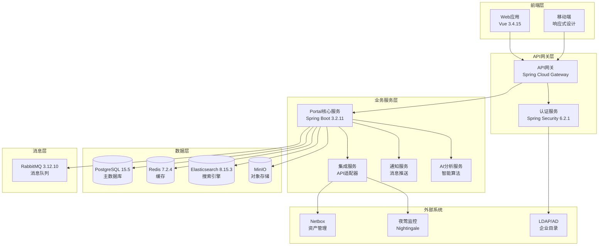
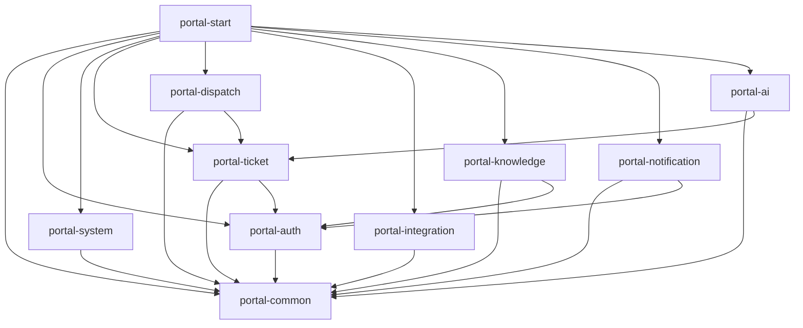
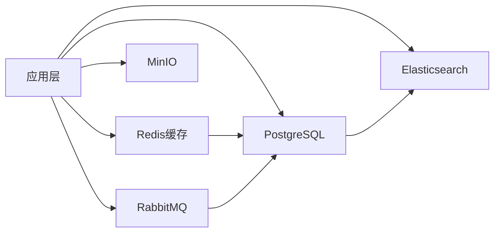
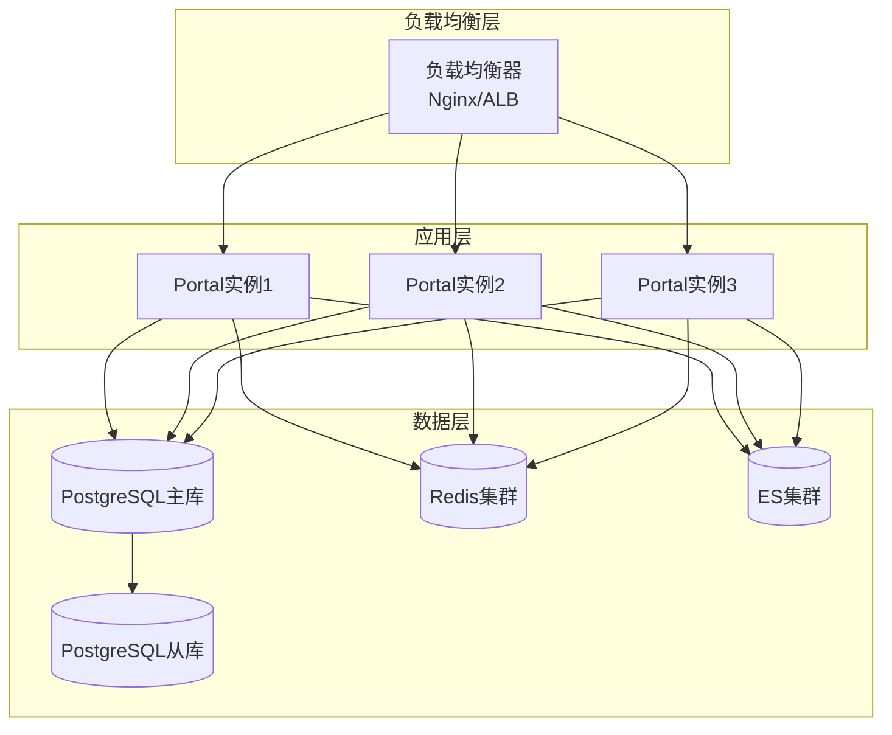
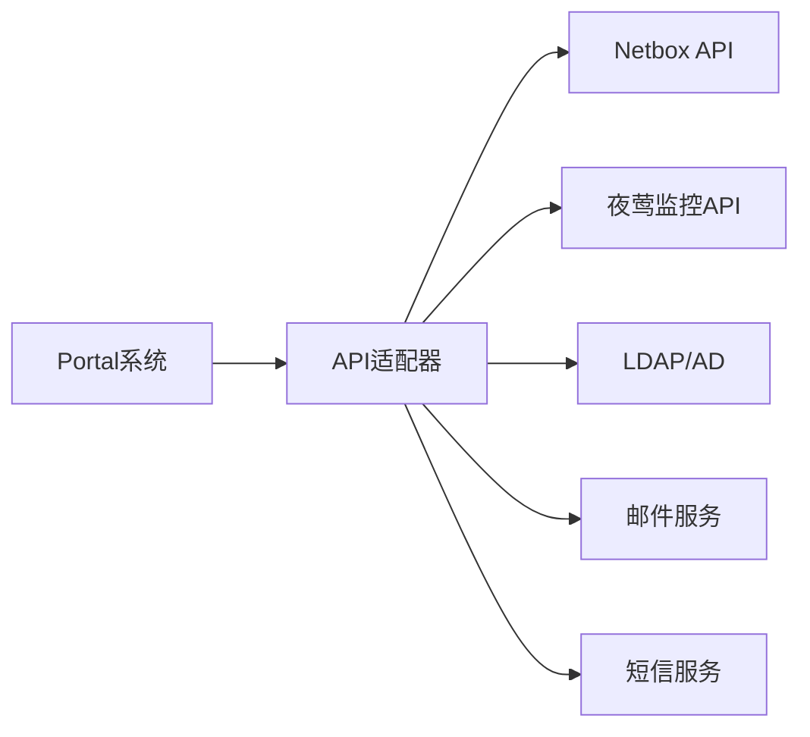

# IT运维门户系统架构设计

## 📋 架构概述

IT运维门户系统采用现代化的微服务架构，基于Spring Boot 3.2.11 + Vue 3.4.15技术栈，支持多租户、高可用、可扩展的企业级运维服务平台。

**架构版本**: v2.0  
**更新日期**: 2025-01-09  
**技术栈**: 参考 [TECH_STACK.md](TECH_STACK.md)

## 🏗️ 整体架构

### 系统架构图



## 🎯 架构特性

### 核心设计原则

| 原则 | 描述 | 实现方式 |
|------|------|----------|
| **微服务化** | 按业务功能拆分服务 | Maven多模块架构 |
| **多租户** | 数据隔离和权限隔离 | 租户ID + RBAC权限 |
| **高可用** | 服务无单点故障 | 集群部署 + 负载均衡 |
| **可扩展** | 水平扩展能力 | 无状态服务设计 |
| **安全性** | 全方位安全保障 | 认证授权 + 数据加密 |

### 技术架构优势

- ✅ **现代化技术栈**: Spring Boot 3.2 LTS + Vue 3.4稳定版本
- ✅ **容器化部署**: Docker + Colima，支持云原生部署
- ✅ **API优先设计**: RESTful API + OpenAPI 3规范
- ✅ **数据一致性**: 事务管理 + 分布式锁
- ✅ **性能优化**: 多级缓存 + 数据库优化

## 📦 模块架构

### Maven模块结构

```
ops-portal/
├── portal-common/       # 公共模块
│   ├── 工具类和常量
│   ├── 基础实体类
│   ├── 通用配置
│   └── 异常处理
├── portal-auth/         # 认证与权限
│   ├── JWT Token管理
│   ├── RBAC权限控制
│   ├── 多租户认证
│   └── 外部认证集成
├── portal-system/       # 系统管理
│   ├── 用户管理
│   ├── 角色权限
│   ├── 部门组织
│   └── 系统配置
├── portal-ticket/       # 工单管理
│   ├── 工单CRUD
│   ├── 状态流转
│   ├── 协作功能
│   └── SLA监控
├── portal-dispatch/     # 智能派单
│   ├── 派单算法
│   ├── 工程师匹配
│   ├── 负载均衡
│   └── 规则引擎
├── portal-integration/  # 系统集成
│   ├── API适配器
│   ├── 数据同步
│   ├── 第三方认证
│   └── 错误处理
├── portal-knowledge/    # 知识库
│   ├── 文档管理
│   ├── 全文搜索
│   ├── 版本控制
│   └── 权限管理
├── portal-notification/ # 通知系统
│   ├── 消息推送
│   ├── 邮件发送
│   ├── 短信通知
│   └── 模板管理
├── portal-ai/           # AI功能
│   ├── 智能分析
│   ├── 预测算法
│   ├── 自然语言处理
│   └── 机器学习
└── portal-start/        # 主应用
    ├── 启动类
    ├── 全局配置
    ├── 依赖管理
    └── Web服务
```

### 模块依赖关系



## 🔐 安全架构

### 认证授权体系


### 安全层级

| 层级 | 安全措施 | 实现方式 |
|------|----------|----------|
| **网络层** | HTTPS + VPN | TLS 1.3 + IPSec |
| **应用层** | 认证授权 | JWT + RBAC |
| **数据层** | 加密存储 | AES-256 + 字段加密 |
| **传输层** | 数据脱敏 | 敏感信息过滤 |

### 多租户安全

- **数据隔离**: 基于tenant_id的行级安全
- **权限隔离**: 租户级别的角色权限管理
- **资源隔离**: 租户独立的配置和资源
- **审计隔离**: 独立的操作日志和审计

## 📊 数据架构

### 数据库设计

#### 主数据库 (PostgreSQL 15.5)
```sql
-- 核心业务数据
├── 用户认证数据 (users, roles, permissions)
├── 租户数据 (tenants, tenant_configs)
├── 工单数据 (tickets, ticket_comments)
├── 工程师数据 (engineers, skills)
├── 知识库数据 (knowledge_base, documents)
└── 系统配置数据 (system_configs, settings)
```

#### 缓存层 (Redis 7.2.4)
```yaml
缓存策略:
  - 用户会话: TTL 24小时
  - 权限信息: TTL 1小时
  - 系统配置: TTL 30分钟
  - 热点数据: TTL 5分钟
```

#### 搜索引擎 (Elasticsearch 8.15.3)
```yaml
索引设计:
  - 工单索引: 全文搜索 + 聚合分析
  - 知识库索引: 文档搜索 + 相关性排序
  - 日志索引: 操作审计 + 统计分析
```

### 数据流架构



## 🚀 部署架构

### 容器化部署

#### 推荐方案: Colima + Docker
```yaml
开发环境:
  容器运行时: Colima 0.6.6
  容器工具: Docker CLI 24.0.7
  编排工具: Docker Compose 2.23.3
  
生产环境:
  容器平台: Kubernetes 1.28+
  服务网格: Istio 1.19+
  监控: Prometheus + Grafana
```

#### 服务部署拓扑


### 环境配置

#### 开发环境
```yaml
资源配置:
  CPU: 4核心
  内存: 8GB
  存储: 100GB
  
服务配置:
  Portal: 1实例
  PostgreSQL: 单机版
  Redis: 单机版
  Elasticsearch: 单节点
```

#### 生产环境
```yaml
资源配置:
  CPU: 16核心
  内存: 32GB
  存储: 1TB SSD
  
服务配置:
  Portal: 3实例 (高可用)
  PostgreSQL: 主从复制
  Redis: 3节点集群
  Elasticsearch: 3节点集群
```

## 📈 性能架构

### 性能优化策略

| 层级 | 优化策略 | 具体措施 |
|------|----------|----------|
| **前端** | 资源优化 | 代码分割、懒加载、CDN |
| **网关** | 请求优化 | 连接池、缓存、压缩 |
| **应用** | 业务优化 | 异步处理、批量操作 |
| **数据** | 存储优化 | 索引优化、分区表 |

### 监控指标

```yaml
应用指标:
  - 响应时间: P95 < 200ms
  - 吞吐量: > 1000 QPS
  - 错误率: < 0.1%
  - 可用性: > 99.9%

资源指标:
  - CPU使用率: < 70%
  - 内存使用率: < 80%
  - 磁盘使用率: < 85%
  - 网络延迟: < 50ms
```

## 🔄 集成架构

### API集成模式



### 集成安全

- **API密钥管理**: 加密存储、定期轮换
- **访问控制**: IP白名单、权限验证
- **数据验证**: 输入校验、输出过滤
- **错误处理**: 重试机制、熔断保护

## 📝 架构演进

### 当前架构 (v2.0)
- 单体应用 + 模块化设计
- 容器化部署
- API集成方式

### 未来架构 (v3.0)
- 微服务架构
- 云原生部署
- 事件驱动架构
- 服务网格

---

**文档维护**: IT运维门户架构团队  
**最后更新**: 2025-01-09  
**下次审查**: 2025-04-09
