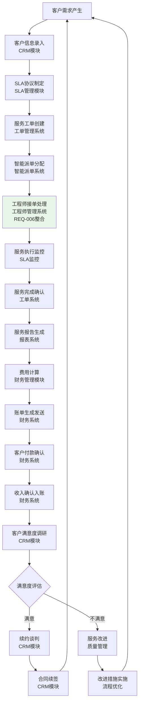
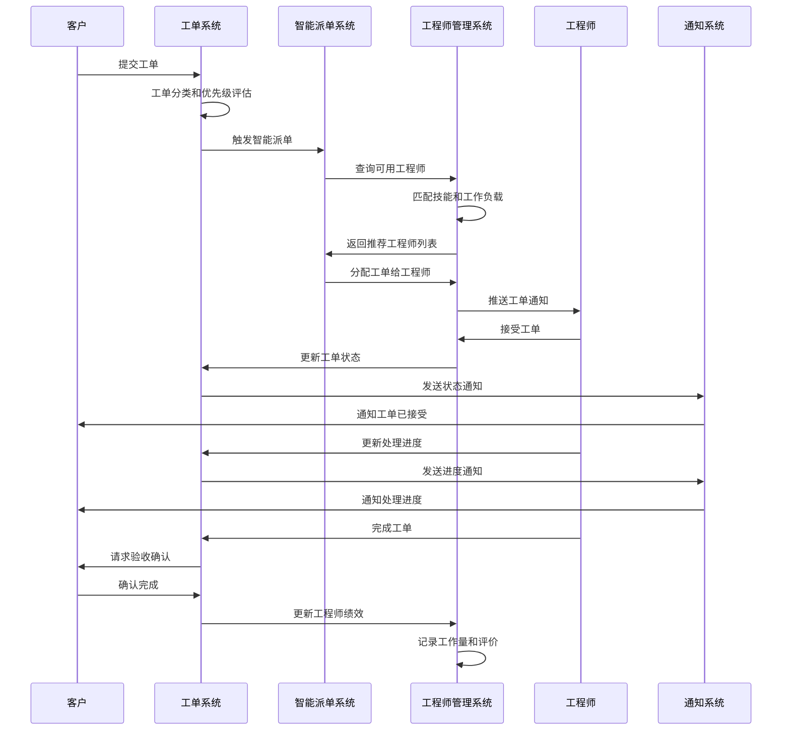
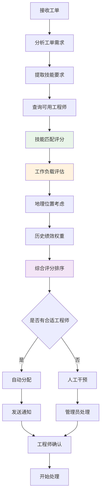
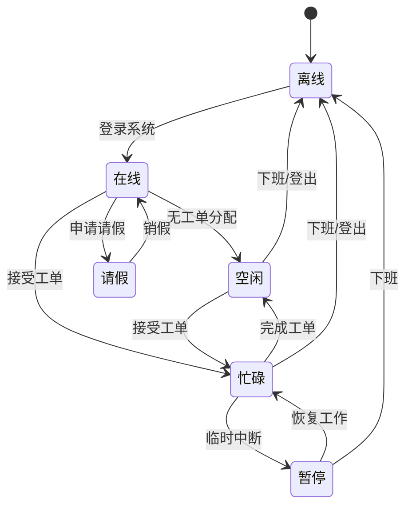
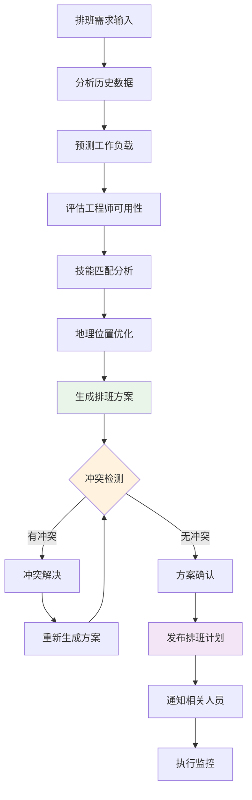
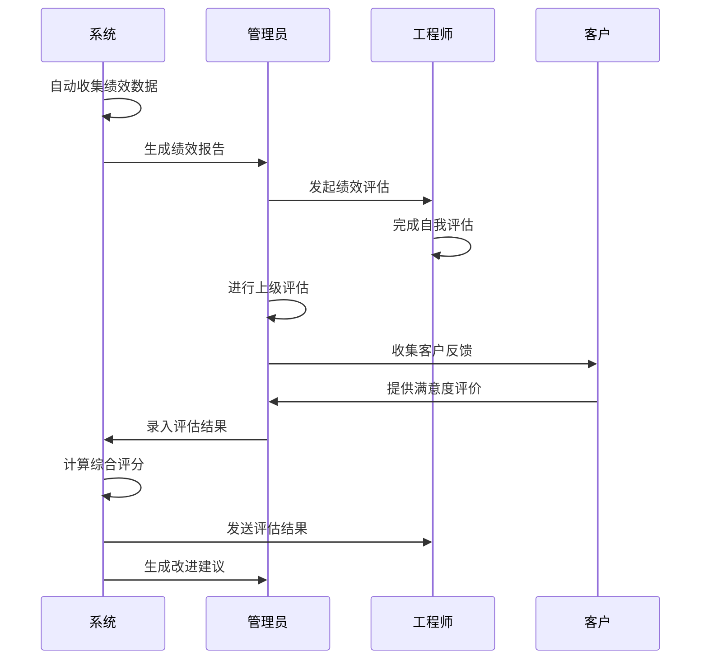

# IT运维门户系统产品需求文档（PRD）v4.5.1

## 1. 文档说明

### 文档信息
- **文档版本**：v4.5.1 Enhanced
- **创建日期**：2025年1月1日
- **最后更新**：2025年8月14日
- **文档类型**：产品需求文档（PRD）
- **适用范围**：IT运维门户系统完整产品设计
- **维护团队**：IT运维门户系统产品团队
- **目标读者**：产品经理、研发团队、测试团队、运维团队、业务决策者

### v4.5.1版本特点
本版本基于v4.5的技术细节完善和模块整合优化，形成更加完整和可实施的产品需求文档：

**核心特色：**
- **模块整合优化**：将REQ-006A（工程师基础管理）和REQ-006B（工程师高级管理）合并为统一的REQ-006（工程师管理）模块
- **技术实施增强**：补充完整的API接口设计、数据模型定义、性能安全要求
- **业务逻辑完善**：优化跨模块协作流程，明确数据交互接口和事件驱动机制
- **架构设计统一**：确保所有模块与全局架构设计的一致性和兼容性

**主要改进内容：**
- **P0级修复**：完善数据模型定义，补充API接口设计，明确跨模块集成方案
- **P1级增强**：详化绩效评估算法，完善排班业务规则，明确性能安全策略
- **P2级优化**：优化异常处理机制，增强用户体验设计，提升系统监控能力

### 术语表与缩略语解释

| 术语/缩略语 | 全称 | 定义 | 使用场景 |
|------------|------|------|----------|
| SLA | Service Level Agreement | 服务等级协议，定义服务质量标准 | 工单处理、客户管理 |
| RBAC | Role-Based Access Control | 基于角色的访问控制 | 权限管理、安全控制 |
| ABAC | Attribute-Based Access Control | 基于属性的访问控制 | 高级权限控制 |
| MFA | Multi-Factor Authentication | 多因子认证 | 用户登录、安全验证 |
| SSO | Single Sign-On | 单点登录 | 企业集成、用户体验 |
| MTTR | Mean Time To Recovery | 平均故障恢复时间 | 系统可用性指标 |
| MTBF | Mean Time Between Failures | 平均故障间隔时间 | 系统稳定性指标 |
| RTO | Recovery Time Objective | 恢复时间目标 | 灾备策略 |
| RPO | Recovery Point Objective | 恢复点目标 | 数据备份策略 |
| GDPR | General Data Protection Regulation | 通用数据保护条例 | 数据合规 |
| PIPL | Personal Information Protection Law | 个人信息保护法 | 数据合规 |
| CAC | Customer Acquisition Cost | 客户获取成本 | 商业指标 |
| LTV | Lifetime Value | 客户生命周期价值 | 商业指标 |
| NPS | Net Promoter Score | 净推荐值 | 客户满意度指标 |
| ARPU | Average Revenue Per User | 用户平均收入 | 收入指标 |
| MRR | Monthly Recurring Revenue | 月度经常性收入 | 收入指标 |

### 文档结构说明

本文档采用模块化结构设计，主要包含以下部分：

#### 1. 全局章节（globals/）
- **文档概览**：文档说明、版本信息、术语表
- **项目概览**：项目背景、目标、范围
- **业务逻辑架构**：整体架构设计和技术选型
- **业务流程**：核心业务流程和跨模块协作
- **模拟数据指南**：测试数据生成和管理规范
- **API业务域映射**：业务域与模块的映射关系

#### 2. 功能模块（modules/）
- **REQ-001 ~ REQ-023**：22个功能模块的详细需求（REQ-006A/B已合并为REQ-006）
- 每个模块包含完整的技术实现指导和验收标准

#### 3. 附录文档（appendix/）
- **附录A**：术语表与参考文档
- **附录B**：开发优先级与实施计划
- **附录C**：技术栈与架构选型
- **附录D**：模块映射与依赖关系
- **附录E**：架构图表与业务价值分析
- **附录F**：部署指南与运维手册

### 阅读指南

#### 不同角色的阅读建议
| 角色 | 重点章节 | 阅读目的 |
|------|----------|----------|
| **产品经理** | 全局章节 + 所有模块 | 全面了解产品需求和业务逻辑 |
| **技术负责人** | 业务逻辑架构 + 附录C/E/F | 技术架构设计和实施指导 |
| **开发工程师** | 具体模块 + 附录C/D | 功能开发和技术实现 |
| **测试工程师** | 具体模块 + 验收标准 | 测试用例设计和质量保证 |
| **运维工程师** | 附录F + 系统管理模块 | 部署运维和系统监控 |
| **业务决策者** | 项目概览 + 附录E | 商业价值和投资回报 |

#### 术语一致性说明
本文档中的术语定义以**附录A《术语表与参考文档》**为准。如发现术语使用不一致，请以附录A为标准。

### v4.5.1版本兼容性说明
- **向后兼容**：与v4.5版本保持API和数据结构的向后兼容性
- **模块整合**：REQ-006A和REQ-006B的功能完全保留，仅在组织结构上进行合并
- **技术栈一致**：继续使用Java 17 + Spring Boot 3.2.11 + Vue 3.4.15技术栈
- **数据迁移**：提供完整的数据迁移方案，确保平滑升级


## 2. 项目概述

### 2.1 背景与机遇

#### 市场背景分析
随着数字化转型的深入推进，企业对IT运维服务的需求呈现爆发式增长。当前市场面临的核心挑战包括：

- **服务分散化痛点**：企业平均使用15-20个不同的运维工具，缺乏统一管理平台，导致信息孤岛和效率低下
- **响应效率低下**：传统人工派单模式下，平均响应时间超过2小时，远超客户期望的30分钟内响应
- **知识管理缺失**：运维经验难以沉淀和复用，新员工培训周期长达3-6个月
- **成本控制困难**：缺乏精确的成本核算体系，运维成本占IT预算的40-60%，远高于行业最佳实践的25-30%
- **客户体验不佳**：服务透明度低，客户满意度普遍低于70%，影响续约率

#### 商业机遇评估
- **市场规模巨大**：中国IT运维服务市场规模超过1000亿元，年增长率15%+，预计2027年将达到1800亿元
- **政策环境有利**：数字化转型政策推动，政府采购需求旺盛，"新基建"投资为运维服务提供增长动力
- **技术条件成熟**：AI、云计算、大数据等技术为智能运维提供坚实技术基础
- **客户需求明确**：企业对统一运维平台需求强烈，付费意愿高，愿意为效率提升支付溢价

### 2.2 核心目标

#### 产品愿景
成为中国领先的智能化IT运维服务平台，通过"一套系统服务多个客户"的SaaS模式，为企业提供高效、智能、可靠的运维管理解决方案，实现"让运维更简单，让服务更智能"的使命。

#### 核心目标体系
- **统一入口目标**：整合分散的运维工具，提供一站式访问体验，减少工具切换成本80%以上
- **智能运维目标**：基于AI的智能派单、故障预测和知识推荐，提升运维效率40%以上
- **多租户服务目标**：支持一个运维团队服务多个客户单位的业务模式，实现规模化运营
- **效率提升目标**：自动化工单流转，优化知识共享，减少人工干预60%以上
- **数据互联目标**：通过统一认证和数据存储，打通各系统数据壁垒，实现数据驱动决策

### 2.3 商业模式

#### "三快一低"价值承诺
- **发现快**：秒级故障发现（监控系统响应时间<3秒）
  - 实现方式：实时监控 + 智能告警 + 自动化检测
  - 客户价值：减少故障影响时间，降低业务损失
- **定位快**：分钟级故障定位（平均故障定位时间<5分钟）
  - 实现方式：AI辅助诊断 + 知识库匹配 + 专家经验
  - 客户价值：快速找到问题根因，避免盲目排查
- **解决快**：小时级故障解决（平均解决时间<2小时）
  - 实现方式：智能派单 + 标准化流程 + 远程协作
  - 客户价值：最小化业务中断时间，保障业务连续性
- **成本低**：运维成本降低50%以上（通过自动化和智能派单）
  - 实现方式：自动化运维 + 资源优化 + 效率提升
  - 客户价值：显著降低运维投入，提高ROI

#### 收费模式设计
基于SaaS订阅模式，提供灵活的套餐选择以满足不同规模客户需求：

- **基础版**：3000元/月/租户（≤50用户，基础功能）
  - 包含：工单管理、基础派单、简单报表
  - 适用：小型企业、初创公司
- **专业版**：6000元/月/租户（≤200用户，含智能派单）
  - 包含：基础版 + 智能派单 + 知识库 + SLA管理
  - 适用：中型企业、成长型公司
- **企业版**：8000元/月/租户（无限用户，含AI分析）
  - 包含：专业版 + AI分析 + 高级报表 + API集成
  - 适用：大型企业、集团公司
- **增值服务**：按需收费
  - 工单处理费：5元/工单（超出套餐包含量）
  - SLA保障服务费：基础费用的20-50%
  - 定制开发：按工时收费

### 2.4 目标客户

#### 主要客户群体分析
- **政府部门**：需要合规性强、安全性高的运维管理平台
  - 特点：预算充足，决策周期长，重视合规和安全
  - 需求：等保合规、审计追溯、多级权限管理
- **中小企业**：需要成本可控、易于使用的运维解决方案
  - 特点：成本敏感，快速决策，重视性价比
  - 需求：快速部署、简单易用、成本透明
- **连锁店IT部门**：需要标准化、可复制的运维管理模式
  - 特点：标准化需求强，分布式管理，重视效率
  - 需求：统一管理、标准流程、远程支持

#### 客户画像详细分析

| 客户类型 | 规模特征 | 核心需求 | 付费能力 | ROI预期 | 决策周期 | 关键决策因素 |
|---------|---------|----------|----------|---------|----------|-------------|
| 政府部门 | 100-500人 | 合规性、安全性 | 高 | 160% | 6-12个月 | 合规认证、安全等级 |
| 中小企业 | 50-200人 | 成本控制、效率 | 中 | 250% | 1-3个月 | 性价比、实施周期 |
| 连锁店 | 20-100人 | 标准化、易用性 | 中 | 150% | 2-6个月 | 标准化程度、管理便利性 |

### 2.5 项目范围与边界

#### 项目范围定义
**包含范围：**
- IT运维服务全流程管理（工单、派单、处理、验收）
- 多租户SaaS平台架构和基础设施
- 智能化功能（AI派单、故障预测、知识推荐）
- 客户关系管理和财务管理功能
- 移动端应用和第三方系统集成
- 完整的用户权限和安全管理体系
- 统一的工程师管理体系（基础管理+高级管理一体化）

**不包含范围：**
- 具体的运维工具开发（如监控软件、备份工具等）
- 客户现有系统的数据迁移服务
- 硬件设备的采购和维护
- 客户现场的运维人员培训服务
- 第三方软件的许可证费用

#### 技术边界
- **前端技术**：仅支持现代浏览器（Chrome 90+, Firefox 88+, Safari 14+）
- **移动端**：支持iOS 13+和Android 8+
- **集成范围**：提供标准API，不负责第三方系统的适配开发
- **数据范围**：仅处理运维相关数据，不涉及客户业务数据

### 2.6 成功指标与验收标准

#### 业务成功指标
| 指标类别 | 具体指标 | 目标值 | 测量方法 | 达成时间 |
|----------|----------|--------|----------|----------|
| **用户增长** | 注册租户数 | 100+ | 系统统计 | 6个月 |
| **用户活跃** | 月活跃用户数 | 80%+ | 用户行为分析 | 3个月 |
| **收入指标** | 月度经常性收入 | 50万+ | 财务系统 | 12个月 |
| **客户满意** | 客户满意度 | 90%+ | 客户调研 | 6个月 |
| **运营效率** | 工单处理效率提升 | 40%+ | 系统对比分析 | 3个月 |

#### 技术成功指标
| 指标类别 | 具体指标 | 目标值 | 测量方法 | 达成时间 |
|----------|----------|--------|----------|----------|
| **系统性能** | API响应时间 | <200ms | 性能监控 | 上线时 |
| **系统稳定** | 系统可用性 | 99.5%+ | 监控系统 | 持续 |
| **安全性** | 安全漏洞数 | 0个高危 | 安全扫描 | 持续 |
| **扩展性** | 并发用户数 | 1000+ | 压力测试 | 上线前 |

### 2.7 风险评估与应对策略

#### 主要风险识别
| 风险类别 | 风险描述 | 影响程度 | 发生概率 | 应对策略 |
|----------|----------|----------|----------|----------|
| **技术风险** | AI算法效果不达预期 | 高 | 中 | 分阶段验证，准备备选方案 |
| **市场风险** | 竞争对手推出类似产品 | 中 | 高 | 加快开发进度，强化差异化 |
| **资源风险** | 关键技术人员流失 | 高 | 低 | 知识文档化，团队备份 |
| **合规风险** | 数据安全法规变化 | 中 | 中 | 持续关注法规，预留合规空间 |
| **客户风险** | 客户需求变化过快 | 中 | 中 | 敏捷开发，快速响应 |
| **模块整合风险** | 工程师管理模块整合复杂度 | 中 | 低 | 渐进式迁移，保持向后兼容 |

#### 风险应对措施
- **技术风险缓解**：建立技术评审机制，定期进行技术可行性验证
- **市场风险应对**：持续市场调研，建立快速响应机制
- **资源风险管控**：建立人才梯队，完善知识管理体系
- **合规风险防范**：建立合规检查机制，定期进行安全审计
- **模块整合风险控制**：制定详细的迁移计划，确保数据完整性和业务连续性

### 2.8 v4.5.1版本特别说明

#### 工程师管理模块整合
- **整合背景**：将REQ-006A（工程师基础管理）和REQ-006B（工程师高级管理）合并为统一的REQ-006（工程师管理）
- **整合优势**：减少模块间依赖复杂度，提升业务流程连贯性，简化API设计和数据模型
- **功能保留**：原有所有功能完全保留，仅在组织结构上进行优化
- **技术影响**：API接口保持向后兼容，数据模型统一优化，性能和安全要求统一提升

#### 技术架构优化
- **数据模型统一**：工程师相关数据表结构优化，提升查询性能和数据一致性
- **API设计规范化**：统一错误处理机制，完善请求/响应格式，提供详细的接口文档
- **性能安全增强**：明确量化性能指标，完善数据加密和权限控制方案
- **异常处理完善**：建立完整的异常处理体系，提供自动恢复机制

参考：详细的技术架构和实施计划见后续章节和附录文档。


## 3. 业务逻辑架构

### 3.1 整体架构设计

#### 系统架构概览
IT运维门户系统采用现代化的微服务架构设计，基于Spring Boot 3.2.11和Vue.js 3.4.15技术栈，支持多租户SaaS模式，具备高可用、高性能、高安全性的特点。

系统架构遵循领域驱动设计（DDD）原则，确保业务逻辑清晰、模块边界明确。v4.5.1版本特别优化了工程师管理模块的架构设计，将原有的基础管理和高级管理功能整合为统一的业务域。

#### 架构分层设计
```
┌─────────────────────────────────────────────────────────────┐
│                    用户接入层                                │
├─────────────────────────────────────────────────────────────┤
│  Web前端(Vue3)  │  移动端(Flutter)  │  API接口(RESTful)    │
├─────────────────────────────────────────────────────────────┤
│                    网关与安全层                              │
├─────────────────────────────────────────────────────────────┤
│  API网关(Nginx)  │  认证授权(JWT)  │  限流熔断(Sentinel)   │
├─────────────────────────────────────────────────────────────┤
│                    业务应用层                                │
├─────────────────────────────────────────────────────────────┤
│  工单管理  │  智能派单  │  工程师管理  │  客户管理  │  ...   │
│                    (REQ-006整合)                            │
├─────────────────────────────────────────────────────────────┤
│                    数据服务层                                │
├─────────────────────────────────────────────────────────────┤
│  PostgreSQL  │  Redis  │  Elasticsearch  │  MinIO  │  MQ    │
├─────────────────────────────────────────────────────────────┤
│                    基础设施层                                │
└─────────────────────────────────────────────────────────────┘
│  Docker容器  │  Kubernetes  │  监控告警  │  日志收集        │
└─────────────────────────────────────────────────────────────┘
```

#### 核心业务闭环


### 3.2 技术栈选型

#### 后端技术栈
| 技术组件 | 版本 | 选型理由 | 应用场景 |
|----------|------|----------|----------|
| **Java** | OpenJDK 17 LTS | 长期支持版本，性能优异，生态成熟 | 核心业务逻辑开发 |
| **Spring Boot** | 3.2.11 | 快速开发，自动配置，微服务友好 | 应用框架 |
| **Spring Security** | 6.2.1 | 安全框架标准，功能完善 | 认证授权 |
| **Spring Data JPA** | 3.2.x | ORM标准，开发效率高 | 数据访问层 |
| **PostgreSQL** | 15.5 | 开源关系数据库，功能强大，支持JSON | 主数据存储 |
| **Redis** | 7.2.4 | 高性能缓存，支持多种数据结构 | 缓存和会话存储 |
| **Elasticsearch** | 8.15.3 | 全文搜索引擎，日志分析 | 搜索和日志存储 |
| **RabbitMQ** | 3.12.10 | 消息队列，支持多种消息模式 | 异步消息处理 |
| **MinIO** | RELEASE.2024-01-01T16-36-33Z | 对象存储，S3兼容 | 文件存储 |

#### 前端技术栈
| 技术组件 | 版本 | 选型理由 | 应用场景 |
|----------|------|----------|----------|
| **Vue.js** | 3.4.15 | 组合式API，性能优异，生态丰富 | 前端框架 |
| **Vite** | 5.0.12 | 快速构建工具，开发体验好 | 构建工具 |
| **Element Plus** | 2.4.4 | 企业级UI组件库，功能完整 | UI组件库 |
| **Pinia** | 2.1.7 | Vue3状态管理，TypeScript友好 | 状态管理 |
| **Vue Router** | 4.2.5 | 官方路由库，功能完善 | 路由管理 |
| **Axios** | 1.6.2 | HTTP客户端，拦截器支持 | API调用 |

#### 基础设施技术栈
| 技术组件 | 版本 | 选型理由 | 应用场景 |
|----------|------|----------|----------|
| **Docker** | 24.0.7 | 容器化部署，环境一致性 | 应用容器化 |
| **Docker Compose** | 2.23.3 | 多容器编排，开发环境 | 本地开发部署 |
| **Nginx** | 1.25.3 | 高性能Web服务器，负载均衡 | 反向代理 |
| **Prometheus** | 2.45.0 | 监控指标收集，告警规则 | 系统监控 |
| **Grafana** | 10.0.0 | 监控数据可视化 | 监控面板 |

### 3.3 核心设计原则

#### 架构设计原则
这些原则指导整个系统的设计和开发过程，确保系统的可维护性和可扩展性：

- **单一职责原则**：每个模块只负责一个业务领域，避免功能耦合
- **开放封闭原则**：对扩展开放，对修改封闭，通过接口和抽象实现
- **依赖倒置原则**：高层模块不依赖低层模块，都依赖于抽象
- **接口隔离原则**：使用多个专门的接口，而不是单一的总接口
- **最小知识原则**：模块间只通过必要的接口进行交互
- **模块整合原则**：相关功能统一管理，减少跨模块依赖复杂度

#### 数据设计原则
- **多租户隔离**：所有业务数据表必须包含tenant_id字段，确保数据隔离
- **软删除策略**：重要数据采用软删除，保留deleted_at字段
- **审计追踪**：关键操作记录created_at、updated_at、created_by、updated_by
- **数据加密**：敏感数据（身份证、手机号等）采用AES-256加密存储
- **索引优化**：基于查询模式设计合理的数据库索引
- **数据一致性**：工程师管理相关数据统一存储，保证事务一致性

#### API设计原则
- **RESTful规范**：遵循REST架构风格，使用标准HTTP方法
- **统一响应格式**：所有API返回统一的Result<T>格式
- **版本管理**：API路径包含版本号（/api/v1/），支持向后兼容
- **错误处理**：统一的错误码和错误信息格式
- **文档完整**：使用OpenAPI 3.0规范，自动生成API文档
- **接口整合**：工程师管理相关API统一设计，减少接口碎片化
### 3.4 安全架构设计

#### 认证授权体系
安全是多租户SaaS系统的核心要求，我们采用多层安全防护策略：

- **认证机制**：JWT Token + Refresh Token双令牌机制
- **授权模型**：RBAC（基于角色）+ ABAC（基于属性）混合模型
- **多因子认证**：支持短信验证码、邮箱验证、TOTP等多种方式
- **单点登录**：支持SAML 2.0和OAuth 2.0协议
- **会话管理**：Redis存储会话信息，支持分布式会话

#### 数据安全策略
- **传输加密**：全站HTTPS，TLS 1.3协议
- **存储加密**：敏感数据AES-256加密，密钥分离存储
- **访问控制**：基于租户的数据隔离，行级安全策略
- **审计日志**：完整的操作审计日志，支持合规要求
- **备份安全**：数据备份加密存储，异地容灾
- **工程师数据保护**：工程师个人信息特殊加密保护，符合隐私法规

#### 应用安全防护
- **输入验证**：所有用户输入进行严格验证和过滤
- **SQL注入防护**：使用参数化查询，ORM框架防护
- **XSS防护**：输出编码，CSP策略，安全头设置
- **CSRF防护**：CSRF Token验证，SameSite Cookie
- **限流防护**：API限流，防止恶意攻击和资源滥用

### 3.5 性能架构设计

#### 缓存策略
多层缓存架构确保系统高性能和低延迟：

- **浏览器缓存**：静态资源缓存，减少网络请求
- **CDN缓存**：全球内容分发，加速静态资源访问
- **应用缓存**：Redis缓存热点数据，提升查询性能
- **数据库缓存**：查询结果缓存，减少数据库压力
- **缓存更新策略**：Cache-Aside模式，保证数据一致性
- **工程师数据缓存**：工程师状态、技能等热点数据重点缓存

#### 数据库优化
- **读写分离**：主从复制，读操作分流到从库
- **分库分表**：按租户分库，大表水平分片
- **索引优化**：基于查询模式设计复合索引
- **连接池管理**：HikariCP连接池，优化连接复用
- **慢查询监控**：监控慢查询，及时优化SQL
- **工程师数据优化**：工程师相关表特殊优化，支持高频查询

#### 应用性能优化
- **异步处理**：消息队列处理耗时操作
- **批量操作**：批量插入、更新，减少数据库交互
- **懒加载**：按需加载数据，减少内存占用
- **压缩传输**：Gzip压缩，减少网络传输
- **CDN加速**：静态资源CDN分发，提升访问速度

### 3.6 可扩展性设计

#### 水平扩展能力
- **无状态设计**：应用服务无状态，支持水平扩展
- **负载均衡**：Nginx负载均衡，支持多实例部署
- **数据库扩展**：支持读写分离、分库分表
- **缓存集群**：Redis集群模式，支持数据分片
- **消息队列集群**：RabbitMQ集群，保证高可用

#### 模块化架构
- **微服务架构**：按业务域拆分服务，独立部署
- **API网关**：统一入口，路由转发，协议转换
- **服务发现**：自动服务注册和发现
- **配置中心**：集中配置管理，动态配置更新
- **链路追踪**：分布式链路追踪，性能监控
- **工程师服务独立**：工程师管理作为独立服务，支持独立扩展

### 3.7 监控与运维

#### 监控体系
完善的监控体系确保系统稳定运行和快速故障定位：

- **基础监控**：CPU、内存、磁盘、网络等基础指标
- **应用监控**：JVM指标、接口响应时间、错误率等
- **业务监控**：工单处理量、用户活跃度等业务指标
- **日志监控**：ELK Stack日志收集、分析、告警
- **链路监控**：分布式链路追踪，性能瓶颈分析
- **工程师服务监控**：工程师状态变更、排班冲突等专项监控

#### 告警机制
- **多级告警**：信息、警告、严重、紧急四级告警
- **多渠道通知**：邮件、短信、钉钉、电话等通知方式
- **告警收敛**：避免告警风暴，智能告警聚合
- **自动恢复**：部分故障支持自动恢复机制
- **值班机制**：7x24小时值班，快速响应

#### 运维自动化
- **自动部署**：CI/CD流水线，自动化部署
- **健康检查**：应用健康检查，自动重启
- **扩缩容**：基于指标的自动扩缩容
- **备份恢复**：自动化数据备份和恢复
- **故障自愈**：常见故障自动修复

### 3.8 v4.5.1架构优化

#### 工程师管理模块架构整合
- **服务整合**：将工程师基础管理和高级管理服务合并为统一的工程师服务
- **数据模型统一**：优化工程师相关数据表结构，减少表间关联复杂度
- **API接口整合**：统一工程师管理相关API设计，提供一致的接口体验
- **缓存策略优化**：工程师数据缓存策略统一设计，提升查询性能

#### 跨模块协作优化
- **事件驱动架构**：工程师状态变更通过事件通知相关模块
- **数据一致性保证**：通过分布式事务确保跨模块数据一致性
- **接口标准化**：统一跨模块调用接口，减少集成复杂度
- **性能优化**：减少跨模块调用次数，提升整体系统性能

参考：详细的技术实现和部署指南见附录C《技术栈与架构选型》和附录F《部署指南与运维手册》。

## 4. 业务流程

### 4.1 核心业务流程

#### 工单处理流程（含工程师管理整合）


#### 智能派单算法流程

### 4.2 工程师管理业务流程（v4.5.1整合）

#### 工程师状态管理流程


#### 智能排班流程


#### 绩效评估流程


### 4.3 跨模块协作流程

#### 工单-派单-工程师协作流程


### 4.4 多租户隔离规则

#### 数据隔离规则
- **强制隔离**：所有业务数据表必须包含tenant_id字段，确保数据隔离
- **访问控制**：用户只能访问所属租户的数据
- **API隔离**：所有API请求必须验证租户权限
- **存储隔离**：文件存储按租户分目录管理

#### 权限隔离规则
- **角色隔离**：角色权限限制在租户范围内
- **功能隔离**：租户只能使用已购买的功能模块
- **配置隔离**：系统配置按租户独立管理

#### 安全隔离规则
- **网络隔离**：租户间网络访问完全隔离
- **日志隔离**：操作日志按租户分别记录和存储
- **备份隔离**：数据备份按租户独立管理
- **监控隔离**：系统监控数据按租户分别统计

## 5. 模拟数据指南

### 5.1 数据生成原则

#### 真实性原则
- **业务场景真实**：模拟数据应反映真实的业务场景和用户行为
- **数据关联合理**：各实体间的关联关系应符合业务逻辑
- **时间序列合理**：时间相关数据应符合实际业务时序
- **数量级合理**：数据量应接近生产环境的实际规模

#### 多样性原则
- **用户角色多样**：覆盖所有用户角色和权限级别
- **业务场景多样**：包含正常、异常、边界等各种业务场景
- **数据类型多样**：包含文本、数字、日期、文件等各种数据类型
- **租户规模多样**：小、中、大型租户的不同数据特征

#### 安全性原则
- **敏感数据脱敏**：个人信息、联系方式等敏感数据必须脱敏处理
- **数据隔离**：不同租户的模拟数据完全隔离
- **访问控制**：模拟数据的访问权限严格控制
- **定期清理**：测试完成后及时清理模拟数据

### 5.2 核心实体数据模板

#### 租户数据模板
```json
{
  "tenant_id": "T001",
  "tenant_name": "示例科技有限公司",
  "tenant_type": "enterprise",
  "industry": "信息技术",
  "scale": "medium",
  "contact_person": "张经理",
  "contact_phone": "138****8888",
  "contact_email": "zhang@example.com",
  "address": "北京市朝阳区示例大厦",
  "subscription_plan": "professional",
  "subscription_start": "2024-01-01",
  "subscription_end": "2024-12-31",
  "status": "active"
}
```

#### 工程师数据模板（v4.5.1整合）
```json
{
  "engineer_id": "E001",
  "tenant_id": "T001",
  "employee_no": "EMP001",
  "real_name": "李工程师",
  "gender": 1,
  "phone": "139****9999",
  "email": "li.engineer@example.com",
  "department": "运维部",
  "position": "高级运维工程师",
  "level": 3,
  "hire_date": "2023-01-15",
  "skills": [
    {"skill_code": "linux", "level": 4, "experience_years": 5},
    {"skill_code": "docker", "level": 3, "experience_years": 3}
  ],
  "current_workload": 75,
  "online_status": "online",
  "work_location": "北京",
  "performance_score": 85.5
}
```
#### 工单数据模板
```json
{
  "ticket_id": "TK202401001",
  "tenant_id": "T001",
  "customer_id": "C001",
  "title": "服务器响应缓慢问题",
  "description": "生产环境Web服务器响应时间超过5秒",
  "category": "performance",
  "priority": "high",
  "status": "assigned",
  "assigned_engineer": "E001",
  "created_at": "2024-01-15T09:00:00Z",
  "sla_deadline": "2024-01-15T17:00:00Z",
  "estimated_hours": 4,
  "actual_hours": 0,
  "tags": ["server", "performance", "web"]
}
```

### 5.3 数据生成规则

#### 时间序列数据规则
- **工单创建时间**：工作日9:00-18:00占70%，其他时间占30%
- **响应时间**：符合SLA要求，紧急工单15分钟内响应率≥95%
- **处理时间**：简单问题1-2小时，复杂问题4-8小时，疑难问题1-3天
- **绩效评估周期**：月度、季度、年度评估数据

#### 关联关系规则
- **租户-用户关系**：每个租户10-100个用户，角色分布合理
- **工程师-技能关系**：每个工程师3-8项技能，技能等级分布正常
- **工单-工程师关系**：技能匹配度≥80%，工作负载均衡
- **客户-工单关系**：活跃客户月均5-20个工单

## 6. API业务域映射

### 6.1 业务域划分

#### 核心业务域
| 业务域 | 模块映射 | API前缀 | 主要功能 |
|--------|----------|---------|----------|
| **认证授权** | REQ-001 | /api/v1/auth | 用户登录、权限验证、令牌管理 |
| **工单管理** | REQ-003 | /api/v1/tickets | 工单CRUD、状态流转、查询统计 |
| **智能派单** | REQ-004 | /api/v1/dispatch | 派单算法、工程师匹配、负载均衡 |
| **工程师管理** | REQ-006 | /api/v1/engineers | 档案管理、技能评估、绩效统计 |
| **客户管理** | REQ-016 | /api/v1/customers | 客户信息、合同管理、满意度调研 |

#### 支撑业务域
| 业务域 | 模块映射 | API前缀 | 主要功能 |
|--------|----------|---------|----------|
| **知识库** | REQ-005 | /api/v1/knowledge | 知识文档、搜索推荐、版本管理 |
| **通知消息** | REQ-011 | /api/v1/notifications | 消息推送、通知模板、订阅管理 |
| **财务管理** | REQ-018 | /api/v1/finance | 计费规则、账单生成、收支统计 |
| **系统管理** | REQ-010 | /api/v1/system | 系统配置、监控告警、日志管理 |

### 6.2 API设计规范

#### 统一响应格式
```json
{
  "code": 200,
  "message": "success",
  "data": {},
  "timestamp": "2024-01-15T10:00:00Z",
  "trace_id": "abc123def456"
}
```

#### 错误处理规范
```json
{
  "code": 400,
  "message": "参数验证失败",
  "errors": [
    {
      "field": "email",
      "message": "邮箱格式不正确"
    }
  ],
  "timestamp": "2024-01-15T10:00:00Z",
  "trace_id": "abc123def456"
}
```

## 7. 模块列表与优先级（v4.5.1更新）

### 7.1 P0级核心模块（必须实现）

| 模块编号 | 模块名称 | 业务价值 | 技术复杂度 | 开发周期 | 依赖关系 |
|----------|----------|----------|------------|----------|----------|
| REQ-001 | 基础架构与认证 | 极高 | 高 | 4周 | 无 |
| REQ-002 | 工作台与仪表板 | 高 | 中 | 3周 | REQ-001 |
| REQ-003 | 工单管理系统 | 极高 | 高 | 6周 | REQ-001, REQ-002 |
| REQ-004 | 智能派单系统 | 极高 | 高 | 5周 | REQ-001, REQ-003, REQ-006 |
| REQ-006 | 工程师管理 | 极高 | 高 | 8周 | REQ-001 |
| REQ-010 | 系统管理模块 | 高 | 中 | 4周 | REQ-001 |
| REQ-022 | 用户权限管理 | 极高 | 中 | 3周 | REQ-001 |

**注：REQ-006为v4.5.1版本整合后的统一工程师管理模块，包含原REQ-006A和REQ-006B的所有功能。**

### 7.2 P1级重要模块（优先实现）

| 模块编号 | 模块名称 | 业务价值 | 技术复杂度 | 开发周期 | 依赖关系 |
|----------|----------|----------|----------|----------|----------|
| REQ-005 | 知识库管理 | 高 | 中 | 4周 | REQ-001, REQ-003 |
| REQ-007 | 甲方管理与报表 | 高 | 中 | 3周 | REQ-001, REQ-003 |
| REQ-011 | 通知与消息 | 中 | 低 | 2周 | REQ-001 |
| REQ-012 | 系统集成 | 中 | 高 | 5周 | REQ-001 |
| REQ-016 | 客户关系管理 | 高 | 中 | 4周 | REQ-001 |
| REQ-017 | SLA管理 | 高 | 中 | 3周 | REQ-001, REQ-003 |
| REQ-018 | 财务管理 | 高 | 中 | 4周 | REQ-001, REQ-016 |

### 7.3 P2级扩展模块（后续实现）

| 模块编号 | 模块名称 | 业务价值 | 技术复杂度 | 开发周期 | 依赖关系 |
|----------|----------|----------|----------|----------|----------|
| REQ-008 | 系统设置 | 中 | 低 | 2周 | REQ-001 |
| REQ-009 | 运维管理 | 中 | 中 | 3周 | REQ-001, REQ-003 |
| REQ-013 | 智能分析与AI | 中 | 高 | 6周 | REQ-003, REQ-006 |
| REQ-014 | 工作流引擎 | 中 | 高 | 5周 | REQ-001, REQ-003 |
| REQ-015 | 用户体验增强 | 低 | 中 | 3周 | REQ-002 |
| REQ-019 | 客户自助服务 | 中 | 中 | 4周 | REQ-001, REQ-016 |
| REQ-020 | 移动端应用 | 中 | 中 | 4周 | REQ-001, REQ-003 |
| REQ-021 | 资源权限管理 | 中 | 中 | 3周 | REQ-001, REQ-022 |
| REQ-023 | 数据分析与报表 | 中 | 中 | 4周 | REQ-003, REQ-006 |

### 7.4 v4.5.1版本变更说明

#### 模块整合优化
- **REQ-006A（工程师基础管理）** + **REQ-006B（工程师高级管理）** → **REQ-006（工程师管理）**
- **整合优势**：减少模块间依赖复杂度，提升业务流程连贯性，简化API设计
- **功能保留**：原有所有功能完全保留，仅在组织结构上进行优化
- **开发周期调整**：整合后开发周期为8周，比原来两个模块分别开发节省2周时间

#### 依赖关系优化
- **简化依赖链**：减少跨模块调用，提升系统性能
- **接口统一**：工程师相关API统一设计，提供一致的接口体验
- **数据一致性**：工程师数据统一管理，避免数据不一致问题

## 8. 总结

### 8.1 文档价值

本全局上下文文档为IT运维门户系统v4.5.1版本提供了完整的业务和技术指导，主要价值包括：

- **统一认知**：为所有项目参与者提供统一的业务理解和技术认知
- **指导开发**：为开发团队提供详细的技术架构和实施指导
- **质量保证**：为测试团队提供完整的验收标准和质量要求
- **运维支撑**：为运维团队提供部署和监控的技术指南

### 8.2 关键特性

#### v4.5.1版本核心特性
- **模块整合优化**：工程师管理模块整合，提升系统架构合理性
- **技术栈统一**：基于Java 17 + Spring Boot 3.2.11 + Vue 3.4.15的现代化技术栈
- **多租户架构**：支持SaaS模式运营，实现规模化服务
- **智能化能力**：AI驱动的智能派单和知识推荐
- **安全合规**：完善的安全架构和数据保护机制

### 8.3 实施建议

#### 开发阶段建议
1. **P0模块优先**：优先实现核心业务模块，确保基本功能可用
2. **迭代开发**：采用敏捷开发模式，快速迭代，持续改进
3. **质量保证**：建立完善的代码审查和测试机制
4. **文档同步**：开发过程中及时更新技术文档

#### 部署运维建议
1. **容器化部署**：使用Docker容器化部署，提升部署效率
2. **监控完善**：建立完善的监控告警体系，确保系统稳定
3. **备份策略**：制定完善的数据备份和恢复策略
4. **安全加固**：定期进行安全评估和漏洞修复

参考：详细的实施计划见附录B《开发优先级与实施计划》，技术细节见附录C《技术栈与架构选型》。


