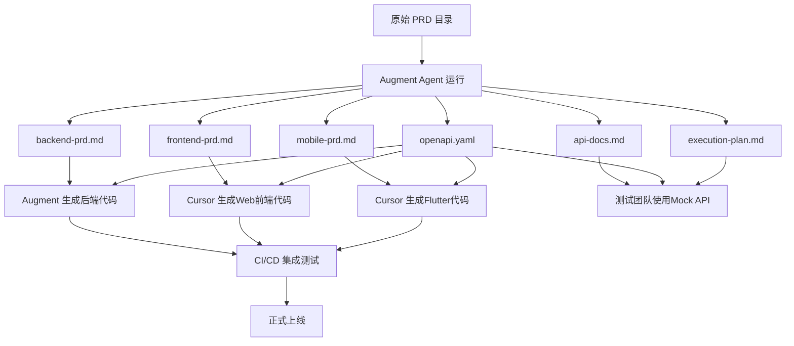

# IT运维门户系统 v4.5 - 开发交付文档包

## 📋 文档概览

本文档包是基于《IT运维门户系统_v4.5_PRD》生成的完整开发交付文档，包含后端、前端、移动端的详细开发需求、API规范和执行计划。

## 🎯 项目目标

构建一个基于SaaS模式的智能化IT运维服务平台，实现"一套系统服务多个客户"的多租户架构，为企业提供高效、智能、可靠的运维管理解决方案。

### 核心价值承诺："三快一低"
- **发现快**: 秒级故障发现（<3秒）
- **定位快**: 分钟级故障定位（<5分钟）  
- **解决快**: 小时级故障解决（<2小时）
- **成本低**: 运维成本降低50%以上

## 📁 文档结构

### 🔧 开发需求文档
| 文档名称 | 描述 | 目标团队 | 技术栈 |
|---------|------|----------|--------|
| [`backend-prd.md`](backend-prd.md) | 后端开发需求文档 | 后端开发团队 | Java 17 + Spring Boot 3.2.11 |
| [`frontend-prd.md`](frontend-prd.md) | Web前端开发需求文档 | 前端开发团队 | Vue 3.4.15 + Element Plus |
| [`mobile-prd.md`](mobile-prd.md) | Flutter移动端开发需求文档 | 移动端开发团队 | Flutter 3.13.0 + Dart 3.1.0 |

### 📊 API规范文档
| 文档名称 | 描述 | 用途 | 格式 |
|---------|------|------|------|
| [`api-docs.md`](api-docs.md) | Markdown格式API文档 | 开发参考、接口说明 | Markdown |
| [`openapi.yaml`](openapi.yaml) | OpenAPI 3.1规范文档 | Swagger导入、Mock测试 | YAML |

### 📅 项目管理文档
| 文档名称 | 描述 | 目标用户 |
|---------|------|----------|
| [`execution-plan.md`](execution-plan.md) | 项目执行计划 | 项目经理、技术负责人 |
| [`handoff-diagram.mmd`](handoff-diagram.mmd) | 交接流程图 | 全体团队成员 |

## 🏗️ 技术架构

### 后端技术栈
- **开发语言**: Java 17 LTS
- **应用框架**: Spring Boot 3.2.11
- **安全框架**: Spring Security 6.2.1  
- **数据访问**: Spring Data JPA 3.2.x
- **主数据库**: PostgreSQL 15.5
- **缓存数据库**: Redis 7.2.4
- **搜索引擎**: Elasticsearch 8.15.3
- **消息队列**: RabbitMQ 3.12.10
- **文件存储**: MinIO RELEASE.2024-01-01T16-36-33Z

### 前端技术栈
- **开发框架**: Vue 3.4.15 (Composition API)
- **构建工具**: Vite 5.0.12
- **UI组件库**: Element Plus 2.4.4
- **状态管理**: Pinia 2.1.7
- **路由管理**: Vue Router 4.2.5
- **HTTP客户端**: Axios 1.6.2
- **开发语言**: TypeScript 5.x

### 移动端技术栈
- **开发语言**: Dart 3.1.0
- **框架版本**: Flutter 3.13.0
- **UI设计**: Material Design 3 + Cupertino
- **状态管理**: Riverpod 2.4.0
- **路由管理**: GoRouter 10.0.0
- **本地存储**: Drift 2.12.0 (SQLite)
- **网络请求**: Dio 5.3.0

## 📦 模块架构

### P0 核心模块（第一阶段开发）
- **REQ-001**: 基础架构模块 - 多租户架构、统一认证、权限管理
- **REQ-002**: 工作台与仪表板 - 个性化工作空间、数据可视化
- **REQ-003**: 工单管理系统 - 工单全生命周期管理
- **REQ-004**: 智能派单系统 - AI算法自动派单
- **REQ-006A**: 工程师基础管理 - 工程师档案、技能管理
- **REQ-010**: 系统管理模块 - 系统配置、审计日志
- **REQ-022**: 用户与权限管理模块 - 身份认证、访问控制

### P1 重要模块（第二阶段开发）
- **REQ-005**: 知识库管理系统 - 知识沉淀与复用
- **REQ-006B**: 工程师高级管理 - 绩效分析、排班调度
- **REQ-007**: 甲方管理与报表系统 - 客户界面、服务报表
- **REQ-011**: 通知与消息系统 - 多渠道消息通知
- **REQ-012**: 系统集成模块 - 第三方系统集成
- **REQ-016**: 客户关系管理模块 - 客户全生命周期管理
- **REQ-017**: SLA管理模块 - 服务水平协议管理
- **REQ-018**: 财务管理模块 - 智能计费、财务分析

### P2 扩展模块（第三阶段开发）
- **REQ-008**: 系统设置 - 参数配置、业务规则
- **REQ-009**: 运维管理 - 系统监控、性能分析
- **REQ-013**: 智能分析与AI功能 - AI分析、故障预测
- **REQ-014**: 工作流引擎系统 - 业务流程建模与执行
- **REQ-015**: 用户体验增强系统 - 界面优化、个性化定制
- **REQ-019**: 客户自助服务模块 - 7x24小时自助服务
- **REQ-020**: 移动端应用模块 - 移动设备访问能力
- **REQ-021**: 资源权限管理模块 - 细粒度权限控制
- **REQ-023**: 数据分析与商业智能模块 - 深度数据分析、商业洞察

## 🚀 开发路线图

### 第一阶段（1-3个月）：P0核心模块
**目标**: 完成基础功能，系统可以正常使用
- 多租户架构搭建
- 用户认证权限管理
- 工单管理核心功能
- 智能派单基础算法
- 工程师基础管理
- 系统管理功能

**里程碑**: 
- 系统可用性≥99%
- API响应时间P95≤200ms
- 支持100+并发用户
- 工单处理效率提升40%

### 第二阶段（4-6个月）：P1重要模块
**目标**: 完成商业化功能，支持规模化运营
- 知识库管理系统
- 高级工程师管理
- 客户服务模块
- 通知消息系统
- 系统集成功能
- SLA和财务管理

**里程碑**:
- 支持1000+并发用户
- 知识库搜索响应≤1秒
- SLA达成率≥95%
- 客户满意度≥4.5分

### 第三阶段（7-12个月）：P2扩展模块
**目标**: 完成智能化功能，提升用户体验
- AI分析和故障预测
- 工作流引擎系统
- 用户体验增强
- 移动端功能完善
- 安全和数据分析

**里程碑**:
- 支持10000+并发用户
- 支持1000+租户
- AI预测准确率≥85%
- 系统安全等级达标

## 🔗 API概览

### 认证授权
- `POST /api/v1/auth/login` - 用户登录
- `GET /api/v1/auth/userinfo` - 获取用户信息
- `POST /api/v1/auth/refresh` - 刷新Token

### 工单管理
- `GET /api/v1/tickets` - 获取工单列表
- `POST /api/v1/tickets` - 创建工单
- `GET /api/v1/tickets/{id}` - 获取工单详情
- `PUT /api/v1/tickets/{id}/status` - 更新工单状态

### 智能派单
- `GET /api/v1/dispatch/pending` - 获取待派单列表
- `POST /api/v1/dispatch/auto` - 执行智能派单
- `POST /api/v1/dispatch/{id}/accept` - 接受派单

### 工程师管理
- `GET /api/v1/engineers` - 获取工程师列表
- `POST /api/v1/engineers` - 创建工程师
- `PUT /api/v1/engineers/{id}/status` - 更新工程师状态

> 完整API文档请参考 [`api-docs.md`](api-docs.md) 和 [`openapi.yaml`](openapi.yaml)

## 📊 交接流程



> 详细交接流程图请参考 [`handoff-diagram.mmd`](handoff-diagram.mmd)

## 🎯 成功指标

### 业务指标
- **用户增长**: 注册租户数100+（6个月）
- **用户活跃**: 月活跃用户数80%+（3个月）
- **收入指标**: 月度经常性收入50万+（12个月）
- **客户满意**: 客户满意度90%+（6个月）
- **运营效率**: 工单处理效率提升40%+（3个月）

### 技术指标
- **系统性能**: API响应时间P95≤200ms
- **系统稳定**: 系统可用性99.5%+
- **安全性**: 安全漏洞0个高危
- **扩展性**: 支持10000+并发用户

## 🛠️ 快速开始

### 1. 后端开发
```bash
# 克隆项目
git clone <repository-url>
cd augment-portal

# 启动后端服务
mvn clean install
mvn spring-boot:run -pl portal-start
```

### 2. 前端开发
```bash
# 进入前端目录
cd frontend

# 安装依赖
npm install

# 启动开发服务器
npm run dev
```

### 3. 移动端开发
```bash
# 进入移动端目录
cd mobile

# 获取依赖
flutter pub get

# 启动应用
flutter run
```

### 4. API测试
- 导入 `openapi.yaml` 到 Swagger Editor
- 使用 Postman 导入 OpenAPI 规范
- 参考 `api-docs.md` 进行接口测试

## 📞 联系信息

- **技术支持**: tech-support@ops-portal.com
- **产品咨询**: product@ops-portal.com
- **商务合作**: business@ops-portal.com

## 📄 许可证

本项目采用 MIT 许可证 - 详情请参阅 [LICENSE](LICENSE) 文件。

---

**文档版本**: v4.5  
**生成时间**: 2025年8月13日  
**维护团队**: IT运维门户系统开发团队

> 💡 **提示**: 本文档包采用模块化设计，每个文档都可以独立使用。建议开发团队按照P0→P1→P2的优先级顺序进行开发。
