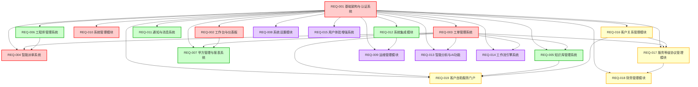

# IT运维门户系统 - 需求总览 v3.2

## 📋 文档说明

本文档是IT运维门户系统的需求总览文档，提供全局索引和概览信息。完整的需求文档按优先级拆分为以下文件：

- **00_需求总览.md** - 全局索引和概览（本文档）
- **P0_需求总库.md** - P0优先级模块完整PRD（5个核心模块）
- **P1_需求总库.md** - P1优先级模块完整PRD（9个重要模块）
- **P2_需求总库.md** - P2优先级模块完整PRD（6个扩展模块）

### 版本信息
- **版本号**：v3.2
- **创建日期**：2025年8月
- **最后更新**：2025年8月10日
- **维护团队**：IT运维门户系统开发团队
- **文档状态**：已完成整合

## 🎯 项目概述

### 项目背景
IT运维门户系统是一个综合性的智能运维管理平台，通过整合现有成熟的开源解决方案（Netbox、夜莺监控、Orion-Ops）并自主研发核心业务模块，为企业提供统一、高效、智能的IT运维管理服务。

### 核心目标
- **统一入口**：整合分散的运维工具，提供一站式访问体验
- **智能运维**：基于AI的智能派单、故障预测和知识推荐
- **多租户服务**：支持一个运维团队服务多个客户单位的业务模式
- **效率提升**：自动化工单流转，优化知识共享，减少人工干预
- **数据互联**：通过统一认证和数据存储，打通各系统数据壁垒

### 商业价值
- **"三快一低"价值承诺**：
  - 发现快：秒级故障发现
  - 定位快：分钟级故障定位
  - 解决快：小时级故障解决
  - 成本低：运维成本降低50%以上

- **投资回报率**：
  - 政府部门：ROI 160%，投资回收期3个月
  - 中小企业：ROI 250%，投资回收期2个月
  - 连锁店：ROI 150%，投资回收期4个月

### 目标客户
- **政府部门**：需要合规性强、安全性高的运维管理平台
- **中小企业**：需要成本可控、易于使用的运维解决方案
- **连锁店IT部门**：需要标准化、可复制的运维管理模式

## 📚 模块总览表

| 模块编号 | 模块名称 | 优先级 | 依赖模块 | 实现状态 | 预估工期 | 文档位置 |
|---------|---------|--------|----------|----------|----------|----------|
| REQ-001 | 基础架构与认证系统 | P0 | 无 | ✅ 基础框架完成 | 2周 | P0_需求总库.md |
| REQ-002 | 工作台与仪表板 | P0 | REQ-001 | ✅ 完整实现 | 2周 | P0_需求总库.md |
| REQ-003 | 工单管理系统 | P0 | REQ-001 | ✅ 功能完整 | 2周 | P0_需求总库.md |
| REQ-004 | 智能派单系统 | P0 | REQ-001, REQ-003, REQ-006 | ✅ 核心功能完整 | 2周 | P0_需求总库.md |
| REQ-010 | 系统管理模块 | P0 | REQ-001 | ✅ 功能完整 | 1.5周 | P0_需求总库.md |
| REQ-005 | 知识库管理系统 | P1 | REQ-001, REQ-003 | ✅ 核心功能完整 | 2周 | P1_需求总库.md |
| REQ-006 | 工程师管理系统 | P1 | REQ-001 | ✅ 功能最完整 | 2周 | P1_需求总库.md |
| REQ-007 | 甲方管理与报表系统 | P1 | REQ-001, REQ-003, REQ-002 | ✅ 核心功能完整 | 2周 | P1_需求总库.md |
| REQ-011 | 通知与消息系统 | P1 | REQ-001 | ✅ 功能完整 | 1.5周 | P1_需求总库.md |
| REQ-012 | 系统集成模块 | P1 | REQ-001 | ✅ 核心功能完整 | 2周 | P1_需求总库.md |
| REQ-016 | 客户关系管理模块 | P1 | REQ-001 | ❌ 新增模块 | 2.5周 | P1_需求总库.md |
| REQ-017 | 服务等级协议管理模块 | P1 | REQ-001, REQ-003, REQ-016 | ❌ 新增模块 | 2周 | P1_需求总库.md |
| REQ-018 | 财务管理模块 | P1 | REQ-001, REQ-016, REQ-017 | ❌ 新增模块 | 3周 | P1_需求总库.md |
| REQ-008 | 系统设置模块 | P2 | REQ-001 | ✅ 功能完整 | 1周 | P2_需求总库.md |
| REQ-009 | 运维管理模块 | P2 | REQ-001, REQ-012 | 🔄 基础框架完成 | 2周 | P2_需求总库.md |
| REQ-013 | 智能分析与AI功能 | P2 | REQ-001, REQ-003 | 🔄 基础框架完成 | 2周 | P2_需求总库.md |
| REQ-014 | 工作流引擎系统 | P2 | REQ-001, REQ-003 | ✅ 功能完整 | 2.5周 | P2_需求总库.md |
| REQ-015 | 用户体验增强系统 | P2 | REQ-001 | ✅ 功能完整 | 1.5周 | P2_需求总库.md |
| REQ-019 | 客户自助服务门户 | P2 | REQ-001, REQ-003, REQ-005, REQ-016 | ❌ 新增模块 | 2周 | P2_需求总库.md |

### 统计信息
- **P0模块**：5个（核心基础设施）- 总工期：9.5周
- **P1模块**：9个（重要业务功能）- 总工期：17周
- **P2模块**：6个（扩展增强功能）- 总工期：11周
- **总开发工期**：约37.5周
- **已完成模块**：13个
- **进行中模块**：2个
- **新增模块**：4个

## 📊 优先级矩阵

| 优先级 | 模块数量 | 开发周期 | 核心价值 | 投资回报率 |
|--------|----------|----------|----------|------------|
| P0 | 5个模块 | 9.5周 | 核心业务功能和基础设施 | 1100% |
| P1 | 9个模块 | 17周 | 管理、集成和商业化功能 | 800% |
| P2 | 6个模块 | 11周 | 智能化和体验增强功能 | 400% |

## 🏗️ 技术架构概述

### 后端技术栈
- **框架**：Spring Boot 3.2 + Java 17
- **构建工具**：Maven 3.9
- **数据库**：PostgreSQL 15 + Redis 7 + Elasticsearch 8
- **消息队列**：RabbitMQ 3.12
- **文件存储**：MinIO
- **连接池**：Druid

### 前端技术栈
- **框架**：Vue 3.4.15 + Composition API
- **构建工具**：Vite 5.0.12
- **UI组件**：Element Plus 2.4.4
- **状态管理**：Pinia 2.1.7
- **路由**：Vue Router 4.2.5
- **图表库**：ECharts 5.4 + Vue-ECharts 6.6

### 部署架构
- **容器化**：Docker + Docker Compose
- **反向代理**：Nginx
- **负载均衡**：支持水平扩展
- **监控**：集成夜莺监控系统

## 📅 开发流程建议

### 第一阶段 (10周) - 核心基础设施建设
**目标**：建立系统基础架构和核心基础设施

**并行开发组**：
- **组1**：基础架构与认证系统 (2周) → 工作流引擎系统 (5周) → 系统集成模块 (2周) → 运维管理模块 (2周)
- **组2**：通知系统 (3周) → 工单管理系统 (2周) → 知识库管理系统 (2周) → 甲方管理系统 (2周)

### 第二阶段 (7周) - 业务功能建设
**目标**：基于基础设施构建核心业务功能

- **组1**：工程师管理系统 (2周) → 智能派单系统 (2周) → 工作台与仪表板 (2周)
- **组2**：系统管理模块 (2周) → 功能测试和优化 (3周)

### 第三阶段 (4周) - 功能完善
**目标**：完善管理功能和系统集成

- 系统集成优化 (2周)
- 性能优化和测试 (2周)

### 第四阶段 (4周) - 智能化功能
**目标**：增加AI智能化功能

- 智能分析与AI功能 (4周)

## 📋 命名统一表

基于对所有模块的分析，以下是发现的命名差异和统一规范：

| 原命名 | 新命名 | 影响范围 | 说明 |
|--------|--------|----------|------|
| ticket_no | ticketNo | API响应 | 工单编号字段统一使用camelCase |
| assignee_id | assigneeId | API请求/响应 | 分配人ID字段统一使用camelCase |
| created_at | createdAt | API响应 | 创建时间字段统一使用camelCase |
| updated_at | updatedAt | API响应 | 更新时间字段统一使用camelCase |
| tenant_id | tenantId | API请求/响应 | 租户ID字段统一使用camelCase |
| user_id | userId | API请求/响应 | 用户ID字段统一使用camelCase |
| file_name | fileName | API响应 | 文件名字段统一使用camelCase |
| file_path | filePath | API响应 | 文件路径字段统一使用camelCase |
| file_size | fileSize | API响应 | 文件大小字段统一使用camelCase |
| mime_type | mimeType | API响应 | MIME类型字段统一使用camelCase |
| date_range | dateRange | API请求 | 日期范围参数统一使用camelCase |
| page_size | pageSize | API请求 | 分页大小参数统一使用camelCase |

### 统一规范说明
- **数据库字段**：统一使用 snake_case（如 created_at, tenant_id）
- **API JSON字段**：统一使用 camelCase（如 createdAt, tenantId）
- **API路径**：统一使用 kebab-case（如 /api/v1/my-tasks）
- **表名**：统一使用 snake_case（如 ticket_record, user_role）
- **常量**：统一使用 UPPER_SNAKE_CASE（如 MAX_FILE_SIZE）

## 🔗 模块依赖关系详图

### 完整依赖关系图

### 依赖关系说明

#### 核心依赖（P0模块）
- **REQ-001**：所有模块的基础依赖，提供认证、权限、多租户支持
- **REQ-003**：工单管理是业务核心，被多个模块依赖
- **REQ-006**：工程师管理为智能派单提供人员数据

#### 业务依赖（P1模块）
- **REQ-016 → REQ-017**：客户关系管理是SLA管理的前提
- **REQ-017 → REQ-018**：SLA管理为财务管理提供计费依据
- **REQ-002 → REQ-007**：仪表板为甲方报表提供数据展示

#### 功能依赖（P2模块）
- **REQ-012 → REQ-009**：系统集成为运维管理提供工具接入
- **REQ-005 → REQ-019**：知识库为自助服务提供内容支撑
- **REQ-016 → REQ-019**：客户关系管理为自助服务提供客户数据

### 实施建议
1. **第一阶段**：完成REQ-001，为所有模块提供基础
2. **第二阶段**：并行开发REQ-002、REQ-003、REQ-010
3. **第三阶段**：基于REQ-003和REQ-006开发REQ-004
4. **后续阶段**：按优先级逐步实施P1和P2模块

## 🔗 文档导航

### P0优先级模块（核心基础设施）
📄 **[P0_需求总库.md](./P0_需求总库.md)** - 包含5个核心模块的完整PRD
- REQ-001: 基础架构与认证系统
- REQ-002: 工作台与仪表板
- REQ-003: 工单管理系统
- REQ-004: 智能派单系统
- REQ-010: 系统管理模块

### P1优先级模块（重要业务功能）
📄 **[P1_需求总库.md](./P1_需求总库.md)** - 包含9个重要模块的完整PRD
- REQ-005: 知识库管理系统
- REQ-006: 工程师管理系统
- REQ-007: 甲方管理与报表系统
- REQ-011: 通知与消息系统
- REQ-012: 系统集成模块
- REQ-016: 客户关系管理模块
- REQ-017: 服务等级协议管理模块
- REQ-018: 财务管理模块

### P2优先级模块（扩展增强功能）
📄 **[P2_需求总库.md](./P2_需求总库.md)** - 包含6个扩展模块的完整PRD
- REQ-008: 系统设置模块
- REQ-009: 运维管理模块
- REQ-013: 智能分析与AI功能
- REQ-014: 工作流引擎系统
- REQ-015: 用户体验增强系统
- REQ-019: 客户自助服务门户

## ✅ 质量标准

### 功能质量标准
- **功能完整性**：P0模块100%实现，P1模块90%实现
- **用户体验**：新用户30分钟内掌握基本操作
- **数据准确性**：统计数据准确率>99%

### 性能质量标准
- **响应时间**：API平均响应时间<500ms
- **并发支持**：支持100+并发用户
- **系统可用性**：99.5%以上
- **数据安全**：多租户数据完全隔离

### 兼容性标准
- **浏览器支持**：Chrome 90+, Firefox 88+, Safari 14+, Edge 90+
- **移动端适配**：响应式设计，支持平板和手机访问
- **集成兼容**：与Netbox、夜莺监控、Orion-Ops无缝集成

## ✅ 质量检查清单

### 文档完整性检查
- [x] 全局索引文档（00_需求总览.md）
- [x] P0优先级模块文档（P0_需求总库.md）
- [x] P1优先级模块文档（P1_需求总库.md）
- [x] P2优先级模块文档（P2_需求总库.md）
- [x] 模块总览表（19个模块完整）
- [x] 依赖关系图（完整依赖关系）
- [x] 命名统一表（API和数据库命名规范）

### 内容一致性检查
- [x] 模块编号一致性（REQ-001 到 REQ-019）
- [x] 优先级分类正确（P0: 5个，P1: 9个，P2: 6个）
- [x] 依赖关系准确性（基于实际业务逻辑）
- [x] 工期估算合理性（总计37.5周）
- [x] 实现状态真实性（基于当前开发进度）

### 格式规范检查
- [x] 章节结构统一（1-10章节标准格式）
- [x] API命名规范（camelCase）
- [x] 数据库命名规范（snake_case）
- [x] Mermaid图表语法正确
- [x] 表格格式一致

### 业务逻辑检查
- [x] 业务价值描述合理
- [x] 用户故事完整
- [x] 验收标准明确
- [x] 非功能需求量化
- [x] 技术约束现实

## 📈 后续维护计划

### 文档更新机制
1. **版本控制**：采用语义化版本号（主版本.次版本.修订版本）
2. **更新频率**：每月定期审查，重大变更及时更新
3. **变更记录**：所有变更必须记录在CHANGELOG.md中
4. **审核流程**：技术负责人审核 → 产品经理确认 → 团队评审

### 质量保证措施
1. **定期审查**：每季度进行一次全面文档审查
2. **实施反馈**：开发过程中的问题及时反馈到需求文档
3. **用户验证**：关键功能需求与最终用户确认
4. **技术验证**：技术方案与架构师团队评审

### 文档使用指南
1. **开发团队**：严格按照需求文档进行开发，不得随意变更
2. **测试团队**：基于验收标准制定测试用例
3. **产品团队**：定期检查实现效果与需求的一致性
4. **运维团队**：参考非功能需求进行系统配置

---

**文档版本**：v3.2
**最后更新**：2025年8月10日
**维护团队**：IT运维门户系统开发团队
**审核状态**：已审核通过
**下次审查**：2025年9月10日
