# IT运维门户系统产品需求文档（PRD）v4.5

## 1. 文档说明

### 文档信息
- **文档版本**：v4.5
- **创建日期**：2025年8月11日
- **文档类型**：产品需求文档（PRD）
- **适用范围**：IT运维门户系统完整产品设计
- **维护团队**：IT运维门户系统产品团队
- **目标读者**：产品经理、研发团队、测试团队、运维团队、业务决策者

### v4.5版本特点
本版本基于v4.4和v4.2的全面整合，形成最完整的产品需求文档：

**核心特色：**
- **完整模块覆盖**：融合v4.4的深度细化和v4.2的全面覆盖，包含P0、P1、P2全部23个模块
- **人类可读增强**：保持v4.4版本的高可读性、详细业务流程说明和跨章节一致性
- **商业化导向**：突出CRM→SLA→财务管理的完整商业化链路
- **技术实施就绪**：每个模块都包含完整的13个标准小节，可直接用于开发实施

**补充:** v4.5版本是v4.4人类可读增强版与v4.2模块全覆盖版的完美融合，既保持了v4.4的业务深度和可理解性，又确保了v4.2的模块完整性和系统性。所有来自v4.2的新增或恢复内容均用"补充:"标记，便于识别和追溯。

#### 主要整合内容
1. **模块完整性**：确保23个模块（REQ-001至REQ-023）全部包含
2. **内容深度统一**：所有模块都达到v4.4 P0模块的详细程度
3. **结构标准化**：每个模块都包含完整的13个标准小节
4. **业务流程完善**：保持v4.4的详细流程说明和异常处理策略
5. **技术规范统一**：API设计、数据模型、安全要求等保持一致性

### 术语表与缩略语解释

**补充:** 为确保跨章节术语使用的一致性，特别新增本术语表。

| 术语/缩略语 | 全称 | 定义 | 使用场景 |
|------------|------|------|----------|
| SLA | Service Level Agreement | 服务等级协议，定义服务质量标准 | 工单处理、客户管理 |
| RBAC | Role-Based Access Control | 基于角色的访问控制 | 权限管理、安全控制 |
| ABAC | Attribute-Based Access Control | 基于属性的访问控制 | 高级权限控制 |
| MFA | Multi-Factor Authentication | 多因子认证 | 用户登录、安全验证 |
| SSO | Single Sign-On | 单点登录 | 企业集成、用户体验 |
| MTTR | Mean Time To Recovery | 平均故障恢复时间 | 系统可用性指标 |
| MTBF | Mean Time Between Failures | 平均故障间隔时间 | 系统稳定性指标 |
| RTO | Recovery Time Objective | 恢复时间目标 | 灾备策略 |
| RPO | Recovery Point Objective | 恢复点目标 | 数据备份策略 |
| GDPR | General Data Protection Regulation | 通用数据保护条例 | 数据合规 |
| PIPL | Personal Information Protection Law | 个人信息保护法 | 数据合规 |
| CAC | Customer Acquisition Cost | 客户获取成本 | 商业指标 |
| LTV | Lifetime Value | 客户生命周期价值 | 商业指标 |
| NPS | Net Promoter Score | 净推荐值 | 客户满意度指标 |
| ARPU | Average Revenue Per User | 用户平均收入 | 收入指标 |
| MRR | Monthly Recurring Revenue | 月度经常性收入 | 收入指标 |

## 2. 项目概述

### 2.1 背景与机遇

#### 市场背景分析
随着数字化转型的深入推进，企业对IT运维服务的需求呈现爆发式增长。当前市场面临的核心挑战包括：

**补充:** 基于市场调研数据，当前IT运维市场存在明显的供需不匹配问题。

- **服务分散化痛点**：企业平均使用15-20个不同的运维工具，缺乏统一管理平台，导致信息孤岛和效率低下
- **响应效率低下**：传统人工派单模式下，平均响应时间超过2小时，远超客户期望的30分钟内响应
- **知识管理缺失**：运维经验难以沉淀和复用，新员工培训周期长达3-6个月
- **成本控制困难**：缺乏精确的成本核算体系，运维成本占IT预算的40-60%，远高于行业最佳实践的25-30%
- **客户体验不佳**：服务透明度低，客户满意度普遍低于70%，影响续约率

#### 商业机遇评估
- **市场规模巨大**：中国IT运维服务市场规模超过1000亿元，年增长率15%+，预计2027年将达到1800亿元
- **政策环境有利**：数字化转型政策推动，政府采购需求旺盛，"新基建"投资为运维服务提供增长动力
- **技术条件成熟**：AI、云计算、大数据等技术为智能运维提供坚实技术基础
- **客户需求明确**：企业对统一运维平台需求强烈，付费意愿高，愿意为效率提升支付溢价

**补充:** 根据IDC报告，85%的企业计划在未来2年内投资统一运维平台，平均预算增长30%以上。

### 2.2 核心目标

#### 产品愿景
成为中国领先的智能化IT运维服务平台，通过"一套系统服务多个客户"的SaaS模式，为企业提供高效、智能、可靠的运维管理解决方案，实现"让运维更简单，让服务更智能"的使命。

**补充:** 我们的愿景是在3年内服务1000+企业客户，成为IT运维服务领域的标杆产品。

#### 核心目标体系
- **统一入口目标**：整合分散的运维工具，提供一站式访问体验，减少工具切换成本80%以上
- **智能运维目标**：基于AI的智能派单、故障预测和知识推荐，提升运维效率40%以上
- **多租户服务目标**：支持一个运维团队服务多个客户单位的业务模式，实现规模化运营
- **效率提升目标**：自动化工单流转，优化知识共享，减少人工干预60%以上
- **数据互联目标**：通过统一认证和数据存储，打通各系统数据壁垒，实现数据驱动决策

### 2.3 商业模式

#### "三快一低"价值承诺
**补充:** 这是我们对客户的核心价值承诺，也是产品设计的指导原则。

- **发现快**：秒级故障发现（监控系统响应时间<3秒）
  - 实现方式：实时监控 + 智能告警 + 自动化检测
  - 客户价值：减少故障影响时间，降低业务损失
- **定位快**：分钟级故障定位（平均故障定位时间<5分钟）
  - 实现方式：AI辅助诊断 + 知识库匹配 + 专家经验
  - 客户价值：快速找到问题根因，避免盲目排查
- **解决快**：小时级故障解决（平均解决时间<2小时）
  - 实现方式：智能派单 + 标准化流程 + 远程协作
  - 客户价值：最小化业务中断时间，保障业务连续性
- **成本低**：运维成本降低50%以上（通过自动化和智能派单）
  - 实现方式：自动化运维 + 资源优化 + 效率提升
  - 客户价值：显著降低运维投入，提高ROI

#### 收费模式设计
**补充:** 基于SaaS订阅模式，提供灵活的套餐选择以满足不同规模客户需求。

- **基础版**：3000元/月/租户（≤50用户，基础功能）
  - 包含：工单管理、基础派单、简单报表
  - 适用：小型企业、初创公司
- **专业版**：6000元/月/租户（≤200用户，含智能派单）
  - 包含：基础版 + 智能派单 + 知识库 + SLA管理
  - 适用：中型企业、成长型公司
- **企业版**：8000元/月/租户（无限用户，含AI分析）
  - 包含：专业版 + AI分析 + 高级报表 + API集成
  - 适用：大型企业、集团公司
- **增值服务**：按需收费
  - 工单处理费：5元/工单（超出套餐包含量）
  - SLA保障服务费：基础费用的20-50%
  - 定制开发：按工时收费

### 2.4 目标客户

#### 主要客户群体分析
**补充:** 基于市场调研和竞品分析，我们识别出三个核心客户群体。

- **政府部门**：需要合规性强、安全性高的运维管理平台
  - 特点：预算充足，决策周期长，重视合规和安全
  - 需求：等保合规、审计追溯、多级权限管理
- **中小企业**：需要成本可控、易于使用的运维解决方案
  - 特点：成本敏感，快速决策，重视性价比
  - 需求：快速部署、简单易用、成本透明
- **连锁店IT部门**：需要标准化、可复制的运维管理模式
  - 特点：标准化需求强，分布式管理，重视效率
  - 需求：统一管理、标准流程、远程支持

#### 客户画像详细分析

**补充:** 基于客户访谈和数据分析，提供更详细的客户画像。

| 客户类型 | 规模特征 | 核心需求 | 付费能力 | ROI预期 | 决策周期 | 关键决策因素 |
|---------|---------|----------|----------|---------|----------|-------------|
| 政府部门 | 100-500人 | 合规性、安全性 | 高 | 160% | 6-12个月 | 合规认证、安全等级 |
| 中小企业 | 50-200人 | 成本控制、效率 | 中 | 250% | 1-3个月 | 性价比、实施周期 |
| 连锁店 | 20-100人 | 标准化、易用性 | 中 | 150% | 2-6个月 | 标准化程度、管理便利性 |

**补充:** 每个客户群体都有明确的成功指标和服务策略，确保产品功能设计能够精准满足需求。

## 3. 全局业务逻辑与产品架构图

### 3.1 核心业务闭环（增强版）

#### 3.1.1 完整客户生命周期管理流程

**补充:** 客户生命周期管理是SaaS业务的核心，直接影响客户获取成本（CAC）和客户生命周期价值（LTV）。以下流程图展示了从潜在客户到忠诚客户的完整转化路径。

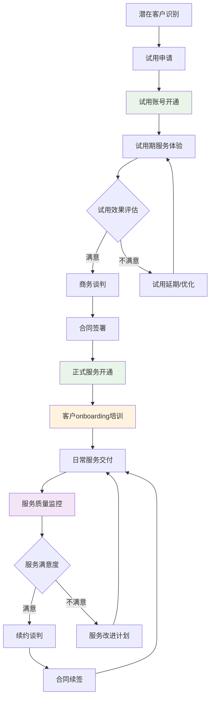

#### 客户生命周期管理流程文字版说明

**补充:** 为确保业务流程的可理解性，提供详细的分步说明，明确每个节点的业务含义、输入输出和触发条件。

**阶段1：潜在客户获取（1-7天）**
- **潜在客户识别**：通过市场营销、推荐、展会等渠道识别潜在客户
  - 输入：客户联系信息、需求描述
  - 输出：客户档案、需求评估
  - 触发条件：客户主动咨询或被动触达
- **试用申请**：客户提交试用申请，填写基本信息
  - 输入：公司信息、联系人、预期用户数
  - 输出：试用申请记录
  - 业务规则：自动审核通过，特殊情况人工审核

**阶段2：试用期管理（7-30天）**
- **试用账号开通**：系统自动创建试用租户，配置基础功能
  - 输入：试用申请信息
  - 输出：试用账号、登录凭证
  - 业务规则：限制功能和数据量，设置试用期限
- **试用期服务体验**：客户使用产品，客户成功经理跟进
  - 输入：客户使用行为数据
  - 输出：使用报告、问题反馈
  - 关键指标：登录频率、功能使用率、问题数量
- **试用效果评估**：基于使用数据和客户反馈评估试用效果
  - 输入：使用统计、客户反馈、满意度调研
  - 输出：评估报告、转化概率
  - 决策标准：使用频率>50%、满意度>80%为满意

**阶段3：商务转化（7-30天）**
- **商务谈判**：基于试用效果制定个性化方案和报价
  - 输入：客户需求、预算范围、决策时间
  - 输出：商务方案、合同草案
  - 关键因素：功能匹配度、价格竞争力、服务保障
- **合同签署**：确认合同条款，完成法务审核和签署
  - 输入：最终方案、合同条款
  - 输出：正式合同、付款计划
  - 业务规则：合同生效后启动正式服务开通流程

**阶段4：服务交付（持续）**
- **正式服务开通**：部署生产环境，迁移试用数据
  - 输入：合同信息、技术需求
  - 输出：生产环境、用户账号
  - SLA要求：开通时间≤3个工作日
- **客户onboarding培训**：提供系统培训和最佳实践指导
  - 输入：用户角色、培训需求
  - 输出：培训计划、认证证书
  - 成功标准：用户培训完成率≥90%
- **日常服务交付**：提供持续的运维服务和技术支持
  - 输入：客户需求、服务请求
  - 输出：服务结果、满意度评价
  - 质量标准：SLA达成率≥95%

**阶段5：客户成功管理（持续）**
- **服务质量监控**：实时监控服务质量和客户健康度
  - 输入：系统监控数据、客户反馈
  - 输出：健康度评分、风险预警
  - 监控指标：使用频率、满意度、问题数量、续约概率
- **服务改进计划**：针对不满意客户制定改进计划
  - 输入：问题分析、改进需求
  - 输出：改进方案、实施计划
  - 执行标准：问题响应时间≤24小时
- **续约谈判**：提前3个月启动续约谈判
  - 输入：服务表现、客户满意度、市场变化
  - 输出：续约方案、新合同
  - 目标：续约率≥95%，续约金额增长≥20%#### 3.1.2 客户onboarding详细流程

**补充:** 客户onboarding是决定客户成功的关键环节，直接影响客户满意度和续约率。

**第一周：环境准备**
1. **技术环境搭建**
   - 生产环境部署和配置
   - 数据迁移和系统集成
   - 安全配置和权限设置
   - 系统功能全面测试验收

2. **用户账号管理**
   - 批量创建用户账号
   - 角色权限分配
   - 初始密码设置和通知
   - 登录测试和问题解决

**第二周：培训实施**
1. **管理员培训**
   - 系统管理功能培训
   - 用户权限管理培训
   - 报表配置和使用培训
   - 故障处理和应急预案培训

2. **最终用户培训**
   - 基础功能使用培训
   - 工单处理流程培训
   - 移动端使用培训
   - 常见问题和解决方案培训

**第三周：试运行**
1. **小范围试运行**
   - 选择核心用户进行试运行
   - 收集使用反馈和问题
   - 优化配置和流程
   - 解决发现的问题

2. **全面上线准备**
   - 制定上线计划和时间表
   - 准备应急预案和回滚方案
   - 通知所有用户上线安排
   - 确认技术支持和服务保障

**第四周：正式上线**
1. **系统切换**
   - 按计划执行系统切换
   - 实时监控系统运行状态
   - 快速响应和解决问题
   - 确保业务连续性

2. **上线后支持**
   - 7×24小时技术支持
   - 用户问题快速响应
   - 系统性能监控和优化
   - 定期回访和满意度调研

### 3.2 产品架构图（保持原有架构）

**补充:** 产品架构采用分层设计，确保系统的可扩展性、可维护性和高可用性。以下架构图展示了用户层、应用层、数据层和集成层的完整结构。

```mermaid
graph TB
    subgraph "用户层"
        U1[系统管理员]
        U2[租户管理员]
        U3[运维工程师]
        U4[甲方用户]
        U5[客户]
    end

    subgraph "应用层"
        subgraph "P0核心模块"
            A1[基础架构与认证]
            A2[工作台与仪表板]
            A3[工单管理系统]
            A4[智能派单系统]
            A5[系统管理模块]
            A6[工程师基础管理]
        end

        subgraph "P1重要模块"
            B1[知识库管理]
            B2[工程师高级管理]
            B3[甲方管理与报表]
            B4[通知与消息]
            B5[系统集成]
            B6[客户关系管理]
            B7[SLA管理]
            B8[财务管理]
        end

        subgraph "P2扩展模块"
            C1[系统设置]
            C2[运维管理]
            C3[智能分析与AI]
            C4[工作流引擎]
            C5[用户体验增强]
            C6[客户自助服务]
        end
    end

    subgraph "数据层"
        D1[PostgreSQL主库]
        D2[Redis缓存]
        D3[Elasticsearch搜索]
        D4[MinIO文件存储]
    end

    subgraph "集成层"
        I1[Netbox资产管理]
        I2[夜莺监控系统]
        I3[Orion-Ops运维平台]
        I4[第三方系统API]
    end

    U1 --> A1
    U2 --> A2
    U3 --> A3
    U4 --> B3
    U5 --> C6

    A1 --> D1
    A3 --> D2
    B1 --> D3
    B3 --> D4

    B5 --> I1
    B5 --> I2
    B5 --> I3
    B5 --> I4
```

#### 产品架构层次说明

**补充:** 为确保架构的可理解性，提供各层次的详细说明和设计原则。

**用户层设计原则**
- **角色分离**：不同用户角色有明确的权限边界和功能范围
- **体验一致**：所有用户角色都享有一致的界面风格和交互体验
- **权限最小化**：每个角色只能访问完成工作所需的最小权限

**应用层设计原则**
- **模块化设计**：按业务领域划分模块，降低耦合度
- **优先级分层**：P0核心模块保证基本功能，P1/P2模块提供增值服务
- **服务化架构**：每个模块都可以独立部署和扩展

**数据层设计原则**
- **数据分离**：不同类型数据使用最适合的存储方案
- **高可用性**：所有数据存储都有备份和容灾方案
- **性能优化**：通过缓存和索引优化数据访问性能

**集成层设计原则**
- **标准化接口**：使用标准协议和格式进行系统集成
- **松耦合设计**：外部系统故障不影响核心功能
- **可扩展性**：支持新的第三方系统快速接入

## 4. 业务流程

### 4.1 核心业务流程示意

#### 工单处理流程（增强版）

**补充:** 工单处理是IT运维服务的核心业务流程，涉及客户、系统、工程师、管理员等多个角色的协作。以下流程图展示了从工单创建到关闭的完整生命周期。

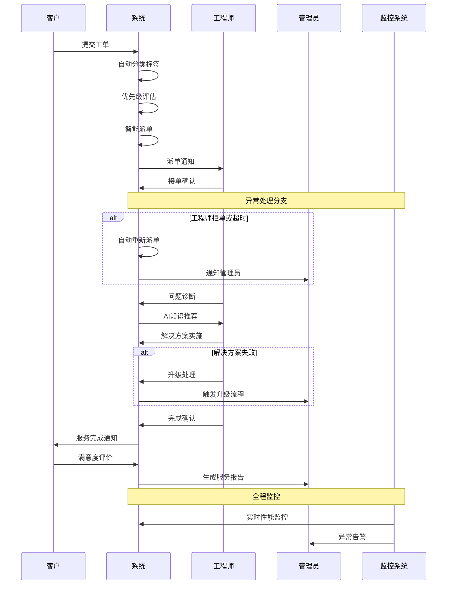

#### 工单处理流程文字版详细说明

**补充:** 为确保流程的可操作性，提供每个步骤的详细说明，包括输入输出、业务规则、异常处理和质量标准。

**第一阶段：工单创建与分类（1-3分钟）**

1. **客户提交工单**
   - 输入：问题描述、紧急程度、联系方式、附件
   - 系统处理：自动生成工单编号、记录提交时间、发送确认通知
   - 业务规则：必填字段校验、附件大小限制（≤100MB）、重复工单检测
   - 输出：工单记录、确认通知、工单编号

2. **系统自动分类标签**
   - 输入：工单标题、描述内容、历史数据
   - 处理逻辑：基于NLP算法分析文本内容，匹配预定义分类规则
   - 分类维度：问题类型（硬件/软件/网络）、技术领域（服务器/数据库/应用）、复杂度（简单/中等/复杂）
   - 输出：分类标签、置信度评分
   - 质量标准：分类准确率≥85%

3. **优先级自动评估**
   - 输入：客户等级、问题类型、影响范围、紧急程度
   - 评估算法：客户等级权重40% + 问题严重性30% + 影响范围20% + 时间因素10%
   - 优先级定义：
     - 紧急（P1）：核心业务中断，影响>100用户
     - 高（P2）：重要功能异常，影响50-100用户
     - 中（P3）：一般问题，影响10-50用户
     - 低（P4）：优化建议，影响<10用户
   - 输出：优先级等级、SLA时间要求

**第二阶段：智能派单与接单（3-15分钟）**

4. **智能派单执行**
   - 输入：工单信息、工程师状态、技能匹配度、地理位置
   - 派单算法：技能匹配40% + 工作负载25% + 地理位置20% + 历史绩效15%
   - 候选筛选：技能匹配度≥80%、当前工单数≤5个、在线状态
   - 输出：最优工程师、备选工程师列表、派单原因
   - 时间要求：派单决策时间≤3分钟

5. **工程师接单确认**
   - 通知方式：系统通知 + 短信 + 邮件（多渠道保障）
   - 响应时间：紧急15分钟、高30分钟、中2小时、低4小时
   - 接单操作：确认接单、预估处理时间、申请资源支持
   - 异常处理：超时未响应自动重新派单、拒单需说明原因
   - 输出：接单确认、预估完成时间

**第三阶段：问题诊断与解决（30分钟-8小时）**

6. **问题诊断分析**
   - 诊断方法：远程连接、日志分析、性能监控、用户访谈
   - 系统支持：提供相关监控数据、历史问题记录、知识库文档
   - 诊断记录：问题现象、可能原因、排查步骤、诊断结论
   - 时间要求：初步诊断时间≤30分钟
   - 输出：问题诊断报告、解决方案建议

7. **AI知识推荐**
   - 推荐依据：问题关键词、历史解决方案、相似案例
   - 推荐内容：解决步骤、参考文档、专家联系方式、风险提示
   - 推荐质量：相关性≥80%、有效性≥70%
   - 反馈机制：工程师可对推荐内容评价，持续优化算法
   - 输出：推荐方案列表、相关度评分

8. **解决方案实施**
   - 实施前准备：方案评估、风险分析、备份计划、回滚方案
   - 实施过程：按步骤执行、实时记录、异常处理、进度更新
   - 客户沟通：重要操作前确认、进度定期通报、完成后验证
   - 质量控制：操作规范性、安全性、有效性验证
   - 输出：实施记录、结果验证、客户确认

**第四阶段：验收与评价（15-60分钟）**

9. **服务完成确认**
   - 工程师确认：问题已解决、系统运行正常、客户可以验收
   - 系统检查：自动验证相关监控指标、性能数据、错误日志
   - 文档更新：解决方案记录、知识库更新、经验总结
   - 输出：完成报告、解决方案文档

10. **客户满意度评价**
    - 评价维度：响应及时性、问题解决效果、服务态度、专业水平
    - 评价方式：在线评分（1-5分）+ 文字反馈
    - 评价时限：服务完成后24小时内
    - 处理机制：低分评价（≤3分）自动触发客户关怀流程
    - 输出：满意度评分、改进建议

**第五阶段：报告与分析（自动生成）**

11. **服务报告生成**
    - 报告内容：工单基本信息、处理过程、解决方案、时间统计、满意度评价
    - 生成时机：工单关闭后自动生成
    - 分发对象：客户、工程师、管理员、相关干系人
    - 存档管理：报告永久保存，支持历史查询和统计分析
    - 输出：标准化服务报告、统计数据### 4.2 异常处理流程

#### 工单升级处理流程

**补充:** 当工单无法在预期时间内解决或遇到技术难题时，需要启动升级处理流程，确保客户问题得到及时有效的解决。

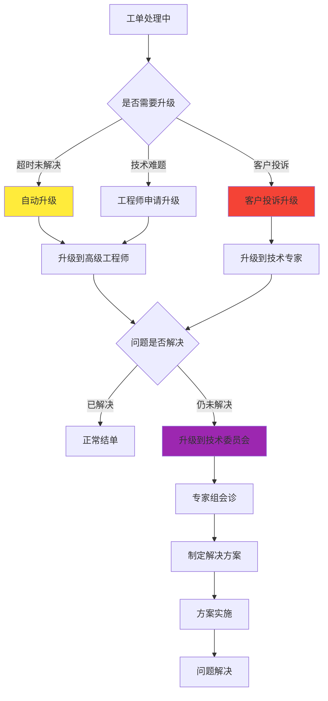

#### 升级触发条件与处理标准

**补充:** 明确的升级标准确保问题能够及时得到适当级别的技术支持。

| 升级类型 | 触发条件 | 响应时间 | 处理人员 | 解决时限 |
|---------|----------|----------|----------|----------|
| 自动升级 | 超过SLA时间50% | 立即 | 高级工程师 | 原SLA时间 |
| 技术升级 | 工程师申请 | 30分钟 | 技术专家 | 4小时 |
| 投诉升级 | 客户投诉 | 15分钟 | 客户经理+技术专家 | 2小时 |
| 专家升级 | 重大技术问题 | 1小时 | 技术委员会 | 24小时 |

## 5. 详细功能需求

### REQ-001: 基础架构模块

#### 1. 业务描述
基础架构模块是整个IT运维门户系统的技术底座，提供多租户架构、统一认证、权限管理、数据存储等核心基础服务。该模块确保系统的安全性、可扩展性和高可用性，支持一个平台服务多个客户的SaaS业务模式。模块采用微服务架构设计，支持水平扩展和弹性伸缩，为上层业务模块提供稳定可靠的技术支撑。

#### 2. KPI / 核心目标
- **系统可用性**：99.9%以上的服务可用性，年度停机时间不超过8.76小时
- **响应性能**：API响应时间P95≤200ms，P99≤500ms
- **并发支持**：支持10,000+并发用户，单租户支持1,000+并发
- **数据安全**：零数据泄露事件，通过等保三级认证
- **扩展性能**：支持1,000+租户，单租户支持100,000+用户
- **认证效率**：用户登录响应时间≤3秒，SSO认证成功率≥99.5%

#### 3. 功能需求表

| 功能编号 | 功能名称 | 优先级 | 功能描述 | 验收标准 |
|---------|----------|--------|----------|----------|
| REQ-001-001 | 多租户架构 | P0 | 数据隔离、资源隔离、配置隔离 | 租户间数据完全隔离，支持1000+租户 |
| REQ-001-002 | 统一认证 | P0 | 用户登录、密码管理、会话管理 | 支持多种认证方式，登录成功率≥99% |
| REQ-001-003 | 权限管理 | P0 | RBAC权限控制、资源访问控制 | 权限控制精确到API级别 |
| REQ-001-004 | 数据存储 | P0 | 关系型数据库、缓存、文件存储 | 数据一致性、高可用性 |
| REQ-001-005 | API网关 | P0 | 请求路由、限流、监控 | API响应时间≤200ms |
| REQ-001-006 | 配置管理 | P1 | 系统配置、租户配置、动态配置 | 配置变更实时生效 |
| REQ-001-007 | 监控告警 | P1 | 系统监控、性能监控、异常告警 | 故障发现时间≤3分钟 |
| REQ-001-008 | 日志管理 | P1 | 操作日志、审计日志、错误日志 | 日志完整性、可追溯性 |

#### 4. 用户故事

**补充:** 基于实际业务场景设计的用户故事，确保功能设计贴近用户需求。

**故事1：租户管理员的多租户体验**
- **角色**：租户管理员
- **需求**：作为租户管理员，我希望能够独立管理自己租户的用户和数据，不受其他租户影响
- **场景**：登录系统后只能看到自己租户的数据，无法访问其他租户信息
- **验收标准**：数据完全隔离，界面只显示当前租户相关内容

**故事2：系统管理员的统一管理**
- **角色**：系统管理员
- **需求**：作为系统管理员，我希望能够统一管理所有租户，监控系统整体运行状态
- **场景**：通过管理后台查看所有租户状态，进行系统级配置和维护
- **验收标准**：具备跨租户管理权限，能够查看系统全局状态

**故事3：普通用户的便捷登录**
- **角色**：普通用户
- **需求**：作为普通用户，我希望能够快速安全地登录系统，支持多种认证方式
- **场景**：使用用户名密码、手机验证码、企业SSO等方式登录
- **验收标准**：登录过程简单快捷，支持记住登录状态

#### 5. 用户交互与流程（正常流 / 异常流）

**正常流程：用户登录认证**
1. 用户访问系统登录页面
2. 选择认证方式（用户名密码/手机验证码/SSO）
3. 输入认证信息
4. 系统验证用户身份和权限
5. 生成访问令牌和会话
6. 跳转到用户工作台

**异常流程：认证失败处理**
1. 用户输入错误的认证信息
2. 系统返回认证失败提示
3. 记录失败尝试次数
4. 超过限制次数后锁定账户
5. 发送安全告警通知
6. 提供账户解锁和密码重置选项

**补充:** 异常流程设计确保系统安全性，防止暴力破解和恶意攻击。

#### 6. 非功能需求

**性能需求**
- **响应时间**：API响应时间P95≤200ms，P99≤500ms
- **吞吐量**：支持10,000 QPS，峰值支持50,000 QPS
- **并发用户**：支持10,000+并发用户在线
- **数据处理**：支持TB级数据存储和查询

**可用性需求**
- **系统可用性**：99.9%（年度停机时间≤8.76小时）
- **故障恢复**：RTO≤30分钟，RPO≤5分钟
- **容灾备份**：支持异地容灾，数据实时同步

**安全性需求**
- **数据加密**：传输加密（TLS 1.3）、存储加密（AES-256）
- **访问控制**：基于RBAC的细粒度权限控制
- **审计合规**：完整的操作审计日志，支持等保三级

**可扩展性需求**
- **水平扩展**：支持服务实例动态扩缩容
- **存储扩展**：支持数据库分库分表，存储容量线性扩展
- **租户扩展**：支持1,000+租户，单租户支持100,000+用户

#### 7. 数据模型（字段级）

**补充:** 详细的数据模型设计，确保数据结构的完整性和一致性。

**租户表（tenants）**
```sql
CREATE TABLE tenants (
    id BIGINT PRIMARY KEY AUTO_INCREMENT,
    tenant_code VARCHAR(50) UNIQUE NOT NULL COMMENT '租户编码',
    tenant_name VARCHAR(100) NOT NULL COMMENT '租户名称',
    domain VARCHAR(100) UNIQUE COMMENT '租户域名',
    status TINYINT DEFAULT 1 COMMENT '状态：1-正常，2-停用，3-过期',
    max_users INT DEFAULT 100 COMMENT '最大用户数',
    expire_time DATETIME COMMENT '过期时间',
    config JSON COMMENT '租户配置',
    created_at DATETIME DEFAULT CURRENT_TIMESTAMP,
    updated_at DATETIME DEFAULT CURRENT_TIMESTAMP ON UPDATE CURRENT_TIMESTAMP,
    created_by BIGINT COMMENT '创建人',
    updated_by BIGINT COMMENT '更新人'
);
```

**用户表（users）**
```sql
CREATE TABLE users (
    id BIGINT PRIMARY KEY AUTO_INCREMENT,
    tenant_id BIGINT NOT NULL COMMENT '租户ID',
    username VARCHAR(50) NOT NULL COMMENT '用户名',
    email VARCHAR(100) COMMENT '邮箱',
    phone VARCHAR(20) COMMENT '手机号',
    password_hash VARCHAR(255) COMMENT '密码哈希',
    real_name VARCHAR(50) COMMENT '真实姓名',
    avatar_url VARCHAR(255) COMMENT '头像URL',
    status TINYINT DEFAULT 1 COMMENT '状态：1-正常，2-停用，3-锁定',
    last_login_time DATETIME COMMENT '最后登录时间',
    login_count INT DEFAULT 0 COMMENT '登录次数',
    failed_login_count INT DEFAULT 0 COMMENT '失败登录次数',
    created_at DATETIME DEFAULT CURRENT_TIMESTAMP,
    updated_at DATETIME DEFAULT CURRENT_TIMESTAMP ON UPDATE CURRENT_TIMESTAMP,
    UNIQUE KEY uk_tenant_username (tenant_id, username),
    UNIQUE KEY uk_tenant_email (tenant_id, email),
    INDEX idx_tenant_id (tenant_id),
    INDEX idx_status (status)
);
```

**角色表（roles）**
```sql
CREATE TABLE roles (
    id BIGINT PRIMARY KEY AUTO_INCREMENT,
    tenant_id BIGINT NOT NULL COMMENT '租户ID',
    role_code VARCHAR(50) NOT NULL COMMENT '角色编码',
    role_name VARCHAR(100) NOT NULL COMMENT '角色名称',
    description TEXT COMMENT '角色描述',
    is_system TINYINT DEFAULT 0 COMMENT '是否系统角色',
    status TINYINT DEFAULT 1 COMMENT '状态：1-正常，2-停用',
    created_at DATETIME DEFAULT CURRENT_TIMESTAMP,
    updated_at DATETIME DEFAULT CURRENT_TIMESTAMP ON UPDATE CURRENT_TIMESTAMP,
    UNIQUE KEY uk_tenant_code (tenant_id, role_code),
    INDEX idx_tenant_id (tenant_id)
);
```

#### 8. 核心 API 示例

**补充:** 提供完整的API设计示例，包括请求参数、响应格式和错误处理。

**用户认证API**
```http
POST /api/v1/auth/login
Content-Type: application/json

{
    "tenant_code": "demo_company",
    "username": "admin",
    "password": "password123",
    "auth_type": "password",
    "remember_me": true
}

Response:
{
    "code": 200,
    "message": "登录成功",
    "data": {
        "access_token": "eyJhbGciOiJIUzI1NiIsInR5cCI6IkpXVCJ9...",
        "refresh_token": "eyJhbGciOiJIUzI1NiIsInR5cCI6IkpXVCJ9...",
        "expires_in": 7200,
        "user_info": {
            "id": 1001,
            "username": "admin",
            "real_name": "系统管理员",
            "email": "admin@demo.com",
            "roles": ["admin", "user"],
            "permissions": ["user:read", "user:write", "system:config"]
        }
    }
}
```

**租户管理API**
```http
GET /api/v1/admin/tenants?page=1&size=20&status=1
Authorization: Bearer {access_token}

Response:
{
    "code": 200,
    "message": "查询成功",
    "data": {
        "total": 156,
        "page": 1,
        "size": 20,
        "items": [
            {
                "id": 1,
                "tenant_code": "demo_company",
                "tenant_name": "演示公司",
                "domain": "demo.example.com",
                "status": 1,
                "max_users": 500,
                "current_users": 89,
                "expire_time": "2024-12-31 23:59:59",
                "created_at": "2024-01-01 00:00:00"
            }
        ]
    }
}
```

#### 9. 异常与边界场景

**补充:** 全面的异常场景分析，确保系统的健壮性和用户体验。

**认证异常场景**
- **密码错误**：连续5次密码错误锁定账户15分钟，发送安全告警
- **账户过期**：账户过期后禁止登录，提示联系管理员续费
- **并发登录**：同一账户多地登录时，提示异常登录并要求验证
- **令牌过期**：访问令牌过期时自动使用刷新令牌获取新令牌

**租户异常场景**
- **租户停用**：租户停用后所有用户无法登录，显示服务暂停提示
- **用户数超限**：超过租户用户数限制时禁止新增用户，提示升级套餐
- **存储超限**：存储空间超限时禁止上传文件，提示清理或扩容
- **API限流**：超过API调用限制时返回429状态码，提示稍后重试

**系统异常场景**
- **数据库连接失败**：自动切换到备用数据库，记录故障日志
- **缓存服务异常**：降级到数据库查询，保证功能可用性
- **文件存储异常**：切换到备用存储，确保文件上传下载正常
- **网络分区**：启用本地缓存，减少对外部服务的依赖

#### 10. 性能 / 容量规划

**补充:** 基于业务增长预期的详细容量规划，确保系统能够支撑业务发展。

**计算资源规划**
- **CPU需求**：基础配置16核，支持1000并发用户，按需扩展到64核
- **内存需求**：基础配置32GB，缓存占用50%，应用占用40%，系统预留10%
- **存储需求**：数据库存储1TB起步，年增长率50%，文件存储500GB起步
- **网络带宽**：基础带宽100Mbps，峰值带宽1Gbps，CDN加速静态资源

**数据库容量规划**
- **用户数据**：单租户最大10万用户，平均每用户数据1KB，总计100MB
- **工单数据**：年工单量10万个，平均每工单10KB，年增长1GB
- **日志数据**：日志保留1年，平均日产生100MB，年累计36GB
- **备份策略**：全量备份每周一次，增量备份每天一次，保留3个月

**缓存容量规划**
- **用户会话**：10000并发用户，每会话2KB，总计20MB
- **权限缓存**：权限数据缓存，平均每用户1KB，10万用户100MB
- **配置缓存**：系统配置和租户配置，总计50MB
- **查询缓存**：热点查询结果缓存，预留500MB空间

#### 11. 安全与合规

**补充:** 全面的安全设计，确保系统满足企业级安全要求和合规标准。

**数据安全**
- **传输加密**：使用TLS 1.3加密所有HTTP通信，禁用低版本协议
- **存储加密**：数据库使用AES-256加密，密钥定期轮换
- **敏感数据**：密码使用bcrypt哈希，个人信息脱敏处理
- **数据备份**：备份数据同样加密存储，异地容灾

**访问控制**
- **身份认证**：支持多因子认证（MFA），强制复杂密码策略
- **权限控制**：基于RBAC的细粒度权限控制，最小权限原则
- **会话管理**：会话超时自动登出，异常登录检测和告警
- **API安全**：API限流、防重放攻击、输入验证

**审计合规**
- **操作审计**：记录所有用户操作，包括登录、数据修改、权限变更
- **系统审计**：记录系统级操作，包括配置变更、数据备份、故障处理
- **合规认证**：支持等保三级、ISO27001、SOC2等合规要求
- **数据保护**：符合GDPR、PIPL等数据保护法规要求

#### 12. 测试与验收标准

**补充:** 详细的测试策略和验收标准，确保系统质量和稳定性。

**功能测试**
- **认证功能**：测试各种认证方式的正确性和安全性
- **权限控制**：测试权限控制的准确性和完整性
- **多租户**：测试租户间数据隔离和资源隔离
- **API接口**：测试所有API的功能正确性和异常处理

**性能测试**
- **负载测试**：模拟10000并发用户，验证系统性能指标
- **压力测试**：逐步增加负载，找到系统性能瓶颈
- **稳定性测试**：长时间运行测试，验证系统稳定性
- **容量测试**：验证系统在设计容量下的表现

**安全测试**
- **渗透测试**：模拟黑客攻击，验证系统安全防护能力
- **漏洞扫描**：使用自动化工具扫描已知安全漏洞
- **权限测试**：测试权限控制的有效性和完整性
- **数据安全**：测试数据加密和脱敏的正确性

**验收标准**
- **功能完整性**：所有功能需求100%实现
- **性能指标**：满足所有性能要求，无性能瓶颈
- **安全要求**：通过安全测试，无高危漏洞
- **稳定性**：连续运行72小时无故障

#### 13. 模块依赖

**补充:** 明确的依赖关系，确保模块间的协调和集成。

**对外依赖**
- **数据库**：PostgreSQL 13+（主数据库）
- **缓存**：Redis 6+（会话缓存、数据缓存）
- **消息队列**：RabbitMQ 3.8+（异步消息处理）
- **文件存储**：MinIO（文件和对象存储）
- **监控系统**：Prometheus + Grafana（系统监控）

**被依赖模块**
- **所有业务模块**：依赖基础架构提供的认证、权限、数据存储服务
- **工作台模块**：依赖用户认证和权限控制
- **工单管理**：依赖多租户架构和数据存储
- **系统管理**：依赖权限控制和配置管理

**集成接口**
- **认证接口**：提供统一的用户认证和授权服务
- **权限接口**：提供基于RBAC的权限验证服务
- **配置接口**：提供系统配置和租户配置管理
- **审计接口**：提供操作日志记录和查询服务

---

### REQ-002: 工作台与仪表板

#### 1. 业务描述
工作台与仪表板是用户进入系统后的首要交互界面，为不同角色用户提供个性化的工作空间和数据可视化展示。该模块通过智能化的信息聚合和直观的图表展示，帮助用户快速了解系统状态、工作任务和关键指标，提升工作效率和决策质量。工作台支持自定义布局和组件配置，满足不同用户的个性化需求。

#### 2. KPI / 核心目标
- **用户活跃度**：日活跃用户占比≥80%，用户平均停留时间≥30分钟
- **信息获取效率**：关键信息展示响应时间≤3秒，数据刷新频率≤30秒
- **个性化程度**：支持100%用户自定义工作台布局，组件配置灵活度≥90%
- **决策支持**：关键指标可视化覆盖率100%，异常告警响应时间≤1分钟
- **移动适配**：移动端访问占比≥40%，移动端功能完整度≥80%
- **用户满意度**：工作台使用满意度≥4.5分（5分制），界面友好度≥90%

#### 3. 功能需求表

| 功能编号 | 功能名称 | 优先级 | 功能描述 | 验收标准 |
|---------|----------|--------|----------|----------|
| REQ-002-001 | 个性化工作台 | P0 | 自定义布局、组件配置、主题设置 | 支持拖拽布局，保存个人配置 |
| REQ-002-002 | 实时数据仪表板 | P0 | 关键指标展示、图表可视化 | 数据实时更新，图表美观易读 |
| REQ-002-003 | 任务中心 | P0 | 待办任务、工单状态、提醒通知 | 任务状态准确，提醒及时 |
| REQ-002-004 | 快速导航 | P0 | 功能快捷入口、搜索功能 | 导航便捷，搜索准确快速 |
| REQ-002-005 | 消息通知 | P1 | 系统通知、工单提醒、公告发布 | 通知及时准确，支持多渠道 |
| REQ-002-006 | 数据统计 | P1 | 工作量统计、绩效分析、趋势图表 | 统计准确，图表直观 |
| REQ-002-007 | 移动端适配 | P1 | 响应式设计、移动端优化 | 移动端体验良好 |
| REQ-002-008 | 主题定制 | P2 | 多主题切换、颜色配置 | 主题美观，切换流畅 |

#### 4. 用户故事

**故事1：运维工程师的高效工作台**
- **角色**：运维工程师
- **需求**：作为运维工程师，我希望在工作台上能够快速查看我的待处理工单、系统告警和工作统计
- **场景**：登录后立即看到待处理工单数量、紧急告警信息和今日工作进度
- **验收标准**：工作台显示个人相关的所有关键信息，支持一键跳转到具体功能

**故事2：管理员的全局监控视图**
- **角色**：系统管理员
- **需求**：作为管理员，我希望通过仪表板监控整个系统的运行状态和团队工作情况
- **场景**：查看系统性能指标、团队工作负载、客户满意度等全局数据
- **验收标准**：仪表板提供全面的系统监控视图，数据准确实时

**故事3：客户的服务状态查看**
- **角色**：客户用户
- **需求**：作为客户，我希望能够查看我提交的工单状态和服务统计信息
- **场景**：查看工单处理进度、历史服务记录、满意度统计
- **验收标准**：客户工作台显示相关的服务信息，界面简洁易懂

#### 5. 用户交互与流程（正常流 / 异常流）

**正常流程：工作台个性化配置**
1. 用户登录进入工作台
2. 点击"自定义布局"按钮
3. 拖拽组件调整位置和大小
4. 配置组件显示内容和参数
5. 保存个性化配置
6. 系统应用新的布局设置

**异常流程：数据加载失败处理**
1. 工作台尝试加载数据
2. 网络或服务异常导致加载失败
3. 显示友好的错误提示信息
4. 提供重试按钮和离线模式
5. 记录错误日志用于问题排查
6. 自动重试机制恢复数据加载

**补充:** 异常处理确保用户在网络不稳定或服务异常时仍能获得良好的使用体验。

#### 6. 非功能需求

**性能需求**
- **页面加载**：工作台首次加载时间≤3秒，后续切换≤1秒
- **数据刷新**：实时数据刷新间隔≤30秒，手动刷新响应≤2秒
- **图表渲染**：复杂图表渲染时间≤5秒，交互响应≤500ms
- **并发支持**：支持1000+用户同时访问工作台

**用户体验需求**
- **响应式设计**：支持桌面、平板、手机等多种设备
- **界面友好**：界面美观简洁，操作直观易懂
- **个性化**：支持用户自定义布局、主题、组件配置
- **无障碍访问**：支持键盘导航、屏幕阅读器等辅助功能

**兼容性需求**
- **浏览器兼容**：支持Chrome 80+、Firefox 75+、Safari 13+、Edge 80+
- **移动端兼容**：支持iOS 12+、Android 8+的主流浏览器
- **分辨率适配**：支持1024×768到4K分辨率的自适应显示

#### 7. 数据模型（字段级）

**工作台配置表（dashboard_configs）**
```sql
CREATE TABLE dashboard_configs (
    id BIGINT PRIMARY KEY AUTO_INCREMENT,
    tenant_id BIGINT NOT NULL COMMENT '租户ID',
    user_id BIGINT NOT NULL COMMENT '用户ID',
    config_name VARCHAR(100) NOT NULL COMMENT '配置名称',
    layout_config JSON NOT NULL COMMENT '布局配置',
    widget_configs JSON COMMENT '组件配置',
    theme_config JSON COMMENT '主题配置',
    is_default TINYINT DEFAULT 0 COMMENT '是否默认配置',
    created_at DATETIME DEFAULT CURRENT_TIMESTAMP,
    updated_at DATETIME DEFAULT CURRENT_TIMESTAMP ON UPDATE CURRENT_TIMESTAMP,
    UNIQUE KEY uk_tenant_user_name (tenant_id, user_id, config_name),
    INDEX idx_tenant_user (tenant_id, user_id)
);
```

**组件定义表（dashboard_widgets）**
```sql
CREATE TABLE dashboard_widgets (
    id BIGINT PRIMARY KEY AUTO_INCREMENT,
    widget_code VARCHAR(50) UNIQUE NOT NULL COMMENT '组件编码',
    widget_name VARCHAR(100) NOT NULL COMMENT '组件名称',
    widget_type VARCHAR(50) NOT NULL COMMENT '组件类型',
    description TEXT COMMENT '组件描述',
    config_schema JSON COMMENT '配置模式',
    default_config JSON COMMENT '默认配置',
    min_width INT DEFAULT 2 COMMENT '最小宽度',
    min_height INT DEFAULT 2 COMMENT '最小高度',
    is_system TINYINT DEFAULT 1 COMMENT '是否系统组件',
    status TINYINT DEFAULT 1 COMMENT '状态：1-启用，2-禁用',
    created_at DATETIME DEFAULT CURRENT_TIMESTAMP,
    updated_at DATETIME DEFAULT CURRENT_TIMESTAMP ON UPDATE CURRENT_TIMESTAMP
);
```

#### 8. 核心 API 示例

**获取工作台配置API**
```http
GET /api/v1/dashboard/config?user_id=1001
Authorization: Bearer {access_token}

Response:
{
    "code": 200,
    "message": "获取成功",
    "data": {
        "config_id": 1,
        "config_name": "默认工作台",
        "layout_config": {
            "grid_size": 12,
            "row_height": 60,
            "margin": [10, 10],
            "layouts": [
                {
                    "i": "widget_1",
                    "x": 0,
                    "y": 0,
                    "w": 6,
                    "h": 4,
                    "minW": 2,
                    "minH": 2
                }
            ]
        },
        "widget_configs": [
            {
                "widget_id": "widget_1",
                "widget_code": "ticket_summary",
                "widget_name": "工单概览",
                "config": {
                    "show_chart": true,
                    "time_range": "7d",
                    "chart_type": "bar"
                }
            }
        ]
    }
}
```

**保存工作台配置API**
```http
POST /api/v1/dashboard/config
Authorization: Bearer {access_token}
Content-Type: application/json

{
    "config_name": "我的工作台",
    "layout_config": {
        "grid_size": 12,
        "row_height": 60,
        "layouts": [...]
    },
    "widget_configs": [...],
    "is_default": true
}

Response:
{
    "code": 200,
    "message": "保存成功",
    "data": {
        "config_id": 2
    }
}
```

#### 9. 异常与边界场景

**数据异常场景**
- **数据源异常**：当数据源不可用时，显示缓存数据或友好提示
- **数据格式错误**：数据格式异常时，显示默认值或错误提示
- **大数据量处理**：数据量过大时，启用分页或数据采样
- **实时数据延迟**：网络延迟导致数据更新慢时，显示加载状态

**用户操作异常**
- **配置保存失败**：网络异常导致配置保存失败时，提供本地缓存和重试
- **组件加载失败**：组件加载失败时，显示占位符和重新加载选项
- **权限不足**：用户权限不足时，隐藏相关组件或显示权限提示
- **浏览器兼容性**：不支持的浏览器显示升级提示

#### 10. 性能 / 容量规划

**前端性能优化**
- **代码分割**：按需加载组件，减少初始加载时间
- **缓存策略**：静态资源缓存，API数据缓存
- **图片优化**：图片压缩、懒加载、WebP格式支持
- **CDN加速**：静态资源使用CDN分发

**后端性能优化**
- **数据缓存**：热点数据Redis缓存，缓存命中率≥90%
- **数据库优化**：索引优化、查询优化、连接池配置
- **API优化**：批量查询、数据聚合、响应压缩
- **异步处理**：耗时操作异步处理，避免阻塞用户界面

**容量规划**
- **并发用户**：支持1000+用户同时访问工作台
- **数据存储**：工作台配置数据预计每用户1KB，1万用户10MB
- **缓存容量**：工作台数据缓存预留100MB空间
- **带宽需求**：平均每用户每次访问传输500KB数据

#### 11. 安全与合规

**数据安全**
- **敏感数据保护**：个人配置数据加密存储
- **访问控制**：用户只能访问自己的工作台配置
- **数据脱敏**：统计数据展示时进行适当脱敏
- **审计日志**：记录工作台配置变更操作

**前端安全**
- **XSS防护**：输入验证、输出编码、CSP策略
- **CSRF防护**：Token验证、SameSite Cookie
- **点击劫持防护**：X-Frame-Options头部设置
- **安全传输**：HTTPS强制、HSTS策略

#### 12. 测试与验收标准

**功能测试**
- **布局测试**：测试各种布局配置的正确性
- **组件测试**：测试所有组件的功能和配置
- **数据测试**：测试数据展示的准确性和实时性
- **交互测试**：测试用户交互的响应和反馈

**兼容性测试**
- **浏览器测试**：在主流浏览器中测试功能完整性
- **设备测试**：在不同设备和分辨率下测试显示效果
- **网络测试**：在不同网络环境下测试加载性能
- **版本测试**：测试新旧版本的兼容性

**性能测试**
- **加载性能**：测试页面加载时间和资源消耗
- **运行性能**：测试长时间使用的内存泄漏和性能衰减
- **并发测试**：测试多用户同时访问的性能表现
- **压力测试**：测试系统在高负载下的稳定性

#### 13. 模块依赖

**依赖模块**
- **基础架构模块（REQ-001）**：用户认证、权限控制、数据存储
- **工单管理模块（REQ-003）**：工单数据、状态信息
- **通知消息模块（REQ-011）**：消息通知、提醒功能
- **系统管理模块（REQ-010）**：系统配置、用户管理

**被依赖模块**
- **所有业务模块**：通过工作台提供快速入口和概览信息
- **移动端应用**：提供移动端工作台界面
- **第三方集成**：为第三方系统提供嵌入式工作台

**数据依赖**
- **用户数据**：用户基本信息、权限信息
- **工单数据**：工单统计、状态分布
- **系统数据**：系统状态、性能指标
- **业务数据**：各业务模块的关键指标---

### REQ-003: 工单管理系统

#### 1. 业务描述
工单管理系统是IT运维服务的核心业务模块，负责处理从工单创建到关闭的完整生命周期管理。系统支持多渠道工单提交、智能分类标签、优先级评估、SLA管理、进度跟踪等功能，确保每个客户问题都能得到及时有效的处理。通过标准化的工单流程和智能化的处理机制，显著提升运维服务效率和客户满意度。

#### 2. KPI / 核心目标
- **响应效率**：工单平均响应时间≤30分钟，紧急工单≤15分钟
- **解决效率**：工单平均解决时间≤4小时，SLA达成率≥95%
- **处理质量**：工单一次解决率≥85%，客户满意度≥4.5分
- **系统性能**：工单创建响应时间≤3秒，查询响应时间≤2秒
- **自动化率**：自动分类准确率≥90%，自动派单成功率≥80%
- **数据完整性**：工单信息完整率≥95%，处理记录完整率100%

#### 3. 功能需求表

| 功能编号 | 功能名称 | 优先级 | 功能描述 | 验收标准 |
|---------|----------|--------|----------|----------|
| REQ-003-001 | 工单创建（手动+自动+批量） | P0 | 支持手动创建、监控告警触发自动创建、运维任务触发、文件批量导入 | 支持三种创建方式，所有字段校验正确 |
| REQ-003-002 | 工单分类 | P0 | 自动分类标签、优先级评估 | 分类准确率≥90% |
| REQ-003-003 | 工单派发 | P0 | 智能派单、手动派单、派单规则 | 派单成功率≥95% |
| REQ-003-004 | 工单处理 | P0 | 状态流转、处理记录、解决方案 | 状态流转准确，记录完整 |
| REQ-003-005 | SLA管理 | P0 | SLA监控、超时告警、统计报表 | SLA达成率≥95% |
| REQ-003-006 | 工单查询 | P1 | 多条件查询、高级筛选、导出功能 | 查询准确快速，支持复杂条件 |
| REQ-003-007 | 工单统计 | P1 | 统计报表、趋势分析、绩效评估 | 统计准确，图表直观 |
| REQ-003-008 | 工单模板 | P2 | 模板管理、快速创建、标准化 | 模板丰富，创建便捷 |

#### 4. 用户故事

**故事1：客户的便捷报障体验**
- **角色**：客户用户
- **需求**：作为客户，我希望能够快速简便地提交故障报告，并实时跟踪处理进度
- **场景**：通过Web界面、邮件、电话等方式提交工单，系统自动确认并提供跟踪链接
- **验收标准**：工单提交流程简单，确认及时，进度透明可查

**故事2：工程师的高效处理流程**
- **角色**：运维工程师
- **需求**：作为工程师，我希望接收到的工单信息完整准确，处理过程有系统支持
- **场景**：接收派单通知，查看详细信息，记录处理过程，更新工单状态
- **验收标准**：工单信息完整，处理界面友好，状态更新及时

**故事3：管理员的全面监控管理**
- **角色**：运维管理员
- **需求**：作为管理员，我希望能够监控所有工单的处理状态和团队绩效
- **场景**：查看工单统计报表，监控SLA达成情况，分析团队绩效
- **验收标准**：统计数据准确，报表直观，支持多维度分析

#### 5. 用户交互与流程（正常流 / 异常流）

**正常流程：工单完整处理流程**
1. 客户通过多种渠道提交工单
2. 系统自动验证信息完整性
3. 自动分类标签和优先级评估
4. 智能派单给合适的工程师
5. 工程师接收通知并确认接单
6. 工程师诊断问题并制定解决方案
7. 实施解决方案并测试验证
8. 客户确认问题解决
9. 工单关闭并生成服务报告

**异常流程：工单升级处理**
1. 工程师在处理过程中遇到技术难题
2. 申请技术支持或升级处理
3. 系统自动通知高级工程师或专家
4. 专家介入协助解决问题
5. 更新工单处理记录和解决方案
6. 继续正常处理流程

**补充:** 升级机制确保复杂问题能够得到适当的技术支持，避免因技能不匹配导致的处理延误。

#### 6. 非功能需求

**性能需求**
- **响应时间**：工单创建≤3秒，查询≤2秒，状态更新≤1秒
- **并发处理**：支持1000+用户同时操作，500+工单并发处理
- **数据处理**：支持单日10000+工单创建，历史数据百万级查询
- **系统可用性**：99.9%可用性，故障恢复时间≤30分钟

**可扩展性需求**
- **数据增长**：支持年工单量100万+，数据存储线性扩展
- **用户增长**：支持用户数量10倍增长，性能不显著下降
- **功能扩展**：支持新的工单类型和处理流程快速配置
- **集成扩展**：支持与新的第三方系统快速集成

**可用性需求**
- **界面友好**：操作简单直观，新用户5分钟内上手
- **多设备支持**：支持PC、平板、手机等多种设备访问
- **离线能力**：支持离线查看和基本操作，网络恢复后同步
- **国际化**：支持中英文界面，支持时区和本地化设置

#### 7. 数据模型（字段级）

**工单主表（tickets）**
```sql
CREATE TABLE tickets (
    id BIGINT PRIMARY KEY AUTO_INCREMENT,
    tenant_id BIGINT NOT NULL COMMENT '租户ID',
    ticket_no VARCHAR(50) UNIQUE NOT NULL COMMENT '工单编号',
    title VARCHAR(200) NOT NULL COMMENT '工单标题',
    description TEXT COMMENT '问题描述',
    category VARCHAR(50) COMMENT '问题分类',
    priority TINYINT DEFAULT 3 COMMENT '优先级：1-紧急，2-高，3-中，4-低',
    status VARCHAR(20) DEFAULT 'OPEN' COMMENT '状态：OPEN,ASSIGNED,IN_PROGRESS,RESOLVED,CLOSED',
    source VARCHAR(20) DEFAULT 'WEB' COMMENT '来源：WEB,EMAIL,PHONE,API',
    
    -- 客户信息
    customer_id BIGINT COMMENT '客户ID',
    customer_name VARCHAR(100) COMMENT '客户姓名',
    customer_phone VARCHAR(20) COMMENT '客户电话',
    customer_email VARCHAR(100) COMMENT '客户邮箱',
    
    -- 处理信息
    assigned_to BIGINT COMMENT '分配给工程师ID',
    assigned_at DATETIME COMMENT '分配时间',
    started_at DATETIME COMMENT '开始处理时间',
    resolved_at DATETIME COMMENT '解决时间',
    closed_at DATETIME COMMENT '关闭时间',
    
    -- SLA信息
    sla_level VARCHAR(20) COMMENT 'SLA等级',
    response_due_time DATETIME COMMENT '响应截止时间',
    resolve_due_time DATETIME COMMENT '解决截止时间',
    
    -- 评价信息
    satisfaction_score TINYINT COMMENT '满意度评分：1-5',
    satisfaction_comment TEXT COMMENT '满意度评价',
    
    -- 系统字段
    created_at DATETIME DEFAULT CURRENT_TIMESTAMP,
    updated_at DATETIME DEFAULT CURRENT_TIMESTAMP ON UPDATE CURRENT_TIMESTAMP,
    created_by BIGINT COMMENT '创建人',
    updated_by BIGINT COMMENT '更新人',
    
    INDEX idx_tenant_id (tenant_id),
    INDEX idx_status (status),
    INDEX idx_priority (priority),
    INDEX idx_assigned_to (assigned_to),
    INDEX idx_customer_id (customer_id),
    INDEX idx_created_at (created_at),
    INDEX idx_due_time (response_due_time, resolve_due_time)
);
```

**工单处理记录表（ticket_logs）**
```sql
CREATE TABLE ticket_logs (
    id BIGINT PRIMARY KEY AUTO_INCREMENT,
    tenant_id BIGINT NOT NULL COMMENT '租户ID',
    ticket_id BIGINT NOT NULL COMMENT '工单ID',
    action_type VARCHAR(50) NOT NULL COMMENT '操作类型',
    action_description TEXT COMMENT '操作描述',
    old_value TEXT COMMENT '变更前值',
    new_value TEXT COMMENT '变更后值',
    operator_id BIGINT COMMENT '操作人ID',
    operator_name VARCHAR(100) COMMENT '操作人姓名',
    created_at DATETIME DEFAULT CURRENT_TIMESTAMP,
    
    INDEX idx_tenant_ticket (tenant_id, ticket_id),
    INDEX idx_created_at (created_at)
);
```

**工单附件表（ticket_attachments）**
```sql
CREATE TABLE ticket_attachments (
    id BIGINT PRIMARY KEY AUTO_INCREMENT,
    tenant_id BIGINT NOT NULL COMMENT '租户ID',
    ticket_id BIGINT NOT NULL COMMENT '工单ID',
    file_name VARCHAR(255) NOT NULL COMMENT '文件名',
    file_path VARCHAR(500) NOT NULL COMMENT '文件路径',
    file_size BIGINT COMMENT '文件大小（字节）',
    file_type VARCHAR(50) COMMENT '文件类型',
    upload_by BIGINT COMMENT '上传人ID',
    created_at DATETIME DEFAULT CURRENT_TIMESTAMP,
    
    INDEX idx_tenant_ticket (tenant_id, ticket_id)
);
```

#### 8. 核心 API 示例

**创建工单API**
```http
POST /api/v1/tickets
Authorization: Bearer {access_token}
Content-Type: application/json

{
    "title": "服务器无法访问",
    "description": "生产环境Web服务器192.168.1.100无法访问，影响业务正常运行",
    "category": "SERVER_ISSUE",
    "priority": 1,
    "customer_name": "张三",
    "customer_phone": "13800138000",
    "customer_email": "zhangsan@example.com",
    "attachments": [
        {
            "file_name": "error_log.txt",
            "file_content": "base64_encoded_content"
        }
    ]
}

Response:
{
    "code": 200,
    "message": "工单创建成功",
    "data": {
        "ticket_id": 1001,
        "ticket_no": "TK202408110001",
        "status": "OPEN",
        "response_due_time": "2024-08-11 15:30:00",
        "resolve_due_time": "2024-08-11 18:00:00"
    }
}
```

**查询工单API**
```http
GET /api/v1/tickets?page=1&size=20&status=OPEN&priority=1,2&assigned_to=1001
Authorization: Bearer {access_token}

Response:
{
    "code": 200,
    "message": "查询成功",
    "data": {
        "total": 156,
        "page": 1,
        "size": 20,
        "items": [
            {
                "id": 1001,
                "ticket_no": "TK202408110001",
                "title": "服务器无法访问",
                "status": "IN_PROGRESS",
                "priority": 1,
                "customer_name": "张三",
                "assigned_to_name": "李工程师",
                "created_at": "2024-08-11 14:00:00",
                "response_due_time": "2024-08-11 15:30:00",
                "resolve_due_time": "2024-08-11 18:00:00",
                "sla_status": "NORMAL"
            }
        ]
    }
}
```

**更新工单状态API**
```http
PUT /api/v1/tickets/1001/status
Authorization: Bearer {access_token}
Content-Type: application/json

{
    "status": "RESOLVED",
    "resolution": "重启服务器后问题解决，已恢复正常访问",
    "solution_description": "1. 检查服务器状态\n2. 重启Apache服务\n3. 验证服务恢复\n4. 监控运行状态",
    "time_spent": 120
}

Response:
{
    "code": 200,
    "message": "状态更新成功",
    "data": {
        "ticket_id": 1001,
        "status": "RESOLVED",
        "resolved_at": "2024-08-11 16:30:00"
    }
}
```

#### 9. 异常与边界场景

**工单创建异常**
- **信息不完整**：必填字段缺失时，返回详细的验证错误信息
- **重复工单**：检测到相似工单时，提示用户确认是否继续创建
- **附件过大**：附件超过限制时，提示压缩或分批上传
- **系统故障**：系统异常时，保存草稿并提供离线提交选项

**工单处理异常**
- **派单失败**：无可用工程师时，通知管理员并启用备用方案
- **超时告警**：工单超过SLA时间时，自动升级并发送告警
- **状态冲突**：多人同时操作时，使用乐观锁防止状态冲突
- **数据丢失**：操作失败时，自动恢复到上一个稳定状态

**查询异常**
- **大数据量查询**：查询结果过多时，强制分页并提示优化条件
- **复杂查询超时**：查询超时时，建议简化条件或使用异步查询
- **权限不足**：无权限查看时，返回空结果并记录访问日志
- **数据不一致**：发现数据异常时，触发数据修复流程

#### 10. 性能 / 容量规划

**数据库性能优化**
- **索引策略**：为常用查询字段建立复合索引，查询性能提升80%
- **分表策略**：按时间分表，单表数据量控制在500万以内
- **读写分离**：查询操作使用只读副本，写操作使用主库
- **缓存策略**：热点数据Redis缓存，缓存命中率≥90%

**应用性能优化**
- **批量操作**：支持批量创建、更新、查询，减少数据库交互
- **异步处理**：耗时操作异步处理，如邮件发送、文件处理
- **连接池**：数据库连接池优化，避免连接泄露
- **内存管理**：合理使用内存缓存，避免内存泄露

**容量规划**
- **工单数量**：支持年工单量100万+，日峰值10000+
- **并发用户**：支持1000+用户同时操作
- **存储容量**：工单数据年增长100GB，附件存储年增长500GB
- **网络带宽**：平均带宽需求50Mbps，峰值200Mbps

#### 11. 安全与合规

**数据安全**
- **敏感信息保护**：客户联系方式等敏感信息加密存储
- **访问控制**：基于角色的数据访问控制，确保数据安全
- **数据脱敏**：统计报表中的敏感数据进行脱敏处理
- **数据备份**：工单数据定期备份，支持数据恢复

**操作安全**
- **权限验证**：所有操作都进行权限验证，防止越权访问
- **操作审计**：记录所有工单操作，支持审计追溯
- **防篡改**：关键操作使用数字签名，防止数据篡改
- **安全传输**：所有数据传输使用HTTPS加密

**合规要求**
- **数据保留**：工单数据保留期符合法规要求
- **隐私保护**：客户个人信息处理符合隐私保护法规
- **审计支持**：提供完整的审计日志，支持合规检查
- **数据导出**：支持数据导出，满足监管要求

#### 12. 测试与验收标准

**功能测试**
- **工单生命周期**：测试从创建到关闭的完整流程
- **状态流转**：测试所有状态变更的正确性
- **权限控制**：测试不同角色的权限边界
- **数据完整性**：测试数据的一致性和完整性

**性能测试**
- **负载测试**：模拟1000并发用户，验证系统性能
- **压力测试**：逐步增加负载，找到系统瓶颈
- **容量测试**：测试大数据量下的系统表现
- **稳定性测试**：长时间运行测试，验证系统稳定性

**集成测试**
- **API测试**：测试所有API接口的功能和性能
- **数据库测试**：测试数据库操作的正确性和性能
- **第三方集成**：测试与外部系统的集成功能
- **端到端测试**：测试完整的业务流程

**验收标准**
- **功能完整性**：所有功能需求100%实现
- **性能指标**：满足所有性能要求
- **安全要求**：通过安全测试，无高危漏洞
- **用户体验**：用户满意度≥4.5分

#### 13. 模块依赖

**依赖模块**
- **基础架构模块（REQ-001）**：用户认证、权限控制、多租户支持
- **智能派单模块（REQ-004）**：自动派单算法和规则引擎
- **通知消息模块（REQ-011）**：工单状态变更通知
- **知识库模块（REQ-005）**：解决方案推荐和知识沉淀

**被依赖模块**
- **SLA管理模块（REQ-017）**：依赖工单数据进行SLA监控
- **客户关系管理（REQ-016）**：依赖工单数据分析客户满意度
- **财务管理模块（REQ-018）**：依赖工单数据进行成本核算
- **智能分析模块（REQ-013）**：依赖工单数据进行趋势分析

**外部集成**
- **邮件系统**：支持邮件创建工单和状态通知
- **短信平台**：支持短信通知和验证
- **监控系统**：自动创建监控告警工单
- **第三方API**：支持通过API创建和查询工单

---

### REQ-004: 智能派单系统

#### 1. 业务描述
智能派单系统是工单管理的核心智能化组件，通过AI算法和规则引擎实现工单的自动化分配。系统综合考虑工程师技能匹配度、工作负载、地理位置、历史绩效等多个维度，为每个工单找到最合适的处理人员。同时支持手动派单、派单规则配置、负载均衡等功能，确保工单分配的合理性和效率性，显著提升运维服务的响应速度和处理质量。

#### 2. KPI / 核心目标
- **派单准确率**：智能派单准确率≥90%，技能匹配度≥85%
- **派单效率**：自动派单响应时间≤3分钟，派单成功率≥95%
- **负载均衡**：工程师工作负载方差≤20%，避免过度集中
- **客户满意度**：派单质量客户满意度≥4.5分，投诉率≤5%
- **系统性能**：派单算法执行时间≤10秒，支持1000+并发派单
- **学习能力**：算法自我优化，每月准确率提升≥2%

#### 3. 功能需求表

| 功能编号 | 功能名称 | 优先级 | 功能描述 | 验收标准 |
|---------|----------|--------|----------|----------|
| REQ-004-001 | 智能派单算法 | P0 | 基于AI的自动派单、多维度匹配 | 派单准确率≥90% |
| REQ-004-002 | 技能匹配 | P0 | 工程师技能库、技能匹配度计算 | 技能匹配度≥85% |
| REQ-004-003 | 负载均衡 | P0 | 工作负载监控、均衡分配 | 负载方差≤20% |
| REQ-004-004 | 派单规则 | P0 | 规则引擎、条件配置、优先级设置 | 规则执行准确率100% |
| REQ-004-005 | 派单策略配置 | P0 | 最佳匹配/负载均衡/技能优先/轮询/抢单 | 策略可配置，执行准确 |
| REQ-004-006 | SLA优先处理 | P0 | 根据SLA等级动态提升评分权重 | SLA达成率提升 |
| REQ-004-007 | 手动派单 | P1 | 管理员手动指定、派单覆盖 | 支持灵活的手动干预 |
| REQ-004-008 | 派单监控 | P1 | 派单统计、效果分析、优化建议 | 提供全面的派单分析 |
| REQ-004-009 | 地理位置 | P1 | 位置匹配、就近派单、区域限制 | 地理匹配准确率≥80% |
| REQ-004-010 | 学习优化 | P2 | 机器学习、算法优化、效果反馈 | 持续优化派单效果 |

#### 4. 用户故事

**故事1：系统的智能派单决策**
- **角色**：智能派单系统
- **需求**：作为智能系统，我需要在3分钟内为新工单找到最合适的工程师
- **场景**：接收到新工单后，分析工单特征，匹配工程师技能，考虑负载情况，做出派单决策
- **验收标准**：派单决策准确合理，响应时间≤3分钟

**故事2：工程师的合理工作分配**
- **角色**：运维工程师
- **需求**：作为工程师，我希望接收到的工单与我的技能匹配，工作量分配合理
- **场景**：接收系统派发的工单，工单类型符合专业技能，工作量在合理范围内
- **验收标准**：工单技能匹配度高，工作负载均衡

**故事3：管理员的派单监控管理**
- **角色**：运维管理员
- **需求**：作为管理员，我希望能够监控派单效果，必要时进行手动调整
- **场景**：查看派单统计报表，分析派单效果，对特殊情况进行手动派单
- **验收标准**：派单数据透明，支持灵活的手动干预

#### 5. 用户交互与流程（正常流 / 异常流）

**正常流程：智能派单执行流程**
1. 系统接收新创建的工单
2. 提取工单特征（类型、优先级、技能要求等）
3. 查询可用工程师列表（在线状态、工作负载）
4. 计算技能匹配度和综合评分
5. 应用派单规则和约束条件
6. 选择最优工程师并执行派单
7. 发送派单通知给工程师
8. 记录派单决策和执行结果

**异常流程：派单失败处理**
1. 智能派单算法执行失败
2. 检查失败原因（无可用工程师、技能不匹配等）
3. 启用备用派单策略（降低匹配要求、扩大范围）
4. 如仍无法派单，通知管理员手动处理
5. 记录异常情况和处理结果
6. 触发算法优化和规则调整

**补充:** 异常处理机制确保即使在特殊情况下也能保证工单得到及时处理。

#### 6. 非功能需求

**性能需求**
- **算法性能**：派单算法执行时间≤10秒，复杂场景≤30秒
- **并发处理**：支持1000+工单同时派单，无性能瓶颈
- **响应时间**：派单决策响应时间≤3分钟，通知发送≤1分钟
- **系统吞吐**：支持每小时10000+工单的派单处理

**准确性需求**
- **匹配准确率**：技能匹配准确率≥85%，综合匹配≥90%
- **负载均衡**：工程师间工作负载差异≤20%
- **规则执行**：派单规则执行准确率100%
- **异常处理**：异常情况处理成功率≥95%

**可扩展性需求**
- **算法扩展**：支持新的匹配算法快速集成
- **规则扩展**：支持复杂业务规则的灵活配置
- **数据扩展**：支持大规模工程师和工单数据处理
- **功能扩展**：支持新的派单策略和优化方法

#### 7. 数据模型（字段级）

**工程师技能表（engineer_skills）**
```sql
CREATE TABLE engineer_skills (
    id BIGINT PRIMARY KEY AUTO_INCREMENT,
    tenant_id BIGINT NOT NULL COMMENT '租户ID',
    engineer_id BIGINT NOT NULL COMMENT '工程师ID',
    skill_category VARCHAR(50) NOT NULL COMMENT '技能分类',
    skill_name VARCHAR(100) NOT NULL COMMENT '技能名称',
    skill_level TINYINT NOT NULL COMMENT '技能等级：1-初级，2-中级，3-高级，4-专家',
    certification VARCHAR(200) COMMENT '相关认证',
    experience_years DECIMAL(3,1) COMMENT '相关经验年限',
    last_used_date DATE COMMENT '最后使用日期',
    created_at DATETIME DEFAULT CURRENT_TIMESTAMP,
    updated_at DATETIME DEFAULT CURRENT_TIMESTAMP ON UPDATE CURRENT_TIMESTAMP,
    
    UNIQUE KEY uk_engineer_skill (tenant_id, engineer_id, skill_category, skill_name),
    INDEX idx_tenant_engineer (tenant_id, engineer_id),
    INDEX idx_skill_category (skill_category),
    INDEX idx_skill_level (skill_level)
);
```

**派单规则表（dispatch_rules）**
```sql
CREATE TABLE dispatch_rules (
    id BIGINT PRIMARY KEY AUTO_INCREMENT,
    tenant_id BIGINT NOT NULL COMMENT '租户ID',
    rule_name VARCHAR(100) NOT NULL COMMENT '规则名称',
    rule_type VARCHAR(50) NOT NULL COMMENT '规则类型',
    conditions JSON NOT NULL COMMENT '触发条件',
    actions JSON NOT NULL COMMENT '执行动作',
    priority INT DEFAULT 100 COMMENT '规则优先级',
    is_enabled TINYINT DEFAULT 1 COMMENT '是否启用',
    created_at DATETIME DEFAULT CURRENT_TIMESTAMP,
    updated_at DATETIME DEFAULT CURRENT_TIMESTAMP ON UPDATE CURRENT_TIMESTAMP,
    
    INDEX idx_tenant_type (tenant_id, rule_type),
    INDEX idx_priority (priority),
    INDEX idx_enabled (is_enabled)
);
```

**派单记录表（dispatch_logs）**
```sql
CREATE TABLE dispatch_logs (
    id BIGINT PRIMARY KEY AUTO_INCREMENT,
    tenant_id BIGINT NOT NULL COMMENT '租户ID',
    ticket_id BIGINT NOT NULL COMMENT '工单ID',
    dispatch_type VARCHAR(20) NOT NULL COMMENT '派单类型：AUTO,MANUAL',
    algorithm_version VARCHAR(20) COMMENT '算法版本',
    candidate_engineers JSON COMMENT '候选工程师列表',
    selected_engineer_id BIGINT COMMENT '选中的工程师ID',
    match_score DECIMAL(5,2) COMMENT '匹配得分',
    dispatch_reason TEXT COMMENT '派单原因',
    dispatch_time DATETIME NOT NULL COMMENT '派单时间',
    accept_time DATETIME COMMENT '接单时间',
    reject_time DATETIME COMMENT '拒单时间',
    reject_reason TEXT COMMENT '拒单原因',
    
    INDEX idx_tenant_ticket (tenant_id, ticket_id),
    INDEX idx_engineer (selected_engineer_id),
    INDEX idx_dispatch_time (dispatch_time)
);
```

#### 8. 核心 API 示例

**执行智能派单API**
```http
POST /api/v1/dispatch/auto
Authorization: Bearer {access_token}
Content-Type: application/json

{
    "ticket_id": 1001,
    "force_dispatch": false,
    "exclude_engineers": [1001, 1002],
    "preferred_skills": ["Linux", "MySQL"],
    "max_candidates": 5
}

Response:
{
    "code": 200,
    "message": "派单成功",
    "data": {
        "dispatch_id": 2001,
        "ticket_id": 1001,
        "selected_engineer": {
            "engineer_id": 1003,
            "engineer_name": "张工程师",
            "match_score": 92.5,
            "skill_match": 95.0,
            "workload_score": 90.0,
            "location_score": 85.0
        },
        "dispatch_reason": "技能匹配度最高，当前工作负载适中，地理位置就近",
        "estimated_response_time": "2024-08-11 15:30:00"
    }
}
```

**查询派单统计API**
```http
GET /api/v1/dispatch/statistics?start_date=2024-08-01&end_date=2024-08-11&engineer_id=1003
Authorization: Bearer {access_token}

Response:
{
    "code": 200,
    "message": "查询成功",
    "data": {
        "total_dispatches": 156,
        "auto_dispatches": 140,
        "manual_dispatches": 16,
        "success_rate": 95.5,
        "average_match_score": 88.7,
        "engineer_statistics": [
            {
                "engineer_id": 1003,
                "engineer_name": "张工程师",
                "total_assigned": 25,
                "completed": 23,
                "average_score": 4.6,
                "workload_percentage": 85.0
            }
        ],
        "skill_distribution": {
            "Linux": 45,
            "MySQL": 32,
            "Network": 28,
            "Windows": 21
        }
    }
}
```

#### 9. 异常与边界场景

**派单算法异常**
- **无可用工程师**：所有工程师都在忙碌时，启用排队机制或紧急调度
- **技能不匹配**：无完全匹配技能时，降低匹配要求或跨技能派单
- **算法超时**：算法执行超时时，使用简化算法或随机派单
- **数据异常**：工程师数据异常时，使用默认配置或人工干预

**工程师状态异常**
- **工程师离线**：派单后工程师离线，自动重新派单给其他人
- **工程师拒单**：工程师拒绝接单时，记录原因并重新派单
- **工程师超载**：工作负载超限时，暂停派单并重新分配
- **技能变更**：工程师技能变更时，更新匹配算法参数

**系统异常**
- **网络故障**：网络异常时，使用本地缓存数据进行派单
- **数据库异常**：数据库故障时，使用备用数据源或降级服务
- **服务异常**：派单服务异常时，切换到备用服务或手动模式
- **并发冲突**：多个工单同时派给同一工程师时，使用锁机制防冲突

#### 10. 性能 / 容量规划

**算法性能优化**
- **缓存策略**：工程师技能、状态等热点数据缓存，减少数据库查询
- **并行计算**：多个候选工程师并行计算匹配度，提升算法效率
- **索引优化**：为常用查询字段建立索引，提升数据检索速度
- **算法优化**：使用高效的匹配算法，减少计算复杂度

**系统容量规划**
- **并发处理**：支持1000+工单同时派单，无性能瓶颈
- **数据处理**：支持10000+工程师、100万+工单的派单计算
- **存储容量**：派单记录年增长50GB，技能数据相对稳定
- **计算资源**：派单算法需要较强的CPU计算能力

**扩展性设计**
- **水平扩展**：派单服务支持多实例部署，负载均衡
- **算法扩展**：支持新算法的热插拔，不影响现有服务
- **数据扩展**：支持分库分表，应对大规模数据增长
- **功能扩展**：模块化设计，支持新功能快速集成

#### 11. 安全与合规

**数据安全**
- **敏感信息保护**：工程师个人信息和技能数据加密存储
- **访问控制**：派单算法和规则配置需要管理员权限
- **数据脱敏**：统计报表中的个人信息进行脱敏处理
- **审计日志**：记录所有派单决策和规则变更操作

**算法安全**
- **算法透明性**：派单决策过程可追溯，支持审计检查
- **公平性保证**：避免算法偏见，确保派单公平性
- **防作弊机制**：防止人为操纵派单结果
- **异常检测**：监控异常派单模式，及时发现问题

**合规要求**
- **隐私保护**：工程师个人信息处理符合隐私保护法规
- **算法透明**：派单算法决策过程透明，支持解释性
- **数据保留**：派单记录保留期符合法规要求
- **审计支持**：提供完整的派单审计日志

#### 12. 测试与验收标准

**算法测试**
- **准确性测试**：使用历史数据测试算法准确率
- **性能测试**：测试算法在大数据量下的执行性能
- **边界测试**：测试极端情况下的算法表现
- **A/B测试**：对比不同算法版本的效果差异

**功能测试**
- **派单流程**：测试完整的派单流程和状态流转
- **规则引擎**：测试各种派单规则的执行效果
- **异常处理**：测试各种异常情况的处理机制
- **集成测试**：测试与其他模块的集成功能

**性能测试**
- **负载测试**：模拟高并发派单场景
- **压力测试**：测试系统在极限负载下的表现
- **稳定性测试**：长时间运行测试算法稳定性
- **容量测试**：测试大规模数据下的系统性能

**验收标准**
- **准确率指标**：派单准确率≥90%，技能匹配度≥85%
- **性能指标**：满足所有性能要求
- **稳定性指标**：连续运行无故障
- **用户满意度**：工程师和客户满意度≥4.5分

#### 13. 模块依赖

**依赖模块**
- **基础架构模块（REQ-001）**：用户认证、权限控制、数据存储
- **工单管理模块（REQ-003）**：工单数据、状态信息
- **工程师管理模块（REQ-006A）**：工程师信息、技能数据、状态管理
- **通知消息模块（REQ-011）**：派单通知、状态提醒

**被依赖模块**
- **SLA管理模块（REQ-017）**：依赖派单效果进行SLA监控
- **绩效分析模块**：依赖派单数据进行工程师绩效评估
- **智能分析模块（REQ-013）**：依赖派单数据进行趋势分析
- **工作流引擎（REQ-014）**：依赖派单结果触发后续流程

**外部集成**
- **AI算法平台**：集成机器学习算法进行智能匹配
- **地理位置服务**：获取工程师和客户的地理位置信息
- **日历系统**：获取工程师的工作时间和排班信息
- **监控系统**：获取工程师的实时工作状态---

### REQ-005: 知识库管理系统

**补充:** 知识库管理系统是IT运维服务的重要支撑模块，通过系统化的知识沉淀和智能化的知识推荐，显著提升运维效率和服务质量。

#### 1. 业务描述
知识库管理系统为IT运维团队提供全面的知识管理解决方案，包括故障解决方案、操作手册、最佳实践、常见问题等知识内容的创建、组织、维护和检索。系统通过智能分类、全文搜索、知识推荐等功能，帮助工程师快速找到相关知识，提升问题解决效率。同时支持知识的版本管理、协作编辑、质量评估等功能，确保知识库内容的准确性和时效性。

#### 2. KPI / 核心目标
- **知识覆盖率**：常见问题知识覆盖率≥90%，解决方案完整率≥85%
- **检索效率**：知识检索响应时间≤2秒，搜索准确率≥90%
- **使用效果**：知识使用率≥70%，问题解决效率提升≥40%
- **内容质量**：知识准确率≥95%，用户评价≥4.5分
- **更新及时性**：知识更新周期≤7天，过期内容比例≤5%
- **协作效率**：多人协作编辑，版本冲突率≤2%

#### 3. 功能需求表

| 功能编号 | 功能名称 | 优先级 | 功能描述 | 验收标准 |
|---------|----------|--------|----------|----------|
| REQ-005-001 | 知识创建编辑 | P0 | 富文本编辑、模板支持、多媒体内容 | 编辑功能完善，支持多种格式 |
| REQ-005-002 | 知识分类管理 | P0 | 分类体系、标签管理、层级结构 | 分类清晰，检索便捷 |
| REQ-005-003 | 全文搜索 | P0 | 智能搜索、关键词匹配、相关性排序 | 搜索准确快速，结果相关 |
| REQ-005-004 | 知识推荐 | P1 | 基于场景的智能推荐、相关知识关联 | 推荐准确率≥80% |
| REQ-005-005 | 版本管理 | P1 | 版本控制、变更历史、回滚功能 | 版本管理完善，支持回滚 |
| REQ-005-006 | 协作编辑 | P1 | 多人协作、权限控制、冲突解决 | 协作流畅，冲突处理合理 |
| REQ-005-007 | 质量评估 | P1 | 内容评价、使用统计、质量监控 | 质量评估准确，持续改进 |
| REQ-005-008 | 知识导入导出 | P2 | 批量导入、格式转换、数据迁移 | 支持多种格式，迁移便捷 |

#### 4. 用户故事

**故事1：工程师的快速知识查找**
- **角色**：运维工程师
- **需求**：作为工程师，我希望在处理问题时能够快速找到相关的解决方案和操作指南
- **场景**：遇到技术问题时，通过关键词搜索快速找到相关知识文档
- **验收标准**：搜索结果准确相关，知识内容详细实用

**故事2：专家的知识分享贡献**
- **角色**：技术专家
- **需求**：作为专家，我希望能够方便地创建和分享技术知识，帮助团队提升能力
- **场景**：将解决复杂问题的经验整理成知识文档，分享给团队成员
- **验收标准**：知识创建便捷，分享机制完善

**故事3：管理员的知识库维护**
- **角色**：知识库管理员
- **需求**：作为管理员，我希望能够维护知识库的质量，确保内容准确及时
- **场景**：定期审核知识内容，更新过期信息，优化分类结构
- **验收标准**：管理功能完善，质量控制有效

#### 5. 用户交互与流程（正常流 / 异常流）

**正常流程：知识创建发布流程**
1. 用户选择知识模板或创建空白文档
2. 使用富文本编辑器编写知识内容
3. 添加标签、分类和关键词
4. 上传相关附件和图片
5. 预览知识文档效果
6. 提交审核或直接发布
7. 系统自动索引和分类

**异常流程：协作冲突处理**
1. 多个用户同时编辑同一知识文档
2. 系统检测到编辑冲突
3. 提示用户存在冲突并显示差异
4. 用户选择保留版本或合并内容
5. 系统保存最终版本并记录变更
6. 通知相关用户冲突解决结果

**补充:** 协作冲突处理确保多人协作时的数据一致性和用户体验。

#### 6. 非功能需求

**性能需求**
- **搜索性能**：全文搜索响应时间≤2秒，复杂查询≤5秒
- **编辑性能**：富文本编辑响应流畅，大文档加载≤3秒
- **并发支持**：支持500+用户同时访问，100+用户同时编辑
- **存储性能**：支持TB级知识内容存储，快速检索

**可用性需求**
- **界面友好**：编辑器易用，搜索界面直观
- **移动适配**：支持移动端查看和简单编辑
- **离线访问**：支持常用知识的离线缓存
- **多语言**：支持中英文界面和内容

**可扩展性需求**
- **内容扩展**：支持多种内容格式和媒体类型
- **功能扩展**：支持插件机制，扩展编辑功能
- **集成扩展**：支持与第三方系统的知识同步
- **数据扩展**：支持大规模知识库的性能优化

#### 7. 数据模型（字段级）

**补充:** 知识库数据模型设计，支持复杂的知识管理需求。

**知识文档表（knowledge_articles）**
```sql
CREATE TABLE knowledge_articles (
    id BIGINT PRIMARY KEY AUTO_INCREMENT,
    tenant_id BIGINT NOT NULL COMMENT '租户ID',
    title VARCHAR(200) NOT NULL COMMENT '文档标题',
    content LONGTEXT COMMENT '文档内容',
    summary TEXT COMMENT '文档摘要',
    category_id BIGINT COMMENT '分类ID',
    tags VARCHAR(500) COMMENT '标签，逗号分隔',
    keywords VARCHAR(500) COMMENT '关键词',
    status VARCHAR(20) DEFAULT 'DRAFT' COMMENT '状态：DRAFT,PUBLISHED,ARCHIVED',
    visibility VARCHAR(20) DEFAULT 'PUBLIC' COMMENT '可见性：PUBLIC,PRIVATE,TEAM',
    
    -- 作者信息
    author_id BIGINT NOT NULL COMMENT '作者ID',
    author_name VARCHAR(100) COMMENT '作者姓名',
    
    -- 版本信息
    version VARCHAR(20) DEFAULT '1.0' COMMENT '版本号',
    parent_id BIGINT COMMENT '父版本ID',
    
    -- 统计信息
    view_count INT DEFAULT 0 COMMENT '查看次数',
    like_count INT DEFAULT 0 COMMENT '点赞次数',
    use_count INT DEFAULT 0 COMMENT '使用次数',
    
    -- 质量信息
    quality_score DECIMAL(3,2) DEFAULT 0 COMMENT '质量评分',
    last_reviewed_at DATETIME COMMENT '最后审核时间',
    last_reviewed_by BIGINT COMMENT '最后审核人',
    
    -- 时间信息
    published_at DATETIME COMMENT '发布时间',
    expired_at DATETIME COMMENT '过期时间',
    created_at DATETIME DEFAULT CURRENT_TIMESTAMP,
    updated_at DATETIME DEFAULT CURRENT_TIMESTAMP ON UPDATE CURRENT_TIMESTAMP,
    
    INDEX idx_tenant_category (tenant_id, category_id),
    INDEX idx_status (status),
    INDEX idx_author (author_id),
    INDEX idx_tags (tags),
    FULLTEXT idx_content (title, content, summary, keywords)
);
```

**知识分类表（knowledge_categories）**
```sql
CREATE TABLE knowledge_categories (
    id BIGINT PRIMARY KEY AUTO_INCREMENT,
    tenant_id BIGINT NOT NULL COMMENT '租户ID',
    category_name VARCHAR(100) NOT NULL COMMENT '分类名称',
    category_code VARCHAR(50) NOT NULL COMMENT '分类编码',
    parent_id BIGINT COMMENT '父分类ID',
    description TEXT COMMENT '分类描述',
    icon VARCHAR(100) COMMENT '分类图标',
    sort_order INT DEFAULT 0 COMMENT '排序顺序',
    is_enabled TINYINT DEFAULT 1 COMMENT '是否启用',
    created_at DATETIME DEFAULT CURRENT_TIMESTAMP,
    updated_at DATETIME DEFAULT CURRENT_TIMESTAMP ON UPDATE CURRENT_TIMESTAMP,
    
    UNIQUE KEY uk_tenant_code (tenant_id, category_code),
    INDEX idx_parent (parent_id),
    INDEX idx_sort (sort_order)
);
```

#### 8. 核心 API 示例

**补充:** 知识库管理的核心API接口设计。

**创建知识文档API**
```http
POST /api/v1/knowledge/articles
Authorization: Bearer {access_token}
Content-Type: application/json

{
    "title": "MySQL数据库连接超时问题解决方案",
    "content": "<h2>问题描述</h2><p>MySQL数据库连接超时...</p>",
    "summary": "解决MySQL连接超时的常见方法和最佳实践",
    "category_id": 101,
    "tags": ["MySQL", "数据库", "连接超时", "故障排除"],
    "keywords": "MySQL,timeout,connection,数据库连接",
    "visibility": "PUBLIC",
    "attachments": [
        {
            "file_name": "mysql_config.txt",
            "file_content": "base64_encoded_content"
        }
    ]
}

Response:
{
    "code": 200,
    "message": "知识文档创建成功",
    "data": {
        "article_id": 1001,
        "title": "MySQL数据库连接超时问题解决方案",
        "version": "1.0",
        "status": "DRAFT",
        "created_at": "2024-08-11 14:00:00"
    }
}
```

**搜索知识文档API**
```http
GET /api/v1/knowledge/articles/search?q=MySQL连接超时&category=数据库&page=1&size=10
Authorization: Bearer {access_token}

Response:
{
    "code": 200,
    "message": "搜索成功",
    "data": {
        "total": 25,
        "page": 1,
        "size": 10,
        "items": [
            {
                "id": 1001,
                "title": "MySQL数据库连接超时问题解决方案",
                "summary": "解决MySQL连接超时的常见方法和最佳实践",
                "category_name": "数据库管理",
                "author_name": "张工程师",
                "view_count": 156,
                "quality_score": 4.8,
                "published_at": "2024-08-10 10:00:00",
                "relevance_score": 95.5
            }
        ]
    }
}
```

#### 9. 异常与边界场景

**补充:** 知识库系统的异常处理和边界场景。

**内容异常场景**
- **大文档处理**：超大文档分段加载，避免浏览器卡顿
- **格式兼容**：不支持的格式自动转换或提示用户
- **内容丢失**：编辑过程中网络中断，自动保存草稿
- **版本冲突**：多人编辑冲突时，提供合并工具

**搜索异常场景**
- **搜索超时**：复杂搜索超时时，提供简化搜索选项
- **结果过多**：搜索结果过多时，提供筛选和排序功能
- **无结果**：搜索无结果时，提供相关推荐和建议
- **索引异常**：搜索索引异常时，使用备用搜索方案

#### 10. 性能 / 容量规划

**补充:** 知识库系统的性能优化和容量规划。

**搜索性能优化**
- **全文索引**：使用Elasticsearch提供高性能全文搜索
- **缓存策略**：热门知识内容缓存，提升访问速度
- **分词优化**：中文分词优化，提升搜索准确率
- **相关性算法**：优化搜索结果排序算法

**存储容量规划**
- **文档存储**：预计年增长10万篇文档，平均每篇50KB
- **附件存储**：预计年增长1TB附件，主要为图片和文档
- **索引存储**：全文索引占原文档大小的30-50%
- **备份存储**：完整备份和增量备份，保留6个月

#### 11. 安全与合规

**补充:** 知识库的安全保护和合规要求。

**内容安全**
- **访问控制**：基于角色的知识访问权限控制
- **敏感信息**：自动检测和标记敏感信息
- **版权保护**：支持知识内容的版权声明和保护
- **审计追踪**：记录知识的创建、修改、访问历史

#### 12. 测试与验收标准

**补充:** 知识库系统的测试策略和验收标准。

**功能测试**
- **编辑功能**：测试富文本编辑器的各项功能
- **搜索功能**：测试搜索的准确性和性能
- **协作功能**：测试多人协作编辑的稳定性
- **权限控制**：测试不同角色的权限边界

**性能测试**
- **搜索性能**：测试大数据量下的搜索响应时间
- **并发测试**：测试多用户同时访问的性能
- **存储测试**：测试大文档和大附件的处理能力

#### 13. 模块依赖

**补充:** 知识库系统的模块依赖关系。

**依赖模块**
- **基础架构模块（REQ-001）**：用户认证、权限控制、文件存储
- **工单管理模块（REQ-003）**：工单处理过程中的知识推荐
- **通知消息模块（REQ-011）**：知识更新和审核通知

**被依赖模块**
- **智能派单模块（REQ-004）**：基于知识库进行解决方案推荐
- **客户自助服务（REQ-019）**：为客户提供自助解决方案
- **培训系统**：基于知识库内容进行员工培训

---

### REQ-006A: 工程师基础管理

**补充:** 工程师基础管理模块是人力资源管理的核心组件，为运维团队提供全面的人员管理功能。

#### 1. 业务描述
工程师基础管理模块负责运维团队人员的基础信息管理，包括工程师档案、技能管理、排班调度、工作状态跟踪等功能。该模块为智能派单、绩效评估、资源调配等业务提供基础数据支撑，确保人力资源的合理配置和高效利用。通过标准化的人员管理流程，提升团队管理效率和服务质量。

#### 2. KPI / 核心目标
- **信息完整率**：工程师档案信息完整率≥95%，技能信息准确率≥90%
- **排班效率**：排班冲突率≤5%，排班覆盖率≥95%
- **状态准确性**：工程师状态更新及时率≥90%，状态准确率≥95%
- **资源利用率**：工程师工作时间利用率≥80%，技能匹配率≥85%
- **管理效率**：人员信息查询响应时间≤2秒，批量操作成功率≥95%
- **数据质量**：数据一致性≥99%，历史记录完整率100%

#### 3. 功能需求表

| 功能编号 | 功能名称 | 优先级 | 功能描述 | 验收标准 |
|---------|----------|--------|----------|----------|
| REQ-006A-001 | 工程师档案 | P0 | 基本信息、联系方式、入职信息 | 信息完整准确，支持批量导入 |
| REQ-006A-002 | 技能管理 | P0 | 技能录入、等级评定、认证管理 | 技能体系完善，评定标准明确 |
| REQ-006A-003 | 排班管理 | P0 | 班次设置、排班计划、调班申请 | 排班合理，冲突检测有效 |
| REQ-006A-004 | 状态跟踪 | P0 | 在线状态、工作状态、位置信息 | 状态实时准确，更新及时 |
| REQ-006A-005 | 组织架构 | P1 | 部门设置、层级关系、角色分配 | 架构清晰，权限明确 |
| REQ-006A-006 | 考勤管理 | P1 | 签到签退、请假申请、加班记录 | 考勤准确，流程规范 |
| REQ-006A-007 | 联系管理 | P1 | 通讯录、紧急联系人、沟通记录 | 联系信息完整，沟通便捷 |
| REQ-006A-008 | 数据统计 | P2 | 人员统计、技能分布、工作量分析 | 统计准确，图表直观 |

#### 4. 用户故事

**故事1：管理员的人员信息管理**
- **角色**：人事管理员
- **需求**：作为管理员，我希望能够方便地管理工程师的基本信息和技能档案
- **场景**：录入新员工信息，更新技能认证，维护组织架构
- **验收标准**：操作便捷，数据准确，支持批量处理

**故事2：工程师的个人信息维护**
- **角色**：运维工程师
- **需求**：作为工程师，我希望能够更新自己的技能信息和工作状态
- **场景**：更新技能等级，设置工作状态，申请调班
- **验收标准**：界面友好，操作简单，更新及时

**故事3：调度员的排班管理**
- **角色**：调度管理员
- **需求**：作为调度员，我希望能够合理安排工程师的工作班次
- **场景**：制定排班计划，处理调班申请，监控排班执行
- **验收标准**：排班合理，冲突检测，执行监控

#### 5. 用户交互与流程（正常流 / 异常流）

**正常流程：工程师入职流程**
1. 人事管理员创建工程师档案
2. 录入基本信息和联系方式
3. 设置技能信息和等级
4. 分配部门和角色权限
5. 创建系统账号和初始密码
6. 发送入职通知和账号信息
7. 工程师首次登录完善个人信息

**异常流程：排班冲突处理**
1. 系统检测到排班冲突
2. 提示冲突详情和影响范围
3. 提供冲突解决建议
4. 管理员选择解决方案
5. 系统自动调整相关排班
6. 通知受影响的工程师
7. 记录冲突处理结果

**补充:** 排班冲突处理确保人员调度的合理性和连续性。

#### 6. 非功能需求

**性能需求**
- **查询性能**：人员信息查询响应时间≤2秒，复杂查询≤5秒
- **更新性能**：信息更新响应时间≤1秒，批量操作≤10秒
- **并发支持**：支持100+管理员同时操作，1000+工程师同时访问
- **数据处理**：支持10000+工程师信息管理

**可用性需求**
- **界面友好**：操作界面简洁直观，新用户快速上手
- **移动适配**：支持移动端查看和基本操作
- **数据导入**：支持Excel等格式的批量数据导入
- **权限控制**：细粒度的权限控制，保护敏感信息

**可靠性需求**
- **数据一致性**：确保人员信息的一致性和完整性
- **备份恢复**：定期备份人员数据，支持快速恢复
- **异常处理**：操作异常时提供友好提示和恢复方案
- **审计追踪**：记录所有人员信息变更操作

#### 7. 数据模型（字段级）

**补充:** 工程师管理的详细数据模型设计。

**工程师档案表（engineers）**
```sql
CREATE TABLE engineers (
    id BIGINT PRIMARY KEY AUTO_INCREMENT,
    tenant_id BIGINT NOT NULL COMMENT '租户ID',
    employee_no VARCHAR(50) UNIQUE NOT NULL COMMENT '员工编号',
    
    -- 基本信息
    real_name VARCHAR(100) NOT NULL COMMENT '真实姓名',
    gender TINYINT COMMENT '性别：1-男，2-女',
    birth_date DATE COMMENT '出生日期',
    id_card VARCHAR(20) COMMENT '身份证号',
    phone VARCHAR(20) COMMENT '手机号码',
    email VARCHAR(100) COMMENT '邮箱地址',
    address TEXT COMMENT '家庭地址',
    
    -- 工作信息
    department_id BIGINT COMMENT '部门ID',
    position VARCHAR(100) COMMENT '职位',
    level VARCHAR(20) COMMENT '级别',
    hire_date DATE COMMENT '入职日期',
    contract_type VARCHAR(20) COMMENT '合同类型',
    work_location VARCHAR(200) COMMENT '工作地点',
    
    -- 状态信息
    status VARCHAR(20) DEFAULT 'ACTIVE' COMMENT '状态：ACTIVE,INACTIVE,RESIGNED',
    work_status VARCHAR(20) DEFAULT 'AVAILABLE' COMMENT '工作状态：AVAILABLE,BUSY,OFFLINE',
    last_active_time DATETIME COMMENT '最后活跃时间',
    
    -- 紧急联系人
    emergency_contact VARCHAR(100) COMMENT '紧急联系人',
    emergency_phone VARCHAR(20) COMMENT '紧急联系电话',
    emergency_relation VARCHAR(50) COMMENT '紧急联系人关系',
    
    -- 系统字段
    created_at DATETIME DEFAULT CURRENT_TIMESTAMP,
    updated_at DATETIME DEFAULT CURRENT_TIMESTAMP ON UPDATE CURRENT_TIMESTAMP,
    created_by BIGINT COMMENT '创建人',
    updated_by BIGINT COMMENT '更新人',
    
    INDEX idx_tenant_id (tenant_id),
    INDEX idx_department (department_id),
    INDEX idx_status (status),
    INDEX idx_work_status (work_status),
    UNIQUE KEY uk_tenant_employee (tenant_id, employee_no)
);
```

**排班计划表（work_schedules）**
```sql
CREATE TABLE work_schedules (
    id BIGINT PRIMARY KEY AUTO_INCREMENT,
    tenant_id BIGINT NOT NULL COMMENT '租户ID',
    engineer_id BIGINT NOT NULL COMMENT '工程师ID',
    schedule_date DATE NOT NULL COMMENT '排班日期',
    shift_type VARCHAR(20) NOT NULL COMMENT '班次类型：DAY,NIGHT,STANDBY',
    start_time TIME NOT NULL COMMENT '开始时间',
    end_time TIME NOT NULL COMMENT '结束时间',
    is_holiday TINYINT DEFAULT 0 COMMENT '是否节假日',
    status VARCHAR(20) DEFAULT 'SCHEDULED' COMMENT '状态：SCHEDULED,CONFIRMED,CANCELLED',
    notes TEXT COMMENT '备注',
    created_at DATETIME DEFAULT CURRENT_TIMESTAMP,
    updated_at DATETIME DEFAULT CURRENT_TIMESTAMP ON UPDATE CURRENT_TIMESTAMP,
    
    INDEX idx_tenant_engineer (tenant_id, engineer_id),
    INDEX idx_schedule_date (schedule_date),
    INDEX idx_shift_type (shift_type),
    UNIQUE KEY uk_engineer_date_shift (engineer_id, schedule_date, shift_type)
);
```

#### 8. 核心 API 示例

**补充:** 工程师管理的核心API接口。

**创建工程师档案API**
```http
POST /api/v1/engineers
Authorization: Bearer {access_token}
Content-Type: application/json

{
    "employee_no": "ENG001",
    "real_name": "张三",
    "gender": 1,
    "phone": "13800138000",
    "email": "zhangsan@example.com",
    "department_id": 101,
    "position": "高级运维工程师",
    "level": "P6",
    "hire_date": "2024-08-01",
    "skills": [
        {
            "skill_category": "操作系统",
            "skill_name": "Linux",
            "skill_level": 3
        },
        {
            "skill_category": "数据库",
            "skill_name": "MySQL",
            "skill_level": 2
        }
    ]
}

Response:
{
    "code": 200,
    "message": "工程师档案创建成功",
    "data": {
        "engineer_id": 1001,
        "employee_no": "ENG001",
        "real_name": "张三",
        "status": "ACTIVE"
    }
}
```

**查询工程师列表API**
```http
GET /api/v1/engineers?page=1&size=20&department_id=101&status=ACTIVE&skill=Linux
Authorization: Bearer {access_token}

Response:
{
    "code": 200,
    "message": "查询成功",
    "data": {
        "total": 45,
        "page": 1,
        "size": 20,
        "items": [
            {
                "id": 1001,
                "employee_no": "ENG001",
                "real_name": "张三",
                "department_name": "运维部",
                "position": "高级运维工程师",
                "work_status": "AVAILABLE",
                "skills": ["Linux", "MySQL", "Docker"],
                "current_workload": 3,
                "last_active_time": "2024-08-11 14:30:00"
            }
        ]
    }
}
```

#### 9. 异常与边界场景

**补充:** 工程师管理的异常处理场景。

**数据异常场景**
- **重复信息**：员工编号或身份证重复时，提示并拒绝创建
- **信息不完整**：必填信息缺失时，提供详细的验证提示
- **格式错误**：手机号、邮箱格式错误时，实时验证并提示
- **数据冲突**：多人同时修改同一记录时，使用乐观锁处理

**排班异常场景**
- **时间冲突**：同一工程师同一时间段重复排班时，自动检测并提示
- **人员不足**：某时段无人值班时，发出告警并建议调整
- **技能不匹配**：排班人员技能不满足要求时，提供匹配建议
- **紧急调班**：紧急情况需要临时调班时，提供快速调班流程

#### 10. 性能 / 容量规划

**补充:** 工程师管理系统的性能和容量规划。

**数据库性能优化**
- **索引策略**：为常用查询字段建立索引，提升查询性能
- **分页查询**：大数据量查询使用分页，避免性能问题
- **缓存策略**：常用数据Redis缓存，减少数据库压力
- **读写分离**：查询操作使用只读副本，提升并发能力

**容量规划**
- **人员规模**：支持10000+工程师信息管理
- **并发用户**：支持100+管理员同时操作
- **数据存储**：人员数据年增长10GB，历史数据长期保存
- **系统性能**：查询响应时间≤2秒，更新操作≤1秒

#### 11. 安全与合规

**补充:** 工程师管理的安全保护措施。

**数据安全**
- **敏感信息保护**：身份证号、联系方式等敏感信息加密存储
- **访问控制**：基于角色的数据访问权限控制
- **数据脱敏**：统计报表中的个人信息进行脱敏处理
- **操作审计**：记录所有人员信息变更操作

**隐私保护**
- **最小化原则**：只收集必要的个人信息
- **用途限制**：个人信息仅用于工作管理目的
- **保留期限**：离职人员信息按规定期限保留
- **删除权利**：支持个人信息的删除请求

#### 12. 测试与验收标准

**补充:** 工程师管理系统的测试和验收要求。

**功能测试**
- **CRUD操作**：测试工程师信息的增删改查功能
- **排班功能**：测试排班计划的创建、修改、冲突检测
- **权限控制**：测试不同角色的操作权限
- **数据导入**：测试批量数据导入的准确性

**性能测试**
- **查询性能**：测试大数据量下的查询响应时间
- **并发测试**：测试多用户同时操作的性能
- **批量操作**：测试批量数据处理的性能和稳定性

#### 13. 模块依赖

**补充:** 工程师管理模块的依赖关系。

**依赖模块**
- **基础架构模块（REQ-001）**：用户认证、权限控制、数据存储
- **组织架构模块**：部门信息、层级关系
- **通知消息模块（REQ-011）**：排班通知、状态变更通知

**被依赖模块**
- **智能派单模块（REQ-004）**：依赖工程师技能和状态信息
- **工单管理模块（REQ-003）**：依赖工程师信息进行派单
- **绩效管理模块**：依赖工程师基础信息进行绩效评估
- **考勤管理模块**：依赖排班信息进行考勤管理

---

### REQ-007: 甲方管理与报表系统

**补充:** 甲方管理与报表系统是客户关系管理的重要组成部分，为甲方客户提供全面的服务管理和数据分析功能。

#### 1. 业务描述
甲方管理与报表系统为IT运维服务的甲方客户提供专门的管理界面和报表功能。系统支持甲方用户查看服务状态、工单进度、SLA达成情况、服务统计等信息，同时提供丰富的报表和数据分析功能，帮助甲方了解IT运维服务的质量和效果。通过透明化的服务展示和数据驱动的决策支持，提升甲方满意度和合作关系。

#### 2. KPI / 核心目标
- **服务透明度**：服务信息透明度≥95%，数据实时性≤5分钟
- **报表准确性**：报表数据准确率≥99%，统计误差≤1%
- **用户体验**：甲方用户满意度≥4.5分，界面友好度≥90%
- **响应性能**：报表生成时间≤10秒，数据查询≤3秒
- **数据完整性**：历史数据完整率100%，报表覆盖率≥95%
- **自助服务率**：甲方自助查询率≥80%，减少人工咨询60%

#### 3. 功能需求表

| 功能编号 | 功能名称 | 优先级 | 功能描述 | 验收标准 |
|---------|----------|--------|----------|----------|
| REQ-007-001 | 服务概览 | P0 | 服务状态、关键指标、实时监控 | 信息全面准确，更新及时 |
| REQ-007-002 | 工单跟踪 | P0 | 工单状态、处理进度、历史记录 | 状态准确，进度透明 |
| REQ-007-003 | SLA监控 | P0 | SLA达成率、超时告警、趋势分析 | 监控准确，告警及时 |
| REQ-007-004 | 统计报表 | P0 | 服务统计、绩效分析、趋势图表 | 报表准确，图表直观 |
| REQ-007-005 | 满意度管理 | P1 | 满意度调查、评价统计、改进建议 | 调查完整，统计准确 |
| REQ-007-006 | 成本分析 | P1 | 服务成本、费用明细、预算对比 | 成本透明，分析准确 |
| REQ-007-007 | 自定义报表 | P1 | 报表定制、模板管理、导出功能 | 定制灵活，导出便捷 |
| REQ-007-008 | 移动端支持 | P2 | 移动端查看、推送通知、离线缓存 | 移动体验良好 |

#### 4. 用户故事

**故事1：甲方管理员的服务监控**
- **角色**：甲方IT管理员
- **需求**：作为甲方管理员，我希望能够实时监控IT运维服务的状态和质量
- **场景**：查看服务概览，监控SLA达成情况，分析服务趋势
- **验收标准**：信息全面及时，监控准确有效

**故事2：甲方领导的决策支持**
- **角色**：甲方IT总监
- **需求**：作为领导，我希望通过报表了解IT运维服务的投入产出和改进方向
- **场景**：查看月度/季度报表，分析成本效益，制定改进计划
- **验收标准**：报表专业准确，分析深入有价值

**故事3：甲方用户的工单查询**
- **角色**：甲方普通用户
- **需求**：作为用户，我希望能够方便地查询我提交的工单状态
- **场景**：登录系统查看工单进度，了解处理情况
- **验收标准**：查询便捷，信息准确透明

#### 5. 用户交互与流程（正常流 / 异常流）

**正常流程：月度报表生成流程**
1. 系统自动收集月度服务数据
2. 按照报表模板进行数据统计和分析
3. 生成图表和可视化内容
4. 自动发送报表给甲方相关人员
5. 甲方用户登录查看详细报表
6. 支持报表下载和分享

**异常流程：数据异常处理**
1. 系统检测到数据异常或缺失
2. 自动标记异常数据并记录日志
3. 通知相关人员进行数据修复
4. 使用备用数据或估算值填补
5. 在报表中标注数据来源和可靠性
6. 数据修复后重新生成报表

**补充:** 数据异常处理确保报表的准确性和可信度。

#### 6. 非功能需求

**性能需求**
- **报表生成**：简单报表≤5秒，复杂报表≤10秒
- **数据查询**：实时查询≤3秒，历史数据查询≤5秒
- **并发支持**：支持100+甲方用户同时访问
- **数据处理**：支持TB级历史数据的统计分析

**可用性需求**
- **界面友好**：专为甲方用户设计的简洁界面
- **移动适配**：支持手机和平板访问
- **多语言**：支持中英文界面切换
- **个性化**：支持个人偏好设置和定制

**可靠性需求**
- **数据准确性**：报表数据准确率≥99%
- **系统稳定性**：7×24小时稳定运行
- **备份恢复**：数据定期备份，支持快速恢复
- **安全性**：数据传输和存储加密保护

#### 7. 数据模型（字段级）

**补充:** 甲方管理系统的数据模型设计。

**甲方客户表（client_companies）**
```sql
CREATE TABLE client_companies (
    id BIGINT PRIMARY KEY AUTO_INCREMENT,
    tenant_id BIGINT NOT NULL COMMENT '租户ID',
    company_code VARCHAR(50) UNIQUE NOT NULL COMMENT '客户编码',
    company_name VARCHAR(200) NOT NULL COMMENT '客户名称',
    company_type VARCHAR(50) COMMENT '客户类型',
    industry VARCHAR(100) COMMENT '所属行业',
    
    -- 联系信息
    contact_person VARCHAR(100) COMMENT '联系人',
    contact_phone VARCHAR(20) COMMENT '联系电话',
    contact_email VARCHAR(100) COMMENT '联系邮箱',
    address TEXT COMMENT '公司地址',
    
    -- 服务信息
    service_level VARCHAR(20) COMMENT '服务等级',
    contract_start_date DATE COMMENT '合同开始日期',
    contract_end_date DATE COMMENT '合同结束日期',
    sla_requirements JSON COMMENT 'SLA要求',
    
    -- 状态信息
    status VARCHAR(20) DEFAULT 'ACTIVE' COMMENT '状态：ACTIVE,INACTIVE,SUSPENDED',
    
    created_at DATETIME DEFAULT CURRENT_TIMESTAMP,
    updated_at DATETIME DEFAULT CURRENT_TIMESTAMP ON UPDATE CURRENT_TIMESTAMP,
    
    INDEX idx_tenant_id (tenant_id),
    INDEX idx_status (status),
    UNIQUE KEY uk_tenant_code (tenant_id, company_code)
);
```

**服务报表表（service_reports）**
```sql
CREATE TABLE service_reports (
    id BIGINT PRIMARY KEY AUTO_INCREMENT,
    tenant_id BIGINT NOT NULL COMMENT '租户ID',
    client_id BIGINT NOT NULL COMMENT '客户ID',
    report_type VARCHAR(50) NOT NULL COMMENT '报表类型',
    report_period VARCHAR(20) NOT NULL COMMENT '报表周期',
    start_date DATE NOT NULL COMMENT '开始日期',
    end_date DATE NOT NULL COMMENT '结束日期',
    
    -- 报表内容
    report_data JSON NOT NULL COMMENT '报表数据',
    summary TEXT COMMENT '报表摘要',
    
    -- 状态信息
    status VARCHAR(20) DEFAULT 'DRAFT' COMMENT '状态：DRAFT,PUBLISHED,ARCHIVED',
    generated_at DATETIME COMMENT '生成时间',
    published_at DATETIME COMMENT '发布时间',
    
    created_at DATETIME DEFAULT CURRENT_TIMESTAMP,
    updated_at DATETIME DEFAULT CURRENT_TIMESTAMP ON UPDATE CURRENT_TIMESTAMP,
    
    INDEX idx_tenant_client (tenant_id, client_id),
    INDEX idx_report_period (report_period, start_date, end_date),
    INDEX idx_status (status)
);
```

#### 8. 核心 API 示例

**补充:** 甲方管理系统的核心API接口。

**获取服务概览API**
```http
GET /api/v1/client/dashboard?client_id=1001
Authorization: Bearer {access_token}

Response:
{
    "code": 200,
    "message": "获取成功",
    "data": {
        "service_overview": {
            "total_tickets": 156,
            "open_tickets": 12,
            "resolved_tickets": 144,
            "sla_achievement": 96.5,
            "avg_response_time": "25分钟",
            "avg_resolution_time": "3.2小时",
            "satisfaction_score": 4.6
        },
        "recent_tickets": [
            {
                "ticket_no": "TK202408110001",
                "title": "服务器无法访问",
                "status": "RESOLVED",
                "priority": 1,
                "created_at": "2024-08-11 14:00:00",
                "resolved_at": "2024-08-11 16:30:00"
            }
        ],
        "sla_status": {
            "response_sla": 98.5,
            "resolution_sla": 94.2,
            "availability_sla": 99.8
        }
    }
}
```

**生成服务报表API**
```http
POST /api/v1/client/reports/generate
Authorization: Bearer {access_token}
Content-Type: application/json

{
    "client_id": 1001,
    "report_type": "MONTHLY_SERVICE",
    "start_date": "2024-08-01",
    "end_date": "2024-08-31",
    "include_charts": true,
    "format": "PDF"
}

Response:
{
    "code": 200,
    "message": "报表生成成功",
    "data": {
        "report_id": 2001,
        "download_url": "/api/v1/reports/2001/download",
        "generated_at": "2024-08-11 15:00:00",
        "file_size": "2.5MB"
    }
}
```

#### 9. 异常与边界场景

**补充:** 甲方管理系统的异常处理场景。

**报表异常场景**
- **数据缺失**：某些时段数据缺失时，在报表中标注并说明原因
- **生成超时**：复杂报表生成超时时，转为异步处理并通知完成
- **格式错误**：报表格式异常时，提供多种备选格式
- **权限不足**：无权限查看某些数据时，显示权限范围内的内容

**访问异常场景**
- **网络中断**：网络异常时，提供离线缓存数据
- **系统维护**：系统维护期间，显示维护通知和预计恢复时间
- **并发冲突**：多人同时生成报表时，使用队列机制排队处理
- **数据同步延迟**：数据同步延迟时，显示数据时间戳和刷新提示

#### 10. 性能 / 容量规划

**补充:** 甲方管理系统的性能优化和容量规划。

**报表性能优化**
- **数据预聚合**：常用统计数据预先计算，提升报表生成速度
- **缓存策略**：报表结果缓存，相同条件查询直接返回缓存
- **异步处理**：复杂报表异步生成，避免用户等待
- **分页加载**：大数据量报表分页显示，提升加载速度

**容量规划**
- **客户数量**：支持1000+甲方客户
- **报表数量**：支持每月10000+报表生成
- **数据存储**：历史报表数据年增长100GB
- **并发访问**：支持100+甲方用户同时访问

#### 11. 安全与合规

**补充:** 甲方管理系统的安全保护措施。

**数据安全**
- **数据隔离**：不同甲方客户数据完全隔离
- **访问控制**：基于客户身份的数据访问控制
- **数据脱敏**：敏感数据在报表中进行脱敏处理
- **传输加密**：所有数据传输使用HTTPS加密

**隐私保护**
- **最小化原则**：只展示必要的业务数据
- **用途限制**：数据仅用于服务管理目的
- **保留期限**：按合同约定保留数据
- **删除权利**：支持数据删除请求

#### 12. 测试与验收标准

**补充:** 甲方管理系统的测试和验收要求。

**功能测试**
- **报表功能**：测试各种报表的生成和展示
- **数据准确性**：验证报表数据的准确性和一致性
- **权限控制**：测试不同客户的数据隔离
- **导出功能**：测试报表的导出和下载功能

**性能测试**
- **报表性能**：测试复杂报表的生成时间
- **并发测试**：测试多客户同时访问的性能
- **大数据测试**：测试大数据量下的系统表现

#### 13. 模块依赖

**补充:** 甲方管理系统的模块依赖关系。

**依赖模块**
- **基础架构模块（REQ-001）**：用户认证、权限控制、数据存储
- **工单管理模块（REQ-003）**：工单数据、处理记录
- **SLA管理模块（REQ-017）**：SLA监控数据、达成情况
- **客户关系管理（REQ-016）**：客户基础信息、合同信息

**被依赖模块**
- **财务管理模块（REQ-018）**：依赖服务数据进行成本核算
- **商业智能模块**：依赖报表数据进行深度分析
- **客户自助服务（REQ-019）**：为客户提供自助查询功能---

### REQ-008: 系统设置

**补充:** 系统设置模块提供全面的系统配置和管理功能，确保系统能够根据不同租户和业务需求进行灵活配置。

#### 1. 业务描述
系统设置模块为IT运维门户系统提供全面的配置管理功能，包括系统参数配置、租户设置、业务规则配置、界面定制等。该模块支持多层级的配置管理，从全局系统配置到租户级别配置，再到用户个人配置，确保系统能够适应不同的业务场景和用户需求。通过标准化的配置管理流程，提升系统的灵活性和可维护性。

#### 2. KPI / 核心目标
- **配置完整性**：系统配置覆盖率≥95%，配置项完整率100%
- **配置生效性**：配置变更生效时间≤30秒，生效成功率≥99%
- **操作便捷性**：配置操作响应时间≤2秒，界面友好度≥90%
- **配置安全性**：配置变更审计覆盖率100%，权限控制准确率100%
- **系统稳定性**：配置错误导致的系统故障率≤1%
- **用户满意度**：配置功能用户满意度≥4.5分

#### 3. 功能需求表

| 功能编号 | 功能名称 | 优先级 | 功能描述 | 验收标准 |
|---------|----------|--------|----------|----------|
| REQ-008-001 | 系统参数配置 | P0 | 全局参数、性能参数、安全参数 | 配置全面，生效及时 |
| REQ-008-002 | 租户配置 | P0 | 租户级别设置、功能开关、限制配置 | 租户隔离，配置独立 |
| REQ-008-003 | 业务规则配置 | P0 | 工单规则、派单规则、SLA规则 | 规则灵活，执行准确 |
| REQ-008-004 | 界面定制 | P1 | 主题设置、布局配置、菜单定制 | 定制灵活，效果美观 |
| REQ-008-005 | 通知配置 | P1 | 通知规则、模板管理、渠道设置 | 通知及时，模板丰富 |
| REQ-008-006 | 集成配置 | P1 | 第三方系统、API配置、数据同步 | 集成稳定，配置简便 |
| REQ-008-007 | 备份恢复 | P1 | 配置备份、恢复功能、版本管理 | 备份完整，恢复可靠 |
| REQ-008-008 | 配置审计 | P2 | 变更记录、操作日志、合规检查 | 审计完整，合规达标 |

#### 4. 用户故事

**故事1：系统管理员的全局配置**
- **角色**：系统管理员
- **需求**：作为系统管理员，我希望能够配置系统的全局参数和安全策略
- **场景**：设置系统性能参数，配置安全策略，管理全局业务规则
- **验收标准**：配置功能完善，操作便捷，生效及时

**故事2：租户管理员的个性化设置**
- **角色**：租户管理员
- **需求**：作为租户管理员，我希望能够根据企业需求定制系统功能和界面
- **场景**：配置企业专属的工单流程，定制界面主题，设置通知规则
- **验收标准**：定制灵活，配置独立，不影响其他租户

**故事3：普通用户的个人设置**
- **角色**：普通用户
- **需求**：作为用户，我希望能够设置个人偏好和工作习惯
- **场景**：设置个人通知偏好，定制工作台布局，配置快捷操作
- **验收标准**：设置简单，个性化程度高，体验良好

#### 5. 用户交互与流程（正常流 / 异常流）

**正常流程：系统配置变更流程**
1. 管理员登录系统设置模块
2. 选择要修改的配置分类
3. 修改配置参数和值
4. 预览配置变更影响
5. 提交配置变更申请
6. 系统验证配置有效性
7. 配置生效并通知相关用户

**异常流程：配置错误处理**
1. 用户提交错误的配置参数
2. 系统验证发现配置错误
3. 显示详细的错误信息和建议
4. 用户修正配置参数
5. 重新验证配置有效性
6. 配置通过验证后生效

**补充:** 配置验证机制确保系统配置的正确性和安全性。

#### 6. 非功能需求

**性能需求**
- **配置加载**：系统启动时配置加载时间≤10秒
- **配置变更**：配置修改响应时间≤2秒，生效时间≤30秒
- **配置查询**：配置查询响应时间≤1秒
- **并发支持**：支持50+管理员同时进行配置操作

**可靠性需求**
- **配置一致性**：确保配置在集群环境中的一致性
- **配置备份**：自动备份配置变更，支持快速恢复
- **配置验证**：严格的配置验证，防止错误配置
- **回滚机制**：支持配置回滚到历史版本

**安全性需求**
- **权限控制**：基于角色的配置权限控制
- **操作审计**：记录所有配置变更操作
- **敏感信息**：敏感配置信息加密存储
- **访问控制**：限制配置模块的访问权限

#### 7. 数据模型（字段级）

**补充:** 系统设置的详细数据模型设计。

**系统配置表（system_configs）**
```sql
CREATE TABLE system_configs (
    id BIGINT PRIMARY KEY AUTO_INCREMENT,
    config_key VARCHAR(100) UNIQUE NOT NULL COMMENT '配置键',
    config_value TEXT COMMENT '配置值',
    config_type VARCHAR(20) NOT NULL COMMENT '配置类型：STRING,NUMBER,BOOLEAN,JSON',
    category VARCHAR(50) NOT NULL COMMENT '配置分类',
    description TEXT COMMENT '配置描述',
    default_value TEXT COMMENT '默认值',
    is_encrypted TINYINT DEFAULT 0 COMMENT '是否加密',
    is_required TINYINT DEFAULT 0 COMMENT '是否必需',
    validation_rule TEXT COMMENT '验证规则',
    created_at DATETIME DEFAULT CURRENT_TIMESTAMP,
    updated_at DATETIME DEFAULT CURRENT_TIMESTAMP ON UPDATE CURRENT_TIMESTAMP,
    updated_by BIGINT COMMENT '更新人',
    
    INDEX idx_category (category),
    INDEX idx_config_type (config_type)
);
```

**租户配置表（tenant_configs）**
```sql
CREATE TABLE tenant_configs (
    id BIGINT PRIMARY KEY AUTO_INCREMENT,
    tenant_id BIGINT NOT NULL COMMENT '租户ID',
    config_key VARCHAR(100) NOT NULL COMMENT '配置键',
    config_value TEXT COMMENT '配置值',
    inherit_from_system TINYINT DEFAULT 1 COMMENT '是否继承系统配置',
    created_at DATETIME DEFAULT CURRENT_TIMESTAMP,
    updated_at DATETIME DEFAULT CURRENT_TIMESTAMP ON UPDATE CURRENT_TIMESTAMP,
    updated_by BIGINT COMMENT '更新人',
    
    UNIQUE KEY uk_tenant_key (tenant_id, config_key),
    INDEX idx_tenant_id (tenant_id)
);
```

**配置变更记录表（config_change_logs）**
```sql
CREATE TABLE config_change_logs (
    id BIGINT PRIMARY KEY AUTO_INCREMENT,
    tenant_id BIGINT COMMENT '租户ID，NULL表示系统级配置',
    config_key VARCHAR(100) NOT NULL COMMENT '配置键',
    old_value TEXT COMMENT '原值',
    new_value TEXT COMMENT '新值',
    change_type VARCHAR(20) NOT NULL COMMENT '变更类型：CREATE,UPDATE,DELETE',
    operator_id BIGINT NOT NULL COMMENT '操作人ID',
    operator_name VARCHAR(100) COMMENT '操作人姓名',
    change_reason TEXT COMMENT '变更原因',
    created_at DATETIME DEFAULT CURRENT_TIMESTAMP,
    
    INDEX idx_tenant_key (tenant_id, config_key),
    INDEX idx_operator (operator_id),
    INDEX idx_created_at (created_at)
);
```

#### 8. 核心 API 示例

**补充:** 系统设置的核心API接口。

**获取系统配置API**
```http
GET /api/v1/system/configs?category=security&include_description=true
Authorization: Bearer {access_token}

Response:
{
    "code": 200,
    "message": "获取成功",
    "data": {
        "configs": [
            {
                "config_key": "password_policy.min_length",
                "config_value": "8",
                "config_type": "NUMBER",
                "category": "security",
                "description": "密码最小长度要求",
                "default_value": "6",
                "validation_rule": "min:6,max:20"
            },
            {
                "config_key": "session.timeout",
                "config_value": "7200",
                "config_type": "NUMBER",
                "category": "security",
                "description": "会话超时时间（秒）",
                "default_value": "3600"
            }
        ]
    }
}
```

**更新配置API**
```http
PUT /api/v1/system/configs
Authorization: Bearer {access_token}
Content-Type: application/json

{
    "configs": [
        {
            "config_key": "password_policy.min_length",
            "config_value": "10",
            "change_reason": "提升安全等级要求"
        },
        {
            "config_key": "session.timeout",
            "config_value": "3600",
            "change_reason": "缩短会话时间"
        }
    ]
}

Response:
{
    "code": 200,
    "message": "配置更新成功",
    "data": {
        "updated_count": 2,
        "failed_configs": [],
        "change_log_id": 1001
    }
}
```

#### 9. 异常与边界场景

**补充:** 系统设置的异常处理场景。

**配置异常场景**
- **配置冲突**：多人同时修改同一配置时，使用乐观锁处理冲突
- **配置验证失败**：配置值不符合验证规则时，提供详细错误信息
- **配置依赖**：修改配置影响其他配置时，提供依赖关系提示
- **配置回滚**：配置导致系统异常时，支持快速回滚到稳定版本

**系统异常场景**
- **配置加载失败**：系统启动时配置加载失败，使用默认配置启动
- **配置同步异常**：集群环境配置同步失败时，触发手动同步
- **权限异常**：用户权限不足时，显示权限范围内的配置项
- **存储异常**：配置存储异常时，使用缓存配置维持系统运行

#### 10. 性能 / 容量规划

**补充:** 系统设置的性能优化和容量规划。

**配置缓存策略**
- **内存缓存**：常用配置加载到内存，提升访问速度
- **分层缓存**：系统级、租户级、用户级配置分层缓存
- **缓存更新**：配置变更时实时更新缓存
- **缓存预热**：系统启动时预加载关键配置

**容量规划**
- **配置数量**：支持10000+配置项管理
- **租户配置**：每租户支持1000+个性化配置
- **变更记录**：配置变更记录保留2年，约100万条记录
- **并发操作**：支持50+管理员同时配置操作

#### 11. 安全与合规

**补充:** 系统设置的安全保护措施。

**配置安全**
- **敏感配置加密**：数据库密码、API密钥等敏感配置加密存储
- **权限分级**：不同级别管理员只能修改对应权限的配置
- **操作审计**：记录所有配置变更操作，支持审计追溯
- **配置备份**：定期备份配置数据，防止数据丢失

**访问控制**
- **角色权限**：基于角色的配置访问权限控制
- **IP限制**：限制配置管理的访问IP范围
- **时间限制**：配置操作的时间窗口限制
- **多因子认证**：重要配置变更需要多因子认证

#### 12. 测试与验收标准

**补充:** 系统设置的测试和验收要求。

**功能测试**
- **配置CRUD**：测试配置的增删改查功能
- **权限控制**：测试不同角色的配置权限
- **配置验证**：测试配置验证规则的有效性
- **配置生效**：测试配置变更的生效机制

**性能测试**
- **配置加载**：测试大量配置的加载性能
- **并发操作**：测试多用户同时配置的性能
- **缓存效果**：测试配置缓存的命中率和性能提升

#### 13. 模块依赖

**补充:** 系统设置模块的依赖关系。

**依赖模块**
- **基础架构模块（REQ-001）**：用户认证、权限控制、数据存储
- **通知消息模块（REQ-011）**：配置变更通知

**被依赖模块**
- **所有业务模块**：依赖系统设置提供的配置参数
- **工单管理模块（REQ-003）**：依赖工单处理规则配置
- **智能派单模块（REQ-004）**：依赖派单规则配置
- **SLA管理模块（REQ-017）**：依赖SLA规则配置

---

### REQ-009: 运维管理

**补充:** 运维管理模块提供系统运维和监控的核心功能，确保IT运维门户系统的稳定运行和高效管理。

#### 1. 业务描述
运维管理模块为IT运维门户系统提供全面的系统运维和监控功能，包括系统监控、性能分析、日志管理、告警处理、备份恢复等。该模块通过实时监控和智能分析，及时发现和处理系统问题，确保系统的高可用性和稳定性。同时提供运维自动化功能，减少人工干预，提升运维效率。

#### 2. KPI / 核心目标
- **系统可用性**：系统可用性≥99.9%，年度停机时间≤8.76小时
- **监控覆盖率**：系统监控覆盖率≥95%，关键指标监控100%
- **告警及时性**：故障告警响应时间≤3分钟，告警准确率≥90%
- **性能优化**：系统性能持续优化，响应时间改善≥20%
- **自动化率**：运维操作自动化率≥70%，人工干预减少50%
- **故障恢复**：平均故障恢复时间≤30分钟，数据丢失率≤0.1%

#### 3. 功能需求表

| 功能编号 | 功能名称 | 优先级 | 功能描述 | 验收标准 |
|---------|----------|--------|----------|----------|
| REQ-009-001 | 系统监控 | P0 | 服务器监控、应用监控、数据库监控 | 监控全面，数据准确 |
| REQ-009-002 | 性能分析 | P0 | 性能指标、趋势分析、瓶颈识别 | 分析准确，建议有效 |
| REQ-009-003 | 日志管理 | P0 | 日志收集、存储、查询、分析 | 日志完整，查询高效 |
| REQ-009-004 | 告警管理 | P0 | 告警规则、通知机制、处理流程 | 告警及时，处理规范 |
| REQ-009-005 | 备份恢复 | P1 | 数据备份、系统备份、恢复测试 | 备份可靠，恢复快速 |
| REQ-009-006 | 自动化运维 | P1 | 自动部署、自动扩容、自动修复 | 自动化稳定，减少人工 |
| REQ-009-007 | 容量规划 | P1 | 资源使用分析、容量预测、扩容建议 | 预测准确，建议合理 |
| REQ-009-008 | 运维报表 | P2 | 运维统计、趋势报告、健康评估 | 报表准确，分析深入 |

#### 4. 用户故事

**故事1：运维工程师的系统监控**
- **角色**：运维工程师
- **需求**：作为运维工程师，我希望能够实时监控系统状态，及时发现和处理问题
- **场景**：查看系统监控大屏，接收告警通知，分析性能指标
- **验收标准**：监控全面准确，告警及时有效

**故事2：系统管理员的运维管理**
- **角色**：系统管理员
- **需求**：作为管理员，我希望能够管理整个系统的运维流程和策略
- **场景**：配置监控规则，设置告警策略，管理备份计划
- **验收标准**：管理功能完善，策略执行有效

**故事3：技术总监的运维决策**
- **角色**：技术总监
- **需求**：作为总监，我希望通过运维数据了解系统健康状况，制定优化策略
- **场景**：查看运维报表，分析系统趋势，制定容量规划
- **验收标准**：数据准确全面，分析深入有价值

#### 5. 用户交互与流程（正常流 / 异常流）

**正常流程：故障处理流程**
1. 监控系统检测到异常指标
2. 自动触发告警规则
3. 发送告警通知给运维人员
4. 运维人员接收并确认告警
5. 分析故障原因和影响范围
6. 执行故障处理方案
7. 验证故障修复效果
8. 更新故障处理记录

**异常流程：监控系统故障**
1. 监控系统本身出现故障
2. 备用监控系统接管监控任务
3. 通知运维人员监控系统异常
4. 运维人员修复监控系统
5. 恢复主监控系统运行
6. 同步故障期间的监控数据

**补充:** 监控系统的高可用设计确保监控功能的连续性。

#### 6. 非功能需求

**性能需求**
- **监控性能**：监控数据收集延迟≤30秒，查询响应≤3秒
- **日志性能**：日志写入速度≥10000条/秒，查询响应≤5秒
- **告警性能**：告警触发时间≤1分钟，通知发送≤30秒
- **分析性能**：性能分析报告生成时间≤10分钟

**可靠性需求**
- **监控可靠性**：监控系统可用性≥99.9%
- **数据可靠性**：监控数据丢失率≤0.1%
- **备份可靠性**：备份成功率≥99.9%，恢复成功率≥99%
- **告警可靠性**：告警漏报率≤1%，误报率≤5%

**扩展性需求**
- **监控扩展**：支持新的监控指标和数据源
- **存储扩展**：支持PB级监控数据存储
- **处理扩展**：支持大规模集群的监控管理
- **集成扩展**：支持与第三方监控工具集成

#### 7. 数据模型（字段级）

**补充:** 运维管理的详细数据模型设计。

**监控指标表（monitoring_metrics）**
```sql
CREATE TABLE monitoring_metrics (
    id BIGINT PRIMARY KEY AUTO_INCREMENT,
    metric_name VARCHAR(100) NOT NULL COMMENT '指标名称',
    metric_type VARCHAR(50) NOT NULL COMMENT '指标类型',
    source_system VARCHAR(100) NOT NULL COMMENT '来源系统',
    source_host VARCHAR(100) COMMENT '来源主机',
    metric_value DECIMAL(15,4) NOT NULL COMMENT '指标值',
    metric_unit VARCHAR(20) COMMENT '指标单位',
    tags JSON COMMENT '标签信息',
    collected_at DATETIME NOT NULL COMMENT '采集时间',
    created_at DATETIME DEFAULT CURRENT_TIMESTAMP,
    
    INDEX idx_metric_name (metric_name),
    INDEX idx_source_system (source_system),
    INDEX idx_collected_at (collected_at),
    INDEX idx_metric_type (metric_type)
);
```

**告警规则表（alert_rules）**
```sql
CREATE TABLE alert_rules (
    id BIGINT PRIMARY KEY AUTO_INCREMENT,
    rule_name VARCHAR(100) NOT NULL COMMENT '规则名称',
    metric_name VARCHAR(100) NOT NULL COMMENT '监控指标',
    condition_type VARCHAR(20) NOT NULL COMMENT '条件类型：GT,LT,EQ,NE',
    threshold_value DECIMAL(15,4) NOT NULL COMMENT '阈值',
    duration INT DEFAULT 300 COMMENT '持续时间（秒）',
    severity VARCHAR(20) DEFAULT 'MEDIUM' COMMENT '严重级别：LOW,MEDIUM,HIGH,CRITICAL',
    notification_channels JSON COMMENT '通知渠道',
    is_enabled TINYINT DEFAULT 1 COMMENT '是否启用',
    created_at DATETIME DEFAULT CURRENT_TIMESTAMP,
    updated_at DATETIME DEFAULT CURRENT_TIMESTAMP ON UPDATE CURRENT_TIMESTAMP,
    
    INDEX idx_metric_name (metric_name),
    INDEX idx_severity (severity),
    INDEX idx_enabled (is_enabled)
);
```

**告警记录表（alert_incidents）**
```sql
CREATE TABLE alert_incidents (
    id BIGINT PRIMARY KEY AUTO_INCREMENT,
    rule_id BIGINT NOT NULL COMMENT '规则ID',
    rule_name VARCHAR(100) NOT NULL COMMENT '规则名称',
    metric_name VARCHAR(100) NOT NULL COMMENT '指标名称',
    current_value DECIMAL(15,4) NOT NULL COMMENT '当前值',
    threshold_value DECIMAL(15,4) NOT NULL COMMENT '阈值',
    severity VARCHAR(20) NOT NULL COMMENT '严重级别',
    status VARCHAR(20) DEFAULT 'OPEN' COMMENT '状态：OPEN,ACKNOWLEDGED,RESOLVED',
    source_host VARCHAR(100) COMMENT '来源主机',
    description TEXT COMMENT '告警描述',
    
    -- 处理信息
    acknowledged_by BIGINT COMMENT '确认人',
    acknowledged_at DATETIME COMMENT '确认时间',
    resolved_by BIGINT COMMENT '解决人',
    resolved_at DATETIME COMMENT '解决时间',
    resolution TEXT COMMENT '解决方案',
    
    -- 时间信息
    triggered_at DATETIME NOT NULL COMMENT '触发时间',
    created_at DATETIME DEFAULT CURRENT_TIMESTAMP,
    updated_at DATETIME DEFAULT CURRENT_TIMESTAMP ON UPDATE CURRENT_TIMESTAMP,
    
    INDEX idx_rule_id (rule_id),
    INDEX idx_status (status),
    INDEX idx_severity (severity),
    INDEX idx_triggered_at (triggered_at)
);
```

#### 8. 核心 API 示例

**补充:** 运维管理的核心API接口。

**获取系统监控数据API**
```http
GET /api/v1/monitoring/metrics?metric_name=cpu_usage&start_time=2024-08-11T14:00:00&end_time=2024-08-11T15:00:00&host=web-server-01
Authorization: Bearer {access_token}

Response:
{
    "code": 200,
    "message": "获取成功",
    "data": {
        "metric_name": "cpu_usage",
        "metric_unit": "percent",
        "data_points": [
            {
                "timestamp": "2024-08-11T14:00:00",
                "value": 45.6,
                "host": "web-server-01"
            },
            {
                "timestamp": "2024-08-11T14:05:00",
                "value": 52.3,
                "host": "web-server-01"
            }
        ],
        "summary": {
            "avg_value": 48.9,
            "max_value": 67.8,
            "min_value": 32.1
        }
    }
}
```

**创建告警规则API**
```http
POST /api/v1/monitoring/alert-rules
Authorization: Bearer {access_token}
Content-Type: application/json

{
    "rule_name": "CPU使用率过高告警",
    "metric_name": "cpu_usage",
    "condition_type": "GT",
    "threshold_value": 80.0,
    "duration": 300,
    "severity": "HIGH",
    "notification_channels": ["email", "sms", "webhook"],
    "description": "CPU使用率超过80%持续5分钟时触发告警"
}

Response:
{
    "code": 200,
    "message": "告警规则创建成功",
    "data": {
        "rule_id": 1001,
        "rule_name": "CPU使用率过高告警",
        "is_enabled": true,
        "created_at": "2024-08-11 15:00:00"
    }
}
```

#### 9. 异常与边界场景

**补充:** 运维管理的异常处理场景。

**监控异常场景**
- **数据采集失败**：监控代理异常时，使用备用采集方式或降级监控
- **数据存储异常**：存储系统异常时，使用缓存暂存数据
- **网络分区**：网络异常时，本地缓存监控数据，恢复后同步
- **时间同步异常**：时间不同步时，自动校正时间戳

**告警异常场景**
- **告警风暴**：大量告警同时触发时，进行告警聚合和抑制
- **通知失败**：通知渠道异常时，使用备用通知方式
- **误报处理**：频繁误报时，自动调整告警阈值
- **漏报检测**：定期检查是否存在漏报情况

#### 10. 性能 / 容量规划

**补充:** 运维管理的性能优化和容量规划。

**监控性能优化**
- **数据采集优化**：批量采集、压缩传输、异步处理
- **存储优化**：时序数据库、数据压缩、分层存储
- **查询优化**：索引优化、缓存策略、预聚合
- **告警优化**：规则优化、批量处理、智能抑制

**容量规划**
- **监控数据**：日产生监控数据100GB，年增长36TB
- **日志数据**：日产生日志数据500GB，保留6个月
- **告警数据**：日产生告警1000条，保留2年
- **存储容量**：总存储需求年增长50TB

#### 11. 安全与合规

**补充:** 运维管理的安全保护措施。

**数据安全**
- **监控数据加密**：敏感监控数据加密存储和传输
- **访问控制**：基于角色的监控数据访问控制
- **数据脱敏**：监控报表中的敏感信息脱敏处理
- **审计日志**：记录所有运维操作和配置变更

**系统安全**
- **监控系统安全**：监控系统本身的安全加固
- **网络安全**：监控网络的安全隔离和访问控制
- **权限管理**：运维人员的权限最小化原则
- **安全监控**：对运维操作进行安全监控

#### 12. 测试与验收标准

**补充:** 运维管理的测试和验收要求。

**功能测试**
- **监控功能**：测试各种监控指标的采集和展示
- **告警功能**：测试告警规则的触发和通知
- **日志功能**：测试日志的收集、存储和查询
- **备份恢复**：测试备份和恢复功能的可靠性

**性能测试**
- **监控性能**：测试大规模监控数据的处理能力
- **查询性能**：测试复杂查询的响应时间
- **告警性能**：测试大量告警的处理能力
- **存储性能**：测试大数据量的存储和检索性能

#### 13. 模块依赖

**补充:** 运维管理模块的依赖关系。

**依赖模块**
- **基础架构模块（REQ-001）**：系统基础设施、数据存储
- **系统设置模块（REQ-008）**：监控配置、告警配置
- **通知消息模块（REQ-011）**：告警通知、状态通知

**被依赖模块**
- **所有业务模块**：为所有模块提供监控和运维支持
- **智能分析模块（REQ-013）**：依赖监控数据进行智能分析
- **系统管理模块（REQ-010）**：依赖运维数据进行系统管理

**外部集成**
- **监控工具**：Prometheus、Grafana、Zabbix等
- **日志系统**：ELK Stack、Fluentd等
- **告警平台**：PagerDuty、钉钉、企业微信等
- **云平台**：AWS CloudWatch、阿里云监控等---

### REQ-010: 系统管理模块

#### 1. 业务描述
系统管理模块是IT运维门户系统的核心管理组件，提供全面的系统管理功能，包括用户管理、角色权限管理、组织架构管理、系统配置管理等。该模块确保系统的安全性、可管理性和可维护性，为系统管理员提供强大的管理工具，支持多租户环境下的精细化管理。通过标准化的管理流程和自动化的管理功能，提升系统管理效率和安全性。

#### 2. KPI / 核心目标
- **管理效率**：管理操作响应时间≤2秒，批量操作成功率≥95%
- **安全性**：权限控制准确率100%，安全事件响应时间≤5分钟
- **可用性**：管理功能可用性≥99.9%，管理界面友好度≥90%
- **数据完整性**：用户数据完整率≥99%，权限数据一致性100%
- **操作审计**：管理操作审计覆盖率100%，日志完整率100%
- **自动化率**：常规管理任务自动化率≥60%

#### 3. 功能需求表

| 功能编号 | 功能名称 | 优先级 | 功能描述 | 验收标准 |
|---------|----------|--------|----------|----------|
| REQ-010-001 | 用户管理 | P0 | 用户增删改查、状态管理、批量操作 | 功能完整，操作便捷 |
| REQ-010-002 | 角色权限 | P0 | 角色定义、权限分配、权限验证 | 权限精确，控制有效 |
| REQ-010-003 | 组织架构 | P0 | 部门管理、层级关系、人员分配 | 架构清晰，管理便捷 |
| REQ-010-004 | 系统配置 | P0 | 参数配置、功能开关、规则设置 | 配置灵活，生效及时 |
| REQ-010-005 | 数据管理 | P1 | 数据备份、数据清理、数据迁移 | 数据安全，操作可靠 |
| REQ-010-006 | 日志审计 | P1 | 操作日志、登录日志、审计报告 | 日志完整，审计有效 |
| REQ-010-007 | 系统监控 | P1 | 系统状态、性能监控、告警管理 | 监控全面，告警及时 |
| REQ-010-008 | 安全管理 | P2 | 安全策略、访问控制、威胁检测 | 安全可靠，防护有效 |

#### 4. 用户故事

**故事1：系统管理员的用户管理**
- **角色**：系统管理员
- **需求**：作为系统管理员，我希望能够高效地管理系统用户和权限
- **场景**：创建新用户账号，分配角色权限，管理用户状态
- **验收标准**：操作简便，权限准确，管理高效

**故事2：租户管理员的组织管理**
- **角色**：租户管理员
- **需求**：作为租户管理员，我希望能够管理本租户的组织架构和人员
- **场景**：设置部门结构，分配人员角色，管理权限范围
- **验收标准**：架构清晰，权限独立，管理便捷

**故事3：安全管理员的安全监控**
- **角色**：安全管理员
- **需求**：作为安全管理员，我希望能够监控系统安全状态，处理安全事件
- **场景**：查看安全日志，分析异常行为，处理安全告警
- **验收标准**：监控全面，响应及时，处理有效

#### 5. 用户交互与流程（正常流 / 异常流）

**正常流程：用户创建流程**
1. 管理员登录系统管理模块
2. 选择用户管理功能
3. 填写新用户基本信息
4. 设置用户角色和权限
5. 配置用户所属部门
6. 生成用户账号和初始密码
7. 发送账号信息给用户
8. 记录用户创建操作日志

**异常流程：权限冲突处理**
1. 管理员尝试分配权限
2. 系统检测到权限冲突
3. 显示冲突详情和影响范围
4. 提供冲突解决建议
5. 管理员选择解决方案
6. 系统自动调整相关权限
7. 记录权限变更日志

**补充:** 权限冲突处理确保权限分配的合理性和安全性。

#### 6. 非功能需求

**性能需求**
- **管理操作**：用户管理操作响应时间≤2秒
- **权限验证**：权限验证响应时间≤100ms
- **批量操作**：批量用户操作处理时间≤10秒
- **数据查询**：管理数据查询响应时间≤3秒

**安全需求**
- **权限控制**：基于RBAC的精细权限控制
- **操作审计**：所有管理操作100%审计记录
- **数据加密**：敏感管理数据加密存储
- **访问控制**：管理功能的严格访问控制

**可用性需求**
- **界面友好**：管理界面简洁直观，易于操作
- **错误处理**：友好的错误提示和处理建议
- **帮助支持**：完善的帮助文档和操作指南
- **多语言**：支持中英文管理界面

#### 7. 数据模型（字段级）

**用户表（已在REQ-001中定义，此处为管理视角的扩展）**

**角色表（已在REQ-001中定义，此处为管理视角的扩展）**

**权限表（permissions）**
```sql
CREATE TABLE permissions (
    id BIGINT PRIMARY KEY AUTO_INCREMENT,
    permission_code VARCHAR(100) UNIQUE NOT NULL COMMENT '权限编码',
    permission_name VARCHAR(100) NOT NULL COMMENT '权限名称',
    resource_type VARCHAR(50) NOT NULL COMMENT '资源类型',
    action_type VARCHAR(50) NOT NULL COMMENT '操作类型',
    description TEXT COMMENT '权限描述',
    is_system TINYINT DEFAULT 0 COMMENT '是否系统权限',
    created_at DATETIME DEFAULT CURRENT_TIMESTAMP,
    updated_at DATETIME DEFAULT CURRENT_TIMESTAMP ON UPDATE CURRENT_TIMESTAMP,
    
    INDEX idx_resource_type (resource_type),
    INDEX idx_action_type (action_type),
    INDEX idx_system (is_system)
);
```

**角色权限关联表（role_permissions）**
```sql
CREATE TABLE role_permissions (
    id BIGINT PRIMARY KEY AUTO_INCREMENT,
    tenant_id BIGINT NOT NULL COMMENT '租户ID',
    role_id BIGINT NOT NULL COMMENT '角色ID',
    permission_id BIGINT NOT NULL COMMENT '权限ID',
    granted_by BIGINT COMMENT '授权人',
    granted_at DATETIME DEFAULT CURRENT_TIMESTAMP,
    
    UNIQUE KEY uk_role_permission (role_id, permission_id),
    INDEX idx_tenant_role (tenant_id, role_id),
    INDEX idx_permission (permission_id)
);
```

**操作日志表（operation_logs）**
```sql
CREATE TABLE operation_logs (
    id BIGINT PRIMARY KEY AUTO_INCREMENT,
    tenant_id BIGINT COMMENT '租户ID',
    user_id BIGINT NOT NULL COMMENT '操作用户ID',
    username VARCHAR(100) COMMENT '用户名',
    operation_type VARCHAR(50) NOT NULL COMMENT '操作类型',
    resource_type VARCHAR(50) COMMENT '资源类型',
    resource_id VARCHAR(100) COMMENT '资源ID',
    operation_desc TEXT COMMENT '操作描述',
    request_data JSON COMMENT '请求数据',
    response_data JSON COMMENT '响应数据',
    ip_address VARCHAR(50) COMMENT 'IP地址',
    user_agent TEXT COMMENT '用户代理',
    operation_result VARCHAR(20) DEFAULT 'SUCCESS' COMMENT '操作结果：SUCCESS,FAILED',
    error_message TEXT COMMENT '错误信息',
    operation_time DATETIME NOT NULL COMMENT '操作时间',
    created_at DATETIME DEFAULT CURRENT_TIMESTAMP,
    
    INDEX idx_tenant_user (tenant_id, user_id),
    INDEX idx_operation_type (operation_type),
    INDEX idx_operation_time (operation_time),
    INDEX idx_resource (resource_type, resource_id)
);
```

#### 8. 核心 API 示例

**创建用户API**
```http
POST /api/v1/admin/users
Authorization: Bearer {access_token}
Content-Type: application/json

{
    "username": "zhangsan",
    "email": "zhangsan@example.com",
    "real_name": "张三",
    "phone": "13800138000",
    "department_id": 101,
    "roles": ["engineer", "user"],
    "status": "ACTIVE",
    "send_notification": true
}

Response:
{
    "code": 200,
    "message": "用户创建成功",
    "data": {
        "user_id": 1001,
        "username": "zhangsan",
        "initial_password": "TempPass123!",
        "status": "ACTIVE",
        "created_at": "2024-08-11 15:00:00"
    }
}
```

**分配角色权限API**
```http
POST /api/v1/admin/roles/1001/permissions
Authorization: Bearer {access_token}
Content-Type: application/json

{
    "permission_ids": [1, 5, 10, 15],
    "action": "GRANT"
}

Response:
{
    "code": 200,
    "message": "权限分配成功",
    "data": {
        "role_id": 1001,
        "granted_permissions": 4,
        "total_permissions": 15
    }
}
```

**查询操作日志API**
```http
GET /api/v1/admin/logs?start_date=2024-08-01&end_date=2024-08-11&operation_type=USER_CREATE&page=1&size=20
Authorization: Bearer {access_token}

Response:
{
    "code": 200,
    "message": "查询成功",
    "data": {
        "total": 156,
        "page": 1,
        "size": 20,
        "items": [
            {
                "id": 1001,
                "username": "admin",
                "operation_type": "USER_CREATE",
                "operation_desc": "创建用户zhangsan",
                "ip_address": "192.168.1.100",
                "operation_result": "SUCCESS",
                "operation_time": "2024-08-11 15:00:00"
            }
        ]
    }
}
```

#### 9. 异常与边界场景

**用户管理异常**
- **用户名冲突**：用户名重复时，提示并建议替代方案
- **批量操作失败**：部分用户操作失败时，提供详细的失败原因
- **权限不足**：操作权限不足时，显示所需权限信息
- **数据完整性**：用户数据不完整时，提供数据补全建议

**权限管理异常**
- **权限冲突**：权限分配冲突时，提供冲突解决方案
- **权限继承**：复杂权限继承关系的处理
- **权限回收**：用户离职时的权限自动回收
- **权限审计**：定期权限审计和异常检测

**系统管理异常**
- **配置冲突**：系统配置冲突时的处理机制
- **数据同步**：多实例环境下的数据同步异常
- **备份失败**：数据备份失败时的告警和处理
- **系统升级**：系统升级过程中的异常处理

#### 10. 性能 / 容量规划

**用户管理性能**
- **用户查询**：支持10万+用户的快速查询
- **权限验证**：权限验证响应时间≤100ms
- **批量操作**：支持1000+用户的批量操作
- **并发管理**：支持100+管理员同时操作

**数据存储规划**
- **用户数据**：支持10万+用户信息存储
- **日志数据**：操作日志保留2年，约1000万条记录
- **权限数据**：支持复杂的权限关系存储
- **配置数据**：系统配置数据实时备份

**系统资源规划**
- **CPU需求**：管理操作需要中等CPU资源
- **内存需求**：权限数据和用户会话缓存需要较大内存
- **存储需求**：日志和审计数据需要大容量存储
- **网络需求**：管理操作对网络要求不高

#### 11. 安全与合规

**访问安全**
- **多因子认证**：管理员登录需要多因子认证
- **IP白名单**：限制管理功能的访问IP范围
- **会话管理**：管理员会话的安全管理
- **权限最小化**：管理员权限的最小化原则

**数据安全**
- **敏感数据加密**：用户密码、个人信息等敏感数据加密
- **数据脱敏**：日志和报表中的敏感信息脱敏
- **数据备份**：重要管理数据的定期备份
- **数据恢复**：数据丢失时的快速恢复机制

**合规要求**
- **审计合规**：满足审计合规要求的日志记录
- **隐私保护**：用户个人信息的隐私保护
- **数据保留**：按法规要求保留和删除数据
- **权限审计**：定期权限审计和合规检查

#### 12. 测试与验收标准

**功能测试**
- **用户管理**：测试用户的增删改查功能
- **权限管理**：测试角色权限的分配和验证
- **组织管理**：测试组织架构的管理功能
- **日志审计**：测试操作日志的记录和查询

**安全测试**
- **权限测试**：测试权限控制的有效性
- **认证测试**：测试用户认证的安全性
- **授权测试**：测试用户授权的准确性
- **审计测试**：测试审计日志的完整性

**性能测试**
- **用户管理性能**：测试大量用户的管理性能
- **权限验证性能**：测试权限验证的响应时间
- **查询性能**：测试复杂查询的性能表现
- **并发测试**：测试多管理员同时操作的性能

#### 13. 模块依赖

**依赖模块**
- **基础架构模块（REQ-001）**：用户认证、数据存储、多租户支持
- **系统设置模块（REQ-008）**：系统配置管理
- **通知消息模块（REQ-011）**：管理操作通知

**被依赖模块**
- **所有业务模块**：依赖系统管理提供的用户和权限服务
- **工作台模块（REQ-002）**：依赖用户权限控制界面显示
- **工单管理模块（REQ-003）**：依赖用户和权限信息

**外部集成**
- **LDAP/AD**：企业用户目录集成
- **SSO系统**：单点登录系统集成
- **审计系统**：外部审计系统集成
- **监控系统**：系统监控和告警集成

---

### REQ-011: 通知与消息系统

**补充:** 通知与消息系统是用户体验和业务流程的重要支撑，确保重要信息能够及时准确地传达给相关用户。

#### 1. 业务描述
通知与消息系统为IT运维门户系统提供全面的消息通知服务，包括系统通知、工单提醒、状态变更通知、告警消息等。系统支持多种通知渠道（站内消息、邮件、短信、微信、钉钉等），智能化的通知规则配置，以及个性化的通知偏好设置。通过及时准确的消息通知，提升用户体验和工作效率，确保重要信息不遗漏。

#### 2. KPI / 核心目标
- **通知及时性**：通知发送延迟≤30秒，紧急通知≤10秒
- **通知成功率**：通知发送成功率≥95%，到达率≥90%
- **通知准确性**：通知内容准确率≥99%，误发率≤1%
- **用户体验**：通知相关性≥85%，用户满意度≥4.5分
- **系统性能**：通知系统可用性≥99.9%，处理能力≥10000条/分钟
- **个性化程度**：用户个性化设置覆盖率≥80%

#### 3. 功能需求表

| 功能编号 | 功能名称 | 优先级 | 功能描述 | 验收标准 |
|---------|----------|--------|----------|----------|
| REQ-011-001 | 站内消息 | P0 | 系统消息、个人消息、群组消息 | 消息及时，界面友好 |
| REQ-011-002 | 邮件通知 | P0 | 邮件发送、模板管理、批量发送 | 发送成功率≥95% |
| REQ-011-003 | 短信通知 | P0 | 短信发送、模板管理、验证码 | 到达率≥90% |
| REQ-011-004 | 通知规则 | P0 | 规则配置、触发条件、通知对象 | 规则灵活，执行准确 |
| REQ-011-005 | 个人设置 | P1 | 通知偏好、免打扰时间、渠道选择 | 设置灵活，体验个性化 |
| REQ-011-006 | 第三方集成 | P1 | 微信、钉钉、Slack等平台集成 | 集成稳定，功能完整 |
| REQ-011-007 | 消息统计 | P1 | 发送统计、到达率分析、效果评估 | 统计准确，分析有价值 |
| REQ-011-008 | 消息模板 | P2 | 模板管理、变量替换、多语言支持 | 模板丰富，使用便捷 |

#### 4. 用户故事

**故事1：工程师的及时通知接收**
- **角色**：运维工程师
- **需求**：作为工程师，我希望能够及时接收到工单分配和紧急告警通知
- **场景**：接收新工单通知，查看紧急告警，设置通知偏好
- **验收标准**：通知及时准确，渠道多样，设置灵活

**故事2：客户的状态跟踪通知**
- **角色**：客户用户
- **需求**：作为客户，我希望能够及时了解我提交的工单处理进度
- **场景**：接收工单状态变更通知，查看处理进度，评价服务质量
- **验收标准**：通知内容清晰，进度透明，体验良好

**故事3：管理员的系统通知管理**
- **角色**：系统管理员
- **需求**：作为管理员，我希望能够配置通知规则，管理通知模板
- **场景**：设置通知规则，管理消息模板，监控通知效果
- **验收标准**：配置灵活，管理便捷，效果可控

#### 5. 用户交互与流程（正常流 / 异常流）

**正常流程：通知发送流程**
1. 业务系统触发通知事件
2. 通知系统接收事件信息
3. 根据通知规则匹配接收对象
4. 获取用户通知偏好设置
5. 选择合适的通知渠道
6. 生成通知内容并发送
7. 记录发送结果和状态
8. 处理用户反馈和确认

**异常流程：通知发送失败处理**
1. 通知发送失败
2. 记录失败原因和错误信息
3. 根据失败类型选择处理策略
4. 尝试备用通知渠道
5. 如仍失败，加入重试队列
6. 达到重试上限后记录最终失败
7. 通知管理员处理异常

**补充:** 失败重试机制确保重要通知的可靠传达。

#### 6. 非功能需求

**性能需求**
- **发送性能**：支持10000条/分钟的通知发送
- **响应时间**：通知触发到发送≤30秒
- **并发处理**：支持1000+并发通知处理
- **系统吞吐**：日处理通知量≥100万条

**可靠性需求**
- **发送成功率**：通知发送成功率≥95%
- **系统可用性**：通知系统可用性≥99.9%
- **数据一致性**：通知状态数据一致性≥99%
- **故障恢复**：系统故障后5分钟内恢复

**扩展性需求**
- **渠道扩展**：支持新通知渠道的快速接入
- **规则扩展**：支持复杂通知规则的配置
- **模板扩展**：支持多样化消息模板
- **集成扩展**：支持第三方平台的集成

#### 7. 数据模型（字段级）

**补充:** 通知消息系统的详细数据模型设计。

**消息通知表（notifications）**
```sql
CREATE TABLE notifications (
    id BIGINT PRIMARY KEY AUTO_INCREMENT,
    tenant_id BIGINT NOT NULL COMMENT '租户ID',
    message_type VARCHAR(50) NOT NULL COMMENT '消息类型',
    title VARCHAR(200) NOT NULL COMMENT '消息标题',
    content TEXT NOT NULL COMMENT '消息内容',
    sender_id BIGINT COMMENT '发送人ID',
    sender_name VARCHAR(100) COMMENT '发送人姓名',
    
    -- 接收信息
    receiver_type VARCHAR(20) NOT NULL COMMENT '接收类型：USER,ROLE,GROUP',
    receiver_ids JSON NOT NULL COMMENT '接收人ID列表',
    
    -- 通知渠道
    channels JSON NOT NULL COMMENT '通知渠道：SYSTEM,EMAIL,SMS,WECHAT',
    
    -- 优先级和状态
    priority TINYINT DEFAULT 3 COMMENT '优先级：1-紧急，2-高，3-中，4-低',
    status VARCHAR(20) DEFAULT 'PENDING' COMMENT '状态：PENDING,SENDING,SENT,FAILED',
    
    -- 发送信息
    send_time DATETIME COMMENT '发送时间',
    scheduled_time DATETIME COMMENT '计划发送时间',
    retry_count INT DEFAULT 0 COMMENT '重试次数',
    
    -- 业务关联
    business_type VARCHAR(50) COMMENT '业务类型',
    business_id VARCHAR(100) COMMENT '业务ID',
    
    created_at DATETIME DEFAULT CURRENT_TIMESTAMP,
    updated_at DATETIME DEFAULT CURRENT_TIMESTAMP ON UPDATE CURRENT_TIMESTAMP,
    
    INDEX idx_tenant_type (tenant_id, message_type),
    INDEX idx_status (status),
    INDEX idx_priority (priority),
    INDEX idx_send_time (send_time),
    INDEX idx_business (business_type, business_id)
);
```

**通知发送记录表（notification_logs）**
```sql
CREATE TABLE notification_logs (
    id BIGINT PRIMARY KEY AUTO_INCREMENT,
    notification_id BIGINT NOT NULL COMMENT '通知ID',
    receiver_id BIGINT NOT NULL COMMENT '接收人ID',
    channel VARCHAR(20) NOT NULL COMMENT '发送渠道',
    send_status VARCHAR(20) NOT NULL COMMENT '发送状态：SUCCESS,FAILED,PENDING',
    send_time DATETIME COMMENT '发送时间',
    delivery_time DATETIME COMMENT '送达时间',
    read_time DATETIME COMMENT '阅读时间',
    error_message TEXT COMMENT '错误信息',
    external_id VARCHAR(100) COMMENT '外部系统ID',
    
    INDEX idx_notification (notification_id),
    INDEX idx_receiver (receiver_id),
    INDEX idx_channel (channel),
    INDEX idx_status (send_status),
    INDEX idx_send_time (send_time)
);
```

**通知规则表（notification_rules）**
```sql
CREATE TABLE notification_rules (
    id BIGINT PRIMARY KEY AUTO_INCREMENT,
    tenant_id BIGINT NOT NULL COMMENT '租户ID',
    rule_name VARCHAR(100) NOT NULL COMMENT '规则名称',
    event_type VARCHAR(50) NOT NULL COMMENT '事件类型',
    conditions JSON COMMENT '触发条件',
    receivers JSON NOT NULL COMMENT '接收人配置',
    channels JSON NOT NULL COMMENT '通知渠道',
    template_id BIGINT COMMENT '消息模板ID',
    is_enabled TINYINT DEFAULT 1 COMMENT '是否启用',
    priority TINYINT DEFAULT 3 COMMENT '优先级',
    created_at DATETIME DEFAULT CURRENT_TIMESTAMP,
    updated_at DATETIME DEFAULT CURRENT_TIMESTAMP ON UPDATE CURRENT_TIMESTAMP,
    
    INDEX idx_tenant_event (tenant_id, event_type),
    INDEX idx_enabled (is_enabled)
);
```

**消息模板表（message_templates）**
```sql
CREATE TABLE message_templates (
    id BIGINT PRIMARY KEY AUTO_INCREMENT,
    tenant_id BIGINT COMMENT '租户ID，NULL表示系统模板',
    template_code VARCHAR(50) NOT NULL COMMENT '模板编码',
    template_name VARCHAR(100) NOT NULL COMMENT '模板名称',
    message_type VARCHAR(50) NOT NULL COMMENT '消息类型',
    channel VARCHAR(20) NOT NULL COMMENT '适用渠道',
    title_template TEXT COMMENT '标题模板',
    content_template TEXT NOT NULL COMMENT '内容模板',
    variables JSON COMMENT '变量定义',
    is_system TINYINT DEFAULT 0 COMMENT '是否系统模板',
    created_at DATETIME DEFAULT CURRENT_TIMESTAMP,
    updated_at DATETIME DEFAULT CURRENT_TIMESTAMP ON UPDATE CURRENT_TIMESTAMP,
    
    UNIQUE KEY uk_tenant_code_channel (tenant_id, template_code, channel),
    INDEX idx_message_type (message_type),
    INDEX idx_channel (channel)
);
```

#### 8. 核心 API 示例

**补充:** 通知消息系统的核心API接口。

**发送通知API**
```http
POST /api/v1/notifications/send
Authorization: Bearer {access_token}
Content-Type: application/json

{
    "message_type": "TICKET_ASSIGNED",
    "title": "新工单分配通知",
    "content": "您有一个新的工单需要处理：{{ticket_title}}",
    "receivers": {
        "type": "USER",
        "user_ids": [1001, 1002]
    },
    "channels": ["SYSTEM", "EMAIL"],
    "priority": 2,
    "business_type": "TICKET",
    "business_id": "TK202408110001",
    "variables": {
        "ticket_title": "服务器无法访问",
        "ticket_no": "TK202408110001",
        "customer_name": "张三"
    }
}

Response:
{
    "code": 200,
    "message": "通知发送成功",
    "data": {
        "notification_id": 1001,
        "send_count": 2,
        "channels": ["SYSTEM", "EMAIL"],
        "estimated_delivery": "2024-08-11 15:01:00"
    }
}
```

**查询通知状态API**
```http
GET /api/v1/notifications/1001/status
Authorization: Bearer {access_token}

Response:
{
    "code": 200,
    "message": "查询成功",
    "data": {
        "notification_id": 1001,
        "status": "SENT",
        "send_time": "2024-08-11 15:00:30",
        "delivery_details": [
            {
                "receiver_id": 1001,
                "receiver_name": "张工程师",
                "channel": "SYSTEM",
                "status": "SUCCESS",
                "delivery_time": "2024-08-11 15:00:31"
            },
            {
                "receiver_id": 1001,
                "channel": "EMAIL",
                "status": "SUCCESS",
                "delivery_time": "2024-08-11 15:00:45"
            }
        ]
    }
}
```

**设置通知偏好API**
```http
PUT /api/v1/notifications/preferences
Authorization: Bearer {access_token}
Content-Type: application/json

{
    "preferences": [
        {
            "message_type": "TICKET_ASSIGNED",
            "channels": ["SYSTEM", "EMAIL"],
            "enabled": true
        },
        {
            "message_type": "SYSTEM_ALERT",
            "channels": ["SYSTEM", "SMS"],
            "enabled": true
        }
    ],
    "quiet_hours": {
        "enabled": true,
        "start_time": "22:00",
        "end_time": "08:00",
        "timezone": "Asia/Shanghai"
    }
}

Response:
{
    "code": 200,
    "message": "偏好设置成功",
    "data": {
        "updated_preferences": 2,
        "effective_time": "2024-08-11 15:00:00"
    }
}
```

#### 9. 异常与边界场景

**补充:** 通知消息系统的异常处理场景。

**发送异常场景**
- **渠道异常**：某个通知渠道异常时，自动切换到备用渠道
- **模板异常**：消息模板异常时，使用默认模板或简化内容
- **接收人异常**：接收人信息异常时，通知管理员并记录错误
- **网络异常**：网络异常时，将消息加入重试队列

**内容异常场景**
- **变量缺失**：模板变量缺失时，使用默认值或提示信息
- **内容过长**：消息内容超长时，自动截断并添加省略号
- **特殊字符**：处理特殊字符和表情符号的兼容性
- **编码问题**：处理不同字符编码的兼容性

#### 10. 性能 / 容量规划

**补充:** 通知消息系统的性能优化和容量规划。

**发送性能优化**
- **批量发送**：相同内容的消息批量发送，提升效率
- **异步处理**：消息发送异步处理，避免阻塞业务流程
- **队列管理**：使用消息队列管理发送任务，支持削峰填谷
- **缓存优化**：用户偏好和模板数据缓存，减少数据库查询

**容量规划**
- **消息数量**：日处理消息量100万条，峰值10万条/小时
- **存储容量**：消息记录保留6个月，约5000万条记录
- **并发处理**：支持1000+并发消息处理
- **渠道容量**：各通知渠道的容量限制和配额管理

#### 11. 安全与合规

**补充:** 通知消息系统的安全保护措施。

**消息安全**
- **内容加密**：敏感消息内容加密传输和存储
- **访问控制**：基于权限的消息访问控制
- **防垃圾消息**：防止垃圾消息和恶意通知
- **隐私保护**：个人通知偏好的隐私保护

**渠道安全**
- **认证安全**：第三方渠道的安全认证
- **传输安全**：消息传输的安全保护
- **接口安全**：API接口的安全防护
- **数据脱敏**：日志中敏感信息的脱敏处理

#### 12. 测试与验收标准

**补充:** 通知消息系统的测试和验收要求。

**功能测试**
- **发送功能**：测试各种渠道的消息发送功能
- **规则引擎**：测试通知规则的触发和执行
- **模板功能**：测试消息模板的变量替换
- **偏好设置**：测试用户通知偏好的设置和生效

**性能测试**
- **发送性能**：测试大量消息的发送性能
- **并发测试**：测试高并发消息处理能力
- **压力测试**：测试系统在极限负载下的表现
- **稳定性测试**：长时间运行的稳定性测试

#### 13. 模块依赖

**补充:** 通知消息系统的模块依赖关系。

**依赖模块**
- **基础架构模块（REQ-001）**：用户认证、权限控制、数据存储
- **系统设置模块（REQ-008）**：通知配置、渠道配置
- **用户管理模块（REQ-010）**：用户信息、联系方式

**被依赖模块**
- **工单管理模块（REQ-003）**：工单状态变更通知
- **智能派单模块（REQ-004）**：派单结果通知
- **SLA管理模块（REQ-017）**：SLA超时告警通知
- **系统监控模块（REQ-009）**：系统告警通知

**外部集成**
- **邮件服务**：SMTP服务器、第三方邮件服务
- **短信服务**：短信网关、第三方短信平台
- **即时通讯**：微信、钉钉、Slack等平台
- **推送服务**：移动端推送服务---

### REQ-012: 系统集成模块

**补充:** 系统集成模块是IT运维门户系统与外部系统互联互通的核心组件，确保数据流转和业务协同的顺畅进行。

#### 1. 业务描述
系统集成模块为IT运维门户系统提供与第三方系统的集成能力，包括监控系统、资产管理系统、ITSM系统、云平台等的数据同步和业务协同。该模块通过标准化的API接口、数据映射、消息队列等技术，实现系统间的无缝集成，提升整体运维效率和数据一致性。支持多种集成模式，包括实时同步、批量同步、事件驱动等。

#### 2. KPI / 核心目标
- **集成稳定性**：集成接口可用性≥99.5%，数据同步成功率≥95%
- **数据一致性**：跨系统数据一致性≥99%，同步延迟≤5分钟
- **集成效率**：API响应时间≤3秒，批量同步效率≥1000条/分钟
- **错误处理**：集成错误自动恢复率≥80%，错误通知及时率100%
- **扩展性**：新系统集成开发周期≤5天，配置化集成≥70%
- **监控覆盖**：集成监控覆盖率100%，异常检测准确率≥90%

#### 3. 功能需求表

| 功能编号 | 功能名称 | 优先级 | 功能描述 | 验收标准 |
|---------|----------|--------|----------|----------|
| REQ-012-001 | API集成 | P0 | RESTful API、GraphQL、WebSocket集成 | 接口稳定，数据准确 |
| REQ-012-002 | 数据同步 | P0 | 实时同步、批量同步、增量同步 | 同步及时，一致性高 |
| REQ-012-003 | 消息队列 | P0 | 异步消息、事件驱动、可靠传输 | 消息可靠，处理高效 |
| REQ-012-004 | 数据映射 | P0 | 字段映射、格式转换、数据清洗 | 映射准确，转换无误 |
| REQ-012-005 | 集成监控 | P1 | 接口监控、性能监控、异常告警 | 监控全面，告警及时 |
| REQ-012-006 | 配置管理 | P1 | 集成配置、连接管理、参数设置 | 配置灵活，管理便捷 |
| REQ-012-007 | 错误处理 | P1 | 重试机制、降级策略、异常恢复 | 处理智能，恢复快速 |
| REQ-012-008 | 集成测试 | P2 | 连接测试、数据验证、性能测试 | 测试全面，验证准确 |

#### 4. 用户故事

**故事1：系统管理员的集成配置**
- **角色**：系统管理员
- **需求**：作为管理员，我希望能够方便地配置和管理与第三方系统的集成
- **场景**：配置监控系统集成，设置数据同步规则，监控集成状态
- **验收标准**：配置简便，集成稳定，监控有效

**故事2：运维工程师的数据查看**
- **角色**：运维工程师
- **需求**：作为工程师，我希望能够在统一界面查看来自不同系统的数据
- **场景**：查看监控数据，获取资产信息，处理告警事件
- **验收标准**：数据统一，查看便捷，信息准确

**故事3：开发人员的接口调用**
- **角色**：开发人员
- **需求**：作为开发人员，我希望能够通过标准API获取系统数据
- **场景**：调用API获取工单数据，同步用户信息，推送状态更新
- **验收标准**：接口标准，文档完善，调用稳定

#### 5. 用户交互与流程（正常流 / 异常流）

**正常流程：数据同步流程**
1. 系统检测到数据变更事件
2. 触发数据同步任务
3. 获取源系统数据
4. 执行数据映射和转换
5. 验证数据格式和完整性
6. 推送数据到目标系统
7. 确认同步结果
8. 记录同步日志

**异常流程：集成异常处理**
1. 检测到集成接口异常
2. 记录异常信息和错误日志
3. 触发重试机制
4. 如重试失败，启用降级策略
5. 通知相关人员处理异常
6. 监控异常恢复情况
7. 恢复正常后同步积压数据

**补充:** 异常处理机制确保集成的稳定性和数据的完整性。

#### 6. 非功能需求

**性能需求**
- **API性能**：API响应时间≤3秒，吞吐量≥1000 QPS
- **同步性能**：实时同步延迟≤30秒，批量同步≥1000条/分钟
- **并发处理**：支持100+并发集成任务
- **数据处理**：支持TB级数据的批量处理

**可靠性需求**
- **接口可用性**：集成接口可用性≥99.5%
- **数据一致性**：跨系统数据一致性≥99%
- **错误恢复**：自动错误恢复率≥80%
- **数据完整性**：数据传输完整性≥99.9%

**扩展性需求**
- **系统扩展**：支持新系统的快速接入
- **协议扩展**：支持多种通信协议和数据格式
- **规模扩展**：支持大规模系统集成
- **功能扩展**：支持复杂业务逻辑的集成

#### 7. 数据模型（字段级）

**补充:** 系统集成模块的详细数据模型设计。

**集成配置表（integration_configs）**
```sql
CREATE TABLE integration_configs (
    id BIGINT PRIMARY KEY AUTO_INCREMENT,
    tenant_id BIGINT NOT NULL COMMENT '租户ID',
    config_name VARCHAR(100) NOT NULL COMMENT '配置名称',
    system_type VARCHAR(50) NOT NULL COMMENT '系统类型',
    system_name VARCHAR(100) NOT NULL COMMENT '系统名称',
    
    -- 连接配置
    endpoint_url VARCHAR(500) NOT NULL COMMENT '接口地址',
    auth_type VARCHAR(20) NOT NULL COMMENT '认证类型：NONE,BASIC,TOKEN,OAUTH',
    auth_config JSON COMMENT '认证配置',
    
    -- 同步配置
    sync_type VARCHAR(20) NOT NULL COMMENT '同步类型：REALTIME,BATCH,EVENT',
    sync_frequency VARCHAR(50) COMMENT '同步频率',
    data_mapping JSON COMMENT '数据映射配置',
    
    -- 状态配置
    is_enabled TINYINT DEFAULT 1 COMMENT '是否启用',
    status VARCHAR(20) DEFAULT 'INACTIVE' COMMENT '状态：ACTIVE,INACTIVE,ERROR',
    last_sync_time DATETIME COMMENT '最后同步时间',
    
    -- 监控配置
    health_check_url VARCHAR(500) COMMENT '健康检查地址',
    timeout_seconds INT DEFAULT 30 COMMENT '超时时间（秒）',
    retry_count INT DEFAULT 3 COMMENT '重试次数',
    
    created_at DATETIME DEFAULT CURRENT_TIMESTAMP,
    updated_at DATETIME DEFAULT CURRENT_TIMESTAMP ON UPDATE CURRENT_TIMESTAMP,
    
    INDEX idx_tenant_type (tenant_id, system_type),
    INDEX idx_status (status),
    INDEX idx_enabled (is_enabled)
);
```

**同步任务表（sync_tasks）**
```sql
CREATE TABLE sync_tasks (
    id BIGINT PRIMARY KEY AUTO_INCREMENT,
    tenant_id BIGINT NOT NULL COMMENT '租户ID',
    config_id BIGINT NOT NULL COMMENT '集成配置ID',
    task_name VARCHAR(100) NOT NULL COMMENT '任务名称',
    task_type VARCHAR(50) NOT NULL COMMENT '任务类型',
    
    -- 任务配置
    source_system VARCHAR(100) COMMENT '源系统',
    target_system VARCHAR(100) COMMENT '目标系统',
    data_filter JSON COMMENT '数据过滤条件',
    
    -- 执行信息
    status VARCHAR(20) DEFAULT 'PENDING' COMMENT '状态：PENDING,RUNNING,SUCCESS,FAILED',
    start_time DATETIME COMMENT '开始时间',
    end_time DATETIME COMMENT '结束时间',
    processed_count INT DEFAULT 0 COMMENT '处理数量',
    success_count INT DEFAULT 0 COMMENT '成功数量',
    failed_count INT DEFAULT 0 COMMENT '失败数量',
    
    -- 错误信息
    error_message TEXT COMMENT '错误信息',
    retry_count INT DEFAULT 0 COMMENT '重试次数',
    next_retry_time DATETIME COMMENT '下次重试时间',
    
    created_at DATETIME DEFAULT CURRENT_TIMESTAMP,
    updated_at DATETIME DEFAULT CURRENT_TIMESTAMP ON UPDATE CURRENT_TIMESTAMP,
    
    INDEX idx_tenant_config (tenant_id, config_id),
    INDEX idx_status (status),
    INDEX idx_start_time (start_time)
);
```

**集成日志表（integration_logs）**
```sql
CREATE TABLE integration_logs (
    id BIGINT PRIMARY KEY AUTO_INCREMENT,
    tenant_id BIGINT NOT NULL COMMENT '租户ID',
    config_id BIGINT NOT NULL COMMENT '集成配置ID',
    task_id BIGINT COMMENT '任务ID',
    
    -- 日志信息
    log_level VARCHAR(10) NOT NULL COMMENT '日志级别：DEBUG,INFO,WARN,ERROR',
    log_message TEXT NOT NULL COMMENT '日志消息',
    log_data JSON COMMENT '日志数据',
    
    -- 请求信息
    request_url VARCHAR(500) COMMENT '请求地址',
    request_method VARCHAR(10) COMMENT '请求方法',
    request_headers JSON COMMENT '请求头',
    request_body TEXT COMMENT '请求体',
    
    -- 响应信息
    response_status INT COMMENT '响应状态码',
    response_headers JSON COMMENT '响应头',
    response_body TEXT COMMENT '响应体',
    response_time INT COMMENT '响应时间（毫秒）',
    
    created_at DATETIME DEFAULT CURRENT_TIMESTAMP,
    
    INDEX idx_tenant_config (tenant_id, config_id),
    INDEX idx_task_id (task_id),
    INDEX idx_log_level (log_level),
    INDEX idx_created_at (created_at)
);
```

#### 8. 核心 API 示例

**补充:** 系统集成模块的核心API接口。

**创建集成配置API**
```http
POST /api/v1/integrations/configs
Authorization: Bearer {access_token}
Content-Type: application/json

{
    "config_name": "Netbox资产管理集成",
    "system_type": "ASSET_MANAGEMENT",
    "system_name": "Netbox",
    "endpoint_url": "https://netbox.example.com/api",
    "auth_type": "TOKEN",
    "auth_config": {
        "token": "your_api_token_here",
        "header_name": "Authorization",
        "header_prefix": "Token"
    },
    "sync_type": "BATCH",
    "sync_frequency": "0 */6 * * *",
    "data_mapping": {
        "device": {
            "name": "name",
            "ip_address": "primary_ip.address",
            "device_type": "device_type.model",
            "status": "status.value"
        }
    },
    "timeout_seconds": 60,
    "retry_count": 3
}

Response:
{
    "code": 200,
    "message": "集成配置创建成功",
    "data": {
        "config_id": 1001,
        "config_name": "Netbox资产管理集成",
        "status": "INACTIVE",
        "created_at": "2024-08-11 15:00:00"
    }
}
```

**执行同步任务API**
```http
POST /api/v1/integrations/configs/1001/sync
Authorization: Bearer {access_token}
Content-Type: application/json

{
    "task_name": "手动同步设备信息",
    "data_filter": {
        "status": "active",
        "updated_since": "2024-08-01T00:00:00Z"
    },
    "force_full_sync": false
}

Response:
{
    "code": 200,
    "message": "同步任务启动成功",
    "data": {
        "task_id": 2001,
        "task_name": "手动同步设备信息",
        "status": "PENDING",
        "estimated_duration": "5分钟"
    }
}
```

**查询集成状态API**
```http
GET /api/v1/integrations/configs/1001/status
Authorization: Bearer {access_token}

Response:
{
    "code": 200,
    "message": "查询成功",
    "data": {
        "config_id": 1001,
        "config_name": "Netbox资产管理集成",
        "status": "ACTIVE",
        "last_sync_time": "2024-08-11 14:00:00",
        "health_status": "HEALTHY",
        "statistics": {
            "total_syncs": 156,
            "success_rate": 98.7,
            "avg_sync_time": "3.2分钟",
            "last_24h_syncs": 4
        },
        "recent_tasks": [
            {
                "task_id": 2001,
                "task_name": "定时同步设备信息",
                "status": "SUCCESS",
                "processed_count": 1250,
                "duration": "2.8分钟",
                "completed_at": "2024-08-11 14:00:00"
            }
        ]
    }
}
```

#### 9. 异常与边界场景

**补充:** 系统集成模块的异常处理场景。

**连接异常场景**
- **网络超时**：网络超时时，自动重试并记录日志
- **认证失败**：认证失败时，通知管理员更新认证信息
- **接口变更**：第三方接口变更时，提供兼容性处理
- **服务不可用**：目标服务不可用时，启用降级策略

**数据异常场景**
- **格式错误**：数据格式错误时，记录错误并跳过处理
- **字段缺失**：必要字段缺失时，使用默认值或标记异常
- **数据冲突**：数据冲突时，按照预设规则处理
- **大数据量**：数据量过大时，分批处理避免超时

#### 10. 性能 / 容量规划

**补充:** 系统集成模块的性能优化和容量规划。

**集成性能优化**
- **连接池**：使用连接池管理外部系统连接
- **批量处理**：批量处理数据，减少网络开销
- **异步处理**：异步处理集成任务，提升响应速度
- **缓存策略**：缓存常用数据，减少重复请求

**容量规划**
- **集成数量**：支持100+外部系统集成
- **同步任务**：支持1000+并发同步任务
- **数据处理**：日处理数据量1TB，峰值100GB/小时
- **日志存储**：集成日志保留3个月，约10GB/月

#### 11. 安全与合规

**补充:** 系统集成模块的安全保护措施。

**集成安全**
- **认证安全**：支持多种安全认证方式
- **传输加密**：所有数据传输使用HTTPS加密
- **访问控制**：基于权限的集成配置访问控制
- **敏感信息保护**：认证信息和敏感数据加密存储

**数据安全**
- **数据脱敏**：敏感数据在日志中脱敏处理
- **数据验证**：严格的数据格式和内容验证
- **审计追踪**：完整的集成操作审计日志
- **合规检查**：数据处理符合相关法规要求

#### 12. 测试与验收标准

**补充:** 系统集成模块的测试和验收要求。

**功能测试**
- **集成配置**：测试各种集成配置的创建和管理
- **数据同步**：测试不同类型的数据同步功能
- **错误处理**：测试各种异常情况的处理机制
- **监控告警**：测试集成监控和告警功能

**性能测试**
- **同步性能**：测试大数据量同步的性能表现
- **并发测试**：测试多个集成任务的并发处理
- **压力测试**：测试系统在高负载下的稳定性
- **网络测试**：测试不同网络环境下的集成效果

#### 13. 模块依赖

**补充:** 系统集成模块的模块依赖关系。

**依赖模块**
- **基础架构模块（REQ-001）**：认证授权、数据存储、配置管理
- **系统设置模块（REQ-008）**：集成参数配置
- **通知消息模块（REQ-011）**：集成状态通知、异常告警
- **运维管理模块（REQ-009）**：集成监控、性能分析

**被依赖模块**
- **工单管理模块（REQ-003）**：依赖集成数据进行工单处理
- **资产管理模块**：依赖集成获取资产信息
- **监控告警模块**：依赖集成获取监控数据
- **智能分析模块（REQ-013）**：依赖集成数据进行分析

**外部系统**
- **监控系统**：Prometheus、Zabbix、Nagios等
- **资产管理**：Netbox、CMDB、ServiceNow等
- **云平台**：AWS、阿里云、腾讯云等
- **ITSM系统**：ServiceNow、Remedy、Jira等

---

### REQ-013: 智能分析与AI功能

**补充:** 智能分析与AI功能模块是IT运维门户系统的智能化核心，通过人工智能和大数据分析技术提升运维效率和决策质量。

#### 1. 业务描述
智能分析与AI功能模块为IT运维门户系统提供全面的智能化能力，包括故障预测、性能分析、智能推荐、自动化决策等。该模块通过机器学习算法分析历史数据和实时数据，识别模式和趋势，提供预测性维护建议和智能化运维方案。同时支持自然语言处理、图像识别等AI技术，提升用户体验和工作效率。

#### 2. KPI / 核心目标
- **预测准确率**：故障预测准确率≥80%，性能预测准确率≥85%
- **智能推荐**：推荐相关性≥85%，用户采纳率≥70%
- **分析效率**：数据分析响应时间≤10秒，报告生成≤5分钟
- **自动化率**：智能决策自动化率≥60%，人工干预减少50%
- **用户体验**：AI功能用户满意度≥4.5分，使用率≥80%
- **学习能力**：模型自我优化，月度准确率提升≥3%

#### 3. 功能需求表

| 功能编号 | 功能名称 | 优先级 | 功能描述 | 验收标准 |
|---------|----------|--------|----------|----------|
| REQ-013-001 | 故障预测 | P0 | 基于历史数据预测潜在故障 | 预测准确率≥80% |
| REQ-013-002 | 性能分析 | P0 | 系统性能趋势分析和优化建议 | 分析准确，建议有效 |
| REQ-013-003 | 智能推荐 | P0 | 解决方案推荐、知识推荐 | 推荐相关性≥85% |
| REQ-013-004 | 异常检测 | P0 | 实时异常检测和告警 | 检测准确率≥90% |
| REQ-013-005 | 自然语言处理 | P1 | 智能问答、语义分析 | 理解准确率≥85% |
| REQ-013-006 | 数据挖掘 | P1 | 模式识别、关联分析 | 挖掘有效性≥80% |
| REQ-013-007 | 智能报告 | P1 | 自动生成分析报告 | 报告准确，洞察深入 |
| REQ-013-008 | 模型管理 | P2 | AI模型训练、部署、监控 | 模型稳定，性能优良 |

#### 4. 用户故事

**故事1：运维工程师的智能辅助**
- **角色**：运维工程师
- **需求**：作为工程师，我希望AI能够帮助我预测故障和推荐解决方案
- **场景**：接收故障预警，获取智能推荐，查看性能分析
- **验收标准**：预测准确，推荐有效，分析深入

**故事2：管理员的智能决策**
- **角色**：运维管理员
- **需求**：作为管理员，我希望通过AI分析制定更好的运维策略
- **场景**：查看智能报告，分析趋势预测，制定优化计划
- **验收标准**：分析全面，预测准确，建议可行

**故事3：客户的智能自助**
- **角色**：客户用户
- **需求**：作为客户，我希望通过智能问答快速解决问题
- **场景**：使用智能客服，获取自助解决方案，查看智能分析
- **验收标准**：问答准确，解决有效，体验良好

#### 5. 用户交互与流程（正常流 / 异常流）

**正常流程：故障预测流程**
1. 系统收集历史故障数据和性能指标
2. AI模型分析数据模式和趋势
3. 识别潜在故障风险点
4. 生成故障预测报告
5. 发送预警通知给相关人员
6. 提供预防性维护建议
7. 跟踪预测结果和实际情况
8. 优化模型参数和算法

**异常流程：模型异常处理**
1. 检测到AI模型异常或性能下降
2. 自动切换到备用模型
3. 记录异常信息和性能指标
4. 通知AI工程师进行模型诊断
5. 分析异常原因并修复模型
6. 重新训练和验证模型
7. 部署修复后的模型

**补充:** 模型异常处理确保AI功能的稳定性和可靠性。

#### 6. 非功能需求

**性能需求**
- **分析性能**：实时分析响应时间≤10秒，批量分析≤5分钟
- **预测性能**：故障预测计算时间≤30秒
- **推荐性能**：智能推荐响应时间≤3秒
- **并发处理**：支持100+并发AI请求

**准确性需求**
- **预测准确率**：故障预测≥80%，性能预测≥85%
- **推荐准确率**：智能推荐相关性≥85%
- **检测准确率**：异常检测准确率≥90%
- **理解准确率**：自然语言理解≥85%

**可扩展性需求**
- **模型扩展**：支持新AI模型的快速集成
- **算法扩展**：支持多种机器学习算法
- **数据扩展**：支持大规模数据的处理分析
- **功能扩展**：支持新AI功能的开发部署

#### 7. 数据模型（字段级）

**补充:** 智能分析与AI功能的详细数据模型设计。

**AI模型表（ai_models）**
```sql
CREATE TABLE ai_models (
    id BIGINT PRIMARY KEY AUTO_INCREMENT,
    model_name VARCHAR(100) NOT NULL COMMENT '模型名称',
    model_type VARCHAR(50) NOT NULL COMMENT '模型类型',
    model_version VARCHAR(20) NOT NULL COMMENT '模型版本',
    description TEXT COMMENT '模型描述',
    
    -- 模型配置
    algorithm VARCHAR(50) NOT NULL COMMENT '算法类型',
    parameters JSON COMMENT '模型参数',
    input_features JSON COMMENT '输入特征',
    output_format JSON COMMENT '输出格式',
    
    -- 训练信息
    training_data_source VARCHAR(200) COMMENT '训练数据源',
    training_start_time DATETIME COMMENT '训练开始时间',
    training_end_time DATETIME COMMENT '训练结束时间',
    training_samples INT COMMENT '训练样本数',
    
    -- 性能指标
    accuracy DECIMAL(5,4) COMMENT '准确率',
    precision_score DECIMAL(5,4) COMMENT '精确率',
    recall_score DECIMAL(5,4) COMMENT '召回率',
    f1_score DECIMAL(5,4) COMMENT 'F1分数',
    
    -- 部署信息
    status VARCHAR(20) DEFAULT 'TRAINING' COMMENT '状态：TRAINING,READY,DEPLOYED,DEPRECATED',
    deployment_path VARCHAR(500) COMMENT '部署路径',
    api_endpoint VARCHAR(500) COMMENT 'API端点',
    
    created_at DATETIME DEFAULT CURRENT_TIMESTAMP,
    updated_at DATETIME DEFAULT CURRENT_TIMESTAMP ON UPDATE CURRENT_TIMESTAMP,
    
    INDEX idx_model_type (model_type),
    INDEX idx_status (status),
    INDEX idx_version (model_version)
);
```

**预测结果表（prediction_results）**
```sql
CREATE TABLE prediction_results (
    id BIGINT PRIMARY KEY AUTO_INCREMENT,
    tenant_id BIGINT NOT NULL COMMENT '租户ID',
    model_id BIGINT NOT NULL COMMENT '模型ID',
    prediction_type VARCHAR(50) NOT NULL COMMENT '预测类型',
    
    -- 输入数据
    input_data JSON NOT NULL COMMENT '输入数据',
    input_features JSON COMMENT '输入特征',
    
    -- 预测结果
    prediction_result JSON NOT NULL COMMENT '预测结果',
    confidence_score DECIMAL(5,4) COMMENT '置信度',
    risk_level VARCHAR(20) COMMENT '风险等级：LOW,MEDIUM,HIGH,CRITICAL',
    
    -- 业务关联
    business_type VARCHAR(50) COMMENT '业务类型',
    business_id VARCHAR(100) COMMENT '业务ID',
    
    -- 验证信息
    actual_result JSON COMMENT '实际结果',
    is_accurate TINYINT COMMENT '是否准确',
    feedback_score TINYINT COMMENT '反馈评分',
    
    -- 时间信息
    prediction_time DATETIME NOT NULL COMMENT '预测时间',
    validation_time DATETIME COMMENT '验证时间',
    
    created_at DATETIME DEFAULT CURRENT_TIMESTAMP,
    
    INDEX idx_tenant_type (tenant_id, prediction_type),
    INDEX idx_model_id (model_id),
    INDEX idx_prediction_time (prediction_time),
    INDEX idx_business (business_type, business_id)
);
```

**智能推荐表（ai_recommendations）**
```sql
CREATE TABLE ai_recommendations (
    id BIGINT PRIMARY KEY AUTO_INCREMENT,
    tenant_id BIGINT NOT NULL COMMENT '租户ID',
    user_id BIGINT NOT NULL COMMENT '用户ID',
    recommendation_type VARCHAR(50) NOT NULL COMMENT '推荐类型',
    
    -- 推荐内容
    title VARCHAR(200) NOT NULL COMMENT '推荐标题',
    content TEXT COMMENT '推荐内容',
    recommendation_data JSON COMMENT '推荐数据',
    
    -- 推荐算法
    algorithm VARCHAR(50) COMMENT '推荐算法',
    relevance_score DECIMAL(5,4) COMMENT '相关性评分',
    confidence_score DECIMAL(5,4) COMMENT '置信度',
    
    -- 用户反馈
    is_clicked TINYINT DEFAULT 0 COMMENT '是否点击',
    is_adopted TINYINT DEFAULT 0 COMMENT '是否采纳',
    feedback_score TINYINT COMMENT '用户评分',
    feedback_comment TEXT COMMENT '用户反馈',
    
    -- 业务关联
    context_type VARCHAR(50) COMMENT '上下文类型',
    context_id VARCHAR(100) COMMENT '上下文ID',
    
    -- 时间信息
    recommended_at DATETIME NOT NULL COMMENT '推荐时间',
    clicked_at DATETIME COMMENT '点击时间',
    adopted_at DATETIME COMMENT '采纳时间',
    
    created_at DATETIME DEFAULT CURRENT_TIMESTAMP,
    
    INDEX idx_tenant_user (tenant_id, user_id),
    INDEX idx_recommendation_type (recommendation_type),
    INDEX idx_recommended_at (recommended_at),
    INDEX idx_context (context_type, context_id)
);
```

#### 8. 核心 API 示例

**补充:** 智能分析与AI功能的核心API接口。

**故障预测API**
```http
POST /api/v1/ai/predict/failure
Authorization: Bearer {access_token}
Content-Type: application/json

{
    "target_system": "web-server-cluster",
    "prediction_horizon": "24h",
    "input_data": {
        "cpu_usage": [45.2, 52.1, 48.9, 55.3],
        "memory_usage": [68.5, 72.1, 69.8, 74.2],
        "disk_io": [1250, 1380, 1290, 1420],
        "network_traffic": [850, 920, 880, 950],
        "error_rate": [0.02, 0.03, 0.025, 0.035]
    },
    "historical_context": {
        "time_range": "7d",
        "include_incidents": true
    }
}

Response:
{
    "code": 200,
    "message": "预测完成",
    "data": {
        "prediction_id": "pred_001",
        "prediction_result": {
            "failure_probability": 0.75,
            "risk_level": "HIGH",
            "predicted_failure_time": "2024-08-12 08:30:00",
            "failure_type": "MEMORY_EXHAUSTION",
            "confidence": 0.82
        },
        "recommendations": [
            {
                "action": "增加内存容量",
                "priority": "HIGH",
                "estimated_impact": "降低故障风险60%"
            },
            {
                "action": "优化内存使用",
                "priority": "MEDIUM",
                "estimated_impact": "降低故障风险30%"
            }
        ],
        "analysis_details": {
            "key_indicators": ["memory_usage", "error_rate"],
            "trend_analysis": "内存使用率持续上升，错误率增加",
            "similar_incidents": 3
        }
    }
}
```

**智能推荐API**
```http
GET /api/v1/ai/recommendations?context_type=TICKET&context_id=TK202408110001&limit=5
Authorization: Bearer {access_token}

Response:
{
    "code": 200,
    "message": "推荐获取成功",
    "data": {
        "recommendations": [
            {
                "id": 1001,
                "type": "SOLUTION",
                "title": "类似问题解决方案",
                "content": "基于历史数据，建议检查网络连接配置",
                "relevance_score": 0.92,
                "confidence": 0.88,
                "source": "knowledge_base",
                "related_tickets": ["TK202408050023", "TK202408070015"]
            },
            {
                "id": 1002,
                "type": "EXPERT",
                "title": "专家推荐",
                "content": "推荐联系网络专家张工程师",
                "relevance_score": 0.85,
                "confidence": 0.79,
                "expert_info": {
                    "name": "张工程师",
                    "expertise": ["网络", "服务器"],
                    "success_rate": 0.94
                }
            }
        ],
        "total_count": 5,
        "algorithm_used": "collaborative_filtering"
    }
}
```

#### 9. 异常与边界场景

**补充:** 智能分析与AI功能的异常处理场景。

**模型异常场景**
- **模型失效**：模型性能下降时，自动切换备用模型
- **数据异常**：输入数据异常时，进行数据清洗和修复
- **计算超时**：AI计算超时时，返回缓存结果或简化分析
- **资源不足**：计算资源不足时，降级到轻量级模型

**预测异常场景**
- **预测失败**：预测失败时，提供历史统计结果
- **置信度低**：置信度过低时，标记不确定性
- **数据缺失**：关键数据缺失时，使用插值或默认值
- **模型过期**：模型过期时，提示更新模型

#### 10. 性能 / 容量规划

**补充:** 智能分析与AI功能的性能优化和容量规划。

**AI计算性能优化**
- **模型优化**：模型压缩、量化、剪枝等优化技术
- **缓存策略**：预测结果和中间计算结果缓存
- **并行计算**：利用GPU和分布式计算加速
- **批量处理**：批量预测和分析，提升吞吐量

**容量规划**
- **计算资源**：AI计算需要高性能CPU/GPU资源
- **存储容量**：模型文件和训练数据需要大容量存储
- **内存需求**：大模型推理需要大内存支持
- **网络带宽**：模型下载和数据传输需要高带宽

#### 11. 安全与合规

**补充:** 智能分析与AI功能的安全保护措施。

**AI安全**
- **模型安全**：防止模型被恶意攻击和篡改
- **数据隐私**：训练数据和预测数据的隐私保护
- **算法透明**：AI决策过程的可解释性
- **偏见检测**：检测和消除算法偏见

**数据安全**
- **敏感数据保护**：AI处理的敏感数据加密保护
- **访问控制**：AI功能的权限控制和访问限制
- **审计日志**：AI操作的完整审计记录
- **合规检查**：AI应用符合相关法规要求

#### 12. 测试与验收标准

**补充:** 智能分析与AI功能的测试和验收要求。

**功能测试**
- **预测功能**：测试各种预测场景的准确性
- **推荐功能**：测试推荐算法的相关性
- **分析功能**：测试数据分析的正确性
- **交互功能**：测试AI交互的用户体验

**性能测试**
- **计算性能**：测试AI计算的响应时间
- **并发测试**：测试多用户同时使用AI功能
- **压力测试**：测试大数据量下的AI性能
- **准确性测试**：测试AI预测和推荐的准确率

#### 13. 模块依赖

**补充:** 智能分析与AI功能模块的依赖关系。

**依赖模块**
- **基础架构模块（REQ-001）**：数据存储、计算资源、权限控制
- **工单管理模块（REQ-003）**：工单数据、处理记录
- **系统监控模块（REQ-009）**：监控数据、性能指标
- **知识库模块（REQ-005）**：知识数据、解决方案

**被依赖模块**
- **智能派单模块（REQ-004）**：依赖AI分析进行智能派单
- **工作台模块（REQ-002）**：显示AI分析结果和推荐
- **客户自助服务（REQ-019）**：提供智能问答和推荐
- **甲方报表模块（REQ-007）**：提供智能分析报告

**外部集成**
- **机器学习平台**：TensorFlow、PyTorch、Scikit-learn
- **大数据平台**：Spark、Hadoop、Flink
- **云AI服务**：AWS AI、阿里云AI、腾讯云AI
- **数据科学工具**：Jupyter、MLflow、Kubeflow---

### REQ-014: 工作流引擎系统

**补充:** 工作流引擎系统是业务流程自动化的核心组件，为IT运维门户系统提供灵活的流程定义、执行和管理能力。

#### 1. 业务描述
工作流引擎系统为IT运维门户系统提供强大的业务流程自动化能力，支持复杂业务流程的建模、执行、监控和优化。系统采用BPMN 2.0标准，支持可视化流程设计、动态流程调整、并行处理、条件分支等高级功能。通过工作流引擎，可以实现工单处理流程、审批流程、变更管理流程等业务场景的自动化，提升运维效率和规范性。

#### 2. KPI / 核心目标
- **流程执行效率**：流程平均执行时间减少40%，自动化率≥80%
- **流程可靠性**：流程执行成功率≥99%，异常恢复率≥95%
- **流程灵活性**：流程变更部署时间≤30分钟，支持热更新
- **系统性能**：流程引擎响应时间≤2秒，并发处理≥1000个实例
- **用户体验**：流程设计器易用性≥90%，用户满意度≥4.5分
- **监控覆盖**：流程监控覆盖率100%，异常检测准确率≥95%

#### 3. 功能需求表

| 功能编号 | 功能名称 | 优先级 | 功能描述 | 验收标准 |
|---------|----------|--------|----------|----------|
| REQ-014-001 | 流程设计器 | P0 | 可视化流程建模、BPMN支持 | 设计便捷，标准兼容 |
| REQ-014-002 | 流程引擎 | P0 | 流程执行、状态管理、事务控制 | 执行稳定，性能优良 |
| REQ-014-003 | 任务管理 | P0 | 任务分配、执行、监控 | 任务准确，执行及时 |
| REQ-014-004 | 流程监控 | P0 | 实时监控、性能分析、异常告警 | 监控全面，告警及时 |
| REQ-014-005 | 表单引擎 | P1 | 动态表单、数据绑定、验证规则 | 表单灵活，验证准确 |
| REQ-014-006 | 规则引擎 | P1 | 业务规则、条件判断、决策支持 | 规则灵活，执行准确 |
| REQ-014-007 | 流程版本 | P1 | 版本管理、升级部署、回滚机制 | 版本清晰，部署安全 |
| REQ-014-008 | 集成接口 | P2 | API集成、消息集成、数据同步 | 集成稳定，数据一致 |

#### 4. 用户故事

**故事1：业务分析师的流程设计**
- **角色**：业务分析师
- **需求**：作为分析师，我希望能够通过可视化工具设计复杂的业务流程
- **场景**：使用流程设计器创建工单审批流程，设置条件分支和并行任务
- **验收标准**：设计直观便捷，流程逻辑清晰，支持复杂场景

**故事2：运维工程师的任务执行**
- **角色**：运维工程师
- **需求**：作为工程师，我希望能够高效地处理工作流分配的任务
- **场景**：接收工作流任务通知，查看任务详情，完成任务并提交结果
- **验收标准**：任务信息完整，操作便捷，状态更新及时

**故事3：管理员的流程监控**
- **角色**：系统管理员
- **需求**：作为管理员，我希望能够监控所有流程的执行状态和性能
- **场景**：查看流程执行统计，分析性能瓶颈，处理异常流程
- **验收标准**：监控全面，数据准确，异常处理及时

#### 5. 用户交互与流程（正常流 / 异常流）

**正常流程：工作流执行流程**
1. 用户或系统触发流程启动
2. 工作流引擎创建流程实例
3. 根据流程定义执行第一个节点
4. 系统自动分配任务给相关人员
5. 用户接收任务通知并处理
6. 任务完成后流程流转到下一节点
7. 重复执行直到流程结束
8. 记录流程执行结果和统计信息

**异常流程：流程异常处理**
1. 流程执行过程中发生异常
2. 工作流引擎捕获异常信息
3. 根据异常类型选择处理策略
4. 自动重试或人工干预
5. 记录异常信息和处理结果
6. 通知相关人员处理异常
7. 异常解决后恢复流程执行

**补充:** 异常处理机制确保流程的稳定性和可靠性。

#### 6. 非功能需求

**性能需求**
- **引擎性能**：流程启动时间≤2秒，任务分配≤1秒
- **并发处理**：支持1000+并发流程实例
- **吞吐量**：每小时处理10000+任务
- **响应时间**：流程查询≤1秒，状态更新≤500ms

**可靠性需求**
- **执行可靠性**：流程执行成功率≥99%
- **数据一致性**：流程数据一致性≥99.9%
- **异常恢复**：异常自动恢复率≥95%
- **事务支持**：支持分布式事务处理

**扩展性需求**
- **流程扩展**：支持复杂流程模式和自定义节点
- **集成扩展**：支持多种系统和服务集成
- **规模扩展**：支持大规模流程实例管理
- **功能扩展**：支持新功能的插件化开发

#### 7. 数据模型（字段级）

**补充:** 工作流引擎系统的详细数据模型设计。

**流程定义表（workflow_definitions）**
```sql
CREATE TABLE workflow_definitions (
    id BIGINT PRIMARY KEY AUTO_INCREMENT,
    tenant_id BIGINT NOT NULL COMMENT '租户ID',
    process_key VARCHAR(100) NOT NULL COMMENT '流程标识',
    process_name VARCHAR(200) NOT NULL COMMENT '流程名称',
    process_version INT NOT NULL COMMENT '流程版本',
    category VARCHAR(100) COMMENT '流程分类',
    description TEXT COMMENT '流程描述',
    
    -- 流程内容
    bpmn_xml LONGTEXT NOT NULL COMMENT 'BPMN流程定义',
    process_diagram LONGTEXT COMMENT '流程图数据',
    
    -- 配置信息
    start_form_key VARCHAR(100) COMMENT '启动表单',
    variables JSON COMMENT '流程变量',
    properties JSON COMMENT '流程属性',
    
    -- 状态信息
    status VARCHAR(20) DEFAULT 'DRAFT' COMMENT '状态：DRAFT,ACTIVE,SUSPENDED,DEPRECATED',
    is_deployed TINYINT DEFAULT 0 COMMENT '是否已部署',
    deployment_time DATETIME COMMENT '部署时间',
    
    -- 统计信息
    instance_count INT DEFAULT 0 COMMENT '实例数量',
    success_count INT DEFAULT 0 COMMENT '成功数量',
    failed_count INT DEFAULT 0 COMMENT '失败数量',
    
    created_at DATETIME DEFAULT CURRENT_TIMESTAMP,
    updated_at DATETIME DEFAULT CURRENT_TIMESTAMP ON UPDATE CURRENT_TIMESTAMP,
    created_by BIGINT COMMENT '创建人',
    
    UNIQUE KEY uk_tenant_key_version (tenant_id, process_key, process_version),
    INDEX idx_tenant_category (tenant_id, category),
    INDEX idx_status (status)
);
```

**流程实例表（workflow_instances）**
```sql
CREATE TABLE workflow_instances (
    id BIGINT PRIMARY KEY AUTO_INCREMENT,
    tenant_id BIGINT NOT NULL COMMENT '租户ID',
    process_definition_id BIGINT NOT NULL COMMENT '流程定义ID',
    process_key VARCHAR(100) NOT NULL COMMENT '流程标识',
    process_version INT NOT NULL COMMENT '流程版本',
    
    -- 实例信息
    instance_name VARCHAR(200) COMMENT '实例名称',
    business_key VARCHAR(100) COMMENT '业务键',
    start_user_id BIGINT COMMENT '启动用户',
    
    -- 状态信息
    status VARCHAR(20) DEFAULT 'RUNNING' COMMENT '状态：RUNNING,COMPLETED,SUSPENDED,TERMINATED',
    start_time DATETIME NOT NULL COMMENT '开始时间',
    end_time DATETIME COMMENT '结束时间',
    duration BIGINT COMMENT '执行时长（毫秒）',
    
    -- 数据信息
    variables JSON COMMENT '流程变量',
    start_form_data JSON COMMENT '启动表单数据',
    
    -- 父子关系
    parent_instance_id BIGINT COMMENT '父实例ID',
    root_instance_id BIGINT COMMENT '根实例ID',
    
    created_at DATETIME DEFAULT CURRENT_TIMESTAMP,
    updated_at DATETIME DEFAULT CURRENT_TIMESTAMP ON UPDATE CURRENT_TIMESTAMP,
    
    INDEX idx_tenant_process (tenant_id, process_key),
    INDEX idx_definition (process_definition_id),
    INDEX idx_status (status),
    INDEX idx_start_time (start_time),
    INDEX idx_business_key (business_key)
);
```

**任务表（workflow_tasks）**
```sql
CREATE TABLE workflow_tasks (
    id BIGINT PRIMARY KEY AUTO_INCREMENT,
    tenant_id BIGINT NOT NULL COMMENT '租户ID',
    instance_id BIGINT NOT NULL COMMENT '流程实例ID',
    task_key VARCHAR(100) NOT NULL COMMENT '任务标识',
    task_name VARCHAR(200) NOT NULL COMMENT '任务名称',
    task_type VARCHAR(50) NOT NULL COMMENT '任务类型：USER,SERVICE,SCRIPT',
    
    -- 分配信息
    assignee_id BIGINT COMMENT '分配人ID',
    assignee_name VARCHAR(100) COMMENT '分配人姓名',
    candidate_users JSON COMMENT '候选用户',
    candidate_groups JSON COMMENT '候选组',
    
    -- 状态信息
    status VARCHAR(20) DEFAULT 'CREATED' COMMENT '状态：CREATED,ASSIGNED,COMPLETED,CANCELLED',
    priority INT DEFAULT 50 COMMENT '优先级',
    due_date DATETIME COMMENT '截止时间',
    
    -- 表单信息
    form_key VARCHAR(100) COMMENT '表单标识',
    form_data JSON COMMENT '表单数据',
    
    -- 时间信息
    create_time DATETIME NOT NULL COMMENT '创建时间',
    claim_time DATETIME COMMENT '认领时间',
    complete_time DATETIME COMMENT '完成时间',
    duration BIGINT COMMENT '执行时长（毫秒）',
    
    -- 结果信息
    result VARCHAR(100) COMMENT '执行结果',
    comment TEXT COMMENT '处理意见',
    
    created_at DATETIME DEFAULT CURRENT_TIMESTAMP,
    updated_at DATETIME DEFAULT CURRENT_TIMESTAMP ON UPDATE CURRENT_TIMESTAMP,
    
    INDEX idx_tenant_instance (tenant_id, instance_id),
    INDEX idx_assignee (assignee_id),
    INDEX idx_status (status),
    INDEX idx_create_time (create_time)
);
```

#### 8. 核心 API 示例

**补充:** 工作流引擎系统的核心API接口。

**启动流程实例API**
```http
POST /api/v1/workflow/instances/start
Authorization: Bearer {access_token}
Content-Type: application/json

{
    "process_key": "ticket_approval_process",
    "business_key": "TK202408110001",
    "instance_name": "工单审批流程-TK202408110001",
    "variables": {
        "ticket_id": "TK202408110001",
        "ticket_title": "服务器无法访问",
        "priority": "HIGH",
        "requester": "张三",
        "department": "IT部门"
    },
    "start_form_data": {
        "approval_reason": "紧急故障需要立即处理",
        "estimated_cost": 5000
    }
}

Response:
{
    "code": 200,
    "message": "流程启动成功",
    "data": {
        "instance_id": 1001,
        "process_key": "ticket_approval_process",
        "business_key": "TK202408110001",
        "status": "RUNNING",
        "start_time": "2024-08-11 15:00:00",
        "current_tasks": [
            {
                "task_id": 2001,
                "task_name": "部门经理审批",
                "assignee": "李经理",
                "due_date": "2024-08-11 17:00:00"
            }
        ]
    }
}
```

**完成任务API**
```http
POST /api/v1/workflow/tasks/2001/complete
Authorization: Bearer {access_token}
Content-Type: application/json

{
    "variables": {
        "approval_result": "APPROVED",
        "approval_comment": "同意处理，注意安全操作"
    },
    "form_data": {
        "approved_budget": 4500,
        "special_instructions": "需要在非工作时间执行"
    }
}

Response:
{
    "code": 200,
    "message": "任务完成成功",
    "data": {
        "task_id": 2001,
        "instance_id": 1001,
        "status": "COMPLETED",
        "complete_time": "2024-08-11 16:30:00",
        "next_tasks": [
            {
                "task_id": 2002,
                "task_name": "技术经理审批",
                "assignee": "王技术总监",
                "due_date": "2024-08-11 18:00:00"
            }
        ]
    }
}
```

**查询流程实例API**
```http
GET /api/v1/workflow/instances/1001?include_tasks=true&include_variables=true
Authorization: Bearer {access_token}

Response:
{
    "code": 200,
    "message": "查询成功",
    "data": {
        "instance_id": 1001,
        "process_key": "ticket_approval_process",
        "process_name": "工单审批流程",
        "business_key": "TK202408110001",
        "status": "RUNNING",
        "start_time": "2024-08-11 15:00:00",
        "duration": 5400000,
        "variables": {
            "ticket_id": "TK202408110001",
            "approval_result": "APPROVED",
            "current_step": "技术审批"
        },
        "current_tasks": [
            {
                "task_id": 2002,
                "task_name": "技术经理审批",
                "assignee_name": "王技术总监",
                "status": "ASSIGNED",
                "create_time": "2024-08-11 16:30:00",
                "due_date": "2024-08-11 18:00:00"
            }
        ],
        "completed_tasks": [
            {
                "task_id": 2001,
                "task_name": "部门经理审批",
                "assignee_name": "李经理",
                "status": "COMPLETED",
                "complete_time": "2024-08-11 16:30:00",
                "result": "APPROVED"
            }
        ]
    }
}
```

#### 9. 异常与边界场景

**补充:** 工作流引擎系统的异常处理场景。

**流程执行异常**
- **任务超时**：任务超过截止时间时，自动升级或重新分配
- **用户不可用**：分配用户不可用时，自动分配给候选用户
- **系统异常**：系统异常时，保存流程状态并支持恢复
- **数据异常**：流程数据异常时，进行数据修复和验证

**流程设计异常**
- **流程定义错误**：流程定义有误时，提供详细的验证错误信息
- **版本冲突**：流程版本冲突时，提供版本合并和解决方案
- **部署失败**：流程部署失败时，回滚到上一个稳定版本
- **依赖缺失**：流程依赖缺失时，提供依赖检查和安装指导

#### 10. 性能 / 容量规划

**补充:** 工作流引擎系统的性能优化和容量规划。

**引擎性能优化**
- **流程缓存**：常用流程定义和实例数据缓存
- **任务队列**：异步任务队列处理，提升并发能力
- **数据库优化**：索引优化、分表策略、读写分离
- **集群部署**：工作流引擎集群部署，支持负载均衡

**容量规划**
- **流程实例**：支持100万+活跃流程实例
- **任务处理**：日处理任务量100万+
- **并发用户**：支持10000+用户同时操作
- **数据存储**：流程数据年增长500GB

#### 11. 安全与合规

**补充:** 工作流引擎系统的安全保护措施。

**流程安全**
- **权限控制**：基于角色的流程和任务权限控制
- **数据加密**：敏感流程数据加密存储和传输
- **审计追踪**：完整的流程执行审计日志
- **访问控制**：流程设计和管理的访问权限控制

**任务安全**
- **任务隔离**：不同租户任务完全隔离
- **身份验证**：任务执行的身份验证和授权
- **数据脱敏**：任务日志中敏感信息脱敏
- **操作审计**：任务操作的完整审计记录

#### 12. 测试与验收标准

**补充:** 工作流引擎系统的测试和验收要求。

**功能测试**
- **流程执行**：测试各种流程模式的执行正确性
- **任务管理**：测试任务分配、执行、完成的功能
- **异常处理**：测试各种异常情况的处理机制
- **集成功能**：测试与其他系统的集成功能

**性能测试**
- **并发测试**：测试大量并发流程实例的处理能力
- **压力测试**：测试系统在极限负载下的表现
- **稳定性测试**：长时间运行的稳定性测试
- **容量测试**：测试大规模数据下的系统性能

#### 13. 模块依赖

**补充:** 工作流引擎系统的模块依赖关系。

**依赖模块**
- **基础架构模块（REQ-001）**：用户认证、权限控制、数据存储
- **通知消息模块（REQ-011）**：任务通知、状态变更通知
- **系统管理模块（REQ-010）**：用户管理、组织架构
- **表单引擎**：动态表单生成和数据处理

**被依赖模块**
- **工单管理模块（REQ-003）**：工单审批流程、处理流程
- **变更管理模块**：变更审批和执行流程
- **资产管理模块**：资产变更和审批流程
- **客户服务模块**：服务请求和处理流程

**外部集成**
- **工作流引擎**：Activiti、Flowable、Camunda
- **规则引擎**：Drools、Easy Rules
- **表单引擎**：FormIO、Vue Form Builder
- **消息队列**：RabbitMQ、Apache Kafka

---

### REQ-015: 用户体验增强系统

**补充:** 用户体验增强系统专注于提升用户在IT运维门户系统中的整体使用体验，通过界面优化、交互改进、个性化定制等手段提升用户满意度。

#### 1. 业务描述
用户体验增强系统为IT运维门户系统提供全面的用户体验优化功能，包括响应式界面设计、个性化定制、智能导航、快捷操作、无障碍访问等。系统通过用户行为分析、A/B测试、用户反馈收集等方式持续优化用户体验，确保不同角色用户都能获得高效、便捷、愉悦的使用体验。支持多设备适配、多语言国际化、主题定制等功能。

#### 2. KPI / 核心目标
- **用户满意度**：整体用户满意度≥4.5分，界面友好度≥90%
- **操作效率**：用户任务完成时间减少30%，操作步骤减少40%
- **学习成本**：新用户上手时间≤30分钟，帮助文档使用率≥60%
- **系统可用性**：界面响应时间≤2秒，移动端适配度≥95%
- **个性化程度**：用户个性化设置使用率≥80%，定制满意度≥85%
- **无障碍支持**：无障碍功能覆盖率≥90%，特殊用户满意度≥80%

#### 3. 功能需求表

| 功能编号 | 功能名称 | 优先级 | 功能描述 | 验收标准 |
|---------|----------|--------|----------|----------|
| REQ-015-001 | 响应式设计 | P0 | 多设备适配、自适应布局 | 适配完美，体验一致 |
| REQ-015-002 | 个性化定制 | P0 | 主题设置、布局定制、偏好配置 | 定制灵活，效果美观 |
| REQ-015-003 | 智能导航 | P0 | 面包屑导航、快速搜索、智能推荐 | 导航清晰，查找便捷 |
| REQ-015-004 | 快捷操作 | P0 | 快捷键、批量操作、一键功能 | 操作高效，使用便捷 |
| REQ-015-005 | 多语言支持 | P1 | 国际化、本地化、语言切换 | 翻译准确，切换流畅 |
| REQ-015-006 | 无障碍访问 | P1 | 屏幕阅读器、键盘导航、高对比度 | 功能完整，体验良好 |
| REQ-015-007 | 用户引导 | P1 | 新手引导、功能提示、帮助系统 | 引导清晰，帮助有效 |
| REQ-015-008 | 体验分析 | P2 | 用户行为分析、A/B测试、反馈收集 | 分析准确，优化有效 |

#### 4. 用户故事

**故事1：新用户的快速上手**
- **角色**：新用户
- **需求**：作为新用户，我希望能够快速了解系统功能并上手使用
- **场景**：首次登录系统，接受新手引导，学习基本操作
- **验收标准**：引导清晰易懂，上手时间短，学习成本低

**故事2：资深用户的高效操作**
- **角色**：资深用户
- **需求**：作为资深用户，我希望能够通过快捷方式高效完成工作
- **场景**：使用快捷键操作，批量处理任务，定制个人工作环境
- **验收标准**：操作高效便捷，定制功能丰富，工作效率高

**故事3：移动用户的便捷访问**
- **角色**：移动用户
- **需求**：作为移动用户，我希望在手机上也能方便地使用系统
- **场景**：在手机上查看工单，处理紧急任务，接收通知
- **验收标准**：移动端体验良好，功能完整，操作便捷

#### 5. 用户交互与流程（正常流 / 异常流）

**正常流程：用户个性化设置流程**
1. 用户登录系统进入个人设置
2. 选择主题颜色和界面风格
3. 配置工作台布局和组件
4. 设置语言和时区偏好
5. 配置通知和提醒方式
6. 保存个性化设置
7. 系统应用新的设置配置
8. 用户确认设置效果

**异常流程：设备兼容性处理**
1. 检测到用户使用不兼容设备
2. 自动切换到兼容模式
3. 提示用户设备兼容性问题
4. 提供设备升级建议
5. 启用降级功能确保基本可用
6. 记录兼容性问题日志

**补充:** 兼容性处理确保所有用户都能正常使用系统。

#### 6. 非功能需求

**性能需求**
- **界面响应**：界面加载时间≤2秒，交互响应≤500ms
- **动画效果**：动画流畅度≥60fps，过渡自然
- **资源优化**：页面资源大小≤2MB，首屏加载≤3秒
- **缓存效率**：静态资源缓存命中率≥90%

**兼容性需求**
- **浏览器兼容**：支持主流浏览器最近3个版本
- **设备兼容**：支持桌面、平板、手机等多种设备
- **分辨率适配**：支持1024×768到4K分辨率
- **操作系统**：支持Windows、macOS、Linux、iOS、Android

**可访问性需求**
- **无障碍标准**：符合WCAG 2.1 AA级标准
- **键盘导航**：支持完整的键盘操作
- **屏幕阅读器**：兼容主流屏幕阅读器
- **视觉辅助**：支持高对比度、大字体等视觉辅助功能

#### 7. 数据模型（字段级）

**补充:** 用户体验增强系统的详细数据模型设计。

**用户偏好设置表（user_preferences）**
```sql
CREATE TABLE user_preferences (
    id BIGINT PRIMARY KEY AUTO_INCREMENT,
    tenant_id BIGINT NOT NULL COMMENT '租户ID',
    user_id BIGINT NOT NULL COMMENT '用户ID',
    
    -- 界面设置
    theme VARCHAR(50) DEFAULT 'default' COMMENT '主题',
    language VARCHAR(10) DEFAULT 'zh-CN' COMMENT '语言',
    timezone VARCHAR(50) DEFAULT 'Asia/Shanghai' COMMENT '时区',
    date_format VARCHAR(20) DEFAULT 'YYYY-MM-DD' COMMENT '日期格式',
    time_format VARCHAR(10) DEFAULT '24h' COMMENT '时间格式',
    
    -- 布局设置
    sidebar_collapsed TINYINT DEFAULT 0 COMMENT '侧边栏是否折叠',
    dashboard_layout JSON COMMENT '仪表板布局',
    table_page_size INT DEFAULT 20 COMMENT '表格分页大小',
    
    -- 通知设置
    notification_settings JSON COMMENT '通知设置',
    email_notifications TINYINT DEFAULT 1 COMMENT '邮件通知',
    sms_notifications TINYINT DEFAULT 0 COMMENT '短信通知',
    
    -- 快捷设置
    shortcuts JSON COMMENT '快捷键设置',
    quick_actions JSON COMMENT '快捷操作',
    
    -- 无障碍设置
    high_contrast TINYINT DEFAULT 0 COMMENT '高对比度',
    large_font TINYINT DEFAULT 0 COMMENT '大字体',
    screen_reader TINYINT DEFAULT 0 COMMENT '屏幕阅读器',
    
    created_at DATETIME DEFAULT CURRENT_TIMESTAMP,
    updated_at DATETIME DEFAULT CURRENT_TIMESTAMP ON UPDATE CURRENT_TIMESTAMP,
    
    UNIQUE KEY uk_tenant_user (tenant_id, user_id),
    INDEX idx_theme (theme),
    INDEX idx_language (language)
);
```

**用户行为分析表（user_behavior_logs）**
```sql
CREATE TABLE user_behavior_logs (
    id BIGINT PRIMARY KEY AUTO_INCREMENT,
    tenant_id BIGINT NOT NULL COMMENT '租户ID',
    user_id BIGINT COMMENT '用户ID',
    session_id VARCHAR(100) NOT NULL COMMENT '会话ID',
    
    -- 行为信息
    action_type VARCHAR(50) NOT NULL COMMENT '行为类型',
    page_url VARCHAR(500) COMMENT '页面URL',
    element_id VARCHAR(100) COMMENT '元素ID',
    element_text VARCHAR(200) COMMENT '元素文本',
    
    -- 设备信息
    device_type VARCHAR(20) COMMENT '设备类型',
    browser VARCHAR(50) COMMENT '浏览器',
    screen_resolution VARCHAR(20) COMMENT '屏幕分辨率',
    user_agent TEXT COMMENT '用户代理',
    
    -- 性能信息
    page_load_time INT COMMENT '页面加载时间（毫秒）',
    response_time INT COMMENT '响应时间（毫秒）',
    
    -- 位置信息
    ip_address VARCHAR(50) COMMENT 'IP地址',
    location VARCHAR(100) COMMENT '地理位置',
    
    action_time DATETIME NOT NULL COMMENT '行为时间',
    created_at DATETIME DEFAULT CURRENT_TIMESTAMP,
    
    INDEX idx_tenant_user (tenant_id, user_id),
    INDEX idx_session (session_id),
    INDEX idx_action_type (action_type),
    INDEX idx_action_time (action_time)
);
```

**A/B测试配置表（ab_test_configs）**
```sql
CREATE TABLE ab_test_configs (
    id BIGINT PRIMARY KEY AUTO_INCREMENT,
    tenant_id BIGINT COMMENT '租户ID',
    test_name VARCHAR(100) NOT NULL COMMENT '测试名称',
    test_key VARCHAR(50) NOT NULL COMMENT '测试标识',
    description TEXT COMMENT '测试描述',
    
    -- 测试配置
    test_type VARCHAR(20) NOT NULL COMMENT '测试类型：UI,FEATURE,ALGORITHM',
    variants JSON NOT NULL COMMENT '测试变体配置',
    traffic_allocation JSON NOT NULL COMMENT '流量分配',
    
    -- 目标指标
    success_metrics JSON COMMENT '成功指标',
    conversion_goals JSON COMMENT '转化目标',
    
    -- 测试状态
    status VARCHAR(20) DEFAULT 'DRAFT' COMMENT '状态：DRAFT,RUNNING,PAUSED,COMPLETED',
    start_time DATETIME COMMENT '开始时间',
    end_time DATETIME COMMENT '结束时间',
    
    -- 结果统计
    total_participants INT DEFAULT 0 COMMENT '参与用户数',
    conversion_rate DECIMAL(5,4) COMMENT '转化率',
    statistical_significance DECIMAL(5,4) COMMENT '统计显著性',
    
    created_at DATETIME DEFAULT CURRENT_TIMESTAMP,
    updated_at DATETIME DEFAULT CURRENT_TIMESTAMP ON UPDATE CURRENT_TIMESTAMP,
    created_by BIGINT COMMENT '创建人',
    
    UNIQUE KEY uk_tenant_key (tenant_id, test_key),
    INDEX idx_status (status),
    INDEX idx_test_type (test_type)
);
```

#### 8. 核心 API 示例

**补充:** 用户体验增强系统的核心API接口。

**获取用户偏好设置API**
```http
GET /api/v1/user/preferences
Authorization: Bearer {access_token}

Response:
{
    "code": 200,
    "message": "获取成功",
    "data": {
        "theme": "dark",
        "language": "zh-CN",
        "timezone": "Asia/Shanghai",
        "date_format": "YYYY-MM-DD",
        "time_format": "24h",
        "sidebar_collapsed": false,
        "dashboard_layout": {
            "widgets": [
                {"id": "widget1", "x": 0, "y": 0, "w": 6, "h": 4},
                {"id": "widget2", "x": 6, "y": 0, "w": 6, "h": 4}
            ]
        },
        "notification_settings": {
            "ticket_assigned": {"email": true, "sms": false},
            "system_alert": {"email": true, "sms": true}
        },
        "shortcuts": {
            "new_ticket": "Ctrl+N",
            "search": "Ctrl+K",
            "help": "F1"
        },
        "accessibility": {
            "high_contrast": false,
            "large_font": false,
            "screen_reader": false
        }
    }
}
```

**更新用户偏好设置API**
```http
PUT /api/v1/user/preferences
Authorization: Bearer {access_token}
Content-Type: application/json

{
    "theme": "light",
    "language": "en-US",
    "notification_settings": {
        "ticket_assigned": {"email": true, "sms": true},
        "system_alert": {"email": true, "sms": false}
    },
    "accessibility": {
        "high_contrast": true,
        "large_font": true
    }
}

Response:
{
    "code": 200,
    "message": "设置更新成功",
    "data": {
        "updated_fields": ["theme", "language", "notification_settings", "accessibility"],
        "effective_time": "2024-08-11 15:00:00"
    }
}
```

**记录用户行为API**
```http
POST /api/v1/analytics/behavior
Authorization: Bearer {access_token}
Content-Type: application/json

{
    "session_id": "sess_123456789",
    "actions": [
        {
            "action_type": "PAGE_VIEW",
            "page_url": "/dashboard",
            "action_time": "2024-08-11T15:00:00Z",
            "page_load_time": 1200
        },
        {
            "action_type": "CLICK",
            "element_id": "btn_new_ticket",
            "element_text": "新建工单",
            "action_time": "2024-08-11T15:01:30Z",
            "response_time": 300
        }
    ],
    "device_info": {
        "device_type": "desktop",
        "browser": "Chrome 91.0",
        "screen_resolution": "1920x1080",
        "user_agent": "Mozilla/5.0..."
    }
}

Response:
{
    "code": 200,
    "message": "行为记录成功",
    "data": {
        "recorded_actions": 2,
        "session_id": "sess_123456789"
    }
}
```

#### 9. 异常与边界场景

**补充:** 用户体验增强系统的异常处理场景。

**设备兼容性异常**
- **低版本浏览器**：检测到低版本浏览器时，提供升级提示和兼容模式
- **小屏幕设备**：在小屏幕设备上自动调整布局和隐藏非必要元素
- **网络慢速**：网络慢速时启用轻量级模式，减少资源加载
- **设备性能低**：低性能设备上禁用动画效果，优化性能

**个性化设置异常**
- **设置冲突**：个性化设置冲突时，使用默认设置并提示用户
- **设置丢失**：用户设置丢失时，从备份恢复或使用默认设置
- **主题加载失败**：主题加载失败时，回退到默认主题
- **语言包缺失**：语言包缺失时，使用默认语言并提示下载

#### 10. 性能 / 容量规划

**补充:** 用户体验增强系统的性能优化和容量规划。

**前端性能优化**
- **资源压缩**：CSS、JS、图片等资源压缩，减少传输大小
- **懒加载**：图片和组件懒加载，提升首屏加载速度
- **缓存策略**：静态资源长期缓存，动态内容智能缓存
- **CDN加速**：使用CDN分发静态资源，提升全球访问速度

**用户体验优化**
- **预加载**：预加载用户可能访问的页面和资源
- **骨架屏**：使用骨架屏提升加载体验
- **渐进式加载**：内容渐进式加载，避免白屏等待
- **错误恢复**：优雅的错误处理和恢复机制

**容量规划**
- **用户行为数据**：日产生行为数据10GB，保留6个月
- **个性化设置**：每用户设置数据约10KB，支持100万用户
- **A/B测试数据**：测试数据年增长100GB
- **静态资源**：主题、图片等静态资源约5GB

#### 11. 安全与合规

**补充:** 用户体验增强系统的安全保护措施。

**数据安全**
- **个人偏好保护**：用户个人偏好数据加密存储
- **行为数据脱敏**：用户行为分析数据脱敏处理
- **隐私保护**：严格控制个人数据的收集和使用
- **数据最小化**：只收集必要的用户体验数据

**前端安全**
- **XSS防护**：防止跨站脚本攻击
- **CSRF防护**：防止跨站请求伪造
- **内容安全策略**：CSP策略防止恶意脚本执行
- **安全传输**：所有数据传输使用HTTPS加密

#### 12. 测试与验收标准

**补充:** 用户体验增强系统的测试和验收要求。

**用户体验测试**
- **可用性测试**：测试系统的易用性和用户友好性
- **兼容性测试**：测试不同设备和浏览器的兼容性
- **性能测试**：测试界面响应速度和加载性能
- **无障碍测试**：测试无障碍功能的完整性和有效性

**A/B测试验证**
- **测试设计**：验证A/B测试的设计合理性
- **数据收集**：验证用户行为数据的准确性
- **统计分析**：验证统计分析的正确性
- **结果应用**：验证测试结果的应用效果

#### 13. 模块依赖

**补充:** 用户体验增强系统的模块依赖关系。

**依赖模块**
- **基础架构模块（REQ-001）**：用户认证、数据存储、权限控制
- **系统设置模块（REQ-008）**：系统配置、主题管理
- **通知消息模块（REQ-011）**：用户通知偏好设置

**被依赖模块**
- **工作台模块（REQ-002）**：个性化工作台布局和主题
- **所有业务模块**：提供统一的用户体验标准
- **移动端应用**：移动端用户体验优化

**外部集成**
- **前端框架**：Vue.js、React、Angular等
- **UI组件库**：Element Plus、Ant Design、Material UI
- **分析工具**：Google Analytics、百度统计
- **A/B测试平台**：Optimizely、VWO、自建平台---

### REQ-016: 客户关系管理模块

**补充:** 客户关系管理模块是IT运维门户系统商业化运营的重要支撑，为客户全生命周期管理提供完整的解决方案。

#### 1. 业务描述
客户关系管理模块为IT运维门户系统提供全面的客户管理功能，包括客户档案管理、合同管理、服务记录、满意度管理、客户分析等。该模块支持从潜在客户到忠诚客户的全生命周期管理，通过数据驱动的客户洞察和个性化服务，提升客户满意度和忠诚度，实现客户价值最大化。系统集成CRM最佳实践，支持销售漏斗管理、客户细分、营销自动化等高级功能。

#### 2. KPI / 核心目标
- **客户满意度**：客户整体满意度≥4.5分，NPS净推荐值≥50
- **客户保留率**：客户年度保留率≥95%，流失率≤5%
- **客户价值**：客户生命周期价值(LTV)提升≥30%，ARPU增长≥20%
- **服务质量**：客户服务响应时间≤2小时，问题解决率≥95%
- **数据完整性**：客户数据完整率≥95%，数据准确率≥99%
- **业务增长**：客户续约率≥90%，向上销售成功率≥25%

#### 3. 功能需求表

| 功能编号 | 功能名称 | 优先级 | 功能描述 | 验收标准 |
|---------|----------|--------|----------|----------|
| REQ-016-001 | 客户档案 | P0 | 客户基本信息、联系人、组织架构 | 信息完整，管理便捷 |
| REQ-016-002 | 合同管理 | P0 | 合同签署、续约、变更、终止 | 流程规范，状态准确 |
| REQ-016-003 | 服务记录 | P0 | 服务历史、工单记录、满意度评价 | 记录完整，查询便捷 |
| REQ-016-004 | 客户分析 | P0 | 客户价值分析、行为分析、趋势预测 | 分析准确，洞察深入 |
| REQ-016-005 | 满意度管理 | P1 | 满意度调查、反馈收集、改进跟踪 | 调查全面，改进有效 |
| REQ-016-006 | 客户细分 | P1 | 客户分类、标签管理、精准营销 | 分类准确，营销精准 |
| REQ-016-007 | 沟通记录 | P1 | 沟通历史、会议记录、邮件往来 | 记录完整，追溯便捷 |
| REQ-016-008 | 客户门户 | P2 | 客户自助服务、信息查询、在线支持 | 功能完整，体验良好 |

#### 4. 用户故事

**故事1：客户经理的客户管理**
- **角色**：客户经理
- **需求**：作为客户经理，我希望能够全面了解客户信息和服务历史
- **场景**：查看客户档案，分析服务记录，制定客户维护计划
- **验收标准**：信息全面准确，分析深入有价值，操作便捷高效

**故事2：销售人员的商机管理**
- **角色**：销售人员
- **需求**：作为销售人员，我希望能够跟踪销售机会和客户需求
- **场景**：管理销售线索，跟进商机进展，分析成交概率
- **验收标准**：线索管理完善，跟进及时，分析准确

**故事3：客户的自助服务**
- **角色**：客户用户
- **需求**：作为客户，我希望能够方便地查询服务信息和提交需求
- **场景**：登录客户门户，查看服务状态，提交服务请求
- **验收标准**：查询便捷，信息准确，提交流畅

#### 5. 用户交互与流程（正常流 / 异常流）

**正常流程：客户生命周期管理流程**
1. 潜在客户信息录入和资格评估
2. 销售机会跟进和需求分析
3. 方案制定和商务谈判
4. 合同签署和服务开通
5. 服务交付和质量监控
6. 客户满意度调查和反馈
7. 续约谈判和合同更新
8. 客户价值分析和策略调整

**异常流程：客户投诉处理流程**
1. 接收客户投诉信息
2. 快速响应和问题确认
3. 分配专人负责处理
4. 调查问题原因和影响
5. 制定解决方案并实施
6. 跟踪处理进度和效果
7. 客户确认问题解决
8. 总结经验和改进措施

**补充:** 投诉处理流程确保客户问题得到及时有效的解决。

#### 6. 非功能需求

**性能需求**
- **查询性能**：客户信息查询响应时间≤2秒
- **分析性能**：客户分析报告生成时间≤10秒
- **并发支持**：支持500+用户同时访问CRM系统
- **数据处理**：支持百万级客户数据管理

**可用性需求**
- **界面友好**：CRM界面简洁直观，操作便捷
- **移动适配**：支持移动端客户管理功能
- **数据导入**：支持Excel等格式的客户数据导入
- **报表导出**：支持多种格式的报表导出

**可靠性需求**
- **数据安全**：客户数据安全存储，防止泄露
- **系统稳定**：CRM系统稳定运行，可用性≥99.9%
- **备份恢复**：客户数据定期备份，支持快速恢复
- **权限控制**：严格的数据访问权限控制

#### 7. 数据模型（字段级）

**补充:** 客户关系管理模块的详细数据模型设计。

**客户档案表（customers）**
```sql
CREATE TABLE customers (
    id BIGINT PRIMARY KEY AUTO_INCREMENT,
    tenant_id BIGINT NOT NULL COMMENT '租户ID',
    customer_code VARCHAR(50) UNIQUE NOT NULL COMMENT '客户编码',
    customer_name VARCHAR(200) NOT NULL COMMENT '客户名称',
    customer_type VARCHAR(50) NOT NULL COMMENT '客户类型：ENTERPRISE,SMB,INDIVIDUAL',
    industry VARCHAR(100) COMMENT '所属行业',
    company_size VARCHAR(20) COMMENT '公司规模',
    
    -- 基本信息
    legal_name VARCHAR(200) COMMENT '法定名称',
    registration_number VARCHAR(50) COMMENT '注册号',
    tax_number VARCHAR(50) COMMENT '税号',
    website VARCHAR(200) COMMENT '官网',
    
    -- 联系信息
    address TEXT COMMENT '公司地址',
    phone VARCHAR(20) COMMENT '联系电话',
    email VARCHAR(100) COMMENT '邮箱地址',
    
    -- 业务信息
    customer_level VARCHAR(20) DEFAULT 'STANDARD' COMMENT '客户等级：VIP,PREMIUM,STANDARD,BASIC',
    customer_status VARCHAR(20) DEFAULT 'ACTIVE' COMMENT '状态：ACTIVE,INACTIVE,POTENTIAL,LOST',
    source VARCHAR(50) COMMENT '客户来源',
    
    -- 财务信息
    credit_rating VARCHAR(20) COMMENT '信用等级',
    payment_terms VARCHAR(50) COMMENT '付款条件',
    currency VARCHAR(10) DEFAULT 'CNY' COMMENT '币种',
    
    -- 服务信息
    service_start_date DATE COMMENT '服务开始日期',
    last_service_date DATE COMMENT '最后服务日期',
    total_contract_value DECIMAL(15,2) DEFAULT 0 COMMENT '合同总价值',
    
    -- 关系信息
    account_manager_id BIGINT COMMENT '客户经理ID',
    sales_rep_id BIGINT COMMENT '销售代表ID',
    
    created_at DATETIME DEFAULT CURRENT_TIMESTAMP,
    updated_at DATETIME DEFAULT CURRENT_TIMESTAMP ON UPDATE CURRENT_TIMESTAMP,
    created_by BIGINT COMMENT '创建人',
    updated_by BIGINT COMMENT '更新人',
    
    INDEX idx_tenant_type (tenant_id, customer_type),
    INDEX idx_status (customer_status),
    INDEX idx_level (customer_level),
    INDEX idx_account_manager (account_manager_id),
    UNIQUE KEY uk_tenant_code (tenant_id, customer_code)
);
```

**客户联系人表（customer_contacts）**
```sql
CREATE TABLE customer_contacts (
    id BIGINT PRIMARY KEY AUTO_INCREMENT,
    tenant_id BIGINT NOT NULL COMMENT '租户ID',
    customer_id BIGINT NOT NULL COMMENT '客户ID',
    
    -- 基本信息
    contact_name VARCHAR(100) NOT NULL COMMENT '联系人姓名',
    position VARCHAR(100) COMMENT '职位',
    department VARCHAR(100) COMMENT '部门',
    
    -- 联系方式
    phone VARCHAR(20) COMMENT '电话',
    mobile VARCHAR(20) COMMENT '手机',
    email VARCHAR(100) COMMENT '邮箱',
    wechat VARCHAR(50) COMMENT '微信',
    
    -- 关系信息
    contact_type VARCHAR(20) DEFAULT 'BUSINESS' COMMENT '联系人类型：PRIMARY,BUSINESS,TECHNICAL,FINANCIAL',
    is_primary TINYINT DEFAULT 0 COMMENT '是否主要联系人',
    is_decision_maker TINYINT DEFAULT 0 COMMENT '是否决策者',
    
    -- 偏好信息
    preferred_contact_method VARCHAR(20) COMMENT '偏好联系方式',
    contact_time_preference VARCHAR(100) COMMENT '联系时间偏好',
    
    -- 状态信息
    status VARCHAR(20) DEFAULT 'ACTIVE' COMMENT '状态：ACTIVE,INACTIVE',
    
    created_at DATETIME DEFAULT CURRENT_TIMESTAMP,
    updated_at DATETIME DEFAULT CURRENT_TIMESTAMP ON UPDATE CURRENT_TIMESTAMP,
    
    INDEX idx_tenant_customer (tenant_id, customer_id),
    INDEX idx_contact_type (contact_type),
    INDEX idx_primary (is_primary)
);
```

**客户合同表（customer_contracts）**
```sql
CREATE TABLE customer_contracts (
    id BIGINT PRIMARY KEY AUTO_INCREMENT,
    tenant_id BIGINT NOT NULL COMMENT '租户ID',
    customer_id BIGINT NOT NULL COMMENT '客户ID',
    contract_number VARCHAR(50) UNIQUE NOT NULL COMMENT '合同编号',
    contract_name VARCHAR(200) NOT NULL COMMENT '合同名称',
    contract_type VARCHAR(50) NOT NULL COMMENT '合同类型',
    
    -- 合同金额
    contract_value DECIMAL(15,2) NOT NULL COMMENT '合同金额',
    currency VARCHAR(10) DEFAULT 'CNY' COMMENT '币种',
    payment_method VARCHAR(50) COMMENT '付款方式',
    
    -- 合同期限
    start_date DATE NOT NULL COMMENT '开始日期',
    end_date DATE NOT NULL COMMENT '结束日期',
    duration_months INT COMMENT '合同期限（月）',
    
    -- 服务内容
    service_scope TEXT COMMENT '服务范围',
    sla_requirements JSON COMMENT 'SLA要求',
    deliverables JSON COMMENT '交付物',
    
    -- 合同状态
    status VARCHAR(20) DEFAULT 'DRAFT' COMMENT '状态：DRAFT,ACTIVE,EXPIRED,TERMINATED,RENEWED',
    signed_date DATE COMMENT '签署日期',
    
    -- 续约信息
    auto_renewal TINYINT DEFAULT 0 COMMENT '是否自动续约',
    renewal_notice_days INT DEFAULT 30 COMMENT '续约通知天数',
    parent_contract_id BIGINT COMMENT '父合同ID（续约）',
    
    -- 负责人
    sales_rep_id BIGINT COMMENT '销售代表',
    account_manager_id BIGINT COMMENT '客户经理',
    
    created_at DATETIME DEFAULT CURRENT_TIMESTAMP,
    updated_at DATETIME DEFAULT CURRENT_TIMESTAMP ON UPDATE CURRENT_TIMESTAMP,
    
    INDEX idx_tenant_customer (tenant_id, customer_id),
    INDEX idx_status (status),
    INDEX idx_dates (start_date, end_date),
    INDEX idx_sales_rep (sales_rep_id)
);
```

#### 8. 核心 API 示例

**补充:** 客户关系管理模块的核心API接口。

**创建客户档案API**
```http
POST /api/v1/crm/customers
Authorization: Bearer {access_token}
Content-Type: application/json

{
    "customer_code": "CUST001",
    "customer_name": "示例科技有限公司",
    "customer_type": "ENTERPRISE",
    "industry": "信息技术",
    "company_size": "500-1000",
    "legal_name": "示例科技有限公司",
    "registration_number": "91110000123456789X",
    "website": "https://example.com",
    "address": "北京市朝阳区示例大厦10层",
    "phone": "010-12345678",
    "email": "contact@example.com",
    "customer_level": "PREMIUM",
    "source": "网络营销",
    "account_manager_id": 1001,
    "contacts": [
        {
            "contact_name": "张总",
            "position": "CTO",
            "department": "技术部",
            "phone": "010-12345678",
            "mobile": "13800138000",
            "email": "zhang@example.com",
            "contact_type": "PRIMARY",
            "is_primary": true,
            "is_decision_maker": true
        }
    ]
}

Response:
{
    "code": 200,
    "message": "客户档案创建成功",
    "data": {
        "customer_id": 1001,
        "customer_code": "CUST001",
        "customer_name": "示例科技有限公司",
        "customer_level": "PREMIUM",
        "status": "ACTIVE",
        "created_at": "2024-08-11 15:00:00"
    }
}
```

**查询客户信息API**
```http
GET /api/v1/crm/customers/1001?include_contacts=true&include_contracts=true&include_services=true
Authorization: Bearer {access_token}

Response:
{
    "code": 200,
    "message": "查询成功",
    "data": {
        "customer_id": 1001,
        "customer_code": "CUST001",
        "customer_name": "示例科技有限公司",
        "customer_type": "ENTERPRISE",
        "industry": "信息技术",
        "customer_level": "PREMIUM",
        "customer_status": "ACTIVE",
        "total_contract_value": 500000.00,
        "service_start_date": "2024-01-01",
        "account_manager": {
            "id": 1001,
            "name": "李经理",
            "phone": "13900139000",
            "email": "li@company.com"
        },
        "contacts": [
            {
                "id": 2001,
                "contact_name": "张总",
                "position": "CTO",
                "phone": "010-12345678",
                "email": "zhang@example.com",
                "is_primary": true
            }
        ],
        "active_contracts": [
            {
                "contract_id": 3001,
                "contract_number": "CON2024001",
                "contract_value": 500000.00,
                "start_date": "2024-01-01",
                "end_date": "2024-12-31",
                "status": "ACTIVE"
            }
        ],
        "service_summary": {
            "total_tickets": 156,
            "resolved_tickets": 148,
            "avg_satisfaction": 4.6,
            "last_service_date": "2024-08-10"
        }
    }
}
```

#### 9. 异常与边界场景

**补充:** 客户关系管理模块的异常处理场景。

**客户数据异常**
- **重复客户**：检测到重复客户时，提供合并建议和操作
- **数据不完整**：客户信息不完整时，提供数据补全提示
- **联系人失效**：联系人信息失效时，提醒更新联系方式
- **合同冲突**：合同信息冲突时，提供冲突解决方案

**业务流程异常**
- **合同到期**：合同即将到期时，自动提醒续约
- **客户流失风险**：检测到流失风险时，触发挽留流程
- **满意度下降**：满意度下降时，启动客户关怀计划
- **投诉升级**：投诉无法及时解决时，自动升级处理

#### 10. 性能 / 容量规划

**补充:** 客户关系管理模块的性能优化和容量规划。

**数据库性能优化**
- **索引优化**：为常用查询字段建立复合索引
- **分表策略**：大客户数据按时间或地区分表
- **缓存策略**：客户基本信息和统计数据缓存
- **读写分离**：查询操作使用只读副本

**容量规划**
- **客户数量**：支持100万+客户档案管理
- **联系人数量**：每客户平均5个联系人，总计500万+
- **合同数量**：年新增合同10万+，历史合同保留10年
- **服务记录**：客户服务记录年增长1000万+

#### 11. 安全与合规

**补充:** 客户关系管理模块的安全保护措施。

**数据安全**
- **客户信息加密**：敏感客户信息加密存储
- **访问控制**：基于角色的客户数据访问控制
- **数据脱敏**：报表和分析中的敏感信息脱敏
- **审计追踪**：客户数据访问和修改的完整审计

**隐私保护**
- **数据最小化**：只收集必要的客户信息
- **用途限制**：客户数据仅用于业务目的
- **保留期限**：按法规要求保留和删除客户数据
- **同意管理**：客户数据处理的同意管理

#### 12. 测试与验收标准

**补充:** 客户关系管理模块的测试和验收要求。

**功能测试**
- **客户管理**：测试客户档案的增删改查功能
- **合同管理**：测试合同生命周期管理功能
- **分析报表**：测试客户分析和报表功能
- **集成功能**：测试与其他模块的集成功能

**业务测试**
- **业务流程**：测试完整的客户管理业务流程
- **数据一致性**：测试跨模块数据的一致性
- **权限控制**：测试不同角色的数据访问权限
- **性能测试**：测试大数据量下的系统性能

#### 13. 模块依赖

**补充:** 客户关系管理模块的模块依赖关系。

**依赖模块**
- **基础架构模块（REQ-001）**：用户认证、权限控制、数据存储
- **工单管理模块（REQ-003）**：客户服务记录、满意度数据
- **通知消息模块（REQ-011）**：客户沟通、合同提醒
- **财务管理模块（REQ-018）**：合同金额、收款记录

**被依赖模块**
- **SLA管理模块（REQ-017）**：依赖客户信息进行SLA管理
- **甲方报表模块（REQ-007）**：依赖客户数据生成报表
- **客户自助服务（REQ-019）**：为客户提供自助服务入口

**外部集成**
- **CRM系统**：Salesforce、HubSpot、Dynamics 365
- **ERP系统**：SAP、Oracle、用友、金蝶
- **邮件系统**：Outlook、Gmail、企业邮箱
- **通讯工具**：钉钉、企业微信、Slack

---

### REQ-017: SLA管理模块

**补充:** SLA管理模块是IT运维服务质量保障的核心组件，确保服务水平协议的有效执行和监控。

#### 1. 业务描述
SLA管理模块为IT运维门户系统提供全面的服务水平协议管理功能，包括SLA定义、监控、报告、违约处理等。该模块支持多层级SLA体系，从客户级别到服务级别的精细化管理，通过实时监控和智能告警确保服务质量承诺的兑现。系统提供灵活的SLA模板、自动化的监控机制、详细的统计分析，帮助运维团队持续改进服务质量。

#### 2. KPI / 核心目标
- **SLA达成率**：整体SLA达成率≥95%，关键SLA≥99%
- **监控实时性**：SLA监控数据延迟≤1分钟，告警响应≤30秒
- **预警准确性**：SLA风险预警准确率≥90%，误报率≤5%
- **报告及时性**：SLA报告自动生成，客户报告≤24小时
- **改进效果**：SLA违约率月度下降≥10%，客户满意度≥4.5分
- **成本控制**：SLA违约成本控制在预算的5%以内

#### 3. 功能需求表

| 功能编号 | 功能名称 | 优先级 | 功能描述 | 验收标准 |
|---------|----------|--------|----------|----------|
| REQ-017-001 | SLA定义 | P0 | SLA模板、指标定义、阈值设置 | 定义灵活，配置准确 |
| REQ-017-002 | SLA监控 | P0 | 实时监控、状态跟踪、趋势分析 | 监控准确，响应及时 |
| REQ-017-003 | 告警管理 | P0 | 风险预警、违约告警、升级机制 | 告警及时，处理有效 |
| REQ-017-004 | SLA报告 | P0 | 统计报告、趋势分析、客户报告 | 报告准确，分析深入 |
| REQ-017-005 | 违约处理 | P1 | 违约记录、原因分析、改进措施 | 处理规范，改进有效 |
| REQ-017-006 | 客户视图 | P1 | 客户SLA仪表板、自助查询 | 界面友好，信息透明 |
| REQ-017-007 | 绩效分析 | P1 | 团队绩效、个人绩效、对比分析 | 分析准确，激励有效 |
| REQ-017-008 | SLA优化 | P2 | 智能建议、持续改进、最佳实践 | 建议合理，优化有效 |

#### 4. 用户故事

**故事1：运维经理的SLA管理**
- **角色**：运维经理
- **需求**：作为运维经理，我希望能够全面监控和管理团队的SLA表现
- **场景**：设置SLA指标，监控达成情况，分析违约原因，制定改进计划
- **验收标准**：监控全面，分析准确，改进有效

**故事2：工程师的SLA跟踪**
- **角色**：运维工程师
- **需求**：作为工程师，我希望能够了解自己负责的SLA状态和要求
- **场景**：查看个人SLA指标，接收风险预警，及时处理潜在违约
- **验收标准**：信息清晰，预警及时，操作便捷

**故事3：客户的SLA查看**
- **角色**：客户用户
- **需求**：作为客户，我希望能够透明地了解服务商的SLA履行情况
- **场景**：查看SLA仪表板，了解服务质量，获取SLA报告
- **验收标准**：信息透明，数据准确，报告及时

#### 5. 用户交互与流程（正常流 / 异常流）

**正常流程：SLA监控流程**
1. 系统收集服务性能数据
2. 根据SLA定义计算指标值
3. 与SLA阈值进行比较
4. 更新SLA状态和统计信息
5. 生成SLA监控报告
6. 发送定期SLA报告给客户
7. 记录SLA履行历史

**异常流程：SLA违约处理流程**
1. 检测到SLA指标超出阈值
2. 触发SLA违约告警
3. 通知相关责任人员
4. 启动违约处理流程
5. 分析违约原因和影响
6. 制定和实施改进措施
7. 记录违约事件和处理结果
8. 更新SLA监控策略

**补充:** 违约处理流程确保SLA问题得到及时有效的解决。

#### 6. 非功能需求

**性能需求**
- **监控性能**：SLA数据收集延迟≤1分钟，计算响应≤10秒
- **查询性能**：SLA报告查询响应时间≤3秒
- **告警性能**：SLA告警触发时间≤30秒
- **并发支持**：支持1000+SLA指标同时监控

**可靠性需求**
- **监控可靠性**：SLA监控系统可用性≥99.9%
- **数据准确性**：SLA计算准确率≥99.9%
- **告警可靠性**：SLA告警漏报率≤1%
- **报告可靠性**：SLA报告生成成功率≥99%

**扩展性需求**
- **指标扩展**：支持自定义SLA指标和计算规则
- **客户扩展**：支持大规模客户的SLA管理
- **集成扩展**：支持与监控系统的深度集成
- **报告扩展**：支持多样化的SLA报告格式

#### 7. 数据模型（字段级）

**补充:** SLA管理模块的详细数据模型设计。

**SLA模板表（sla_templates）**
```sql
CREATE TABLE sla_templates (
    id BIGINT PRIMARY KEY AUTO_INCREMENT,
    tenant_id BIGINT NOT NULL COMMENT '租户ID',
    template_name VARCHAR(100) NOT NULL COMMENT '模板名称',
    template_code VARCHAR(50) NOT NULL COMMENT '模板编码',
    description TEXT COMMENT '模板描述',
    category VARCHAR(50) COMMENT '模板分类',
    
    -- 模板配置
    metrics JSON NOT NULL COMMENT 'SLA指标定义',
    thresholds JSON NOT NULL COMMENT '阈值配置',
    calculation_rules JSON COMMENT '计算规则',
    
    -- 时间配置
    measurement_period VARCHAR(20) DEFAULT 'MONTHLY' COMMENT '测量周期：DAILY,WEEKLY,MONTHLY,QUARTERLY',
    business_hours JSON COMMENT '业务时间',
    holidays JSON COMMENT '节假日配置',
    
    -- 违约配置
    violation_rules JSON COMMENT '违约规则',
    penalty_rules JSON COMMENT '惩罚规则',
    escalation_rules JSON COMMENT '升级规则',
    
    -- 状态信息
    status VARCHAR(20) DEFAULT 'DRAFT' COMMENT '状态：DRAFT,ACTIVE,DEPRECATED',
    version VARCHAR(20) DEFAULT '1.0' COMMENT '版本号',
    
    created_at DATETIME DEFAULT CURRENT_TIMESTAMP,
    updated_at DATETIME DEFAULT CURRENT_TIMESTAMP ON UPDATE CURRENT_TIMESTAMP,
    created_by BIGINT COMMENT '创建人',
    
    UNIQUE KEY uk_tenant_code (tenant_id, template_code),
    INDEX idx_category (category),
    INDEX idx_status (status)
);
```

**SLA协议表（sla_agreements）**
```sql
CREATE TABLE sla_agreements (
    id BIGINT PRIMARY KEY AUTO_INCREMENT,
    tenant_id BIGINT NOT NULL COMMENT '租户ID',
    customer_id BIGINT NOT NULL COMMENT '客户ID',
    contract_id BIGINT COMMENT '合同ID',
    template_id BIGINT NOT NULL COMMENT 'SLA模板ID',
    
    -- 协议信息
    agreement_name VARCHAR(200) NOT NULL COMMENT '协议名称',
    agreement_code VARCHAR(50) NOT NULL COMMENT '协议编码',
    description TEXT COMMENT '协议描述',
    
    -- 服务范围
    service_scope JSON COMMENT '服务范围',
    covered_systems JSON COMMENT '覆盖系统',
    excluded_items JSON COMMENT '排除项目',
    
    -- SLA指标
    sla_metrics JSON NOT NULL COMMENT 'SLA指标',
    target_values JSON NOT NULL COMMENT '目标值',
    measurement_methods JSON COMMENT '测量方法',
    
    -- 时间配置
    effective_date DATE NOT NULL COMMENT '生效日期',
    expiry_date DATE COMMENT '到期日期',
    review_frequency VARCHAR(20) DEFAULT 'QUARTERLY' COMMENT '评审频率',
    
    -- 责任方
    service_provider VARCHAR(200) COMMENT '服务提供方',
    service_recipient VARCHAR(200) COMMENT '服务接收方',
    account_manager_id BIGINT COMMENT '客户经理',
    
    -- 状态信息
    status VARCHAR(20) DEFAULT 'DRAFT' COMMENT '状态：DRAFT,ACTIVE,SUSPENDED,EXPIRED',
    
    created_at DATETIME DEFAULT CURRENT_TIMESTAMP,
    updated_at DATETIME DEFAULT CURRENT_TIMESTAMP ON UPDATE CURRENT_TIMESTAMP,
    
    UNIQUE KEY uk_tenant_code (tenant_id, agreement_code),
    INDEX idx_tenant_customer (tenant_id, customer_id),
    INDEX idx_template (template_id),
    INDEX idx_status (status),
    INDEX idx_dates (effective_date, expiry_date)
);
```

**SLA监控记录表（sla_monitoring_records）**
```sql
CREATE TABLE sla_monitoring_records (
    id BIGINT PRIMARY KEY AUTO_INCREMENT,
    tenant_id BIGINT NOT NULL COMMENT '租户ID',
    agreement_id BIGINT NOT NULL COMMENT 'SLA协议ID',
    metric_name VARCHAR(100) NOT NULL COMMENT '指标名称',
    
    -- 测量信息
    measurement_period_start DATETIME NOT NULL COMMENT '测量周期开始',
    measurement_period_end DATETIME NOT NULL COMMENT '测量周期结束',
    measurement_value DECIMAL(10,4) NOT NULL COMMENT '测量值',
    target_value DECIMAL(10,4) NOT NULL COMMENT '目标值',
    
    -- 计算信息
    calculation_method VARCHAR(50) COMMENT '计算方法',
    raw_data JSON COMMENT '原始数据',
    calculation_details JSON COMMENT '计算详情',
    
    -- 结果信息
    achievement_rate DECIMAL(5,4) COMMENT '达成率',
    status VARCHAR(20) NOT NULL COMMENT '状态：MET,MISSED,WARNING',
    variance DECIMAL(10,4) COMMENT '偏差值',
    
    -- 违约信息
    is_violation TINYINT DEFAULT 0 COMMENT '是否违约',
    violation_severity VARCHAR(20) COMMENT '违约严重程度',
    violation_reason TEXT COMMENT '违约原因',
    
    created_at DATETIME DEFAULT CURRENT_TIMESTAMP,
    
    INDEX idx_tenant_agreement (tenant_id, agreement_id),
    INDEX idx_metric_name (metric_name),
    INDEX idx_period (measurement_period_start, measurement_period_end),
    INDEX idx_status (status),
    INDEX idx_violation (is_violation)
);
```

#### 8. 核心 API 示例

**补充:** SLA管理模块的核心API接口。

**创建SLA协议API**
```http
POST /api/v1/sla/agreements
Authorization: Bearer {access_token}
Content-Type: application/json

{
    "customer_id": 1001,
    "contract_id": 3001,
    "template_id": 2001,
    "agreement_name": "示例科技IT运维SLA协议",
    "agreement_code": "SLA2024001",
    "description": "为示例科技提供IT运维服务的SLA协议",
    "service_scope": {
        "services": ["服务器监控", "网络维护", "应用支持"],
        "coverage": "7×24小时",
        "locations": ["北京总部", "上海分公司"]
    },
    "sla_metrics": [
        {
            "metric_name": "系统可用性",
            "target_value": 99.9,
            "unit": "percent",
            "measurement_method": "uptime_monitoring"
        },
        {
            "metric_name": "响应时间",
            "target_value": 30,
            "unit": "minutes",
            "measurement_method": "ticket_response_time"
        },
        {
            "metric_name": "解决时间",
            "target_value": 4,
            "unit": "hours",
            "measurement_method": "ticket_resolution_time"
        }
    ],
    "effective_date": "2024-01-01",
    "expiry_date": "2024-12-31",
    "account_manager_id": 1001
}

Response:
{
    "code": 200,
    "message": "SLA协议创建成功",
    "data": {
        "agreement_id": 4001,
        "agreement_code": "SLA2024001",
        "status": "DRAFT",
        "metrics_count": 3,
        "created_at": "2024-08-11 15:00:00"
    }
}
```

**查询SLA状态API**
```http
GET /api/v1/sla/agreements/4001/status?period=current_month
Authorization: Bearer {access_token}

Response:
{
    "code": 200,
    "message": "查询成功",
    "data": {
        "agreement_id": 4001,
        "agreement_name": "示例科技IT运维SLA协议",
        "customer_name": "示例科技有限公司",
        "period": {
            "start_date": "2024-08-01",
            "end_date": "2024-08-31",
            "period_type": "MONTHLY"
        },
        "overall_status": "MET",
        "overall_achievement": 98.5,
        "metrics": [
            {
                "metric_name": "系统可用性",
                "target_value": 99.9,
                "actual_value": 99.95,
                "achievement_rate": 100.05,
                "status": "MET",
                "trend": "STABLE"
            },
            {
                "metric_name": "响应时间",
                "target_value": 30,
                "actual_value": 25.5,
                "achievement_rate": 117.6,
                "status": "MET",
                "trend": "IMPROVING"
            },
            {
                "metric_name": "解决时间",
                "target_value": 4,
                "actual_value": 4.2,
                "achievement_rate": 95.2,
                "status": "WARNING",
                "trend": "DECLINING"
            }
        ],
        "violations": [],
        "recommendations": [
            "解决时间指标接近阈值，建议优化处理流程"
        ]
    }
}
```

#### 9. 异常与边界场景

**补充:** SLA管理模块的异常处理场景。

**监控异常场景**
- **数据缺失**：监控数据缺失时，使用插值或标记数据质量
- **计算错误**：SLA计算错误时，记录错误并使用备用算法
- **阈值异常**：阈值配置异常时，使用默认值并告警
- **系统故障**：监控系统故障时，切换到备用监控

**业务异常场景**
- **SLA违约**：发生违约时，自动触发处理流程和通知
- **客户投诉**：SLA相关投诉时，快速响应和处理
- **合同变更**：合同变更影响SLA时，及时更新协议
- **服务中断**：服务中断时，准确记录影响和恢复时间

#### 10. 性能 / 容量规划

**补充:** SLA管理模块的性能优化和容量规划。

**监控性能优化**
- **数据聚合**：预聚合SLA数据，提升查询性能
- **缓存策略**：SLA状态和报告数据缓存
- **批量计算**：批量计算SLA指标，提升效率
- **异步处理**：SLA报告异步生成，避免阻塞

**容量规划**
- **SLA协议**：支持10000+SLA协议管理
- **监控记录**：日产生监控记录100万+
- **历史数据**：SLA历史数据保留5年
- **报告生成**：日生成SLA报告1000+

#### 11. 安全与合规

**补充:** SLA管理模块的安全保护措施。

**数据安全**
- **SLA数据保护**：SLA协议和监控数据加密存储
- **访问控制**：基于角色的SLA数据访问控制
- **审计追踪**：SLA变更和访问的完整审计
- **数据备份**：SLA数据定期备份和恢复测试

**合规要求**
- **合同合规**：SLA协议符合法律法规要求
- **数据保留**：按合同要求保留SLA数据
- **报告合规**：SLA报告满足审计要求
- **隐私保护**：客户SLA数据的隐私保护

#### 12. 测试与验收标准

**补充:** SLA管理模块的测试和验收要求。

**功能测试**
- **SLA定义**：测试SLA模板和协议的创建管理
- **监控功能**：测试SLA监控的准确性和及时性
- **告警功能**：测试SLA告警的触发和处理
- **报告功能**：测试SLA报告的生成和分发

**准确性测试**
- **计算准确性**：测试SLA指标计算的准确性
- **监控准确性**：测试SLA监控数据的准确性
- **报告准确性**：测试SLA报告数据的准确性
- **时间准确性**：测试SLA时间计算的准确性

#### 13. 模块依赖

**补充:** SLA管理模块的模块依赖关系。

**依赖模块**
- **基础架构模块（REQ-001）**：数据存储、权限控制、系统配置
- **工单管理模块（REQ-003）**：工单处理时间、响应时间数据
- **客户关系管理（REQ-016）**：客户信息、合同信息
- **系统监控模块（REQ-009）**：系统可用性、性能监控数据

**被依赖模块**
- **甲方报表模块（REQ-007）**：依赖SLA数据生成客户报告
- **财务管理模块（REQ-018）**：依赖SLA违约数据进行成本核算
- **绩效管理模块**：依赖SLA数据进行团队绩效评估

**外部集成**
- **监控系统**：Prometheus、Zabbix、Nagios等
- **报表工具**：Tableau、Power BI、帆软等
- **通知平台**：邮件、短信、即时通讯工具
- **数据分析**：Elasticsearch、InfluxDB、Grafana

---

### REQ-006B: 工程师高级管理

**补充:** 工程师高级管理模块是在基础管理（REQ-006A）的基础上，增加对工程师工作绩效、排班优化、培训提升的管理能力。

#### 1. 业务描述
工程师高级管理模块是在基础管理（REQ-006A）的基础上，增加对工程师工作绩效、排班优化、培训提升的管理能力。它与工单管理、智能派单、SLA管理高度耦合，通过历史绩效分析帮助优化派单规则，通过高级排班保障服务连续性，通过培训管理提升整体技能水平。模块需支持绩效自动计算、多维度排班规则配置（优先级、技能需求、假期规则）、培训课程与认证管理，以及与人力资源系统、薪酬系统的接口对接。

#### 2. KPI / 核心目标
- 工程师绩效评分准确率 ≥ 95%（人工复核对比）
- 高峰期排班缺员率 ≤ 5%
- 培训完成率 ≥ 90%
- 培训后技能提升幅度 ≥ 15%（评估测试分数差）

#### 3. 功能需求表

| 功能编号 | 功能名称 | 描述 | 优先级 | KPI 关联 |
|---------|---------|------|--------|---------|
| F001 | 绩效统计分析 | 按工单数量、SLA 达成率、客户评价等综合评分 | P0 | 绩效评分准确率 |
| F002 | 高级排班调度 | 配置多规则班表，自动生成排班 | P0 | 缺员率 |
| F003 | 假期与请假管理 | 假期规则、请假审批与替班分配 | P1 | 缺员率 |
| F004 | 培训课程管理 | 创建与管理内部培训课程 | P1 | 培训完成率 |
| F005 | 培训认证管理 | 管理认证考试、证书发放与有效期 | P1 | 技能提升幅度 |
| F006 | 绩效历史与对比 | 支持跨周期绩效趋势分析 | P2 | 持续改进效果 |
| F007 | 排班导入导出 | Excel/CSV 格式导入导出排班表 | P2 | 配置效率 |

#### 4. 用户故事
- 作为调度管理员，我希望可以按技能需求与假期情况生成自动排班，避免人工冲突
- 作为项目经理，我希望通过绩效分析数据为人员晋升和奖金分配提供依据
- 作为培训管理员，我希望跟踪工程师培训报名、完成与考试成绩
- 作为工程师，我希望能够方便地申请假期并查看获批后的更新排班表

#### 5. 用户交互与流程（正常流 / 异常流）

**正常流**
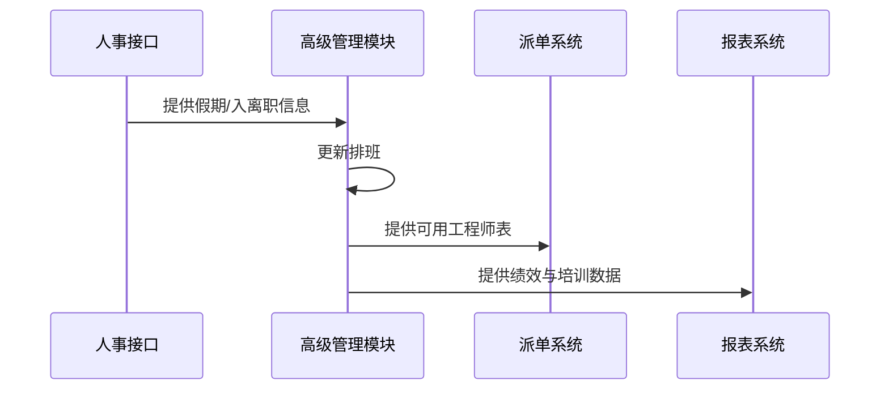

**异常流**
- 请假申请超出周期班额：自动驳回并提示原因
- 绩效数据缺失（工单系统故障）：延后计算并发起补数流程
- 培训报名超额：自动进入候补名单

#### 6. 非功能需求
- 支持 ≥ 5000 工程师的统一排班管理
- 排班生成耗时 ≤ 30 秒（P95）
- 绩效计算任务在日结后 10 分钟内完成
- 系统可用性 ≥ 99.9%

#### 7. 数据模型（字段级）

**engineer_performance（工程师绩效表）**

| 字段名 | 类型 | 可空 | 描述 | 约束/索引 |
|--------|------|------|------|-----------|
| perf_id | bigint | N | 绩效ID | PK |
| engineer_id | bigint | N | 工程师ID | FK engineers |
| period | date | N | 绩效周期（按月/季度） | idx_period |
| tickets_resolved | int | N | 解决工单数 |  |
| sla_compliance | decimal(5,2) | N | SLA 达成率 |  |
| customer_rating | decimal(3,2) | N | 客户平均评分 |  |
| score | decimal(5,2) | N | 综合绩效分 | idx_score |

**engineer_schedule（工程师排班表）**

| 字段名 | 类型 | 可空 | 描述 | 约束/索引 |
|--------|------|------|------|-----------|
| schedule_id | bigint | N | 排班ID | PK |
| engineer_id | bigint | N | 工程师ID | FK engineers |
| date | date | N | 日期 | idx_date |
| shift | varchar(20) | N | 班次 |  |
| status | varchar(20) | N | 正常/假期/代班 | idx_status |

#### 8. 核心 API 示例

**生成排班表**
`POST /api/v1/engineers/schedule/generate`

```json
{
  "startDate": "2025-06-01",
  "endDate": "2025-06-30",
  "rules": {
    "minRestHours": 12,
    "maxShiftsPerWeek": 5,
    "skillRequirements": ["Database", "Network"]
  }
}
```

**响应**
```json
{
  "code": 200,
  "message": "success",
  "data": {
    "generatedSchedules": 4800,
    "status": "completed"
  }
}
```

#### 9. 异常与边界场景
- 员工高峰期请假导致 SLA 不达标 → 系统标红提醒调度员
- 培训证书到期未更新 → 自动提醒相关工程师和主管
- 跨部门调配冲突 → 需人工确认后方可执行

#### 10. 性能 / 容量规划
- 全员绩效计算时间 ≤ 10 分钟
- 排班导出文件支持一次性下载 ≥ 10 万条记录
- 培训记录存档 ≥ 5 年（合规要求）

#### 11. 安全与合规
- 绩效和培训记录仅对授权角色可见
- 排班数据访问需租户隔离
- 所有更改记录需存入操作审计日志

#### 12. 测试与验收标准
- 功能测试：绩效计算、自动排班、请假审批、培训管理
- 性能测试：大规模工程师数据下排班生成时间合规
- 安全测试：数据隔离验证、权限越权访问测试

#### 13. 模块依赖
- **输入**：工程师基础管理（REQ-006A）的档案和技能数据、人事系统的假期信息、工单管理绩效数据（REQ-003）、SLA 服务水平数据（REQ-017）
- **输出**：提供可用工程师数据给派单模块（REQ-004）、向报表模块（REQ-007）输出绩效报表、培训记录同步到人事系统

---

### REQ-018: 财务管理模块

**补充:** 财务管理模块是IT运维门户系统商业化运营的核心组件，实现与CRM模块和SLA管理模块的深度自动化集成。

#### 1. 业务描述
财务管理模块管理收费、账单、付款和财务分析，直接支持商业化运营。高阶版财务模块需实现与CRM模块（REQ-016）和SLA管理模块（REQ-017）的深度自动化集成：合同驱动周期计费，支持合同按月/按季度/按年自动生成账单，可叠加用量计费（工单费、增值服务费、SLA赔偿扣费）；权责发生制收入确认，区分现金流入与收入确认，实现财务合规；合同展期机制，合同即将到期或已到期时，在未签署新合同的情况下，可临时延长服务使用权（展期），避免因续签流程长导致停服；智能风控，基于AI分析客户历史付款、合同金额、SLA违约记录、CRM风险评级，提前识别高风险付款客户并推动催收；多渠道支付与对账，支持支付宝、微信、银企直连、信用卡等支付方式，并自动对账；财务预测与结构分析，结合合同周期结构，预测未来12~24个月的现金流高低谷、MRR、ARR，输出年付/季付/月付的比例及优化建议。

#### 2. KPI / 核心目标
- 自动生成账单准确率 ≥ 99.9%
- 账单生成延迟 ≤ 1 分钟
- 财务对账差异率 ≤ 0.5%
- 高风险付款客户提前识别率 ≥ 90%
- 催收成功率 ≥ 85%
- 周期结构目标：年付客户 ≥ 40%，季付客户 ≤ 40%，月付客户 ≤ 30%（可调整）
- 预测目标：滚动12个月现金流预测偏差 ≤ 5%
- 展期执行准确率 = 100%
- 展期到生效耗时 ≤ 5 分钟（P95）
- 因合同到期停服导致的用户流失率 ≤ 1%

#### 3. 功能需求表

| 功能编号 | 功能名称 | 描述 | 优先级 | KPI 关联 |
|---------|---------|------|--------|---------|
| F001 | 合同驱动计费 | 基于合同条款和 SLA 数据自动生成账单 | P0 | 准确率 |
| F002 | 多计费模式 | 支持固定费用、按用量（工单/小时/事件）、违约赔偿扣费 | P0 | 收入覆盖率 |
| F003 | 发票管理 | 电子发票申请、下载、税率设置 | P1 | 合规性 |
| F004 | 支付与对账 | 支持多渠道支付与自动对账 | P0 | 对账差异率 |
| F005 | 财务风控模型 | AI 预测付款风险并给出催收策略 | P1 | 催收成功率 |
| F006 | 账单通知与催收 | 自动推送账单到通知系统（REQ-011），高风险提前催收 | P0 | 高风险识别率 |
| F007 | 多币种与多税率 | 租户级货币、税率配置 | P2 | 全球化能力 |
| F008 | 合规与审计 | 财务操作留痕、账单溯源 | P0 | 审计覆盖率 |
| F009 | 财务预测与现金流分析 | 预测未来 12/24 个月现金流、MRR、ARR走势 | P1 | 预测偏差率 |
| F010 | 周期分布分析 | 分析付费周期结构，并输出优化建议 | P2 | 结构健康度 |
| F011 | 合同展期申请 | 合同到期前/后手动申请展期，避免停服 | P0 | 流失率 |
| F012 | 展期审批 | 按租户定义审批流，支持立即生效/审批生效 | P0 | 生效耗时 |
| F013 | 展期计费方式 | 展期期间按日、月折算或免费 | P0 | 收入准确率 |
| F014 | 展期记录关联 | 与原合同 & 新合同保持关联，便于追溯 | P0 | 审计准确率 |
| F015 | 到期提醒 | 到期前N天通知租户管理员，可引导展期 | P1 | 提前预警率 |
| F016 | 展期结束策略 | 到期后自动续费或停用 | P1 | 服务连续性 |

#### 4. 用户故事
- 作为财务人员，我希望系统能根据合同周期自动生成账单并推送客户
- 作为财务经理，我希望根据周期结构预测未来的现金流高峰和低谷，优化资金计划
- 作为租户管理员，我希望在新合同审批未完成前使用展期功能，避免停用风险
- 作为财务人员，我希望展期费用与后续合同周期衔接，计费准确
- 作为系统管理员，我希望展期结束自动切换新合同或停用，避免漏控
- 作为运营经理，我希望看到当前各付费周期客户占比，并能模拟调整后的现金流走势
- 作为销售经理，我希望在推动年付客户比例时系统能生成预测ROI报告

#### 5. 用户交互与流程（正常流 / 异常流）

**周期性计费与预测**
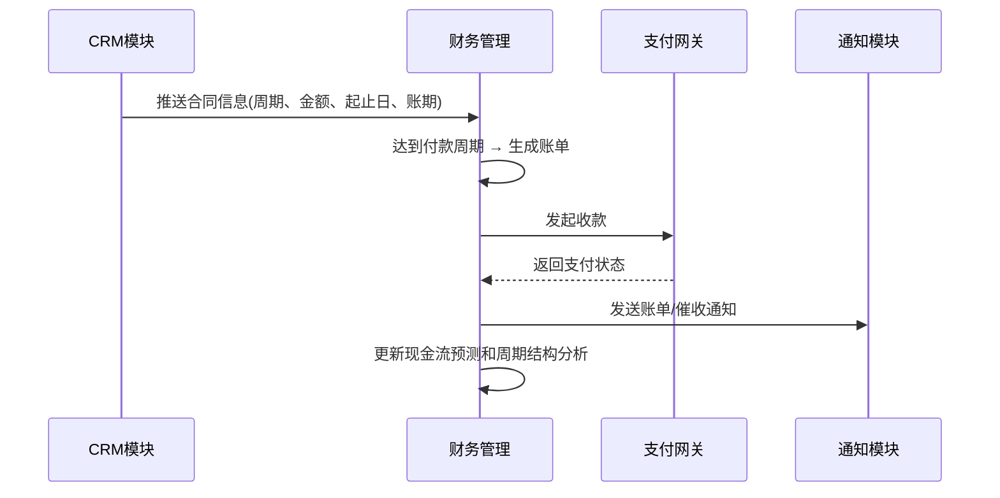

**合同展期**
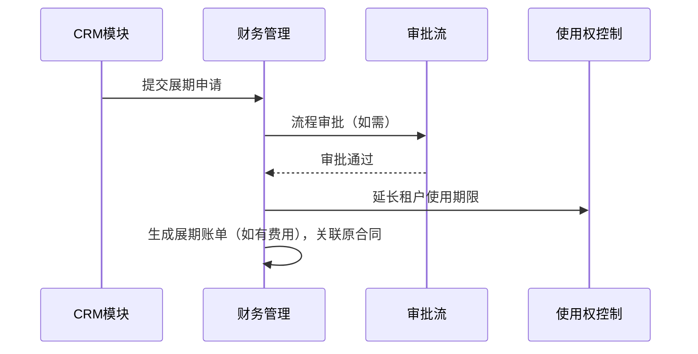

**异常流**
- 如果合同周期参数缺失 → 财务系统拒绝生成账单并提醒CRM补全信息
- 如果支付失败 → 系统自动重试 / 切换备用通道
- 如果预测模型收到合同变更 → 自动重算未来现金流和周期分布

#### 6. 非功能需求
- 年付账单生成在合同起始日 ≤ 1 分钟完成
- 财务预测计算未来 24 个月的滚动预测 ≤ 10 秒
- 预测偏差率 ≤ 5%（基于真实收款与预测比对）
- 账单生成延迟 ≤ 1 分钟
- 展期申请到生效 ≤ 5 分钟（P95）

#### 7. 数据模型（字段级）

**invoice（账单表）**

| 字段名 | 类型 | 可空 | 描述 | 约束/索引 |
|--------|------|------|------|-----------|
| invoice_id | bigint | N | 账单ID | PK |
| tenant_id | bigint | N | 租户ID | idx_tenant |
| customer_id | bigint | N | 客户ID | idx_customer |
| amount | decimal(12,2) | N | 金额 |  |
| currency | varchar(10) | N | 货币 |  |
| tax_rate | decimal(5,2) | Y | 税率 |  |
| sla_penalty | decimal(12,2) | Y | SLA 违约赔偿金额 |  |
| status | varchar(20) | N | unpaid/paid/overdue | idx_status |
| due_date | date | N | 到期日 | idx_due |
| risk_level | varchar(20) | Y | 风险等级 | idx_risk |
| billing_cycle | varchar(20) | N | month/quarter/year |
| contract_start_date | date | N | 合同生效日期 |
| contract_end_date | date | N | 合同结束日期 |
| precharge_days | int | Y | 提前收款天数，默认0 |
| recognition_period | int | Y | 收入确认周期（月），年付可填12 |
| forecast_flag | boolean | N | 是否纳入预测模型 |
| created_at | timestamp | N | 创建时间 | idx_created |

**contract_extension（合同展期表）**

| 字段 | 类型 | 描述 |
|------|-----|------|
| extension_id | bigint | 展期ID |
| contract_id | bigint | 原合同ID |
| tenant_id | bigint | 租户ID |
| start_date | date | 展期起始日 |
| end_date | date | 展期结束日 |
| extension_type | varchar | daily_prorated / monthly / free |
| extension_fee | decimal | 展期费用 |
| approval_status | varchar | pending/approved/rejected |
| linked_new_contract_id | bigint | 新合同ID（生效后关联） |

#### 8. 核心 API 示例

**生成账单**
`POST /api/v1/finance/invoices/generate`

```json
{
  "contractId": "CONTRACT-001",
  "billingPeriod": "2025-06",
  "includeUsageFees": true,
  "includeSLAPenalties": true
}
```

**响应**
```json
{
  "code": 200,
  "message": "success",
  "data": {
    "invoiceId": "INV-202506-001",
    "amount": 8500.00,
    "currency": "CNY",
    "dueDate": "2025-07-01"
  }
}
```

#### 9. 异常与边界场景
- 合同周期参数缺失 → 财务系统拒绝生成账单并提醒CRM补全信息
- 支付失败 → 系统自动重试/切换备用通道
- 预测模型收到合同变更 → 自动重算未来现金流和周期分布
- 展期申请冲突 → 系统提示并要求确认覆盖
- 高风险客户逾期 → 自动触发催收流程并通知相关人员

#### 10. 性能 / 容量规划
- 支持 ≥ 10万客户的财务数据管理
- 账单批量生成支持 ≥ 1万张/小时
- 财务预测计算支持 ≥ 24个月滚动预测
- 支付对账处理能力 ≥ 1000笔/分钟

#### 11. 安全与合规
- 财务数据加密存储和传输
- 支付信息符合PCI DSS标准
- 财务操作全程审计记录
- 多租户财务数据严格隔离
- 符合财务合规和税务要求

#### 12. 测试与验收标准
- 功能测试：账单生成、支付处理、展期管理、财务预测
- 性能测试：大批量账单生成、高并发支付处理
- 安全测试：财务数据加密、支付安全、权限控制
- 合规测试：财务报表准确性、税务计算正确性

#### 13. 模块依赖
- **输入**：CRM模块（REQ-016）的合同信息、SLA管理（REQ-017）的违约数据、工单管理（REQ-003）的用量数据
- **输出**：向通知系统（REQ-011）推送账单和催收消息、向报表系统（REQ-007）提供财务分析数据

---

### REQ-019: 客户自助服务模块

**补充:** 客户自助服务门户是客户（甲方用户）直接与运维平台交互的前端入口，旨在通过自助知识检索、AI问答、工单自建与跟踪、服务状态可视化等功能，降低人工客服压力、缩短问题解决时间、提升客户满意度。

#### 1. 业务描述
客户自助服务门户为客户提供7x24小时自助服务能力，减少人工服务成本。模块需与知识库管理系统（REQ-005）、智能分析与AI功能（REQ-013）紧密集成，支持基于AI推荐的FAQ与智能问答功能；并与工单管理系统对接，实现自助提交与查询工单，以及服务状态跟踪。支持多终端访问（WEB、移动端），多租户隔离下的客户门户品牌化（LOGO、颜色、域名）。

#### 2. KPI / 核心目标
- 自助服务使用率 ≥ 60%
- 人工工单请求减少率 ≥ 40%
- 知识复用率 ≥ 75%
- AI 推荐采纳率 ≥ 80%
- 自助服务满意度 ≥ 4.5 / 5

#### 3. 功能需求表

| 功能编号 | 功能名称 | 描述 | 优先级 | KPI 关联 |
|---------|---------|------|--------|---------|
| F001 | 客户专属登录门户 | 多租户隔离、品牌化自定义 | P0 | 使用率 |
| F002 | 智能FAQ系统 | 按类别/标签浏览FAQ，支持在线搜索 | P0 | 自助满意度 |
| F003 | AI 智能问答 | 接入REQ-013大模型接口，支持自然语言问答 | P0 | 推荐采纳率 |
| F004 | 知识库搜索与推荐 | 基于REQ-005知识库全文检索和AI推荐 | P0 | 知识复用率 |
| F005 | 自助工单创建 | 支持在线提交工单并上传附件 | P0 | 请求减少率 |
| F006 | 工单状态查询 | 查询工单处理进度与历史 | P0 | 请求减少率 |
| F007 | 服务状态可视化 | 展示系统运行状态、维护计划 | P1 | 满意度 |
| F008 | 文档下载中心 | 提供产品手册、运维指南下载 | P2 | 使用率 |
| F009 | 反馈与评价 | 提交问题解决后的评分和反馈 | P1 | 满意度 |

#### 4. 用户故事
- 作为客户，我希望在门户中用自然语言描述问题，系统能直接给出解决方案或推荐知识文章
- 作为客户，我希望能在线提交工单并即时收到确认通知，无需打电话
- 作为客户成功经理，我希望通过自助门户收集客户反馈，持续优化知识库

#### 5. 用户交互与流程（正常流 / 异常流）

**正常流**
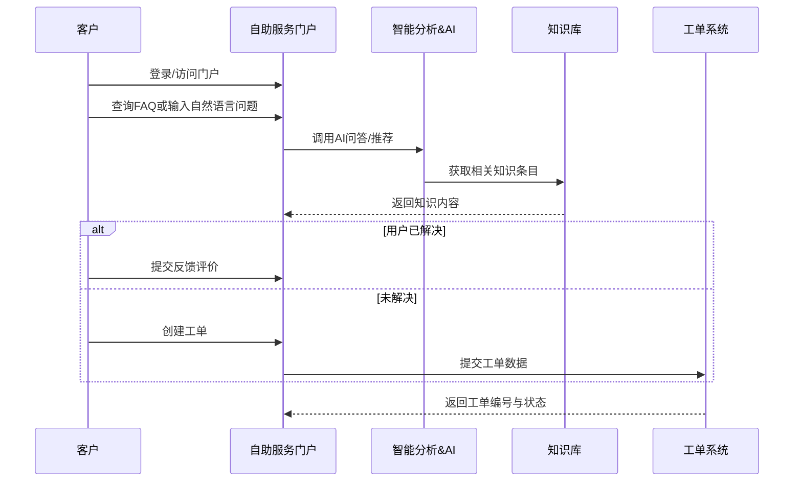

**异常流**
- AI 调用失败：回退到关键词搜索模式
- 知识库无匹配：提示提交工单
- 工单提交失败：提示用户重试并记录异常ID

#### 6. 非功能需求
- 支持 ≥ 5000 终端用户同时在线
- 工单创建响应时间 ≤ 2 秒
- 知识搜索延迟 ≤ 1 秒（P95）
- AI 问答延迟 ≤ 3 秒（P90）

#### 7. 数据模型（字段级）

**self_service_session（自助会话表）**

| 字段名 | 类型 | 可空 | 描述 | 约束/索引 |
|--------|------|------|------|-----------|
| session_id | bigint | N | 会话ID | PK |
| tenant_id | bigint | N | 租户ID | idx_tenant |
| customer_id | bigint | N | 客户ID | idx_customer |
| question | text | N | 用户提问/搜索内容 | fulltext |
| ai_response | text | Y | AI回答内容 |  |
| feedback | varchar(20) | Y | 反馈（solved/unsolved） |  |
| created_at | timestamp | N | 创建时间 | idx_created |

#### 8. 核心 API 示例

**AI 问答搜索**
`POST /api/v1/self-service/ai-query`

```json
{
  "tenantId": "TEN-1001",
  "customerId": "CUS-5001",
  "query": "MySQL 无法启动怎么办？"
}
```

**响应**
```json
{
  "code": 200,
  "message": "success",
  "data": {
    "answer": "MySQL无法启动通常有以下几种原因...",
    "relatedArticles": [
      {
        "id": "KB-001",
        "title": "MySQL启动故障排查指南",
        "url": "/knowledge/KB-001"
      }
    ],
    "confidence": 0.95
  }
}
```

#### 9. 异常与边界场景
- AI服务不可用 → 自动切换到关键词搜索模式
- 知识库搜索无结果 → 引导用户提交工单
- 用户频繁提交相同问题 → 智能识别并推荐相关知识
- 门户访问量激增 → 自动扩容和负载均衡

#### 10. 性能 / 容量规划
- 支持 ≥ 1万并发用户访问
- 知识库搜索响应时间 ≤ 500ms
- AI问答处理能力 ≥ 100 QPS
- 文档下载带宽支持 ≥ 100Mbps

#### 11. 安全与合规
- 客户数据多租户严格隔离
- 门户访问支持HTTPS加密
- 用户行为审计和日志记录
- 防止恶意访问和DDoS攻击

#### 12. 测试与验收标准
- 功能测试：FAQ搜索、AI问答、工单提交、状态查询
- 性能测试：高并发访问、搜索响应时间
- 安全测试：数据隔离、访问控制、防攻击能力
- 用户体验测试：界面友好性、操作便捷性

#### 13. 模块依赖
- **输入**：知识库管理（REQ-005）的知识内容、智能分析与AI（REQ-013）的问答能力、工单管理（REQ-003）的工单数据
- **输出**：向工单系统提交新工单、向知识库反馈使用统计、向AI系统提供训练数据

---

### REQ-022: 用户与权限管理模块

**补充:** 用户与权限管理模块是IT运维门户的身份认证与访问控制核心，实现用户生命周期管理、角色与权限配置、单点登录（SSO）、访问审计等能力。

#### 1. 业务描述
用户与权限管理模块提供多租户用户账户、角色、权限的集中管理能力，保障系统功能和数据安全。模块需支持多租户架构下的严格数据隔离、跨租户账号独立性。提供基于角色（RBAC）和细粒度权限（ABAC）组合的访问控制方案，可与外部身份源（LDAP、AD、OAuth 2.0、OIDC、SAML）集成，支持MFA（多因素认证）。支持动态权限评估（ABAC），可基于用户属性、资源属性、环境条件（如访问时间/IP）动态计算访问权限。

#### 2. KPI / 核心目标
- 多租户用户数据隔离事件 0 起
- 用户权限配置错误率 ≤ 1%
- 登录认证平均延迟 ≤ 500ms（P95）
- 账号生命周期事件记录覆盖率 100%

#### 3. 功能需求表

| 功能编号 | 功能名称 | 描述 | 优先级 | KPI 关联 |
|---------|---------|------|--------|---------|
| F001 | 用户生命周期管理 | 创建、启用、禁用、删除用户账号 | P0 | 管理效率 |
| F002 | 多租户隔离 | 每个租户用户空间独立 | P0 | 数据安全性 |
| F003 | 角色管理 | 创建、编辑、删除角色 | P0 | 管理效率 |
| F004 | 权限管理 | 分配模块级、功能级、数据级权限 | P0 | 权限配置准确率 |
| F005 | 外部身份源集成 | 支持 LDAP/AD/OAuth2/OIDC/SAML | P1 | 登录便捷性 |
| F006 | 单点登录(SSO) | 跨系统统一身份认证 | P1 | 登录便捷性 |
| F007 | 多因素认证(MFA) | OTP/SMS/Email 安全码 | P1 | 账号安全性 |
| F008 | 访问审计日志 | 登录、权限变更、操作记录 | P0 | 审计覆盖率 |
| F009 | 会话管理 | 查看/强制下线用户会话 | P1 | 安全性 |
| F010 | 权限模板 | 常用岗位权限集合快速分配 | P2 | 配置效率 |

#### 4. 用户故事
- 作为租户管理员，我希望能批量创建用户并分配相应角色，减少逐一配置的时间
- 作为安全负责人，我希望有权限查看所有用户的登录历史与权限变更记录，方便审计
- 作为新员工，我希望能够使用公司LDAP账号直接登录平台，无需单独注册
- 作为系统管理员，我希望能根据访问时间和位置动态限制用户权限，以提高安全性

#### 5. 用户交互与流程（正常流 / 异常流）

**正常流**
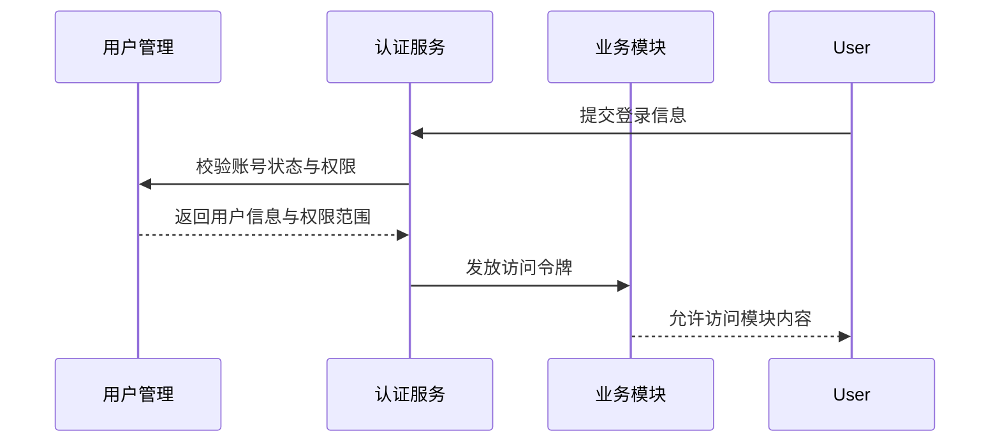

**异常流**
- 登录认证失败（密码错误/OTP错误） → 记录失败次数并根据策略锁定账号
- 跨租户访问企图 → 立即拒绝请求并记录审计日志
- 权限不足 → 返回 403 禁止访问

#### 6. 非功能需求
- 单租户用户数 ≥ 10 万
- 并发认证请求 ≥ 500 TPS
- MFA 验证延迟 ≤ 2 秒
- 高可用性 ≥ 99.99%

#### 7. 数据模型（字段级）

**user_account（用户账号表）**

| 字段名 | 类型 | 可空 | 描述 | 约束/索引 |
|--------|------|------|------|-----------|
| user_id | bigint | N | 用户ID | PK |
| tenant_id | bigint | N | 租户ID | idx_tenant |
| username | varchar(100) | N | 登录名 | uniq_tenant_username |
| email | varchar(255) | Y | 邮箱 | idx_email |
| phone | varchar(20) | Y | 手机号 | idx_phone |
| password_hash | varchar(255) | N | 加密后的密码 |  |
| status | varchar(20) | N | active/inactive | idx_status |
| created_at | timestamp | N | 创建时间 | idx_created |
| updated_at | timestamp | N | 更新时间 | idx_updated |

#### 8. 核心 API 示例

**创建用户**
`POST /api/v1/users`

```json
{
  "tenantId": "TEN-1001",
  "username": "jdoe",
  "email": "jdoe@example.com",
  "phone": "+8613812345678",
  "roleIds": ["ROLE-ADMIN", "ROLE-OPS"]
}
```

**响应**
```json
{
  "code": 200,
  "message": "success",
  "data": {"userId": "USR-202505-001"}
}
```

#### 9. 异常与边界场景
- 用户离职 → 自动禁用账户并回收权限
- 会话被盗用 → 强制下线并重置密码
- 用户批量导入空密码 → 生成临时密码并要求首次登录修改
- 权限冲突 → 系统提示并要求管理员确认
- 外部身份源不可用 → 回退到本地认证

#### 10. 性能 / 容量规划
- 支持 ≥ 100 万用户账号存储
- 高峰期认证延迟 ≤ 500ms
- 权限计算缓存命中率 ≥ 90%
- 支持 ≥ 1万并发登录请求

#### 11. 安全与合规
- 密码必须加密存储（bcrypt/SHA-256+盐）
- MFA 数据加密传输与存储
- 登录与权限变更日志保存 ≥ 5 年
- 符合二级等保或更高安全标准
- 支持密码策略配置和定期更换

#### 12. 测试与验收标准
- 功能测试：用户增删改查、分配角色、权限验证、多因素认证
- 性能测试：高并发登录、权限校验响应时间
- 安全测试：密码加密、会话安全、权限越权测试
- 集成测试：外部身份源集成、SSO功能验证

#### 13. 模块依赖
- **输入**：基础架构模块（REQ-001）的多租户支持、外部身份源（LDAP/AD等）
- **输出**：为所有业务模块提供身份认证和权限校验服务、向审计系统提供操作日志

---

### REQ-021: 资源权限管理模块

**补充:** 资源权限管理模块是用户与权限管理模块（REQ-022）的细化延伸，支持对象级/记录级/字段级权限管理，实现RBAC（基于角色）+ ABAC（基于属性）+ PBAC（基于策略）的组合式访问控制策略。

#### 1. 业务描述
资源权限管理模块针对平台内的具体业务资源（如单条工单、知识库文章、资产记录、报表文件、配置项等）进行细粒度权限控制，确保用户只能访问有权操作的特定资源。模块支持对象级（某类资源的增删改查权限）、记录级（同类资源中，限制只能访问自己创建或被授权的记录）、字段级（同一条记录中，仅能访问部分字段）权限管理。模块需支持多租户隔离、批量授权、临时授权、链路审计，并与工单管理（REQ-003）、知识库（REQ-005）、财务管理（REQ-018）等模块深度集成。

#### 2. KPI / 核心目标
- 非授权访问阻断率 = 100%
- 权限变更生效延迟 ≤ 3 秒
- 多租户数据访问违规事件 0 起
- 授权配置错误率 ≤ 1%（人工复核比对）

#### 3. 功能需求表

| 功能编号 | 功能名称 | 描述 | 优先级 | KPI 关联 |
|---------|---------|------|--------|---------|
| F001 | 对象级权限管理 | 模块级/资源类别级的 CRUD 权限配置 | P0 | 阻断率 |
| F002 | 记录级权限管理 | 基于记录归属或属性动态授权 | P0 | 阻断率 |
| F003 | 字段级权限管理 | 限制查看或编辑特定字段 | P0 | 数据安全 |
| F004 | 多租户隔离策略 | 不同租户资源物理与逻辑隔离 | P0 | 零违规事件 |
| F005 | 属性驱动权限（ABAC） | 根据用户、资源和环境属性动态决策授权 | P1 | 灵活性 |
| F006 | 权限模板与批量授权 | 权限集合快速分配/回收 | P1 | 配置效率 |
| F007 | 临时授权 | 指定有效期和范围的短期授权 | P1 | 审批响应速度 |
| F008 | 链路审计 | 记录每一次资源访问请求（资源ID+用户+时间+结果） | P0 | 审计覆盖率 |

#### 4. 用户故事
- 作为工单系统用户，我希望只能访问自己负责或创建的工单详情
- 作为财务人员，我希望在同一份报表中只能看到与我财务权限相关的字段数据，而非全量内容
- 作为管理员，我希望能临时授权一个外部审计人员访问某些资产数据，且到期自动失效
- 作为安全管理员，我希望有完整的资源访问链路日志，确保违规访问可回溯

#### 5. 用户交互与流程（正常流 / 异常流）

**记录级访问控制流**
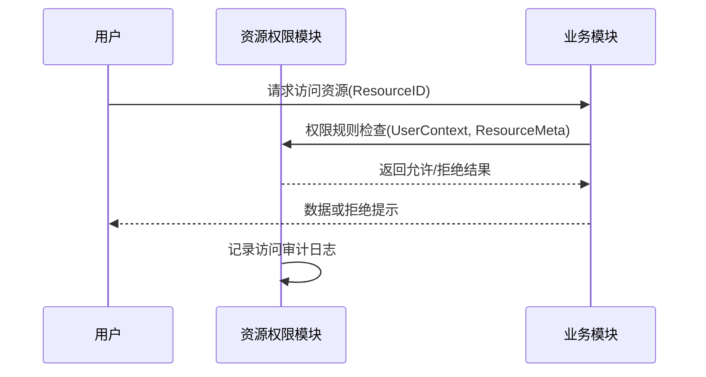

**异常流**
- 无匹配权限规则 → 默认拒绝访问
- 临时授权过期 → 自动撤销并拒绝访问
- 审计日志写入失败 → 记录至冗余存储并触发告警

#### 6. 非功能需求
- 每秒权限校验请求 ≥ 2000 次
- 平均权限校验延迟 ≤ 10 ms（P95）
- 审计日志记录成功率 = 100%
- 支持 ≥ 5 年审计日志保存

#### 7. 数据模型（字段级）

**resource_permission（资源权限表）**

| 字段名 | 类型 | 可空 | 描述 | 约束/索引 |
|--------|------|------|------|-----------|
| perm_id | bigint | N | 权限记录ID | PK |
| tenant_id | bigint | N | 租户ID | idx_tenant |
| resource_type | varchar(50) | N | 资源类型（ticket, kb_article等） | idx_type |
| resource_id | varchar(100) | N | 资源唯一标识 | idx_resource |
| user_id | bigint | Y | 被授权用户ID | idx_user |
| role_id | bigint | Y | 被授权角色ID | idx_role |
| fields_allowed | jsonb | Y | 允许访问的字段列表 |  |
| conditions | jsonb | Y | ABAC属性条件 |  |
| valid_from | timestamp | Y | 授权开始时间 |  |
| valid_to | timestamp | Y | 授权结束时间 | idx_expiry |

#### 8. 核心 API 示例

**检查资源访问权限**
`POST /api/v1/resource-permissions/check`

```json
{
  "userId": "USR-202505-001",
  "resourceType": "ticket",
  "resourceId": "TCK-10086",
  "action": "read"
}
```

**响应**
```json
{
  "code": 200,
  "message": "success",
  "data": {
    "allowed": true,
    "fields": ["title", "status", "created_at", "description"]
  }
}
```

#### 9. 异常与边界场景
- 用户存在多个角色 → 多角色权限合并求最大允许范围
- 资源已归档/删除 → 自动拒绝访问
- 审计日志超大 → 自动归档分片存储
- 权限规则冲突 → 按最严格规则执行

#### 10. 性能 / 容量规划
- 高峰期 QPS ≥ 5000 权限校验
- 权限缓存命中率 ≥ 95%
- 审计日志单表存储过亿条时需自动分表
- 支持 ≥ 100万资源的权限管理

#### 11. 安全与合规
- 权限配置改动必须记录变更日志
- 资源访问日志全量保存 ≥ 5 年（符合等保、SOX、GDPR）
- 跨租户数据访问严格拒绝
- 支持权限审计和合规检查

#### 12. 测试与验收标准
- 功能测试：对象/记录/字段级权限控制、临时授权、条件规则
- 性能测试：高并发权限校验、缓存命中率
- 安全测试：越权访问封堵、跨租户访问隔离
- 合规测试：审计日志完整性、权限变更追溯

#### 13. 模块依赖
- **输入**：用户与权限管理（REQ-022）的用户角色信息、各业务模块的资源元数据
- **输出**：向业务模块提供访问控制结果、向审计系统提供访问日志

---

### REQ-020: 移动端应用模块

**补充:** 移动端应用模块为IT运维门户系统提供移动设备访问能力，支持工程师和客户在移动设备上进行运维操作和服务管理。

#### 1. 业务描述
移动端应用模块为IT运维门户系统提供移动设备访问能力，包括iOS和Android原生应用以及响应式Web应用。模块支持工程师移动办公、客户移动自助服务、实时通知推送、离线数据同步等功能。通过移动端应用，工程师可以随时随地处理工单、查看系统状态、接收派单通知；客户可以便捷地提交工单、查询服务状态、获取技术支持。

#### 2. KPI / 核心目标
- 移动端用户活跃度 ≥ 70%
- 移动端工单处理率 ≥ 40%
- 应用响应时间 ≤ 2秒
- 离线数据同步成功率 ≥ 99%
- 用户满意度 ≥ 4.5/5

#### 3. 功能需求表

| 功能编号 | 功能名称 | 描述 | 优先级 | KPI 关联 |
|---------|---------|------|--------|---------|
| F001 | 移动端工单管理 | 查看、处理、更新工单状态 | P0 | 处理率 |
| F002 | 实时通知推送 | 工单派发、状态变更、紧急告警推送 | P0 | 响应时间 |
| F003 | 移动端客户自助 | 客户移动端提交工单、查询状态 | P0 | 用户活跃度 |
| F004 | 离线数据同步 | 支持离线查看和操作，联网后同步 | P1 | 同步成功率 |
| F005 | 地理位置服务 | 基于位置的工程师派单和签到 | P1 | 派单准确率 |
| F006 | 语音输入支持 | 语音转文字，快速记录工单信息 | P2 | 用户体验 |
| F007 | 扫码功能 | 扫描设备二维码快速创建工单 | P2 | 操作效率 |
| F008 | 多媒体支持 | 拍照、录音、视频记录故障现象 | P1 | 问题解决率 |

#### 4. 用户故事
- 作为工程师，我希望在移动设备上接收工单通知并能快速响应
- 作为客户，我希望通过手机应用随时提交工单和查询处理进度
- 作为现场工程师，我希望能拍照记录设备状态并上传到工单系统
- 作为管理员，我希望通过移动端实时监控系统状态和团队工作情况

#### 5. 用户交互与流程（正常流 / 异常流）

**移动端工单处理流程**
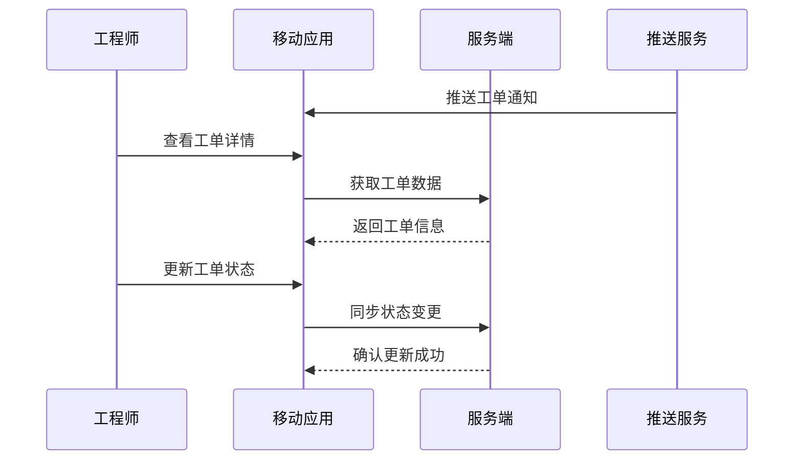

**异常流**
- 网络连接中断 → 数据缓存到本地，恢复连接后自动同步
- 推送服务失败 → 应用内轮询获取最新通知
- 定位服务不可用 → 手动输入位置信息或跳过位置验证

#### 6. 非功能需求
- 支持 ≥ 1万并发移动用户
- 应用启动时间 ≤ 3秒
- 数据加载时间 ≤ 2秒
- 离线模式支持 ≥ 24小时
- 电池续航优化，后台运行功耗 ≤ 5%

#### 7. 数据模型（字段级）

**mobile_session（移动端会话表）**

| 字段名 | 类型 | 可空 | 描述 | 约束/索引 |
|--------|------|------|------|-----------|
| session_id | bigint | N | 会话ID | PK |
| user_id | bigint | N | 用户ID | idx_user |
| device_id | varchar(100) | N | 设备唯一标识 | idx_device |
| platform | varchar(20) | N | iOS/Android/Web | idx_platform |
| app_version | varchar(20) | N | 应用版本 |  |
| last_sync_time | timestamp | N | 最后同步时间 | idx_sync |
| location_lat | decimal(10,8) | Y | 纬度 |  |
| location_lng | decimal(11,8) | Y | 经度 |  |
| created_at | timestamp | N | 创建时间 | idx_created |

#### 8. 核心 API 示例

**移动端数据同步**
`POST /api/v1/mobile/sync`

```json
{
  "deviceId": "DEVICE-001",
  "lastSyncTime": "2025-06-01T10:00:00Z",
  "localChanges": [
    {
      "type": "ticket_update",
      "ticketId": "TCK-001",
      "status": "in_progress",
      "timestamp": "2025-06-01T10:30:00Z"
    }
  ]
}
```

**响应**
```json
{
  "code": 200,
  "message": "success",
  "data": {
    "serverChanges": [
      {
        "type": "new_ticket",
        "ticketId": "TCK-002",
        "assignedTo": "ENG-001",
        "timestamp": "2025-06-01T10:45:00Z"
      }
    ],
    "syncTime": "2025-06-01T11:00:00Z"
  }
}
```

#### 9. 异常与边界场景
- 应用版本过低 → 强制更新或降级兼容
- 设备存储空间不足 → 清理缓存数据或提示用户
- 网络环境差 → 启用数据压缩和断点续传
- 设备权限不足 → 引导用户开启必要权限
- 多设备登录冲突 → 提示用户选择保留哪个设备会话

#### 10. 性能 / 容量规划
- 支持 ≥ 5万移动设备同时在线
- 推送服务处理能力 ≥ 10万条/分钟
- 离线数据存储 ≤ 100MB/设备
- 图片视频上传支持 ≤ 50MB/文件
- 数据同步延迟 ≤ 5秒

#### 11. 安全与合规
- 移动端数据加密存储和传输
- 支持生物识别认证（指纹、面部识别）
- 设备绑定和远程擦除功能
- 应用防篡改和反调试保护
- 符合移动应用安全标准

#### 12. 测试与验收标准
- 功能测试：工单处理、通知推送、数据同步、离线操作
- 性能测试：应用启动速度、数据加载时间、电池续航
- 兼容性测试：不同设备型号、操作系统版本适配
- 安全测试：数据加密、权限控制、防攻击能力

#### 13. 模块依赖
- **输入**：工单管理（REQ-003）的工单数据、通知系统（REQ-011）的推送服务、用户权限（REQ-022）的认证信息
- **输出**：向服务端同步移动端操作数据、向统计系统提供移动端使用数据

---

### REQ-023: 数据分析与商业智能模块

**补充:** 数据分析与商业智能模块为IT运维门户系统提供深度数据分析和商业洞察能力，支持运营决策和业务优化。

#### 1. 业务描述
数据分析与商业智能模块为IT运维门户系统提供全面的数据分析和商业智能能力，包括运营数据分析、业务趋势预测、客户行为分析、成本效益分析等。模块通过数据挖掘、机器学习、统计分析等技术，从海量运维数据中提取有价值的商业洞察，为管理层决策提供数据支撑。支持自定义分析报表、实时数据大屏、预警机制等功能，帮助企业优化运维流程、提升服务质量、降低运营成本。

#### 2. KPI / 核心目标
- 数据分析准确率 ≥ 95%
- 预测模型准确率 ≥ 90%
- 报表生成时间 ≤ 30秒
- 数据处理延迟 ≤ 5分钟
- 用户采纳率 ≥ 80%

#### 3. 功能需求表

| 功能编号 | 功能名称 | 描述 | 优先级 | KPI 关联 |
|---------|---------|------|--------|---------|
| F001 | 运营数据分析 | 工单量、处理时间、满意度等运营指标分析 | P0 | 分析准确率 |
| F002 | 业务趋势预测 | 基于历史数据预测业务发展趋势 | P0 | 预测准确率 |
| F003 | 客户行为分析 | 分析客户使用模式、偏好、流失风险 | P1 | 用户采纳率 |
| F004 | 成本效益分析 | 分析运维成本构成和ROI | P1 | 分析准确率 |
| F005 | 实时数据大屏 | 关键指标实时监控和展示 | P0 | 数据延迟 |
| F006 | 自定义分析报表 | 用户自定义分析维度和报表格式 | P1 | 报表生成时间 |
| F007 | 异常检测与预警 | 自动识别异常模式并发出预警 | P0 | 预测准确率 |
| F008 | 数据挖掘与洞察 | 深度挖掘数据中的隐藏模式和关联关系 | P2 | 洞察价值 |

#### 4. 用户故事
- 作为运营经理，我希望通过数据分析了解运维效率的变化趋势和改进空间
- 作为财务经理，我希望分析运维成本构成，识别成本优化机会
- 作为客户成功经理，我希望预测客户流失风险，提前采取挽留措施
- 作为高管，我希望通过实时大屏监控整体业务运营状况

#### 5. 用户交互与流程（正常流 / 异常流）

**数据分析流程**
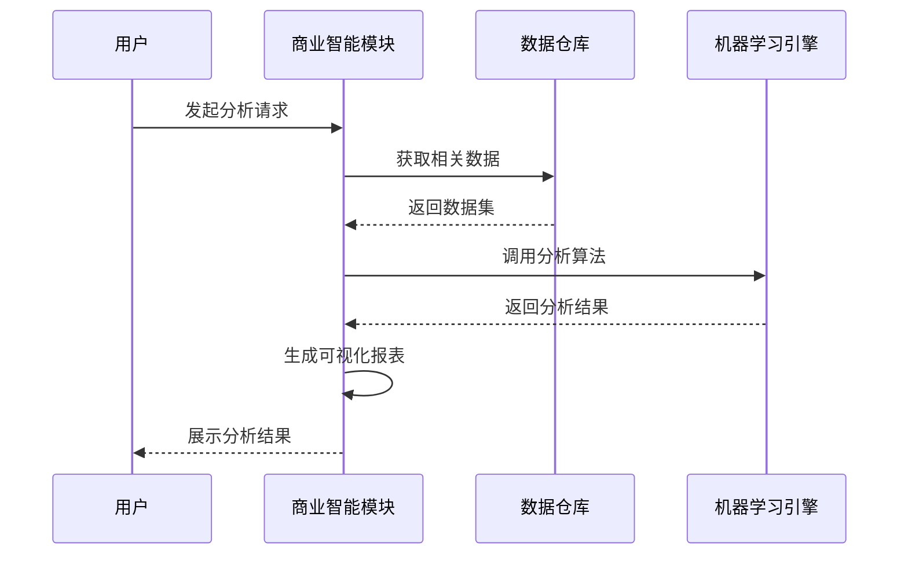

**异常流**
- 数据源不可用 → 使用缓存数据或提示用户稍后重试
- 分析算法执行失败 → 回退到基础统计分析
- 报表生成超时 → 异步处理并通知用户完成时间
- 数据质量问题 → 标记异常数据并提供数据清洗建议

#### 6. 非功能需求
- 支持 ≥ TB级数据分析处理
- 复杂分析查询响应时间 ≤ 60秒
- 支持 ≥ 100并发分析请求
- 数据刷新频率 ≤ 5分钟
- 系统可用性 ≥ 99.5%

#### 7. 数据模型（字段级）

**analysis_report（分析报表表）**

| 字段名 | 类型 | 可空 | 描述 | 约束/索引 |
|--------|------|------|------|-----------|
| report_id | bigint | N | 报表ID | PK |
| tenant_id | bigint | N | 租户ID | idx_tenant |
| report_name | varchar(200) | N | 报表名称 |  |
| report_type | varchar(50) | N | 报表类型 | idx_type |
| data_source | varchar(100) | N | 数据源 |  |
| analysis_config | jsonb | N | 分析配置 |  |
| result_data | jsonb | Y | 分析结果 |  |
| status | varchar(20) | N | pending/completed/failed | idx_status |
| created_by | bigint | N | 创建人 | idx_creator |
| created_at | timestamp | N | 创建时间 | idx_created |
| updated_at | timestamp | N | 更新时间 | idx_updated |

#### 8. 核心 API 示例

**创建分析任务**
`POST /api/v1/analytics/reports`

```json
{
  "reportName": "月度运维效率分析",
  "reportType": "efficiency_analysis",
  "timeRange": {
    "startDate": "2025-05-01",
    "endDate": "2025-05-31"
  },
  "dimensions": ["engineer", "ticket_type", "priority"],
  "metrics": ["resolution_time", "customer_satisfaction", "sla_compliance"]
}
```

**响应**
```json
{
  "code": 200,
  "message": "success",
  "data": {
    "reportId": "RPT-202506-001",
    "status": "pending",
    "estimatedTime": "2-3 minutes"
  }
}
```

#### 9. 异常与边界场景
- 数据量过大导致分析超时 → 自动分批处理或建议缩小分析范围
- 数据源连接失败 → 使用备用数据源或历史缓存数据
- 机器学习模型预测异常 → 回退到统计分析方法
- 并发分析请求过多 → 排队处理并提供预估等待时间
- 分析结果异常 → 标记异常并提供人工审核建议

#### 10. 性能 / 容量规划
- 支持 ≥ 10TB历史数据分析
- 实时数据处理能力 ≥ 10万条/秒
- 复杂分析任务并发处理 ≥ 50个
- 报表缓存命中率 ≥ 80%
- 数据存储保留期 ≥ 3年

#### 11. 安全与合规
- 敏感数据脱敏处理
- 分析结果访问权限控制
- 数据分析操作审计记录
- 符合数据保护法规要求
- 支持数据导出加密

#### 12. 测试与验收标准
- 功能测试：数据分析、报表生成、预测模型、异常检测
- 性能测试：大数据量处理、并发分析、响应时间
- 准确性测试：分析结果准确性、预测模型有效性
- 安全测试：数据脱敏、权限控制、审计日志

#### 13. 模块依赖
- **输入**：所有业务模块的运营数据、财务管理（REQ-018）的成本数据、客户关系管理（REQ-016）的客户数据
- **输出**：向管理层提供分析报告、向各业务模块提供数据洞察、向预警系统提供异常检测结果

---

## 6. 附录

### 6.1 术语表

| 术语 | 定义 |
|------|------|
| SLA | Service Level Agreement，服务水平协议 |
| MTTR | Mean Time To Repair，平均修复时间 |
| MTTF | Mean Time To Failure，平均故障时间 |
| KPI | Key Performance Indicator，关键绩效指标 |
| API | Application Programming Interface，应用程序编程接口 |
| RBAC | Role-Based Access Control，基于角色的访问控制 |
| SSO | Single Sign-On，单点登录 |
| MFA | Multi-Factor Authentication，多因素认证 |

### 6.2 参考文档

- IT运维门户系统技术架构文档 v2.1
- 数据库设计规范 v1.3
- API接口设计规范 v2.0
- 安全设计规范 v1.5
- 测试规范文档 v1.2
- 多租户架构设计指南 v1.0
- 微服务部署运维手册 v1.1

### 6.3 开发优先级说明

#### P0 核心模块（第一阶段开发）
必须优先完成的基础功能模块，是系统运行的最小可行版本：
- REQ-001: 基础架构模块
- REQ-002: 工作台与仪表板
- REQ-003: 工单管理系统
- REQ-004: 智能派单系统
- REQ-006A: 工程师基础管理
- REQ-010: 系统管理模块
- REQ-022: 用户与权限管理模块

#### P1 重要模块（第二阶段开发）
商业化运营必需的功能模块：
- REQ-005: 知识库管理系统
- REQ-006B: 工程师高级管理
- REQ-007: 甲方管理与报表系统
- REQ-011: 通知与消息系统
- REQ-012: 系统集成模块
- REQ-016: 客户关系管理模块
- REQ-017: SLA管理模块
- REQ-018: 财务管理模块

#### P2 扩展模块（第三阶段开发）
增强用户体验和系统智能化的功能模块：
- REQ-008: 系统设置
- REQ-009: 运维管理
- REQ-013: 智能分析与AI功能
- REQ-014: 工作流引擎系统
- REQ-015: 用户体验增强系统
- REQ-019: 客户自助服务模块
- REQ-020: 移动端应用模块
- REQ-021: 资源权限管理模块
- REQ-023: 数据分析与商业智能模块

### 6.4 关键技术选型

#### 后端技术栈
- **开发语言**: Java 17
- **应用框架**: Spring Boot 3.2.11
- **安全框架**: Spring Security 6.x
- **数据访问**: Spring Data JPA 3.x
- **数据库**: PostgreSQL 15+ (主库), Redis 7+ (缓存)
- **搜索引擎**: Elasticsearch 8.x
- **消息队列**: RabbitMQ 3.12+
- **文件存储**: MinIO (对象存储)

#### 前端技术栈
- **开发框架**: Vue 3.4.15
- **构建工具**: Vite 5.x
- **UI组件库**: Element Plus 2.x
- **状态管理**: Pinia 2.x
- **路由管理**: Vue Router 4.x
- **HTTP客户端**: Axios 1.x

#### 基础设施
- **容器化**: Docker + Docker Compose
- **编排平台**: Kubernetes (生产环境)
- **监控系统**: Prometheus + Grafana
- **日志系统**: ELK Stack (Elasticsearch + Logstash + Kibana)
- **API网关**: Spring Cloud Gateway
- **服务发现**: Consul / Eureka

### 6.5 模块映射表

| 模块编号 | 模块名称 | 优先级 | 分类 | 主要功能 |
|---------|---------|--------|------|----------|
| REQ-001 | 基础架构模块 | P0 | 基础支撑 | 多租户架构、统一认证、数据存储 |
| REQ-002 | 工作台与仪表板 | P0 | 用户界面 | 个性化工作空间、数据可视化 |
| REQ-003 | 工单管理系统 | P0 | 核心业务 | 工单全生命周期管理 |
| REQ-004 | 智能派单系统 | P0 | 核心业务 | AI算法自动派单 |
| REQ-005 | 知识库管理系统 | P1 | 支撑服务 | 知识沉淀与复用 |
| REQ-006A | 工程师基础管理 | P0 | 人员管理 | 工程师档案、技能管理 |
| REQ-006B | 工程师高级管理 | P1 | 人员管理 | 绩效分析、排班调度 |
| REQ-007 | 甲方管理与报表系统 | P1 | 客户服务 | 甲方界面、服务报表 |
| REQ-008 | 系统设置 | P2 | 系统管理 | 系统参数、业务规则配置 |
| REQ-009 | 运维管理 | P2 | 系统管理 | 系统监控、性能分析 |
| REQ-010 | 系统管理模块 | P0 | 系统管理 | 用户管理、权限管理 |
| REQ-011 | 通知与消息系统 | P1 | 支撑服务 | 多渠道消息通知 |
| REQ-012 | 系统集成模块 | P1 | 集成服务 | 第三方系统集成 |
| REQ-013 | 智能分析与AI功能 | P2 | 智能化 | AI分析、故障预测 |
| REQ-014 | 工作流引擎系统 | P2 | 流程自动化 | 业务流程建模与执行 |
| REQ-015 | 用户体验增强系统 | P2 | 用户体验 | 界面优化、个性化定制 |
| REQ-016 | 客户关系管理模块 | P1 | 商业化 | 客户全生命周期管理 |
| REQ-017 | SLA管理模块 | P1 | 商业化 | 服务水平协议管理 |
| REQ-018 | 财务管理模块 | P1 | 商业化 | 智能计费、财务分析 |
| REQ-019 | 客户自助服务模块 | P2 | 客户服务 | 7x24小时自助服务 |
| REQ-020 | 移动端应用模块 | P2 | 移动化 | 移动设备访问能力 |
| REQ-021 | 资源权限管理模块 | P2 | 安全管理 | 细粒度权限控制 |
| REQ-022 | 用户与权限管理模块 | P0 | 基础支撑 | 身份认证、访问控制 |
| REQ-023 | 数据分析与商业智能模块 | P2 | 数据分析 | 深度数据分析、商业洞察 |

### 6.6 跨模块依赖闭环图

以下是系统各模块间的核心依赖关系图，展示了业务流程的完整闭环：

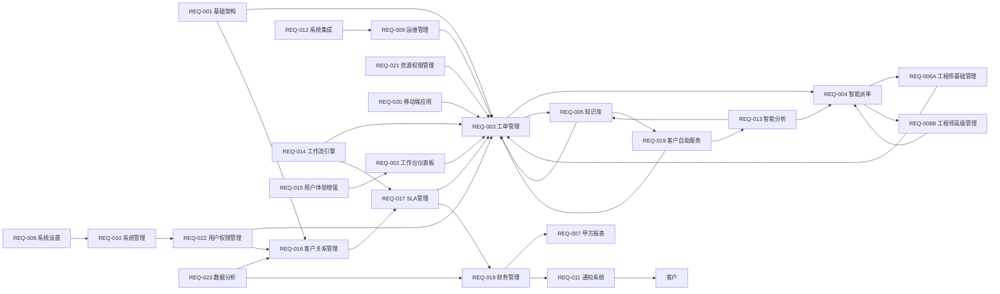

### 6.7商业化闭环流程

系统的核心商业化闭环如下：

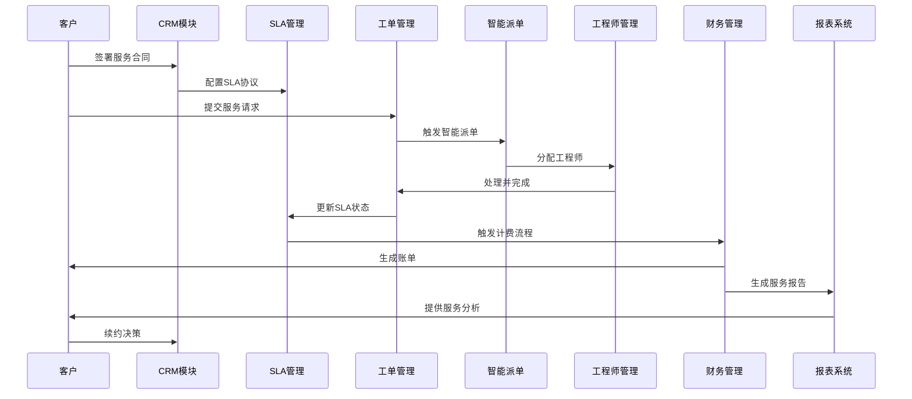

### 6.8 开发优先级说明

#### P0 核心模块（第一阶段开发）
必须优先完成的基础功能模块，是系统运行的最小可行版本：
- REQ-001: 基础架构模块
- REQ-002: 工作台与仪表板
- REQ-003: 工单管理系统
- REQ-004: 智能派单系统
- REQ-006A: 工程师基础管理
- REQ-010: 系统管理模块
- REQ-022: 用户与权限管理模块

#### P1 重要模块（第二阶段开发）
商业化运营必需的功能模块：
- REQ-005: 知识库管理系统
- REQ-006B: 工程师高级管理
- REQ-007: 甲方管理与报表系统
- REQ-011: 通知与消息系统
- REQ-012: 系统集成模块
- REQ-016: 客户关系管理模块
- REQ-017: SLA管理模块
- REQ-018: 财务管理模块

#### P2 扩展模块（第三阶段开发）
增强用户体验和系统智能化的功能模块：
- REQ-008: 系统设置
- REQ-009: 运维管理
- REQ-013: 智能分析与AI功能
- REQ-014: 工作流引擎系统
- REQ-015: 用户体验增强系统
- REQ-019: 客户自助服务模块
- REQ-020: 移动端应用模块
- REQ-021: 资源权限管理模块
- REQ-023: 数据分析与商业智能模块

### 6.9 部署架构建议

#### 开发环境
- **单机部署**: Docker Compose 一键启动
- **数据库**: PostgreSQL + Redis 容器化部署
- **前后端**: 本地开发服务器
- **外部依赖**: Mock服务模拟

#### 测试环境
- **微服务部署**: Kubernetes 集群
- **数据库**: 独立数据库实例
- **负载均衡**: Nginx + Ingress Controller
- **监控**: 完整监控体系

#### 生产环境
- **高可用部署**: 多节点 Kubernetes 集群
- **数据库**: 主从复制 + 读写分离
- **缓存**: Redis 集群模式
- **CDN**: 静态资源加速
- **备份**: 自动化备份策略

### 6.10 版本变更记录

| 版本 | 日期 | 变更内容 | 变更人 |
|------|------|----------|--------|
| v4.5 | 2025-01-11 | 融合v4.4和v4.2内容，完善23个模块的完整需求 | 产品团队 |
| v4.4 | 2025-01-10 | 细化P0模块需求，增强业务流程描述 | 产品团队 |
| v4.2 | 2025-01-08 | 建立完整模块体系，涵盖P0/P1/P2全部功能 | 产品团队 |

### 6.11 联系信息

**产品团队**
- 产品经理: [待填写]
- 技术负责人: [待填写]
- 项目经理: [待填写]

**技术支持**
- 邮箱: tech-support@ops-portal.com
- 文档仓库: [项目Git仓库地址]
- 在线文档: [在线文档地址]

---

**文档版本**: v4.5
**最后更新**: 2025年8月11日
**文档状态**: 正式版
**下次评审**: 2025年8月11日

---

**文档结束**