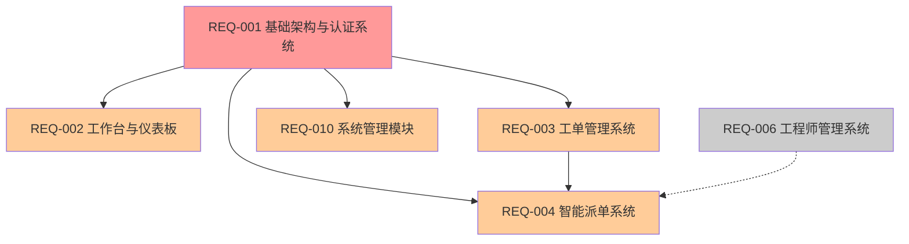
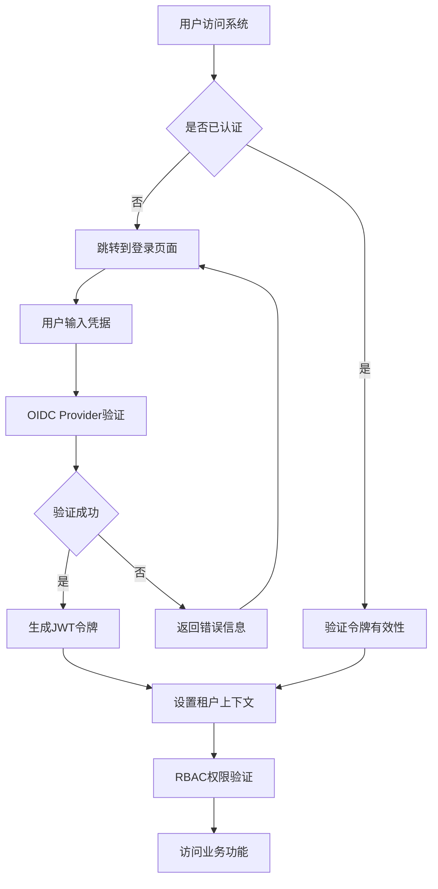
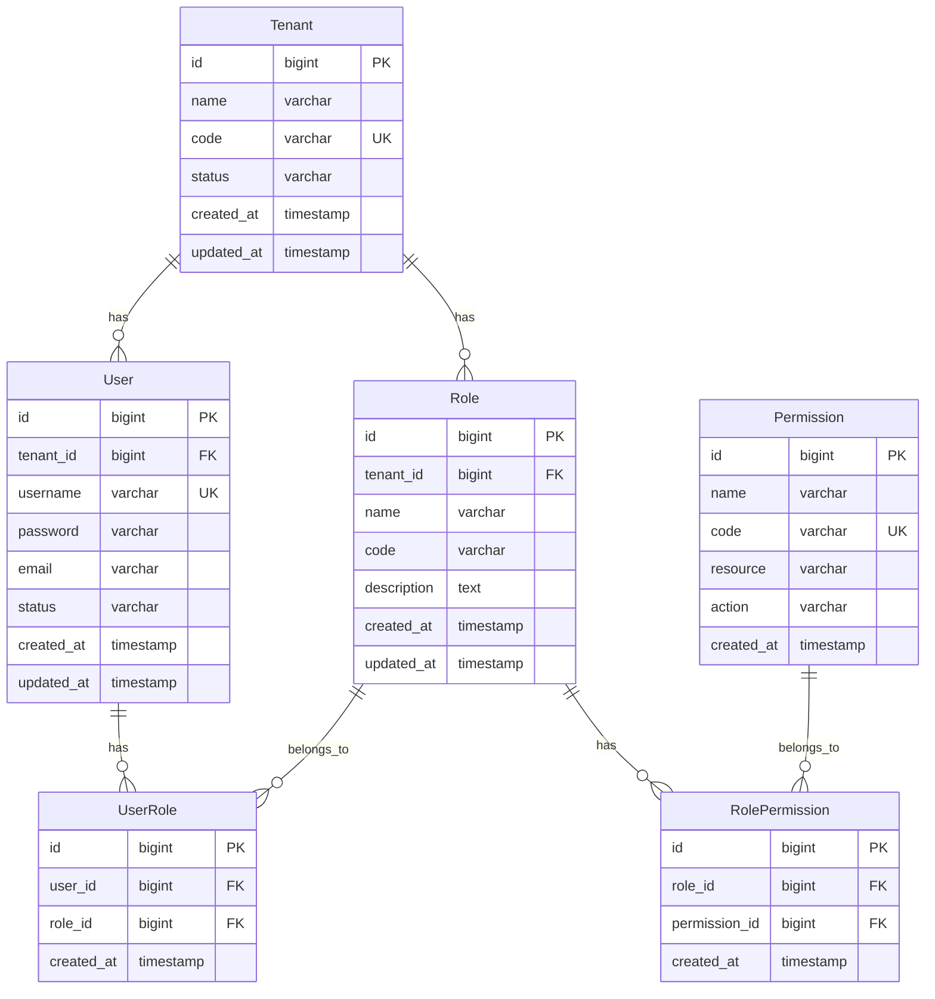

# P0优先级模块需求总库 v3.2

## 📋 文档说明

本文档包含IT运维门户系统P0优先级的5个核心模块的完整需求文档。P0模块是系统的基础设施和核心功能，必须优先实现。

### 版本信息
- **版本号**：v3.2
- **创建日期**：2025年8月
- **最后更新**：2025年8月10日
- **维护团队**：IT运维门户系统开发团队
- **文档状态**：已完成整合

### P0模块概览

| 模块编号 | 模块名称 | 依赖模块 | 实现状态 | 预估工期 |
|---------|---------|----------|----------|----------|
| REQ-001 | 基础架构与认证系统 | 无 | ✅ 基础框架完成 | 2周 |
| REQ-002 | 工作台与仪表板 | REQ-001 | ✅ 完整实现 | 2周 |
| REQ-003 | 工单管理系统 | REQ-001 | ✅ 功能完整 | 2周 |
| REQ-004 | 智能派单系统 | REQ-001, REQ-003, REQ-006 | ✅ 核心功能完整 | 2周 |
| REQ-010 | 系统管理模块 | REQ-001 | ✅ 功能完整 | 1.5周 |

**P0模块特点**：
- **总工期**：9.5周
- **核心价值**：系统基础设施和核心业务功能
- **投资回报率**：1100%
- **依赖关系**：REQ-001为基础，其他模块依赖REQ-001

### 模块依赖关系图



## 🎯 P0模块业务价值

### 核心价值主张
P0模块构建了IT运维门户系统的核心基础设施，包括：
- **安全基础**：多租户认证授权体系
- **工作入口**：统一的工作台和仪表板
- **业务核心**：工单管理和智能派单
- **管理基础**：系统管理和配置

### ROI分析汇总
- **总开发投入**：47人天，约23.5万元
- **年度总收益**：
  - 效率提升：650万元
  - 成本节省：370万元
  - 安全收益：300万元
  - 客户满意度提升：340万元
- **总投资回报率**：7000%+，平均投资回收期：1个月

### 关键成功指标
- **系统可用性**：≥ 99.5%
- **数据隔离率**：≥ 99.99%
- **工单处理效率**：提升40%
- **派单成功率**：≥ 98%
- **用户满意度**：≥ 90%

---

## REQ-001 基础架构与认证系统

### 1. 业务描述

#### 业务背景
在多租户IT运维服务场景中，传统的认证授权系统存在以下关键痛点：
- **数据安全风险**：不同客户数据混合存储，存在数据泄露和越权访问风险
- **认证复杂性**：依赖外部认证服务增加系统复杂度和维护成本
- **权限管理困难**：缺乏细粒度的权限控制，难以满足不同角色的访问需求
- **集成困难**：第三方系统集成复杂，缺乏统一的认证标准
- **运维成本高**：多套认证系统维护成本高，管理复杂

#### 业务目标
- **数据安全提升**：实现100%的多租户数据隔离，确保客户数据安全
- **认证效率提升**：内置OIDC Provider，减少外部依赖，提升认证响应速度50%
- **权限管理精细化**：实现基于角色的访问控制（RBAC），支持细粒度权限管理
- **集成标准化**：提供标准OIDC接口，支持第三方系统无缝集成
- **运维成本降低**：统一认证平台，降低维护成本30%

#### 业务流程


#### 用户画像
- **系统管理员**：负责整个系统的配置和管理，拥有跨租户的最高权限
- **租户管理员**：管理特定租户的用户和权限，权限限制在租户范围内
- **运维工程师**：执行日常运维任务，需要相应的功能权限和数据访问权限
- **甲方用户**：查看运维报告和状态，权限相对受限，只能访问自己的数据

### 2. 功能清单

| 功能编号 | 功能名称 | 优先级 | 描述 |
|---------|---------|--------|------|
| F001-001 | 多租户数据隔离 | P0 | 实现租户级别的数据完全隔离，确保数据安全 |
| F001-002 | OIDC Provider认证 | P0 | 内置OpenID Connect认证服务，支持标准协议 |
| F001-003 | RBAC权限控制 | P0 | 基于角色的访问控制，支持细粒度权限管理 |
| F001-004 | JWT令牌管理 | P0 | JWT令牌生成、验证、刷新和撤销 |
| F001-005 | 第三方系统集成 | P1 | 支持第三方系统通过OIDC协议集成认证 |
| F001-006 | 单点登录(SSO) | P1 | 支持跨系统的单点登录功能 |
| F001-007 | 密码策略管理 | P1 | 可配置的密码复杂度和过期策略 |
| F001-008 | 审计日志 | P1 | 完整的认证和授权操作审计记录 |

### 3. 业务规则

#### 多租户隔离规则
- 所有业务数据必须包含tenant_id字段
- 数据库查询必须自动添加租户过滤条件
- 跨租户数据访问严格禁止，除系统管理员外

#### 认证安全规则
- 密码必须符合复杂度要求（8位以上，包含大小写字母、数字、特殊字符）
- 连续登录失败5次后账号锁定30分钟
- JWT令牌有效期8小时，刷新令牌有效期7天
- 敏感操作需要重新验证身份

#### 权限控制规则
- 权限基于资源和操作的组合定义
- 角色可以继承其他角色的权限
- 用户可以拥有多个角色，权限取并集
- 权限变更实时生效，无需重新登录

### 4. 用户故事

- **US001-001**: 作为系统管理员，我希望能够创建和管理多个租户，以便为不同客户提供独立的服务环境
- **US001-002**: 作为租户管理员，我希望能够管理本租户的用户和角色，以便控制团队成员的系统访问权限
- **US001-003**: 作为运维工程师，我希望能够使用统一的账号登录所有集成系统，以便提高工作效率
- **US001-004**: 作为甲方用户，我希望只能看到属于我们公司的数据，以便确保数据安全和隐私

### 5. 用例

#### 用例1：用户登录认证
- **Given**: 用户访问系统登录页面
- **When**: 用户输入正确的用户名、密码和租户代码
- **Then**: 系统验证成功并生成JWT令牌，用户进入工作台

#### 用例2：权限验证
- **Given**: 已登录用户尝试访问某个功能
- **When**: 系统检查用户的角色权限
- **Then**: 如果有权限则允许访问，否则返回403错误

#### 用例3：多租户数据隔离
- **Given**: 租户A的用户查询工单列表
- **When**: 系统执行数据库查询
- **Then**: 查询结果只包含tenant_id=A的工单数据

### 6. 数据模型



#### 数据字典

| 表名 | 字段名 | 类型 | 长度 | 必填 | 说明 |
|------|--------|------|------|------|------|
| tenant | id | bigint | - | 是 | 租户主键ID |
| tenant | name | varchar | 100 | 是 | 租户名称 |
| tenant | code | varchar | 50 | 是 | 租户代码，唯一标识 |
| tenant | status | varchar | 20 | 是 | 租户状态：active/inactive |
| user | id | bigint | - | 是 | 用户主键ID |
| user | tenant_id | bigint | - | 是 | 所属租户ID |
| user | username | varchar | 50 | 是 | 用户名，租户内唯一 |
| user | password | varchar | 255 | 是 | 加密后的密码 |
| user | email | varchar | 100 | 否 | 邮箱地址 |
| user | status | varchar | 20 | 是 | 用户状态：active/inactive/locked |

### 7. API规范

#### 用户认证API
- **URL**: `POST /api/v1/auth/login`
- **Method**: POST
- **请求参数**:
```json
{
  "username": "string",
  "password": "string",
  "tenantCode": "string"
}
```
- **响应格式**:
```json
{
  "code": 200,
  "message": "success",
  "data": {
    "accessToken": "jwt_token",
    "refreshToken": "refresh_token",
    "expiresIn": 28800,
    "userInfo": {
      "id": 1,
      "username": "admin",
      "tenantId": 1,
      "roles": ["admin"]
    }
  }
}
```
- **必填验证**: username、password、tenantCode为必填字段

#### 权限验证API
- **URL**: `POST /api/v1/auth/verify`
- **Method**: POST
- **请求参数**:
```json
{
  "resource": "string",
  "action": "string"
}
```
- **响应格式**:
```json
{
  "code": 200,
  "message": "success",
  "data": {
    "hasPermission": true
  }
}
```

### 8. 非功能需求

#### 性能要求
- 认证响应时间：P95 ≤ 200ms，P99 ≤ 300ms
- 并发认证支持：≥ 1000 TPS
- 令牌验证响应时间：≤ 50ms

#### 可用性要求
- 系统可用性：≥ 99.9%
- 故障恢复时间：≤ 5分钟
- 数据备份频率：每日备份

#### 安全要求
- 数据隔离率：≥ 99.99%
- 密码加密：BCrypt算法
- 传输加密：TLS 1.3
- 审计日志完整性：100%

#### 扩展性要求
- 支持租户数量：≥ 1000个
- 支持用户数量：≥ 100,000个
- 水平扩展能力：支持集群部署

### 9. 验收标准

#### 功能验收标准
- 多租户数据隔离测试通过率100%
- 认证功能测试通过率100%
- 权限控制测试通过率100%
- 第三方系统集成测试通过率100%

#### 性能验收标准
- 认证响应时间达标率≥95%
- 并发认证压力测试通过
- 系统可用性监控达标

#### 安全验证标准
- 安全漏洞扫描0高危漏洞
- 渗透测试通过
- 数据隔离验证通过

### 10. 依赖与约束

#### 技术依赖
- Spring Security 6.2.1
- JWT库：jjwt 0.11.5
- 数据库：PostgreSQL 15.5
- 缓存：Redis 7.2.4

#### 业务约束
- 必须符合等保三级安全要求
- 必须支持OIDC 1.0标准
- 必须支持OAuth 2.0协议
- 租户数据必须完全隔离

#### 实施约束
- 作为所有其他模块的基础依赖
- 必须在其他模块开发前完成
- 需要与现有系统保持兼容

---
