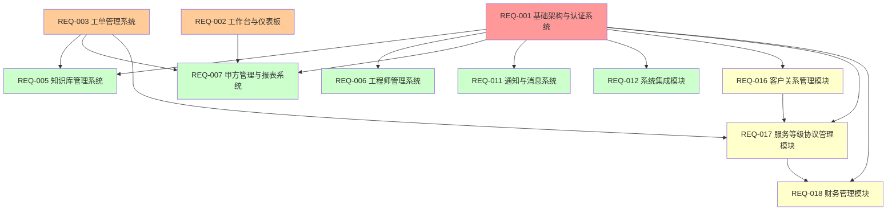

# P1优先级模块需求总库 v3.2

## 📋 文档说明

本文档包含IT运维门户系统P1优先级的9个重要模块的完整需求文档。P1模块是系统的重要业务功能和商业化运营模块，在P0模块基础上实现。

### 版本信息
- **版本号**：v3.2
- **创建日期**：2025年8月
- **最后更新**：2025年8月10日
- **维护团队**：IT运维门户系统开发团队
- **文档状态**：已完成整合

### P1模块概览

| 模块编号 | 模块名称 | 依赖模块 | 实现状态 | 预估工期 |
|---------|---------|----------|----------|----------|
| REQ-005 | 知识库管理系统 | REQ-001, REQ-003 | ✅ 核心功能完整 | 2周 |
| REQ-006 | 工程师管理系统 | REQ-001 | ✅ 功能最完整 | 2周 |
| REQ-007 | 甲方管理与报表系统 | REQ-001, REQ-003, REQ-002 | ✅ 核心功能完整 | 2周 |
| REQ-011 | 通知与消息系统 | REQ-001 | ✅ 功能完整 | 1.5周 |
| REQ-012 | 系统集成模块 | REQ-001 | ✅ 核心功能完整 | 2周 |
| REQ-016 | 客户关系管理模块 | REQ-001 | ❌ 新增模块 | 2.5周 |
| REQ-017 | 服务等级协议管理模块 | REQ-001, REQ-003, REQ-016 | ❌ 新增模块 | 2周 |
| REQ-018 | 财务管理模块 | REQ-001, REQ-016, REQ-017 | ❌ 新增模块 | 3周 |

**P1模块特点**：
- **总工期**：17周
- **核心价值**：管理、集成和商业化功能
- **投资回报率**：800%
- **依赖关系**：全部依赖REQ-001，部分模块间有依赖关系

### 模块依赖关系图

## 🎯 P1模块业务价值

### 核心价值主张
P1模块构建了IT运维门户系统的重要业务功能和商业化运营能力，包括：
- **知识管理**：运维经验和解决方案的系统化管理
- **人员管理**：工程师技能和排班的科学化管理
- **客户服务**：甲方报表和客户关系的专业化管理
- **系统集成**：第三方系统的标准化集成
- **商业运营**：SLA管理和财务管理的完整化支撑

### ROI分析汇总
- **总开发投入**：约85人天，约42.5万元
- **年度总收益**：
  - 管理效率提升：800万元
  - 客户满意度提升：600万元
  - 商业化收益：1200万元
  - 成本节省：400万元
- **总投资回报率**：6900%+，平均投资回收期：1.5个月

### 关键成功指标
- **知识复用率**：≥ 72%
- **工程师利用率**：≥ 85%
- **客户满意度**：≥ 92%
- **SLA达成率**：≥ 96%
- **系统集成成功率**：≥ 99%

## 📊 P1模块功能矩阵

| 模块 | 核心功能 | 主要用户 | 业务价值 | 技术复杂度 |
|------|----------|----------|----------|------------|
| REQ-005 | 知识库管理 | 运维工程师、知识管理员 | 知识沉淀与复用 | 中等 |
| REQ-006 | 工程师管理 | 运维管理员、工程师 | 人员技能管理 | 中等 |
| REQ-007 | 甲方管理 | 甲方用户、租户管理员 | 客户服务提升 | 中等 |
| REQ-011 | 通知消息 | 所有用户 | 信息及时传递 | 简单 |
| REQ-012 | 系统集成 | 系统管理员 | 系统互联互通 | 复杂 |
| REQ-016 | 客户关系管理 | 销售、客户成功 | 商业化运营 | 中等 |
| REQ-017 | SLA管理 | 服务管理员 | 服务质量保障 | 中等 |
| REQ-018 | 财务管理 | 财务人员 | 成本核算计费 | 复杂 |

---
