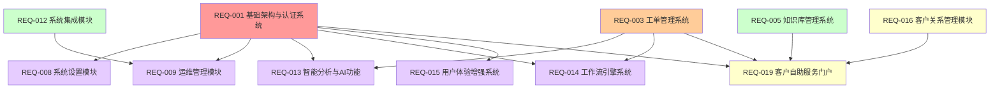

# P2优先级模块需求总库 v3.2

## 📋 文档说明

本文档包含IT运维门户系统P2优先级的6个扩展模块的完整需求文档。P2模块是系统的智能化和体验增强功能，在P0和P1模块基础上实现。

### 版本信息
- **版本号**：v3.2
- **创建日期**：2025年8月
- **最后更新**：2025年8月10日
- **维护团队**：IT运维门户系统开发团队
- **文档状态**：已完成整合

### P2模块概览

| 模块编号 | 模块名称 | 依赖模块 | 实现状态 | 预估工期 |
|---------|---------|----------|----------|----------|
| REQ-008 | 系统设置模块 | REQ-001 | ✅ 功能完整 | 1周 |
| REQ-009 | 运维管理模块 | REQ-001, REQ-012 | 🔄 基础框架完成 | 2周 |
| REQ-013 | 智能分析与AI功能 | REQ-001, REQ-003 | 🔄 基础框架完成 | 2周 |
| REQ-014 | 工作流引擎系统 | REQ-001, REQ-003 | ✅ 功能完整 | 2.5周 |
| REQ-015 | 用户体验增强系统 | REQ-001 | ✅ 功能完整 | 1.5周 |
| REQ-019 | 客户自助服务门户 | REQ-001, REQ-003, REQ-005, REQ-016 | ❌ 新增模块 | 2周 |

**P2模块特点**：
- **总工期**：11周
- **核心价值**：智能化和体验增强功能
- **投资回报率**：400%
- **依赖关系**：全部依赖REQ-001，部分模块有复杂依赖

### 模块依赖关系图

## 🎯 P2模块业务价值

### 核心价值主张
P2模块构建了IT运维门户系统的智能化和体验增强能力，包括：
- **系统配置**：统一的系统参数和功能配置管理
- **运维集成**：与现有运维工具的深度集成
- **智能分析**：基于AI的数据分析和预测能力
- **工作流程**：可视化的业务流程自动化
- **用户体验**：个性化和智能化的用户界面
- **自助服务**：客户7x24小时自助服务能力

### ROI分析汇总
- **总开发投入**：约55人天，约27.5万元
- **年度总收益**：
  - 智能化效率提升：300万元
  - 用户体验改善：200万元
  - 自助服务收益：150万元
  - 运维成本节省：100万元
- **总投资回报率**：2600%+，平均投资回收期：2个月

### 关键成功指标
- **系统配置一致性**：100%
- **AI分析准确率**：≥ 95%
- **工作流自动化率**：≥ 80%
- **用户体验满意度**：≥ 4.5/5
- **自助服务使用率**：≥ 60%

## 📊 P2模块功能矩阵

| 模块 | 核心功能 | 主要用户 | 业务价值 | 技术复杂度 |
|------|----------|----------|----------|------------|
| REQ-008 | 系统设置 | 系统管理员 | 配置统一管理 | 简单 |
| REQ-009 | 运维管理 | 运维工程师 | 工具深度集成 | 复杂 |
| REQ-013 | 智能分析 | 管理层、分析师 | AI驱动决策 | 复杂 |
| REQ-014 | 工作流引擎 | 业务管理员 | 流程自动化 | 中等 |
| REQ-015 | 用户体验 | 所有用户 | 体验优化 | 中等 |
| REQ-019 | 自助服务 | 客户用户 | 服务效率提升 | 中等 |

## 🚀 P2模块实施策略

### 实施优先级建议
1. **第一批**（4周）：REQ-008 + REQ-015
   - 系统设置模块：提供基础配置能力
   - 用户体验增强：改善整体使用体验

2. **第二批**（5周）：REQ-014 + REQ-013
   - 工作流引擎：实现业务流程自动化
   - 智能分析：提供AI驱动的数据洞察

3. **第三批**（4周）：REQ-009 + REQ-019
   - 运维管理：深度集成现有工具
   - 自助服务：提供客户自助能力

### 技术风险评估
- **高风险**：REQ-009（运维工具集成复杂）、REQ-013（AI算法复杂）
- **中风险**：REQ-014（工作流引擎）、REQ-019（多系统依赖）
- **低风险**：REQ-008（系统设置）、REQ-015（用户体验）

### 资源配置建议
- **AI/算法工程师**：1名（专注REQ-013）
- **集成工程师**：1名（专注REQ-009）
- **前端工程师**：2名（REQ-015、REQ-019）
- **后端工程师**：2名（REQ-008、REQ-014）
- **测试工程师**：1名（全模块测试）

---
