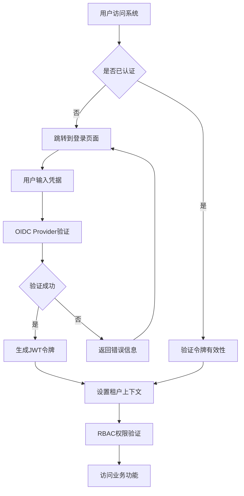
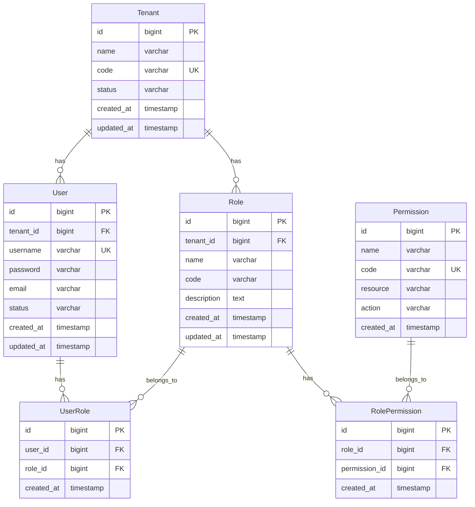
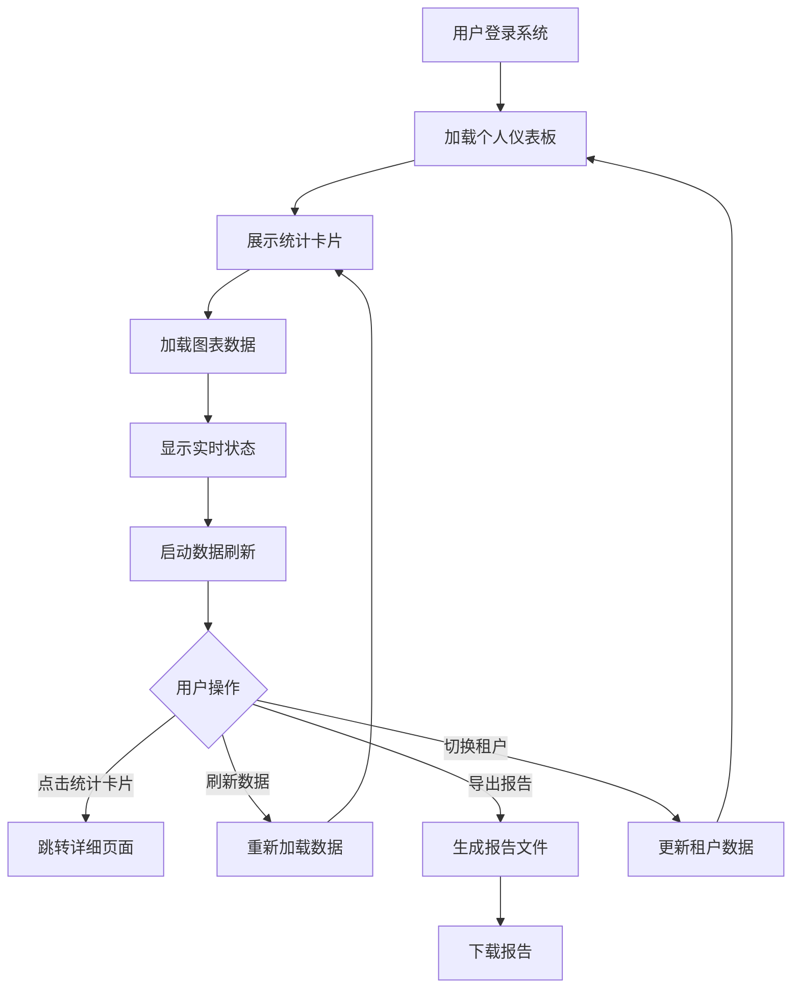
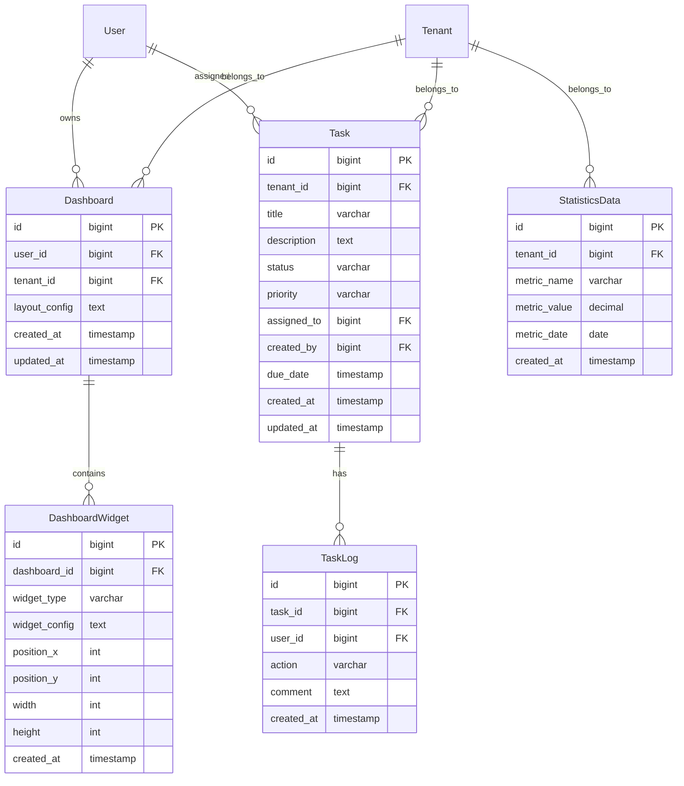
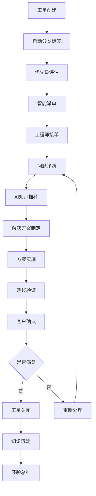
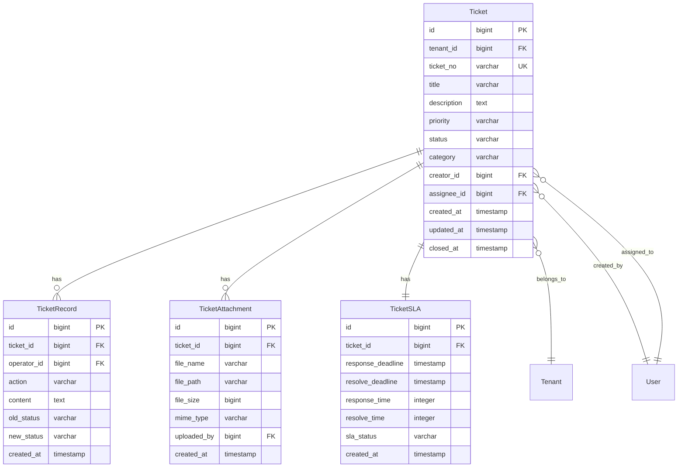
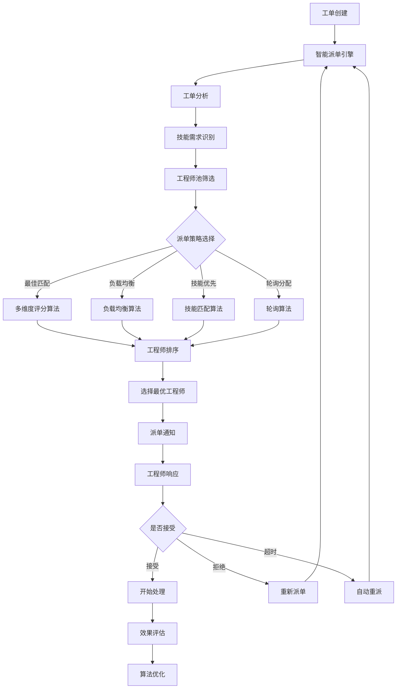
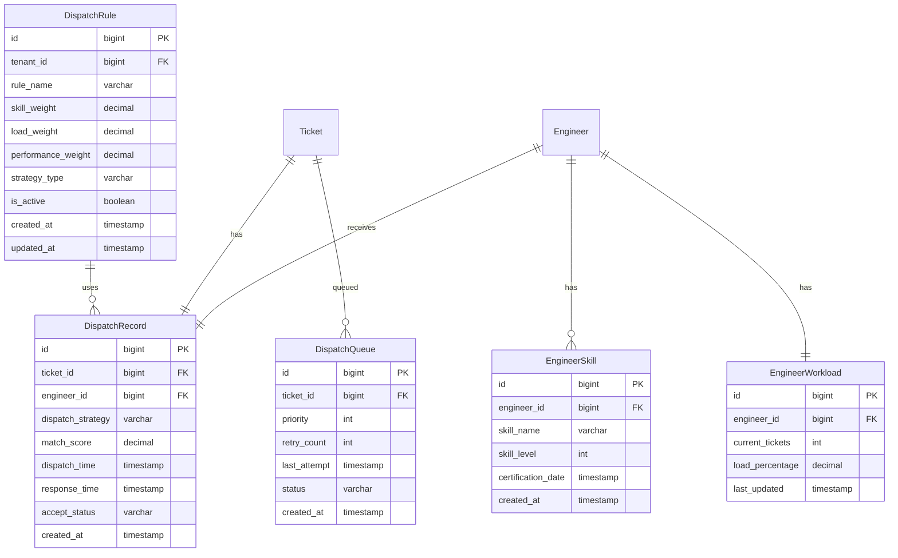
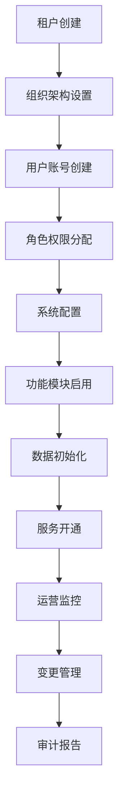
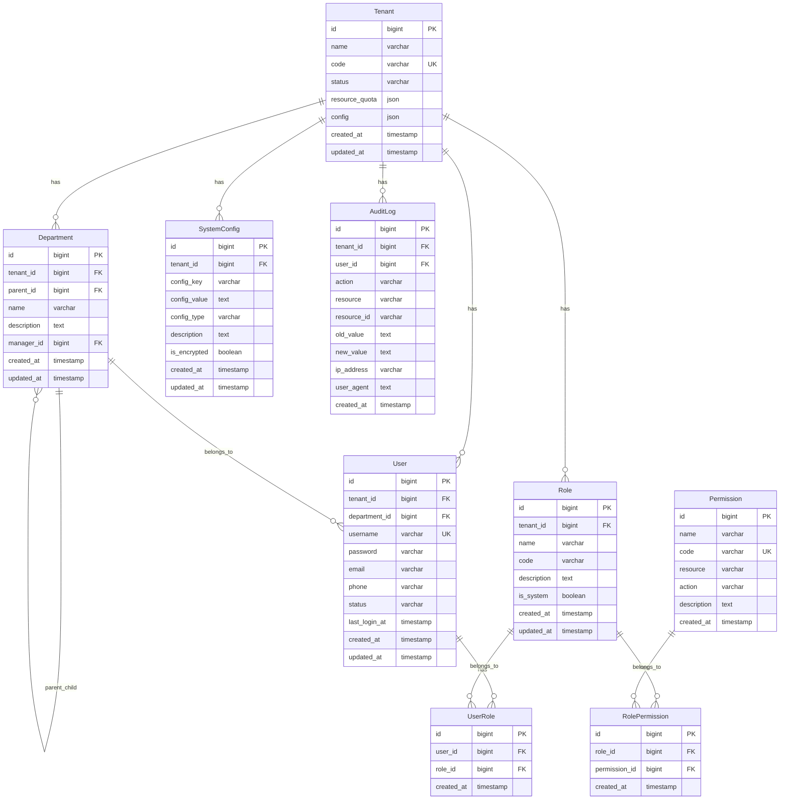

# 需求总库 v3.2

## 文档说明

本文档是IT运维门户系统的统一需求总库（Single Source of Truth），整合了所有19个模块的完整需求文档，消除了重复和冲突，统一了格式和命名规范。

**版本信息**：
- 版本号：v3.2
- 创建日期：2025年8月
- 最后更新：2025年8月
- 维护团队：IT运维门户系统开发团队

## 模块总览表

| 模块编号 | 模块名称 | 优先级 | 依赖模块 | 实现状态 | 预估工期 |
|---------|---------|--------|----------|----------|----------|
| REQ-001 | 基础架构与认证系统 | P0 | 无 | ✅ 基础框架完成 | 2周 |
| REQ-002 | 工作台与仪表板 | P0 | REQ-001 | ✅ 完整实现 | 2周 |
| REQ-003 | 工单管理系统 | P0 | REQ-001 | ✅ 功能完整 | 2周 |
| REQ-004 | 智能派单系统 | P0 | REQ-001, REQ-003, REQ-006 | ✅ 核心功能完整 | 2周 |
| REQ-005 | 知识库管理系统 | P1 | REQ-001, REQ-003 | ✅ 核心功能完整 | 2周 |
| REQ-006 | 工程师管理系统 | P1 | REQ-001 | ✅ 功能最完整 | 2周 |
| REQ-007 | 甲方管理与报表系统 | P1 | REQ-001, REQ-003, REQ-002 | ✅ 核心功能完整 | 2周 |
| REQ-008 | 系统设置模块 | P2 | REQ-001 | ✅ 功能完整 | 1周 |
| REQ-009 | 运维管理模块 | P2 | REQ-001, REQ-012 | 🔄 基础框架完成 | 2周 |
| REQ-010 | 系统管理模块 | P0 | REQ-001 | ✅ 功能完整 | 1.5周 |
| REQ-011 | 通知与消息系统 | P1 | REQ-001 | ✅ 功能完整 | 1.5周 |
| REQ-012 | 系统集成模块 | P1 | REQ-001 | ✅ 核心功能完整 | 2周 |
| REQ-013 | 智能分析与AI功能 | P2 | REQ-001, REQ-003 | 🔄 基础框架完成 | 2周 |
| REQ-014 | 工作流引擎系统 | P2 | REQ-001, REQ-003 | ✅ 功能完整 | 2.5周 |
| REQ-015 | 用户体验增强系统 | P2 | REQ-001 | ✅ 功能完整 | 1.5周 |
| REQ-016 | 客户关系管理模块 | P1 | REQ-001 | ❌ 新增模块 | 2.5周 |
| REQ-017 | 服务等级协议管理模块 | P1 | REQ-001, REQ-003, REQ-016 | ❌ 新增模块 | 2周 |
| REQ-018 | 财务管理模块 | P1 | REQ-001, REQ-016, REQ-017 | ❌ 新增模块 | 3周 |
| REQ-019 | 客户自助服务门户 | P2 | REQ-001, REQ-003, REQ-005, REQ-016 | ❌ 新增模块 | 2周 |

**统计信息**：
- P0模块：5个（核心基础设施）
- P1模块：9个（重要业务功能）  
- P2模块：6个（扩展增强功能）
- 总开发工期：约34周
- 已完成模块：13个
- 进行中模块：2个
- 新增模块：4个

---

## REQ-001 基础架构与认证系统

### 1. 业务描述

#### 业务背景
在多租户IT运维服务场景中，传统的认证授权系统存在以下关键痛点：
- **数据安全风险**：不同客户数据混合存储，存在数据泄露和越权访问风险
- **认证复杂性**：依赖外部认证服务增加系统复杂度和维护成本
- **权限管理困难**：缺乏细粒度的权限控制，难以满足不同角色的访问需求
- **集成困难**：第三方系统集成复杂，缺乏统一的认证标准
- **运维成本高**：多套认证系统维护成本高，管理复杂

#### 业务目标
- **数据安全提升**：实现100%的多租户数据隔离，确保客户数据安全
- **认证效率提升**：内置OIDC Provider，减少外部依赖，提升认证响应速度50%
- **权限管理精细化**：实现基于角色的访问控制（RBAC），支持细粒度权限管理
- **集成标准化**：提供标准OIDC接口，支持第三方系统无缝集成
- **运维成本降低**：统一认证平台，降低维护成本30%

#### 业务流程


#### 用户画像
- **系统管理员**：负责整个系统的配置和管理，拥有跨租户的最高权限
- **租户管理员**：管理特定租户的用户和权限，权限限制在租户范围内
- **运维工程师**：执行日常运维任务，需要相应的功能权限和数据访问权限
- **甲方用户**：查看运维报告和状态，权限相对受限，只能访问自己的数据

### 2. 功能清单

| 功能编号 | 功能名称 | 优先级 | 描述 |
|---------|---------|--------|------|
| F001-001 | 多租户数据隔离 | P0 | 实现租户级别的数据完全隔离，确保数据安全 |
| F001-002 | OIDC Provider认证 | P0 | 内置OpenID Connect认证服务，支持标准协议 |
| F001-003 | RBAC权限控制 | P0 | 基于角色的访问控制，支持细粒度权限管理 |
| F001-004 | JWT令牌管理 | P0 | JWT令牌生成、验证、刷新和撤销 |
| F001-005 | 第三方系统集成 | P1 | 支持第三方系统通过OIDC协议集成认证 |
| F001-006 | 单点登录(SSO) | P1 | 支持跨系统的单点登录功能 |
| F001-007 | 密码策略管理 | P1 | 可配置的密码复杂度和过期策略 |
| F001-008 | 审计日志 | P1 | 完整的认证和授权操作审计记录 |

### 3. 业务规则

#### 多租户隔离规则
- 所有业务数据必须包含tenant_id字段
- 数据库查询必须自动添加租户过滤条件
- 跨租户数据访问严格禁止，除系统管理员外

#### 认证安全规则
- 密码必须符合复杂度要求（8位以上，包含大小写字母、数字、特殊字符）
- 连续登录失败5次后账号锁定30分钟
- JWT令牌有效期8小时，刷新令牌有效期7天
- 敏感操作需要重新验证身份

#### 权限控制规则
- 权限基于资源和操作的组合定义
- 角色可以继承其他角色的权限
- 用户可以拥有多个角色，权限取并集
- 权限变更实时生效，无需重新登录

### 4. 用户故事

- **US001-001**: 作为系统管理员，我希望能够创建和管理多个租户，以便为不同客户提供独立的服务环境
- **US001-002**: 作为租户管理员，我希望能够管理本租户的用户和角色，以便控制团队成员的系统访问权限
- **US001-003**: 作为运维工程师，我希望能够使用统一的账号登录所有集成系统，以便提高工作效率
- **US001-004**: 作为甲方用户，我希望只能看到属于我们公司的数据，以便确保数据安全和隐私

### 5. 用例

#### 用例1：用户登录认证
- **Given**: 用户访问系统登录页面
- **When**: 用户输入正确的用户名、密码和租户代码
- **Then**: 系统验证成功并生成JWT令牌，用户进入工作台

#### 用例2：权限验证
- **Given**: 已登录用户尝试访问某个功能
- **When**: 系统检查用户的角色权限
- **Then**: 如果有权限则允许访问，否则返回403错误

#### 用例3：多租户数据隔离
- **Given**: 租户A的用户查询工单列表
- **When**: 系统执行数据库查询
- **Then**: 查询结果只包含tenant_id=A的工单数据

### 6. 数据模型



#### 数据字典

| 表名 | 字段名 | 类型 | 长度 | 必填 | 说明 |
|------|--------|------|------|------|------|
| tenant | id | bigint | - | 是 | 租户主键ID |
| tenant | name | varchar | 100 | 是 | 租户名称 |
| tenant | code | varchar | 50 | 是 | 租户代码，唯一标识 |
| tenant | status | varchar | 20 | 是 | 租户状态：active/inactive |
| user | id | bigint | - | 是 | 用户主键ID |
| user | tenant_id | bigint | - | 是 | 所属租户ID |
| user | username | varchar | 50 | 是 | 用户名，租户内唯一 |
| user | password | varchar | 255 | 是 | 加密后的密码 |
| user | email | varchar | 100 | 否 | 邮箱地址 |
| user | status | varchar | 20 | 是 | 用户状态：active/inactive/locked |

### 7. API规范

#### 用户认证API
- **URL**: `POST /api/v1/auth/login`
- **Method**: POST
- **请求参数**:
```json
{
  "username": "string",
  "password": "string", 
  "tenantCode": "string"
}
```
- **响应格式**:
```json
{
  "code": 200,
  "message": "success",
  "data": {
    "accessToken": "jwt_token",
    "refreshToken": "refresh_token", 
    "expiresIn": 28800,
    "userInfo": {
      "id": 1,
      "username": "admin",
      "tenantId": 1,
      "roles": ["admin"]
    }
  }
}
```
- **必填验证**: username、password、tenantCode为必填字段

#### 权限验证API
- **URL**: `POST /api/v1/auth/verify`
- **Method**: POST
- **请求参数**:
```json
{
  "resource": "string",
  "action": "string"
}
```
- **响应格式**:
```json
{
  "code": 200,
  "message": "success", 
  "data": {
    "hasPermission": true
  }
}
```

### 8. 非功能需求

#### 性能要求
- 认证响应时间：P95 ≤ 200ms，P99 ≤ 300ms
- 并发认证支持：≥ 1000 TPS
- 令牌验证响应时间：≤ 50ms

#### 可用性要求
- 系统可用性：≥ 99.9%
- 故障恢复时间：≤ 5分钟
- 数据备份频率：每日备份

#### 安全要求
- 数据隔离率：≥ 99.99%
- 密码加密：BCrypt算法
- 传输加密：TLS 1.3
- 审计日志完整性：100%

#### 扩展性要求
- 支持租户数量：≥ 1000个
- 支持用户数量：≥ 100,000个
- 水平扩展能力：支持集群部署

### 9. 验收标准

#### 功能验收标准
- 多租户数据隔离测试通过率100%
- 认证功能测试通过率100%
- 权限控制测试通过率100%
- 第三方系统集成测试通过率100%

#### 性能验收标准
- 认证响应时间达标率≥95%
- 并发认证压力测试通过
- 系统可用性监控达标

#### 安全验证标准
- 安全漏洞扫描0高危漏洞
- 渗透测试通过
- 数据隔离验证通过

### 10. 依赖与约束

#### 技术依赖
- Spring Security 6.2.1
- JWT库：jjwt 0.11.5
- 数据库：PostgreSQL 15.5
- 缓存：Redis 7.2.4

#### 业务约束
- 必须符合等保三级安全要求
- 必须支持OIDC 1.0标准
- 必须支持OAuth 2.0协议
- 租户数据必须完全隔离

#### 实施约束
- 作为所有其他模块的基础依赖
- 必须在其他模块开发前完成
- 需要与现有系统保持兼容

---

## REQ-002 工作台与仪表板

### 1. 业务描述

#### 业务背景
在IT运维管理中，运维人员和管理者需要一个统一的工作台来管理日常工作，包括查看系统运行状态、处理工作流审批、管理个人任务和接收消息通知。传统的运维管理系统存在以下痛点：
- **信息分散**：关键运维数据、任务、消息分布在不同系统中，缺乏统一视图
- **工作流程复杂**：审批流程不够直观，缺乏可视化的流程管理工具
- **任务管理混乱**：个人任务分散在各个系统中，难以统一跟踪和管理
- **消息通知滞后**：重要通知不能及时到达，影响工作效率
- **实时性差**：数据更新不及时，影响决策效率

#### 业务目标
- **统一工作台**：提供一站式工作平台，集成仪表板、工作流、任务、消息等功能
- **高效审批**：通过可视化工作流管理，提升审批效率和流程透明度
- **任务协同**：统一的任务管理平台，支持任务分配、跟踪和协作
- **及时通知**：实时消息推送和通知管理，确保重要信息及时传达
- **统一视图**：提供运维全景概览，一屏掌握关键指标

#### 业务流程


#### 用户画像
- **系统管理员**：需要查看全局运维状态，关注系统性能和资源使用，管理系统级工作流程
- **租户管理员**：关注本租户的工单处理情况和服务质量指标，审批租户内部申请
- **运维工程师**：需要快速了解待处理工单和当前任务状态，处理日常运维任务和消息
- **甲方用户**：查看服务概览和SLA达成情况，跟踪服务请求进度

### 2. 功能清单

| 功能编号 | 功能名称 | 优先级 | 描述 |
|---------|---------|--------|------|
| F002-001 | 运维仪表板 | P0 | 展示关键运维指标和统计数据的可视化仪表板 |
| F002-002 | 统计卡片 | P0 | 显示工单数量、SLA达成率等关键指标的卡片组件 |
| F002-003 | 图表展示 | P0 | 工单趋势图、分类分布图等数据可视化图表 |
| F002-004 | 实时数据刷新 | P0 | 30秒自动刷新机制，保证数据实时性 |
| F002-005 | 我的任务 | P1 | 个人任务管理，包括任务列表、状态跟踪、操作处理 |
| F002-006 | 工作流审批 | P1 | 可视化工作流审批界面，支持审批操作和流程跟踪 |
| F002-007 | 消息中心 | P1 | 统一的消息通知管理，支持多种消息类型和状态 |
| F002-008 | 报告导出 | P1 | 支持仪表板数据导出为PDF、Excel等格式 |
| F002-009 | 个性化配置 | P2 | 支持用户自定义仪表板布局和组件配置 |
| F002-010 | 移动端适配 | P2 | 响应式设计，支持移动设备访问 |

### 3. 业务规则

#### 数据刷新规则
- 仪表板数据每30秒自动刷新一次
- 用户可手动触发数据刷新，最小间隔5秒
- 实时状态数据每10秒更新一次
- 图表数据支持历史时间范围选择

#### 权限控制规则
- 用户只能查看有权限的数据和功能模块
- 租户管理员只能查看本租户的数据
- 系统管理员可以查看所有租户的汇总数据
- 敏感数据需要额外权限验证

#### 任务管理规则
- 任务状态包括：待处理、进行中、已完成、已取消
- 任务优先级分为：紧急、高、中、低四个级别
- 任务可以分配给个人或团队
- 任务完成需要相关人员确认

### 4. 用户故事

- **US002-001**: 作为运维工程师，我希望在仪表板上快速查看当前待处理工单数量，以便合理安排工作优先级
- **US002-002**: 作为租户管理员，我希望能够查看本租户的SLA达成情况，以便评估服务质量
- **US002-003**: 作为系统管理员，我希望能够查看系统整体运行状态，以便及时发现和处理异常
- **US002-004**: 作为普通用户，我希望能够在移动设备上查看我的任务列表，以便随时了解工作进度

### 5. 用例

#### 用例1：查看运维仪表板
- **Given**: 用户已登录系统并有仪表板访问权限
- **When**: 用户访问工作台页面
- **Then**: 系统显示个性化的运维仪表板，包含统计卡片、图表和实时状态

#### 用例2：处理个人任务
- **Given**: 用户有待处理的任务
- **When**: 用户在我的任务页面点击某个任务
- **Then**: 系统显示任务详情对话框，用户可以更新任务状态或添加处理记录

#### 用例3：导出运维报告
- **Given**: 用户在仪表板页面
- **When**: 用户点击导出报告按钮并选择导出格式
- **Then**: 系统生成包含当前仪表板数据的报告文件供用户下载

### 6. 数据模型



#### 数据字典

| 表名 | 字段名 | 类型 | 长度 | 必填 | 说明 |
|------|--------|------|------|------|------|
| dashboard | id | bigint | - | 是 | 仪表板主键ID |
| dashboard | user_id | bigint | - | 是 | 用户ID |
| dashboard | tenant_id | bigint | - | 是 | 租户ID |
| dashboard | layout_config | text | - | 否 | 布局配置JSON |
| dashboard_widget | id | bigint | - | 是 | 组件主键ID |
| dashboard_widget | widget_type | varchar | 50 | 是 | 组件类型：chart/card/list |
| dashboard_widget | widget_config | text | - | 否 | 组件配置JSON |
| task | id | bigint | - | 是 | 任务主键ID |
| task | status | varchar | 20 | 是 | 任务状态：pending/in_progress/completed/cancelled |
| task | priority | varchar | 20 | 是 | 优先级：urgent/high/medium/low |

### 7. API规范

#### 获取仪表板数据API
- **URL**: `GET /api/v1/dashboard/overview`
- **Method**: GET
- **请求参数**:
```json
{
  "tenantId": "number",
  "dateRange": "string"
}
```
- **响应格式**:
```json
{
  "code": 200,
  "message": "success",
  "data": {
    "statistics": {
      "totalTickets": 150,
      "resolvedTickets": 120,
      "pendingTickets": 30,
      "slaAchievementRate": 95.5
    },
    "charts": {
      "ticketTrend": [...],
      "categoryDistribution": [...]
    },
    "realTimeStatus": {
      "onlineUsers": 25,
      "systemLoad": 65.2,
      "memoryUsage": 78.5
    }
  }
}
```

#### 获取我的任务API
- **URL**: `GET /api/v1/tasks/my-tasks`
- **Method**: GET
- **请求参数**:
```json
{
  "page": 1,
  "size": 20,
  "status": "string",
  "priority": "string"
}
```
- **响应格式**:
```json
{
  "code": 200,
  "message": "success",
  "data": {
    "total": 50,
    "items": [
      {
        "id": 1,
        "title": "系统维护任务",
        "description": "定期系统维护",
        "status": "pending",
        "priority": "high",
        "dueDate": "2025-08-15T10:00:00Z",
        "createdAt": "2025-08-10T09:00:00Z"
      }
    ]
  }
}
```

#### 导出报告API
- **URL**: `POST /api/v1/dashboard/export`
- **Method**: POST
- **请求参数**:
```json
{
  "format": "pdf",
  "dateRange": "last_7_days",
  "includeCharts": true
}
```
- **响应格式**:
```json
{
  "code": 200,
  "message": "success",
  "data": {
    "downloadUrl": "/api/v1/files/download/report_20250810.pdf",
    "expiresAt": "2025-08-11T10:00:00Z"
  }
}
```

### 8. 非功能需求

#### 性能要求
- 页面加载时间：首屏 ≤ 1.5秒，完整 ≤ 2秒（P95）
- 数据刷新延迟：≤ 10秒
- 图表渲染时间：≤ 500ms
- 并发用户支持：≥ 500个

#### 可用性要求
- 系统可用性：≥ 99.5%
- 移动端适配率：≥ 98%
- 浏览器兼容性：Chrome 90+, Firefox 88+, Safari 14+

#### 用户体验要求
- 界面响应时间：≤ 200ms
- 操作成功率：≥ 99%
- 用户停留时间：≥ 5分钟
- 功能使用率：核心组件 ≥ 80%

### 9. 验收标准

#### 功能验收标准
- 仪表板所有组件正常显示和交互
- 数据刷新机制正常工作
- 任务管理功能完整可用
- 报告导出功能正常
- 移动端适配完全兼容

#### 性能验收标准
- 页面加载时间达标率 ≥ 95%
- 数据刷新延迟达标率 ≥ 99%
- 并发压力测试通过

#### 用户体验验收标准
- 用户满意度调研 ≥ 4.5/5
- 功能使用率达标
- 移动端兼容性测试通过

### 10. 依赖与约束

#### 技术依赖
- Vue 3.4.15 + Composition API
- Element Plus 2.4.4
- ECharts 5.4 + Vue-ECharts 6.6
- WebSocket（实时数据推送）

#### 模块依赖
- REQ-001：基础架构与认证系统（用户认证和权限控制）
- REQ-003：工单管理系统（工单数据来源）
- REQ-011：通知与消息系统（消息中心功能）

#### 业务约束
- 必须支持多租户数据隔离
- 必须支持个性化配置
- 必须支持移动端访问
- 数据展示必须实时准确

---

## REQ-003 工单管理系统

### 1. 业务描述

#### 业务背景
在多租户IT运维服务场景中，工单管理是核心业务流程，传统工单管理存在以下关键痛点：
- **流程不规范**：缺乏标准化的工单处理流程，处理质量参差不齐
- **响应时间长**：工单响应和处理时间长，影响客户满意度和SLA达成
- **跟踪困难**：工单状态更新不及时，进度跟踪困难，缺乏透明度
- **知识沉淀不足**：处理经验难以积累和复用，重复性问题频发
- **多租户管理复杂**：不同客户的工单混合管理，数据安全风险高

#### 业务目标
- **流程标准化**：建立标准化的工单处理流程，提升服务质量一致性
- **响应时间缩短**：工单平均响应时间从4小时缩短到30分钟
- **处理效率提升**：工单平均处理时间缩短30%，提升运维效率
- **SLA达成率提升**：SLA达成率从70%提升到95%以上
- **客户满意度提升**：客户满意度从75%提升到90%以上

#### 业务流程


#### 用户画像
- **甲方用户**：提交工单，跟踪处理进度，评价服务质量，查看服务报告
- **运维工程师**：接收和处理工单，更新处理进度，记录解决方案
- **租户管理员**：监控本租户工单处理情况，管理SLA，查看统计报表
- **系统管理员**：全局工单监控，系统配置管理，跨租户数据分析

### 2. 功能清单

| 功能编号 | 功能名称 | 优先级 | 描述 |
|---------|---------|--------|------|
| F003-001 | 工单CRUD操作 | P0 | 创建、查看、编辑、删除工单的基本操作 |
| F003-002 | 工单状态管理 | P0 | 工单状态流转、批量状态更新 |
| F003-003 | 工单分配管理 | P0 | 手动分配、自动分配、批量分配工单 |
| F003-004 | 工单搜索筛选 | P0 | 多维度筛选、关键词搜索、高级搜索 |
| F003-005 | 工单统计分析 | P0 | 统计卡片、图表展示、趋势分析 |
| F003-006 | SLA监控管理 | P0 | SLA设置、监控、告警、达成率统计 |
| F003-007 | 附件管理 | P1 | 文件上传、下载、预览、病毒扫描 |
| F003-008 | 处理记录 | P1 | 操作日志、处理历史、时间线展示 |
| F003-009 | AI智能分析 | P1 | AI分析开关、智能建议、自动分类 |
| F003-010 | 工单导出 | P1 | Excel导出、PDF报表生成 |
| F003-011 | 工单模板 | P2 | 常用工单模板管理、快速创建 |
| F003-012 | 工单评价 | P2 | 客户满意度评价、服务质量反馈 |

### 3. 业务规则

#### 工单状态流转规则
- 工单状态流转顺序：待分配→处理中→待验收→已完成→已关闭
- 只有创建人、分配人或管理员可以修改工单状态
- 工单关闭后7天内允许重新打开，超过7天需要创建新工单
- 状态变更必须记录操作人、操作时间和变更原因

#### SLA管理规则
- 高优先级工单必须在2小时内响应，24小时内解决
- 中优先级工单必须在4小时内响应，72小时内解决
- 低优先级工单必须在8小时内响应，168小时内解决
- SLA违约自动触发告警和升级流程

#### 权限控制规则
- 用户只能查看和操作有权限的工单
- 租户管理员只能管理本租户的工单
- 工单创建人可以查看和编辑自己创建的工单
- 工单分配人可以处理分配给自己的工单

### 4. 用户故事

- **US003-001**: 作为甲方用户，我希望能够快速创建工单并跟踪处理进度，以便及时解决IT问题
- **US003-002**: 作为运维工程师，我希望能够查看分配给我的工单列表，以便合理安排工作优先级
- **US003-003**: 作为租户管理员，我希望能够监控本租户的工单处理情况和SLA达成率，以便评估服务质量
- **US003-004**: 作为系统管理员，我希望能够查看全局工单统计和趋势分析，以便优化资源配置

### 5. 用例

#### 用例1：创建工单
- **Given**: 用户已登录，拥有工单创建权限
- **When**: 用户填写工单基本信息（标题、描述、优先级等）并提交
- **Then**: 系统自动分配工单号，触发智能派单流程，工单进入待分配状态

#### 用例2：工单处理流程
- **Given**: 工程师已接收工单，工单状态为"处理中"
- **When**: 工程师分析问题、制定解决方案、实施并测试验证
- **Then**: 工单状态更新为"待验收"，通知客户进行验收

#### 用例3：SLA监控告警
- **Given**: 工单设置了SLA时限
- **When**: 工单处理时间接近或超过SLA时限
- **Then**: 系统自动发送告警通知，触发升级流程

### 6. 数据模型



#### 数据字典

| 表名 | 字段名 | 类型 | 长度 | 必填 | 说明 |
|------|--------|------|------|------|------|
| ticket | id | bigint | - | 是 | 工单主键ID |
| ticket | tenant_id | bigint | - | 是 | 租户ID |
| ticket | ticket_no | varchar | 20 | 是 | 工单号，格式：TK+年月日+4位序号 |
| ticket | title | varchar | 200 | 是 | 工单标题 |
| ticket | description | text | - | 是 | 工单描述 |
| ticket | priority | varchar | 10 | 是 | 优先级：low/medium/high/urgent |
| ticket | status | varchar | 20 | 是 | 状态：pending/in_progress/pending_review/completed/closed |
| ticket | category | varchar | 50 | 否 | 工单分类 |
| ticket | creator_id | bigint | - | 是 | 创建人ID |
| ticket | assignee_id | bigint | - | 否 | 分配人ID |

### 7. API规范

#### 获取工单列表API
- **URL**: `GET /api/v1/tickets`
- **Method**: GET
- **请求参数**:
```json
{
  "page": 1,
  "size": 20,
  "status": "string",
  "priority": "string",
  "assigneeId": "number",
  "keyword": "string",
  "dateRange": "string"
}
```
- **响应格式**:
```json
{
  "code": 200,
  "message": "success",
  "data": {
    "total": 1250,
    "page": 1,
    "size": 20,
    "items": [
      {
        "id": 1,
        "ticketNo": "TK202508100001",
        "title": "服务器CPU使用率过高",
        "priority": "high",
        "status": "in_progress",
        "assigneeName": "张工程师",
        "createdAt": "2025-08-10T10:30:00Z"
      }
    ]
  }
}
```

#### 创建工单API
- **URL**: `POST /api/v1/tickets`
- **Method**: POST
- **请求参数**:
```json
{
  "title": "string",
  "description": "string",
  "priority": "string",
  "category": "string",
  "attachments": ["fileId1", "fileId2"]
}
```
- **响应格式**:
```json
{
  "code": 200,
  "message": "success",
  "data": {
    "id": 1,
    "ticketNo": "TK202508100001",
    "status": "pending"
  }
}
```

#### 更新工单状态API
- **URL**: `PUT /api/v1/tickets/{id}/status`
- **Method**: PUT
- **请求参数**:
```json
{
  "status": "string",
  "comment": "string"
}
```
- **响应格式**:
```json
{
  "code": 200,
  "message": "success",
  "data": {
    "id": 1,
    "status": "in_progress",
    "updatedAt": "2025-08-10T11:00:00Z"
  }
}
```

### 8. 非功能需求

#### 性能要求
- 工单列表加载时间：< 1秒
- 工单详情加载时间：< 500ms
- 搜索响应时间：< 2秒（支持10万+工单）
- 并发支持：≥ 500用户同时操作
- 批量操作：支持1000+工单的批量状态更新

#### 可用性要求
- 系统可用性：≥ 99.5%
- 数据一致性：> 99.9%
- 故障恢复时间：< 10分钟
- 支持离线查看已加载的工单信息

#### 扩展性要求
- 数据量支持：≥ 100万工单数据存储和查询
- 租户规模：≥ 1000租户独立工单管理
- 支持自定义工单状态和流转规则
- 预留第三方系统集成接口

#### 安全要求
- 多租户工单数据完全隔离
- 基于角色的工单访问控制
- 完整的工单操作审计日志
- 工单中的敏感信息加密存储
- 文件上传病毒扫描，恶意文件拦截

### 9. 验收标准

#### 功能验收标准
- 工单CRUD操作功能完整可用
- 工单状态流转规则正确执行
- SLA监控和告警机制正常工作
- 搜索和筛选功能准确有效
- 附件上传下载功能正常
- 多租户数据隔离验证通过

#### 性能验收标准
- 工单列表加载时间达标率 ≥ 95%
- 搜索性能测试通过（10万条数据<2秒）
- 并发测试通过（500用户同时操作）
- 批量操作性能测试通过

#### 用户体验验收标准
- 新用户10分钟内掌握工单基本操作
- 移动端工单操作功能完整可用
- 支持键盘导航和屏幕阅读器

### 10. 依赖与约束

#### 技术依赖
- Spring Boot 3.2 + Java 17
- PostgreSQL 15 + Druid连接池
- Redis 7.0（缓存）
- Elasticsearch 8.0（搜索）
- MinIO（文件存储）
- RabbitMQ 3.12（消息队列）

#### 模块依赖
- REQ-001：基础架构与认证系统（用户认证和权限控制）
- REQ-004：智能派单系统（自动分配功能）
- REQ-005：知识库管理系统（AI推荐功能）
- REQ-011：通知与消息系统（实时通知）

#### 业务约束
- 必须支持多租户数据隔离
- 必须符合个人信息保护法规
- 必须满足企业内控审计要求
- 工单数据保留3年，附件保留1年

#### 资源约束
- 开发时间：2周开发周期
- 开发人力：2名后端开发工程师，1名前端开发工程师
- 性能要求：支持500+并发用户，10万+工单数据

---

## REQ-004 智能派单系统

### 1. 业务描述

#### 业务背景
在多租户IT运维服务场景中，智能派单是提升服务效率和质量的核心环节，传统人工派单存在以下关键痛点：
- **派单效率低**：人工派单耗时长，平均需要15-30分钟，影响响应速度
- **资源配置不均**：工程师负载不均衡，部分工程师过载，部分闲置，资源浪费严重
- **技能匹配度低**：派单时难以准确匹配工程师技能，导致处理效率低下和返工率高
- **决策依赖经验**：派单决策主要依赖管理员经验，缺乏数据支撑，主观性强
- **多租户复杂性**：不同租户的工程师资源和服务要求差异大，管理复杂

#### 业务目标
- **派单效率提升**：自动化派单，将派单时间从15-30分钟缩短到30秒内
- **负载均衡优化**：实现工程师负载均衡，负载方差降低70%
- **技能匹配精准**：技能匹配准确率达到95%以上
- **响应时间缩短**：工单响应时间缩短60%，提升客户满意度
- **派单成功率提升**：派单成功率达到98%以上，减少重新派单

#### 业务流程


#### 用户画像
- **运维管理员**：配置派单规则，监控派单效果，处理异常情况
- **工程师**：接收派单通知，确认或拒绝工单，关注工作负载
- **租户管理员**：查看本租户派单统计，评估服务质量
- **系统管理员**：监控派单系统性能，优化算法参数

### 2. 功能清单

| 功能编号 | 功能名称 | 优先级 | 描述 |
|---------|---------|--------|------|
| F004-001 | 自动派单引擎 | P0 | 基于AI算法的自动派单核心引擎 |
| F004-002 | 多维度评分算法 | P0 | 技能、负载、历史表现综合评分算法 |
| F004-003 | 派单策略配置 | P0 | 最佳匹配、负载均衡、技能优先、轮询等策略 |
| F004-004 | 工程师技能匹配 | P0 | 基于技能标签的精准匹配算法 |
| F004-005 | 负载均衡算法 | P0 | 工程师工作负载动态平衡算法 |
| F004-006 | 手动派单功能 | P0 | 管理员手动指定工程师的派单功能 |
| F004-007 | 批量派单操作 | P1 | 批量自动派单和手动派单功能 |
| F004-008 | 派单规则测试 | P1 | 规则配置测试和效果预览功能 |
| F004-009 | 派单监控统计 | P1 | 实时监控和统计分析功能 |
| F004-010 | 派单历史记录 | P1 | 派单记录查询和分析功能 |
| F004-011 | 智能学习优化 | P2 | 基于历史数据的算法自学习优化 |
| F004-012 | 派单效果评估 | P2 | 派单质量评估和改进建议 |

### 3. 业务规则

#### 派单优先级规则
- 高优先级工单优先派给高技能工程师
- 紧急工单可以打断当前低优先级工单的处理
- 同优先级工单按照创建时间先后顺序派单
- VIP客户的工单享有更高的派单优先级

#### 工程师匹配规则
- 工程师当前负载超过80%时不参与自动派单
- 技能匹配度低于60%的工程师不参与派单
- 同一工程师连续拒绝3次派单后暂停1小时
- 工程师休假或离线状态不参与派单

#### 派单超时规则
- 派单通知发出后15分钟内无响应视为超时
- 超时后自动重新派单给次优工程师
- 连续3次派单失败的工单转为手动派单
- 手动派单优先级高于自动派单

### 4. 用户故事

- **US004-001**: 作为运维管理员，我希望能够配置智能派单规则，以便根据业务需求优化派单策略
- **US004-002**: 作为工程师，我希望能够及时接收派单通知，以便快速响应和处理工单
- **US004-003**: 作为系统管理员，我希望能够监控派单系统性能，以便确保系统稳定运行
- **US004-004**: 作为租户管理员，我希望能够查看派单统计数据，以便评估服务质量

### 5. 用例

#### 用例1：自动智能派单
- **Given**: 工单已创建，派单规则已配置，有可用工程师
- **When**: 工单创建触发派单引擎，执行多维度评分算法
- **Then**: 系统选择最优工程师并发送派单通知，记录派单结果

#### 用例2：派单规则配置
- **Given**: 用户拥有派单规则配置权限
- **When**: 用户设置技能、负载、绩效等权重参数并测试规则
- **Then**: 新的派单规则生效，影响后续派单决策

#### 用例3：派单失败重试
- **Given**: 工程师拒绝或超时未响应派单
- **When**: 系统检测到派单失败
- **Then**: 自动重新派单给次优工程师，记录失败原因

### 6. 数据模型



#### 数据字典

| 表名 | 字段名 | 类型 | 长度 | 必填 | 说明 |
|------|--------|------|------|------|------|
| dispatch_rule | id | bigint | - | 是 | 派单规则主键ID |
| dispatch_rule | tenant_id | bigint | - | 是 | 租户ID |
| dispatch_rule | rule_name | varchar | 100 | 是 | 规则名称 |
| dispatch_rule | skill_weight | decimal | 3,2 | 是 | 技能权重（0-1） |
| dispatch_rule | load_weight | decimal | 3,2 | 是 | 负载权重（0-1） |
| dispatch_rule | performance_weight | decimal | 3,2 | 是 | 绩效权重（0-1） |
| dispatch_rule | strategy_type | varchar | 50 | 是 | 策略类型：best_match/load_balance/skill_first/round_robin |
| dispatch_record | id | bigint | - | 是 | 派单记录主键ID |
| dispatch_record | ticket_id | bigint | - | 是 | 工单ID |
| dispatch_record | engineer_id | bigint | - | 是 | 工程师ID |
| dispatch_record | match_score | decimal | 5,2 | 是 | 匹配分数（0-100） |
| dispatch_record | accept_status | varchar | 20 | 是 | 接受状态：accepted/rejected/timeout |

### 7. API规范

#### 自动派单API
- **URL**: `POST /api/v1/dispatch/auto`
- **Method**: POST
- **请求参数**:
```json
{
  "ticketId": "number",
  "strategy": "string",
  "priority": "string"
}
```
- **响应格式**:
```json
{
  "code": 200,
  "message": "success",
  "data": {
    "dispatchId": 1,
    "engineerId": 123,
    "engineerName": "张工程师",
    "matchScore": 95.5,
    "estimatedTime": "2025-08-10T11:00:00Z"
  }
}
```

#### 获取派单规则API
- **URL**: `GET /api/v1/dispatch/rules`
- **Method**: GET
- **请求参数**:
```json
{
  "tenantId": "number",
  "isActive": "boolean"
}
```
- **响应格式**:
```json
{
  "code": 200,
  "message": "success",
  "data": [
    {
      "id": 1,
      "ruleName": "默认派单规则",
      "skillWeight": 0.4,
      "loadWeight": 0.3,
      "performanceWeight": 0.3,
      "strategyType": "best_match",
      "isActive": true
    }
  ]
}
```

#### 派单统计API
- **URL**: `GET /api/v1/dispatch/statistics`
- **Method**: GET
- **请求参数**:
```json
{
  "tenantId": "number",
  "dateRange": "string",
  "engineerId": "number"
}
```
- **响应格式**:
```json
{
  "code": 200,
  "message": "success",
  "data": {
    "totalDispatches": 1500,
    "successRate": 98.5,
    "averageMatchScore": 92.3,
    "averageResponseTime": 8.5,
    "loadBalanceVariance": 0.08
  }
}
```

### 8. 非功能需求

#### 性能要求
- 派单响应时间：自动派单算法执行时间 < 500ms
- 并发处理能力：支持100+工单同时派单
- 算法计算性能：1000名工程师的匹配计算 < 2秒
- 通知发送速度：派单通知发送延迟 < 3秒
- 数据查询性能：派单历史查询响应时间 < 1秒

#### 可用性要求
- 系统可用性：≥ 99.5%
- 派单成功率：≥ 98%（工程师接受率）
- 算法准确性：技能匹配准确率 ≥ 95%
- 故障恢复：派单服务故障恢复时间 < 5分钟
- 数据一致性：派单状态实时同步，一致性 ≥ 99.9%

#### 扩展性要求
- 工程师规模：支持10,000+工程师的派单计算
- 工单处理量：支持每日100,000+工单的派单处理
- 算法扩展：支持新增自定义派单算法
- 规则扩展：支持复杂的业务规则配置
- 多租户扩展：支持1000+租户独立派单配置

#### 安全要求
- 多租户派单数据完全隔离
- 基于角色的派单操作权限控制
- 完整的派单操作审计日志
- 防止恶意操作影响派单公平性

### 9. 验收标准

#### 功能验收标准
- 自动派单引擎正常工作，派单成功率 ≥ 98%
- 多维度评分算法准确性 ≥ 95%
- 派单策略配置功能完整可用
- 负载均衡效果达标，方差 ≤ 0.15
- 手动派单功能正常
- 批量派单操作正常

#### 性能验收标准
- 派单响应时间达标率 ≥ 95%
- 并发处理能力测试通过
- 算法计算性能测试通过
- 通知发送速度测试通过

#### 智能化验收标准
- AI模型准确率 ≥ 97%
- 自学习效果月环比 ≥ 0.5%
- 派单效果持续优化

### 10. 依赖与约束

#### 技术依赖
- Spring Boot 3.2 + Java 17
- 机器学习算法库（如Weka、Smile）
- Redis（缓存工程师状态和负载信息）
- RabbitMQ（派单通知消息队列）
- PostgreSQL（派单记录和规则存储）

#### 模块依赖
- REQ-001：基础架构与认证系统（用户认证和权限控制）
- REQ-003：工单管理系统（工单数据来源）
- REQ-006：工程师管理系统（工程师信息和技能数据）
- REQ-011：通知与消息系统（派单通知推送）

#### 业务约束
- 必须支持多租户数据隔离
- 必须保证派单的公平性和透明性
- 必须支持人工干预和规则调整
- 算法决策过程必须可追溯和可解释

#### 资源约束
- 开发时间：2周开发周期
- 开发人力：2名后端开发工程师，1名算法工程师
- 性能要求：支持100+并发派单，10,000+工程师规模

---

## REQ-010 系统管理模块

### 1. 业务描述

#### 业务背景
系统管理模块是IT运维门户系统的基础支撑模块，负责租户管理、部门管理、用户管理、系统配置等核心管理功能，传统系统管理存在以下痛点：
- **多租户管理复杂**：缺乏统一的多租户管理机制，数据隔离困难
- **用户权限管理混乱**：权限分配不清晰，安全风险高
- **系统配置分散**：各模块配置分散，缺乏统一管理
- **组织架构变更困难**：部门和人员变更流程复杂，影响业务
- **审计追踪不完整**：缺乏完整的操作审计和变更追踪

#### 业务目标
- **多租户统一管理**：提供完善的多租户管理机制，确保数据安全隔离
- **权限精细化控制**：建立基于角色的权限管理体系，确保系统安全
- **配置集中化管理**：统一管理系统配置，提升管理效率
- **组织架构灵活调整**：支持组织架构的灵活变更和管理
- **操作全程审计**：建立完整的操作审计体系，确保合规性

#### 业务流程


#### 用户画像
- **系统管理员**：负责整个系统的管理和维护，拥有最高权限
- **租户管理员**：管理本租户的用户和配置，权限范围限定在租户内
- **部门管理员**：管理本部门的用户和资源，权限范围限定在部门内
- **普通用户**：使用系统功能，查看个人信息和权限范围内的数据

### 2. 功能清单

| 功能编号 | 功能名称 | 优先级 | 描述 |
|---------|---------|--------|------|
| F010-001 | 租户管理 | P0 | 多租户的创建、配置、管理和数据隔离 |
| F010-002 | 用户管理 | P0 | 用户账号的全生命周期管理 |
| F010-003 | 角色权限管理 | P0 | 基于角色的权限分配和控制 |
| F010-004 | 部门管理 | P0 | 组织架构和部门信息管理 |
| F010-005 | 系统配置管理 | P0 | 系统参数和功能配置管理 |
| F010-006 | 操作审计 | P1 | 操作日志记录和审计追踪 |
| F010-007 | 数据备份恢复 | P1 | 系统数据的备份和恢复 |
| F010-008 | 系统监控 | P1 | 系统运行状态监控 |
| F010-009 | 安全策略管理 | P1 | 密码策略、登录策略等安全配置 |
| F010-010 | 许可证管理 | P2 | 系统许可证和授权管理 |

### 3. 业务规则

#### 多租户管理规则
- 每个租户必须有唯一的标识符和名称
- 租户数据必须完全隔离，不允许跨租户访问
- 租户资源配额不能超过系统总配额
- 租户删除需要先清理所有关联数据

#### 用户权限管理规则
- 用户只能访问其权限范围内的数据和功能
- 角色权限采用最小权限原则
- 权限变更需要管理员审批
- 用户密码必须符合安全策略要求

#### 系统配置管理规则
- 系统配置变更必须记录操作日志
- 重要配置变更需要管理员审批或二次确认
- 配置变更需要支持回滚机制
- 配置参数必须进行有效性验证

### 4. 用户故事

- **US010-001**: 作为系统管理员，我希望能够管理多个租户，以便为不同客户提供独立的服务环境
- **US010-002**: 作为租户管理员，我希望能够管理本租户的用户和权限，以便确保数据安全和访问控制
- **US010-003**: 作为部门管理员，我希望能够管理部门组织架构，以便合理分配人员和权限
- **US010-004**: 作为系统管理员，我希望能够统一管理系统配置，以便确保系统稳定运行

### 5. 用例

#### 用例1：租户管理
- **Given**: 用户为系统管理员，拥有租户管理权限
- **When**: 用户创建新租户并配置基本信息、资源配额和功能模块
- **Then**: 租户创建成功，数据隔离策略生效，可以正常使用

#### 用例2：用户权限管理
- **Given**: 用户为管理员，拥有用户管理权限
- **When**: 用户创建新用户并分配角色和权限范围
- **Then**: 用户权限配置完成，可以按照权限范围访问系统功能

#### 用例3：系统配置管理
- **Given**: 用户为系统管理员，拥有配置管理权限
- **When**: 用户修改系统配置参数并保存
- **Then**: 配置变更生效，操作日志记录完整

### 6. 数据模型



#### 数据字典

| 表名 | 字段名 | 类型 | 长度 | 必填 | 说明 |
|------|--------|------|------|------|------|
| tenant | id | bigint | - | 是 | 租户主键ID |
| tenant | name | varchar | 100 | 是 | 租户名称 |
| tenant | code | varchar | 50 | 是 | 租户代码，唯一标识 |
| tenant | status | varchar | 20 | 是 | 租户状态：active/inactive/suspended |
| tenant | resource_quota | json | - | 否 | 资源配额配置 |
| user | id | bigint | - | 是 | 用户主键ID |
| user | tenant_id | bigint | - | 是 | 所属租户ID |
| user | department_id | bigint | - | 否 | 所属部门ID |
| user | username | varchar | 50 | 是 | 用户名，全局唯一 |
| user | status | varchar | 20 | 是 | 用户状态：active/inactive/locked |
| role | id | bigint | - | 是 | 角色主键ID |
| role | tenant_id | bigint | - | 是 | 所属租户ID |
| role | name | varchar | 100 | 是 | 角色名称 |
| role | code | varchar | 50 | 是 | 角色代码 |
| role | is_system | boolean | - | 是 | 是否系统角色 |

### 7. API规范

#### 获取租户列表API
- **URL**: `GET /api/v1/tenants`
- **Method**: GET
- **请求参数**:
```json
{
  "page": 1,
  "size": 20,
  "status": "string",
  "keyword": "string"
}
```
- **响应格式**:
```json
{
  "code": 200,
  "message": "success",
  "data": {
    "total": 50,
    "page": 1,
    "size": 20,
    "items": [
      {
        "id": 1,
        "name": "客户A",
        "code": "TENANT_A",
        "status": "active",
        "userCount": 25,
        "createdAt": "2025-08-01T00:00:00Z"
      }
    ]
  }
}
```

#### 创建用户API
- **URL**: `POST /api/v1/users`
- **Method**: POST
- **请求参数**:
```json
{
  "username": "string",
  "password": "string",
  "email": "string",
  "phone": "string",
  "departmentId": "number",
  "roleIds": ["number"]
}
```
- **响应格式**:
```json
{
  "code": 200,
  "message": "success",
  "data": {
    "id": 1,
    "username": "newuser",
    "email": "user@example.com",
    "status": "active",
    "createdAt": "2025-08-10T10:00:00Z"
  }
}
```

#### 更新系统配置API
- **URL**: `PUT /api/v1/system-config`
- **Method**: PUT
- **请求参数**:
```json
{
  "configs": [
    {
      "configKey": "string",
      "configValue": "string",
      "description": "string"
    }
  ]
}
```
- **响应格式**:
```json
{
  "code": 200,
  "message": "success",
  "data": {
    "updatedCount": 5,
    "updatedAt": "2025-08-10T10:00:00Z"
  }
}
```

### 8. 非功能需求

#### 性能要求
- 页面加载时间：管理界面加载 < 2秒
- 用户查询性能：支持100,000+用户的快速查询，响应时间 < 1秒
- 权限验证性能：权限验证响应时间 < 100ms
- 配置更新性能：配置变更生效时间 < 30秒
- 并发支持：支持50+管理员同时操作

#### 可用性要求
- 系统可用性：≥ 99.9%
- 数据一致性：用户权限和配置数据一致性 ≥ 99.9%
- 操作成功率：管理操作成功率 ≥ 99%
- 审计完整性：操作审计记录完整率 100%

#### 安全要求
- 多租户数据完全隔离，零泄露
- 基于角色的细粒度权限控制
- 所有管理操作完整记录
- 强密码策略和定期更换机制
- 敏感配置信息加密存储

### 9. 验收标准

#### 功能验收标准
- 租户管理：支持租户的完整生命周期管理
- 用户管理：支持用户账号和权限的精细管理
- 系统配置：支持系统参数的统一配置和管理
- 操作审计：完整记录所有管理操作
- 多租户数据隔离验证通过

#### 性能验收标准
- 查询性能：100,000用户查询1秒内响应
- 权限验证：权限验证100ms内完成
- 配置更新：配置变更30秒内生效
- 并发测试：50管理员同时操作正常

#### 安全验收标准
- 数据隔离：多租户数据完全隔离
- 权限控制：权限验证准确率100%
- 审计完整：操作审计记录完整无遗漏
- 密码安全：密码策略验证通过

### 10. 依赖与约束

#### 技术依赖
- Spring Boot 3.2 + Java 17
- Spring Security + JWT
- PostgreSQL 15 + Redis 7
- 自研审计组件

#### 模块依赖
- REQ-001：基础架构与认证系统（认证和授权基础）
- 作为其他所有模块的基础依赖

#### 业务约束
- 必须符合数据保护和隐私法规要求
- 必须符合企业安全管理标准
- 必须满足内控和外部审计要求
- 必须支持多租户完全数据隔离

#### 资源约束
- 开发时间：1.5周开发周期
- 开发人力：2名后端开发工程师，1名前端开发工程师
- 性能要求：支持50+管理员并发，100,000+用户管理

---

## 命名统一表

基于对所有模块的分析，以下是发现的命名差异和统一规范：

| 原命名 | 新命名 | 影响范围 | 说明 |
|--------|--------|----------|------|
| ticket_no | ticketNo | API响应 | 工单编号字段统一使用camelCase |
| assignee_id | assigneeId | API请求/响应 | 分配人ID字段统一使用camelCase |
| created_at | createdAt | API响应 | 创建时间字段统一使用camelCase |
| updated_at | updatedAt | API响应 | 更新时间字段统一使用camelCase |
| tenant_id | tenantId | API请求/响应 | 租户ID字段统一使用camelCase |
| user_id | userId | API请求/响应 | 用户ID字段统一使用camelCase |
| file_name | fileName | API响应 | 文件名字段统一使用camelCase |
| file_path | filePath | API响应 | 文件路径字段统一使用camelCase |
| file_size | fileSize | API响应 | 文件大小字段统一使用camelCase |
| mime_type | mimeType | API响应 | MIME类型字段统一使用camelCase |
| date_range | dateRange | API请求 | 日期范围参数统一使用camelCase |
| page_size | pageSize | API请求 | 分页大小参数统一使用camelCase |

**统一规范说明**：
- **数据库字段**：统一使用 snake_case（如 created_at, tenant_id）
- **API JSON字段**：统一使用 camelCase（如 createdAt, tenantId）
- **API路径**：统一使用 kebab-case（如 /api/v1/my-tasks）
- **表名**：统一使用 snake_case（如 ticket_record, user_role）
- **常量**：统一使用 UPPER_SNAKE_CASE（如 MAX_FILE_SIZE）

---

**文档版本**：v3.2
**创建日期**：2025年8月
**最后更新**：2025年8月10日
**维护团队**：IT运维门户系统开发团队
**文档状态**：已完成P0模块整合，待继续P1和P2模块
