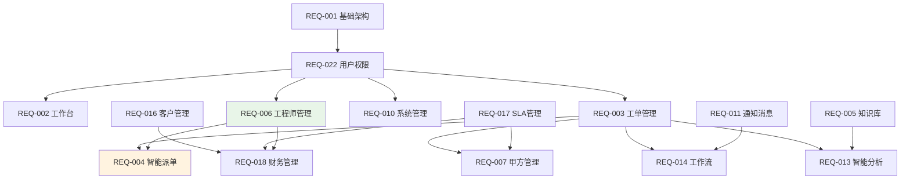

# 附录D：模块映射与依赖关系 v4.5.1

## 版本更新说明

**v4.5.1版本主要变更：**
- 将REQ-006A（工程师基础管理）和REQ-006B（工程师高级管理）合并为统一的REQ-006（工程师管理）
- 优化模块依赖关系，减少系统复杂度
- 更新模块优先级和复杂度评估

## D.1 模块分类说明

| 分类 | 说明 | 特点 |
|------|------|------|
| 基础支撑 | 系统运行的基础设施模块 | 其他模块的依赖基础 |
| 核心业务 | 实现主要业务功能的模块 | 直接面向用户需求 |
| 支撑服务 | 为核心业务提供支撑的模块 | 提升业务效率和质量 |
| 系统管理 | 系统运维和管理功能模块 | 保障系统稳定运行 |
| 商业化 | 面向商业运营的功能模块 | 支持盈利模式 |
| 智能化 | AI和智能分析相关模块 | 提升系统智能化水平 |

## D.2 完整模块映射表（v4.5.1更新）

| 模块编号 | 模块名称 | 优先级 | 分类 | 复杂度 | 主要功能 | v4.5.1变更 |
|---------|---------|--------|------|--------|----------|------------|
| REQ-001 | 基础架构模块 | P0 | 基础支撑 | 高 | 多租户架构、统一认证、数据存储 | 无变更 |
| REQ-002 | 工作台与仪表板 | P0 | 用户界面 | 中 | 个性化工作空间、数据可视化 | 无变更 |
| REQ-003 | 工单管理系统 | P0 | 核心业务 | 高 | 工单全生命周期管理 | 无变更 |
| REQ-004 | 智能派单系统 | P0 | 核心业务 | 高 | AI算法自动派单 | 无变更 |
| REQ-005 | 知识库管理系统 | P1 | 支撑服务 | 中 | 知识沉淀与复用 | 无变更 |
| REQ-006 | 工程师管理系统 | P0 | 人员管理 | 高 | 档案管理、技能管理、排班调度、绩效评估 | **整合REQ-006A+006B** |
| ~~REQ-006A~~ | ~~工程师基础管理~~ | ~~P0~~ | ~~人员管理~~ | ~~中~~ | ~~工程师档案、技能管理~~ | **已合并到REQ-006** |
| ~~REQ-006B~~ | ~~工程师高级管理~~ | ~~P1~~ | ~~人员管理~~ | ~~高~~ | ~~绩效分析、排班调度~~ | **已合并到REQ-006** |
| REQ-007 | 甲方管理与报表系统 | P1 | 客户服务 | 中 | 甲方界面、服务报表 | 无变更 |
| REQ-008 | 系统设置 | P2 | 系统管理 | 低 | 系统参数、业务规则配置 | 无变更 |
| REQ-009 | 运维管理 | P2 | 系统管理 | 中 | 系统监控、性能分析 | 无变更 |
| REQ-010 | 系统管理模块 | P0 | 系统管理 | 中 | 用户管理、权限管理 | 无变更 |
| REQ-011 | 通知与消息系统 | P1 | 支撑服务 | 中 | 多渠道消息通知 | 无变更 |
| REQ-012 | 系统集成模块 | P1 | 集成服务 | 高 | 第三方系统集成 | 无变更 |
| REQ-013 | 智能分析与AI功能 | P2 | 智能化 | 高 | AI分析、故障预测 | 无变更 |
| REQ-014 | 工作流引擎系统 | P2 | 流程自动化 | 高 | 业务流程建模与执行 | 无变更 |
| REQ-015 | 用户体验增强系统 | P2 | 用户体验 | 中 | 界面优化、个性化定制 | 无变更 |
| REQ-016 | 客户关系管理模块 | P1 | 商业化 | 中 | 客户全生命周期管理 | 无变更 |
| REQ-017 | SLA管理模块 | P1 | 商业化 | 中 | 服务水平协议管理 | 无变更 |
| REQ-018 | 财务管理模块 | P1 | 商业化 | 高 | 智能计费、财务分析 | 无变更 |
| REQ-019 | 客户自助服务模块 | P2 | 客户服务 | 中 | 7x24小时自助服务 | 无变更 |
| REQ-020 | 移动端应用模块 | P2 | 移动化 | 中 | 移动设备访问能力 | 无变更 |
| REQ-021 | 资源权限管理模块 | P2 | 安全管理 | 高 | 细粒度权限控制 | 无变更 |
| REQ-022 | 用户与权限管理模块 | P0 | 基础支撑 | 高 | 身份认证、访问控制 | 无变更 |
| REQ-023 | 数据分析与商业智能模块 | P2 | 数据分析 | 高 | 深度数据分析、商业洞察 | 无变更 |

## D.3 模块依赖关系（v4.5.1优化）

### 核心依赖链
```
REQ-001 (基础架构) → REQ-022 (用户权限) → 其他所有模块
REQ-003 (工单管理) → REQ-004 (智能派单) → REQ-006 (工程师管理)
```

### 关键依赖关系（v4.5.1更新）
| 模块 | 直接依赖 | 说明 | v4.5.1变更 |
|------|----------|------|------------|
| REQ-002 | REQ-001, REQ-022 | 需要基础架构和权限支持 | 无变更 |
| REQ-004 | REQ-003, REQ-006 | 依赖工单和工程师数据 | **依赖简化为REQ-006** |
| REQ-006 | REQ-001, REQ-022 | 需要基础架构和权限支持 | **新增：整合后的依赖关系** |
| REQ-007 | REQ-003, REQ-017 | 需要工单和SLA数据 | 无变更 |
| REQ-013 | REQ-003, REQ-005 | 基于工单和知识库数据 | 无变更 |
| REQ-014 | REQ-003, REQ-011 | 需要工单流程和通知支持 | 无变更 |
| REQ-018 | REQ-016, REQ-017, REQ-006 | 依赖客户、SLA和工程师数据 | **新增REQ-006依赖** |

### 依赖关系图（v4.5.1优化）



## D.4 模块整合优势分析

### REQ-006整合效果

**技术优势**
- **减少接口调用**：原本需要跨REQ-006A和REQ-006B的调用现在变为内部调用
- **数据一致性提升**：统一的数据模型避免了数据同步问题
- **性能优化**：减少网络开销和序列化/反序列化成本
- **事务管理简化**：跨功能操作可以在同一事务中完成

**开发优势**
- **代码复用**：基础功能和高级功能可以共享更多代码
- **测试简化**：减少集成测试的复杂度
- **部署简化**：单一模块部署，减少版本兼容性问题
- **维护成本降低**：统一的错误处理和日志记录

**业务优势**
- **功能连贯性**：工程师管理的完整业务流程更加顺畅
- **用户体验提升**：统一的界面和交互体验
- **数据分析增强**：完整的工程师数据支持更深入的分析
- **决策支持改善**：统一的数据视图支持更好的管理决策

## D.5 复杂度评估说明

| 复杂度 | 开发周期 | 技术难点 | 团队规模 | v4.5.1调整 |
|--------|----------|----------|----------|------------|
| 低 | 2-4周 | 标准CRUD操作 | 1-2人 | 无变更 |
| 中 | 4-8周 | 业务逻辑复杂 | 2-3人 | 无变更 |
| 高 | 8-12周 | 算法/架构复杂 | 3-5人 | REQ-006复杂度提升为高 |

### REQ-006复杂度调整说明

**复杂度提升原因**
- **功能范围扩大**：整合了基础管理和高级管理的所有功能
- **算法复杂性**：包含智能排班、绩效评估等复杂算法
- **数据模型复杂**：需要处理更多的数据关系和约束
- **集成要求高**：与多个外部模块有深度集成需求

**开发资源调整**
- **开发周期**：从原来的4-6周（006A）+ 8-10周（006B）优化为10-12周
- **团队规模**：建议4-5人的跨功能团队
- **技能要求**：需要算法、数据库、前端、测试等多方面技能

## D.6 迁移策略

### 从v4.5到v4.5.1的迁移路径

**阶段1：准备阶段（1-2周）**
- 数据备份和环境准备
- 新版本部署和测试环境搭建
- 迁移工具开发和测试

**阶段2：数据迁移（1周）**
- REQ-006A和REQ-006B数据合并
- 数据一致性检查和修复
- 新数据模型验证

**阶段3：功能迁移（2-3周）**
- API接口切换和兼容性测试
- 前端界面更新和集成测试
- 业务流程验证和用户培训

**阶段4：上线切换（1周）**
- 生产环境部署
- 灰度发布和监控
- 全量切换和稳定性观察

### 风险控制措施

**技术风险**
- 提供API兼容层，确保平滑过渡
- 实施蓝绿部署，支持快速回滚
- 建立完整的监控和告警机制

**业务风险**
- 制定详细的回滚计划
- 提供用户培训和支持
- 建立应急响应机制

**数据风险**
- 多重数据备份策略
- 数据迁移验证机制
- 数据恢复预案

参考：详细的技术实现方案见各模块PRD文档和技术架构文档。
