# 附录E：架构图表与业务价值分析 v4.5.1

## 版本更新说明

**v4.5.1版本架构优化：**
- 更新系统架构图，反映REQ-006工程师管理模块的整合
- 优化模块依赖关系图，简化系统复杂度
- 增强数据流图，体现工程师管理的完整业务流程
- 完善部署架构图，支持高可用和可扩展性要求

## E.1 系统总体架构图

### E.1.1 逻辑架构图（v4.5.1优化）


### E.1.2 技术架构图


## E.2 工程师管理模块架构图（v4.5.1新增）

### E.2.1 工程师管理内部架构


### E.2.2 工程师管理数据流图

```mermaid
sequenceDiagram
    participant UI as 前端界面
    participant GW as API网关
    participant ES as 工程师服务
    participant DB as 数据库
    participant CACHE as Redis缓存
    participant MQ as 消息队列
    participant DS as 智能派单服务

    Note over UI,DS: 工程师状态更新流程
    UI->>GW: 更新工程师状态
    GW->>ES: 状态更新请求
    ES->>DB: 持久化状态数据
    ES->>CACHE: 更新缓存状态
    ES->>MQ: 发布状态变更事件
    MQ->>DS: 通知派单服务
    DS->>ES: 查询最新状态
    ES->>CACHE: 返回缓存数据
    ES->>UI: 返回更新结果

    Note over UI,DS: 智能排班流程
    UI->>GW: 生成排班计划
    GW->>ES: 排班计算请求
    ES->>DB: 查询工程师信息
    ES->>ES: 执行排班算法
    ES->>DB: 保存排班结果
    ES->>MQ: 发布排班事件
    ES->>UI: 返回排班计划
```



## E.3 部署架构图

### E.3.1 生产环境部署架构


### E.3.2 容器化部署架构

```yaml
# Docker Compose配置示例
version: '3.8'
services:
  nginx:
    image: nginx:1.25.3
    ports:
      - "80:80"
      - "443:443"
    volumes:
      - ./nginx.conf:/etc/nginx/nginx.conf
    depends_on:
      - engineer-service

  engineer-service:
    image: ops-portal/engineer-service:v4.5.1
    ports:
      - "8080:8080"
    environment:
      - SPRING_PROFILES_ACTIVE=prod
      - DATABASE_URL=jdbc:postgresql://postgres:5432/ops_portal
      - REDIS_URL=redis://redis:6379
    depends_on:
      - postgres
      - redis
    deploy:
      replicas: 3
      resources:
        limits:
          memory: 1G
          cpus: '0.5'

  postgres:
    image: postgres:15.5
    environment:
      - POSTGRES_DB=ops_portal
      - POSTGRES_USER=ops_user
      - POSTGRES_PASSWORD=ops_password
    volumes:
      - postgres_data:/var/lib/postgresql/data
    ports:
      - "5432:5432"

  redis:
    image: redis:7.2.4
    ports:
      - "6379:6379"
    volumes:
      - redis_data:/data

volumes:
  postgres_data:
  redis_data:
```

## E.4 业务价值分析

### E.4.1 ROI分析模型


### E.4.2 业务价值指标

| 价值维度 | 关键指标 | 目标值 | 实现方式 |
|----------|----------|--------|----------|
| **效率提升** | 工单处理效率 | +40% | 智能派单+工程师管理优化 |
| **成本降低** | 运维成本 | -50% | 自动化+资源优化 |
| **质量改善** | 客户满意度 | 90%+ | 服务标准化+绩效管理 |
| **收入增长** | 月度经常性收入 | 50万+ | SaaS订阅模式 |
| **市场扩展** | 客户数量 | 100+ | 产品标准化+快速部署 |

### E.4.3 竞争优势分析

```mermaid
radar
    title 竞争优势雷达图
    "技术先进性" : [0.9, 0.7, 0.6]
    "功能完整性" : [0.95, 0.8, 0.7]
    "用户体验" : [0.9, 0.75, 0.65]
    "性价比" : [0.85, 0.7, 0.8]
    "可扩展性" : [0.9, 0.6, 0.5]
    "安全性" : [0.95, 0.85, 0.8]
    "服务支持" : [0.8, 0.7, 0.6]
```

## E.5 风险评估与缓解

### E.5.1 技术风险评估

| 风险类别 | 风险描述 | 影响程度 | 发生概率 | 缓解措施 |
|----------|----------|----------|----------|----------|
| **架构风险** | 微服务复杂度过高 | 高 | 中 | 渐进式架构演进 |
| **性能风险** | 高并发场景性能瓶颈 | 高 | 中 | 性能测试+优化 |
| **数据风险** | 数据一致性问题 | 高 | 低 | 事务管理+监控 |
| **集成风险** | 第三方系统集成失败 | 中 | 中 | 接口标准化+容错 |
| **安全风险** | 数据泄露或攻击 | 高 | 低 | 多层安全防护 |

### E.5.2 业务风险评估

| 风险类别 | 风险描述 | 影响程度 | 发生概率 | 缓解措施 |
|----------|----------|----------|----------|----------|
| **市场风险** | 竞争对手快速跟进 | 中 | 高 | 持续创新+差异化 |
| **客户风险** | 客户需求变化过快 | 中 | 中 | 敏捷开发+快速响应 |
| **团队风险** | 关键人员流失 | 高 | 低 | 知识管理+团队建设 |
| **合规风险** | 法规政策变化 | 中 | 中 | 合规监控+预案准备 |

## E.6 系统监控架构

### E.6.1 监控体系架构


参考：详细的部署配置和运维指南见附录F《部署指南与运维手册》。
