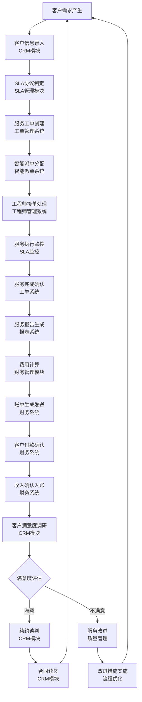
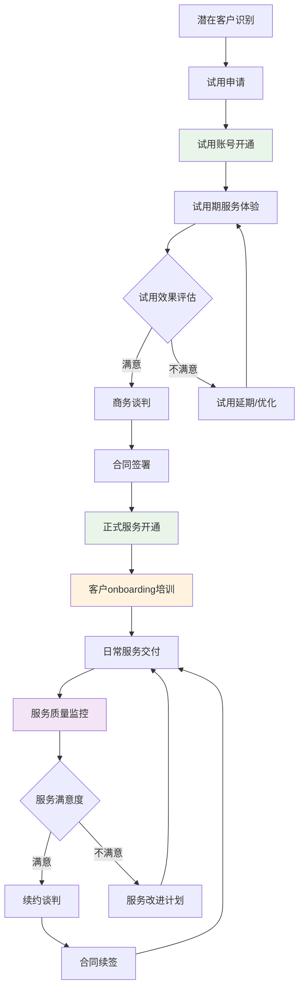
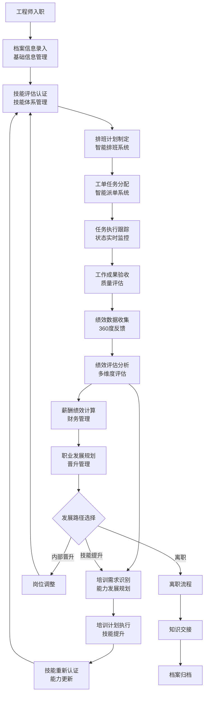
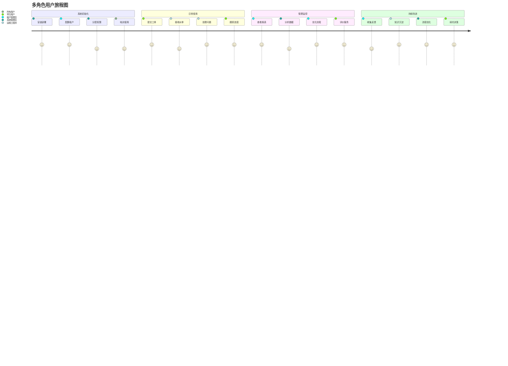

## 3. 全局业务逻辑与产品架构图

### 3.1 核心业务闭环（增强版）

**补充:** 核心业务闭环总览图（覆盖 v4.2 的业务闭环）：

#### 3.1.1 完整客户生命周期管理流程

**补充:** 客户生命周期管理是SaaS业务的核心，直接影响客户获取成本（CAC）和客户生命周期价值（LTV）。以下流程图展示了从潜在客户到忠诚客户的完整转化路径。

#### 客户生命周期管理流程文字版说明

**补充:** 为确保业务流程的可理解性，提供详细的分步说明，明确每个节点的业务含义、输入输出和触发条件。

**阶段1：潜在客户获取（1-7天）**
- **潜在客户识别**：通过市场营销、推荐、展会等渠道识别潜在客户
  - 输入：客户联系信息、需求描述
  - 输出：客户档案、需求评估
  - 触发条件：客户主动咨询或被动触达
- **试用申请**：客户提交试用申请，填写基本信息
  - 输入：公司信息、联系人、预期用户数
  - 输出：试用申请记录
  - 业务规则：自动审核通过，特殊情况人工审核

**阶段2：试用期管理（7-30天）**
- **试用账号开通**：系统自动创建试用租户，配置基础功能
  - 输入：试用申请信息
  - 输出：试用账号、登录凭证
  - 业务规则：限制功能和数据量，设置试用期限
- **试用期服务体验**：客户使用产品，客户成功经理跟进
  - 输入：客户使用行为数据
  - 输出：使用报告、问题反馈
  - 关键指标：登录频率、功能使用率、问题数量
- **试用效果评估**：基于使用数据和客户反馈评估试用效果
  - 输入：使用统计、客户反馈、满意度调研
  - 输出：评估报告、转化概率
  - 决策标准：使用频率>50%、满意度>80%为满意

**阶段3：商务转化（7-30天）**
- **商务谈判**：基于试用效果制定个性化方案和报价
  - 输入：客户需求、预算范围、决策时间
  - 输出：商务方案、合同草案
  - 关键因素：功能匹配度、价格竞争力、服务保障
- **合同签署**：确认合同条款，完成法务审核和签署
  - 输入：最终方案、合同条款
  - 输出：正式合同、付款计划
  - 业务规则：合同生效后启动正式服务开通流程

**阶段4：服务交付（持续）**
- **正式服务开通**：配置生产环境，迁移试用数据
  - 输入：合同信息、配置要求
  - 输出：生产账号、服务配置
  - 业务规则：按合同配置功能模块和用户数量
- **客户onboarding培训**：提供系统培训和使用指导
  - 输入：客户团队信息、培训需求
  - 输出：培训计划、培训材料
  - 成功标准：用户能够独立完成基本操作
- **日常服务交付**：提供持续的运维服务和技术支持
  - 输入：客户工单、服务请求
  - 输出：服务结果、服务报告
  - 关键指标：响应时间、解决率、客户满意度

**阶段5：客户成功管理（持续）**
- **服务质量监控**：实时监控服务质量和客户满意度
  - 输入：服务数据、客户反馈
  - 输出：质量报告、改进建议
  - 监控指标：SLA达成率、响应时间、故障率
- **客户满意度管理**：定期调研客户满意度，及时处理问题
  - 输入：满意度调研、客户投诉
  - 输出：满意度报告、改进计划
  - 业务规则：满意度<80%触发改进流程
- **续约管理**：提前启动续约谈判，确保客户续约
  - 输入：合同到期时间、客户使用情况
  - 输出：续约方案、新合同
  - 关键因素：服务质量、价格竞争力、功能升级

#### 3.1.2 工程师管理业务闭环（v4.5.1新增）

**补充:** v4.5.1版本将工程师基础管理和高级管理整合为统一的工程师管理模块，形成完整的人力资源管理闭环。

#### 工程师管理核心流程说明

**入职管理流程（1-7天）**
- **档案信息录入**：HR录入工程师基本信息，创建系统账号
- **技能评估认证**：评估工程师技能水平，建立技能档案
- **初始排班安排**：根据技能和经验安排初始工作计划

**日常工作管理（持续）**
- **智能排班**：基于技能匹配、工作负载、地理位置等因素自动排班
- **任务分配**：通过智能派单系统分配合适的工单任务
- **状态跟踪**：实时跟踪工程师在线状态、工作状态、位置信息

**绩效管理流程（月度/季度）**
- **数据收集**：自动收集工单处理、SLA达成、客户满意度等数据
- **360度反馈**：收集上级、同事、下属、客户的多维度评价
- **绩效分析**：基于多维度数据计算综合绩效得分
- **改进计划**：制定个人发展计划和技能提升方案

**职业发展管理（年度）**
- **能力评估**：全面评估工程师的技术能力和综合素质
- **发展规划**：制定个人职业发展路径和目标
- **培训管理**：安排针对性的培训课程和认证考试
- **晋升管理**：基于绩效和能力评估进行岗位晋升

### 3.2 产品架构图（v4.5.1优化版）

**补充:** 产品架构采用分层设计，确保系统的可扩展性、可维护性和高可用性。v4.5.1版本优化了工程师管理模块的架构设计。

```mermaid
graph TB
    subgraph "用户层"
        U1[系统管理员]
        U2[租户管理员]
        U3[运维工程师]
        U4[甲方用户]
        U5[客户]
    end

    subgraph "应用层"
        subgraph "P0核心模块"
            A1[基础架构与认证]
            A2[工作台与仪表板]
            A3[工单管理系统]
            A4[智能派单系统]
            A5[系统管理模块]
            A6[工程师管理系统<br/>REQ-006统一模块]
        end

        subgraph "P1重要模块"
            B1[知识库管理]
            B2[甲方管理与报表]
            B3[通知与消息]
            B4[系统集成]
            B5[客户关系管理]
            B6[SLA管理]
            B7[财务管理]
        end

        subgraph "P2扩展模块"
            C1[系统设置]
            C2[运维管理]
            C3[智能分析与AI]
            C4[工作流引擎]
            C5[用户体验增强]
        end
    end

    subgraph "数据层"
        D1[(主数据库<br/>PostgreSQL)]
        D2[(缓存层<br/>Redis)]
        D3[(搜索引擎<br/>Elasticsearch)]
        D4[(文件存储<br/>MinIO)]
        D5[(消息队列<br/>RabbitMQ)]
    end

    subgraph "集成层"
        E1[第三方监控系统]
        E2[企业邮箱系统]
        E3[短信服务平台]
        E4[支付网关]
        E5[外部API接口]
    end

    U1 --> A1
    U2 --> A2
    U3 --> A6
    U4 --> A3
    U5 --> B5

    A1 --> D1
    A2 --> D2
    A3 --> D1
    A4 --> D3
    A5 --> D1
    A6 --> D1
    A6 --> D2
    
    B1 --> D3
    B2 --> D1
    B3 --> D5
    B4 --> E5
    B5 --> D1
    B6 --> D1
    B7 --> D1

    C1 --> D1
    C2 --> D2
    C3 --> D3
    C4 --> D5
    C5 --> D4

    B3 --> E2
    B3 --> E3
    B7 --> E4
    A4 --> E1
```

#### v4.5.1架构优化说明

**工程师管理模块整合优化**
- **模块合并**：将REQ-006A（工程师基础管理）和REQ-006B（工程师高级管理）合并为统一的REQ-006（工程师管理系统）
- **功能整合**：基础档案管理、技能管理、排班管理、绩效评估、培训管理统一在一个模块中
- **数据统一**：工程师相关数据模型统一设计，减少数据冗余和不一致性
- **接口简化**：API接口设计更加简洁，减少跨模块调用的复杂度

**架构层次优化**
- **P0核心模块调整**：工程师管理系统作为核心模块，与智能派单系统紧密集成
- **数据层增强**：增强Redis缓存在工程师状态管理中的应用
- **集成层完善**：优化与外部系统的集成接口设计

### 3.3 用户角色与权限体系

#### 系统管理员
- 职责：负责整个平台的技术管理和系统配置，具有最高权限
- 核心需求：系统稳定性、性能监控、安全管理、技术支持
- 使用场景：系统配置、用户管理、故障处理、性能优化
- 成功指标：系统可用性≥99.5%，故障响应时间≤15分钟

#### 租户管理员
- 职责：管理特定租户的用户和权限，权限限制在租户范围内
- 核心需求：团队管理、服务质量监控、成本控制
- 使用场景：团队配置、SLA管理、报表查看、客户沟通
- 成功指标：团队效率提升≥30%，客户满意度≥90%

#### 运维工程师
- 职责：执行日常运维任务，需要相应的功能权限和数据访问权限
- 核心需求：工单处理效率、知识获取便利性、工作负载合理性
- 使用场景：工单处理、知识查询、状态更新、经验分享
- 成功指标：工单处理效率提升≥40%，知识复用率≥70%

#### 甲方用户
- 职责：提交运维需求，跟踪服务进度，评价服务质量
- 核心需求：问题快速解决、服务透明度、沟通便利性
- 使用场景：工单提交、进度查询、服务评价、报表查看
- 成功指标：问题解决时间≤2小时，服务满意度≥90%

#### 客户
- 职责：使用运维服务，参与服务评价和改进建议
- 核心需求：服务质量、响应速度、成本控制
- 使用场景：服务申请、进度跟踪、质量评价、续约决策
- 成功指标：服务响应时间≤30分钟，整体满意度≥85%

### 3.4 用户旅程图（增强版）

**补充:** 用户旅程图展示了不同角色用户在系统中的完整使用流程，帮助理解用户需求和优化用户体验。

### 3.5 多租户隔离规则（来自 v4.2）

#### 数据隔离规则
- 数据库隔离：每个租户的数据在逻辑上完全隔离
- API隔离：所有API请求必须验证租户权限
- 存储隔离：文件存储按租户分目录管理

#### 权限隔离规则
- 角色隔离：角色权限限制在租户范围内
- 功能隔离：租户只能使用已购买的功能模块
- 配置隔离：系统配置按租户独立管理

#### 安全隔离规则
- 网络隔离：租户间网络访问完全隔离
- 日志隔离：操作日志按租户分别记录和存储
- 备份隔离：数据备份按租户独立管理
- 监控隔离：系统监控数据按租户分别统计

### 3.6 产品架构层次说明

**补充:** 为确保架构的可理解性，提供各层次的详细说明和设计原则。

**用户层设计原则**
- **角色分离**：不同用户角色有明确的权限边界和功能范围
- **体验一致**：所有用户角色都享有一致的界面风格和交互体验
- **权限最小化**：每个角色只能访问完成工作所需的最小权限

**应用层设计原则**
- **模块化设计**：按业务领域划分模块，降低耦合度
- **优先级分层**：P0核心模块保证基本功能，P1/P2模块提供增值服务
- **服务化架构**：每个模块都可以独立部署和扩展

**数据层设计原则**
- **数据分离**：不同类型数据使用最适合的存储方案
- **高可用性**：所有数据存储都有备份和容灾方案
- **性能优化**：通过缓存和索引优化数据访问性能

**集成层设计原则**
- **标准化接口**：使用标准协议和格式进行系统集成
- **松耦合设计**：外部系统故障不影响核心功能
- **可扩展性**：支持新的第三方系统快速接入

### 3.7 架构设计总结

#### 核心设计理念
本系统架构基于以下核心理念设计：

1. **业务驱动**：架构设计紧密围绕业务闭环，确保技术服务于业务目标
2. **用户中心**：以用户体验为中心，提供简洁高效的操作界面
3. **数据驱动**：通过数据分析驱动业务决策和系统优化
4. **安全第一**：在架构设计的每个层面都考虑安全性要求

#### 关键技术决策
- **微服务架构**：支持模块独立开发和部署，提高系统灵活性
- **多租户设计**：实现SaaS模式运营，降低运营成本
- **云原生技术**：基于容器和Kubernetes，支持弹性扩展
- **API优先**：统一的API设计，支持多端接入和第三方集成

#### 质量属性保证
| 质量属性 | 设计策略 | 目标指标 |
|----------|----------|----------|
| **可用性** | 高可用架构、故障转移 | 99.5%+ |
| **性能** | 缓存策略、数据库优化 | API响应<200ms |
| **安全性** | 多层安全防护、权限控制 | 0个高危漏洞 |
| **可扩展性** | 微服务架构、水平扩展 | 支持1000+并发 |
| **可维护性** | 模块化设计、标准化接口 | 新功能开发周期<2周 |

#### v4.5.1版本架构优势
- **模块整合优化**：工程师管理模块整合减少了系统复杂度
- **数据一致性提升**：统一的数据模型设计提高了数据质量
- **API设计简化**：减少了跨模块调用，提升了系统性能
- **维护成本降低**：统一的模块管理降低了运维复杂度

参考：详细的技术实现方案见附录C《技术栈与架构选型》和附录E《架构图表与业务价值分析》。
