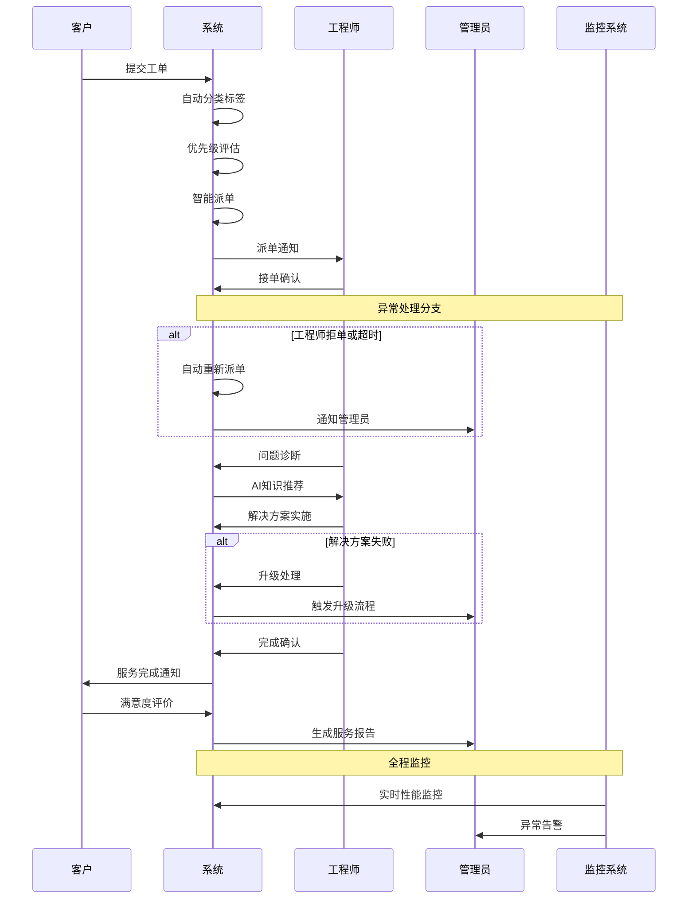
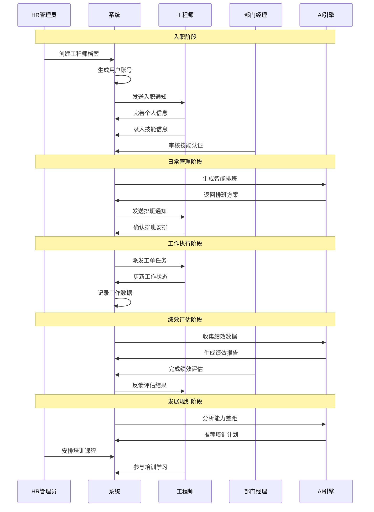
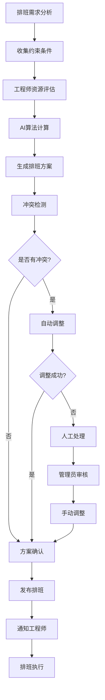
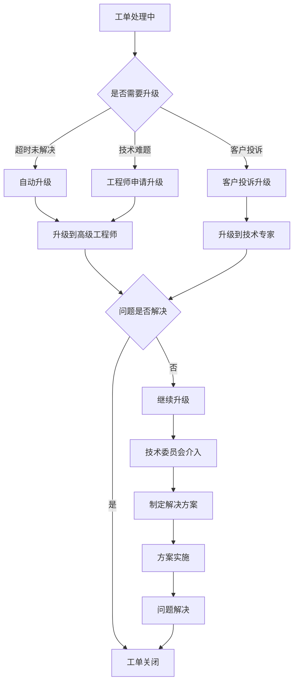

## 4. 业务流程

### 4.1 核心业务流程示意

#### 工单处理流程（增强版）

**补充:** 工单处理是IT运维服务的核心业务流程，涉及客户、系统、工程师、管理员等多个角色的协作。以下流程图展示了从工单创建到关闭的完整生命周期。

#### 工单处理流程文字版详细说明

**补充:** 为确保业务流程的可操作性，提供每个环节的详细说明，包括输入输出、时间要求、质量标准和异常处理。

**第一阶段：工单创建与分类（1-5分钟）**

1. **工单提交**
   - 输入：问题描述、紧急程度、影响范围、联系方式
   - 验证：必填字段检查、格式验证、重复工单检测
   - 自动处理：工单编号生成、时间戳记录、状态初始化
   - 输出：工单ID、确认信息、预估处理时间

2. **自动分类标签**
   - 分类依据：问题关键词、历史案例、客户类型
   - 分类算法：基于NLP的文本分析 + 机器学习模型
   - 分类结果：技术类别、业务类别、复杂程度
   - 准确率要求：自动分类准确率≥85%

3. **优先级评估**
   - 评估因素：客户等级、SLA协议、影响范围、紧急程度
   - 评估算法：加权评分模型，客户等级40% + SLA要求30% + 影响范围20% + 紧急程度10%
   - 优先级定义：紧急（P0）、高（P1）、中（P2）、低（P3）
   - 输出：优先级等级、SLA时间要求

**第二阶段：智能派单与接单（3-15分钟）**

4. **智能派单执行**
   - 输入：工单信息、工程师状态、技能匹配度、地理位置
   - 派单算法：技能匹配40% + 工作负载25% + 地理位置20% + 历史绩效15%
   - 候选筛选：技能匹配度≥80%、当前工单数≤5个、在线状态
   - 输出：最优工程师、备选工程师列表、派单原因
   - 时间要求：派单决策时间≤3分钟

5. **工程师接单确认**
   - 通知方式：系统通知 + 短信 + 邮件（多渠道保障）
   - 响应时间：紧急15分钟、高30分钟、中2小时、低4小时
   - 接单操作：确认接单、预估处理时间、申请资源支持
   - 异常处理：超时未响应自动重新派单、拒单需说明原因
   - 输出：接单确认、预估完成时间

**第三阶段：问题诊断与解决（30分钟-24小时）**

6. **问题诊断分析**
   - 诊断方法：远程诊断、现场检查、日志分析、性能监控
   - 诊断工具：系统监控工具、日志分析工具、网络诊断工具
   - 诊断记录：问题现象、可能原因、影响范围、风险评估
   - 输出：诊断报告、解决方案建议

7. **AI知识推荐**
   - 推荐依据：问题关键词、历史解决方案、相似案例
   - 推荐内容：解决步骤、参考文档、专家联系方式、风险提示
   - 推荐质量：相关性≥80%、有效性≥70%
   - 反馈机制：工程师可对推荐内容评价，持续优化算法
   - 输出：推荐方案列表、相关度评分

8. **解决方案实施**
   - 实施前准备：方案评估、风险分析、备份计划、回滚方案
   - 实施过程：按步骤执行、实时记录、异常处理、进度更新
   - 质量控制：关键步骤确认、测试验证、性能检查
   - 客户沟通：重要操作前确认、进度及时通报、风险提前告知
   - 输出：实施记录、结果验证、客户确认

**第四阶段：验收与评价（15-60分钟）**

9. **服务完成确认**
   - 工程师确认：问题已解决、系统运行正常、客户可以验收
   - 系统检查：自动验证相关监控指标、性能数据、错误日志
   - 文档更新：解决方案记录、知识库更新、经验总结
   - 输出：完成报告、解决方案文档

10. **客户满意度评价**
    - 评价维度：解决效果、响应速度、服务态度、专业水平
    - 评价方式：系统评分 + 文字反馈 + 改进建议
    - 评价时机：服务完成后24小时内
    - 跟进机制：低满意度自动触发客户关怀流程
    - 输出：满意度评分、客户反馈、改进建议

**第五阶段：报告与分析（自动生成）**

11. **服务报告生成**
    - 报告内容：工单基本信息、处理过程、解决方案、时间统计、满意度评价
    - 生成时机：工单关闭后自动生成
    - 分发对象：客户、工程师、管理员、相关干系人
    - 存档管理：报告永久保存，支持历史查询和统计分析
    - 输出：标准化服务报告、统计数据

### 4.2 工程师管理业务流程（v4.5.1新增）

#### 工程师全生命周期管理流程

**补充:** v4.5.1版本整合了工程师基础管理和高级管理，形成完整的人力资源管理流程。

#### 智能排班业务流程

**补充:** 智能排班是工程师管理的核心功能，通过AI算法实现最优的人员调度。

### 4.3 异常处理流程

#### 系统异常处理
**技术故障处理：**
1. **故障检测**：自动监控系统状态
2. **故障定位**：快速识别故障组件
3. **故障隔离**：防止故障扩散
4. **故障恢复**：自动或手动恢复服务
5. **故障通知**：及时通知相关人员
6. **事后分析**：分析故障原因，制定预防措施

#### 业务异常处理
**工单处理异常：**
- **超时处理**：自动升级或重新派单
- **拒单处理**：记录原因，重新匹配工程师
- **质量问题**：客户投诉处理，服务补偿

**工程师管理异常：**
- **排班冲突**：自动检测并提供解决方案
- **技能认证过期**：提前30天预警通知
- **绩效异常**：触发改进计划和培训安排

**数据异常处理：**
- **数据丢失**：从备份恢复，记录事故
- **数据错误**：数据校验，人工修正
- **同步失败**：重试机制，异常告警

### 4.4 业务规则与约束

#### SLA管理规则
- **响应时间要求**：紧急≤15分钟，高≤30分钟，中≤2小时，低≤4小时
- **解决时间要求**：紧急≤2小时，高≤8小时，中≤24小时，低≤72小时
- **违约处理**：超时自动升级，连续违约触发客户关怀流程

#### 智能派单规则
- **技能匹配**：工程师技能标签与工单需求匹配度≥80%
- **负载均衡**：工程师当前工单数量不超过5个
- **地理位置**：优先派给同城或就近工程师
- **历史绩效**：优先派给历史处理成功率高的工程师

#### 工程师管理规则（v4.5.1新增）
- **排班约束**：单个工程师每日工作时间不超过8小时
- **技能认证**：关键技能必须有有效认证，过期前30天预警
- **绩效评估**：季度评估，年度综合评估，360度反馈
- **培训要求**：每年至少完成40小时专业培训

#### 工单升级处理流程

**补充:** 当工单无法在预期时间内解决或遇到技术难题时，需要启动升级处理流程，确保客户问题得到及时有效的解决。

#### 升级处理标准

**补充:** 明确的升级标准确保问题能够及时得到适当级别的技术支持。

| 升级类型 | 触发条件 | 响应时间 | 处理人员 | 解决时限 |
|---------|----------|----------|----------|----------|
| 自动升级 | 超过SLA时间50% | 立即 | 高级工程师 | 原SLA时间 |
| 技术升级 | 工程师申请 | 30分钟 | 技术专家 | 4小时 |
| 投诉升级 | 客户投诉 | 15分钟 | 客户经理+技术专家 | 2小时 |
| 专家升级 | 重大技术问题 | 1小时 | 技术委员会 | 24小时 |

### 4.5 流程监控与优化

#### 关键性能指标（KPI）
- **工单处理效率**：平均处理时间、一次解决率、客户满意度
- **工程师绩效**：工单完成率、技能匹配度、客户评价
- **系统性能**：响应时间、可用性、并发处理能力
- **业务指标**：客户续约率、收入增长率、成本控制率

#### 持续改进机制
- **数据驱动优化**：基于KPI数据分析，识别改进机会
- **流程标准化**：建立标准作业程序，确保服务质量一致性
- **知识管理**：沉淀最佳实践，提升团队整体能力
- **客户反馈**：定期收集客户反馈，持续优化服务体验

参考：详细的技术实现方案见各模块PRD文档和附录技术文档。
