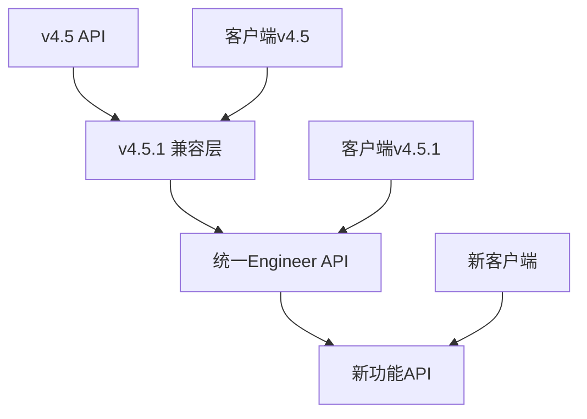

# IT运维门户系统 API 业务域与功能模块映射表 v4.5.1

## 版本更新说明

**v4.5.1版本主要变更：**
- 将REQ-006A（工程师基础管理）和REQ-006B（工程师高级管理）合并为统一的REQ-006（工程师管理）
- 优化engineer业务域的API设计，减少接口复杂度
- 统一工程师相关的数据模型和业务流程

## 业务域与模块对应关系

| 业务域 (Domain) | 域描述 | 模块编号 | 模块名称 | 特殊说明 |
|-----------------|--------|----------|----------|----------|
| auth            | 统一认证与权限管理 | REQ-001 | 基础架构模块 |  |
|                 |                         | REQ-022 | 用户与权限管理模块 |  |
|                 |                         | REQ-021 | 资源权限管理模块 |  |
| ticket          | 工单全生命周期管理 | REQ-003 | 工单管理系统 |  |
|                 |                         | REQ-004 | 智能派单系统 |  |
| engineer        | 工程师管理与调度 | REQ-006 | 工程师管理系统 | **v4.5.1整合：基础管理+高级管理统一** |
| knowledge       | 知识与自助服务 | REQ-005 | 知识库管理系统 |  |
|                 |                         | REQ-019 | 客户自助服务模块 |  |
| customer        | 客户与服务质量管理 | REQ-016 | 客户关系管理模块 |  |
|                 |                         | REQ-017 | SLA管理模块 |  |
|                 |                         | REQ-007 | 甲方管理与报表系统 |  |
| notification    | 通知服务 | REQ-011 | 通知与消息系统 |  |
| integration     | 外部系统集成 | REQ-012 | 系统集成模块 | 独立业务域，统一管理外部 API 对接与数据同步 |
| finance         | 财务与计费管理 | REQ-018 | 财务管理模块 |  |
| system          | 系统与配置管理 | REQ-010 | 系统管理模块 |  |
|                 |                         | REQ-008 | 系统设置 |  |
|                 |                         | REQ-009 | 运维管理 |  |
| analytics       | 智能分析 | REQ-013 | 智能分析与AI功能 |  |
| workflow        | 工作流管理 | REQ-014 | 工作流引擎系统 | 独立域，可被多域复用 |
| experience      | 用户体验增强 | REQ-015 | 用户体验增强系统 | 前端/交互优化 |
| client          | 客户端接入 | REQ-020 | 移动端应用模块 | **v4.5.1新增：作为独立域，提供移动端API** |
| data            | 数据分析与BI | REQ-023 | 数据分析与商业智能模块 |  |

## Engineer业务域API设计（v4.5.1优化）

### 核心API路径规划

| API路径 | 功能描述 | 原模块来源 | 整合优势 |
|---------|----------|------------|----------|
| `/api/v1/engineers` | 工程师档案管理 | REQ-006A | 统一入口，简化调用 |
| `/api/v1/engineers/{id}/skills` | 技能管理 | REQ-006A | 与档案紧密关联 |
| `/api/v1/engineers/{id}/status` | 状态管理 | REQ-006A | 实时状态更新 |
| `/api/v1/schedules` | 排班管理 | REQ-006B | 独立资源管理 |
| `/api/v1/performance` | 绩效评估 | REQ-006B | 独立评估体系 |
| `/api/v1/training` | 培训管理 | REQ-006B | 职业发展支持 |

### API设计优化说明

**统一数据模型**
- 工程师基础信息与高级功能共享统一的数据模型
- 减少数据冗余，提升数据一致性
- 简化前端数据处理逻辑

**接口调用简化**
- 减少跨模块API调用，提升系统性能
- 统一错误处理机制，提升开发效率
- 简化权限控制逻辑，降低安全风险

**业务流程优化**
- 工程师入职到离职的完整生命周期管理
- 技能评估与绩效评估的数据联动
- 排班与工单派发的智能协调

## 跨域协作关系

### Engineer域与其他域的集成

| 目标域 | 集成场景 | API调用关系 | 数据流向 |
|--------|----------|-------------|----------|
| ticket | 智能派单 | ticket → engineer | 获取工程师技能、状态、负载信息 |
| customer | 服务评价 | customer → engineer | 获取工程师服务历史和评价 |
| finance | 薪酬计算 | finance → engineer | 获取工程师绩效和考勤数据 |
| notification | 消息通知 | engineer → notification | 发送排班、绩效、培训通知 |
| analytics | 数据分析 | analytics → engineer | 获取工程师工作数据进行分析 |

### 数据同步机制

**实时同步**
- 工程师在线状态：通过WebSocket实时同步
- 工单分配状态：通过事件驱动机制同步
- 紧急通知：通过消息队列即时推送

**定时同步**
- 绩效数据：每日定时汇总和计算
- 技能认证：每周检查过期情况
- 培训进度：每日更新学习状态

**事件驱动同步**
- 工程师状态变更：触发相关系统更新
- 技能认证更新：触发派单规则重新计算
- 绩效评估完成：触发薪酬计算和职业规划

## API版本管理策略

### 版本兼容性

**v4.5.1版本兼容性保证**
- 保持与v4.5版本的API向后兼容
- 新增API使用新的路径，避免破坏性变更
- 提供数据迁移工具，确保平滑升级

**废弃API处理**
- REQ-006A和REQ-006B的独立API标记为废弃
- 提供6个月的过渡期，支持旧API调用
- 在响应头中添加废弃警告信息

### 版本升级路径

## 安全与权限控制

### API访问控制

**统一认证**
- 所有API调用必须通过JWT认证
- 支持多因子认证（MFA）
- 实现单点登录（SSO）集成

**细粒度权限**
- 基于RBAC的权限控制
- 支持资源级别的权限管理
- 实现数据行级安全控制

**多租户隔离**
- API层自动注入租户过滤条件
- 确保租户间数据完全隔离
- 支持租户级别的功能定制

### 数据安全

**敏感数据保护**
- 个人身份信息（PII）加密存储
- API响应中敏感数据自动脱敏
- 支持数据访问审计和追踪

**传输安全**
- 强制使用HTTPS/TLS 1.3
- API请求签名验证
- 防止重放攻击

## 监控与运维

### API性能监控

**关键指标**
- API响应时间：目标<200ms
- API成功率：目标>99.5%
- 并发处理能力：目标>1000 QPS
- 错误率：目标<0.1%

**监控工具**
- 实时性能监控仪表板
- 异常告警和自动恢复
- API调用链路追踪
- 业务指标监控

### 运维自动化

**自动化部署**
- 支持蓝绿部署和滚动更新
- 自动化测试和质量检查
- 配置管理和版本控制

**故障处理**
- 自动故障检测和隔离
- 服务降级和熔断机制
- 快速回滚和恢复能力

参考：详细的API接口定义见各模块PRD文档，技术实现方案见附录技术文档。
