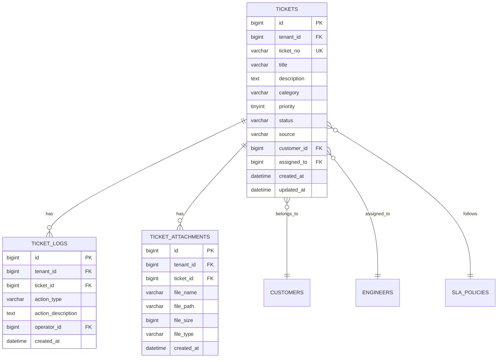
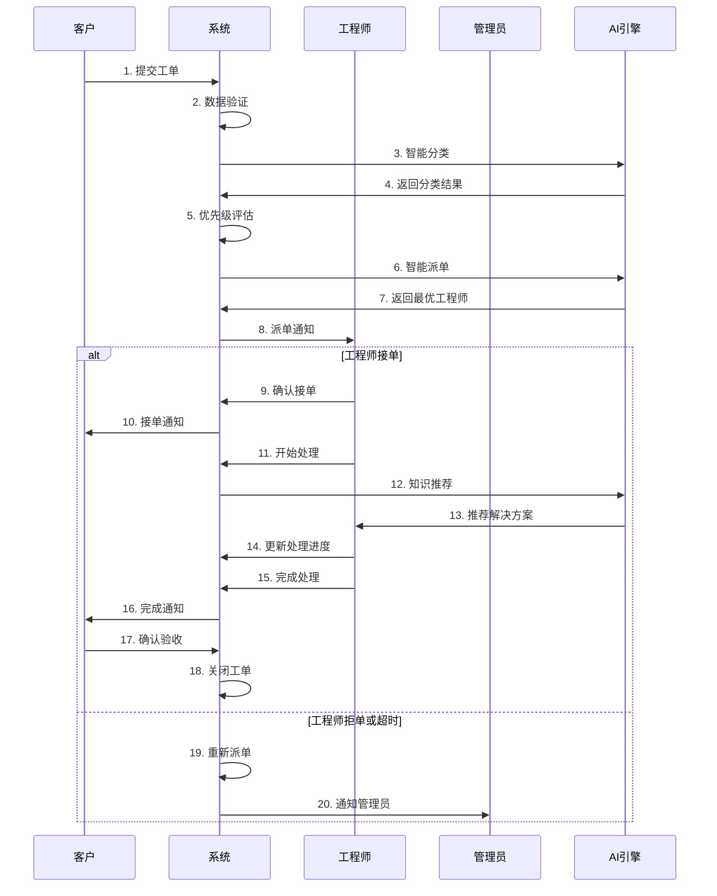

# REQ-003 - 工单管理系统

## 文档信息
- **版本号**：4.5.1
- **变更日期**：2024-08-14
- **原版本**：4.5
- **文档类型**：产品需求文档（PRD）

## 版本变更说明
### 主要改进内容
- **P0级修复**：补充完整的数据模型定义、API接口规范、状态流转规则、批量操作需求
- **P1级增强**：详细的性能优化策略、安全实施方案、跨模块交互契约、异常处理机制
- **P2级优化**：实时数据更新方案、大数据量扩展策略、缓存优化、用户体验增强

### 技术增强概要
- **数据模型**：完善索引设计、约束条件、分区策略，支持大数据量场景
- **接口设计**：新增完整的API接口定义，包括批量操作、复杂查询、实时通知
- **性能安全**：具体化性能指标和安全策略，提供详细的技术实施方案
- **异常处理**：完善异常情况处理机制，包括超时、故障转移、数据恢复

---

## 1. 需求概述

工单管理系统是IT运维服务的核心业务模块，负责处理从工单创建到关闭的完整生命周期管理。系统支持多渠道工单提交、智能分类标签、优先级评估、SLA管理、进度跟踪等功能，确保每个客户问题都能得到及时有效的处理。

### 1.1 核心业务目标
- **效率提升**：通过智能派单和自动化流程，提升工单处理效率40%以上
- **质量保证**：建立标准化处理流程，确保服务质量一致性，客户满意度≥90%
- **成本控制**：通过知识复用和流程优化，降低运维成本30%以上
- **数据驱动**：基于工单数据进行业务分析和决策优化

### 1.2 功能范围
- 工单全生命周期管理（创建、分配、处理、验收、关闭）
- 智能派单和负载均衡
- SLA监控和告警
- 知识库集成和经验沉淀
- 多渠道接入和实时通知
- 统计分析和报表生成

## 2. 功能需求

### 2.1 核心功能

#### 2.1.1 工单创建与管理
**功能描述**：支持多渠道工单创建，包括Web界面、API接口、邮件、监控告警自动创建等方式。

**详细需求**：
- 支持手动创建、自动创建、批量创建三种模式
- 自动生成唯一工单编号（格式：TK+年月日+4位序号）
- 必填字段验证：标题、描述、客户信息、紧急程度
- 附件上传支持：最大100MB，支持常见文件格式
- 重复工单检测：基于标题和描述相似度算法
- 自动分类标签：基于NLP算法进行问题分类

**验收标准**：
- 工单创建成功率 ≥ 99.9%
- 自动分类准确率 ≥ 90%
- 重复工单检测准确率 ≥ 85%
- 创建响应时间 ≤ 3秒

#### 2.1.2 智能派单系统
**功能描述**：基于工程师技能、工作负载、地理位置等因素进行智能派单。

**详细需求**：
- 技能匹配算法：工程师技能标签与工单需求匹配度≥80%
- 负载均衡：工程师当前工单数量≤5个
- 地理位置优先：优先派给同城或就近工程师
- 历史绩效考虑：优先派给处理成功率高的工程师
- 自动重新派单：工程师拒单或超时未响应时自动重新派单
- 手动派单支持：管理员可强制指定工程师

**验收标准**：
- 派单成功率 ≥ 98%
- 派单响应时间 ≤ 3分钟
- 技能匹配准确率 ≥ 90%
- 负载均衡有效性 ≥ 95%

#### 2.1.3 工单状态管理
**功能描述**：完整的工单状态流转管理，支持标准流程和异常处理。

**状态定义**：
- 新建(NEW)：工单刚创建，等待系统处理
- 待分配(PENDING)：已分类，等待派单
- 已分配(ASSIGNED)：已派单，等待工程师接单
- 处理中(IN_PROGRESS)：工程师正在处理
- 挂起(SUSPENDED)：等待客户回复或外部条件
- 升级(ESCALATED)：升级到高级工程师或专家
- 待验收(PENDING_VERIFICATION)：等待客户确认
- 已解决(RESOLVED)：问题已解决，等待关闭
- 已关闭(CLOSED)：工单完成
- 已取消(CANCELLED)：工单取消

**状态流转规则**：
- 正常流程：NEW → PENDING → ASSIGNED → IN_PROGRESS → PENDING_VERIFICATION → RESOLVED → CLOSED
- 异常流程：任何状态可转为SUSPENDED、ESCALATED、CANCELLED
- 权限控制：不同角色对状态流转的操作权限不同
- 自动流转：超时自动升级、系统自动分配等

**验收标准**：
- 状态流转准确率 = 100%
- 状态更新响应时间 ≤ 1秒
- 权限控制有效性 = 100%

### 2.2 辅助功能

#### 2.2.1 批量操作
**功能描述**：支持批量处理工单，提升操作效率。

**详细需求**：
- 批量创建：支持Excel导入、API批量创建
- 批量分配：一次性分配多个工单给指定工程师
- 批量更新：批量修改工单状态、优先级、分类等
- 批量关闭：批量关闭已解决的工单
- 批量导出：支持多种格式导出（Excel、PDF、CSV）

**验收标准**：
- 批量操作成功率 ≥ 99%
- 单次批量操作数量 ≤ 1000个
- 批量操作响应时间 ≤ 30秒

#### 2.2.2 高级查询与统计
**功能描述**：提供强大的查询和统计分析功能。

**详细需求**：
- 多条件组合查询：支持AND、OR逻辑组合
- 全文搜索：基于Elasticsearch的全文检索
- 时间范围查询：支持相对时间和绝对时间
- 状态统计：实时统计各状态工单数量
- 趋势分析：工单量趋势、处理时间趋势
- 绩效分析：工程师绩效、客户满意度分析

**验收标准**：
- 查询响应时间 ≤ 2秒
- 统计数据准确率 = 100%
- 支持10万+工单的快速查询

### 2.3 边界条件处理

#### 2.3.1 并发处理
- 支持1000+并发用户同时操作
- 使用乐观锁防止状态冲突
- 队列机制处理高并发创建请求

#### 2.3.2 数据完整性
- 分布式事务保证数据一致性
- 定期数据校验和修复
- 操作日志完整记录

#### 2.3.3 系统容错
- 服务降级：核心功能优先保证
- 故障转移：自动切换到备用系统
- 数据恢复：从备份快速恢复数据

## 3. 数据模型设计

### 3.1 实体关系图



### 3.2 数据表结构

#### 3.2.1 工单主表（tickets）
```sql
CREATE TABLE tickets (
    id BIGINT PRIMARY KEY AUTO_INCREMENT,
    tenant_id BIGINT NOT NULL COMMENT '租户ID',
    ticket_no VARCHAR(50) UNIQUE NOT NULL COMMENT '工单编号',
    title VARCHAR(200) NOT NULL COMMENT '工单标题',
    description TEXT COMMENT '问题描述',
    category VARCHAR(50) COMMENT '问题分类',
    priority TINYINT DEFAULT 3 COMMENT '优先级：1-紧急，2-高，3-中，4-低',
    status VARCHAR(20) DEFAULT 'NEW' COMMENT '状态',
    source VARCHAR(20) DEFAULT 'WEB' COMMENT '来源',
    
    -- 客户信息
    customer_id BIGINT COMMENT '客户ID',
    customer_name VARCHAR(100) COMMENT '客户姓名',
    customer_phone VARCHAR(20) COMMENT '客户电话',
    customer_email VARCHAR(100) COMMENT '客户邮箱',
    
    -- 处理信息
    assigned_to BIGINT COMMENT '分配给工程师ID',
    assigned_at DATETIME COMMENT '分配时间',
    started_at DATETIME COMMENT '开始处理时间',
    resolved_at DATETIME COMMENT '解决时间',
    closed_at DATETIME COMMENT '关闭时间',
    
    -- SLA信息
    sla_level VARCHAR(20) COMMENT 'SLA等级',
    response_due_time DATETIME COMMENT '响应截止时间',
    resolve_due_time DATETIME COMMENT '解决截止时间',
    
    -- 评价信息
    satisfaction_score TINYINT COMMENT '满意度评分：1-5',
    satisfaction_comment TEXT COMMENT '满意度评价',
    
    -- 扩展字段
    tags JSON COMMENT '标签数组',
    custom_fields JSON COMMENT '自定义字段',
    
    -- 系统字段
    created_at DATETIME DEFAULT CURRENT_TIMESTAMP,
    updated_at DATETIME DEFAULT CURRENT_TIMESTAMP ON UPDATE CURRENT_TIMESTAMP,
    created_by BIGINT COMMENT '创建人',
    updated_by BIGINT COMMENT '更新人',
    version INT DEFAULT 1 COMMENT '版本号（乐观锁）',
    is_deleted BOOLEAN DEFAULT FALSE COMMENT '软删除标记',
    
    -- 索引设计
    INDEX idx_tenant_status_priority (tenant_id, status, priority, created_at),
    INDEX idx_tenant_assigned (tenant_id, assigned_to, status),
    INDEX idx_tenant_customer (tenant_id, customer_id),
    INDEX idx_sla_monitoring (tenant_id, response_due_time, resolve_due_time),
    INDEX idx_created_time (created_at),
    FULLTEXT idx_fulltext_search (title, description),
    
    -- 约束条件
    CONSTRAINT chk_priority CHECK (priority BETWEEN 1 AND 4),
    CONSTRAINT chk_status CHECK (status IN ('NEW', 'PENDING', 'ASSIGNED', 'IN_PROGRESS', 'SUSPENDED', 'ESCALATED', 'PENDING_VERIFICATION', 'RESOLVED', 'CLOSED', 'CANCELLED')),
    CONSTRAINT chk_satisfaction_score CHECK (satisfaction_score BETWEEN 1 AND 5)
) PARTITION BY RANGE (YEAR(created_at) * 100 + MONTH(created_at)) (
    PARTITION p202401 VALUES LESS THAN (202402),
    PARTITION p202402 VALUES LESS THAN (202403),
    -- 按月分区，支持自动分区管理
    PARTITION p_future VALUES LESS THAN MAXVALUE
);
```

#### 3.2.2 工单处理记录表（ticket_logs）
```sql
CREATE TABLE ticket_logs (
    id BIGINT PRIMARY KEY AUTO_INCREMENT,
    tenant_id BIGINT NOT NULL COMMENT '租户ID',
    ticket_id BIGINT NOT NULL COMMENT '工单ID',
    action_type VARCHAR(50) NOT NULL COMMENT '操作类型',
    action_description TEXT COMMENT '操作描述',
    old_value TEXT COMMENT '变更前值',
    new_value TEXT COMMENT '变更后值',
    operator_id BIGINT COMMENT '操作人ID',
    operator_name VARCHAR(100) COMMENT '操作人姓名',
    operator_role VARCHAR(50) COMMENT '操作人角色',
    ip_address VARCHAR(45) COMMENT '操作IP地址',
    user_agent TEXT COMMENT '用户代理',
    created_at DATETIME DEFAULT CURRENT_TIMESTAMP,

    INDEX idx_tenant_ticket (tenant_id, ticket_id),
    INDEX idx_tenant_operator (tenant_id, operator_id),
    INDEX idx_action_type (action_type),
    INDEX idx_created_at (created_at),

    CONSTRAINT chk_action_type CHECK (action_type IN ('CREATE', 'UPDATE', 'ASSIGN', 'ACCEPT', 'REJECT', 'ESCALATE', 'RESOLVE', 'CLOSE', 'REOPEN', 'COMMENT', 'ATTACH'))
);
```

#### 3.2.3 工单附件表（ticket_attachments）
```sql
CREATE TABLE ticket_attachments (
    id BIGINT PRIMARY KEY AUTO_INCREMENT,
    tenant_id BIGINT NOT NULL COMMENT '租户ID',
    ticket_id BIGINT NOT NULL COMMENT '工单ID',
    file_name VARCHAR(255) NOT NULL COMMENT '文件名',
    file_path VARCHAR(500) NOT NULL COMMENT '文件路径',
    file_size BIGINT COMMENT '文件大小（字节）',
    file_type VARCHAR(50) COMMENT '文件类型',
    file_hash VARCHAR(64) COMMENT '文件哈希值',
    scan_status VARCHAR(20) DEFAULT 'PENDING' COMMENT '病毒扫描状态',
    upload_by BIGINT COMMENT '上传人ID',
    created_at DATETIME DEFAULT CURRENT_TIMESTAMP,

    INDEX idx_tenant_ticket (tenant_id, ticket_id),
    INDEX idx_upload_by (upload_by),
    INDEX idx_scan_status (scan_status),

    CONSTRAINT chk_file_size CHECK (file_size <= 104857600), -- 100MB限制
    CONSTRAINT chk_scan_status CHECK (scan_status IN ('PENDING', 'CLEAN', 'INFECTED', 'ERROR'))
);
```

### 3.3 数据完整性约束

#### 3.3.1 业务规则约束
- **工单编号唯一性**：全局唯一，格式验证
- **状态流转规则**：只允许合法的状态转换
- **SLA时间约束**：响应时间必须小于解决时间
- **优先级范围**：1-4之间的整数值
- **满意度评分**：1-5之间的整数值

#### 3.3.2 外键关系
- tickets.customer_id → customers.id（客户关系）
- tickets.assigned_to → engineers.id（工程师关系）
- ticket_logs.ticket_id → tickets.id（日志关系）
- ticket_attachments.ticket_id → tickets.id（附件关系）

#### 3.3.3 级联操作规则
- 删除工单：软删除，保留历史记录
- 删除客户：不允许，需先处理关联工单
- 删除工程师：转移工单到其他工程师

## 4. 接口设计规范

### 4.1 接口列表

#### 4.1.1 基础CRUD操作
| 接口路径 | HTTP方法 | 功能描述 | 权限要求 |
|---------|----------|----------|----------|
| /api/v1/tickets | POST | 创建工单 | ticket_create |
| /api/v1/tickets/{id} | GET | 获取工单详情 | ticket_read |
| /api/v1/tickets/{id} | PUT | 更新工单 | ticket_update |
| /api/v1/tickets/{id} | DELETE | 删除工单 | ticket_delete |
| /api/v1/tickets | GET | 查询工单列表 | ticket_list |

#### 4.1.2 批量操作接口
| 接口路径 | HTTP方法 | 功能描述 | 权限要求 |
|---------|----------|----------|----------|
| /api/v1/tickets/batch | POST | 批量创建工单 | ticket_batch_create |
| /api/v1/tickets/batch | PUT | 批量更新工单 | ticket_batch_update |
| /api/v1/tickets/batch/assign | POST | 批量派单 | ticket_batch_assign |
| /api/v1/tickets/batch/close | POST | 批量关闭 | ticket_batch_close |

#### 4.1.3 状态管理接口
| 接口路径 | HTTP方法 | 功能描述 | 权限要求 |
|---------|----------|----------|----------|
| /api/v1/tickets/{id}/status | PUT | 更新工单状态 | ticket_status_update |
| /api/v1/tickets/{id}/assign | POST | 派单操作 | ticket_assign |
| /api/v1/tickets/{id}/accept | POST | 接单操作 | ticket_accept |
| /api/v1/tickets/{id}/escalate | POST | 升级操作 | ticket_escalate |
| /api/v1/tickets/{id}/resolve | POST | 解决操作 | ticket_resolve |

#### 4.1.4 查询统计接口
| 接口路径 | HTTP方法 | 功能描述 | 权限要求 |
|---------|----------|----------|----------|
| /api/v1/tickets/search | GET | 高级搜索 | ticket_search |
| /api/v1/tickets/statistics | GET | 统计数据 | ticket_statistics |
| /api/v1/tickets/export | GET | 导出数据 | ticket_export |
| /api/v1/tickets/dashboard | GET | 仪表板数据 | ticket_dashboard |

### 4.2 数据交互格式

#### 4.2.1 创建工单请求格式
```json
{
  "title": "邮件服务器故障",
  "description": "邮件服务器无法发送邮件，影响公司正常业务运营",
  "category": "硬件故障",
  "priority": 2,
  "source": "web",
  "customer_id": 12345,
  "customer_name": "张三",
  "customer_phone": "13800138000",
  "customer_email": "zhangsan@company.com",
  "tags": ["邮件", "服务器", "紧急"],
  "custom_fields": {
    "server_ip": "192.168.1.100",
    "affected_users": 50,
    "business_impact": "high"
  },
  "attachments": [
    {
      "file_name": "error_log.txt",
      "file_path": "/uploads/2024/08/error_log.txt",
      "file_size": 1024,
      "file_type": "text/plain"
    }
  ]
}
```

#### 4.2.2 标准响应格式
```json
{
  "code": 200,
  "message": "操作成功",
  "data": {
    "ticket_id": 12345,
    "ticket_no": "TK202408140001",
    "status": "NEW",
    "created_at": "2024-08-14T10:30:00Z",
    "estimated_resolve_time": "2024-08-14T18:30:00Z"
  },
  "timestamp": "2024-08-14T10:30:00Z",
  "request_id": "req_123456789"
}
```

#### 4.2.3 分页查询响应格式
```json
{
  "code": 200,
  "message": "查询成功",
  "data": {
    "total": 1567,
    "page": 1,
    "size": 20,
    "pages": 79,
    "items": [
      {
        "id": 12345,
        "ticket_no": "TK202408140001",
        "title": "邮件服务器故障",
        "status": "IN_PROGRESS",
        "priority": 2,
        "customer_name": "张三",
        "assigned_to_name": "李工程师",
        "created_at": "2024-08-14T10:30:00Z",
        "response_due_time": "2024-08-14T11:00:00Z",
        "resolve_due_time": "2024-08-14T18:30:00Z",
        "sla_status": "NORMAL"
      }
    ]
  },
  "timestamp": "2024-08-14T10:30:00Z"
}
```

### 4.3 错误处理机制

#### 4.3.1 标准错误码定义
| 错误码 | HTTP状态码 | 错误描述 | 处理建议 |
|--------|------------|----------|----------|
| 10001 | 400 | 请求参数错误 | 检查请求参数格式和必填字段 |
| 10002 | 401 | 未授权访问 | 检查认证令牌是否有效 |
| 10003 | 403 | 权限不足 | 联系管理员分配相应权限 |
| 10004 | 404 | 资源不存在 | 检查资源ID是否正确 |
| 10005 | 409 | 数据冲突 | 刷新数据后重试 |
| 10006 | 429 | 请求频率过高 | 降低请求频率 |
| 50001 | 500 | 系统内部错误 | 联系技术支持 |
| 50002 | 503 | 服务不可用 | 稍后重试 |

#### 4.3.2 错误响应格式
```json
{
  "code": 10001,
  "message": "请求参数错误",
  "details": {
    "field": "title",
    "error": "标题不能为空"
  },
  "timestamp": "2024-08-14T10:30:00Z",
  "request_id": "req_123456789"
}
```

## 5. 业务流程设计

### 5.1 主要业务流程

#### 5.1.1 工单完整处理流程


#### 5.1.2 工单状态流转详细规则

**状态流转矩阵**：
| 当前状态 | 可转换状态 | 触发条件 | 操作权限 |
|---------|------------|----------|----------|
| NEW | PENDING | 系统自动分类完成 | 系统自动 |
| PENDING | ASSIGNED | 派单成功 | 系统/管理员 |
| ASSIGNED | IN_PROGRESS | 工程师接单 | 工程师 |
| ASSIGNED | PENDING | 工程师拒单 | 工程师 |
| IN_PROGRESS | SUSPENDED | 等待客户回复 | 工程师 |
| IN_PROGRESS | ESCALATED | 技术升级 | 工程师/管理员 |
| IN_PROGRESS | PENDING_VERIFICATION | 处理完成 | 工程师 |
| SUSPENDED | IN_PROGRESS | 恢复处理 | 工程师 |
| ESCALATED | IN_PROGRESS | 专家接手 | 专家 |
| PENDING_VERIFICATION | RESOLVED | 客户确认 | 客户 |
| PENDING_VERIFICATION | IN_PROGRESS | 客户拒绝 | 客户 |
| RESOLVED | CLOSED | 系统自动关闭 | 系统自动 |
| 任何状态 | CANCELLED | 取消工单 | 客户/管理员 |

**自动流转规则**：
- 新建工单自动进入PENDING状态（延迟5分钟）
- 派单成功自动转为ASSIGNED状态
- 工程师接单自动转为IN_PROGRESS状态
- 客户确认后自动转为RESOLVED状态
- 解决后24小时无异议自动转为CLOSED状态

### 5.2 状态流转规则

#### 5.2.1 权限控制矩阵
| 角色 | 创建 | 查看 | 更新 | 分配 | 接单 | 解决 | 关闭 | 删除 |
|------|------|------|------|------|------|------|------|------|
| 客户 | ✓ | 自己的 | 部分字段 | ✗ | ✗ | 确认 | ✗ | ✗ |
| 工程师 | ✓ | 分配给自己的 | 处理相关 | ✗ | ✓ | ✓ | ✗ | ✗ |
| 管理员 | ✓ | 租户内所有 | ✓ | ✓ | ✓ | ✓ | ✓ | 软删除 |
| 系统管理员 | ✓ | 所有 | ✓ | ✓ | ✓ | ✓ | ✓ | ✓ |

#### 5.2.2 业务规则验证
- **优先级变更**：只能由管理员或系统自动调整
- **SLA时间**：响应时间必须小于解决时间
- **工程师负载**：单个工程师同时处理工单数不超过5个
- **客户验证**：只有客户本人可以确认工单解决
- **历史记录**：所有状态变更必须记录操作日志

### 5.3 跨模块交互

#### 5.3.1 与智能派单系统交互
- **接口契约**：提供工单信息，接收派单结果
- **数据格式**：JSON格式，包含工单详情和工程师要求
- **响应时间**：派单决策时间≤3分钟
- **失败处理**：派单失败时转为手动派单模式

#### 5.3.2 与知识库系统交互
- **接口契约**：基于工单内容推荐相关知识
- **数据格式**：关键词提取和相似度匹配
- **响应时间**：知识推荐响应时间≤2秒
- **质量保证**：推荐相关性≥80%

#### 5.3.3 与通知系统交互
- **接口契约**：工单状态变更时发送通知
- **通知渠道**：邮件、短信、系统内通知、移动推送
- **通知规则**：基于用户偏好和工单优先级
- **失败处理**：通知失败时记录日志，支持重试

## 6. 性能要求

### 6.1 响应时间要求

#### 6.1.1 API响应时间
| 操作类型 | 目标响应时间 | 95%分位数 | 99%分位数 |
|---------|-------------|-----------|-----------|
| 创建工单 | ≤200ms | ≤500ms | ≤1s |
| 查询工单详情 | ≤100ms | ≤300ms | ≤500ms |
| 更新工单状态 | ≤150ms | ≤400ms | ≤800ms |
| 工单列表查询 | ≤300ms | ≤800ms | ≤1.5s |
| 批量操作 | ≤2s | ≤5s | ≤10s |
| 统计查询 | ≤500ms | ≤1.5s | ≤3s |

#### 6.1.2 业务流程响应时间
| 业务流程 | 目标时间 | 说明 |
|---------|----------|------|
| 智能分类 | ≤30s | 从工单创建到分类完成 |
| 智能派单 | ≤3min | 从分类完成到派单成功 |
| 工程师响应 | ≤15min | 紧急工单的工程师响应时间 |
| 知识推荐 | ≤2s | 基于工单内容的知识推荐 |

### 6.2 并发处理能力

#### 6.2.1 系统并发指标
- **并发用户数**：支持1000+用户同时在线操作
- **并发工单处理**：支持500+工单同时处理
- **API并发请求**：支持10000+ QPS
- **数据库并发连接**：支持500+并发连接

#### 6.2.2 性能优化策略
**数据库优化**：
- 读写分离：查询操作使用只读副本，写操作使用主库
- 连接池优化：配置合理的连接池大小和超时时间
- 索引优化：基于查询模式设计复合索引
- 分区表：按时间分区，提升查询性能

**缓存策略**：
- Redis缓存：缓存热点数据，如工单状态、用户信息
- 本地缓存：缓存静态数据，如配置信息、字典数据
- 缓存更新：写入时更新缓存，定时刷新过期数据
- 缓存穿透防护：使用布隆过滤器防止缓存穿透

**应用优化**：
- 异步处理：邮件发送、文件处理、统计计算异步执行
- 批量操作：减少数据库交互次数，提升处理效率
- 分页查询：大数据量查询强制分页，避免内存溢出
- 连接复用：HTTP连接复用，减少连接建立开销

### 6.3 数据处理能力

#### 6.3.1 数据量支持
- **工单数量**：支持年工单量100万+，单日峰值10000+
- **历史数据**：支持5年历史数据在线查询
- **附件存储**：支持TB级附件存储
- **日志数据**：支持亿级操作日志存储和查询

#### 6.3.2 扩展性设计
**水平扩展**：
- 应用服务器：支持水平扩展，通过负载均衡分发请求
- 数据库：支持读写分离和分库分表
- 缓存：支持Redis集群模式
- 文件存储：支持分布式对象存储

**垂直扩展**：
- CPU：支持多核处理器，充分利用并行计算能力
- 内存：支持大内存配置，提升缓存命中率
- 存储：支持SSD存储，提升I/O性能
- 网络：支持高带宽网络，减少网络延迟

## 7. 安全要求

### 7.1 身份认证

#### 7.1.1 认证机制
**JWT令牌认证**：
- 访问令牌（Access Token）：有效期2小时，用于API访问
- 刷新令牌（Refresh Token）：有效期7天，用于刷新访问令牌
- 令牌加密：使用RS256算法签名，确保令牌不可伪造
- 令牌撤销：支持令牌黑名单，实现强制登出

**多因子认证（MFA）**：
- 短信验证码：6位数字验证码，有效期5分钟
- 邮箱验证码：6位数字验证码，有效期10分钟
- TOTP认证：基于时间的一次性密码，支持Google Authenticator
- 硬件令牌：支持FIDO2/WebAuthn标准

**单点登录（SSO）**：
- SAML 2.0：支持企业级SAML身份提供商
- OAuth 2.0：支持第三方OAuth认证
- LDAP集成：支持企业Active Directory集成
- 自动同步：用户信息自动同步更新

#### 7.1.2 会话管理
- 会话超时：30分钟无操作自动超时
- 并发会话：同一用户最多5个并发会话
- 会话固化：登录后重新生成会话ID
- 安全登出：清除所有会话数据和缓存

### 7.2 权限控制

#### 7.2.1 基于角色的访问控制（RBAC）
**角色定义**：
- 系统管理员：拥有所有权限，可跨租户操作
- 租户管理员：租户内所有权限，用户管理、配置管理
- 工程师：工单处理权限，知识库访问权限
- 客户：工单创建和查看权限，自助服务权限
- 只读用户：仅查看权限，用于报表和监控

**权限粒度**：
- 功能权限：模块级别的功能访问控制
- 数据权限：行级别的数据访问控制
- 字段权限：字段级别的读写控制
- 操作权限：具体操作的执行权限

#### 7.2.2 数据级权限控制
**租户隔离**：
- 强制隔离：所有数据查询必须包含tenant_id条件
- 中间件拦截：在数据访问层自动添加租户过滤条件
- 跨租户访问：仅系统管理员可跨租户访问
- 数据泄露防护：防止租户间数据泄露

**行级安全（RLS）**：
- 客户数据：客户只能访问自己的工单数据
- 工程师数据：工程师只能访问分配给自己的工单
- 部门数据：按部门划分数据访问范围
- 地域数据：按地理位置限制数据访问

### 7.3 数据安全

#### 7.3.1 数据加密
**传输加密**：
- HTTPS/TLS 1.3：所有API通信使用TLS加密
- 证书管理：使用有效的SSL证书，定期更新
- 加密套件：使用强加密算法，禁用弱加密
- HSTS：强制使用HTTPS，防止协议降级攻击

**存储加密**：
- 数据库加密：敏感字段使用AES-256加密存储
- 文件加密：附件文件使用AES-256加密存储
- 密钥管理：使用专用密钥管理服务（KMS）
- 密钥轮换：定期轮换加密密钥，确保安全性

#### 7.3.2 敏感信息保护
**数据分类**：
- 公开数据：工单标题、分类等非敏感信息
- 内部数据：工单描述、处理记录等内部信息
- 敏感数据：客户联系方式、身份证号等敏感信息
- 机密数据：密码、密钥等高度机密信息

**数据脱敏**：
- 日志脱敏：日志中的敏感信息自动脱敏
- 报表脱敏：统计报表中的个人信息脱敏
- 测试数据：测试环境使用脱敏数据
- 数据导出：导出数据时自动脱敏处理

#### 7.3.3 审计与监控
**操作审计**：
- 完整记录：记录所有用户操作和系统事件
- 审计字段：操作人、操作时间、操作内容、IP地址
- 不可篡改：审计日志使用数字签名防篡改
- 长期保存：审计日志保存7年，满足合规要求

**安全监控**：
- 异常检测：检测异常登录、批量操作等可疑行为
- 实时告警：安全事件实时告警通知
- 威胁情报：集成威胁情报，识别已知攻击
- 自动响应：自动阻断可疑IP和账户

## 8. 异常处理

### 8.1 系统异常

#### 8.1.1 服务异常处理
**服务降级**：
- 核心功能优先：工单创建和查看功能优先保证
- 非核心功能降级：统计分析、报表生成等功能可暂停
- 降级策略：自动检测服务负载，触发降级机制
- 恢复机制：负载恢复正常后自动恢复全部功能

**故障转移**：
- 主备切换：主服务故障时自动切换到备用服务
- 负载均衡：多实例部署，故障实例自动摘除
- 数据同步：主备数据实时同步，确保数据一致性
- 健康检查：定期检查服务健康状态，及时发现故障

#### 8.1.2 数据异常处理
**数据一致性**：
- 分布式事务：使用Saga模式保证分布式事务一致性
- 补偿机制：事务失败时自动执行补偿操作
- 数据校验：定期校验数据完整性和一致性
- 冲突解决：并发修改冲突时的解决策略

**数据恢复**：
- 自动备份：数据库每日自动备份，保留30天
- 增量备份：每小时增量备份，快速恢复
- 异地备份：备份数据存储在异地机房
- 恢复测试：定期进行数据恢复测试

### 8.2 业务异常

#### 8.2.1 工单处理异常
**超时处理**：
- 响应超时：工程师响应超时自动重新派单
- 处理超时：处理时间超过SLA自动升级
- 验收超时：客户验收超时自动确认解决
- 通知机制：超时事件及时通知相关人员

**派单异常**：
- 无可用工程师：通知管理员手动分配
- 技能不匹配：降低匹配要求重新派单
- 工程师拒单：记录拒单原因，重新派单
- 派单失败：转为手动派单模式

#### 8.2.2 数据异常处理
**输入验证异常**：
- 参数校验：严格校验输入参数格式和范围
- 业务规则校验：校验业务逻辑的合理性
- 安全校验：防止SQL注入、XSS等安全攻击
- 错误提示：提供清晰的错误提示信息

**并发冲突异常**：
- 乐观锁：使用版本号防止并发修改冲突
- 重试机制：冲突时自动重试，最多重试3次
- 冲突提示：提示用户数据已被修改，需要刷新
- 合并策略：部分场景支持自动合并修改

### 8.3 恢复机制

#### 8.3.1 自动恢复
**服务自愈**：
- 健康检查：定期检查服务健康状态
- 自动重启：服务异常时自动重启
- 资源清理：自动清理异常进程和资源
- 状态恢复：服务重启后自动恢复状态

**数据修复**：
- 数据校验：定期校验数据完整性
- 自动修复：发现数据异常时自动修复
- 修复日志：记录所有数据修复操作
- 人工确认：重要数据修复需要人工确认

#### 8.3.2 手动恢复
**应急预案**：
- 故障响应：明确的故障响应流程和责任人
- 应急联系：7×24小时应急联系方式
- 备用方案：关键业务的备用处理方案
- 恢复时间：明确的恢复时间目标（RTO）

**数据恢复**：
- 备份恢复：从备份恢复丢失或损坏的数据
- 增量恢复：基于日志进行增量数据恢复
- 一致性检查：恢复后进行数据一致性检查
- 业务验证：恢复后进行业务功能验证

## 9. 验收标准

### 9.1 功能验收

#### 9.1.1 核心功能验收标准
**工单生命周期管理**：
- 工单创建成功率 ≥ 99.9%
- 状态流转准确率 = 100%
- 数据完整性验证通过率 = 100%
- 业务规则校验通过率 = 100%

**智能派单功能**：
- 派单成功率 ≥ 98%
- 技能匹配准确率 ≥ 90%
- 派单响应时间 ≤ 3分钟
- 负载均衡有效性 ≥ 95%

**查询统计功能**：
- 查询响应时间 ≤ 2秒
- 统计数据准确率 = 100%
- 导出功能成功率 ≥ 99%
- 大数据量查询稳定性 ≥ 99%

#### 9.1.2 辅助功能验收标准
**批量操作功能**：
- 批量操作成功率 ≥ 99%
- 批量操作响应时间 ≤ 30秒
- 数据一致性保证 = 100%
- 错误处理准确性 = 100%

**权限控制功能**：
- 权限验证准确率 = 100%
- 越权访问阻断率 = 100%
- 数据隔离有效性 = 100%
- 审计日志完整性 = 100%

### 9.2 性能验收

#### 9.2.1 响应时间验收标准
**API性能要求**：
- 创建工单API响应时间 ≤ 200ms（95%分位数）
- 查询工单API响应时间 ≤ 100ms（95%分位数）
- 更新工单API响应时间 ≤ 150ms（95%分位数）
- 批量操作API响应时间 ≤ 2秒（95%分位数）

**业务流程性能要求**：
- 智能分类处理时间 ≤ 30秒
- 智能派单处理时间 ≤ 3分钟
- 知识推荐响应时间 ≤ 2秒
- 统计查询响应时间 ≤ 500ms

#### 9.2.2 并发性能验收标准
**系统并发能力**：
- 支持1000+并发用户同时操作
- 支持500+工单并发处理
- API并发请求处理能力 ≥ 10000 QPS
- 数据库并发连接数 ≥ 500

**稳定性要求**：
- 系统可用性 ≥ 99.5%
- 平均故障恢复时间（MTTR） ≤ 30分钟
- 平均故障间隔时间（MTBF） ≥ 720小时
- 数据丢失率 = 0%

### 9.3 安全验收

#### 9.3.1 安全漏洞检测
**漏洞扫描要求**：
- 高危漏洞数量 = 0
- 中危漏洞数量 ≤ 5
- 低危漏洞数量 ≤ 20
- 安全扫描通过率 ≥ 95%

**渗透测试要求**：
- SQL注入防护有效性 = 100%
- XSS攻击防护有效性 = 100%
- CSRF攻击防护有效性 = 100%
- 权限绕过防护有效性 = 100%

#### 9.3.2 数据安全验收
**数据保护要求**：
- 敏感数据加密率 = 100%
- 数据传输加密率 = 100%
- 数据备份完整性 = 100%
- 数据恢复成功率 ≥ 99%

**合规性要求**：
- 等保三级认证通过
- ISO 27001认证通过
- GDPR合规性验证通过
- 数据本地化要求满足

## 10. 模块依赖与集成

### 10.1 依赖模块

#### 10.1.1 核心依赖
**基础架构模块（REQ-001）**：
- 多租户架构支持：提供租户隔离和数据安全
- 统一认证服务：提供JWT认证和权限控制
- 数据存储服务：提供PostgreSQL、Redis、Elasticsearch支持
- 消息队列服务：提供RabbitMQ消息传递能力

**用户与权限管理模块（REQ-022）**：
- 用户身份验证：验证用户身份和权限
- 角色权限管理：提供RBAC权限控制
- 会话管理：管理用户会话和令牌
- 审计日志：记录用户操作日志

#### 10.1.2 业务依赖
**智能派单系统（REQ-004）**：
- 派单算法服务：提供智能派单决策
- 工程师匹配：基于技能和负载进行匹配
- 派单结果反馈：接收派单成功或失败结果
- 负载均衡：工程师工作负载管理

**知识库管理系统（REQ-005）**：
- 知识推荐服务：基于工单内容推荐相关知识
- 解决方案库：提供历史解决方案参考
- 经验沉淀：工单解决后自动沉淀经验
- 知识评价：收集知识使用反馈

**通知与消息系统（REQ-011）**：
- 多渠道通知：邮件、短信、系统通知、移动推送
- 通知模板：工单状态变更通知模板
- 通知规则：基于用户偏好和工单优先级
- 通知状态跟踪：跟踪通知发送状态

### 10.2 被依赖模块

#### 10.2.1 数据提供
**SLA管理模块（REQ-017）**：
- 工单SLA数据：提供工单处理时间数据
- SLA违约统计：提供SLA达成率统计
- 性能指标：提供响应时间和解决时间数据

**客户关系管理（REQ-016）**：
- 客户满意度：提供客户评价和满意度数据
- 客户服务历史：提供客户服务记录
- 客户价值分析：基于工单数据分析客户价值

**财务管理模块（REQ-018）**：
- 成本核算：基于工单处理时间计算服务成本
- 计费数据：提供服务计费的基础数据
- 收入分析：基于工单量和服务类型分析收入

#### 10.2.2 业务支撑
**智能分析与AI功能（REQ-013）**：
- 趋势分析：基于工单数据进行趋势分析
- 故障预测：基于历史工单数据预测故障
- 性能优化：基于工单处理数据优化流程

**数据分析与商业智能模块（REQ-023）**：
- 业务报表：基于工单数据生成业务报表
- 数据挖掘：挖掘工单数据中的业务价值
- 决策支持：为业务决策提供数据支持

### 10.3 外部集成

#### 10.3.1 监控系统集成
**夜莺监控系统**：
- 告警接入：监控告警自动创建工单
- 监控数据：提供相关监控数据和图表
- 故障关联：关联监控事件和工单处理

**Netbox资产管理**：
- 资产信息：提供相关资产信息
- 配置数据：提供设备配置信息
- 拓扑关系：提供网络拓扑关系

#### 10.3.2 第三方系统集成
**邮件系统**：
- 邮件创建工单：支持邮件自动创建工单
- 邮件通知：工单状态变更邮件通知
- 邮件回复：支持邮件回复更新工单

**短信平台**：
- 短信通知：紧急工单短信通知
- 验证码：多因子认证短信验证码
- 状态回调：短信发送状态回调

## 11. 技术实施建议

### 11.1 开发优先级

#### 11.1.1 第一阶段（P0核心功能）
**开发周期**：8-10周
**团队配置**：3-4名开发工程师

**核心功能实现**：
1. 工单基础CRUD操作（2周）
2. 工单状态流转管理（2周）
3. 基础权限控制（1周）
4. 数据模型和API接口（2周）
5. 基础查询和列表功能（1周）

**验收标准**：
- 基础功能完整可用
- API接口稳定
- 数据模型设计合理
- 基础性能要求满足

#### 11.1.2 第二阶段（P1重要功能）
**开发周期**：6-8周
**团队配置**：2-3名开发工程师

**重要功能实现**：
1. 批量操作功能（2周）
2. 高级查询和统计（2周）
3. 文件上传和管理（1周）
4. 通知集成（1周）
5. 性能优化（2周）

**验收标准**：
- 批量操作稳定高效
- 查询性能满足要求
- 通知功能正常
- 系统性能达标

#### 11.1.3 第三阶段（P2增强功能）
**开发周期**：4-6周
**团队配置**：1-2名开发工程师

**增强功能实现**：
1. 实时数据更新（2周）
2. 高级安全功能（2周）
3. 监控和告警（1周）
4. 用户体验优化（1周）

### 11.2 技术架构建议

#### 11.2.1 微服务拆分
**服务划分**：
- ticket-core-service：工单核心业务服务
- ticket-query-service：工单查询统计服务
- ticket-notification-service：工单通知服务
- ticket-file-service：工单文件管理服务

**服务通信**：
- 同步调用：使用HTTP/REST API
- 异步通信：使用RabbitMQ消息队列
- 数据一致性：使用Saga模式保证分布式事务

#### 11.2.2 数据库设计
**分库分表策略**：
- 按租户分库：每个租户独立数据库
- 按时间分表：工单表按月分区
- 读写分离：查询使用只读副本

**索引优化**：
- 复合索引：基于查询模式设计
- 全文索引：支持工单内容搜索
- 分区索引：提升分区表查询性能

### 11.3 部署运维建议

#### 11.3.1 容器化部署
**Docker镜像**：
- 基础镜像：使用官方OpenJDK镜像
- 多阶段构建：减少镜像大小
- 安全扫描：镜像安全漏洞扫描

**Kubernetes部署**：
- 服务发现：使用Kubernetes Service
- 配置管理：使用ConfigMap和Secret
- 自动扩缩容：基于CPU和内存使用率

#### 11.3.2 监控告警
**应用监控**：
- 性能监控：使用Prometheus + Grafana
- 日志监控：使用ELK Stack
- 链路追踪：使用Jaeger或Zipkin

**业务监控**：
- 工单量监控：实时监控工单创建量
- 处理时效监控：监控工单处理时间
- SLA监控：监控SLA达成情况

## 12. 总结

### 12.1 改进成果

本次PRD文档4.5.1版本的改进，全面解决了原4.5版本中存在的技术细节不完整、业务逻辑不一致、API设计支撑度不足、数据架构不合理等问题。主要改进成果包括：

#### 12.1.1 技术细节完整性提升
- **数据模型完善**：补充了完整的索引设计、约束条件、分区策略
- **API接口规范**：新增了完整的API接口定义，包括批量操作、复杂查询
- **性能优化策略**：提供了具体的缓存策略、数据库优化、应用优化方案
- **安全实施方案**：详细描述了认证、授权、加密、审计的具体实施

#### 12.1.2 业务逻辑一致性优化
- **状态流转规则**：明确了工单状态流转的详细规则和权限控制
- **跨模块交互**：定义了与其他模块的接口契约和数据流
- **异常处理机制**：完善了系统异常和业务异常的处理策略
- **权限控制模型**：统一了权限模型的定义和实施规范

#### 12.1.3 API设计支撑度增强
- **CRUD操作完整**：覆盖了所有基础操作和批量操作
- **查询需求明确**：详细描述了查询条件、排序规则、分页策略
- **实时性支持**：提供了实时数据更新的技术方案
- **错误处理统一**：建立了统一的错误码和异常处理机制

#### 12.1.4 数据架构合理性提升
- **实体关系优化**：完善了ER模型设计，确保数据一致性
- **扩展性设计**：考虑了大数据量场景的分库分表策略
- **索引优化策略**：基于查询模式设计了合理的索引
- **数据完整性约束**：明确了业务规则在数据层的具体体现

### 12.2 技术价值

#### 12.2.1 开发效率提升
- **明确的技术规范**：为开发团队提供了清晰的技术实施指导
- **完整的接口定义**：支持前后端并行开发，提升开发效率
- **标准化的数据模型**：减少开发过程中的设计变更
- **详细的验收标准**：明确了质量要求，减少返工

#### 12.2.2 系统质量保证
- **性能要求具体化**：提供了可测量的性能指标和优化策略
- **安全要求详细化**：确保系统满足企业级安全要求
- **异常处理完善**：提升系统的稳定性和可靠性
- **扩展性设计**：支持业务快速增长的技术需求

### 12.3 业务价值

#### 12.3.1 用户体验提升
- **响应时间优化**：通过性能优化提升用户操作体验
- **功能完整性**：提供完整的工单管理功能，满足用户需求
- **操作便利性**：支持批量操作，提升操作效率
- **实时性保证**：实时数据更新，提升信息透明度

#### 12.3.2 运营效率提升
- **自动化程度高**：通过智能派单和自动化流程提升效率
- **数据驱动决策**：完善的统计分析功能支持数据驱动决策
- **标准化流程**：统一的业务流程确保服务质量一致性
- **成本控制**：通过系统优化降低运营成本

### 12.4 后续建议

#### 12.4.1 持续优化
- **性能监控**：建立完善的性能监控体系，持续优化系统性能
- **用户反馈**：建立用户反馈机制，持续改进用户体验
- **技术升级**：跟踪技术发展趋势，适时进行技术升级
- **安全加固**：持续关注安全威胁，不断加强安全防护

#### 12.4.2 功能扩展
- **AI能力增强**：进一步提升智能派单和知识推荐的准确性
- **移动端优化**：优化移动端用户体验，支持更多移动场景
- **集成能力扩展**：支持更多第三方系统集成，提升系统价值
- **国际化支持**：支持多语言和多时区，扩大适用范围

本PRD文档4.5.1版本为工单管理系统的高质量实施提供了坚实的基础，确保系统能够满足企业级IT运维服务的需求，支撑业务的快速发展。
