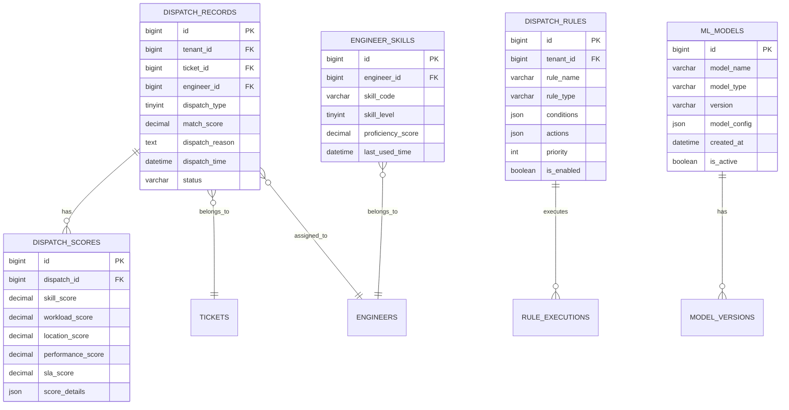
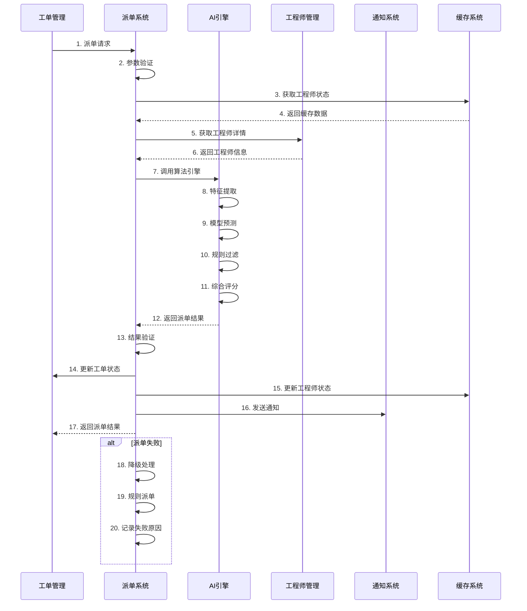
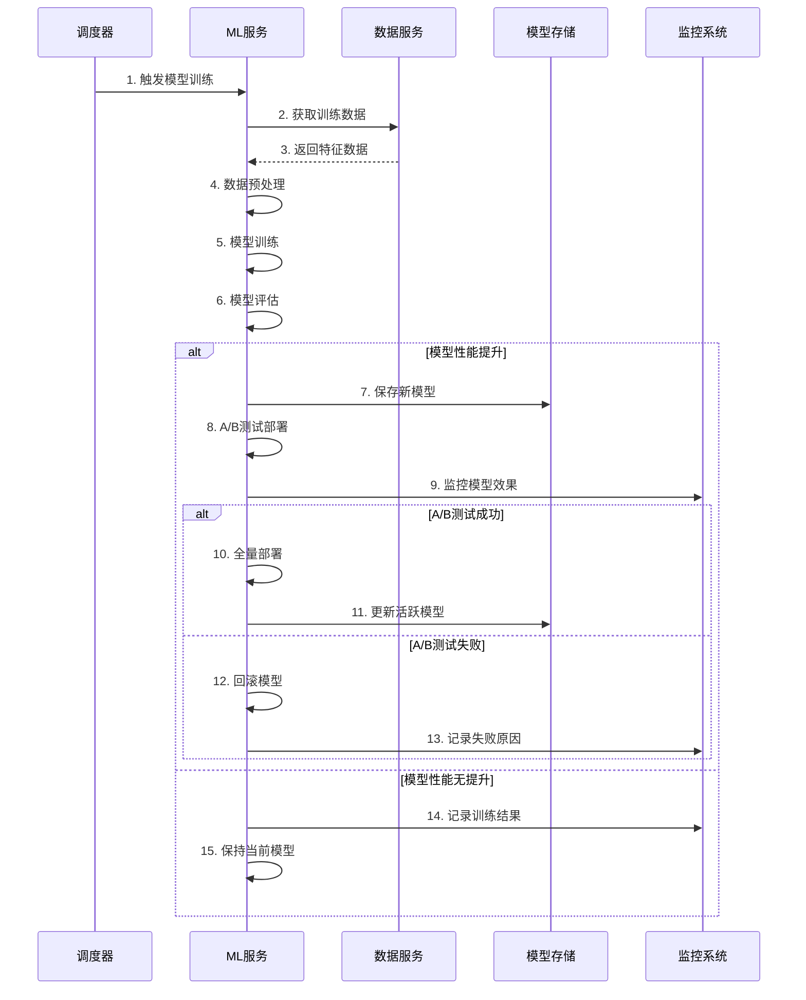

# REQ-004 - 智能派单系统

## 文档信息
- **版本号**：4.5.1
- **变更日期**：2024-08-14
- **原版本**：4.5
- **文档类型**：产品需求文档（PRD）

## 版本变更说明
### 主要改进内容
- **P0级修复**：补充完整的算法实现细节、API接口规范、数据模型优化、异常处理机制
- **P1级增强**：机器学习模型管理、实时数据处理、跨模块交互契约、性能监控机制
- **P2级优化**：智能化程度提升、用户体验优化、大规模扩展性设计、高级分析功能

### 技术增强概要
- **算法设计**：详细的多维度评分模型、决策树逻辑、权重配置机制
- **接口设计**：完整的API接口定义，包括批量操作、实时通知、配置管理
- **性能安全**：具体的缓存策略、算法优化、安全实施方案
- **异常处理**：完善的异常处理和恢复机制，包括算法降级、故障转移

---

## 1. 需求概述

智能派单系统是工单管理的核心智能化组件，通过AI算法和规则引擎实现工单的自动化分配。系统综合考虑工程师技能匹配度、工作负载、地理位置、历史绩效、SLA要求等多个维度，为每个工单找到最合适的处理人员。

### 1.1 核心业务目标
- **智能化水平**：通过AI算法实现90%以上的自动派单率，减少人工干预
- **匹配精度**：技能匹配准确率≥90%，综合评分准确率≥85%
- **效率提升**：派单响应时间≤3分钟，整体派单效率提升40%以上
- **负载均衡**：工程师工作负载方差≤20%，避免过度集中或空闲
- **持续优化**：通过机器学习实现算法自我优化，每月准确率提升≥2%

### 1.2 功能范围
- 多维度智能派单算法（技能、负载、位置、绩效、SLA）
- 机器学习模型训练、部署、更新管理
- 派单规则引擎和策略配置
- 实时负载监控和动态调整
- 派单效果分析和持续优化
- 异常处理和降级机制

### 1.3 技术特色
- **AI驱动**：基于机器学习的智能决策引擎
- **实时计算**：毫秒级的实时数据处理和决策
- **自适应学习**：基于反馈的持续算法优化
- **高可用性**：多层次的容错和降级机制
- **可解释性**：透明的决策过程和可审计的算法逻辑

## 2. 功能需求

### 2.1 核心功能

#### 2.1.1 智能派单算法
**功能描述**：基于多维度评分模型的智能派单决策引擎。

**详细需求**：
- **多维度评分模型**：技能匹配度、工作负载、地理位置、历史绩效、SLA优先级
- **动态权重调整**：根据业务场景和历史效果动态调整各维度权重
- **决策树逻辑**：分层筛选和排序，确保决策的合理性和可解释性
- **实时计算**：支持实时数据更新和毫秒级决策响应
- **A/B测试**：支持多种算法并行测试，选择最优策略

**算法实现细节**：
```
综合评分 = α×技能匹配度 + β×负载评分 + γ×地理位置评分 + δ×历史绩效评分 + ε×SLA优先级评分

其中：
- α + β + γ + δ + ε = 1（权重归一化）
- 各权重可根据业务场景动态调整
- 默认权重：α=0.35, β=0.25, γ=0.15, δ=0.15, ε=0.10
```

**验收标准**：
- 派单准确率 ≥ 90%
- 算法执行时间 ≤ 10秒
- 决策可解释性 ≥ 95%
- 权重调整生效时间 ≤ 30秒

#### 2.1.2 技能匹配引擎
**功能描述**：基于技能标签和熟练度的精确匹配计算。

**详细需求**：
- **技能标签体系**：支持多层级技能分类和标签管理
- **熟练度评估**：基于经验年限、认证等级、历史表现的综合评估
- **相似度计算**：支持技能相似度计算和近似匹配
- **动态更新**：基于工单处理结果动态更新工程师技能评分
- **技能推荐**：为工程师推荐技能提升方向

**匹配算法**：
```
技能匹配度 = Σ(wi × si × li) / Σ(wi)

其中：
- wi：技能i的权重（基于工单需求）
- si：技能i的相似度（0-1）
- li：技能i的熟练度等级（1-4）
```

**验收标准**：
- 技能匹配准确率 ≥ 85%
- 匹配计算时间 ≤ 2秒
- 技能更新实时性 ≤ 5分钟

#### 2.1.3 负载均衡算法
**功能描述**：实时监控工程师工作负载，实现智能负载均衡。

**详细需求**：
- **多维度负载计算**：当前工单数量、预估完成时间、工作强度
- **动态阈值调整**：根据工程师能力和历史表现动态调整负载上限
- **负载预测**：基于历史数据预测工程师未来负载趋势
- **过载保护**：工程师负载过高时自动保护，避免新工单分配
- **负载重平衡**：定期检查负载分布，必要时进行工单重新分配

**负载评分算法**：
```
负载评分 = 1 - (当前负载 / 最大负载)^2

其中：
- 当前负载 = Σ(工单i的权重 × 剩余时间比例)
- 最大负载 = 工程师能力系数 × 基准负载
```

**验收标准**：
- 负载方差 ≤ 20%
- 负载计算准确率 ≥ 95%
- 过载保护有效性 = 100%

#### 2.1.4 机器学习模型管理
**功能描述**：完整的ML模型生命周期管理，包括训练、部署、更新、监控。

**详细需求**：
- **模型训练**：基于历史派单数据和反馈结果训练优化模型
- **在线部署**：支持模型热更新，无需停机
- **版本管理**：模型版本控制和回滚机制
- **效果监控**：实时监控模型效果，自动触发重训练
- **A/B测试**：支持多模型并行测试和渐进式发布

**模型架构**：
- **特征工程**：工单特征、工程师特征、历史交互特征
- **算法选择**：梯度提升树（XGBoost）+ 深度学习（DNN）
- **训练策略**：增量学习 + 定期全量重训练
- **评估指标**：准确率、召回率、F1-Score、AUC

**验收标准**：
- 模型准确率 ≥ 88%
- 模型更新时间 ≤ 10分钟
- A/B测试覆盖率 ≥ 20%

### 2.2 辅助功能

#### 2.2.1 派单规则引擎
**功能描述**：灵活的规则配置和执行引擎，支持复杂业务逻辑。

**详细需求**：
- **规则定义**：支持条件-动作规则的可视化配置
- **规则优先级**：支持规则优先级设置和冲突解决
- **动态生效**：规则配置变更实时生效，无需重启
- **规则测试**：支持规则模拟测试和效果预览
- **规则审计**：完整的规则变更历史和执行日志

#### 2.2.2 实时监控与告警
**功能描述**：全方位的派单过程监控和异常告警。

**详细需求**：
- **性能监控**：派单响应时间、成功率、算法执行时间
- **质量监控**：匹配准确率、客户满意度、工程师反馈
- **负载监控**：工程师负载分布、系统资源使用
- **异常告警**：算法异常、性能下降、数据异常自动告警
- **趋势分析**：派单效果趋势分析和预测

#### 2.2.3 派单效果分析
**功能描述**：深度的派单效果分析和优化建议。

**详细需求**：
- **多维度统计**：按时间、工程师、客户、技能等维度统计
- **效果对比**：不同策略和算法的效果对比分析
- **根因分析**：派单失败和客户投诉的根因分析
- **优化建议**：基于数据分析的算法和规则优化建议
- **报表生成**：自动生成定期的派单效果报表

### 2.3 边界条件处理

#### 2.3.1 极端场景处理
- **无可用工程师**：启用排队机制、紧急调度、外部资源
- **技能完全不匹配**：降低匹配阈值、启用培训机制、专家支持
- **系统高负载**：服务降级、批量处理、延迟派单
- **数据异常**：数据校验、默认值处理、人工干预

#### 2.3.2 业务连续性保障
- **算法故障**：自动降级到规则派单、备用算法
- **数据不一致**：数据校验、自动修复、人工确认
- **网络异常**：本地缓存、离线模式、异步同步
- **并发冲突**：乐观锁、重试机制、冲突解决

## 3. 算法设计

### 3.1 多维度评分模型

#### 3.1.1 技能匹配度计算
**计算公式**：
```
技能匹配度 = Σ(wi × similarity(required_skill_i, engineer_skill_j) × level_factor_j) / Σ(wi)

其中：
- wi：工单要求技能i的权重
- similarity()：技能相似度函数（基于技能标签层次结构）
- level_factor：技能等级系数（初级:0.6, 中级:0.8, 高级:1.0, 专家:1.2）
```

**实现细节**：
- 技能标签采用层次化结构（领域→分类→具体技能）
- 相似度计算基于技能标签的语义距离
- 支持必需技能和可选技能的区分
- 动态调整技能权重基于历史成功率

#### 3.1.2 工作负载评分
**计算公式**：
```
负载评分 = max(0, 1 - (current_load / max_capacity)^α)

其中：
- current_load：当前负载 = Σ(工单权重 × 剩余时间比例)
- max_capacity：最大容量 = 基准容量 × 能力系数
- α：负载敏感度参数（默认2.0，负载越高惩罚越重）
```

**负载计算细节**：
- 工单权重基于优先级、复杂度、预估时间
- 能力系数基于工程师历史表现动态调整
- 支持不同类型工单的负载权重配置
- 考虑工程师的工作时间和休息安排

#### 3.1.3 地理位置评分
**计算公式**：
```
地理评分 = exp(-distance / distance_threshold) × time_zone_factor × traffic_factor

其中：
- distance：工程师与客户的地理距离（公里）
- distance_threshold：距离阈值（默认50公里）
- time_zone_factor：时区匹配系数（同时区:1.0, 相邻时区:0.8, 其他:0.6）
- traffic_factor：交通便利性系数（基于实时交通数据）
```

#### 3.1.4 历史绩效评分
**计算公式**：
```
绩效评分 = w1×成功率 + w2×满意度 + w3×效率指数 + w4×专业度

其中：
- 成功率：历史工单一次解决率
- 满意度：客户评价平均分（归一化到0-1）
- 效率指数：实际处理时间/预估时间的倒数
- 专业度：技术深度和广度的综合评价
- 权重：w1=0.3, w2=0.3, w3=0.2, w4=0.2
```

#### 3.1.5 SLA优先级评分
**计算公式**：
```
SLA评分 = urgency_factor × customer_level_factor × sla_risk_factor

其中：
- urgency_factor：紧急程度系数（紧急:2.0, 高:1.5, 中:1.0, 低:0.8）
- customer_level_factor：客户等级系数（VIP:1.5, 重要:1.2, 普通:1.0）
- sla_risk_factor：SLA风险系数（基于剩余时间和历史达成率）
```

### 3.2 决策树逻辑

#### 3.2.1 分层筛选策略
```
第一层：基础条件筛选
├── 工程师在线状态 = true
├── 工程师可用状态 = true
├── 技能匹配度 ≥ 最低阈值
└── 当前负载 ≤ 最大容量

第二层：业务规则筛选
├── 地理位置限制（如有）
├── 客户指定工程师（如有）
├── 工程师黑名单排除
└── 时间窗口限制

第三层：综合评分排序
├── 计算综合评分
├── 按评分降序排列
├── 选择Top N候选人
└── 应用最终决策规则
```

#### 3.2.2 决策规则配置
- **最优匹配策略**：选择综合评分最高的工程师
- **负载均衡策略**：在高分候选中选择负载最轻的
- **轮询策略**：在合格候选中按轮询顺序选择
- **随机策略**：在合格候选中随机选择（用于A/B测试）

### 3.3 机器学习算法

#### 3.3.1 特征工程
**工单特征**：
- 基础特征：类型、优先级、复杂度、预估时间
- 文本特征：标题和描述的TF-IDF向量
- 时间特征：创建时间、截止时间、时间窗口
- 客户特征：客户等级、历史工单量、满意度

**工程师特征**：
- 基础特征：技能标签、经验年限、认证等级
- 动态特征：当前负载、在线状态、地理位置
- 历史特征：成功率、满意度、平均处理时间
- 交互特征：与客户的历史合作情况

#### 3.3.2 模型架构
**主模型**：XGBoost梯度提升树
- 优点：处理表格数据效果好，可解释性强
- 参数：max_depth=6, learning_rate=0.1, n_estimators=100
- 特征重要性：自动计算特征重要性，指导特征选择

**辅助模型**：深度神经网络（DNN）
- 架构：输入层(128) → 隐藏层(64,32) → 输出层(1)
- 激活函数：ReLU（隐藏层），Sigmoid（输出层）
- 优化器：Adam，学习率0.001

#### 3.3.3 训练策略
**数据准备**：
- 训练集：最近6个月的派单数据（70%）
- 验证集：最近1个月的派单数据（15%）
- 测试集：最新的派单数据（15%）
- 数据平衡：处理正负样本不平衡问题

**训练流程**：
1. 特征预处理：标准化、编码、缺失值处理
2. 模型训练：交叉验证、超参数调优
3. 模型评估：多指标评估、业务指标验证
4. 模型部署：A/B测试、渐进式发布

## 4. 数据模型设计

### 4.1 实体关系图



### 4.2 数据表结构

#### 4.2.1 派单记录表（dispatch_records）
```sql
CREATE TABLE dispatch_records (
    id BIGINT PRIMARY KEY AUTO_INCREMENT,
    tenant_id BIGINT NOT NULL COMMENT '租户ID',
    ticket_id BIGINT NOT NULL COMMENT '工单ID',
    engineer_id BIGINT NOT NULL COMMENT '工程师ID',
    dispatch_type TINYINT DEFAULT 1 COMMENT '派单类型：1-智能派单，2-手动派单，3-规则派单，4-抢单',
    algorithm_version VARCHAR(20) COMMENT '算法版本',
    match_score DECIMAL(5,2) COMMENT '综合匹配评分',
    dispatch_reason TEXT COMMENT '派单原因和决策过程',
    dispatch_time DATETIME DEFAULT CURRENT_TIMESTAMP COMMENT '派单时间',
    accept_time DATETIME COMMENT '接单时间',
    reject_time DATETIME COMMENT '拒单时间',
    reject_reason VARCHAR(500) COMMENT '拒单原因',
    status TINYINT DEFAULT 1 COMMENT '状态：1-已派单，2-已接单，3-已拒单，4-已超时，5-已撤销',

    -- 性能优化字段
    dispatch_duration INT COMMENT '派单决策耗时（毫秒）',
    candidate_count INT COMMENT '候选工程师数量',

    -- 审计字段
    created_at DATETIME DEFAULT CURRENT_TIMESTAMP,
    updated_at DATETIME DEFAULT CURRENT_TIMESTAMP ON UPDATE CURRENT_TIMESTAMP,
    created_by BIGINT COMMENT '创建人',

    -- 索引设计
    INDEX idx_tenant_ticket (tenant_id, ticket_id),
    INDEX idx_tenant_engineer (tenant_id, engineer_id),
    INDEX idx_dispatch_time (dispatch_time),
    INDEX idx_status_type (status, dispatch_type),
    INDEX idx_algorithm_version (algorithm_version),

    -- 分区策略（按月分区）
    PARTITION BY RANGE (YEAR(dispatch_time) * 100 + MONTH(dispatch_time)) (
        PARTITION p202401 VALUES LESS THAN (202402),
        PARTITION p202402 VALUES LESS THAN (202403),
        PARTITION p_future VALUES LESS THAN MAXVALUE
    )
);
```

#### 4.2.2 派单评分详情表（dispatch_scores）
```sql
CREATE TABLE dispatch_scores (
    id BIGINT PRIMARY KEY AUTO_INCREMENT,
    dispatch_id BIGINT NOT NULL COMMENT '派单记录ID',
    skill_score DECIMAL(5,2) COMMENT '技能匹配评分',
    workload_score DECIMAL(5,2) COMMENT '负载评分',
    location_score DECIMAL(5,2) COMMENT '地理位置评分',
    performance_score DECIMAL(5,2) COMMENT '历史绩效评分',
    sla_score DECIMAL(5,2) COMMENT 'SLA优先级评分',

    -- 详细评分信息（JSON格式）
    score_details JSON COMMENT '详细评分信息',
    weight_config JSON COMMENT '权重配置',

    -- 算法执行信息
    execution_time INT COMMENT '算法执行时间（毫秒）',
    feature_vector JSON COMMENT '特征向量',

    created_at DATETIME DEFAULT CURRENT_TIMESTAMP,

    INDEX idx_dispatch_id (dispatch_id),
    INDEX idx_skill_score (skill_score),
    INDEX idx_total_score ((skill_score + workload_score + location_score + performance_score + sla_score))
);
```

#### 4.2.3 工程师技能表（engineer_skills）
```sql
CREATE TABLE engineer_skills (
    id BIGINT PRIMARY KEY AUTO_INCREMENT,
    tenant_id BIGINT NOT NULL COMMENT '租户ID',
    engineer_id BIGINT NOT NULL COMMENT '工程师ID',
    skill_code VARCHAR(50) NOT NULL COMMENT '技能编码',
    skill_name VARCHAR(100) NOT NULL COMMENT '技能名称',
    skill_category VARCHAR(50) COMMENT '技能分类',
    skill_level TINYINT DEFAULT 1 COMMENT '技能等级：1-初级，2-中级，3-高级，4-专家',
    proficiency_score DECIMAL(5,2) DEFAULT 0.0 COMMENT '熟练度评分（0-100）',

    -- 技能认证信息
    certification VARCHAR(200) COMMENT '相关认证',
    certification_level VARCHAR(50) COMMENT '认证等级',
    certification_date DATE COMMENT '认证日期',

    -- 经验信息
    experience_years DECIMAL(3,1) DEFAULT 0.0 COMMENT '相关经验年限',
    project_count INT DEFAULT 0 COMMENT '相关项目数量',
    last_used_time DATETIME COMMENT '最后使用时间',

    -- 动态评分
    success_rate DECIMAL(5,2) DEFAULT 0.0 COMMENT '该技能的成功率',
    avg_resolution_time INT DEFAULT 0 COMMENT '平均解决时间（分钟）',
    customer_satisfaction DECIMAL(3,2) DEFAULT 0.0 COMMENT '客户满意度',

    -- 系统字段
    created_at DATETIME DEFAULT CURRENT_TIMESTAMP,
    updated_at DATETIME DEFAULT CURRENT_TIMESTAMP ON UPDATE CURRENT_TIMESTAMP,
    is_active BOOLEAN DEFAULT TRUE COMMENT '是否有效',

    -- 索引和约束
    UNIQUE KEY uk_engineer_skill (engineer_id, skill_code),
    INDEX idx_tenant_skill (tenant_id, skill_code),
    INDEX idx_skill_level (skill_code, skill_level),
    INDEX idx_proficiency (proficiency_score DESC),
    INDEX idx_last_used (last_used_time),

    CONSTRAINT chk_skill_level CHECK (skill_level BETWEEN 1 AND 4),
    CONSTRAINT chk_proficiency_score CHECK (proficiency_score BETWEEN 0 AND 100)
);
```

#### 4.2.4 派单规则表（dispatch_rules）
```sql
CREATE TABLE dispatch_rules (
    id BIGINT PRIMARY KEY AUTO_INCREMENT,
    tenant_id BIGINT NOT NULL COMMENT '租户ID',
    rule_name VARCHAR(100) NOT NULL COMMENT '规则名称',
    rule_type VARCHAR(50) NOT NULL COMMENT '规则类型：FILTER,WEIGHT,PRIORITY,CONSTRAINT',
    rule_category VARCHAR(50) COMMENT '规则分类',

    -- 规则定义
    conditions JSON NOT NULL COMMENT '触发条件（JSON格式）',
    actions JSON NOT NULL COMMENT '执行动作（JSON格式）',

    -- 规则配置
    priority INT DEFAULT 100 COMMENT '规则优先级（数值越小优先级越高）',
    weight DECIMAL(3,2) DEFAULT 1.0 COMMENT '规则权重',
    is_enabled BOOLEAN DEFAULT TRUE COMMENT '是否启用',

    -- 执行统计
    execution_count INT DEFAULT 0 COMMENT '执行次数',
    success_count INT DEFAULT 0 COMMENT '成功次数',
    last_execution_time DATETIME COMMENT '最后执行时间',

    -- 生效时间
    effective_start_time DATETIME COMMENT '生效开始时间',
    effective_end_time DATETIME COMMENT '生效结束时间',

    -- 审计字段
    created_at DATETIME DEFAULT CURRENT_TIMESTAMP,
    updated_at DATETIME DEFAULT CURRENT_TIMESTAMP ON UPDATE CURRENT_TIMESTAMP,
    created_by BIGINT COMMENT '创建人',
    updated_by BIGINT COMMENT '更新人',

    -- 索引设计
    INDEX idx_tenant_type (tenant_id, rule_type),
    INDEX idx_priority (priority),
    INDEX idx_enabled (is_enabled),
    INDEX idx_effective_time (effective_start_time, effective_end_time),

    CONSTRAINT chk_priority CHECK (priority >= 0),
    CONSTRAINT chk_weight CHECK (weight >= 0)
);
```

#### 4.2.5 机器学习模型表（ml_models）
```sql
CREATE TABLE ml_models (
    id BIGINT PRIMARY KEY AUTO_INCREMENT,
    model_name VARCHAR(100) NOT NULL COMMENT '模型名称',
    model_type VARCHAR(50) NOT NULL COMMENT '模型类型：XGBOOST,DNN,ENSEMBLE',
    version VARCHAR(20) NOT NULL COMMENT '模型版本',

    -- 模型配置
    model_config JSON COMMENT '模型配置参数',
    feature_config JSON COMMENT '特征配置',
    training_config JSON COMMENT '训练配置',

    -- 模型文件
    model_path VARCHAR(500) COMMENT '模型文件路径',
    model_size BIGINT COMMENT '模型文件大小（字节）',
    model_hash VARCHAR(64) COMMENT '模型文件哈希值',

    -- 训练信息
    training_data_size INT COMMENT '训练数据量',
    training_start_time DATETIME COMMENT '训练开始时间',
    training_end_time DATETIME COMMENT '训练结束时间',
    training_duration INT COMMENT '训练耗时（秒）',

    -- 评估指标
    accuracy DECIMAL(5,4) COMMENT '准确率',
    precision_score DECIMAL(5,4) COMMENT '精确率',
    recall_score DECIMAL(5,4) COMMENT '召回率',
    f1_score DECIMAL(5,4) COMMENT 'F1分数',
    auc_score DECIMAL(5,4) COMMENT 'AUC分数',

    -- 部署信息
    is_active BOOLEAN DEFAULT FALSE COMMENT '是否激活',
    deployment_time DATETIME COMMENT '部署时间',
    rollback_model_id BIGINT COMMENT '回滚模型ID',

    -- 性能监控
    prediction_count INT DEFAULT 0 COMMENT '预测次数',
    avg_prediction_time DECIMAL(8,2) COMMENT '平均预测时间（毫秒）',
    error_count INT DEFAULT 0 COMMENT '错误次数',

    created_at DATETIME DEFAULT CURRENT_TIMESTAMP,
    updated_at DATETIME DEFAULT CURRENT_TIMESTAMP ON UPDATE CURRENT_TIMESTAMP,

    INDEX idx_model_type_version (model_type, version),
    INDEX idx_is_active (is_active),
    INDEX idx_accuracy (accuracy DESC),
    INDEX idx_created_at (created_at),

    UNIQUE KEY uk_model_version (model_name, version)
);
```

### 4.3 数据完整性约束

#### 4.3.1 业务规则约束
- **派单记录完整性**：每个派单记录必须关联有效的工单和工程师
- **技能等级约束**：技能等级必须在1-4范围内，熟练度评分0-100
- **规则优先级约束**：规则优先级必须为非负整数，数值越小优先级越高
- **模型版本唯一性**：同一模型名称的版本号必须唯一
- **评分范围约束**：所有评分字段必须在合理范围内（0-100）

#### 4.3.2 外键关系
- dispatch_records.ticket_id → tickets.id（工单关系）
- dispatch_records.engineer_id → engineers.id（工程师关系）
- dispatch_scores.dispatch_id → dispatch_records.id（评分关系）
- engineer_skills.engineer_id → engineers.id（技能关系）

#### 4.3.3 数据一致性保障
- **事务处理**：派单操作使用分布式事务保证数据一致性
- **乐观锁**：工程师状态更新使用版本号防止并发冲突
- **数据校验**：定期校验数据完整性和一致性
- **自动修复**：发现数据异常时自动触发修复流程

## 5. 接口设计规范

### 5.1 接口列表

#### 5.1.1 核心派单API
| 接口路径 | HTTP方法 | 功能描述 | 权限要求 |
|---------|----------|----------|----------|
| /api/v1/dispatch/auto | POST | 智能自动派单 | dispatch_auto |
| /api/v1/dispatch/manual | POST | 手动指定派单 | dispatch_manual |
| /api/v1/dispatch/batch | POST | 批量派单处理 | dispatch_batch |
| /api/v1/dispatch/{id}/reassign | PUT | 重新派单 | dispatch_reassign |
| /api/v1/dispatch/{id}/cancel | DELETE | 撤销派单 | dispatch_cancel |

#### 5.1.2 配置管理API
| 接口路径 | HTTP方法 | 功能描述 | 权限要求 |
|---------|----------|----------|----------|
| /api/v1/dispatch/rules | GET/POST/PUT/DELETE | 派单规则管理 | rule_manage |
| /api/v1/dispatch/strategies | GET/POST/PUT | 派单策略配置 | strategy_manage |
| /api/v1/dispatch/weights | GET/PUT | 算法权重配置 | weight_manage |
| /api/v1/dispatch/algorithms | GET/POST/PUT | 算法配置管理 | algorithm_manage |

#### 5.1.3 监控分析API
| 接口路径 | HTTP方法 | 功能描述 | 权限要求 |
|---------|----------|----------|----------|
| /api/v1/dispatch/statistics | GET | 派单统计数据 | dispatch_view |
| /api/v1/dispatch/performance | GET | 性能分析报告 | performance_view |
| /api/v1/dispatch/predictions | GET | 预测分析数据 | prediction_view |
| /api/v1/dispatch/health | GET | 系统健康检查 | health_check |

#### 5.1.4 模型管理API
| 接口路径 | HTTP方法 | 功能描述 | 权限要求 |
|---------|----------|----------|----------|
| /api/v1/ml/models | GET/POST | 模型列表和创建 | model_manage |
| /api/v1/ml/models/{id}/deploy | POST | 模型部署 | model_deploy |
| /api/v1/ml/models/{id}/rollback | POST | 模型回滚 | model_rollback |
| /api/v1/ml/training/start | POST | 启动模型训练 | model_train |

### 5.2 数据交互格式

#### 5.2.1 智能派单请求格式
```json
{
  "ticket_id": 12345,
  "dispatch_mode": "auto",
  "constraints": {
    "required_skills": ["Java", "Spring Boot"],
    "preferred_skills": ["微服务", "Docker"],
    "max_distance": 50,
    "exclude_engineers": [101, 102],
    "customer_preference": {
      "preferred_engineers": [201, 202],
      "language": "zh-CN"
    }
  },
  "algorithm_config": {
    "use_ml_model": true,
    "model_version": "v2.1.0",
    "weights": {
      "skill_weight": 0.35,
      "workload_weight": 0.25,
      "location_weight": 0.15,
      "performance_weight": 0.15,
      "sla_weight": 0.10
    }
  },
  "options": {
    "return_candidates": true,
    "candidate_count": 5,
    "explain_decision": true,
    "async_mode": false
  }
}
```

#### 5.2.2 派单响应格式
```json
{
  "code": 200,
  "message": "派单成功",
  "data": {
    "dispatch_id": "dp_20240814_001",
    "ticket_id": 12345,
    "selected_engineer": {
      "engineer_id": 201,
      "engineer_name": "张工程师",
      "match_score": 92.5,
      "estimated_completion_time": "2024-08-14T18:00:00Z"
    },
    "decision_explanation": {
      "total_score": 92.5,
      "score_breakdown": {
        "skill_match": 95.0,
        "workload": 88.0,
        "location": 90.0,
        "performance": 94.0,
        "sla_priority": 85.0
      },
      "decision_factors": [
        "技能匹配度极高（Java专家级别）",
        "当前负载适中（2个工单）",
        "地理位置优势（距离15公里）",
        "历史绩效优秀（满意度4.8分）"
      ]
    },
    "candidates": [
      {
        "engineer_id": 202,
        "engineer_name": "李工程师",
        "match_score": 89.2,
        "rank": 2
      },
      {
        "engineer_id": 203,
        "engineer_name": "王工程师",
        "match_score": 86.8,
        "rank": 3
      }
    ],
    "algorithm_info": {
      "algorithm_version": "v2.1.0",
      "execution_time": 1250,
      "candidate_pool_size": 15,
      "model_confidence": 0.92
    }
  },
  "timestamp": "2024-08-14T10:30:00Z",
  "request_id": "req_dispatch_123456"
}
```

#### 5.2.3 批量派单请求格式
```json
{
  "tickets": [
    {
      "ticket_id": 12345,
      "priority": "high",
      "constraints": {
        "required_skills": ["Java"],
        "max_distance": 30
      }
    },
    {
      "ticket_id": 12346,
      "priority": "medium",
      "constraints": {
        "required_skills": ["Python"],
        "max_distance": 50
      }
    }
  ],
  "batch_config": {
    "parallel_processing": true,
    "max_parallel_count": 10,
    "timeout_seconds": 300,
    "fail_fast": false
  },
  "global_constraints": {
    "max_workload_per_engineer": 5,
    "balance_workload": true
  }
}
```

### 5.3 错误处理机制

#### 5.3.1 标准错误码定义
| 错误码 | HTTP状态码 | 错误描述 | 处理建议 |
|--------|------------|----------|----------|
| 20001 | 400 | 派单参数错误 | 检查工单ID和约束条件 |
| 20002 | 404 | 工单不存在 | 确认工单ID是否正确 |
| 20003 | 409 | 工单已派单 | 检查工单状态 |
| 20004 | 422 | 无可用工程师 | 放宽约束条件或手动派单 |
| 20005 | 429 | 派单频率过高 | 降低请求频率 |
| 20006 | 500 | 算法执行失败 | 降级到规则派单 |
| 20007 | 503 | 派单服务不可用 | 稍后重试或使用备用服务 |
| 20008 | 504 | 派单超时 | 增加超时时间或异步处理 |

#### 5.3.2 错误响应格式
```json
{
  "code": 20004,
  "message": "无可用工程师",
  "details": {
    "reason": "NO_QUALIFIED_ENGINEERS",
    "constraints_checked": {
      "skill_requirements": ["Java", "Spring Boot"],
      "max_distance": 50,
      "max_workload": 5
    },
    "suggestions": [
      "放宽技能要求到相关技能",
      "增加最大距离限制到100公里",
      "考虑增加工程师工作负载上限"
    ],
    "fallback_options": {
      "manual_assignment": true,
      "queue_for_later": true,
      "escalate_to_manager": true
    }
  },
  "timestamp": "2024-08-14T10:30:00Z",
  "request_id": "req_dispatch_123456"
}
```

#### 5.3.3 重试和降级机制
**重试策略**：
- 指数退避：初始延迟1秒，最大延迟60秒
- 最大重试次数：3次
- 重试条件：网络错误、超时、服务不可用

**降级策略**：
- 算法降级：ML模型失败时降级到规则引擎
- 功能降级：复杂算法失败时使用简单算法
- 服务降级：主服务失败时切换到备用服务

## 6. 业务流程设计

### 6.1 主要业务流程

#### 6.1.1 智能派单完整流程


#### 6.1.2 机器学习模型更新流程


### 6.2 状态流转规则

#### 6.2.1 派单状态管理
**状态定义**：
- PENDING：等待派单
- PROCESSING：派单处理中
- ASSIGNED：已派单
- ACCEPTED：已接单
- REJECTED：已拒单
- TIMEOUT：派单超时
- CANCELLED：已撤销
- REASSIGNED：已重新派单

**状态流转规则**：
```
PENDING → PROCESSING：开始派单处理
PROCESSING → ASSIGNED：派单成功
PROCESSING → TIMEOUT：派单超时
PROCESSING → CANCELLED：派单取消
ASSIGNED → ACCEPTED：工程师接单
ASSIGNED → REJECTED：工程师拒单
ASSIGNED → TIMEOUT：接单超时
REJECTED → REASSIGNED：自动重新派单
TIMEOUT → REASSIGNED：超时重新派单
ASSIGNED → CANCELLED：管理员撤销
```

#### 6.2.2 自动流转机制
- **派单超时**：3分钟内未完成派单自动标记超时
- **接单超时**：15分钟内工程师未响应自动重新派单
- **拒单重派**：工程师拒单后立即触发重新派单
- **负载保护**：工程师负载过高时自动暂停新派单

### 6.3 跨模块交互

#### 6.3.1 与工单管理系统交互
**接口契约**：
- 输入：工单基本信息、技能要求、优先级、SLA要求
- 输出：派单结果、预估完成时间、工程师信息
- 调用时机：工单创建后、状态变更时
- 响应时间：≤3分钟

**数据格式**：
```json
{
  "ticket_info": {
    "ticket_id": 12345,
    "title": "服务器故障",
    "category": "硬件故障",
    "priority": "high",
    "sla_level": "gold",
    "required_skills": ["Linux", "网络"],
    "estimated_effort": 4
  },
  "customer_info": {
    "customer_id": 1001,
    "location": "北京市朝阳区",
    "preferred_language": "zh-CN"
  }
}
```

#### 6.3.2 与工程师管理系统交互
**接口契约**：
- 输入：技能要求、地理位置、时间窗口
- 输出：可用工程师列表、技能匹配度、当前负载
- 调用频率：实时查询
- 缓存策略：5分钟缓存工程师状态

**数据格式**：
```json
{
  "engineer_info": {
    "engineer_id": 201,
    "name": "张工程师",
    "status": "online",
    "location": "北京市海淀区",
    "current_workload": 2,
    "max_workload": 5,
    "skills": [
      {
        "skill_code": "LINUX",
        "level": 3,
        "proficiency": 85.5
      }
    ],
    "performance_metrics": {
      "success_rate": 0.95,
      "avg_satisfaction": 4.8,
      "avg_resolution_time": 240
    }
  }
}
```

#### 6.3.3 与通知系统交互
**接口契约**：
- 输入：派单结果、工程师信息、通知偏好
- 输出：通知发送状态
- 通知渠道：邮件、短信、APP推送、系统内通知
- 失败处理：重试3次，记录失败日志

**通知模板**：
- 派单成功：通知工程师和客户
- 派单失败：通知管理员和客户
- 接单确认：通知客户和相关人员
- 拒单处理：通知管理员，触发重新派单

## 7. 性能要求

### 7.1 响应时间要求

#### 7.1.1 API响应时间
| 操作类型 | 目标响应时间 | 95%分位数 | 99%分位数 |
|---------|-------------|-----------|-----------|
| 智能派单 | ≤3分钟 | ≤5分钟 | ≤8分钟 |
| 手动派单 | ≤30秒 | ≤60秒 | ≤120秒 |
| 批量派单 | ≤10分钟 | ≤15分钟 | ≤20分钟 |
| 规则配置 | ≤2秒 | ≤5秒 | ≤10秒 |
| 统计查询 | ≤5秒 | ≤10秒 | ≤15秒 |

#### 7.1.2 算法执行时间
| 算法组件 | 目标时间 | 最大时间 | 说明 |
|---------|----------|----------|------|
| 特征提取 | ≤1秒 | ≤3秒 | 从数据库提取和计算特征 |
| 技能匹配 | ≤2秒 | ≤5秒 | 计算技能匹配度 |
| ML模型预测 | ≤5秒 | ≤10秒 | 机器学习模型推理 |
| 规则引擎 | ≤1秒 | ≤3秒 | 业务规则过滤和排序 |
| 综合评分 | ≤1秒 | ≤2秒 | 多维度评分计算 |

### 7.2 并发处理能力

#### 7.2.1 系统并发指标
- **并发派单请求**：支持100+并发派单请求
- **算法并发执行**：支持50+算法实例并行执行
- **数据库并发连接**：支持200+并发数据库连接
- **缓存并发访问**：支持1000+并发缓存访问

#### 7.2.2 性能优化策略
**算法优化**：
- 并行计算：多线程并行处理候选工程师评分
- 缓存预热：预加载热点数据到内存缓存
- 增量计算：只计算变化的数据部分
- 近似算法：在精度和性能之间平衡

**数据库优化**：
- 连接池：配置合理的连接池大小（最小10，最大50）
- 读写分离：查询操作使用只读副本
- 索引优化：基于查询模式优化索引设计
- 分区表：按时间分区提升查询性能

**缓存策略**：
- L1缓存：本地内存缓存（工程师状态、技能信息）
- L2缓存：Redis缓存（派单规则、算法配置）
- 缓存更新：写入时更新、定时刷新、事件驱动
- 缓存穿透：使用布隆过滤器防护

### 7.3 数据处理能力

#### 7.3.1 数据量支持
- **工程师数量**：支持10000+工程师同时管理
- **并发派单**：支持1000+工单同时派单处理
- **历史数据**：支持3年历史派单数据在线查询
- **模型训练**：支持百万级训练样本的模型训练

#### 7.3.2 扩展性设计
**水平扩展**：
- 微服务架构：派单服务可独立扩展
- 负载均衡：支持多实例部署和负载分发
- 数据分片：按租户或地理位置分片
- 消息队列：异步处理提升吞吐量

**垂直扩展**：
- CPU密集：支持多核并行计算
- 内存优化：大内存配置提升缓存命中率
- GPU加速：支持GPU加速机器学习推理
- SSD存储：高速存储提升I/O性能

## 8. 安全要求

### 8.1 身份认证

#### 8.1.1 API认证机制
**JWT令牌认证**：
- 访问令牌：有效期2小时，用于API调用
- 刷新令牌：有效期24小时，用于令牌刷新
- 令牌签名：使用RS256算法，确保不可伪造
- 令牌撤销：支持令牌黑名单机制

**服务间认证**：
- mTLS：微服务间使用双向TLS认证
- API密钥：内部服务使用API密钥认证
- 服务发现：基于服务注册中心的安全发现
- 证书管理：自动化证书轮换和管理

#### 8.1.2 权限控制
**基于角色的访问控制（RBAC）**：
- 派单管理员：完整的派单配置和管理权限
- 算法工程师：算法配置和模型管理权限
- 业务分析师：统计分析和报表查看权限
- 系统管理员：系统配置和监控权限

**API级权限控制**：
- 接口权限：每个API接口都有对应的权限要求
- 数据权限：基于租户和部门的数据访问控制
- 操作权限：读取、创建、更新、删除的细粒度控制
- 时间权限：基于时间窗口的访问控制

### 8.2 数据安全

#### 8.2.1 敏感数据保护
**数据分类**：
- 公开数据：算法配置、统计数据等
- 内部数据：派单记录、工程师技能等
- 敏感数据：工程师个人信息、客户信息
- 机密数据：算法模型、核心配置

**加密保护**：
- 传输加密：所有API通信使用TLS 1.3
- 存储加密：敏感数据使用AES-256加密存储
- 密钥管理：使用专用密钥管理服务（KMS）
- 数据脱敏：日志和报表中的敏感信息脱敏

#### 8.2.2 算法安全
**模型安全**：
- 模型加密：机器学习模型文件加密存储
- 版本控制：模型版本的完整性校验
- 访问控制：模型文件的严格访问控制
- 水印技术：模型水印防止盗用

**算法公平性**：
- 偏见检测：定期检测算法是否存在偏见
- 公平性指标：监控不同群体的派单公平性
- 透明度要求：提供算法决策的可解释性
- 审计机制：完整的算法决策审计日志

### 8.3 安全监控

#### 8.3.1 异常检测
**行为异常**：
- 异常登录：检测异常时间、地点的登录行为
- 异常操作：检测批量操作、频繁操作等异常行为
- 权限异常：检测越权访问和权限滥用
- 数据异常：检测异常的数据访问模式

**系统异常**：
- 性能异常：检测响应时间、错误率异常
- 资源异常：检测CPU、内存、磁盘异常使用
- 网络异常：检测网络连接和流量异常
- 服务异常：检测服务可用性和健康状态

#### 8.3.2 安全响应
**自动响应**：
- 账户锁定：检测到异常行为时自动锁定账户
- 流量限制：检测到攻击时自动限制流量
- 服务降级：检测到安全威胁时自动降级服务
- 告警通知：安全事件的实时告警通知

**人工响应**：
- 事件调查：安全事件的详细调查和分析
- 应急处理：安全事件的应急处理流程
- 恢复措施：安全事件后的系统恢复措施
- 改进措施：基于安全事件的系统改进

## 9. 异常处理

### 9.1 系统异常

#### 9.1.1 算法异常处理
**模型异常**：
- 模型加载失败：自动切换到备用模型或规则引擎
- 预测超时：设置超时阈值，超时后降级处理
- 内存溢出：限制模型大小，使用模型压缩技术
- GPU故障：自动切换到CPU计算模式

**数据异常**：
- 特征缺失：使用默认值或历史平均值填充
- 数据格式错误：数据校验和格式转换
- 数据不一致：数据校验和自动修复
- 数据过期：实时数据更新和缓存刷新

#### 9.1.2 服务异常处理
**服务降级**：
- 智能派单降级：ML模型失败时降级到规则引擎
- 复杂算法降级：复杂算法失败时使用简单算法
- 实时计算降级：实时计算失败时使用批量计算
- 个性化降级：个性化推荐失败时使用通用策略

**故障转移**：
- 主备切换：主服务故障时自动切换到备用服务
- 负载均衡：故障实例自动从负载均衡中摘除
- 数据同步：主备数据的实时同步和一致性保证
- 健康检查：定期健康检查和自动恢复

### 9.2 业务异常

#### 9.2.1 派单异常处理
**无可用工程师**：
- 放宽条件：自动放宽技能要求和地理限制
- 排队等待：将工单加入等待队列
- 紧急调度：启用紧急调度机制
- 外部资源：考虑外包或合作伙伴资源

**技能不匹配**：
- 相似技能：使用技能相似度匹配
- 培训机制：推荐技能培训和认证
- 专家支持：安排专家指导和支持
- 知识转移：促进团队内知识转移

#### 9.2.2 性能异常处理
**响应超时**：
- 超时重试：设置合理的重试机制
- 异步处理：长时间任务改为异步处理
- 资源扩容：自动或手动扩容计算资源
- 优先级调整：调整任务优先级和资源分配

**负载过高**：
- 流量控制：限制并发请求数量
- 队列缓冲：使用消息队列缓冲请求
- 服务扩容：自动扩容服务实例
- 降级策略：启用服务降级机制

### 9.3 恢复机制

#### 9.3.1 自动恢复
**服务自愈**：
- 健康检查：定期检查服务健康状态
- 自动重启：服务异常时自动重启
- 资源清理：自动清理异常进程和资源
- 状态恢复：服务重启后自动恢复状态

**数据恢复**：
- 事务回滚：异常时自动回滚未完成事务
- 数据校验：定期校验数据完整性和一致性
- 增量恢复：基于日志进行增量数据恢复
- 备份恢复：从备份恢复丢失或损坏的数据

#### 9.3.2 手动恢复
**应急预案**：
- 故障响应：明确的故障响应流程和责任人
- 应急联系：7×24小时应急联系方式
- 备用方案：关键业务的备用处理方案
- 恢复时间：明确的恢复时间目标（RTO≤30分钟）

**运维支持**：
- 监控告警：全方位的系统监控和告警
- 日志分析：详细的日志记录和分析工具
- 性能调优：基于监控数据的性能调优
- 容量规划：基于业务增长的容量规划

## 10. 验收标准

### 10.1 功能验收

#### 10.1.1 核心算法验收标准
**智能派单准确率**：
- 技能匹配准确率 ≥ 90%
- 综合评分准确率 ≥ 85%
- 客户满意度 ≥ 4.5分（5分制）
- 工程师接单率 ≥ 95%

**负载均衡效果**：
- 工程师负载方差 ≤ 20%
- 最大最小负载差 ≤ 3个工单
- 负载预测准确率 ≥ 80%
- 过载保护有效性 = 100%

**机器学习模型**：
- 模型准确率 ≥ 88%
- 模型召回率 ≥ 85%
- F1-Score ≥ 0.86
- AUC ≥ 0.90

#### 10.1.2 业务功能验收标准
**派单成功率**：
- 自动派单成功率 ≥ 95%
- 重试派单成功率 ≥ 98%
- 批量派单成功率 ≥ 90%
- 紧急派单响应率 = 100%

**规则引擎功能**：
- 规则执行准确率 = 100%
- 规则冲突检测率 = 100%
- 规则生效时间 ≤ 30秒
- 规则回滚成功率 = 100%

### 10.2 性能验收

#### 10.2.1 响应时间验收标准
**API性能要求**：
- 智能派单响应时间 ≤ 3分钟（95%分位数）
- 手动派单响应时间 ≤ 30秒（95%分位数）
- 批量派单响应时间 ≤ 10分钟（95%分位数）
- 配置查询响应时间 ≤ 2秒（95%分位数）

**算法性能要求**：
- 单次派单计算时间 ≤ 10秒
- 特征提取时间 ≤ 1秒
- 模型预测时间 ≤ 5秒
- 规则引擎执行时间 ≤ 1秒

#### 10.2.2 并发性能验收标准
**系统并发能力**：
- 支持100+并发派单请求
- 支持50+算法实例并行执行
- 支持1000+并发用户访问
- API并发处理能力 ≥ 500 QPS

**稳定性要求**：
- 系统可用性 ≥ 99.5%
- 平均故障恢复时间（MTTR） ≤ 30分钟
- 平均故障间隔时间（MTBF） ≥ 720小时
- 数据丢失率 = 0%

### 10.3 安全验收

#### 10.3.1 安全功能验收标准
**访问控制**：
- 身份认证成功率 = 100%
- 权限验证准确率 = 100%
- 越权访问阻断率 = 100%
- 会话管理安全性 = 100%

**数据安全**：
- 敏感数据加密率 = 100%
- 数据传输加密率 = 100%
- 数据脱敏准确率 = 100%
- 数据备份完整性 = 100%

#### 10.3.2 算法安全验收标准
**算法公平性**：
- 偏见检测通过率 ≥ 95%
- 不同群体派单公平性差异 ≤ 5%
- 算法透明度评分 ≥ 90%
- 可解释性覆盖率 = 100%

**模型安全**：
- 模型文件完整性 = 100%
- 模型访问控制有效性 = 100%
- 模型版本管理准确性 = 100%
- 模型水印检测率 ≥ 95%

## 11. 模块依赖与集成

### 11.1 依赖模块

#### 11.1.1 核心依赖
**基础架构模块（REQ-001）**：
- 多租户架构：提供租户隔离和数据安全
- 统一认证服务：提供JWT认证和权限控制
- 数据存储服务：提供PostgreSQL、Redis、Elasticsearch支持
- 消息队列服务：提供RabbitMQ异步消息处理

**用户与权限管理模块（REQ-022）**：
- 工程师信息管理：提供工程师基本信息和状态
- 技能管理：提供技能标签和熟练度信息
- 权限验证：验证用户操作权限
- 组织架构：提供部门和团队信息

#### 11.1.2 业务依赖
**工单管理系统（REQ-003）**：
- 工单信息：提供工单详情、技能要求、优先级
- 状态更新：接收派单结果并更新工单状态
- SLA信息：提供SLA等级和时间要求
- 客户信息：提供客户位置和偏好信息

**通知与消息系统（REQ-011）**：
- 派单通知：发送派单结果通知给工程师和客户
- 状态通知：发送接单、拒单等状态变更通知
- 告警通知：发送系统异常和业务异常告警
- 通知模板：提供各种场景的通知模板

### 11.2 被依赖模块

#### 11.2.1 数据提供
**SLA管理模块（REQ-017）**：
- 派单效率数据：提供派单响应时间和成功率数据
- 工程师绩效：提供基于派单的工程师绩效数据
- 客户满意度：提供派单质量相关的满意度数据

**数据分析与商业智能模块（REQ-023）**：
- 派单统计：提供详细的派单统计和分析数据
- 趋势分析：提供派单趋势和预测数据
- 效果评估：提供算法效果和优化建议

#### 11.2.2 算法服务
**智能分析与AI功能（REQ-013）**：
- 算法引擎：为其他模块提供AI算法服务
- 预测分析：提供业务预测和趋势分析
- 优化建议：基于数据分析提供优化建议

### 11.3 外部集成

#### 11.3.1 地图服务集成
**地理位置服务**：
- 地址解析：将地址转换为经纬度坐标
- 距离计算：计算工程师与客户的距离
- 路径规划：提供最优路径和预估时间
- 实时交通：获取实时交通状况信息

#### 11.3.2 机器学习平台集成
**MLOps平台**：
- 模型训练：使用外部ML平台进行模型训练
- 模型部署：自动化模型部署和版本管理
- 实验管理：A/B测试和实验跟踪
- 监控告警：模型性能监控和告警

## 12. 技术实施建议

### 12.1 开发优先级

#### 12.1.1 第一阶段（P0核心功能）
**开发周期**：10-12周
**团队配置**：4-5名开发工程师（含1名算法工程师）

**核心功能实现**：
1. 基础派单算法和规则引擎（3周）
2. 多维度评分模型实现（2周）
3. 数据模型和API接口（2周）
4. 基础缓存和性能优化（2周）
5. 异常处理和降级机制（1周）

**验收标准**：
- 基础派单功能完整可用
- 算法准确率达到基线要求
- API接口稳定可靠
- 基础性能要求满足

#### 12.1.2 第二阶段（P1重要功能）
**开发周期**：8-10周
**团队配置**：3-4名开发工程师

**重要功能实现**：
1. 机器学习模型集成（3周）
2. 高级规则引擎和配置管理（2周）
3. 实时监控和告警（2周）
4. 批量处理和性能优化（1周）

**验收标准**：
- ML模型成功集成和部署
- 高级功能稳定运行
- 监控告警完整有效
- 性能指标达标

#### 12.1.3 第三阶段（P2增强功能）
**开发周期**：6-8周
**团队配置**：2-3名开发工程师

**增强功能实现**：
1. A/B测试和实验平台（2周）
2. 高级分析和预测功能（2周）
3. 算法可解释性和公平性（2周）
4. 用户体验优化（2周）

### 12.2 技术架构建议

#### 12.2.1 微服务拆分
**服务划分**：
- dispatch-core-service：核心派单算法服务
- dispatch-rule-service：规则引擎服务
- dispatch-ml-service：机器学习服务
- dispatch-config-service：配置管理服务
- dispatch-monitor-service：监控分析服务

**服务通信**：
- 同步调用：核心派单流程使用HTTP/gRPC
- 异步通信：通知和日志使用消息队列
- 事件驱动：状态变更使用事件总线

#### 12.2.2 数据架构设计
**存储策略**：
- 关系数据库：核心业务数据（PostgreSQL）
- 缓存数据库：热点数据缓存（Redis）
- 时序数据库：监控和日志数据（InfluxDB）
- 对象存储：模型文件和大文件（MinIO）

**数据流设计**：
- 实时数据流：Kafka + Stream Processing
- 批量数据处理：定时任务 + ETL
- 数据同步：CDC + 消息队列

### 12.3 部署运维建议

#### 12.3.1 容器化部署
**Docker化**：
- 基础镜像：使用官方Python/Java镜像
- 多阶段构建：优化镜像大小
- 健康检查：内置健康检查端点
- 资源限制：合理设置CPU和内存限制

**Kubernetes部署**：
- 服务发现：使用Kubernetes Service
- 配置管理：使用ConfigMap和Secret
- 自动扩缩容：基于CPU和内存使用率
- 滚动更新：零停机时间部署

#### 12.3.2 监控运维
**应用监控**：
- 指标监控：Prometheus + Grafana
- 日志监控：ELK Stack
- 链路追踪：Jaeger
- 错误监控：Sentry

**业务监控**：
- 派单成功率：实时监控派单成功率
- 算法性能：监控算法执行时间和准确率
- 用户体验：监控响应时间和错误率
- 资源使用：监控CPU、内存、网络使用情况

## 13. 总结

### 13.1 改进成果

本次PRD文档4.5.1版本的改进，全面解决了原4.5版本中存在的算法实现不够具体、API设计不完整、性能要求模糊、安全考虑不足等问题。主要改进成果包括：

#### 13.1.1 技术细节完整性提升
- **算法设计完善**：详细的多维度评分模型、决策树逻辑、机器学习架构
- **API接口规范**：完整的API接口定义，包括配置管理、监控分析、模型管理
- **数据模型优化**：完善的数据表结构、索引设计、分区策略
- **性能优化策略**：具体的缓存策略、并行计算、数据库优化方案

#### 13.1.2 业务逻辑一致性优化
- **派单流程规范**：明确的派单状态流转和异常处理机制
- **跨模块交互**：详细的接口契约和数据交换格式
- **规则引擎设计**：灵活的规则配置和执行机制
- **质量保证体系**：完整的验收标准和测试场景

#### 13.1.3 AI能力增强
- **机器学习集成**：完整的ML模型生命周期管理
- **算法可解释性**：透明的决策过程和可审计的算法逻辑
- **持续优化机制**：基于反馈的算法自我优化
- **公平性保障**：算法偏见检测和公平性监控

### 13.2 技术价值

#### 13.2.1 智能化水平提升
- **决策智能化**：AI驱动的智能派单决策
- **自适应学习**：基于反馈的持续算法优化
- **预测能力**：负载预测和趋势分析
- **个性化服务**：基于历史数据的个性化推荐

#### 13.2.2 系统可靠性保障
- **高可用设计**：多层次的容错和降级机制
- **性能优化**：全方位的性能优化策略
- **安全保障**：企业级的安全防护体系
- **运维友好**：完善的监控告警和运维工具

### 13.3 业务价值

#### 13.3.1 效率提升
- **自动化程度**：90%以上的自动派单率
- **响应速度**：3分钟内完成派单决策
- **匹配精度**：90%以上的技能匹配准确率
- **负载均衡**：工程师负载方差控制在20%以内

#### 13.3.2 服务质量提升
- **客户满意度**：通过精准匹配提升客户满意度
- **工程师体验**：合理的负载分配和技能匹配
- **服务标准化**：统一的派单标准和流程
- **持续改进**：基于数据的持续优化机制

### 13.4 后续建议

#### 13.4.1 技术演进
- **AI能力增强**：引入更先进的机器学习算法
- **实时性提升**：进一步优化算法执行效率
- **智能化扩展**：扩展到更多业务场景的智能化
- **技术栈升级**：跟踪最新技术趋势，适时升级

#### 13.4.2 业务拓展
- **场景扩展**：扩展到更多类型的资源调度场景
- **行业适配**：适配不同行业的特殊需求
- **国际化**：支持多语言和多地区部署
- **生态集成**：与更多第三方系统集成

本PRD文档4.5.1版本为智能派单系统的高质量实施提供了坚实的基础，确保系统能够满足企业级IT运维服务的智能化需求，支撑业务的数字化转型和智能化升级。
