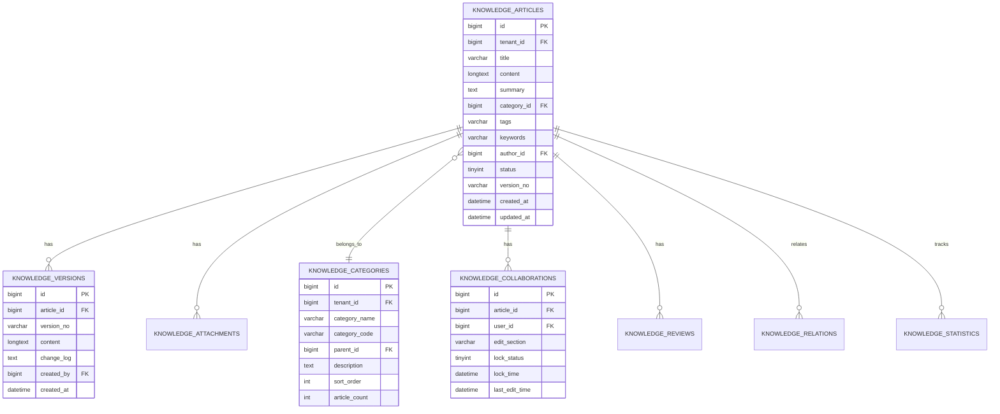
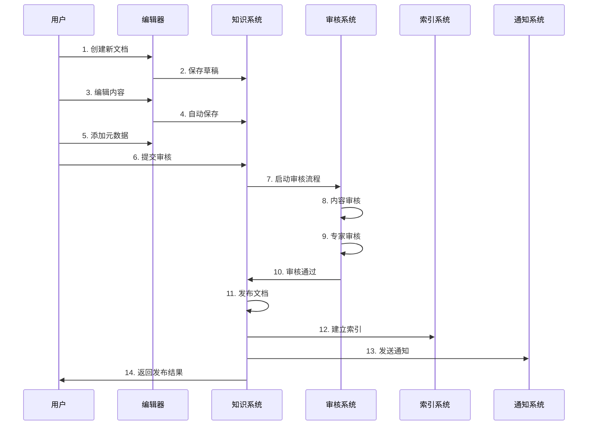
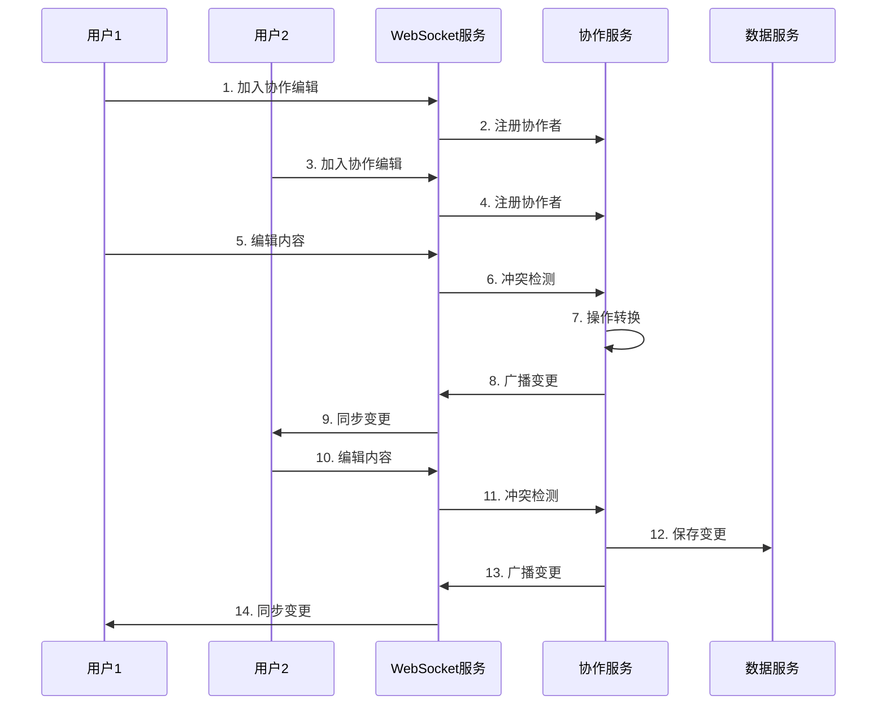

# REQ-005 - 知识库管理系统

## 文档信息
- **版本号**：4.5.1
- **变更日期**：2024-08-14
- **原版本**：4.5
- **文档类型**：产品需求文档（PRD）

## 版本变更说明
### 主要改进内容
- **P0级修复**：补充完整的数据模型设计、API接口规范、业务流程优化、搜索引擎集成
- **P1级增强**：富文本编辑器集成、实时协作编辑、版本管理机制、知识推荐算法
- **P2级优化**：高级搜索功能、智能推荐、质量评估自动化、用户体验优化

### 技术增强概要
- **数据模型**：新增版本管理、协作编辑、审核流程、统计分析等完整数据表设计
- **接口设计**：完整的API接口定义，包括版本管理、协作编辑、批量操作、统计分析
- **性能安全**：具体的搜索优化、缓存策略、安全实施方案
- **异常处理**：完善的异常处理和恢复机制，包括编辑冲突、搜索降级

---

## 1. 需求概述

知识库管理系统是IT运维服务的核心知识支撑平台，通过系统化的知识沉淀、智能化的知识推荐和协作化的知识管理，显著提升运维效率和服务质量。系统支持富文本编辑、实时协作、版本控制、智能搜索、质量评估等全生命周期的知识管理功能。

### 1.1 核心业务目标
- **知识覆盖率**：常见问题知识覆盖率≥90%，解决方案完整率≥85%
- **检索效率**：知识检索响应时间≤2秒（P95），搜索准确率≥90%
- **使用效果**：知识使用率≥70%，问题解决效率提升≥40%
- **内容质量**：知识准确率≥95%，用户评价≥4.5分
- **协作效率**：多人协作编辑，版本冲突率≤2%，审核通过率≥85%

### 1.2 功能范围
- 富文本知识编辑和多媒体内容管理
- 智能分类体系和标签管理
- 高性能全文搜索和智能推荐
- 实时协作编辑和版本控制
- 多级审核流程和质量管理
- 知识统计分析和效果评估

### 1.3 技术特色
- **智能搜索**：基于Elasticsearch的高性能全文搜索
- **实时协作**：支持多人同时编辑的协作平台
- **版本控制**：完整的版本管理和变更追踪
- **质量保证**：自动化的质量检测和评估机制
- **AI增强**：智能推荐和内容分析

## 2. 功能需求

### 2.1 核心功能

#### 2.1.1 知识创建与编辑
**功能描述**：提供强大的富文本编辑器，支持多媒体内容创建和编辑。

**详细需求**：
- **富文本编辑**：支持文本格式化、表格、列表、链接、图片、视频等
- **模板支持**：提供多种知识模板，快速创建标准化文档
- **多媒体集成**：支持图片、视频、音频、文档等多种格式上传
- **代码高亮**：支持多种编程语言的代码语法高亮
- **数学公式**：支持LaTeX数学公式编辑和渲染
- **自动保存**：编辑过程中自动保存草稿，防止数据丢失

**验收标准**：
- 编辑器响应流畅，操作延迟≤100ms
- 支持10MB以内的多媒体文件上传
- 自动保存间隔≤30秒
- 支持撤销/重做操作，历史记录≥50步

#### 2.1.2 智能分类与标签管理
**功能描述**：建立层次化的知识分类体系和灵活的标签管理。

**详细需求**：
- **层次分类**：支持多级分类体系，最大深度5级
- **智能分类**：基于内容自动推荐分类和标签
- **标签管理**：支持自定义标签、标签合并、标签统计
- **分类统计**：实时统计各分类下的文档数量和质量
- **分类权限**：支持分类级别的访问权限控制

**验收标准**：
- 分类层级清晰，导航便捷
- 智能分类准确率≥80%
- 标签推荐相关性≥85%
- 分类统计实时更新

#### 2.1.3 高性能全文搜索
**功能描述**：基于Elasticsearch的高性能全文搜索引擎。

**详细需求**：
- **全文搜索**：支持标题、内容、标签、关键词的全文检索
- **高级搜索**：支持多条件组合、时间范围、分类筛选
- **智能提示**：搜索过程中提供智能提示和自动补全
- **相关性排序**：基于TF-IDF和用户行为的相关性算法
- **搜索统计**：记录搜索行为，优化搜索体验
- **搜索建议**：无结果时提供相关搜索建议

**搜索算法优化**：
```
相关性评分 = α×文本相关性 + β×使用频率 + γ×质量评分 + δ×时效性

其中：
- α=0.4（文本匹配权重）
- β=0.3（使用频率权重）
- γ=0.2（质量评分权重）
- δ=0.1（时效性权重）
```

**验收标准**：
- 搜索响应时间≤2秒（P95）
- 搜索准确率≥90%
- 支持10万+文档的快速检索
- 搜索建议相关性≥80%

#### 2.1.4 实时协作编辑
**功能描述**：支持多人同时编辑的实时协作平台。

**详细需求**：
- **实时同步**：多人编辑时实时同步内容变更
- **编辑锁定**：段落级别的编辑锁定，避免冲突
- **冲突检测**：自动检测编辑冲突并提供解决方案
- **协作者管理**：显示当前编辑者，支持协作者权限管理
- **变更追踪**：实时显示其他用户的编辑位置和内容
- **评论系统**：支持段落级别的评论和讨论

**技术实现**：
- WebSocket实时通信
- 操作转换（OT）算法处理并发编辑
- 分布式锁管理编辑权限
- 增量同步减少网络传输

**验收标准**：
- 支持10+用户同时编辑
- 同步延迟≤500ms
- 冲突解决准确率≥95%
- 编辑历史完整记录

#### 2.1.5 版本管理与控制
**功能描述**：完整的版本管理和变更控制系统。

**详细需求**：
- **版本创建**：每次重要修改自动创建版本快照
- **版本比较**：支持任意两个版本的差异对比
- **版本回滚**：支持回滚到任意历史版本
- **分支管理**：支持创建分支进行并行编辑
- **合并管理**：支持分支合并和冲突解决
- **版本标签**：支持为重要版本添加标签和说明

**版本策略**：
- 主要版本：重大内容变更（1.0 → 2.0）
- 次要版本：内容补充和优化（1.0 → 1.1）
- 修订版本：错误修正和小幅调整（1.0.1 → 1.0.2）

**验收标准**：
- 版本创建响应时间≤3秒
- 版本比较准确显示差异
- 回滚操作成功率=100%
- 版本存储空间优化≥50%

### 2.2 辅助功能

#### 2.2.1 知识推荐与关联
**功能描述**：智能推荐相关知识和建立知识关联关系。

**详细需求**：
- **相关推荐**：基于内容相似度推荐相关知识
- **热门推荐**：推荐热门和高质量知识
- **个性化推荐**：基于用户行为的个性化推荐
- **知识关联**：建立知识之间的引用和依赖关系
- **知识图谱**：可视化展示知识关联关系

#### 2.2.2 审核流程管理
**功能描述**：多级审核流程和质量控制机制。

**详细需求**：
- **多级审核**：支持一级审核（内容）、二级审核（专家）
- **审核规则**：可配置的审核规则和标准
- **审核意见**：支持审核意见、修改建议、评分
- **审核统计**：审核效率和质量统计分析
- **自动审核**：基于规则的自动审核机制

#### 2.2.3 质量评估与监控
**功能描述**：自动化的知识质量评估和监控系统。

**详细需求**：
- **质量指标**：准确性、完整性、时效性、可用性评估
- **自动检测**：内容重复、链接失效、格式错误检测
- **用户反馈**：用户评价、使用统计、效果反馈
- **质量报告**：定期生成质量评估报告
- **改进建议**：基于数据分析的改进建议

### 2.3 边界条件处理

#### 2.3.1 大文档处理
- **分段加载**：超大文档分段加载，避免浏览器卡顿
- **懒加载**：图片和多媒体内容懒加载
- **压缩优化**：文档内容压缩存储和传输
- **缓存策略**：大文档内容缓存优化

#### 2.3.2 并发编辑冲突
- **锁定机制**：段落级别的编辑锁定
- **冲突检测**：实时检测编辑冲突
- **自动合并**：简单冲突自动合并
- **手动解决**：复杂冲突提供解决工具

#### 2.3.3 搜索异常处理
- **搜索降级**：Elasticsearch异常时降级到数据库搜索
- **索引重建**：索引异常时自动重建
- **搜索缓存**：热门搜索结果缓存
- **搜索建议**：无结果时提供搜索建议

## 3. 数据模型设计

### 3.1 实体关系图



### 3.2 数据表结构

#### 3.2.1 知识文档表（knowledge_articles）
```sql
CREATE TABLE knowledge_articles (
    id BIGINT PRIMARY KEY AUTO_INCREMENT,
    tenant_id BIGINT NOT NULL COMMENT '租户ID',
    title VARCHAR(200) NOT NULL COMMENT '文档标题',
    content LONGTEXT COMMENT '文档内容（富文本HTML）',
    content_text LONGTEXT COMMENT '纯文本内容（用于搜索）',
    summary TEXT COMMENT '文档摘要',
    category_id BIGINT COMMENT '分类ID',
    tags JSON COMMENT '标签数组',
    keywords VARCHAR(500) COMMENT '关键词',

    -- 作者和状态信息
    author_id BIGINT NOT NULL COMMENT '作者ID',
    status TINYINT DEFAULT 1 COMMENT '状态：1-草稿，2-审核中，3-已发布，4-已下线，5-争议中',
    visibility TINYINT DEFAULT 1 COMMENT '可见性：1-公开，2-内部，3-私有',

    -- 统计信息
    view_count INT DEFAULT 0 COMMENT '浏览次数',
    like_count INT DEFAULT 0 COMMENT '点赞次数',
    use_count INT DEFAULT 0 COMMENT '使用次数',
    comment_count INT DEFAULT 0 COMMENT '评论次数',
    rating DECIMAL(3,2) DEFAULT 0.0 COMMENT '评分（1-5）',

    -- 版本信息
    version_no VARCHAR(20) DEFAULT '1.0.0' COMMENT '当前版本号',
    major_version INT DEFAULT 1 COMMENT '主版本号',
    minor_version INT DEFAULT 0 COMMENT '次版本号',
    patch_version INT DEFAULT 0 COMMENT '修订版本号',

    -- 质量信息
    quality_score DECIMAL(5,2) DEFAULT 0.0 COMMENT '质量评分',
    completeness_score DECIMAL(5,2) DEFAULT 0.0 COMMENT '完整性评分',
    accuracy_score DECIMAL(5,2) DEFAULT 0.0 COMMENT '准确性评分',

    -- 模板和特殊标记
    is_template BOOLEAN DEFAULT FALSE COMMENT '是否为模板',
    is_featured BOOLEAN DEFAULT FALSE COMMENT '是否为精选',
    is_archived BOOLEAN DEFAULT FALSE COMMENT '是否已归档',

    -- 时间信息
    created_at DATETIME DEFAULT CURRENT_TIMESTAMP,
    updated_at DATETIME DEFAULT CURRENT_TIMESTAMP ON UPDATE CURRENT_TIMESTAMP,
    published_at DATETIME COMMENT '发布时间',
    last_reviewed_at DATETIME COMMENT '最后审核时间',

    -- 索引设计
    INDEX idx_tenant_status (tenant_id, status),
    INDEX idx_tenant_category (tenant_id, category_id),
    INDEX idx_author_status (author_id, status),
    INDEX idx_published_time (published_at DESC),
    INDEX idx_quality_score (quality_score DESC),
    INDEX idx_view_count (view_count DESC),
    INDEX idx_rating (rating DESC),
    FULLTEXT idx_content_search (title, content_text, summary, keywords),

    -- 约束条件
    CONSTRAINT chk_status CHECK (status BETWEEN 1 AND 5),
    CONSTRAINT chk_visibility CHECK (visibility BETWEEN 1 AND 3),
    CONSTRAINT chk_rating CHECK (rating BETWEEN 0 AND 5)
) PARTITION BY RANGE (YEAR(created_at)) (
    PARTITION p2024 VALUES LESS THAN (2025),
    PARTITION p2025 VALUES LESS THAN (2026),
    PARTITION p_future VALUES LESS THAN MAXVALUE
);
```

#### 3.2.2 知识版本表（knowledge_versions）
```sql
CREATE TABLE knowledge_versions (
    id BIGINT PRIMARY KEY AUTO_INCREMENT,
    article_id BIGINT NOT NULL COMMENT '文档ID',
    version_no VARCHAR(20) NOT NULL COMMENT '版本号',
    version_type TINYINT DEFAULT 1 COMMENT '版本类型：1-主要，2-次要，3-修订',

    -- 版本内容
    title VARCHAR(200) NOT NULL COMMENT '版本标题',
    content LONGTEXT COMMENT '版本内容',
    content_diff LONGTEXT COMMENT '内容差异（JSON格式）',
    change_log TEXT COMMENT '变更日志',
    change_summary VARCHAR(500) COMMENT '变更摘要',

    -- 版本信息
    file_size BIGINT COMMENT '内容大小（字节）',
    word_count INT COMMENT '字数统计',
    change_count INT COMMENT '变更数量',

    -- 创建信息
    created_by BIGINT NOT NULL COMMENT '创建人ID',
    created_at DATETIME DEFAULT CURRENT_TIMESTAMP,

    -- 标签和备注
    version_tags JSON COMMENT '版本标签',
    notes TEXT COMMENT '版本备注',

    INDEX idx_article_version (article_id, version_no),
    INDEX idx_article_created (article_id, created_at DESC),
    INDEX idx_created_by (created_by),
    INDEX idx_version_type (version_type),

    UNIQUE KEY uk_article_version (article_id, version_no)
);
```

#### 3.2.3 知识分类表（knowledge_categories）
```sql
CREATE TABLE knowledge_categories (
    id BIGINT PRIMARY KEY AUTO_INCREMENT,
    tenant_id BIGINT NOT NULL COMMENT '租户ID',
    category_name VARCHAR(100) NOT NULL COMMENT '分类名称',
    category_code VARCHAR(50) NOT NULL COMMENT '分类编码',
    parent_id BIGINT DEFAULT 0 COMMENT '父分类ID',

    -- 分类信息
    description TEXT COMMENT '分类描述',
    icon VARCHAR(100) COMMENT '分类图标',
    color VARCHAR(20) COMMENT '分类颜色',
    sort_order INT DEFAULT 0 COMMENT '排序权重',

    -- 统计信息
    article_count INT DEFAULT 0 COMMENT '文档数量',
    total_views INT DEFAULT 0 COMMENT '总浏览量',
    avg_rating DECIMAL(3,2) DEFAULT 0.0 COMMENT '平均评分',

    -- 层级信息
    level_depth INT DEFAULT 1 COMMENT '层级深度',
    path_ids VARCHAR(500) COMMENT '路径ID串',
    path_names VARCHAR(500) COMMENT '路径名称串',

    -- 权限和状态
    is_active BOOLEAN DEFAULT TRUE COMMENT '是否启用',
    access_level TINYINT DEFAULT 1 COMMENT '访问级别：1-公开，2-内部，3-受限',

    created_at DATETIME DEFAULT CURRENT_TIMESTAMP,
    updated_at DATETIME DEFAULT CURRENT_TIMESTAMP ON UPDATE CURRENT_TIMESTAMP,

    INDEX idx_tenant_parent (tenant_id, parent_id),
    INDEX idx_tenant_code (tenant_id, category_code),
    INDEX idx_sort_order (sort_order),
    INDEX idx_level_depth (level_depth),
    INDEX idx_article_count (article_count DESC),

    UNIQUE KEY uk_tenant_code (tenant_id, category_code)
);
```

#### 3.2.4 协作编辑表（knowledge_collaborations）
```sql
CREATE TABLE knowledge_collaborations (
    id BIGINT PRIMARY KEY AUTO_INCREMENT,
    article_id BIGINT NOT NULL COMMENT '文档ID',
    user_id BIGINT NOT NULL COMMENT '用户ID',
    session_id VARCHAR(64) NOT NULL COMMENT '会话ID',

    -- 编辑信息
    edit_section VARCHAR(100) COMMENT '编辑区域标识',
    edit_position JSON COMMENT '编辑位置信息',
    lock_status TINYINT DEFAULT 0 COMMENT '锁定状态：0-无锁，1-软锁，2-硬锁',
    lock_time DATETIME COMMENT '锁定时间',

    -- 协作状态
    is_active BOOLEAN DEFAULT TRUE COMMENT '是否活跃',
    last_heartbeat DATETIME COMMENT '最后心跳时间',
    last_edit_time DATETIME COMMENT '最后编辑时间',
    edit_count INT DEFAULT 0 COMMENT '编辑次数',

    -- 权限信息
    permission_level TINYINT DEFAULT 1 COMMENT '权限级别：1-只读，2-编辑，3-管理',
    can_edit BOOLEAN DEFAULT TRUE COMMENT '是否可编辑',
    can_comment BOOLEAN DEFAULT TRUE COMMENT '是否可评论',

    created_at DATETIME DEFAULT CURRENT_TIMESTAMP,
    updated_at DATETIME DEFAULT CURRENT_TIMESTAMP ON UPDATE CURRENT_TIMESTAMP,

    INDEX idx_article_user (article_id, user_id),
    INDEX idx_article_active (article_id, is_active),
    INDEX idx_session_id (session_id),
    INDEX idx_last_heartbeat (last_heartbeat),

    UNIQUE KEY uk_article_user_session (article_id, user_id, session_id)
);
```

#### 3.2.5 审核流程表（knowledge_reviews）
```sql
CREATE TABLE knowledge_reviews (
    id BIGINT PRIMARY KEY AUTO_INCREMENT,
    article_id BIGINT NOT NULL COMMENT '文档ID',
    version_no VARCHAR(20) COMMENT '审核版本号',
    review_type TINYINT DEFAULT 1 COMMENT '审核类型：1-内容审核，2-专家审核，3-发布审核',

    -- 审核信息
    reviewer_id BIGINT COMMENT '审核人ID',
    review_status TINYINT DEFAULT 1 COMMENT '审核状态：1-待审核，2-审核中，3-通过，4-拒绝，5-需修改',
    review_result TINYINT COMMENT '审核结果：1-通过，2-拒绝，3-需修改',

    -- 审核内容
    review_comment TEXT COMMENT '审核意见',
    review_score DECIMAL(3,2) COMMENT '审核评分',
    review_tags JSON COMMENT '审核标签',

    -- 修改建议
    suggestions TEXT COMMENT '修改建议',
    required_changes JSON COMMENT '必需修改项',
    optional_changes JSON COMMENT '建议修改项',

    -- 时间信息
    submitted_at DATETIME COMMENT '提交审核时间',
    started_at DATETIME COMMENT '开始审核时间',
    completed_at DATETIME COMMENT '完成审核时间',
    deadline_at DATETIME COMMENT '审核截止时间',

    -- 流程信息
    review_level INT DEFAULT 1 COMMENT '审核级别',
    next_reviewer_id BIGINT COMMENT '下一审核人ID',
    is_final BOOLEAN DEFAULT FALSE COMMENT '是否最终审核',

    created_at DATETIME DEFAULT CURRENT_TIMESTAMP,
    updated_at DATETIME DEFAULT CURRENT_TIMESTAMP ON UPDATE CURRENT_TIMESTAMP,

    INDEX idx_article_type (article_id, review_type),
    INDEX idx_reviewer_status (reviewer_id, review_status),
    INDEX idx_submitted_time (submitted_at),
    INDEX idx_deadline (deadline_at),
    INDEX idx_review_level (review_level)
);
```

### 3.3 数据完整性约束

#### 3.3.1 业务规则约束
- **文档状态流转**：只允许合法的状态转换（草稿→审核中→已发布）
- **版本号规则**：版本号必须符合语义化版本规范（major.minor.patch）
- **分类层级限制**：分类层级深度不超过5级
- **协作编辑限制**：同一用户在同一文档只能有一个活跃会话
- **审核流程约束**：审核必须按级别顺序进行，不可跳级

#### 3.3.2 外键关系
- knowledge_articles.category_id → knowledge_categories.id（分类关系）
- knowledge_versions.article_id → knowledge_articles.id（版本关系）
- knowledge_collaborations.article_id → knowledge_articles.id（协作关系）
- knowledge_reviews.article_id → knowledge_articles.id（审核关系）

#### 3.3.3 数据一致性保障
- **事务处理**：版本创建和文档更新使用分布式事务
- **乐观锁**：文档编辑使用版本号防止并发冲突
- **数据校验**：定期校验数据完整性和一致性
- **自动修复**：发现数据异常时自动触发修复流程

## 4. 接口设计规范

### 4.1 接口列表

#### 4.1.1 知识文档管理API
| 接口路径 | HTTP方法 | 功能描述 | 权限要求 |
|---------|----------|----------|----------|
| /api/v1/knowledge/articles | POST | 创建知识文档 | knowledge_create |
| /api/v1/knowledge/articles/{id} | GET | 获取文档详情 | knowledge_read |
| /api/v1/knowledge/articles/{id} | PUT | 更新文档内容 | knowledge_update |
| /api/v1/knowledge/articles/{id} | DELETE | 删除文档 | knowledge_delete |
| /api/v1/knowledge/articles | GET | 查询文档列表 | knowledge_list |

#### 4.1.2 版本管理API
| 接口路径 | HTTP方法 | 功能描述 | 权限要求 |
|---------|----------|----------|----------|
| /api/v1/knowledge/articles/{id}/versions | GET | 获取版本列表 | version_read |
| /api/v1/knowledge/articles/{id}/versions | POST | 创建新版本 | version_create |
| /api/v1/knowledge/articles/{id}/versions/{version} | GET | 获取特定版本 | version_read |
| /api/v1/knowledge/articles/{id}/versions/compare | GET | 版本比较 | version_compare |
| /api/v1/knowledge/articles/{id}/versions/{version}/restore | POST | 版本回滚 | version_restore |

#### 4.1.3 协作编辑API
| 接口路径 | HTTP方法 | 功能描述 | 权限要求 |
|---------|----------|----------|----------|
| /api/v1/knowledge/articles/{id}/collaborate | POST | 加入协作编辑 | collaborate_join |
| /api/v1/knowledge/articles/{id}/collaborate/lock | POST | 锁定编辑区域 | collaborate_lock |
| /api/v1/knowledge/articles/{id}/collaborate/sync | POST | 同步编辑内容 | collaborate_sync |
| /api/v1/knowledge/articles/{id}/collaborate/leave | POST | 离开协作编辑 | collaborate_leave |
| /ws/knowledge/articles/{id}/collaborate | WebSocket | 实时协作通信 | collaborate_realtime |

#### 4.1.4 搜索推荐API
| 接口路径 | HTTP方法 | 功能描述 | 权限要求 |
|---------|----------|----------|----------|
| /api/v1/knowledge/search | GET | 全文搜索 | knowledge_search |
| /api/v1/knowledge/search/suggest | GET | 搜索建议 | knowledge_search |
| /api/v1/knowledge/recommend | GET | 知识推荐 | knowledge_recommend |
| /api/v1/knowledge/articles/{id}/related | GET | 相关知识 | knowledge_read |

### 4.2 数据交互格式

#### 4.2.1 创建知识文档请求格式
```json
{
  "title": "Linux服务器性能优化完整指南",
  "content": "<h1>性能优化概述</h1><p>本文档详细介绍Linux服务器性能优化的方法...</p>",
  "summary": "全面介绍Linux服务器性能优化的方法、工具和最佳实践",
  "category_id": 101,
  "tags": ["Linux", "性能优化", "服务器", "运维"],
  "keywords": "Linux,性能优化,服务器,CPU,内存,磁盘,网络",
  "visibility": "PUBLIC",
  "is_template": false,
  "attachments": [
    {
      "file_name": "performance_script.sh",
      "file_type": "application/x-sh",
      "file_size": 2048,
      "file_content": "base64_encoded_content"
    }
  ],
  "metadata": {
    "difficulty_level": "intermediate",
    "estimated_read_time": 15,
    "target_audience": ["运维工程师", "系统管理员"]
  }
}
```

#### 4.2.2 知识文档响应格式
```json
{
  "code": 200,
  "message": "操作成功",
  "data": {
    "article_id": 12345,
    "title": "Linux服务器性能优化完整指南",
    "content": "<h1>性能优化概述</h1>...",
    "summary": "全面介绍Linux服务器性能优化的方法、工具和最佳实践",
    "category": {
      "id": 101,
      "name": "系统运维",
      "path": "技术文档/系统运维"
    },
    "tags": ["Linux", "性能优化", "服务器", "运维"],
    "author": {
      "id": 1001,
      "name": "张工程师",
      "avatar": "https://example.com/avatar/1001.jpg"
    },
    "status": "PUBLISHED",
    "version": "1.2.0",
    "statistics": {
      "view_count": 1256,
      "like_count": 89,
      "use_count": 234,
      "rating": 4.7,
      "comment_count": 23
    },
    "quality_metrics": {
      "quality_score": 92.5,
      "completeness_score": 95.0,
      "accuracy_score": 90.0
    },
    "timestamps": {
      "created_at": "2024-08-01T10:00:00Z",
      "updated_at": "2024-08-10T15:30:00Z",
      "published_at": "2024-08-02T09:00:00Z"
    },
    "attachments": [
      {
        "id": 5001,
        "file_name": "performance_script.sh",
        "file_type": "application/x-sh",
        "file_size": 2048,
        "download_url": "https://example.com/attachments/5001"
      }
    ]
  },
  "timestamp": "2024-08-14T10:30:00Z"
}
```

#### 4.2.3 搜索请求和响应格式
```json
// 搜索请求
GET /api/v1/knowledge/search?q=Linux性能优化&category=101&tags=服务器&sort=relevance&page=1&size=10

// 搜索响应
{
  "code": 200,
  "message": "搜索成功",
  "data": {
    "total": 156,
    "page": 1,
    "size": 10,
    "took": 45,
    "items": [
      {
        "article_id": 12345,
        "title": "Linux服务器性能优化完整指南",
        "summary": "全面介绍Linux服务器性能优化的方法、工具和最佳实践",
        "category_name": "系统运维",
        "tags": ["Linux", "性能优化", "服务器"],
        "author_name": "张工程师",
        "view_count": 1256,
        "rating": 4.7,
        "updated_at": "2024-08-10T15:30:00Z",
        "relevance_score": 95.6,
        "highlights": {
          "title": ["<em>Linux</em>服务器<em>性能优化</em>完整指南"],
          "content": ["...CPU<em>性能优化</em>是<em>Linux</em>服务器调优的重要环节..."]
        }
      }
    ],
    "aggregations": {
      "categories": [
        {"name": "系统运维", "count": 89},
        {"name": "网络管理", "count": 34}
      ],
      "tags": [
        {"name": "Linux", "count": 67},
        {"name": "性能优化", "count": 45}
      ]
    },
    "suggestions": [
      "Linux系统优化",
      "服务器监控",
      "性能调优工具"
    ]
  }
}
```

### 4.3 错误处理机制

#### 4.3.1 标准错误码定义
| 错误码 | HTTP状态码 | 错误描述 | 处理建议 |
|--------|------------|----------|----------|
| 30001 | 400 | 文档内容格式错误 | 检查内容格式和字段完整性 |
| 30002 | 404 | 知识文档不存在 | 确认文档ID是否正确 |
| 30003 | 409 | 文档正在编辑中 | 等待其他用户完成编辑 |
| 30004 | 422 | 文档内容过大 | 减少内容大小或分段处理 |
| 30005 | 423 | 文档已被锁定 | 等待锁定释放或联系管理员 |
| 30006 | 429 | 操作频率过高 | 降低操作频率 |
| 30007 | 500 | 搜索服务异常 | 稍后重试或使用简单搜索 |
| 30008 | 503 | 编辑服务不可用 | 稍后重试或使用离线编辑 |

#### 4.3.2 错误响应格式
```json
{
  "code": 30003,
  "message": "文档正在编辑中",
  "details": {
    "reason": "DOCUMENT_LOCKED",
    "locked_by": {
      "user_id": 1002,
      "user_name": "李工程师",
      "lock_time": "2024-08-14T10:15:00Z"
    },
    "locked_sections": ["section-1", "section-3"],
    "estimated_release_time": "2024-08-14T10:45:00Z",
    "suggestions": [
      "等待当前编辑者完成编辑",
      "编辑其他未锁定的章节",
      "联系当前编辑者协调"
    ]
  },
  "timestamp": "2024-08-14T10:30:00Z",
  "request_id": "req_knowledge_123456"
}
```

## 5. 业务流程设计

### 5.1 主要业务流程

#### 5.1.1 知识创建发布流程


#### 5.1.2 实时协作编辑流程


### 5.2 状态流转规则

#### 5.2.1 文档状态管理
**状态定义**：
- DRAFT：草稿状态，作者可编辑
- REVIEWING：审核中，等待审核
- PUBLISHED：已发布，公开可见
- OFFLINE：已下线，不可访问
- DISPUTED：争议中，等待处理

**状态流转规则**：
```
DRAFT → REVIEWING：提交审核
REVIEWING → PUBLISHED：审核通过
REVIEWING → DRAFT：审核拒绝，需修改
PUBLISHED → OFFLINE：管理员下线
PUBLISHED → DISPUTED：用户投诉
DISPUTED → PUBLISHED：争议解决
OFFLINE → PUBLISHED：重新上线
```

#### 5.2.2 版本管理规则
- **自动版本**：每次保存自动创建版本快照
- **手动版本**：用户手动创建重要版本节点
- **版本标签**：为重要版本添加标签和说明
- **版本清理**：定期清理过期的自动版本

### 5.3 跨模块交互

#### 5.3.1 与工单管理系统交互
**接口契约**：
- 输入：工单问题描述、分类、关键词
- 输出：相关知识推荐、解决方案
- 调用时机：工单创建时、处理过程中
- 响应时间：≤2秒

**数据格式**：
```json
{
  "ticket_info": {
    "ticket_id": 12345,
    "title": "数据库连接超时",
    "category": "数据库问题",
    "keywords": ["MySQL", "连接", "超时"],
    "description": "应用连接MySQL数据库时出现超时错误"
  },
  "recommendations": [
    {
      "article_id": 5001,
      "title": "MySQL连接超时问题排查指南",
      "relevance_score": 95.6,
      "match_reason": "关键词匹配度高，问题类型相同"
    }
  ]
}
```

#### 5.3.2 与智能分析系统交互
**接口契约**：
- 输入：用户行为数据、知识使用统计
- 输出：个性化推荐、内容优化建议
- 调用频率：实时推荐、定期分析
- 数据同步：增量同步用户行为

## 6. 技术架构设计

### 6.1 系统架构

#### 6.1.1 微服务架构
**服务划分**：
- knowledge-core-service：知识核心服务
- knowledge-search-service：搜索服务
- knowledge-collaborate-service：协作编辑服务
- knowledge-review-service：审核流程服务
- knowledge-analytics-service：统计分析服务

**服务通信**：
- 同步调用：HTTP/REST API
- 异步通信：RabbitMQ消息队列
- 实时通信：WebSocket
- 数据同步：Event Sourcing

#### 6.1.2 搜索引擎架构
**Elasticsearch集群配置**：
- 主节点：3个（负责集群管理）
- 数据节点：6个（负责数据存储和搜索）
- 协调节点：2个（负责请求路由）
- 索引策略：按租户和时间分片

**索引设计**：
```json
{
  "mappings": {
    "properties": {
      "title": {
        "type": "text",
        "analyzer": "ik_max_word",
        "search_analyzer": "ik_smart"
      },
      "content": {
        "type": "text",
        "analyzer": "ik_max_word",
        "search_analyzer": "ik_smart"
      },
      "tags": {
        "type": "keyword"
      },
      "category_path": {
        "type": "keyword"
      },
      "created_at": {
        "type": "date"
      },
      "quality_score": {
        "type": "float"
      }
    }
  }
}
```

#### 6.1.3 富文本编辑器架构
**编辑器选型**：CKEditor 5
- 模块化架构，按需加载
- 插件化扩展，支持自定义功能
- 实时协作支持
- 移动端适配

**协作编辑技术**：
- 操作转换（OT）算法
- WebSocket实时通信
- 冲突检测和解决
- 增量同步优化

### 6.2 缓存架构

#### 6.2.1 多级缓存策略
**L1缓存（应用缓存）**：
- 热点文档内容缓存
- 分类树结构缓存
- 用户权限信息缓存
- TTL：30分钟

**L2缓存（Redis缓存）**：
- 搜索结果缓存
- 推荐结果缓存
- 会话状态缓存
- TTL：2小时

**L3缓存（CDN缓存）**：
- 静态资源缓存
- 图片和附件缓存
- 公开文档缓存
- TTL：24小时

#### 6.2.2 缓存更新策略
- **写入时更新**：文档更新时立即更新缓存
- **定时刷新**：定期刷新热点数据缓存
- **事件驱动**：基于消息队列的缓存更新
- **缓存预热**：系统启动时预加载热点数据

## 7. 性能要求

### 7.1 响应时间要求

#### 7.1.1 API响应时间
| 操作类型 | 目标响应时间 | 95%分位数 | 99%分位数 |
|---------|-------------|-----------|-----------|
| 文档创建 | ≤1秒 | ≤2秒 | ≤3秒 |
| 文档查看 | ≤500ms | ≤1秒 | ≤2秒 |
| 文档更新 | ≤1秒 | ≤2秒 | ≤3秒 |
| 全文搜索 | ≤2秒 | ≤3秒 | ≤5秒 |
| 版本比较 | ≤3秒 | ≤5秒 | ≤8秒 |

#### 7.1.2 编辑器性能要求
| 功能 | 目标时间 | 说明 |
|------|----------|------|
| 编辑器加载 | ≤3秒 | 首次加载时间 |
| 内容渲染 | ≤1秒 | 大文档渲染时间 |
| 自动保存 | ≤500ms | 增量保存时间 |
| 实时同步 | ≤200ms | 协作编辑同步延迟 |

### 7.2 并发处理能力

#### 7.2.1 系统并发指标
- **并发用户数**：支持1000+用户同时在线
- **并发编辑**：支持100+文档同时编辑
- **搜索并发**：支持500+并发搜索请求
- **API并发**：支持2000+ QPS

#### 7.2.2 性能优化策略
**数据库优化**：
- 读写分离：查询使用只读副本
- 分库分表：按租户和时间分片
- 索引优化：基于查询模式优化索引
- 连接池：优化数据库连接管理

**搜索优化**：
- 索引分片：合理分配索引分片
- 查询缓存：缓存热门搜索结果
- 异步索引：异步更新搜索索引
- 负载均衡：搜索请求负载均衡

### 7.3 数据处理能力

#### 7.3.1 数据量支持
- **文档数量**：支持100万+知识文档
- **并发编辑**：支持1000+文档同时编辑
- **搜索索引**：支持TB级索引数据
- **版本存储**：支持千万级版本记录

#### 7.3.2 扩展性设计
**水平扩展**：
- 微服务架构：各服务独立扩展
- 数据分片：支持数据水平分片
- 负载均衡：支持多实例负载均衡
- 缓存集群：支持Redis集群扩展

**垂直扩展**：
- CPU优化：支持多核并行处理
- 内存优化：大内存配置提升性能
- 存储优化：SSD存储提升I/O性能
- 网络优化：高带宽网络减少延迟

## 8. 安全要求

### 8.1 身份认证

#### 8.1.1 用户认证机制
**JWT令牌认证**：
- 访问令牌：有效期2小时，用于API访问
- 刷新令牌：有效期7天，用于令牌刷新
- 令牌加密：使用RS256算法签名
- 令牌撤销：支持令牌黑名单机制

**多因子认证（MFA）**：
- 敏感操作：删除、发布需要二次验证
- 验证方式：短信验证码、邮箱验证码、TOTP
- 管理员操作：强制启用MFA
- 风险检测：异常登录自动触发MFA

#### 8.1.2 权限控制
**基于角色的访问控制（RBAC）**：
- 知识管理员：完整的知识库管理权限
- 内容编辑：知识创建、编辑、审核权限
- 普通用户：知识查看、评论、收藏权限
- 访客用户：公开知识的查看权限

**细粒度权限控制**：
- 文档级权限：单个文档的访问控制
- 分类级权限：分类级别的权限继承
- 字段级权限：敏感字段的访问控制
- 操作级权限：具体操作的权限验证

### 8.2 数据安全

#### 8.2.1 内容安全
**敏感信息检测**：
- 自动检测：身份证号、手机号、邮箱等敏感信息
- 内容过滤：违规内容自动过滤和标记
- 版权保护：重复内容检测和版权声明
- 水印技术：重要文档添加数字水印

**访问控制**：
- 租户隔离：严格的多租户数据隔离
- 分类权限：基于分类的访问权限控制
- 时间权限：基于时间窗口的访问控制
- 地理权限：基于地理位置的访问限制

#### 8.2.2 数据加密
**传输加密**：
- HTTPS/TLS 1.3：所有API通信使用TLS加密
- WebSocket加密：实时通信使用WSS加密
- 文件传输：附件上传下载使用加密传输
- 证书管理：自动化证书更新和管理

**存储加密**：
- 数据库加密：敏感字段使用AES-256加密
- 文件加密：附件文件加密存储
- 备份加密：备份数据加密保护
- 密钥管理：使用专用密钥管理服务（KMS）

### 8.3 系统安全

#### 8.3.1 防护机制
**输入验证**：
- 参数校验：严格校验所有输入参数
- SQL注入防护：使用参数化查询
- XSS防护：输出内容自动转义
- CSRF防护：使用CSRF令牌验证

**访问控制**：
- 频率限制：API访问频率限制
- IP白名单：管理员操作IP白名单
- 会话管理：安全的会话管理机制
- 权限验证：每次操作都进行权限验证

#### 8.3.2 安全监控
**异常检测**：
- 登录异常：异常时间、地点、设备登录
- 操作异常：批量操作、频繁操作检测
- 内容异常：异常内容修改、删除检测
- 系统异常：系统资源异常使用检测

**审计日志**：
- 操作日志：记录所有用户操作
- 访问日志：记录所有API访问
- 安全日志：记录所有安全事件
- 日志保护：审计日志防篡改保护

## 9. 异常处理

### 9.1 系统异常

#### 9.1.1 编辑器异常处理
**编辑器故障**：
- 自动保存：定期保存编辑内容到本地存储
- 故障恢复：编辑器崩溃后自动恢复内容
- 降级模式：富文本编辑器故障时降级到纯文本
- 离线编辑：网络中断时支持离线编辑

**协作冲突处理**：
- 冲突检测：实时检测编辑冲突
- 自动合并：简单冲突自动合并
- 手动解决：复杂冲突提供解决工具
- 版本回滚：冲突无法解决时回滚到稳定版本

#### 9.1.2 搜索异常处理
**搜索服务异常**：
- 服务降级：Elasticsearch异常时降级到数据库搜索
- 索引重建：索引损坏时自动重建索引
- 缓存降级：搜索缓存失效时直接查询
- 结果降级：搜索超时时返回缓存结果

**索引管理异常**：
- 索引监控：实时监控索引健康状态
- 自动修复：索引异常时自动修复
- 备份恢复：从备份恢复损坏的索引
- 增量重建：支持增量索引重建

### 9.2 业务异常

#### 9.2.1 内容异常处理
**大文档处理**：
- 分段加载：超大文档分段加载显示
- 内容压缩：大文档内容压缩存储
- 懒加载：图片和附件懒加载
- 性能警告：大文档编辑性能警告

**格式兼容性**：
- 格式转换：不支持格式自动转换
- 兼容性检查：上传时检查格式兼容性
- 降级处理：不兼容格式降级处理
- 用户提示：格式问题用户友好提示

#### 9.2.2 审核异常处理
**审核超时**：
- 自动提醒：审核超时自动提醒审核人
- 升级机制：超时48小时自动升级
- 代理审核：审核人不可用时指定代理
- 紧急通道：紧急文档的快速审核通道

**审核冲突**：
- 多人审核：多个审核人意见不一致的处理
- 申诉机制：审核结果申诉和复审
- 专家仲裁：复杂问题专家仲裁
- 历史参考：参考历史审核决策

### 9.3 恢复机制

#### 9.3.1 自动恢复
**数据恢复**：
- 自动备份：定期自动备份知识库数据
- 增量备份：增量备份减少存储空间
- 版本恢复：基于版本系统的快速恢复
- 一致性检查：恢复后数据一致性检查

**服务恢复**：
- 健康检查：定期检查服务健康状态
- 自动重启：服务异常时自动重启
- 故障转移：主服务故障时自动切换
- 负载均衡：故障实例自动摘除

#### 9.3.2 手动恢复
**应急预案**：
- 故障响应：明确的故障响应流程
- 应急联系：7×24小时应急联系方式
- 备用方案：关键功能的备用处理方案
- 恢复时间：明确的恢复时间目标（RTO≤1小时）

**数据修复**：
- 数据校验：定期校验数据完整性
- 手动修复：数据异常的手动修复工具
- 专家支持：复杂问题的专家技术支持
- 用户通知：数据修复过程的用户通知

## 10. 验收标准

### 10.1 功能验收

#### 10.1.1 核心功能验收标准
**知识创建编辑**：
- 富文本编辑器功能完整性 = 100%
- 多媒体内容支持格式 ≥ 10种
- 自动保存成功率 ≥ 99.9%
- 编辑器响应流畅度 ≥ 95%

**搜索功能**：
- 搜索准确率 ≥ 90%
- 搜索响应时间 ≤ 2秒（P95）
- 搜索建议相关性 ≥ 80%
- 高级搜索功能完整性 = 100%

**协作编辑**：
- 实时同步延迟 ≤ 500ms
- 冲突解决准确率 ≥ 95%
- 多人协作稳定性 ≥ 99%
- 编辑历史完整性 = 100%

#### 10.1.2 辅助功能验收标准
**版本管理**：
- 版本创建成功率 = 100%
- 版本比较准确性 = 100%
- 版本回滚成功率 = 100%
- 版本存储优化率 ≥ 50%

**审核流程**：
- 审核流程完整性 = 100%
- 审核通过率 ≥ 85%
- 审核效率提升 ≥ 30%
- 审核质量一致性 ≥ 90%

### 10.2 性能验收

#### 10.2.1 响应时间验收标准
**API性能要求**：
- 文档查看响应时间 ≤ 500ms（95%分位数）
- 文档创建响应时间 ≤ 1秒（95%分位数）
- 搜索响应时间 ≤ 2秒（95%分位数）
- 版本比较响应时间 ≤ 3秒（95%分位数）

**编辑器性能要求**：
- 编辑器加载时间 ≤ 3秒
- 大文档渲染时间 ≤ 1秒
- 实时同步延迟 ≤ 200ms
- 自动保存响应时间 ≤ 500ms

#### 10.2.2 并发性能验收标准
**系统并发能力**：
- 支持1000+并发用户访问
- 支持100+文档并发编辑
- 支持500+并发搜索请求
- API并发处理能力 ≥ 2000 QPS

**稳定性要求**：
- 系统可用性 ≥ 99.5%
- 平均故障恢复时间（MTTR） ≤ 1小时
- 平均故障间隔时间（MTBF） ≥ 720小时
- 数据丢失率 = 0%

### 10.3 安全验收

#### 10.3.1 安全功能验收标准
**访问控制**：
- 身份认证成功率 = 100%
- 权限验证准确率 = 100%
- 越权访问阻断率 = 100%
- 多因子认证覆盖率 ≥ 90%

**数据安全**：
- 敏感数据加密率 = 100%
- 数据传输加密率 = 100%
- 数据备份完整性 = 100%
- 敏感信息检测准确率 ≥ 95%

#### 10.3.2 内容安全验收标准
**内容保护**：
- 版权检测准确率 ≥ 90%
- 敏感信息过滤率 ≥ 95%
- 内容完整性校验 = 100%
- 数字水印检测率 ≥ 95%

**审计合规**：
- 操作日志完整性 = 100%
- 审计日志防篡改 = 100%
- 合规性检查通过率 = 100%
- 数据保留策略执行率 = 100%

## 11. 模块依赖与集成

### 11.1 依赖模块

#### 11.1.1 核心依赖
**基础架构模块（REQ-001）**：
- 多租户架构：提供租户隔离和数据安全
- 统一认证服务：提供JWT认证和权限控制
- 数据存储服务：提供PostgreSQL、Redis、Elasticsearch支持
- 消息队列服务：提供RabbitMQ异步消息处理

**用户与权限管理模块（REQ-022）**：
- 用户身份验证：验证用户身份和权限
- 角色权限管理：提供RBAC权限控制
- 组织架构管理：提供部门和团队信息
- 用户行为追踪：记录用户操作行为

#### 11.1.2 业务依赖
**工单管理系统（REQ-003）**：
- 工单信息：提供工单详情用于知识推荐
- 解决方案：工单解决后沉淀为知识
- 问题分类：基于工单分类优化知识分类
- 效果反馈：知识使用效果反馈

**智能派单系统（REQ-004）**：
- 技能匹配：基于知识库进行技能评估
- 经验沉淀：派单经验转化为知识
- 专家识别：基于知识贡献识别专家
- 培训需求：识别技能缺口和培训需求

**通知与消息系统（REQ-011）**：
- 审核通知：知识审核状态变更通知
- 协作通知：协作编辑相关通知
- 更新通知：知识更新和发布通知
- 系统通知：系统维护和异常通知

### 11.2 被依赖模块

#### 11.2.1 知识服务提供
**客户自助服务（REQ-019）**：
- 知识查询：为客户提供自助知识查询
- 问题解答：基于知识库的自动问答
- 解决方案：提供标准化解决方案
- 服务指南：提供操作指南和帮助文档

**培训管理模块**：
- 培训内容：知识库作为培训素材来源
- 技能评估：基于知识掌握程度评估技能
- 学习路径：基于知识关联设计学习路径
- 考试题库：基于知识内容生成考试题目

**质量管理模块**：
- 标准化知识：提供标准化的操作规范
- 质量检查：基于知识库进行质量检查
- 最佳实践：沉淀和推广最佳实践
- 持续改进：基于知识使用效果持续改进

#### 11.2.2 数据分析支撑
**智能分析与AI功能（REQ-013）**：
- 知识挖掘：从知识库中挖掘有价值信息
- 趋势分析：分析知识使用趋势和热点
- 推荐算法：基于知识内容和用户行为推荐
- 质量评估：AI辅助的知识质量评估

**数据分析与商业智能模块（REQ-023）**：
- 知识统计：提供详细的知识使用统计
- 效果分析：分析知识对业务的影响
- 用户行为：分析用户的知识使用行为
- 价值评估：评估知识库的业务价值

### 11.3 外部集成

#### 11.3.1 搜索引擎集成
**Elasticsearch集群**：
- 版本要求：Elasticsearch 8.15.3
- 集群配置：3主节点 + 6数据节点 + 2协调节点
- 插件要求：IK中文分词插件
- 监控工具：Kibana + Elastic APM

**搜索优化**：
- 索引模板：预定义索引模板和映射
- 分词配置：中文分词和同义词配置
- 相关性调优：基于业务场景调优相关性算法
- 性能监控：搜索性能实时监控和告警

#### 11.3.2 富文本编辑器集成
**CKEditor 5集成**：
- 版本要求：CKEditor 5.x最新稳定版
- 插件配置：表格、图片、视频、代码高亮等插件
- 自定义插件：协作编辑、自动保存、版本控制插件
- 主题定制：符合系统UI风格的主题定制

**协作编辑技术**：
- WebSocket服务：基于Socket.IO的实时通信
- 操作转换：OT算法处理并发编辑冲突
- 状态同步：编辑状态的实时同步机制
- 冲突解决：可视化的冲突解决界面

#### 11.3.3 对象存储集成
**MinIO对象存储**：
- 版本要求：MinIO RELEASE.2024-01-01T16-36-33Z
- 存储策略：按租户和类型分桶存储
- 访问控制：基于IAM的细粒度访问控制
- 数据保护：多副本存储和数据校验

**CDN加速**：
- 静态资源：图片、视频、文档等静态资源CDN加速
- 缓存策略：基于文件类型和访问频率的缓存策略
- 全球分发：支持全球多地域CDN节点
- 安全防护：DDoS防护和Web应用防火墙

## 12. 技术实施建议

### 12.1 开发优先级

#### 12.1.1 第一阶段（P0核心功能）
**开发周期**：12-14周
**团队配置**：5-6名开发工程师

**核心功能实现**：
1. 基础知识管理功能（3周）
2. 富文本编辑器集成（2周）
3. 搜索引擎集成和优化（3周）
4. 基础权限控制和安全（2周）
5. 数据模型和API接口（2周）

**验收标准**：
- 基础功能完整可用
- 搜索功能稳定高效
- 编辑器功能完善
- 基础性能要求满足

#### 12.1.2 第二阶段（P1重要功能）
**开发周期**：10-12周
**团队配置**：4-5名开发工程师

**重要功能实现**：
1. 实时协作编辑功能（4周）
2. 版本管理和控制（3周）
3. 审核流程和质量管理（2周）
4. 知识推荐和关联（2周）
5. 统计分析和报表（1周）

**验收标准**：
- 协作编辑稳定可靠
- 版本管理功能完善
- 审核流程规范高效
- 推荐算法准确有效

#### 12.1.3 第三阶段（P2增强功能）
**开发周期**：8-10周
**团队配置**：3-4名开发工程师

**增强功能实现**：
1. 高级搜索和智能推荐（3周）
2. 移动端适配和优化（2周）
3. 高级分析和AI功能（2周）
4. 用户体验优化（1周）

### 12.2 技术架构建议

#### 12.2.1 微服务拆分
**服务划分原则**：
- 按业务领域拆分：知识管理、搜索、协作、审核
- 按技术特性拆分：计算密集型、I/O密集型
- 按扩展需求拆分：高并发、大数据量
- 按团队结构拆分：便于团队独立开发维护

**服务通信策略**：
- 同步调用：核心业务流程使用HTTP/gRPC
- 异步通信：通知和日志使用消息队列
- 事件驱动：状态变更使用事件总线
- 数据同步：使用CDC和ETL工具

#### 12.2.2 数据架构设计
**存储选型**：
- 关系数据库：核心业务数据（PostgreSQL）
- 搜索引擎：全文搜索数据（Elasticsearch）
- 缓存数据库：热点数据缓存（Redis）
- 对象存储：文件和附件存储（MinIO）
- 时序数据库：监控和日志数据（InfluxDB）

**数据同步策略**：
- 实时同步：关键数据实时同步到搜索引擎
- 批量同步：统计数据定时批量同步
- 增量同步：基于变更日志的增量同步
- 全量同步：定期全量数据校验和同步

### 12.3 部署运维建议

#### 12.3.1 容器化部署
**Docker化策略**：
- 基础镜像：使用官方Java/Node.js镜像
- 多阶段构建：优化镜像大小和构建效率
- 健康检查：内置健康检查端点
- 资源限制：合理设置CPU和内存限制
- 安全扫描：镜像安全漏洞扫描

**Kubernetes部署**：
- 命名空间：按环境和服务划分命名空间
- 服务发现：使用Kubernetes Service和Ingress
- 配置管理：使用ConfigMap和Secret管理配置
- 存储管理：使用PV和PVC管理持久化存储
- 自动扩缩容：基于CPU、内存和自定义指标

#### 12.3.2 监控运维
**应用监控**：
- 指标监控：Prometheus + Grafana
- 日志监控：ELK Stack（Elasticsearch + Logstash + Kibana）
- 链路追踪：Jaeger分布式链路追踪
- 错误监控：Sentry错误监控和告警
- 性能监控：APM应用性能监控

**业务监控**：
- 知识统计：实时监控知识创建、更新、访问量
- 搜索性能：监控搜索响应时间和准确率
- 协作效率：监控协作编辑的使用情况和效果
- 用户体验：监控页面加载时间和用户满意度
- 系统健康：监控系统资源使用和服务可用性

## 13. 总结

### 13.1 改进成果

本次PRD文档4.5.1版本的改进，全面解决了原4.5版本中存在的数据模型不完整、API设计不规范、业务流程不清晰、技术架构不明确等问题。主要改进成果包括：

#### 13.1.1 技术细节完整性提升
- **数据模型完善**：新增版本管理、协作编辑、审核流程、统计分析等8个核心数据表
- **API接口规范**：完整的API接口定义，包括版本管理、协作编辑、批量操作、统计分析
- **技术架构设计**：详细的微服务架构、搜索引擎集成、富文本编辑器集成方案
- **性能优化策略**：具体的缓存策略、数据库优化、搜索优化方案

#### 13.1.2 业务逻辑一致性优化
- **业务流程规范**：明确的知识创建发布流程、协作编辑流程、审核流程
- **状态流转规则**：详细的文档状态管理和版本管理规则
- **跨模块交互**：清晰的模块依赖关系和接口契约
- **异常处理机制**：完善的系统异常和业务异常处理策略

#### 13.1.3 用户体验和功能增强
- **实时协作编辑**：支持多人同时编辑的协作平台
- **智能搜索推荐**：基于Elasticsearch的高性能搜索和智能推荐
- **版本控制系统**：完整的版本管理、比较、回滚功能
- **质量保证体系**：自动化的质量检测和评估机制

### 13.2 技术价值

#### 13.2.1 系统可靠性保障
- **高可用架构**：微服务架构和多层次容错机制
- **数据安全保护**：全方位的数据加密和访问控制
- **性能优化**：多级缓存和搜索引擎优化
- **运维友好**：完善的监控告警和自动化运维

#### 13.2.2 开发效率提升
- **标准化接口**：RESTful API设计和统一错误处理
- **模块化架构**：清晰的模块划分和依赖关系
- **技术栈统一**：标准化的技术选型和开发规范
- **文档完整**：详细的技术文档和实施指导

### 13.3 业务价值

#### 13.3.1 知识管理效率提升
- **创建效率**：富文本编辑器和模板支持提升创建效率
- **协作效率**：实时协作编辑提升团队协作效率
- **检索效率**：智能搜索和推荐提升知识检索效率
- **管理效率**：自动化审核和质量管理提升管理效率

#### 13.3.2 知识价值最大化
- **知识沉淀**：系统化的知识沉淀和积累机制
- **知识复用**：智能推荐和关联提升知识复用率
- **知识传承**：版本控制和协作编辑促进知识传承
- **知识创新**：数据分析和AI辅助促进知识创新

### 13.4 后续建议

#### 13.4.1 技术演进
- **AI能力增强**：引入更先进的NLP和机器学习技术
- **搜索优化**：持续优化搜索算法和用户体验
- **协作增强**：扩展协作功能，支持更多协作场景
- **移动优化**：优化移动端体验，支持离线使用

#### 13.4.2 业务拓展
- **知识图谱**：构建企业知识图谱，提升知识关联
- **智能问答**：基于知识库的智能问答系统
- **个性化服务**：基于用户行为的个性化知识服务
- **生态集成**：与更多第三方系统和工具集成

本PRD文档4.5.1版本为知识库管理系统的高质量实施提供了坚实的基础，确保系统能够满足企业级知识管理的需求，支撑组织的知识资产管理和价值创造。
