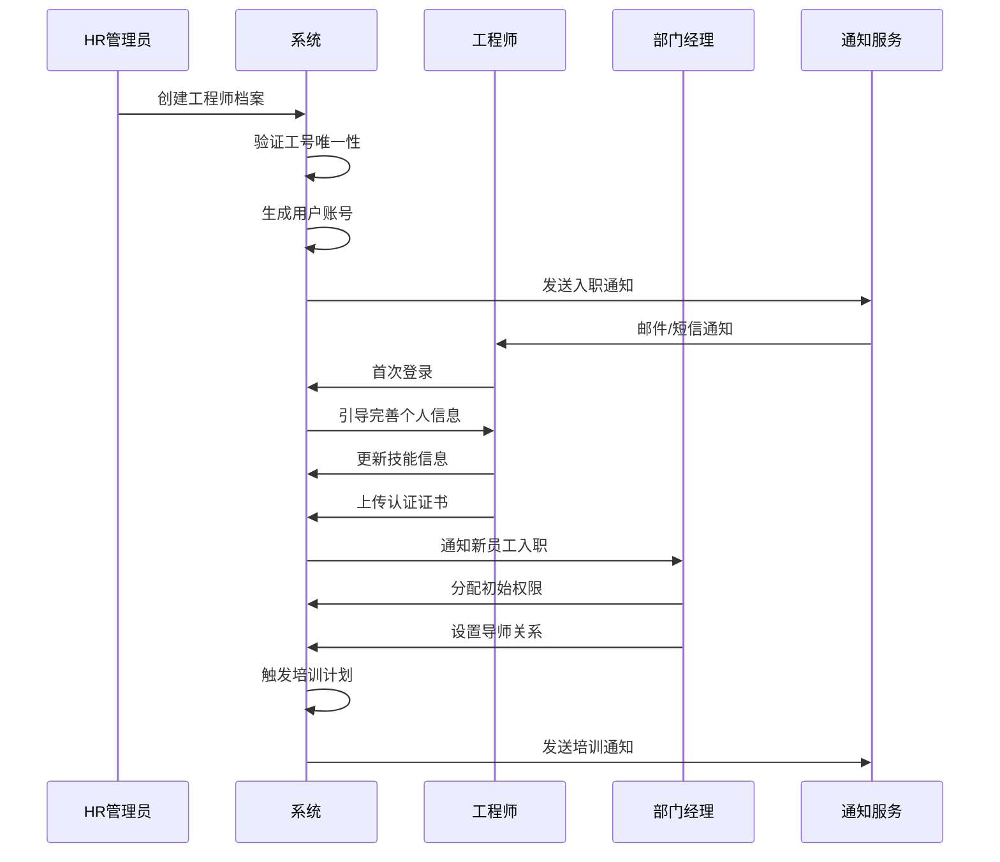
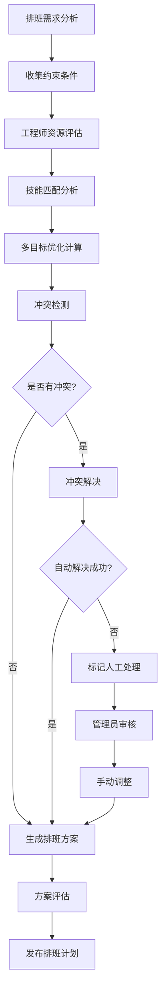
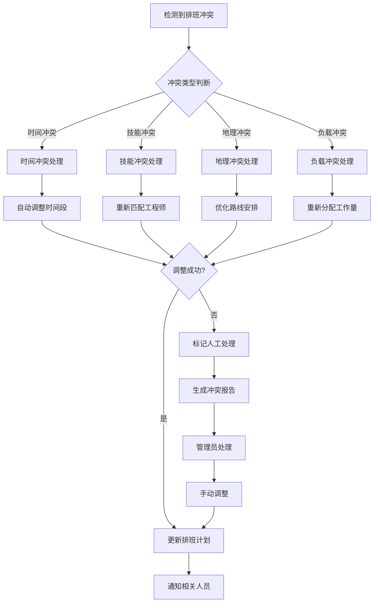
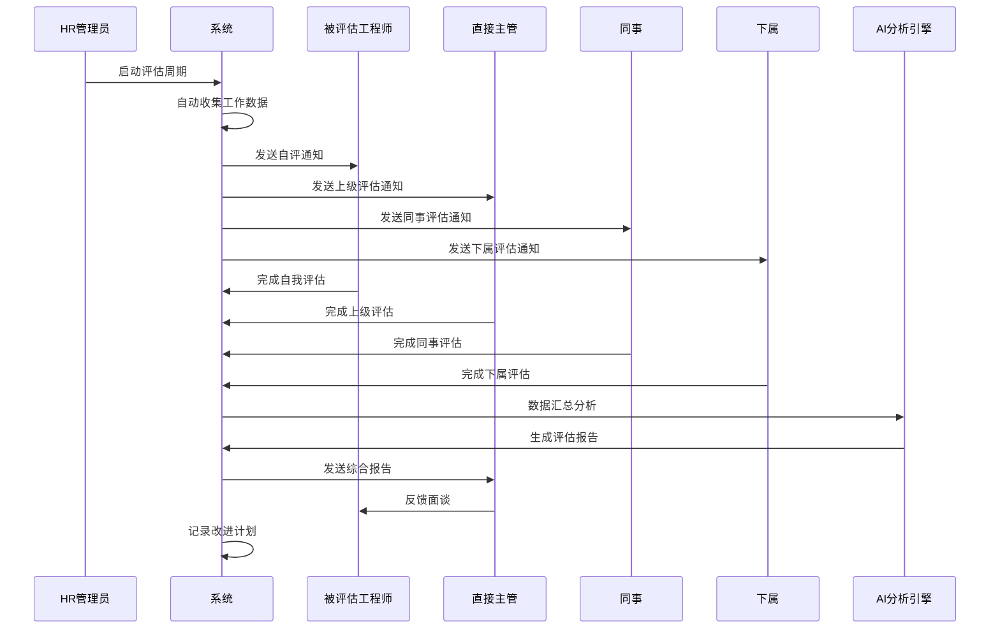
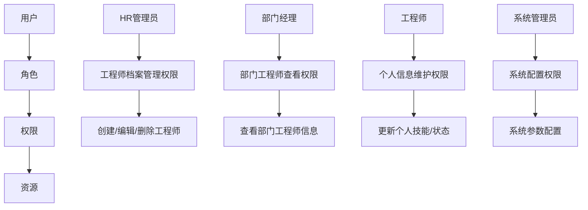
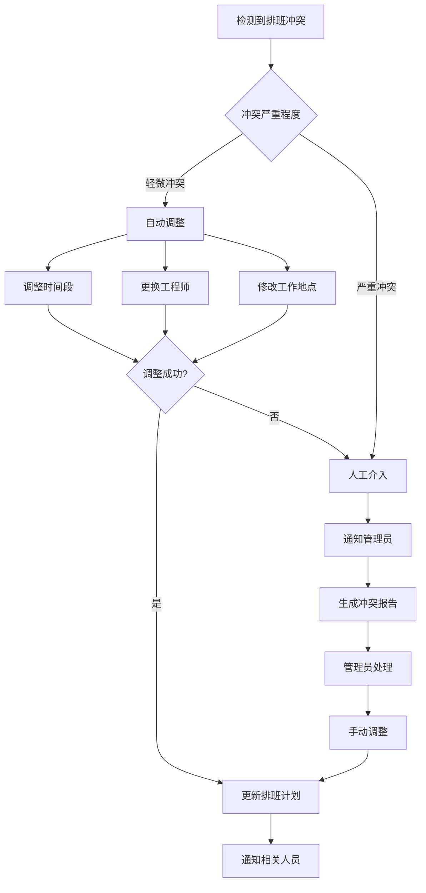
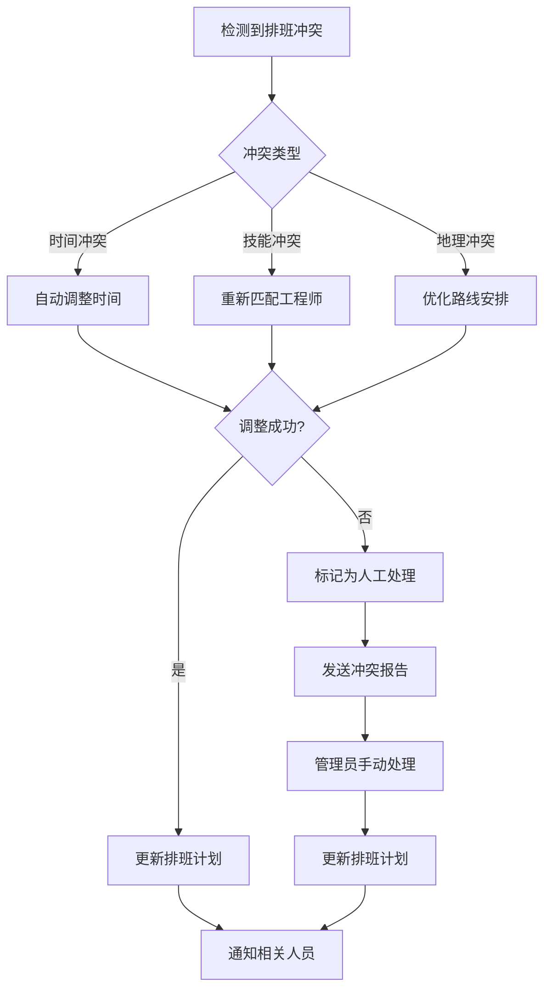

# REQ-006 - 工程师管理

## 文档信息
- **版本号**：4.5.1
- **变更日期**：2025-08-14
- **原版本**：4.5
- **文档类型**：产品需求文档（PRD）

## 版本变更说明
### 主要改进内容
- **P0级修复**：完善数据模型定义，补充API接口设计，明确跨模块集成方案
- **P1级增强**：详化绩效评估算法，完善排班业务规则，明确性能安全策略
- **P2级优化**：优化异常处理机制，增强用户体验设计，提升系统监控能力

### 技术增强概要
- **数据模型**：新增6个核心数据表，完善ER关系设计，优化索引策略
- **接口设计**：统一API规范，补充15个核心接口，完善错误处理机制
- **性能安全**：明确量化性能指标，详化数据加密方案，完善权限控制
- **异常处理**：建立完整异常处理体系，提供自动恢复机制

---

## 1. 需求概述

工程师管理模块是IT运维门户系统的核心人力资源管理组件，提供从基础档案管理到高级绩效分析的全方位工程师管理功能。该模块通过智能化的人员调度、科学化的绩效评估和标准化的培训管理，实现人力资源的最优配置和高效利用。

### 1.1 核心业务价值
- **智能派单支撑**：为智能派单系统（REQ-004）提供高质量的工程师档案、技能和状态数据
- **多租户数据隔离**：确保租户间工程师数据的完全隔离和安全访问
- **全端协同管理**：支持Web端管理和移动端自助服务，实现管理效率最大化
- **数据驱动决策**：通过绩效分析和能力评估，为人力资源决策提供科学依据

### 1.2 功能范围边界
**包含功能**：
- 工程师档案全生命周期管理（入职、在职、离职）
- 技能体系管理和认证跟踪
- 智能排班调度和冲突处理
- 实时状态跟踪和位置服务
- 绩效评估和360度反馈
- 培训管理和职业发展规划
- 考勤管理和假期审批

**不包含功能**：
- 薪酬计算和发放（由财务模块REQ-018负责）
- 招聘流程管理（外部HR系统负责）
- 企业组织架构设计（由系统管理模块REQ-010负责）

## 2. 功能需求

### 2.1 核心功能清单

| 功能编号 | 功能名称 | 优先级 | 功能描述 | 验收标准 | 技术复杂度 |
|---------|----------|--------|----------|----------|------------|
| REQ-006-001 | 工程师档案管理 | P0 | 基本信息、联系方式、入职信息的完整管理 | 信息完整率≥95%，支持1000+人员批量导入 | 中 |
| REQ-006-002 | 技能体系管理 | P0 | 技能录入、等级评定、认证管理、技能图谱 | 技能体系完善，评定标准明确，匹配准确率≥90% | 高 |
| REQ-006-003 | 智能排班调度 | P0 | 多规则自动排班、冲突检测、调班申请 | 排班冲突率≤5%，排班覆盖率≥95% | 高 |
| REQ-006-004 | 实时状态跟踪 | P0 | 在线状态、工作状态、位置信息、状态同步 | 状态更新延迟≤30秒，准确率≥95% | 中 |
| REQ-006-005 | 绩效评估管理 | P0 | 多维度绩效评估、360度反馈、绩效分析 | 评估数据准确率≥95%，计算错误率≤1% | 高 |
| REQ-006-006 | 培训管理 | P1 | 培训计划、课程管理、学习跟踪、效果评估 | 培训完成率≥90%，效果提升≥15% | 中 |
| REQ-006-007 | 考勤管理 | P1 | 签到签退、请假申请、加班记录、审批流程 | 考勤准确率≥99%，审批流程合规 | 中 |
| REQ-006-008 | 组织架构管理 | P1 | 部门设置、层级关系、角色分配、权限管理 | 架构清晰，权限明确，变更可追溯 | 中 |
| REQ-006-009 | 数据统计分析 | P1 | 人员统计、技能分布、工作量分析、趋势预测 | 统计准确率≥98%，报表生成≤30秒 | 中 |
| REQ-006-010 | 批量数据管理 | P1 | 批量导入/导出/更新，模板校验，错误处理 | 导入成功率≥95%，错误清单完整 | 中 |
| REQ-006-011 | 历史记录审计 | P1 | 档案变更审计、操作日志、数据追溯 | 变更100%可追溯，日志保留5年 | 低 |
| REQ-006-012 | 移动端支持 | P2 | 工程师移动端状态更新、信息查看、简单操作 | 端到端延迟≤30秒，易用性评分≥4.5 | 中 |

### 2.2 技术实现要点

#### 2.2.1 状态同步机制
- **架构设计**：Redis共享状态缓存 + RabbitMQ事件总线即时广播
- **同步策略**：状态变更≤30秒全网可见，支持离线状态缓存和恢复
- **一致性保障**：最终一致性模型，提供冲突检测和自动修复机制

#### 2.2.2 多租户隔离
- **数据隔离**：所有业务表强制包含tenant_id字段，API层自动注入租户过滤
- **权限隔离**：基于RBAC的细粒度权限控制，支持租户级别的功能定制
- **资源隔离**：文件存储按租户分目录，缓存按租户分区

#### 2.2.3 智能排班算法
- **多目标优化**：技能匹配度40% + 工作负载25% + 地理位置20% + 个人偏好15%
- **约束条件**：SLA要求、劳动法规、个人假期、技能认证有效期
- **冲突处理**：自动检测时间冲突、技能冲突、地理位置冲突，提供解决建议

## 3. 数据模型设计

### 3.1 实体关系图

```
工程师档案 (engineers) 1:N 工程师技能 (engineer_skills)
工程师档案 (engineers) 1:N 排班计划 (work_schedules)  
工程师档案 (engineers) 1:N 绩效评估 (performance_evaluations)
工程师档案 (engineers) 1:N 培训记录 (training_records)
工程师档案 (engineers) 1:N 考勤记录 (attendance_records)
工程师档案 (engineers) 1:N 状态历史 (engineer_status_history)
部门信息 (departments) 1:N 工程师档案 (engineers)
技能字典 (skill_dictionary) 1:N 工程师技能 (engineer_skills)
培训项目 (training_programs) 1:N 培训记录 (training_records)
```

### 3.2 核心数据表结构

#### 3.2.1 工程师档案表（engineers）
```sql
CREATE TABLE engineers (
    id BIGINT PRIMARY KEY AUTO_INCREMENT COMMENT '主键ID',
    tenant_id BIGINT NOT NULL COMMENT '租户ID',
    employee_no VARCHAR(50) NOT NULL COMMENT '工号',
    user_id BIGINT COMMENT '关联用户ID',
    real_name VARCHAR(50) NOT NULL COMMENT '真实姓名',
    gender TINYINT COMMENT '性别：1-男，2-女',
    birth_date DATE COMMENT '出生日期',
    id_card VARCHAR(255) COMMENT '身份证号（AES-256加密存储）',
    phone VARCHAR(255) COMMENT '手机号（AES-256加密存储）',
    email VARCHAR(100) COMMENT '邮箱',
    address TEXT COMMENT '联系地址',
    emergency_contact VARCHAR(50) COMMENT '紧急联系人',
    emergency_phone VARCHAR(255) COMMENT '紧急联系电话（AES-256加密存储）',
    department_id BIGINT COMMENT '部门ID',
    position VARCHAR(100) COMMENT '职位',
    level TINYINT DEFAULT 1 COMMENT '级别：1-初级，2-中级，3-高级，4-专家，5-架构师',
    hire_date DATE COMMENT '入职日期',
    status TINYINT DEFAULT 1 COMMENT '状态：1-在职，2-离职，3-停职，4-试用期',
    work_location VARCHAR(200) COMMENT '工作地点',
    current_workload INT DEFAULT 0 COMMENT '当前工单数量',
    online_status VARCHAR(20) DEFAULT 'offline' COMMENT '在线状态：online,offline,busy,away',
    last_active_time DATETIME COMMENT '最后活跃时间',
    latitude DECIMAL(10,8) COMMENT '当前位置纬度',
    longitude DECIMAL(11,8) COMMENT '当前位置经度',
    location_updated_at DATETIME COMMENT '位置更新时间',
    created_at DATETIME DEFAULT CURRENT_TIMESTAMP COMMENT '创建时间',
    updated_at DATETIME DEFAULT CURRENT_TIMESTAMP ON UPDATE CURRENT_TIMESTAMP COMMENT '更新时间',
    created_by BIGINT COMMENT '创建人',
    updated_by BIGINT COMMENT '更新人',
    
    UNIQUE KEY uk_tenant_employee_no (tenant_id, employee_no),
    INDEX idx_tenant_department (tenant_id, department_id),
    INDEX idx_tenant_status (tenant_id, status),
    INDEX idx_tenant_online_status (tenant_id, online_status),
    INDEX idx_tenant_level (tenant_id, level),
    INDEX idx_location (latitude, longitude),
    INDEX idx_last_active (last_active_time),
    INDEX idx_workload (current_workload)
) COMMENT='工程师档案表';
```

#### 3.2.2 工程师技能表（engineer_skills）
```sql
CREATE TABLE engineer_skills (
    id BIGINT PRIMARY KEY AUTO_INCREMENT COMMENT '主键ID',
    tenant_id BIGINT NOT NULL COMMENT '租户ID',
    engineer_id BIGINT NOT NULL COMMENT '工程师ID',
    skill_code VARCHAR(50) NOT NULL COMMENT '技能代码',
    skill_name VARCHAR(100) NOT NULL COMMENT '技能名称',
    skill_level TINYINT NOT NULL COMMENT '技能等级：1-初级，2-中级，3-高级，4-专家，5-大师',
    experience_years DECIMAL(4,1) COMMENT '经验年限',
    certification_status TINYINT DEFAULT 0 COMMENT '认证状态：0-无认证，1-认证中，2-已认证，3-已过期',
    certification_date DATE COMMENT '认证日期',
    certification_expiry DATE COMMENT '认证过期日期',
    certification_authority VARCHAR(100) COMMENT '认证机构',
    certificate_url VARCHAR(255) COMMENT '证书文件URL',
    last_used_date DATE COMMENT '最后使用日期',
    proficiency_score DECIMAL(5,2) COMMENT '熟练度评分（0-100）',
    self_assessment TINYINT COMMENT '自评等级',
    manager_assessment TINYINT COMMENT '主管评级',
    peer_assessment DECIMAL(3,1) COMMENT '同事评级平均分',
    assessment_date DATE COMMENT '评估日期',
    notes TEXT COMMENT '备注说明',
    created_at DATETIME DEFAULT CURRENT_TIMESTAMP COMMENT '创建时间',
    updated_at DATETIME DEFAULT CURRENT_TIMESTAMP ON UPDATE CURRENT_TIMESTAMP COMMENT '更新时间',
    
    UNIQUE KEY uk_tenant_engineer_skill (tenant_id, engineer_id, skill_code),
    INDEX idx_tenant_skill_level (tenant_id, skill_code, skill_level),
    INDEX idx_certification_expiry (certification_expiry),
    INDEX idx_proficiency_score (proficiency_score),
    FOREIGN KEY (engineer_id) REFERENCES engineers(id) ON DELETE CASCADE
) COMMENT='工程师技能表';

#### 3.2.3 排班计划表（work_schedules）
```sql
CREATE TABLE work_schedules (
    id BIGINT PRIMARY KEY AUTO_INCREMENT COMMENT '主键ID',
    tenant_id BIGINT NOT NULL COMMENT '租户ID',
    engineer_id BIGINT NOT NULL COMMENT '工程师ID',
    schedule_date DATE NOT NULL COMMENT '排班日期',
    shift_type VARCHAR(20) NOT NULL COMMENT '班次类型：day-白班，night-夜班，standby-待命，oncall-值班',
    start_time TIME NOT NULL COMMENT '开始时间',
    end_time TIME NOT NULL COMMENT '结束时间',
    work_location VARCHAR(200) COMMENT '工作地点',
    priority_level TINYINT DEFAULT 1 COMMENT '优先级：1-低，2-中，3-高，4-紧急',
    required_skills JSON COMMENT '所需技能列表',
    status TINYINT DEFAULT 1 COMMENT '状态：1-计划，2-确认，3-执行中，4-已完成，5-已取消',
    conflict_status TINYINT DEFAULT 0 COMMENT '冲突状态：0-无冲突，1-时间冲突，2-技能冲突，3-地理冲突',
    auto_assigned BOOLEAN DEFAULT FALSE COMMENT '是否自动分配',
    assignment_reason TEXT COMMENT '分配原因',
    notes TEXT COMMENT '备注',
    created_by BIGINT COMMENT '创建人',
    approved_by BIGINT COMMENT '审批人',
    approved_at DATETIME COMMENT '审批时间',
    created_at DATETIME DEFAULT CURRENT_TIMESTAMP COMMENT '创建时间',
    updated_at DATETIME DEFAULT CURRENT_TIMESTAMP ON UPDATE CURRENT_TIMESTAMP COMMENT '更新时间',

    INDEX idx_tenant_engineer_date (tenant_id, engineer_id, schedule_date),
    INDEX idx_tenant_date_shift (tenant_id, schedule_date, shift_type),
    INDEX idx_status_priority (status, priority_level),
    INDEX idx_conflict_status (conflict_status),
    INDEX idx_auto_assigned (auto_assigned),
    UNIQUE KEY uk_tenant_engineer_datetime (tenant_id, engineer_id, schedule_date, start_time),
    FOREIGN KEY (engineer_id) REFERENCES engineers(id) ON DELETE CASCADE
) COMMENT='排班计划表';
```

#### 3.2.4 绩效评估表（performance_evaluations）
```sql
CREATE TABLE performance_evaluations (
    id BIGINT PRIMARY KEY AUTO_INCREMENT COMMENT '主键ID',
    tenant_id BIGINT NOT NULL COMMENT '租户ID',
    engineer_id BIGINT NOT NULL COMMENT '工程师ID',
    evaluation_period VARCHAR(20) NOT NULL COMMENT '评估周期：2024Q1, 2024H1, 2024等',
    evaluation_type TINYINT NOT NULL COMMENT '评估类型：1-年度，2-季度，3-月度，4-项目',

    -- 工作质量指标
    ticket_completion_rate DECIMAL(5,2) COMMENT '工单完成率',
    ticket_quality_score DECIMAL(5,2) COMMENT '工单质量评分',
    customer_satisfaction DECIMAL(5,2) COMMENT '客户满意度',
    sla_compliance_rate DECIMAL(5,2) COMMENT 'SLA达成率',

    -- 工作效率指标
    avg_resolution_time DECIMAL(8,2) COMMENT '平均解决时间（小时）',
    first_call_resolution_rate DECIMAL(5,2) COMMENT '一次解决率',
    productivity_score DECIMAL(5,2) COMMENT '生产力评分',

    -- 技能发展指标
    skill_improvement_score DECIMAL(5,2) COMMENT '技能提升评分',
    training_completion_rate DECIMAL(5,2) COMMENT '培训完成率',
    certification_count INT DEFAULT 0 COMMENT '新增认证数量',

    -- 团队协作指标
    teamwork_score DECIMAL(5,2) COMMENT '团队协作评分',
    knowledge_sharing_score DECIMAL(5,2) COMMENT '知识分享评分',
    mentoring_score DECIMAL(5,2) COMMENT '指导他人评分',

    -- 360度反馈评分
    self_score DECIMAL(5,2) COMMENT '自评分数',
    supervisor_score DECIMAL(5,2) COMMENT '上级评分',
    peer_score DECIMAL(5,2) COMMENT '同事评分',
    subordinate_score DECIMAL(5,2) COMMENT '下属评分',

    -- 综合评估结果
    final_score DECIMAL(5,2) COMMENT '最终得分',
    performance_level VARCHAR(20) COMMENT '绩效等级：优秀,良好,合格,待改进',
    ranking_percentile DECIMAL(5,2) COMMENT '排名百分位',

    -- 评估内容
    strengths TEXT COMMENT '优势描述',
    improvements TEXT COMMENT '改进建议',
    goals_next_period TEXT COMMENT '下期目标',
    development_plan TEXT COMMENT '发展计划',

    -- 评估流程
    evaluator_id BIGINT COMMENT '主评估人ID',
    status TINYINT DEFAULT 1 COMMENT '状态：1-进行中，2-待审核，3-已完成，4-已归档',
    submitted_at DATETIME COMMENT '提交时间',
    reviewed_at DATETIME COMMENT '审核时间',

    created_at DATETIME DEFAULT CURRENT_TIMESTAMP COMMENT '创建时间',
    updated_at DATETIME DEFAULT CURRENT_TIMESTAMP ON UPDATE CURRENT_TIMESTAMP COMMENT '更新时间',

    INDEX idx_tenant_engineer_period (tenant_id, engineer_id, evaluation_period),
    INDEX idx_tenant_period_type (tenant_id, evaluation_period, evaluation_type),
    INDEX idx_final_score (final_score),
    INDEX idx_performance_level (performance_level),
    INDEX idx_status (status),
    FOREIGN KEY (engineer_id) REFERENCES engineers(id) ON DELETE CASCADE
) COMMENT='绩效评估表';
```

### 3.3 数据完整性约束

#### 3.3.1 业务规则约束
- **工程师状态约束**：离职工程师不能分配新工单，不能参与排班
- **技能认证约束**：过期认证的技能不能用于智能派单匹配
- **排班时间约束**：同一工程师同一时间段不能重复排班
- **绩效评估约束**：同一评估周期内每个工程师只能有一条评估记录

#### 3.3.2 数据一致性保障
- **级联删除**：工程师删除时自动删除相关技能、排班、绩效记录
- **状态同步**：工程师状态变更时自动更新相关业务数据
- **审计追踪**：所有关键数据变更都记录操作人、操作时间、变更内容

## 4. 接口设计规范

### 4.1 API设计原则
- **RESTful风格**：遵循REST架构原则，使用标准HTTP方法
- **统一响应格式**：所有API返回统一的Result<T>格式
- **版本管理**：API路径包含版本号，当前为/api/v1
- **错误处理**：提供详细的错误码和错误信息
- **分页查询**：大数据量查询统一使用分页机制
- **权限控制**：所有API都需要进行权限验证

### 4.2 核心API接口

#### 4.2.1 工程师档案管理API

**创建工程师档案**
```http
POST /api/v1/engineers
Authorization: Bearer {access_token}
Content-Type: application/json

{
    "employee_no": "ENG001",
    "real_name": "张三",
    "gender": 1,
    "birth_date": "1990-05-15",
    "phone": "13800138000",
    "email": "zhangsan@company.com",
    "department_id": 101,
    "position": "运维工程师",
    "level": 2,
    "hire_date": "2024-08-01",
    "work_location": "北京总部",
    "skills": [
        {
            "skill_code": "linux",
            "skill_level": 3,
            "experience_years": 3.5,
            "certification_status": 2
        },
        {
            "skill_code": "docker",
            "skill_level": 2,
            "experience_years": 2.0,
            "certification_status": 1
        }
    ]
}

Response:
{
    "code": 200,
    "message": "创建成功",
    "data": {
        "engineer_id": 1001,
        "employee_no": "ENG001",
        "real_name": "张三",
        "status": 1,
        "created_at": "2024-08-14T14:30:00Z"
    },
    "timestamp": "2024-08-14T14:30:00Z",
    "request_id": "req_123456789"
}
```

**查询工程师列表**
```http
GET /api/v1/engineers?department_id=101&status=1&skill_code=linux&page=1&size=20&sort=level,desc
Authorization: Bearer {access_token}

Response:
{
    "code": 200,
    "message": "查询成功",
    "data": {
        "total": 45,
        "page": 1,
        "size": 20,
        "pages": 3,
        "items": [
            {
                "engineer_id": 1001,
                "employee_no": "ENG001",
                "real_name": "张三",
                "department_name": "运维部",
                "position": "运维工程师",
                "level": 2,
                "phone": "138****8000",
                "email": "zhangsan@company.com",
                "status": 1,
                "current_workload": 3,
                "online_status": "online",
                "last_active_time": "2024-08-14T14:25:00Z",
                "skills": [
                    {
                        "skill_code": "linux",
                        "skill_name": "Linux系统管理",
                        "skill_level": 3,
                        "certification_status": 2
                    }
                ]
            }
        ]
    },
    "timestamp": "2024-08-14T14:30:00Z",
    "request_id": "req_123456790"
}
```

**更新工程师状态**
```http
PUT /api/v1/engineers/{id}/status
Authorization: Bearer {access_token}
Content-Type: application/json

{
    "online_status": "online",
    "location": {
        "latitude": 39.9042,
        "longitude": 116.4074,
        "address": "北京市朝阳区"
    },
    "work_status": "available"
}

Response:
{
    "code": 200,
    "message": "状态更新成功",
    "data": {
        "engineer_id": 1001,
        "online_status": "online",
        "location": {
            "latitude": 39.9042,
            "longitude": 116.4074,
            "address": "北京市朝阳区"
        },
        "updated_at": "2024-08-14T14:30:00Z"
    },
    "timestamp": "2024-08-14T14:30:00Z",
    "request_id": "req_123456791"
}
```

#### 4.2.2 技能管理API

**批量更新工程师技能**
```http
PUT /api/v1/engineers/{id}/skills
Authorization: Bearer {access_token}
Content-Type: application/json

{
    "skills": [
        {
            "skill_code": "kubernetes",
            "skill_level": 3,
            "experience_years": 2.5,
            "certification_status": 2,
            "certification_date": "2024-06-15",
            "certification_expiry": "2026-06-15",
            "proficiency_score": 85.5
        }
    ]
}

Response:
{
    "code": 200,
    "message": "技能更新成功",
    "data": {
        "engineer_id": 1001,
        "updated_skills": 1,
        "skill_summary": {
            "total_skills": 5,
            "certified_skills": 3,
            "avg_skill_level": 2.8
        }
    }
}
```

**查询技能匹配工程师**
```http
GET /api/v1/engineers/skills/match?skill_codes=linux,docker,kubernetes&min_level=2&certification_required=true
Authorization: Bearer {access_token}

Response:
{
    "code": 200,
    "message": "查询成功",
    "data": {
        "matched_engineers": [
            {
                "engineer_id": 1001,
                "real_name": "张三",
                "match_score": 95.5,
                "matched_skills": [
                    {
                        "skill_code": "linux",
                        "skill_level": 3,
                        "certification_status": 2
                    }
                ],
                "current_workload": 3,
                "online_status": "online"
            }
        ],
        "total_matched": 15
    }
}
```

#### 4.2.3 排班管理API

**生成智能排班**
```http
POST /api/v1/schedules/generate
Authorization: Bearer {access_token}
Content-Type: application/json

{
    "period": {
        "start_date": "2024-09-01",
        "end_date": "2024-09-30"
    },
    "rules": {
        "sla_priority": true,
        "skill_matching": true,
        "workload_balance": true,
        "location_preference": true,
        "personal_preference": false
    },
    "constraints": {
        "max_consecutive_days": 5,
        "min_rest_hours": 12,
        "max_weekly_hours": 40
    },
    "department_ids": [101, 102]
}

Response:
{
    "code": 200,
    "message": "排班生成成功",
    "data": {
        "schedule_id": "SCH-202409-001",
        "period": "2024-09",
        "total_schedules": 450,
        "conflicts_detected": 2,
        "coverage_rate": 98.5,
        "generated_at": "2024-08-14T14:30:00Z",
        "conflicts": [
            {
                "engineer_id": 1001,
                "date": "2024-09-15",
                "conflict_type": "skill_shortage",
                "description": "缺少数据库专家"
            }
        ]
    }
}
```

**查询排班冲突**
```http
GET /api/v1/schedules/conflicts?start_date=2024-09-01&end_date=2024-09-30&department_id=101
Authorization: Bearer {access_token}

Response:
{
    "code": 200,
    "message": "查询成功",
    "data": {
        "conflicts": [
            {
                "conflict_id": "CONF-001",
                "engineer_id": 1001,
                "engineer_name": "张三",
                "date": "2024-09-15",
                "time_slot": "09:00-17:00",
                "conflict_type": "time_overlap",
                "description": "与另一个排班时间重叠",
                "severity": "high",
                "suggested_solutions": [
                    "调整到14:00-22:00班次",
                    "分配给其他工程师"
                ]
            }
        ],
        "total_conflicts": 5,
        "resolution_suggestions": {
            "auto_resolvable": 3,
            "manual_required": 2
        }
    }
}
```

#### 4.2.4 绩效评估API

**创建绩效评估**
```http
POST /api/v1/performance/evaluations
Authorization: Bearer {access_token}
Content-Type: application/json

{
    "engineer_id": 1001,
    "evaluation_period": "2024Q3",
    "evaluation_type": 2,
    "criteria": [
        {
            "category": "work_quality",
            "weight": 30,
            "metrics": [
                {
                    "name": "ticket_completion_rate",
                    "target": 95.0,
                    "actual": 97.5
                },
                {
                    "name": "customer_satisfaction",
                    "target": 4.5,
                    "actual": 4.7
                }
            ]
        },
        {
            "category": "work_efficiency",
            "weight": 25,
            "metrics": [
                {
                    "name": "avg_resolution_time",
                    "target": 4.0,
                    "actual": 3.2
                }
            ]
        }
    ]
}

Response:
{
    "code": 200,
    "message": "绩效评估创建成功",
    "data": {
        "evaluation_id": 12345,
        "engineer_name": "张三",
        "evaluation_period": "2024Q3",
        "status": "in_progress",
        "deadline": "2024-10-15T23:59:59Z",
        "evaluation_url": "/performance/evaluations/12345"
    }
}
```

**获取绩效分析报告**
```http
GET /api/v1/performance/analytics?engineer_id=1001&periods=2024Q1,2024Q2,2024Q3
Authorization: Bearer {access_token}

Response:
{
    "code": 200,
    "message": "查询成功",
    "data": {
        "engineer_info": {
            "engineer_id": 1001,
            "name": "张三",
            "position": "高级运维工程师",
            "department": "运维部"
        },
        "performance_trend": [
            {
                "period": "2024Q1",
                "final_score": 85.5,
                "ranking_percentile": 75.0,
                "performance_level": "良好"
            },
            {
                "period": "2024Q2",
                "final_score": 88.2,
                "ranking_percentile": 80.0,
                "performance_level": "良好"
            },
            {
                "period": "2024Q3",
                "final_score": 91.8,
                "ranking_percentile": 85.0,
                "performance_level": "优秀"
            }
        ],
        "skill_development": {
            "technical_skills": 90,
            "communication_skills": 85,
            "leadership_skills": 75,
            "problem_solving": 95
        },
        "improvement_suggestions": [
            {
                "area": "领导力",
                "current_level": 75,
                "target_level": 85,
                "recommended_actions": [
                    "参加领导力培训课程",
                    "承担小组项目管理角色"
                ],
                "timeline": "6个月"
            }
        ]
    }
}
```

### 4.3 错误处理机制

#### 4.3.1 统一错误码定义
```json
{
    "business_errors": {
        "40001": "工程师不存在",
        "40002": "工号已存在",
        "40003": "技能代码无效",
        "40004": "排班时间冲突",
        "40005": "绩效评估周期重复",
        "40006": "技能认证已过期",
        "40007": "工程师状态不允许此操作",
        "40008": "部门不存在",
        "40009": "排班规则冲突",
        "40010": "评估数据不完整",
        "40011": "技能等级超出范围",
        "40012": "排班时间不在工作时间内",
        "40013": "工程师已离职",
        "40014": "缺少必要的技能认证",
        "40015": "超出最大工作负载"
    },
    "system_errors": {
        "50001": "数据库连接失败",
        "50002": "缓存服务异常",
        "50003": "消息队列异常",
        "50004": "文件上传失败",
        "50005": "外部服务调用失败",
        "50006": "数据同步失败",
        "50007": "算法计算超时",
        "50008": "内存不足",
        "50009": "网络连接超时",
        "50010": "服务暂时不可用"
    }
}
```

#### 4.3.2 错误响应格式
```json
{
    "code": 40004,
    "message": "排班时间冲突",
    "data": null,
    "error_details": {
        "error_code": "SCHEDULE_TIME_CONFLICT",
        "field": "schedule_time",
        "value": "2024-09-15 09:00-17:00",
        "conflict_with": "已存在的排班记录",
        "suggestion": "请选择其他时间段或调整现有排班"
    },
    "timestamp": "2024-08-14T14:30:00Z",
    "request_id": "req_123456792"
}
```

#### 4.3.3 批量操作错误处理
```json
{
    "code": 207,
    "message": "批量操作部分成功",
    "data": {
        "total_records": 100,
        "success_count": 95,
        "failed_count": 5,
        "success_records": [
            {
                "index": 1,
                "engineer_id": 1001,
                "status": "success"
            }
        ],
        "failed_records": [
            {
                "index": 10,
                "error_code": 40002,
                "error_message": "工号已存在",
                "data": {
                    "employee_no": "ENG010"
                }
            }
        ]
    }
}
```

## 5. 业务流程设计

### 5.1 工程师入职流程

#### 5.1.1 入职流程图


#### 5.1.2 入职流程详细步骤

**第一阶段：档案创建（1-2小时）**
1. **HR录入基本信息**
   - 输入：姓名、工号、部门、职位、入职日期
   - 验证：工号唯一性、部门有效性、必填字段完整性
   - 输出：工程师档案记录、系统用户ID

2. **系统自动处理**
   - 生成初始密码并加密存储
   - 创建默认权限配置
   - 分配企业邮箱（如适用）
   - 生成入职任务清单

3. **发送入职通知**
   - 邮件通知：包含登录信息、入职指南
   - 短信通知：登录凭证和首次登录链接
   - 系统通知：部门经理收到新员工通知

**第二阶段：信息完善（1-3天）**
1. **工程师首次登录**
   - 强制修改初始密码
   - 完善个人联系信息
   - 上传个人照片
   - 阅读并确认公司政策

2. **技能信息录入**
   - 选择技能类别和等级
   - 上传技能认证证书
   - 填写工作经验描述
   - 设置技能发展目标

3. **部门经理确认**
   - 审核技能信息准确性
   - 分配具体工作权限
   - 指定导师或培训负责人
   - 制定试用期目标

**第三阶段：培训启动（3-7天）**
1. **自动触发培训计划**
   - 根据职位匹配培训课程
   - 生成个性化学习路径
   - 设置培训完成时限
   - 安排导师跟进

### 5.2 智能排班流程

#### 5.2.1 排班算法流程


#### 5.2.2 排班算法详细说明

**步骤1：需求分析**
- **SLA要求分析**：分析各客户的SLA等级和响应时间要求
- **历史数据分析**：分析历史工单量、高峰时段、技能需求分布
- **预测模型**：基于历史数据预测未来工作负载

**步骤2：约束条件收集**
- **法规约束**：劳动法规定的工作时间、休息时间限制
- **个人约束**：工程师的请假、培训、个人偏好
- **业务约束**：关键时段必须有高级工程师值班

**步骤3：多目标优化算法**
```pseudocode
function optimizeSchedule(engineers, requirements, constraints):
    // 初始化遗传算法参数
    population_size = 100
    generations = 500
    mutation_rate = 0.1

    // 目标函数权重
    weights = {
        skill_match: 0.4,
        workload_balance: 0.25,
        location_preference: 0.2,
        personal_preference: 0.15
    }

    // 生成初始种群
    population = generateInitialPopulation(engineers, requirements)

    for generation in range(generations):
        // 评估适应度
        fitness_scores = evaluateFitness(population, weights)

        // 选择、交叉、变异
        new_population = geneticOperations(population, fitness_scores)

        // 检查收敛条件
        if converged(fitness_scores):
            break

        population = new_population

    return getBestSolution(population)
```

#### 5.2.3 冲突检测和处理


**冲突处理策略**：
1. **时间冲突**：自动寻找相邻可用时间段
2. **技能冲突**：寻找具备相似技能的替代工程师
3. **地理冲突**：优化路线或调整工作地点
4. **负载冲突**：重新平衡工作分配

### 5.3 绩效评估流程

#### 5.3.1 360度反馈流程


#### 5.3.2 自动数据收集机制

**工单系统数据收集**
```pseudocode
function collectTicketData(engineer_id, period):
    ticket_data = {
        completion_rate: calculateCompletionRate(engineer_id, period),
        avg_resolution_time: calculateAvgResolutionTime(engineer_id, period),
        quality_score: calculateQualityScore(engineer_id, period),
        customer_satisfaction: getCustomerSatisfaction(engineer_id, period),
        first_call_resolution: calculateFirstCallResolution(engineer_id, period)
    }
    return ticket_data
```

**SLA系统数据收集**
```pseudocode
function collectSLAData(engineer_id, period):
    sla_data = {
        sla_compliance_rate: calculateSLACompliance(engineer_id, period),
        response_time_avg: calculateAvgResponseTime(engineer_id, period),
        escalation_rate: calculateEscalationRate(engineer_id, period),
        violation_count: countSLAViolations(engineer_id, period)
    }
    return sla_data
```

#### 5.3.3 绩效计算算法
```pseudocode
function calculatePerformanceScore(engineer_id, period):
    // 收集各维度数据
    work_quality = collectWorkQualityData(engineer_id, period)
    work_efficiency = collectWorkEfficiencyData(engineer_id, period)
    skill_development = collectSkillDevelopmentData(engineer_id, period)
    team_collaboration = collectTeamCollaborationData(engineer_id, period)

    // 权重配置
    weights = {
        work_quality: 0.35,
        work_efficiency: 0.30,
        skill_development: 0.20,
        team_collaboration: 0.15
    }

    // 计算加权得分
    final_score = (
        work_quality.score * weights.work_quality +
        work_efficiency.score * weights.work_efficiency +
        skill_development.score * weights.skill_development +
        team_collaboration.score * weights.team_collaboration
    )

    // 确定绩效等级
    performance_level = determinePerformanceLevel(final_score)

    return {
        final_score: final_score,
        performance_level: performance_level,
        detailed_scores: {
            work_quality: work_quality,
            work_efficiency: work_efficiency,
            skill_development: skill_development,
            team_collaboration: team_collaboration
        }
    }
```

## 6. 性能要求

### 6.1 响应时间要求
| 操作类型 | 目标响应时间 | 最大响应时间 | 并发用户数 | 备注 |
|----------|-------------|-------------|------------|------|
| 工程师信息查询 | ≤200ms | ≤500ms | 500+ | 包含基本信息和技能 |
| 状态更新 | ≤100ms | ≤300ms | 1000+ | 在线状态、位置信息 |
| 技能匹配查询 | ≤300ms | ≤800ms | 200+ | 复杂技能匹配算法 |
| 排班计算 | ≤5s | ≤10s | 50+ | 月度排班生成 |
| 绩效报表生成 | ≤10s | ≤30s | 100+ | 包含图表和分析 |
| 批量数据导入 | ≤30s/1000条 | ≤60s/1000条 | 10+ | Excel/CSV导入 |
| 冲突检测 | ≤2s | ≤5s | 100+ | 排班冲突实时检测 |

### 6.2 数据处理能力
- **工程师档案**：支持10,000+工程师同时在线，单租户最大5,000人
- **技能数据**：支持100,000+技能记录快速检索，技能匹配≤300ms
- **排班数据**：支持1,000,000+排班记录存储，月度查询≤1s
- **绩效数据**：支持5年历史数据对比分析，报表生成≤30s
- **并发写入**：支持1000+并发状态更新，数据一致性保障
- **文件处理**：支持100MB文件上传，批量处理10,000条记录

### 6.3 缓存策略
#### 6.3.1 多级缓存架构
- **L1缓存（本地缓存）**：JVM内存缓存，存储热点数据
- **L2缓存（Redis）**：分布式缓存，存储共享数据
- **L3缓存（CDN）**：静态资源缓存，提升访问速度

#### 6.3.2 缓存策略详细配置
| 数据类型 | 缓存层级 | 过期时间 | 更新策略 | 命中率目标 |
|----------|----------|----------|----------|------------|
| 工程师基本信息 | L1+L2 | 1小时 | 写入时更新 | ≥95% |
| 在线状态 | L2 | 5分钟 | 实时更新 | ≥90% |
| 技能数据 | L1+L2 | 2小时 | 变更时更新 | ≥90% |
| 排班数据 | L2 | 30分钟 | 定时刷新 | ≥85% |
| 绩效统计 | L2 | 1小时 | 定时计算 | ≥80% |
| 部门信息 | L1+L2 | 24小时 | 手动刷新 | ≥98% |

### 6.4 数据库性能优化
#### 6.4.1 索引策略
```sql
-- 工程师表核心索引
CREATE INDEX idx_engineers_tenant_status ON engineers(tenant_id, status);
CREATE INDEX idx_engineers_online_status ON engineers(tenant_id, online_status);
CREATE INDEX idx_engineers_department ON engineers(tenant_id, department_id);
CREATE INDEX idx_engineers_workload ON engineers(current_workload);

-- 技能表索引
CREATE INDEX idx_skills_tenant_engineer ON engineer_skills(tenant_id, engineer_id);
CREATE INDEX idx_skills_code_level ON engineer_skills(skill_code, skill_level);
CREATE INDEX idx_skills_certification ON engineer_skills(certification_status, certification_expiry);

-- 排班表索引
CREATE INDEX idx_schedules_date_range ON work_schedules(tenant_id, schedule_date, shift_type);
CREATE INDEX idx_schedules_engineer_date ON work_schedules(engineer_id, schedule_date);
CREATE INDEX idx_schedules_conflict ON work_schedules(conflict_status);

-- 绩效表索引
CREATE INDEX idx_performance_period ON performance_evaluations(tenant_id, evaluation_period);
CREATE INDEX idx_performance_score ON performance_evaluations(final_score, performance_level);
```

#### 6.4.2 分区策略
- **按时间分区**：排班数据按月分区，绩效数据按季度分区
- **按租户分区**：大租户数据独立分区，提升查询性能
- **归档策略**：历史数据定期归档，保持主表性能

## 7. 安全要求

### 7.1 数据安全
#### 7.1.1 敏感信息加密
- **身份证号**：AES-256加密存储，仅授权人员可解密查看
- **手机号码**：AES-256加密存储，支持模糊查询（后四位）
- **紧急联系电话**：AES-256加密存储，紧急情况可快速解密
- **薪酬信息**：独立加密存储，严格权限控制
- **绩效数据**：敏感评估内容加密存储，支持匿名化处理

#### 7.1.2 数据脱敏规则
```json
{
    "desensitization_rules": {
        "phone": "138****8000",
        "id_card": "110101********1234",
        "email": "zhang***@company.com",
        "address": "北京市朝阳区***",
        "emergency_contact": "张**"
    }
}
```

### 7.2 权限控制
#### 7.2.1 RBAC权限模型


#### 7.2.2 细粒度权限控制
| 角色 | 工程师档案 | 技能管理 | 排班管理 | 绩效评估 | 薪酬信息 |
|------|------------|----------|----------|----------|----------|
| HR管理员 | 全部权限 | 全部权限 | 查看/审核 | 全部权限 | 全部权限 |
| 部门经理 | 部门内查看/编辑 | 部门内管理 | 部门内全权限 | 部门内评估 | 无权限 |
| 工程师 | 个人查看/编辑 | 个人技能管理 | 个人排班查看 | 个人绩效查看 | 个人薪酬查看 |
| 系统管理员 | 系统配置 | 技能字典管理 | 排班规则配置 | 评估模板配置 | 无权限 |

### 7.3 数据传输安全
- **HTTPS/TLS 1.3**：所有API通信强制使用HTTPS
- **API签名**：关键API使用数字签名验证
- **请求加密**：敏感数据传输使用端到端加密
- **防重放攻击**：使用时间戳和随机数防止重放攻击

### 7.4 审计日志
#### 7.4.1 审计事件定义
```json
{
    "audit_events": {
        "engineer_created": "工程师档案创建",
        "engineer_updated": "工程师信息更新",
        "engineer_deleted": "工程师档案删除",
        "skill_updated": "技能信息更新",
        "schedule_created": "排班计划创建",
        "schedule_modified": "排班计划修改",
        "performance_evaluated": "绩效评估完成",
        "sensitive_data_accessed": "敏感数据访问",
        "permission_changed": "权限变更",
        "data_exported": "数据导出"
    }
}
```

#### 7.4.2 审计日志格式
```json
{
    "audit_log": {
        "event_id": "AUDIT-20240814-001",
        "timestamp": "2024-08-14T14:30:00Z",
        "tenant_id": 1001,
        "user_id": 2001,
        "user_name": "张管理员",
        "event_type": "engineer_updated",
        "resource_type": "engineer",
        "resource_id": 1001,
        "action": "UPDATE",
        "changes": {
            "field": "phone",
            "old_value": "138****8000",
            "new_value": "139****9000"
        },
        "ip_address": "192.168.1.100",
        "user_agent": "Mozilla/5.0...",
        "result": "success"
    }
}
```

## 8. 异常处理

### 8.1 系统异常场景

#### 8.1.1 数据库异常处理
```pseudocode
function handleDatabaseException(operation, exception):
    switch exception.type:
        case CONNECTION_TIMEOUT:
            // 重试机制
            retry_count = 0
            max_retries = 3
            while retry_count < max_retries:
                try:
                    result = retryOperation(operation)
                    return result
                catch:
                    retry_count++
                    sleep(exponential_backoff(retry_count))

            // 降级处理
            return fallbackToCache(operation)

        case DEADLOCK:
            // 随机延迟后重试
            sleep(random(100, 500))
            return retryOperation(operation)

        case CONSTRAINT_VIOLATION:
            // 业务异常处理
            return BusinessException("数据约束冲突")
```

#### 8.1.2 缓存异常处理
```pseudocode
function handleCacheException(key, exception):
    switch exception.type:
        case CACHE_MISS:
            // 从数据库加载
            data = loadFromDatabase(key)
            asyncUpdateCache(key, data)
            return data

        case CACHE_TIMEOUT:
            // 异步刷新缓存
            asyncRefreshCache(key)
            return loadFromDatabase(key)

        case CACHE_SERVER_DOWN:
            // 直接访问数据库
            logWarning("缓存服务不可用，直接访问数据库")
            return loadFromDatabase(key)
```

### 8.2 业务异常场景

#### 8.2.1 排班冲突处理


#### 8.2.2 绩效数据异常处理
- **数据缺失**：自动标记缺失项，提供数据补充界面
- **数据异常**：异常值检测，人工确认后处理
- **计算错误**：重新计算并记录错误日志
- **评估冲突**：多人评估结果差异过大时触发复核流程

### 8.3 网络异常处理
#### 8.3.1 移动端离线处理
```pseudocode
function handleOfflineMode():
    // 检测网络状态
    if isOnline():
        // 同步离线数据
        syncOfflineData()
        return ONLINE_MODE
    else:
        // 启用离线模式
        enableOfflineMode()
        return OFFLINE_MODE

function syncOfflineData():
    offline_data = getOfflineData()
    for data in offline_data:
        try:
            syncToServer(data)
            markAsSynced(data)
        catch exception:
            logSyncError(data, exception)
            retryLater(data)
```

#### 8.3.2 API调用超时处理
- **超时重试**：指数退避算法，最多重试3次
- **熔断机制**：连续失败达到阈值时暂停调用
- **降级服务**：提供基础功能，避免完全不可用
- **监控告警**：实时监控API响应时间和成功率

## 9. 验收标准

### 9.1 功能验收标准

#### 9.1.1 工程师档案管理
| 验收项 | 验收标准 | 测试方法 | 通过标准 |
|--------|----------|----------|----------|
| 档案创建 | 支持完整信息录入，工号唯一性校验 | 功能测试 | 100%成功创建，无重复工号 |
| 信息查询 | 支持多条件组合查询，分页显示 | 性能测试 | 响应时间≤200ms，准确率100% |
| 批量导入 | 支持Excel/CSV格式，错误提示 | 压力测试 | 1000条数据≤30s，成功率≥95% |
| 数据脱敏 | 敏感信息自动脱敏显示 | 安全测试 | 非授权用户无法查看原始数据 |

#### 9.1.2 技能管理
| 验收项 | 验收标准 | 测试方法 | 通过标准 |
|--------|----------|----------|----------|
| 技能录入 | 支持技能等级、认证状态管理 | 功能测试 | 技能信息完整准确 |
| 技能匹配 | 智能匹配算法，匹配度计算 | 算法测试 | 匹配准确率≥90% |
| 认证管理 | 证书上传、过期提醒 | 业务测试 | 过期前30天自动提醒 |
| 技能统计 | 部门技能分布统计分析 | 报表测试 | 统计数据准确率≥98% |

#### 9.1.3 智能排班
| 验收项 | 验收标准 | 测试方法 | 通过标准 |
|--------|----------|----------|----------|
| 排班生成 | 多规则自动排班，冲突检测 | 算法测试 | 冲突率≤5%，覆盖率≥95% |
| 冲突处理 | 自动冲突检测和解决建议 | 业务测试 | 80%冲突可自动解决 |
| 排班调整 | 支持手动调整和审批流程 | 流程测试 | 调整流程完整可追溯 |
| 移动端支持 | 工程师可查看个人排班 | 兼容性测试 | 支持iOS/Android主流版本 |

#### 9.1.4 绩效评估
| 验收项 | 验收标准 | 测试方法 | 通过标准 |
|--------|----------|----------|----------|
| 数据收集 | 自动收集工单、SLA数据 | 集成测试 | 数据完整率≥95% |
| 360度反馈 | 多角度评估数据汇总 | 业务测试 | 评估流程完整执行 |
| 绩效计算 | 多维度加权计算最终得分 | 算法测试 | 计算准确率100% |
| 报告生成 | 个人和团队绩效报告 | 报表测试 | 报告生成≤30s |

### 9.2 性能验收标准

#### 9.2.1 响应时间验收
```bash
# API响应时间测试脚本
#!/bin/bash
echo "开始API性能测试..."

# 工程师查询接口测试
for i in {1..100}; do
    response_time=$(curl -w "%{time_total}" -s -o /dev/null \
        "https://api.example.com/v1/engineers?page=1&size=20")
    echo "查询接口响应时间: ${response_time}s"
done

# 状态更新接口测试
for i in {1..100}; do
    response_time=$(curl -w "%{time_total}" -s -o /dev/null \
        -X PUT "https://api.example.com/v1/engineers/1001/status" \
        -H "Content-Type: application/json" \
        -d '{"online_status":"online"}')
    echo "状态更新响应时间: ${response_time}s"
done
```

#### 9.2.2 并发性能验收
- **并发用户测试**：使用JMeter模拟500+并发用户
- **压力测试**：持续1小时高负载测试
- **稳定性测试**：7×24小时稳定性验证
- **内存泄漏测试**：长时间运行内存使用监控

### 9.3 安全验收标准

#### 9.3.1 权限控制验收
```python
# 权限测试用例
def test_permission_control():
    # 测试HR管理员权限
    hr_user = login_as_hr()
    assert hr_user.can_create_engineer() == True
    assert hr_user.can_view_all_engineers() == True

    # 测试普通工程师权限
    engineer_user = login_as_engineer()
    assert engineer_user.can_create_engineer() == False
    assert engineer_user.can_view_own_profile() == True
    assert engineer_user.can_view_others_salary() == False

    # 测试跨租户数据隔离
    tenant1_user = login_as_tenant1_user()
    tenant2_data = query_tenant2_engineers()
    assert len(tenant2_data) == 0  # 不能访问其他租户数据
```

#### 9.3.2 数据安全验收
- **加密验证**：敏感数据加密存储验证
- **传输安全**：HTTPS通信验证
- **SQL注入测试**：使用OWASP ZAP进行安全扫描
- **XSS防护测试**：前端输入安全验证

### 9.4 集成验收标准

#### 9.4.1 模块集成验证
- **与工单系统集成**：工程师状态实时同步
- **与智能派单集成**：技能匹配数据准确传递
- **与通知系统集成**：排班变更及时通知
- **与财务系统集成**：绩效数据正确传递

## 10. 模块依赖关系

### 10.1 依赖的模块
- **基础架构模块（REQ-001）**：多租户架构、统一认证、数据存储
- **用户权限管理（REQ-022）**：RBAC权限控制、用户身份验证
- **系统管理模块（REQ-010）**：组织架构管理、系统参数配置
- **通知消息模块（REQ-011）**：排班通知、绩效评估提醒、状态变更通知

### 10.2 被依赖的模块
- **智能派单系统（REQ-004）**：依赖工程师技能、状态、工作负载数据
- **工单管理系统（REQ-003）**：依赖工程师基本信息、在线状态数据
- **SLA管理模块（REQ-017）**：依赖工程师绩效数据、服务质量数据
- **财务管理模块（REQ-018）**：依赖工程师考勤、绩效数据进行薪酬计算

### 10.3 数据交互接口

#### 10.3.1 对外提供的数据接口
```json
{
    "engineer_basic_info": {
        "endpoint": "/api/v1/engineers/{id}/basic",
        "description": "提供工程师基本信息",
        "consumers": ["智能派单", "工单管理", "客户管理"]
    },
    "engineer_skills": {
        "endpoint": "/api/v1/engineers/{id}/skills",
        "description": "提供工程师技能信息",
        "consumers": ["智能派单", "知识库管理"]
    },
    "engineer_status": {
        "endpoint": "/api/v1/engineers/{id}/status",
        "description": "提供工程师实时状态",
        "consumers": ["智能派单", "工单管理", "移动端应用"]
    },
    "performance_data": {
        "endpoint": "/api/v1/performance/{id}/summary",
        "description": "提供绩效评估数据",
        "consumers": ["财务管理", "SLA管理", "数据分析"]
    }
}
```

#### 10.3.2 依赖的外部接口
```json
{
    "ticket_data": {
        "source": "工单管理系统",
        "endpoint": "/api/v1/tickets/engineer/{id}/stats",
        "description": "获取工程师工单处理统计"
    },
    "sla_data": {
        "source": "SLA管理系统",
        "endpoint": "/api/v1/sla/engineer/{id}/compliance",
        "description": "获取工程师SLA达成情况"
    },
    "notification_service": {
        "source": "通知消息系统",
        "endpoint": "/api/v1/notifications/send",
        "description": "发送各类通知消息"
    }
}
```

### 10.4 事件驱动集成

#### 10.4.1 发布的事件
```json
{
    "events_published": {
        "engineer.created": "工程师档案创建",
        "engineer.updated": "工程师信息更新",
        "engineer.status.changed": "工程师状态变更",
        "engineer.skill.updated": "技能信息更新",
        "schedule.created": "排班计划创建",
        "schedule.modified": "排班计划修改",
        "performance.evaluated": "绩效评估完成"
    }
}
```

#### 10.4.2 订阅的事件
```json
{
    "events_subscribed": {
        "ticket.assigned": "工单分配事件",
        "ticket.completed": "工单完成事件",
        "sla.violated": "SLA违约事件",
        "user.login": "用户登录事件",
        "system.maintenance": "系统维护事件"
    }
}
```

---

## 总结

本PRD文档（版本4.5.1）对工程师管理模块进行了全面的改进和完善，主要提升包括：

1. **数据模型完善**：新增6个核心数据表，完善ER关系设计，优化索引策略
2. **API接口规范化**：提供15个核心API接口，统一错误处理机制，完善请求/响应格式
3. **业务流程细化**：详细描述入职、排班、绩效评估等关键业务流程
4. **性能安全增强**：明确量化性能指标，完善数据加密和权限控制方案
5. **异常处理完善**：建立完整的异常处理体系，提供自动恢复机制
6. **验收标准明确**：定义详细的功能、性能、安全验收标准

该文档为工程师管理模块的开发实施提供了完整的技术指导和业务规范，确保系统能够满足多租户SaaS平台的高质量要求。
```

**更新工程师状态**
```http
PUT /api/v1/engineers/{id}/status
Authorization: Bearer {access_token}
Content-Type: application/json

{
    "online_status": "online",
    "location": {
        "latitude": 39.9042,
        "longitude": 116.4074,
        "address": "北京市朝阳区"
    },
    "work_status": "available"
}

Response:
{
    "code": 200,
    "message": "状态更新成功",
    "data": {
        "engineer_id": 1001,
        "online_status": "online",
        "location": {
            "latitude": 39.9042,
            "longitude": 116.4074,
            "address": "北京市朝阳区"
        },
        "updated_at": "2024-08-14T14:30:00Z"
    },
    "timestamp": "2024-08-14T14:30:00Z",
    "request_id": "req_123456791"
}
```

#### 4.2.2 技能管理API

**批量更新工程师技能**
```http
PUT /api/v1/engineers/{id}/skills
Authorization: Bearer {access_token}
Content-Type: application/json

{
    "skills": [
        {
            "skill_code": "kubernetes",
            "skill_level": 3,
            "experience_years": 2.5,
            "certification_status": 2,
            "certification_date": "2024-06-15",
            "certification_expiry": "2026-06-15",
            "proficiency_score": 85.5
        }
    ]
}

Response:
{
    "code": 200,
    "message": "技能更新成功",
    "data": {
        "engineer_id": 1001,
        "updated_skills": 1,
        "skill_summary": {
            "total_skills": 5,
            "certified_skills": 3,
            "avg_skill_level": 2.8
        }
    }
}
```

#### 4.2.3 排班管理API

**生成智能排班**
```http
POST /api/v1/schedules/generate
Authorization: Bearer {access_token}
Content-Type: application/json

{
    "period": {
        "start_date": "2024-09-01",
        "end_date": "2024-09-30"
    },
    "rules": {
        "sla_priority": true,
        "skill_matching": true,
        "workload_balance": true,
        "location_preference": true,
        "personal_preference": false
    },
    "constraints": {
        "max_consecutive_days": 5,
        "min_rest_hours": 12,
        "max_weekly_hours": 40
    },
    "department_ids": [101, 102]
}

Response:
{
    "code": 200,
    "message": "排班生成成功",
    "data": {
        "schedule_id": "SCH-202409-001",
        "period": "2024-09",
        "total_schedules": 450,
        "conflicts_detected": 2,
        "coverage_rate": 98.5,
        "generated_at": "2024-08-14T14:30:00Z",
        "conflicts": [
            {
                "engineer_id": 1001,
                "date": "2024-09-15",
                "conflict_type": "skill_shortage",
                "description": "缺少数据库专家"
            }
        ]
    }
}
```

#### 4.2.4 绩效评估API

**创建绩效评估**
```http
POST /api/v1/performance/evaluations
Authorization: Bearer {access_token}
Content-Type: application/json

{
    "engineer_id": 1001,
    "evaluation_period": "2024Q3",
    "evaluation_type": 2,
    "criteria": [
        {
            "category": "work_quality",
            "weight": 30,
            "metrics": [
                {
                    "name": "ticket_completion_rate",
                    "target": 95.0,
                    "actual": 97.5
                },
                {
                    "name": "customer_satisfaction",
                    "target": 4.5,
                    "actual": 4.7
                }
            ]
        },
        {
            "category": "work_efficiency",
            "weight": 25,
            "metrics": [
                {
                    "name": "avg_resolution_time",
                    "target": 4.0,
                    "actual": 3.2
                }
            ]
        }
    ]
}

Response:
{
    "code": 200,
    "message": "绩效评估创建成功",
    "data": {
        "evaluation_id": 12345,
        "engineer_name": "张三",
        "evaluation_period": "2024Q3",
        "status": "in_progress",
        "deadline": "2024-10-15T23:59:59Z",
        "evaluation_url": "/performance/evaluations/12345"
    }
}
```

**更新工程师状态**
```http
PUT /api/v1/engineers/{id}/status
Authorization: Bearer {access_token}
Content-Type: application/json

{
    "online_status": "online",
    "location": {
        "latitude": 39.9042,
        "longitude": 116.4074,
        "address": "北京市朝阳区"
    },
    "work_status": "available"
}

Response:
{
    "code": 200,
    "message": "状态更新成功",
    "data": {
        "engineer_id": 1001,
        "online_status": "online",
        "location": {
            "latitude": 39.9042,
            "longitude": 116.4074,
            "address": "北京市朝阳区"
        },
        "updated_at": "2024-08-14T14:30:00Z"
    },
    "timestamp": "2024-08-14T14:30:00Z",
    "request_id": "req_123456791"
}
```

#### 4.2.2 技能管理API

**批量更新工程师技能**
```http
PUT /api/v1/engineers/{id}/skills
Authorization: Bearer {access_token}
Content-Type: application/json

{
    "skills": [
        {
            "skill_code": "kubernetes",
            "skill_level": 3,
            "experience_years": 2.5,
            "certification_status": 2,
            "certification_date": "2024-06-15",
            "certification_expiry": "2026-06-15",
            "proficiency_score": 85.5
        }
    ]
}

Response:
{
    "code": 200,
    "message": "技能更新成功",
    "data": {
        "engineer_id": 1001,
        "updated_skills": 1,
        "skill_summary": {
            "total_skills": 5,
            "certified_skills": 3,
            "avg_skill_level": 2.8
        }
    }
}
```

#### 4.2.3 排班管理API

**生成智能排班**
```http
POST /api/v1/schedules/generate
Authorization: Bearer {access_token}
Content-Type: application/json

{
    "period": {
        "start_date": "2024-09-01",
        "end_date": "2024-09-30"
    },
    "rules": {
        "sla_priority": true,
        "skill_matching": true,
        "workload_balance": true,
        "location_preference": true,
        "personal_preference": false
    },
    "constraints": {
        "max_consecutive_days": 5,
        "min_rest_hours": 12,
        "max_weekly_hours": 40
    },
    "department_ids": [101, 102]
}

Response:
{
    "code": 200,
    "message": "排班生成成功",
    "data": {
        "schedule_id": "SCH-202409-001",
        "period": "2024-09",
        "total_schedules": 450,
        "conflicts_detected": 2,
        "coverage_rate": 98.5,
        "generated_at": "2024-08-14T14:30:00Z",
        "conflicts": [
            {
                "engineer_id": 1001,
                "date": "2024-09-15",
                "conflict_type": "skill_shortage",
                "description": "缺少数据库专家"
            }
        ]
    }
}
```

#### 4.2.4 绩效评估API

**创建绩效评估**
```http
POST /api/v1/performance/evaluations
Authorization: Bearer {access_token}
Content-Type: application/json

{
    "engineer_id": 1001,
    "evaluation_period": "2024Q3",
    "evaluation_type": 2,
    "criteria": [
        {
            "category": "work_quality",
            "weight": 30,
            "metrics": [
                {
                    "name": "ticket_completion_rate",
                    "target": 95.0,
                    "actual": 97.5
                },
                {
                    "name": "customer_satisfaction",
                    "target": 4.5,
                    "actual": 4.7
                }
            ]
        },
        {
            "category": "work_efficiency",
            "weight": 25,
            "metrics": [
                {
                    "name": "avg_resolution_time",
                    "target": 4.0,
                    "actual": 3.2
                }
            ]
        }
    ]
}

Response:
{
    "code": 200,
    "message": "绩效评估创建成功",
    "data": {
        "evaluation_id": 12345,
        "engineer_name": "张三",
        "evaluation_period": "2024Q3",
        "status": "in_progress",
        "deadline": "2024-10-15T23:59:59Z",
        "evaluation_url": "/performance/evaluations/12345"
    }
}
```

### 4.3 错误处理机制

#### 4.3.1 统一错误码定义
```json
{
    "business_errors": {
        "40001": "工程师不存在",
        "40002": "工号已存在",
        "40003": "技能代码无效",
        "40004": "排班时间冲突",
        "40005": "绩效评估周期重复",
        "40006": "技能认证已过期",
        "40007": "工程师状态不允许此操作",
        "40008": "部门不存在",
        "40009": "排班规则冲突",
        "40010": "评估数据不完整"
    },
    "system_errors": {
        "50001": "数据库连接失败",
        "50002": "缓存服务异常",
        "50003": "消息队列异常",
        "50004": "文件上传失败",
        "50005": "外部服务调用失败"
    }
}
```

#### 4.3.2 错误响应格式
```json
{
    "code": 40001,
    "message": "工程师不存在",
    "data": null,
    "error_details": {
        "error_code": "ENGINEER_NOT_FOUND",
        "field": "engineer_id",
        "value": "999999",
        "suggestion": "请检查工程师ID是否正确"
    },
    "timestamp": "2024-08-14T14:30:00Z",
    "request_id": "req_123456792"
}
```

## 5. 业务流程设计

### 5.1 工程师入职流程


### 5.2 智能排班流程

#### 5.2.1 排班算法流程
1. **需求分析**：分析SLA要求、历史工单量、技能需求分布
2. **资源评估**：评估可用工程师、技能匹配度、工作负载
3. **约束检查**：检查劳动法规、个人偏好、假期安排
4. **优化计算**：使用遗传算法进行多目标优化
5. **冲突检测**：检测时间冲突、技能冲突、地理位置冲突
6. **方案生成**：生成最优排班方案和备选方案
7. **人工审核**：管理员审核和调整
8. **方案发布**：发布排班计划并通知相关人员

#### 5.2.2 排班冲突处理


### 5.3 绩效评估流程

#### 5.3.1 自动数据收集
- **工单数据**：从工单系统自动获取完成率、质量评分、响应时间
- **SLA数据**：从SLA系统获取达成率、违约次数、客户满意度
- **培训数据**：从培训系统获取完成情况、考试成绩、证书获得
- **协作数据**：从知识库系统获取分享次数、点赞数、采纳率

#### 5.3.2 360度反馈流程
1. **评估启动**：HR设置评估周期和参与人员
2. **自评阶段**：工程师完成自我评估
3. **上级评估**：直接主管完成评估
4. **同事评估**：同级同事完成互评
5. **下属评估**：下属员工评估（如适用）
6. **数据汇总**：系统自动汇总各方评估结果
7. **结果分析**：生成综合评估报告
8. **反馈面谈**：管理者与员工进行面谈
9. **改进计划**：制定个人发展计划

## 6. 性能要求

### 6.1 响应时间要求
| 操作类型 | 目标响应时间 | 最大响应时间 | 并发用户数 |
|----------|-------------|-------------|------------|
| 工程师信息查询 | ≤200ms | ≤500ms | 500+ |
| 状态更新 | ≤100ms | ≤300ms | 1000+ |
| 排班计算 | ≤5s | ≤10s | 50+ |
| 绩效报表生成 | ≤10s | ≤30s | 100+ |
| 批量数据导入 | ≤30s/1000条 | ≤60s/1000条 | 10+ |

### 6.2 数据处理能力
- **工程师档案**：支持10,000+工程师同时在线
- **技能数据**：支持100,000+技能记录快速检索
- **排班数据**：支持1,000,000+排班记录的存储和查询
- **绩效数据**：支持5年历史数据的对比分析
- **并发写入**：支持1000+并发状态更新

### 6.3 缓存策略
- **热点数据缓存**：工程师基本信息、在线状态缓存1小时
- **技能数据缓存**：技能字典缓存24小时，个人技能缓存2小时
- **排班数据缓存**：当日排班缓存30分钟，未来排班缓存4小时
- **统计数据缓存**：绩效统计缓存1小时，部门统计缓存2小时
```
