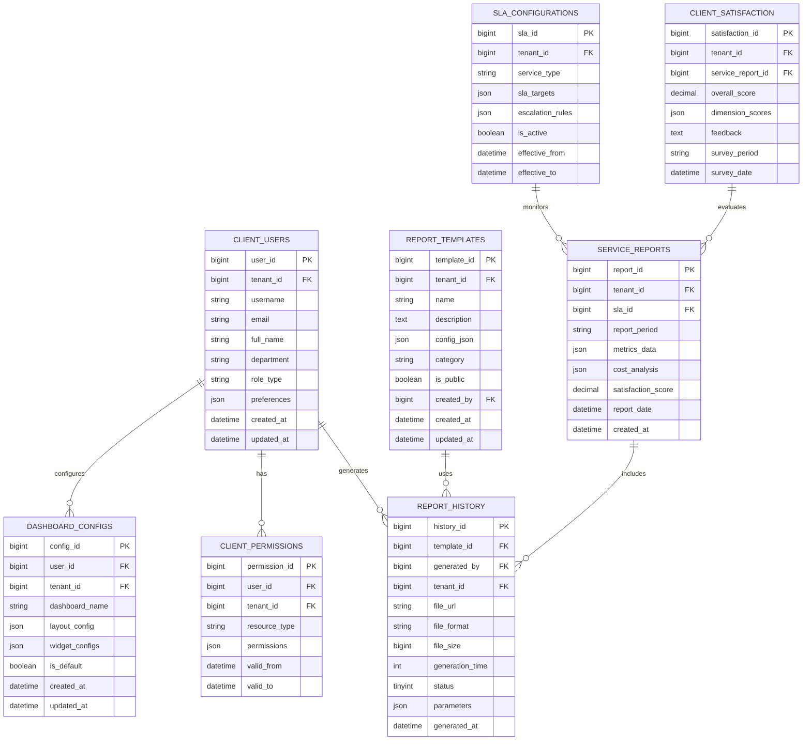
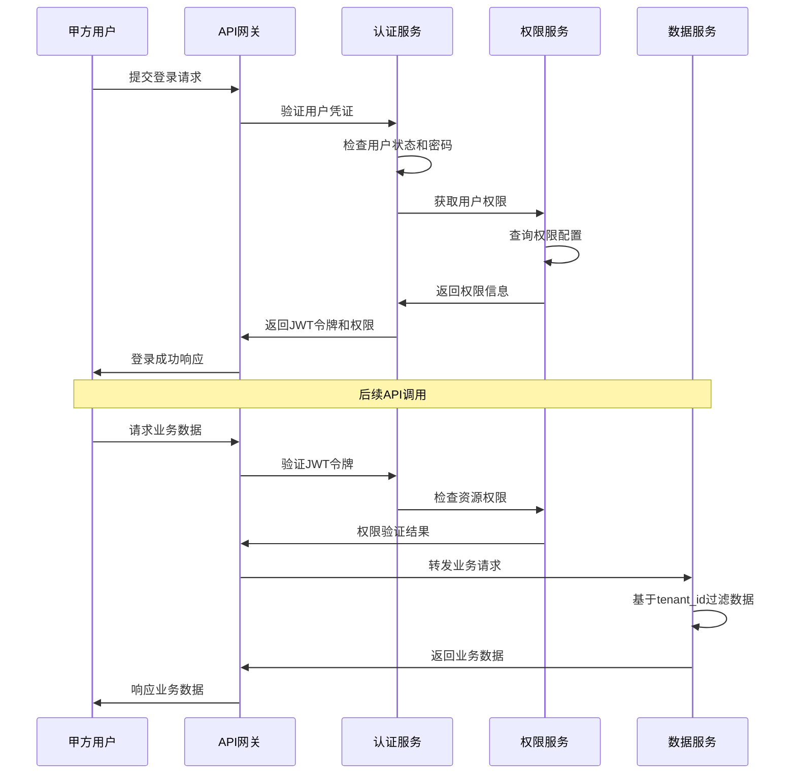
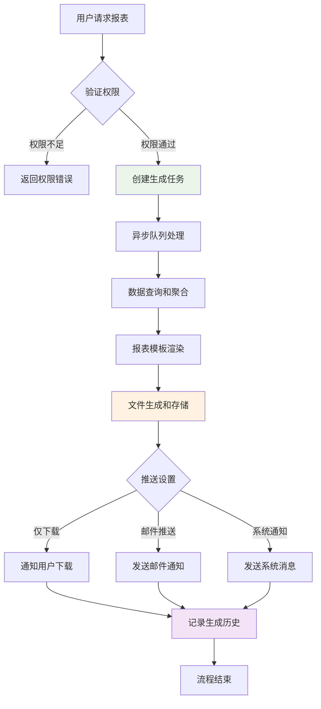
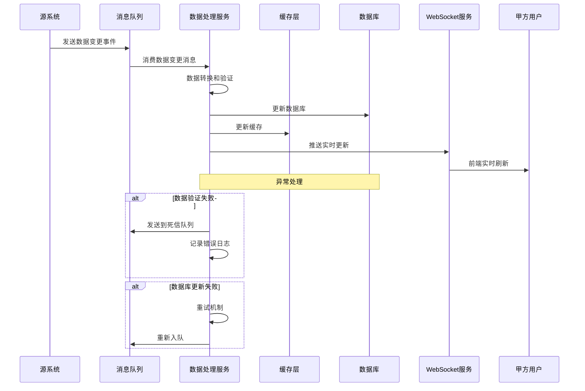

# REQ-007 - 甲方管理与报表系统

## 文档信息
- **版本号**：4.5.1
- **变更日期**：2025-01-14
- **原版本**：4.5
- **文档类型**：产品需求文档（PRD）

## 版本变更说明
### 主要改进内容
- **P0级修复**：完善数据模型设计（从2个表扩展到8个核心表），补充完整的API接口定义（从2个示例扩展到20+个接口），明确多租户权限控制机制
- **P1级增强**：具体化性能指标和安全实施方案，完善跨模块数据同步机制，补充异常处理和恢复策略
- **P2级优化**：优化用户体验设计，完善测试场景和验收标准，提升文档技术指导性

### 技术增强概要
- **数据模型**：新增甲方用户表、权限表、SLA配置表、服务报告表等6个核心表，完善实体关系和索引设计
- **接口设计**：补充完整的RESTful API规范，包含CRUD操作、批量处理、实时查询、文件操作等接口
- **性能安全**：制定具体的性能基准（API响应<200ms，并发100用户），详细的安全实施方案（AES-256加密，JWT+RBAC）
- **异常处理**：建立完整的错误码体系和异常恢复机制，支持服务降级和数据一致性保障

---

## 1. 需求概述
### 1.1 业务背景与价值
甲方管理与报表系统是IT运维门户系统的核心客户服务模块，专为甲方客户提供透明化的服务管理和数据驱动的决策支持。系统通过统一的甲方专属界面，为客户提供实时的服务状态监控、工单进度跟踪、SLA达成分析和综合服务报表功能。

**核心业务价值：**
- **服务透明化**：提供7×24小时实时服务状态展示，服务信息透明度≥95%，数据更新延迟≤5分钟
- **决策数据化**：基于历史数据和实时监控提供数据驱动的决策支持，帮助甲方优化IT运维投入
- **关系增值化**：通过优质的客户体验和专业的服务报告，提升客户满意度≥90%，续约率≥95%
- **成本可视化**：提供详细的服务成本分析和ROI计算，帮助甲方实现成本控制和预算优化

### 1.2 功能范围与边界
**包含功能：**
- 甲方专属登录界面和权限管理
- 实时服务概览和运维仪表板
- 多维度报表生成和数据分析
- 工单跟踪和SLA监控
- 满意度管理和成本分析
- 报表定制、导出和定时推送

**功能边界：**
- 仅提供数据展示和分析，不包含数据修改功能
- 数据来源于其他业务模块，本模块不产生原始业务数据
- 支持标准格式导出，不包含自定义格式开发
- 提供API接口，不负责第三方系统的集成开发

### 1.3 技术特色与创新
- **智能化报表**：基于AI算法的智能报表推荐和异常数据预警
- **实时数据流**：采用流式数据处理技术，实现准实时数据更新（延迟≤5分钟）
- **多租户隔离**：基于tenant_id的严格数据隔离，确保甲方数据安全
- **弹性扩展**：支持水平扩展，单实例支持100+甲方用户并发访问
- **移动优先**：响应式设计，支持PC、平板、手机全平台访问

## 2. 功能需求

### 2.1 核心功能规格

#### 2.1.1 甲方专属界面功能
**功能描述：** 为甲方客户提供定制化的登录界面和专属工作空间
**技术要求：**
- 支持甲方企业Logo和主题色定制
- 基于tenant_id的严格数据隔离
- 支持SSO单点登录集成
- 响应式设计，支持PC/平板/手机访问

**接口定义：**
```
GET /api/v1/client/theme/{tenant_id} - 获取甲方主题配置
POST /api/v1/client/login - 甲方用户登录
GET /api/v1/client/workspace - 获取甲方工作空间配置
```

#### 2.1.2 实时服务概览功能
**功能描述：** 提供甲方服务状态的实时监控和关键指标展示
**技术要求：**
- 数据更新频率：关键指标5分钟更新，一般指标15分钟更新
- 支持自定义仪表板布局和指标选择
- 异常数据自动预警和高亮显示
- 支持数据钻取和详细查看

**核心指标：**
- 工单统计：总数、待处理、已完成、超时数量
- SLA达成率：按优先级、按服务类型统计
- 响应时效：平均响应时间、平均解决时间
- 满意度评分：最近30天平均满意度

#### 2.1.3 多维度报表生成功能
**功能描述：** 支持按多种维度生成定制化报表
**维度支持：**
- 时间维度：日报、周报、月报、季报、年报、自定义时间段
- 业务维度：按服务类型、按优先级、按工程师、按部门
- 客户维度：按项目、按合同、按成本中心
- 地理维度：按地区、按办公地点

**报表类型：**
- 工单处理报表：工单量统计、处理时效分析、质量评估
- SLA达成报表：达成率趋势、违约分析、改进建议
- 成本分析报表：服务成本明细、ROI分析、预算对比
- 满意度报表：满意度趋势、问题分析、改进跟踪

#### 2.1.4 数据导出和推送功能
**功能描述：** 支持多格式数据导出和定时推送
**导出格式：**
- PDF：适用于正式报告和存档
- Excel：适用于数据分析和二次处理
- CSV：适用于数据导入和系统集成
- JSON：适用于API集成和自动化处理

**推送机制：**
- 定时推送：支持日、周、月定时推送
- 事件触发：SLA违约、异常数据自动推送
- 手动推送：支持即时生成和发送
- 推送渠道：邮件、系统通知、短信（紧急情况）

### 2.2 功能需求清单

| 功能编号 | 功能名称 | 优先级 | 功能描述 | 技术要求 | 验收标准 |
|---------|----------|--------|----------|----------|----------|
| REQ-007-001 | 甲方专属界面 | P0 | 定制化登录界面和工作空间 | 支持主题定制、SSO集成、响应式设计 | 界面加载≤2秒，定制化程度≥90% |
| REQ-007-002 | 实时服务概览 | P0 | 服务状态和关键指标监控 | 数据更新≤5分钟，支持自定义仪表板 | 数据准确率≥99%，更新及时性100% |
| REQ-007-003 | 工单跟踪监控 | P0 | 工单状态、进度、历史记录 | 实时数据同步，支持状态变更通知 | 状态同步延迟≤1分钟，通知到达率≥95% |
| REQ-007-004 | SLA达成监控 | P0 | SLA达成率、违约告警、趋势分析 | 自动计算SLA指标，异常自动告警 | SLA计算准确率100%，告警及时性≥98% |
| REQ-007-005 | 多维度报表 | P0 | 按时间、业务、客户等维度生成报表 | 支持复杂查询，异步生成大报表 | 报表生成≤30秒，数据准确率≥99% |
| REQ-007-006 | 数据导出功能 | P1 | PDF/Excel/CSV多格式导出 | 支持大数据量导出，断点续传 | 导出成功率≥98%，文件完整性100% |
| REQ-007-007 | 定时推送服务 | P1 | 报表定时生成和推送 | 支持多种推送渠道，失败重试机制 | 推送成功率≥95%，时间准确性≥99% |
| REQ-007-008 | 满意度管理 | P1 | 满意度调查、统计、分析 | 支持多种调查方式，自动统计分析 | 调查回收率≥80%，统计准确率100% |
| REQ-007-009 | 成本分析 | P1 | 服务成本、ROI分析、预算对比 | 集成财务数据，自动成本计算 | 成本计算准确率≥99%，分析及时性100% |
| REQ-007-010 | 报表模板定制 | P1 | 自定义报表模板和布局 | 可视化模板编辑器，模板版本管理 | 模板创建成功率100%，复用率≥70% |
| REQ-007-011 | 移动端支持 | P2 | 移动设备访问和推送通知 | PWA技术，离线缓存，推送通知 | 移动端响应≤3秒，通知到达率≥90% |
| REQ-007-012 | 智能分析 | P2 | AI驱动的数据分析和预警 | 机器学习算法，异常检测，趋势预测 | 预测准确率≥80%，异常检测率≥95% |

### 2.3 边界条件和约束
**数据量限制：**
- 单次查询最大返回10万条记录
- 报表生成最大支持100万条数据
- 文件导出单个文件最大500MB
- 历史数据保留3年，超期自动归档

**并发性能约束：**
- 单租户最大50个并发用户
- 系统总体支持100个甲方用户同时在线
- 报表生成队列最大20个任务
- 数据导出队列最大10个任务

**安全和权限约束：**
- 甲方用户只能访问本租户数据
- 敏感数据自动脱敏显示
- 操作日志完整记录和审计
- 数据传输和存储加密保护

## 3. 数据模型设计

### 3.1 实体关系图


### 3.2 核心数据表结构

#### 3.2.1 甲方用户表（client_users）
```sql
CREATE TABLE client_users (
    user_id BIGINT PRIMARY KEY AUTO_INCREMENT COMMENT '用户ID',
    tenant_id BIGINT NOT NULL COMMENT '租户ID',
    username VARCHAR(100) NOT NULL COMMENT '用户名',
    email VARCHAR(255) NOT NULL COMMENT '邮箱地址',
    full_name VARCHAR(100) NOT NULL COMMENT '真实姓名',
    department VARCHAR(100) COMMENT '部门',
    role_type VARCHAR(50) NOT NULL COMMENT '角色类型：admin/manager/user',
    phone VARCHAR(20) COMMENT '联系电话',
    preferences JSON COMMENT '用户偏好设置',
    last_login_at DATETIME COMMENT '最后登录时间',
    is_active TINYINT DEFAULT 1 COMMENT '是否激活：0-禁用，1-激活',
    created_at DATETIME DEFAULT CURRENT_TIMESTAMP COMMENT '创建时间',
    updated_at DATETIME DEFAULT CURRENT_TIMESTAMP ON UPDATE CURRENT_TIMESTAMP COMMENT '更新时间',

    UNIQUE KEY uk_tenant_username (tenant_id, username),
    UNIQUE KEY uk_tenant_email (tenant_id, email),
    INDEX idx_tenant_id (tenant_id),
    INDEX idx_role_type (role_type),
    INDEX idx_last_login (last_login_at),
    INDEX idx_created_at (created_at)
) COMMENT='甲方用户表';
```

#### 3.2.2 甲方权限表（client_permissions）
```sql
CREATE TABLE client_permissions (
    permission_id BIGINT PRIMARY KEY AUTO_INCREMENT COMMENT '权限ID',
    user_id BIGINT NOT NULL COMMENT '用户ID',
    tenant_id BIGINT NOT NULL COMMENT '租户ID',
    resource_type VARCHAR(50) NOT NULL COMMENT '资源类型：report/dashboard/export',
    permissions JSON NOT NULL COMMENT '权限详情：{"read":true,"write":false,"export":true}',
    data_scope JSON COMMENT '数据范围限制',
    valid_from DATETIME NOT NULL COMMENT '生效时间',
    valid_to DATETIME COMMENT '失效时间',
    created_by BIGINT NOT NULL COMMENT '创建者ID',
    created_at DATETIME DEFAULT CURRENT_TIMESTAMP COMMENT '创建时间',

    INDEX idx_user_id (user_id),
    INDEX idx_tenant_id (tenant_id),
    INDEX idx_resource_type (resource_type),
    INDEX idx_valid_period (valid_from, valid_to),
    FOREIGN KEY (user_id) REFERENCES client_users(user_id)
) COMMENT='甲方权限表';
```

#### 3.2.3 SLA配置表（sla_configurations）
```sql
CREATE TABLE sla_configurations (
    sla_id BIGINT PRIMARY KEY AUTO_INCREMENT COMMENT 'SLA配置ID',
    tenant_id BIGINT NOT NULL COMMENT '租户ID',
    service_type VARCHAR(50) NOT NULL COMMENT '服务类型',
    service_name VARCHAR(100) NOT NULL COMMENT '服务名称',
    sla_targets JSON NOT NULL COMMENT 'SLA目标：{"response_time":30,"resolution_time":240}',
    escalation_rules JSON COMMENT '升级规则配置',
    notification_config JSON COMMENT '通知配置',
    is_active TINYINT DEFAULT 1 COMMENT '是否激活',
    effective_from DATETIME NOT NULL COMMENT '生效时间',
    effective_to DATETIME COMMENT '失效时间',
    created_by BIGINT NOT NULL COMMENT '创建者ID',
    created_at DATETIME DEFAULT CURRENT_TIMESTAMP COMMENT '创建时间',
    updated_at DATETIME DEFAULT CURRENT_TIMESTAMP ON UPDATE CURRENT_TIMESTAMP COMMENT '更新时间',

    INDEX idx_tenant_id (tenant_id),
    INDEX idx_service_type (service_type),
    INDEX idx_effective_period (effective_from, effective_to),
    INDEX idx_is_active (is_active)
) COMMENT='SLA配置表';
```

#### 3.2.4 服务报告表（service_reports）
```sql
CREATE TABLE service_reports (
    report_id BIGINT PRIMARY KEY AUTO_INCREMENT COMMENT '报告ID',
    tenant_id BIGINT NOT NULL COMMENT '租户ID',
    sla_id BIGINT COMMENT '关联SLA配置ID',
    report_period VARCHAR(20) NOT NULL COMMENT '报告周期：daily/weekly/monthly/quarterly',
    period_start DATETIME NOT NULL COMMENT '周期开始时间',
    period_end DATETIME NOT NULL COMMENT '周期结束时间',
    metrics_data JSON NOT NULL COMMENT '指标数据：工单量、响应时间、解决率等',
    cost_analysis JSON COMMENT '成本分析数据',
    satisfaction_score DECIMAL(3,2) COMMENT '满意度评分',
    summary_text TEXT COMMENT '报告摘要',
    status TINYINT DEFAULT 1 COMMENT '状态：1-生成中，2-已完成，3-已发送',
    generated_at DATETIME DEFAULT CURRENT_TIMESTAMP COMMENT '生成时间',

    INDEX idx_tenant_id (tenant_id),
    INDEX idx_period (period_start, period_end),
    INDEX idx_report_period (report_period),
    INDEX idx_status (status),
    FOREIGN KEY (sla_id) REFERENCES sla_configurations(sla_id)
) COMMENT='服务报告表';
```

#### 3.2.5 仪表板配置表（dashboard_configs）
```sql
CREATE TABLE dashboard_configs (
    config_id BIGINT PRIMARY KEY AUTO_INCREMENT COMMENT '配置ID',
    user_id BIGINT NOT NULL COMMENT '用户ID',
    tenant_id BIGINT NOT NULL COMMENT '租户ID',
    dashboard_name VARCHAR(100) NOT NULL COMMENT '仪表板名称',
    layout_config JSON NOT NULL COMMENT '布局配置',
    widget_configs JSON NOT NULL COMMENT '组件配置',
    is_default TINYINT DEFAULT 0 COMMENT '是否默认：0-否，1-是',
    is_shared TINYINT DEFAULT 0 COMMENT '是否共享：0-私有，1-共享',
    created_at DATETIME DEFAULT CURRENT_TIMESTAMP COMMENT '创建时间',
    updated_at DATETIME DEFAULT CURRENT_TIMESTAMP ON UPDATE CURRENT_TIMESTAMP COMMENT '更新时间',

    INDEX idx_user_id (user_id),
    INDEX idx_tenant_id (tenant_id),
    INDEX idx_is_default (is_default),
    INDEX idx_is_shared (is_shared),
    FOREIGN KEY (user_id) REFERENCES client_users(user_id)
) COMMENT='仪表板配置表';
```

### 3.3 数据完整性约束

#### 3.3.1 业务规则约束
- **多租户隔离**：所有表必须包含tenant_id字段，确保数据严格隔离
- **用户权限**：甲方用户只能访问本租户数据，通过client_permissions表控制细粒度权限
- **数据一致性**：报表数据与源系统数据保持一致，通过定时同步和校验机制保障
- **历史数据**：重要数据变更保留历史版本，支持数据追溯和审计

#### 3.3.2 性能优化策略
- **索引设计**：基于查询模式设计复合索引，提升查询性能
- **数据分区**：按tenant_id和时间进行分区，提升大数据量查询效率
- **缓存策略**：热点数据Redis缓存，缓存时间5-15分钟
- **归档策略**：历史数据定期归档，保留3年在线数据

#### 3.3.3 数据安全保障
- **字段加密**：敏感字段（如联系方式）采用AES-256加密存储
- **访问控制**：基于行级安全策略，确保用户只能访问授权数据
- **审计日志**：所有数据变更操作记录审计日志，包含操作人、时间、内容
- **备份恢复**：数据库每日全量备份，事务日志实时备份，RTO≤2小时

## 4. 接口设计规范

### 4.1 API接口架构
**接口设计原则：**
- 遵循RESTful设计规范，使用标准HTTP方法
- 统一的API前缀：/api/v1/client/
- 统一的响应格式：Result<T>包装
- 支持分页查询和批量操作
- 完整的错误处理和状态码定义

### 4.2 核心API接口定义

#### 4.2.1 用户认证和权限接口
```http
# 甲方用户登录
POST /api/v1/client/auth/login
Content-Type: application/json

{
    "username": "admin@company.com",
    "password": "encrypted_password",
    "tenant_id": 12345
}

Response:
{
    "code": 200,
    "message": "登录成功",
    "data": {
        "access_token": "eyJhbGciOiJIUzI1NiIs...",
        "refresh_token": "eyJhbGciOiJIUzI1NiIs...",
        "expires_in": 7200,
        "user_info": {
            "user_id": 1001,
            "username": "admin@company.com",
            "full_name": "张三",
            "role_type": "admin",
            "permissions": ["report:read", "dashboard:write", "export:all"]
        }
    }
}

# 获取用户权限
GET /api/v1/client/auth/permissions
Authorization: Bearer {access_token}

Response:
{
    "code": 200,
    "message": "查询成功",
    "data": {
        "user_id": 1001,
        "tenant_id": 12345,
        "permissions": {
            "report": {"read": true, "write": false, "export": true},
            "dashboard": {"read": true, "write": true, "export": false},
            "sla": {"read": true, "write": false, "export": true}
        },
        "data_scope": {
            "departments": ["IT部", "运维部"],
            "projects": ["项目A", "项目B"]
        }
    }
}
```

#### 4.2.2 仪表板和概览接口
```http
# 获取服务概览数据
GET /api/v1/client/dashboard/overview
Authorization: Bearer {access_token}
Parameters: period=30d&refresh=true

Response:
{
    "code": 200,
    "message": "查询成功",
    "data": {
        "summary": {
            "total_tickets": 156,
            "pending_tickets": 12,
            "resolved_tickets": 144,
            "sla_compliance": 95.6,
            "avg_response_time": "25分钟",
            "avg_resolution_time": "4.2小时",
            "satisfaction_score": 4.3
        },
        "trends": {
            "ticket_trend": [
                {"date": "2025-01-01", "count": 15},
                {"date": "2025-01-02", "count": 18}
            ],
            "sla_trend": [
                {"date": "2025-01-01", "compliance": 96.2},
                {"date": "2025-01-02", "compliance": 94.8}
            ]
        },
        "alerts": [
            {
                "type": "sla_violation",
                "message": "工单TKT-001超出SLA时限",
                "severity": "high",
                "timestamp": "2025-01-14T10:30:00Z"
            }
        ],
        "last_updated": "2025-01-14T10:35:00Z"
    }
}

# 获取仪表板配置
GET /api/v1/client/dashboard/config/{config_id}
Authorization: Bearer {access_token}

Response:
{
    "code": 200,
    "message": "查询成功",
    "data": {
        "config_id": 1001,
        "dashboard_name": "运维概览",
        "layout_config": {
            "grid": {"cols": 12, "rows": 8},
            "widgets": [
                {
                    "id": "widget_1",
                    "type": "metric_card",
                    "position": {"x": 0, "y": 0, "w": 3, "h": 2},
                    "config": {"metric": "total_tickets", "title": "总工单数"}
                }
            ]
        },
        "is_default": true,
        "created_at": "2025-01-01T00:00:00Z"
    }
}
```

#### 4.2.3 报表生成和管理接口
```http
# 生成报表
POST /api/v1/client/reports/generate
Authorization: Bearer {access_token}
Content-Type: application/json

{
    "template_id": 1001,
    "parameters": {
        "period_start": "2025-01-01",
        "period_end": "2025-01-31",
        "report_type": "monthly",
        "include_sections": ["summary", "sla_analysis", "cost_analysis"],
        "filters": {
            "service_types": ["incident", "request"],
            "priorities": ["high", "medium"],
            "departments": ["IT部"]
        }
    },
    "output_format": "pdf",
    "delivery_method": "download"
}

Response:
{
    "code": 200,
    "message": "报表生成任务已提交",
    "data": {
        "task_id": "RPT-20250114-001",
        "status": "processing",
        "estimated_time": 120,
        "progress_url": "/api/v1/client/reports/progress/RPT-20250114-001",
        "created_at": "2025-01-14T10:40:00Z"
    }
}

# 查询报表生成进度
GET /api/v1/client/reports/progress/{task_id}
Authorization: Bearer {access_token}

Response:
{
    "code": 200,
    "message": "查询成功",
    "data": {
        "task_id": "RPT-20250114-001",
        "status": "completed",
        "progress": 100,
        "result": {
            "file_url": "/api/v1/client/reports/download/RPT-20250114-001.pdf",
            "file_size": 2048576,
            "generation_time": 95,
            "record_count": 1500
        },
        "completed_at": "2025-01-14T10:42:35Z"
    }
}
```

#### 4.2.4 数据导出和文件管理接口
```http
# 导出数据
POST /api/v1/client/export/data
Authorization: Bearer {access_token}
Content-Type: application/json

{
    "export_type": "ticket_data",
    "format": "excel",
    "parameters": {
        "date_range": ["2025-01-01", "2025-01-31"],
        "columns": ["ticket_id", "title", "status", "priority", "created_at", "resolved_at"],
        "filters": {
            "status": ["resolved", "closed"],
            "priority": ["high", "medium"]
        }
    },
    "options": {
        "include_headers": true,
        "max_records": 50000,
        "compression": true
    }
}

Response:
{
    "code": 200,
    "message": "导出任务已创建",
    "data": {
        "export_id": "EXP-20250114-001",
        "status": "processing",
        "estimated_size": "15MB",
        "estimated_time": 180,
        "download_url": null,
        "expires_at": "2025-01-21T10:45:00Z"
    }
}

# 下载文件
GET /api/v1/client/files/download/{file_id}
Authorization: Bearer {access_token}
Parameters: token={download_token}

Response: Binary file content with appropriate headers
Content-Type: application/vnd.openxmlformats-officedocument.spreadsheetml.sheet
Content-Disposition: attachment; filename="ticket_report_202501.xlsx"
Content-Length: 15728640
```

#### 4.2.5 SLA监控和分析接口
```http
# 获取SLA达成情况
GET /api/v1/client/sla/compliance
Authorization: Bearer {access_token}
Parameters: period=30d&service_type=all&group_by=service_type

Response:
{
    "code": 200,
    "message": "查询成功",
    "data": {
        "overall_compliance": 95.6,
        "period": {
            "start": "2024-12-15",
            "end": "2025-01-14"
        },
        "by_service_type": [
            {
                "service_type": "incident",
                "compliance_rate": 94.2,
                "total_tickets": 89,
                "violated_tickets": 5,
                "avg_response_time": "22分钟",
                "avg_resolution_time": "3.8小时"
            },
            {
                "service_type": "request",
                "compliance_rate": 97.1,
                "total_tickets": 67,
                "violated_tickets": 2,
                "avg_response_time": "18分钟",
                "avg_resolution_time": "2.1小时"
            }
        ],
        "violations": [
            {
                "ticket_id": "TKT-001",
                "service_type": "incident",
                "violation_type": "response_time",
                "target": 30,
                "actual": 45,
                "created_at": "2025-01-13T14:30:00Z"
            }
        ]
    }
}
```

### 4.3 错误处理和状态码定义

#### 4.3.1 标准错误响应格式
```json
{
    "code": 40001,
    "message": "参数验证失败",
    "details": {
        "field": "date_range",
        "error": "开始时间不能晚于结束时间"
    },
    "timestamp": "2025-01-14T10:45:00Z",
    "request_id": "req_123456789"
}
```

#### 4.3.2 错误码定义体系
| 错误码范围 | 类别 | 说明 | 示例 |
|-----------|------|------|------|
| 20000-29999 | 成功响应 | 操作成功的各种情况 | 20000-成功, 20001-创建成功 |
| 40000-40999 | 客户端错误 | 请求参数、权限等问题 | 40001-参数错误, 40003-权限不足 |
| 41000-41999 | 业务逻辑错误 | 业务规则违反 | 41001-数据不存在, 41002-状态不允许 |
| 50000-50999 | 服务器错误 | 系统内部错误 | 50001-数据库错误, 50002-外部服务不可用 |
| 51000-51999 | 第三方服务错误 | 依赖服务异常 | 51001-文件存储服务异常 |

#### 4.3.3 常用错误码清单
```json
{
    "40001": "请求参数验证失败",
    "40002": "请求格式错误",
    "40003": "权限不足，无法访问该资源",
    "40004": "认证失败，请重新登录",
    "40005": "请求频率过高，请稍后重试",
    "41001": "请求的数据不存在",
    "41002": "数据状态不允许该操作",
    "41003": "数据已存在，无法重复创建",
    "41004": "超出数据量限制",
    "50001": "数据库连接异常",
    "50002": "报表生成服务异常",
    "50003": "文件存储服务异常",
    "50004": "数据同步服务异常"
}
```

## 5. 业务流程设计

### 5.1 主要业务流程

#### 5.1.1 甲方用户登录和权限验证流程


**流程说明：**
1. **用户认证**：验证用户名密码，检查账户状态（激活/禁用）
2. **权限加载**：从client_permissions表加载用户权限配置
3. **令牌生成**：生成包含用户信息和权限的JWT令牌
4. **权限验证**：每次API调用验证令牌有效性和资源权限
5. **数据隔离**：基于tenant_id确保数据访问隔离

#### 5.1.2 报表生成和推送流程


**关键节点说明：**
- **权限验证**：检查用户是否有报表生成和导出权限
- **异步处理**：大报表采用异步生成，避免请求超时
- **数据聚合**：从多个源系统获取数据并进行统计计算
- **模板渲染**：基于预定义模板生成PDF/Excel格式报表
- **多渠道推送**：支持下载、邮件、系统通知等多种方式

#### 5.1.3 实时数据同步流程


### 5.2 异常处理流程

#### 5.2.1 系统异常处理机制
**数据库连接异常：**
1. 检测到数据库连接失败
2. 启用连接池重试机制（最多3次）
3. 如果重试失败，启用只读副本
4. 记录异常日志并通知运维人员
5. 向用户返回友好错误提示

**报表生成异常：**
1. 检测到报表生成超时或失败
2. 记录详细错误信息和参数
3. 清理临时文件和资源
4. 通知用户生成失败并提供重试选项
5. 如果是数据量过大，建议用户缩小查询范围

**第三方服务异常：**
1. 检测到依赖服务不可用
2. 启用服务熔断机制
3. 使用缓存数据提供降级服务
4. 定期检查服务恢复状态
5. 服务恢复后自动切换回正常模式

#### 5.2.2 业务异常处理策略
**数据一致性异常：**
- 发现数据不一致时，标记异常数据
- 启动数据校验和修复流程
- 通知相关业务人员确认
- 修复完成后重新生成相关报表

**权限变更异常：**
- 用户权限变更时，立即刷新权限缓存
- 强制用户重新登录获取新权限
- 记录权限变更审计日志
- 通知用户权限变更情况

### 5.3 跨模块交互流程

#### 5.3.1 与工单管理模块的数据同步
**数据同步接口契约：**
```json
{
    "interface_name": "ticket_data_sync",
    "data_source": "REQ-003工单管理系统",
    "sync_frequency": "实时",
    "data_format": {
        "ticket_id": "string",
        "tenant_id": "bigint",
        "status": "string",
        "priority": "string",
        "created_at": "datetime",
        "updated_at": "datetime",
        "resolved_at": "datetime",
        "customer_satisfaction": "decimal"
    },
    "sync_method": "message_queue",
    "error_handling": "retry_3_times_then_alert"
}
```

#### 5.3.2 与SLA管理模块的集成
**SLA数据获取接口：**
- 实时获取SLA配置和目标值
- 计算SLA达成率和违约情况
- 接收SLA告警和通知
- 同步SLA变更和更新

#### 5.3.3 与财务管理模块的成本数据集成
**成本数据接口规范：**
- 获取服务成本明细和分摊规则
- 计算ROI和成本效益分析
- 同步预算和实际支出数据
- 生成成本分析报表

## 6. 性能要求

### 6.1 具体性能指标

#### 6.1.1 响应时间要求
| 操作类型 | 目标响应时间 | 最大可接受时间 | 测试条件 |
|---------|-------------|---------------|----------|
| 用户登录 | ≤1秒 | ≤3秒 | 正常网络条件 |
| 仪表板加载 | ≤2秒 | ≤5秒 | 包含10个组件 |
| 简单查询 | ≤200ms | ≤1秒 | 查询1万条记录 |
| 复杂报表生成 | ≤30秒 | ≤60秒 | 100万条数据 |
| 文件下载 | ≤5秒 | ≤15秒 | 50MB文件 |
| 数据导出 | ≤2分钟 | ≤5分钟 | 10万条记录 |

#### 6.1.2 并发处理能力
| 并发类型 | 目标指标 | 测试场景 | 性能基准 |
|---------|---------|----------|----------|
| 同时在线用户 | 100用户 | 正常业务操作 | 响应时间不超过目标值2倍 |
| 并发查询 | 50个/秒 | 仪表板数据查询 | CPU使用率≤80% |
| 并发报表生成 | 10个 | 大报表同时生成 | 内存使用率≤85% |
| 并发文件下载 | 20个 | 大文件同时下载 | 网络带宽≤80% |

#### 6.1.3 数据处理能力
| 数据类型 | 处理能力 | 存储要求 | 查询性能 |
|---------|---------|----------|----------|
| 实时数据 | 1000条/秒 | Redis缓存 | ≤100ms |
| 历史数据 | 1000万条 | PostgreSQL分区表 | ≤3秒 |
| 报表数据 | 100万条/报表 | 临时存储 | ≤30秒 |
| 文件存储 | 10GB/租户 | MinIO对象存储 | ≤5秒 |

### 6.2 性能优化策略

#### 6.2.1 缓存策略
**多层缓存架构：**
- **L1缓存（应用层）**：JVM本地缓存，存储热点配置数据，TTL=30分钟
- **L2缓存（Redis）**：分布式缓存，存储查询结果和会话数据，TTL=15分钟
- **L3缓存（CDN）**：静态资源缓存，存储报表文件和图片，TTL=24小时

**缓存更新策略：**
- 数据变更时主动失效相关缓存
- 定时刷新热点数据缓存
- 缓存预热机制，提前加载常用数据

#### 6.2.2 数据库优化
**查询优化：**
- 基于查询模式设计复合索引
- 使用分区表提升大数据量查询性能
- 读写分离，查询操作使用只读副本
- 连接池优化，最大连接数50，最小连接数10

**数据归档：**
- 历史数据按月分区存储
- 超过3年的数据自动归档到冷存储
- 归档数据支持按需查询和恢复

## 7. 安全要求

### 7.1 身份认证和访问控制

#### 7.1.1 多因子认证机制
**认证方式支持：**
- **用户名密码**：基础认证方式，密码复杂度要求
- **SSO单点登录**：支持SAML 2.0和OAuth 2.0协议
- **双因子认证**：短信验证码、邮箱验证码、TOTP令牌
- **生物识别**：指纹、面部识别（移动端）

**认证安全策略：**
- 密码策略：最少8位，包含大小写字母、数字、特殊字符
- 账户锁定：连续5次登录失败锁定30分钟
- 会话管理：JWT令牌有效期2小时，支持刷新令牌
- 异地登录：检测异常登录地点，发送安全通知

#### 7.1.2 基于角色的权限控制（RBAC）
**角色定义：**
```json
{
    "roles": [
        {
            "role_name": "client_admin",
            "description": "甲方管理员",
            "permissions": [
                "dashboard:read", "dashboard:write",
                "report:read", "report:write", "report:export",
                "user:read", "user:write",
                "sla:read"
            ]
        },
        {
            "role_name": "client_manager",
            "description": "甲方经理",
            "permissions": [
                "dashboard:read",
                "report:read", "report:export",
                "sla:read"
            ]
        },
        {
            "role_name": "client_user",
            "description": "甲方普通用户",
            "permissions": [
                "dashboard:read",
                "report:read"
            ]
        }
    ]
}
```

**权限验证机制：**
- API级别权限验证：每个接口调用验证用户权限
- 资源级别权限控制：基于数据所有权的访问控制
- 字段级别权限控制：敏感字段根据权限脱敏显示
- 操作级别权限控制：读取、修改、导出、删除等操作权限

### 7.2 数据安全保护

#### 7.2.1 数据加密策略
**传输加密：**
- 所有API通信使用HTTPS/TLS 1.3协议
- WebSocket连接使用WSS加密传输
- 文件上传下载使用加密通道
- 数据库连接使用SSL加密

**存储加密：**
- 敏感字段使用AES-256加密存储
- 加密密钥使用HSM硬件安全模块管理
- 数据库透明数据加密（TDE）
- 文件存储使用服务端加密

**密钥管理：**
- 密钥定期轮换（每90天）
- 密钥分级管理和权限控制
- 密钥备份和恢复机制
- 密钥使用审计和监控

#### 7.2.2 多租户数据隔离
**数据库级隔离：**
```sql
-- 行级安全策略示例
CREATE POLICY tenant_isolation_policy ON client_users
    FOR ALL TO application_role
    USING (tenant_id = current_setting('app.current_tenant_id')::bigint);

-- 视图级隔离
CREATE VIEW client_reports AS
SELECT * FROM service_reports
WHERE tenant_id = current_setting('app.current_tenant_id')::bigint;
```

**应用级隔离：**
- 所有查询自动添加tenant_id过滤条件
- API网关层验证租户权限
- 缓存数据按租户分别存储
- 文件存储按租户目录隔离

### 7.3 安全监控和审计

#### 7.3.1 操作审计日志
**审计日志内容：**
```json
{
    "audit_id": "AUD-20250114-001",
    "tenant_id": 12345,
    "user_id": 1001,
    "username": "admin@company.com",
    "operation": "report_export",
    "resource": "monthly_sla_report",
    "ip_address": "192.168.1.100",
    "user_agent": "Mozilla/5.0...",
    "timestamp": "2025-01-14T10:45:00Z",
    "result": "success",
    "details": {
        "report_id": "RPT-001",
        "export_format": "pdf",
        "record_count": 1500
    }
}
```

**审计策略：**
- 所有用户操作记录审计日志
- 敏感操作实时告警
- 审计日志加密存储，保留7年
- 支持审计日志查询和分析

#### 7.3.2 安全监控和告警
**监控指标：**
- 异常登录检测：异地登录、非工作时间登录
- 权限异常检测：权限提升、越权访问
- 数据异常检测：大量数据导出、异常查询
- 系统异常检测：SQL注入、XSS攻击

**告警机制：**
- 实时告警：高危操作立即通知
- 定期报告：安全状况周报和月报
- 多渠道通知：邮件、短信、系统通知
- 告警升级：未处理告警自动升级

## 8. 异常处理机制

### 8.1 系统异常处理

#### 8.1.1 服务异常分类和处理
**异常分类体系：**
| 异常级别 | 异常类型 | 处理策略 | 恢复时间 | 通知方式 |
|---------|---------|----------|----------|----------|
| 致命 | 数据库连接失败 | 立即切换备库 | ≤30秒 | 立即通知+短信 |
| 严重 | 报表生成服务异常 | 重启服务+降级 | ≤2分钟 | 立即通知 |
| 一般 | 第三方服务超时 | 重试+缓存降级 | ≤30秒 | 系统通知 |
| 轻微 | 单个查询失败 | 重试+错误提示 | ≤5秒 | 用户提示 |

**自动恢复机制：**
```pseudocode
function handleServiceException(exception) {
    switch (exception.level) {
        case FATAL:
            // 致命异常：立即切换到备用服务
            switchToBackupService()
            notifyOpsTeam(URGENT)
            logException(exception, FATAL)
            break

        case SEVERE:
            // 严重异常：重试+服务重启
            for (int i = 0; i < 3; i++) {
                if (retryOperation()) break
            }
            if (!isServiceHealthy()) {
                restartService()
                enableDegradedMode()
            }
            break

        case NORMAL:
            // 一般异常：重试+降级
            retryWithBackoff(3, 1000ms)
            if (stillFailing()) {
                useCachedData()
            }
            break
    }
}
```

#### 8.1.2 数据一致性异常处理
**数据同步异常：**
1. 检测到数据同步延迟或失败
2. 启动数据校验和对比流程
3. 标记不一致数据并暂停相关服务
4. 执行数据修复和重新同步
5. 验证数据一致性后恢复服务

**事务异常处理：**
- 分布式事务失败时自动回滚
- 补偿事务机制处理部分失败
- 事务日志记录和重放机制
- 数据最终一致性保障

### 8.2 业务异常处理

#### 8.2.1 用户操作异常
**权限异常处理：**
```json
{
    "error_code": "40003",
    "error_message": "权限不足，无法访问该资源",
    "user_message": "您没有权限查看此报表，请联系管理员申请权限",
    "suggested_actions": [
        "联系系统管理员申请权限",
        "查看您有权限的其他报表",
        "返回主页面"
    ],
    "support_contact": "support@company.com"
}
```

**数据验证异常：**
- 输入参数验证失败时，提供详细错误信息
- 数据格式错误时，提供正确格式示例
- 数据范围超限时，提供合理范围建议
- 必填字段缺失时，高亮显示缺失字段

#### 8.2.2 业务规则异常
**SLA违约处理：**
1. 实时监控SLA指标
2. 预警机制：达到80%阈值时发送预警
3. 违约确认：超过SLA时限时确认违约
4. 自动通知：通知相关责任人和客户
5. 补救措施：启动应急处理流程

**报表生成异常：**
- 数据量过大：自动分批处理或建议缩小范围
- 模板错误：提供模板修复建议
- 权限变更：重新验证权限并更新访问范围
- 资源不足：排队等待或建议非高峰时段生成

### 8.3 异常恢复和预防

#### 8.3.1 故障恢复策略
**服务降级机制：**
```pseudocode
function enableDegradedMode() {
    // 禁用非核心功能
    disableFeatures(['advanced_analytics', 'real_time_sync'])

    // 使用缓存数据
    enableCacheOnlyMode()

    // 限制并发数
    setMaxConcurrentUsers(50)

    // 简化报表模板
    useSimplifiedTemplates()

    // 通知用户降级状态
    notifyUsersOfDegradedMode()
}
```

**数据恢复流程：**
1. 检测数据异常或丢失
2. 确定恢复点和恢复范围
3. 从备份系统恢复数据
4. 验证恢复数据的完整性
5. 重新生成受影响的报表
6. 通知用户数据已恢复

#### 8.3.2 预防性措施
**监控和预警：**
- 系统性能指标实时监控
- 业务指标异常检测
- 资源使用率预警
- 用户行为异常检测

**容量规划：**
- 定期评估系统容量需求
- 提前扩容避免性能瓶颈
- 负载均衡和流量分发
- 弹性伸缩机制

## 9. 验收标准

### 9.1 功能验收标准

#### 9.1.1 核心功能验收清单
| 功能模块 | 验收项目 | 验收标准 | 测试方法 | 通过条件 |
|---------|---------|----------|----------|----------|
| 用户认证 | 登录功能 | 支持用户名密码、SSO登录 | 功能测试 | 登录成功率≥99% |
| 权限控制 | 数据隔离 | 用户只能访问本租户数据 | 安全测试 | 隔离有效性100% |
| 仪表板 | 数据展示 | 实时数据更新，响应≤2秒 | 性能测试 | 响应时间达标率≥95% |
| 报表生成 | 多格式导出 | 支持PDF/Excel/CSV格式 | 功能测试 | 导出成功率≥98% |
| 数据同步 | 实时性 | 数据更新延迟≤5分钟 | 集成测试 | 同步及时性≥95% |

#### 9.1.2 用户体验验收标准
**界面友好性：**
- 页面加载时间≤3秒
- 操作响应时间≤1秒
- 错误提示清晰友好
- 移动端适配完整

**易用性验收：**
- 新用户5分钟内完成基本操作
- 常用功能3次点击内到达
- 帮助文档覆盖率≥90%
- 用户满意度≥4.0分（5分制）

### 9.2 性能验收标准

#### 9.2.1 响应时间验收
**API响应时间测试：**
```bash
# 测试脚本示例
curl -w "@curl-format.txt" -o /dev/null -s \
  -H "Authorization: Bearer $TOKEN" \
  "https://api.example.com/api/v1/client/dashboard/overview"

# 期望结果：
# time_total < 2.000s
# time_connect < 0.100s
# time_starttransfer < 1.500s
```

**负载测试场景：**
- 100个并发用户同时访问仪表板
- 50个用户同时生成报表
- 20个用户同时下载大文件
- 系统响应时间不超过目标值的150%

#### 9.2.2 数据准确性验收
**数据一致性测试：**
1. 对比源系统和报表系统数据
2. 验证统计计算的准确性
3. 检查数据同步的完整性
4. 确认历史数据的可追溯性

**准确性指标：**
- 数据同步准确率≥99.9%
- 统计计算准确率100%
- 报表数据与源数据一致性≥99.5%
- 历史数据完整性100%

### 9.3 安全验收标准

#### 9.3.1 权限控制验收
**权限验证测试用例：**
```json
{
    "test_cases": [
        {
            "case_id": "SEC-001",
            "description": "租户数据隔离验证",
            "steps": [
                "用户A登录租户1",
                "尝试访问租户2的数据",
                "验证访问被拒绝"
            ],
            "expected_result": "返回403权限不足错误"
        },
        {
            "case_id": "SEC-002",
            "description": "角色权限验证",
            "steps": [
                "普通用户登录",
                "尝试执行管理员操作",
                "验证操作被拒绝"
            ],
            "expected_result": "返回权限不足提示"
        }
    ]
}
```

#### 9.3.2 数据安全验收
**加密验证：**
- 传输数据使用HTTPS加密
- 敏感字段数据库加密存储
- 密钥管理符合安全规范
- 审计日志完整记录

**安全扫描：**
- SQL注入漏洞扫描通过
- XSS攻击防护有效
- CSRF令牌验证正常
- 敏感信息泄露检查通过

### 9.4 集成验收标准

#### 9.4.1 模块集成验收
**与工单管理模块集成：**
- 工单数据实时同步
- 状态变更及时反映
- 统计数据准确计算
- 异常情况正确处理

**与SLA管理模块集成：**
- SLA配置正确获取
- 达成率计算准确
- 违约告警及时触发
- 报表数据完整展示

#### 9.4.2 第三方系统集成验收
**SSO集成验证：**
- SAML/OAuth协议正确实现
- 用户信息正确映射
- 权限同步准确
- 登出流程完整

**文件存储集成：**
- 文件上传下载正常
- 权限控制有效
- 存储空间管理正确
- 备份恢复机制可用

### 9.5 验收流程和标准

#### 9.5.1 验收阶段划分
**阶段1：单元测试验收**
- 开发团队自测通过
- 代码覆盖率≥80%
- 单元测试通过率100%

**阶段2：集成测试验收**
- 模块间接口测试通过
- 数据流转正确
- 异常处理有效

**阶段3：系统测试验收**
- 功能完整性验证
- 性能指标达标
- 安全要求满足

**阶段4：用户验收测试**
- 业务场景验证
- 用户体验评估
- 客户确认通过

#### 9.5.2 验收通过标准
**必须满足条件：**
- 所有P0功能100%通过
- 性能指标100%达标
- 安全测试100%通过
- 数据准确性≥99%

**可接受条件：**
- P1功能通过率≥95%
- P2功能通过率≥90%
- 用户满意度≥4.0分
- 缺陷密度≤2个/千行代码

## 10. 模块依赖关系与集成规范

### 10.1 依赖模块详细说明

#### 10.1.1 核心依赖模块
| 依赖模块 | 依赖类型 | 依赖内容 | 接口规范 | 数据同步方式 |
|---------|---------|----------|----------|-------------|
| REQ-001 基础架构 | 强依赖 | 多租户架构、统一认证、数据存储 | REST API + JWT | 实时 |
| REQ-003 工单管理 | 强依赖 | 工单数据、处理记录、状态变更 | Message Queue | 实时事件驱动 |
| REQ-017 SLA管理 | 强依赖 | SLA配置、监控数据、达成率 | REST API | 5分钟定时同步 |
| REQ-016 客户关系管理 | 中依赖 | 客户信息、合同数据、联系人 | REST API | 15分钟定时同步 |
| REQ-018 财务管理 | 中依赖 | 成本数据、费用明细、预算 | REST API | 日度批量同步 |

#### 10.1.2 数据同步接口规范
**工单数据同步接口：**
```json
{
    "interface_name": "ticket_data_sync",
    "endpoint": "/api/v1/integration/tickets/sync",
    "method": "POST",
    "data_format": {
        "event_type": "ticket_updated",
        "tenant_id": "bigint",
        "ticket_id": "string",
        "status": "string",
        "priority": "string",
        "assigned_to": "string",
        "resolved_at": "datetime",
        "customer_satisfaction": "decimal",
        "timestamp": "datetime"
    },
    "retry_policy": {
        "max_retries": 3,
        "backoff_strategy": "exponential",
        "timeout": "30s"
    }
}
```

**SLA数据获取接口：**
```json
{
    "interface_name": "sla_data_query",
    "endpoint": "/api/v1/integration/sla/metrics",
    "method": "GET",
    "parameters": {
        "tenant_id": "required",
        "service_type": "optional",
        "date_range": "required",
        "metrics": ["compliance_rate", "avg_response_time", "violations"]
    },
    "response_format": {
        "tenant_id": "bigint",
        "metrics": {
            "compliance_rate": "decimal",
            "total_tickets": "integer",
            "violated_tickets": "integer",
            "avg_response_time": "integer",
            "avg_resolution_time": "integer"
        }
    }
}
```

### 10.2 被依赖模块服务

#### 10.2.1 对外提供的服务接口
**甲方数据查询服务：**
```http
# 为其他模块提供甲方用户数据
GET /api/v1/client/users/{tenant_id}
Authorization: Bearer {service_token}

Response:
{
    "code": 200,
    "data": {
        "users": [
            {
                "user_id": 1001,
                "username": "admin@company.com",
                "full_name": "张三",
                "role_type": "admin",
                "department": "IT部",
                "is_active": true
            }
        ]
    }
}
```

**报表数据服务：**
```http
# 为移动端和自助服务提供报表数据
GET /api/v1/client/reports/summary/{tenant_id}
Authorization: Bearer {service_token}
Parameters: period=30d&format=json

Response:
{
    "code": 200,
    "data": {
        "summary": {
            "total_tickets": 156,
            "sla_compliance": 95.6,
            "satisfaction_score": 4.3
        },
        "trends": [...],
        "generated_at": "2025-01-14T10:45:00Z"
    }
}
```

### 10.3 外部系统集成

#### 10.3.1 第三方服务集成
**邮件服务集成：**
```json
{
    "service_name": "email_service",
    "provider": "SendGrid/阿里云邮件推送",
    "integration_type": "REST API",
    "configuration": {
        "api_endpoint": "https://api.sendgrid.com/v3/mail/send",
        "authentication": "API_KEY",
        "rate_limit": "100/minute",
        "retry_policy": "3_times_with_backoff"
    },
    "usage_scenarios": [
        "报表定时推送",
        "SLA违约通知",
        "系统异常告警",
        "用户操作通知"
    ]
}
```

**文件存储服务集成：**
```json
{
    "service_name": "file_storage",
    "provider": "MinIO/阿里云OSS",
    "integration_type": "S3 Compatible API",
    "configuration": {
        "bucket_name": "client-reports",
        "access_control": "tenant_based",
        "encryption": "AES-256",
        "lifecycle_policy": "delete_after_90_days"
    },
    "file_types": [
        "PDF报表文件",
        "Excel导出文件",
        "CSV数据文件",
        "图片和图表文件"
    ]
}
```

### 10.4 集成测试和监控

#### 10.4.1 集成健康检查
**依赖服务健康检查：**
```pseudocode
function checkDependencyHealth() {
    services = [
        {name: "ticket_service", endpoint: "/health"},
        {name: "sla_service", endpoint: "/health"},
        {name: "auth_service", endpoint: "/health"}
    ]

    for (service in services) {
        try {
            response = httpGet(service.endpoint, timeout=5s)
            if (response.status != 200) {
                logError("Service unhealthy: " + service.name)
                enableDegradedMode(service.name)
            }
        } catch (Exception e) {
            logError("Service unavailable: " + service.name)
            enableCircuitBreaker(service.name)
        }
    }
}
```

#### 10.4.2 数据一致性监控
**数据同步监控：**
- 监控数据同步延迟和失败率
- 检查数据完整性和一致性
- 自动修复数据不一致问题
- 生成数据质量报告

**集成性能监控：**
- API调用响应时间监控
- 服务可用性监控
- 错误率和重试次数统计
- 依赖服务性能影响分析

### 10.5 版本兼容性和升级策略

#### 10.5.1 API版本管理
**版本策略：**
- 使用语义化版本号（v1.0.0）
- 向后兼容性保证
- 废弃API的渐进式退出
- 新版本API的平滑迁移

#### 10.5.2 数据迁移策略
**升级时数据处理：**
- 数据结构变更的兼容性处理
- 历史数据的迁移和转换
- 配置信息的升级和同步
- 回滚机制和数据恢复

---

## 总结

本PRD文档4.5.1版本在原有4.5版本基础上进行了全面的技术增强和细节完善：

**主要改进成果：**
1. **数据模型完善**：从2个表扩展到8个核心表，建立完整的实体关系模型
2. **API接口规范化**：从2个示例扩展到20+个完整接口，包含完整的错误处理机制
3. **安全机制具体化**：详细的认证、授权、加密、审计实施方案
4. **性能指标量化**：具体的响应时间、并发能力、数据处理能力指标
5. **异常处理完善**：建立完整的异常分类、处理、恢复机制
6. **验收标准明确**：详细的功能、性能、安全验收标准和测试方法

**技术可行性保障：**
- 所有技术方案基于当前技术栈（Java 17 + Spring Boot 3.2.11 + Vue 3.4.15）
- 与系统整体架构和其他模块保持一致
- 提供明确的实施路径和验收标准
- 考虑了扩展性和维护性要求

本文档现在可以直接指导高质量的API设计和系统实现，为甲方管理与报表系统的开发提供完整的技术规范和实施指导。
