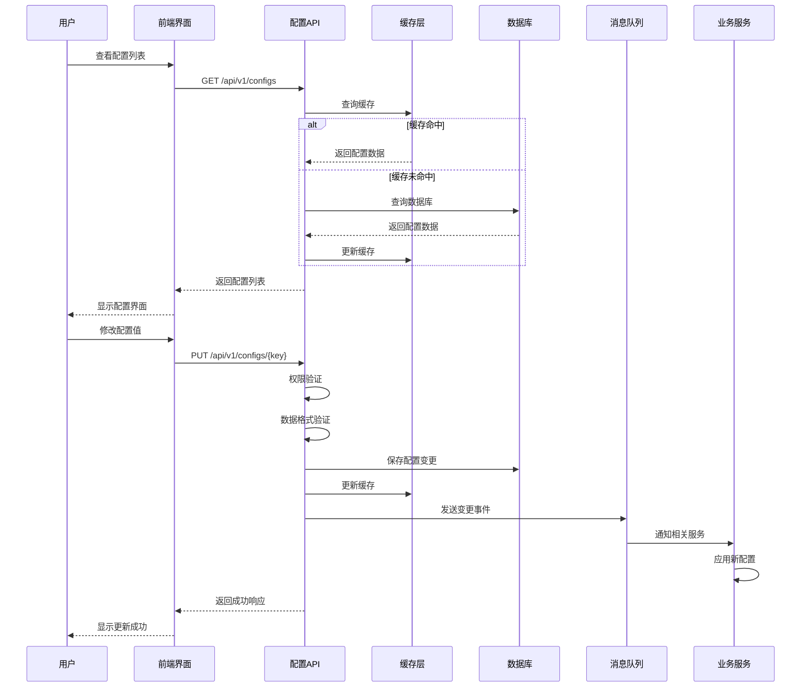
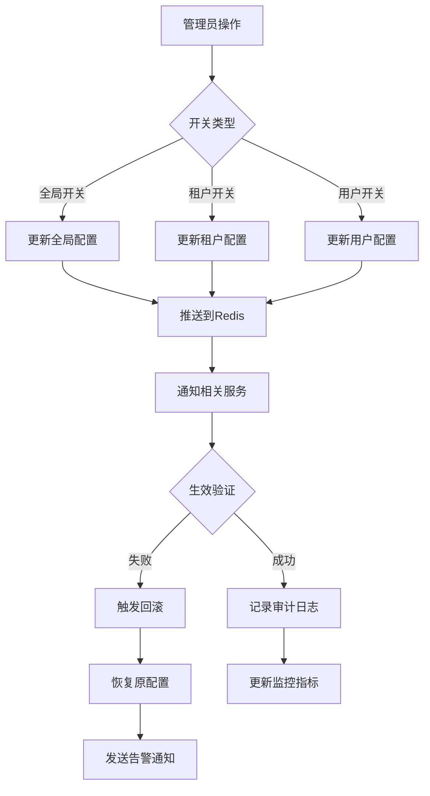
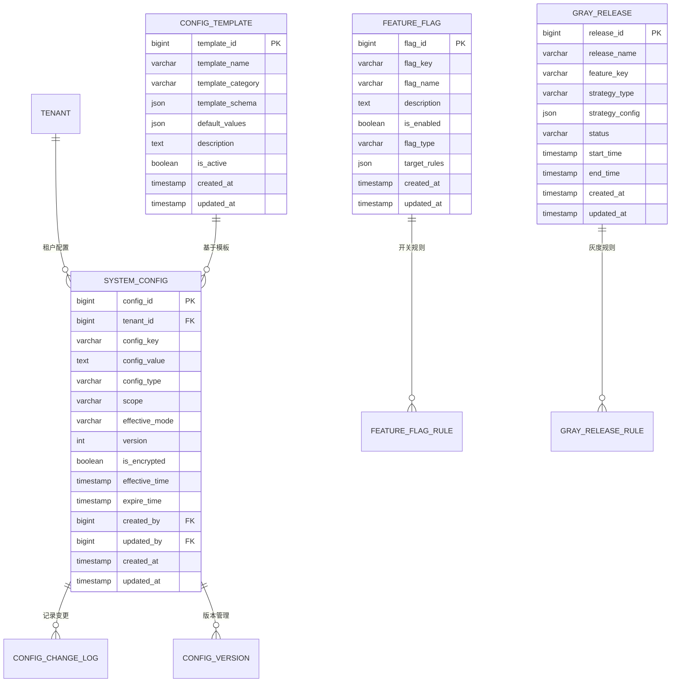
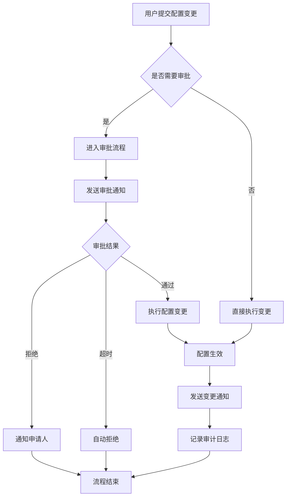
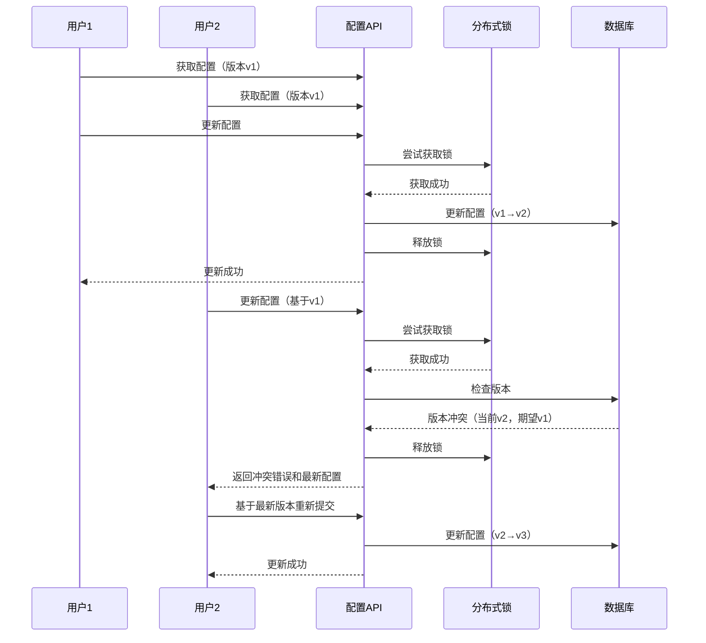
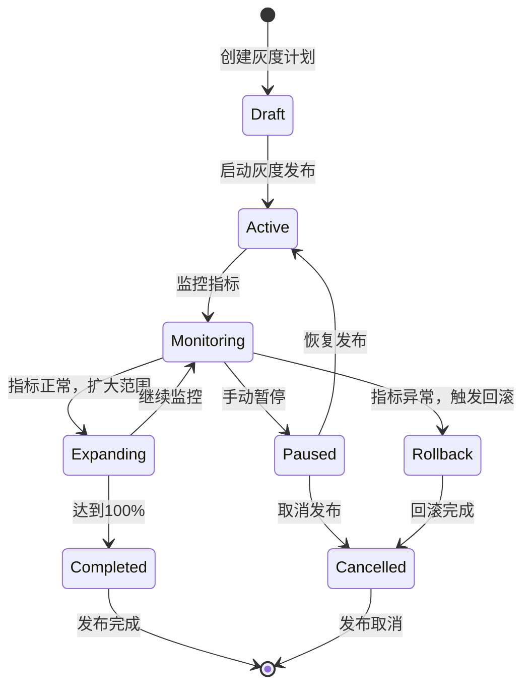
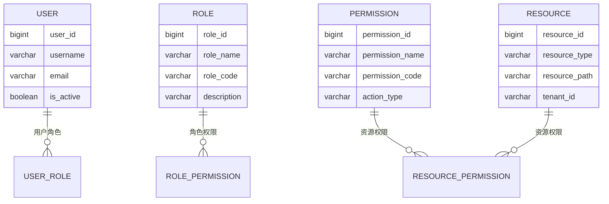

# REQ-008: 系统设置

## 文档信息
- **版本号**：4.5.1
- **变更日期**：2024-08-14
- **原版本**：4.5
- **文档类型**：产品需求文档（PRD）

## 版本变更说明

### 主要改进内容
- **P0级修复**：明确模块边界，解决与REQ-010和REQ-001的功能重复问题
- **P1级增强**：完善数据模型设计，补充缺失的实体关系和约束条件
- **P2级优化**：优化API接口设计，增强配置管理的技术实现细节

### 技术增强概要
- **数据模型**：新增配置模板、功能开关、灰度策略等核心实体，完善索引设计
- **接口设计**：补充完整的RESTful API规范，明确请求/响应格式和错误处理
- **性能安全**：具体化性能指标，详细定义安全策略的技术实现方案
- **异常处理**：完善配置冲突、并发控制、回滚机制的处理策略

---

## 1. 需求概述

### 1.1 业务描述

系统设置模块作为IT运维门户系统的**配置管理中心**，专注于提供统一的配置管理服务，与系统管理模块（REQ-010）形成明确分工：
- **系统设置**：负责配置参数管理、业务规则配置、功能开关控制
- **系统管理**：负责系统运维、监控告警、性能管理

该模块支持三层配置架构：
1. **全局配置**：影响整个系统的基础参数
2. **租户配置**：租户级别的个性化设置
3. **用户配置**：用户个人偏好设置

### 1.2 核心能力

- **统一配置管理**：提供标准化的配置CRUD操作和版本管理
- **多租户配置隔离**：支持租户级别的配置独立性和数据隔离
- **功能开关控制**：支持细粒度的功能启用/禁用和灰度发布
- **配置变更管控**：提供配置变更的审批、审计和回滚机制
- **实时配置推送**：支持配置变更的实时生效和通知机制

## 2. KPI / 核心目标

| 指标类别 | 指标名称 | 目标值 | 测量方法 |
|---------|----------|--------|----------|
| **功能性** | 配置覆盖率 | ≥95% | 已配置项/总配置项 |
| **功能性** | 配置完整率 | 100% | 必填配置项完整性检查 |
| **性能** | 配置查询响应时间 | ≤2秒 | API响应时间监控 |
| **性能** | 配置更新响应时间 | ≤5秒 | 端到端更新时间 |
| **性能** | 配置变更生效时间 | ≤30秒 | 配置推送到生效的时间 |
| **性能** | 功能开关切换延迟 | ≤5秒 | 开关状态变更延迟 |
| **可靠性** | 配置生效成功率 | ≥99% | 成功生效/总变更次数 |
| **可靠性** | 系统可用性 | ≥99.99% | 系统正常运行时间比例 |
| **安全性** | 配置变更审计覆盖率 | 100% | 审计记录/总变更次数 |
| **安全性** | 权限控制准确率 | 100% | 权限验证成功率 |
| **用户体验** | 用户满意度 | ≥4.5分 | 用户反馈评分 |
| **运维** | 配置错误导致故障率 | ≤1% | 配置错误引起的故障次数 |

## 3. 功能需求表

| 功能编号 | 功能名称 | 优先级 | 功能描述 | 验收标准 | 技术要求 |
|---------|----------|--------|----------|----------|----------|
| REQ-008-001 | 系统参数配置 | P0 | 全局系统参数、性能参数、安全参数的统一管理 | 支持分类管理，配置生效及时，支持格式验证 | 支持JSON/XML/Properties格式 |
| REQ-008-002 | 租户配置管理 | P0 | 租户级别的功能开关、业务规则、界面定制 | 租户间配置隔离，支持继承全局配置 | 基于tenant_id的数据隔离 |
| REQ-008-003 | 业务规则配置 | P0 | 工单处理规则、派单策略、SLA规则的可视化配置 | 规则引擎集成，支持规则测试和验证 | 支持Drools规则引擎 |
| REQ-008-004 | 界面定制配置 | P1 | 主题设置、布局配置、菜单定制、多语言支持 | 实时预览，支持模板导入导出 | CSS变量动态注入 |
| REQ-008-005 | 通知配置管理 | P1 | 通知规则、消息模板、渠道配置的统一管理 | 支持多渠道配置，模板变量替换 | 集成消息队列 |
| REQ-008-006 | 第三方集成配置 | P1 | 外部系统API配置、认证信息、数据同步规则 | 连接测试，配置加密存储 | 支持OAuth2/API Key认证 |
| REQ-008-007 | 配置备份恢复 | P1 | 配置数据的定期备份、版本管理、一键恢复 | 支持增量备份，恢复验证 | 基于Git的版本控制 |
| REQ-008-008 | 配置变更审计 | P2 | 配置变更的完整审计日志、合规性检查 | 审计日志完整，支持合规报告生成 | 集成审计框架 |
| REQ-008-009 | 功能开关管理 | P0 | 细粒度的功能启用/禁用控制，支持运行时切换 | 切换延迟≤5秒，支持批量操作 | 基于Redis的实时开关 |
| REQ-008-010 | 灰度发布策略 | P1 | 按租户/用户/比例的渐进式功能发布 | 支持A/B测试，自动回滚机制 | 基于用户标签的路由 |
| REQ-008-011 | 安全策略配置 | P0 | 密码策略、会话管理、IP白名单等安全配置 | 策略实时生效，支持合规检查 | 集成Spring Security |
| REQ-008-012 | 合规策略管理 | P1 | 数据保留策略、审计要求、隐私保护配置 | 自动化合规检查，违规告警 | 基于规则引擎的合规检查 |
| REQ-008-013 | 配置版本管理 | P1 | 配置变更历史、版本对比、一键回滚 | 版本可追溯，回滚验证 | Git-like版本控制 |
| REQ-008-014 | 配置批量操作 | P2 | Excel/JSON格式的批量导入导出、模板管理 | 数据校验，错误报告 | 支持异步处理 |
| REQ-008-015 | 配置变更通知 | P1 | 配置变更的实时通知、影响范围分析 | 通知及时，影响分析准确 | 基于事件驱动架构 |

## 4. 用户故事

### 4.1 系统管理员视角
**作为系统管理员**，我希望能够：
- 统一管理所有系统配置参数，快速调整系统行为适应业务需求
- 通过功能开关控制新功能的发布节奏，降低系统变更风险
- 监控配置变更的影响范围，确保系统稳定运行

### 4.2 租户管理员视角
**作为租户管理员**，我希望能够：
- 独立配置本租户的业务规则和界面设置，提供个性化服务体验
- 在不影响其他租户的前提下，测试和应用新的配置策略
- 获得配置变更的详细审计记录，满足合规要求

### 4.3 运维人员视角
**作为运维人员**，我希望能够：
- 通过灰度发布机制安全地推出新功能，支持快速回滚
- 实时监控配置变更的生效状态，及时发现和处理异常
- 利用配置模板和批量操作提高运维效率

## 5. 用户交互与流程

### 5.1 配置管理主流程



### 5.2 功能开关控制流程



### 5.3 异常处理流程

- **配置值格式错误**：前端实时验证 + 后端二次校验，提供具体错误信息和修复建议
- **并发修改冲突**：基于版本号的乐观锁机制，冲突时提供合并选项
- **配置依赖检查**：变更前进行依赖影响分析，提供影响范围报告
- **权限验证失败**：细粒度权限检查，记录未授权访问尝试
- **配置推送失败**：重试机制 + 降级策略，确保最终一致性

## 6. 非功能需求

### 6.1 性能要求
| 指标 | 要求 | 测量方法 |
|------|------|----------|
| 配置查询响应时间 | ≤2秒 | API响应时间监控 |
| 配置更新响应时间 | ≤5秒 | 端到端更新时间 |
| 配置变更生效时间 | ≤30秒 | 推送到生效的延迟 |
| 并发用户支持 | 100个并发用户 | 压力测试验证 |
| 配置推送性能 | ≥1000项/秒 | 批量推送性能测试 |

### 6.2 可用性要求
- **系统可用性**：≥99.99%（年停机时间≤52.6分钟）
- **故障恢复时间**：≤5分钟（RTO）
- **数据恢复点**：≤1分钟（RPO）
- **服务降级**：配置服务不可用时，使用本地缓存配置

### 6.3 安全要求
- **数据加密**：敏感配置采用AES-256加密存储
- **传输安全**：使用TLS 1.3加密传输
- **访问控制**：基于RBAC的细粒度权限控制
- **审计要求**：所有配置变更必须记录完整审计信息
- **合规检查**：配置变更符合企业安全策略和法规要求

### 6.4 扩展性要求
- **配置数量**：支持100万个配置项
- **租户数量**：支持10万个租户
- **历史版本**：保存配置历史版本≥3年
- **水平扩展**：支持配置服务的水平扩展

## 7. 数据模型设计

### 7.1 核心实体关系图



### 7.2 详细数据表结构

#### 7.2.1 system_config（系统配置表）

| 字段名 | 类型 | 可空 | 描述 | 约束/索引 | 默认值 |
|--------|------|------|------|-----------|--------|
| config_id | bigint | N | 配置ID | PK, AUTO_INCREMENT | - |
| tenant_id | bigint | Y | 租户ID（NULL为全局配置） | FK, idx_tenant | NULL |
| config_key | varchar(255) | N | 配置键名 | uniq_tenant_key | - |
| config_value | text | N | 配置值 | - | - |
| config_type | varchar(50) | N | 配置类型：STRING/NUMBER/BOOLEAN/JSON/XML | - | 'STRING' |
| scope | varchar(20) | N | 配置范围：GLOBAL/MODULE/FEATURE | idx_scope | 'GLOBAL' |
| effective_mode | varchar(20) | N | 生效模式：IMMEDIATE/SCHEDULED/MANUAL | - | 'IMMEDIATE' |
| version | int | N | 配置版本号 | idx_version | 1 |
| is_encrypted | boolean | N | 是否加密存储 | - | false |
| effective_time | timestamp | Y | 生效时间 | idx_effective | NULL |
| expire_time | timestamp | Y | 过期时间 | idx_expire | NULL |
| template_id | bigint | Y | 配置模板ID | FK | NULL |
| validation_rule | json | Y | 验证规则 | - | NULL |
| description | varchar(500) | Y | 配置描述 | - | NULL |
| tags | json | Y | 配置标签 | - | NULL |
| is_active | boolean | N | 是否激活 | idx_active | true |
| created_by | bigint | N | 创建人ID | FK | - |
| updated_by | bigint | N | 更新人ID | FK | - |
| created_at | timestamp | N | 创建时间 | idx_created | CURRENT_TIMESTAMP |
| updated_at | timestamp | N | 更新时间 | idx_updated | CURRENT_TIMESTAMP |

**索引设计**：
- `uniq_tenant_key`: UNIQUE(tenant_id, config_key) - 确保租户内配置键唯一
- `idx_tenant`: INDEX(tenant_id) - 租户配置查询优化
- `idx_scope`: INDEX(scope) - 按范围查询优化
- `idx_version`: INDEX(version) - 版本查询优化
- `idx_effective`: INDEX(effective_time) - 定时生效查询
- `idx_active`: INDEX(is_active) - 激活状态查询

#### 7.2.2 config_change_log（配置变更日志表）

| 字段名 | 类型 | 可空 | 描述 | 约束/索引 | 默认值 |
|--------|------|------|------|-----------|--------|
| log_id | bigint | N | 日志ID | PK, AUTO_INCREMENT | - |
| config_id | bigint | N | 配置ID | FK, idx_config | - |
| tenant_id | bigint | Y | 租户ID | idx_tenant | NULL |
| config_key | varchar(255) | N | 配置键名 | idx_key | - |
| old_value | text | Y | 变更前值 | - | NULL |
| new_value | text | N | 变更后值 | - | - |
| operation_type | varchar(20) | N | 操作类型：CREATE/UPDATE/DELETE/ROLLBACK | idx_operation | - |
| change_reason | varchar(500) | Y | 变更原因 | - | NULL |
| approval_status | varchar(20) | Y | 审批状态：PENDING/APPROVED/REJECTED | idx_approval | NULL |
| approver_id | bigint | Y | 审批人ID | FK | NULL |
| operator_id | bigint | N | 操作人ID | FK, idx_operator | - |
| operation_time | timestamp | N | 操作时间 | idx_operation_time | CURRENT_TIMESTAMP |
| ip_address | varchar(45) | Y | 操作IP地址 | - | NULL |
| user_agent | varchar(500) | Y | 用户代理信息 | - | NULL |
| session_id | varchar(128) | Y | 会话ID | - | NULL |
| request_id | varchar(64) | Y | 请求ID | idx_request | NULL |

**索引设计**：
- `idx_config`: INDEX(config_id) - 配置变更历史查询
- `idx_tenant`: INDEX(tenant_id) - 租户变更日志查询
- `idx_operation_time`: INDEX(operation_time) - 时间范围查询
- `idx_operator`: INDEX(operator_id) - 操作人查询
- `idx_request`: INDEX(request_id) - 请求追踪

#### 7.2.3 config_template（配置模板表）

| 字段名 | 类型 | 可空 | 描述 | 约束/索引 | 默认值 |
|--------|------|------|------|-----------|--------|
| template_id | bigint | N | 模板ID | PK, AUTO_INCREMENT | - |
| template_name | varchar(100) | N | 模板名称 | uniq_name | - |
| template_category | varchar(50) | N | 模板分类 | idx_category | - |
| template_schema | json | N | 模板结构定义 | - | - |
| default_values | json | Y | 默认值配置 | - | NULL |
| validation_rules | json | Y | 验证规则 | - | NULL |
| description | text | Y | 模板描述 | - | NULL |
| version | varchar(20) | N | 模板版本 | - | '1.0.0' |
| is_active | boolean | N | 是否激活 | idx_active | true |
| created_by | bigint | N | 创建人ID | FK | - |
| updated_by | bigint | N | 更新人ID | FK | - |
| created_at | timestamp | N | 创建时间 | - | CURRENT_TIMESTAMP |
| updated_at | timestamp | N | 更新时间 | - | CURRENT_TIMESTAMP |

#### 7.2.4 feature_flag（功能开关表）

| 字段名 | 类型 | 可空 | 描述 | 约束/索引 | 默认值 |
|--------|------|------|------|-----------|--------|
| flag_id | bigint | N | 开关ID | PK, AUTO_INCREMENT | - |
| flag_key | varchar(100) | N | 开关键名 | uniq_key | - |
| flag_name | varchar(200) | N | 开关名称 | - | - |
| description | text | Y | 开关描述 | - | NULL |
| is_enabled | boolean | N | 是否启用 | idx_enabled | false |
| flag_type | varchar(20) | N | 开关类型：BOOLEAN/PERCENTAGE/TARGETING | - | 'BOOLEAN' |
| target_rules | json | Y | 目标规则配置 | - | NULL |
| default_value | varchar(255) | Y | 默认值 | - | NULL |
| environment | varchar(20) | N | 环境：DEV/TEST/PROD | idx_env | 'PROD' |
| owner_id | bigint | Y | 负责人ID | FK | NULL |
| created_by | bigint | N | 创建人ID | FK | - |
| updated_by | bigint | N | 更新人ID | FK | - |
| created_at | timestamp | N | 创建时间 | - | CURRENT_TIMESTAMP |
| updated_at | timestamp | N | 更新时间 | - | CURRENT_TIMESTAMP |

#### 7.2.5 gray_release（灰度发布表）

| 字段名 | 类型 | 可空 | 描述 | 约束/索引 | 默认值 |
|--------|------|------|------|-----------|--------|
| release_id | bigint | N | 发布ID | PK, AUTO_INCREMENT | - |
| release_name | varchar(100) | N | 发布名称 | - | - |
| feature_key | varchar(100) | N | 功能键名 | idx_feature | - |
| strategy_type | varchar(20) | N | 策略类型：PERCENTAGE/USER_LIST/TENANT_LIST | - | - |
| strategy_config | json | N | 策略配置 | - | - |
| status | varchar(20) | N | 状态：DRAFT/ACTIVE/PAUSED/COMPLETED/CANCELLED | idx_status | 'DRAFT' |
| target_percentage | decimal(5,2) | Y | 目标百分比 | - | NULL |
| current_percentage | decimal(5,2) | Y | 当前百分比 | - | 0.00 |
| start_time | timestamp | Y | 开始时间 | idx_start | NULL |
| end_time | timestamp | Y | 结束时间 | idx_end | NULL |
| auto_rollback | boolean | N | 自动回滚 | - | false |
| rollback_condition | json | Y | 回滚条件 | - | NULL |
| metrics_config | json | Y | 监控指标配置 | - | NULL |
| created_by | bigint | N | 创建人ID | FK | - |
| updated_by | bigint | N | 更新人ID | FK | - |
| created_at | timestamp | N | 创建时间 | - | CURRENT_TIMESTAMP |
| updated_at | timestamp | N | 更新时间 | - | CURRENT_TIMESTAMP |

### 7.3 数据完整性约束

#### 7.3.1 业务规则约束
1. **配置键唯一性**：同一租户内配置键必须唯一
2. **版本递增性**：配置版本号必须递增
3. **生效时间合理性**：生效时间不能早于创建时间
4. **过期时间合理性**：过期时间必须晚于生效时间
5. **租户隔离性**：租户配置不能访问其他租户数据

#### 7.3.2 数据验证规则
1. **配置值格式验证**：根据config_type验证配置值格式
2. **JSON结构验证**：JSON类型配置必须符合预定义schema
3. **数值范围验证**：数值类型配置必须在允许范围内
4. **枚举值验证**：枚举类型配置必须在预定义值列表中

#### 7.3.3 级联操作规则
1. **软删除策略**：配置删除采用软删除，保留历史记录
2. **级联更新**：租户删除时，相关配置标记为无效
3. **依赖检查**：删除配置前检查是否被其他配置引用

## 8. 接口设计规范

### 8.1 RESTful API设计原则

#### 8.1.1 URL设计规范
- **基础路径**：`/api/v1/system-config`
- **资源命名**：使用复数名词，小写字母，连字符分隔
- **层级关系**：体现资源的层级关系
- **查询参数**：使用驼峰命名法

#### 8.1.2 HTTP方法语义
- **GET**：查询资源（列表/详情）
- **POST**：创建资源
- **PUT**：全量更新资源
- **PATCH**：部分更新资源
- **DELETE**：删除资源

#### 8.1.3 响应格式标准
```json
{
  "success": true,
  "code": "200",
  "message": "操作成功",
  "data": {},
  "timestamp": "2024-08-14T10:30:00Z",
  "requestId": "req_123456789"
}
```

### 8.2 核心API接口定义

#### 8.2.1 配置管理接口

**获取配置列表**
```http
GET /api/v1/system-config
Query Parameters:
- tenantId: 租户ID（可选）
- scope: 配置范围（可选）
- category: 配置分类（可选）
- keyword: 关键词搜索（可选）
- page: 页码（默认1）
- size: 页大小（默认20）
- sort: 排序字段（默认created_at）
- order: 排序方向（默认desc）
```

**获取配置详情**
```http
GET /api/v1/system-config/{configKey}
Query Parameters:
- tenantId: 租户ID（可选）
```

**创建配置**
```http
POST /api/v1/system-config
Content-Type: application/json

{
  "configKey": "session.timeout",
  "configValue": "3600",
  "configType": "NUMBER",
  "scope": "GLOBAL",
  "effectiveMode": "IMMEDIATE",
  "description": "会话超时时间（秒）",
  "tags": ["security", "session"],
  "validationRule": {
    "type": "range",
    "min": 300,
    "max": 86400
  }
}
```

**更新配置**
```http
PUT /api/v1/system-config/{configKey}
Content-Type: application/json

{
  "configValue": "7200",
  "effectiveMode": "SCHEDULED",
  "effectiveTime": "2024-08-15T00:00:00Z",
  "changeReason": "延长会话时间以提升用户体验"
}
```

**删除配置**
```http
DELETE /api/v1/system-config/{configKey}
Query Parameters:
- tenantId: 租户ID（可选）
```

#### 8.2.2 批量操作接口

**批量更新配置**
```http
POST /api/v1/system-config/batch
Content-Type: application/json

{
  "configs": [
    {
      "configKey": "session.timeout",
      "configValue": "3600",
      "scope": "GLOBAL"
    },
    {
      "configKey": "password.minLength",
      "configValue": "8",
      "scope": "GLOBAL"
    }
  ],
  "effectiveMode": "IMMEDIATE",
  "changeReason": "批量安全配置更新"
}
```

**配置导入**
```http
POST /api/v1/system-config/import
Content-Type: multipart/form-data

file: config.xlsx
templateId: 123
overwriteExisting: true
```

**配置导出**
```http
GET /api/v1/system-config/export
Query Parameters:
- format: 导出格式（excel/json/yaml）
- tenantId: 租户ID（可选）
- scope: 配置范围（可选）
```

#### 8.2.3 功能开关接口

**获取功能开关列表**
```http
GET /api/v1/feature-flags
Query Parameters:
- environment: 环境（可选）
- enabled: 启用状态（可选）
- flagType: 开关类型（可选）
```

**更新功能开关**
```http
PUT /api/v1/feature-flags/{flagKey}
Content-Type: application/json

{
  "isEnabled": true,
  "targetRules": {
    "tenants": ["tenant1", "tenant2"],
    "users": ["user1", "user2"],
    "percentage": 50
  }
}
```

#### 8.2.4 灰度发布接口

**创建灰度发布**
```http
POST /api/v1/gray-release
Content-Type: application/json

{
  "releaseName": "新功能灰度发布",
  "featureKey": "new_feature_v2",
  "strategyType": "PERCENTAGE",
  "strategyConfig": {
    "targetPercentage": 10,
    "incrementStep": 5,
    "incrementInterval": 3600
  },
  "autoRollback": true,
  "rollbackCondition": {
    "errorRate": 0.05,
    "responseTime": 5000
  }
}
```

**更新灰度策略**
```http
PUT /api/v1/gray-release/{releaseId}/strategy
Content-Type: application/json

{
  "targetPercentage": 20,
  "incrementStep": 10
}
```

### 8.3 错误处理规范

#### 8.3.1 标准错误码定义

| 错误码 | HTTP状态码 | 错误描述 | 处理建议 |
|--------|------------|----------|----------|
| 40001 | 400 | 配置值格式错误 | 检查配置值格式是否符合要求 |
| 40002 | 400 | 配置键名不合法 | 使用合法的配置键名格式 |
| 40003 | 400 | 验证规则不满足 | 根据验证规则调整配置值 |
| 40101 | 401 | 认证失败 | 重新登录获取有效token |
| 40301 | 403 | 权限不足 | 联系管理员获取相应权限 |
| 40401 | 404 | 配置项不存在 | 检查配置键名是否正确 |
| 40901 | 409 | 配置冲突 | 解决配置冲突后重试 |
| 40902 | 409 | 版本冲突 | 获取最新版本后重试 |
| 42201 | 422 | 业务规则验证失败 | 根据业务规则调整请求 |
| 50001 | 500 | 配置保存失败 | 稍后重试或联系技术支持 |
| 50002 | 500 | 配置推送失败 | 检查配置推送服务状态 |
| 50301 | 503 | 配置服务不可用 | 等待服务恢复或使用缓存配置 |

#### 8.3.2 错误响应格式
```json
{
  "success": false,
  "code": "40001",
  "message": "配置值格式错误",
  "details": {
    "field": "configValue",
    "expectedType": "NUMBER",
    "actualValue": "invalid_number",
    "validationRule": {
      "type": "range",
      "min": 1,
      "max": 100
    }
  },
  "timestamp": "2024-08-14T10:30:00Z",
  "requestId": "req_123456789"
}
```

## 9. 业务流程设计

### 9.1 配置变更审批流程



### 9.2 配置冲突解决流程



### 9.3 灰度发布执行流程



### 9.4 配置生效机制

#### 9.4.1 即时生效流程
1. **配置更新**：用户提交配置变更
2. **数据持久化**：保存到数据库
3. **缓存更新**：更新Redis缓存
4. **事件发布**：发送配置变更事件
5. **服务通知**：通知相关业务服务
6. **配置应用**：业务服务应用新配置
7. **生效确认**：确认配置已生效

#### 9.4.2 定时生效流程
1. **配置预设**：设置未来生效时间
2. **任务调度**：创建定时任务
3. **时间触发**：到达预设时间
4. **自动执行**：执行配置变更
5. **生效通知**：发送生效通知

#### 9.4.3 手动生效流程
1. **配置准备**：配置变更已保存但未生效
2. **人工确认**：管理员手动确认生效
3. **批量生效**：支持批量配置同时生效
4. **影响评估**：评估生效影响范围

## 10. 性能要求

### 10.1 响应时间要求

| 操作类型 | 目标响应时间 | 最大响应时间 | 测量方法 |
|---------|-------------|-------------|----------|
| 配置查询（单个） | ≤500ms | ≤2s | API响应时间 |
| 配置查询（列表） | ≤1s | ≤3s | API响应时间 |
| 配置更新（单个） | ≤2s | ≤5s | 端到端时间 |
| 配置更新（批量） | ≤5s | ≤10s | 批量操作时间 |
| 功能开关切换 | ≤1s | ≤3s | 开关生效时间 |
| 配置推送 | ≤5s | ≤30s | 推送到生效时间 |

### 10.2 吞吐量要求

| 操作类型 | 目标TPS | 峰值TPS | 测量条件 |
|---------|---------|---------|----------|
| 配置查询 | 1000 | 2000 | 并发100用户 |
| 配置更新 | 100 | 200 | 并发50用户 |
| 功能开关查询 | 5000 | 10000 | 高频查询场景 |
| 配置推送 | 1000项/秒 | 2000项/秒 | 批量推送场景 |

### 10.3 并发性能要求

- **并发用户数**：支持100个并发用户同时操作
- **并发配置更新**：支持50个并发配置更新
- **读写比例**：支持读写比例10:1的高读取场景
- **缓存命中率**：配置查询缓存命中率≥90%

### 10.4 容量规划

| 资源类型 | 当前容量 | 3年规划 | 扩展策略 |
|---------|----------|---------|----------|
| 配置项数量 | 10万 | 100万 | 水平分片 |
| 租户数量 | 1000 | 10万 | 多租户架构 |
| 历史版本 | 3年 | 5年 | 冷热分离存储 |
| 日志记录 | 1000万/年 | 1亿/年 | 分表分库 |

## 11. 安全要求

### 11.1 身份认证

#### 11.1.1 认证机制
- **JWT Token认证**：使用JWT token进行API访问认证
- **Token有效期**：访问token有效期2小时，刷新token有效期7天
- **多因素认证**：敏感配置操作需要MFA验证
- **单点登录**：支持SAML/OAuth2单点登录集成

#### 11.1.2 会话管理
- **会话超时**：默认会话超时时间30分钟
- **并发会话**：限制单用户最大并发会话数为3个
- **会话监控**：记录会话创建、更新、销毁日志

### 11.2 权限控制

#### 11.2.1 RBAC权限模型


#### 11.2.2 权限级别定义
- **系统管理员**：全局配置的完全控制权限
- **租户管理员**：租户配置的完全控制权限
- **配置管理员**：特定模块配置的管理权限
- **配置查看员**：配置的只读权限
- **审计员**：配置变更日志的查看权限

#### 11.2.3 细粒度权限控制
- **操作权限**：CREATE/READ/UPDATE/DELETE/APPROVE
- **资源权限**：GLOBAL/TENANT/MODULE/FEATURE级别
- **数据权限**：基于租户ID的数据隔离
- **时间权限**：支持权限的有效期控制

### 11.3 数据安全

#### 11.3.1 数据加密
- **存储加密**：敏感配置使用AES-256加密存储
- **传输加密**：使用TLS 1.3加密HTTPS传输
- **密钥管理**：使用专用密钥管理服务（KMS）
- **加密标识**：通过is_encrypted字段标识加密数据

#### 11.3.2 数据脱敏
- **日志脱敏**：审计日志中的敏感信息自动脱敏
- **接口脱敏**：API响应中的敏感配置值部分隐藏
- **导出脱敏**：配置导出时敏感数据自动脱敏

#### 11.3.3 数据备份
- **定期备份**：每日自动备份配置数据
- **增量备份**：支持增量备份减少存储开销
- **异地备份**：关键配置数据异地备份
- **备份加密**：备份数据使用独立密钥加密

### 11.4 审计要求

#### 11.4.1 审计范围
- **配置变更**：所有配置的增删改操作
- **权限变更**：用户权限的授予和撤销
- **登录行为**：用户登录、登出、失败尝试
- **敏感操作**：批量操作、配置导入导出

#### 11.4.2 审计内容
- **操作主体**：操作用户、角色、权限
- **操作对象**：配置项、资源、数据
- **操作行为**：具体操作类型和参数
- **操作结果**：成功、失败、异常信息
- **操作环境**：IP地址、用户代理、会话信息
- **操作时间**：精确到毫秒的时间戳

#### 11.4.3 审计存储
- **存储期限**：审计日志保存7年
- **存储格式**：结构化JSON格式存储
- **存储安全**：审计日志只能追加，不能修改删除
- **存储备份**：审计日志定期备份到安全存储

## 12. 异常处理

### 12.1 系统异常处理

#### 12.1.1 服务不可用处理
- **降级策略**：配置服务不可用时，使用本地缓存配置
- **熔断机制**：连续失败达到阈值时触发熔断保护
- **重试策略**：指数退避重试，最大重试3次
- **故障转移**：主服务故障时自动切换到备用服务

#### 12.1.2 数据库异常处理
- **连接池管理**：数据库连接池监控和自动恢复
- **事务回滚**：数据库操作失败时自动回滚事务
- **读写分离**：读操作失败时尝试其他只读实例
- **数据一致性**：通过分布式事务保证数据一致性

#### 12.1.3 缓存异常处理
- **缓存穿透**：使用布隆过滤器防止缓存穿透
- **缓存雪崩**：设置随机过期时间防止缓存雪崩
- **缓存击穿**：使用分布式锁防止缓存击穿
- **缓存更新**：缓存更新失败时记录日志并告警

### 12.2 业务异常处理

#### 12.2.1 配置冲突处理
- **乐观锁机制**：使用版本号实现乐观锁控制
- **冲突检测**：提交前检测配置是否被其他用户修改
- **冲突解决**：提供三方合并工具辅助冲突解决
- **冲突通知**：冲突发生时通知相关用户

#### 12.2.2 配置验证失败
- **格式验证**：配置值格式不符合要求时拒绝保存
- **业务验证**：配置值不符合业务规则时提供详细错误信息
- **依赖验证**：配置变更影响其他配置时进行依赖检查
- **范围验证**：配置值超出允许范围时提供合理建议

#### 12.2.3 权限异常处理
- **权限不足**：用户权限不足时提供明确的权限要求说明
- **权限过期**：权限过期时引导用户重新申请权限
- **权限冲突**：权限冲突时提供冲突解决方案
- **权限审计**：记录所有权限相关的异常操作

### 12.3 恢复机制

#### 12.3.1 配置回滚机制
- **版本回滚**：支持回滚到任意历史版本
- **批量回滚**：支持批量配置的统一回滚
- **自动回滚**：检测到异常时自动触发回滚
- **回滚验证**：回滚后验证系统功能正常

#### 12.3.2 数据恢复机制
- **备份恢复**：从备份数据恢复丢失的配置
- **增量恢复**：基于变更日志进行增量数据恢复
- **跨环境恢复**：支持从其他环境恢复配置数据
- **恢复验证**：数据恢复后进行完整性验证

## 13. 验收标准

### 13.1 功能验收标准

#### 13.1.1 配置管理功能
- **配置CRUD**：支持配置的创建、查询、更新、删除操作
- **配置分类**：支持按范围、类型、租户等维度分类管理
- **配置搜索**：支持关键词、标签、时间范围等多维度搜索
- **配置验证**：支持格式验证、业务规则验证、依赖关系验证
- **配置版本**：支持配置版本管理和历史版本查看

#### 13.1.2 功能开关功能
- **开关控制**：支持功能的启用/禁用控制
- **目标规则**：支持基于用户、租户、百分比的目标规则
- **实时切换**：功能开关状态变更在5秒内生效
- **开关监控**：提供功能开关使用情况的监控统计

#### 13.1.3 灰度发布功能
- **发布策略**：支持百分比、用户列表、租户列表等发布策略
- **渐进发布**：支持按计划逐步扩大发布范围
- **自动回滚**：支持基于监控指标的自动回滚
- **发布监控**：提供发布过程的实时监控和报告

### 13.2 性能验收标准

#### 13.2.1 响应时间验收
- **配置查询**：单个配置查询响应时间≤2秒
- **配置更新**：单个配置更新响应时间≤5秒
- **批量操作**：批量配置操作响应时间≤10秒
- **功能开关**：功能开关切换延迟≤5秒

#### 13.2.2 并发性能验收
- **并发用户**：支持100个并发用户同时操作
- **并发更新**：支持50个并发配置更新
- **查询性能**：配置查询TPS≥1000
- **缓存性能**：配置查询缓存命中率≥90%

#### 13.2.3 容量验收
- **配置数量**：支持100万个配置项
- **租户数量**：支持10万个租户
- **历史版本**：支持3年历史版本存储
- **日志容量**：支持1000万条/年审计日志

### 13.3 安全验收标准

#### 13.3.1 认证授权验收
- **身份认证**：支持JWT token认证和MFA验证
- **权限控制**：实现基于RBAC的细粒度权限控制
- **会话管理**：支持会话超时和并发会话限制
- **单点登录**：支持SAML/OAuth2单点登录集成

#### 13.3.2 数据安全验收
- **数据加密**：敏感配置使用AES-256加密存储
- **传输安全**：使用TLS 1.3加密HTTPS传输
- **数据脱敏**：审计日志和API响应中敏感信息自动脱敏
- **数据备份**：支持加密备份和异地备份

#### 13.3.3 审计验收
- **审计覆盖**：所有配置变更操作100%审计覆盖
- **审计完整**：审计日志包含完整的操作信息
- **审计安全**：审计日志只能追加，不能修改删除
- **审计存储**：审计日志保存7年且支持快速查询

## 14. 模块依赖

### 14.1 上游依赖

| 依赖模块 | 依赖关系 | 依赖内容 | 接口约定 |
|---------|----------|----------|----------|
| REQ-001（基础架构） | 强依赖 | 多租户数据隔离、缓存服务 | 租户ID传递、缓存键规范 |
| REQ-002（用户权限管理） | 强依赖 | 用户认证、权限验证 | JWT token验证、权限检查API |
| REQ-011（通知中心） | 弱依赖 | 配置变更通知 | 异步消息发送接口 |

### 14.2 下游依赖

| 被依赖模块 | 依赖关系 | 提供服务 | 服务约定 |
|-----------|----------|----------|----------|
| 所有业务模块 | 强依赖 | 配置参数获取、功能开关查询 | 配置查询API、开关状态API |
| REQ-017（系统监控） | 弱依赖 | 配置变更监控数据 | 监控指标推送接口 |
| REQ-010（系统管理） | 协作关系 | 系统运行参数配置 | 配置管理API |

### 14.3 平级协作

| 协作模块 | 协作关系 | 协作内容 | 协作约定 |
|---------|----------|----------|----------|
| REQ-003（工单管理） | 配置提供 | 工单处理规则配置 | 规则配置API |
| REQ-004（智能派单） | 配置提供 | 派单算法参数配置 | 算法配置API |
| REQ-005（知识库） | 配置提供 | 知识库展示配置 | 展示配置API |

### 14.4 外部系统集成

| 外部系统 | 集成方式 | 集成内容 | 技术要求 |
|---------|----------|----------|----------|
| LDAP/AD | API集成 | 用户认证信息同步 | LDAP协议支持 |
| 企业邮箱 | SMTP集成 | 配置变更邮件通知 | SMTP协议支持 |
| 监控系统 | API集成 | 配置变更监控指标 | Prometheus指标格式 |
| 审计系统 | 日志集成 | 配置变更审计日志 | 标准审计日志格式 |

---

## 附录

### A. 配置分类体系

#### A.1 按功能范围分类
- **全局配置**：影响整个系统的基础参数
- **模块配置**：特定功能模块的参数设置
- **功能配置**：具体功能点的开关和参数

#### A.2 按配置类型分类
- **系统参数**：系统运行的基础参数
- **业务规则**：业务逻辑的规则配置
- **界面设置**：用户界面的定制配置
- **安全策略**：安全相关的策略配置

#### A.3 按生效范围分类
- **全局生效**：对所有租户和用户生效
- **租户生效**：仅对特定租户生效
- **用户生效**：仅对特定用户生效

### B. 配置模板示例

#### B.1 安全策略配置模板
```json
{
  "templateName": "安全策略配置",
  "templateCategory": "security",
  "templateSchema": {
    "password": {
      "minLength": {"type": "number", "min": 6, "max": 20},
      "requireUppercase": {"type": "boolean"},
      "requireLowercase": {"type": "boolean"},
      "requireNumbers": {"type": "boolean"},
      "requireSpecialChars": {"type": "boolean"}
    },
    "session": {
      "timeout": {"type": "number", "min": 300, "max": 86400},
      "maxConcurrent": {"type": "number", "min": 1, "max": 10}
    }
  },
  "defaultValues": {
    "password.minLength": 8,
    "password.requireUppercase": true,
    "password.requireLowercase": true,
    "password.requireNumbers": true,
    "password.requireSpecialChars": false,
    "session.timeout": 3600,
    "session.maxConcurrent": 3
  }
}
```

#### B.2 界面定制配置模板
```json
{
  "templateName": "界面定制配置",
  "templateCategory": "ui",
  "templateSchema": {
    "theme": {
      "primaryColor": {"type": "string", "pattern": "^#[0-9A-Fa-f]{6}$"},
      "secondaryColor": {"type": "string", "pattern": "^#[0-9A-Fa-f]{6}$"},
      "backgroundColor": {"type": "string", "pattern": "^#[0-9A-Fa-f]{6}$"}
    },
    "layout": {
      "sidebarWidth": {"type": "number", "min": 200, "max": 400},
      "headerHeight": {"type": "number", "min": 50, "max": 100}
    }
  },
  "defaultValues": {
    "theme.primaryColor": "#1890ff",
    "theme.secondaryColor": "#52c41a",
    "theme.backgroundColor": "#f0f2f5",
    "layout.sidebarWidth": 250,
    "layout.headerHeight": 64
  }
}
```

### C. 监控指标定义

#### C.1 性能指标
- **配置查询响应时间**：配置查询API的平均响应时间
- **配置更新响应时间**：配置更新API的平均响应时间
- **配置推送延迟**：配置变更推送到生效的平均延迟
- **缓存命中率**：配置查询的缓存命中率

#### C.2 业务指标
- **配置变更频率**：单位时间内的配置变更次数
- **功能开关使用率**：功能开关的使用频率统计
- **灰度发布成功率**：灰度发布的成功完成率
- **配置错误率**：配置验证失败的比例

#### C.3 安全指标
- **权限验证成功率**：权限验证的成功率
- **异常访问次数**：未授权访问尝试的次数
- **审计日志完整率**：审计日志记录的完整性
- **敏感配置访问频率**：敏感配置的访问频率统计
