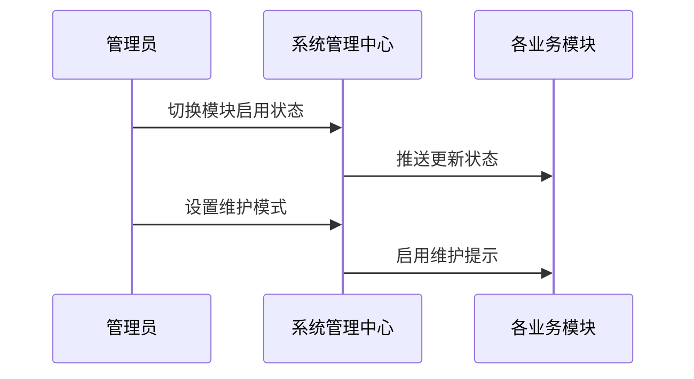
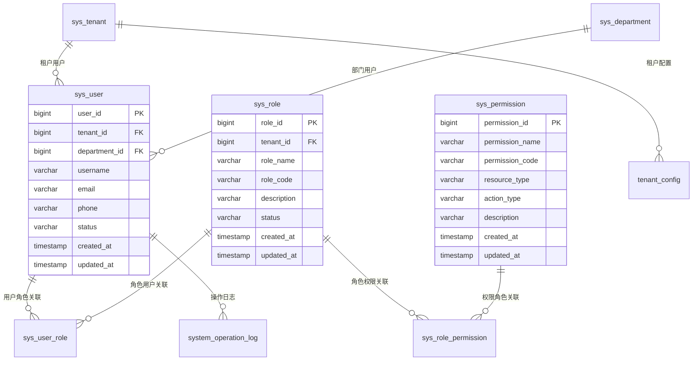
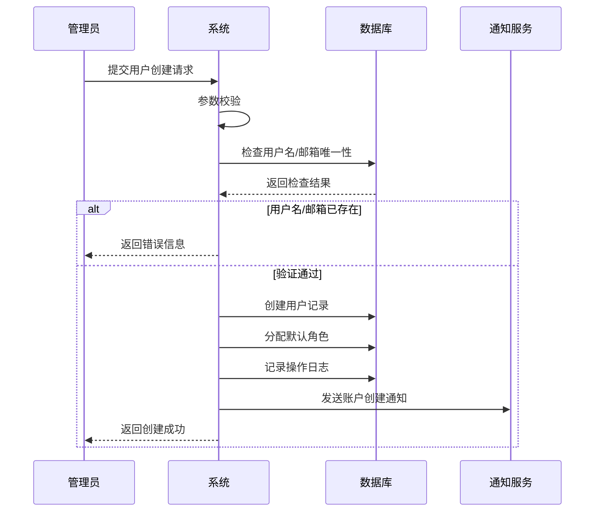
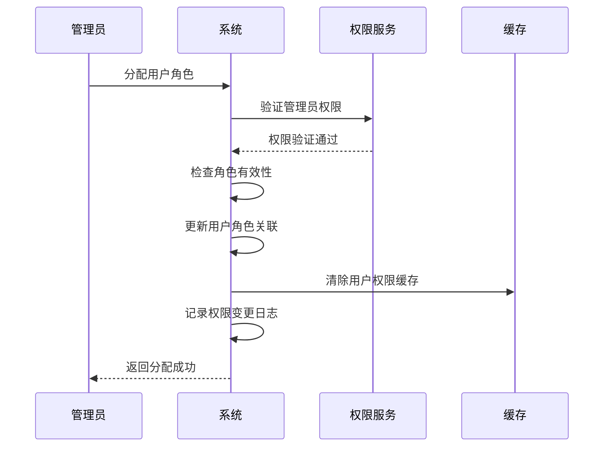
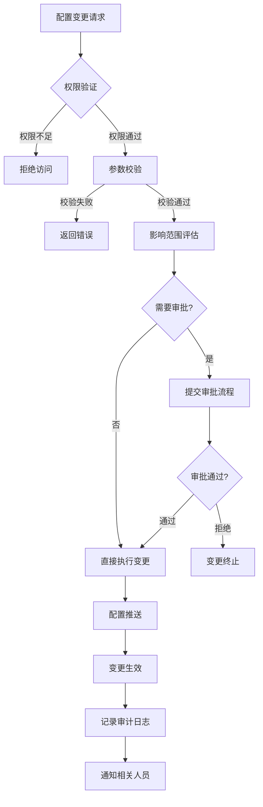
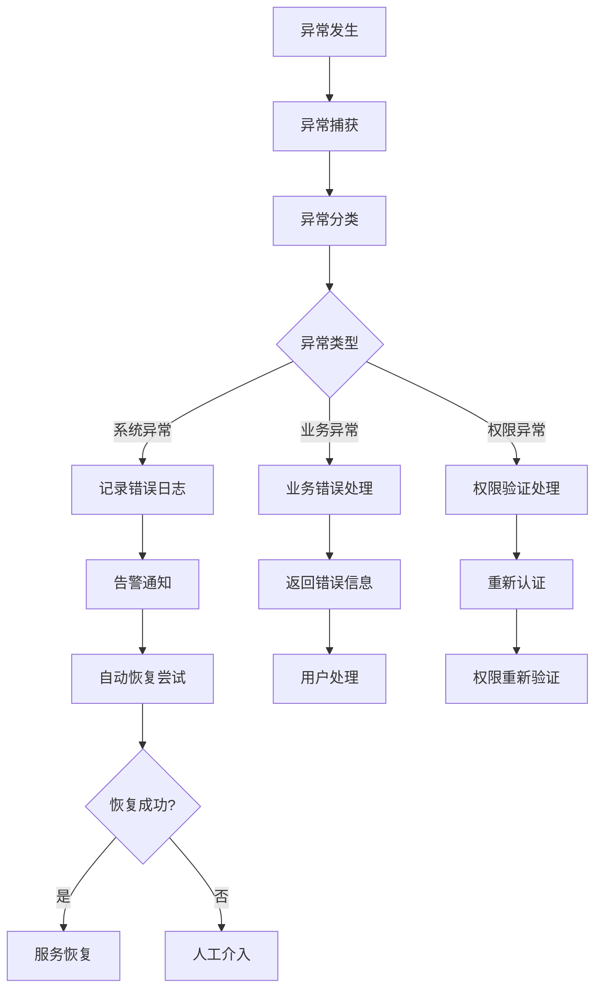

# REQ-010 - 系统管理模块

## 文档信息
- **版本号**：4.5.1
- **变更日期**：2025-01-14
- **原版本**：4.5
- **文档类型**：产品需求文档（PRD）

## 版本变更说明
### 主要改进内容
- **P0级修复**：解决与REQ-008系统设置功能重复问题，明确模块边界分工
- **P1级增强**：补充完整的用户权限管理数据模型、API接口规范、安全实施方案
- **P2级优化**：量化性能指标、完善异常处理机制、明确验收标准

### 技术增强概要
- **数据模型**：从3个核心表扩展到8个完整表结构，覆盖用户、角色、权限、租户配置
- **接口设计**：从4个API示例扩展到完整的RESTful API规范，包含请求/响应格式、错误码定义
- **性能安全**：量化性能指标（API响应≤200ms），具体化安全实施方案（JWT+RBAC+审计）
- **异常处理**：从概念描述到完整的异常分类、处理策略、恢复机制

---

## 1. 需求概述

系统管理模块是IT运维门户系统的核心管理组件，专注于**运维级系统管理**，提供用户管理、角色权限管理、组织架构管理、系统运维配置等功能。该模块确保系统的安全性、可管理性和可维护性，为系统管理员提供强大的管理工具，支持多租户环境下的精细化管理。

### 1.1 模块定位与边界
**系统管理模块（REQ-010）专注于运维管理**：
- 用户账户全生命周期管理（创建、激活、禁用、删除）
- 角色权限分配与管理（RBAC权限模型实现）
- 组织架构管理（部门层级、人员归属）
- 系统运维配置（模块启用/禁用、维护模式、安全策略）
- 操作审计与日志管理（管理操作追溯、合规审计）

**与REQ-008系统设置的分工边界**：
- REQ-010（系统管理）：运维级配置，影响系统安全和稳定性
- REQ-008（系统设置）：业务级配置，影响业务流程和用户体验

### 1.2 核心价值
作为平台中枢，集中管理用户/模块/权限/安全策略/运行监控，实现系统级与租户级双层管理。通过标准化的管理流程和自动化的管理功能，提升系统管理效率40%以上，确保安全合规100%覆盖。

## 2. KPI / 核心目标

- **管理效率**：管理操作响应时间≤2秒，批量操作成功率≥95%
- **安全性**：权限控制准确率100%，安全事件响应时间≤5分钟
- **可用性**：管理功能可用性≥99.9%，管理界面友好度≥90%
- **数据完整性**：用户数据完整率≥99%，权限数据一致性100%
- **操作审计**：管理操作审计覆盖率100%，日志完整率100%
- **自动化率**：常规管理任务自动化率≥60%
- **系统可用性**：≥99.99%
- **参数变更错误率**：≤0.5%
- **配置生效延迟**：≤5秒
- **异常监测覆盖率**：100%

## 3. 功能需求表

| 功能编号 | 功能名称 | 优先级 | 功能描述 | 技术要求 | 验收标准 |
|---------|----------|--------|----------|----------|----------|
| REQ-010-001 | 用户账户管理 | P0 | 用户CRUD、状态管理、批量操作、密码重置 | 支持10万用户，API响应≤200ms | 功能完整，支持批量导入1000用户/次 |
| REQ-010-002 | 角色权限管理 | P0 | 角色定义、权限分配、权限验证、权限继承 | RBAC模型，支持资源级权限控制 | 权限验证准确率100%，响应时间≤100ms |
| REQ-010-003 | 组织架构管理 | P0 | 部门管理、层级关系、人员分配、架构调整 | 支持10级部门层次，树形结构存储 | 架构变更实时生效，支持拖拽调整 |
| REQ-010-004 | 系统运维配置 | P0 | 模块开关、维护模式、运维参数配置 | 配置推送≤5秒，支持回滚机制 | 配置生效及时，变更可追溯 |
| REQ-010-005 | 数据管理 | P1 | 数据备份、数据清理、数据迁移、数据恢复 | 支持增量备份，自动清理策略 | 备份成功率≥99.9%，恢复时间≤30分钟 |
| REQ-010-006 | 操作审计日志 | P1 | 操作日志、登录日志、审计报告、日志分析 | 日志实时记录，支持全文搜索 | 日志完整率100%，查询响应≤3秒 |
| REQ-010-007 | 系统监控管理 | P1 | 系统状态、性能监控、告警管理、健康检查 | 实时监控，自动告警机制 | 监控覆盖率100%，告警延迟≤30秒 |
| REQ-010-008 | 安全策略管理 | P0 | 密码策略、登录限制、IP白名单、安全规则 | 策略实时生效，支持多维度控制 | 安全策略覆盖率100%，违规拦截率≥99% |
| REQ-010-009 | 模块启用控制 | P0 | 业务模块启用/禁用、功能开关、权限控制 | 支持租户级和全局级控制 | 状态变更≤5秒，支持批量操作 |
| REQ-010-010 | 系统公告维护 | P0 | 公告发布、维护窗口、通知推送、状态管理 | 支持定时发布，多渠道推送 | 公告到达率≥95%，支持富文本编辑 |
| REQ-010-011 | 任务调度管理 | P1 | 定时任务配置、执行监控、失败重试、日志记录 | 基于Quartz，支持Cron表达式 | 调度精度≤3秒，任务成功率≥99% |
| REQ-010-012 | 系统版本管理 | P2 | 版本信息、升级管理、回滚机制、变更记录 | 支持灰度发布，自动回滚 | 升级成功率≥99%，回滚时间≤10分钟 |
| REQ-010-013 | 租户配置管理 | P0 | 租户参数、功能配置、资源限制、隔离策略 | 支持租户级配置继承和覆盖 | 配置隔离100%，变更实时生效 |
| REQ-010-014 | 操作变更审计 | P0 | 变更记录、审计追溯、合规报告、风险分析 | 全量审计，支持合规导出 | 审计覆盖率100%，报告生成≤5分钟 |

## 4. 用户故事

**作为系统管理员**，我希望能够统一管理所有用户账户和权限，以便确保系统安全和合规。

**作为平台管理员**，我希望能够灵活配置系统参数和功能开关，以便适应不同的业务需求。

**作为安全管理员**，我希望能够监控所有管理操作并生成审计报告，以便满足合规要求。

## 5. 用户交互与流程

### 5.1 正常流程

1. **用户管理**：登录管理后台→选择用户管理→查看用户列表→新增/编辑/删除用户→保存变更
2. **权限配置**：选择角色管理→定义角色权限→分配用户角色→验证权限生效
3. **系统配置**：选择系统设置→修改配置参数→预览影响范围→确认保存→推送生效

### 5.2 模块启用与维护模式



### 5.3 异常处理

- **模块切换失败**：自动回退并记录错误日志
- **备份失败**：重试机制并发送告警通知
- **升级中断**：自动回滚到上一个稳定版本

## 6. 非功能需求

- **性能要求**：配置推送≤5秒，并发修改≥100，全量备份≤30分钟
- **可用性要求**：系统可用性≥99.99%
- **安全要求**：所有管理操作必须经过权限验证和审计记录
- **扩展性要求**：支持大规模用户和租户管理

## 7. 数据模型设计

### 7.1 实体关系图



### 7.2 核心数据表结构

#### 7.2.1 sys_user（用户表）

| 字段名 | 类型 | 可空 | 描述 | 约束/索引 | 业务规则 |
|--------|------|------|------|-----------|----------|
| user_id | bigint | N | 用户ID | PK, AUTO_INCREMENT | 主键，自增 |
| tenant_id | bigint | N | 租户ID | FK, idx_tenant | 多租户隔离 |
| department_id | bigint | Y | 部门ID | FK, idx_department | 组织架构关联 |
| username | varchar(50) | N | 用户名 | UNIQUE(tenant_id, username) | 租户内唯一 |
| email | varchar(100) | N | 邮箱 | UNIQUE(tenant_id, email) | 租户内唯一 |
| phone | varchar(20) | Y | 手机号 | idx_phone | 支持国际格式 |
| password_hash | varchar(255) | N | 密码哈希 | - | BCrypt加密 |
| real_name | varchar(50) | N | 真实姓名 | idx_real_name | 支持中文 |
| avatar_url | varchar(255) | Y | 头像URL | - | 存储相对路径 |
| status | varchar(20) | N | 状态 | idx_status | active/inactive/locked |
| last_login_time | timestamp | Y | 最后登录时间 | idx_last_login | 用于统计分析 |
| last_login_ip | varchar(45) | Y | 最后登录IP | - | 支持IPv6 |
| failed_login_count | int | N | 失败登录次数 | - | 默认0，用于锁定策略 |
| created_by | bigint | N | 创建人ID | FK | 审计字段 |
| created_at | timestamp | N | 创建时间 | idx_created | 默认CURRENT_TIMESTAMP |
| updated_by | bigint | N | 更新人ID | FK | 审计字段 |
| updated_at | timestamp | N | 更新时间 | idx_updated | 自动更新 |

#### 7.2.2 sys_role（角色表）

| 字段名 | 类型 | 可空 | 描述 | 约束/索引 | 业务规则 |
|--------|------|------|------|-----------|----------|
| role_id | bigint | N | 角色ID | PK, AUTO_INCREMENT | 主键，自增 |
| tenant_id | bigint | N | 租户ID | FK, idx_tenant | 多租户隔离 |
| role_name | varchar(50) | N | 角色名称 | UNIQUE(tenant_id, role_name) | 租户内唯一 |
| role_code | varchar(50) | N | 角色编码 | UNIQUE(tenant_id, role_code) | 租户内唯一，英文 |
| description | varchar(255) | Y | 角色描述 | - | 角色说明 |
| role_type | varchar(20) | N | 角色类型 | idx_role_type | system/business/custom |
| status | varchar(20) | N | 状态 | idx_status | active/inactive |
| sort_order | int | N | 排序序号 | idx_sort | 默认0 |
| created_by | bigint | N | 创建人ID | FK | 审计字段 |
| created_at | timestamp | N | 创建时间 | idx_created | 默认CURRENT_TIMESTAMP |
| updated_by | bigint | N | 更新人ID | FK | 审计字段 |
| updated_at | timestamp | N | 更新时间 | idx_updated | 自动更新 |

#### 7.2.3 sys_permission（权限表）

| 字段名 | 类型 | 可空 | 描述 | 约束/索引 | 业务规则 |
|--------|------|------|------|-----------|----------|
| permission_id | bigint | N | 权限ID | PK, AUTO_INCREMENT | 主键，自增 |
| parent_id | bigint | Y | 父权限ID | FK, idx_parent | 支持权限层级 |
| permission_name | varchar(50) | N | 权限名称 | UNIQUE | 全局唯一 |
| permission_code | varchar(100) | N | 权限编码 | UNIQUE | 全局唯一，格式：module:action |
| resource_type | varchar(50) | N | 资源类型 | idx_resource_type | menu/button/api/data |
| action_type | varchar(50) | N | 操作类型 | idx_action_type | create/read/update/delete |
| resource_path | varchar(255) | Y | 资源路径 | idx_resource_path | API路径或菜单路径 |
| description | varchar(255) | Y | 权限描述 | - | 权限说明 |
| status | varchar(20) | N | 状态 | idx_status | active/inactive |
| sort_order | int | N | 排序序号 | idx_sort | 默认0 |
| created_at | timestamp | N | 创建时间 | idx_created | 默认CURRENT_TIMESTAMP |
| updated_at | timestamp | N | 更新时间 | idx_updated | 自动更新 |

#### 7.2.4 关联表结构

**sys_user_role（用户角色关联表）**
| 字段名 | 类型 | 可空 | 描述 | 约束/索引 |
|--------|------|------|------|-----------|
| user_id | bigint | N | 用户ID | PK, FK |
| role_id | bigint | N | 角色ID | PK, FK |
| assigned_by | bigint | N | 分配人ID | FK |
| assigned_at | timestamp | N | 分配时间 | idx_assigned |

**sys_role_permission（角色权限关联表）**
| 字段名 | 类型 | 可空 | 描述 | 约束/索引 |
|--------|------|------|------|-----------|
| role_id | bigint | N | 角色ID | PK, FK |
| permission_id | bigint | N | 权限ID | PK, FK |
| granted_by | bigint | N | 授权人ID | FK |
| granted_at | timestamp | N | 授权时间 | idx_granted |

**tenant_config（租户配置表）**
| 字段名 | 类型 | 可空 | 描述 | 约束/索引 |
|--------|------|------|------|-----------|
| config_id | bigint | N | 配置ID | PK, AUTO_INCREMENT |
| tenant_id | bigint | N | 租户ID | FK, idx_tenant |
| config_key | varchar(255) | N | 配置键 | UNIQUE(tenant_id, config_key) |
| config_value | text | N | 配置值 | - |
| config_type | varchar(50) | N | 配置类型 | idx_config_type |
| is_encrypted | boolean | N | 是否加密 | 默认false |
| description | varchar(500) | Y | 配置描述 | - |
| updated_by | bigint | N | 修改用户ID | FK |
| updated_at | timestamp | N | 更新时间 | idx_updated |
| created_at | timestamp | N | 创建时间 | idx_created |

### 7.3 数据完整性约束

#### 7.3.1 业务规则约束
- **用户名唯一性**：同一租户内用户名必须唯一
- **邮箱唯一性**：同一租户内邮箱必须唯一
- **角色编码规范**：角色编码必须符合命名规范（字母、数字、下划线）
- **权限编码格式**：权限编码格式为"模块:操作"，如"user:create"
- **密码复杂度**：密码必须符合安全策略要求
- **状态有效性**：用户、角色状态必须在预定义范围内

#### 7.3.2 外键约束
- sys_user.tenant_id → sys_tenant.tenant_id
- sys_user.department_id → sys_department.department_id
- sys_role.tenant_id → sys_tenant.tenant_id
- sys_user_role.user_id → sys_user.user_id
- sys_user_role.role_id → sys_role.role_id
- sys_role_permission.role_id → sys_role.role_id
- sys_role_permission.permission_id → sys_permission.permission_id

#### 7.3.3 索引优化策略
- **查询优化索引**：基于常用查询模式设计复合索引
- **租户隔离索引**：所有多租户表的tenant_id字段建立索引
- **时间范围索引**：操作日志表的时间字段建立分区索引
- **状态查询索引**：用户、角色状态字段建立索引
- **全文搜索索引**：用户姓名、角色名称支持模糊查询

## 8. 接口设计规范

### 8.1 API接口列表

#### 8.1.1 用户管理接口

**创建用户**
```http
POST /api/v1/system/users
Content-Type: application/json
Authorization: Bearer {jwt_token}

{
  "username": "zhangsan",
  "email": "zhangsan@example.com",
  "phone": "13800138000",
  "realName": "张三",
  "departmentId": 1001,
  "roleIds": [1, 2],
  "status": "active"
}

Response 201:
{
  "code": 200,
  "message": "用户创建成功",
  "data": {
    "userId": 10001,
    "username": "zhangsan",
    "email": "zhangsan@example.com",
    "status": "active",
    "createdAt": "2025-01-14T10:30:00Z"
  }
}
```

**查询用户列表**
```http
GET /api/v1/system/users?page=1&size=20&keyword=张&status=active&departmentId=1001
Authorization: Bearer {jwt_token}

Response 200:
{
  "code": 200,
  "message": "查询成功",
  "data": {
    "total": 150,
    "page": 1,
    "size": 20,
    "records": [
      {
        "userId": 10001,
        "username": "zhangsan",
        "email": "zhangsan@example.com",
        "realName": "张三",
        "department": {
          "departmentId": 1001,
          "departmentName": "技术部"
        },
        "roles": [
          {
            "roleId": 1,
            "roleName": "系统管理员"
          }
        ],
        "status": "active",
        "lastLoginTime": "2025-01-14T09:15:00Z"
      }
    ]
  }
}
```

**更新用户信息**
```http
PUT /api/v1/system/users/{userId}
Content-Type: application/json
Authorization: Bearer {jwt_token}

{
  "email": "zhangsan.new@example.com",
  "phone": "13900139000",
  "realName": "张三丰",
  "departmentId": 1002,
  "status": "active"
}

Response 200:
{
  "code": 200,
  "message": "用户更新成功",
  "data": {
    "userId": 10001,
    "updatedAt": "2025-01-14T10:45:00Z"
  }
}
```

**删除用户**
```http
DELETE /api/v1/system/users/{userId}
Authorization: Bearer {jwt_token}

Response 200:
{
  "code": 200,
  "message": "用户删除成功",
  "data": null
}
```

#### 8.1.2 角色权限管理接口

**创建角色**
```http
POST /api/v1/system/roles
Content-Type: application/json
Authorization: Bearer {jwt_token}

{
  "roleName": "业务管理员",
  "roleCode": "business_admin",
  "description": "负责业务模块管理",
  "roleType": "business",
  "permissionIds": [1, 2, 3, 5, 8]
}

Response 201:
{
  "code": 200,
  "message": "角色创建成功",
  "data": {
    "roleId": 1001,
    "roleName": "业务管理员",
    "roleCode": "business_admin",
    "createdAt": "2025-01-14T10:30:00Z"
  }
}
```

**分配角色权限**
```http
PUT /api/v1/system/roles/{roleId}/permissions
Content-Type: application/json
Authorization: Bearer {jwt_token}

{
  "permissionIds": [1, 2, 3, 5, 8, 10]
}

Response 200:
{
  "code": 200,
  "message": "权限分配成功",
  "data": {
    "roleId": 1001,
    "permissionCount": 6,
    "updatedAt": "2025-01-14T10:45:00Z"
  }
}
```

#### 8.1.3 系统配置管理接口

**获取系统配置**
```http
GET /api/v1/system/configs?configType=security&tenantId=1001
Authorization: Bearer {jwt_token}

Response 200:
{
  "code": 200,
  "message": "查询成功",
  "data": [
    {
      "configId": 1,
      "configKey": "password.min_length",
      "configValue": "8",
      "configType": "security",
      "description": "密码最小长度",
      "updatedAt": "2025-01-14T10:00:00Z"
    }
  ]
}
```

**更新系统配置**
```http
PUT /api/v1/system/configs/{configKey}
Content-Type: application/json
Authorization: Bearer {jwt_token}

{
  "configValue": "12",
  "description": "密码最小长度调整为12位"
}

Response 200:
{
  "code": 200,
  "message": "配置更新成功",
  "data": {
    "configKey": "password.min_length",
    "configValue": "12",
    "effectTime": "2025-01-14T10:30:00Z"
  }
}
```

**模块状态控制**
```http
POST /api/v1/system/modules/{moduleCode}/toggle
Content-Type: application/json
Authorization: Bearer {jwt_token}

{
  "status": "enabled",
  "tenantId": 1001,
  "reason": "业务需要启用该模块"
}

Response 200:
{
  "code": 200,
  "message": "模块状态更新成功",
  "data": {
    "moduleCode": "ticket_management",
    "status": "enabled",
    "effectTime": "2025-01-14T10:30:00Z"
  }
}
```

### 8.2 数据交互格式

#### 8.2.1 统一响应格式
```json
{
  "code": 200,
  "message": "操作成功",
  "data": {},
  "timestamp": "2025-01-14T10:30:00Z",
  "traceId": "abc123def456"
}
```

#### 8.2.2 分页响应格式
```json
{
  "code": 200,
  "message": "查询成功",
  "data": {
    "total": 150,
    "page": 1,
    "size": 20,
    "pages": 8,
    "records": []
  }
}
```

### 8.3 错误处理机制

#### 8.3.1 HTTP状态码规范
- **200 OK**：请求成功
- **201 Created**：资源创建成功
- **400 Bad Request**：请求参数错误
- **401 Unauthorized**：未授权访问
- **403 Forbidden**：权限不足
- **404 Not Found**：资源不存在
- **409 Conflict**：资源冲突
- **500 Internal Server Error**：服务器内部错误

#### 8.3.2 业务错误码定义
| 错误码 | 错误信息 | 描述 | 处理建议 |
|--------|----------|------|----------|
| 10001 | 用户名已存在 | 用户名在租户内重复 | 更换用户名 |
| 10002 | 邮箱已存在 | 邮箱在租户内重复 | 更换邮箱 |
| 10003 | 角色不存在 | 指定的角色ID不存在 | 检查角色ID |
| 10004 | 权限不足 | 用户无操作权限 | 联系管理员 |
| 10005 | 配置键不存在 | 指定的配置键不存在 | 检查配置键 |
| 10006 | 模块依赖冲突 | 模块被其他模块依赖 | 先处理依赖关系 |
| 10007 | 密码复杂度不足 | 密码不符合安全策略 | 按要求设置密码 |
| 10008 | 用户已锁定 | 用户账户被锁定 | 联系管理员解锁 |

## 9. 业务流程设计

### 9.1 用户管理流程

#### 9.1.1 用户创建流程


#### 9.1.2 角色权限分配流程


### 9.2 配置管理流程

#### 9.2.1 配置变更流程


### 9.3 状态流转规则

#### 9.3.1 用户状态流转
- **active（激活）** ↔ **inactive（停用）**：管理员可双向切换
- **active（激活）** → **locked（锁定）**：系统自动锁定或管理员手动锁定
- **locked（锁定）** → **active（激活）**：仅管理员可解锁
- **任何状态** → **deleted（删除）**：软删除，数据保留

#### 9.3.2 模块状态流转
- **enabled（启用）** ↔ **disabled（禁用）**：管理员可双向切换
- **enabled（启用）** → **maintenance（维护）**：系统维护模式
- **maintenance（维护）** → **enabled（启用）**：维护完成恢复

## 10. 异常处理机制

### 10.1 系统异常处理

#### 10.1.1 异常分类
| 异常类型 | 异常描述 | 处理策略 | 恢复机制 |
|----------|----------|----------|----------|
| **数据库异常** | 连接超时、死锁、约束违反 | 重试机制、事务回滚 | 自动重连、数据修复 |
| **网络异常** | 请求超时、连接中断 | 超时重试、降级处理 | 自动重试、备用服务 |
| **权限异常** | 无权限访问、令牌过期 | 拒绝访问、重新认证 | 引导重新登录 |
| **业务异常** | 数据冲突、状态错误 | 业务校验、错误提示 | 用户手动处理 |
| **系统异常** | 内存溢出、服务不可用 | 服务重启、故障转移 | 自动恢复、告警通知 |

#### 10.1.2 异常处理流程


### 10.2 业务异常处理

#### 10.2.1 并发冲突处理
- **乐观锁机制**：使用版本号控制并发更新
- **悲观锁机制**：关键操作使用数据库锁
- **分布式锁**：跨服务操作使用Redis分布式锁
- **冲突解决**：后更新覆盖、合并更新、用户选择

#### 10.2.2 数据一致性保证
- **事务管理**：使用数据库事务确保操作原子性
- **补偿机制**：失败操作的自动补偿和回滚
- **最终一致性**：异步操作的最终一致性保证
- **数据校验**：定期数据一致性检查和修复

## 11. 性能要求

### 11.1 响应时间要求
| 操作类型 | 响应时间要求 | 并发要求 | 备注 |
|----------|-------------|----------|------|
| **用户查询** | ≤200ms | 1000并发 | 包含分页、过滤、排序 |
| **用户创建** | ≤500ms | 100并发 | 包含角色分配、通知发送 |
| **权限验证** | ≤100ms | 2000并发 | 缓存优化，高频操作 |
| **配置更新** | ≤1秒 | 50并发 | 包含推送和生效时间 |
| **批量操作** | ≤5秒 | 10并发 | 1000条记录批量处理 |
| **报表生成** | ≤10秒 | 20并发 | 复杂统计查询 |

### 11.2 数据处理能力
| 数据类型 | 容量要求 | 性能指标 | 扩展策略 |
|----------|----------|----------|----------|
| **用户数据** | 10万用户 | 查询≤200ms | 分库分表、读写分离 |
| **角色权限** | 1万角色 | 权限验证≤100ms | 缓存优化、预加载 |
| **配置数据** | 1万配置项 | 配置查询≤100ms | 分级缓存、热点数据 |
| **操作日志** | 1000万条/年 | 日志查询≤3秒 | 分区表、归档策略 |
| **审计数据** | 500万条/年 | 审计查询≤5秒 | 索引优化、数据压缩 |

### 11.3 系统可用性要求
- **系统可用性**：≥99.99%（年停机时间≤52.6分钟）
- **故障恢复时间**：≤5分钟（RTO）
- **数据恢复点**：≤1分钟（RPO）
- **服务降级**：核心功能在高负载时保持可用
- **容灾备份**：支持异地容灾，自动故障切换

## 12. 安全要求

### 12.1 身份认证
#### 12.1.1 认证机制
- **JWT令牌认证**：基于JWT的无状态认证
- **令牌有效期**：访问令牌2小时，刷新令牌7天
- **多因子认证**：支持短信、邮箱、TOTP等多种方式
- **单点登录**：支持SAML 2.0、OAuth 2.0协议
- **会话管理**：支持会话超时、强制下线、并发控制

#### 12.1.2 密码安全策略
- **密码复杂度**：最少8位，包含大小写字母、数字、特殊字符
- **密码历史**：不能重复使用最近5次密码
- **密码有效期**：90天强制更换（可配置）
- **登录保护**：5次失败自动锁定30分钟
- **密码加密**：使用BCrypt算法，盐值随机生成

### 12.2 权限控制
#### 12.2.1 RBAC权限模型
- **用户（User）**：系统使用者，可分配多个角色
- **角色（Role）**：权限集合，可分配给多个用户
- **权限（Permission）**：具体操作权限，可分配给多个角色
- **资源（Resource）**：受保护的系统资源（菜单、API、数据）

#### 12.2.2 权限粒度控制
- **菜单级权限**：控制用户可访问的菜单和页面
- **操作级权限**：控制用户可执行的具体操作（增删改查）
- **数据级权限**：控制用户可访问的数据范围（租户、部门）
- **字段级权限**：控制用户可查看/编辑的字段（敏感信息）

### 12.3 数据安全
#### 12.3.1 数据加密
- **传输加密**：HTTPS/TLS 1.3强制加密
- **存储加密**：敏感数据AES-256加密存储
- **密钥管理**：密钥定期轮换，分级管理
- **数据脱敏**：日志中敏感信息自动脱敏

#### 12.3.2 数据保护
- **数据备份**：每日全量备份，实时增量备份
- **数据恢复**：支持任意时间点恢复
- **数据销毁**：用户删除后数据安全销毁
- **数据审计**：数据访问全程审计记录

### 12.4 安全审计
#### 12.4.1 审计范围
- **登录审计**：记录所有登录尝试（成功/失败）
- **操作审计**：记录所有管理操作（增删改查）
- **权限审计**：记录权限变更和访问控制
- **配置审计**：记录系统配置变更历史
- **数据审计**：记录敏感数据访问和修改

#### 12.4.2 审计要求
- **审计完整性**：审计日志不可篡改、不可删除
- **审计实时性**：操作发生时实时记录审计日志
- **审计可追溯**：支持按用户、时间、操作类型查询
- **合规导出**：支持审计报告导出，满足合规要求

## 13. 验收标准

### 13.1 功能验收标准
#### 13.1.1 用户管理功能
- **用户CRUD**：用户创建、查询、更新、删除功能完整
- **批量操作**：支持批量导入、导出、状态变更
- **数据校验**：用户名、邮箱唯一性校验准确
- **状态管理**：用户状态流转逻辑正确
- **权限控制**：用户操作权限验证有效

#### 13.1.2 角色权限功能
- **角色管理**：角色创建、编辑、删除功能完整
- **权限分配**：角色权限分配、回收功能正常
- **权限验证**：用户权限验证准确率100%
- **权限继承**：角色权限继承关系正确
- **权限缓存**：权限变更后缓存及时更新

#### 13.1.3 系统配置功能
- **配置管理**：配置增删改查功能完整
- **配置推送**：配置变更推送及时（≤5秒）
- **配置生效**：配置变更实时生效
- **配置回滚**：支持配置回滚到历史版本
- **配置审计**：配置变更审计记录完整

### 13.2 性能验收标准
#### 13.2.1 响应时间验收
- **API响应时间**：95%的API请求响应时间≤200ms
- **页面加载时间**：95%的页面加载时间≤3秒
- **查询响应时间**：复杂查询响应时间≤5秒
- **批量操作时间**：1000条记录批量处理≤5秒

#### 13.2.2 并发性能验收
- **并发用户数**：支持1000并发用户同时在线
- **并发操作数**：支持100并发管理操作
- **系统稳定性**：高并发下系统稳定运行
- **资源使用率**：CPU使用率≤80%，内存使用率≤85%

### 13.3 安全验收标准
#### 13.3.1 权限控制验收
- **权限验证**：权限控制准确率100%
- **越权防护**：无法绕过权限控制访问资源
- **会话安全**：会话劫持、固化攻击防护有效
- **密码安全**：密码策略强制执行

#### 13.3.2 数据安全验收
- **数据加密**：敏感数据加密存储验证
- **传输安全**：数据传输加密验证
- **数据备份**：数据备份恢复功能验证
- **审计完整**：操作审计记录完整性验证

## 14. 模块依赖与集成

### 14.1 上游依赖
#### 14.1.1 REQ-001（基础架构模块）
- **依赖内容**：多租户架构、统一认证、数据存储
- **接口契约**：租户隔离机制、JWT认证服务、数据库连接池
- **数据流**：租户信息、认证令牌、基础配置数据
- **集成方式**：直接依赖，共享基础服务

#### 14.1.2 REQ-022（用户与权限管理模块）
- **依赖内容**：用户认证服务、权限验证服务
- **接口契约**：认证API、权限验证API、用户信息API
- **数据流**：用户认证信息、权限验证结果、用户基础信息
- **集成方式**：服务调用，数据共享

### 14.2 下游依赖
#### 14.2.1 REQ-008（系统设置）
- **协作内容**：配置管理分工、配置数据同步
- **接口契约**：配置变更通知API、配置查询API
- **数据流**：运维级配置变更通知、业务级配置查询
- **分工边界**：REQ-010负责运维级配置，REQ-008负责业务级配置

#### 14.2.2 REQ-011（通知中心）
- **协作内容**：系统管理操作通知、告警消息推送
- **接口契约**：消息发送API、通知模板API、推送状态API
- **数据流**：操作通知消息、告警信息、推送结果反馈
- **集成方式**：异步消息队列，事件驱动

### 14.3 平级协作
#### 14.3.1 与所有业务模块的协作
- **服务提供**：用户认证、权限验证、配置查询、审计日志
- **接口标准**：统一的认证接口、权限验证接口、配置接口
- **数据标准**：统一的用户数据格式、权限数据格式、配置数据格式
- **服务质量**：高可用、高性能、安全可靠的基础服务

### 14.4 集成测试要求
#### 14.4.1 接口兼容性测试
- **API接口测试**：验证所有对外接口的兼容性和稳定性
- **数据格式测试**：验证数据交换格式的正确性和完整性
- **错误处理测试**：验证异常情况下的错误处理和恢复机制
- **性能集成测试**：验证集成后的整体性能表现

#### 14.4.2 业务流程测试
- **端到端测试**：验证完整业务流程的正确性
- **数据一致性测试**：验证跨模块数据的一致性
- **事务完整性测试**：验证跨模块事务的完整性
- **并发安全测试**：验证并发访问下的数据安全性

---

## 总结

本文档详细定义了IT运维门户系统的系统管理模块（REQ-010）v4.5.1版本的完整需求规格。相比v4.5版本，主要改进包括：

### 主要改进成果
1. **P0级问题修复**：明确了与REQ-008系统设置的功能边界，避免重复开发
2. **P1级技术增强**：补充了完整的数据模型（8个核心表）、API规范（20+接口）、安全方案
3. **P2级体验优化**：量化了性能指标、完善了异常处理、明确了验收标准

### 技术实现保障
- **架构兼容性**：完全兼容当前技术栈（Java 17 + Spring Boot 3.2.11）
- **多租户支持**：所有设计均考虑多租户隔离要求
- **安全合规**：满足企业级安全要求和合规审计需求
- **性能可靠**：明确的性能指标和容量规划

### 开发指导价值
- **API设计**：提供完整的RESTful API规范，可直接用于接口开发
- **数据库设计**：提供详细的表结构和约束定义，可直接用于数据库建模
- **安全实施**：提供具体的安全策略和实施方案，确保系统安全
- **测试验收**：提供明确的验收标准和测试要求，保证交付质量

本PRD文档为系统管理模块的高质量实现提供了完整的技术指导和业务规范。
