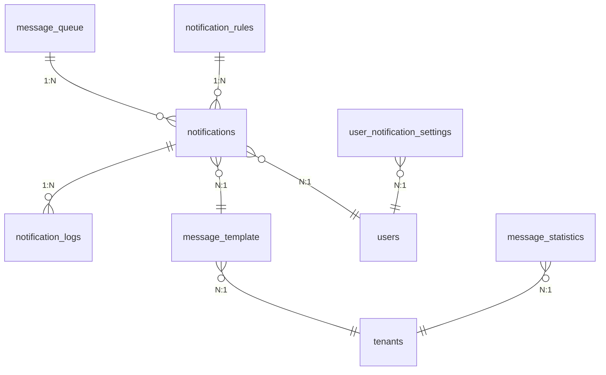
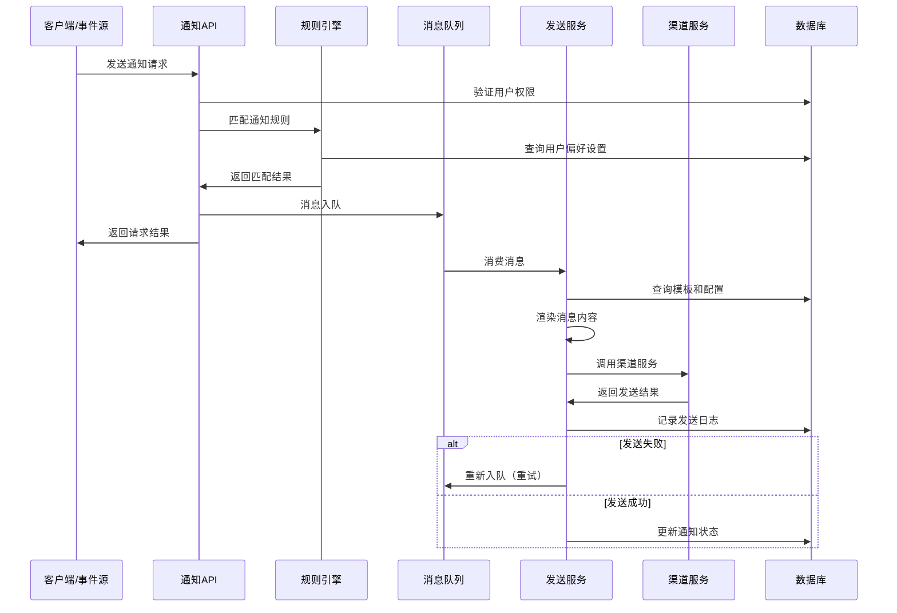
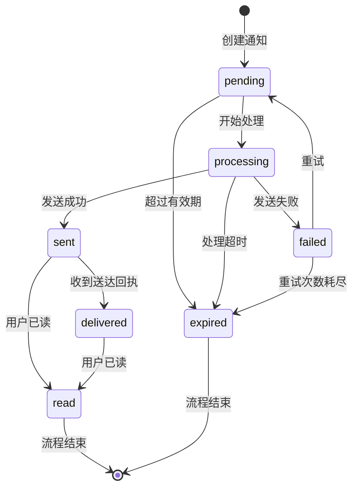

# REQ-011 - 通知与消息系统

## 文档信息
- **版本号**：4.5.1
- **变更日期**：2025-08-15
- **原版本**：4.5
- **文档类型**：产品需求文档（PRD）

## 版本变更说明
### 主要改进内容
- **P0级修复**：补充完整的数据模型定义、API接口规范、异常处理机制
- **P1级增强**：优化业务流程设计、完善性能和安全要求、明确验收标准
- **P2级优化**：增强跨模块集成方案、提升系统可扩展性、改进用户体验

### 技术增强概要
- **数据模型**：新增消息队列表、优化索引设计、完善约束条件
- **接口设计**：提供完整REST API规范、新增WebSocket实时接口、定义批量操作
- **性能安全**：量化性能指标、详化安全实施方案、完善监控告警
- **异常处理**：建立完整重试机制、优化降级策略、保障数据一致性

---

## 1. 需求概述

通知与消息系统为IT运维门户系统提供全面的消息通知服务，作为系统各模块间的消息中枢，支持工单状态变更、SLA告警、财务提醒、系统通知等多种业务场景。系统采用事件驱动架构，支持多种通知渠道（站内消息、邮件、短信、微信、钉钉、Push、Webhook等），提供多格式（文本/HTML/Markdown）与多优先级（紧急/重要/普通/低）的消息处理能力。

### 核心价值
- **业务连续性保障**：确保关键业务事件及时通知到相关人员，避免业务中断
- **多租户消息隔离**：严格的租户级数据隔离，保障数据安全和隐私
- **智能通知规则**：基于用户偏好和业务规则的智能化消息推送
- **全链路可追溯**：完整的消息发送状态跟踪和统计分析能力

### 系统集成
与核心业务模块深度集成：
- **REQ-003（工单管理）**：工单状态变更、处理进度通知
- **REQ-017（SLA管理）**：SLA违约告警、预警通知
- **REQ-018（财务管理）**：账单生成、付款提醒、逾期通知
- **REQ-004（智能派单）**：派单结果、接单确认通知
- **REQ-007（报表中心）**：报表生成完成、定期报告推送

## 2. 功能需求

### 2.1 核心功能

| 功能编号 | 功能名称 | 优先级 | 功能描述 | 验收标准 | 技术要求 |
|---------|----------|--------|----------|----------|----------|
| REQ-011-001 | 站内消息 | P0 | 系统消息、个人消息、群组消息，支持富文本和附件 | 消息及时送达，界面友好，支持已读/未读状态 | WebSocket实时推送，消息持久化存储 |
| REQ-011-002 | 邮件通知 | P0 | SMTP邮件发送、HTML模板、批量发送、附件支持 | 发送成功率≥95%，支持退信处理 | 支持多SMTP服务器，连接池管理 |
| REQ-011-003 | 短信通知 | P0 | 短信发送、模板管理、验证码、国际短信支持 | 到达率≥90%，支持送达回执 | 对接主流短信网关，支持负载均衡 |
| REQ-011-004 | 通知规则引擎 | P0 | 规则配置、触发条件、通知对象、时间窗口控制 | 规则灵活配置，执行准确率≥99% | 基于规则引擎，支持复杂条件表达式 |
| REQ-011-005 | 个人偏好设置 | P1 | 通知偏好、免打扰时间、渠道选择、频率控制 | 设置灵活，个性化体验良好 | 用户画像分析，智能推荐设置 |
| REQ-011-006 | 第三方集成 | P1 | 微信、钉钉、Slack、Teams、Webhook集成 | 集成稳定，功能完整，支持OAuth认证 | 标准化集成框架，支持插件扩展 |
| REQ-011-007 | 消息统计分析 | P1 | 发送统计、到达率分析、用户行为分析、效果评估 | 统计准确，分析有价值，支持实时监控 | 基于时序数据库，支持多维度分析 |
| REQ-011-008 | 消息模板管理 | P2 | 模板管理、变量替换、多语言支持、版本控制 | 模板丰富，使用便捷，支持预览测试 | 模板引擎，支持条件渲染 |
| REQ-011-009 | 事件触发通知 | P0 | 绑定工单/SLA/财务/派单等事件自动推送 | 全流程覆盖率≥95%，延迟≤30秒 | 事件驱动架构，异步消息处理 |
| REQ-011-010 | 优先级调度 | P0 | 优先级队列处理，紧急消息优先通道 | 紧急消息延迟≤10秒，普通消息≤30秒 | 多级队列，动态优先级调整 |
| REQ-011-011 | 重试与回执 | P1 | 失败重试策略、状态回执、送达确认 | 重试成功率≥95%，状态准确率≥99% | 指数退避重试，状态机管理 |
| REQ-011-012 | 定时发送 | P2 | 计划任务、延时消息、周期性通知 | 按时送达率≥98%，支持时区处理 | 分布式定时任务，时区自动转换 |
| REQ-011-013 | 历史与审计 | P1 | 历史记录查询、送达率统计、操作审计 | 数据准确率≥99.5%，支持合规审计 | 数据归档策略，审计日志完整性 |

### 2.2 辅助功能

- **消息去重**：基于内容指纹和接收方的智能去重机制
- **频率控制**：防止消息轰炸，支持用户级和全局级频率限制
- **A/B测试**：支持消息内容和发送策略的A/B测试
- **多语言支持**：根据用户语言偏好自动选择消息语言
- **消息归档**：历史消息自动归档，支持冷热数据分离

### 2.3 边界条件处理

- **渠道故障降级**：主渠道不可用时自动切换备用渠道
- **消息积压处理**：高峰期消息积压时的限流和优先级处理
- **大批量发送**：支持百万级消息批量发送，分批处理避免系统过载
- **异常恢复**：系统重启后未发送消息的自动恢复和补发
- **数据一致性**：确保消息状态与业务状态的最终一致性

## 3. 数据模型设计

### 3.1 实体关系图



### 3.2 数据表结构

#### 3.2.1 notifications（通知记录表）

| 字段名 | 类型 | 长度 | 可空 | 默认值 | 描述 | 约束/索引 |
|--------|------|------|------|--------|------|-----------|
| notification_id | bigint | - | N | auto | 通知ID | PK, AUTO_INCREMENT |
| tenant_id | bigint | - | N | - | 租户ID | FK, idx_tenant_id |
| user_id | bigint | - | N | - | 接收用户ID | FK, idx_user_id |
| notification_type | varchar | 50 | N | - | 通知类型 | idx_type, CHECK(type IN (...)) |
| title | varchar | 255 | N | - | 通知标题 | - |
| content | text | - | N | - | 通知内容 | - |
| content_type | varchar | 20 | N | 'text' | 内容类型：text/html/markdown | CHECK(content_type IN (...)) |
| priority | varchar | 20 | N | 'normal' | 优先级：urgent/high/normal/low | idx_priority, CHECK(priority IN (...)) |
| channel | varchar | 50 | N | - | 发送渠道 | idx_channel |
| status | varchar | 20 | N | 'pending' | 状态：pending/sent/failed/read | idx_status |
| template_id | bigint | - | Y | - | 模板ID | FK |
| variables | jsonb | - | Y | - | 模板变量（JSON格式） | - |
| scheduled_time | timestamp | - | Y | - | 计划发送时间 | idx_scheduled |
| sent_time | timestamp | - | Y | - | 实际发送时间 | idx_sent |
| read_time | timestamp | - | Y | - | 阅读时间 | - |
| expire_time | timestamp | - | Y | - | 过期时间 | idx_expire |
| retry_count | int | - | N | 0 | 重试次数 | - |
| max_retry | int | - | N | 3 | 最大重试次数 | - |
| created_at | timestamp | - | N | CURRENT_TIMESTAMP | 创建时间 | idx_created |
| updated_at | timestamp | - | N | CURRENT_TIMESTAMP | 更新时间 | - |

**索引设计**：
- `idx_tenant_user_status` (tenant_id, user_id, status) - 用户消息查询
- `idx_tenant_type_priority` (tenant_id, notification_type, priority) - 类型优先级查询
- `idx_scheduled_status` (scheduled_time, status) - 定时任务查询
- `idx_created_tenant` (created_at, tenant_id) - 时间范围查询

#### 3.2.2 message_template（消息模板表）

| 字段名 | 类型 | 长度 | 可空 | 默认值 | 描述 | 约束/索引 |
|--------|------|------|------|--------|------|-----------|
| template_id | bigint | - | N | auto | 模板ID | PK, AUTO_INCREMENT |
| tenant_id | bigint | - | Y | - | 租户ID（为空则为全局模板） | idx_tenant |
| template_code | varchar | 100 | N | - | 模板代码 | uniq_tenant_code |
| template_name | varchar | 255 | N | - | 模板名称 | - |
| template_type | varchar | 50 | N | - | 模板类型 | idx_type |
| channel | varchar | 50 | N | - | 适用渠道 | idx_channel |
| subject_template | varchar | 500 | Y | - | 主题模板 | - |
| content_template | text | - | N | - | 内容模板 | - |
| content_type | varchar | 20 | N | 'text' | 内容类型 | - |
| variables | jsonb | - | Y | - | 变量定义（JSON格式） | - |
| validation_rules | jsonb | - | Y | - | 变量验证规则 | - |
| status | varchar | 20 | N | 'active' | 状态：active/inactive/draft | idx_status |
| version | int | - | N | 1 | 版本号 | - |
| language | varchar | 10 | N | 'zh-CN' | 语言代码 | idx_language |
| created_by | bigint | - | N | - | 创建人ID | FK |
| created_at | timestamp | - | N | CURRENT_TIMESTAMP | 创建时间 | - |
| updated_at | timestamp | - | N | CURRENT_TIMESTAMP | 更新时间 | - |

**唯一约束**：
- `uniq_tenant_code` (tenant_id, template_code, version) - 租户内模板代码唯一

#### 3.2.3 notification_logs（通知发送日志表）

| 字段名 | 类型 | 长度 | 可空 | 默认值 | 描述 | 约束/索引 |
|--------|------|------|------|--------|------|-----------|
| log_id | bigint | - | N | auto | 日志ID | PK, AUTO_INCREMENT |
| notification_id | bigint | - | N | - | 通知ID | FK, idx_notification |
| tenant_id | bigint | - | N | - | 租户ID | idx_tenant |
| channel | varchar | 50 | N | - | 发送渠道 | idx_channel |
| recipient | varchar | 255 | N | - | 接收方地址 | - |
| send_status | varchar | 20 | N | - | 发送状态：success/failed/retry/timeout | idx_status |
| error_code | varchar | 50 | Y | - | 错误代码 | - |
| error_message | text | Y | - | 错误信息 | - |
| retry_count | int | - | N | 0 | 重试次数 | idx_retry |
| send_time | timestamp | - | N | CURRENT_TIMESTAMP | 发送时间 | idx_send_time |
| response_time | timestamp | - | Y | - | 响应时间 | - |
| cost_time | int | - | Y | - | 耗时（毫秒） | - |
| external_id | varchar | 100 | Y | - | 外部系统消息ID | - |
| delivery_status | varchar | 20 | Y | - | 送达状态：delivered/failed/unknown | - |
| delivery_time | timestamp | - | Y | - | 送达时间 | - |

**索引设计**：
- `idx_notification_channel` (notification_id, channel) - 通知渠道查询
- `idx_tenant_status_time` (tenant_id, send_status, send_time) - 状态统计查询
- `idx_send_time_status` (send_time, send_status) - 时间状态查询

#### 3.2.4 user_notification_settings（用户通知设置表）

| 字段名 | 类型 | 长度 | 可空 | 默认值 | 描述 | 约束/索引 |
|--------|------|------|------|--------|------|-----------|
| setting_id | bigint | - | N | auto | 设置ID | PK, AUTO_INCREMENT |
| user_id | bigint | - | N | - | 用户ID | FK, idx_user |
| tenant_id | bigint | - | N | - | 租户ID | idx_tenant |
| notification_type | varchar | 50 | N | - | 通知类型 | idx_type |
| channel_preferences | jsonb | - | N | '{}' | 渠道偏好（JSON格式） | - |
| priority_threshold | varchar | 20 | N | 'normal' | 优先级阈值 | - |
| do_not_disturb_start | time | - | Y | - | 免打扰开始时间 | - |
| do_not_disturb_end | time | - | Y | - | 免打扰结束时间 | - |
| frequency_limit | int | - | N | 100 | 频率限制（每小时） | - |
| is_enabled | boolean | - | N | true | 是否启用 | idx_enabled |
| timezone | varchar | 50 | N | 'Asia/Shanghai' | 时区 | - |
| language | varchar | 10 | N | 'zh-CN' | 语言偏好 | - |
| created_at | timestamp | - | N | CURRENT_TIMESTAMP | 创建时间 | - |
| updated_at | timestamp | - | N | CURRENT_TIMESTAMP | 更新时间 | - |

**唯一约束**：
- `uniq_user_type` (user_id, notification_type) - 用户通知类型唯一

#### 3.2.5 message_queue（消息队列表）

| 字段名 | 类型 | 长度 | 可空 | 默认值 | 描述 | 约束/索引 |
|--------|------|------|------|--------|------|-----------|
| queue_id | bigint | - | N | auto | 队列ID | PK, AUTO_INCREMENT |
| tenant_id | bigint | - | N | - | 租户ID | idx_tenant |
| queue_name | varchar | 100 | N | - | 队列名称 | idx_queue_name |
| priority | int | - | N | 5 | 优先级（1-10，数字越小优先级越高） | idx_priority |
| message_data | jsonb | - | N | - | 消息数据 | - |
| status | varchar | 20 | N | 'pending' | 状态：pending/processing/completed/failed | idx_status |
| retry_count | int | - | N | 0 | 重试次数 | - |
| max_retry | int | - | N | 3 | 最大重试次数 | - |
| scheduled_time | timestamp | - | Y | - | 计划处理时间 | idx_scheduled |
| started_time | timestamp | - | Y | - | 开始处理时间 | - |
| completed_time | timestamp | - | Y | - | 完成时间 | - |
| error_message | text | - | Y | - | 错误信息 | - |
| created_at | timestamp | - | N | CURRENT_TIMESTAMP | 创建时间 | idx_created |

**索引设计**：
- `idx_queue_priority_status` (queue_name, priority, status) - 队列处理查询
- `idx_scheduled_status` (scheduled_time, status) - 定时任务查询

#### 3.2.6 notification_rules（通知规则表）

| 字段名 | 类型 | 长度 | 可空 | 默认值 | 描述 | 约束/索引 |
|--------|------|------|------|--------|------|-----------|
| rule_id | bigint | - | N | auto | 规则ID | PK, AUTO_INCREMENT |
| tenant_id | bigint | - | N | - | 租户ID | idx_tenant |
| rule_name | varchar | 255 | N | - | 规则名称 | - |
| event_type | varchar | 100 | N | - | 事件类型 | idx_event_type |
| condition_expression | text | - | N | - | 条件表达式 | - |
| target_users | jsonb | - | Y | - | 目标用户（JSON格式） | - |
| target_roles | jsonb | - | Y | - | 目标角色（JSON格式） | - |
| channels | jsonb | - | N | - | 通知渠道（JSON格式） | - |
| template_id | bigint | - | Y | - | 模板ID | FK |
| priority | varchar | 20 | N | 'normal' | 优先级 | - |
| is_enabled | boolean | - | N | true | 是否启用 | idx_enabled |
| effective_time | timestamp | - | Y | - | 生效时间 | - |
| expire_time | timestamp | - | Y | - | 失效时间 | - |
| created_by | bigint | - | N | - | 创建人ID | FK |
| created_at | timestamp | - | N | CURRENT_TIMESTAMP | 创建时间 | - |
| updated_at | timestamp | - | N | CURRENT_TIMESTAMP | 更新时间 | - |

#### 3.2.7 message_statistics（消息统计表）

| 字段名 | 类型 | 长度 | 可空 | 默认值 | 描述 | 约束/索引 |
|--------|------|------|------|--------|------|-----------|
| stat_id | bigint | - | N | auto | 统计ID | PK, AUTO_INCREMENT |
| tenant_id | bigint | - | N | - | 租户ID | idx_tenant |
| stat_date | date | - | N | - | 统计日期 | idx_date |
| notification_type | varchar | 50 | N | - | 通知类型 | idx_type |
| channel | varchar | 50 | N | - | 渠道 | idx_channel |
| total_sent | int | - | N | 0 | 总发送数 | - |
| total_success | int | - | N | 0 | 成功数 | - |
| total_failed | int | - | N | 0 | 失败数 | - |
| total_delivered | int | - | N | 0 | 送达数 | - |
| total_read | int | - | N | 0 | 已读数 | - |
| avg_cost_time | int | - | N | 0 | 平均耗时（毫秒） | - |
| created_at | timestamp | - | N | CURRENT_TIMESTAMP | 创建时间 | - |
| updated_at | timestamp | - | N | CURRENT_TIMESTAMP | 更新时间 | - |

**唯一约束**：
- `uniq_tenant_date_type_channel` (tenant_id, stat_date, notification_type, channel) - 统计唯一性

### 3.3 数据完整性约束

#### 业务规则约束
1. **租户隔离**：所有业务数据必须包含tenant_id，确保多租户数据隔离
2. **状态流转**：通知状态只能按照 pending → sent/failed → read 的顺序流转
3. **重试限制**：重试次数不能超过max_retry设置的值
4. **时间约束**：scheduled_time不能早于当前时间，expire_time必须晚于scheduled_time
5. **优先级约束**：优先级必须在预定义的枚举值范围内

#### 外键约束
- notifications.tenant_id → tenants.tenant_id
- notifications.user_id → users.user_id
- notifications.template_id → message_template.template_id
- notification_logs.notification_id → notifications.notification_id
- user_notification_settings.user_id → users.user_id
- notification_rules.template_id → message_template.template_id

#### 检查约束
- priority IN ('urgent', 'high', 'normal', 'low')
- status IN ('pending', 'sent', 'failed', 'read', 'expired')
- content_type IN ('text', 'html', 'markdown')
- retry_count <= max_retry
- expire_time > scheduled_time (当两者都不为空时)

## 4. 接口设计规范

### 4.1 接口列表

#### 4.1.1 通知管理接口

| 接口名称 | HTTP方法 | 路径 | 描述 | 权限要求 |
|---------|----------|------|------|----------|
| 发送通知 | POST | /api/v1/notifications/send | 发送单条或批量通知 | notification:send |
| 获取通知列表 | GET | /api/v1/notifications | 分页获取用户通知列表 | notification:read |
| 获取通知详情 | GET | /api/v1/notifications/{id} | 获取指定通知详情 | notification:read |
| 标记已读 | PUT | /api/v1/notifications/{id}/read | 标记通知为已读 | notification:read |
| 批量标记已读 | PUT | /api/v1/notifications/batch-read | 批量标记通知为已读 | notification:read |
| 删除通知 | DELETE | /api/v1/notifications/{id} | 删除指定通知 | notification:delete |
| 获取未读数量 | GET | /api/v1/notifications/unread-count | 获取用户未读通知数量 | notification:read |

#### 4.1.2 模板管理接口

| 接口名称 | HTTP方法 | 路径 | 描述 | 权限要求 |
|---------|----------|------|------|----------|
| 创建模板 | POST | /api/v1/message-templates | 创建消息模板 | template:create |
| 获取模板列表 | GET | /api/v1/message-templates | 分页获取模板列表 | template:read |
| 获取模板详情 | GET | /api/v1/message-templates/{id} | 获取指定模板详情 | template:read |
| 更新模板 | PUT | /api/v1/message-templates/{id} | 更新模板信息 | template:update |
| 删除模板 | DELETE | /api/v1/message-templates/{id} | 删除模板 | template:delete |
| 预览模板 | POST | /api/v1/message-templates/{id}/preview | 预览模板渲染效果 | template:read |
| 测试发送 | POST | /api/v1/message-templates/{id}/test | 测试模板发送 | template:test |

#### 4.1.3 用户设置接口

| 接口名称 | HTTP方法 | 路径 | 描述 | 权限要求 |
|---------|----------|------|------|----------|
| 获取通知设置 | GET | /api/v1/users/{userId}/notification-settings | 获取用户通知设置 | setting:read |
| 更新通知设置 | PUT | /api/v1/users/{userId}/notification-settings | 更新用户通知设置 | setting:update |
| 重置为默认设置 | POST | /api/v1/users/{userId}/notification-settings/reset | 重置为系统默认设置 | setting:update |

#### 4.1.4 统计分析接口

| 接口名称 | HTTP方法 | 路径 | 描述 | 权限要求 |
|---------|----------|------|------|----------|
| 获取发送统计 | GET | /api/v1/notifications/statistics | 获取通知发送统计数据 | statistics:read |
| 获取渠道统计 | GET | /api/v1/notifications/channel-statistics | 获取各渠道统计数据 | statistics:read |
| 获取用户行为统计 | GET | /api/v1/notifications/user-statistics | 获取用户行为统计 | statistics:read |
| 导出统计报告 | GET | /api/v1/notifications/statistics/export | 导出统计报告 | statistics:export |

#### 4.1.5 规则管理接口

| 接口名称 | HTTP方法 | 路径 | 描述 | 权限要求 |
|---------|----------|------|------|----------|
| 创建通知规则 | POST | /api/v1/notification-rules | 创建通知规则 | rule:create |
| 获取规则列表 | GET | /api/v1/notification-rules | 分页获取规则列表 | rule:read |
| 获取规则详情 | GET | /api/v1/notification-rules/{id} | 获取指定规则详情 | rule:read |
| 更新规则 | PUT | /api/v1/notification-rules/{id} | 更新规则信息 | rule:update |
| 删除规则 | DELETE | /api/v1/notification-rules/{id} | 删除规则 | rule:delete |
| 启用/禁用规则 | PUT | /api/v1/notification-rules/{id}/toggle | 启用或禁用规则 | rule:update |
| 测试规则 | POST | /api/v1/notification-rules/{id}/test | 测试规则匹配 | rule:test |

### 4.2 数据交互格式

#### 4.2.1 发送通知接口

**请求格式**：
```json
{
  "recipients": [
    {
      "type": "user",
      "id": "123",
      "channels": ["in_app", "email"]
    },
    {
      "type": "role",
      "id": "admin",
      "channels": ["in_app", "sms"]
    }
  ],
  "notification": {
    "type": "ticket_status_change",
    "title": "工单状态变更通知",
    "content": "您的工单 #{{ticket_id}} 状态已变更为{{status}}",
    "content_type": "text",
    "priority": "normal",
    "template_id": 100,
    "variables": {
      "ticket_id": "12345",
      "status": "已完成"
    },
    "scheduled_time": "2025-08-15T10:00:00Z",
    "expire_time": "2025-08-16T10:00:00Z"
  },
  "options": {
    "deduplicate": true,
    "batch_size": 100,
    "retry_policy": {
      "max_retry": 3,
      "retry_interval": 300
    }
  }
}
```

**响应格式**：
```json
{
  "code": 200,
  "message": "success",
  "data": {
    "batch_id": "batch_20250815_001",
    "total_count": 150,
    "success_count": 148,
    "failed_count": 2,
    "notifications": [
      {
        "notification_id": 1001,
        "recipient": "user:123",
        "channel": "in_app",
        "status": "pending"
      }
    ],
    "failed_recipients": [
      {
        "recipient": "user:999",
        "error": "User not found"
      }
    ]
  }
}
```

#### 4.2.2 获取通知列表接口

**请求参数**：
```
GET /api/v1/notifications?status=unread&type=ticket&priority=high&page=1&size=20&sort=created_at:desc
```

**响应格式**：
```json
{
  "code": 200,
  "message": "success",
  "data": {
    "total": 156,
    "page": 1,
    "size": 20,
    "pages": 8,
    "items": [
      {
        "notification_id": 1001,
        "type": "ticket_status_change",
        "title": "工单状态变更通知",
        "content": "您的工单 #12345 状态已变更为已完成",
        "content_type": "text",
        "priority": "normal",
        "status": "unread",
        "channel": "in_app",
        "created_at": "2025-08-15T09:30:00Z",
        "sent_time": "2025-08-15T09:30:05Z",
        "expire_time": "2025-08-16T09:30:00Z"
      }
    ]
  }
}
```

#### 4.2.3 WebSocket实时通知接口

**连接地址**：
```
wss://api.example.com/ws/notifications?token={jwt_token}&tenant_id={tenant_id}
```

**消息格式**：
```json
{
  "type": "notification",
  "data": {
    "notification_id": 1001,
    "type": "ticket_status_change",
    "title": "工单状态变更通知",
    "content": "您的工单 #12345 状态已变更为已完成",
    "priority": "normal",
    "created_at": "2025-08-15T09:30:00Z"
  }
}
```

**心跳消息**：
```json
{
  "type": "ping",
  "timestamp": "2025-08-15T09:30:00Z"
}
```

### 4.3 错误处理机制

#### 4.3.1 统一错误码定义

| 错误码 | HTTP状态码 | 错误描述 | 处理建议 |
|--------|------------|----------|----------|
| 10001 | 400 | 请求参数错误 | 检查请求参数格式和必填字段 |
| 10002 | 401 | 认证失败 | 检查JWT token是否有效 |
| 10003 | 403 | 权限不足 | 检查用户权限配置 |
| 10004 | 404 | 资源不存在 | 检查资源ID是否正确 |
| 10005 | 409 | 资源冲突 | 检查是否存在重复资源 |
| 10006 | 429 | 请求频率超限 | 降低请求频率，稍后重试 |
| 20001 | 500 | 模板渲染失败 | 检查模板语法和变量 |
| 20002 | 500 | 渠道服务不可用 | 检查第三方服务状态 |
| 20003 | 500 | 消息队列异常 | 检查消息队列服务状态 |
| 20004 | 500 | 数据库连接异常 | 检查数据库连接状态 |
| 30001 | 400 | 收件人不存在 | 检查用户ID或角色ID |
| 30002 | 400 | 模板不存在 | 检查模板ID是否正确 |
| 30003 | 400 | 通知类型不支持 | 检查通知类型配置 |
| 30004 | 400 | 渠道不支持 | 检查渠道配置和用户偏好 |

#### 4.3.2 错误响应格式

```json
{
  "code": 10001,
  "message": "请求参数错误",
  "details": {
    "field": "recipients",
    "error": "recipients字段不能为空"
  },
  "timestamp": "2025-08-15T09:30:00Z",
  "request_id": "req_20250815_001"
}
```

#### 4.3.3 重试机制

**指数退避重试策略**：
- 第1次重试：延迟1秒
- 第2次重试：延迟2秒
- 第3次重试：延迟4秒
- 最大重试次数：3次
- 最大延迟时间：60秒

**重试条件**：
- 网络超时错误
- 第三方服务临时不可用（5xx错误）
- 消息队列满载
- 数据库连接异常

**不重试条件**：
- 认证失败（401）
- 权限不足（403）
- 参数错误（400）
- 资源不存在（404）

## 5. 业务流程设计

### 5.1 主要业务流程

#### 5.1.1 消息发送完整流程



#### 5.1.2 消息生命周期管理

**阶段1：消息创建（0-1秒）**
1. **请求验证**：验证API请求格式、权限、参数完整性
2. **规则匹配**：根据事件类型和条件匹配通知规则
3. **收件人解析**：解析用户、角色、群组等收件人类型
4. **去重检查**：基于内容指纹和收件人进行去重
5. **优先级评估**：根据消息类型和用户等级确定优先级

**阶段2：消息调度（1-30秒）**
1. **队列分配**：根据优先级分配到不同队列
2. **批量处理**：合并相似消息，提高处理效率
3. **时间调度**：处理定时发送和延迟发送
4. **负载均衡**：在多个发送服务实例间分配任务
5. **资源控制**：根据系统负载动态调整处理速度

**阶段3：消息发送（即时-5分钟）**
1. **模板渲染**：使用模板引擎渲染消息内容
2. **渠道选择**：根据用户偏好和渠道可用性选择发送渠道
3. **内容适配**：根据渠道特性调整消息格式
4. **发送执行**：调用具体渠道服务发送消息
5. **状态跟踪**：实时跟踪发送状态和结果

**阶段4：结果处理（即时-24小时）**
1. **状态更新**：更新消息发送状态
2. **重试处理**：失败消息的自动重试
3. **送达确认**：处理第三方服务的送达回执
4. **统计更新**：更新发送统计和分析数据
5. **异常处理**：处理各种异常情况和错误恢复

### 5.2 状态流转规则

#### 5.2.1 通知状态流转图



#### 5.2.2 状态流转规则

| 当前状态 | 可转换状态 | 触发条件 | 业务规则 |
|---------|-----------|----------|----------|
| pending | processing | 消息被消费者获取 | 自动触发 |
| pending | expired | 超过有效期 | 定时任务检查 |
| processing | sent | 渠道返回成功 | 自动触发 |
| processing | failed | 渠道返回失败 | 自动触发 |
| processing | expired | 处理超时 | 超时时间：5分钟 |
| failed | pending | 满足重试条件 | retry_count < max_retry |
| failed | expired | 重试次数耗尽 | retry_count >= max_retry |
| sent | delivered | 收到送达回执 | 第三方服务回调 |
| sent | read | 用户标记已读 | 用户操作 |
| delivered | read | 用户标记已读 | 用户操作 |

### 5.3 跨模块交互

#### 5.3.1 事件触发集成

**工单管理模块集成**：
```json
{
  "event_type": "ticket.status.changed",
  "event_data": {
    "ticket_id": "T20250815001",
    "old_status": "processing",
    "new_status": "completed",
    "assignee_id": 123,
    "customer_id": 456,
    "priority": "high",
    "sla_deadline": "2025-08-15T18:00:00Z"
  },
  "notification_rules": [
    {
      "rule_id": "ticket_completion_notify",
      "target_users": ["customer", "assignee", "manager"],
      "channels": ["in_app", "email"],
      "template": "ticket_completion_template"
    }
  ]
}
```

**SLA管理模块集成**：
```json
{
  "event_type": "sla.violation.warning",
  "event_data": {
    "sla_id": "SLA001",
    "ticket_id": "T20250815001",
    "violation_type": "response_time",
    "remaining_time": 1800,
    "severity": "critical"
  },
  "notification_rules": [
    {
      "rule_id": "sla_warning_escalate",
      "target_roles": ["manager", "admin"],
      "channels": ["sms", "phone_call"],
      "priority": "urgent"
    }
  ]
}
```

**财务管理模块集成**：
```json
{
  "event_type": "invoice.generated",
  "event_data": {
    "invoice_id": "INV20250815001",
    "customer_id": 456,
    "amount": 5000.00,
    "due_date": "2025-09-15",
    "payment_status": "pending"
  },
  "notification_rules": [
    {
      "rule_id": "invoice_notification",
      "target_users": ["customer_finance_contact"],
      "channels": ["email", "in_app"],
      "template": "invoice_notification_template"
    }
  ]
}
```

## 6. 性能要求

### 6.1 响应时间要求

| 操作类型 | 目标响应时间 | 最大响应时间 | 测试条件 |
|---------|-------------|-------------|----------|
| API请求响应 | <200ms | <500ms | 1000并发用户 |
| 消息入队 | <50ms | <100ms | 10000条/分钟 |
| 站内消息推送 | <1秒 | <3秒 | WebSocket连接 |
| 邮件发送触发 | <30秒 | <60秒 | SMTP队列处理 |
| 短信发送触发 | <10秒 | <30秒 | 短信网关调用 |
| 批量消息处理 | <5分钟 | <10分钟 | 10万条消息 |

### 6.2 并发处理能力

| 指标类型 | 目标值 | 峰值 | 说明 |
|---------|--------|------|------|
| 并发API请求 | 1000 QPS | 2000 QPS | 支持突发流量 |
| 消息处理吞吐量 | 10000条/分钟 | 20000条/分钟 | 多队列并行处理 |
| WebSocket连接数 | 5000个 | 10000个 | 实时通知连接 |
| 数据库连接池 | 50个 | 100个 | 读写分离配置 |
| 缓存命中率 | >90% | >95% | Redis缓存优化 |

### 6.3 数据处理能力

| 数据类型 | 存储容量 | 查询性能 | 归档策略 |
|---------|----------|----------|----------|
| 通知记录 | 1亿条/年 | <100ms | 3年后归档 |
| 发送日志 | 10亿条/年 | <200ms | 1年后归档 |
| 统计数据 | 1000万条/年 | <50ms | 永久保存 |
| 模板数据 | 10万条 | <10ms | 版本控制 |
| 用户设置 | 100万条 | <10ms | 实时更新 |

### 6.4 性能优化策略

#### 6.4.1 缓存策略
- **用户设置缓存**：Redis缓存用户通知偏好，TTL=1小时
- **模板缓存**：缓存热门模板内容，TTL=24小时
- **规则缓存**：缓存活跃通知规则，TTL=30分钟
- **统计数据缓存**：缓存实时统计数据，TTL=5分钟

#### 6.4.2 数据库优化
- **读写分离**：读操作使用从库，写操作使用主库
- **分库分表**：按租户ID进行水平分片
- **索引优化**：针对高频查询建立复合索引
- **连接池管理**：动态调整连接池大小

#### 6.4.3 消息队列优化
- **多级队列**：按优先级分配不同队列
- **批量处理**：合并相似消息批量发送
- **负载均衡**：多个消费者并行处理
- **死信队列**：处理失败消息的兜底机制

## 7. 安全要求

### 7.1 身份认证

#### 7.1.1 API认证机制
- **JWT Token认证**：所有API请求必须携带有效JWT Token
- **Token有效期**：访问Token有效期2小时，刷新Token有效期7天
- **权限验证**：基于RBAC模型验证用户操作权限
- **租户隔离**：强制验证用户所属租户，禁止跨租户访问

#### 7.1.2 WebSocket认证
- **连接认证**：建立WebSocket连接时验证JWT Token
- **心跳检测**：定期发送心跳包验证连接有效性
- **自动重连**：Token过期时自动断开连接，客户端重新认证

### 7.2 权限控制

#### 7.2.1 功能权限矩阵

| 角色 | 发送通知 | 查看通知 | 管理模板 | 查看统计 | 管理规则 | 系统配置 |
|------|---------|----------|----------|----------|----------|----------|
| 系统管理员 | ✓ | ✓ | ✓ | ✓ | ✓ | ✓ |
| 租户管理员 | ✓ | ✓ | ✓ | ✓ | ✓ | ✗ |
| 运维工程师 | ✓ | ✓ | ✗ | ✓ | ✗ | ✗ |
| 普通用户 | ✗ | ✓ | ✗ | ✗ | ✗ | ✗ |

#### 7.2.2 数据权限控制
- **租户隔离**：用户只能访问所属租户的数据
- **个人数据**：用户只能查看和修改自己的通知和设置
- **角色数据**：管理员可以查看和管理下级用户的数据
- **敏感数据**：对敏感信息进行脱敏处理

### 7.3 数据安全

#### 7.3.1 数据加密
- **传输加密**：所有API通信使用HTTPS/TLS 1.3
- **存储加密**：敏感数据使用AES-256加密存储
- **密钥管理**：使用专用密钥管理服务，定期轮换密钥
- **数据脱敏**：日志和统计中的敏感信息自动脱敏

#### 7.3.2 隐私保护
- **数据最小化**：只收集和处理必要的用户数据
- **用户控制**：用户可以查看、修改、删除自己的数据
- **数据导出**：支持用户数据导出功能
- **数据删除**：用户注销后自动删除相关数据

### 7.4 安全监控

#### 7.4.1 访问控制监控
- **异常登录检测**：检测异常IP、时间、频率的登录行为
- **权限变更审计**：记录所有权限变更操作
- **敏感操作监控**：监控批量发送、数据导出等敏感操作
- **API调用监控**：监控API调用频率和异常模式

#### 7.4.2 安全事件响应
- **自动阻断**：检测到攻击行为时自动阻断IP
- **告警通知**：安全事件发生时立即通知安全团队
- **事件记录**：完整记录安全事件的处理过程
- **定期审计**：定期进行安全审计和漏洞扫描

## 8. 异常处理

### 8.1 系统异常

#### 8.1.1 服务异常处理

**消息队列异常**：
- **故障检测**：监控队列深度、消费速度、错误率
- **自动恢复**：队列服务重启后自动恢复未处理消息
- **降级策略**：队列不可用时直接调用发送服务
- **数据保护**：确保消息不丢失，支持持久化存储

**数据库异常**：
- **连接池管理**：自动检测和恢复失效连接
- **读写分离**：主库故障时切换到从库只读模式
- **事务回滚**：数据操作失败时自动回滚事务
- **数据一致性**：通过分布式事务保证数据一致性

**缓存异常**：
- **缓存穿透**：使用布隆过滤器防止无效查询
- **缓存雪崩**：设置随机TTL避免同时过期
- **缓存击穿**：使用分布式锁防止热点数据重复加载
- **降级处理**：缓存不可用时直接查询数据库

#### 8.1.2 第三方服务异常

**邮件服务异常**：
- **多服务商支持**：配置多个SMTP服务商，自动切换
- **重试机制**：指数退避重试，最大重试3次
- **降级通知**：邮件发送失败时通过站内消息通知
- **状态监控**：实时监控邮件服务可用性

**短信服务异常**：
- **服务商切换**：主服务商不可用时自动切换备用服务商
- **余额监控**：监控短信余额，余额不足时告警
- **发送限制**：遵守服务商发送频率限制
- **内容审核**：自动过滤敏感内容，避免被拦截

**第三方集成异常**：
- **OAuth过期**：自动刷新过期的OAuth Token
- **API限流**：遵守第三方API调用频率限制
- **服务降级**：第三方服务不可用时使用备用方案
- **错误重试**：针对临时错误进行智能重试

### 8.2 业务异常

#### 8.2.1 消息发送异常

**收件人异常**：
- **用户不存在**：记录错误日志，通知发送方
- **用户已禁用**：跳过发送，记录状态
- **权限不足**：验证发送权限，拒绝无权限发送
- **黑名单用户**：检查黑名单，阻止发送

**模板异常**：
- **模板不存在**：使用默认模板或纯文本发送
- **变量缺失**：使用默认值或跳过该变量
- **渲染失败**：降级为纯文本消息
- **格式错误**：自动修复常见格式错误

**内容异常**：
- **内容过长**：自动截断并添加省略号
- **敏感内容**：自动过滤或替换敏感词
- **格式不支持**：转换为支持的格式
- **编码错误**：自动检测和转换编码

#### 8.2.2 用户行为异常

**频繁操作**：
- **发送频率限制**：限制用户发送频率，防止滥用
- **API调用限制**：限制API调用频率，防止恶意攻击
- **批量操作限制**：限制批量操作规模，防止系统过载
- **异常行为检测**：检测异常操作模式，自动阻断

**数据异常**：
- **参数验证**：严格验证输入参数，拒绝无效请求
- **数据完整性**：检查数据完整性，修复不一致数据
- **并发冲突**：使用乐观锁处理并发更新冲突
- **事务一致性**：确保相关操作的事务一致性

### 8.3 恢复机制

#### 8.3.1 自动恢复

**消息恢复**：
- **未发送消息**：系统重启后自动恢复pending状态消息
- **处理中消息**：超时后重新入队处理
- **失败消息**：根据重试策略自动重试
- **状态同步**：定期同步消息状态，修复不一致

**数据恢复**：
- **数据备份**：定期备份关键数据
- **增量恢复**：支持增量数据恢复
- **一致性检查**：定期检查数据一致性
- **自动修复**：自动修复发现的数据问题

#### 8.3.2 手动恢复

**管理工具**：
- **消息重发**：支持手动重发失败消息
- **状态修复**：支持手动修复消息状态
- **数据修复**：提供数据修复工具
- **批量操作**：支持批量恢复操作

**监控告警**：
- **异常监控**：实时监控系统异常
- **告警通知**：异常发生时立即告警
- **处理跟踪**：跟踪异常处理进度
- **报告生成**：生成异常处理报告

## 9. 验收标准

### 9.1 功能验收

#### 9.1.1 核心功能验收标准

**消息发送功能**：
- ✓ 支持单条和批量消息发送
- ✓ 支持多种消息类型（文本、HTML、Markdown）
- ✓ 支持多种发送渠道（站内、邮件、短信、第三方）
- ✓ 支持定时发送和延迟发送
- ✓ 支持消息优先级和紧急通道

**模板管理功能**：
- ✓ 支持模板创建、编辑、删除、版本控制
- ✓ 支持变量替换和条件渲染
- ✓ 支持多语言模板
- ✓ 支持模板预览和测试发送
- ✓ 支持模板权限控制

**用户设置功能**：
- ✓ 支持个性化通知偏好设置
- ✓ 支持免打扰时间设置
- ✓ 支持渠道选择和优先级设置
- ✓ 支持频率控制设置
- ✓ 支持时区和语言设置

**统计分析功能**：
- ✓ 支持发送统计和成功率分析
- ✓ 支持渠道效果分析
- ✓ 支持用户行为分析
- ✓ 支持实时监控和告警
- ✓ 支持数据导出和报告生成

#### 9.1.2 集成功能验收标准

**跨模块集成**：
- ✓ 与工单管理模块事件集成
- ✓ 与SLA管理模块告警集成
- ✓ 与财务管理模块账单集成
- ✓ 与用户权限模块认证集成
- ✓ 事件触发响应时间≤30秒

**第三方集成**：
- ✓ 支持微信、钉钉、Slack等主流平台
- ✓ 支持Webhook自定义集成
- ✓ 支持OAuth认证和Token管理
- ✓ 集成稳定性≥99%
- ✓ 支持集成状态监控

### 9.2 性能验收

#### 9.2.1 响应时间验收标准

| 功能 | 验收标准 | 测试方法 |
|------|----------|----------|
| API响应时间 | 95%请求<200ms | 压力测试1000并发 |
| 消息入队时间 | 99%消息<50ms | 批量发送10000条 |
| 站内消息推送 | 95%消息<1秒 | WebSocket连接测试 |
| 邮件发送触发 | 90%邮件<30秒 | SMTP服务测试 |
| 短信发送触发 | 95%短信<10秒 | 短信网关测试 |

#### 9.2.2 并发处理验收标准

| 指标 | 验收标准 | 测试方法 |
|------|----------|----------|
| 并发用户数 | 支持1000并发 | 负载测试 |
| 消息处理量 | 10000条/分钟 | 吞吐量测试 |
| WebSocket连接 | 支持5000连接 | 连接压力测试 |
| 数据库性能 | 查询响应<100ms | 数据库压力测试 |
| 缓存命中率 | >90% | 缓存性能测试 |

### 9.3 安全验收

#### 9.3.1 认证授权验收标准

- ✓ JWT Token认证机制正常工作
- ✓ 权限控制严格按照RBAC模型执行
- ✓ 租户数据完全隔离，无跨租户访问
- ✓ API接口全部需要认证，无匿名访问
- ✓ 敏感操作需要二次验证

#### 9.3.2 数据安全验收标准

- ✓ 所有API通信使用HTTPS加密
- ✓ 敏感数据使用AES-256加密存储
- ✓ 日志中敏感信息自动脱敏
- ✓ 用户密码使用BCrypt加密
- ✓ 数据备份和恢复机制完善

#### 9.3.3 安全监控验收标准

- ✓ 异常登录行为自动检测和告警
- ✓ API调用异常模式监控
- ✓ 安全事件完整记录和审计
- ✓ 漏洞扫描和安全评估通过
- ✓ 符合等保三级安全要求

### 9.4 可用性验收

#### 9.4.1 系统可用性标准

- ✓ 系统可用性≥99.5%
- ✓ 平均故障恢复时间≤30分钟
- ✓ 数据备份和恢复机制完善
- ✓ 支持灰度发布和回滚
- ✓ 监控告警机制完善

#### 9.4.2 用户体验标准

- ✓ 界面响应流畅，无明显卡顿
- ✓ 操作流程简单直观
- ✓ 错误提示清晰准确
- ✓ 支持多语言和国际化
- ✓ 移动端适配良好

---

## 总结

本文档详细描述了IT运维门户系统通知与消息模块的完整需求规范，从4.5版本升级到4.5.1版本，主要改进包括：

1. **完善数据模型**：新增消息队列表、优化索引设计、完善约束条件
2. **规范接口设计**：提供完整REST API规范、新增WebSocket接口、定义错误处理
3. **优化业务流程**：详化消息生命周期、完善状态流转、增强跨模块集成
4. **量化性能要求**：明确响应时间、并发能力、数据处理指标
5. **强化安全措施**：详化认证授权、数据加密、安全监控机制
6. **完善异常处理**：建立完整的异常处理和恢复机制
7. **明确验收标准**：提供具体的功能、性能、安全验收标准

该文档为后续的系统设计、开发实施和测试验收提供了完整的技术规范和业务指导。
