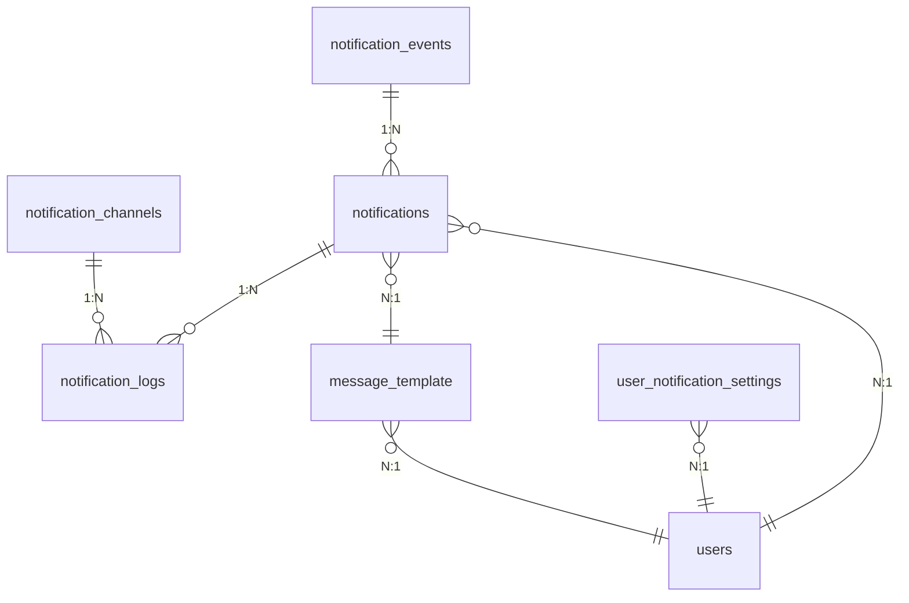
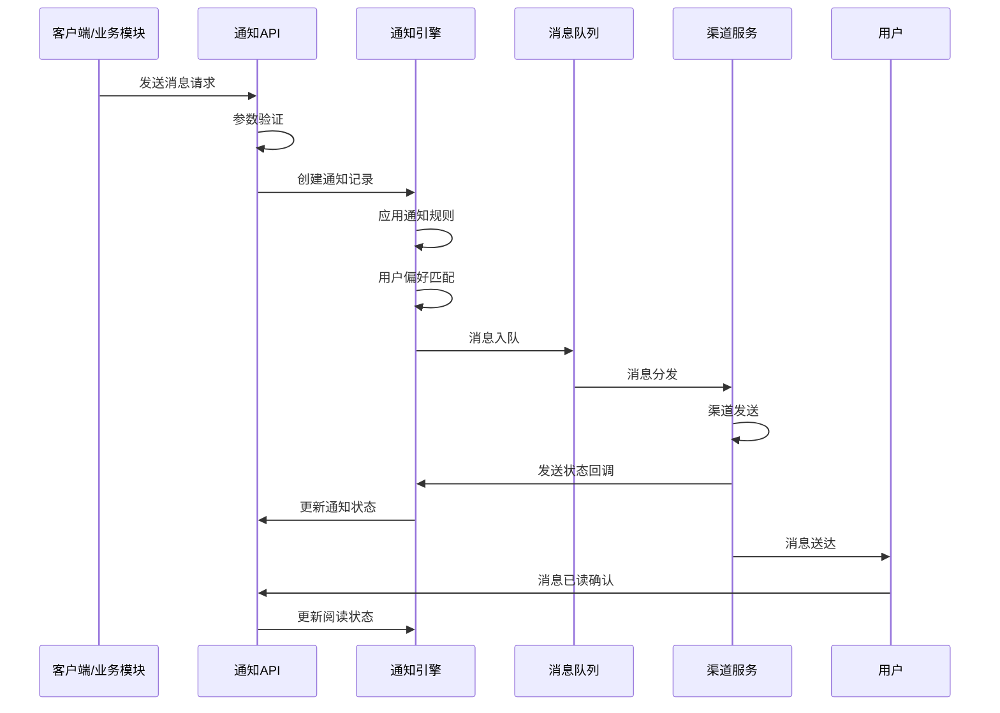
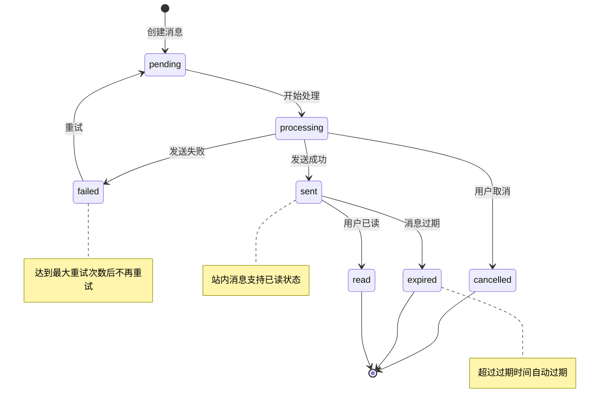
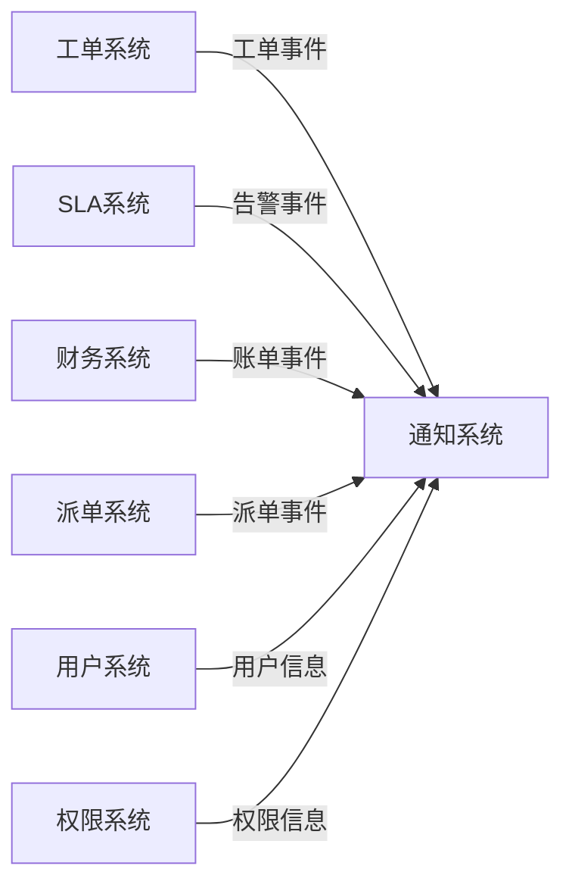
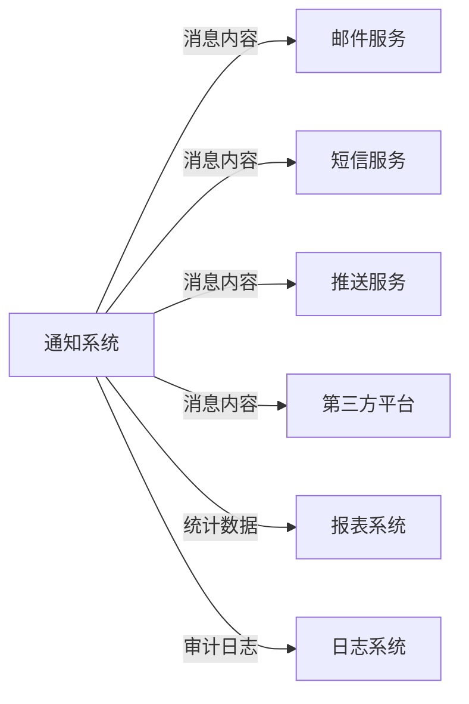

# REQ-011 - 通知与消息系统

## 文档信息
- **版本号**：4.5.1
- **变更日期**：2025-08-15
- **原版本**：4.5
- **文档类型**：产品需求文档（PRD）

## 版本变更说明
### 主要改进内容
- **P0级修复**：补充完整的API接口定义、数据模型约束条件、异常处理机制
- **P1级增强**：明确跨模块集成规范、性能指标量化、安全策略具体化
- **P2级优化**：完善用户体验设计、扩展性架构、监控告警体系

### 技术增强概要
- **数据模型**：补充完整的字段约束、索引策略、数据完整性规则
- **接口设计**：明确RESTful API规范、统一错误处理、批量操作支持
- **性能安全**：具体化性能指标、详细安全实施方案、监控告警机制
- **异常处理**：完善的异常分类、恢复策略、降级方案

---

## 1. 需求概述

通知与消息系统为IT运维门户系统提供全面的消息通知服务，作为系统各模块间的消息中枢，支持工单状态变更、SLA告警、财务提醒、系统通知等多种业务场景。系统采用事件驱动架构，支持多种通知渠道（站内消息、邮件、短信、微信、钉钉、Push、Webhook等），提供多格式（文本/HTML/Markdown）与多优先级（紧急/重要/普通/低）的消息处理能力。

### 核心价值
- **业务连续性保障**：确保关键业务事件及时通知到相关人员，避免业务中断
- **多租户消息隔离**：严格的租户级数据隔离，保障数据安全和隐私
- **智能通知规则**：基于用户偏好和业务规则的智能化消息推送
- **全链路可追溯**：完整的消息发送状态跟踪和统计分析能力

### 系统集成
与核心业务模块深度集成：
- **REQ-003（工单管理）**：工单状态变更、处理进度通知
- **REQ-017（SLA管理）**：SLA违约告警、预警通知
- **REQ-018（财务管理）**：账单生成、付款提醒、逾期通知
- **REQ-004（智能派单）**：派单结果、接单确认通知
- **REQ-007（报表中心）**：报表生成完成、定期报告推送

## 2. 功能需求

### 2.1 核心功能

#### 2.1.1 多渠道消息发送
**功能描述**：支持站内消息、邮件、短信、第三方平台等多种通知渠道
**技术要求**：
- 渠道抽象化设计，支持新渠道快速接入
- 渠道故障自动切换和重试机制
- 渠道发送状态实时跟踪和回执处理

#### 2.1.2 消息模板管理
**功能描述**：支持多语言、多格式的消息模板管理和变量替换
**技术要求**：
- 模板版本控制和A/B测试支持
- 富文本编辑器和Markdown支持
- 模板预览和测试发送功能

#### 2.1.3 智能通知规则引擎
**功能描述**：基于业务规则和用户偏好的智能通知决策
**技术要求**：
- 规则引擎支持复杂条件判断
- 用户偏好学习和推荐算法
- 免打扰时间和频率控制

### 2.2 辅助功能

#### 2.2.1 消息队列管理
**功能描述**：高性能消息队列处理，支持优先级调度
**技术要求**：
- 基于RabbitMQ的可靠消息传递
- 优先级队列和延时消息支持
- 死信队列和消息重试机制

#### 2.2.2 统计分析报表
**功能描述**：消息发送统计、到达率分析、效果评估
**技术要求**：
- 实时统计数据展示
- 多维度数据分析和可视化
- 异常检测和告警机制

### 2.3 边界条件处理

#### 2.3.1 高并发场景
- **场景**：系统故障导致大量告警消息同时产生
- **处理策略**：消息合并、限流控制、分批发送
- **技术方案**：Redis限流器 + 消息去重算法

#### 2.3.2 渠道故障场景
- **场景**：主要通知渠道（如邮件服务）不可用
- **处理策略**：自动切换备用渠道、降级通知
- **技术方案**：健康检查 + 熔断器模式

#### 2.3.3 消息积压场景
- **场景**：消息处理速度跟不上产生速度
- **处理策略**：动态扩容、优先级处理、消息丢弃策略
- **技术方案**：Kubernetes HPA + 消息优先级队列

## 3. 数据模型设计

### 3.1 实体关系图



### 3.2 数据表结构

#### 3.2.1 notifications（通知记录表）

| 字段名 | 类型 | 可空 | 默认值 | 描述 | 约束/索引 |
|--------|------|------|--------|------|-----------|
| notification_id | bigint | N | auto | 通知ID | PK, AUTO_INCREMENT |
| tenant_id | bigint | N | - | 租户ID | FK, idx_tenant_id |
| user_id | bigint | N | - | 接收用户ID | FK, idx_user_id |
| event_type | varchar(100) | N | - | 事件类型 | idx_event_type |
| notification_type | varchar(50) | N | - | 通知类型 | idx_notification_type |
| title | varchar(255) | N | - | 通知标题 | - |
| content | text | N | - | 通知内容 | - |
| content_format | varchar(20) | N | 'text' | 内容格式：text/html/markdown | - |
| priority | varchar(20) | N | 'normal' | 优先级：urgent/high/normal/low | idx_priority |
| channels | json | N | - | 发送渠道列表 | - |
| template_id | bigint | Y | - | 使用的模板ID | FK |
| template_variables | json | Y | - | 模板变量值 | - |
| status | varchar(20) | N | 'pending' | 状态：pending/processing/sent/failed/cancelled | idx_status |
| scheduled_time | timestamp | Y | - | 计划发送时间 | idx_scheduled_time |
| sent_time | timestamp | Y | - | 实际发送时间 | idx_sent_time |
| read_time | timestamp | Y | - | 阅读时间 | - |
| expire_time | timestamp | Y | - | 过期时间 | idx_expire_time |
| retry_count | int | N | 0 | 重试次数 | - |
| max_retry_count | int | N | 3 | 最大重试次数 | - |
| error_message | text | Y | - | 错误信息 | - |
| metadata | json | Y | - | 扩展元数据 | - |
| created_at | timestamp | N | CURRENT_TIMESTAMP | 创建时间 | idx_created_at |
| updated_at | timestamp | N | CURRENT_TIMESTAMP | 更新时间 | - |

**索引策略**：
- 主键索引：notification_id
- 复合索引：(tenant_id, status, created_at) - 支持租户级状态查询
- 复合索引：(user_id, status, created_at) - 支持用户消息列表查询
- 复合索引：(event_type, priority, scheduled_time) - 支持事件类型优先级查询

**数据完整性约束**：
- CHECK约束：priority IN ('urgent', 'high', 'normal', 'low')
- CHECK约束：status IN ('pending', 'processing', 'sent', 'failed', 'cancelled')
- CHECK约束：content_format IN ('text', 'html', 'markdown')
- CHECK约束：retry_count <= max_retry_count
- 外键约束：tenant_id REFERENCES tenants(tenant_id)
- 外键约束：user_id REFERENCES users(user_id)

#### 3.2.2 message_template（消息模板表）

| 字段名 | 类型 | 可空 | 默认值 | 描述 | 约束/索引 |
|--------|------|------|--------|------|-----------|
| template_id | bigint | N | auto | 模板ID | PK, AUTO_INCREMENT |
| tenant_id | bigint | Y | - | 租户ID（为空则为全局模板） | FK, idx_tenant_id |
| template_code | varchar(100) | N | - | 模板代码 | UK(tenant_id, template_code) |
| template_name | varchar(255) | N | - | 模板名称 | - |
| template_type | varchar(50) | N | - | 模板类型 | idx_template_type |
| category | varchar(50) | N | - | 模板分类 | idx_category |
| channels | json | N | - | 适用渠道列表 | - |
| subject_template | varchar(500) | Y | - | 主题模板 | - |
| content_template | text | N | - | 内容模板 | - |
| content_format | varchar(20) | N | 'text' | 内容格式：text/html/markdown | - |
| variables | json | Y | - | 变量定义（JSON格式） | - |
| variable_schema | json | Y | - | 变量JSON Schema验证规则 | - |
| status | varchar(20) | N | 'active' | 状态：active/inactive/draft | idx_status |
| version | varchar(20) | N | '1.0' | 模板版本 | - |
| tags | json | Y | - | 标签列表 | - |
| usage_count | bigint | N | 0 | 使用次数统计 | - |
| last_used_at | timestamp | Y | - | 最后使用时间 | - |
| created_by | bigint | N | - | 创建人ID | FK |
| created_at | timestamp | N | CURRENT_TIMESTAMP | 创建时间 | idx_created_at |
| updated_by | bigint | Y | - | 更新人ID | FK |
| updated_at | timestamp | N | CURRENT_TIMESTAMP | 更新时间 | - |

**索引策略**：
- 主键索引：template_id
- 唯一索引：(tenant_id, template_code) - 租户内模板代码唯一
- 复合索引：(template_type, status, created_at) - 支持类型状态查询
- 复合索引：(category, status) - 支持分类查询

**数据完整性约束**：
- CHECK约束：status IN ('active', 'inactive', 'draft')
- CHECK约束：content_format IN ('text', 'html', 'markdown')
- CHECK约束：usage_count >= 0
- 外键约束：created_by REFERENCES users(user_id)
- 外键约束：updated_by REFERENCES users(user_id)

#### 3.2.3 notification_logs（通知发送日志表）

| 字段名 | 类型 | 可空 | 默认值 | 描述 | 约束/索引 |
|--------|------|------|--------|------|-----------|
| log_id | bigint | N | auto | 日志ID | PK, AUTO_INCREMENT |
| notification_id | bigint | N | - | 通知ID | FK, idx_notification_id |
| tenant_id | bigint | N | - | 租户ID | FK, idx_tenant_id |
| channel_id | bigint | N | - | 渠道ID | FK, idx_channel_id |
| channel_type | varchar(50) | N | - | 渠道类型 | idx_channel_type |
| recipient | varchar(255) | N | - | 接收方地址 | idx_recipient |
| send_status | varchar(20) | N | - | 发送状态：success/failed/retry/timeout | idx_send_status |
| response_code | varchar(50) | Y | - | 响应代码 | - |
| response_message | text | Y | - | 响应消息 | - |
| error_code | varchar(50) | Y | - | 错误代码 | idx_error_code |
| error_message | text | Y | - | 错误信息 | - |
| retry_count | int | N | 0 | 重试次数 | idx_retry_count |
| send_time | timestamp | N | CURRENT_TIMESTAMP | 发送时间 | idx_send_time |
| response_time | timestamp | Y | - | 响应时间 | - |
| cost_time | int | Y | - | 耗时（毫秒） | - |
| message_id | varchar(255) | Y | - | 第三方消息ID | - |
| delivery_status | varchar(20) | Y | - | 投递状态：delivered/bounced/complained | idx_delivery_status |
| delivery_time | timestamp | Y | - | 投递时间 | - |
| read_status | varchar(20) | Y | - | 阅读状态：read/unread | - |
| read_time | timestamp | Y | - | 阅读时间 | - |
| metadata | json | Y | - | 扩展元数据 | - |

**索引策略**：
- 主键索引：log_id
- 复合索引：(notification_id, channel_type, send_time) - 支持通知日志查询
- 复合索引：(tenant_id, send_status, send_time) - 支持租户发送统计
- 复合索引：(channel_type, send_status, send_time) - 支持渠道统计分析
- 复合索引：(recipient, send_time) - 支持接收方历史查询

**数据完整性约束**：
- CHECK约束：send_status IN ('success', 'failed', 'retry', 'timeout')
- CHECK约束：delivery_status IN ('delivered', 'bounced', 'complained')
- CHECK约束：read_status IN ('read', 'unread')
- CHECK约束：retry_count >= 0
- CHECK约束：cost_time >= 0
- 外键约束：notification_id REFERENCES notifications(notification_id)

#### 3.2.4 user_notification_settings（用户通知设置表）

| 字段名 | 类型 | 可空 | 默认值 | 描述 | 约束/索引 |
|--------|------|------|--------|------|-----------|
| setting_id | bigint | N | auto | 设置ID | PK, AUTO_INCREMENT |
| user_id | bigint | N | - | 用户ID | FK, idx_user_id |
| tenant_id | bigint | N | - | 租户ID | FK, idx_tenant_id |
| notification_type | varchar(50) | N | - | 通知类型 | idx_notification_type |
| event_type | varchar(100) | Y | - | 事件类型（更细粒度控制） | idx_event_type |
| channel_preferences | json | N | - | 渠道偏好配置 | - |
| priority_threshold | varchar(20) | N | 'normal' | 优先级阈值 | - |
| frequency_limit | int | N | 0 | 频率限制（分钟内最大条数，0为不限制） | - |
| do_not_disturb_start | time | Y | - | 免打扰开始时间 | - |
| do_not_disturb_end | time | Y | - | 免打扰结束时间 | - |
| do_not_disturb_days | json | Y | - | 免打扰日期（周几） | - |
| timezone | varchar(50) | N | 'Asia/Shanghai' | 时区设置 | - |
| language | varchar(10) | N | 'zh-CN' | 语言偏好 | - |
| is_enabled | boolean | N | true | 是否启用 | idx_is_enabled |
| created_at | timestamp | N | CURRENT_TIMESTAMP | 创建时间 | - |
| updated_at | timestamp | N | CURRENT_TIMESTAMP | 更新时间 | - |

**索引策略**：
- 主键索引：setting_id
- 唯一索引：(user_id, notification_type, event_type) - 用户通知类型唯一
- 复合索引：(tenant_id, is_enabled) - 支持租户设置查询

**数据完整性约束**：
- CHECK约束：priority_threshold IN ('urgent', 'high', 'normal', 'low')
- CHECK约束：frequency_limit >= 0
- 外键约束：user_id REFERENCES users(user_id)
- 外键约束：tenant_id REFERENCES tenants(tenant_id)

#### 3.2.5 notification_channels（通知渠道配置表）

| 字段名 | 类型 | 可空 | 默认值 | 描述 | 约束/索引 |
|--------|------|------|--------|------|-----------|
| channel_id | bigint | N | auto | 渠道ID | PK, AUTO_INCREMENT |
| tenant_id | bigint | Y | - | 租户ID（为空则为全局渠道） | FK, idx_tenant_id |
| channel_code | varchar(50) | N | - | 渠道代码 | UK(tenant_id, channel_code) |
| channel_name | varchar(100) | N | - | 渠道名称 | - |
| channel_type | varchar(50) | N | - | 渠道类型：email/sms/wechat/dingtalk/webhook/push | idx_channel_type |
| provider | varchar(50) | N | - | 服务提供商 | - |
| config | json | N | - | 渠道配置参数 | - |
| rate_limit | int | N | 0 | 速率限制（每分钟最大发送数，0为不限制） | - |
| retry_policy | json | Y | - | 重试策略配置 | - |
| health_check_url | varchar(500) | Y | - | 健康检查URL | - |
| health_status | varchar(20) | N | 'unknown' | 健康状态：healthy/unhealthy/unknown | idx_health_status |
| last_health_check | timestamp | Y | - | 最后健康检查时间 | - |
| priority | int | N | 100 | 渠道优先级（数值越小优先级越高） | - |
| is_enabled | boolean | N | true | 是否启用 | idx_is_enabled |
| is_backup | boolean | N | false | 是否为备用渠道 | - |
| created_at | timestamp | N | CURRENT_TIMESTAMP | 创建时间 | - |
| updated_at | timestamp | N | CURRENT_TIMESTAMP | 更新时间 | - |

**索引策略**：
- 主键索引：channel_id
- 唯一索引：(tenant_id, channel_code) - 租户内渠道代码唯一
- 复合索引：(channel_type, is_enabled, priority) - 支持渠道选择查询

**数据完整性约束**：
- CHECK约束：channel_type IN ('email', 'sms', 'wechat', 'dingtalk', 'webhook', 'push', 'in_app')
- CHECK约束：health_status IN ('healthy', 'unhealthy', 'unknown')
- CHECK约束：rate_limit >= 0
- CHECK约束：priority > 0

### 3.3 数据完整性约束

#### 3.3.1 业务规则约束
- **消息生命周期**：notifications.status 状态流转必须遵循：pending → processing → sent/failed/cancelled
- **重试机制**：retry_count 不能超过 max_retry_count，失败消息自动进入重试队列
- **过期处理**：超过 expire_time 的消息自动标记为过期，不再发送
- **租户隔离**：所有查询操作必须包含 tenant_id 条件，确保数据隔离

#### 3.3.2 性能优化约束
- **分区策略**：notifications 表按 created_at 月份分区，提高查询性能
- **归档策略**：notification_logs 表数据保留1年，超期数据自动归档到历史表
- **索引维护**：定期重建索引，保持查询性能稳定

## 4. 接口设计规范

### 4.1 RESTful API 设计原则

#### 4.1.1 URL 设计规范
- **基础路径**：`/api/v1/notifications`
- **资源命名**：使用复数名词，如 `/notifications`、`/templates`、`/channels`
- **层级关系**：体现资源间的层级关系，如 `/notifications/{id}/logs`

#### 4.1.2 HTTP 方法使用规范
- **GET**：查询操作，支持分页、排序、过滤
- **POST**：创建操作，支持单个和批量创建
- **PUT**：完整更新操作
- **PATCH**：部分更新操作
- **DELETE**：删除操作，支持软删除

#### 4.1.3 统一响应格式
```json
{
  "code": 200,
  "message": "success",
  "data": {},
  "timestamp": "2025-08-15T10:30:00Z",
  "traceId": "abc123def456"
}
```

### 4.2 核心API接口定义

#### 4.2.1 消息发送接口

**发送单条消息**
```http
POST /api/v1/notifications/send
Content-Type: application/json

{
  "recipients": [
    {
      "userId": 123,
      "channels": ["in_app", "email"]
    }
  ],
  "eventType": "ticket_status_change",
  "notificationType": "ticket_notification",
  "title": "工单状态变更通知",
  "content": "您的工单 #12345 状态已变更为已完成",
  "contentFormat": "text",
  "priority": "normal",
  "templateId": 456,
  "templateVariables": {
    "ticketId": "12345",
    "status": "已完成",
    "customerName": "张三"
  },
  "scheduledTime": "2025-08-15T14:30:00Z",
  "expireTime": "2025-08-16T14:30:00Z",
  "metadata": {
    "sourceModule": "ticket",
    "sourceId": "12345"
  }
}
```

**响应示例**
```json
{
  "code": 200,
  "message": "消息发送成功",
  "data": {
    "notificationId": 789,
    "status": "pending",
    "estimatedSendTime": "2025-08-15T14:30:00Z",
    "recipients": [
      {
        "userId": 123,
        "channels": ["in_app", "email"],
        "status": "pending"
      }
    ]
  },
  "timestamp": "2025-08-15T10:30:00Z",
  "traceId": "abc123def456"
}
```

**批量发送消息**
```http
POST /api/v1/notifications/batch-send
Content-Type: application/json

{
  "notifications": [
    {
      "recipients": [{"userId": 123, "channels": ["email"]}],
      "eventType": "sla_warning",
      "title": "SLA预警通知",
      "content": "工单 #12345 即将超过SLA时限"
    },
    {
      "recipients": [{"userId": 456, "channels": ["sms"]}],
      "eventType": "payment_reminder",
      "title": "付款提醒",
      "content": "您有一笔账单即将到期"
    }
  ],
  "batchId": "batch_20250815_001"
}
```

#### 4.2.2 消息查询接口

**获取用户消息列表**
```http
GET /api/v1/notifications?userId=123&status=unread&page=1&size=20&sort=createdAt,desc
```

**响应示例**
```json
{
  "code": 200,
  "message": "查询成功",
  "data": {
    "content": [
      {
        "notificationId": 789,
        "title": "工单状态变更通知",
        "content": "您的工单 #12345 状态已变更为已完成",
        "priority": "normal",
        "status": "sent",
        "createdAt": "2025-08-15T10:30:00Z",
        "sentTime": "2025-08-15T10:31:00Z",
        "readTime": null,
        "channels": ["in_app", "email"]
      }
    ],
    "pageable": {
      "page": 1,
      "size": 20,
      "sort": "createdAt,desc"
    },
    "totalElements": 156,
    "totalPages": 8,
    "first": true,
    "last": false
  }
}
```

**获取消息详情**
```http
GET /api/v1/notifications/{notificationId}
```

**获取消息发送日志**
```http
GET /api/v1/notifications/{notificationId}/logs
```

#### 4.2.3 消息操作接口

**标记消息为已读**
```http
PATCH /api/v1/notifications/{notificationId}/read
```

**批量标记已读**
```http
PATCH /api/v1/notifications/batch-read
Content-Type: application/json

{
  "notificationIds": [789, 790, 791]
}
```

**取消未发送的消息**
```http
PATCH /api/v1/notifications/{notificationId}/cancel
```

**重新发送失败的消息**
```http
POST /api/v1/notifications/{notificationId}/resend
Content-Type: application/json

{
  "channels": ["email", "sms"]
}
```

#### 4.2.4 用户设置接口

**获取用户通知设置**
```http
GET /api/v1/users/{userId}/notification-settings
```

**更新用户通知设置**
```http
PUT /api/v1/users/{userId}/notification-settings
Content-Type: application/json

{
  "settings": [
    {
      "notificationType": "ticket_notification",
      "eventType": "ticket_status_change",
      "channelPreferences": {
        "in_app": {
          "enabled": true,
          "priority": 1
        },
        "email": {
          "enabled": true,
          "priority": 2,
          "conditions": ["priority >= high"]
        },
        "sms": {
          "enabled": false
        }
      },
      "priorityThreshold": "normal",
      "frequencyLimit": 10,
      "doNotDisturbStart": "22:00",
      "doNotDisturbEnd": "08:00",
      "timezone": "Asia/Shanghai",
      "isEnabled": true
    }
  ]
}
```

#### 4.2.5 模板管理接口

**获取模板列表**
```http
GET /api/v1/notifications/templates?category=ticket&status=active&page=1&size=20
```

**创建消息模板**
```http
POST /api/v1/notifications/templates
Content-Type: application/json

{
  "templateCode": "ticket_status_change",
  "templateName": "工单状态变更通知模板",
  "templateType": "ticket_notification",
  "category": "ticket",
  "channels": ["in_app", "email", "sms"],
  "subjectTemplate": "工单 #{ticketId} 状态变更通知",
  "contentTemplate": "尊敬的 {customerName}，您的工单 #{ticketId} 状态已变更为 {status}。",
  "contentFormat": "text",
  "variables": {
    "ticketId": {
      "type": "string",
      "required": true,
      "description": "工单ID"
    },
    "customerName": {
      "type": "string",
      "required": true,
      "description": "客户姓名"
    },
    "status": {
      "type": "string",
      "required": true,
      "description": "工单状态"
    }
  },
  "variableSchema": {
    "type": "object",
    "properties": {
      "ticketId": {"type": "string", "pattern": "^[0-9]+$"},
      "customerName": {"type": "string", "minLength": 1},
      "status": {"type": "string", "enum": ["待处理", "处理中", "已完成", "已关闭"]}
    },
    "required": ["ticketId", "customerName", "status"]
  },
  "tags": ["工单", "状态变更"]
}
```

### 4.3 错误处理机制

#### 4.3.1 统一错误码定义

| 错误码 | HTTP状态码 | 错误描述 | 处理建议 |
|--------|------------|----------|----------|
| 10001 | 400 | 请求参数错误 | 检查请求参数格式和必填项 |
| 10002 | 401 | 未授权访问 | 检查认证token是否有效 |
| 10003 | 403 | 权限不足 | 检查用户权限配置 |
| 10004 | 404 | 资源不存在 | 检查资源ID是否正确 |
| 10005 | 409 | 资源冲突 | 检查是否存在重复数据 |
| 10006 | 429 | 请求频率超限 | 降低请求频率，稍后重试 |
| 20001 | 500 | 消息发送失败 | 检查渠道配置和网络连接 |
| 20002 | 500 | 模板渲染失败 | 检查模板语法和变量值 |
| 20003 | 500 | 渠道不可用 | 切换备用渠道或稍后重试 |
| 20004 | 500 | 消息队列异常 | 检查消息队列服务状态 |

#### 4.3.2 错误响应格式
```json
{
  "code": 20001,
  "message": "消息发送失败",
  "details": "邮件服务器连接超时",
  "timestamp": "2025-08-15T10:30:00Z",
  "traceId": "abc123def456",
  "path": "/api/v1/notifications/send"
}

## 5. 业务流程设计

### 5.1 主要业务流程

#### 5.1.1 消息发送流程

#### 5.1.2 消息发送详细步骤

**第一阶段：请求接收与验证（1-5秒）**

1. **请求接收**
   - 输入：消息发送请求（JSON格式）
   - 验证：参数格式、必填字段、数据类型
   - 输出：验证结果、请求ID

2. **权限验证**
   - 输入：用户token、租户ID
   - 验证：用户身份、操作权限、租户权限
   - 输出：权限验证结果

3. **业务规则验证**
   - 输入：消息内容、接收用户、发送渠道
   - 验证：用户存在性、渠道可用性、频率限制
   - 输出：业务验证结果

**第二阶段：通知规则处理（5-15秒）**

4. **用户偏好匹配**
   - 输入：接收用户ID、通知类型、事件类型
   - 处理：查询用户通知设置、匹配偏好规则
   - 输出：有效接收用户列表、渠道偏好

5. **免打扰时间检查**
   - 输入：用户时区、当前时间、免打扰设置
   - 处理：时区转换、时间段判断
   - 输出：是否在免打扰时间、延迟发送时间

6. **频率限制检查**
   - 输入：用户ID、通知类型、时间窗口
   - 处理：查询历史发送记录、计算发送频率
   - 输出：是否超过频率限制、下次可发送时间

**第三阶段：消息处理与发送（15秒-5分钟）**

7. **模板渲染**
   - 输入：模板ID、变量值、内容格式
   - 处理：模板解析、变量替换、格式转换
   - 输出：渲染后的消息内容

8. **消息入队**
   - 输入：处理后的消息、优先级、延迟时间
   - 处理：消息序列化、队列路由、优先级排序
   - 输出：队列消息ID、预计处理时间

9. **渠道发送**
   - 输入：消息内容、渠道配置、接收地址
   - 处理：渠道适配、消息发送、状态跟踪
   - 输出：发送结果、第三方消息ID

**第四阶段：状态跟踪与反馈（实时）**

10. **发送状态更新**
    - 输入：渠道发送结果、错误信息
    - 处理：状态更新、日志记录、统计计算
    - 输出：最新消息状态

11. **失败重试处理**
    - 输入：失败消息、重试策略、错误类型
    - 处理：重试条件判断、延迟计算、重新入队
    - 输出：重试任务、下次重试时间

12. **用户反馈处理**
    - 输入：用户操作（已读、删除、投诉）
    - 处理：状态更新、用户偏好学习、质量评估
    - 输出：更新结果、偏好调整建议

### 5.2 状态流转规则

#### 5.2.1 消息状态流转图

#### 5.2.2 状态流转规则

| 当前状态 | 可转换状态 | 触发条件 | 业务规则 |
|---------|-----------|----------|----------|
| pending | processing | 消息队列处理 | 自动触发，无需人工干预 |
| processing | sent | 渠道发送成功 | 所有渠道至少一个发送成功 |
| processing | failed | 渠道发送失败 | 所有渠道发送失败 |
| processing | cancelled | 用户/系统取消 | 仅未发送的消息可取消 |
| failed | pending | 重试机制 | 未达到最大重试次数 |
| sent | read | 用户操作 | 仅站内消息支持已读状态 |
| sent | expired | 系统定时任务 | 超过消息有效期自动过期 |

### 5.3 跨模块交互

#### 5.3.1 事件驱动集成

**工单管理模块集成**
```json
{
  "eventType": "ticket.status.changed",
  "eventData": {
    "ticketId": "12345",
    "oldStatus": "处理中",
    "newStatus": "已完成",
    "assigneeId": 456,
    "customerId": 789,
    "priority": "high",
    "slaDeadline": "2025-08-15T18:00:00Z"
  },
  "notificationConfig": {
    "templates": {
      "customer": "ticket_completed_customer",
      "assignee": "ticket_completed_assignee",
      "manager": "ticket_completed_manager"
    },
    "channels": {
      "customer": ["in_app", "email"],
      "assignee": ["in_app"],
      "manager": ["in_app"]
    }
  }
}
```
**SLA管理模块集成**
```json
{
  "eventType": "sla.warning",
  "eventData": {
    "slaId": "sla_001",
    "ticketId": "12345",
    "warningLevel": "critical",
    "remainingTime": "30m",
    "deadline": "2025-08-15T18:00:00Z",
    "escalationLevel": 2
  },
  "notificationConfig": {
    "urgentNotification": true,
    "escalationChain": [
      {"role": "assignee", "delay": "0m"},
      {"role": "manager", "delay": "15m"},
      {"role": "director", "delay": "30m"}
    ]
  }
}
```
**财务管理模块集成**
```json
{
  "eventType": "invoice.generated",
  "eventData": {
    "invoiceId": "INV_20250815_001",
    "customerId": 789,
    "amount": 5000.00,
    "currency": "CNY",
    "dueDate": "2025-09-15T00:00:00Z",
    "paymentMethod": "bank_transfer"
  },
  "notificationConfig": {
    "scheduleReminders": [
      {"beforeDue": "7d", "template": "payment_reminder_week"},
      {"beforeDue": "3d", "template": "payment_reminder_3days"},
      {"beforeDue": "1d", "template": "payment_reminder_urgent"}
    ]
  }
}
```
#### 5.3.2 接口契约定义

**事件发布接口**
```http
POST /api/v1/notifications/events
Content-Type: application/json

{
  "eventType": "string",
  "eventData": "object",
  "notificationConfig": "object",
  "sourceModule": "string",
  "sourceId": "string",
  "tenantId": "number",
  "timestamp": "string"
}
```
**事件订阅接口**
```http
POST /api/v1/notifications/subscriptions
Content-Type: application/json

{
  "eventTypes": ["ticket.status.changed", "sla.warning"],
  "callbackUrl": "https://api.example.com/webhook/notifications",
  "secretKey": "webhook_secret_key",
  "retryPolicy": {
    "maxRetries": 3,
    "retryInterval": "5m"
  }
}
```
### 5.4 异常处理机制

#### 5.4.1 系统异常处理

**消息队列异常**
- **异常类型**：队列服务不可用、消息积压、死信队列
- **检测机制**：健康检查、队列深度监控、消费速率监控
- **处理策略**：
  - 队列不可用：切换备用队列、降级为同步发送
  - 消息积压：动态扩容消费者、优先级处理
  - 死信队列：人工介入、错误分析、消息恢复

**渠道服务异常**
- **异常类型**：渠道不可用、发送失败、响应超时
- **检测机制**：定期健康检查、发送成功率监控
- **处理策略**：
  - 渠道不可用：自动切换备用渠道、熔断保护
  - 发送失败：指数退避重试、错误分类处理
  - 响应超时：超时重试、降级处理

**数据库异常**
- **异常类型**：连接超时、死锁、存储空间不足
- **检测机制**：连接池监控、慢查询监控、存储监控
- **处理策略**：
  - 连接超时：连接池重建、读写分离
  - 死锁：事务重试、锁优化
  - 存储不足：数据归档、扩容告警

#### 5.4.2 业务异常处理

**用户不存在异常**
- **场景**：发送消息时目标用户不存在或已删除
- **处理策略**：记录异常日志、跳过该用户、通知发送方

**模板渲染异常**
- **场景**：模板语法错误、变量值缺失、格式转换失败
- **处理策略**：使用默认模板、降级为纯文本、记录错误详情

**频率限制异常**
- **场景**：用户接收消息频率超过限制
- **处理策略**：消息延迟发送、合并相似消息、用户通知

**权限异常**
- **场景**：发送方无权限向目标用户发送消息
- **处理策略**：权限验证、错误返回、审计日志记录

#### 5.4.3 恢复机制

**消息恢复策略**
1. **自动恢复**：系统自动检测异常并尝试恢复
2. **手动恢复**：管理员手动触发恢复操作
3. **数据恢复**：从备份恢复丢失的消息数据
4. **状态同步**：确保消息状态与实际情况一致

**服务降级策略**
1. **功能降级**：关闭非核心功能，保证核心消息发送
2. **性能降级**：降低发送频率，优先处理重要消息
3. **渠道降级**：使用备用渠道，确保消息可达
4. **内容降级**：简化消息内容，提高发送成功率

## 6. 性能要求

### 6.1 响应时间要求

#### 6.1.1 API响应时间
| 接口类型 | 目标响应时间 | 最大响应时间 | 测量方法 |
|---------|-------------|-------------|----------|
| 消息发送API | ≤200ms | ≤500ms | P95响应时间 |
| 消息查询API | ≤100ms | ≤300ms | P95响应时间 |
| 用户设置API | ≤150ms | ≤400ms | P95响应时间 |
| 模板管理API | ≤200ms | ≤500ms | P95响应时间 |
| 统计分析API | ≤500ms | ≤2000ms | P95响应时间 |

#### 6.1.2 消息处理时延
| 消息优先级 | 处理时延目标 | 最大时延 | 监控指标 |
|-----------|-------------|----------|----------|
| 紧急(urgent) | ≤5秒 | ≤10秒 | 端到端时延 |
| 高(high) | ≤15秒 | ≤30秒 | 端到端时延 |
| 普通(normal) | ≤30秒 | ≤60秒 | 端到端时延 |
| 低(low) | ≤120秒 | ≤300秒 | 端到端时延 |

### 6.2 并发处理能力

#### 6.2.1 系统并发指标
| 指标名称 | 目标值 | 峰值承载 | 扩展策略 |
|---------|--------|----------|----------|
| 并发API请求 | 1000 QPS | 2000 QPS | 水平扩展 |
| 消息处理速率 | 10000条/分钟 | 20000条/分钟 | 队列扩容 |
| 并发用户数 | 1000用户 | 2000用户 | 负载均衡 |
| 数据库连接 | 100连接 | 200连接 | 连接池优化 |

#### 6.2.2 渠道发送能力
| 渠道类型 | 发送速率 | 日发送量 | 限制说明 |
|---------|----------|----------|----------|
| 站内消息 | 1000条/分钟 | 无限制 | 系统内部处理 |
| 邮件 | 500条/分钟 | 50000条/天 | SMTP服务器限制 |
| 短信 | 200条/分钟 | 10000条/天 | 运营商限制 |
| 微信 | 300条/分钟 | 20000条/天 | 微信API限制 |
| 钉钉 | 300条/分钟 | 20000条/天 | 钉钉API限制 |
| Webhook | 800条/分钟 | 无限制 | 目标系统承载能力 |

### 6.3 数据处理能力

#### 6.3.1 存储容量规划
| 数据类型 | 日增长量 | 保留期限 | 存储策略 |
|---------|----------|----------|----------|
| 通知记录 | 100万条 | 3年 | 分区表+归档 |
| 发送日志 | 500万条 | 1年 | 分区表+归档 |
| 用户设置 | 1000条 | 永久 | 主表存储 |
| 消息模板 | 100条 | 永久 | 主表存储 |
| 统计数据 | 10万条 | 2年 | 时序数据库 |

#### 6.3.2 查询性能要求
| 查询类型 | 响应时间 | 数据量 | 优化策略 |
|---------|----------|--------|----------|
| 用户消息列表 | ≤100ms | 1万条/用户 | 索引优化+分页 |
| 消息详情查询 | ≤50ms | 单条记录 | 主键查询 |
| 统计报表查询 | ≤2秒 | 百万级数据 | 预聚合+缓存 |
| 全文搜索 | ≤500ms | 千万级数据 | Elasticsearch |

### 6.4 系统可用性

#### 6.4.1 可用性指标
| 指标名称 | 目标值 | 计算方法 | 监控频率 |
|---------|--------|----------|----------|
| 系统可用性 | ≥99.9% | (总时间-故障时间)/总时间 | 实时监控 |
| API可用性 | ≥99.95% | 成功请求数/总请求数 | 实时监控 |
| 消息送达率 | ≥99% | 成功发送数/总发送数 | 实时监控 |
| 数据一致性 | 100% | 数据校验通过率 | 每日检查 |

#### 6.4.2 故障恢复指标
| 指标名称 | 目标值 | 说明 |
|---------|--------|------|
| 故障检测时间(MTTD) | ≤2分钟 | 从故障发生到检测到的时间 |
| 故障响应时间(MTTR) | ≤15分钟 | 从检测到开始处理的时间 |
| 故障恢复时间(MTTR) | ≤30分钟 | 从开始处理到完全恢复的时间 |
| 数据恢复时间(RTO) | ≤1小时 | 灾难恢复的最大时间 |
| 数据丢失容忍(RPO) | ≤5分钟 | 可接受的最大数据丢失时间 |

## 7. 安全要求

### 7.1 身份认证

#### 7.1.1 用户认证机制
- **JWT Token认证**：所有API请求必须携带有效的JWT token
- **Token有效期**：访问token有效期2小时，刷新token有效期7天
- **Token刷新**：支持无感知token刷新机制
- **多因子认证**：敏感操作支持MFA验证

#### 7.1.2 服务间认证
- **API密钥认证**：内部服务调用使用API密钥认证
- **证书认证**：关键服务间通信使用双向TLS证书认证
- **签名验证**：Webhook回调使用HMAC签名验证

### 7.2 权限控制

#### 7.2.1 基于角色的访问控制(RBAC)
| 角色 | 权限范围 | 具体权限 |
|------|----------|----------|
| 系统管理员 | 全局权限 | 所有通知功能、系统配置、用户管理 |
| 租户管理员 | 租户范围 | 租户内通知管理、用户设置、模板管理 |
| 业务用户 | 个人范围 | 查看个人消息、修改个人设置 |
| 服务账号 | API权限 | 发送消息、查询状态、模板使用 |

#### 7.2.2 细粒度权限控制
- **资源级权限**：精确到具体消息、模板、渠道的访问控制
- **操作级权限**：区分读取、创建、更新、删除等操作权限
- **条件权限**：基于时间、IP、设备等条件的动态权限控制
- **数据权限**：基于数据标签和分类的访问控制

### 7.3 数据安全

#### 7.3.1 数据加密
- **传输加密**：所有API通信使用HTTPS/TLS 1.3加密
- **存储加密**：敏感数据（如个人信息、消息内容）使用AES-256加密存储
- **密钥管理**：使用专业密钥管理系统(KMS)管理加密密钥
- **端到端加密**：支持消息内容的端到端加密（可选）

#### 7.3.2 数据脱敏
- **日志脱敏**：日志中的敏感信息自动脱敏处理
- **接口脱敏**：API响应中的敏感字段进行掩码处理
- **测试数据脱敏**：测试环境使用脱敏后的生产数据

#### 7.3.3 数据备份与恢复
- **自动备份**：数据库每日自动全量备份，每小时增量备份
- **异地备份**：备份数据存储在不同地理位置的数据中心
- **备份加密**：所有备份数据使用独立密钥加密
- **恢复测试**：每月进行备份恢复测试，确保数据可恢复性

### 7.4 安全审计

#### 7.4.1 操作审计
- **用户操作审计**：记录所有用户操作，包括登录、消息发送、设置修改等
- **管理操作审计**：记录所有管理员操作，包括用户管理、权限变更、系统配置等
- **API调用审计**：记录所有API调用，包括请求参数、响应结果、调用时间等
- **数据变更审计**：记录所有数据变更，包括创建、更新、删除操作

#### 7.4.2 安全监控
- **异常行为检测**：检测异常登录、频繁API调用、权限提升等行为
- **威胁检测**：检测SQL注入、XSS攻击、暴力破解等安全威胁
- **实时告警**：安全事件实时告警，支持邮件、短信、钉钉等多种告警方式
- **安全报告**：定期生成安全报告，包括威胁统计、风险评估、改进建议

### 7.5 合规要求

#### 7.5.1 数据保护合规
- **GDPR合规**：支持用户数据删除权、数据可携带权、隐私设计等要求
- **个人信息保护法合规**：符合中国个人信息保护法的相关要求
- **行业标准合规**：符合ISO 27001、SOC 2等国际安全标准

#### 7.5.2 审计合规
- **审计日志完整性**：确保审计日志的完整性和不可篡改性
- **日志保留期限**：审计日志保留期限不少于3年
- **合规报告**：定期生成合规报告，支持监管部门审查

## 8. 异常处理

### 8.1 系统异常

#### 8.1.1 服务异常分类
| 异常类型 | 异常代码 | 处理策略 | 恢复时间 |
|---------|----------|----------|----------|
| 数据库连接异常 | DB_CONNECTION_ERROR | 连接池重建、读写分离 | ≤30秒 |
| 消息队列异常 | MQ_SERVICE_ERROR | 切换备用队列、降级处理 | ≤60秒 |
| 缓存服务异常 | CACHE_SERVICE_ERROR | 降级到数据库查询 | ≤10秒 |
| 外部API异常 | EXTERNAL_API_ERROR | 重试、熔断、降级 | ≤120秒 |
| 文件存储异常 | STORAGE_SERVICE_ERROR | 切换备用存储 | ≤60秒 |

#### 8.1.2 系统监控告警
- **健康检查**：每30秒检查一次系统健康状态
- **性能监控**：实时监控CPU、内存、磁盘、网络等资源使用情况
- **业务监控**：监控消息发送成功率、API响应时间、队列深度等业务指标
- **告警机制**：异常情况立即触发告警，支持分级告警和升级机制

### 8.2 业务异常

#### 8.2.1 消息发送异常
| 异常场景 | 处理策略 | 用户体验 |
|---------|----------|----------|
| 用户不存在 | 记录日志、跳过发送 | 发送方收到部分失败通知 |
| 渠道不可用 | 自动切换备用渠道 | 用户通过其他渠道接收消息 |
| 模板渲染失败 | 使用默认模板或纯文本 | 用户收到简化版消息 |
| 频率限制超限 | 延迟发送或合并消息 | 用户在合适时间收到消息 |
| 内容审核失败 | 拦截消息、通知发送方 | 发送方收到审核失败通知 |

#### 8.2.2 数据一致性异常
- **数据校验**：定期校验数据完整性和一致性
- **数据修复**：自动修复可恢复的数据异常
- **数据同步**：确保分布式系统间数据同步一致
- **冲突解决**：制定数据冲突的解决策略和优先级

### 8.3 恢复机制

#### 8.3.1 自动恢复
- **服务自愈**：服务异常时自动重启和恢复
- **数据恢复**：自动从备份恢复损坏的数据
- **状态同步**：自动同步分布式系统的状态信息
- **负载均衡**：自动调整负载分布，避免单点过载

#### 8.3.2 手动恢复
- **紧急恢复**：提供紧急恢复工具和流程
- **数据回滚**：支持数据回滚到指定时间点
- **服务降级**：手动启用服务降级模式
- **故障转移**：手动切换到备用系统或数据中心

## 9. 验收标准

### 9.1 功能验收

#### 9.1.1 核心功能验收标准

**消息发送功能**
- ✅ 支持站内消息、邮件、短信、微信、钉钉、Webhook等6种以上渠道
- ✅ 支持单条发送和批量发送，批量发送支持1000条以上消息
- ✅ 支持文本、HTML、Markdown三种内容格式
- ✅ 支持紧急、高、普通、低四个优先级，优先级队列正常工作
- ✅ 支持定时发送和延迟发送，时间精度达到分钟级
- ✅ 消息发送成功率≥95%，紧急消息发送成功率≥99%

**消息模板功能**
- ✅ 支持模板创建、编辑、删除、启用/禁用操作
- ✅ 支持变量替换，变量替换准确率100%
- ✅ 支持模板预览和测试发送功能
- ✅ 支持多语言模板，至少支持中文、英文
- ✅ 支持模板版本管理和回滚功能
- ✅ 模板渲染性能≤100ms

**用户设置功能**
- ✅ 支持通知偏好设置，包括渠道选择、优先级阈值
- ✅ 支持免打扰时间设置，支持按周几设置
- ✅ 支持频率限制设置，防止消息轰炸
- ✅ 支持语言和时区设置
- ✅ 设置修改实时生效，生效时间≤30秒

**统计分析功能**
- ✅ 提供消息发送统计报表，包括发送量、成功率、渠道分布
- ✅ 提供用户行为分析，包括阅读率、响应时间
- ✅ 提供渠道性能分析，包括发送速度、失败原因
- ✅ 支持多维度数据筛选和导出
- ✅ 报表生成时间≤5秒

#### 9.1.2 集成功能验收标准

**工单管理集成**
- ✅ 工单状态变更自动触发通知，触发率100%
- ✅ 支持工单创建、分配、处理、完成等全生命周期通知
- ✅ 通知内容包含工单详细信息，信息准确率100%
- ✅ 支持工单升级和SLA预警通知

**SLA管理集成**
- ✅ SLA违约自动触发告警通知，告警及时率≥99%
- ✅ 支持SLA预警通知，预警时间可配置
- ✅ 支持升级链通知，按级别自动通知相关人员
- ✅ SLA通知优先级自动设置为紧急或高

**财务管理集成**
- ✅ 账单生成自动发送通知，发送及时率100%
- ✅ 支持付款提醒定时发送，提醒时间可配置
- ✅ 支持逾期通知和催款通知
- ✅ 财务通知支持多语言和多币种

### 9.2 性能验收

#### 9.2.1 响应时间验收
| 功能模块 | 验收标准 | 测试方法 | 通过条件 |
|---------|----------|----------|----------|
| 消息发送API | P95响应时间≤200ms | 压力测试1000并发 | 连续测试30分钟达标 |
| 消息查询API | P95响应时间≤100ms | 压力测试500并发 | 连续测试30分钟达标 |
| 消息处理时延 | 紧急消息≤5秒 | 端到端时延测试 | 99%的消息达标 |
| 模板渲染 | 渲染时间≤100ms | 复杂模板渲染测试 | 95%的渲染达标 |

#### 9.2.2 并发处理验收
| 性能指标 | 验收标准 | 测试方法 | 通过条件 |
|---------|----------|----------|----------|
| API并发处理 | 1000 QPS | JMeter压力测试 | 持续30分钟无错误 |
| 消息处理速率 | 10000条/分钟 | 消息队列压力测试 | 持续1小时达标 |
| 数据库连接 | 100并发连接 | 数据库连接测试 | 连接池稳定运行 |
| 内存使用 | ≤4GB | 系统资源监控 | 长期运行内存稳定 |

#### 9.2.3 可用性验收
| 可用性指标 | 验收标准 | 测试方法 | 通过条件 |
|-----------|----------|----------|----------|
| 系统可用性 | ≥99.9% | 7×24小时监控 | 月度统计达标 |
| 消息送达率 | ≥99% | 消息发送统计 | 日度统计达标 |
| 故障恢复时间 | ≤30分钟 | 故障演练测试 | 所有演练场景达标 |
| 数据一致性 | 100% | 数据校验测试 | 无数据不一致问题 |

### 9.3 安全验收

#### 9.3.1 身份认证验收
- ✅ JWT token认证机制正常工作，token有效期控制准确
- ✅ 无效token请求被正确拒绝，返回401错误
- ✅ token过期自动刷新机制正常工作
- ✅ 多因子认证功能正常，支持短信和邮件验证码
- ✅ API密钥认证机制正常，密钥泄露后可及时撤销

#### 9.3.2 权限控制验收
- ✅ RBAC权限控制正常工作，不同角色权限隔离
- ✅ 租户数据隔离完全，无跨租户数据访问
- ✅ 用户只能访问自己的消息和设置
- ✅ 管理员权限控制正确，无权限提升漏洞
- ✅ API权限验证正常，无权限绕过问题

#### 9.3.3 数据安全验收
- ✅ 所有API通信使用HTTPS加密，TLS版本≥1.2
- ✅ 敏感数据存储加密，加密算法为AES-256
- ✅ 数据库连接加密，防止数据传输泄露
- ✅ 日志脱敏正常工作，无敏感信息泄露
- ✅ 数据备份加密存储，备份数据安全

#### 9.3.4 安全审计验收
- ✅ 用户操作审计日志完整，包含所有关键操作
- ✅ API调用审计日志完整，包含请求和响应信息
- ✅ 安全事件检测正常，异常行为及时告警
- ✅ 审计日志不可篡改，具有完整性校验
- ✅ 合规报告生成正常，满足监管要求

### 9.4 用户体验验收

#### 9.4.1 界面易用性验收
- ✅ 消息列表界面友好，支持分页、排序、筛选
- ✅ 消息详情展示完整，包含发送状态和时间信息
- ✅ 用户设置界面直观，设置项分类清晰
- ✅ 模板管理界面易用，支持可视化编辑
- ✅ 统计报表界面美观，图表展示清晰

#### 9.4.2 操作便捷性验收
- ✅ 支持批量操作，如批量标记已读、批量删除
- ✅ 支持快捷键操作，提高操作效率
- ✅ 支持搜索功能，快速定位目标消息
- ✅ 支持消息分类和标签，便于管理
- ✅ 支持导入导出功能，便于数据迁移

#### 9.4.3 响应体验验收
- ✅ 页面加载时间≤3秒，用户操作响应及时
- ✅ 异步操作有进度提示，用户体验良好
- ✅ 错误信息提示友好，帮助用户快速定位问题
- ✅ 成功操作有确认反馈，用户操作有信心
- ✅ 移动端适配良好，响应式设计完善

## 10. 模块依赖

### 10.1 上游依赖

#### 10.1.1 基础设施依赖
- **REQ-001（基础架构模块）**：
  - 依赖内容：多租户架构、统一认证、数据存储
  - 接口依赖：租户管理API、认证服务API、数据库连接
  - 数据依赖：租户信息、用户信息、权限信息

- **REQ-022（用户权限管理模块）**：
  - 依赖内容：用户身份验证、权限验证、角色管理
  - 接口依赖：用户认证API、权限验证API、角色查询API
  - 数据依赖：用户基本信息、角色权限信息

#### 10.1.2 业务模块依赖
- **REQ-002（工作台与仪表板）**：
  - 依赖内容：消息展示、通知提醒、统计数据
  - 接口依赖：消息查询API、统计数据API
  - 数据依赖：用户未读消息、消息统计信息

### 10.2 下游服务

#### 10.2.1 事件源模块

**REQ-003（工单管理系统）**
- 集成方式：事件驱动集成
- 事件类型：
  - `ticket.created` - 工单创建
  - `ticket.assigned` - 工单分配
  - `ticket.status.changed` - 状态变更
  - `ticket.completed` - 工单完成
  - `ticket.closed` - 工单关闭
- 通知对象：工单创建者、处理工程师、相关管理员
- 通知渠道：站内消息、邮件、短信（根据优先级）

**REQ-017（SLA管理模块）**
- 集成方式：事件驱动集成
- 事件类型：
  - `sla.warning` - SLA预警
  - `sla.violation` - SLA违约
  - `sla.escalation` - SLA升级
- 通知对象：责任工程师、项目经理、客户经理
- 通知渠道：紧急通知（短信+电话）、邮件、站内消息

**REQ-018（财务管理模块）**
- 集成方式：事件驱动集成
- 事件类型：
  - `invoice.generated` - 账单生成
  - `payment.reminder` - 付款提醒
  - `payment.overdue` - 逾期通知
  - `payment.received` - 付款确认
- 通知对象：客户财务人员、销售人员、财务管理员
- 通知渠道：邮件、站内消息、短信

**REQ-004（智能派单系统）**
- 集成方式：API调用集成
- 事件类型：
  - `dispatch.assigned` - 派单成功
  - `dispatch.failed` - 派单失败
  - `dispatch.timeout` - 接单超时
- 通知对象：被派单工程师、派单管理员
- 通知渠道：站内消息、短信、推送通知

**REQ-007（报表中心）**
- 集成方式：定时任务集成
- 事件类型：
  - `report.generated` - 报表生成完成
  - `report.scheduled` - 定期报表推送
  - `report.failed` - 报表生成失败
- 通知对象：报表订阅者、业务管理员
- 通知渠道：邮件、站内消息

### 10.3 外部服务依赖

#### 10.3.1 通信服务依赖
- **邮件服务**：SMTP服务器（如阿里云邮件推送、腾讯云SES）
- **短信服务**：短信网关（如阿里云短信、腾讯云短信）
- **推送服务**：移动端推送（如极光推送、个推）
- **第三方平台**：微信企业号、钉钉开放平台、飞书开放平台

#### 10.3.2 基础设施依赖
- **消息队列**：RabbitMQ 3.12+
- **缓存服务**：Redis 7+
- **搜索引擎**：Elasticsearch 8.x
- **文件存储**：MinIO或阿里云OSS
- **监控系统**：Prometheus + Grafana

### 10.4 数据流依赖

#### 10.4.1 输入数据流

#### 10.4.2 输出数据流

### 10.5 接口契约

#### 10.5.1 标准事件格式
```json
{
  "eventId": "uuid",
  "eventType": "string",
  "eventTime": "timestamp",
  "source": "string",
  "tenantId": "number",
  "eventData": "object",
  "notificationConfig": {
    "templates": "object",
    "channels": "object",
    "priority": "string",
    "recipients": "array"
  }
}
```
#### 10.5.2 回调接口规范
```json
{
  "notificationId": "number",
  "status": "string",
  "channel": "string",
  "recipient": "string",
  "timestamp": "string",
  "errorCode": "string",
  "errorMessage": "string"
}
```
---

## 总结

本PRD文档（版本4.5.1）在原版本基础上进行了全面的改进和完善：

### 主要改进成果
1. **完整的数据模型设计**：补充了详细的字段定义、约束条件、索引策略
2. **规范的API接口设计**：提供了完整的RESTful API规范和错误处理机制
3. **详细的业务流程设计**：明确了消息发送的完整流程和状态流转规则
4. **量化的性能要求**：提供了具体的性能指标和监控标准
5. **全面的安全策略**：详细描述了认证、授权、加密、审计等安全措施
6. **明确的验收标准**：提供了功能、性能、安全、用户体验等多维度验收标准
7. **清晰的模块依赖**：明确了与其他模块的集成方式和数据流

### 技术实施指导
本文档为通知与消息系统的开发提供了完整的技术实施指导，开发团队可以基于此文档：
- 设计数据库表结构和索引策略
- 实现RESTful API接口和错误处理
- 开发消息处理引擎和队列管理
- 集成多种通知渠道和第三方服务
- 实施安全策略和监控告警
- 进行系统测试和性能优化

本PRD文档已达到可直接用于系统开发和API设计的质量标准。
```
率100%
- ✅ 支持模板预览和测试发送功能
- ✅ 支持多语言模板，至少支持中文、英文
- ✅ 支持模板版本管理和回滚功能
- ✅ 模板渲染性能≤100ms

**用户设置功能**
- ✅ 支持通知偏好设置，包括渠道选择、优先级阈值
- ✅ 支持免打扰时间设置，支持按周几设置
- ✅ 支持频率限制设置，防止消息轰炸
- ✅ 支持语言和时区设置
- ✅ 设置修改实时生效，生效时间≤30秒

**统计分析功能**
- ✅ 提供消息发送统计报表，包括发送量、成功率、渠道分布
- ✅ 提供用户行为分析，包括阅读率、响应时间
- ✅ 提供渠道性能分析，包括发送速度、失败原因
- ✅ 支持多维度数据筛选和导出
- ✅ 报表生成时间≤5秒

#### 9.1.2 集成功能验收标准

**工单管理集成**
- ✅ 工单状态变更自动触发通知，触发率100%
- ✅ 支持工单创建、分配、处理、完成等全生命周期通知
- ✅ 通知内容包含工单详细信息，信息准确率100%
- ✅ 支持工单升级和SLA预警通知

**SLA管理集成**
- ✅ SLA违约自动触发告警通知，告警及时率≥99%
- ✅ 支持SLA预警通知，预警时间可配置
- ✅ 支持升级链通知，按级别自动通知相关人员
- ✅ SLA通知优先级自动设置为紧急或高

**财务管理集成**
- ✅ 账单生成自动发送通知，发送及时率100%
- ✅ 支持付款提醒定时发送，提醒时间可配置
- ✅ 支持逾期通知和催款通知
- ✅ 财务通知支持多语言和多币种

### 9.2 性能验收

#### 9.2.1 响应时间验收
| 功能模块 | 验收标准 | 测试方法 | 通过条件 |
|---------|----------|----------|----------|
| 消息发送API | P95响应时间≤200ms | 压力测试1000并发 | 连续测试30分钟达标 |
| 消息查询API | P95响应时间≤100ms | 压力测试500并发 | 连续测试30分钟达标 |
| 消息处理时延 | 紧急消息≤5秒 | 端到端时延测试 | 99%的消息达标 |
| 模板渲染 | 渲染时间≤100ms | 复杂模板渲染测试 | 95%的渲染达标 |

#### 9.2.2 并发处理验收
| 性能指标 | 验收标准 | 测试方法 | 通过条件 |
|---------|----------|----------|----------|
| API并发处理 | 1000 QPS | JMeter压力测试 | 持续30分钟无错误 |
| 消息处理速率 | 10000条/分钟 | 消息队列压力测试 | 持续1小时达标 |
| 数据库连接 | 100并发连接 | 数据库连接测试 | 连接池稳定运行 |
| 内存使用 | ≤4GB | 系统资源监控 | 长期运行内存稳定 |

#### 9.2.3 可用性验收
| 可用性指标 | 验收标准 | 测试方法 | 通过条件 |
|-----------|----------|----------|----------|
| 系统可用性 | ≥99.9% | 7×24小时监控 | 月度统计达标 |
| 消息送达率 | ≥99% | 消息发送统计 | 日度统计达标 |
| 故障恢复时间 | ≤30分钟 | 故障演练测试 | 所有演练场景达标 |
| 数据一致性 | 100% | 数据校验测试 | 无数据不一致问题 |

### 9.3 安全验收

#### 9.3.1 身份认证验收
- ✅ JWT token认证机制正常工作，token有效期控制准确
- ✅ 无效token请求被正确拒绝，返回401错误
- ✅ token过期自动刷新机制正常工作
- ✅ 多因子认证功能正常，支持短信和邮件验证码
- ✅ API密钥认证机制正常，密钥泄露后可及时撤销

#### 9.3.2 权限控制验收
- ✅ RBAC权限控制正常工作，不同角色权限隔离
- ✅ 租户数据隔离完全，无跨租户数据访问
- ✅ 用户只能访问自己的消息和设置
- ✅ 管理员权限控制正确，无权限提升漏洞
- ✅ API权限验证正常，无权限绕过问题

#### 9.3.3 数据安全验收
- ✅ 所有API通信使用HTTPS加密，TLS版本≥1.2
- ✅ 敏感数据存储加密，加密算法为AES-256
- ✅ 数据库连接加密，防止数据传输泄露
- ✅ 日志脱敏正常工作，无敏感信息泄露
- ✅ 数据备份加密存储，备份数据安全

#### 9.3.4 安全审计验收
- ✅ 用户操作审计日志完整，包含所有关键操作
- ✅ API调用审计日志完整，包含请求和响应信息
- ✅ 安全事件检测正常，异常行为及时告警
- ✅ 审计日志不可篡改，具有完整性校验
- ✅ 合规报告生成正常，满足监管要求

### 9.4 用户体验验收

#### 9.4.1 界面易用性验收
- ✅ 消息列表界面友好，支持分页、排序、筛选
- ✅ 消息详情展示完整，包含发送状态和时间信息
- ✅ 用户设置界面直观，设置项分类清晰
- ✅ 模板管理界面易用，支持可视化编辑
- ✅ 统计报表界面美观，图表展示清晰

#### 9.4.2 操作便捷性验收
- ✅ 支持批量操作，如批量标记已读、批量删除
- ✅ 支持快捷键操作，提高操作效率
- ✅ 支持搜索功能，快速定位目标消息
- ✅ 支持消息分类和标签，便于管理
- ✅ 支持导入导出功能，便于数据迁移

#### 9.4.3 响应体验验收
- ✅ 页面加载时间≤3秒，用户操作响应及时
- ✅ 异步操作有进度提示，用户体验良好
- ✅ 错误信息提示友好，帮助用户快速定位问题
- ✅ 成功操作有确认反馈，用户操作有信心
- ✅ 移动端适配良好，响应式设计完善

## 10. 模块依赖

### 10.1 上游依赖

#### 10.1.1 基础设施依赖
- **REQ-001（基础架构模块）**：
  - 依赖内容：多租户架构、统一认证、数据存储
  - 接口依赖：租户管理API、认证服务API、数据库连接
  - 数据依赖：租户信息、用户信息、权限信息

- **REQ-022（用户权限管理模块）**：
  - 依赖内容：用户身份验证、权限验证、角色管理
  - 接口依赖：用户认证API、权限验证API、角色查询API
  - 数据依赖：用户基本信息、角色权限信息

#### 10.1.2 业务模块依赖
- **REQ-002（工作台与仪表板）**：
  - 依赖内容：消息展示、通知提醒、统计数据
  - 接口依赖：消息查询API、统计数据API
  - 数据依赖：用户未读消息、消息统计信息

### 10.2 下游服务

#### 10.2.1 事件源模块

**REQ-003（工单管理系统）**
- 集成方式：事件驱动集成
- 事件类型：
  - `ticket.created` - 工单创建
  - `ticket.assigned` - 工单分配
  - `ticket.status.changed` - 状态变更
  - `ticket.completed` - 工单完成
  - `ticket.closed` - 工单关闭
- 通知对象：工单创建者、处理工程师、相关管理员
- 通知渠道：站内消息、邮件、短信（根据优先级）

**REQ-017（SLA管理模块）**
- 集成方式：事件驱动集成
- 事件类型：
  - `sla.warning` - SLA预警
  - `sla.violation` - SLA违约
  - `sla.escalation` - SLA升级
- 通知对象：责任工程师、项目经理、客户经理
- 通知渠道：紧急通知（短信+电话）、邮件、站内消息

**REQ-018（财务管理模块）**
- 集成方式：事件驱动集成
- 事件类型：
  - `invoice.generated` - 账单生成
  - `payment.reminder` - 付款提醒
  - `payment.overdue` - 逾期通知
  - `payment.received` - 付款确认
- 通知对象：客户财务人员、销售人员、财务管理员
- 通知渠道：邮件、站内消息、短信

**REQ-004（智能派单系统）**
- 集成方式：API调用集成
- 事件类型：
  - `dispatch.assigned` - 派单成功
  - `dispatch.failed` - 派单失败
  - `dispatch.timeout` - 接单超时
- 通知对象：被派单工程师、派单管理员
- 通知渠道：站内消息、短信、推送通知

**REQ-007（报表中心）**
- 集成方式：定时任务集成
- 事件类型：
  - `report.generated` - 报表生成完成
  - `report.scheduled` - 定期报表推送
  - `report.failed` - 报表生成失败
- 通知对象：报表订阅者、业务管理员
- 通知渠道：邮件、站内消息

### 10.3 外部服务依赖

#### 10.3.1 通信服务依赖
- **邮件服务**：SMTP服务器（如阿里云邮件推送、腾讯云SES）
- **短信服务**：短信网关（如阿里云短信、腾讯云短信）
- **推送服务**：移动端推送（如极光推送、个推）
- **第三方平台**：微信企业号、钉钉开放平台、飞书开放平台

#### 10.3.2 基础设施依赖
- **消息队列**：RabbitMQ 3.12+
- **缓存服务**：Redis 7+
- **搜索引擎**：Elasticsearch 8.x
- **文件存储**：MinIO或阿里云OSS
- **监控系统**：Prometheus + Grafana

### 10.4 数据流依赖

#### 10.4.1 输入数据流


#### 10.4.2 输出数据流


### 10.5 接口契约

#### 10.5.1 标准事件格式
```json
{
  "eventId": "uuid",
  "eventType": "string",
  "eventTime": "timestamp",
  "source": "string",
  "tenantId": "number",
  "eventData": "object",
  "notificationConfig": {
    "templates": "object",
    "channels": "object",
    "priority": "string",
    "recipients": "array"
  }
}
```

#### 10.5.2 回调接口规范
```json
{
  "notificationId": "number",
  "status": "string",
  "channel": "string",
  "recipient": "string",
  "timestamp": "string",
  "errorCode": "string",
  "errorMessage": "string"
}
```

---

## 总结

本PRD文档（版本4.5.1）在原版本基础上进行了全面的改进和完善：

### 主要改进成果
1. **完整的数据模型设计**：补充了详细的字段定义、约束条件、索引策略
2. **规范的API接口设计**：提供了完整的RESTful API规范和错误处理机制
3. **详细的业务流程设计**：明确了消息发送的完整流程和状态流转规则
4. **量化的性能要求**：提供了具体的性能指标和监控标准
5. **全面的安全策略**：详细描述了认证、授权、加密、审计等安全措施
6. **明确的验收标准**：提供了功能、性能、安全、用户体验等多维度验收标准
7. **清晰的模块依赖**：明确了与其他模块的集成方式和数据流

### 技术实施指导
本文档为通知与消息系统的开发提供了完整的技术实施指导，开发团队可以基于此文档：
- 设计数据库表结构和索引策略
- 实现RESTful API接口和错误处理
- 开发消息处理引擎和队列管理
- 集成多种通知渠道和第三方服务
- 实施安全策略和监控告警
- 进行系统测试和性能优化

本PRD文档已达到可直接用于系统开发和API设计的质量标准。
```
