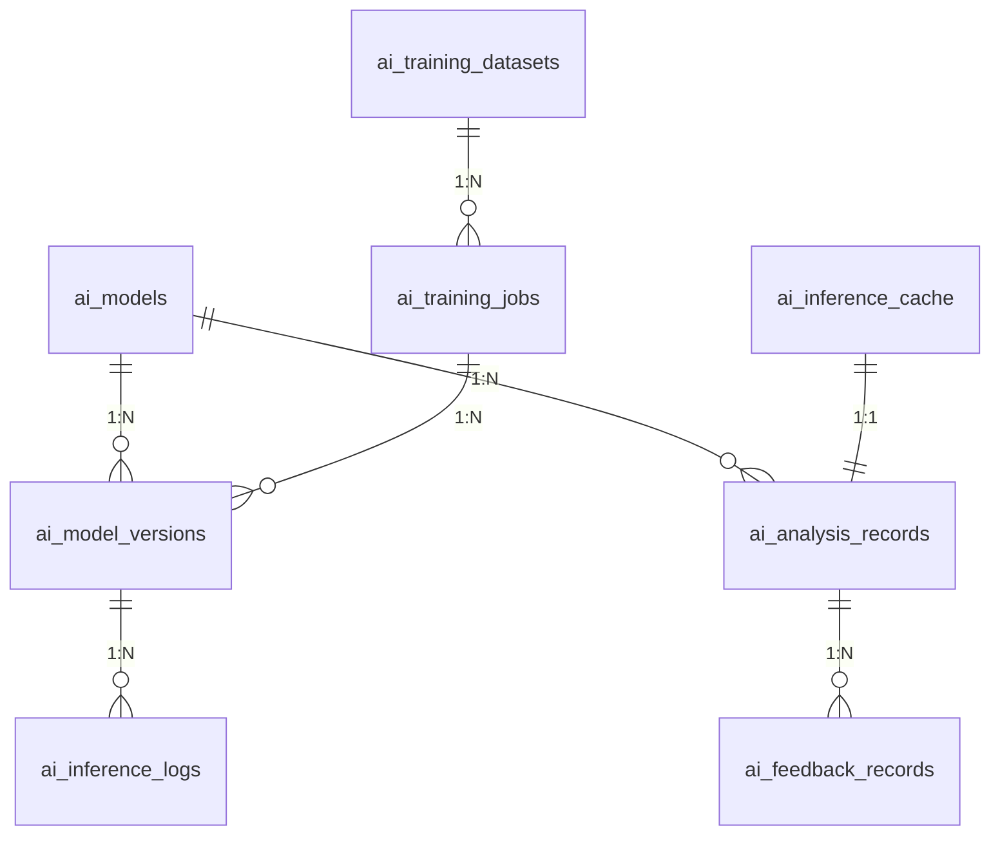
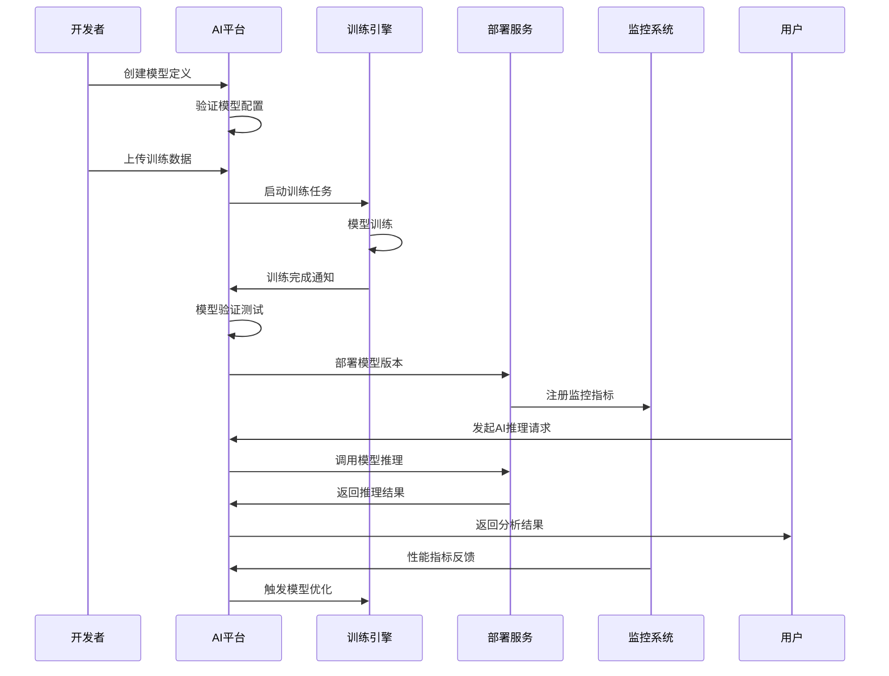
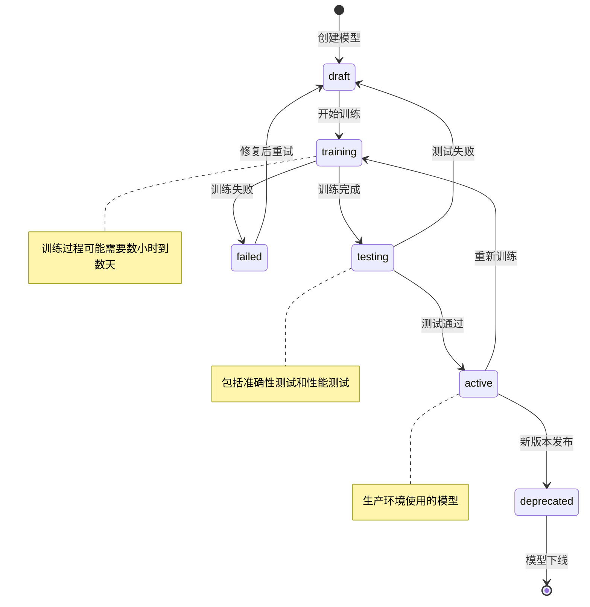
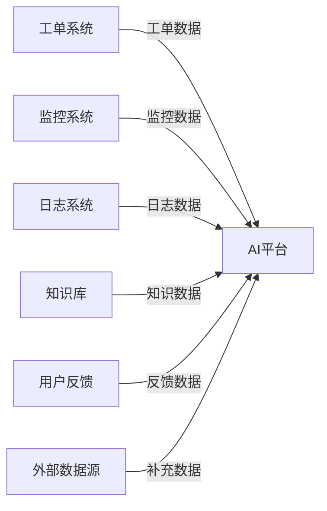
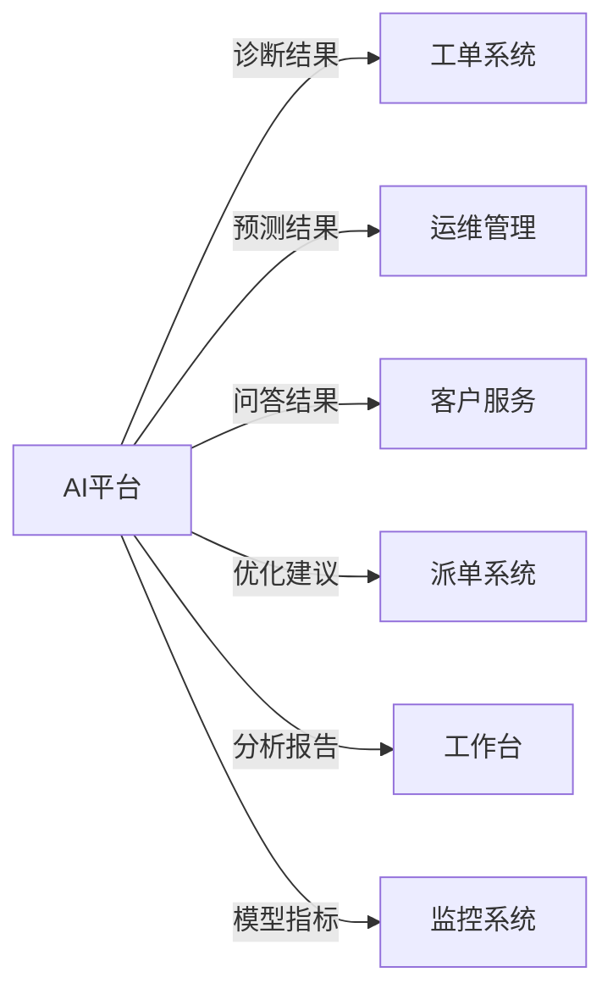

# REQ-013 - 智能分析与AI功能

## 文档信息
- **版本号**：4.5.1
- **变更日期**：2025-08-15
- **原版本**：4.5
- **文档类型**：产品需求文档（PRD）

## 版本变更说明
### 主要改进内容
- **P0级修复**：补充完整的AI数据模型设计、规范化API接口定义、AI模型生命周期管理流程
- **P1级增强**：明确AI安全策略实施方案、量化性能指标、跨模块集成规范
- **P2级优化**：完善AI模型监控告警、用户体验优化、扩展性架构设计

### 技术增强概要
- **数据模型**：新增AI训练数据管理、模型版本控制、推理缓存、性能监控等7个核心数据表
- **接口设计**：规范化RESTful API设计，统一错误处理，支持批量操作和流式处理
- **AI架构**：完善AI模型训练、部署、监控、更新的完整生命周期管理
- **性能安全**：具体化AI性能指标、详细安全实施方案、监控告警机制

---

## 1. 需求概述

智能分析与AI功能模块为IT运维门户系统提供全面的人工智能和机器学习能力，作为系统的智能大脑，通过深度学习、自然语言处理、数据挖掘等AI技术，从海量运维数据中学习模式和规律，为运维团队提供智能化的决策支持和自动化处理能力。

### 核心价值
- **智能故障诊断**：基于历史数据和实时监控，快速定位故障根因，提供精准解决方案
- **预测性维护**：通过趋势分析和异常检测，预测设备故障，实现主动维护
- **智能问答服务**：结合知识库和大语言模型，提供7×24小时智能技术支持
- **自动化决策**：基于规则引擎和机器学习，实现运维流程的智能自动化

### 技术架构特点
- **混合AI架构**：支持本地模型与云端大语言模型的混合推理
- **可插拔设计**：统一AI网关，支持多种AI模型和服务的灵活接入
- **成本控制**：智能缓存机制、QPS限额控制、成本优化策略
- **持续学习**：支持在线学习和模型持续优化

### 系统集成
与核心业务模块深度集成：
- **REQ-003（工单管理）**：智能故障诊断、工单分类、解决方案推荐
- **REQ-004（智能派单）**：AI优化派单策略、工程师技能匹配
- **REQ-005（知识库管理）**：AI驱动的知识推荐、智能问答
- **REQ-009（运维管理）**：异常检测、性能预测、容量规划
- **REQ-019（客户自助服务）**：智能客服、自助问题解决

## 2. 功能需求

### 2.1 核心功能

#### 2.1.1 智能故障诊断
**功能描述**：基于AI的故障根因分析和解决方案推荐
**技术要求**：
- 支持多模态数据融合（日志、监控、配置、历史记录）
- 实时故障诊断，响应时间≤5秒
- 诊断准确率≥85%，置信度评估机制
- 支持复杂故障的多层次分析

#### 2.1.2 预测性维护
**功能描述**：设备故障预测、性能趋势预测、容量规划
**技术要求**：
- 时间序列分析和异常检测算法
- 预测准确率≥90%，预测时间窗口可配置
- 支持多种预测模型（LSTM、Prophet、ARIMA等）
- 预测结果可视化和告警机制

#### 2.1.3 智能问答系统
**功能描述**：自然语言问答、知识推荐、技术支持
**技术要求**：
- 集成大语言模型（GPT、文心一言等）
- 问答准确率≥90%，响应时间≤3秒
- 支持多轮对话和上下文理解
- 知识库检索增强生成（RAG）

#### 2.1.4 异常检测
**功能描述**：自动识别系统异常和性能问题
**技术要求**：
- 无监督学习算法（Isolation Forest、One-Class SVM等）
- 检测准确率≥95%，误报率≤5%
- 实时异常检测，延迟≤30秒
- 支持多维度异常检测

### 2.2 辅助功能

#### 2.2.1 AI模型管理
**功能描述**：AI模型的训练、部署、版本管理、监控
**技术要求**：
- 支持模型版本控制和A/B测试
- 模型性能监控和自动重训练
- 支持多种ML框架（TensorFlow、PyTorch、Scikit-learn）
- 模型解释性和可视化

#### 2.2.2 数据处理引擎
**功能描述**：AI训练数据的采集、清洗、特征工程
**技术要求**：
- 支持批处理和流处理
- 数据质量监控和异常处理
- 特征工程自动化
- 数据血缘追踪

### 2.3 边界条件处理

#### 2.3.1 AI模型失效场景
- **场景**：AI模型推理失败或结果不可信
- **处理策略**：自动降级到规则引擎、备用模型、人工处理
- **技术方案**：多层次降级机制 + 置信度阈值控制

#### 2.3.2 数据质量异常
- **场景**：训练数据质量下降或数据漂移
- **处理策略**：数据质量监控、自动数据清洗、模型重训练
- **技术方案**：数据质量评分 + 自动化数据处理流水线

#### 2.3.3 计算资源不足
- **场景**：AI推理或训练任务超出计算资源限制
- **处理策略**：任务队列管理、资源动态调度、云端计算
- **技术方案**：Kubernetes HPA + 混合云计算架构

## 3. 数据模型设计

### 3.1 实体关系图



### 3.2 数据表结构

#### 3.2.1 ai_models（AI模型表）

| 字段名 | 类型 | 可空 | 默认值 | 描述 | 约束/索引 |
|--------|------|------|--------|------|-----------|
| model_id | bigint | N | auto | 模型ID | PK, AUTO_INCREMENT |
| tenant_id | bigint | N | - | 租户ID | FK, idx_tenant_id |
| model_name | varchar(100) | N | - | 模型名称 | idx_model_name |
| model_type | varchar(50) | N | - | 模型类型：diagnosis/prediction/qa/anomaly | idx_model_type |
| model_category | varchar(50) | N | - | 模型分类：local/cloud/hybrid | idx_model_category |
| algorithm_type | varchar(50) | N | - | 算法类型：neural_network/tree/svm/ensemble | - |
| business_domain | varchar(50) | N | - | 业务领域：server/network/database/application | idx_business_domain |
| model_description | text | Y | - | 模型描述 | - |
| input_schema | json | N | - | 输入数据Schema | - |
| output_schema | json | N | - | 输出数据Schema | - |
| performance_metrics | json | Y | - | 性能指标（准确率、召回率等） | - |
| resource_requirements | json | Y | - | 资源需求（CPU、GPU、内存） | - |
| current_version_id | bigint | Y | - | 当前版本ID | FK |
| status | varchar(20) | N | 'draft' | 状态：draft/training/testing/active/deprecated | idx_status |
| created_by | bigint | N | - | 创建人ID | FK |
| created_at | timestamp | N | CURRENT_TIMESTAMP | 创建时间 | idx_created_at |
| updated_at | timestamp | N | CURRENT_TIMESTAMP | 更新时间 | - |

**索引策略**：
- 主键索引：model_id
- 复合索引：(tenant_id, model_type, status) - 支持租户模型查询
- 复合索引：(business_domain, model_type) - 支持业务域查询
- 复合索引：(status, created_at) - 支持状态时间查询

**数据完整性约束**：
- CHECK约束：model_type IN ('diagnosis', 'prediction', 'qa', 'anomaly', 'classification')
- CHECK约束：model_category IN ('local', 'cloud', 'hybrid')
- CHECK约束：status IN ('draft', 'training', 'testing', 'active', 'deprecated')
- 外键约束：tenant_id REFERENCES tenants(tenant_id)
- 外键约束：created_by REFERENCES users(user_id)

#### 3.2.2 ai_model_versions（AI模型版本表）

| 字段名 | 类型 | 可空 | 默认值 | 描述 | 约束/索引 |
|--------|------|------|--------|------|-----------|
| version_id | bigint | N | auto | 版本ID | PK, AUTO_INCREMENT |
| model_id | bigint | N | - | 模型ID | FK, idx_model_id |
| version_number | varchar(20) | N | - | 版本号 | UK(model_id, version_number) |
| version_name | varchar(100) | Y | - | 版本名称 | - |
| model_file_path | varchar(500) | N | - | 模型文件路径 | - |
| model_config | json | N | - | 模型配置参数 | - |
| training_job_id | bigint | Y | - | 训练任务ID | FK |
| training_dataset_id | bigint | Y | - | 训练数据集ID | FK |
| validation_metrics | json | Y | - | 验证指标 | - |
| test_metrics | json | Y | - | 测试指标 | - |
| model_size | bigint | Y | - | 模型文件大小（字节） | - |
| inference_latency | int | Y | - | 推理延迟（毫秒） | - |
| memory_usage | bigint | Y | - | 内存使用量（字节） | - |
| deployment_config | json | Y | - | 部署配置 | - |
| status | varchar(20) | N | 'created' | 状态：created/training/testing/deployed/archived | idx_status |
| is_active | boolean | N | false | 是否为活跃版本 | idx_is_active |
| created_at | timestamp | N | CURRENT_TIMESTAMP | 创建时间 | idx_created_at |
| deployed_at | timestamp | Y | - | 部署时间 | - |
| archived_at | timestamp | Y | - | 归档时间 | - |

**索引策略**：
- 主键索引：version_id
- 唯一索引：(model_id, version_number) - 模型版本唯一
- 复合索引：(model_id, is_active, status) - 支持活跃版本查询
- 复合索引：(status, created_at) - 支持状态时间查询

**数据完整性约束**：
- CHECK约束：status IN ('created', 'training', 'testing', 'deployed', 'archived')
- CHECK约束：model_size > 0
- CHECK约束：inference_latency >= 0
- 外键约束：model_id REFERENCES ai_models(model_id)

#### 3.2.3 ai_training_datasets（AI训练数据集表）

| 字段名 | 类型 | 可空 | 默认值 | 描述 | 约束/索引 |
|--------|------|------|--------|------|-----------|
| dataset_id | bigint | N | auto | 数据集ID | PK, AUTO_INCREMENT |
| tenant_id | bigint | N | - | 租户ID | FK, idx_tenant_id |
| dataset_name | varchar(100) | N | - | 数据集名称 | idx_dataset_name |
| dataset_type | varchar(50) | N | - | 数据集类型：training/validation/test | idx_dataset_type |
| data_source | varchar(100) | N | - | 数据源：tickets/logs/metrics/knowledge | idx_data_source |
| data_format | varchar(20) | N | - | 数据格式：json/csv/parquet/tfrecord | - |
| data_path | varchar(500) | N | - | 数据存储路径 | - |
| data_schema | json | N | - | 数据Schema定义 | - |
| sample_count | bigint | N | 0 | 样本数量 | - |
| data_size | bigint | N | 0 | 数据大小（字节） | - |
| feature_count | int | Y | - | 特征数量 | - |
| label_distribution | json | Y | - | 标签分布统计 | - |
| data_quality_score | decimal(5,2) | Y | - | 数据质量评分（0-100） | - |
| preprocessing_config | json | Y | - | 预处理配置 | - |
| collection_start_time | timestamp | Y | - | 数据收集开始时间 | - |
| collection_end_time | timestamp | Y | - | 数据收集结束时间 | - |
| status | varchar(20) | N | 'collecting' | 状态：collecting/processing/ready/expired | idx_status |
| created_by | bigint | N | - | 创建人ID | FK |
| created_at | timestamp | N | CURRENT_TIMESTAMP | 创建时间 | idx_created_at |
| updated_at | timestamp | N | CURRENT_TIMESTAMP | 更新时间 | - |

**索引策略**：
- 主键索引：dataset_id
- 复合索引：(tenant_id, dataset_type, status) - 支持租户数据集查询
- 复合索引：(data_source, status) - 支持数据源查询
- 复合索引：(status, created_at) - 支持状态时间查询

**数据完整性约束**：
- CHECK约束：dataset_type IN ('training', 'validation', 'test', 'production')
- CHECK约束：data_format IN ('json', 'csv', 'parquet', 'tfrecord', 'hdf5')
- CHECK约束：status IN ('collecting', 'processing', 'ready', 'expired')
- CHECK约束：sample_count >= 0
- CHECK约束：data_size >= 0
- CHECK约束：data_quality_score BETWEEN 0 AND 100
- 外键约束：tenant_id REFERENCES tenants(tenant_id)

#### 3.2.4 ai_training_jobs（AI训练任务表）

| 字段名 | 类型 | 可空 | 默认值 | 描述 | 约束/索引 |
|--------|------|------|--------|------|-----------|
| job_id | bigint | N | auto | 任务ID | PK, AUTO_INCREMENT |
| model_id | bigint | N | - | 模型ID | FK, idx_model_id |
| dataset_id | bigint | N | - | 训练数据集ID | FK, idx_dataset_id |
| job_name | varchar(100) | N | - | 任务名称 | - |
| job_type | varchar(20) | N | - | 任务类型：initial/retrain/finetune | idx_job_type |
| training_config | json | N | - | 训练配置参数 | - |
| hyperparameters | json | Y | - | 超参数配置 | - |
| resource_config | json | N | - | 资源配置（CPU、GPU、内存） | - |
| training_framework | varchar(50) | N | - | 训练框架：tensorflow/pytorch/sklearn | - |
| training_script_path | varchar(500) | Y | - | 训练脚本路径 | - |
| output_model_path | varchar(500) | Y | - | 输出模型路径 | - |
| training_logs_path | varchar(500) | Y | - | 训练日志路径 | - |
| status | varchar(20) | N | 'pending' | 状态：pending/running/completed/failed/cancelled | idx_status |
| progress_percentage | int | N | 0 | 训练进度百分比 | - |
| current_epoch | int | Y | - | 当前训练轮次 | - |
| total_epochs | int | Y | - | 总训练轮次 | - |
| training_loss | decimal(10,6) | Y | - | 训练损失 | - |
| validation_loss | decimal(10,6) | Y | - | 验证损失 | - |
| best_metric_value | decimal(10,6) | Y | - | 最佳指标值 | - |
| start_time | timestamp | Y | - | 开始时间 | - |
| end_time | timestamp | Y | - | 结束时间 | - |
| duration_seconds | int | Y | - | 训练时长（秒） | - |
| error_message | text | Y | - | 错误信息 | - |
| created_by | bigint | N | - | 创建人ID | FK |
| created_at | timestamp | N | CURRENT_TIMESTAMP | 创建时间 | idx_created_at |

**索引策略**：
- 主键索引：job_id
- 复合索引：(model_id, status, created_at) - 支持模型训练历史查询
- 复合索引：(status, start_time) - 支持任务状态查询
- 复合索引：(job_type, status) - 支持任务类型查询

**数据完整性约束**：
- CHECK约束：job_type IN ('initial', 'retrain', 'finetune', 'transfer')
- CHECK约束：status IN ('pending', 'running', 'completed', 'failed', 'cancelled')
- CHECK约束：progress_percentage BETWEEN 0 AND 100
- CHECK约束：current_epoch >= 0
- CHECK约束：total_epochs > 0
- CHECK约束：duration_seconds >= 0
- 外键约束：model_id REFERENCES ai_models(model_id)
- 外键约束：dataset_id REFERENCES ai_training_datasets(dataset_id)

#### 3.2.5 ai_analysis_records（AI分析记录表）

| 字段名 | 类型 | 可空 | 默认值 | 描述 | 约束/索引 |
|--------|------|------|--------|------|-----------|
| record_id | bigint | N | auto | 记录ID | PK, AUTO_INCREMENT |
| tenant_id | bigint | N | - | 租户ID | FK, idx_tenant_id |
| model_version_id | bigint | N | - | 模型版本ID | FK, idx_model_version_id |
| analysis_type | varchar(50) | N | - | 分析类型：diagnosis/prediction/qa/anomaly | idx_analysis_type |
| request_id | varchar(100) | N | - | 请求ID | UK, idx_request_id |
| user_id | bigint | Y | - | 用户ID | FK, idx_user_id |
| source_module | varchar(50) | Y | - | 来源模块 | idx_source_module |
| source_id | varchar(100) | Y | - | 来源对象ID | - |
| input_data | json | N | - | 输入数据 | - |
| input_hash | varchar(64) | N | - | 输入数据哈希（用于缓存） | idx_input_hash |
| output_result | json | N | - | 输出结果 | - |
| confidence_score | decimal(5,2) | Y | - | 置信度评分（0-100） | idx_confidence_score |
| processing_time_ms | int | N | - | 处理时间（毫秒） | - |
| model_inference_time_ms | int | Y | - | 模型推理时间（毫秒） | - |
| cache_hit | boolean | N | false | 是否命中缓存 | idx_cache_hit |
| status | varchar(20) | N | 'completed' | 状态：processing/completed/failed | idx_status |
| error_code | varchar(50) | Y | - | 错误代码 | idx_error_code |
| error_message | text | Y | - | 错误信息 | - |
| created_at | timestamp | N | CURRENT_TIMESTAMP | 创建时间 | idx_created_at |

**索引策略**：
- 主键索引：record_id
- 唯一索引：request_id - 请求ID唯一
- 复合索引：(tenant_id, analysis_type, created_at) - 支持租户分析查询
- 复合索引：(model_version_id, status, created_at) - 支持模型使用统计
- 复合索引：(input_hash, analysis_type) - 支持缓存查询
- 复合索引：(confidence_score, status) - 支持置信度分析

**数据完整性约束**：
- CHECK约束：analysis_type IN ('diagnosis', 'prediction', 'qa', 'anomaly', 'classification')
- CHECK约束：status IN ('processing', 'completed', 'failed', 'timeout')
- CHECK约束：confidence_score BETWEEN 0 AND 100
- CHECK约束：processing_time_ms >= 0
- CHECK约束：model_inference_time_ms >= 0
- 外键约束：tenant_id REFERENCES tenants(tenant_id)
- 外键约束：model_version_id REFERENCES ai_model_versions(version_id)

#### 3.2.6 ai_inference_cache（AI推理缓存表）

| 字段名 | 类型 | 可空 | 默认值 | 描述 | 约束/索引 |
|--------|------|------|--------|------|-----------|
| cache_id | bigint | N | auto | 缓存ID | PK, AUTO_INCREMENT |
| tenant_id | bigint | N | - | 租户ID | FK, idx_tenant_id |
| analysis_type | varchar(50) | N | - | 分析类型 | idx_analysis_type |
| input_hash | varchar(64) | N | - | 输入数据哈希 | UK, idx_input_hash |
| model_version_id | bigint | N | - | 模型版本ID | FK |
| cached_result | json | N | - | 缓存结果 | - |
| confidence_score | decimal(5,2) | Y | - | 置信度评分 | - |
| hit_count | int | N | 1 | 命中次数 | - |
| last_hit_time | timestamp | N | CURRENT_TIMESTAMP | 最后命中时间 | idx_last_hit_time |
| expire_time | timestamp | N | - | 过期时间 | idx_expire_time |
| created_at | timestamp | N | CURRENT_TIMESTAMP | 创建时间 | - |

**索引策略**：
- 主键索引：cache_id
- 唯一索引：input_hash - 输入哈希唯一
- 复合索引：(tenant_id, analysis_type, expire_time) - 支持缓存清理
- 复合索引：(expire_time, last_hit_time) - 支持缓存淘汰策略

#### 3.2.7 ai_feedback_records（AI反馈记录表）

| 字段名 | 类型 | 可空 | 默认值 | 描述 | 约束/索引 |
|--------|------|------|--------|------|-----------|
| feedback_id | bigint | N | auto | 反馈ID | PK, AUTO_INCREMENT |
| analysis_record_id | bigint | N | - | 分析记录ID | FK, idx_analysis_record_id |
| user_id | bigint | N | - | 反馈用户ID | FK, idx_user_id |
| feedback_type | varchar(20) | N | - | 反馈类型：thumbs_up/thumbs_down/rating | idx_feedback_type |
| rating_score | int | Y | - | 评分（1-5分） | - |
| feedback_content | text | Y | - | 反馈内容 | - |
| feedback_tags | json | Y | - | 反馈标签 | - |
| is_helpful | boolean | Y | - | 是否有帮助 | idx_is_helpful |
| improvement_suggestions | text | Y | - | 改进建议 | - |
| created_at | timestamp | N | CURRENT_TIMESTAMP | 创建时间 | idx_created_at |

**索引策略**：
- 主键索引：feedback_id
- 复合索引：(analysis_record_id, feedback_type) - 支持反馈统计
- 复合索引：(user_id, created_at) - 支持用户反馈历史
- 复合索引：(is_helpful, created_at) - 支持有效性分析

### 3.3 数据完整性约束

#### 3.3.1 业务规则约束
- **模型版本管理**：每个模型只能有一个活跃版本，版本号递增
- **训练任务状态**：训练任务状态流转必须遵循：pending → running → completed/failed/cancelled
- **缓存过期策略**：推理缓存根据模型版本和时间自动过期
- **反馈关联性**：反馈记录必须关联到有效的分析记录

#### 3.3.2 性能优化约束
- **分区策略**：ai_analysis_records 表按 created_at 月份分区
- **归档策略**：训练日志和分析记录定期归档到历史表
- **缓存策略**：推理缓存采用LRU淘汰策略，最大缓存1万条记录

## 4. 接口设计规范

### 4.1 RESTful API 设计原则

#### 4.1.1 URL 设计规范
- **基础路径**：`/api/v1/ai`
- **资源命名**：使用复数名词，如 `/models`、`/analysis`、`/training`
- **层级关系**：体现资源间的层级关系，如 `/models/{id}/versions`

#### 4.1.2 统一响应格式
```json
{
  "code": 200,
  "message": "success",
  "data": {},
  "timestamp": "2025-08-15T10:30:00Z",
  "traceId": "abc123def456",
  "requestId": "req_20250815_001"
}
```

### 4.2 核心API接口定义

#### 4.2.1 智能故障诊断接口

**故障诊断分析**
```http
POST /api/v1/ai/diagnosis
Content-Type: application/json

{
  "requestId": "diag_20250815_001",
  "problemDescription": "服务器CPU使用率持续100%，系统响应缓慢",
  "systemInfo": {
    "serverId": "srv-001",
    "osType": "linux",
    "application": "web_server",
    "environment": "production"
  },
  "monitoringData": {
    "timeRange": {
      "startTime": "2025-08-15T10:00:00Z",
      "endTime": "2025-08-15T10:30:00Z"
    },
    "metrics": {
      "cpuUsage": [95, 98, 100, 100, 99],
      "memoryUsage": [78, 82, 85, 88, 90],
      "diskIO": [45, 52, 48, 55, 60],
      "networkIO": [120, 135, 140, 145, 150]
    }
  },
  "logData": {
    "errorLogs": [
      "ERROR: Database connection timeout at 10:15:23",
      "WARN: High memory usage detected at 10:20:15"
    ],
    "systemLogs": [
      "INFO: Service restart initiated at 10:25:00"
    ]
  },
  "contextInfo": {
    "recentChanges": ["deployed new version v2.1.0"],
    "relatedTickets": ["TICKET-12345"],
    "similarIssues": ["ISSUE-67890"]
  }
}
```

**响应示例**
```json
{
  "code": 200,
  "message": "诊断完成",
  "data": {
    "diagnosisId": "DIAG_20250815_001",
    "requestId": "diag_20250815_001",
    "analysisResult": {
      "rootCause": {
        "primary": {
          "cause": "数据库连接池耗尽",
          "confidence": 92.5,
          "evidence": [
            "数据库连接超时错误频繁出现",
            "CPU使用率与数据库查询量正相关",
            "内存使用率持续上升"
          ]
        },
        "secondary": [
          {
            "cause": "内存泄漏",
            "confidence": 78.3,
            "evidence": ["内存使用率持续上升且未释放"]
          },
          {
            "cause": "磁盘I/O瓶颈",
            "confidence": 65.7,
            "evidence": ["磁盘I/O使用率偏高"]
          }
        ]
      },
      "impactAssessment": {
        "severity": "high",
        "affectedServices": ["web_service", "api_service"],
        "estimatedDowntime": "持续中",
        "businessImpact": "用户访问缓慢，可能导致订单丢失"
      },
      "recommendedSolutions": [
        {
          "priority": 1,
          "action": "重启数据库连接池",
          "description": "清理现有连接，重新建立连接池",
          "estimatedTime": "5分钟",
          "riskLevel": "low",
          "steps": [
            "1. 备份当前连接池配置",
            "2. 执行连接池重启命令",
            "3. 验证连接池状态",
            "4. 监控系统性能恢复"
          ]
        },
        {
          "priority": 2,
          "action": "检查并修复内存泄漏",
          "description": "分析内存使用模式，定位泄漏源",
          "estimatedTime": "30分钟",
          "riskLevel": "medium",
          "steps": [
            "1. 生成内存dump文件",
            "2. 使用内存分析工具分析",
            "3. 定位内存泄漏代码",
            "4. 应用修复补丁"
          ]
        }
      ],
      "preventiveMeasures": [
        "配置数据库连接池监控告警",
        "定期进行内存泄漏检测",
        "建立系统性能基线监控"
      ]
    },
    "modelInfo": {
      "modelId": "model_diagnosis_001",
      "modelVersion": "v2.1.0",
      "confidence": 92.5,
      "processingTime": 3.2
    },
    "relatedKnowledge": [
      {
        "title": "数据库连接池优化指南",
        "url": "/knowledge/db-connection-pool",
        "relevance": 95.8
      },
      {
        "title": "Linux系统性能调优",
        "url": "/knowledge/linux-performance",
        "relevance": 87.3
      }
    ]
  },
  "timestamp": "2025-08-15T10:30:00Z",
  "traceId": "trace_diag_001"
}
```

#### 4.2.2 预测性维护接口

**设备故障预测**
```http
POST /api/v1/ai/prediction
Content-Type: application/json

{
  "requestId": "pred_20250815_001",
  "predictionType": "equipment_failure",
  "targetSystem": {
    "systemId": "sys_db_001",
    "systemType": "database",
    "systemName": "主数据库服务器"
  },
  "historicalData": {
    "timeRange": {
      "startTime": "2025-07-15T00:00:00Z",
      "endTime": "2025-08-15T00:00:00Z"
    },
    "metrics": {
      "cpuUsage": "time_series_data",
      "memoryUsage": "time_series_data",
      "diskUsage": "time_series_data",
      "networkTraffic": "time_series_data",
      "errorRate": "time_series_data"
    }
  },
  "predictionHorizon": {
    "unit": "days",
    "value": 30
  },
  "alertThresholds": {
    "failureProbability": 0.7,
    "performanceDegradation": 0.5
  }
}
```

#### 4.2.3 智能问答接口

**智能问答**
```http
POST /api/v1/ai/chat
Content-Type: application/json

{
  "requestId": "chat_20250815_001",
  "sessionId": "session_user123_001",
  "question": "如何配置Nginx负载均衡？",
  "context": {
    "userRole": "运维工程师",
    "systemEnvironment": "linux",
    "previousQuestions": [
      {
        "question": "Nginx有哪些负载均衡算法？",
        "timestamp": "2025-08-15T10:25:00Z"
      }
    ],
    "currentTask": {
      "taskType": "system_configuration",
      "relatedSystems": ["nginx", "web_server"]
    }
  },
  "preferences": {
    "responseFormat": "structured",
    "includeExamples": true,
    "includeReferences": true,
    "maxResponseLength": 1000
  }
}
```

#### 4.2.4 异常检测接口

**实时异常检测**
```http
POST /api/v1/ai/anomaly-detection
Content-Type: application/json

{
  "requestId": "anomaly_20250815_001",
  "detectionType": "real_time",
  "dataSource": {
    "sourceType": "metrics",
    "sourceId": "metrics_server_001",
    "timeWindow": {
      "duration": "5m",
      "endTime": "2025-08-15T10:30:00Z"
    }
  },
  "metrics": [
    {
      "name": "cpu_usage",
      "values": [45.2, 47.1, 89.5, 91.2, 93.8],
      "timestamps": ["10:25:00", "10:26:00", "10:27:00", "10:28:00", "10:29:00"]
    },
    {
      "name": "memory_usage",
      "values": [65.3, 66.1, 67.8, 68.2, 69.1],
      "timestamps": ["10:25:00", "10:26:00", "10:27:00", "10:28:00", "10:29:00"]
    }
  ],
  "detectionConfig": {
    "sensitivity": "medium",
    "algorithms": ["isolation_forest", "statistical"],
    "confidenceThreshold": 0.8
  }
}
```

### 4.3 错误处理机制

#### 4.3.1 统一错误码定义

| 错误码 | HTTP状态码 | 错误描述 | 处理建议 |
|--------|------------|----------|----------|
| 30001 | 400 | AI模型输入参数错误 | 检查输入数据格式和必填字段 |
| 30002 | 404 | AI模型不存在 | 检查模型ID是否正确 |
| 30003 | 409 | AI模型正在训练中 | 等待训练完成或使用其他模型 |
| 30004 | 429 | AI推理请求频率超限 | 降低请求频率或升级配额 |
| 30005 | 500 | AI模型推理失败 | 检查模型状态或使用备用模型 |
| 30006 | 500 | 训练数据质量异常 | 检查数据质量或重新准备数据 |
| 30007 | 503 | AI服务暂时不可用 | 稍后重试或使用降级服务 |
| 30008 | 500 | 计算资源不足 | 等待资源释放或扩容 |

## 5. 业务流程设计

### 5.1 主要业务流程

#### 5.1.1 AI模型生命周期管理流程



#### 5.1.2 智能故障诊断流程

**第一阶段：数据收集与预处理（10-30秒）**

1. **故障事件触发**
   - 输入：告警信息、用户报告、监控异常
   - 处理：事件分类、优先级评估、相关性分析
   - 输出：结构化故障事件

2. **多源数据收集**
   - 输入：故障事件信息
   - 处理：日志收集、监控数据获取、配置信息查询
   - 输出：多模态数据集合
   - 技术要求：数据收集时间≤10秒

3. **数据预处理**
   - 输入：原始多源数据
   - 处理：数据清洗、格式标准化、特征提取
   - 输出：标准化特征向量
   - 质量标准：数据完整性≥95%

**第二阶段：AI模型推理（3-10秒）**

4. **模型选择与加载**
   - 输入：故障类型、系统环境
   - 处理：模型匹配、版本选择、模型加载
   - 输出：最适合的AI模型实例
   - 性能要求：模型加载时间≤2秒

5. **故障诊断推理**
   - 输入：标准化特征向量
   - 处理：深度学习推理、规则引擎辅助
   - 输出：故障根因分析结果
   - 准确性要求：诊断准确率≥85%

6. **置信度评估**
   - 输入：推理结果、历史数据
   - 处理：置信度计算、不确定性量化
   - 输出：带置信度的诊断结果
   - 可靠性要求：置信度评估准确率≥90%

**第三阶段：解决方案生成（5-15秒）**

7. **解决方案匹配**
   - 输入：故障根因、系统环境
   - 处理：知识库检索、历史案例匹配
   - 输出：候选解决方案列表
   - 覆盖率要求：解决方案覆盖率≥80%

8. **方案优化排序**
   - 输入：候选解决方案、风险评估
   - 处理：效果预测、风险评估、优先级排序
   - 输出：优化后的解决方案
   - 有效性要求：方案有效率≥75%

**第四阶段：结果输出与反馈（1-3秒）**

9. **结果格式化**
   - 输入：诊断结果、解决方案
   - 处理：结果结构化、可视化生成
   - 输出：用户友好的诊断报告

10. **用户反馈收集**
    - 输入：用户操作、执行结果
    - 处理：反馈分析、模型优化数据收集
    - 输出：模型改进数据

### 5.2 状态流转规则

#### 5.2.1 AI模型状态流转图



#### 5.2.2 训练任务状态流转规则

| 当前状态 | 可转换状态 | 触发条件 | 业务规则 |
|---------|-----------|----------|----------|
| pending | running | 资源分配完成 | 自动触发，检查资源可用性 |
| running | completed | 训练成功完成 | 达到收敛条件或最大轮次 |
| running | failed | 训练过程异常 | 系统错误、数据异常、资源不足 |
| running | cancelled | 用户取消 | 仅允许创建者或管理员取消 |
| failed | pending | 重新提交 | 修复问题后可重新训练 |
| completed | archived | 模型部署 | 训练完成后自动归档 |

### 5.3 跨模块交互

#### 5.3.1 与工单管理模块集成

**智能工单分类**
```json
{
  "eventType": "ticket.created",
  "eventData": {
    "ticketId": "TICKET-12345",
    "title": "数据库连接超时",
    "description": "用户反馈系统访问缓慢，后台日志显示数据库连接超时",
    "priority": "high",
    "category": "unknown"
  },
  "aiRequest": {
    "analysisType": "classification",
    "expectedOutput": {
      "category": "database",
      "subCategory": "connection_issue",
      "suggestedPriority": "high",
      "estimatedComplexity": "medium"
    }
  }
}
```

**智能解决方案推荐**
```json
{
  "eventType": "ticket.diagnosis_request",
  "eventData": {
    "ticketId": "TICKET-12345",
    "symptoms": ["slow_response", "database_timeout"],
    "systemInfo": {
      "environment": "production",
      "components": ["web_server", "database", "load_balancer"]
    }
  },
  "aiRequest": {
    "analysisType": "diagnosis",
    "includeSteps": true,
    "includeRisks": true,
    "maxSolutions": 5
  }
}
```

#### 5.3.2 与智能派单模块集成

**AI优化派单策略**
```json
{
  "eventType": "dispatch.optimization_request",
  "eventData": {
    "ticketId": "TICKET-12345",
    "ticketCategory": "database",
    "priority": "high",
    "requiredSkills": ["mysql", "linux", "performance_tuning"],
    "availableEngineers": [
      {
        "engineerId": "ENG-001",
        "skills": ["mysql", "linux", "performance_tuning"],
        "currentLoad": 3,
        "location": "beijing",
        "performance": {
          "avgResolutionTime": "2.5h",
          "successRate": 0.92
        }
      }
    ]
  },
  "aiRequest": {
    "analysisType": "optimization",
    "optimizationGoals": ["minimize_resolution_time", "maximize_success_rate"],
    "constraints": ["max_load_5", "same_timezone"]
  }
}
```

#### 5.3.3 与知识库模块集成

**智能知识推荐**
```json
{
  "eventType": "knowledge.recommendation_request",
  "eventData": {
    "query": "MySQL数据库性能优化",
    "context": {
      "userRole": "database_admin",
      "currentTask": "performance_tuning",
      "systemEnvironment": "mysql_8.0"
    },
    "userHistory": {
      "recentQueries": ["索引优化", "查询性能"],
      "preferredFormats": ["step_by_step", "code_examples"]
    }
  },
  "aiRequest": {
    "analysisType": "recommendation",
    "maxResults": 10,
    "includeRelevanceScore": true,
    "personalizeResults": true
  }
}
```

## 6. 性能要求

### 6.1 响应时间要求

#### 6.1.1 AI推理性能指标
| 分析类型 | 目标响应时间 | 最大响应时间 | P95响应时间 | 测量方法 |
|---------|-------------|-------------|-------------|----------|
| 智能故障诊断 | ≤5秒 | ≤10秒 | ≤8秒 | 端到端时延 |
| 预测性维护 | ≤10秒 | ≤30秒 | ≤25秒 | 端到端时延 |
| 智能问答 | ≤3秒 | ≤8秒 | ≤6秒 | 端到端时延 |
| 异常检测 | ≤2秒 | ≤5秒 | ≤4秒 | 端到端时延 |
| 工单分类 | ≤1秒 | ≤3秒 | ≤2秒 | 端到端时延 |

#### 6.1.2 模型训练性能指标
| 模型类型 | 训练数据量 | 目标训练时间 | 最大训练时间 | 资源配置 |
|---------|-----------|-------------|-------------|----------|
| 故障诊断模型 | 10万样本 | ≤4小时 | ≤8小时 | 4GPU + 32GB内存 |
| 预测模型 | 100万时序点 | ≤2小时 | ≤4小时 | 2GPU + 16GB内存 |
| 分类模型 | 50万样本 | ≤1小时 | ≤2小时 | 1GPU + 8GB内存 |
| 问答模型微调 | 1万对话 | ≤6小时 | ≤12小时 | 8GPU + 64GB内存 |

### 6.2 并发处理能力

#### 6.2.1 系统并发指标
| 指标名称 | 目标值 | 峰值承载 | 扩展策略 |
|---------|--------|----------|----------|
| 并发推理请求 | 500 QPS | 1000 QPS | 水平扩展 + 负载均衡 |
| 并发训练任务 | 10个 | 20个 | GPU资源池动态分配 |
| 并发用户数 | 1000用户 | 2000用户 | 微服务架构扩展 |
| 模型并发加载 | 50个模型 | 100个模型 | 内存优化 + 模型缓存 |

#### 6.2.2 资源使用效率
| 资源类型 | 目标利用率 | 峰值利用率 | 监控指标 |
|---------|-----------|-----------|----------|
| GPU计算资源 | 70% | 90% | GPU使用率、显存使用率 |
| CPU计算资源 | 60% | 80% | CPU使用率、负载均衡 |
| 内存资源 | 70% | 85% | 内存使用率、缓存命中率 |
| 存储I/O | 50% | 70% | 磁盘I/O、网络I/O |

### 6.3 准确性要求

#### 6.3.1 AI模型准确性指标
| 模型类型 | 准确率目标 | 最低准确率 | 评估方法 | 监控频率 |
|---------|-----------|-----------|----------|----------|
| 故障诊断模型 | ≥85% | ≥80% | 交叉验证 + 实际验证 | 每周 |
| 故障预测模型 | ≥90% | ≥85% | 时间序列验证 | 每日 |
| 异常检测模型 | ≥95% | ≥90% | ROC-AUC评估 | 实时 |
| 问答系统 | ≥90% | ≥85% | 人工评估 + 用户反馈 | 每日 |
| 工单分类 | ≥92% | ≥88% | 混淆矩阵分析 | 每日 |

#### 6.3.2 业务指标要求
| 业务指标 | 目标值 | 最低要求 | 计算方法 | 监控周期 |
|---------|--------|----------|----------|----------|
| 故障解决时间缩短 | ≥30% | ≥20% | 对比历史平均值 | 月度 |
| 运维效率提升 | ≥40% | ≥30% | 工作量对比分析 | 月度 |
| 用户满意度 | ≥4.5分 | ≥4.0分 | 用户评分调研 | 季度 |
| AI推荐采纳率 | ≥60% | ≥50% | 推荐使用统计 | 周度 |

### 6.4 可扩展性要求

#### 6.4.1 数据处理能力
| 数据类型 | 日处理量 | 峰值处理量 | 存储策略 |
|---------|----------|-----------|----------|
| 训练数据 | 1GB | 5GB | 分布式存储 + 压缩 |
| 推理请求 | 100万次 | 500万次 | 缓存 + 批处理 |
| 监控数据 | 10GB | 50GB | 时序数据库 |
| 模型文件 | 100个版本 | 500个版本 | 对象存储 + CDN |

#### 6.4.2 系统扩展能力
| 扩展维度 | 当前规模 | 目标规模 | 扩展方案 |
|---------|----------|----------|----------|
| 租户数量 | 100个 | 1000个 | 多租户架构 + 资源隔离 |
| 模型数量 | 50个 | 500个 | 模型仓库 + 版本管理 |
| 并发用户 | 1000个 | 10000个 | 微服务 + 负载均衡 |
| 数据中心 | 1个 | 3个 | 多地域部署 + 数据同步 |

## 7. 安全要求

### 7.1 AI模型安全

#### 7.1.1 模型保护机制
- **模型加密存储**：所有AI模型文件使用AES-256加密存储
- **模型访问控制**：基于RBAC的模型访问权限控制
- **模型完整性校验**：使用数字签名验证模型文件完整性
- **模型版本追踪**：完整的模型版本历史和变更审计

#### 7.1.2 对抗攻击防护
- **输入验证**：严格的输入数据格式和范围验证
- **对抗样本检测**：检测和过滤恶意构造的输入数据
- **模型鲁棒性测试**：定期进行对抗攻击测试
- **异常输入监控**：实时监控异常的推理请求模式

#### 7.1.3 模型隐私保护
- **差分隐私**：在模型训练中应用差分隐私技术
- **联邦学习**：支持联邦学习保护数据隐私
- **数据脱敏**：训练数据自动脱敏处理
- **模型蒸馏**：通过模型蒸馏减少隐私泄露风险

### 7.2 数据安全

#### 7.2.1 训练数据保护
- **数据加密**：训练数据传输和存储全程加密
- **数据访问控制**：基于最小权限原则的数据访问控制
- **数据血缘追踪**：完整的数据来源和使用轨迹记录
- **敏感数据识别**：自动识别和标记敏感数据

#### 7.2.2 推理数据安全
- **输入数据加密**：推理请求数据端到端加密
- **结果数据保护**：推理结果加密存储和传输
- **数据留存策略**：推理数据按策略自动清理
- **数据匿名化**：推理日志中的敏感信息自动匿名化

### 7.3 系统安全

#### 7.3.1 身份认证与授权
- **多因子认证**：AI功能访问支持MFA验证
- **API密钥管理**：AI服务API密钥的安全管理
- **权限细粒度控制**：精确到模型和功能级别的权限控制
- **会话管理**：安全的用户会话管理和超时控制

#### 7.3.2 网络安全
- **网络隔离**：AI训练和推理环境网络隔离
- **流量加密**：所有网络通信使用TLS 1.3加密
- **DDoS防护**：AI服务的DDoS攻击防护
- **入侵检测**：实时网络入侵检测和响应

### 7.4 合规要求

#### 7.4.1 AI治理合规
- **算法透明度**：提供AI决策的可解释性报告
- **算法公平性**：定期进行算法偏见检测和修正
- **AI伦理审查**：AI模型上线前的伦理审查流程
- **监管报告**：定期生成AI治理合规报告

#### 7.4.2 数据保护合规
- **GDPR合规**：支持用户数据删除权和可携带权
- **个人信息保护法合规**：符合中国个人信息保护法要求
- **行业标准合规**：符合ISO/IEC 23053等AI标准
- **审计追踪**：完整的AI系统操作审计日志

## 8. 异常处理

### 8.1 系统异常

#### 8.1.1 AI服务异常分类
| 异常类型 | 异常代码 | 处理策略 | 恢复时间 |
|---------|----------|----------|----------|
| 模型加载失败 | AI_MODEL_LOAD_ERROR | 使用备用模型或缓存结果 | ≤30秒 |
| GPU资源不足 | AI_GPU_RESOURCE_ERROR | 任务队列排队或CPU降级 | ≤60秒 |
| 推理超时 | AI_INFERENCE_TIMEOUT | 终止任务并返回默认结果 | ≤10秒 |
| 训练任务失败 | AI_TRAINING_FAILED | 自动重试或人工介入 | ≤5分钟 |
| 数据质量异常 | AI_DATA_QUALITY_ERROR | 数据清洗或使用历史数据 | ≤2分钟 |

#### 8.1.2 降级策略
- **智能降级**：AI服务不可用时自动切换到规则引擎
- **缓存降级**：使用历史推理结果缓存提供服务
- **简化降级**：提供简化版本的AI功能
- **人工降级**：复杂问题转人工处理

### 8.2 业务异常

#### 8.2.1 AI推理异常
| 异常场景 | 处理策略 | 用户体验 |
|---------|----------|----------|
| 置信度过低 | 提供多个可能结果 | 用户获得备选方案 |
| 输入数据异常 | 数据清洗后重试 | 系统自动修复输入 |
| 模型版本冲突 | 使用最新稳定版本 | 透明的版本切换 |
| 结果不一致 | 多模型投票决策 | 提供一致性评分 |

#### 8.2.2 模型性能异常
- **准确率下降**：自动触发模型重训练或回滚
- **响应时间超标**：模型优化或资源扩容
- **内存泄漏**：定期重启推理服务
- **并发瓶颈**：动态扩展推理实例

### 8.3 恢复机制

#### 8.3.1 自动恢复
- **健康检查**：定期检查AI服务健康状态
- **自动重启**：异常服务自动重启和恢复
- **负载均衡**：故障实例自动从负载均衡中移除
- **数据恢复**：从备份自动恢复损坏的模型或数据

#### 8.3.2 手动恢复
- **紧急切换**：手动切换到备用AI服务
- **模型回滚**：手动回滚到稳定的模型版本
- **数据修复**：手动修复异常的训练数据
- **服务重建**：重新部署AI服务实例

## 9. 验收标准

### 9.1 功能验收

#### 9.1.1 核心功能验收标准

**智能故障诊断功能**
- ✅ 支持多种故障类型诊断：硬件、软件、网络、数据库
- ✅ 诊断准确率≥85%，置信度评估准确率≥90%
- ✅ 支持多模态数据融合：日志、监控、配置、历史记录
- ✅ 诊断响应时间≤5秒，复杂诊断≤10秒
- ✅ 提供详细的故障根因分析和解决方案推荐
- ✅ 支持诊断结果的可解释性展示

**预测性维护功能**
- ✅ 支持设备故障预测，预测准确率≥90%
- ✅ 支持性能趋势预测和容量规划
- ✅ 预测时间窗口可配置：1天、7天、30天
- ✅ 支持多种预测算法：LSTM、Prophet、ARIMA
- ✅ 预测结果可视化展示和告警通知
- ✅ 支持预测模型的持续优化

**智能问答系统**
- ✅ 问答准确率≥90%，响应时间≤3秒
- ✅ 支持多轮对话和上下文理解
- ✅ 集成知识库检索增强生成（RAG）
- ✅ 支持多种问答格式：文本、代码、步骤
- ✅ 提供相关文档推荐和后续问题建议
- ✅ 支持用户反馈和问答质量评估

**异常检测功能**
- ✅ 异常检测准确率≥95%，误报率≤5%
- ✅ 支持实时异常检测，延迟≤30秒
- ✅ 支持多维度异常检测：单变量、多变量
- ✅ 支持多种检测算法：统计方法、机器学习
- ✅ 异常事件自动告警和处理建议
- ✅ 支持异常检测模型的自适应调整

#### 9.1.2 管理功能验收标准

**AI模型管理**
- ✅ 支持模型的创建、训练、部署、版本管理
- ✅ 支持多种ML框架：TensorFlow、PyTorch、Scikit-learn
- ✅ 模型性能监控和自动重训练机制
- ✅ 支持A/B测试和灰度发布
- ✅ 模型解释性和可视化功能
- ✅ 完整的模型生命周期管理

**数据管理**
- ✅ 支持训练数据的采集、清洗、标注
- ✅ 数据质量监控和异常处理
- ✅ 支持数据版本管理和血缘追踪
- ✅ 自动化特征工程和数据预处理
- ✅ 数据安全和隐私保护机制
- ✅ 支持多种数据格式和存储方式

### 9.2 性能验收

#### 9.2.1 响应时间验收
| 功能模块 | 验收标准 | 测试方法 | 通过条件 |
|---------|----------|----------|----------|
| 智能故障诊断 | P95响应时间≤8秒 | 压力测试500并发 | 连续测试1小时达标 |
| 预测性维护 | P95响应时间≤25秒 | 压力测试200并发 | 连续测试1小时达标 |
| 智能问答 | P95响应时间≤6秒 | 压力测试1000并发 | 连续测试30分钟达标 |
| 异常检测 | P95响应时间≤4秒 | 压力测试800并发 | 连续测试30分钟达标 |

#### 9.2.2 准确性验收
| AI模型类型 | 验收标准 | 测试方法 | 通过条件 |
|-----------|----------|----------|----------|
| 故障诊断模型 | 准确率≥85% | 测试集验证 | 连续3次测试达标 |
| 预测模型 | 准确率≥90% | 时间序列验证 | MAPE≤10% |
| 问答模型 | 准确率≥90% | 人工评估 | 1000个问答样本测试 |
| 异常检测模型 | 准确率≥95% | ROC-AUC评估 | AUC≥0.95 |

#### 9.2.3 并发处理验收
| 性能指标 | 验收标准 | 测试方法 | 通过条件 |
|---------|----------|----------|----------|
| 推理并发数 | 500 QPS | JMeter压力测试 | 持续30分钟无错误 |
| 训练并发数 | 10个任务 | 并发训练测试 | 资源利用率≤90% |
| 用户并发数 | 1000用户 | 用户行为模拟 | 响应时间不超标 |
| 模型加载数 | 50个模型 | 内存压力测试 | 内存使用率≤85% |

### 9.3 安全验收

#### 9.3.1 AI安全验收
- ✅ 模型文件加密存储，加密算法为AES-256
- ✅ 模型访问权限控制正常，无权限绕过问题
- ✅ 对抗攻击防护机制有效，检测率≥95%
- ✅ 模型完整性校验正常，支持数字签名验证
- ✅ 差分隐私机制正常工作，隐私预算控制有效

#### 9.3.2 数据安全验收
- ✅ 训练数据传输和存储全程加密
- ✅ 敏感数据自动识别和脱敏处理
- ✅ 数据访问控制基于最小权限原则
- ✅ 数据血缘追踪完整，支持审计查询
- ✅ 推理数据按策略自动清理

#### 9.3.3 系统安全验收
- ✅ AI服务API支持多因子认证
- ✅ 网络通信使用TLS 1.3加密
- ✅ 入侵检测系统正常工作
- ✅ 安全审计日志完整，无遗漏
- ✅ 符合AI治理和数据保护法规要求

## 10. 模块依赖

### 10.1 上游依赖

#### 10.1.1 基础设施依赖
- **REQ-001（基础架构模块）**：
  - 依赖内容：多租户架构、统一认证、数据存储、计算资源
  - 接口依赖：租户管理API、认证服务API、存储服务API
  - 数据依赖：租户信息、用户信息、系统配置

- **REQ-022（用户权限管理模块）**：
  - 依赖内容：用户身份验证、权限验证、角色管理
  - 接口依赖：用户认证API、权限验证API、角色查询API
  - 数据依赖：用户基本信息、角色权限信息

#### 10.1.2 数据源模块依赖
- **REQ-003（工单管理系统）**：
  - 依赖内容：工单数据、处理记录、解决方案
  - 接口依赖：工单查询API、状态更新API、历史记录API
  - 数据依赖：工单详情、处理流程、结果反馈

- **REQ-009（运维管理）**：
  - 依赖内容：监控数据、性能指标、系统日志
  - 接口依赖：监控数据API、日志查询API、指标统计API
  - 数据依赖：实时监控数据、历史性能数据、系统事件日志

- **REQ-005（知识库管理）**：
  - 依赖内容：知识文档、解决方案、最佳实践
  - 接口依赖：知识检索API、文档管理API、标签分类API
  - 数据依赖：结构化知识、非结构化文档、专家经验

### 10.2 下游服务

#### 10.2.1 业务增强模块

**REQ-004（智能派单系统）**
- 集成方式：API调用集成
- 提供服务：
  - AI优化派单策略算法
  - 工程师技能匹配分析
  - 工作负载预测和平衡
  - 派单效果评估和优化
- 性能要求：派单优化响应时间≤3秒

**REQ-019（客户自助服务）**
- 集成方式：API调用集成
- 提供服务：
  - 智能客服问答系统
  - 自助问题诊断工具
  - 解决方案智能推荐
  - 客户意图识别分析
- 性能要求：问答响应时间≤3秒

**REQ-002（工作台与仪表板）**
- 集成方式：数据推送集成
- 提供服务：
  - AI分析结果展示
  - 智能告警和建议
  - 预测性维护提醒
  - 性能趋势分析图表
- 数据更新频率：实时推送

### 10.3 外部服务依赖

#### 10.3.1 AI平台服务
- **机器学习框架**：TensorFlow 2.x、PyTorch 1.x、Scikit-learn
- **深度学习平台**：NVIDIA CUDA、cuDNN、TensorRT
- **大语言模型服务**：OpenAI GPT、百度文心一言、阿里通义千问
- **云AI服务**：阿里云PAI、腾讯云TI、华为云ModelArts

#### 10.3.2 计算资源依赖
- **GPU计算集群**：NVIDIA V100/A100 GPU集群
- **分布式计算**：Apache Spark、Ray、Dask
- **容器编排**：Kubernetes、Docker
- **存储服务**：分布式文件系统、对象存储

### 10.4 数据流依赖

#### 10.4.1 输入数据流


#### 10.4.2 输出数据流


---

## 总结

本PRD文档（版本4.5.1）在原版本基础上进行了全面的改进和完善：

### 主要改进成果
1. **完整的AI数据模型设计**：新增7个核心数据表，涵盖AI模型全生命周期管理
2. **规范的API接口设计**：提供完整的RESTful API规范和智能分析接口
3. **详细的AI业务流程**：明确了AI模型训练、部署、推理、监控的完整流程
4. **量化的性能要求**：提供了具体的AI性能指标和资源配置要求
5. **全面的AI安全策略**：详细描述了AI模型安全、数据安全、系统安全措施
6. **明确的验收标准**：提供了功能、性能、安全等多维度的AI系统验收标准
7. **清晰的模块依赖**：明确了与其他模块的集成方式和数据流

### 技术实施指导
本文档为智能分析与AI功能的开发提供了完整的技术实施指导，开发团队可以基于此文档：
- 设计AI数据模型和训练流水线
- 实现AI推理服务和模型管理系统
- 开发智能故障诊断和预测性维护功能
- 集成大语言模型和智能问答系统
- 实施AI安全策略和性能监控
- 进行AI系统测试和效果评估

本PRD文档已达到可直接用于AI系统开发和部署的质量标准。
