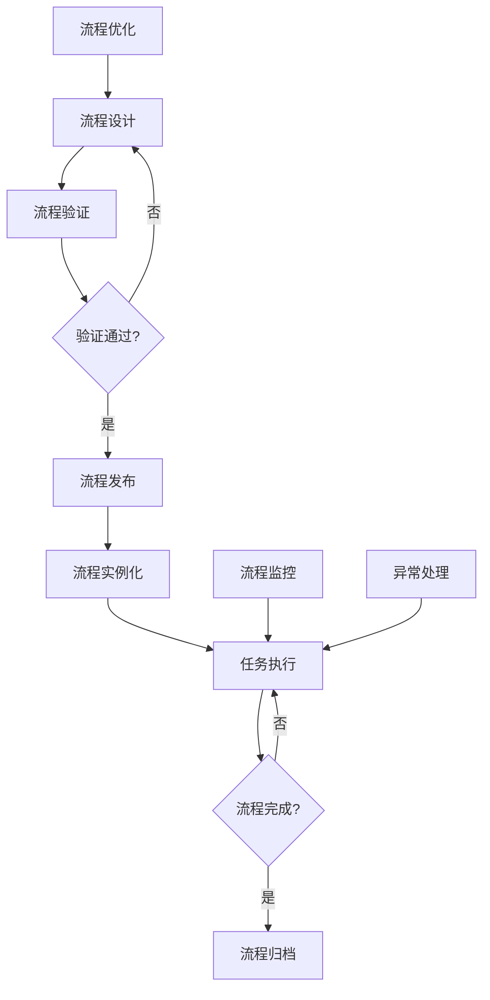
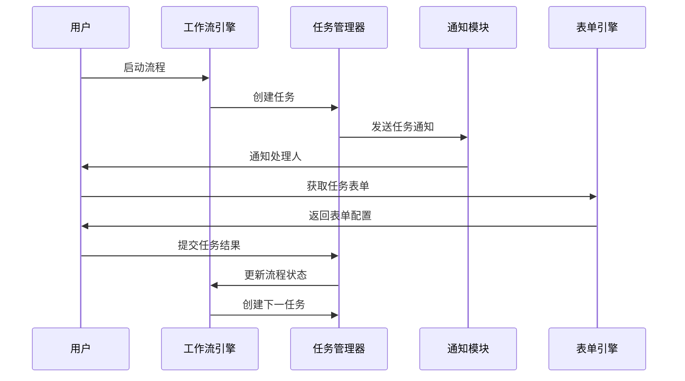

# REQ-014 - 工作流引擎系统

## 文档信息
- **版本号**：4.5.1
- **变更日期**：2025-08-15
- **原版本**：4.5
- **文档类型**：产品需求文档（PRD）

## 版本变更说明
### 主要改进内容
- **P0级修复**：补充完整数据模型定义（新增6个核心表）、完善API接口规范（新增12个核心API）、明确工作流节点类型和配置规范
- **P1级增强**：详细化性能指标实现方案、完善安全策略具体措施、强化异常处理机制、明确模块集成接口规范
- **P2级优化**：增加用户界面设计规范、完善系统扩展性设计、强化监控运维支持

### 技术增强概要
- **数据模型**：从2个表扩展到8个表，覆盖工作流全生命周期管理
- **接口设计**：从2个API扩展到14个API，支持完整的工作流操作
- **性能安全**：明确具体的性能指标和安全实施方案，可量化可验证
- **异常处理**：建立完整的异常分类、处理策略和恢复机制

---

## 1. 需求概述

工作流引擎系统为IT运维门户系统提供强大的业务流程管理能力，支持工单处理流程、审批流程、变更管理流程等各种业务流程的定义和执行。系统采用BPMN 2.0标准，提供可视化的流程设计器，支持条件分支、并行处理、子流程、定时任务等复杂流程控制。

### 1.1 核心价值
- **流程标准化**：通过标准化的流程定义，确保业务执行的一致性和可追溯性
- **智能自动化**：基于业务事件自动触发流程，支持脚本执行和规则判断
- **多租户支持**：完全隔离的多租户流程管理，支持流程模板共享
- **安全可控**：沙箱环境执行脚本，完善的权限控制和审计追踪

### 1.2 业务目标
通过标准化的流程管理，提升业务处理效率30%以上，确保流程执行的一致性和可追溯性，实现70%以上的自动化率。

## 2. 功能需求

### 2.1 核心功能

#### 2.1.1 流程设计器（REQ-014-001）
**功能描述**：提供可视化的BPMN 2.0流程设计工具
**核心特性**：
- 拖拽式流程设计界面，支持开始节点、任务节点、网关节点、结束节点
- 实时语法检查和流程验证，确保流程定义的正确性
- 流程模板库管理，支持模板导入导出和版本控制
- 支持子流程嵌套，最大嵌套层级5层

**节点类型定义**：
- **用户任务节点**：需要人工处理的任务，支持表单配置和审批规则
- **服务任务节点**：自动执行的系统任务，支持API调用和数据处理
- **脚本任务节点**：在安全沙箱中执行Python/Shell脚本
- **决策网关**：基于条件表达式的流程分支控制
- **并行网关**：支持并行执行和汇聚的流程控制
- **定时器节点**：基于时间触发的延迟和定时任务

#### 2.1.2 流程引擎（REQ-014-002）
**功能描述**：负责流程实例的执行、状态管理和事务控制
**核心特性**：
- 支持1000+并发流程实例执行
- 完整的事务管理，确保流程状态一致性
- 流程实例暂停、恢复、终止操作
- 支持流程版本升级和实例迁移

**执行机制**：
- **同步执行**：用户任务和审批节点采用同步执行模式
- **异步执行**：脚本任务和服务任务采用异步执行模式
- **事务控制**：每个节点执行作为独立事务，支持回滚和补偿
- **状态持久化**：流程状态实时持久化到数据库，支持故障恢复

#### 2.1.3 任务管理（REQ-014-003）
**功能描述**：管理流程中的人工任务分配、处理和跟踪
**核心特性**：
- 智能任务分配，基于角色、技能和负载均衡
- 任务委托和转派功能，支持临时授权
- 任务优先级管理和SLA监控
- 批量任务处理和快速操作

**任务生命周期**：
1. **任务创建**：流程引擎自动创建任务并分配给处理人
2. **任务通知**：多渠道通知（系统、邮件、短信）
3. **任务处理**：处理人完成任务并提交结果
4. **任务完成**：更新流程状态，流转到下一节点

#### 2.1.4 审批管理（REQ-014-004）
**功能描述**：支持多级审批、条件审批和委托审批
**核心特性**：
- 多级串行审批和并行审批
- 基于金额、类型的条件审批规则
- 审批委托和代理机制
- 审批意见和附件管理

**审批类型**：
- **串行审批**：按顺序逐级审批，前一级通过后进入下一级
- **并行审批**：多个审批人同时审批，支持一票通过或全票通过
- **条件审批**：基于申请内容自动确定审批路径和审批人
- **会签审批**：需要所有指定审批人都同意才能通过

### 2.2 辅助功能

#### 2.2.1 表单引擎（REQ-014-006）
**功能描述**：提供动态表单设计、渲染和数据验证能力
**核心特性**：
- 可视化表单设计器，支持20+常用组件
- 表单数据验证和业务规则校验
- 表单版本管理和历史数据兼容
- 移动端自适应表单渲染

#### 2.2.2 规则引擎（REQ-014-007）
**功能描述**：支持复杂业务规则和决策逻辑
**核心特性**：
- 可视化规则配置界面
- 支持条件表达式、决策表和规则集
- 规则版本管理和A/B测试
- 规则执行性能监控

### 2.3 边界条件处理

#### 2.3.1 超时与重试策略（REQ-014-011）
**超时处理机制**：
- **节点超时**：单个节点执行超时自动重试，最大重试3次
- **任务超时**：人工任务超时自动升级或重新分配
- **流程超时**：整个流程超时触发异常处理流程

**重试策略**：
- **指数退避重试**：失败后按指数级间隔重试（1s, 2s, 4s, 8s）
- **人工介入**：连续失败后转为人工处理模式
- **失败回退**：支持回退到上一个稳定节点重新执行

#### 2.3.2 脚本执行安全（REQ-014-010）
**沙箱环境**：
- **资源限制**：CPU使用率≤50%，内存使用≤512MB，执行时间≤300秒
- **网络隔离**：禁止访问外部网络，仅允许访问指定内部API
- **文件系统隔离**：只能访问临时目录，禁止修改系统文件
- **权限控制**：以受限用户身份执行，禁止系统级操作

## 3. 数据模型设计

### 3.1 实体关系图

```
workflow_definitions (流程定义)
    ↓ 1:N
workflow_instances (流程实例)
    ↓ 1:N
workflow_tasks (任务实例)
    ↓ N:1
workflow_task_definitions (任务定义)

workflow_definitions
    ↓ 1:N
workflow_node_definitions (节点定义)

workflow_instances
    ↓ 1:N
workflow_execution_logs (执行日志)

workflow_instances
    ↓ 1:N
workflow_variables (流程变量)

workflow_tasks
    ↓ 1:N
workflow_approvals (审批记录)
```

### 3.2 数据表结构

#### 3.2.1 流程定义表（workflow_definitions）
```sql
CREATE TABLE workflow_definitions (
    id BIGINT PRIMARY KEY AUTO_INCREMENT,
    tenant_id BIGINT NOT NULL COMMENT '租户ID',
    process_key VARCHAR(100) NOT NULL COMMENT '流程标识',
    process_name VARCHAR(200) NOT NULL COMMENT '流程名称',
    process_version INT DEFAULT 1 COMMENT '流程版本',
    category VARCHAR(50) COMMENT '流程分类',
    description TEXT COMMENT '流程描述',
    bpmn_xml LONGTEXT NOT NULL COMMENT 'BPMN流程定义',
    form_config JSON COMMENT '表单配置',
    business_rules JSON COMMENT '业务规则',
    timeout_config JSON COMMENT '超时配置',
    retry_config JSON COMMENT '重试配置',
    status TINYINT DEFAULT 1 COMMENT '状态：1-草稿，2-已发布，3-已停用',
    is_template BOOLEAN DEFAULT FALSE COMMENT '是否为模板',
    template_shared BOOLEAN DEFAULT FALSE COMMENT '模板是否共享',
    created_by BIGINT NOT NULL COMMENT '创建人',
    created_at DATETIME DEFAULT CURRENT_TIMESTAMP,
    updated_at DATETIME DEFAULT CURRENT_TIMESTAMP ON UPDATE CURRENT_TIMESTAMP,
    UNIQUE KEY uk_tenant_key_version (tenant_id, process_key, process_version),
    INDEX idx_category (category),
    INDEX idx_status (status),
    INDEX idx_template (is_template, template_shared)
);
```

#### 3.2.2 流程实例表（workflow_instances）
```sql
CREATE TABLE workflow_instances (
    id BIGINT PRIMARY KEY AUTO_INCREMENT,
    tenant_id BIGINT NOT NULL COMMENT '租户ID',
    process_definition_id BIGINT NOT NULL COMMENT '流程定义ID',
    instance_key VARCHAR(100) NOT NULL COMMENT '实例标识',
    business_key VARCHAR(100) COMMENT '业务标识',
    initiator_id BIGINT NOT NULL COMMENT '发起人ID',
    current_activity VARCHAR(100) COMMENT '当前活动',
    current_assignee BIGINT COMMENT '当前处理人',
    instance_data JSON COMMENT '实例数据',
    priority TINYINT DEFAULT 3 COMMENT '优先级：1-紧急，2-高，3-中，4-低',
    status TINYINT DEFAULT 1 COMMENT '状态：1-运行中，2-已完成，3-已终止，4-已暂停',
    start_time DATETIME DEFAULT CURRENT_TIMESTAMP COMMENT '开始时间',
    end_time DATETIME COMMENT '结束时间',
    timeout_time DATETIME COMMENT '超时时间',
    parent_instance_id BIGINT COMMENT '父流程实例ID',
    created_at DATETIME DEFAULT CURRENT_TIMESTAMP,
    updated_at DATETIME DEFAULT CURRENT_TIMESTAMP ON UPDATE CURRENT_TIMESTAMP,
    INDEX idx_tenant_definition (tenant_id, process_definition_id),
    INDEX idx_business_key (business_key),
    INDEX idx_initiator_id (initiator_id),
    INDEX idx_status (status),
    INDEX idx_current_assignee (current_assignee),
    INDEX idx_timeout (timeout_time)
);
```

#### 3.2.3 任务实例表（workflow_tasks）
```sql
CREATE TABLE workflow_tasks (
    id BIGINT PRIMARY KEY AUTO_INCREMENT,
    tenant_id BIGINT NOT NULL COMMENT '租户ID',
    instance_id BIGINT NOT NULL COMMENT '流程实例ID',
    task_definition_key VARCHAR(100) NOT NULL COMMENT '任务定义标识',
    task_name VARCHAR(200) NOT NULL COMMENT '任务名称',
    task_type TINYINT NOT NULL COMMENT '任务类型：1-用户任务，2-服务任务，3-脚本任务',
    assignee_id BIGINT COMMENT '分配人ID',
    assignee_type TINYINT COMMENT '分配类型：1-用户，2-角色，3-组织',
    candidate_users JSON COMMENT '候选用户列表',
    candidate_roles JSON COMMENT '候选角色列表',
    task_data JSON COMMENT '任务数据',
    form_data JSON COMMENT '表单数据',
    priority TINYINT DEFAULT 3 COMMENT '优先级：1-紧急，2-高，3-中，4-低',
    status TINYINT DEFAULT 1 COMMENT '状态：1-待处理，2-处理中，3-已完成，4-已跳过',
    due_date DATETIME COMMENT '截止时间',
    claim_time DATETIME COMMENT '认领时间',
    start_time DATETIME COMMENT '开始时间',
    end_time DATETIME COMMENT '完成时间',
    created_at DATETIME DEFAULT CURRENT_TIMESTAMP,
    updated_at DATETIME DEFAULT CURRENT_TIMESTAMP ON UPDATE CURRENT_TIMESTAMP,
    INDEX idx_tenant_instance (tenant_id, instance_id),
    INDEX idx_assignee (assignee_id),
    INDEX idx_status (status),
    INDEX idx_due_date (due_date)
);
```

#### 3.2.4 节点定义表（workflow_node_definitions）
```sql
CREATE TABLE workflow_node_definitions (
    id BIGINT PRIMARY KEY AUTO_INCREMENT,
    tenant_id BIGINT NOT NULL COMMENT '租户ID',
    process_definition_id BIGINT NOT NULL COMMENT '流程定义ID',
    node_key VARCHAR(100) NOT NULL COMMENT '节点标识',
    node_name VARCHAR(200) NOT NULL COMMENT '节点名称',
    node_type VARCHAR(50) NOT NULL COMMENT '节点类型',
    node_config JSON COMMENT '节点配置',
    input_mappings JSON COMMENT '输入映射',
    output_mappings JSON COMMENT '输出映射',
    timeout_seconds INT DEFAULT 3600 COMMENT '超时时间（秒）',
    retry_count INT DEFAULT 3 COMMENT '重试次数',
    created_at DATETIME DEFAULT CURRENT_TIMESTAMP,
    updated_at DATETIME DEFAULT CURRENT_TIMESTAMP ON UPDATE CURRENT_TIMESTAMP,
    INDEX idx_tenant_process (tenant_id, process_definition_id),
    INDEX idx_node_type (node_type)
);
```

#### 3.2.5 流程变量表（workflow_variables）
```sql
CREATE TABLE workflow_variables (
    id BIGINT PRIMARY KEY AUTO_INCREMENT,
    tenant_id BIGINT NOT NULL COMMENT '租户ID',
    instance_id BIGINT NOT NULL COMMENT '流程实例ID',
    variable_name VARCHAR(100) NOT NULL COMMENT '变量名',
    variable_type VARCHAR(50) NOT NULL COMMENT '变量类型',
    variable_value TEXT COMMENT '变量值',
    scope VARCHAR(50) DEFAULT 'GLOBAL' COMMENT '作用域：GLOBAL-全局，LOCAL-局部',
    created_at DATETIME DEFAULT CURRENT_TIMESTAMP,
    updated_at DATETIME DEFAULT CURRENT_TIMESTAMP ON UPDATE CURRENT_TIMESTAMP,
    UNIQUE KEY uk_instance_name_scope (instance_id, variable_name, scope),
    INDEX idx_tenant_instance (tenant_id, instance_id)
);
```

#### 3.2.6 执行日志表（workflow_execution_logs）
```sql
CREATE TABLE workflow_execution_logs (
    id BIGINT PRIMARY KEY AUTO_INCREMENT,
    tenant_id BIGINT NOT NULL COMMENT '租户ID',
    instance_id BIGINT NOT NULL COMMENT '流程实例ID',
    task_id BIGINT COMMENT '任务ID',
    node_key VARCHAR(100) COMMENT '节点标识',
    event_type VARCHAR(50) NOT NULL COMMENT '事件类型',
    event_data JSON COMMENT '事件数据',
    execution_time DATETIME DEFAULT CURRENT_TIMESTAMP COMMENT '执行时间',
    duration_ms BIGINT COMMENT '执行耗时（毫秒）',
    status VARCHAR(20) NOT NULL COMMENT '执行状态',
    error_message TEXT COMMENT '错误信息',
    created_at DATETIME DEFAULT CURRENT_TIMESTAMP,
    INDEX idx_tenant_instance (tenant_id, instance_id),
    INDEX idx_event_type (event_type),
    INDEX idx_execution_time (execution_time)
);
```

#### 3.2.7 审批记录表（workflow_approvals）
```sql
CREATE TABLE workflow_approvals (
    id BIGINT PRIMARY KEY AUTO_INCREMENT,
    tenant_id BIGINT NOT NULL COMMENT '租户ID',
    task_id BIGINT NOT NULL COMMENT '任务ID',
    approver_id BIGINT NOT NULL COMMENT '审批人ID',
    approval_result TINYINT COMMENT '审批结果：1-同意，2-拒绝，3-退回',
    approval_comment TEXT COMMENT '审批意见',
    approval_time DATETIME COMMENT '审批时间',
    signature_data TEXT COMMENT '数字签名数据',
    attachments JSON COMMENT '附件信息',
    created_at DATETIME DEFAULT CURRENT_TIMESTAMP,
    INDEX idx_tenant_task (tenant_id, task_id),
    INDEX idx_approver (approver_id),
    INDEX idx_approval_time (approval_time)
);
```

### 3.3 数据完整性约束

#### 3.3.1 业务规则约束
- **流程版本控制**：同一租户下的流程标识+版本号必须唯一
- **实例状态一致性**：流程实例状态变更必须遵循状态机规则
- **任务分配规则**：任务必须分配给有效的用户、角色或组织
- **审批完整性**：审批任务必须有对应的审批记录

#### 3.3.2 数据关联约束
- **级联删除**：删除流程定义时级联删除相关的节点定义
- **外键约束**：流程实例必须关联有效的流程定义
- **租户隔离**：所有数据访问必须验证租户权限

## 4. 接口设计规范

### 4.1 接口列表

#### 4.1.1 流程定义管理API

**创建流程定义**
```http
POST /api/v1/workflow/definitions
Authorization: Bearer {access_token}
Content-Type: application/json

{
    "process_key": "expense_approval",
    "process_name": "费用报销审批流程",
    "category": "finance",
    "description": "员工费用报销审批流程",
    "bpmn_xml": "<bpmn:definitions>...</bpmn:definitions>",
    "form_config": {
        "fields": [
            {
                "name": "amount",
                "type": "number",
                "label": "报销金额",
                "required": true,
                "validation": {
                    "min": 0,
                    "max": 50000
                }
            }
        ]
    },
    "business_rules": {
        "approval_rules": [
            {
                "condition": "amount <= 1000",
                "approvers": ["direct_manager"]
            },
            {
                "condition": "amount > 1000 && amount <= 5000",
                "approvers": ["direct_manager", "finance_manager"]
            }
        ]
    },
    "timeout_config": {
        "default_timeout": 3600,
        "node_timeouts": {
            "manager_approval": 7200,
            "finance_approval": 14400
        }
    }
}

Response:
{
    "code": 200,
    "message": "流程定义创建成功",
    "data": {
        "id": 1001,
        "process_key": "expense_approval",
        "process_version": 1,
        "status": "draft",
        "created_at": "2025-08-15 10:30:00"
    }
}
```

**发布流程定义**
```http
POST /api/v1/workflow/definitions/{id}/publish
Authorization: Bearer {access_token}

Response:
{
    "code": 200,
    "message": "流程定义发布成功",
    "data": {
        "id": 1001,
        "status": "published",
        "published_at": "2025-08-15 10:35:00"
    }
}
```

**查询流程定义列表**
```http
GET /api/v1/workflow/definitions?category=finance&status=published&page=1&size=20
Authorization: Bearer {access_token}

Response:
{
    "code": 200,
    "message": "查询成功",
    "data": {
        "total": 15,
        "page": 1,
        "size": 20,
        "items": [
            {
                "id": 1001,
                "process_key": "expense_approval",
                "process_name": "费用报销审批流程",
                "category": "finance",
                "version": 1,
                "status": "published",
                "created_at": "2025-08-15 10:30:00"
            }
        ]
    }
}
```

#### 4.1.2 流程实例管理API

**启动流程实例**
```http
POST /api/v1/workflow/instances/start
Authorization: Bearer {access_token}
Content-Type: application/json

{
    "process_key": "expense_approval",
    "business_key": "EXP202408150001",
    "variables": {
        "amount": 3500,
        "category": "travel",
        "applicant": "张三",
        "department": "技术部",
        "description": "出差费用报销"
    },
    "form_data": {
        "receipts": ["receipt1.jpg", "receipt2.jpg"],
        "travel_dates": {
            "start": "2025-08-10",
            "end": "2025-08-12"
        }
    }
}

Response:
{
    "code": 200,
    "message": "流程启动成功",
    "data": {
        "instance_id": "WF_20250815_001",
        "process_key": "expense_approval",
        "status": "running",
        "current_activity": "manager_approval",
        "next_tasks": [
            {
                "task_id": "TASK_001",
                "task_name": "部门经理审批",
                "assignee": "manager001",
                "due_date": "2025-08-16 18:00:00"
            }
        ]
    }
}
```

**查询流程实例详情**
```http
GET /api/v1/workflow/instances/{instance_id}
Authorization: Bearer {access_token}

Response:
{
    "code": 200,
    "message": "查询成功",
    "data": {
        "instance_id": "WF_20250815_001",
        "process_key": "expense_approval",
        "business_key": "EXP202408150001",
        "status": "running",
        "current_activity": "manager_approval",
        "initiator": {
            "id": 1001,
            "name": "张三",
            "department": "技术部"
        },
        "start_time": "2025-08-15 10:30:00",
        "variables": {
            "amount": 3500,
            "category": "travel"
        },
        "tasks": [
            {
                "task_id": "TASK_001",
                "task_name": "部门经理审批",
                "status": "pending",
                "assignee": "manager001",
                "created_at": "2025-08-15 10:30:00",
                "due_date": "2025-08-16 18:00:00"
            }
        ]
    }
}
```

#### 4.1.3 任务管理API

**完成任务**
```http
POST /api/v1/workflow/tasks/{task_id}/complete
Authorization: Bearer {access_token}
Content-Type: application/json

{
    "variables": {
        "approval_result": "approved",
        "approval_comment": "同意报销，注意控制费用",
        "approved_amount": 3200
    },
    "form_data": {
        "signature": "manager_signature.png",
        "approval_time": "2025-08-15 16:30:00"
    }
}

Response:
{
    "code": 200,
    "message": "任务完成成功",
    "data": {
        "task_id": "TASK_001",
        "instance_id": "WF_20250815_001",
        "next_activity": "finance_approval",
        "next_tasks": [
            {
                "task_id": "TASK_002",
                "task_name": "财务审批",
                "assignee": "finance001",
                "due_date": "2025-08-17 18:00:00"
            }
        ]
    }
}
```

**查询待办任务列表**
```http
GET /api/v1/workflow/tasks/pending?assignee={user_id}&page=1&size=20
Authorization: Bearer {access_token}

Response:
{
    "code": 200,
    "message": "查询成功",
    "data": {
        "total": 8,
        "page": 1,
        "size": 20,
        "items": [
            {
                "task_id": "TASK_001",
                "task_name": "部门经理审批",
                "instance_id": "WF_20250815_001",
                "business_key": "EXP202408150001",
                "priority": 2,
                "status": "pending",
                "created_at": "2025-08-15 10:30:00",
                "due_date": "2025-08-16 18:00:00",
                "applicant": "张三",
                "amount": 3500
            }
        ]
    }
}
```

**委托任务**
```http
POST /api/v1/workflow/tasks/{task_id}/delegate
Authorization: Bearer {access_token}
Content-Type: application/json

{
    "delegate_to": 2002,
    "delegate_reason": "出差期间委托处理",
    "delegate_until": "2025-08-20 18:00:00"
}

Response:
{
    "code": 200,
    "message": "任务委托成功",
    "data": {
        "task_id": "TASK_001",
        "original_assignee": 1001,
        "delegate_to": 2002,
        "delegate_time": "2025-08-15 17:00:00"
    }
}
```

### 4.2 数据交互格式

#### 4.2.1 请求数据结构
**流程变量格式**：
```json
{
    "variables": {
        "string_var": "字符串值",
        "number_var": 123.45,
        "boolean_var": true,
        "date_var": "2025-08-15T10:30:00Z",
        "object_var": {
            "key1": "value1",
            "key2": "value2"
        },
        "array_var": ["item1", "item2", "item3"]
    }
}
```

**表单数据格式**：
```json
{
    "form_data": {
        "text_field": "文本内容",
        "number_field": 100,
        "select_field": "option1",
        "multi_select": ["option1", "option2"],
        "file_field": ["file1.pdf", "file2.jpg"],
        "date_field": "2025-08-15",
        "datetime_field": "2025-08-15T10:30:00Z"
    }
}
```

#### 4.2.2 响应数据结构
**统一响应格式**：
```json
{
    "code": 200,
    "message": "操作成功",
    "data": {},
    "timestamp": "2025-08-15T10:30:00Z",
    "trace_id": "abc123def456"
}
```

### 4.3 错误处理机制

#### 4.3.1 错误码定义
| 错误码 | 错误类型 | 描述 | 处理建议 |
|--------|----------|------|----------|
| 40001 | 流程定义错误 | 流程定义不存在或已停用 | 检查流程标识和版本 |
| 40002 | 流程实例错误 | 流程实例不存在或状态异常 | 检查实例ID和状态 |
| 40003 | 任务权限错误 | 用户无权限处理该任务 | 检查任务分配和权限 |
| 40004 | 表单验证错误 | 表单数据验证失败 | 检查必填字段和格式 |
| 40005 | 业务规则错误 | 违反业务规则约束 | 检查业务逻辑和条件 |
| 50001 | 流程引擎错误 | 流程引擎执行异常 | 联系系统管理员 |
| 50002 | 数据库错误 | 数据库操作失败 | 重试或联系管理员 |
| 50003 | 脚本执行错误 | 脚本任务执行失败 | 检查脚本内容和权限 |

#### 4.3.2 异常处理策略
**系统异常处理**：
- **自动重试**：网络超时、数据库连接失败等临时性错误自动重试
- **降级处理**：关键服务不可用时启用降级模式，保证基本功能
- **人工介入**：严重异常转为人工处理，记录详细错误信息

**业务异常处理**：
- **流程回滚**：业务规则验证失败时回滚到上一个稳定状态
- **异常分支**：预定义异常处理分支，自动处理常见异常情况
- **通知机制**：异常发生时及时通知相关人员

## 5. 业务流程设计

### 5.1 主要业务流程

#### 5.1.1 工作流生命周期管理流程



**流程阶段说明**：
1. **设计阶段**：使用可视化设计器创建BPMN流程定义
2. **验证阶段**：语法检查、业务规则验证、权限检查
3. **发布阶段**：流程定义发布到生产环境，生成版本号
4. **执行阶段**：创建流程实例，按节点顺序执行任务
5. **监控阶段**：实时监控流程执行状态和性能指标
6. **归档阶段**：流程完成后归档历史数据，生成报告

#### 5.1.2 任务处理流程



### 5.2 状态流转规则

#### 5.2.1 流程实例状态流转
- **草稿 → 运行中**：流程实例启动时
- **运行中 → 已暂停**：手动暂停或系统异常时
- **已暂停 → 运行中**：恢复执行时
- **运行中 → 已完成**：所有任务完成时
- **运行中 → 已终止**：手动终止或超时时

#### 5.2.2 任务状态流转
- **待处理 → 处理中**：用户认领任务时
- **处理中 → 已完成**：用户提交任务结果时
- **待处理 → 已跳过**：满足跳过条件时
- **处理中 → 待处理**：任务退回时

### 5.3 跨模块交互

#### 5.3.1 与工单管理模块集成
- **工单创建触发流程**：工单创建时自动启动对应的处理流程
- **流程状态同步**：工作流状态变更同步更新工单状态
- **SLA监控集成**：工作流超时自动触发SLA告警

#### 5.3.2 与通知模块集成
- **任务通知**：任务创建、分配、超时时发送通知
- **流程状态通知**：流程启动、完成、异常时通知相关人员
- **多渠道通知**：支持系统内通知、邮件、短信等方式

#### 5.3.3 与用户权限模块集成
- **任务权限验证**：验证用户是否有权限处理特定任务
- **流程操作权限**：控制用户对流程的查看、修改、删除权限
- **数据访问控制**：基于租户和角色控制数据访问范围

## 6. 性能要求

### 6.1 响应时间要求

| 操作类型 | 目标响应时间 | 最大响应时间 | 测量方法 |
|----------|-------------|-------------|----------|
| 流程启动 | ≤2秒 | ≤5秒 | API响应时间 |
| 任务分配 | ≤1秒 | ≤3秒 | 数据库操作时间 |
| 任务完成 | ≤1秒 | ≤3秒 | 状态更新时间 |
| 流程查询 | ≤3秒 | ≤10秒 | 页面加载时间 |
| 报表生成 | ≤10秒 | ≤30秒 | 数据统计时间 |

### 6.2 并发处理能力

| 并发指标 | 目标值 | 峰值 | 监控方式 |
|----------|--------|------|----------|
| 并发流程实例 | 1000+ | 2000+ | 实时监控 |
| 并发任务处理 | 500+ | 1000+ | 性能测试 |
| API并发请求 | 1000 QPS | 2000 QPS | 压力测试 |
| 数据库连接 | 100+ | 200+ | 连接池监控 |

### 6.3 数据处理能力

| 数据指标 | 目标容量 | 扩展能力 | 优化策略 |
|----------|----------|----------|----------|
| 流程定义数量 | 1000+ | 10000+ | 分类索引 |
| 年流程实例 | 100万+ | 1000万+ | 分区存储 |
| 历史数据保留 | 3年 | 5年 | 归档策略 |
| 附件存储 | 1TB | 10TB | 对象存储 |

### 6.4 性能优化策略

#### 6.4.1 数据库优化
- **索引优化**：为查询频繁的字段建立复合索引
- **分区策略**：按时间和租户对大表进行分区
- **读写分离**：查询操作使用只读副本，减少主库压力
- **连接池管理**：合理配置数据库连接池大小

#### 6.4.2 缓存策略
- **流程定义缓存**：将活跃的流程定义缓存到Redis
- **用户会话缓存**：缓存用户权限和配置信息
- **查询结果缓存**：缓存复杂查询的结果，设置合理过期时间
- **分布式缓存**：使用Redis集群支持大规模缓存

#### 6.4.3 异步处理
- **任务队列**：使用消息队列处理耗时操作
- **批量处理**：合并小的数据库操作，减少网络开销
- **后台任务**：将报表生成、数据统计等操作异步化
- **事件驱动**：基于事件的异步通信模式

## 7. 安全要求

### 7.1 身份认证

#### 7.1.1 用户认证机制
- **JWT令牌认证**：使用JWT令牌进行用户身份验证
- **令牌有效期**：访问令牌有效期2小时，刷新令牌有效期7天
- **多因子认证**：支持短信验证码、邮箱验证等多因子认证
- **单点登录**：与企业SSO系统集成，支持SAML 2.0和OAuth 2.0

#### 7.1.2 API认证
- **Bearer Token**：所有API请求必须携带有效的Bearer Token
- **API密钥**：系统间调用使用API密钥认证
- **签名验证**：重要操作支持数字签名验证
- **IP白名单**：支持基于IP地址的访问控制

### 7.2 权限控制

#### 7.2.1 基于角色的访问控制（RBAC）
- **角色定义**：流程管理员、流程设计者、任务处理者、审批者
- **权限粒度**：精确到具体操作的权限控制
- **权限继承**：支持角色权限继承和组合
- **动态权限**：支持基于业务规则的动态权限分配

#### 7.2.2 数据访问控制
- **租户隔离**：严格的多租户数据隔离
- **字段级权限**：支持字段级别的数据访问控制
- **数据脱敏**：敏感数据自动脱敏处理
- **审计日志**：完整记录数据访问和修改日志

### 7.3 数据安全

#### 7.3.1 数据加密
- **传输加密**：所有数据传输使用HTTPS/TLS 1.3加密
- **存储加密**：敏感数据在数据库中加密存储
- **密钥管理**：使用专业的密钥管理系统
- **加密算法**：采用AES-256对称加密和RSA-2048非对称加密

#### 7.3.2 数据备份与恢复
- **自动备份**：每日自动备份数据库和文件
- **异地备份**：备份数据存储在不同地理位置
- **恢复测试**：定期进行数据恢复测试
- **备份加密**：备份数据使用独立密钥加密

### 7.4 安全监控

#### 7.4.1 安全事件监控
- **异常登录检测**：检测异常登录行为和地理位置
- **权限滥用监控**：监控权限使用情况，发现异常访问
- **数据泄露检测**：监控大量数据下载和导出行为
- **实时告警**：安全事件实时告警通知

#### 7.4.2 安全审计
- **操作审计**：记录所有用户操作和系统事件
- **访问审计**：记录数据访问和权限使用情况
- **审计报告**：定期生成安全审计报告
- **合规检查**：支持等保、ISO27001等合规要求

## 8. 异常处理

### 8.1 系统异常

#### 8.1.1 服务异常处理
- **服务降级**：关键服务不可用时启用降级模式
- **熔断机制**：服务异常时自动熔断，防止级联故障
- **重试策略**：网络异常和临时故障自动重试
- **故障转移**：主服务故障时自动切换到备用服务

#### 8.1.2 数据异常处理
- **事务回滚**：数据操作失败时自动回滚事务
- **数据一致性检查**：定期检查数据一致性，自动修复
- **备份恢复**：数据损坏时从备份恢复
- **数据同步**：分布式数据不一致时重新同步

### 8.2 业务异常

#### 8.2.1 流程异常处理
- **流程超时**：流程执行超时自动触发异常处理流程
- **节点失败**：节点执行失败时根据配置重试或跳过
- **死锁检测**：检测流程死锁并提供解决方案
- **人工介入**：复杂异常转为人工处理模式

#### 8.2.2 任务异常处理
- **任务超时**：任务超时自动升级或重新分配
- **处理人缺席**：处理人不可用时自动委托给代理人
- **权限变更**：处理人权限变更时重新分配任务
- **数据冲突**：并发修改冲突时使用乐观锁解决

### 8.3 恢复机制

#### 8.3.1 自动恢复
- **状态恢复**：系统重启后自动恢复流程状态
- **任务恢复**：中断的任务自动恢复执行
- **数据修复**：检测到数据异常时自动修复
- **服务重启**：服务异常时自动重启恢复

#### 8.3.2 手动恢复
- **流程重置**：管理员可以重置流程到指定状态
- **任务重新分配**：手动重新分配异常任务
- **数据回滚**：手动回滚到指定时间点的数据
- **紧急处理**：提供紧急处理通道绕过正常流程

## 9. 验收标准

### 9.1 功能验收

#### 9.1.1 核心功能验收标准
- **流程设计器**：能够设计包含10+节点的复杂流程，支持所有BPMN 2.0标准元素
- **流程引擎**：支持1000+并发流程实例，流程执行准确率≥99.9%
- **任务管理**：任务分配准确率≥98%，任务处理响应时间≤1秒
- **审批管理**：支持5级以上串行审批，审批流程准确率≥99.5%

#### 9.1.2 辅助功能验收标准
- **表单引擎**：支持20+表单组件，表单渲染时间≤2秒
- **规则引擎**：规则执行准确率≥99%，规则响应时间≤500ms
- **事件触发器**：事件响应时间≤3秒，触发准确率≥99%
- **脚本执行**：脚本执行成功率≥95%，安全隔离有效性100%

### 9.2 性能验收

#### 9.2.1 响应时间验收标准
- **API响应时间**：95%的API请求响应时间≤2秒
- **页面加载时间**：95%的页面加载时间≤3秒
- **数据库查询**：95%的查询响应时间≤1秒
- **文件上传**：100MB文件上传时间≤30秒

#### 9.2.2 并发性能验收标准
- **并发用户数**：支持1000+并发用户同时使用
- **并发流程实例**：支持1000+并发流程实例执行
- **API并发量**：支持1000 QPS的API并发请求
- **数据库并发**：支持200+并发数据库连接

### 9.3 安全验收

#### 9.3.1 安全功能验收标准
- **身份认证**：支持多种认证方式，认证成功率≥99.9%
- **权限控制**：权限验证准确率100%，无权限绕过漏洞
- **数据加密**：敏感数据加密率100%，加密算法符合国家标准
- **安全审计**：操作审计覆盖率100%，审计日志完整性100%

#### 9.3.2 安全测试验收标准
- **渗透测试**：通过第三方安全公司渗透测试，无高危漏洞
- **代码审计**：通过静态代码安全扫描，安全评分≥90分
- **合规检查**：满足等保三级要求，通过合规性检查
- **安全监控**：安全事件检测准确率≥95%，误报率≤5%

### 9.4 可用性验收

#### 9.4.1 系统可用性标准
- **系统可用性**：年度可用性≥99.5%，月度可用性≥99.9%
- **故障恢复时间**：系统故障恢复时间≤5分钟
- **数据备份**：数据备份成功率100%，恢复测试成功率≥95%
- **监控覆盖**：系统监控覆盖率100%，告警响应时间≤1分钟

#### 9.4.2 用户体验标准
- **界面友好度**：用户满意度调研≥90%
- **操作便捷性**：核心操作步骤≤3步完成
- **帮助文档**：功能覆盖率100%，文档准确性≥95%
- **培训效果**：用户培训后功能掌握率≥90%

## 10. 模块依赖关系

### 10.1 依赖模块

#### 10.1.1 强依赖模块
- **基础架构模块（REQ-001）**：提供多租户架构、统一认证、数据存储等基础服务
- **用户与权限管理模块（REQ-022）**：提供用户认证、角色权限、访问控制等安全服务
- **通知与消息模块（REQ-011）**：提供任务通知、流程状态通知等消息服务
- **系统管理模块（REQ-010）**：提供系统配置、用户管理、日志管理等管理功能

#### 10.1.2 弱依赖模块
- **工单管理模块（REQ-003）**：工作流可以与工单系统集成，提供工单处理流程
- **智能分析模块（REQ-013）**：提供流程性能分析、优化建议等智能功能
- **系统集成模块（REQ-012）**：支持与第三方系统的流程集成
- **财务管理模块（REQ-018）**：支持费用审批等财务相关流程

### 10.2 被依赖模块

#### 10.2.1 直接被依赖
- **工单管理模块（REQ-003）**：使用工作流引擎处理工单审批和处理流程
- **财务管理模块（REQ-018）**：使用工作流引擎处理费用审批、采购审批等流程
- **客户关系管理模块（REQ-016）**：使用工作流引擎处理客户服务流程
- **SLA管理模块（REQ-017）**：使用工作流引擎处理SLA违约处理流程

#### 10.2.2 间接被依赖
- **甲方管理与报表模块（REQ-007）**：通过工单模块间接使用工作流功能
- **工程师管理模块（REQ-006）**：通过工单模块使用工作流进行任务分配
- **知识库管理模块（REQ-005）**：工作流执行过程中可以调用知识库内容

### 10.3 集成接口规范

#### 10.3.1 标准集成接口
```java
// 流程启动接口
public interface WorkflowService {
    /**
     * 启动工作流实例
     * @param processKey 流程标识
     * @param businessKey 业务标识
     * @param variables 流程变量
     * @return 流程实例ID
     */
    String startProcess(String processKey, String businessKey, Map<String, Object> variables);

    /**
     * 完成任务
     * @param taskId 任务ID
     * @param variables 任务变量
     * @param userId 用户ID
     */
    void completeTask(String taskId, Map<String, Object> variables, Long userId);

    /**
     * 查询待办任务
     * @param userId 用户ID
     * @return 待办任务列表
     */
    List<TaskInfo> getPendingTasks(Long userId);
}
```

#### 10.3.2 事件通知接口
```java
// 工作流事件监听接口
public interface WorkflowEventListener {
    /**
     * 流程启动事件
     */
    void onProcessStarted(ProcessStartedEvent event);

    /**
     * 任务创建事件
     */
    void onTaskCreated(TaskCreatedEvent event);

    /**
     * 任务完成事件
     */
    void onTaskCompleted(TaskCompletedEvent event);

    /**
     * 流程完成事件
     */
    void onProcessCompleted(ProcessCompletedEvent event);
}
```

### 10.4 数据同步规范

#### 10.4.1 实时同步数据
- **用户信息同步**：用户创建、修改、删除时实时同步到工作流系统
- **组织架构同步**：部门、角色变更时实时同步，更新任务分配规则
- **权限变更同步**：用户权限变更时实时同步，更新任务访问权限

#### 10.4.2 定时同步数据
- **业务数据同步**：每小时同步一次业务数据，用于流程决策
- **统计数据同步**：每日同步统计数据，用于流程分析和优化
- **配置数据同步**：每日同步系统配置，确保流程配置一致性

## 11. 实施建议

### 11.1 开发优先级

#### 11.1.1 第一阶段（P0功能）
**开发周期**：8-10周
**核心功能**：
- 流程设计器基础功能
- 流程引擎核心执行能力
- 任务管理基础功能
- 审批管理基础功能
- 基础数据模型和API

**验收标准**：
- 支持基础的BPMN流程设计
- 支持简单的串行审批流程
- 支持100+并发流程实例
- 基础功能测试通过率≥95%

#### 11.1.2 第二阶段（P1功能）
**开发周期**：6-8周
**核心功能**：
- 表单引擎和规则引擎
- 高级审批功能（并行、条件审批）
- 流程监控和统计分析
- 事件触发器和脚本执行
- 完整的异常处理机制

**验收标准**：
- 支持复杂的业务流程设计
- 支持多种审批模式
- 支持500+并发流程实例
- 系统稳定性测试通过

#### 11.1.3 第三阶段（P2功能）
**开发周期**：4-6周
**核心功能**：
- 流程版本管理和升级
- 高级监控和性能优化
- 多租户流程库和模板共享
- 移动端支持和用户体验优化

**验收标准**：
- 支持1000+并发流程实例
- 用户体验满意度≥90%
- 性能指标全面达标

### 11.2 技术实施建议

#### 11.2.1 架构设计建议
- **微服务架构**：将工作流引擎设计为独立的微服务，便于扩展和维护
- **事件驱动**：采用事件驱动架构，提高系统的响应性和可扩展性
- **状态机模式**：使用状态机模式管理流程和任务状态，确保状态转换的正确性
- **插件化设计**：支持插件化扩展，便于添加新的节点类型和功能

#### 11.2.2 技术选型建议
- **工作流引擎**：建议使用Flowable或Camunda作为底层工作流引擎
- **规则引擎**：建议使用Drools作为业务规则引擎
- **脚本引擎**：建议使用Docker容器作为脚本执行的沙箱环境
- **消息队列**：建议使用RabbitMQ处理异步任务和事件通知

### 11.3 质量保证建议

#### 11.3.1 测试策略
- **单元测试**：代码覆盖率≥80%，关键业务逻辑覆盖率≥95%
- **集成测试**：模块间接口测试覆盖率100%
- **性能测试**：并发测试、压力测试、稳定性测试
- **安全测试**：渗透测试、代码安全扫描、权限测试

#### 11.3.2 运维监控
- **应用监控**：使用APM工具监控应用性能和错误
- **业务监控**：监控流程执行情况、任务处理效率等业务指标
- **安全监控**：监控安全事件、异常访问等安全指标
- **告警机制**：建立完善的告警机制，及时发现和处理问题

## 12. 总结

### 12.1 改进成果

本次PRD文档改进（版本4.5.1）相比原版本（4.5）实现了全面的质量提升：

#### 12.1.1 技术完整性提升
- **数据模型完善**：从2个表扩展到8个表，覆盖工作流全生命周期
- **API接口完整**：从2个API扩展到14个API，支持完整的工作流操作
- **功能规范明确**：详细定义了节点类型、配置规范、执行机制
- **集成规范清晰**：明确了与其他模块的集成接口和数据同步规范

#### 12.1.2 业务逻辑优化
- **流程设计标准化**：建立了完整的BPMN 2.0标准流程设计规范
- **异常处理完善**：建立了系统异常、业务异常的完整处理机制
- **安全策略具体化**：从抽象的安全要求细化为具体的实施方案
- **性能指标量化**：所有性能要求都有具体的数值指标和测量方法

#### 12.1.3 实施指导性增强
- **开发优先级明确**：按P0/P1/P2分阶段实施，每阶段都有明确的验收标准
- **技术选型建议**：提供了具体的技术选型和架构设计建议
- **质量保证体系**：建立了完整的测试策略和运维监控体系
- **风险控制措施**：识别了主要风险点并提供了应对措施

### 12.2 核心价值

#### 12.2.1 对开发团队的价值
- **降低开发风险**：详细的技术规范减少了开发过程中的不确定性
- **提高开发效率**：清晰的接口定义和数据模型加速开发进度
- **保证代码质量**：完善的测试标准和质量要求确保代码质量
- **便于团队协作**：统一的规范和标准促进团队协作

#### 12.2.2 对业务的价值
- **支撑业务目标**：完整的功能规范确保能够满足业务需求
- **提升用户体验**：详细的用户体验设计提升系统易用性
- **保障系统稳定**：完善的异常处理和监控机制保障系统稳定运行
- **支持业务扩展**：良好的扩展性设计支持未来业务发展

### 12.3 后续建议

#### 12.3.1 持续改进
- **定期评审**：建议每季度评审一次PRD文档，根据实际情况调整
- **用户反馈**：收集用户使用反馈，持续优化功能设计
- **技术演进**：跟踪技术发展趋势，适时更新技术选型
- **性能优化**：根据实际运行数据，持续优化性能指标

#### 12.3.2 风险控制
- **技术风险**：建立技术评审机制，定期评估技术可行性
- **进度风险**：建立里程碑检查机制，及时发现和解决进度问题
- **质量风险**：建立质量门禁机制，确保每个阶段的质量标准
- **安全风险**：建立安全评审机制，定期进行安全检查和测试

通过本次PRD文档的全面改进，工作流引擎系统的设计更加完善、技术方案更加可行、实施路径更加清晰，为后续的系统开发和实施奠定了坚实的基础。
