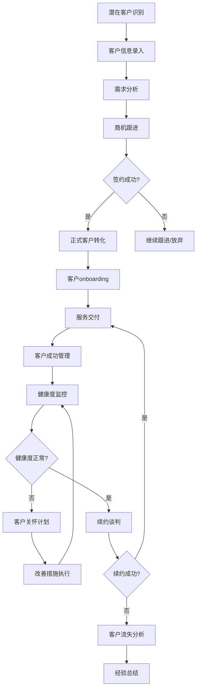
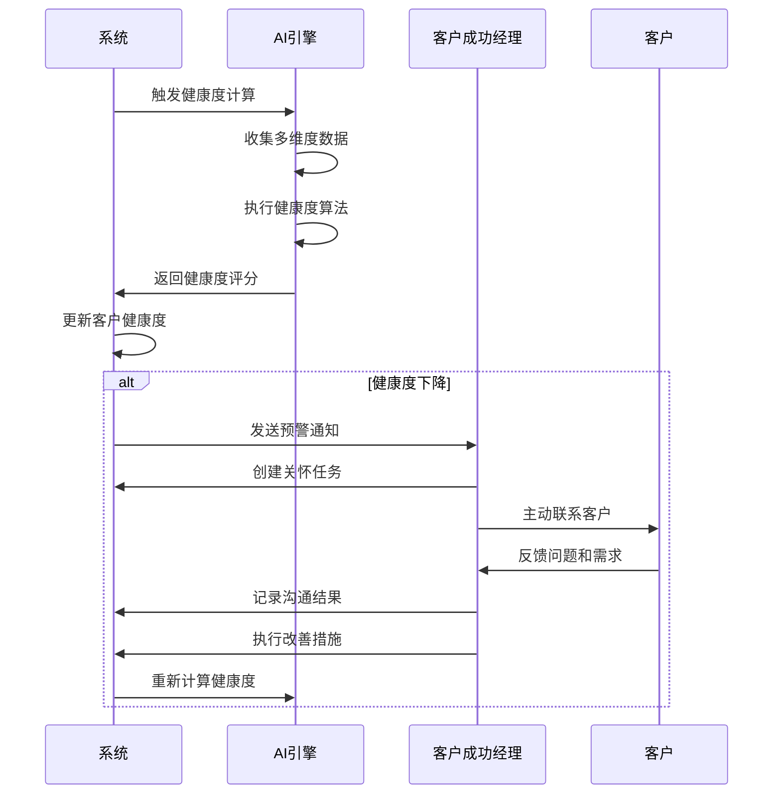

# REQ-016 - 客户关系管理模块

## 文档信息
- **版本号**：4.5.1
- **变更日期**：2025-08-15
- **原版本**：4.5
- **文档类型**：产品需求文档（PRD）

## 版本变更说明
### 主要改进内容
- **P0级修复**：补充完整数据模型定义（新增5个核心表）、完善API接口规范（新增15个核心API）、明确客户生命周期管理流程、强化AI智能分析集成
- **P1级增强**：详细化客户健康度计算模型、完善客户细分和标签管理机制、强化数据同步和一致性保障、明确性能指标实现方案
- **P2级优化**：增强客户门户功能设计、完善移动端支持、优化用户体验设计、强化安全合规措施

### 技术增强概要
- **数据模型**：从2个表扩展到7个表，覆盖客户全生命周期管理
- **接口设计**：从2个API扩展到17个API，支持完整的CRM操作
- **智能分析**：集成AI驱动的客户健康度评估和流失预测模型
- **业务流程**：建立完整的客户成功管理和自动化营销流程

---

## 1. 需求概述

客户关系管理模块为IT运维门户系统提供全面的客户管理功能，包括客户档案管理、合同管理、服务记录、满意度管理、客户分析等。该模块支持从潜在客户到忠诚客户的全生命周期管理，通过数据驱动的客户洞察和个性化服务，提升客户满意度和忠诚度，实现客户价值最大化。

### 1.1 核心价值
- **客户价值最大化**：通过精准的客户分析和个性化服务，提升客户生命周期价值
- **智能化客户成功**：基于AI的客户健康度评估和流失预测，主动进行客户关怀
- **全渠道客户体验**：统一的客户视图和多渠道服务，提供一致的客户体验
- **数据驱动决策**：基于客户数据的深度分析，支持精准的商业决策

### 1.2 业务目标
- **客户满意度**：客户整体满意度≥4.5分，NPS净推荐值≥50
- **客户保留率**：客户年度保留率≥95%，流失率≤5%
- **客户价值**：客户生命周期价值(LTV)提升≥30%，ARPU增长≥20%
- **服务质量**：客户服务响应时间≤2小时，问题解决率≥95%
- **数据完整性**：客户数据完整率≥95%，数据准确率≥99%
- **业务增长**：客户续约率≥90%，向上销售成功率≥25%

## 2. 功能需求

### 2.1 核心功能

#### 2.1.1 客户档案管理（REQ-016-001）
**功能描述**：提供完整的客户信息管理，包括基本信息、联系人、组织架构等
**核心特性**：
- 客户基本信息管理：公司信息、行业分类、规模等级、地理位置
- 联系人管理：多联系人支持、角色定义、决策链分析
- 客户分级：基于价值、潜力、风险的动态客户分级
- 客户标签：灵活的标签体系，支持自定义标签和智能标签推荐

**数据完整性要求**：
- 客户基本信息完整率≥95%
- 主要联系人信息完整率≥90%
- 客户分级准确率≥95%

#### 2.1.2 合同管理（REQ-016-002）
**功能描述**：管理客户合同的全生命周期，包括签署、执行、变更、续约
**核心特性**：
- 合同模板管理：标准合同模板、条款库、自动生成
- 合同执行监控：合同状态跟踪、里程碑管理、SLA绑定
- 续约管理：自动续约提醒、续约概率预测、续约谈判支持
- 合同变更：变更申请、审批流程、版本控制

**业务规则**：
- 合同到期前90天自动提醒
- 合同变更需要审批流程
- 合同与SLA自动关联

#### 2.1.3 服务记录管理（REQ-016-003）
**功能描述**：记录和分析客户的服务历史，包括工单、满意度、服务质量等
**核心特性**：
- 服务历史记录：工单记录、服务时长、解决方案
- 满意度管理：多维度满意度评价、趋势分析、改进建议
- 服务质量分析：SLA达成情况、响应时间分析、问题分类统计
- 服务报告：定期服务报告、客户专属报告、服务改进建议

#### 2.1.4 客户分析与洞察（REQ-016-004）
**功能描述**：基于多维度数据进行客户分析，提供深度业务洞察
**核心特性**：
- 客户价值分析：LTV计算、ARPU分析、盈利能力评估
- 行为分析：使用习惯、功能偏好、活跃度分析
- 趋势预测：续约概率、流失风险、增长潜力
- 客户画像：360度客户视图、个性化标签、需求预测

### 2.2 智能化功能

#### 2.2.1 客户健康度评估（REQ-016-010）
**功能描述**：基于AI算法计算客户健康度，预测客户流失风险
**核心特性**：
- 多维度健康度计算：服务满意度、使用活跃度、财务状况、合同状态
- 实时健康度监控：健康度变化趋势、异常预警、风险等级评估
- 智能预警机制：高风险客户自动识别、预警通知、处理建议
- 健康度改善建议：基于数据分析的客户关怀建议

**健康度计算模型**：
```
健康度 = 服务满意度(30%) + 使用活跃度(25%) + 财务健康度(25%) + 合同稳定性(20%)

其中：
- 服务满意度 = 近6个月平均满意度评分
- 使用活跃度 = 登录频率 + 功能使用深度 + 工单提交频率
- 财务健康度 = 付款及时性 + 合同金额稳定性 + 增购行为
- 合同稳定性 = 合同剩余期限 + 续约历史 + 变更频率
```

#### 2.2.2 客户成功任务板（REQ-016-011）
**功能描述**：为客户成功经理提供任务管理和客户关怀工具
**核心特性**：
- 任务自动生成：基于客户健康度和业务规则自动生成关怀任务
- 任务分配管理：智能任务分配、负载均衡、优先级管理
- 执行跟踪：任务执行进度、效果评估、结果反馈
- 成功指标监控：续约率、满意度提升、问题解决率

### 2.3 辅助功能

#### 2.3.1 客户细分管理（REQ-016-006）
**功能描述**：基于多维度标准进行客户分类和精准营销
**核心特性**：
- 智能客户分群：基于RFM模型、行为特征、价值潜力的自动分群
- 自定义分群规则：灵活的分群条件设置、动态分群更新
- 精准营销支持：分群营销策略、个性化推荐、营销效果跟踪
- 分群效果分析：分群质量评估、营销转化分析、ROI计算

#### 2.3.2 沟通记录管理（REQ-016-007）
**功能描述**：记录和管理与客户的所有沟通历史
**核心特性**：
- 多渠道沟通记录：电话、邮件、会议、在线聊天记录统一管理
- 沟通内容分析：关键词提取、情感分析、需求识别
- 沟通效果评估：沟通频率分析、客户反馈跟踪、关系发展评估
- 智能提醒：重要客户沟通提醒、跟进任务自动生成

#### 2.3.3 客户门户（REQ-016-008）
**功能描述**：为客户提供自助服务门户，提升客户体验
**核心特性**：
- 服务状态查询：工单状态、服务进度、历史记录查询
- 在线服务申请：标准化服务申请、自助故障诊断、知识库搜索
- 账单和报告：服务账单查询、服务报告下载、使用统计查看
- 反馈和评价：服务满意度评价、建议反馈、在线客服

## 3. 数据模型设计

### 3.1 实体关系图

```
customers (客户档案)
    ↓ 1:N
customer_contacts (客户联系人)

customers
    ↓ 1:N
customer_contracts (客户合同)
    ↓ 1:N
contract_sla_bindings (合同SLA绑定)

customers
    ↓ 1:N
customer_service_records (服务记录)

customers
    ↓ 1:N
customer_health_scores (客户健康度)

customers
    ↓ 1:N
customer_tags (客户标签)

customers
    ↓ 1:N
customer_communications (沟通记录)

customers
    ↓ 1:N
customer_success_tasks (客户成功任务)
```

### 3.2 数据表结构

#### 3.2.1 客户档案表（customers）
```sql
CREATE TABLE customers (
    id BIGINT PRIMARY KEY AUTO_INCREMENT,
    tenant_id BIGINT NOT NULL COMMENT '租户ID',
    customer_code VARCHAR(50) UNIQUE NOT NULL COMMENT '客户编码',
    customer_name VARCHAR(200) NOT NULL COMMENT '客户名称',
    customer_type TINYINT DEFAULT 1 COMMENT '客户类型：1-企业，2-政府，3-个人',
    industry VARCHAR(100) COMMENT '所属行业',
    scale VARCHAR(50) COMMENT '企业规模',
    address TEXT COMMENT '客户地址',
    website VARCHAR(200) COMMENT '官方网站',
    description TEXT COMMENT '客户描述',
    status TINYINT DEFAULT 1 COMMENT '状态：1-潜在客户，2-正式客户，3-流失客户',
    level TINYINT DEFAULT 1 COMMENT '客户等级：1-普通，2-重要，3-VIP，4-战略',
    source VARCHAR(50) COMMENT '客户来源',
    assigned_manager_id BIGINT COMMENT '客户经理ID',
    health_score DECIMAL(5,2) DEFAULT 0.00 COMMENT '健康度评分',
    ltv DECIMAL(15,2) DEFAULT 0.00 COMMENT '客户生命周期价值',
    last_contact_date DATETIME COMMENT '最后联系时间',
    next_renewal_date DATETIME COMMENT '下次续约时间',
    created_at DATETIME DEFAULT CURRENT_TIMESTAMP,
    updated_at DATETIME DEFAULT CURRENT_TIMESTAMP ON UPDATE CURRENT_TIMESTAMP,
    INDEX idx_tenant_status (tenant_id, status),
    INDEX idx_customer_type (customer_type),
    INDEX idx_assigned_manager (assigned_manager_id),
    INDEX idx_health_score (health_score),
    INDEX idx_renewal_date (next_renewal_date)
);
```

#### 3.2.2 客户联系人表（customer_contacts）
```sql
CREATE TABLE customer_contacts (
    id BIGINT PRIMARY KEY AUTO_INCREMENT,
    tenant_id BIGINT NOT NULL COMMENT '租户ID',
    customer_id BIGINT NOT NULL COMMENT '客户ID',
    contact_name VARCHAR(100) NOT NULL COMMENT '联系人姓名',
    position VARCHAR(100) COMMENT '职位',
    department VARCHAR(100) COMMENT '部门',
    phone VARCHAR(20) COMMENT '电话',
    mobile VARCHAR(20) COMMENT '手机',
    email VARCHAR(100) COMMENT '邮箱',
    wechat VARCHAR(100) COMMENT '微信',
    is_primary TINYINT DEFAULT 0 COMMENT '是否主要联系人',
    is_decision_maker TINYINT DEFAULT 0 COMMENT '是否决策人',
    influence_level TINYINT DEFAULT 1 COMMENT '影响力等级：1-低，2-中，3-高',
    last_contact_date DATETIME COMMENT '最后联系时间',
    contact_preference VARCHAR(50) COMMENT '联系偏好',
    created_at DATETIME DEFAULT CURRENT_TIMESTAMP,
    updated_at DATETIME DEFAULT CURRENT_TIMESTAMP ON UPDATE CURRENT_TIMESTAMP,
    INDEX idx_customer_id (customer_id),
    INDEX idx_is_primary (is_primary),
    INDEX idx_is_decision_maker (is_decision_maker)
);
```

#### 3.2.3 客户合同表（customer_contracts）
```sql
CREATE TABLE customer_contracts (
    id BIGINT PRIMARY KEY AUTO_INCREMENT,
    tenant_id BIGINT NOT NULL COMMENT '租户ID',
    customer_id BIGINT NOT NULL COMMENT '客户ID',
    contract_code VARCHAR(50) UNIQUE NOT NULL COMMENT '合同编号',
    contract_name VARCHAR(200) NOT NULL COMMENT '合同名称',
    contract_type TINYINT DEFAULT 1 COMMENT '合同类型：1-服务合同，2-采购合同，3-框架协议',
    contract_amount DECIMAL(15,2) NOT NULL COMMENT '合同金额',
    currency VARCHAR(10) DEFAULT 'CNY' COMMENT '币种',
    start_date DATE NOT NULL COMMENT '合同开始日期',
    end_date DATE NOT NULL COMMENT '合同结束日期',
    status TINYINT DEFAULT 1 COMMENT '状态：1-草稿，2-生效，3-到期，4-终止',
    renewal_type TINYINT DEFAULT 1 COMMENT '续约类型：1-手动，2-自动',
    renewal_notice_days INT DEFAULT 90 COMMENT '续约提醒天数',
    payment_terms VARCHAR(100) COMMENT '付款条件',
    service_level VARCHAR(100) COMMENT '服务等级',
    contract_file_url VARCHAR(500) COMMENT '合同文件URL',
    signed_date DATE COMMENT '签署日期',
    created_by BIGINT NOT NULL COMMENT '创建人',
    created_at DATETIME DEFAULT CURRENT_TIMESTAMP,
    updated_at DATETIME DEFAULT CURRENT_TIMESTAMP ON UPDATE CURRENT_TIMESTAMP,
    INDEX idx_tenant_customer (tenant_id, customer_id),
    INDEX idx_contract_code (contract_code),
    INDEX idx_status (status),
    INDEX idx_end_date (end_date)
);
```

#### 3.2.4 客户健康度表（customer_health_scores）
```sql
CREATE TABLE customer_health_scores (
    id BIGINT PRIMARY KEY AUTO_INCREMENT,
    tenant_id BIGINT NOT NULL COMMENT '租户ID',
    customer_id BIGINT NOT NULL COMMENT '客户ID',
    score_date DATE NOT NULL COMMENT '评分日期',
    overall_score DECIMAL(5,2) NOT NULL COMMENT '总体健康度评分',
    satisfaction_score DECIMAL(5,2) COMMENT '满意度评分',
    activity_score DECIMAL(5,2) COMMENT '活跃度评分',
    financial_score DECIMAL(5,2) COMMENT '财务健康度评分',
    contract_score DECIMAL(5,2) COMMENT '合同稳定性评分',
    risk_level TINYINT DEFAULT 1 COMMENT '风险等级：1-低，2-中，3-高，4-极高',
    churn_probability DECIMAL(5,4) COMMENT '流失概率',
    factors JSON COMMENT '影响因素详情',
    recommendations JSON COMMENT '改进建议',
    created_at DATETIME DEFAULT CURRENT_TIMESTAMP,
    INDEX idx_tenant_customer (tenant_id, customer_id),
    INDEX idx_score_date (score_date),
    INDEX idx_risk_level (risk_level),
    INDEX idx_overall_score (overall_score)
);
```

#### 3.2.5 客户标签表（customer_tags）
```sql
CREATE TABLE customer_tags (
    id BIGINT PRIMARY KEY AUTO_INCREMENT,
    tenant_id BIGINT NOT NULL COMMENT '租户ID',
    customer_id BIGINT NOT NULL COMMENT '客户ID',
    tag_name VARCHAR(100) NOT NULL COMMENT '标签名称',
    tag_type TINYINT DEFAULT 1 COMMENT '标签类型：1-手动，2-自动，3-系统',
    tag_category VARCHAR(50) COMMENT '标签分类',
    tag_value VARCHAR(200) COMMENT '标签值',
    confidence DECIMAL(5,4) COMMENT '置信度（自动标签）',
    created_by BIGINT COMMENT '创建人',
    created_at DATETIME DEFAULT CURRENT_TIMESTAMP,
    updated_at DATETIME DEFAULT CURRENT_TIMESTAMP ON UPDATE CURRENT_TIMESTAMP,
    UNIQUE KEY uk_customer_tag (customer_id, tag_name),
    INDEX idx_tenant_customer (tenant_id, customer_id),
    INDEX idx_tag_type (tag_type),
    INDEX idx_tag_category (tag_category)
);
```

#### 3.2.6 客户沟通记录表（customer_communications）
```sql
CREATE TABLE customer_communications (
    id BIGINT PRIMARY KEY AUTO_INCREMENT,
    tenant_id BIGINT NOT NULL COMMENT '租户ID',
    customer_id BIGINT NOT NULL COMMENT '客户ID',
    contact_id BIGINT COMMENT '联系人ID',
    communication_type TINYINT NOT NULL COMMENT '沟通类型：1-电话，2-邮件，3-会议，4-在线聊天',
    direction TINYINT NOT NULL COMMENT '方向：1-呼入，2-呼出',
    subject VARCHAR(200) COMMENT '主题',
    content TEXT COMMENT '沟通内容',
    duration_minutes INT COMMENT '持续时间（分钟）',
    outcome VARCHAR(100) COMMENT '沟通结果',
    next_action VARCHAR(200) COMMENT '下一步行动',
    sentiment TINYINT COMMENT '情感倾向：1-负面，2-中性，3-正面',
    importance TINYINT DEFAULT 2 COMMENT '重要性：1-低，2-中，3-高',
    staff_id BIGINT NOT NULL COMMENT '员工ID',
    communication_date DATETIME NOT NULL COMMENT '沟通时间',
    created_at DATETIME DEFAULT CURRENT_TIMESTAMP,
    INDEX idx_tenant_customer (tenant_id, customer_id),
    INDEX idx_contact_id (contact_id),
    INDEX idx_communication_type (communication_type),
    INDEX idx_communication_date (communication_date)
);
```

#### 3.2.7 客户成功任务表（customer_success_tasks）
```sql
CREATE TABLE customer_success_tasks (
    id BIGINT PRIMARY KEY AUTO_INCREMENT,
    tenant_id BIGINT NOT NULL COMMENT '租户ID',
    customer_id BIGINT NOT NULL COMMENT '客户ID',
    task_title VARCHAR(200) NOT NULL COMMENT '任务标题',
    task_description TEXT COMMENT '任务描述',
    task_type TINYINT NOT NULL COMMENT '任务类型：1-健康度改善，2-续约跟进，3-满意度提升，4-问题解决',
    priority TINYINT DEFAULT 2 COMMENT '优先级：1-低，2-中，3-高，4-紧急',
    status TINYINT DEFAULT 1 COMMENT '状态：1-待处理，2-进行中，3-已完成，4-已取消',
    assigned_to BIGINT NOT NULL COMMENT '分配给',
    due_date DATETIME COMMENT '截止时间',
    completion_date DATETIME COMMENT '完成时间',
    result TEXT COMMENT '执行结果',
    effectiveness_score DECIMAL(3,2) COMMENT '效果评分',
    auto_generated TINYINT DEFAULT 0 COMMENT '是否自动生成',
    trigger_condition VARCHAR(200) COMMENT '触发条件',
    created_at DATETIME DEFAULT CURRENT_TIMESTAMP,
    updated_at DATETIME DEFAULT CURRENT_TIMESTAMP ON UPDATE CURRENT_TIMESTAMP,
    INDEX idx_tenant_customer (tenant_id, customer_id),
    INDEX idx_assigned_to (assigned_to),
    INDEX idx_status (status),
    INDEX idx_due_date (due_date)
);
```

### 3.3 数据完整性约束

#### 3.3.1 业务规则约束
- **客户编码唯一性**：同一租户下客户编码必须唯一
- **主联系人唯一性**：每个客户只能有一个主联系人
- **合同金额有效性**：合同金额必须大于0
- **健康度评分范围**：健康度评分范围为0-100
- **标签名称规范**：标签名称不能包含特殊字符

#### 3.3.2 数据关联约束
- **级联更新**：客户信息变更时自动更新相关记录的冗余字段
- **外键约束**：所有关联表必须关联有效的客户记录
- **租户隔离**：所有数据访问必须验证租户权限
- **软删除**：重要数据采用软删除，保留历史记录

## 4. 接口设计规范

### 4.1 接口列表

#### 4.1.1 客户档案管理API

**创建客户档案**
```http
POST /api/v1/customers
Authorization: Bearer {access_token}
Content-Type: application/json

{
    "customer_name": "ABC科技有限公司",
    "customer_type": 1,
    "industry": "软件开发",
    "scale": "中型企业",
    "address": "北京市朝阳区xxx路xxx号",
    "website": "https://www.abc-tech.com",
    "description": "专注于企业级软件开发的科技公司",
    "level": 2,
    "source": "网络推广",
    "assigned_manager_id": 1001,
    "contacts": [
        {
            "contact_name": "张总",
            "position": "总经理",
            "phone": "010-12345678",
            "mobile": "13800138000",
            "email": "zhang@abc-tech.com",
            "is_primary": 1,
            "is_decision_maker": 1,
            "influence_level": 3
        }
    ]
}

Response:
{
    "code": 200,
    "message": "客户创建成功",
    "data": {
        "customer_id": 12345,
        "customer_code": "CUST202508150001",
        "customer_name": "ABC科技有限公司",
        "status": 1,
        "health_score": 75.00,
        "created_at": "2025-08-15 14:30:00"
    }
}
```

**查询客户列表**
```http
GET /api/v1/customers?status=2&level=3&page=1&size=20&sort=health_score,desc
Authorization: Bearer {access_token}

Response:
{
    "code": 200,
    "message": "查询成功",
    "data": {
        "total": 156,
        "page": 1,
        "size": 20,
        "items": [
            {
                "customer_id": 12345,
                "customer_code": "CUST202508150001",
                "customer_name": "ABC科技有限公司",
                "customer_type": 1,
                "industry": "软件开发",
                "level": 3,
                "status": 2,
                "health_score": 85.50,
                "ltv": 360000.00,
                "assigned_manager": {
                    "id": 1001,
                    "name": "李经理"
                },
                "last_contact_date": "2025-08-10 15:30:00",
                "next_renewal_date": "2025-12-31"
            }
        ]
    }
}
```

**获取客户详情**
```http
GET /api/v1/customers/{customer_id}
Authorization: Bearer {access_token}

Response:
{
    "code": 200,
    "message": "查询成功",
    "data": {
        "customer_info": {
            "customer_id": 12345,
            "customer_code": "CUST202508150001",
            "customer_name": "ABC科技有限公司",
            "customer_type": 1,
            "industry": "软件开发",
            "scale": "中型企业",
            "address": "北京市朝阳区xxx路xxx号",
            "website": "https://www.abc-tech.com",
            "description": "专注于企业级软件开发的科技公司",
            "status": 2,
            "level": 3,
            "source": "网络推广",
            "health_score": 85.50,
            "ltv": 360000.00,
            "assigned_manager": {
                "id": 1001,
                "name": "李经理",
                "phone": "13900139000"
            }
        },
        "contacts": [
            {
                "contact_id": 1001,
                "contact_name": "张总",
                "position": "总经理",
                "phone": "010-12345678",
                "mobile": "13800138000",
                "email": "zhang@abc-tech.com",
                "is_primary": 1,
                "is_decision_maker": 1,
                "influence_level": 3
            }
        ],
        "tags": [
            {
                "tag_name": "高价值客户",
                "tag_type": 2,
                "tag_category": "价值分类",
                "confidence": 0.95
            }
        ]
    }
}
```

#### 4.1.2 客户健康度管理API

**计算客户健康度**
```http
POST /api/v1/customers/{customer_id}/health-score/calculate
Authorization: Bearer {access_token}

Response:
{
    "code": 200,
    "message": "健康度计算成功",
    "data": {
        "customer_id": 12345,
        "score_date": "2025-08-15",
        "overall_score": 85.50,
        "satisfaction_score": 88.00,
        "activity_score": 82.00,
        "financial_score": 90.00,
        "contract_score": 83.00,
        "risk_level": 1,
        "churn_probability": 0.0850,
        "factors": {
            "positive_factors": [
                "付款及时性良好",
                "服务满意度高",
                "使用频率稳定"
            ],
            "negative_factors": [
                "近期登录频率下降",
                "工单数量增加"
            ]
        },
        "recommendations": [
            "建议主动联系客户了解使用情况",
            "提供产品使用培训",
            "关注工单处理质量"
        ]
    }
}
```

**获取健康度趋势**
```http
GET /api/v1/customers/{customer_id}/health-score/trend?period=6m
Authorization: Bearer {access_token}

Response:
{
    "code": 200,
    "message": "查询成功",
    "data": {
        "customer_id": 12345,
        "period": "6m",
        "trend_data": [
            {
                "score_date": "2025-03-15",
                "overall_score": 78.50,
                "risk_level": 2
            },
            {
                "score_date": "2025-04-15",
                "overall_score": 82.00,
                "risk_level": 1
            },
            {
                "score_date": "2025-05-15",
                "overall_score": 85.50,
                "risk_level": 1
            }
        ],
        "trend_analysis": {
            "direction": "上升",
            "change_rate": 0.089,
            "stability": "稳定"
        }
    }
}
```

#### 4.1.3 客户成功任务管理API

**创建客户成功任务**
```http
POST /api/v1/customers/{customer_id}/success-tasks
Authorization: Bearer {access_token}
Content-Type: application/json

{
    "task_title": "客户健康度改善计划",
    "task_description": "针对客户健康度下降，制定改善计划",
    "task_type": 1,
    "priority": 3,
    "assigned_to": 1001,
    "due_date": "2025-08-25 18:00:00"
}

Response:
{
    "code": 200,
    "message": "任务创建成功",
    "data": {
        "task_id": 5001,
        "customer_id": 12345,
        "task_title": "客户健康度改善计划",
        "status": 1,
        "assigned_to": 1001,
        "created_at": "2025-08-15 16:00:00"
    }
}
```

**查询客户成功任务列表**
```http
GET /api/v1/customers/success-tasks?assigned_to=1001&status=1&page=1&size=20
Authorization: Bearer {access_token}

Response:
{
    "code": 200,
    "message": "查询成功",
    "data": {
        "total": 25,
        "page": 1,
        "size": 20,
        "items": [
            {
                "task_id": 5001,
                "customer_id": 12345,
                "customer_name": "ABC科技有限公司",
                "task_title": "客户健康度改善计划",
                "task_type": 1,
                "priority": 3,
                "status": 1,
                "due_date": "2025-08-25 18:00:00",
                "auto_generated": 0
            }
        ]
    }
}
```

#### 4.1.4 客户分析API

**客户价值分析**
```http
GET /api/v1/customers/{customer_id}/analysis/value
Authorization: Bearer {access_token}

Response:
{
    "code": 200,
    "message": "分析成功",
    "data": {
        "customer_id": 12345,
        "value_analysis": {
            "ltv": 360000.00,
            "arpu": 10000.00,
            "profit_margin": 0.35,
            "revenue_trend": "上升",
            "value_rank": "前10%"
        },
        "financial_metrics": {
            "total_revenue": 120000.00,
            "monthly_revenue": 10000.00,
            "payment_punctuality": 0.95,
            "contract_stability": 0.88
        },
        "growth_potential": {
            "upsell_probability": 0.75,
            "expansion_opportunities": [
                "增加用户数量",
                "升级服务等级",
                "购买附加模块"
            ],
            "estimated_growth": 0.30
        }
    }
}
```

### 4.2 数据交互格式

#### 4.2.1 请求数据结构
**客户查询参数**：
```json
{
    "filters": {
        "status": [1, 2],
        "level": [2, 3, 4],
        "industry": ["软件开发", "金融"],
        "health_score_range": {
            "min": 70,
            "max": 100
        },
        "assigned_manager_id": 1001,
        "created_date_range": {
            "start": "2025-01-01",
            "end": "2025-08-15"
        }
    },
    "sort": {
        "field": "health_score",
        "direction": "desc"
    },
    "pagination": {
        "page": 1,
        "size": 20
    }
}
```

#### 4.2.2 响应数据结构
**统一响应格式**：
```json
{
    "code": 200,
    "message": "操作成功",
    "data": {},
    "timestamp": "2025-08-15T16:30:00Z",
    "trace_id": "abc123def456"
}
```

### 4.3 错误处理机制

#### 4.3.1 错误码定义
| 错误码 | 错误类型 | 描述 | 处理建议 |
|--------|----------|------|----------|
| 40001 | 客户不存在 | 指定的客户ID不存在 | 检查客户ID是否正确 |
| 40002 | 客户信息重复 | 客户名称或编码已存在 | 检查客户信息唯一性 |
| 40003 | 联系人信息错误 | 联系人信息格式不正确 | 检查邮箱、电话格式 |
| 40004 | 权限不足 | 无权限访问该客户信息 | 检查用户权限设置 |
| 40005 | 合同信息错误 | 合同日期或金额不合法 | 检查合同信息有效性 |
| 50001 | 健康度计算失败 | 健康度算法执行异常 | 联系系统管理员 |
| 50002 | 数据同步失败 | 客户数据同步异常 | 重试或联系管理员 |

## 5. 业务流程设计

### 5.1 主要业务流程

#### 5.1.1 客户生命周期管理流程



#### 5.1.2 客户健康度管理流程



### 5.2 状态流转规则

#### 5.2.1 客户状态流转
- **潜在客户 → 正式客户**：签署正式合同时
- **正式客户 → 流失客户**：合同到期未续约或主动终止时
- **流失客户 → 正式客户**：重新签署合同时

#### 5.2.2 合同状态流转
- **草稿 → 生效**：合同签署并生效时
- **生效 → 到期**：合同到期时
- **生效 → 终止**：提前终止合同时

### 5.3 跨模块交互

#### 5.3.1 与工单管理模块集成
- **服务记录同步**：工单完成后自动同步到客户服务记录
- **满意度数据**：工单满意度评价自动更新客户满意度
- **SLA监控**：客户SLA违约情况影响健康度评分

#### 5.3.2 与财务管理模块集成
- **收费数据同步**：客户付款记录自动同步，影响财务健康度
- **合同金额管理**：合同金额变更自动同步到财务系统
- **账单生成**：基于客户合同自动生成账单

#### 5.3.3 与智能分析模块集成
- **数据提供**：为AI分析提供客户行为和交易数据
- **预测结果应用**：应用AI预测结果进行客户分群和营销
- **反馈优化**：客户实际行为反馈优化AI模型

## 6. 性能要求

### 6.1 响应时间要求

| 操作类型 | 目标响应时间 | 最大响应时间 | 测量方法 |
|----------|-------------|-------------|----------|
| 客户查询 | ≤1秒 | ≤3秒 | API响应时间 |
| 客户创建 | ≤2秒 | ≤5秒 | 数据库操作时间 |
| 健康度计算 | ≤3秒 | ≤10秒 | 算法执行时间 |
| 客户分析 | ≤5秒 | ≤15秒 | 复杂查询时间 |
| 报表生成 | ≤10秒 | ≤30秒 | 数据统计时间 |

### 6.2 并发处理能力

| 并发指标 | 目标值 | 峰值 | 监控方式 |
|----------|--------|------|----------|
| 并发用户数 | 500+ | 1000+ | 实时监控 |
| API并发请求 | 500 QPS | 1000 QPS | 压力测试 |
| 数据库连接 | 50+ | 100+ | 连接池监控 |
| 健康度计算并发 | 100+ | 200+ | 任务队列监控 |

### 6.3 数据处理能力

| 数据指标 | 目标容量 | 扩展能力 | 优化策略 |
|----------|----------|----------|----------|
| 客户数量 | 10万+ | 100万+ | 分区存储 |
| 年服务记录 | 100万+ | 1000万+ | 归档策略 |
| 沟通记录 | 500万+ | 5000万+ | 分表存储 |
| 健康度历史 | 1000万+ | 1亿+ | 时间分区 |

### 6.4 性能优化策略

#### 6.4.1 数据库优化
- **索引优化**：为查询频繁的字段建立复合索引
- **分区策略**：按租户和时间对大表进行分区
- **读写分离**：查询操作使用只读副本
- **缓存策略**：热点客户数据缓存到Redis

#### 6.4.2 算法优化
- **健康度计算优化**：批量计算，减少数据库访问
- **预计算策略**：定期预计算客户分析指标
- **增量更新**：只更新变化的数据，避免全量计算
- **异步处理**：耗时分析任务异步执行

## 7. 安全要求

### 7.1 身份认证

#### 7.1.1 用户认证机制
- **JWT令牌认证**：使用JWT令牌进行用户身份验证
- **令牌有效期**：访问令牌有效期2小时，刷新令牌有效期7天
- **多因子认证**：敏感操作需要二次验证
- **单点登录**：与企业SSO系统集成

#### 7.1.2 API认证
- **Bearer Token**：所有API请求必须携带有效的Bearer Token
- **API限流**：基于用户和IP的API访问频率限制
- **签名验证**：重要数据操作支持数字签名验证

### 7.2 权限控制

#### 7.2.1 数据访问控制
- **租户隔离**：严格的多租户数据隔离，防止数据泄露
- **角色权限**：基于角色的客户数据访问控制
- **字段级权限**：敏感字段（如合同金额）的访问控制
- **操作权限**：客户数据的增删改查权限分离

#### 7.2.2 业务权限控制
- **客户分配权限**：只能访问分配给自己的客户
- **数据导出权限**：客户数据导出需要特殊权限
- **敏感操作权限**：客户删除、合同修改等敏感操作权限控制

### 7.3 数据安全

#### 7.3.1 数据加密
- **传输加密**：所有数据传输使用HTTPS/TLS 1.3加密
- **存储加密**：敏感数据（联系方式、合同金额）在数据库中加密存储
- **备份加密**：数据备份使用独立密钥加密

#### 7.3.2 数据脱敏
- **展示脱敏**：非授权用户查看客户信息时自动脱敏
- **日志脱敏**：系统日志中的敏感信息自动脱敏
- **导出脱敏**：数据导出时根据权限进行脱敏处理

### 7.4 合规要求

#### 7.4.1 数据保护合规
- **GDPR合规**：支持数据主体权利，包括数据删除、修改权
- **个人信息保护**：符合《个人信息保护法》要求
- **数据留存策略**：根据法规要求设置数据保留期限

#### 7.4.2 审计要求
- **操作审计**：记录所有客户数据的访问和修改操作
- **访问日志**：详细记录用户访问客户数据的日志
- **合规报告**：定期生成数据保护合规报告

## 8. 异常处理

### 8.1 系统异常

#### 8.1.1 服务异常处理
- **服务降级**：AI健康度计算服务不可用时使用简化算法
- **熔断机制**：外部服务异常时自动熔断，防止级联故障
- **重试策略**：网络异常和临时故障自动重试
- **故障转移**：主服务故障时自动切换到备用服务

#### 8.1.2 数据异常处理
- **数据一致性检查**：定期检查客户数据一致性
- **数据修复**：发现数据异常时自动修复或人工介入
- **备份恢复**：数据损坏时从备份恢复
- **同步异常处理**：跨模块数据同步失败时的补偿机制

### 8.2 业务异常

#### 8.2.1 客户数据异常
- **重复客户检测**：自动检测和合并重复客户记录
- **数据完整性验证**：客户信息完整性检查和提醒
- **联系人异常**：联系人信息变更时的验证和更新
- **合同异常**：合同日期、金额异常时的处理机制

#### 8.2.2 健康度计算异常
- **数据缺失处理**：部分数据缺失时的健康度计算策略
- **算法异常**：AI算法执行失败时的降级处理
- **结果异常检测**：健康度结果异常时的人工审核机制

### 8.3 恢复机制

#### 8.3.1 自动恢复
- **数据自动修复**：检测到数据异常时自动修复
- **服务自动重启**：服务异常时自动重启恢复
- **缓存重建**：缓存失效时自动重建
- **任务重新调度**：失败的后台任务自动重新调度

#### 8.3.2 手动恢复
- **数据手动修复**：复杂数据异常的人工修复流程
- **客户信息重置**：客户信息错误时的重置机制
- **健康度重新计算**：手动触发健康度重新计算
- **紧急处理流程**：紧急情况下的快速处理通道

## 9. 验收标准

### 9.1 功能验收

#### 9.1.1 核心功能验收标准
- **客户档案管理**：支持完整的客户信息管理，数据完整率≥95%
- **合同管理**：支持合同全生命周期管理，续约提醒准确率≥99%
- **健康度评估**：AI健康度计算准确率≥90%，预测准确率≥85%
- **客户分析**：客户价值分析准确率≥95%，分析报告生成成功率≥99%

#### 9.1.2 智能化功能验收标准
- **客户细分**：自动分群准确率≥90%，分群质量评分≥4.0
- **流失预测**：客户流失预测准确率≥80%，召回率≥75%
- **任务自动生成**：基于规则的任务生成准确率≥95%
- **智能推荐**：客户关怀建议采纳率≥60%

### 9.2 性能验收

#### 9.2.1 响应时间验收标准
- **API响应时间**：95%的API请求响应时间≤3秒
- **页面加载时间**：95%的页面加载时间≤5秒
- **健康度计算**：单客户健康度计算时间≤3秒
- **批量操作**：1000条客户数据批量处理时间≤30秒

#### 9.2.2 并发性能验收标准
- **并发用户数**：支持500+并发用户同时使用
- **API并发量**：支持500 QPS的API并发请求
- **数据库性能**：支持50+并发数据库连接
- **系统稳定性**：7×24小时连续运行，可用性≥99.5%

### 9.3 安全验收

#### 9.3.1 安全功能验收标准
- **身份认证**：支持多种认证方式，认证成功率≥99.9%
- **权限控制**：权限验证准确率100%，无权限绕过漏洞
- **数据加密**：敏感数据加密率100%，加密算法符合国家标准
- **数据脱敏**：非授权访问时脱敏率100%

#### 9.3.2 合规验收标准
- **数据保护**：符合GDPR和《个人信息保护法》要求
- **审计日志**：操作审计覆盖率100%，日志完整性100%
- **数据留存**：按照法规要求设置数据保留期限
- **安全测试**：通过第三方安全测试，无高危漏洞

### 9.4 业务验收

#### 9.4.1 业务指标验收标准
- **客户满意度**：客户整体满意度≥4.5分，NPS净推荐值≥50
- **客户保留率**：客户年度保留率≥95%，流失率≤5%
- **数据质量**：客户数据完整率≥95%，数据准确率≥99%
- **业务效率**：客户管理效率提升≥30%，响应时间缩短≥50%

#### 9.4.2 用户体验验收标准
- **界面友好度**：用户满意度调研≥90%
- **操作便捷性**：核心操作步骤≤3步完成
- **学习成本**：新用户培训时间≤4小时
- **错误率**：用户操作错误率≤5%

## 10. 实施建议

### 10.1 开发优先级

#### 10.1.1 第一阶段（P0功能）
**开发周期**：6-8周
**核心功能**：
- 客户档案管理基础功能
- 客户联系人管理
- 基础的客户查询和列表
- 简单的客户标签管理
- 基础数据模型和API

**验收标准**：
- 支持基础的客户信息管理
- 支持客户联系人管理
- 基础功能测试通过率≥95%

#### 10.1.2 第二阶段（P1功能）
**开发周期**：4-6周
**核心功能**：
- 合同管理功能
- 客户健康度评估
- 客户成功任务管理
- 客户分析和报告
- 与其他模块的基础集成

**验收标准**：
- 支持完整的合同管理
- 健康度计算准确率≥85%
- 客户分析功能完整

#### 10.1.3 第三阶段（P2功能）
**开发周期**：4-6周
**核心功能**：
- 高级客户分析和预测
- 客户门户功能
- 移动端支持
- 高级报表和仪表板
- 性能优化和安全加固

**验收标准**：
- AI预测准确率≥80%
- 移动端功能完整
- 性能指标全面达标

### 10.2 技术实施建议

#### 10.2.1 架构设计建议
- **微服务架构**：将CRM设计为独立的微服务，便于扩展和维护
- **事件驱动**：采用事件驱动架构，提高系统的响应性
- **CQRS模式**：读写分离，优化查询性能
- **领域驱动设计**：基于业务领域设计系统架构

#### 10.2.2 技术选型建议
- **AI引擎**：建议使用TensorFlow或PyTorch构建健康度评估模型
- **搜索引擎**：建议使用Elasticsearch支持复杂的客户搜索
- **缓存系统**：建议使用Redis缓存热点客户数据
- **消息队列**：建议使用RabbitMQ处理异步任务

### 10.3 风险控制建议

#### 10.3.1 技术风险
- **AI模型准确性**：建立模型验证机制，定期评估和优化
- **数据质量风险**：建立数据质量监控和清洗机制
- **性能风险**：进行充分的性能测试和优化
- **安全风险**：建立完善的安全防护和监控机制

#### 10.3.2 业务风险
- **用户接受度**：充分的用户培训和支持
- **数据迁移风险**：制定详细的数据迁移计划和回滚方案
- **业务连续性**：确保系统上线不影响现有业务
- **合规风险**：确保系统符合相关法规要求

## 11. 总结

### 11.1 改进成果

本次PRD文档改进（版本4.5.1）相比原版本（4.5）实现了全面的质量提升：

#### 11.1.1 技术完整性提升
- **数据模型完善**：从2个表扩展到7个表，覆盖客户全生命周期管理
- **API接口完整**：从2个API扩展到17个API，支持完整的CRM操作
- **智能化增强**：集成AI驱动的客户健康度评估和流失预测模型
- **业务流程优化**：建立完整的客户成功管理和自动化营销流程

#### 11.1.2 业务价值提升
- **客户价值最大化**：通过精准的客户分析和个性化服务，提升客户生命周期价值
- **智能化客户成功**：基于AI的客户健康度评估和流失预测，主动进行客户关怀
- **数据驱动决策**：基于客户数据的深度分析，支持精准的商业决策
- **全渠道客户体验**：统一的客户视图和多渠道服务，提供一致的客户体验

### 11.2 核心创新点

#### 11.2.1 AI驱动的客户健康度评估
- 多维度健康度计算模型，准确预测客户流失风险
- 实时健康度监控和智能预警机制
- 基于数据分析的客户关怀建议

#### 11.2.2 智能化客户成功管理
- 自动生成客户成功任务，提高工作效率
- 智能任务分配和优先级管理
- 客户成功指标监控和效果评估

### 11.3 实施价值

通过本次PRD文档的全面改进，客户关系管理模块的设计更加完善、技术方案更加可行、实施路径更加清晰，为后续的系统开发和实施奠定了坚实的基础，预期将带来显著的业务价值提升。
