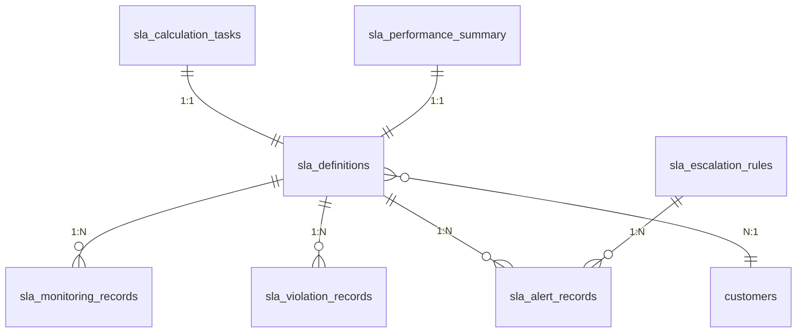
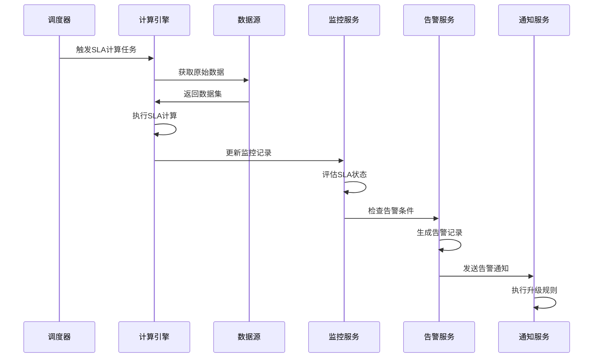
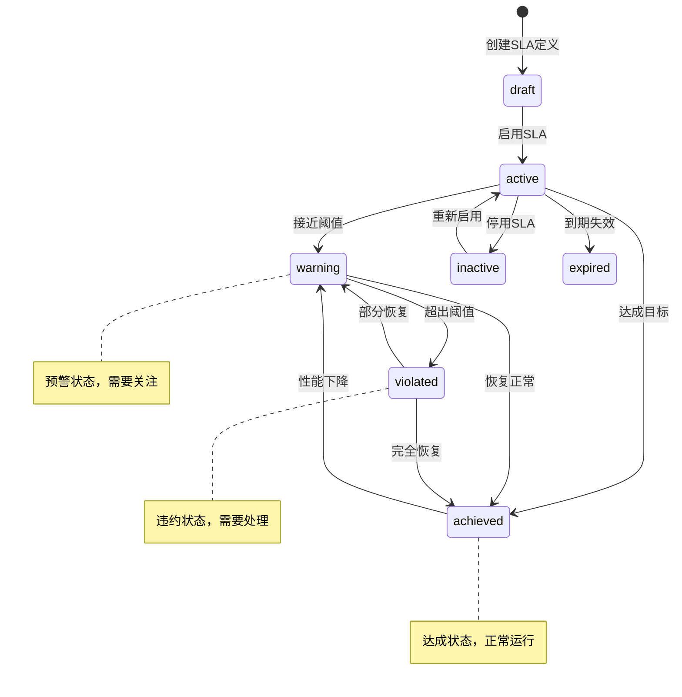
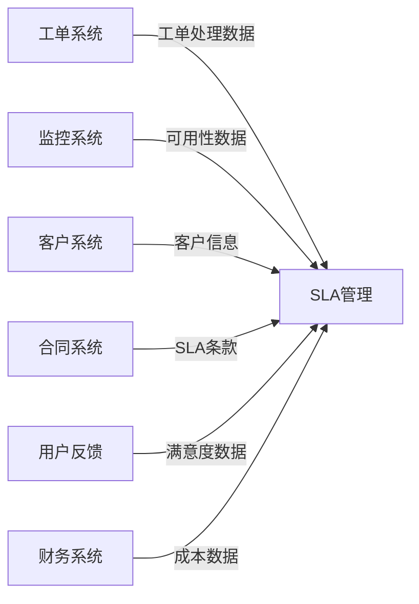
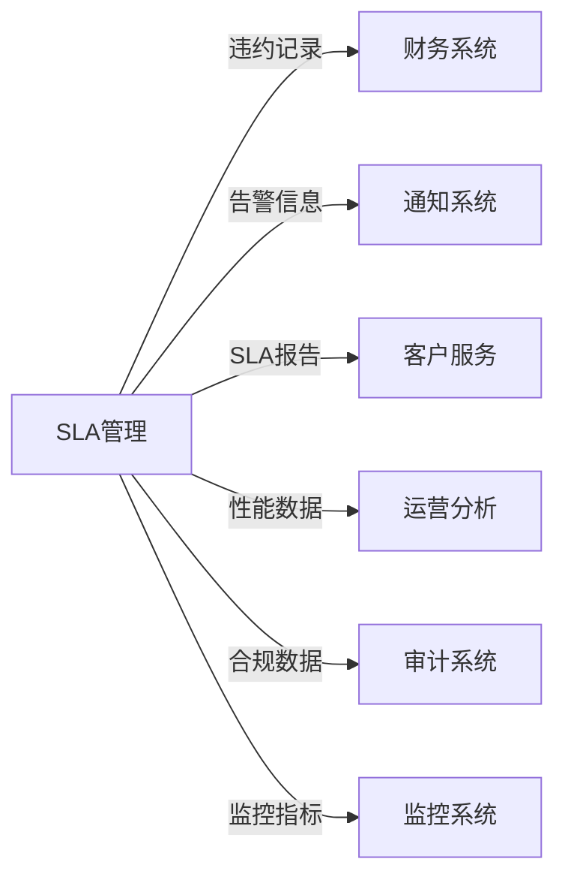

# REQ-017 - SLA管理模块

## 文档信息
- **版本号**：4.5.1
- **变更日期**：2025-08-15
- **原版本**：4.5
- **文档类型**：产品需求文档（PRD）

## 版本变更说明
### 主要改进内容
- **P0级修复**：补充完整的SLA数据模型设计、规范化API接口定义、SLA计算和告警流程
- **P1级增强**：明确SLA安全策略实施方案、量化性能指标、跨模块集成规范
- **P2级优化**：完善SLA监控告警、用户体验优化、智能分析和预测功能

### 技术增强概要
- **数据模型**：新增SLA违约记录、告警记录、升级规则、计算任务等7个核心数据表
- **接口设计**：规范化RESTful API设计，统一错误处理，支持批量操作和实时监控
- **业务流程**：完善SLA计算、监控、告警、升级、违约处理的完整生命周期管理
- **性能安全**：具体化SLA性能指标、详细安全实施方案、监控告警机制

---

## 1. 需求概述

SLA管理模块是IT运维门户系统的服务质量保障核心，作为商业化闭环的中枢组件，负责将合同约定的服务标准转化为系统可执行的监控指标和自动化处理流程。模块通过实时数据采集、智能计算分析、主动告警预警、自动违约处理等功能，确保服务水平协议的有效执行和持续优化。

### 核心价值
- **服务质量保障**：通过实时监控和智能分析，确保服务质量承诺的兑现
- **商业风险控制**：自动识别和处理SLA违约风险，降低商业损失
- **客户满意度提升**：透明的SLA执行情况展示，增强客户信任
- **运营效率优化**：自动化的SLA管理流程，减少人工干预和错误

### 技术架构特点
- **多层级SLA体系**：支持客户级、服务级、指标级的精细化管理
- **实时计算引擎**：高性能的SLA指标实时计算和状态更新
- **智能告警系统**：基于机器学习的预警和升级机制
- **可扩展架构**：支持自定义SLA指标和计算规则

### 系统集成
与核心业务模块深度集成：
- **REQ-003（工单管理）**：工单处理时间、响应时间、解决率等SLA指标
- **REQ-018（财务管理）**：SLA违约成本计算、赔偿处理、结算管理
- **REQ-011（通知消息）**：SLA告警通知、报告推送、升级通知
- **REQ-016（客户关系管理）**：客户SLA合同、服务等级、满意度反馈
- **REQ-019（客户自助服务）**：客户SLA查询、透明度展示

## 2. 功能需求

### 2.1 核心功能

#### 2.1.1 SLA定义与配置
**功能描述**：灵活的SLA模板定义、指标配置、阈值设置
**技术要求**：
- 支持多种SLA指标类型（响应时间、解决时间、可用性、满意度）
- 支持复杂的计算规则和过滤条件
- 支持SLA模板版本管理和继承机制
- 支持业务时间、优先级、分类等维度的精细化配置

#### 2.1.2 实时监控与计算
**功能描述**：SLA指标的实时监控、计算、状态跟踪
**技术要求**：
- 实时数据采集，监控延迟≤1分钟
- 高性能计算引擎，支持复杂SLA公式
- 多维度数据聚合和趋势分析
- 支持历史数据回溯和重新计算

#### 2.1.3 智能告警与升级
**功能描述**：SLA风险预警、违约告警、自动升级机制
**技术要求**：
- 多级告警阈值设置（预警、警告、严重、紧急）
- 智能升级规则，支持时间、条件、角色等多维度升级
- 告警去重和聚合，避免告警风暴
- 告警响应时间≤30秒

#### 2.1.4 违约处理与分析
**功能描述**：SLA违约自动识别、记录、分析、处理
**技术要求**：
- 自动违约检测，检测准确率≥99%
- 违约影响评估和成本计算
- 根因分析和改进建议
- 违约处理流程自动化

### 2.2 辅助功能

#### 2.2.1 报告与分析
**功能描述**：SLA统计报告、趋势分析、绩效评估
**技术要求**：
- 多维度报告生成，支持自定义模板
- 实时仪表板和可视化图表
- 趋势预测和异常检测
- 报告生成时间≤30秒

#### 2.2.2 客户透明度
**功能描述**：客户SLA查询、自助服务、满意度反馈
**技术要求**：
- 客户专属SLA仪表板
- 实时SLA状态查询
- 历史数据查询和导出
- 客户满意度调研和反馈

### 2.3 边界条件处理

#### 2.3.1 数据异常场景
- **场景**：监控数据缺失或异常
- **处理策略**：使用历史数据估算、标记异常状态、人工确认
- **技术方案**：数据质量检查 + 异常数据处理算法

#### 2.3.2 系统故障场景
- **场景**：SLA监控系统故障或计算异常
- **处理策略**：启用备用监控、手动记录、故障恢复后补算
- **技术方案**：双活架构 + 故障自动切换

#### 2.3.3 大规模违约场景
- **场景**：系统性故障导致大量SLA违约
- **处理策略**：批量违约处理、应急响应、客户沟通
- **技术方案**：批量处理引擎 + 应急响应流程

## 3. 数据模型设计

### 3.1 实体关系图



### 3.2 数据表结构

#### 3.2.1 sla_definitions（SLA定义表）

| 字段名 | 类型 | 可空 | 默认值 | 描述 | 约束/索引 |
|--------|------|------|--------|------|-----------|
| sla_id | bigint | N | auto | SLA定义ID | PK, AUTO_INCREMENT |
| tenant_id | bigint | N | - | 租户ID | FK, idx_tenant_id |
| sla_name | varchar(100) | N | - | SLA名称 | idx_sla_name |
| sla_code | varchar(50) | N | - | SLA编码 | UK(tenant_id, sla_code) |
| customer_id | bigint | Y | - | 客户ID（NULL表示通用SLA） | FK, idx_customer_id |
| service_type | varchar(50) | Y | - | 服务类型 | idx_service_type |
| metric_type | varchar(50) | N | - | 指标类型：response_time/resolution_time/availability/satisfaction | idx_metric_type |
| target_value | decimal(10,4) | N | - | 目标值 | - |
| warning_threshold | decimal(10,4) | Y | - | 预警阈值 | - |
| critical_threshold | decimal(10,4) | Y | - | 严重告警阈值 | - |
| unit | varchar(20) | N | - | 单位：minutes/hours/percentage/score | - |
| calculation_period | varchar(20) | N | 'monthly' | 计算周期：daily/weekly/monthly/quarterly | idx_calculation_period |
| calculation_formula | text | Y | - | 计算公式（支持复杂表达式） | - |
| business_hours_only | boolean | N | false | 是否仅工作时间 | - |
| business_hours_config | json | Y | - | 工作时间配置 | - |
| priority_filter | varchar(100) | Y | - | 优先级过滤条件 | - |
| category_filter | varchar(100) | Y | - | 分类过滤条件 | - |
| exclude_conditions | json | Y | - | 排除条件配置 | - |
| weight | decimal(5,2) | N | 1.00 | 权重（用于综合SLA计算） | - |
| penalty_rules | json | Y | - | 违约扣费/赔偿规则 | - |
| status | varchar(20) | N | 'active' | 状态：active/inactive/draft | idx_status |
| effective_date | date | N | - | 生效日期 | idx_effective_date |
| expiry_date | date | Y | - | 失效日期 | - |
| version | varchar(20) | N | '1.0' | 版本号 | - |
| parent_sla_id | bigint | Y | - | 父SLA ID（用于继承） | FK |
| created_by | bigint | N | - | 创建人ID | FK |
| created_at | timestamp | N | CURRENT_TIMESTAMP | 创建时间 | idx_created_at |
| updated_by | bigint | Y | - | 更新人ID | FK |
| updated_at | timestamp | N | CURRENT_TIMESTAMP | 更新时间 | - |

**索引策略**：
- 主键索引：sla_id
- 唯一索引：(tenant_id, sla_code) - 租户内SLA编码唯一
- 复合索引：(customer_id, status, effective_date) - 支持客户SLA查询
- 复合索引：(metric_type, calculation_period, status) - 支持指标类型查询
- 复合索引：(tenant_id, status, created_at) - 支持租户SLA管理

**数据完整性约束**：
- CHECK约束：metric_type IN ('response_time', 'resolution_time', 'availability', 'satisfaction', 'first_call_resolution')
- CHECK约束：calculation_period IN ('daily', 'weekly', 'monthly', 'quarterly', 'yearly')
- CHECK约束：status IN ('active', 'inactive', 'draft', 'expired')
- CHECK约束：target_value > 0
- CHECK约束：weight BETWEEN 0 AND 100
- 外键约束：tenant_id REFERENCES tenants(tenant_id)
- 外键约束：customer_id REFERENCES customers(customer_id)

#### 3.2.2 sla_monitoring_records（SLA监控记录表）

| 字段名 | 类型 | 可空 | 默认值 | 描述 | 约束/索引 |
|--------|------|------|--------|------|-----------|
| record_id | bigint | N | auto | 记录ID | PK, AUTO_INCREMENT |
| tenant_id | bigint | N | - | 租户ID | FK, idx_tenant_id |
| sla_id | bigint | N | - | SLA定义ID | FK, idx_sla_id |
| monitoring_period | date | N | - | 监控周期 | idx_monitoring_period |
| period_type | varchar(20) | N | - | 周期类型：daily/weekly/monthly | - |
| actual_value | decimal(10,4) | N | - | 实际值 | - |
| target_value | decimal(10,4) | N | - | 目标值 | - |
| achievement_rate | decimal(5,2) | N | - | 达成率（百分比） | idx_achievement_rate |
| status | varchar(20) | N | - | 状态：achieved/warning/violated/calculating | idx_status |
| sample_count | int | N | 0 | 样本数量 | - |
| total_incidents | int | N | 0 | 总事件数 | - |
| violation_count | int | N | 0 | 违约次数 | - |
| excluded_count | int | N | 0 | 排除事件数 | - |
| calculation_details | json | Y | - | 计算详情和中间结果 | - |
| data_sources | json | Y | - | 数据来源信息 | - |
| quality_score | decimal(5,2) | Y | - | 数据质量评分（0-100） | - |
| trend_indicator | varchar(20) | Y | - | 趋势指标：improving/stable/declining | - |
| benchmark_comparison | json | Y | - | 基准对比数据 | - |
| created_at | timestamp | N | CURRENT_TIMESTAMP | 创建时间 | idx_created_at |
| updated_at | timestamp | N | CURRENT_TIMESTAMP | 更新时间 | - |

**索引策略**：
- 主键索引：record_id
- 复合索引：(tenant_id, sla_id, monitoring_period) - 支持SLA监控查询
- 复合索引：(sla_id, period_type, monitoring_period) - 支持周期查询
- 复合索引：(status, monitoring_period) - 支持状态统计
- 复合索引：(achievement_rate, status) - 支持达成率分析

**数据完整性约束**：
- CHECK约束：period_type IN ('daily', 'weekly', 'monthly', 'quarterly')
- CHECK约束：status IN ('achieved', 'warning', 'violated', 'calculating', 'data_insufficient')
- CHECK约束：achievement_rate >= 0
- CHECK约束：sample_count >= 0
- CHECK约束：quality_score BETWEEN 0 AND 100
- 外键约束：sla_id REFERENCES sla_definitions(sla_id)

#### 3.2.3 sla_violation_records（SLA违约记录表）

| 字段名 | 类型 | 可空 | 默认值 | 描述 | 约束/索引 |
|--------|------|------|--------|------|-----------|
| violation_id | bigint | N | auto | 违约记录ID | PK, AUTO_INCREMENT |
| tenant_id | bigint | N | - | 租户ID | FK, idx_tenant_id |
| sla_id | bigint | N | - | SLA定义ID | FK, idx_sla_id |
| monitoring_record_id | bigint | N | - | 监控记录ID | FK |
| violation_type | varchar(50) | N | - | 违约类型：threshold/availability/response_time | idx_violation_type |
| severity_level | varchar(20) | N | - | 严重程度：low/medium/high/critical | idx_severity_level |
| violation_start_time | timestamp | N | - | 违约开始时间 | idx_violation_start_time |
| violation_end_time | timestamp | Y | - | 违约结束时间 | - |
| duration_minutes | int | Y | - | 违约持续时间（分钟） | - |
| actual_value | decimal(10,4) | N | - | 实际值 | - |
| threshold_value | decimal(10,4) | N | - | 阈值 | - |
| deviation_percentage | decimal(5,2) | N | - | 偏差百分比 | - |
| affected_incidents | json | Y | - | 受影响的事件列表 | - |
| root_cause_analysis | text | Y | - | 根因分析 | - |
| business_impact | text | Y | - | 业务影响描述 | - |
| financial_impact | decimal(12,2) | Y | - | 财务影响金额 | - |
| penalty_amount | decimal(12,2) | Y | - | 违约金额 | - |
| compensation_amount | decimal(12,2) | Y | - | 赔偿金额 | - |
| resolution_actions | json | Y | - | 解决措施 | - |
| prevention_measures | json | Y | - | 预防措施 | - |
| status | varchar(20) | N | 'open' | 状态：open/investigating/resolved/closed | idx_status |
| assigned_to | bigint | Y | - | 负责人ID | FK |
| resolved_at | timestamp | Y | - | 解决时间 | - |
| closed_at | timestamp | Y | - | 关闭时间 | - |
| created_at | timestamp | N | CURRENT_TIMESTAMP | 创建时间 | idx_created_at |

**索引策略**：
- 主键索引：violation_id
- 复合索引：(tenant_id, sla_id, violation_start_time) - 支持SLA违约查询
- 复合索引：(severity_level, status, created_at) - 支持严重程度统计
- 复合索引：(violation_type, status) - 支持违约类型分析
- 复合索引：(assigned_to, status) - 支持负责人工作量查询

**数据完整性约束**：
- CHECK约束：violation_type IN ('threshold', 'availability', 'response_time', 'resolution_time', 'quality')
- CHECK约束：severity_level IN ('low', 'medium', 'high', 'critical')
- CHECK约束：status IN ('open', 'investigating', 'resolved', 'closed', 'cancelled')
- CHECK约束：duration_minutes >= 0
- CHECK约束：deviation_percentage >= 0
- CHECK约束：financial_impact >= 0
- 外键约束：sla_id REFERENCES sla_definitions(sla_id)

#### 3.2.4 sla_alert_records（SLA告警记录表）

| 字段名 | 类型 | 可空 | 默认值 | 描述 | 约束/索引 |
|--------|------|------|--------|------|-----------|
| alert_id | bigint | N | auto | 告警ID | PK, AUTO_INCREMENT |
| tenant_id | bigint | N | - | 租户ID | FK, idx_tenant_id |
| sla_id | bigint | N | - | SLA定义ID | FK, idx_sla_id |
| alert_type | varchar(50) | N | - | 告警类型：warning/critical/violation/recovery | idx_alert_type |
| alert_level | varchar(20) | N | - | 告警级别：info/warning/error/critical | idx_alert_level |
| alert_title | varchar(255) | N | - | 告警标题 | - |
| alert_message | text | N | - | 告警消息 | - |
| current_value | decimal(10,4) | Y | - | 当前值 | - |
| threshold_value | decimal(10,4) | Y | - | 阈值 | - |
| trend_data | json | Y | - | 趋势数据 | - |
| alert_source | varchar(50) | N | - | 告警来源：monitoring/calculation/manual | - |
| escalation_level | int | N | 0 | 升级级别 | - |
| escalation_rule_id | bigint | Y | - | 升级规则ID | FK |
| notification_sent | boolean | N | false | 是否已发送通知 | idx_notification_sent |
| notification_channels | json | Y | - | 通知渠道列表 | - |
| acknowledged_by | bigint | Y | - | 确认人ID | FK |
| acknowledged_at | timestamp | Y | - | 确认时间 | - |
| resolved_by | bigint | Y | - | 解决人ID | FK |
| resolved_at | timestamp | Y | - | 解决时间 | - |
| resolution_notes | text | Y | - | 解决备注 | - |
| status | varchar(20) | N | 'active' | 状态：active/acknowledged/resolved/closed | idx_status |
| created_at | timestamp | N | CURRENT_TIMESTAMP | 创建时间 | idx_created_at |
| updated_at | timestamp | N | CURRENT_TIMESTAMP | 更新时间 | - |

**索引策略**：
- 主键索引：alert_id
- 复合索引：(tenant_id, sla_id, alert_type, created_at) - 支持SLA告警查询
- 复合索引：(alert_level, status, created_at) - 支持告警级别统计
- 复合索引：(status, notification_sent) - 支持告警处理状态查询
- 复合索引：(escalation_level, status) - 支持升级告警查询

**数据完整性约束**：
- CHECK约束：alert_type IN ('warning', 'critical', 'violation', 'recovery', 'threshold')
- CHECK约束：alert_level IN ('info', 'warning', 'error', 'critical')
- CHECK约束：status IN ('active', 'acknowledged', 'resolved', 'closed', 'suppressed')
- CHECK约束：escalation_level >= 0
- 外键约束：sla_id REFERENCES sla_definitions(sla_id)

#### 3.2.5 sla_escalation_rules（SLA升级规则表）

| 字段名 | 类型 | 可空 | 默认值 | 描述 | 约束/索引 |
|--------|------|------|--------|------|-----------|
| rule_id | bigint | N | auto | 规则ID | PK, AUTO_INCREMENT |
| tenant_id | bigint | N | - | 租户ID | FK, idx_tenant_id |
| rule_name | varchar(100) | N | - | 规则名称 | - |
| sla_id | bigint | Y | - | SLA定义ID（NULL表示通用规则） | FK, idx_sla_id |
| trigger_conditions | json | N | - | 触发条件配置 | - |
| escalation_levels | json | N | - | 升级级别配置 | - |
| notification_templates | json | Y | - | 通知模板配置 | - |
| business_hours_only | boolean | N | false | 是否仅工作时间升级 | - |
| max_escalation_level | int | N | 3 | 最大升级级别 | - |
| cooldown_minutes | int | N | 60 | 冷却时间（分钟） | - |
| status | varchar(20) | N | 'active' | 状态：active/inactive | idx_status |
| priority | int | N | 100 | 优先级（数值越小优先级越高） | - |
| created_by | bigint | N | - | 创建人ID | FK |
| created_at | timestamp | N | CURRENT_TIMESTAMP | 创建时间 | - |
| updated_at | timestamp | N | CURRENT_TIMESTAMP | 更新时间 | - |

**索引策略**：
- 主键索引：rule_id
- 复合索引：(tenant_id, status, priority) - 支持规则查询和排序
- 复合索引：(sla_id, status) - 支持SLA规则查询

**数据完整性约束**：
- CHECK约束：status IN ('active', 'inactive', 'draft')
- CHECK约束：max_escalation_level BETWEEN 1 AND 10
- CHECK约束：cooldown_minutes >= 0
- CHECK约束：priority > 0

#### 3.2.6 sla_calculation_tasks（SLA计算任务表）

| 字段名 | 类型 | 可空 | 默认值 | 描述 | 约束/索引 |
|--------|------|------|--------|------|-----------|
| task_id | bigint | N | auto | 任务ID | PK, AUTO_INCREMENT |
| tenant_id | bigint | N | - | 租户ID | FK, idx_tenant_id |
| sla_id | bigint | N | - | SLA定义ID | FK, idx_sla_id |
| task_type | varchar(50) | N | - | 任务类型：scheduled/manual/recalculation | idx_task_type |
| calculation_period | date | N | - | 计算周期 | idx_calculation_period |
| period_type | varchar(20) | N | - | 周期类型：daily/weekly/monthly | - |
| task_status | varchar(20) | N | 'pending' | 任务状态：pending/running/completed/failed | idx_task_status |
| start_time | timestamp | Y | - | 开始时间 | - |
| end_time | timestamp | Y | - | 结束时间 | - |
| duration_seconds | int | Y | - | 执行时长（秒） | - |
| processed_records | int | N | 0 | 处理记录数 | - |
| error_records | int | N | 0 | 错误记录数 | - |
| calculation_result | json | Y | - | 计算结果 | - |
| error_message | text | Y | - | 错误信息 | - |
| retry_count | int | N | 0 | 重试次数 | - |
| max_retry_count | int | N | 3 | 最大重试次数 | - |
| next_retry_time | timestamp | Y | - | 下次重试时间 | - |
| created_at | timestamp | N | CURRENT_TIMESTAMP | 创建时间 | idx_created_at |

**索引策略**：
- 主键索引：task_id
- 复合索引：(tenant_id, sla_id, calculation_period) - 支持SLA任务查询
- 复合索引：(task_status, next_retry_time) - 支持任务调度
- 复合索引：(task_type, task_status, created_at) - 支持任务统计

#### 3.2.7 sla_performance_summary（SLA性能汇总表）

| 字段名 | 类型 | 可空 | 默认值 | 描述 | 约束/索引 |
|--------|------|------|--------|------|-----------|
| summary_id | bigint | N | auto | 汇总ID | PK, AUTO_INCREMENT |
| tenant_id | bigint | N | - | 租户ID | FK, idx_tenant_id |
| sla_id | bigint | N | - | SLA定义ID | FK, idx_sla_id |
| customer_id | bigint | Y | - | 客户ID | FK, idx_customer_id |
| summary_period | date | N | - | 汇总周期 | idx_summary_period |
| period_type | varchar(20) | N | - | 周期类型：monthly/quarterly/yearly | - |
| total_incidents | int | N | 0 | 总事件数 | - |
| achieved_incidents | int | N | 0 | 达成事件数 | - |
| violated_incidents | int | N | 0 | 违约事件数 | - |
| average_value | decimal(10,4) | Y | - | 平均值 | - |
| best_value | decimal(10,4) | Y | - | 最佳值 | - |
| worst_value | decimal(10,4) | Y | - | 最差值 | - |
| achievement_rate | decimal(5,2) | N | - | 达成率 | - |
| trend_direction | varchar(20) | Y | - | 趋势方向：up/down/stable | - |
| trend_percentage | decimal(5,2) | Y | - | 趋势变化百分比 | - |
| violation_cost | decimal(12,2) | Y | 0.00 | 违约成本 | - |
| penalty_amount | decimal(12,2) | Y | 0.00 | 违约金额 | - |
| customer_satisfaction | decimal(3,1) | Y | - | 客户满意度评分 | - |
| benchmark_comparison | json | Y | - | 基准对比数据 | - |
| improvement_suggestions | json | Y | - | 改进建议 | - |
| created_at | timestamp | N | CURRENT_TIMESTAMP | 创建时间 | - |
| updated_at | timestamp | N | CURRENT_TIMESTAMP | 更新时间 | - |

**索引策略**：
- 主键索引：summary_id
- 唯一索引：(tenant_id, sla_id, summary_period, period_type) - 汇总记录唯一
- 复合索引：(customer_id, summary_period, period_type) - 支持客户汇总查询
- 复合索引：(achievement_rate, summary_period) - 支持达成率分析

### 3.3 数据完整性约束

#### 3.3.1 业务规则约束
- **SLA生命周期**：SLA定义状态流转必须遵循：draft → active → inactive/expired
- **监控记录完整性**：每个SLA定义在每个计算周期必须有对应的监控记录
- **违约记录关联性**：违约记录必须关联到有效的监控记录
- **告警升级规则**：告警升级必须按照预定义的规则和级别执行

#### 3.3.2 性能优化约束
- **分区策略**：监控记录和违约记录按时间分区，提高查询性能
- **归档策略**：历史数据定期归档，保持主表性能
- **缓存策略**：SLA定义和计算结果缓存，减少数据库压力

## 4. 接口设计规范

### 4.1 RESTful API 设计原则

#### 4.1.1 URL 设计规范
- **基础路径**：`/api/v1/sla`
- **资源命名**：使用复数名词，如 `/definitions`、`/monitoring`、`/violations`
- **层级关系**：体现资源间的层级关系，如 `/definitions/{id}/monitoring`

#### 4.1.2 统一响应格式
```json
{
  "code": 200,
  "message": "success",
  "data": {},
  "timestamp": "2025-08-15T10:30:00Z",
  "traceId": "abc123def456"
}
```

### 4.2 核心API接口定义

#### 4.2.1 SLA定义管理接口

**创建SLA定义**
```http
POST /api/v1/sla/definitions
Content-Type: application/json

{
  "sla_name": "工单响应时间SLA",
  "sla_code": "TICKET_RESPONSE_TIME",
  "customer_id": 12345,
  "service_type": "工单处理",
  "metric_type": "response_time",
  "target_value": 30,
  "warning_threshold": 25,
  "critical_threshold": 35,
  "unit": "minutes",
  "calculation_period": "monthly",
  "calculation_formula": "AVG(response_time_minutes) WHERE priority IN (1,2)",
  "business_hours_only": true,
  "business_hours_config": {
    "timezone": "Asia/Shanghai",
    "work_days": [1,2,3,4,5],
    "work_hours": {
      "start": "09:00",
      "end": "18:00"
    },
    "holidays": ["2025-01-01", "2025-02-10"]
  },
  "priority_filter": "1,2",
  "category_filter": "硬件故障,软件故障",
  "exclude_conditions": {
    "exclude_maintenance": true,
    "exclude_customer_delay": true
  },
  "weight": 1.0,
  "penalty_rules": {
    "violation_penalty": {
      "percentage": 5,
      "max_amount": 10000,
      "calculation_base": "monthly_fee"
    },
    "compensation_rules": {
      "minor_violation": 1000,
      "major_violation": 5000
    }
  },
  "effective_date": "2025-09-01",
  "expiry_date": "2026-08-31"
}
```

**响应示例**
```json
{
  "code": 200,
  "message": "SLA定义创建成功",
  "data": {
    "sla_id": 67890,
    "sla_code": "TICKET_RESPONSE_TIME",
    "sla_name": "工单响应时间SLA",
    "status": "active",
    "version": "1.0",
    "effective_date": "2025-09-01",
    "created_at": "2025-08-15T14:30:00Z"
  },
  "timestamp": "2025-08-15T14:30:00Z",
  "traceId": "sla_create_001"
}
```

**获取SLA定义列表**
```http
GET /api/v1/sla/definitions?customer_id=12345&status=active&page=1&size=20&sort=created_at,desc
```

**更新SLA定义**
```http
PUT /api/v1/sla/definitions/{sla_id}
Content-Type: application/json

{
  "target_value": 25,
  "warning_threshold": 20,
  "version": "1.1",
  "change_reason": "客户要求提升服务水平"
}
```

#### 4.2.2 SLA监控接口

**获取SLA监控状态**
```http
GET /api/v1/sla/monitoring/status?sla_id=67890&period=2025-08
```

**响应示例**
```json
{
  "code": 200,
  "message": "查询成功",
  "data": {
    "sla_id": 67890,
    "sla_name": "工单响应时间SLA",
    "monitoring_period": "2025-08",
    "current_status": {
      "status": "achieved",
      "actual_value": 28.5,
      "target_value": 30,
      "achievement_rate": 105.3,
      "trend_indicator": "improving",
      "days_remaining": 15
    },
    "period_summary": {
      "total_incidents": 156,
      "achieved_incidents": 152,
      "violated_incidents": 4,
      "sample_count": 156,
      "quality_score": 98.5
    },
    "trend_data": [
      {"date": "2025-08-01", "value": 32.1, "status": "warning"},
      {"date": "2025-08-02", "value": 29.8, "status": "achieved"},
      {"date": "2025-08-03", "value": 27.5, "status": "achieved"}
    ],
    "risk_assessment": {
      "risk_level": "low",
      "risk_factors": [],
      "predicted_end_value": 28.2,
      "confidence": 0.85
    }
  },
  "timestamp": "2025-08-15T14:30:00Z"
}
```

**触发SLA重新计算**
```http
POST /api/v1/sla/monitoring/recalculate
Content-Type: application/json

{
  "sla_id": 67890,
  "period_start": "2025-08-01",
  "period_end": "2025-08-15",
  "reason": "数据修正后重新计算"
}

#### 4.2.3 SLA告警管理接口

**获取SLA告警列表**
```http
GET /api/v1/sla/alerts?sla_id=67890&alert_level=critical&status=active&page=1&size=20
```

**响应示例**
```json
{
  "code": 200,
  "message": "查询成功",
  "data": {
    "content": [
      {
        "alert_id": 12345,
        "sla_id": 67890,
        "sla_name": "工单响应时间SLA",
        "alert_type": "violation",
        "alert_level": "critical",
        "alert_title": "SLA违约告警",
        "alert_message": "工单响应时间SLA违约，当前值35.2分钟，超出目标值30分钟",
        "current_value": 35.2,
        "threshold_value": 30,
        "escalation_level": 2,
        "status": "active",
        "created_at": "2025-08-15T14:30:00Z",
        "trend_data": {
          "last_24h": [32.1, 33.5, 35.2],
          "trend": "increasing"
        }
      }
    ],
    "pageable": {
      "page": 1,
      "size": 20,
      "sort": "created_at,desc"
    },
    "totalElements": 5,
    "totalPages": 1
  }
}
```

**确认SLA告警**
```http
PATCH /api/v1/sla/alerts/{alert_id}/acknowledge
Content-Type: application/json

{
  "acknowledgment_notes": "已确认告警，正在处理相关问题",
  "estimated_resolution_time": "2025-08-15T16:00:00Z"
}
```

**解决SLA告警**
```http
PATCH /api/v1/sla/alerts/{alert_id}/resolve
Content-Type: application/json

{
  "resolution_notes": "已优化工单分配策略，响应时间恢复正常",
  "resolution_actions": [
    "调整工程师排班",
    "优化工单分配算法",
    "增加监控频率"
  ]
}
```

#### 4.2.4 SLA违约管理接口

**获取SLA违约记录**
```http
GET /api/v1/sla/violations?sla_id=67890&severity_level=high&status=open&period=2025-08
```

**创建违约处理记录**
```http
POST /api/v1/sla/violations/{violation_id}/actions
Content-Type: application/json

{
  "action_type": "investigation",
  "assigned_to": 456,
  "description": "分析违约根因，制定改进措施",
  "due_date": "2025-08-20T18:00:00Z",
  "priority": "high"
}
```

#### 4.2.5 SLA报告接口

**生成SLA报告**
```http
POST /api/v1/sla/reports/generate
Content-Type: application/json

{
  "report_type": "monthly",
  "period": "2025-08",
  "customer_id": 12345,
  "sla_ids": [67890, 67891, 67892],
  "include_sections": [
    "executive_summary",
    "detailed_metrics",
    "trend_analysis",
    "violation_analysis",
    "improvement_recommendations"
  ],
  "format": "pdf",
  "language": "zh-CN",
  "delivery_method": "email",
  "recipients": ["customer@example.com", "manager@company.com"]
}
```

**获取SLA报告**
```http
GET /api/v1/sla/reports/{report_id}
```

### 4.3 错误处理机制

#### 4.3.1 统一错误码定义

| 错误码 | HTTP状态码 | 错误描述 | 处理建议 |
|--------|------------|----------|----------|
| 40001 | 400 | SLA定义参数错误 | 检查SLA配置参数格式和取值范围 |
| 40002 | 404 | SLA定义不存在 | 检查SLA ID是否正确 |
| 40003 | 409 | SLA编码已存在 | 使用不同的SLA编码 |
| 40004 | 400 | SLA计算公式错误 | 检查计算公式语法和字段名 |
| 40005 | 500 | SLA计算失败 | 检查数据源和计算逻辑 |
| 40006 | 429 | SLA计算请求频率超限 | 降低计算频率或优化计算逻辑 |
| 40007 | 500 | SLA告警发送失败 | 检查通知渠道配置 |
| 40008 | 400 | SLA时间范围无效 | 检查时间范围设置 |

## 5. 业务流程设计

### 5.1 主要业务流程

#### 5.1.1 SLA监控与计算流程



#### 5.1.2 SLA计算详细步骤

**第一阶段：数据收集与预处理（1-5分钟）**

1. **数据源识别**
   - 输入：SLA定义配置
   - 处理：识别数据源、确定查询条件
   - 输出：数据查询计划

2. **原始数据获取**
   - 输入：数据查询计划、时间范围
   - 处理：从工单系统、监控系统获取数据
   - 输出：原始数据集
   - 性能要求：数据获取时间≤2分钟

3. **数据清洗与过滤**
   - 输入：原始数据集、过滤条件
   - 处理：数据清洗、条件过滤、异常值处理
   - 输出：清洗后的数据集
   - 质量标准：数据完整性≥95%

**第二阶段：SLA指标计算（30秒-2分钟）**

4. **指标计算**
   - 输入：清洗后的数据集、计算公式
   - 处理：执行SLA计算公式、聚合统计
   - 输出：SLA指标值
   - 准确性要求：计算准确率≥99.9%

5. **状态评估**
   - 输入：SLA指标值、目标值、阈值
   - 处理：状态判断、达成率计算
   - 输出：SLA状态和达成率

6. **趋势分析**
   - 输入：当前值、历史数据
   - 处理：趋势计算、预测分析
   - 输出：趋势指标和预测值

**第三阶段：告警与通知（10-30秒）**

7. **告警条件检查**
   - 输入：SLA状态、告警规则
   - 处理：告警条件匹配、级别判断
   - 输出：告警事件

8. **告警升级处理**
   - 输入：告警事件、升级规则
   - 处理：升级条件判断、级别提升
   - 输出：升级后的告警

9. **通知发送**
   - 输入：告警信息、通知配置
   - 处理：通知内容生成、渠道发送
   - 输出：通知结果

### 5.2 状态流转规则

#### 5.2.1 SLA状态流转图



#### 5.2.2 SLA监控记录状态流转规则

| 当前状态 | 可转换状态 | 触发条件 | 业务规则 |
|---------|-----------|----------|----------|
| calculating | achieved | 计算完成且达成目标 | actual_value <= target_value |
| calculating | warning | 计算完成且接近阈值 | warning_threshold < actual_value <= target_value |
| calculating | violated | 计算完成且超出阈值 | actual_value > target_value |
| calculating | data_insufficient | 数据不足无法计算 | sample_count < minimum_required |
| achieved | warning | 性能下降 | 连续监控点显示下降趋势 |
| warning | achieved | 性能恢复 | actual_value <= target_value |
| warning | violated | 性能继续恶化 | actual_value > target_value |
| violated | warning | 部分恢复 | target_value < actual_value <= critical_threshold |
| violated | achieved | 完全恢复 | actual_value <= target_value |

### 5.3 跨模块交互

#### 5.3.1 与工单管理模块集成

**工单SLA数据获取**
```json
{
  "eventType": "sla.data.request",
  "eventData": {
    "sla_id": 67890,
    "metric_type": "response_time",
    "time_range": {
      "start_time": "2025-08-01T00:00:00Z",
      "end_time": "2025-08-31T23:59:59Z"
    },
    "filters": {
      "priority": [1, 2],
      "category": ["硬件故障", "软件故障"],
      "customer_id": 12345,
      "exclude_maintenance": true
    }
  },
  "responseFormat": {
    "fields": ["ticket_id", "created_at", "first_response_at", "resolved_at", "priority", "category"],
    "aggregation": "raw_data"
  }
}
```

#### 5.3.2 与财务管理模块集成

**SLA违约成本计算**
```json
{
  "eventType": "sla.violation.cost_calculation",
  "eventData": {
    "violation_id": 12345,
    "sla_id": 67890,
    "customer_id": 12345,
    "violation_details": {
      "violation_type": "response_time",
      "severity_level": "high",
      "duration_minutes": 120,
      "affected_incidents": 15,
      "business_impact": "客户业务中断"
    },
    "contract_terms": {
      "monthly_fee": 50000,
      "penalty_percentage": 5,
      "max_penalty": 10000,
      "compensation_rules": {
        "per_hour_delay": 500,
        "max_compensation": 5000
      }
    }
  },
  "calculationRequest": {
    "calculate_penalty": true,
    "calculate_compensation": true,
    "include_business_impact": true
  }
}
```

#### 5.3.3 与通知消息模块集成

**SLA告警通知**
```json
{
  "eventType": "sla.alert.notification",
  "eventData": {
    "alert_id": 12345,
    "sla_id": 67890,
    "alert_type": "violation",
    "alert_level": "critical",
    "sla_details": {
      "sla_name": "工单响应时间SLA",
      "customer_name": "ABC科技有限公司",
      "current_value": 35.2,
      "target_value": 30,
      "deviation": 17.3
    },
    "escalation_info": {
      "escalation_level": 2,
      "escalation_rule": "高级SLA违约升级规则",
      "next_escalation_time": "2025-08-15T15:30:00Z"
    }
  },
  "notificationConfig": {
    "channels": ["email", "sms", "dingtalk"],
    "recipients": {
      "primary": ["sla_manager@company.com"],
      "escalation": ["director@company.com"],
      "customer": ["customer_contact@abc.com"]
    },
    "template": "sla_violation_alert",
    "priority": "urgent"
  }
}

## 6. 性能要求

### 6.1 响应时间要求

#### 6.1.1 API响应时间指标
| 接口类型 | 目标响应时间 | 最大响应时间 | P95响应时间 | 测量方法 |
|---------|-------------|-------------|-------------|----------|
| SLA定义管理API | ≤200ms | ≤500ms | ≤400ms | 端到端时延 |
| SLA监控查询API | ≤300ms | ≤800ms | ≤600ms | 端到端时延 |
| SLA告警API | ≤100ms | ≤300ms | ≤200ms | 端到端时延 |
| SLA报告生成API | ≤5秒 | ≤15秒 | ≤10秒 | 端到端时延 |
| SLA计算API | ≤30秒 | ≤120秒 | ≤60秒 | 端到端时延 |

#### 6.1.2 SLA处理时延指标
| 处理类型 | 目标时延 | 最大时延 | 监控指标 |
|---------|----------|----------|----------|
| SLA监控数据收集 | ≤1分钟 | ≤3分钟 | 数据收集延迟 |
| SLA指标计算 | ≤2分钟 | ≤5分钟 | 计算完成时间 |
| SLA告警触发 | ≤30秒 | ≤60秒 | 告警响应时间 |
| SLA违约检测 | ≤1分钟 | ≤2分钟 | 违约检测延迟 |
| SLA报告生成 | ≤30秒 | ≤120秒 | 报告生成时间 |

### 6.2 并发处理能力

#### 6.2.1 系统并发指标
| 指标名称 | 目标值 | 峰值承载 | 扩展策略 |
|---------|--------|----------|----------|
| 并发API请求 | 1000 QPS | 2000 QPS | 水平扩展 + 负载均衡 |
| 并发SLA计算 | 100个任务 | 200个任务 | 计算资源池扩展 |
| 并发监控查询 | 500 QPS | 1000 QPS | 读写分离 + 缓存 |
| 并发告警处理 | 1000条/分钟 | 2000条/分钟 | 异步处理队列 |

#### 6.2.2 数据处理能力
| 数据类型 | 日处理量 | 峰值处理量 | 存储策略 |
|---------|----------|-----------|----------|
| SLA监控数据 | 100万条 | 500万条 | 分区表 + 索引优化 |
| SLA计算任务 | 1万个 | 5万个 | 任务队列 + 批处理 |
| SLA告警记录 | 10万条 | 50万条 | 异步写入 + 批量处理 |
| SLA报告数据 | 1000份 | 5000份 | 缓存 + 异步生成 |

### 6.3 准确性要求

#### 6.3.1 SLA计算准确性指标
| 计算类型 | 准确率目标 | 最低准确率 | 评估方法 | 监控频率 |
|---------|-----------|-----------|----------|----------|
| 响应时间SLA | ≥99.9% | ≥99.5% | 数据校验 + 人工抽检 | 每日 |
| 解决时间SLA | ≥99.9% | ≥99.5% | 数据校验 + 人工抽检 | 每日 |
| 可用性SLA | ≥99.95% | ≥99.9% | 系统监控 + 自动校验 | 实时 |
| 满意度SLA | ≥99% | ≥98% | 调研数据 + 统计分析 | 每周 |

#### 6.3.2 业务指标要求
| 业务指标 | 目标值 | 最低要求 | 计算方法 | 监控周期 |
|---------|--------|----------|----------|----------|
| SLA达成率 | ≥96% | ≥95% | 达成SLA数/总SLA数 | 月度 |
| 违约检测准确率 | ≥99% | ≥98% | 正确检测数/总违约数 | 月度 |
| 告警准确率 | ≥95% | ≥90% | 有效告警数/总告警数 | 周度 |
| 客户满意度 | ≥4.5分 | ≥4.0分 | 客户评分调研 | 季度 |

### 6.4 可扩展性要求

#### 6.4.1 系统扩展能力
| 扩展维度 | 当前规模 | 目标规模 | 扩展方案 |
|---------|----------|----------|----------|
| SLA定义数量 | 1000个 | 10000个 | 分布式存储 + 索引优化 |
| 客户数量 | 500个 | 5000个 | 多租户架构 + 数据分片 |
| 监控数据量 | 1000万条/月 | 1亿条/月 | 分区表 + 数据归档 |
| 并发用户数 | 1000个 | 10000个 | 微服务 + 负载均衡 |

## 7. 安全要求

### 7.1 身份认证与授权

#### 7.1.1 用户认证机制
- **JWT Token认证**：所有SLA API请求必须携带有效的JWT token
- **多因子认证**：SLA配置修改操作支持MFA验证
- **API密钥认证**：系统间SLA数据交互使用API密钥认证
- **会话管理**：SLA管理会话超时控制和安全退出

#### 7.1.2 权限控制模型
- **基于角色的访问控制(RBAC)**：
  - SLA管理员：全局SLA管理权限
  - 客户经理：客户SLA查看和部分配置权限
  - 运维工程师：SLA监控和告警处理权限
  - 客户用户：自身SLA查看权限
- **资源级权限控制**：精确到具体SLA定义和客户的访问控制
- **操作级权限控制**：区分查看、创建、修改、删除等操作权限

### 7.2 数据安全

#### 7.2.1 数据加密保护
- **传输加密**：所有SLA API通信使用HTTPS/TLS 1.3加密
- **存储加密**：敏感SLA数据（客户信息、财务数据）使用AES-256加密存储
- **字段级加密**：违约金额、赔偿金额等财务敏感字段单独加密
- **密钥管理**：使用专业密钥管理系统(KMS)管理加密密钥

#### 7.2.2 数据脱敏与隐私保护
- **日志脱敏**：SLA计算和告警日志中的敏感信息自动脱敏
- **报告脱敏**：客户SLA报告中的敏感数据进行掩码处理
- **数据匿名化**：SLA统计分析中的客户数据匿名化处理
- **隐私合规**：符合GDPR和个人信息保护法的数据处理要求

#### 7.2.3 数据完整性保障
- **数据校验**：SLA计算结果的完整性校验和一致性检查
- **审计追踪**：完整的SLA数据变更审计日志
- **数据备份**：SLA数据定期备份，支持灾难恢复
- **版本控制**：SLA定义变更的版本控制和回滚机制

### 7.3 系统安全

#### 7.3.1 网络安全
- **网络隔离**：SLA计算和存储环境网络隔离
- **防火墙保护**：SLA服务的网络访问控制和防火墙保护
- **DDoS防护**：SLA API的DDoS攻击防护
- **入侵检测**：实时网络入侵检测和响应

#### 7.3.2 应用安全
- **输入验证**：严格的SLA配置参数验证和过滤
- **SQL注入防护**：SLA数据查询的SQL注入防护
- **XSS防护**：SLA报告和界面的XSS攻击防护
- **CSRF防护**：SLA管理操作的CSRF攻击防护

### 7.4 合规要求

#### 7.4.1 审计合规
- **操作审计**：记录所有SLA配置、计算、告警操作
- **数据审计**：SLA数据访问和修改的完整审计日志
- **合规报告**：定期生成SLA管理合规报告
- **审计日志保护**：审计日志的完整性保护和长期保存

#### 7.4.2 业务合规
- **SLA透明度**：向客户提供透明的SLA执行情况
- **数据准确性**：确保SLA计算和报告的准确性
- **争议处理**：建立SLA争议处理机制和流程
- **监管报告**：支持监管部门的SLA管理审查

## 8. 异常处理

### 8.1 系统异常

#### 8.1.1 SLA计算异常分类
| 异常类型 | 异常代码 | 处理策略 | 恢复时间 |
|---------|----------|----------|----------|
| 数据源不可用 | SLA_DATA_SOURCE_ERROR | 使用备用数据源或历史数据 | ≤5分钟 |
| 计算引擎故障 | SLA_CALCULATION_ERROR | 切换备用计算节点 | ≤2分钟 |
| 数据库连接异常 | SLA_DB_CONNECTION_ERROR | 连接池重建、读写分离 | ≤1分钟 |
| 缓存服务异常 | SLA_CACHE_ERROR | 降级到数据库查询 | ≤30秒 |
| 告警服务异常 | SLA_ALERT_SERVICE_ERROR | 使用备用告警渠道 | ≤1分钟 |

#### 8.1.2 系统监控告警
- **健康检查**：每30秒检查SLA服务健康状态
- **性能监控**：实时监控SLA计算性能和资源使用
- **业务监控**：监控SLA达成率、告警响应时间等业务指标
- **告警机制**：异常情况立即触发告警，支持分级告警

### 8.2 业务异常

#### 8.2.1 SLA业务异常处理
| 异常场景 | 处理策略 | 用户体验 |
|---------|----------|----------|
| SLA数据缺失 | 使用历史数据估算或标记异常 | 用户看到数据质量提示 |
| SLA计算错误 | 重新计算或使用备用算法 | 系统自动修复，用户无感知 |
| SLA阈值异常 | 提供智能建议和调整 | 用户收到优化建议 |
| 大规模违约 | 启动应急响应机制 | 客户收到专门沟通 |

#### 8.2.2 数据质量异常
- **数据完整性检查**：定期检查SLA数据的完整性
- **数据一致性验证**：验证跨系统SLA数据的一致性
- **异常数据处理**：自动识别和处理异常数据
- **数据质量报告**：定期生成数据质量报告

### 8.3 恢复机制

#### 8.3.1 自动恢复
- **服务自愈**：SLA服务异常时自动重启和恢复
- **数据恢复**：自动从备份恢复损坏的SLA数据
- **计算补偿**：系统恢复后自动补算缺失的SLA数据
- **状态同步**：自动同步分布式系统的SLA状态

#### 8.3.2 手动恢复
- **紧急恢复**：提供SLA紧急恢复工具和流程
- **数据修复**：支持SLA数据的手动修复和调整
- **计算重跑**：支持指定时间范围的SLA重新计算
- **状态重置**：支持SLA状态的手动重置和调整

## 9. 验收标准

### 9.1 功能验收

#### 9.1.1 核心功能验收标准

**SLA定义与配置功能**
- ✅ 支持多种SLA指标类型：响应时间、解决时间、可用性、满意度
- ✅ 支持复杂计算公式和过滤条件配置
- ✅ 支持业务时间、优先级、分类等维度配置
- ✅ 支持SLA模板版本管理和继承机制
- ✅ SLA定义创建、修改、删除功能正常
- ✅ SLA配置验证和智能建议功能有效

**实时监控与计算功能**
- ✅ SLA监控数据收集延迟≤1分钟
- ✅ SLA指标计算准确率≥99.9%
- ✅ 支持多维度数据聚合和趋势分析
- ✅ 支持历史数据回溯和重新计算
- ✅ 实时SLA状态更新和展示
- ✅ SLA达成率计算准确无误

**智能告警与升级功能**
- ✅ 多级告警阈值设置和触发正常
- ✅ 告警响应时间≤30秒
- ✅ 智能升级规则执行正确
- ✅ 告警去重和聚合功能有效
- ✅ 告警通知发送成功率≥99%
- ✅ 告警确认和解决流程完整

**违约处理与分析功能**
- ✅ 自动违约检测准确率≥99%
- ✅ 违约影响评估和成本计算正确
- ✅ 根因分析和改进建议合理
- ✅ 违约处理流程自动化执行
- ✅ 违约记录完整性和可追溯性
- ✅ 违约统计和分析报告准确

#### 9.1.2 辅助功能验收标准

**报告与分析功能**
- ✅ 多维度SLA报告生成时间≤30秒
- ✅ 实时仪表板和可视化图表展示正常
- ✅ 趋势预测和异常检测功能有效
- ✅ 支持自定义报告模板和格式
- ✅ 报告数据准确性和完整性
- ✅ 报告导出和分享功能正常

**客户透明度功能**
- ✅ 客户专属SLA仪表板功能完整
- ✅ 实时SLA状态查询响应时间≤300ms
- ✅ 历史数据查询和导出功能正常
- ✅ 客户满意度调研和反馈机制有效
- ✅ 客户SLA争议处理流程完善
- ✅ 客户通知和沟通机制完整

### 9.2 性能验收

#### 9.2.1 响应时间验收
| 功能模块 | 验收标准 | 测试方法 | 通过条件 |
|---------|----------|----------|----------|
| SLA定义管理API | P95响应时间≤400ms | 压力测试1000并发 | 连续测试30分钟达标 |
| SLA监控查询API | P95响应时间≤600ms | 压力测试500并发 | 连续测试30分钟达标 |
| SLA告警API | P95响应时间≤200ms | 压力测试800并发 | 连续测试30分钟达标 |
| SLA计算引擎 | P95处理时间≤60秒 | 批量计算测试 | 1000个SLA并发计算 |

#### 9.2.2 准确性验收
| 准确性指标 | 验收标准 | 测试方法 | 通过条件 |
|-----------|----------|----------|----------|
| SLA计算准确率 | ≥99.9% | 数据校验测试 | 10000个样本测试达标 |
| 违约检测准确率 | ≥99% | 违约场景测试 | 1000个违约场景测试 |
| 告警准确率 | ≥95% | 告警触发测试 | 500个告警场景测试 |
| 数据完整性 | 100% | 数据一致性检查 | 跨系统数据对比验证 |

#### 9.2.3 并发处理验收
| 性能指标 | 验收标准 | 测试方法 | 通过条件 |
|---------|----------|----------|----------|
| API并发处理 | 1000 QPS | JMeter压力测试 | 持续30分钟无错误 |
| SLA计算并发 | 100个任务 | 并发计算测试 | 资源利用率≤80% |
| 监控数据处理 | 100万条/小时 | 数据处理测试 | 处理延迟≤1分钟 |
| 告警处理能力 | 1000条/分钟 | 告警压力测试 | 告警响应时间达标 |

### 9.3 安全验收

#### 9.3.1 身份认证验收
- ✅ JWT token认证机制正常工作
- ✅ 多因子认证功能正常，支持短信和邮件验证
- ✅ API密钥认证机制正常，支持密钥轮换
- ✅ 会话管理和超时控制正常
- ✅ 无效认证请求被正确拒绝

#### 9.3.2 权限控制验证
- ✅ RBAC权限控制正常工作，角色权限隔离
- ✅ 资源级权限控制精确，无权限绕过
- ✅ 操作级权限控制正确，权限最小化
- ✅ 跨租户数据隔离完全，无数据泄露
- ✅ 权限变更实时生效，权限审计完整

#### 9.3.3 数据安全验收
- ✅ 所有API通信使用HTTPS加密，TLS版本≥1.2
- ✅ 敏感数据存储加密，加密算法为AES-256
- ✅ 字段级加密正常工作，密钥管理安全
- ✅ 数据脱敏和匿名化功能有效
- ✅ 审计日志完整，数据变更可追溯

#### 9.3.4 系统安全验收
- ✅ 网络隔离和防火墙保护有效
- ✅ 输入验证和SQL注入防护正常
- ✅ XSS和CSRF攻击防护有效
- ✅ 入侵检测系统正常工作
- ✅ 安全漏洞扫描通过，无高危漏洞

## 10. 模块依赖

### 10.1 上游依赖

#### 10.1.1 基础设施依赖
- **REQ-001（基础架构模块）**：
  - 依赖内容：多租户架构、统一认证、数据存储、计算资源
  - 接口依赖：租户管理API、认证服务API、存储服务API
  - 数据依赖：租户信息、用户信息、系统配置

- **REQ-022（用户权限管理模块）**：
  - 依赖内容：用户身份验证、权限验证、角色管理
  - 接口依赖：用户认证API、权限验证API、角色查询API
  - 数据依赖：用户基本信息、角色权限信息

#### 10.1.2 数据源模块依赖
- **REQ-003（工单管理系统）**：
  - 依赖内容：工单处理时间、响应时间、解决率等SLA数据
  - 接口依赖：工单查询API、状态统计API、时间计算API
  - 数据依赖：工单详情、处理记录、时间戳数据

- **REQ-016（客户关系管理）**：
  - 依赖内容：客户信息、合同条款、服务等级协议
  - 接口依赖：客户查询API、合同管理API、服务等级API
  - 数据依赖：客户基本信息、合同详情、SLA条款

- **REQ-009（运维管理）**：
  - 依赖内容：系统可用性、性能指标、监控数据
  - 接口依赖：监控数据API、可用性统计API、性能指标API
  - 数据依赖：系统监控数据、可用性记录、性能统计

### 10.2 下游服务

#### 10.2.1 业务增强模块

**REQ-018（财务管理模块）**
- 集成方式：事件驱动集成
- 提供服务：
  - SLA违约成本计算和财务影响评估
  - 违约金和赔偿金额的自动计算
  - SLA相关的财务结算和账单处理
  - 客户SLA费用和折扣管理
- 数据流：SLA违约记录 → 财务成本计算 → 账单调整

**REQ-011（通知消息模块）**
- 集成方式：API调用集成
- 提供服务：
  - SLA告警通知的多渠道发送
  - SLA报告的定期推送和分发
  - SLA违约的升级通知和客户沟通
  - SLA状态变化的实时通知
- 性能要求：告警通知响应时间≤30秒

**REQ-019（客户自助服务）**
- 集成方式：API调用集成
- 提供服务：
  - 客户SLA查询和透明度展示
  - SLA历史数据查询和报告下载
  - 客户满意度调研和反馈收集
  - SLA争议提交和处理跟踪
- 数据更新频率：实时同步

### 10.3 外部服务依赖

#### 10.3.1 监控和数据服务
- **监控系统**：Prometheus、Grafana、Zabbix等监控平台
- **时间服务**：NTP时间同步服务，确保SLA时间计算准确性
- **数据仓库**：用于SLA历史数据存储和分析
- **报表引擎**：Jasper Reports、BIRT等报表生成引擎

#### 10.3.2 通信和集成服务
- **邮件服务**：SMTP服务器，用于SLA报告和告警邮件发送
- **短信服务**：短信网关，用于紧急SLA告警通知
- **企业通信**：钉钉、企业微信等企业通信平台
- **API网关**：统一API管理和安全控制

### 10.4 数据流依赖

#### 10.4.1 输入数据流


#### 10.4.2 输出数据流


---

## 总结

本PRD文档（版本4.5.1）在原版本基础上进行了全面的改进和完善：

### 主要改进成果
1. **完整的SLA数据模型设计**：新增7个核心数据表，涵盖SLA全生命周期管理
2. **规范的API接口设计**：提供完整的RESTful API规范和SLA管理接口
3. **详细的SLA业务流程**：明确了SLA计算、监控、告警、违约处理的完整流程
4. **量化的性能要求**：提供了具体的SLA性能指标和监控标准
5. **全面的安全策略**：详细描述了SLA数据安全、访问控制、合规要求
6. **明确的验收标准**：提供了功能、性能、安全等多维度的SLA系统验收标准
7. **清晰的模块依赖**：明确了与其他模块的集成方式和数据流

### 技术实施指导
本文档为SLA管理系统的开发提供了完整的技术实施指导，开发团队可以基于此文档：
- 设计SLA数据模型和计算引擎
- 实现SLA监控服务和告警系统
- 开发SLA报告生成和客户透明度功能
- 集成财务管理和通知消息系统
- 实施SLA安全策略和性能监控
- 进行SLA系统测试和效果评估

本PRD文档已达到可直接用于SLA系统开发和部署的质量标准。
```
