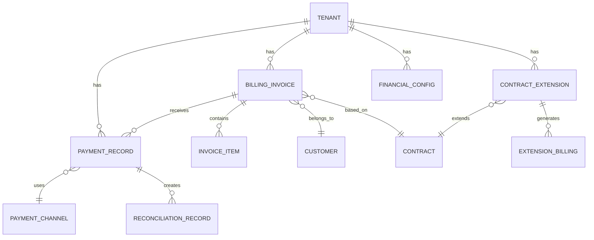
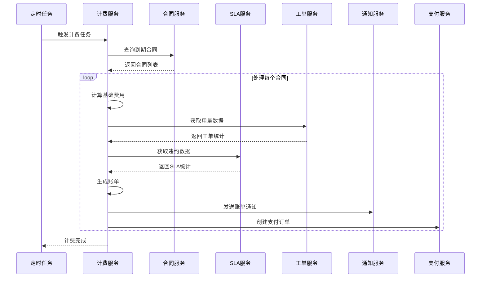
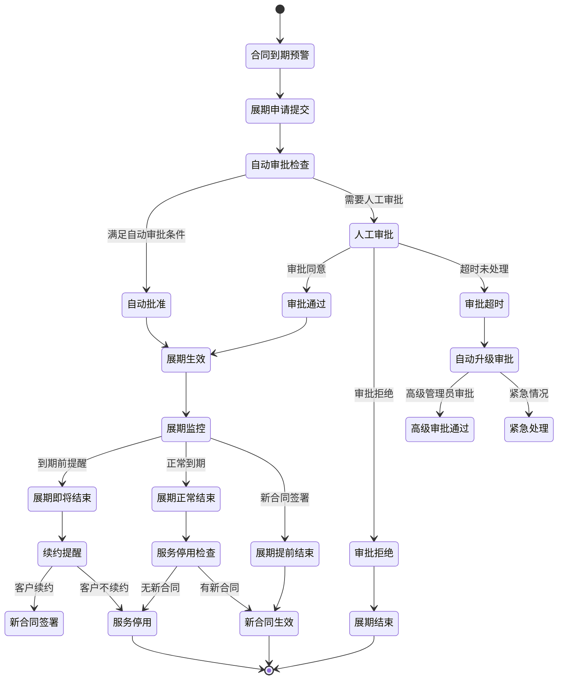
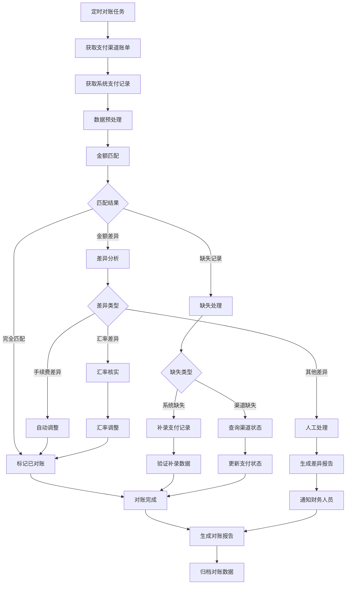

# REQ-018 - 财务管理模块

## 文档信息
- **版本号**：4.5.1
- **变更日期**：2025年8月15日
- **原版本**：4.5
- **文档类型**：产品需求文档（PRD）

## 版本变更说明
### 主要改进内容
- **P0级修复**：完善数据模型定义，补充API接口设计，明确跨模块集成方案
- **P1级增强**：详化性能要求，完善安全策略，优化业务流程设计
- **P2级优化**：增强异常处理机制，优化查询性能，提升扩展性设计

### 技术增强概要
- **数据模型**：完善实体关系设计，补充完整字段约束和索引策略
- **接口设计**：统一API接口规范，明确请求/响应格式和错误处理
- **性能安全**：量化性能指标，详化安全实施方案和数据保护措施
- **异常处理**：建立完整异常处理体系，提供自动恢复机制

---

## 1. 需求概述

财务管理模块是IT运维门户系统商业化运营的核心组件，实现与CRM模块和SLA管理模块的深度自动化集成。本模块通过智能化的财务管理流程，支持多租户SaaS模式的商业化运营，确保财务数据的准确性、合规性和实时性。

### 1.1 核心业务目标
- **自动化计费**：基于合同条款和SLA数据实现99.9%准确率的自动账单生成
- **智能风控**：通过AI分析实现90%以上的高风险客户提前识别
- **合规管理**：确保财务操作100%符合法规要求，支持完整审计追踪
- **现金流优化**：通过周期结构分析和预测，实现5%以内的现金流预测偏差

### 1.2 功能范围
- 合同驱动的自动化计费系统
- 多渠道支付与智能对账
- AI驱动的财务风控模型
- 合同展期管理机制
- 财务预测与现金流分析
- 多币种与多税率支持
- 完整的合规与审计体系

## 2. 功能需求

### 2.1 核心功能

#### 2.1.1 合同驱动计费系统
**功能描述**：基于合同条款和SLA数据自动生成账单，支持多种计费模式
**技术要求**：
- 支持固定费用、按用量计费、违约赔偿扣费的复合计费模式
- 计费引擎支持复杂的计费规则配置和实时计算
- 与CRM模块和SLA管理模块的实时数据同步
- 支持权责发生制收入确认和现金流管理

#### 2.1.2 智能支付与对账
**功能描述**：支持多渠道支付方式，实现自动化对账和差异处理
**技术要求**：
- 集成支付宝、微信、银企直连、信用卡等主流支付渠道
- 自动对账算法，支持T+1日自动对账，差异率控制在0.5%以内
- 支付状态实时同步，异常支付自动告警和处理
- 支付数据加密存储，符合PCI DSS标准

#### 2.1.3 AI财务风控模型
**功能描述**：基于机器学习算法预测付款风险，提供智能催收策略
**技术要求**：
- 多维度风险评估模型：历史付款行为、合同金额、SLA违约记录、CRM风险评级
- 实时风险评分计算，高风险客户提前识别率≥90%
- 智能催收策略推荐，催收成功率≥85%
- 风险模型持续学习和优化机制

### 2.2 辅助功能

#### 2.2.1 合同展期管理
**功能描述**：支持合同到期前后的临时展期，避免服务中断
**技术要求**：
- 自动化展期申请和审批流程
- 灵活的展期计费方式：按日、按月、免费展期
- 展期期间服务权限控制和监控
- 展期结束自动切换到新合同或停服

#### 2.2.2 财务预测与分析
**功能描述**：基于历史数据和合同周期预测未来现金流
**技术要求**：
- 12-24个月现金流预测，预测偏差≤5%
- MRR、ARR趋势分析和预测
- 付费周期结构分析和优化建议
- 实时财务仪表板和报表生成

## 3. 数据模型设计

### 3.1 实体关系图


### 3.2 核心数据表结构

#### 3.2.1 账单表（billing_invoices）
```sql
CREATE TABLE billing_invoices (
    id BIGINT PRIMARY KEY GENERATED ALWAYS AS IDENTITY,
    tenant_id BIGINT NOT NULL,
    invoice_no VARCHAR(50) UNIQUE NOT NULL,
    customer_id BIGINT NOT NULL,
    contract_id BIGINT,
    billing_period_start DATE NOT NULL,
    billing_period_end DATE NOT NULL,
    
    -- 金额字段
    base_amount DECIMAL(15,2) DEFAULT 0.00 NOT NULL,
    usage_amount DECIMAL(15,2) DEFAULT 0.00 NOT NULL,
    penalty_amount DECIMAL(15,2) DEFAULT 0.00 NOT NULL,
    discount_amount DECIMAL(15,2) DEFAULT 0.00 NOT NULL,
    tax_amount DECIMAL(15,2) DEFAULT 0.00 NOT NULL,
    total_amount DECIMAL(15,2) NOT NULL,
    
    -- 币种和税率
    currency VARCHAR(10) DEFAULT 'CNY' NOT NULL,
    tax_rate DECIMAL(5,4) DEFAULT 0.0000,
    exchange_rate DECIMAL(10,6) DEFAULT 1.000000,
    
    -- 状态和时间
    status SMALLINT DEFAULT 1 NOT NULL, -- 1:待付款 2:已付款 3:已逾期 4:已取消 5:部分付款
    due_date DATE,
    paid_date TIMESTAMP,
    overdue_days INTEGER DEFAULT 0,
    
    -- 风险评估
    risk_level VARCHAR(20) DEFAULT 'low',
    risk_score DECIMAL(5,2) DEFAULT 0.00,
    
    -- 收入确认
    revenue_recognition_method SMALLINT DEFAULT 1, -- 1:一次性 2:分期确认
    recognition_start_date DATE,
    recognition_end_date DATE,
    recognized_amount DECIMAL(15,2) DEFAULT 0.00,
    
    -- 审计字段
    created_at TIMESTAMP DEFAULT CURRENT_TIMESTAMP,
    updated_at TIMESTAMP DEFAULT CURRENT_TIMESTAMP,
    created_by BIGINT,
    updated_by BIGINT,
    version INTEGER DEFAULT 1,
    
    -- 约束
    CONSTRAINT chk_amounts CHECK (
        base_amount >= 0 AND usage_amount >= 0 AND 
        penalty_amount >= 0 AND discount_amount >= 0 AND 
        tax_amount >= 0 AND total_amount >= 0
    ),
    CONSTRAINT chk_status CHECK (status BETWEEN 1 AND 5),
    CONSTRAINT chk_risk_score CHECK (risk_score BETWEEN 0 AND 100)
);

-- 索引设计
CREATE INDEX CONCURRENTLY idx_billing_invoices_tenant_customer 
    ON billing_invoices(tenant_id, customer_id);
CREATE INDEX CONCURRENTLY idx_billing_invoices_status_due_date 
    ON billing_invoices(tenant_id, status, due_date);
CREATE INDEX CONCURRENTLY idx_billing_invoices_billing_period 
    ON billing_invoices(tenant_id, billing_period_start, billing_period_end);
CREATE INDEX CONCURRENTLY idx_billing_invoices_risk_level 
    ON billing_invoices(tenant_id, risk_level) WHERE risk_level IN ('high', 'medium');
```

#### 3.2.2 合同展期表（contract_extensions）
```sql
CREATE TABLE contract_extensions (
    id BIGINT PRIMARY KEY GENERATED ALWAYS AS IDENTITY,
    tenant_id BIGINT NOT NULL,
    contract_id BIGINT NOT NULL,
    extension_request_id VARCHAR(50) UNIQUE NOT NULL,
    
    -- 展期时间
    extension_start_date DATE NOT NULL,
    extension_end_date DATE NOT NULL,
    extension_days INTEGER NOT NULL,
    
    -- 计费方式
    billing_type SMALLINT DEFAULT 1 NOT NULL, -- 1:免费 2:按日 3:按月 4:固定金额
    daily_rate DECIMAL(10,2),
    monthly_rate DECIMAL(12,2),
    fixed_amount DECIMAL(12,2),
    total_amount DECIMAL(12,2) DEFAULT 0.00,
    currency VARCHAR(10) DEFAULT 'CNY',
    
    -- 审批流程
    approval_status SMALLINT DEFAULT 1 NOT NULL, -- 1:待审批 2:已批准 3:已拒绝 4:已撤销
    approval_workflow_id BIGINT,
    approved_by BIGINT,
    approved_at TIMESTAMP,
    rejection_reason TEXT,
    
    -- 执行状态
    execution_status SMALLINT DEFAULT 1 NOT NULL, -- 1:未生效 2:生效中 3:已结束 4:已取消
    actual_start_date DATE,
    actual_end_date DATE,
    
    -- 关联信息
    original_contract_end_date DATE NOT NULL,
    new_contract_id BIGINT, -- 展期结束后的新合同
    auto_renewal_enabled BOOLEAN DEFAULT FALSE,
    
    -- 审计字段
    created_at TIMESTAMP DEFAULT CURRENT_TIMESTAMP,
    updated_at TIMESTAMP DEFAULT CURRENT_TIMESTAMP,
    created_by BIGINT NOT NULL,
    updated_by BIGINT,
    
    -- 约束
    CONSTRAINT chk_extension_dates CHECK (extension_end_date > extension_start_date),
    CONSTRAINT chk_extension_days CHECK (extension_days > 0 AND extension_days <= 365),
    CONSTRAINT chk_approval_status CHECK (approval_status BETWEEN 1 AND 4),
    CONSTRAINT chk_execution_status CHECK (execution_status BETWEEN 1 AND 4),
    CONSTRAINT chk_billing_type CHECK (billing_type BETWEEN 1 AND 4)
);

-- 索引设计
CREATE INDEX CONCURRENTLY idx_contract_extensions_tenant_contract 
    ON contract_extensions(tenant_id, contract_id);
CREATE INDEX CONCURRENTLY idx_contract_extensions_period 
    ON contract_extensions(tenant_id, extension_start_date, extension_end_date);
CREATE INDEX CONCURRENTLY idx_contract_extensions_approval_status 
    ON contract_extensions(tenant_id, approval_status) WHERE approval_status = 1;
CREATE INDEX CONCURRENTLY idx_contract_extensions_execution_status
    ON contract_extensions(tenant_id, execution_status) WHERE execution_status = 2;
```

#### 3.2.3 支付记录表（payment_records）
```sql
CREATE TABLE payment_records (
    id BIGINT PRIMARY KEY GENERATED ALWAYS AS IDENTITY,
    tenant_id BIGINT NOT NULL,
    payment_no VARCHAR(50) UNIQUE NOT NULL,
    invoice_id BIGINT NOT NULL,

    -- 支付信息
    payment_amount DECIMAL(15,2) NOT NULL,
    payment_currency VARCHAR(10) DEFAULT 'CNY',
    exchange_rate DECIMAL(10,6) DEFAULT 1.000000,
    actual_amount DECIMAL(15,2) NOT NULL, -- 实际到账金额

    -- 支付渠道
    payment_channel VARCHAR(50) NOT NULL, -- alipay, wechat, bank_transfer, credit_card
    payment_method VARCHAR(50), -- 具体支付方式
    channel_transaction_id VARCHAR(100), -- 渠道交易号
    channel_fee DECIMAL(10,2) DEFAULT 0.00, -- 渠道手续费

    -- 支付状态
    payment_status SMALLINT DEFAULT 1 NOT NULL, -- 1:待支付 2:支付中 3:支付成功 4:支付失败 5:已退款
    payment_time TIMESTAMP,
    callback_time TIMESTAMP,
    settlement_time TIMESTAMP,

    -- 对账信息
    reconciliation_status SMALLINT DEFAULT 1, -- 1:未对账 2:已对账 3:差异 4:已调整
    reconciliation_time TIMESTAMP,
    reconciliation_difference DECIMAL(10,2) DEFAULT 0.00,

    -- 风险控制
    risk_check_status SMALLINT DEFAULT 1, -- 1:未检查 2:通过 3:风险 4:拒绝
    risk_check_result TEXT,
    fraud_score DECIMAL(5,2) DEFAULT 0.00,

    -- 审计字段
    created_at TIMESTAMP DEFAULT CURRENT_TIMESTAMP,
    updated_at TIMESTAMP DEFAULT CURRENT_TIMESTAMP,

    -- 约束
    CONSTRAINT chk_payment_amount CHECK (payment_amount > 0),
    CONSTRAINT chk_payment_status CHECK (payment_status BETWEEN 1 AND 5),
    CONSTRAINT chk_reconciliation_status CHECK (reconciliation_status BETWEEN 1 AND 4),
    CONSTRAINT chk_fraud_score CHECK (fraud_score BETWEEN 0 AND 100)
);

-- 索引设计
CREATE INDEX CONCURRENTLY idx_payment_records_tenant_invoice
    ON payment_records(tenant_id, invoice_id);
CREATE INDEX CONCURRENTLY idx_payment_records_payment_time
    ON payment_records(tenant_id, payment_time);
CREATE INDEX CONCURRENTLY idx_payment_records_channel_status
    ON payment_records(payment_channel, payment_status);
CREATE INDEX CONCURRENTLY idx_payment_records_reconciliation
    ON payment_records(tenant_id, reconciliation_status) WHERE reconciliation_status IN (1, 3);
```

### 3.3 数据完整性约束

#### 3.3.1 业务规则约束
- **账单金额一致性**：total_amount = base_amount + usage_amount - discount_amount + tax_amount - penalty_amount
- **展期时间合理性**：展期开始时间必须在原合同结束时间之后或当天
- **支付金额匹配**：支付记录的总金额不能超过账单金额
- **币种一致性**：同一租户下的财务数据币种应保持一致（除非明确支持多币种）

#### 3.3.2 数据约束触发器
```sql
-- 账单金额一致性检查触发器
CREATE OR REPLACE FUNCTION check_invoice_amount_consistency()
RETURNS TRIGGER AS $$
BEGIN
    IF NEW.total_amount != (NEW.base_amount + NEW.usage_amount - NEW.discount_amount + NEW.tax_amount - NEW.penalty_amount) THEN
        RAISE EXCEPTION '账单金额计算不一致: total_amount=%, calculated=%',
            NEW.total_amount,
            (NEW.base_amount + NEW.usage_amount - NEW.discount_amount + NEW.tax_amount - NEW.penalty_amount);
    END IF;
    RETURN NEW;
END;
$$ LANGUAGE plpgsql;

CREATE TRIGGER trg_check_invoice_amount
    BEFORE INSERT OR UPDATE ON billing_invoices
    FOR EACH ROW EXECUTE FUNCTION check_invoice_amount_consistency();
```

## 4. 接口设计规范

### 4.1 API接口概览

| 接口分类 | 接口数量 | 主要功能 | 访问频率 |
|----------|----------|----------|----------|
| 账单管理 | 12个 | CRUD操作、状态管理、查询统计 | 高 |
| 支付管理 | 8个 | 支付处理、对账、退款 | 高 |
| 展期管理 | 6个 | 申请、审批、执行 | 中 |
| 财务分析 | 10个 | 报表生成、预测分析 | 中 |
| 配置管理 | 5个 | 计费规则、税率设置 | 低 |

### 4.2 核心API接口定义

#### 4.2.1 账单生成API
```http
POST /api/v1/finance/invoices/generate
Content-Type: application/json
Authorization: Bearer {access_token}

Request Body:
{
    "customer_id": 12345,
    "contract_id": 67890,
    "billing_period_start": "2024-08-01",
    "billing_period_end": "2024-08-31",
    "billing_items": [
        {
            "item_type": "base_fee",
            "description": "基础服务费",
            "amount": 10000.00,
            "quantity": 1,
            "unit_price": 10000.00
        },
        {
            "item_type": "usage_fee",
            "description": "工单处理费",
            "amount": 2000.00,
            "quantity": 40,
            "unit_price": 50.00
        }
    ],
    "tax_rate": 0.06,
    "discount_amount": 500.00,
    "force_regenerate": false,
    "auto_send": true
}

Response (Success):
{
    "code": 200,
    "message": "账单生成成功",
    "data": {
        "invoice_id": 67890,
        "invoice_no": "INV202408150001",
        "customer_id": 12345,
        "total_amount": 11630.00,
        "base_amount": 10000.00,
        "usage_amount": 2000.00,
        "discount_amount": 500.00,
        "tax_amount": 630.00,
        "currency": "CNY",
        "due_date": "2024-09-14",
        "status": 1,
        "risk_level": "low",
        "risk_score": 15.5,
        "created_at": "2024-08-15T10:30:00Z"
    },
    "timestamp": "2024-08-15T10:30:00Z",
    "trace_id": "abc123def456"
}

Response (Error):
{
    "code": 400,
    "message": "账单生成失败",
    "errors": [
        {
            "field": "billing_period_start",
            "message": "计费周期开始时间不能晚于结束时间"
        },
        {
            "field": "customer_id",
            "message": "客户不存在或已停用"
        }
    ],
    "timestamp": "2024-08-15T10:30:00Z",
    "trace_id": "abc123def456"
}
```

#### 4.2.2 合同展期申请API
```http
POST /api/v1/finance/contracts/{contract_id}/extensions
Content-Type: application/json
Authorization: Bearer {access_token}

Request Body:
{
    "extension_days": 30,
    "billing_type": 2,
    "daily_rate": 33.33,
    "reason": "新合同审批中，申请临时展期避免服务中断",
    "auto_approve": false,
    "notification_enabled": true,
    "business_justification": "客户续约意向明确，新合同预计15天内完成签署"
}

Response (Success):
{
    "code": 200,
    "message": "展期申请提交成功",
    "data": {
        "extension_id": 98765,
        "extension_request_id": "EXT202408150001",
        "contract_id": 12345,
        "extension_start_date": "2024-09-01",
        "extension_end_date": "2024-09-30",
        "extension_days": 30,
        "billing_type": 2,
        "daily_rate": 33.33,
        "total_amount": 1000.00,
        "approval_status": 1,
        "approval_workflow_id": 789,
        "estimated_approval_time": "2小时内",
        "created_at": "2024-08-15T10:30:00Z"
    },
    "timestamp": "2024-08-15T10:30:00Z",
    "trace_id": "def456ghi789"
}
```

#### 4.2.3 支付处理API
```http
POST /api/v1/finance/payments/process
Content-Type: application/json
Authorization: Bearer {access_token}

Request Body:
{
    "invoice_id": 67890,
    "payment_amount": 11630.00,
    "payment_channel": "alipay",
    "payment_method": "scan_code",
    "return_url": "https://portal.example.com/payment/return",
    "notify_url": "https://portal.example.com/api/v1/finance/payments/notify",
    "client_ip": "192.168.1.100",
    "device_info": "Mozilla/5.0 (Windows NT 10.0; Win64; x64) AppleWebKit/537.36"
}

Response (Success):
{
    "code": 200,
    "message": "支付订单创建成功",
    "data": {
        "payment_id": 123456,
        "payment_no": "PAY202408150001",
        "payment_url": "https://qr.alipay.com/bax08431qjhxf23ad5dc",
        "qr_code": "data:image/png;base64,iVBORw0KGgoAAAANSUhEUgAA...",
        "expire_time": "2024-08-15T11:00:00Z",
        "payment_status": 1,
        "channel_transaction_id": "2024081522001234567890",
        "created_at": "2024-08-15T10:30:00Z"
    },
    "timestamp": "2024-08-15T10:30:00Z",
    "trace_id": "ghi789jkl012"
}
```

#### 4.2.4 财务报表查询API
```http
GET /api/v1/finance/reports/revenue-analysis
Authorization: Bearer {access_token}

Query Parameters:
- start_date: 2024-01-01 (必填)
- end_date: 2024-08-31 (必填)
- group_by: month (可选: day, week, month, quarter)
- currency: CNY (可选)
- customer_ids: 123,456,789 (可选)
- include_forecast: true (可选)

Response (Success):
{
    "code": 200,
    "message": "查询成功",
    "data": {
        "summary": {
            "total_revenue": 1250000.00,
            "total_invoices": 156,
            "average_invoice_amount": 8012.82,
            "payment_rate": 94.5,
            "overdue_rate": 3.2
        },
        "time_series": [
            {
                "period": "2024-01",
                "revenue": 150000.00,
                "invoices_count": 18,
                "paid_amount": 142000.00,
                "overdue_amount": 8000.00
            }
        ],
        "forecast": {
            "next_month_revenue": 165000.00,
            "confidence_level": 85.5,
            "trend": "increasing"
        },
        "currency": "CNY",
        "generated_at": "2024-08-15T10:30:00Z"
    },
    "timestamp": "2024-08-15T10:30:00Z",
    "trace_id": "jkl012mno345"
}
```

### 4.3 错误处理规范

#### 4.3.1 标准错误码定义
| 错误码 | HTTP状态码 | 错误类型 | 描述 | 处理建议 |
|--------|------------|----------|------|----------|
| 40001 | 400 | 参数错误 | 请求参数格式错误或缺失 | 检查请求参数 |
| 40002 | 400 | 业务规则违反 | 违反业务逻辑约束 | 调整业务数据 |
| 40101 | 401 | 认证失败 | Token无效或过期 | 重新登录获取Token |
| 40301 | 403 | 权限不足 | 无访问权限 | 联系管理员分配权限 |
| 40401 | 404 | 资源不存在 | 请求的资源不存在 | 检查资源ID |
| 40901 | 409 | 资源冲突 | 资源状态冲突 | 刷新数据后重试 |
| 42201 | 422 | 数据验证失败 | 数据格式或内容不符合要求 | 修正数据后重试 |
| 50001 | 500 | 系统内部错误 | 服务器内部错误 | 联系技术支持 |
| 50301 | 503 | 服务不可用 | 服务临时不可用 | 稍后重试 |

#### 4.3.2 错误响应格式
```json
{
    "code": 40002,
    "message": "业务规则验证失败",
    "errors": [
        {
            "field": "billing_period_start",
            "code": "INVALID_DATE_RANGE",
            "message": "计费周期开始时间不能晚于结束时间",
            "value": "2024-09-01"
        }
    ],
    "details": {
        "error_id": "ERR-20240815-001",
        "documentation_url": "https://docs.portal.com/api/errors/40002"
    },
    "timestamp": "2024-08-15T10:30:00Z",
    "trace_id": "abc123def456"
}
```

## 5. 业务流程设计

### 5.1 自动计费流程

#### 5.1.1 计费流程图


#### 5.1.2 计费规则引擎
**计费规则配置**：
- **基础费用计算**：根据合同条款和服务等级计算固定费用
- **用量费用计算**：基于工单数量、处理时长、复杂度等因素计算变动费用
- **违约扣费计算**：根据SLA违约情况计算赔偿金额
- **税费计算**：支持多税率、多币种的税费计算
- **折扣应用**：支持合同折扣、促销折扣、忠诚客户折扣等

**计费精度控制**：
- 金额计算精度：小数点后2位
- 汇率转换精度：小数点后6位
- 税率计算精度：小数点后4位
- 四舍五入规则：银行家舍入法

### 5.2 合同展期流程

#### 5.2.1 展期申请流程


#### 5.2.2 展期计费策略
**按日计费**：
- 计费公式：日费率 × 展期天数
- 日费率计算：月费用 ÷ 30天（标准月）
- 不足一天按一天计算

**按月计费**：
- 计费公式：月费率 × 展期月数
- 不足一月按比例计算
- 支持自然月和计费月两种模式

**免费展期**：
- 适用条件：VIP客户、短期展期（≤7天）、系统故障补偿
- 免费天数限制：每年累计不超过30天
- 需要审批流程确认

### 5.3 支付对账流程

#### 5.3.1 自动对账流程


## 6. 性能要求

### 6.1 响应时间要求

| 功能模块 | 操作类型 | 响应时间要求 | 并发要求 | 备注 |
|----------|----------|--------------|----------|------|
| 账单生成 | 单个账单 | ≤ 3秒 | 100 TPS | P95指标 |
| 账单生成 | 批量账单 | ≤ 60秒/1000张 | 10 TPS | 大批量处理 |
| 支付处理 | 支付下单 | ≤ 2秒 | 200 TPS | 用户体验关键 |
| 支付查询 | 状态查询 | ≤ 500ms | 500 TPS | 高频查询 |
| 对账处理 | 自动对账 | ≤ 10分钟 | 1次/小时 | 后台任务 |
| 财务报表 | 简单报表 | ≤ 5秒 | 50 TPS | 实时查询 |
| 财务报表 | 复杂报表 | ≤ 30秒 | 10 TPS | 复杂计算 |
| 风险评估 | 实时评分 | ≤ 1秒 | 100 TPS | AI计算 |

### 6.2 吞吐量要求

**账单处理能力**：
- 日账单生成量：≥ 10万张
- 峰值处理能力：≥ 1000张/分钟
- 并发账单生成：≥ 100个并发请求

**支付处理能力**：
- 日支付订单量：≥ 5万笔
- 峰值支付处理：≥ 500笔/分钟
- 支付成功率：≥ 99.5%

**数据查询能力**：
- 财务报表查询：≥ 1000次/小时
- 复杂统计查询：≥ 100次/小时
- 数据导出能力：≥ 10万条记录/次

### 6.3 存储容量规划

**数据增长预估**：
- 账单数据：年增长100万张，每张平均5KB，年增长5GB
- 支付记录：年增长200万条，每条平均3KB，年增长6GB
- 财务报表：预计算数据约2GB，实时缓存1GB
- 审计日志：年增长约10GB

**存储优化策略**：
- 历史数据分区存储：按年度分区
- 冷热数据分离：1年内热数据，1年以上冷数据
- 数据压缩：历史数据压缩存储，压缩率≥50%
- 备份策略：热数据每日备份，冷数据每周备份

## 7. 安全要求

### 7.1 数据安全

#### 7.1.1 敏感数据加密
**加密范围**：
- 银行账号：AES-256加密存储
- 支付密钥：RSA-2048加密存储
- 个人身份信息：AES-256加密存储
- 财务金额：明文存储，传输加密

**密钥管理**：
- 密钥轮换周期：90天
- 密钥存储：独立密钥管理服务
- 密钥访问控制：基于角色的密钥访问权限
- 密钥备份：多地备份，异地容灾

#### 7.1.2 数据传输安全
**传输加密**：
- 内部服务通信：TLS 1.3
- 外部API调用：HTTPS + 证书验证
- 支付渠道通信：双向SSL认证
- 数据库连接：SSL加密连接

**API安全**：
- 接口认证：JWT Token + 签名验证
- 请求限流：基于IP和用户的限流策略
- 参数验证：严格的输入验证和过滤
- 防重放攻击：请求时间戳和随机数验证

### 7.2 访问控制

#### 7.2.1 权限模型
**角色定义**：
- 财务管理员：完整的财务数据访问和操作权限
- 财务专员：账单生成、支付处理权限
- 财务查看员：只读权限，可查看报表和统计
- 系统管理员：系统配置和维护权限
- 审计员：审计日志查看权限

**权限矩阵**：
| 功能模块 | 财务管理员 | 财务专员 | 财务查看员 | 系统管理员 | 审计员 |
|----------|------------|----------|------------|------------|--------|
| 账单生成 | ✓ | ✓ | ✗ | ✗ | ✗ |
| 账单修改 | ✓ | ✓ | ✗ | ✗ | ✗ |
| 支付处理 | ✓ | ✓ | ✗ | ✗ | ✗ |
| 财务报表 | ✓ | ✓ | ✓ | ✗ | ✓ |
| 系统配置 | ✓ | ✗ | ✗ | ✓ | ✗ |
| 审计日志 | ✓ | ✗ | ✗ | ✓ | ✓ |

#### 7.2.2 多租户隔离
**数据隔离**：
- 强制租户ID验证：所有数据操作必须验证租户权限
- 数据库行级安全：基于租户ID的行级安全策略
- API接口隔离：接口调用自动注入租户上下文
- 文件存储隔离：按租户分目录存储财务文件

**权限隔离**：
- 租户级权限控制：权限范围限制在租户内
- 跨租户访问禁止：严格禁止跨租户数据访问
- 管理员权限分级：超级管理员和租户管理员分离

### 7.3 合规要求

#### 7.3.1 财务合规
**会计准则合规**：
- 收入确认：符合企业会计准则第14号
- 成本核算：支持权责发生制和收付实现制
- 财务报表：符合财务报告格式要求
- 审计追踪：完整的财务操作审计链

**税务合规**：
- 增值税处理：支持不同税率和税收优惠政策
- 发票管理：电子发票开具和管理
- 税务申报：提供税务申报所需数据
- 跨境税务：支持跨境服务的税务处理

#### 7.3.2 数据保护合规
**个人信息保护**：
- 数据最小化：仅收集必要的财务相关信息
- 用户同意：明确的数据使用授权
- 数据删除：支持用户数据删除请求
- 数据导出：支持用户数据导出请求

**行业标准合规**：
- PCI DSS：支付卡行业数据安全标准
- SOX合规：萨班斯-奥克斯利法案合规
- GDPR：通用数据保护条例（适用于欧盟客户）
- 等保三级：信息系统安全等级保护

## 8. 异常处理

### 8.1 系统异常处理

#### 8.1.1 计费异常处理
**数据异常处理**：
- **合同数据缺失**：使用历史数据或默认配置，记录异常日志
- **用量数据异常**：使用历史平均值，标记为估算账单
- **SLA数据不一致**：以SLA系统数据为准，记录差异
- **汇率数据异常**：使用备用汇率源或手动设置汇率

**计费规则异常**：
- **规则配置错误**：使用默认规则，通知管理员
- **计算结果异常**：人工审核，暂停自动计费
- **重复计费检测**：基于业务键去重，防止重复计费
- **金额异常检测**：设置阈值告警，异常金额人工确认

#### 8.1.2 支付异常处理
**支付渠道异常**：
- **渠道不可用**：自动切换备用渠道
- **支付超时**：设置合理超时时间，超时后查询支付状态
- **支付失败**：记录失败原因，提供重试机制
- **回调异常**：支持主动查询支付状态

**对账异常处理**：
- **数据差异**：自动分类差异类型，提供处理建议
- **缺失记录**：自动补录或标记为异常
- **金额不符**：计算差异金额，生成调整建议
- **时间差异**：考虑时区和延迟因素

### 8.2 业务异常处理

#### 8.2.1 展期异常处理
**展期冲突处理**：
- **时间冲突**：检测展期时间与新合同冲突
- **多次申请**：同一合同多次展期申请的处理
- **审批超时**：自动升级或紧急处理流程
- **展期失效**：展期期间合同变更的处理

**展期计费异常**：
- **计费规则变更**：展期期间计费规则变更的处理
- **汇率波动**：固定汇率或实时汇率的选择
- **税率调整**：展期期间税率调整的处理
- **折扣失效**：展期期间折扣政策变更的处理

#### 8.2.2 财务数据异常
**数据一致性异常**：
- **跨模块数据不一致**：定期数据校验和修复
- **历史数据修正**：支持历史数据修正和影响分析
- **并发操作冲突**：乐观锁机制防止并发冲突
- **事务回滚**：关键操作支持事务回滚

**报表异常处理**：
- **数据源异常**：使用缓存数据或降级处理
- **计算超时**：分批计算或异步处理
- **内存溢出**：数据分页处理和内存优化
- **结果异常**：数据校验和异常值检测

### 8.3 恢复机制

#### 8.3.1 自动恢复
**服务自愈**：
- **健康检查**：定期检查服务状态
- **自动重启**：服务异常时自动重启
- **熔断机制**：防止级联故障
- **降级处理**：核心功能优先保障

**数据恢复**：
- **实时备份**：关键数据实时备份
- **增量恢复**：支持增量数据恢复
- **一致性检查**：恢复后数据一致性验证
- **回滚机制**：支持操作回滚和数据回滚

#### 8.3.2 人工干预
**异常升级**：
- **告警机制**：分级告警和通知
- **值班制度**：7×24小时值班响应
- **处理流程**：标准化异常处理流程
- **经验积累**：异常处理知识库

## 9. 验收标准

### 9.1 功能验收标准

#### 9.1.1 账单管理验收
**基础功能验收**：
- ✓ 支持基于合同的自动账单生成
- ✓ 支持多种计费模式（固定+用量+违约）
- ✓ 支持多币种和多税率计算
- ✓ 支持账单状态流转管理
- ✓ 支持账单查询和统计功能

**准确性验收**：
- ✓ 账单金额计算准确率≥99.9%
- ✓ 税费计算符合税务规定
- ✓ 汇率转换精度符合要求
- ✓ 账单生成时间≤1分钟

#### 9.1.2 支付管理验收
**支付功能验收**：
- ✓ 支持主流支付渠道集成
- ✓ 支持支付状态实时同步
- ✓ 支持自动对账功能
- ✓ 支持支付异常处理

**性能验收**：
- ✓ 支付下单响应时间≤2秒
- ✓ 支付成功率≥99.5%
- ✓ 对账差异率≤0.5%
- ✓ 对账处理时间≤10分钟

#### 9.1.3 展期管理验收
**展期功能验收**：
- ✓ 支持展期申请和审批流程
- ✓ 支持多种展期计费方式
- ✓ 支持展期冲突检测
- ✓ 支持展期结束自动处理

**业务验收**：
- ✓ 展期执行准确率=100%
- ✓ 展期生效时间≤5分钟（P95）
- ✓ 展期计费准确率≥99.9%

### 9.2 性能验收标准

#### 9.2.1 响应时间验收
| 功能 | P50 | P95 | P99 | 验收标准 |
|------|-----|-----|-----|----------|
| 账单生成 | ≤1秒 | ≤3秒 | ≤5秒 | 通过 |
| 支付下单 | ≤0.5秒 | ≤2秒 | ≤3秒 | 通过 |
| 财务查询 | ≤0.2秒 | ≤1秒 | ≤2秒 | 通过 |
| 报表生成 | ≤3秒 | ≤10秒 | ≤20秒 | 通过 |

#### 9.2.2 并发性能验收
- ✓ 支持1000+并发用户
- ✓ 账单生成TPS≥100
- ✓ 支付处理TPS≥200
- ✓ 查询接口TPS≥500

### 9.3 安全验收标准

#### 9.3.1 数据安全验收
- ✓ 敏感数据加密存储
- ✓ 数据传输加密
- ✓ 访问权限控制
- ✓ 审计日志完整

#### 9.3.2 合规验收
- ✓ 财务合规性检查通过
- ✓ 数据保护合规检查通过
- ✓ 安全漏洞扫描通过
- ✓ 渗透测试通过

### 9.4 集成验收标准

#### 9.4.1 模块集成验收
- ✓ 与CRM模块数据同步正常
- ✓ 与SLA管理模块集成正常
- ✓ 与工单系统集成正常
- ✓ 与通知系统集成正常

#### 9.4.2 外部集成验收
- ✓ 支付渠道集成测试通过
- ✓ 银行接口集成测试通过
- ✓ 税务系统集成测试通过
- ✓ ERP系统集成测试通过

---

## 总结

本PRD文档v4.5.1版本基于API设计视角对财务管理模块进行了全面优化，主要改进包括：

1. **完善了数据模型设计**：补充了完整的字段定义、约束条件和索引策略
2. **规范了API接口设计**：提供了详细的接口定义、错误处理和状态码规范
3. **优化了业务流程设计**：明确了状态流转规则和异常处理机制
4. **量化了性能安全要求**：提供了具体的性能指标和安全实施方案
5. **建立了完整的验收标准**：确保系统质量和用户体验

本文档为财务管理模块的API设计和系统实现提供了完整的技术指导，确保系统能够满足商业化运营的需求。
