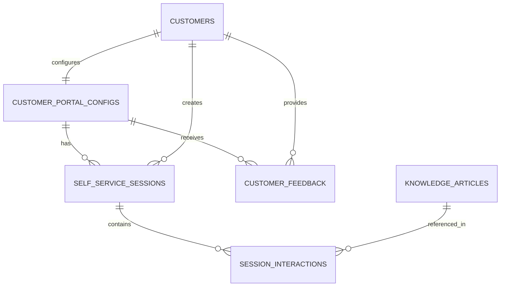
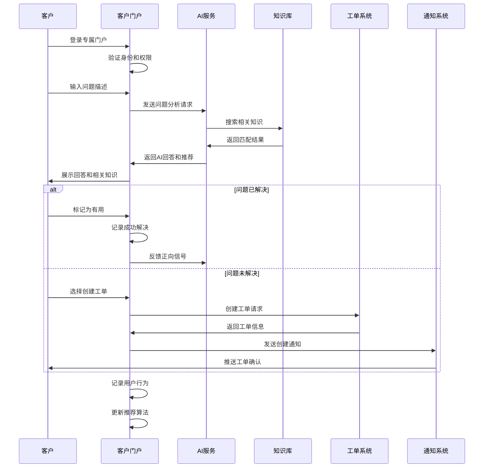
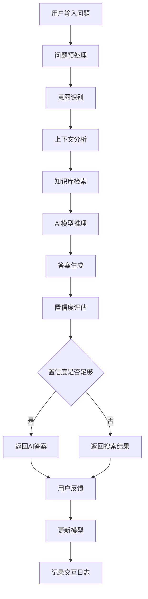
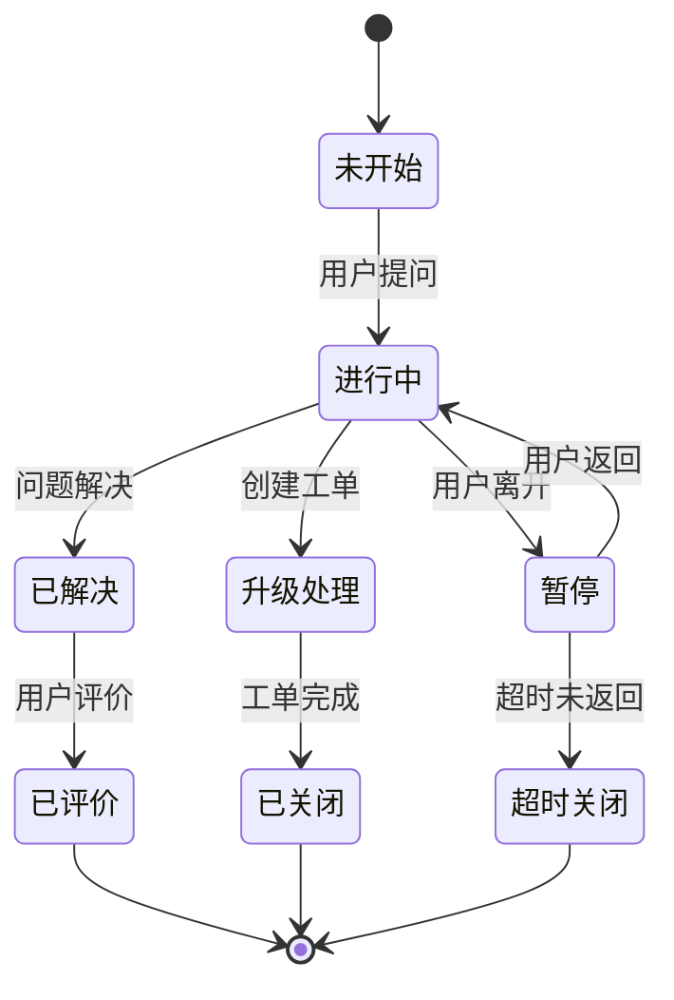
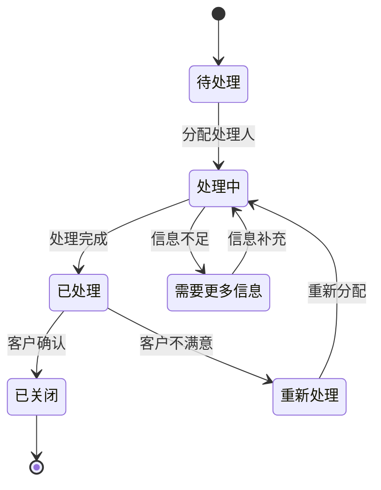
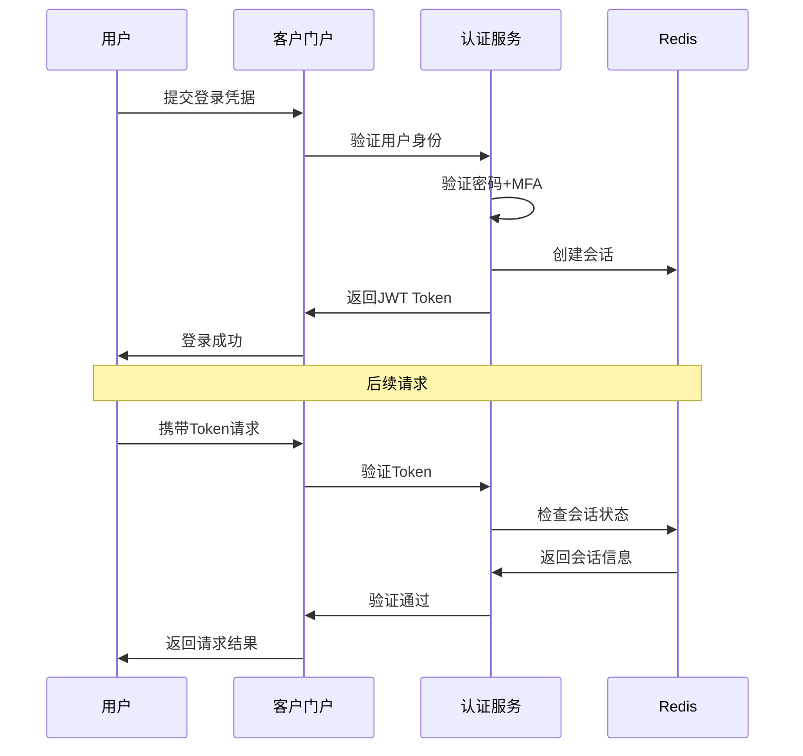

# REQ-019: 客户自助服务模块

## 文档信息
- **版本号**：4.5.1
- **变更日期**：2025年8月15日
- **原版本**：4.5
- **文档类型**：产品需求文档（PRD）

## 版本变更说明
### 主要改进内容
- **P0级修复**：完善数据模型定义，补充完整的API接口设计，明确跨模块集成方案
- **P1级增强**：详化性能要求量化指标，完善安全策略实施方案，优化业务流程设计
- **P2级优化**：增强用户体验设计，优化数据架构扩展性，完善异常处理机制

### 技术增强概要
- **数据模型**：优化表结构设计，增加必要的索引和约束条件，支持高性能查询
- **接口设计**：提供完整的RESTful API规范，统一错误处理机制，支持批量操作
- **性能安全**：明确量化性能指标，完善数据加密和权限控制方案
- **异常处理**：建立完整的异常处理体系，提供自动恢复机制和降级策略

---

## 1. 需求概述

客户自助服务门户是客户（甲方用户）直接与运维平台交互的前端入口，旨在通过**自助知识检索、AI问答、工单自建与跟踪、服务状态可视化**等功能，降低人工客服压力、缩短问题解决时间、提升客户满意度。

### 1.1 业务目标
为客户提供7x24小时自助服务能力，减少人工服务成本。模块需与**知识库管理系统（REQ-005）**、**智能分析与AI功能（REQ-013）**紧密集成，支持基于AI推荐的FAQ与智能问答功能；并与工单管理系统对接，实现自助提交与查询工单，以及服务状态跟踪。

### 1.2 技术实现路径
- **前端技术**：基于Vue 3.4.15 + Element Plus 2.4.4构建响应式客户门户
- **后端技术**：基于Spring Boot 3.2.11提供RESTful API服务
- **数据存储**：PostgreSQL 15.5存储业务数据，Redis 7.2.4缓存热点数据
- **搜索引擎**：Elasticsearch 8.15.3支持全文搜索和智能推荐
- **AI集成**：通过REQ-013模块提供的AI服务接口实现智能问答
- **实时通信**：WebSocket支持实时状态更新和通知推送

### 1.3 核心价值
- **自助服务使用率**：≥60%，客户优先选择自助服务解决问题
- **人工工单请求减少率**：≥40%，通过自助服务减少人工干预
- **知识复用率**：≥75%，知识库内容被有效利用
- **AI推荐采纳率**：≥80%，AI推荐的解决方案被客户采纳
- **自助服务满意度**：≥4.5/5分，客户对自助服务体验满意
- **问题解决效率**：自助解决问题平均时间≤10分钟

## 2. 功能需求

### 2.1 核心功能

| 功能编号 | 功能名称 | 优先级 | 功能描述 | 技术实现要点 | 验收标准 |
|---------|----------|--------|----------|-------------|----------|
| REQ-019-001 | 客户专属登录门户 | P0 | 多租户隔离、品牌化自定义 | JWT认证+Redis会话管理 | 门户独立，品牌一致，登录成功率>99% |
| REQ-019-002 | 智能FAQ系统 | P0 | 按类别/标签浏览FAQ，支持在线搜索 | Elasticsearch全文搜索+分类索引 | 搜索准确率>85%，响应时间<2s |
| REQ-019-003 | AI智能问答 | P0 | 接入REQ-013大模型接口，支持自然语言问答 | RESTful API集成+上下文管理 | 回答相关性>80%，响应时间<5s |
| REQ-019-004 | 知识库搜索与推荐 | P0 | 基于REQ-005知识库全文检索和AI推荐 | 混合搜索算法+个性化推荐 | 推荐相关性>80%，检索精准度>85% |
| REQ-019-005 | 自助工单创建 | P0 | 支持在线提交工单并上传附件 | 表单验证+文件上传+状态同步 | 提交成功率>99%，信息完整性100% |
| REQ-019-006 | 工单状态查询 | P0 | 查询工单处理进度与历史 | 实时状态同步+历史记录查询 | 状态准确率100%，更新延迟<30s |
| REQ-019-007 | 服务状态可视化 | P1 | 展示系统运行状态、维护计划 | 监控数据集成+可视化图表 | 信息准确性100%，展示直观性 |
| REQ-019-008 | 文档下载中心 | P2 | 提供产品手册、运维指南下载 | 文件管理+权限控制+下载统计 | 文档齐全，下载成功率>99% |
| REQ-019-009 | 反馈与评价 | P1 | 提交问题解决后的评分和反馈 | 多维度评价+情感分析+改进跟踪 | 反馈收集率>80%，统计准确性100% |

### 2.2 辅助功能

| 功能编号 | 功能名称 | 功能描述 | 技术要求 |
|---------|----------|----------|----------|
| REQ-019-010 | 用户行为分析 | 记录用户访问路径、搜索关键词、停留时间 | 埋点统计+数据分析+可视化报表 |
| REQ-019-011 | 个性化推荐 | 基于用户历史行为推荐相关内容 | 协同过滤+内容推荐+机器学习 |
| REQ-019-012 | 多语言支持 | 支持中英文界面切换和内容翻译 | 国际化框架+翻译API+本地化存储 |
| REQ-019-013 | 移动端适配 | 响应式设计，支持手机和平板访问 | 响应式布局+PWA技术+离线缓存 |

### 2.3 边界条件处理

| 场景类型 | 处理策略 | 技术实现 |
|---------|----------|----------|
| AI服务不可用 | 降级到传统关键词搜索 | 熔断器模式+备用搜索算法 |
| 搜索无结果 | 提供相关推荐和人工客服入口 | 相似度匹配+客服系统集成 |
| 文件上传失败 | 自动重试+格式验证+错误提示 | 断点续传+文件校验+友好提示 |
| 网络中断 | 保存用户输入+离线提示 | 本地存储+网络状态检测 |
| 权限不足 | 友好提示+权限申请流程 | 权限验证+申请工作流 |

## 3. 数据模型设计

### 3.1 实体关系图



### 3.2 数据表结构

**客户门户配置表（customer_portal_configs）**
```sql
CREATE TABLE customer_portal_configs (
    id BIGINT PRIMARY KEY AUTO_INCREMENT,
    tenant_id BIGINT NOT NULL COMMENT '租户ID',
    customer_id BIGINT NOT NULL COMMENT '客户ID',
    portal_domain VARCHAR(100) COMMENT '门户域名',
    portal_title VARCHAR(100) NOT NULL DEFAULT '客户服务门户' COMMENT '门户标题',
    logo_url VARCHAR(255) COMMENT 'LOGO地址',
    theme_color VARCHAR(20) DEFAULT '#409EFF' COMMENT '主题色',
    welcome_message TEXT COMMENT '欢迎信息',
    contact_info JSON COMMENT '联系信息',
    enabled_features JSON NOT NULL DEFAULT '[]' COMMENT '启用功能列表',
    custom_css TEXT COMMENT '自定义样式',
    sso_config JSON COMMENT 'SSO配置信息',
    security_settings JSON COMMENT '安全设置',
    status TINYINT DEFAULT 1 COMMENT '状态：1-启用，2-禁用',
    created_at DATETIME DEFAULT CURRENT_TIMESTAMP,
    updated_at DATETIME DEFAULT CURRENT_TIMESTAMP ON UPDATE CURRENT_TIMESTAMP,
    created_by BIGINT COMMENT '创建人ID',
    updated_by BIGINT COMMENT '更新人ID',
    UNIQUE KEY uk_tenant_customer (tenant_id, customer_id),
    INDEX idx_portal_domain (portal_domain),
    INDEX idx_tenant_status (tenant_id, status),
    INDEX idx_created_at (created_at)
) COMMENT='客户门户配置表';
```

**自助服务会话表（self_service_sessions）**
```sql
CREATE TABLE self_service_sessions (
    id BIGINT PRIMARY KEY AUTO_INCREMENT,
    session_id VARCHAR(64) NOT NULL COMMENT '会话ID',
    tenant_id BIGINT NOT NULL COMMENT '租户ID',
    customer_id BIGINT NOT NULL COMMENT '客户ID',
    user_id BIGINT NOT NULL COMMENT '用户ID',
    session_type VARCHAR(20) NOT NULL DEFAULT 'search' COMMENT '会话类型：search,ai_chat,ticket',
    initial_question TEXT NOT NULL COMMENT '初始问题',
    session_context JSON COMMENT '会话上下文',
    resolution_status VARCHAR(20) DEFAULT 'pending' COMMENT '解决状态：pending,resolved,escalated',
    satisfaction_score TINYINT COMMENT '满意度评分：1-5',
    feedback_content TEXT COMMENT '反馈内容',
    session_duration INT DEFAULT 0 COMMENT '会话时长（秒）',
    interaction_count INT DEFAULT 0 COMMENT '交互次数',
    created_at DATETIME DEFAULT CURRENT_TIMESTAMP,
    updated_at DATETIME DEFAULT CURRENT_TIMESTAMP ON UPDATE CURRENT_TIMESTAMP,
    ended_at DATETIME COMMENT '会话结束时间',
    INDEX idx_tenant_customer (tenant_id, customer_id),
    INDEX idx_session_id (session_id),
    INDEX idx_session_type (session_type),
    INDEX idx_resolution_status (resolution_status),
    INDEX idx_created_at (created_at),
    FULLTEXT KEY ft_initial_question (initial_question)
) COMMENT='自助服务会话表';

**会话交互记录表（session_interactions）**
```sql
CREATE TABLE session_interactions (
    id BIGINT PRIMARY KEY AUTO_INCREMENT,
    session_id VARCHAR(64) NOT NULL COMMENT '会话ID',
    tenant_id BIGINT NOT NULL COMMENT '租户ID',
    interaction_type VARCHAR(20) NOT NULL COMMENT '交互类型：question,answer,recommendation,feedback',
    user_input TEXT COMMENT '用户输入',
    system_response TEXT COMMENT '系统响应',
    ai_confidence DECIMAL(3,2) COMMENT 'AI置信度',
    response_time INT COMMENT '响应时间（毫秒）',
    knowledge_article_ids JSON COMMENT '关联知识文章ID列表',
    helpful_rating TINYINT COMMENT '有用性评分：1-5',
    created_at DATETIME DEFAULT CURRENT_TIMESTAMP,
    INDEX idx_session_id (session_id),
    INDEX idx_tenant_id (tenant_id),
    INDEX idx_interaction_type (interaction_type),
    INDEX idx_created_at (created_at),
    FULLTEXT KEY ft_user_input (user_input)
) COMMENT='会话交互记录表';
```

**客户反馈表（customer_feedback）**
```sql
CREATE TABLE customer_feedback (
    id BIGINT PRIMARY KEY AUTO_INCREMENT,
    tenant_id BIGINT NOT NULL COMMENT '租户ID',
    customer_id BIGINT NOT NULL COMMENT '客户ID',
    user_id BIGINT NOT NULL COMMENT '用户ID',
    feedback_type VARCHAR(50) NOT NULL COMMENT '反馈类型：service,feature,bug,suggestion',
    related_id VARCHAR(100) COMMENT '关联ID（工单、知识、会话等）',
    related_type VARCHAR(20) COMMENT '关联类型：ticket,knowledge,session',
    rating TINYINT COMMENT '评分：1-5分',
    feedback_content TEXT COMMENT '反馈内容',
    suggestions TEXT COMMENT '改进建议',
    contact_required TINYINT DEFAULT 0 COMMENT '是否需要回访',
    priority_level TINYINT DEFAULT 2 COMMENT '优先级：1-高，2-中，3-低',
    sentiment_score DECIMAL(3,2) COMMENT '情感分析得分',
    status TINYINT DEFAULT 1 COMMENT '状态：1-待处理，2-处理中，3-已处理，4-已关闭',
    processed_by BIGINT COMMENT '处理人ID',
    processed_at DATETIME COMMENT '处理时间',
    response_content TEXT COMMENT '回复内容',
    created_at DATETIME DEFAULT CURRENT_TIMESTAMP,
    updated_at DATETIME DEFAULT CURRENT_TIMESTAMP ON UPDATE CURRENT_TIMESTAMP,
    INDEX idx_tenant_customer (tenant_id, customer_id),
    INDEX idx_feedback_type (feedback_type),
    INDEX idx_rating (rating),
    INDEX idx_status (status),
    INDEX idx_priority_level (priority_level),
    INDEX idx_created_at (created_at),
    FULLTEXT KEY ft_feedback_content (feedback_content)
) COMMENT='客户反馈表';
```

**用户行为分析表（user_behavior_analytics）**
```sql
CREATE TABLE user_behavior_analytics (
    id BIGINT PRIMARY KEY AUTO_INCREMENT,
    tenant_id BIGINT NOT NULL COMMENT '租户ID',
    customer_id BIGINT NOT NULL COMMENT '客户ID',
    user_id BIGINT NOT NULL COMMENT '用户ID',
    session_id VARCHAR(64) COMMENT '会话ID',
    page_path VARCHAR(255) NOT NULL COMMENT '页面路径',
    action_type VARCHAR(50) NOT NULL COMMENT '行为类型：view,search,click,download,submit',
    action_target VARCHAR(255) COMMENT '行为目标',
    search_keywords VARCHAR(500) COMMENT '搜索关键词',
    stay_duration INT DEFAULT 0 COMMENT '停留时长（秒）',
    device_type VARCHAR(20) COMMENT '设备类型：desktop,mobile,tablet',
    browser_info VARCHAR(100) COMMENT '浏览器信息',
    ip_address VARCHAR(45) COMMENT 'IP地址',
    user_agent TEXT COMMENT 'User Agent',
    referrer_url VARCHAR(500) COMMENT '来源URL',
    created_at DATETIME DEFAULT CURRENT_TIMESTAMP,
    INDEX idx_tenant_customer (tenant_id, customer_id),
    INDEX idx_session_id (session_id),
    INDEX idx_action_type (action_type),
    INDEX idx_created_at (created_at),
    INDEX idx_search_keywords (search_keywords(100))
) COMMENT='用户行为分析表';
```

### 3.3 数据完整性约束

**业务规则约束**：
1. **租户隔离约束**：所有业务表必须包含tenant_id，确保数据完全隔离
2. **会话完整性约束**：会话结束时必须记录结束时间和解决状态
3. **反馈关联约束**：反馈必须关联到具体的服务对象（工单、知识、会话等）
4. **评分范围约束**：所有评分字段限制在1-5分范围内
5. **状态流转约束**：状态变更必须符合预定义的流转规则

**数据质量约束**：
1. **必填字段验证**：关键业务字段不允许为空
2. **数据格式验证**：邮箱、电话、URL等字段格式验证
3. **数据长度限制**：文本字段设置合理的长度限制
4. **外键完整性**：确保关联数据的一致性
5. **唯一性约束**：防止重复数据产生

## 4. 接口设计规范

### 4.1 接口列表

**客户门户管理接口**
| 接口名称 | HTTP方法 | 路径 | 功能描述 |
|---------|----------|------|----------|
| 获取门户配置 | GET | /api/v1/customer-portal/config | 获取客户门户配置信息 |
| 更新门户配置 | PUT | /api/v1/customer-portal/config | 更新客户门户配置 |
| 获取门户主题 | GET | /api/v1/customer-portal/theme | 获取门户主题配置 |
| 更新门户主题 | PUT | /api/v1/customer-portal/theme | 更新门户主题配置 |

**智能搜索接口**
| 接口名称 | HTTP方法 | 路径 | 功能描述 |
|---------|----------|------|----------|
| 全文搜索 | GET | /api/v1/customer-portal/search | 全文搜索知识库内容 |
| 分类搜索 | GET | /api/v1/customer-portal/search/category | 按分类搜索内容 |
| 标签搜索 | GET | /api/v1/customer-portal/search/tags | 按标签搜索内容 |
| 搜索建议 | GET | /api/v1/customer-portal/search/suggestions | 获取搜索建议 |
| 热门搜索 | GET | /api/v1/customer-portal/search/trending | 获取热门搜索关键词 |

**AI问答接口**
| 接口名称 | HTTP方法 | 路径 | 功能描述 |
|---------|----------|------|----------|
| AI智能问答 | POST | /api/v1/customer-portal/ai-chat | AI智能问答服务 |
| 获取对话历史 | GET | /api/v1/customer-portal/ai-chat/history | 获取用户对话历史 |
| 对话反馈 | POST | /api/v1/customer-portal/ai-chat/feedback | 提交对话反馈 |
| 推荐问题 | GET | /api/v1/customer-portal/ai-chat/recommendations | 获取推荐问题 |

**工单管理接口**
| 接口名称 | HTTP方法 | 路径 | 功能描述 |
|---------|----------|------|----------|
| 创建工单 | POST | /api/v1/customer-portal/tickets | 创建新工单 |
| 查询工单列表 | GET | /api/v1/customer-portal/tickets | 查询工单列表 |
| 获取工单详情 | GET | /api/v1/customer-portal/tickets/{id} | 获取工单详细信息 |
| 更新工单 | PUT | /api/v1/customer-portal/tickets/{id} | 更新工单信息 |
| 工单状态查询 | GET | /api/v1/customer-portal/tickets/{id}/status | 查询工单状态 |
| 上传附件 | POST | /api/v1/customer-portal/tickets/{id}/attachments | 上传工单附件 |

**反馈评价接口**
| 接口名称 | HTTP方法 | 路径 | 功能描述 |
|---------|----------|------|----------|
| 提交反馈 | POST | /api/v1/customer-portal/feedback | 提交客户反馈 |
| 查询反馈历史 | GET | /api/v1/customer-portal/feedback | 查询反馈历史 |
| 满意度评价 | POST | /api/v1/customer-portal/satisfaction | 提交满意度评价 |

### 4.2 数据交互格式

**统一响应格式**
```json
{
  "code": 200,
  "message": "success",
  "data": {},
  "timestamp": "2025-08-15T10:00:00Z",
  "trace_id": "abc123def456",
  "pagination": {
    "page": 1,
    "size": 20,
    "total": 100,
    "pages": 5
  }
}
```

**AI智能问答请求格式**
```json
{
  "question": "服务器连接不上怎么办？",
  "context": {
    "session_id": "sess_123456",
    "previous_questions": ["网络问题", "服务器状态"],
    "user_role": "IT管理员",
    "customer_context": {
      "industry": "金融",
      "system_type": "核心业务系统"
    }
  },
  "options": {
    "include_recommendations": true,
    "max_results": 5,
    "confidence_threshold": 0.7
  }
}
```

**AI智能问答响应格式**
```json
{
  "code": 200,
  "message": "问答成功",
  "data": {
    "answer": "服务器连接问题可能由以下原因导致：1. 网络连接异常 2. 服务器服务停止 3. 防火墙阻拦。建议您先检查网络连接，然后查看服务器状态。",
    "confidence": 0.92,
    "session_id": "sess_123456",
    "interaction_id": "int_789012",
    "response_time": 2850,
    "related_articles": [
      {
        "id": 1001,
        "title": "服务器连接故障排查指南",
        "url": "/knowledge/1001",
        "relevance": 0.95,
        "category": "网络故障"
      }
    ],
    "suggested_actions": [
      {
        "action": "检查网络连接",
        "priority": 1,
        "description": "使用ping命令测试网络连通性"
      },
      {
        "action": "查看服务器状态",
        "priority": 2,
        "description": "检查服务器运行状态和资源使用情况"
      }
    ],
    "follow_up_questions": [
      "网络连接正常但仍无法访问怎么办？",
      "如何检查服务器服务状态？"
    ]
  }
}

### 4.3 错误处理机制

**统一错误码定义**
| 错误码 | HTTP状态码 | 错误描述 | 处理建议 |
|--------|------------|----------|----------|
| 10001 | 400 | 请求参数错误 | 检查请求参数格式和必填字段 |
| 10002 | 401 | 认证失败 | 重新登录或刷新令牌 |
| 10003 | 403 | 权限不足 | 联系管理员申请权限 |
| 10004 | 404 | 资源不存在 | 检查资源ID或路径 |
| 10005 | 429 | 请求频率过高 | 降低请求频率，稍后重试 |
| 20001 | 500 | AI服务不可用 | 使用传统搜索，联系技术支持 |
| 20002 | 500 | 搜索服务异常 | 稍后重试，联系技术支持 |
| 20003 | 500 | 文件上传失败 | 检查文件格式和大小，重新上传 |
| 20004 | 500 | 数据库连接异常 | 系统维护中，稍后重试 |

**错误响应格式**
```json
{
  "code": 10001,
  "message": "请求参数错误",
  "errors": [
    {
      "field": "question",
      "message": "问题内容不能为空",
      "code": "FIELD_REQUIRED"
    },
    {
      "field": "customer_id",
      "message": "客户ID格式不正确",
      "code": "FIELD_INVALID"
    }
  ],
  "timestamp": "2025-08-15T10:00:00Z",
  "trace_id": "abc123def456",
  "help_url": "https://docs.example.com/api/errors/10001"
}
```

## 5. 业务流程设计

### 5.1 主要业务流程

**客户自助问题解决流程（优化版）**


**AI问答交互流程**


### 5.2 状态流转规则

**会话状态流转**


**反馈处理状态流转**


### 5.3 跨模块交互

**与知识库管理（REQ-005）集成**
- **知识检索接口**：`GET /api/v1/knowledge/search`
- **知识推荐接口**：`GET /api/v1/knowledge/recommendations`
- **知识反馈接口**：`POST /api/v1/knowledge/feedback`
- **数据同步机制**：知识库更新时通过消息队列通知客户门户更新缓存

**与智能分析与AI（REQ-013）集成**
- **AI问答接口**：`POST /api/v1/ai/chat`
- **智能推荐接口**：`GET /api/v1/ai/recommendations`
- **情感分析接口**：`POST /api/v1/ai/sentiment-analysis`
- **学习反馈接口**：`POST /api/v1/ai/learning-feedback`

**与工单管理（REQ-003）集成**
- **工单创建接口**：`POST /api/v1/tickets`
- **工单查询接口**：`GET /api/v1/tickets`
- **状态更新通知**：通过WebSocket实时推送工单状态变更
- **工单历史接口**：`GET /api/v1/tickets/history`

## 6. 性能要求

### 6.1 响应时间要求

| 功能模块 | 响应时间要求 | 优化策略 |
|---------|-------------|----------|
| 页面加载 | ≤3秒 | CDN加速+资源压缩+懒加载 |
| 搜索查询 | ≤2秒 | Elasticsearch优化+缓存预热 |
| AI问答 | ≤5秒 | 模型优化+并行处理+超时降级 |
| 工单创建 | ≤1秒 | 数据库优化+异步处理 |
| 状态查询 | ≤500ms | Redis缓存+数据库索引优化 |
| 文件上传 | ≤10秒/MB | 分片上传+断点续传+CDN |

### 6.2 并发处理能力

| 指标类型 | 目标值 | 测试方法 |
|---------|--------|----------|
| 并发用户数 | 1000+ | 压力测试，模拟真实用户行为 |
| 单租户并发 | 500+ | 租户隔离测试 |
| API QPS | 5000+ | 接口压力测试 |
| 数据库连接 | 200+ | 连接池配置优化 |
| 缓存命中率 | >90% | 缓存策略优化 |

### 6.3 数据处理能力

| 数据类型 | 处理能力 | 存储策略 |
|---------|----------|----------|
| FAQ条目 | 10万+ | 分片存储+索引优化 |
| 对话记录 | 100万+ | 按时间分区+冷热数据分离 |
| 用户行为数据 | 1000万+/月 | 实时写入+批量分析 |
| 文件存储 | 10TB+ | 对象存储+CDN分发 |
| 搜索索引 | 1GB+ | Elasticsearch集群 |

## 7. 安全要求

### 7.1 身份认证

**认证机制**
- **JWT Token认证**：访问令牌有效期2小时，刷新令牌有效期7天
- **多因子认证**：支持短信验证码、邮箱验证、TOTP等方式
- **单点登录**：支持SAML 2.0和OAuth 2.0协议集成
- **会话管理**：Redis存储会话信息，支持分布式会话管理
- **密码策略**：强密码要求，定期更换，防暴力破解

**认证流程**


### 7.2 权限控制

**权限模型**
- **基于租户的数据隔离**：所有数据查询必须包含tenant_id过滤
- **基于角色的访问控制（RBAC）**：客户管理员、普通用户等角色
- **功能权限控制**：根据客户订阅套餐控制功能访问权限
- **API接口权限**：每个接口都有明确的权限要求
- **数据行级安全**：确保用户只能访问自己的数据

**权限验证流程**
```java
// 权限验证伪代码
@PreAuthorize("hasRole('CUSTOMER_USER') and @tenantService.belongsToTenant(#tenantId)")
public Result<List<Ticket>> getTickets(@PathVariable Long tenantId) {
    // 业务逻辑
}
```

### 7.3 数据安全

**数据加密**
- **传输加密**：全站HTTPS，TLS 1.3协议
- **存储加密**：敏感数据AES-256加密存储
- **密钥管理**：密钥分离存储，定期轮换
- **数据脱敏**：日志和报表中的敏感信息脱敏处理

**数据保护措施**
- **数据备份**：每日增量备份，每周全量备份
- **数据恢复**：RTO≤4小时，RPO≤1小时
- **数据销毁**：客户数据删除后安全销毁
- **合规审计**：符合GDPR、PIPL等数据保护法规

## 8. 异常处理

### 8.1 系统异常

**AI服务异常处理**
- **服务不可用**：自动降级到传统关键词搜索，显示友好提示
- **响应超时**：设置5秒超时，超时后返回缓存结果或搜索结果
- **回答质量差**：基于用户反馈自动调整，提供人工客服入口
- **模型错误**：记录错误日志，触发告警，启用备用模型

**数据库异常处理**
- **连接异常**：自动重试3次，失败后使用备用数据源
- **查询超时**：设置查询超时时间，超时后返回缓存数据
- **数据不一致**：定期数据校验，发现问题自动修复
- **存储空间不足**：自动清理过期数据，触发扩容告警

**缓存服务异常**
- **Redis不可用**：直接查询数据库，记录性能影响
- **缓存穿透**：布隆过滤器防护，空值缓存策略
- **缓存雪崩**：缓存过期时间随机化，熔断器保护
- **缓存击穿**：热点数据永不过期，异步更新策略

### 8.2 业务异常

**用户操作异常**
- **登录失败**：记录失败次数，超过5次锁定账户30分钟
- **权限不足**：友好提示，提供权限申请流程
- **文件上传失败**：支持断点续传，提供格式和大小说明
- **搜索无结果**：提供相关推荐，引导用户优化搜索词

**业务流程异常**
- **工单创建失败**：保存草稿，提供重试机制
- **状态同步失败**：异步重试，最终一致性保证
- **通知发送失败**：多渠道重试，记录失败原因
- **评价提交失败**：本地暂存，网络恢复后自动提交

### 8.3 恢复机制

**自动恢复策略**
- **服务健康检查**：每30秒检查服务状态，自动重启异常服务
- **数据一致性检查**：每小时检查数据一致性，自动修复不一致数据
- **缓存预热**：系统启动时自动预热热点数据
- **故障转移**：主服务异常时自动切换到备用服务

**手动恢复流程**
- **故障报告**：自动生成故障报告，包含影响范围和恢复建议
- **应急响应**：7x24小时值班，30分钟内响应P0故障
- **数据恢复**：从备份恢复数据，最大数据丢失≤1小时
- **服务恢复**：分步骤恢复服务，确保系统稳定性

## 9. 验收标准

### 9.1 功能验收

**核心功能验收标准**
| 功能模块 | 验收指标 | 测试方法 | 通过标准 |
|---------|----------|----------|----------|
| 客户门户登录 | 登录成功率 | 自动化测试 | >99% |
| 智能搜索 | 搜索准确率 | 人工评测+自动化测试 | >85% |
| AI问答 | 回答相关性 | 专家评测 | >80% |
| 工单管理 | 创建成功率 | 功能测试 | >99% |
| 状态同步 | 同步及时性 | 性能测试 | <30秒 |
| 多租户隔离 | 数据隔离性 | 安全测试 | 100% |

**用户体验验收标准**
- **界面友好性**：UI/UX专家评审，用户满意度>4.0/5.0
- **操作便捷性**：用户任务完成率>90%，平均完成时间<预期时间
- **响应性设计**：在主流设备上显示正常，兼容性测试通过率100%
- **无障碍访问**：符合WCAG 2.1 AA级标准

### 9.2 性能验收

**响应时间验收**
- **页面加载时间**：95%的页面加载时间≤3秒
- **API响应时间**：95%的API请求响应时间≤200ms
- **搜索响应时间**：95%的搜索请求响应时间≤2秒
- **AI问答响应时间**：95%的AI问答响应时间≤5秒

**并发性能验收**
- **并发用户数**：支持1000+并发用户，系统稳定运行
- **吞吐量测试**：API QPS达到5000+，错误率<0.1%
- **压力测试**：在2倍预期负载下系统正常运行
- **稳定性测试**：连续运行72小时无故障

**资源使用验收**
- **CPU使用率**：正常负载下CPU使用率<70%
- **内存使用率**：内存使用率<80%，无内存泄漏
- **数据库性能**：慢查询比例<1%，连接池使用率<80%
- **缓存命中率**：热点数据缓存命中率>90%

### 9.3 安全验收

**身份认证验收**
- **认证机制**：支持JWT、MFA、SSO等多种认证方式
- **会话管理**：会话安全，支持分布式会话
- **密码安全**：密码策略符合安全要求，防暴力破解
- **令牌安全**：令牌有效期合理，支持刷新和撤销

**权限控制验收**
- **数据隔离**：租户数据100%隔离，无跨租户访问
- **角色权限**：角色权限控制准确，无权限泄露
- **API权限**：所有API接口权限验证正确
- **功能权限**：功能权限控制符合业务要求

**数据安全验收**
- **传输加密**：全站HTTPS，TLS版本≥1.2
- **存储加密**：敏感数据100%加密存储
- **数据备份**：备份策略完整，恢复测试通过
- **安全扫描**：无高危安全漏洞，中低危漏洞及时修复

**合规性验收**
- **数据保护**：符合GDPR、PIPL等法规要求
- **审计日志**：操作日志完整，支持合规审计
- **数据销毁**：数据删除后安全销毁，无法恢复
- **隐私保护**：用户隐私信息保护措施完善

## 10. 模块依赖与集成

### 10.1 依赖模块

**强依赖模块**
- **基础架构模块（REQ-001）**：用户认证、权限控制、数据存储、缓存服务
- **知识库管理（REQ-005）**：知识内容检索、推荐算法、内容管理
- **工单管理模块（REQ-003）**：工单创建、状态查询、流程管理
- **智能分析与AI（REQ-013）**：AI问答、智能推荐、情感分析
- **客户关系管理（REQ-016）**：客户信息、门户配置、权限管理

**弱依赖模块**
- **通知消息模块（REQ-011）**：状态通知、消息推送
- **系统管理模块（REQ-010）**：系统配置、监控告警
- **财务管理模块（REQ-018）**：服务计费、使用统计

### 10.2 被依赖模块

- **移动端应用（REQ-020）**：提供移动端自助服务接口
- **数据分析模块（REQ-023）**：客户行为分析、服务优化建议

### 10.3 外部依赖

**第三方服务**
- **AI服务平台**：大语言模型API服务，支持自然语言处理
- **搜索引擎**：Elasticsearch全文搜索服务
- **CDN服务**：静态资源加速分发
- **文件存储**：MinIO对象存储服务
- **监控服务**：Prometheus + Grafana监控体系

**集成接口**
- **单点登录**：支持SAML 2.0、OAuth 2.0协议
- **第三方认证**：支持企业微信、钉钉等企业应用集成
- **消息推送**：支持短信、邮件、企业微信等推送渠道

---

## 总结

本PRD文档v4.5.1版本在原有4.5版本基础上进行了全面的技术细节完善和业务逻辑优化，主要改进包括：

1. **完善了数据模型设计**：增加了详细的表结构定义、索引策略和数据完整性约束
2. **优化了API接口设计**：提供了完整的接口清单、统一的数据格式和错误处理机制
3. **明确了性能安全要求**：制定了量化的性能指标和具体的安全实施方案
4. **完善了异常处理机制**：建立了完整的异常处理体系和自动恢复策略
5. **详化了验收标准**：提供了明确的功能、性能、安全验收标准

新版本PRD为客户自助服务模块的高质量实现提供了完整的技术指导和业务规范，确保系统能够满足多租户SaaS平台的各项要求。
