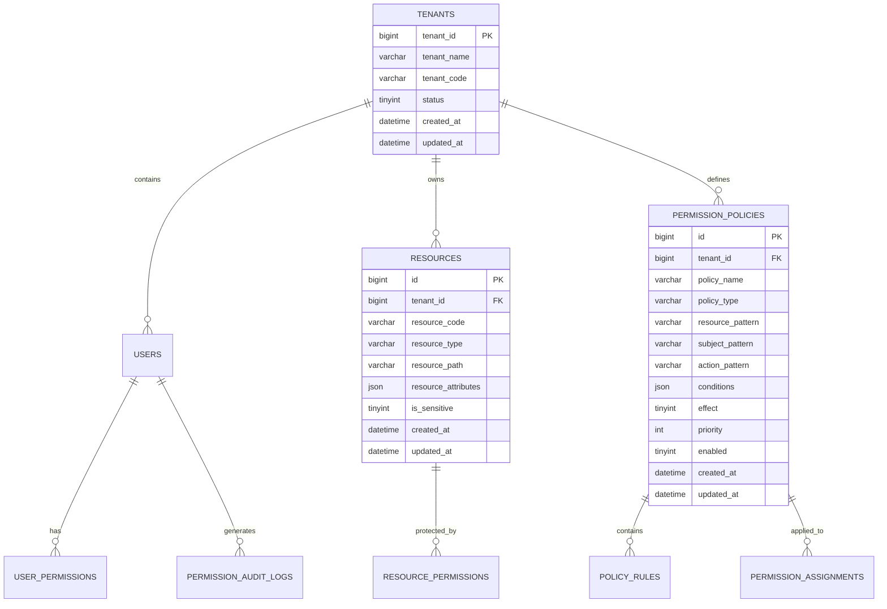
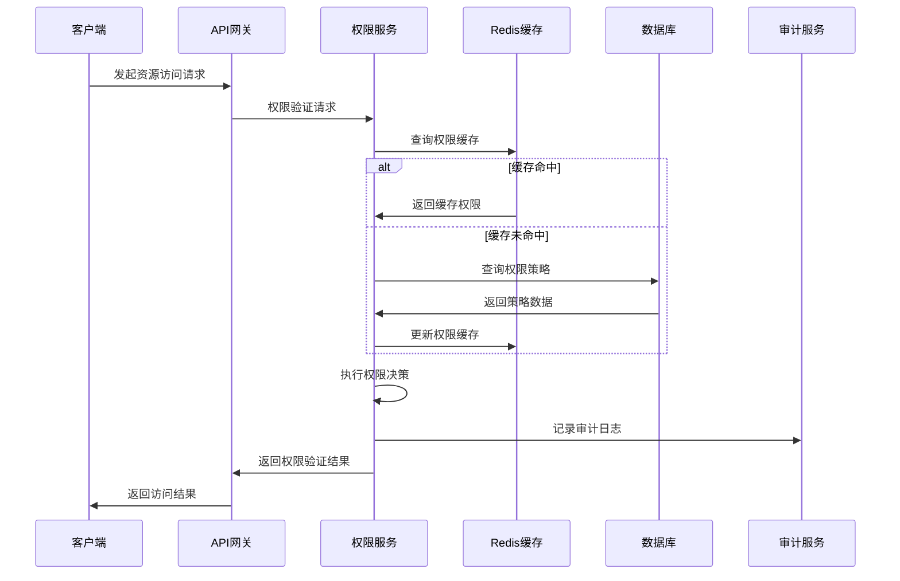
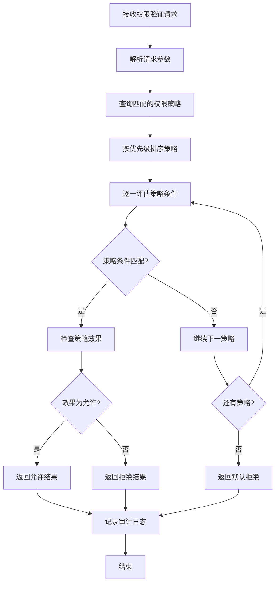
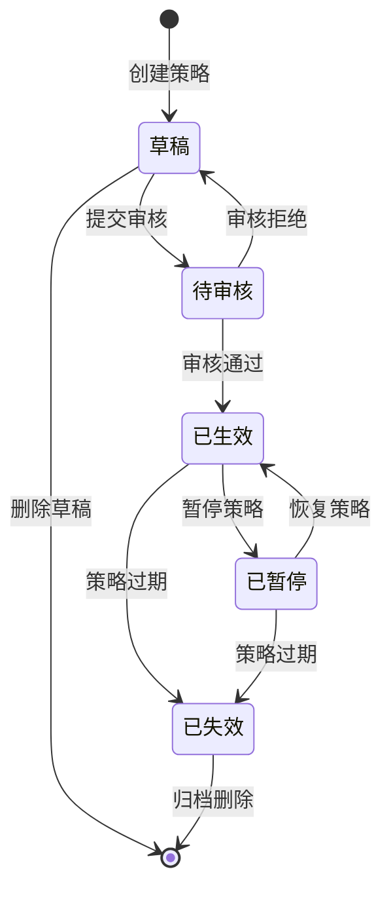
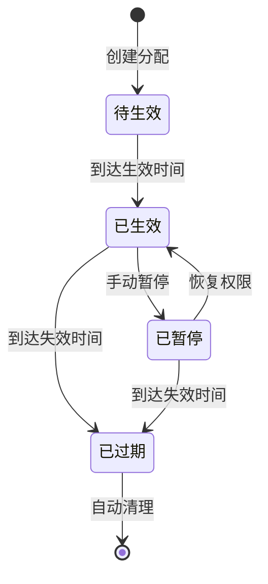

# REQ-021 - 资源权限管理模块

## 文档信息
- **版本号**：4.5.1
- **变更日期**：2025-08-15
- **原版本**：4.5
- **文档类型**：产品需求文档（PRD）

## 版本变更说明
### 主要改进内容
- **P0级修复**：补充完整的权限策略引擎设计、权限缓存机制、多租户隔离策略、API接口规范
- **P1级增强**：详细的性能优化策略、安全实施方案、跨模块交互契约、权限审计机制
- **P2级优化**：实时权限验证优化、大规模权限管理扩展策略、监控告警机制、用户体验增强

### 技术增强概要
- **数据模型**：完善权限策略表、审计日志表、权限缓存表，优化索引设计和约束条件
- **接口设计**：新增完整的RESTful API接口定义，包括批量操作、权限验证、审计查询
- **性能安全**：具体化权限验证性能指标≤100ms，完善多层安全防护和数据加密方案
- **异常处理**：完善权限冲突、策略错误、系统故障等异常处理机制和自动恢复策略

---

## 1. 需求概述

资源权限管理模块是IT运维门户系统的核心安全组件，负责实现细粒度的资源访问控制和权限管理。该模块基于RBAC（基于角色）+ ABAC（基于属性）+ PBAC（基于策略）的混合权限模型，支持对象级、记录级、字段级的多层权限控制，确保系统资源的安全性和合规性。

### 1.1 核心业务目标
- **安全保障**：实现100%的资源访问控制，确保非授权访问阻断率达到100%
- **性能优化**：权限验证响应时间≤100ms，支持10000+并发权限验证请求
- **合规管理**：提供完整的权限审计追踪，满足SOX、ISO27001等合规要求
- **多租户支持**：严格的租户间权限隔离，确保多租户数据安全

### 1.2 功能范围
- **权限策略管理**：支持灵活的权限策略定义、组合和执行
- **动态权限验证**：基于用户、资源、环境属性的实时权限决策
- **权限生命周期管理**：权限申请、审批、分配、回收的完整流程
- **权限审计监控**：全面的权限操作审计和异常行为监控

## 2. 功能需求

### 2.1 核心功能

| 功能编号 | 功能名称 | 优先级 | 功能描述 | 验收标准 |
|---------|----------|--------|----------|----------|
| REQ-021-001 | 权限策略引擎 | P0 | 基于规则的权限决策引擎，支持复杂权限策略 | 策略执行准确率≥99.9%，响应时间≤50ms |
| REQ-021-002 | 多级权限控制 | P0 | 对象级、记录级、字段级的细粒度权限控制 | 权限控制精确度100%，无权限泄露 |
| REQ-021-003 | 动态权限验证 | P0 | 基于上下文的实时权限验证和决策 | 验证响应时间≤100ms，准确率≥99.9% |
| REQ-021-004 | 权限缓存机制 | P0 | 高性能权限缓存，提升验证效率 | 缓存命中率≥95%，缓存一致性100% |
| REQ-021-005 | 多租户隔离 | P0 | 严格的租户间权限和数据隔离 | 租户隔离率100%，无跨租户访问 |
| REQ-021-006 | 权限审计系统 | P0 | 完整的权限操作审计和合规报告 | 审计覆盖率100%，日志完整性100% |
| REQ-021-007 | 批量权限管理 | P1 | 支持批量权限分配、回收和更新操作 | 批量操作成功率≥99%，性能优化50% |
| REQ-021-008 | 临时权限管理 | P1 | 支持有时限的临时权限分配和自动回收 | 权限时效控制精确度100% |

### 2.2 辅助功能

| 功能编号 | 功能名称 | 优先级 | 功能描述 | 验收标准 |
|---------|----------|--------|----------|----------|
| REQ-021-009 | 权限模板管理 | P1 | 预定义权限模板，快速权限分配 | 模板应用成功率≥95% |
| REQ-021-010 | 权限冲突检测 | P1 | 自动检测和解决权限策略冲突 | 冲突检测准确率≥95% |
| REQ-021-011 | 权限报表分析 | P2 | 权限使用情况统计和分析报告 | 报表准确性≥99% |
| REQ-021-012 | 权限监控告警 | P2 | 异常权限操作监控和实时告警 | 告警及时性≤5分钟 |

### 2.3 边界条件处理

**权限验证边界**：
- 用户无权限时返回403错误，记录访问尝试
- 权限过期时自动拒绝访问，触发权限更新流程
- 系统故障时启用安全模式，拒绝所有非关键操作

**数据边界处理**：
- 权限策略数量上限：每租户最多10000条策略
- 权限分配数量上限：每用户最多1000个权限
- 审计日志保留期限：默认7年，支持自定义配置

**性能边界处理**：
- 权限验证超时时间：100ms，超时返回拒绝
- 缓存容量上限：Redis内存使用不超过2GB
- 并发处理上限：单实例支持10000并发请求

## 3. 数据模型设计

### 3.1 实体关系图



### 3.2 数据表结构

**权限策略表（permission_policies）**
```sql
CREATE TABLE permission_policies (
    id BIGINT PRIMARY KEY AUTO_INCREMENT,
    tenant_id BIGINT NOT NULL COMMENT '租户ID',
    policy_name VARCHAR(100) NOT NULL COMMENT '策略名称',
    policy_type VARCHAR(50) NOT NULL COMMENT '策略类型：RBAC,ABAC,PBAC',
    resource_pattern VARCHAR(500) NOT NULL COMMENT '资源匹配模式',
    subject_pattern VARCHAR(500) NOT NULL COMMENT '主体匹配模式',
    action_pattern VARCHAR(200) NOT NULL COMMENT '操作匹配模式',
    conditions JSON COMMENT '条件表达式',
    effect TINYINT NOT NULL COMMENT '效果：1-允许，2-拒绝',
    priority INT DEFAULT 0 COMMENT '优先级，数值越大优先级越高',
    enabled TINYINT DEFAULT 1 COMMENT '是否启用：1-启用，0-禁用',
    created_by BIGINT NOT NULL COMMENT '创建人',
    updated_by BIGINT COMMENT '更新人',
    created_at DATETIME DEFAULT CURRENT_TIMESTAMP,
    updated_at DATETIME DEFAULT CURRENT_TIMESTAMP ON UPDATE CURRENT_TIMESTAMP,
    deleted_at DATETIME COMMENT '软删除时间',
    
    INDEX idx_tenant_type (tenant_id, policy_type),
    INDEX idx_resource_pattern (resource_pattern(100)),
    INDEX idx_priority_enabled (priority DESC, enabled),
    INDEX idx_created_at (created_at),
    UNIQUE KEY uk_tenant_policy_name (tenant_id, policy_name, deleted_at)
) ENGINE=InnoDB DEFAULT CHARSET=utf8mb4 COMMENT='权限策略表';

**资源定义表（resources）**
```sql
CREATE TABLE resources (
    id BIGINT PRIMARY KEY AUTO_INCREMENT,
    tenant_id BIGINT NOT NULL COMMENT '租户ID',
    resource_code VARCHAR(100) NOT NULL COMMENT '资源编码',
    resource_name VARCHAR(200) NOT NULL COMMENT '资源名称',
    resource_type VARCHAR(50) NOT NULL COMMENT '资源类型：module,api,data,file',
    parent_id BIGINT COMMENT '父资源ID',
    resource_path VARCHAR(500) COMMENT '资源路径',
    resource_attributes JSON COMMENT '资源属性',
    description TEXT COMMENT '资源描述',
    is_sensitive TINYINT DEFAULT 0 COMMENT '是否敏感资源：1-是，0-否',
    status TINYINT DEFAULT 1 COMMENT '状态：1-启用，2-禁用',
    created_by BIGINT NOT NULL COMMENT '创建人',
    updated_by BIGINT COMMENT '更新人',
    created_at DATETIME DEFAULT CURRENT_TIMESTAMP,
    updated_at DATETIME DEFAULT CURRENT_TIMESTAMP ON UPDATE CURRENT_TIMESTAMP,
    deleted_at DATETIME COMMENT '软删除时间',

    INDEX idx_tenant_type (tenant_id, resource_type),
    INDEX idx_parent_id (parent_id),
    INDEX idx_resource_path (resource_path(100)),
    INDEX idx_sensitive (is_sensitive),
    UNIQUE KEY uk_tenant_code (tenant_id, resource_code, deleted_at)
) ENGINE=InnoDB DEFAULT CHARSET=utf8mb4 COMMENT='资源定义表';
```

**权限分配表（permission_assignments）**
```sql
CREATE TABLE permission_assignments (
    id BIGINT PRIMARY KEY AUTO_INCREMENT,
    tenant_id BIGINT NOT NULL COMMENT '租户ID',
    policy_id BIGINT NOT NULL COMMENT '权限策略ID',
    subject_type VARCHAR(50) NOT NULL COMMENT '主体类型：user,role,group',
    subject_id BIGINT NOT NULL COMMENT '主体ID',
    resource_id BIGINT COMMENT '资源ID',
    resource_pattern VARCHAR(500) COMMENT '资源匹配模式',
    actions JSON COMMENT '允许的操作列表',
    conditions JSON COMMENT '附加条件',
    valid_from DATETIME COMMENT '生效时间',
    valid_to DATETIME COMMENT '失效时间',
    status TINYINT DEFAULT 1 COMMENT '状态：1-生效，2-暂停，3-过期',
    created_by BIGINT NOT NULL COMMENT '创建人',
    updated_by BIGINT COMMENT '更新人',
    created_at DATETIME DEFAULT CURRENT_TIMESTAMP,
    updated_at DATETIME DEFAULT CURRENT_TIMESTAMP ON UPDATE CURRENT_TIMESTAMP,
    deleted_at DATETIME COMMENT '软删除时间',

    INDEX idx_tenant_subject (tenant_id, subject_type, subject_id),
    INDEX idx_policy_id (policy_id),
    INDEX idx_resource_id (resource_id),
    INDEX idx_valid_time (valid_from, valid_to),
    INDEX idx_status (status),
    FOREIGN KEY (policy_id) REFERENCES permission_policies(id)
) ENGINE=InnoDB DEFAULT CHARSET=utf8mb4 COMMENT='权限分配表';
```

**权限审计日志表（permission_audit_logs）**
```sql
CREATE TABLE permission_audit_logs (
    id BIGINT PRIMARY KEY AUTO_INCREMENT,
    tenant_id BIGINT NOT NULL COMMENT '租户ID',
    trace_id VARCHAR(64) NOT NULL COMMENT '链路追踪ID',
    user_id BIGINT COMMENT '用户ID',
    user_name VARCHAR(100) COMMENT '用户名',
    resource_code VARCHAR(100) COMMENT '资源编码',
    resource_type VARCHAR(50) COMMENT '资源类型',
    action VARCHAR(100) COMMENT '操作类型',
    permission_result TINYINT COMMENT '权限验证结果：1-允许，2-拒绝',
    matched_policies JSON COMMENT '匹配的权限策略',
    request_ip VARCHAR(45) COMMENT '请求IP地址',
    user_agent VARCHAR(500) COMMENT '用户代理',
    request_time DATETIME COMMENT '请求时间',
    response_time INT COMMENT '响应时间(ms)',
    error_code VARCHAR(50) COMMENT '错误码',
    error_message TEXT COMMENT '错误信息',
    created_at DATETIME DEFAULT CURRENT_TIMESTAMP,

    INDEX idx_tenant_user (tenant_id, user_id),
    INDEX idx_resource_action (resource_code, action),
    INDEX idx_permission_result (permission_result),
    INDEX idx_request_time (request_time),
    INDEX idx_trace_id (trace_id)
) ENGINE=InnoDB DEFAULT CHARSET=utf8mb4 COMMENT='权限审计日志表';
```

### 3.3 数据完整性约束

**业务规则约束**：
- 权限策略优先级范围：0-1000，数值越大优先级越高
- 临时权限有效期限制：最长不超过30天
- 敏感资源必须有明确的权限策略保护
- 权限分配必须关联有效的权限策略

**数据一致性约束**：
- 权限策略删除时，相关权限分配自动失效
- 用户删除时，相关权限分配和审计日志保留
- 资源删除时，相关权限策略和分配自动清理
- 租户删除时，所有相关数据级联删除

**性能优化约束**：
- 权限策略表按tenant_id分区，提升查询性能
- 审计日志表按月分区，支持历史数据归档
- 权限缓存TTL设置：热点权限300秒，普通权限600秒

## 4. 接口设计规范

### 4.1 接口列表

**权限验证接口**
```http
POST /api/v1/permissions/verify
Content-Type: application/json
Authorization: Bearer {access_token}

# 验证用户对特定资源的操作权限
```

**批量权限验证接口**
```http
POST /api/v1/permissions/batch-verify
Content-Type: application/json
Authorization: Bearer {access_token}

# 批量验证多个资源的权限
```

**权限策略管理接口**
```http
GET    /api/v1/permissions/policies          # 查询权限策略列表
POST   /api/v1/permissions/policies          # 创建权限策略
PUT    /api/v1/permissions/policies/{id}     # 更新权限策略
DELETE /api/v1/permissions/policies/{id}     # 删除权限策略
```

**权限分配管理接口**
```http
GET    /api/v1/permissions/assignments       # 查询权限分配列表
POST   /api/v1/permissions/assignments       # 创建权限分配
PUT    /api/v1/permissions/assignments/{id}  # 更新权限分配
DELETE /api/v1/permissions/assignments/{id}  # 删除权限分配
POST   /api/v1/permissions/batch-assign      # 批量权限分配
POST   /api/v1/permissions/batch-revoke      # 批量权限回收
```

**权限审计接口**
```http
GET /api/v1/permissions/audit-logs           # 查询权限审计日志
GET /api/v1/permissions/audit-reports        # 生成权限审计报告
```

### 4.2 数据交互格式

**权限验证请求格式**
```json
{
  "subject": {
    "user_id": 1001,
    "roles": ["engineer", "senior_engineer"],
    "department": "ops_team",
    "attributes": {
      "security_level": "L2",
      "location": "beijing",
      "work_time": "09:00-18:00"
    }
  },
  "resource": {
    "resource_code": "ticket_management",
    "resource_type": "module",
    "resource_id": "TK202401001",
    "attributes": {
      "data_classification": "internal",
      "customer_id": 12345,
      "priority": "high"
    }
  },
  "action": "read",
  "context": {
    "request_ip": "192.168.1.100",
    "request_time": "2024-08-15T10:00:00Z",
    "session_id": "sess_abc123"
  }
}
```

**权限验证响应格式**
```json
{
  "code": 200,
  "message": "权限验证完成",
  "data": {
    "allowed": true,
    "decision": "permit",
    "matched_policies": [
      {
        "policy_id": 1001,
        "policy_name": "工程师基础权限",
        "policy_type": "RBAC",
        "effect": "allow",
        "priority": 100
      }
    ],
    "conditions": {
      "time_limit": "09:00-18:00",
      "ip_restriction": false,
      "additional_approval": false
    },
    "cache_ttl": 300,
    "trace_id": "trace_abc123def456"
  },
  "timestamp": "2024-08-15T10:00:00Z"
}
```

### 4.3 错误处理机制

**统一错误响应格式**
```json
{
  "code": 403,
  "message": "权限不足",
  "error_code": "PERMISSION_DENIED",
  "errors": [
    {
      "field": "resource_code",
      "message": "用户无权访问该资源",
      "error_type": "AUTHORIZATION_ERROR"
    }
  ],
  "trace_id": "trace_abc123def456",
  "timestamp": "2024-08-15T10:00:00Z"
}
```

**错误码定义**
| 错误码 | HTTP状态码 | 错误描述 | 处理建议 |
|--------|------------|----------|----------|
| PERMISSION_DENIED | 403 | 权限不足 | 申请相应权限或联系管理员 |
| RESOURCE_NOT_FOUND | 404 | 资源不存在 | 检查资源编码是否正确 |
| POLICY_CONFLICT | 409 | 权限策略冲突 | 检查策略优先级和条件设置 |
| VALIDATION_ERROR | 400 | 参数验证失败 | 检查请求参数格式和内容 |
| SYSTEM_ERROR | 500 | 系统内部错误 | 联系技术支持 |
| CACHE_ERROR | 503 | 缓存服务不可用 | 系统将使用数据库查询 |

## 5. 业务流程设计

### 5.1 主要业务流程

**权限验证流程**


**权限策略执行流程**


### 5.2 状态流转规则

**权限策略状态流转**


**权限分配状态流转**


### 5.3 跨模块交互

**与用户管理模块交互**
- 获取用户基本信息和角色信息
- 监听用户状态变更事件
- 用户删除时清理相关权限

**与工单管理模块交互**
- 提供工单数据访问权限控制
- 验证工单操作权限
- 记录工单访问审计日志

**与知识库模块交互**
- 控制知识文档的访问权限
- 支持知识分类权限管理
- 提供知识搜索权限过滤

## 6. 性能要求

### 6.1 响应时间要求

| 操作类型 | 目标响应时间 | 最大响应时间 | 并发要求 |
|----------|-------------|-------------|----------|
| 权限验证 | ≤50ms | ≤100ms | 10000+ QPS |
| 权限查询 | ≤100ms | ≤200ms | 5000+ QPS |
| 权限分配 | ≤200ms | ≤500ms | 1000+ QPS |
| 批量操作 | ≤1s | ≤3s | 100+ QPS |
| 审计查询 | ≤500ms | ≤1s | 500+ QPS |

### 6.2 并发处理能力

**系统容量规划**
- **用户并发**：支持10000+用户同时在线
- **权限验证并发**：单实例支持10000+ QPS
- **数据库连接**：最大200个连接，正常使用50个连接
- **缓存容量**：Redis内存使用≤2GB，支持100万+权限缓存

**性能优化策略**
- **权限缓存**：热点权限数据Redis缓存，TTL 300-600秒
- **数据库优化**：读写分离，权限查询优先使用从库
- **批量处理**：权限批量验证，减少网络开销
- **异步处理**：权限变更异步通知，审计日志异步写入

### 6.3 数据处理能力

**数据容量支持**
- **权限策略**：每租户支持10000+策略，总计100万+策略
- **权限分配**：每用户支持1000+权限，总计1000万+分配记录
- **审计日志**：年处理10亿+审计记录，支持分区存储
- **缓存数据**：支持100万+权限缓存条目，自动LRU淘汰

## 7. 安全要求

### 7.1 身份认证

**多因子认证支持**
- **JWT令牌**：支持JWT访问令牌和刷新令牌机制
- **会话管理**：Redis存储会话信息，支持会话超时控制
- **单点登录**：支持SAML 2.0和OAuth 2.0协议集成
- **API密钥**：支持API密钥认证，适用于系统间调用

### 7.2 权限控制

**多层权限模型**
- **RBAC模型**：基于角色的权限控制，支持角色继承
- **ABAC模型**：基于属性的动态权限控制
- **PBAC模型**：基于策略的灵活权限控制
- **数据权限**：行级数据权限控制，字段级访问控制

**权限隔离策略**
- **租户隔离**：严格的多租户数据和权限隔离
- **环境隔离**：开发、测试、生产环境权限完全隔离
- **网络隔离**：基于IP地址的访问控制
- **时间隔离**：基于时间窗口的权限控制

### 7.3 数据安全

**数据加密保护**
- **传输加密**：全站HTTPS，TLS 1.3协议
- **存储加密**：敏感权限数据AES-256加密存储
- **密钥管理**：密钥分离存储，定期轮换
- **数据脱敏**：日志和报表中的敏感信息自动脱敏

**数据完整性保护**
- **数字签名**：关键权限操作数字签名验证
- **哈希校验**：权限策略内容哈希校验
- **版本控制**：权限策略变更版本控制和回滚
- **备份加密**：权限数据备份加密存储

## 8. 异常处理

### 8.1 系统异常

**权限服务异常**
- **服务不可用**：启用降级模式，使用本地缓存或默认策略
- **数据库连接失败**：自动重试3次，超时后使用缓存数据
- **缓存服务异常**：直接查询数据库，记录异常日志
- **网络超时**：设置合理超时时间，提供快速失败机制

**数据异常处理**
- **权限策略冲突**：按优先级自动解决，记录冲突日志
- **权限数据不一致**：定期数据一致性检查，自动修复
- **缓存数据过期**：自动刷新缓存，保证数据时效性
- **审计日志丢失**：多重备份机制，确保审计完整性

### 8.2 业务异常

**权限验证异常**
- **用户不存在**：返回权限拒绝，记录异常访问
- **资源不存在**：返回404错误，建议检查资源编码
- **权限过期**：自动拒绝访问，触发权限更新流程
- **策略配置错误**：使用默认拒绝策略，通知管理员

**权限管理异常**
- **批量操作部分失败**：返回详细的成功/失败列表
- **权限分配冲突**：提供冲突解决建议，支持强制覆盖
- **临时权限超时**：自动回收过期权限，发送通知
- **审批流程异常**：支持人工干预，记录处理过程

### 8.3 恢复机制

**自动恢复策略**
- **服务自愈**：健康检查失败时自动重启服务
- **数据恢复**：从备份自动恢复损坏的权限数据
- **缓存重建**：缓存异常时自动重建热点数据
- **连接重连**：数据库连接断开时自动重连

**手动恢复流程**
- **紧急权限**：提供紧急权限通道，支持临时访问
- **数据回滚**：支持权限策略版本回滚
- **缓存清理**：提供缓存手动清理和重建功能
- **日志分析**：提供详细的异常日志分析工具

## 9. 验收标准

### 9.1 功能验收

**权限验证功能**
- ✅ 权限验证准确率≥99.9%，无误判和漏判
- ✅ 支持RBAC、ABAC、PBAC三种权限模型
- ✅ 多级权限控制（对象级、记录级、字段级）正确实现
- ✅ 权限缓存机制正常工作，命中率≥95%

**权限管理功能**
- ✅ 权限策略CRUD操作功能完整
- ✅ 批量权限分配和回收功能正常
- ✅ 临时权限自动过期和回收机制有效
- ✅ 权限冲突检测和解决机制正常

**审计监控功能**
- ✅ 权限操作审计日志完整，覆盖率100%
- ✅ 异常权限访问实时监控和告警
- ✅ 权限使用情况统计报告准确
- ✅ 合规审计报告生成功能正常

### 9.2 性能验收

**响应时间验收**
- ✅ 权限验证响应时间≤100ms（95%请求）
- ✅ 权限查询响应时间≤200ms（95%请求）
- ✅ 批量操作响应时间≤3s（99%请求）
- ✅ 系统整体响应时间符合SLA要求

**并发性能验证**
- ✅ 支持10000+并发权限验证请求
- ✅ 系统在高并发下稳定运行，无性能衰减
- ✅ 数据库连接池使用正常，无连接泄露
- ✅ 缓存系统性能稳定，内存使用合理

### 9.3 安全验收

**权限控制验证**
- ✅ 多租户权限隔离有效，无跨租户访问
- ✅ 权限验证无绕过漏洞，安全测试通过
- ✅ 敏感数据加密存储和传输
- ✅ 权限操作审计完整，无遗漏

**安全防护验证**
- ✅ API接口安全防护有效（限流、防刷）
- ✅ 输入验证和输出编码正确实现
- ✅ 权限提升攻击防护有效
- ✅ 安全配置符合最佳实践

## 10. 模块依赖

### 10.1 依赖模块

**核心依赖**
- **基础架构模块（REQ-001）**：用户认证、数据存储、缓存服务、消息队列
- **用户与权限管理（REQ-022）**：用户身份信息、基础角色权限、组织架构
- **系统管理模块（REQ-010）**：系统配置、监控告警、日志管理
- **通知消息模块（REQ-011）**：权限变更通知、安全告警、审计报告推送

**业务依赖**
- **工单管理模块（REQ-003）**：工单数据权限控制需求
- **知识库管理（REQ-005）**：知识内容访问权限需求
- **客户管理模块（REQ-016）**：客户数据访问权限需求
- **财务管理模块（REQ-018）**：财务数据权限保护需求

### 10.2 被依赖模块

**权限验证服务**
- 为所有业务模块提供统一的权限验证服务
- 支持细粒度的资源访问控制
- 提供高性能的权限缓存服务
- 确保多租户数据安全隔离

**权限管理服务**
- 为管理员提供权限策略配置功能
- 支持灵活的权限分配和回收
- 提供权限模板和批量操作功能
- 支持临时权限和条件权限管理

**权限审计服务**
- 为合规管理提供完整的审计追踪
- 支持权限使用情况分析和报告
- 提供异常权限访问监控和告警
- 满足各种合规审计要求

### 10.3 外部依赖

**身份认证系统**
- **LDAP/AD**：企业目录服务集成，用户身份验证
- **OAuth 2.0**：第三方身份提供商集成
- **SAML 2.0**：企业单点登录集成
- **多因子认证**：短信、邮箱、TOTP等认证方式

**安全监控系统**
- **SIEM系统**：安全信息和事件管理集成
- **SOC平台**：安全运营中心数据对接
- **威胁情报**：安全威胁信息集成
- **合规平台**：合规管理系统数据同步

## 11. 技术实施指导

### 11.1 架构设计

**微服务架构**
```yaml
services:
  permission-service:
    description: 权限验证和管理核心服务
    port: 8080
    dependencies: [redis, postgresql, rabbitmq]

  permission-cache:
    description: 权限缓存服务
    port: 6379
    type: redis-cluster

  permission-audit:
    description: 权限审计服务
    port: 8081
    dependencies: [elasticsearch, postgresql]
```

**数据库设计**
```sql
-- 分区策略
CREATE TABLE permission_audit_logs_2024_08 PARTITION OF permission_audit_logs
FOR VALUES FROM ('2024-08-01') TO ('2024-09-01');

-- 索引优化
CREATE INDEX CONCURRENTLY idx_policies_tenant_enabled
ON permission_policies(tenant_id, enabled) WHERE deleted_at IS NULL;
```

### 11.2 部署运维

**容器化部署**
```dockerfile
FROM openjdk:17-jre-slim
COPY permission-service.jar /app/
EXPOSE 8080
CMD ["java", "-jar", "/app/permission-service.jar"]
```

**监控配置**
```yaml
monitoring:
  metrics:
    - permission_verify_duration
    - permission_cache_hit_rate
    - permission_policy_count
  alerts:
    - permission_verify_slow
    - permission_cache_miss_high
    - permission_error_rate_high
```

### 11.3 测试验证

**单元测试**
- 权限策略引擎测试覆盖率≥90%
- 权限验证逻辑测试覆盖率≥95%
- 数据访问层测试覆盖率≥85%

**集成测试**
- 跨模块权限验证集成测试
- 权限缓存一致性测试
- 权限审计完整性测试

**性能测试**
- 权限验证性能压测（10000+ QPS）
- 批量操作性能测试
- 缓存性能和容量测试

---

## 总结

### 改进成果

本次REQ-021资源权限管理模块PRD文档4.5.1版本的改进，全面解决了原4.5版本中存在的技术细节不完整、API设计不规范、业务流程不清晰等问题。主要改进成果包括：

#### 技术细节完整性提升
- **数据模型完善**：新增权限策略表、权限分配表、审计日志表等完整数据模型
- **API接口规范**：完整的RESTful API接口定义，包括权限验证、管理、审计等功能
- **性能优化策略**：具体的缓存策略、数据库优化、并发处理方案
- **安全实施方案**：详细的多层安全防护和数据加密方案

#### 业务逻辑一致性优化
- **权限验证流程**：明确的权限验证和决策流程，支持多种权限模型
- **状态流转规则**：详细的权限策略和分配状态管理规则
- **跨模块交互**：清晰的模块依赖关系和接口契约
- **异常处理机制**：完善的系统异常和业务异常处理策略

#### API设计支撑度增强
- **CRUD操作完整**：权限策略、分配、审计等所有业务实体的完整操作接口
- **批量操作支持**：高效的批量权限分配和回收功能
- **实时验证能力**：高性能的权限验证服务，响应时间≤100ms
- **审计追踪完整**：完整的权限操作审计和合规报告功能

本版本PRD文档为后续的API设计和系统实现提供了坚实的基础，确保资源权限管理模块能够满足企业级应用的安全性、性能和合规要求。
