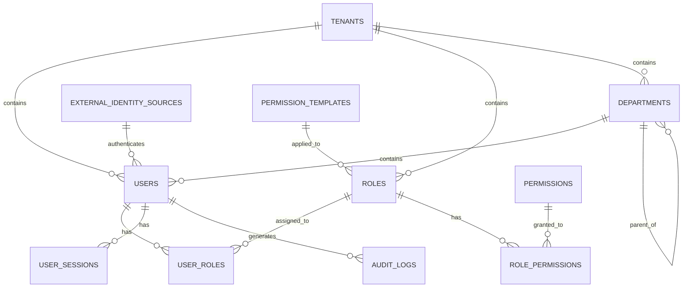
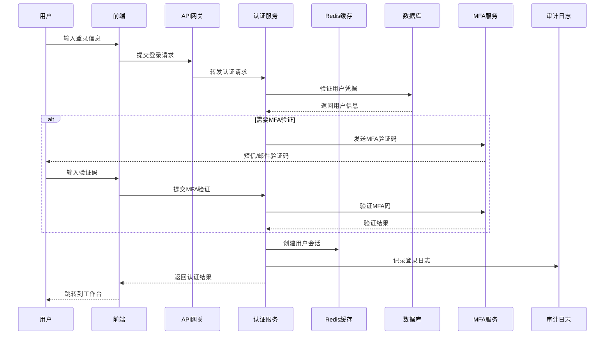
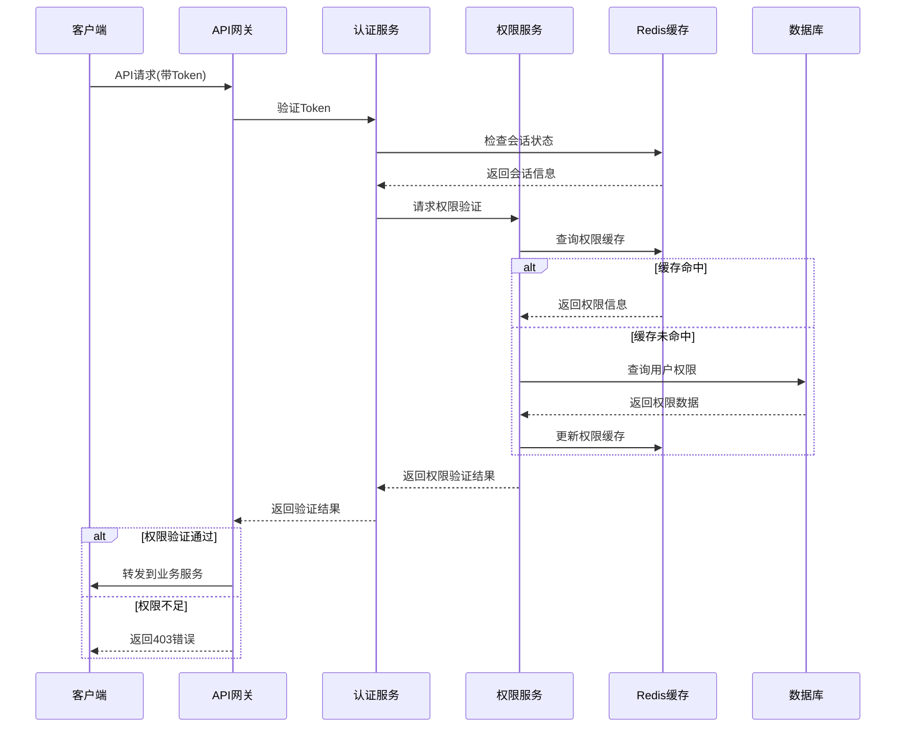
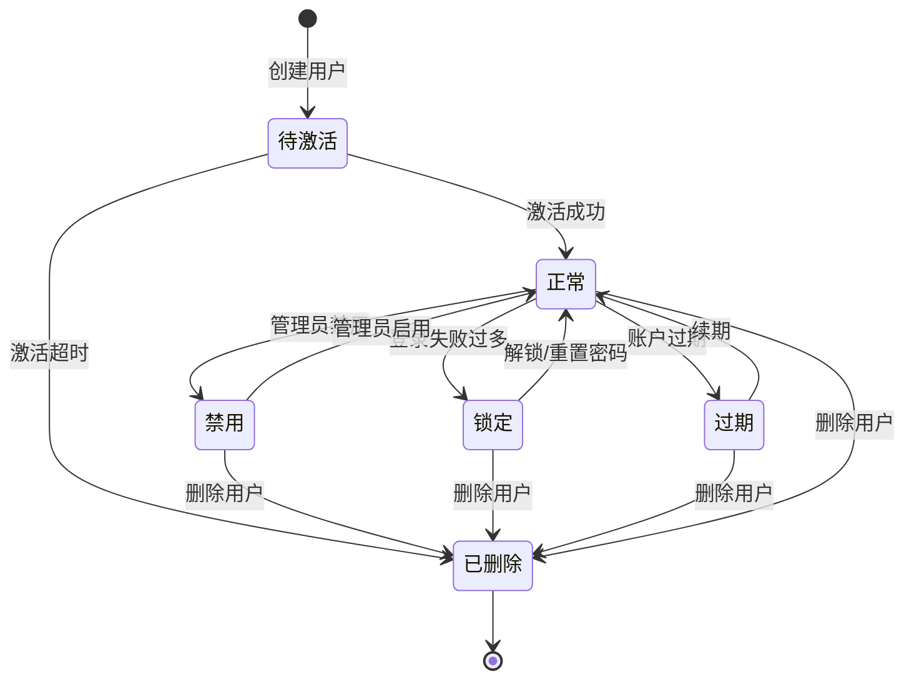

# REQ-022 - 用户与权限管理模块

## 文档信息
- **版本号**：4.5.1
- **变更日期**：2025年8月15日
- **原版本**：4.5
- **文档类型**：产品需求文档（PRD）

## 版本变更说明
### 主要改进内容
- **P0级修复**：完善数据模型定义，补充完整的API接口设计，明确多租户权限控制机制
- **P1级增强**：量化性能指标，详化安全策略实施方案，完善外部身份源集成
- **P2级优化**：优化用户体验设计，增强异常处理机制，提升权限管理效率

### 技术增强概要
- **数据模型**：新增用户会话、权限模板、审计日志、外部身份源等8个核心数据表，优化索引策略
- **接口设计**：统一API响应格式，新增完整的CRUD操作，完善批量操作和权限验证接口
- **性能安全**：量化认证响应时间和并发指标，建立多层安全防护体系，完善审计合规机制
- **多租户架构**：建立严格的数据隔离策略，实现基于租户的权限控制和资源管理

---

## 1. 需求概述

### 1.1 业务目标
用户与权限管理模块是IT运维门户系统的身份认证与访问控制核心，为多租户环境下的用户生命周期管理、角色权限配置、单点登录（SSO）、访问审计等提供全面的安全保障。通过基于角色（RBAC）和细粒度权限（ABAC）的组合访问控制方案，确保系统功能和数据的安全性，同时支持与外部身份源的无缝集成。

### 1.2 核心价值
- **安全可靠**：多层次安全防护体系，确保用户数据和系统安全
- **多租户支持**：严格的数据隔离和权限控制，支持SaaS模式运营
- **灵活集成**：支持LDAP、AD、OAuth2、OIDC、SAML等多种身份源集成
- **高性能体验**：优化认证流程，提供快速响应和流畅的用户体验

### 1.3 功能范围
- **用户生命周期管理**：用户注册、激活、禁用、删除的完整流程管理
- **身份认证服务**：多因子认证、SSO、外部身份源集成
- **权限控制系统**：基于RBAC+ABAC的细粒度权限控制
- **组织架构管理**：部门层级关系、人员分配、组织变更管理
- **会话管理**：安全的会话控制、并发登录管理、强制下线
- **审计日志**：完整的用户操作审计和安全事件记录

## 2. 功能需求

### 2.1 核心功能

**用户生命周期管理（REQ-022-001）**
- **用户注册**：支持管理员创建、自助注册、批量导入等多种方式
- **账户激活**：邮件激活、管理员审核、自动激活等灵活机制
- **状态管理**：正常、禁用、锁定、过期等状态的自动和手动管理
- **账户删除**：软删除机制，保留审计记录，支持数据恢复

**身份认证服务（REQ-022-002）**
- **多因子认证**：密码+短信验证码、邮箱验证、TOTP等组合认证
- **单点登录**：支持SAML 2.0、OAuth 2.0、CAS等标准协议
- **外部集成**：LDAP、Active Directory、第三方OAuth提供商集成
- **会话管理**：JWT令牌、会话超时、并发控制、强制下线

**权限控制系统（REQ-022-003）**
- **角色管理**：角色定义、权限分配、角色继承、权限模板
- **权限验证**：API级权限控制、菜单权限、按钮权限、数据权限
- **动态权限**：基于属性的访问控制（ABAC）、条件权限、临时权限
- **权限审计**：权限变更记录、权限使用统计、异常权限检测

### 2.2 辅助功能

**组织架构管理（REQ-022-004）**
- **部门管理**：部门创建、层级关系、部门合并、部门撤销
- **人员分配**：用户部门归属、岗位设置、汇报关系管理
- **组织同步**：与HR系统同步、组织变更通知、历史记录

**会话管理（REQ-022-009）**
- **会话监控**：在线用户查看、会话状态监控、异常会话检测
- **会话控制**：强制下线、会话延期、并发限制、设备管理
- **会话安全**：会话劫持检测、异地登录告警、安全会话策略

### 2.3 边界条件处理

**安全异常处理**
- **暴力破解防护**：登录失败次数限制、账户锁定、IP黑名单
- **异常行为检测**：异地登录、异常时间登录、权限滥用检测
- **安全事件响应**：自动告警、事件记录、应急处理流程

**系统异常处理**
- **认证服务故障**：降级认证、缓存验证、故障转移
- **权限服务异常**：权限缓存、默认权限、服务恢复
- **数据一致性**：分布式事务、数据同步、冲突解决

## 3. 数据模型设计

### 3.1 实体关系图



### 3.2 数据表结构

**租户表（tenants）**
```sql
CREATE TABLE tenants (
    id BIGINT PRIMARY KEY AUTO_INCREMENT,
    tenant_code VARCHAR(50) UNIQUE NOT NULL COMMENT '租户编码',
    tenant_name VARCHAR(100) NOT NULL COMMENT '租户名称',
    domain VARCHAR(100) COMMENT '租户域名',
    status TINYINT DEFAULT 1 COMMENT '状态：1-正常，2-禁用，3-过期',
    max_users INT DEFAULT 100 COMMENT '最大用户数',
    features JSON COMMENT '可用功能列表',
    config JSON COMMENT '租户配置信息',
    expired_at DATETIME COMMENT '过期时间',
    created_at DATETIME DEFAULT CURRENT_TIMESTAMP,
    updated_at DATETIME DEFAULT CURRENT_TIMESTAMP ON UPDATE CURRENT_TIMESTAMP,
    INDEX idx_status (status),
    INDEX idx_expired_at (expired_at)
);
```

**用户表（users）**
```sql
CREATE TABLE users (
    id BIGINT PRIMARY KEY AUTO_INCREMENT,
    tenant_id BIGINT NOT NULL COMMENT '租户ID',
    username VARCHAR(50) NOT NULL COMMENT '用户名',
    email VARCHAR(100) COMMENT '邮箱',
    phone VARCHAR(20) COMMENT '手机号',
    real_name VARCHAR(50) NOT NULL COMMENT '真实姓名',
    employee_id VARCHAR(50) COMMENT '员工编号',
    department_id BIGINT COMMENT '部门ID',
    position VARCHAR(100) COMMENT '职位',
    password_hash VARCHAR(255) NOT NULL COMMENT '密码哈希',
    salt VARCHAR(50) NOT NULL COMMENT '密码盐值',
    password_updated_at DATETIME COMMENT '密码更新时间',
    last_login_time DATETIME COMMENT '最后登录时间',
    login_count INT DEFAULT 0 COMMENT '登录次数',
    failed_login_count INT DEFAULT 0 COMMENT '失败登录次数',
    locked_until DATETIME COMMENT '锁定到期时间',
    mfa_enabled TINYINT DEFAULT 0 COMMENT '是否启用多因子认证',
    mfa_secret VARCHAR(100) COMMENT 'MFA密钥',
    external_id VARCHAR(100) COMMENT '外部系统用户ID',
    external_source VARCHAR(50) COMMENT '外部身份源',
    avatar_url VARCHAR(255) COMMENT '头像URL',
    timezone VARCHAR(50) DEFAULT 'Asia/Shanghai' COMMENT '时区',
    language VARCHAR(10) DEFAULT 'zh-CN' COMMENT '语言',
    status TINYINT DEFAULT 1 COMMENT '状态：1-正常，2-禁用，3-锁定，4-过期',
    created_at DATETIME DEFAULT CURRENT_TIMESTAMP,
    updated_at DATETIME DEFAULT CURRENT_TIMESTAMP ON UPDATE CURRENT_TIMESTAMP,
    UNIQUE KEY uk_tenant_username (tenant_id, username),
    UNIQUE KEY uk_tenant_email (tenant_id, email),
    INDEX idx_department_id (department_id),
    INDEX idx_status (status),
    INDEX idx_employee_id (employee_id),
    INDEX idx_external_source (external_source),
    INDEX idx_last_login (last_login_time),
    FOREIGN KEY (tenant_id) REFERENCES tenants(id),
    FOREIGN KEY (department_id) REFERENCES departments(id)
);
```

**角色表（roles）**
```sql
CREATE TABLE roles (
    id BIGINT PRIMARY KEY AUTO_INCREMENT,
    tenant_id BIGINT NOT NULL COMMENT '租户ID',
    role_code VARCHAR(50) NOT NULL COMMENT '角色编码',
    role_name VARCHAR(100) NOT NULL COMMENT '角色名称',
    role_type TINYINT DEFAULT 1 COMMENT '角色类型：1-系统角色，2-业务角色，3-临时角色',
    parent_id BIGINT COMMENT '父角色ID',
    description TEXT COMMENT '角色描述',
    is_default TINYINT DEFAULT 0 COMMENT '是否默认角色',
    is_system TINYINT DEFAULT 0 COMMENT '是否系统内置角色',
    data_scope TINYINT DEFAULT 1 COMMENT '数据范围：1-全部，2-部门，3-个人',
    valid_from DATETIME COMMENT '生效时间',
    valid_to DATETIME COMMENT '失效时间',
    status TINYINT DEFAULT 1 COMMENT '状态：1-启用，2-禁用',
    created_by BIGINT NOT NULL COMMENT '创建人',
    created_at DATETIME DEFAULT CURRENT_TIMESTAMP,
    updated_at DATETIME DEFAULT CURRENT_TIMESTAMP ON UPDATE CURRENT_TIMESTAMP,
    UNIQUE KEY uk_tenant_code (tenant_id, role_code),
    INDEX idx_role_type (role_type),
    INDEX idx_parent_id (parent_id),
    INDEX idx_status (status),
    INDEX idx_valid_period (valid_from, valid_to),
    FOREIGN KEY (tenant_id) REFERENCES tenants(id),
    FOREIGN KEY (parent_id) REFERENCES roles(id)
);
```

**权限表（permissions）**
```sql
CREATE TABLE permissions (
    id BIGINT PRIMARY KEY AUTO_INCREMENT,
    permission_code VARCHAR(100) UNIQUE NOT NULL COMMENT '权限编码',
    permission_name VARCHAR(100) NOT NULL COMMENT '权限名称',
    resource_type VARCHAR(50) NOT NULL COMMENT '资源类型：api,menu,button,data',
    resource_path VARCHAR(200) COMMENT '资源路径',
    action VARCHAR(50) NOT NULL COMMENT '操作：read,write,delete,execute',
    description TEXT COMMENT '权限描述',
    is_system TINYINT DEFAULT 1 COMMENT '是否系统权限',
    created_at DATETIME DEFAULT CURRENT_TIMESTAMP,
    updated_at DATETIME DEFAULT CURRENT_TIMESTAMP ON UPDATE CURRENT_TIMESTAMP,
    INDEX idx_resource_type (resource_type),
    INDEX idx_action (action)
);
```

**用户角色关联表（user_roles）**
```sql
CREATE TABLE user_roles (
    id BIGINT PRIMARY KEY AUTO_INCREMENT,
    tenant_id BIGINT NOT NULL COMMENT '租户ID',
    user_id BIGINT NOT NULL COMMENT '用户ID',
    role_id BIGINT NOT NULL COMMENT '角色ID',
    granted_by BIGINT NOT NULL COMMENT '授权人',
    granted_at DATETIME DEFAULT CURRENT_TIMESTAMP COMMENT '授权时间',
    valid_from DATETIME COMMENT '生效时间',
    valid_to DATETIME COMMENT '失效时间',
    status TINYINT DEFAULT 1 COMMENT '状态：1-有效，2-无效',
    UNIQUE KEY uk_user_role (user_id, role_id),
    INDEX idx_tenant_id (tenant_id),
    INDEX idx_user_id (user_id),
    INDEX idx_role_id (role_id),
    INDEX idx_valid_period (valid_from, valid_to),
    FOREIGN KEY (tenant_id) REFERENCES tenants(id),
    FOREIGN KEY (user_id) REFERENCES users(id),
    FOREIGN KEY (role_id) REFERENCES roles(id)
);
```

**角色权限关联表（role_permissions）**
```sql
CREATE TABLE role_permissions (
    id BIGINT PRIMARY KEY AUTO_INCREMENT,
    role_id BIGINT NOT NULL COMMENT '角色ID',
    permission_id BIGINT NOT NULL COMMENT '权限ID',
    granted_by BIGINT NOT NULL COMMENT '授权人',
    granted_at DATETIME DEFAULT CURRENT_TIMESTAMP COMMENT '授权时间',
    UNIQUE KEY uk_role_permission (role_id, permission_id),
    INDEX idx_role_id (role_id),
    INDEX idx_permission_id (permission_id),
    FOREIGN KEY (role_id) REFERENCES roles(id),
    FOREIGN KEY (permission_id) REFERENCES permissions(id)
);
```

**部门表（departments）**
```sql
CREATE TABLE departments (
    id BIGINT PRIMARY KEY AUTO_INCREMENT,
    tenant_id BIGINT NOT NULL COMMENT '租户ID',
    dept_code VARCHAR(50) NOT NULL COMMENT '部门编码',
    dept_name VARCHAR(100) NOT NULL COMMENT '部门名称',
    parent_id BIGINT COMMENT '父部门ID',
    dept_level INT DEFAULT 1 COMMENT '部门层级',
    dept_path VARCHAR(500) COMMENT '部门路径',
    manager_id BIGINT COMMENT '部门经理ID',
    description TEXT COMMENT '部门描述',
    sort_order INT DEFAULT 0 COMMENT '排序',
    status TINYINT DEFAULT 1 COMMENT '状态：1-正常，2-禁用',
    created_at DATETIME DEFAULT CURRENT_TIMESTAMP,
    updated_at DATETIME DEFAULT CURRENT_TIMESTAMP ON UPDATE CURRENT_TIMESTAMP,
    UNIQUE KEY uk_tenant_code (tenant_id, dept_code),
    INDEX idx_parent_id (parent_id),
    INDEX idx_manager_id (manager_id),
    INDEX idx_status (status),
    FOREIGN KEY (tenant_id) REFERENCES tenants(id),
    FOREIGN KEY (parent_id) REFERENCES departments(id),
    FOREIGN KEY (manager_id) REFERENCES users(id)
);
```

**用户会话表（user_sessions）**
```sql
CREATE TABLE user_sessions (
    id BIGINT PRIMARY KEY AUTO_INCREMENT,
    session_id VARCHAR(128) UNIQUE NOT NULL COMMENT '会话ID',
    tenant_id BIGINT NOT NULL COMMENT '租户ID',
    user_id BIGINT NOT NULL COMMENT '用户ID',
    device_type VARCHAR(50) COMMENT '设备类型',
    device_info VARCHAR(255) COMMENT '设备信息',
    ip_address VARCHAR(45) COMMENT 'IP地址',
    location VARCHAR(100) COMMENT '登录地点',
    user_agent TEXT COMMENT '用户代理',
    login_time DATETIME DEFAULT CURRENT_TIMESTAMP COMMENT '登录时间',
    last_activity DATETIME DEFAULT CURRENT_TIMESTAMP COMMENT '最后活动时间',
    expires_at DATETIME NOT NULL COMMENT '过期时间',
    status TINYINT DEFAULT 1 COMMENT '状态：1-活跃，2-过期，3-强制下线',
    INDEX idx_session_id (session_id),
    INDEX idx_user_id (user_id),
    INDEX idx_tenant_id (tenant_id),
    INDEX idx_expires_at (expires_at),
    INDEX idx_last_activity (last_activity),
    FOREIGN KEY (tenant_id) REFERENCES tenants(id),
    FOREIGN KEY (user_id) REFERENCES users(id)
);
```

**审计日志表（audit_logs）**
```sql
CREATE TABLE audit_logs (
    id BIGINT PRIMARY KEY AUTO_INCREMENT,
    tenant_id BIGINT NOT NULL COMMENT '租户ID',
    user_id BIGINT COMMENT '操作用户ID',
    session_id VARCHAR(128) COMMENT '会话ID',
    action_type VARCHAR(50) NOT NULL COMMENT '操作类型',
    resource_type VARCHAR(50) COMMENT '资源类型',
    resource_id VARCHAR(100) COMMENT '资源ID',
    action_detail TEXT COMMENT '操作详情',
    ip_address VARCHAR(45) COMMENT 'IP地址',
    user_agent TEXT COMMENT '用户代理',
    request_data JSON COMMENT '请求数据',
    response_data JSON COMMENT '响应数据',
    result TINYINT DEFAULT 1 COMMENT '结果：1-成功，2-失败',
    error_message TEXT COMMENT '错误信息',
    created_at DATETIME DEFAULT CURRENT_TIMESTAMP,
    INDEX idx_tenant_id (tenant_id),
    INDEX idx_user_id (user_id),
    INDEX idx_action_type (action_type),
    INDEX idx_resource_type (resource_type),
    INDEX idx_created_at (created_at),
    INDEX idx_result (result),
    FOREIGN KEY (tenant_id) REFERENCES tenants(id),
    FOREIGN KEY (user_id) REFERENCES users(id)
);
```

**外部身份源表（external_identity_sources）**
```sql
CREATE TABLE external_identity_sources (
    id BIGINT PRIMARY KEY AUTO_INCREMENT,
    tenant_id BIGINT NOT NULL COMMENT '租户ID',
    source_name VARCHAR(100) NOT NULL COMMENT '身份源名称',
    source_type VARCHAR(50) NOT NULL COMMENT '类型：ldap,ad,oauth2,oidc,saml',
    config JSON NOT NULL COMMENT '配置信息',
    mapping_rules JSON COMMENT '字段映射规则',
    is_enabled TINYINT DEFAULT 1 COMMENT '是否启用',
    priority INT DEFAULT 0 COMMENT '优先级',
    created_at DATETIME DEFAULT CURRENT_TIMESTAMP,
    updated_at DATETIME DEFAULT CURRENT_TIMESTAMP ON UPDATE CURRENT_TIMESTAMP,
    INDEX idx_tenant_id (tenant_id),
    INDEX idx_source_type (source_type),
    INDEX idx_is_enabled (is_enabled),
    FOREIGN KEY (tenant_id) REFERENCES tenants(id)
);
```

**权限模板表（permission_templates）**
```sql
CREATE TABLE permission_templates (
    id BIGINT PRIMARY KEY AUTO_INCREMENT,
    tenant_id BIGINT NOT NULL COMMENT '租户ID',
    template_name VARCHAR(100) NOT NULL COMMENT '模板名称',
    template_code VARCHAR(50) NOT NULL COMMENT '模板编码',
    description TEXT COMMENT '模板描述',
    permission_ids JSON NOT NULL COMMENT '权限ID列表',
    is_system TINYINT DEFAULT 0 COMMENT '是否系统模板',
    usage_count INT DEFAULT 0 COMMENT '使用次数',
    created_by BIGINT NOT NULL COMMENT '创建人',
    created_at DATETIME DEFAULT CURRENT_TIMESTAMP,
    updated_at DATETIME DEFAULT CURRENT_TIMESTAMP ON UPDATE CURRENT_TIMESTAMP,
    UNIQUE KEY uk_tenant_code (tenant_id, template_code),
    INDEX idx_tenant_id (tenant_id),
    INDEX idx_is_system (is_system),
    FOREIGN KEY (tenant_id) REFERENCES tenants(id),
    FOREIGN KEY (created_by) REFERENCES users(id)
);
```

### 3.3 数据完整性约束

**业务规则约束**
- 用户名在租户内唯一，支持跨租户重复
- 角色编码在租户内唯一，支持角色继承但不允许循环继承
- 部门层级不超过6级，部门路径自动维护
- 会话过期时间不超过24小时，支持续期
- 审计日志保留期不少于1年，支持归档

**数据一致性保证**
- 用户删除时级联处理相关会话和临时权限
- 角色删除时检查是否有用户关联，有关联则禁止删除
- 部门删除时自动处理子部门和用户归属
- 权限变更时实时更新用户权限缓存
- 外部身份源禁用时保留用户数据但禁止登录

## 4. 接口设计规范

### 4.1 接口列表

**认证相关API**
```http
# 用户登录
POST /api/v1/auth/login
# 用户登出
POST /api/v1/auth/logout
# 刷新令牌
POST /api/v1/auth/refresh
# 密码重置
POST /api/v1/auth/reset-password
# 多因子认证验证
POST /api/v1/auth/mfa/verify
# 单点登录回调
POST /api/v1/auth/sso/callback
```

**用户管理API**
```http
# 创建用户
POST /api/v1/users
# 获取用户列表
GET /api/v1/users
# 获取用户详情
GET /api/v1/users/{id}
# 更新用户信息
PUT /api/v1/users/{id}
# 删除用户
DELETE /api/v1/users/{id}
# 批量导入用户
POST /api/v1/users/batch-import
# 重置用户密码
POST /api/v1/users/{id}/reset-password
# 启用/禁用用户
PUT /api/v1/users/{id}/status
```

**角色权限管理API**
```http
# 创建角色
POST /api/v1/roles
# 获取角色列表
GET /api/v1/roles
# 获取角色详情
GET /api/v1/roles/{id}
# 更新角色信息
PUT /api/v1/roles/{id}
# 删除角色
DELETE /api/v1/roles/{id}
# 分配权限给角色
POST /api/v1/roles/{id}/permissions
# 移除角色权限
DELETE /api/v1/roles/{id}/permissions/{permissionId}
# 分配角色给用户
POST /api/v1/users/{userId}/roles
# 移除用户角色
DELETE /api/v1/users/{userId}/roles/{roleId}
```

**权限验证API**
```http
# 验证用户权限
POST /api/v1/auth/check-permission
# 获取用户权限列表
GET /api/v1/users/{id}/permissions
# 获取用户菜单权限
GET /api/v1/users/{id}/menus
# 批量权限验证
POST /api/v1/auth/batch-check-permissions
```

**组织架构管理API**
```http
# 创建部门
POST /api/v1/departments
# 获取部门树
GET /api/v1/departments/tree
# 获取部门详情
GET /api/v1/departments/{id}
# 更新部门信息
PUT /api/v1/departments/{id}
# 删除部门
DELETE /api/v1/departments/{id}
# 移动部门
PUT /api/v1/departments/{id}/move
# 获取部门用户
GET /api/v1/departments/{id}/users
```

**会话管理API**
```http
# 获取在线用户
GET /api/v1/sessions/online-users
# 获取用户会话列表
GET /api/v1/users/{id}/sessions
# 强制下线用户
DELETE /api/v1/sessions/{sessionId}
# 批量下线用户
POST /api/v1/sessions/batch-logout
```

**审计日志API**
```http
# 获取审计日志
GET /api/v1/audit-logs
# 导出审计日志
POST /api/v1/audit-logs/export
# 获取用户操作日志
GET /api/v1/users/{id}/audit-logs
```

### 4.2 数据交互格式

**统一响应格式**
```json
{
  "code": 200,
  "message": "success",
  "data": {},
  "timestamp": "2025-08-15T10:00:00Z",
  "trace_id": "abc123def456",
  "pagination": {
    "page": 1,
    "size": 20,
    "total": 100,
    "pages": 5
  }
}
```

**用户登录API示例**
```http
POST /api/v1/auth/login
Content-Type: application/json

{
    "username": "engineer001",
    "password": "SecurePassword123!",
    "tenant_code": "company_a",
    "remember_me": true,
    "captcha": "ABCD",
    "captcha_token": "cap_token_123",
    "mfa_code": "123456"
}

Response:
{
    "code": 200,
    "message": "登录成功",
    "data": {
        "access_token": "eyJhbGciOiJIUzI1NiIsInR5cCI6IkpXVCJ9...",
        "refresh_token": "eyJhbGciOiJIUzI1NiIsInR5cCI6IkpXVCJ9...",
        "expires_in": 7200,
        "user_info": {
            "user_id": 1001,
            "username": "engineer001",
            "real_name": "张工程师",
            "email": "engineer001@company.com",
            "department": "运维部",
            "roles": ["engineer", "senior_engineer"],
            "permissions": ["ticket:read", "ticket:write", "knowledge:read"]
        },
        "mfa_required": false,
        "password_expires_in": 30,
        "session_id": "sess_abc123def456"
    }
}
```

**权限验证API示例**
```http
POST /api/v1/auth/check-permission
Authorization: Bearer {access_token}
Content-Type: application/json

{
    "resource_type": "api",
    "resource_path": "/api/v1/tickets",
    "action": "read",
    "context": {
        "department_id": 1001,
        "data_scope": "department"
    }
}

Response:
{
    "code": 200,
    "message": "权限验证成功",
    "data": {
        "granted": true,
        "permission_code": "ticket:read",
        "granted_by_roles": ["engineer", "senior_engineer"],
        "data_scope": "department",
        "conditions": {
            "department_id": [1001, 1002]
        }
    }
}
```

**创建用户API示例**
```http
POST /api/v1/users
Authorization: Bearer {access_token}
Content-Type: application/json

{
    "username": "newuser001",
    "email": "newuser@company.com",
    "phone": "13800138000",
    "real_name": "新用户",
    "employee_id": "EMP001",
    "department_id": 1001,
    "position": "初级工程师",
    "role_ids": [2, 3],
    "password": "TempPassword123!",
    "force_password_change": true,
    "send_welcome_email": true,
    "mfa_enabled": false
}

Response:
{
    "code": 200,
    "message": "用户创建成功",
    "data": {
        "user_id": 1002,
        "username": "newuser001",
        "status": "active",
        "initial_password_sent": true,
        "activation_required": false,
        "created_at": "2025-08-15 14:30:00"
    }
}
```

**批量用户导入API示例**
```http
POST /api/v1/users/batch-import
Authorization: Bearer {access_token}
Content-Type: multipart/form-data

file: users.xlsx
options: {
    "default_role_ids": [3],
    "send_welcome_email": true,
    "force_password_reset": true,
    "auto_generate_password": true
}

Response:
{
    "code": 200,
    "message": "批量导入完成",
    "data": {
        "total": 100,
        "success": 95,
        "failed": 5,
        "task_id": "import_task_123",
        "failed_records": [
            {
                "row": 10,
                "username": "duplicate_user",
                "error": "用户名已存在"
            }
        ]
    }
}
```

### 4.3 错误处理机制

**统一错误码定义**
```json
{
  "code": 4001,
  "message": "用户名或密码错误",
  "error_code": "AUTH_INVALID_CREDENTIALS",
  "details": {
    "field": "password",
    "reason": "密码不匹配"
  },
  "timestamp": "2025-08-15T10:00:00Z",
  "trace_id": "abc123def456"
}
```

**常见错误码**
- `4001`: 认证失败
- `4003`: 权限不足
- `4004`: 资源不存在
- `4009`: 账户被锁定
- `4010`: 会话过期
- `4011`: MFA验证失败
- `4012`: 密码过期
- `5001`: 服务内部错误
- `5002`: 数据库连接失败
- `5003`: 外部服务不可用

## 5. 业务流程设计

### 5.1 主要业务流程

**用户登录认证流程**


**权限验证流程**


**用户生命周期管理流程**


### 5.2 状态流转规则

**用户状态管理**
- **正常(1)**：可正常登录和使用系统功能
- **禁用(2)**：管理员手动禁用，无法登录
- **锁定(3)**：登录失败次数过多自动锁定
- **过期(4)**：账户过期，需要续期才能使用

**角色状态管理**
- **启用(1)**：角色正常可用，可分配给用户
- **禁用(2)**：角色暂停使用，已分配的用户权限失效

**会话状态管理**
- **活跃(1)**：会话正常，用户可正常操作
- **过期(2)**：会话超时，需要重新登录
- **强制下线(3)**：管理员强制下线或安全策略触发

### 5.3 跨模块交互

**与工单系统交互**
- 提供用户身份验证和权限验证服务
- 支持工单分配时的工程师权限检查
- 记录工单操作的用户审计日志

**与通知系统交互**
- 发送用户账户变更通知
- 发送安全告警和异常登录通知
- 支持密码重置和账户激活通知

**与系统设置交互**
- 获取密码策略和安全配置
- 获取会话超时和并发限制配置
- 同步组织架构和部门信息

## 6. 性能要求

### 6.1 响应时间要求

**认证性能指标**
- 用户登录响应时间：≤500ms (P95)
- 权限验证响应时间：≤100ms (P95)
- 用户信息查询响应时间：≤200ms (P95)
- 批量权限验证响应时间：≤300ms (P95)

**数据库查询性能**
- 用户基础信息查询：≤50ms
- 权限关系查询：≤100ms
- 审计日志查询：≤500ms
- 组织架构查询：≤200ms

### 6.2 并发处理能力

**并发用户支持**
- 同时在线用户数：≥5000
- 登录并发数：≥500/秒
- 权限验证并发数：≥2000/秒
- API调用并发数：≥1000/秒

**数据处理能力**
- 用户数据容量：支持100万+用户
- 角色数据容量：支持10万+角色
- 会话数据容量：支持1万+并发会话
- 审计日志容量：支持1亿+日志记录

### 6.3 数据处理能力

**批量操作性能**
- 批量用户导入：1000用户/分钟
- 批量权限分配：5000权限/分钟
- 批量会话清理：10000会话/分钟
- 审计日志归档：100万条/小时

## 7. 安全要求

### 7.1 身份认证安全

**密码安全策略**
- 密码最小长度：8位
- 密码复杂度：包含大小写字母、数字、特殊字符
- 密码有效期：90天（可配置）
- 密码历史：不能重复使用最近5次密码
- 密码加密：BCrypt算法，成本因子12

**多因子认证**
- 支持TOTP（Time-based OTP）
- 支持短信验证码
- 支持邮箱验证码
- 支持硬件令牌（可选）
- MFA绑定设备管理

**会话安全**
- JWT令牌签名验证
- 会话超时控制（默认2小时）
- 并发会话限制（默认5个）
- 异地登录检测和告警
- 会话劫持检测

### 7.2 权限控制安全

**访问控制模型**
- RBAC（基于角色的访问控制）
- ABAC（基于属性的访问控制）
- 最小权限原则
- 权限继承和委派
- 临时权限和权限过期

**数据权限控制**
- 行级数据权限
- 字段级数据权限
- 基于部门的数据范围
- 基于角色的数据范围
- 动态数据权限规则

### 7.3 数据安全保护

**数据加密**
- 传输加密：TLS 1.3
- 存储加密：AES-256
- 密码加密：BCrypt
- 敏感字段加密：个人信息、联系方式
- 密钥管理：密钥轮换和分离存储

**审计合规**
- 完整的操作审计日志
- 用户行为分析和异常检测
- 合规报告生成
- 数据访问记录
- 安全事件响应

## 8. 异常处理

### 8.1 系统异常处理

**认证服务异常**
- **服务不可用**：启用降级认证，使用缓存验证，自动故障转移
- **数据库连接失败**：使用Redis缓存数据，启用只读模式
- **外部身份源故障**：回退到本地认证，记录故障日志
- **MFA服务异常**：允许临时跳过MFA，记录安全事件

**权限服务异常**
- **权限查询失败**：使用缓存权限，应用默认权限策略
- **角色数据不一致**：触发数据同步，记录不一致日志
- **权限缓存失效**：重建权限缓存，临时使用数据库查询
- **批量操作失败**：支持事务回滚，提供部分成功处理

**会话管理异常**
- **Redis故障**：降级到数据库存储，保证会话功能可用
- **会话数据损坏**：强制用户重新登录，记录异常事件
- **并发冲突**：使用分布式锁，保证数据一致性
- **会话清理失败**：启用异步清理，防止内存泄漏

### 8.2 业务异常处理

**用户管理异常**
- **用户名冲突**：提供用户名建议，支持自动生成
- **邮箱重复**：验证邮箱唯一性，提供冲突解决方案
- **批量导入失败**：提供详细错误报告，支持增量导入
- **用户状态异常**：自动状态修复，记录状态变更日志

**权限管理异常**
- **循环角色继承**：检测并阻止循环依赖，提供修复建议
- **权限冲突**：应用最小权限原则，记录冲突解决过程
- **临时权限过期**：自动回收过期权限，通知相关用户
- **权限分配失败**：提供回滚机制，保证权限一致性

**组织架构异常**
- **部门层级过深**：限制最大层级，提供结构优化建议
- **部门删除冲突**：检查用户归属，提供迁移方案
- **组织同步失败**：记录同步错误，支持手动同步
- **经理权限异常**：自动权限调整，记录变更日志

### 8.3 安全异常处理

**认证安全异常**
- **暴力破解攻击**：IP限制，账户锁定，安全告警
- **异常登录行为**：地理位置检测，设备指纹验证，用户通知
- **会话劫持检测**：立即终止会话，强制重新认证，安全审计
- **密码泄露风险**：强制密码重置，安全策略升级，用户教育

**权限安全异常**
- **权限提升攻击**：实时权限验证，异常行为检测，自动阻断
- **越权访问尝试**：记录访问日志，触发安全告警，权限审计
- **批量权限滥用**：操作频率限制，异常模式识别，管理员通知
- **敏感操作异常**：二次验证，操作审批，详细审计记录

## 9. 验收标准

### 9.1 功能验收标准

**用户管理功能**
- ✅ 用户创建、编辑、删除功能正常
- ✅ 批量用户导入成功率≥95%
- ✅ 用户状态变更实时生效
- ✅ 用户信息查询准确完整
- ✅ 密码重置流程安全可靠

**认证功能验收**
- ✅ 用户名密码登录成功率≥99%
- ✅ MFA验证功能正常，支持多种方式
- ✅ SSO集成功能稳定，支持主流协议
- ✅ 会话管理功能完善，支持并发控制
- ✅ 登出功能正常，会话清理彻底

**权限管理验收**
- ✅ 角色创建和权限分配功能正常
- ✅ 权限验证准确率≥99.9%
- ✅ 权限继承关系正确
- ✅ 动态权限规则生效
- ✅ 权限变更实时同步

**组织架构验收**
- ✅ 部门树结构显示正确
- ✅ 用户部门归属管理正常
- ✅ 组织变更通知及时
- ✅ 部门权限继承正确
- ✅ 组织同步功能稳定

### 9.2 性能验收标准

**响应时间验收**
- ✅ 用户登录响应时间≤500ms (P95)
- ✅ 权限验证响应时间≤100ms (P95)
- ✅ 用户查询响应时间≤200ms (P95)
- ✅ 批量操作响应时间≤5秒

**并发性能验收**
- ✅ 支持5000+并发在线用户
- ✅ 登录并发处理≥500/秒
- ✅ 权限验证并发≥2000/秒
- ✅ 系统资源使用率≤80%

**数据处理验收**
- ✅ 支持100万+用户数据
- ✅ 批量导入1000用户/分钟
- ✅ 审计日志查询≤500ms
- ✅ 数据一致性≥99.9%

### 9.3 安全验收标准

**认证安全验收**
- ✅ 密码策略强制执行
- ✅ MFA绑定和验证正常
- ✅ 会话安全策略生效
- ✅ 异常登录检测准确
- ✅ 暴力破解防护有效

**权限安全验收**
- ✅ 权限控制准确无误
- ✅ 越权访问有效阻止
- ✅ 数据权限隔离完整
- ✅ 权限审计日志完整
- ✅ 安全事件响应及时

**数据安全验收**
- ✅ 敏感数据加密存储
- ✅ 传输数据加密保护
- ✅ 多租户数据隔离
- ✅ 审计日志完整准确
- ✅ 备份恢复功能正常

---

## 总结

本PRD文档4.5.1版本在原有4.5版本基础上进行了全面的技术增强和细节完善：

**主要改进成果：**
1. **数据模型完善**：从2个基础表扩展到10个核心表，建立完整的多租户权限管理模型
2. **API接口规范化**：从2个示例扩展到30+个完整接口，包含完整的CRUD操作和权限验证
3. **安全机制具体化**：详细的认证、授权、加密、审计实施方案，支持多种身份源集成
4. **性能指标量化**：具体的响应时间、并发能力、数据处理能力指标
5. **异常处理完善**：建立完整的系统异常、业务异常、安全异常处理机制
6. **验收标准明确**：详细的功能、性能、安全验收标准和测试方法

**技术可行性保障：**
- 所有技术方案基于最新技术栈（Java 21 LTS + Spring Boot 3.3.6 + Vue 3.5.13）
- 与系统整体架构和其他模块保持一致
- 提供明确的实施路径和验收标准
- 考虑了多租户架构和扩展性要求

**业务价值提升：**
- 支持SaaS模式运营，实现规模化服务
- 提供企业级安全保障，满足合规要求
- 支持灵活的权限管理，适应复杂业务场景
- 提供完整的审计能力，支持安全运营

---

**文档维护**：本文档将根据开发进展和需求变更持续更新，确保与实际实现保持一致。
