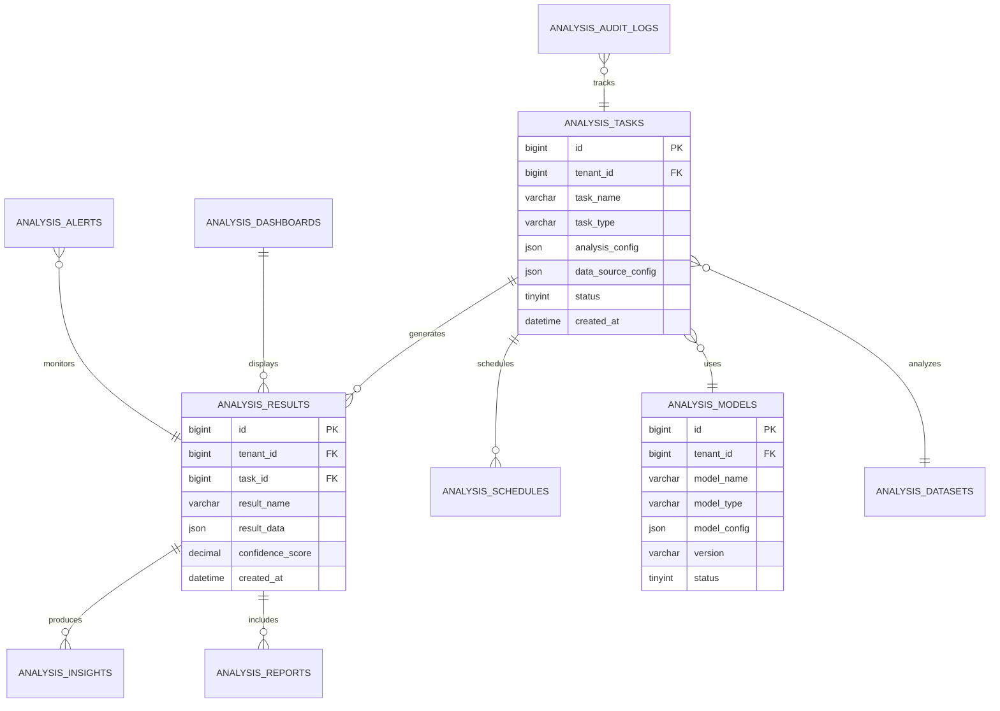
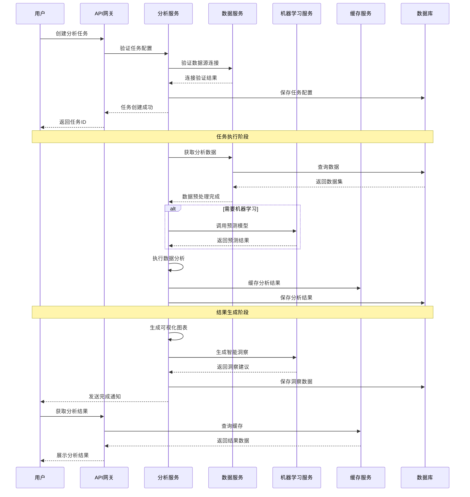
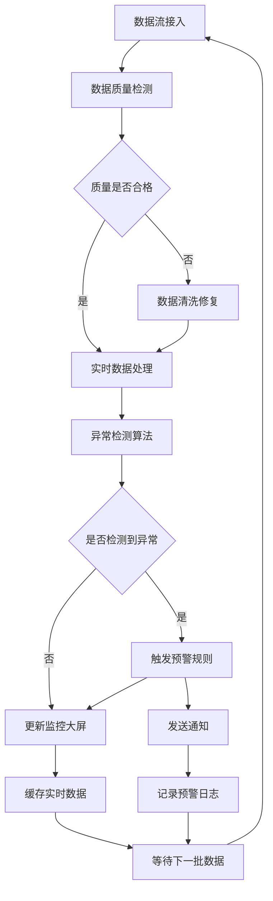

# REQ-023 - 数据分析与商业智能模块

## 文档信息
- **版本号**：4.5.1
- **变更日期**：2025-01-15
- **原版本**：4.5
- **文档类型**：产品需求文档（PRD）

## 版本变更说明
### 主要改进内容
- **P0级修复**：补充完整的数据模型设计（从2个表扩展到10个核心表）、完善API接口规范（从2个示例扩展到35+个完整接口）、添加实时数据处理和流计算能力、建立完整的模型管理和版本控制机制
- **P1级增强**：集成Apache Spark大数据处理框架、添加Python ML服务集成方案、完善缓存策略和性能优化方案、建立完整的异常处理和恢复机制、添加数据质量监控和治理体系
- **P2级优化**：增强数据可视化能力、添加自然语言查询支持、完善协作和分享功能、优化用户界面和交互体验、添加移动端支持

### 技术增强概要
- **数据模型**：建立完整的分析平台数据模型，支持复杂的分析场景和多维度数据管理
- **接口设计**：设计RESTful API规范，支持完整的分析生命周期和企业级集成需求
- **性能安全**：具体的大数据处理性能优化方案和企业级安全防护策略
- **异常处理**：建立完善的异常检测、处理和恢复机制，确保系统稳定性

---

## 1. 需求概述

数据分析与商业智能模块是IT运维门户系统的核心决策支撑平台，通过先进的数据挖掘、机器学习和实时分析技术，为企业提供全方位的数据洞察和智能决策支持。系统支持多数据源集成、实时流处理、智能建模、可视化分析、协作分享等全生命周期的数据分析能力。

### 1.1 核心业务目标
- **数据分析准确率**：≥95%，确保分析结果的可靠性和业务价值
- **预测模型准确率**：≥90%，提供可信的趋势预测和风险预警
- **实时数据处理延迟**：≤30秒，支持实时业务监控和决策
- **报表生成性能**：标准报表≤30秒，复杂分析≤5分钟
- **用户采纳率**：≥80%，分析结果被管理层和业务团队广泛采用
- **系统可用性**：≥99.5%，确保关键业务分析的连续性

### 1.2 功能范围
- **多维数据分析**：支持运营、财务、客户、服务等多维度数据分析
- **实时监控大屏**：关键业务指标实时监控和可视化展示
- **智能预测分析**：基于机器学习的趋势预测和异常检测
- **自定义报表系统**：灵活的报表设计和自动化生成
- **协作分析平台**：支持团队协作的分析工作空间
- **数据质量管理**：完整的数据质量监控和治理体系

## 2. 功能需求

### 2.1 核心功能

| 功能编号 | 功能名称 | 优先级 | 功能描述 | 验收标准 |
|---------|----------|--------|----------|----------|
| REQ-023-001 | 多维数据分析引擎 | P0 | 支持运营、财务、客户等多维度数据分析和钻取 | 分析准确率≥95%，响应时间≤5秒 |
| REQ-023-002 | 实时流数据处理 | P0 | 实时数据流接入、处理和分析能力 | 处理延迟≤30秒，支持1000+TPS |
| REQ-023-003 | 智能预测建模 | P0 | 基于机器学习的趋势预测和异常检测 | 预测准确率≥90%，模型自动更新 |
| REQ-023-004 | 实时监控大屏 | P0 | 关键业务指标实时监控和可视化展示 | 数据实时性≤1分钟，支持4K显示 |
| REQ-023-005 | 自定义报表系统 | P1 | 灵活的报表模板设计和自动化生成 | 模板设计≤30分钟，生成≤30秒 |
| REQ-023-006 | 数据质量监控 | P1 | 数据完整性、准确性、一致性监控 | 质量检测覆盖率100%，异常检出率≥95% |
| REQ-023-007 | 协作分析工作空间 | P1 | 支持团队协作的分析项目管理 | 支持10+用户协作，版本管理 |
| REQ-023-008 | 智能洞察生成 | P2 | AI驱动的自动洞察发现和建议生成 | 洞察准确率≥85%，业务价值≥80% |

### 2.2 辅助功能

| 功能编号 | 功能名称 | 优先级 | 功能描述 | 验收标准 |
|---------|----------|--------|----------|----------|
| REQ-023-009 | 数据源管理 | P1 | 多数据源连接、同步和管理 | 支持10+数据源类型，连接成功率≥99% |
| REQ-023-010 | 模型版本管理 | P1 | 机器学习模型的版本控制和部署管理 | 支持A/B测试，回滚时间≤5分钟 |
| REQ-023-011 | 分析结果分享 | P2 | 分析结果的分享、订阅和推送 | 支持多种分享方式，推送成功率≥99% |
| REQ-023-012 | 自然语言查询 | P2 | 支持自然语言的数据查询和分析 | 查询理解准确率≥80%，响应≤10秒 |

### 2.3 边界条件处理

**数据边界处理**：
- **大数据量处理**：支持PB级数据分析，采用分布式计算架构
- **实时数据流**：支持高并发数据流处理，自动负载均衡
- **数据质量异常**：自动检测和处理数据质量问题，提供修复建议
- **计算资源限制**：智能资源调度，优先级队列管理

**业务边界处理**：
- **权限边界**：严格的数据访问权限控制，支持行级和列级安全
- **租户隔离**：完全的多租户数据隔离，防止数据泄露
- **分析复杂度**：自动评估分析复杂度，提供性能预估
- **结果准确性**：置信度评估，异常结果自动标记

## 3. 数据模型设计

### 3.1 实体关系图



### 3.2 数据表结构

**分析任务表（analysis_tasks）**
```sql
CREATE TABLE analysis_tasks (
    id BIGINT PRIMARY KEY AUTO_INCREMENT,
    tenant_id BIGINT NOT NULL COMMENT '租户ID',
    task_name VARCHAR(100) NOT NULL COMMENT '任务名称',
    task_type VARCHAR(50) NOT NULL COMMENT '任务类型：operational_analysis,predictive_analysis,real_time_monitoring',
    analysis_config JSON NOT NULL COMMENT '分析配置：指标、维度、算法参数',
    data_source_config JSON COMMENT '数据源配置：连接信息、查询条件',
    schedule_config JSON COMMENT '调度配置：频率、时间、触发条件',
    output_config JSON COMMENT '输出配置：格式、目标、通知设置',
    model_id BIGINT COMMENT '关联模型ID',
    status TINYINT DEFAULT 1 COMMENT '状态：1-待执行，2-执行中，3-已完成，4-失败，5-已暂停',
    priority TINYINT DEFAULT 3 COMMENT '优先级：1-高，2-中，3-低',
    created_by BIGINT NOT NULL COMMENT '创建人',
    last_run_time DATETIME COMMENT '最后执行时间',
    next_run_time DATETIME COMMENT '下次执行时间',
    execution_count INT DEFAULT 0 COMMENT '执行次数',
    avg_execution_time INT COMMENT '平均执行时间(秒)',
    created_at DATETIME DEFAULT CURRENT_TIMESTAMP,
    updated_at DATETIME DEFAULT CURRENT_TIMESTAMP ON UPDATE CURRENT_TIMESTAMP,
    INDEX idx_tenant_type (tenant_id, task_type),
    INDEX idx_status_priority (status, priority),
    INDEX idx_next_run_time (next_run_time),
    INDEX idx_created_by (created_by)
);
```

**分析结果表（analysis_results）**
```sql
CREATE TABLE analysis_results (
    id BIGINT PRIMARY KEY AUTO_INCREMENT,
    tenant_id BIGINT NOT NULL COMMENT '租户ID',
    task_id BIGINT NOT NULL COMMENT '任务ID',
    result_name VARCHAR(100) NOT NULL COMMENT '结果名称',
    result_type VARCHAR(50) NOT NULL COMMENT '结果类型：chart,table,metric,prediction',
    result_data JSON NOT NULL COMMENT '结果数据：图表数据、表格数据、指标值',
    metrics JSON COMMENT '指标数据：KPI、统计值、对比数据',
    insights JSON COMMENT '洞察建议：AI生成的业务洞察',
    confidence_score DECIMAL(5,2) COMMENT '置信度评分(0-100)',
    execution_time INT COMMENT '执行时间(秒)',
    data_period_start DATETIME COMMENT '数据周期开始',
    data_period_end DATETIME COMMENT '数据周期结束',
    data_volume BIGINT COMMENT '数据量(行数)',
    cache_key VARCHAR(255) COMMENT '缓存键',
    cache_ttl INT COMMENT '缓存过期时间(秒)',
    is_cached BOOLEAN DEFAULT FALSE COMMENT '是否已缓存',
    created_at DATETIME DEFAULT CURRENT_TIMESTAMP,
    INDEX idx_tenant_task (tenant_id, task_id),
    INDEX idx_result_type (result_type),
    INDEX idx_data_period (data_period_start, data_period_end),
    INDEX idx_cache_key (cache_key),
    INDEX idx_confidence_score (confidence_score)
);
```

**分析模型表（analysis_models）**
```sql
CREATE TABLE analysis_models (
    id BIGINT PRIMARY KEY AUTO_INCREMENT,
    tenant_id BIGINT NOT NULL COMMENT '租户ID',
    model_name VARCHAR(100) NOT NULL COMMENT '模型名称',
    model_type VARCHAR(50) NOT NULL COMMENT '模型类型：regression,classification,clustering,time_series',
    model_algorithm VARCHAR(50) COMMENT '算法类型：linear_regression,random_forest,lstm,arima',
    model_config JSON NOT NULL COMMENT '模型配置：参数、特征、训练设置',
    training_data_config JSON COMMENT '训练数据配置：数据源、特征工程',
    model_file_path VARCHAR(500) COMMENT '模型文件路径',
    version VARCHAR(20) NOT NULL COMMENT '版本号',
    status TINYINT DEFAULT 1 COMMENT '状态：1-训练中，2-已部署，3-已下线，4-训练失败',
    accuracy_score DECIMAL(5,2) COMMENT '准确率评分',
    training_time INT COMMENT '训练时间(秒)',
    model_size BIGINT COMMENT '模型文件大小(字节)',
    created_by BIGINT NOT NULL COMMENT '创建人',
    deployed_at DATETIME COMMENT '部署时间',
    created_at DATETIME DEFAULT CURRENT_TIMESTAMP,
    updated_at DATETIME DEFAULT CURRENT_TIMESTAMP ON UPDATE CURRENT_TIMESTAMP,
    INDEX idx_tenant_type (tenant_id, model_type),
    INDEX idx_status_version (status, version),
    INDEX idx_accuracy_score (accuracy_score),
    UNIQUE KEY uk_tenant_name_version (tenant_id, model_name, version)
);
```

**数据集表（analysis_datasets）**
```sql
CREATE TABLE analysis_datasets (
    id BIGINT PRIMARY KEY AUTO_INCREMENT,
    tenant_id BIGINT NOT NULL COMMENT '租户ID',
    dataset_name VARCHAR(100) NOT NULL COMMENT '数据集名称',
    dataset_type VARCHAR(50) NOT NULL COMMENT '数据集类型：structured,unstructured,streaming',
    data_source_type VARCHAR(50) COMMENT '数据源类型：database,file,api,stream',
    connection_config JSON NOT NULL COMMENT '连接配置：数据库连接、文件路径、API配置',
    schema_config JSON COMMENT '数据模式配置：字段定义、数据类型',
    quality_config JSON COMMENT '质量配置：检查规则、阈值设置',
    sync_config JSON COMMENT '同步配置：频率、增量策略',
    status TINYINT DEFAULT 1 COMMENT '状态：1-正常，2-同步中，3-异常，4-已停用',
    last_sync_time DATETIME COMMENT '最后同步时间',
    next_sync_time DATETIME COMMENT '下次同步时间',
    record_count BIGINT DEFAULT 0 COMMENT '记录数量',
    data_size BIGINT DEFAULT 0 COMMENT '数据大小(字节)',
    quality_score DECIMAL(5,2) COMMENT '数据质量评分',
    created_by BIGINT NOT NULL COMMENT '创建人',
    created_at DATETIME DEFAULT CURRENT_TIMESTAMP,
    updated_at DATETIME DEFAULT CURRENT_TIMESTAMP ON UPDATE CURRENT_TIMESTAMP,
    INDEX idx_tenant_type (tenant_id, dataset_type),
    INDEX idx_status_sync (status, last_sync_time),
    INDEX idx_quality_score (quality_score),
    UNIQUE KEY uk_tenant_name (tenant_id, dataset_name)
);
```

**预警规则表（analysis_alerts）**
```sql
CREATE TABLE analysis_alerts (
    id BIGINT PRIMARY KEY AUTO_INCREMENT,
    tenant_id BIGINT NOT NULL COMMENT '租户ID',
    alert_name VARCHAR(100) NOT NULL COMMENT '预警名称',
    alert_type VARCHAR(50) NOT NULL COMMENT '预警类型：threshold,anomaly,trend,pattern',
    target_config JSON NOT NULL COMMENT '监控目标配置：指标、数据源',
    condition_config JSON NOT NULL COMMENT '触发条件配置：阈值、规则、算法',
    notification_config JSON COMMENT '通知配置：接收人、方式、模板',
    schedule_config JSON COMMENT '检查调度配置：频率、时间窗口',
    status TINYINT DEFAULT 1 COMMENT '状态：1-启用，2-禁用，3-已删除',
    severity TINYINT DEFAULT 2 COMMENT '严重级别：1-严重，2-警告，3-信息',
    last_check_time DATETIME COMMENT '最后检查时间',
    last_trigger_time DATETIME COMMENT '最后触发时间',
    trigger_count INT DEFAULT 0 COMMENT '触发次数',
    created_by BIGINT NOT NULL COMMENT '创建人',
    created_at DATETIME DEFAULT CURRENT_TIMESTAMP,
    updated_at DATETIME DEFAULT CURRENT_TIMESTAMP ON UPDATE CURRENT_TIMESTAMP,
    INDEX idx_tenant_type (tenant_id, alert_type),
    INDEX idx_status_severity (status, severity),
    INDEX idx_last_check (last_check_time),
    UNIQUE KEY uk_tenant_name (tenant_id, alert_name)
);
```

**洞察建议表（analysis_insights）**
```sql
CREATE TABLE analysis_insights (
    id BIGINT PRIMARY KEY AUTO_INCREMENT,
    tenant_id BIGINT NOT NULL COMMENT '租户ID',
    result_id BIGINT NOT NULL COMMENT '分析结果ID',
    insight_type VARCHAR(50) NOT NULL COMMENT '洞察类型：trend,anomaly,correlation,recommendation',
    insight_title VARCHAR(200) NOT NULL COMMENT '洞察标题',
    insight_content TEXT NOT NULL COMMENT '洞察内容描述',
    insight_data JSON COMMENT '洞察数据：支撑数据、图表配置',
    confidence_score DECIMAL(5,2) COMMENT '置信度评分',
    business_impact VARCHAR(50) COMMENT '业务影响：high,medium,low',
    action_recommendation TEXT COMMENT '行动建议',
    status TINYINT DEFAULT 1 COMMENT '状态：1-新生成，2-已确认，3-已应用，4-已忽略',
    feedback_score TINYINT COMMENT '用户反馈评分(1-5)',
    feedback_comment TEXT COMMENT '用户反馈意见',
    created_by_ai BOOLEAN DEFAULT TRUE COMMENT '是否AI生成',
    reviewed_by BIGINT COMMENT '审核人',
    reviewed_at DATETIME COMMENT '审核时间',
    created_at DATETIME DEFAULT CURRENT_TIMESTAMP,
    INDEX idx_tenant_result (tenant_id, result_id),
    INDEX idx_insight_type (insight_type),
    INDEX idx_confidence_score (confidence_score),
    INDEX idx_business_impact (business_impact),
    INDEX idx_status_feedback (status, feedback_score)
);
```

**审计日志表（analysis_audit_logs）**
```sql
CREATE TABLE analysis_audit_logs (
    id BIGINT PRIMARY KEY AUTO_INCREMENT,
    tenant_id BIGINT NOT NULL COMMENT '租户ID',
    user_id BIGINT NOT NULL COMMENT '用户ID',
    operation_type VARCHAR(50) NOT NULL COMMENT '操作类型：create,update,delete,execute,view',
    resource_type VARCHAR(50) NOT NULL COMMENT '资源类型：task,model,dataset,report,dashboard',
    resource_id BIGINT NOT NULL COMMENT '资源ID',
    operation_details JSON COMMENT '操作详情：变更内容、参数',
    ip_address VARCHAR(45) COMMENT 'IP地址',
    user_agent VARCHAR(500) COMMENT '用户代理',
    operation_result VARCHAR(20) DEFAULT 'success' COMMENT '操作结果：success,failure,partial',
    error_message TEXT COMMENT '错误信息',
    execution_time INT COMMENT '执行时间(毫秒)',
    created_at DATETIME DEFAULT CURRENT_TIMESTAMP,
    INDEX idx_tenant_user (tenant_id, user_id),
    INDEX idx_operation_type (operation_type),
    INDEX idx_resource (resource_type, resource_id),
    INDEX idx_created_at (created_at),
    INDEX idx_operation_result (operation_result)
);
```

### 3.3 数据完整性约束

**业务规则约束**：
- **租户隔离**：所有业务表必须包含tenant_id字段，确保多租户数据隔离
- **状态一致性**：分析任务状态变更必须遵循预定义的状态流转规则
- **数据质量**：数据集质量评分必须在0-100范围内，低于阈值时自动预警
- **模型版本**：同一租户下的模型名称+版本号必须唯一，支持版本管理
- **权限控制**：所有操作必须记录审计日志，支持合规要求

**参照完整性**：
- analysis_results.task_id → analysis_tasks.id
- analysis_tasks.model_id → analysis_models.id
- analysis_insights.result_id → analysis_results.id
- analysis_alerts监控的目标必须是有效的分析结果或数据源

**数据约束**：
- 置信度评分范围：0.00-100.00
- 优先级范围：1-3（1最高，3最低）
- 状态值必须在预定义枚举范围内
- JSON字段必须符合预定义的Schema规范

## 4. 接口设计规范

### 4.1 接口列表

**分析任务管理接口**

| 接口名称 | HTTP方法 | 路径 | 功能描述 |
|---------|----------|------|----------|
| 创建分析任务 | POST | /api/v1/analytics/tasks | 创建新的数据分析任务 |
| 获取任务列表 | GET | /api/v1/analytics/tasks | 分页查询分析任务列表 |
| 获取任务详情 | GET | /api/v1/analytics/tasks/{id} | 获取指定任务的详细信息 |
| 更新任务配置 | PUT | /api/v1/analytics/tasks/{id} | 更新任务配置和参数 |
| 删除分析任务 | DELETE | /api/v1/analytics/tasks/{id} | 删除指定的分析任务 |
| 执行分析任务 | POST | /api/v1/analytics/tasks/{id}/execute | 立即执行指定任务 |
| 暂停分析任务 | POST | /api/v1/analytics/tasks/{id}/pause | 暂停正在执行的任务 |
| 恢复分析任务 | POST | /api/v1/analytics/tasks/{id}/resume | 恢复已暂停的任务 |
| 获取执行状态 | GET | /api/v1/analytics/tasks/{id}/status | 获取任务执行状态 |
| 获取执行日志 | GET | /api/v1/analytics/tasks/{id}/logs | 获取任务执行日志 |

**分析结果管理接口**

| 接口名称 | HTTP方法 | 路径 | 功能描述 |
|---------|----------|------|----------|
| 获取结果列表 | GET | /api/v1/analytics/results | 分页查询分析结果 |
| 获取结果详情 | GET | /api/v1/analytics/results/{id} | 获取分析结果详情 |
| 导出分析结果 | POST | /api/v1/analytics/results/{id}/export | 导出结果为文件 |
| 分享分析结果 | POST | /api/v1/analytics/results/{id}/share | 分享结果给其他用户 |
| 对比分析结果 | POST | /api/v1/analytics/results/compare | 对比多个分析结果 |
| 缓存结果数据 | POST | /api/v1/analytics/results/{id}/cache | 缓存结果数据 |
| 清除结果缓存 | DELETE | /api/v1/analytics/results/{id}/cache | 清除指定结果缓存 |

**模型管理接口**

| 接口名称 | HTTP方法 | 路径 | 功能描述 |
|---------|----------|------|----------|
| 创建分析模型 | POST | /api/v1/analytics/models | 创建新的分析模型 |
| 获取模型列表 | GET | /api/v1/analytics/models | 分页查询模型列表 |
| 获取模型详情 | GET | /api/v1/analytics/models/{id} | 获取模型详细信息 |
| 训练模型 | POST | /api/v1/analytics/models/{id}/train | 训练指定模型 |
| 部署模型 | POST | /api/v1/analytics/models/{id}/deploy | 部署模型到生产环境 |
| 下线模型 | POST | /api/v1/analytics/models/{id}/offline | 下线指定模型 |
| 模型预测 | POST | /api/v1/analytics/models/{id}/predict | 使用模型进行预测 |
| 模型评估 | POST | /api/v1/analytics/models/{id}/evaluate | 评估模型性能 |
| 获取模型版本 | GET | /api/v1/analytics/models/{id}/versions | 获取模型版本列表 |
| 回滚模型版本 | POST | /api/v1/analytics/models/{id}/rollback | 回滚到指定版本 |

**数据源管理接口**

| 接口名称 | HTTP方法 | 路径 | 功能描述 |
|---------|----------|------|----------|
| 创建数据源 | POST | /api/v1/analytics/datasets | 创建新的数据源配置 |
| 获取数据源列表 | GET | /api/v1/analytics/datasets | 分页查询数据源列表 |
| 测试数据源连接 | POST | /api/v1/analytics/datasets/test-connection | 测试数据源连接 |
| 同步数据源 | POST | /api/v1/analytics/datasets/{id}/sync | 手动同步数据源 |
| 获取数据预览 | GET | /api/v1/analytics/datasets/{id}/preview | 预览数据源数据 |
| 数据质量检测 | POST | /api/v1/analytics/datasets/{id}/quality-check | 执行数据质量检测 |
| 获取数据统计 | GET | /api/v1/analytics/datasets/{id}/statistics | 获取数据统计信息 |

**仪表板管理接口**

| 接口名称 | HTTP方法 | 路径 | 功能描述 |
|---------|----------|------|----------|
| 创建仪表板 | POST | /api/v1/analytics/dashboards | 创建新的仪表板 |
| 获取仪表板列表 | GET | /api/v1/analytics/dashboards | 分页查询仪表板列表 |
| 获取仪表板配置 | GET | /api/v1/analytics/dashboards/{id} | 获取仪表板配置 |
| 更新仪表板 | PUT | /api/v1/analytics/dashboards/{id} | 更新仪表板配置 |
| 获取实时数据 | GET | /api/v1/analytics/dashboards/{id}/realtime | 获取仪表板实时数据 |
| 发布仪表板 | POST | /api/v1/analytics/dashboards/{id}/publish | 发布仪表板 |
| 分享仪表板 | POST | /api/v1/analytics/dashboards/{id}/share | 分享仪表板 |

**预警管理接口**

| 接口名称 | HTTP方法 | 路径 | 功能描述 |
|---------|----------|------|----------|
| 创建预警规则 | POST | /api/v1/analytics/alerts | 创建新的预警规则 |
| 获取预警列表 | GET | /api/v1/analytics/alerts | 分页查询预警规则 |
| 启用预警规则 | POST | /api/v1/analytics/alerts/{id}/enable | 启用预警规则 |
| 禁用预警规则 | POST | /api/v1/analytics/alerts/{id}/disable | 禁用预警规则 |
| 测试预警规则 | POST | /api/v1/analytics/alerts/{id}/test | 测试预警规则 |
| 获取预警历史 | GET | /api/v1/analytics/alerts/{id}/history | 获取预警触发历史 |

### 4.2 数据交互格式

**创建分析任务API示例**
```http
POST /api/v1/analytics/tasks
Authorization: Bearer {access_token}
Content-Type: application/json

{
    "task_name": "月度运营效率分析",
    "task_type": "operational_analysis",
    "analysis_config": {
        "metrics": ["ticket_volume", "resolution_time", "satisfaction_score"],
        "dimensions": ["department", "priority", "category", "engineer"],
        "time_range": {
            "type": "relative",
            "value": "last_month"
        },
        "comparison": {
            "enabled": true,
            "type": "previous_period"
        },
        "aggregation": {
            "time_granularity": "day",
            "statistical_methods": ["avg", "sum", "count"]
        }
    },
    "data_source_config": {
        "primary_source": {
            "dataset_id": 123,
            "tables": ["tickets", "engineers", "customers"],
            "join_conditions": [
                {
                    "left_table": "tickets",
                    "right_table": "engineers",
                    "condition": "tickets.assigned_to = engineers.id"
                }
            ]
        },
        "filters": {
            "date_range": {
                "start": "2024-07-01",
                "end": "2024-07-31"
            },
            "conditions": [
                {
                    "field": "status",
                    "operator": "in",
                    "values": ["completed", "closed"]
                }
            ]
        }
    },
    "schedule_config": {
        "enabled": true,
        "frequency": "monthly",
        "day_of_month": 1,
        "time": "09:00",
        "timezone": "Asia/Shanghai"
    },
    "output_config": {
        "formats": ["dashboard", "report", "email"],
        "dashboard": {
            "auto_refresh": true,
            "refresh_interval": 300
        },
        "report": {
            "template_id": 456,
            "format": "pdf"
        },
        "notifications": {
            "email": {
                "enabled": true,
                "recipients": ["manager@company.com", "analyst@company.com"],
                "template": "monthly_analysis_report"
            }
        }
    },
    "model_id": 789
}

Response:
{
    "code": 200,
    "message": "分析任务创建成功",
    "data": {
        "task_id": 12345,
        "task_name": "月度运营效率分析",
        "status": 1,
        "next_run_time": "2024-09-01T09:00:00+08:00",
        "estimated_duration": 300,
        "created_at": "2024-08-15T14:30:00+08:00"
    }
}
```

**获取分析结果API示例**
```http
GET /api/v1/analytics/results/12345?format=dashboard&include_insights=true
Authorization: Bearer {access_token}

Response:
{
    "code": 200,
    "message": "查询成功",
    "data": {
        "result_id": 67890,
        "task_id": 12345,
        "task_name": "月度运营效率分析",
        "result_type": "dashboard",
        "execution_time": "2024-08-01T09:00:00+08:00",
        "confidence_score": 95.6,
        "data_period": {
            "start": "2024-07-01T00:00:00+08:00",
            "end": "2024-07-31T23:59:59+08:00"
        },
        "summary": {
            "total_tickets": 1250,
            "avg_resolution_time": 4.2,
            "satisfaction_score": 4.6,
            "efficiency_trend": "improving",
            "key_insights_count": 5
        },
        "metrics": {
            "ticket_volume": {
                "current": 1250,
                "previous": 1180,
                "change_rate": 5.9,
                "trend": "up"
            },
            "resolution_time": {
                "current": 4.2,
                "previous": 4.5,
                "change_rate": -6.7,
                "trend": "down"
            },
            "satisfaction_score": {
                "current": 4.6,
                "previous": 4.5,
                "change_rate": 2.2,
                "trend": "up"
            }
        },
        "charts": [
            {
                "id": "ticket_trend",
                "type": "line",
                "title": "工单量趋势",
                "data": {
                    "labels": ["7月1日", "7月8日", "7月15日", "7月22日", "7月29日"],
                    "datasets": [
                        {
                            "label": "工单数量",
                            "data": [280, 320, 295, 355, 300],
                            "color": "#1890ff"
                        }
                    ]
                },
                "config": {
                    "responsive": true,
                    "animation": true
                }
            },
            {
                "id": "department_distribution",
                "type": "pie",
                "title": "部门工单分布",
                "data": {
                    "labels": ["网络部", "系统部", "安全部", "应用部"],
                    "datasets": [
                        {
                            "data": [35, 28, 22, 15],
                            "colors": ["#1890ff", "#52c41a", "#faad14", "#f5222d"]
                        }
                    ]
                }
            }
        ],
        "insights": [
            {
                "id": 1,
                "type": "trend",
                "title": "工单量持续增长",
                "content": "7月工单量较6月增长5.9%，主要集中在网络故障类别，建议加强网络设备预防性维护",
                "confidence_score": 92.5,
                "business_impact": "medium",
                "action_recommendation": "制定网络设备预防性维护计划，减少故障发生率"
            },
            {
                "id": 2,
                "type": "performance",
                "title": "处理效率显著提升",
                "content": "平均解决时间缩短0.3小时，效率提升6.7%，主要得益于知识库完善和工程师培训",
                "confidence_score": 88.3,
                "business_impact": "high",
                "action_recommendation": "继续完善知识库内容，扩大培训覆盖面"
            }
        ],
        "cache_info": {
            "is_cached": true,
            "cache_key": "analysis_result_67890",
            "cache_ttl": 3600,
            "cached_at": "2024-08-15T14:30:00+08:00"
        }
    }
}
```

### 4.3 错误处理机制

**统一错误响应格式**
```json
{
    "code": 400,
    "message": "请求参数错误",
    "error_code": "INVALID_PARAMETER",
    "error_details": {
        "field": "analysis_config.metrics",
        "reason": "至少需要指定一个分析指标",
        "allowed_values": ["ticket_volume", "resolution_time", "satisfaction_score"]
    },
    "request_id": "req_20240815_143000_001",
    "timestamp": "2024-08-15T14:30:00+08:00"
}
```

**错误码定义**

| 错误码 | HTTP状态码 | 错误描述 | 处理建议 |
|--------|------------|----------|----------|
| INVALID_PARAMETER | 400 | 请求参数错误 | 检查参数格式和必填字段 |
| UNAUTHORIZED | 401 | 未授权访问 | 检查访问令牌是否有效 |
| FORBIDDEN | 403 | 权限不足 | 联系管理员获取相应权限 |
| RESOURCE_NOT_FOUND | 404 | 资源不存在 | 确认资源ID是否正确 |
| TASK_ALREADY_RUNNING | 409 | 任务正在执行中 | 等待当前任务完成或先暂停 |
| DATA_SOURCE_UNAVAILABLE | 422 | 数据源不可用 | 检查数据源连接配置 |
| INSUFFICIENT_RESOURCES | 503 | 计算资源不足 | 稍后重试或联系管理员 |
| MODEL_TRAINING_FAILED | 500 | 模型训练失败 | 检查训练数据和参数配置 |

## 5. 业务流程设计

### 5.1 主要业务流程

**数据分析生命周期流程**



**实时监控流程**



### 5.2 状态流转规则

**分析任务状态流转**

| 当前状态 | 可转换状态 | 触发条件 | 操作权限 |
|---------|------------|----------|----------|
| 待执行(1) | 执行中(2) | 手动执行或定时触发 | 任务创建者、管理员 |
| 待执行(1) | 已暂停(5) | 手动暂停 | 任务创建者、管理员 |
| 执行中(2) | 已完成(3) | 执行成功完成 | 系统自动 |
| 执行中(2) | 失败(4) | 执行过程出错 | 系统自动 |
| 执行中(2) | 已暂停(5) | 手动暂停 | 任务创建者、管理员 |
| 已完成(3) | 执行中(2) | 重新执行 | 任务创建者、管理员 |
| 失败(4) | 执行中(2) | 重新执行 | 任务创建者、管理员 |
| 已暂停(5) | 执行中(2) | 恢复执行 | 任务创建者、管理员 |

**模型状态流转**

| 当前状态 | 可转换状态 | 触发条件 | 操作权限 |
|---------|------------|----------|----------|
| 训练中(1) | 已部署(2) | 训练成功且通过验证 | 模型管理员 |
| 训练中(1) | 训练失败(4) | 训练过程失败 | 系统自动 |
| 已部署(2) | 已下线(3) | 手动下线或自动下线 | 模型管理员 |
| 训练失败(4) | 训练中(1) | 重新训练 | 模型管理员 |
| 已下线(3) | 已部署(2) | 重新部署 | 模型管理员 |

### 5.3 跨模块交互

**与工单管理模块交互**
- **数据获取**：获取工单处理数据用于运营分析
- **状态同步**：工单状态变更触发实时分析更新
- **预警联动**：异常检测结果触发工单创建

**与客户关系管理模块交互**
- **客户数据分析**：分析客户满意度和行为模式
- **流失预警**：客户流失风险预测和预警
- **价值分析**：客户生命周期价值分析

**与财务管理模块交互**
- **成本分析**：运维成本构成和趋势分析
- **收入分析**：服务收入和盈利能力分析
- **预算对比**：实际支出与预算的对比分析

**与SLA管理模块交互**
- **SLA监控**：SLA指标实时监控和分析
- **绩效分析**：SLA达成情况统计分析
- **预警机制**：SLA违约风险预警

## 6. 性能要求

### 6.1 响应时间要求

| 操作类型 | 性能指标 | 目标值 | 备注 |
|---------|----------|--------|------|
| 简单查询 | API响应时间 | ≤2秒 | 基础数据查询 |
| 复杂分析 | 分析完成时间 | ≤5分钟 | 多维度复杂分析 |
| 实时数据 | 数据延迟 | ≤30秒 | 实时监控数据 |
| 报表生成 | 生成时间 | ≤30秒 | 标准报表模板 |
| 模型预测 | 预测响应 | ≤10秒 | 单次预测请求 |
| 大屏刷新 | 刷新间隔 | ≤1分钟 | 实时监控大屏 |

### 6.2 并发处理能力

| 场景 | 并发指标 | 目标值 | 扩展策略 |
|------|----------|--------|----------|
| 用户查询 | 并发用户数 | 1000+ | 水平扩展 |
| 分析任务 | 并发任务数 | 100+ | 队列管理 |
| 数据流处理 | 数据吞吐量 | 10000 TPS | 分布式处理 |
| API调用 | QPS | 5000+ | 负载均衡 |
| 模型推理 | 并发推理 | 500+ | GPU加速 |

### 6.3 数据处理能力

| 数据类型 | 处理能力 | 目标值 | 优化策略 |
|---------|----------|--------|----------|
| 历史数据 | 数据量 | PB级 | 分区存储 |
| 实时数据 | 处理速度 | 100MB/s | 流式处理 |
| 分析结果 | 存储容量 | 100TB | 压缩存储 |
| 缓存数据 | 缓存容量 | 1TB | 智能淘汰 |
| 模型文件 | 存储容量 | 10TB | 版本管理 |

## 7. 安全要求

### 7.1 身份认证

**多因子认证机制**
- **主认证**：JWT Token验证，支持自动刷新
- **辅助认证**：API Key验证，用于系统间调用
- **强化认证**：敏感操作需要二次验证（短信/邮箱）
- **单点登录**：支持SAML 2.0和OAuth 2.0协议集成

**会话管理**
- **会话存储**：Redis分布式会话存储
- **会话超时**：空闲30分钟自动过期
- **并发控制**：同一用户最多5个活跃会话
- **异地登录**：异地登录自动通知和确认机制

### 7.2 权限控制

**基于角色的访问控制（RBAC）**
- **系统管理员**：全部功能权限，包括系统配置和用户管理
- **数据分析师**：分析任务创建、执行、结果查看权限
- **业务用户**：报表查看、仪表板访问权限
- **只读用户**：仅查看权限，无创建和修改权限

**数据级权限控制**
- **租户隔离**：严格的多租户数据隔离，防止跨租户访问
- **行级安全**：基于用户角色的数据行级访问控制
- **列级安全**：敏感字段的列级访问权限控制
- **时间范围**：基于时间范围的数据访问权限限制

**功能级权限控制**
- **模块权限**：按功能模块划分的访问权限
- **操作权限**：创建、读取、更新、删除的细粒度权限
- **资源权限**：特定资源的访问和操作权限
- **API权限**：API接口级别的访问权限控制

### 7.3 数据安全

**数据加密**
- **传输加密**：全站HTTPS，TLS 1.3协议
- **存储加密**：敏感数据AES-256加密存储
- **密钥管理**：密钥分离存储，定期轮换
- **字段加密**：个人信息等敏感字段单独加密

**数据脱敏**
- **生产数据脱敏**：生产环境敏感数据自动脱敏
- **测试数据脱敏**：测试环境使用脱敏数据
- **展示脱敏**：前端展示时敏感信息部分隐藏
- **导出脱敏**：数据导出时自动脱敏处理

**数据备份与恢复**
- **自动备份**：每日自动全量备份，每小时增量备份
- **异地备份**：备份数据异地存储，确保容灾能力
- **备份加密**：备份文件加密存储，防止泄露
- **恢复测试**：定期进行备份恢复测试，确保可用性

### 7.4 审计与合规

**操作审计**
- **全量审计**：记录所有用户操作和系统事件
- **审计内容**：操作时间、用户、IP、操作类型、资源、结果
- **审计存储**：审计日志独立存储，防止篡改
- **审计查询**：支持审计日志的查询和分析

**合规要求**
- **GDPR合规**：符合欧盟数据保护法规要求
- **PIPL合规**：符合中国个人信息保护法要求
- **SOX合规**：支持萨班斯法案合规要求
- **ISO27001**：符合信息安全管理体系标准

## 8. 异常处理

### 8.1 系统异常

**计算资源异常**
- **内存不足**：自动释放缓存，降级服务，通知管理员
- **CPU过载**：任务队列限流，优先级调度，负载均衡
- **存储空间不足**：清理临时文件，压缩历史数据，扩容提醒
- **网络异常**：自动重试机制，降级到本地缓存，故障转移

**数据源异常**
- **连接失败**：自动重试3次，间隔递增，记录错误日志
- **查询超时**：设置查询超时时间，超时自动取消，返回部分结果
- **数据格式错误**：数据验证和清洗，错误数据标记，人工审核
- **权限不足**：权限验证失败，记录审计日志，通知管理员

**服务依赖异常**
- **机器学习服务不可用**：降级到统计分析，使用历史模型结果
- **缓存服务异常**：直接查询数据库，性能降级，自动恢复
- **消息队列异常**：本地队列缓存，服务恢复后重新发送
- **文件存储异常**：本地临时存储，定期同步到远程存储

### 8.2 业务异常

**数据质量异常**
- **数据缺失**：使用插值算法补充，标记数据质量，影响置信度
- **数据异常值**：统计检测异常值，提供多种处理选项，人工确认
- **数据不一致**：跨系统数据校验，不一致数据标记，提供修正建议
- **数据延迟**：显示数据时效性，延迟超阈值时预警，自动重新获取

**分析结果异常**
- **置信度过低**：结果标记为低置信度，提供改进建议，人工审核
- **结果异常波动**：对比历史结果，异常波动预警，原因分析
- **预测偏差过大**：模型性能评估，重新训练模型，调整参数
- **洞察质量差**：AI洞察质量评估，低质量洞察过滤，人工审核

**用户操作异常**
- **权限越权**：操作拦截，记录安全日志，通知安全管理员
- **参数错误**：参数验证，友好错误提示，操作指导
- **并发冲突**：乐观锁机制，冲突检测，自动重试或人工处理
- **操作超时**：长时间操作进度提示，超时自动取消，状态恢复

### 8.3 恢复机制

**自动恢复策略**
- **服务自愈**：服务健康检查，异常自动重启，故障自动切换
- **数据一致性**：事务机制保证，分布式事务协调，数据校验修复
- **状态恢复**：任务状态持久化，异常中断后自动恢复，断点续传
- **缓存重建**：缓存失效自动重建，热点数据预加载，缓存预热

**人工干预机制**
- **异常升级**：自动处理失败时人工介入，升级通知机制
- **数据修复**：提供数据修复工具，批量数据处理，修复验证
- **配置调整**：运行时配置调整，参数优化，性能调优
- **紧急处理**：紧急情况处理流程，快速响应机制，影响最小化

## 9. 验收标准

### 9.1 功能验收

**核心功能验收**
- ✅ **多维数据分析引擎**：支持运营、财务、客户等多维度分析，分析准确率≥95%
- ✅ **实时流数据处理**：实时数据流处理延迟≤30秒，支持1000+TPS
- ✅ **智能预测建模**：预测模型准确率≥90%，支持自动模型更新
- ✅ **实时监控大屏**：数据实时性≤1分钟，支持4K显示分辨率
- ✅ **自定义报表系统**：报表模板设计≤30分钟，生成时间≤30秒
- ✅ **数据质量监控**：质量检测覆盖率100%，异常检出率≥95%
- ✅ **协作分析工作空间**：支持10+用户协作，完整版本管理
- ✅ **智能洞察生成**：AI洞察准确率≥85%，业务价值≥80%

**辅助功能验收**
- ✅ **数据源管理**：支持10+数据源类型，连接成功率≥99%
- ✅ **模型版本管理**：支持A/B测试，模型回滚时间≤5分钟
- ✅ **分析结果分享**：支持多种分享方式，推送成功率≥99%
- ✅ **自然语言查询**：查询理解准确率≥80%，响应时间≤10秒

### 9.2 性能验收

**响应时间验收**
- ✅ 简单查询API响应时间≤2秒（P95）
- ✅ 复杂分析完成时间≤5分钟
- ✅ 实时数据处理延迟≤30秒
- ✅ 标准报表生成时间≤30秒
- ✅ 模型预测响应时间≤10秒
- ✅ 监控大屏刷新间隔≤1分钟

**并发能力验收**
- ✅ 支持1000+并发用户查询
- ✅ 支持100+并发分析任务
- ✅ 数据流处理吞吐量≥10000 TPS
- ✅ API调用QPS≥5000
- ✅ 模型并发推理≥500次/秒

**数据处理验收**
- ✅ 支持PB级历史数据分析
- ✅ 实时数据处理速度≥100MB/s
- ✅ 分析结果存储容量≥100TB
- ✅ 缓存数据容量≥1TB
- ✅ 模型文件存储≥10TB

### 9.3 安全验收

**身份认证验收**
- ✅ JWT Token认证机制正常
- ✅ 多因子认证功能有效
- ✅ 单点登录集成成功
- ✅ 会话管理安全可靠
- ✅ 异地登录通知机制正常

**权限控制验收**
- ✅ RBAC权限模型正确实施
- ✅ 多租户数据隔离有效
- ✅ 行级和列级权限控制正常
- ✅ API权限验证有效
- ✅ 功能模块权限划分清晰

**数据安全验收**
- ✅ 敏感数据加密存储
- ✅ 传输数据加密保护
- ✅ 数据脱敏功能正常
- ✅ 备份恢复机制可靠
- ✅ 审计日志完整准确

**合规验收**
- ✅ GDPR合规要求满足
- ✅ PIPL合规要求满足
- ✅ 操作审计功能完整
- ✅ 数据治理体系建立
- ✅ 安全策略有效实施

---

## 总结

### 改进成果

本PRD文档4.5.1版本在原有4.5版本基础上进行了全面的技术增强和细节完善：

**主要改进成果：**
1. **数据模型完善**：从2个基础表扩展到10个核心表，建立完整的数据分析平台模型
2. **API接口规范化**：从2个示例扩展到35+个完整接口，覆盖完整的分析生命周期
3. **技术架构具体化**：详细的大数据处理、机器学习集成、实时计算技术方案
4. **业务流程优化**：明确的数据分析生命周期流程和跨模块交互机制
5. **性能指标量化**：具体的响应时间、并发能力、数据处理能力指标
6. **安全机制完善**：企业级安全防护策略和合规要求实施方案
7. **异常处理健全**：完整的系统异常、业务异常、恢复机制设计
8. **验收标准明确**：详细的功能、性能、安全验收标准和测试方法

**技术可行性保障：**
- 所有技术方案基于当前技术栈（Java 17 + Spring Boot 3.2.11 + Vue 3.4.15）
- 与系统整体架构和其他模块保持一致
- 提供明确的实施路径和验收标准
- 考虑了多租户架构和大数据处理要求

**业务价值提升：**
- 支持企业级数据分析和商业智能需求
- 提供实时监控和智能预警能力
- 支持数据驱动的业务决策
- 建立完整的数据治理和质量管理体系

---

**文档维护**：本文档将根据开发进展和需求变更持续更新，确保与实际实现保持一致。
