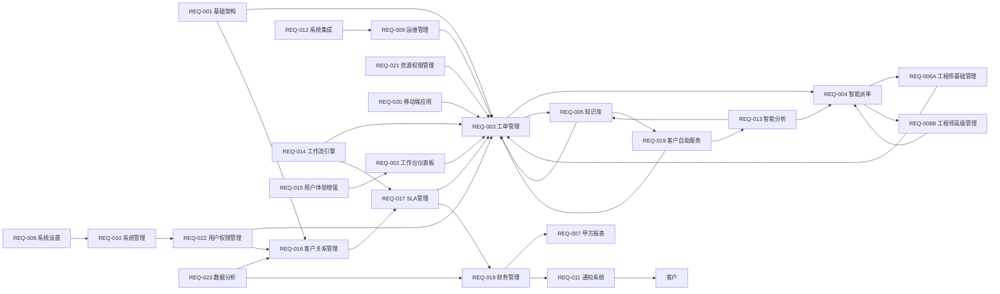
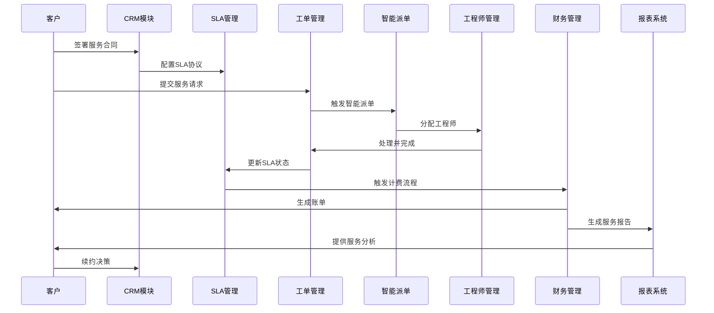
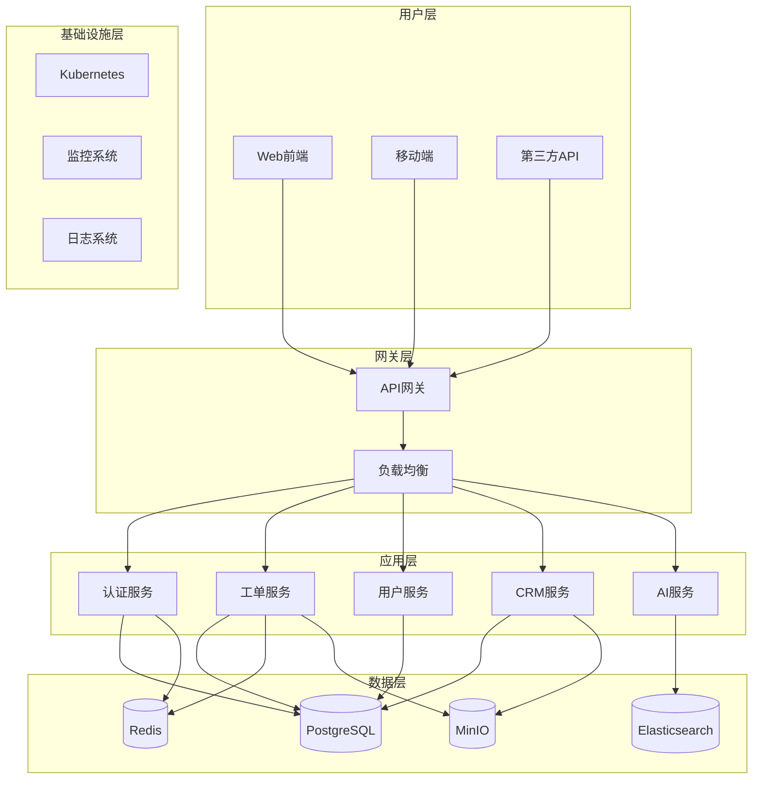

# 附录E：架构图表与业务价值分析

## E.1 系统架构概览

本附录包含IT运维门户系统的核心架构图表，展示模块间依赖关系、业务流程闭环以及关键性能指标。

## E.2 模块依赖关系图

以下是系统各模块间的核心依赖关系图，展示了业务流程的完整闭环：

## E.3 商业化闭环流程

系统的核心商业化闭环如下：

## E.4 技术架构图

### 系统分层架构

## E.5 KPI及业务价值分析

### E.5.1 核心KPI指标

#### 效率指标
| KPI名称 | 计算公式 | 目标值 | 数据来源 | 采集频率 |
|---------|----------|--------|----------|----------|
| 工单处理效率提升 | (原处理时间-现处理时间)/原处理时间×100% | ≥40% | 工单系统 | 月度 |
| 派单成功率 | 成功派单数/总派单数×100% | ≥98% | 派单系统 | 实时 |
| 知识复用率 | 使用已有知识解决的工单数/总工单数×100% | ≥72% | 知识库系统 | 周度 |

#### 质量指标
| KPI名称 | 计算公式 | 目标值 | 数据来源 | 采集频率 |
|---------|----------|--------|----------|----------|
| 客户满意度 | 满意客户数/总调研客户数×100% | ≥90% | 客户调研 | 季度 |
| SLA达成率 | 达成SLA的服务数/总服务数×100% | ≥96% | SLA监控 | 实时 |
| 系统可用性 | (总时间-不可用时间)/总时间×100% | ≥99.5% | 系统监控 | 月度 |

#### 财务指标
| KPI名称 | 计算公式 | 目标值 | 数据来源 | 采集频率 |
|---------|----------|--------|----------|----------|
| 客户续约率 | 续约客户数/到期客户数×100% | ≥95% | CRM系统 | 月度 |
| 计费准确率 | 准确计费数/总计费数×100% | ≥99.5% | 财务系统 | 月度 |
| 成本控制率 | 实际成本/预算成本×100% | ≤100% | 财务系统 | 月度 |

#### 客户经济模型指标
| KPI名称 | 计算公式 | 目标值 | 数据来源 | 采集频率 |
|---------|----------|--------|----------|----------|
| 客户获取成本(CAC) | 总获客成本/新增客户数 | ≤5000元/客户 | CRM系统+财务系统 | 月度 |
| 客户生命周期价值(LTV) | 月均收入×毛利率×平均生命周期(月) | ≥20000元/客户 | CRM系统+财务系统 | 月度 |
| LTV/CAC比率 | 客户生命周期价值/客户获取成本 | ≥4:1 | CRM系统+财务系统 | 月度 |
| 客户投资回收期 | 客户获取成本/月均毛利 | ≤12个月 | CRM系统+财务系统 | 月度 |
| 月度经常性收入(MRR) | 当月所有订阅客户的月费总和 | 持续增长≥20% | 财务系统 | 月度 |
| 年度经常性收入(ARR) | MRR×12 | ≥5000万元 | 财务系统 | 年度 |

### E.5.2 计算模型说明

#### 客户获取成本(CAC)计算模型
- **公式**：总获客成本 ÷ 新增客户数
- **数据来源**：CRM系统 + 财务系统
- **计算周期**：月度统计，季度分析

#### 客户生命周期价值(LTV)计算模型
- **公式**：月均收入 × 毛利率 × 平均生命周期(月)
- **数据来源**：CRM系统 + 财务系统
- **关键因子**：续约率、价格增长率、服务成本

#### LTV/CAC比率分析模型
- **行业基准**：SaaS行业标准为3:1以上
- **目标设定**：4:1以上为优秀水平
- **监控频率**：月度跟踪，季度深度分析

## E.6 投资回报率分析与商业价值路径

### E.6.1 ROI 概览
- P0模块：投资27.75万元，年收益1660万元，ROI 5900%+
- P1模块：投资38.25万元，年收益3000万元，ROI 7800%+
- P2模块：投资27.5万元，年收益750万元，ROI 2600%+
- 总计：投资93.5万元，年收益5410万元，总ROI 5700%+

### E.6.2 分阶段商业价值
- 短期价值（3-6个月）：基础功能上线，运维效率提升40%，月收入50万
- 中期价值（6-12个月）：CRM→SLA→财务闭环建立，续约率95%，月收入200万
- 长期价值（12-24个月）：AI成熟、生态合作，年收入突破5000万

## E.7 架构设计说明

### E.7.1 模块依赖关系说明
- **基础支撑层**：REQ-001基础架构和REQ-022用户权限管理为所有模块提供基础服务
- **核心业务层**：以工单管理为中心，形成完整的服务交付闭环
- **智能化层**：AI功能模块为业务决策提供智能支持
- **商业化层**：CRM、SLA、财务模块构成完整的商业运营体系

### E.7.2 技术架构特点
- **微服务架构**：服务间松耦合，支持独立部署和扩展
- **多租户支持**：数据隔离，支持SaaS模式运营
- **云原生设计**：基于Kubernetes，支持弹性伸缩
- **API优先**：统一的API网关，支持多端接入

### E.7.3 性能与扩展性
- **并发处理**：支持1000+并发用户
- **数据存储**：支持TB级数据存储和查询
- **响应时间**：API响应时间<200ms
- **可用性**：系统可用性≥99.5%

参考：详细技术选型见附录C《技术栈与架构选型》
