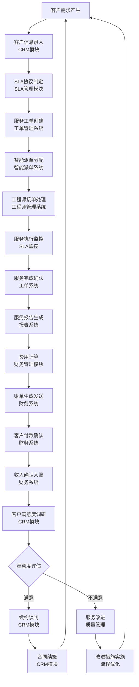
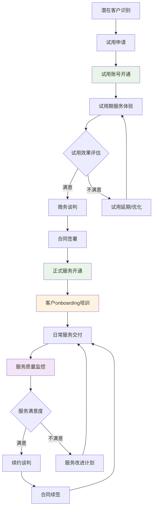
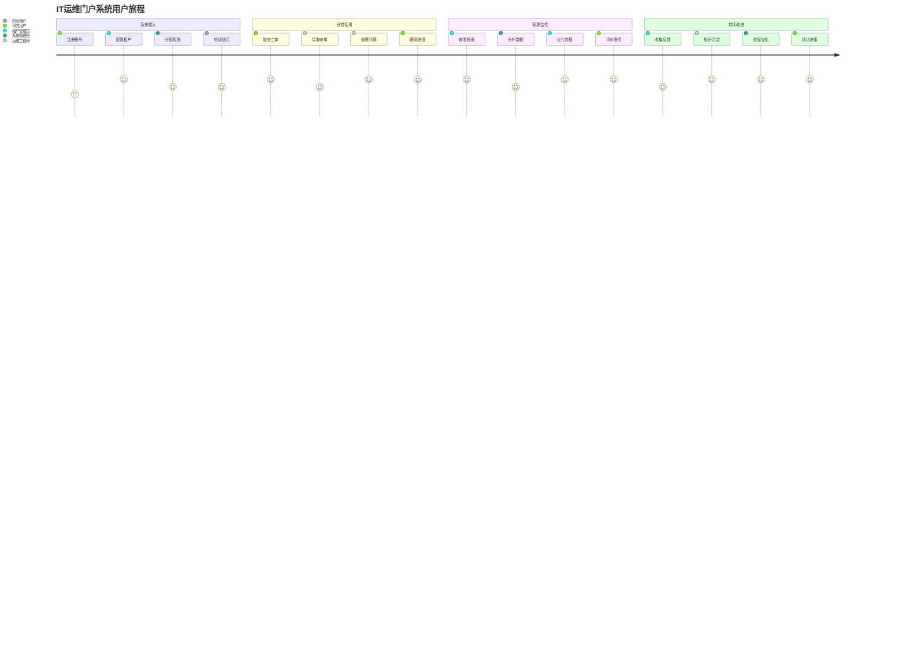
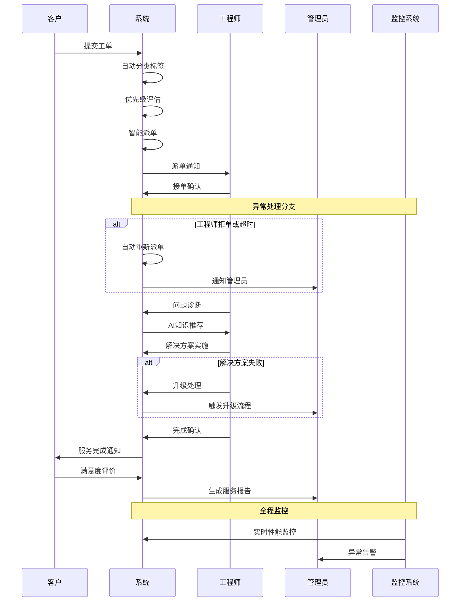
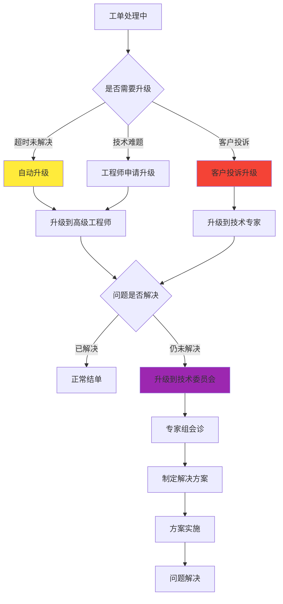
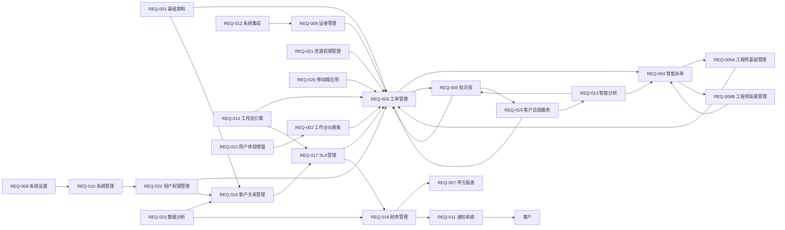
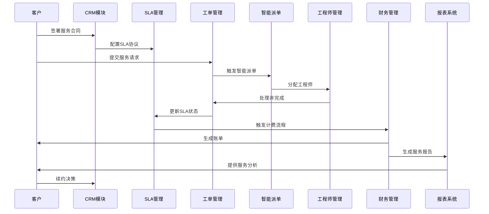
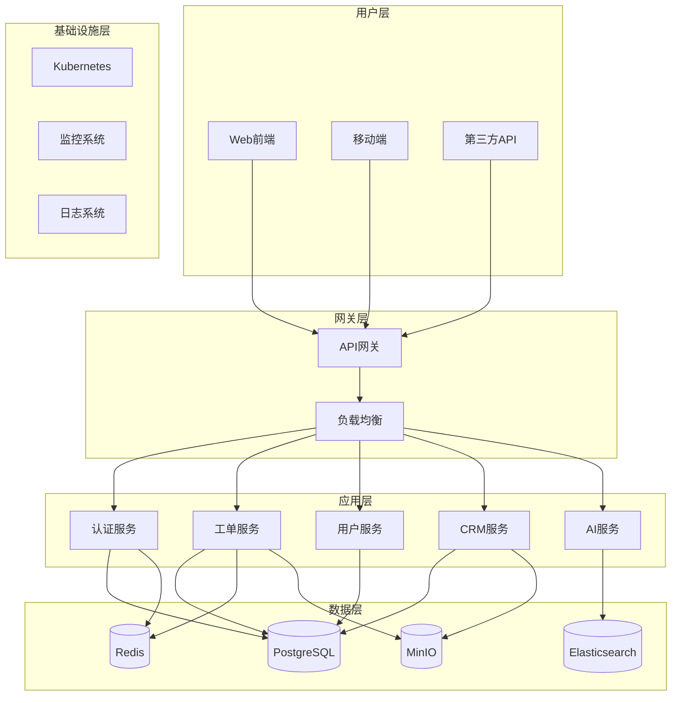

### 来自: 01-document-overview.md
# IT运维门户系统产品需求文档（PRD）v4.5

## 1. 文档说明

### 文档信息
- **文档版本**：v4.5 Verified
- **创建日期**：2025年1月1日
- **最后更新**：2025年8月12日
- **文档类型**：产品需求文档（PRD）
- **适用范围**：IT运维门户系统完整产品设计
- **维护团队**：IT运维门户系统产品团队
- **审查团队**：质量审查团队
- **目标读者**：产品经理、研发团队、测试团队、运维团队、业务决策者

### v4.5版本特点
本版本基于v4.4和v4.2的全面整合，形成最完整的产品需求文档：

**核心特色：**
- **完整模块覆盖**：融合v4.4的深度细化和v4.2的全面覆盖，包含P0、P1、P2全部23个模块
- **人类可读增强**：保持v4.4版本的高可读性、详细业务流程说明和跨章节一致性
- **商业化导向**：突出CRM→SLA→财务管理的完整商业化链路
- **技术实施就绪**：每个模块都包含完整的13个标准小节，可直接用于开发实施

**补充:** v4.5版本是v4.4人类可读增强版与v4.2模块全覆盖版的完美融合，既保持了v4.4的业务深度和可理解性，又确保了v4.2的模块完整性和系统性。所有来自v4.2的新增或恢复内容均用"补充:"标记，便于识别和追溯。

#### 主要整合内容
1. **模块完整性**：确保23个模块（REQ-001至REQ-023）全部包含
2. **内容深度统一**：所有模块都达到v4.4 P0模块的详细程度
3. **结构标准化**：每个模块都包含完整的13个标准小节
4. **业务流程完善**：保持v4.4的详细流程说明和异常处理策略
5. **技术规范统一**：API设计、数据模型、安全要求等保持一致性


**补充:** 强化可执行性：明确的开发里程碑与验收标准，已在各模块统一落地，支撑研发与验收闭环。


**补充:** 整体产品逻辑：构建完整的业务闭环与产品架构，在业务逻辑架构与业务流程章节中统一承载与串联。
**补充:** 模块化设计：保持清晰的模块边界与依赖关系，所有跨模块依赖在模块说明与附录映射表中可追溯。

### 术语表与缩略语解释

**补充:** 为确保跨章节术语使用的一致性，特别新增本术语表。

| 术语/缩略语 | 全称 | 定义 | 使用场景 |
|------------|------|------|----------|
| SLA | Service Level Agreement | 服务等级协议，定义服务质量标准 | 工单处理、客户管理 |
| RBAC | Role-Based Access Control | 基于角色的访问控制 | 权限管理、安全控制 |
| ABAC | Attribute-Based Access Control | 基于属性的访问控制 | 高级权限控制 |
| MFA | Multi-Factor Authentication | 多因子认证 | 用户登录、安全验证 |
| SSO | Single Sign-On | 单点登录 | 企业集成、用户体验 |
| MTTR | Mean Time To Recovery | 平均故障恢复时间 | 系统可用性指标 |
| MTBF | Mean Time Between Failures | 平均故障间隔时间 | 系统稳定性指标 |
| RTO | Recovery Time Objective | 恢复时间目标 | 灾备策略 |
| RPO | Recovery Point Objective | 恢复点目标 | 数据备份策略 |
| GDPR | General Data Protection Regulation | 通用数据保护条例 | 数据合规 |
| PIPL | Personal Information Protection Law | 个人信息保护法 | 数据合规 |
| CAC | Customer Acquisition Cost | 客户获取成本 | 商业指标 |
| LTV | Lifetime Value | 客户生命周期价值 | 商业指标 |
| NPS | Net Promoter Score | 净推荐值 | 客户满意度指标 |
| ARPU | Average Revenue Per User | 用户平均收入 | 收入指标 |
| MRR | Monthly Recurring Revenue | 月度经常性收入 | 收入指标 |

### 文档结构说明

本文档采用模块化结构设计，主要包含以下部分：

#### 1. 全局章节（globals/）
- **文档概览**：文档说明、版本信息、术语表
- **项目概览**：项目背景、目标、范围
- **业务逻辑架构**：整体架构设计和技术选型
- **业务流程**：核心业务流程和跨模块协作

#### 2. 功能模块（modules/）
- **REQ-001 ~ REQ-023**：23个功能模块的详细需求
- 每个模块包含13个标准小节：功能概述、业务价值、功能需求等

#### 3. 附录文档（appendix/）
- **附录A**：术语表与参考文档
- **附录B**：开发优先级与实施计划
- **附录C**：技术栈与架构选型
- **附录D**：模块映射与依赖关系
- **附录E**：架构图表与业务价值分析
- **附录F**：部署指南与运维手册
- **附录G**：版本历史与文档维护

### 阅读指南

#### 不同角色的阅读建议
| 角色 | 重点章节 | 阅读目的 |
|------|----------|----------|
| **产品经理** | 全局章节 + 所有模块 | 全面了解产品需求和业务逻辑 |
| **技术负责人** | 业务逻辑架构 + 附录C/E/F | 技术架构设计和实施指导 |
| **开发工程师** | 具体模块 + 附录C/D | 功能开发和技术实现 |
| **测试工程师** | 具体模块 + 验收标准 | 测试用例设计和质量保证 |
| **运维工程师** | 附录F + 系统管理模块 | 部署运维和系统监控 |
| **业务决策者** | 项目概览 + 附录E | 商业价值和投资回报 |

#### 术语一致性说明
本文档中的术语定义以**附录A《术语表与参考文档》**为准。如发现术语使用不一致，请以附录A为标准。


### 来自: 02-project-overview.md
## 2. 项目概述

### 2.1 背景与机遇

#### 市场背景分析
随着数字化转型的深入推进，企业对IT运维服务的需求呈现爆发式增长。当前市场面临的核心挑战包括：

**补充:** 基于市场调研数据，当前IT运维市场存在明显的供需不匹配问题。

- **服务分散化痛点**：企业平均使用15-20个不同的运维工具，缺乏统一管理平台，导致信息孤岛和效率低下
- **响应效率低下**：传统人工派单模式下，平均响应时间超过2小时，远超客户期望的30分钟内响应
- **知识管理缺失**：运维经验难以沉淀和复用，新员工培训周期长达3-6个月
- **成本控制困难**：缺乏精确的成本核算体系，运维成本占IT预算的40-60%，远高于行业最佳实践的25-30%
- **客户体验不佳**：服务透明度低，客户满意度普遍低于70%，影响续约率

#### 商业机遇评估
- **市场规模巨大**：中国IT运维服务市场规模超过1000亿元，年增长率15%+，预计2027年将达到1800亿元
- **政策环境有利**：数字化转型政策推动，政府采购需求旺盛，"新基建"投资为运维服务提供增长动力
- **技术条件成熟**：AI、云计算、大数据等技术为智能运维提供坚实技术基础
- **客户需求明确**：企业对统一运维平台需求强烈，付费意愿高，愿意为效率提升支付溢价

**补充:** 根据IDC报告，85%的企业计划在未来2年内投资统一运维平台，平均预算增长30%以上。

### 2.2 核心目标

#### 产品愿景
成为中国领先的智能化IT运维服务平台，通过"一套系统服务多个客户"的SaaS模式，为企业提供高效、智能、可靠的运维管理解决方案，实现"让运维更简单，让服务更智能"的使命。

**补充:** 我们的愿景是在3年内服务1000+企业客户，成为IT运维服务领域的标杆产品。

#### 核心目标体系
- **统一入口目标**：整合分散的运维工具，提供一站式访问体验，减少工具切换成本80%以上
- **智能运维目标**：基于AI的智能派单、故障预测和知识推荐，提升运维效率40%以上
- **多租户服务目标**：支持一个运维团队服务多个客户单位的业务模式，实现规模化运营
- **效率提升目标**：自动化工单流转，优化知识共享，减少人工干预60%以上
- **数据互联目标**：通过统一认证和数据存储，打通各系统数据壁垒，实现数据驱动决策

### 2.3 商业模式

#### "三快一低"价值承诺
**补充:** 这是我们对客户的核心价值承诺，也是产品设计的指导原则。

- **发现快**：秒级故障发现（监控系统响应时间<3秒）
  - 实现方式：实时监控 + 智能告警 + 自动化检测
  - 客户价值：减少故障影响时间，降低业务损失
- **定位快**：分钟级故障定位（平均故障定位时间<5分钟）
  - 实现方式：AI辅助诊断 + 知识库匹配 + 专家经验
  - 客户价值：快速找到问题根因，避免盲目排查
- **解决快**：小时级故障解决（平均解决时间<2小时）
  - 实现方式：智能派单 + 标准化流程 + 远程协作
  - 客户价值：最小化业务中断时间，保障业务连续性
- **成本低**：运维成本降低50%以上（通过自动化和智能派单）
  - 实现方式：自动化运维 + 资源优化 + 效率提升
  - 客户价值：显著降低运维投入，提高ROI

#### 收费模式设计
**补充:** 基于SaaS订阅模式，提供灵活的套餐选择以满足不同规模客户需求。

- **基础版**：3000元/月/租户（≤50用户，基础功能）
  - 包含：工单管理、基础派单、简单报表
  - 适用：小型企业、初创公司
- **专业版**：6000元/月/租户（≤200用户，含智能派单）
  - 包含：基础版 + 智能派单 + 知识库 + SLA管理
  - 适用：中型企业、成长型公司
- **企业版**：8000元/月/租户（无限用户，含AI分析）
  - 包含：专业版 + AI分析 + 高级报表 + API集成
  - 适用：大型企业、集团公司
- **增值服务**：按需收费
  - 工单处理费：5元/工单（超出套餐包含量）
  - SLA保障服务费：基础费用的20-50%
  - 定制开发：按工时收费

### 2.4 目标客户

#### 主要客户群体分析
**补充:** 基于市场调研和竞品分析，我们识别出三个核心客户群体。

- **政府部门**：需要合规性强、安全性高的运维管理平台
  - 特点：预算充足，决策周期长，重视合规和安全
  - 需求：等保合规、审计追溯、多级权限管理
- **中小企业**：需要成本可控、易于使用的运维解决方案
  - 特点：成本敏感，快速决策，重视性价比
  - 需求：快速部署、简单易用、成本透明
- **连锁店IT部门**：需要标准化、可复制的运维管理模式
  - 特点：标准化需求强，分布式管理，重视效率
  - 需求：统一管理、标准流程、远程支持

#### 客户画像详细分析

**补充:** 基于客户访谈和数据分析，提供更详细的客户画像。

| 客户类型 | 规模特征 | 核心需求 | 付费能力 | ROI预期 | 决策周期 | 关键决策因素 |
|---------|---------|----------|----------|---------|----------|-------------|
| 政府部门 | 100-500人 | 合规性、安全性 | 高 | 160% | 6-12个月 | 合规认证、安全等级 |
| 中小企业 | 50-200人 | 成本控制、效率 | 中 | 250% | 1-3个月 | 性价比、实施周期 |
| 连锁店 | 20-100人 | 标准化、易用性 | 中 | 150% | 2-6个月 | 标准化程度、管理便利性 |

**补充:** 每个客户群体都有明确的成功指标和服务策略，确保产品功能设计能够精准满足需求。

### 2.5 项目范围与边界

#### 项目范围定义
**包含范围：**
- IT运维服务全流程管理（工单、派单、处理、验收）
- 多租户SaaS平台架构和基础设施
- 智能化功能（AI派单、故障预测、知识推荐）
- 客户关系管理和财务管理功能
- 移动端应用和第三方系统集成
- 完整的用户权限和安全管理体系

**不包含范围：**
- 具体的运维工具开发（如监控软件、备份工具等）
- 客户现有系统的数据迁移服务
- 硬件设备的采购和维护
- 客户现场的运维人员培训服务
- 第三方软件的许可证费用

#### 技术边界
- **前端技术**：仅支持现代浏览器（Chrome 90+, Firefox 88+, Safari 14+）
- **移动端**：支持iOS 13+和Android 8+
- **集成范围**：提供标准API，不负责第三方系统的适配开发
- **数据范围**：仅处理运维相关数据，不涉及客户业务数据

### 2.6 成功指标与验收标准

#### 业务成功指标
| 指标类别 | 具体指标 | 目标值 | 测量方法 | 达成时间 |
|----------|----------|--------|----------|----------|
| **用户增长** | 注册租户数 | 100+ | 系统统计 | 6个月 |
| **用户活跃** | 月活跃用户数 | 80%+ | 用户行为分析 | 3个月 |
| **收入指标** | 月度经常性收入 | 50万+ | 财务系统 | 12个月 |
| **客户满意** | 客户满意度 | 90%+ | 客户调研 | 6个月 |
| **运营效率** | 工单处理效率提升 | 40%+ | 系统对比分析 | 3个月 |

#### 技术成功指标
| 指标类别 | 具体指标 | 目标值 | 测量方法 | 达成时间 |
|----------|----------|--------|----------|----------|
| **系统性能** | API响应时间 | <200ms | 性能监控 | 上线时 |
| **系统稳定** | 系统可用性 | 99.5%+ | 监控系统 | 持续 |
| **安全性** | 安全漏洞数 | 0个高危 | 安全扫描 | 持续 |
| **扩展性** | 并发用户数 | 1000+ | 压力测试 | 上线前 |

### 2.7 风险评估与应对策略

#### 主要风险识别
| 风险类别 | 风险描述 | 影响程度 | 发生概率 | 应对策略 |
|----------|----------|----------|----------|----------|
| **技术风险** | AI算法效果不达预期 | 高 | 中 | 分阶段验证，准备备选方案 |
| **市场风险** | 竞争对手推出类似产品 | 中 | 高 | 加快开发进度，强化差异化 |
| **资源风险** | 关键技术人员流失 | 高 | 低 | 知识文档化，团队备份 |
| **合规风险** | 数据安全法规变化 | 中 | 中 | 持续关注法规，预留合规空间 |
| **客户风险** | 客户需求变化过快 | 中 | 中 | 敏捷开发，快速响应 |

#### 风险应对措施
- **技术风险缓解**：建立技术评审机制，定期进行技术可行性验证
- **市场风险应对**：持续市场调研，建立快速响应机制
- **资源风险管控**：建立人才梯队，完善知识管理体系
- **合规风险防范**：建立合规检查机制，定期进行安全审计

参考：详细的技术架构和实施计划见后续章节和附录文档。


### 来自: 03-business-logic-architecture.md
## 3. 全局业务逻辑与产品架构图

### 3.1 核心业务闭环（增强版）

**补充:** 核心业务闭环总览图（覆盖 v4.2 的业务闭环）：




#### 3.1.1 完整客户生命周期管理流程

**补充:** 客户生命周期管理是SaaS业务的核心，直接影响客户获取成本（CAC）和客户生命周期价值（LTV）。以下流程图展示了从潜在客户到忠诚客户的完整转化路径。



#### 客户生命周期管理流程文字版说明

**补充:** 为确保业务流程的可理解性，提供详细的分步说明，明确每个节点的业务含义、输入输出和触发条件。

**阶段1：潜在客户获取（1-7天）**
- **潜在客户识别**：通过市场营销、推荐、展会等渠道识别潜在客户
  - 输入：客户联系信息、需求描述
  - 输出：客户档案、需求评估
  - 触发条件：客户主动咨询或被动触达
- **试用申请**：客户提交试用申请，填写基本信息
  - 输入：公司信息、联系人、预期用户数
  - 输出：试用申请记录
  - 业务规则：自动审核通过，特殊情况人工审核

**阶段2：试用期管理（7-30天）**
- **试用账号开通**：系统自动创建试用租户，配置基础功能
  - 输入：试用申请信息
  - 输出：试用账号、登录凭证
  - 业务规则：限制功能和数据量，设置试用期限
- **试用期服务体验**：客户使用产品，客户成功经理跟进
  - 输入：客户使用行为数据
  - 输出：使用报告、问题反馈
  - 关键指标：登录频率、功能使用率、问题数量
- **试用效果评估**：基于使用数据和客户反馈评估试用效果
  - 输入：使用统计、客户反馈、满意度调研
  - 输出：评估报告、转化概率
  - 决策标准：使用频率>50%、满意度>80%为满意

**阶段3：商务转化（7-30天）**
- **商务谈判**：基于试用效果制定个性化方案和报价
  - 输入：客户需求、预算范围、决策时间
  - 输出：商务方案、合同草案
  - 关键因素：功能匹配度、价格竞争力、服务保障
- **合同签署**：确认合同条款，完成法务审核和签署
  - 输入：最终方案、合同条款
  - 输出：正式合同、付款计划
  - 业务规则：合同生效后启动正式服务开通流程

**阶段4：服务交付（持续）**
- **正式服务开通**：部署生产环境，迁移试用数据
  - 输入：合同信息、技术需求
  - 输出：生产环境、用户账号
  - SLA要求：开通时间≤3个工作日
- **客户onboarding培训**：提供系统培训和最佳实践指导
  - 输入：用户角色、培训需求
  - 输出：培训计划、认证证书
  - 成功标准：用户培训完成率≥90%
- **日常服务交付**：提供持续的运维服务和技术支持
  - 输入：客户需求、服务请求
  - 输出：服务结果、满意度评价
  - 质量标准：SLA达成率≥95%

**阶段5：客户成功管理（持续）**
- **服务质量监控**：实时监控服务质量和客户健康度
  - 输入：系统监控数据、客户反馈
  - 输出：健康度评分、风险预警
  - 监控指标：使用频率、满意度、问题数量、续约概率
- **服务改进计划**：针对不满意客户制定改进计划
  - 输入：问题分析、改进需求
  - 输出：改进方案、实施计划
  - 执行标准：问题响应时间≤24小时
- **续约谈判**：提前3个月启动续约谈判
  - 输入：服务表现、客户满意度、市场变化
  - 输出：续约方案、新合同
  - 目标：续约率≥95%，续约金额增长≥20%

#### 3.1.2 客户onboarding详细流程

**补充:** 客户onboarding是决定客户成功的关键环节，直接影响客户满意度和续约率。

**第一周：环境准备**
1. **技术环境搭建**
   - 生产环境部署和配置
   - 数据迁移和系统集成
   - 安全配置和权限设置
   - 系统功能全面测试验收

2. **用户账号管理**
   - 批量创建用户账号
   - 角色权限分配
   - 初始密码设置和通知
   - 登录测试和问题解决

**第二周：培训实施**
1. **管理员培训**
   - 系统管理功能培训
   - 用户权限管理培训
   - 报表配置和使用培训
   - 故障处理和应急预案培训

2. **最终用户培训**
   - 基础功能使用培训
   - 工单处理流程培训
   - 移动端使用培训
   - 常见问题和解决方案培训

**第三周：试运行**
1. **小范围试运行**
   - 选择核心用户进行试运行
   - 收集使用反馈和问题
   - 优化配置和流程
   - 解决发现的问题

2. **全面上线准备**
   - 制定上线计划和时间表
   - 准备应急预案和回滚方案
   - 通知所有用户上线安排
   - 确认技术支持和服务保障

**第四周：正式上线**
1. **系统切换**
   - 按计划执行系统切换
   - 实时监控系统运行状态
   - 快速响应和解决问题
   - 确保业务连续性

2. **上线后支持**
   - 7×24小时技术支持
   - 用户问题快速响应
   - 系统性能监控和优化
   - 定期回访和满意度调研

### 3.2 产品架构图（保持原有架构）

**补充:** 产品架构采用分层设计，确保系统的可扩展性、可维护性和高可用性。以下架构图展示了用户层、应用层、数据层和集成层的完整结构。

```mermaid
graph TB
    subgraph "用户层"
        U1[系统管理员]
        U2[租户管理员]
        U3[运维工程师]
        U4[甲方用户]
        U5[客户]
    end

    subgraph "应用层"
        subgraph "P0核心模块"
            A1[基础架构与认证]
            A2[工作台与仪表板]
            A3[工单管理系统]
            A4[智能派单系统]
            A5[系统管理模块]
            A6[工程师基础管理]
        end

        subgraph "P1重要模块"
            B1[知识库管理]
            B2[工程师高级管理]
            B3[甲方管理与报表]
            B4[通知与消息]
            B5[系统集成]
            B6[客户关系管理]
            B7[SLA管理]
            B8[财务管理]
        end

        subgraph "P2扩展模块"
            C1[系统设置]
            C2[运维管理]
            C3[智能分析与AI]
            C4[工作流引擎]
            C5[用户体验增强]
            C6[客户自助服务]
        end
    end

    subgraph "数据层"
        D1[PostgreSQL主库]
        D2[Redis缓存]
        D3[Elasticsearch搜索]
        D4[MinIO文件存储]
    end

    subgraph "集成层"
        I1[Netbox资产管理]
        I2[夜莺监控系统]
        I3[Orion-Ops运维平台]
        I4[第三方系统API]
    end

    U1 --> A1
    U2 --> A2
    U3 --> A3
    U4 --> B3
    U5 --> C6

    A1 --> D1
    A3 --> D2
    B1 --> D3
    B3 --> D4

    B5 --> I1
    B5 --> I2
    B5 --> I3
    B5 --> I4
```




### 3.3 用户与角色画像（来自 v4.2）

#### 系统管理员
- 职责：整个系统的配置和管理，拥有跨租户的最高权限
- 核心需求：系统稳定性、安全性、可扩展性
- 使用场景：用户管理、权限配置、系统监控、故障处理
- 成功指标：系统可用性≥99.5%，安全事故=0

#### 租户管理员
- 职责：管理特定租户的用户和权限，权限限制在租户范围内
- 核心需求：团队管理、服务质量监控、成本控制
- 使用场景：团队配置、SLA管理、报表查看、客户沟通
- 成功指标：团队效率提升≥30%，客户满意度≥90%

#### 运维工程师
- 职责：执行日常运维任务，需要相应的功能权限和数据访问权限
- 核心需求：工单处理效率、知识获取便利性、工作负载合理性
- 使用场景：工单处理、知识查询、状态更新、经验分享
- 成功指标：工单处理效率提升≥40%，知识复用率≥70%

#### 甲方用户
- 职责：查看运维报告和状态，权限相对受限，只能访问自己的数据
- 核心需求：服务透明度、问题跟踪、服务质量评价
- 使用场景：工单提交、进度查询、报告查看、满意度评价
- 成功指标：服务满意度≥90%，问题解决时效性≥95%

### 3.4 用户旅程图（来自 v4.2）



### 3.5 多租户隔离规则（来自 v4.2）

#### 数据隔离规则
- 强制隔离：所有业务数据表必须包含 tenant_id 字段
- 访问控制：用户只能访问所属租户的数据
- API隔离：所有API请求必须验证租户权限
- 存储隔离：文件存储按租户分目录管理

#### 权限隔离规则
- 角色隔离：角色权限限制在租户范围内
- 功能隔离：租户只能使用已购买的功能模块
- 配置隔离：系统配置按租户独立管理

#### 安全隔离规则
- 网络隔离：租户间网络访问完全隔离
- 日志隔离：操作日志按租户分别记录和存储
- 备份隔离：数据备份按租户独立管理
- 监控隔离：系统监控数据按租户分别统计

### 3.6 产品架构层次说明

**补充:** 为确保架构的可理解性，提供各层次的详细说明和设计原则。

**用户层设计原则**
- **角色分离**：不同用户角色有明确的权限边界和功能范围
- **体验一致**：所有用户角色都享有一致的界面风格和交互体验
- **权限最小化**：每个角色只能访问完成工作所需的最小权限

**应用层设计原则**
- **模块化设计**：按业务领域划分模块，降低耦合度
- **优先级分层**：P0核心模块保证基本功能，P1/P2模块提供增值服务
- **服务化架构**：每个模块都可以独立部署和扩展

**数据层设计原则**
- **数据分离**：不同类型数据使用最适合的存储方案
- **高可用性**：所有数据存储都有备份和容灾方案
- **性能优化**：通过缓存和索引优化数据访问性能

**集成层设计原则**
- **标准化接口**：使用标准协议和格式进行系统集成
- **松耦合设计**：外部系统故障不影响核心功能
- **可扩展性**：支持新的第三方系统快速接入

### 3.7 架构设计总结

#### 核心设计理念
本系统架构基于以下核心理念设计：

1. **业务驱动**：架构设计紧密围绕业务闭环，确保技术服务于业务目标
2. **用户中心**：以用户体验为中心，提供简洁高效的操作界面
3. **数据驱动**：通过数据分析驱动业务决策和系统优化
4. **安全第一**：在架构设计的每个层面都考虑安全性要求

#### 关键技术决策
- **微服务架构**：支持模块独立开发和部署，提高系统灵活性
- **多租户设计**：实现SaaS模式运营，降低运营成本
- **云原生技术**：基于容器和Kubernetes，支持弹性扩展
- **API优先**：统一的API设计，支持多端接入和第三方集成

#### 质量属性保证
| 质量属性 | 设计策略 | 目标指标 |
|----------|----------|----------|
| **可用性** | 高可用架构、故障转移 | 99.5%+ |
| **性能** | 缓存策略、数据库优化 | API响应<200ms |
| **安全性** | 多层安全防护、权限控制 | 0个高危漏洞 |
| **可扩展性** | 微服务架构、水平扩展 | 支持1000+并发 |
| **可维护性** | 模块化设计、标准化接口 | 新功能开发周期<2周 |

参考：详细的技术实现方案见附录C《技术栈与架构选型》和附录E《架构图表与业务价值分析》。


### 来自: 04-business-processes.md
## 4. 业务流程

### 4.1 核心业务流程示意

#### 工单处理流程（增强版）

**补充:** 工单处理是IT运维服务的核心业务流程，涉及客户、系统、工程师、管理员等多个角色的协作。以下流程图展示了从工单创建到关闭的完整生命周期。



#### 工单处理流程文字版详细说明

**补充:** 为确保流程的可操作性，提供每个步骤的详细说明，包括输入输出、业务规则、异常处理和质量标准。

**第一阶段：工单创建与分类（1-3分钟）**

1. **客户提交工单**
   - 输入：问题描述、紧急程度、联系方式、附件
   - 系统处理：自动生成工单编号、记录提交时间、发送确认通知
   - 业务规则：必填字段校验、附件大小限制（≤100MB）、重复工单检测
   - 输出：工单记录、确认通知、工单编号

2. **系统自动分类标签**
   - 输入：工单标题、描述内容、历史数据
   - 处理逻辑：基于NLP算法分析文本内容，匹配预定义分类规则
   - 分类维度：问题类型（硬件/软件/网络）、技术领域（服务器/数据库/应用）、复杂度（简单/中等/复杂）
   - 输出：分类标签、置信度评分
   - 质量标准：分类准确率≥85%

3. **优先级自动评估**
   - 输入：客户等级、问题类型、影响范围、紧急程度
   - 评估算法：客户等级权重40% + 问题严重性30% + 影响范围20% + 时间因素10%
   - 优先级定义：
     - 紧急（P1）：核心业务中断，影响>100用户
     - 高（P2）：重要功能异常，影响50-100用户
     - 中（P3）：一般问题，影响10-50用户
     - 低（P4）：优化建议，影响<10用户
   - 输出：优先级等级、SLA时间要求

**第二阶段：智能派单与接单（3-15分钟）**

4. **智能派单执行**
   - 输入：工单信息、工程师状态、技能匹配度、地理位置
   - 派单算法：技能匹配40% + 工作负载25% + 地理位置20% + 历史绩效15%
   - 候选筛选：技能匹配度≥80%、当前工单数≤5个、在线状态
   - 输出：最优工程师、备选工程师列表、派单原因
   - 时间要求：派单决策时间≤3分钟

5. **工程师接单确认**
   - 通知方式：系统通知 + 短信 + 邮件（多渠道保障）
   - 响应时间：紧急15分钟、高30分钟、中2小时、低4小时
   - 接单操作：确认接单、预估处理时间、申请资源支持
   - 异常处理：超时未响应自动重新派单、拒单需说明原因
   - 输出：接单确认、预估完成时间

**第三阶段：问题诊断与解决（30分钟-8小时）**

6. **问题诊断分析**
   - 诊断方法：远程连接、日志分析、性能监控、用户访谈
   - 系统支持：提供相关监控数据、历史问题记录、知识库文档
   - 诊断记录：问题现象、可能原因、排查步骤、诊断结论
   - 时间要求：初步诊断时间≤30分钟
   - 输出：问题诊断报告、解决方案建议

7. **AI知识推荐**
   - 推荐依据：问题关键词、历史解决方案、相似案例
   - 推荐内容：解决步骤、参考文档、专家联系方式、风险提示
   - 推荐质量：相关性≥80%、有效性≥70%
   - 反馈机制：工程师可对推荐内容评价，持续优化算法
   - 输出：推荐方案列表、相关度评分

8. **解决方案实施**
   - 实施前准备：方案评估、风险分析、备份计划、回滚方案
   - 实施过程：按步骤执行、实时记录、异常处理、进度更新
   - 客户沟通：重要操作前确认、进度定期通报、完成后验证
   - 质量控制：操作规范性、安全性、有效性验证
   - 输出：实施记录、结果验证、客户确认

**第四阶段：验收与评价（15-60分钟）**

9. **服务完成确认**
   - 工程师确认：问题已解决、系统运行正常、客户可以验收
   - 系统检查：自动验证相关监控指标、性能数据、错误日志
   - 文档更新：解决方案记录、知识库更新、经验总结
   - 输出：完成报告、解决方案文档

10. **客户满意度评价**
    - 评价维度：响应及时性、问题解决效果、服务态度、专业水平
    - 评价方式：在线评分（1-5分）+ 文字反馈
    - 评价时限：服务完成后24小时内
    - 处理机制：低分评价（≤3分）自动触发客户关怀流程
    - 输出：满意度评分、改进建议

**第五阶段：报告与分析（自动生成）**

11. **服务报告生成**
    - 报告内容：工单基本信息、处理过程、解决方案、时间统计、满意度评价
    - 生成时机：工单关闭后自动生成
    - 分发对象：客户、工程师、管理员、相关干系人
    - 存档管理：报告永久保存，支持历史查询和统计分析
    - 输出：标准化服务报告、统计数据

### 4.2 异常处理流程

#### 系统异常处理
**系统故障处理流程：**
1. **故障检测**：监控系统自动检测异常
2. **故障分类**：按影响范围和严重程度分类
3. **应急响应**：启动应急预案，通知相关人员
4. **故障修复**：技术团队快速定位和修复问题
5. **服务恢复**：验证系统功能，恢复正常服务
6. **事后分析**：分析故障原因，制定预防措施

#### 业务异常处理
**工单处理异常：**
- **超时处理**：自动升级或重新派单
- **拒单处理**：记录原因，重新匹配工程师
- **质量问题**：客户投诉处理，服务补偿

**数据异常处理：**
- **数据丢失**：从备份恢复，记录事故
- **数据错误**：数据校验，人工修正
- **同步异常**：重新同步，保证数据一致性

### 4.3 关键业务规则

#### SLA管理规则
- **响应时间要求**：紧急≤15分钟，高≤30分钟，中≤2小时，低≤4小时
- **解决时间要求**：紧急≤2小时，高≤8小时，中≤24小时，低≤72小时
- **违约处理**：超时自动升级，连续违约触发客户关怀流程

#### 智能派单规则
- **技能匹配**：工程师技能标签与工单需求匹配度≥80%
- **负载均衡**：工程师当前工单数量不超过5个
- **地理位置**：优先派给同城或就近工程师
- **历史绩效**：优先派给历史处理成功率高的工程师


#### 工单升级处理流程

**补充:** 当工单无法在预期时间内解决或遇到技术难题时，需要启动升级处理流程，确保客户问题得到及时有效的解决。



#### 升级触发条件与处理标准

**补充:** 明确的升级标准确保问题能够及时得到适当级别的技术支持。

| 升级类型 | 触发条件 | 响应时间 | 处理人员 | 解决时限 |
|---------|----------|----------|----------|----------|
| 自动升级 | 超过SLA时间50% | 立即 | 高级工程师 | 原SLA时间 |
| 技术升级 | 工程师申请 | 30分钟 | 技术专家 | 4小时 |
| 投诉升级 | 客户投诉 | 15分钟 | 客户经理+技术专家 | 2小时 |
| 专家升级 | 重大技术问题 | 1小时 | 技术委员会 | 24小时 |

### 4.4 流程监控与优化

#### 关键流程指标
| 指标类别 | 具体指标 | 目标值 | 监控频率 | 改进触发条件 |
|----------|----------|--------|----------|-------------|
| **效率指标** | 平均工单处理时间 | <2小时 | 实时 | 连续3天超标 |
| **质量指标** | 客户满意度 | >90% | 每周 | 低于85% |
| **响应指标** | 首次响应时间 | <30分钟 | 实时 | 超时率>5% |
| **升级指标** | 工单升级率 | <10% | 每日 | 超过15% |

#### 流程优化机制
**持续改进流程：**
1. **数据收集**：自动收集流程执行数据
2. **问题识别**：定期分析瓶颈和异常点
3. **方案设计**：制定流程优化方案
4. **试点验证**：小范围试点验证效果
5. **全面推广**：验证成功后全面推广
6. **效果评估**：跟踪优化效果，持续改进

#### 流程标准化
**标准作业程序（SOP）：**
- 每个关键流程都有标准化的操作手册
- 定期更新SOP以反映最佳实践
- 新员工培训必须包含SOP学习
- 建立流程执行的检查清单

### 4.5 业务流程总结

#### 流程设计原则
1. **客户导向**：所有流程设计以客户价值为中心
2. **效率优先**：通过自动化减少人工干预
3. **质量保证**：每个环节都有质量检查点
4. **持续改进**：建立反馈机制，持续优化流程

#### 核心竞争优势
- **智能化**：AI驱动的智能派单和知识推荐
- **标准化**：统一的流程标准，确保服务质量
- **可视化**：全程可视化跟踪，提升客户体验
- **数据化**：基于数据的决策和优化

#### 成功关键因素
- **人员培训**：确保所有人员熟悉流程标准
- **系统支撑**：强大的系统功能支撑流程执行
- **文化建设**：建立以客户为中心的服务文化
- **持续监控**：实时监控流程执行效果

参考：具体的系统功能实现见各模块需求文档，技术架构见附录C和附录E。


### 来自: 01-glossary-and-references.md
# 附录A：术语表与参考文档

## A.1 术语表

| 术语 | 英文全称 | 中文定义 | 备注 |
|------|----------|----------|------|
| SLA | Service Level Agreement | 服务水平协议 | 定义服务提供商与客户之间的服务质量标准 |
| MTTR | Mean Time To Repair | 平均修复时间 | 系统故障后恢复正常运行的平均时间 |
| MTTF | Mean Time To Failure | 平均故障时间 | 系统连续无故障运行的平均时间 |
| MTBF | Mean Time Between Failures | 平均故障间隔时间 | 两次故障之间的平均时间间隔 |
| KPI | Key Performance Indicator | 关键绩效指标 | 衡量业务目标达成情况的量化指标 |
| API | Application Programming Interface | 应用程序编程接口 | 不同软件组件间的通信协议 |
| RBAC | Role-Based Access Control | 基于角色的访问控制 | 根据用户角色分配系统访问权限的安全模型 |
| SSO | Single Sign-On | 单点登录 | 用户一次登录即可访问多个相关系统 |
| MFA | Multi-Factor Authentication | 多因素认证 | 使用两个或更多验证因素的身份认证方法 |
| CMDB | Configuration Management Database | 配置管理数据库 | 存储IT基础设施配置信息的数据库 |
| ITSM | IT Service Management | IT服务管理 | 管理IT服务全生命周期的方法论 |
| DevOps | Development and Operations | 开发运维一体化 | 软件开发与运维协作的文化和实践 |
| CI/CD | Continuous Integration/Continuous Deployment | 持续集成/持续部署 | 自动化软件交付流水线 |
| 租户 | Tenant | 租户 | 多租户系统中的独立业务实体 |
| 工单 | Ticket | 工单 | 记录和跟踪服务请求或问题的标准化表单 |

## A.2 参考文档

- IT运维门户系统技术架构文档 v2.1
- 数据库设计规范 v1.3
- API接口设计规范 v2.0
- 安全设计规范 v1.5
- 测试规范文档 v1.2
- 多租户架构设计指南 v1.0
- 微服务部署运维手册 v1.1


### 来自: 02-development-priorities.md
# 附录B：开发优先级与实施计划

## B.1 优先级分类标准

| 优先级 | 定义 | 开发时间窗口 | 依赖关系 |
|--------|------|-------------|----------|
| P0 | 系统核心功能，MVP必需 | 第1-3个月 | 无外部依赖 |
| P1 | 商业化运营必需功能 | 第4-6个月 | 依赖P0完成 |
| P2 | 增强功能和智能化特性 | 第7-12个月 | 依赖P0/P1完成 |

## B.2 开发阶段规划

### P0 核心模块（第一阶段开发）
**目标**：构建系统运行的最小可行版本（MVP）
**预计工期**：3个月
**核心价值**：基础功能完整，可支持基本运维工作流程
- REQ-001: 基础架构模块
- REQ-002: 工作台与仪表板
- REQ-003: 工单管理系统
- REQ-004: 智能派单系统
- REQ-006A: 工程师基础管理
- REQ-010: 系统管理模块
- REQ-022: 用户与权限管理模块

### P1 重要模块（第二阶段开发）
**目标**：完善商业化运营功能
**预计工期**：3个月
**核心价值**：支持完整的客户服务和业务管理流程
- REQ-005: 知识库管理系统
- REQ-006B: 工程师高级管理
- REQ-007: 甲方管理与报表系统
- REQ-011: 通知与消息系统
- REQ-012: 系统集成模块
- REQ-016: 客户关系管理模块
- REQ-017: SLA管理模块
- REQ-018: 财务管理模块

### P2 扩展模块（第三阶段开发）
**目标**：提升用户体验和系统智能化水平
**预计工期**：6个月
**核心价值**：增强系统竞争力，提供差异化服务能力
- REQ-008: 系统设置
- REQ-009: 运维管理
- REQ-013: 智能分析与AI功能
- REQ-014: 工作流引擎系统
- REQ-015: 用户体验增强系统
- REQ-019: 客户自助服务模块
- REQ-020: 移动端应用模块
- REQ-021: 资源权限管理模块
- REQ-023: 数据分析与商业智能模块

## B.3 实施建议

### 关键依赖关系
1. **REQ-001 基础架构模块**：所有其他模块的基础，必须首先完成
2. **REQ-022 用户与权限管理**：安全相关功能的前置条件
3. **REQ-003 工单管理系统**：业务流程的核心，影响多个模块

### 风险控制
- 每个阶段结束后进行全面测试和用户验收
- P0阶段完成后可进行小规模试点部署
- 保持模块间松耦合，降低开发风险

### 资源配置建议
- P0阶段：核心开发团队全力投入
- P1阶段：可并行开发部分独立模块
- P2阶段：根据用户反馈调整功能优先级


### 来自: 03-technology-stack.md
# 附录C：技术栈与架构选型

## C.1 技术选型原则

| 原则 | 说明 | 权重 |
|------|------|------|
| 技术成熟度 | 选择经过生产环境验证的稳定技术 | 高 |
| 社区活跃度 | 优先选择社区活跃、文档完善的技术 | 高 |
| 团队熟悉度 | 考虑团队现有技术栈和学习成本 | 中 |
| 性能表现 | 满足系统性能和扩展性要求 | 高 |
| 维护成本 | 考虑长期维护和升级的便利性 | 中 |

## C.2 核心技术栈

### 后端技术栈
| 技术组件 | 版本 | 选择理由 | 备注 |
|----------|------|----------|------|
| **开发语言** | Java 17 | LTS版本，性能优异，生态成熟 | 支持最新语言特性 |
| **应用框架** | Spring Boot 3.2.11 | 企业级框架，开发效率高 | 内置多种starter |
| **安全框架** | Spring Security 6.x | 与Spring Boot深度集成 | 支持OAuth2、JWT |
| **数据访问** | Spring Data JPA 3.x | 简化数据库操作，支持多租户 | 配合Hibernate使用 |
| **主数据库** | PostgreSQL 15+ | 开源关系型数据库，支持JSON | 支持分区表、并行查询 |
| **缓存数据库** | Redis 7+ | 高性能内存数据库 | 支持集群模式 |
| **搜索引擎** | Elasticsearch 8.x | 全文搜索和日志分析 | 支持分布式部署 |
| **消息队列** | RabbitMQ 3.12+ | 可靠的消息传递 | 支持多种消息模式 |
| **文件存储** | MinIO | 兼容S3 API的对象存储 | 支持分布式部署 |

### 前端技术栈

| 技术组件 | 版本 | 选择理由 | 备注 |
|----------|------|----------|------|
| **开发框架** | Vue 3.4.15 | 组合式API，性能优异 | 支持TypeScript |
| **构建工具** | Vite 5.x | 快速的开发构建工具 | 支持热更新 |
| **UI组件库** | Element Plus 2.x | 企业级UI组件库 | 与Vue 3兼容 |
| **状态管理** | Pinia 2.x | Vue 3官方推荐状态管理 | 替代Vuex |
| **路由管理** | Vue Router 4.x | Vue官方路由解决方案 | 支持动态路由 |
| **HTTP客户端** | Axios 1.x | 功能完善的HTTP库 | 支持拦截器 |


### Flutter 客户端完整技术栈要求（扩展版）

| 技术组件 | 版本 | 选择理由 | 备注 |
|----------|------|----------|------|
| **开发框架** | Flutter 3.19.x | 一套代码多端运行（iOS / Android / Web / Desktop），性能接近原生 | 基于 Dart 语言 |
| **语言版本** | Dart 3.x | 空安全（null safety）、现代化语法 | 官方长期支持 |
| **状态管理** | Riverpod 2.x | 灵活、类型安全，支持全局与局部状态管理 | 替代 Provider |
| **路由管理** | go_router 12.x | 声明式路由，支持深链接、路由守卫 | 官方推荐 |
| **网络请求** | Dio 5.x | 支持拦截器、FormData 上传、超时重试 | 主流 HTTP 库 |
| **本地持久化** | Hive 2.x | 轻量化、跨平台、支持数据加密 | 无需原生依赖 |
| **数据库** | Drift 2.x | 类型安全的 SQLite ORM 封装 | 支持 SQL 编译检查 |
| **依赖注入** | get_it 7.x | 简单高效的 IoC 容器 | 常用于解耦业务逻辑 |
| **UI扩展** | flutter_hooks / google_fonts / Lottie | 增强 UI 表现力，提升用户体验 | 可选 |
| **国际化** | flutter_localizations / intl 0.19.x | 官方国际化支持 | 支持多语言 |
| **状态机/流程控制** | flutter_bloc 8.x | 事件驱动 + 可预测状态流 | 适合复杂交互 |
| **测试框架** | flutter_test / mockito / integration_test | 单元测试、UI自动化测试 | 提高稳定性 |
| **代码规范** | dart_code_metrics | 统一代码风格，静态代码检查 | CI 阶段执行 |
| **构建与打包** | Flutter build / Fastlane | 自动化构建、签名、上传应用市场 | 支持多平台 |
| **热更新** | Flutter Hot Reload（开发期） / OTA（codepush 替代方案） | 缩短调试迭代时间 | 生产环境需遵守商店规则 |
| **持续集成** | GitHub Actions  / Codemagic | 自动化构建、测试、发布流程 | 支持多环境配置 |
| **调试与性能分析** | Flutter DevTools | 内存、帧率、网络、耗时分析 | 集成在 IDE 或浏览器 |
| **崩溃与日志监控** | Sentry | 实时错误上报与日志收集 | 多平台支持 |
| **数据统计** | Firebase Analytics / 埋点 SDK | 用户行为与事件追踪 | 支持可视化分析 |
| **接口文档管理** | swagger-codegen / OpenAPI | 统一管理接口，生成Dart API代码 | 提高开发效率 |

### 基础设施与运维

| 技术组件 | 版本 | 选择理由 | 备注 |
|----------|------|----------|------|
| **容器化** | Docker + Docker Compose | 标准化部署环境 | 开发环境使用Compose |
| **编排平台** | Kubernetes | 生产级容器编排 | 支持自动扩缩容 |
| **监控系统** | Prometheus + Grafana | 开源监控解决方案 | 支持自定义指标 |
| **日志系统** | ELK Stack | 集中化日志管理 | Elasticsearch + Logstash + Kibana |
| **API网关** | Spring Cloud Gateway | 统一API入口 | 支持限流、熔断 |
| **服务发现** | Consul | 服务注册与发现 | 支持健康检查 |

## C.3 开发与部署工具

### 开发工具
- **IDE**: IntelliJ IDEA / VS Code
- **版本控制**: Git + GitLab
- **构建工具**: Maven 3.9+ (后端), npm/pnpm (前端)
- **代码质量**: SonarQube + Checkstyle
- **API文档**: Swagger/OpenAPI 3.0

### CI/CD工具
- **持续集成**: GitLab CI / Jenkins
- **镜像仓库**: Harbor / GitLab Registry
- **部署工具**: Helm Charts + ArgoCD
- **测试工具**: JUnit 5 + Testcontainers

## C.4 技术架构说明

### 微服务架构
- 采用领域驱动设计（DDD）进行服务拆分
- 每个服务独立数据库，避免数据耦合
- 通过API网关统一对外提供服务

### 多租户架构
- 数据库级别的租户隔离
- 基于租户ID的数据访问控制
- 支持租户级别的配置定制

### 安全架构
- JWT令牌认证 + RBAC权限控制
- API级别的访问控制
- 数据传输加密（HTTPS/TLS）

参考：详细架构图见附录E《架构图表》


### 来自: 04-module-mapping.md
# 附录D：模块映射与依赖关系

## D.1 模块分类说明

| 分类 | 说明 | 特点 |
|------|------|------|
| 基础支撑 | 系统运行的基础设施模块 | 其他模块的依赖基础 |
| 核心业务 | 实现主要业务功能的模块 | 直接面向用户需求 |
| 支撑服务 | 为核心业务提供支撑的模块 | 提升业务效率和质量 |
| 系统管理 | 系统运维和管理功能模块 | 保障系统稳定运行 |
| 商业化 | 面向商业运营的功能模块 | 支持盈利模式 |
| 智能化 | AI和智能分析相关模块 | 提升系统智能化水平 |

## D.2 完整模块映射表

| 模块编号 | 模块名称 | 优先级 | 分类 | 复杂度 | 主要功能 |
|---------|---------|--------|------|--------|----------|
| REQ-001 | 基础架构模块 | P0 | 基础支撑 | 高 | 多租户架构、统一认证、数据存储 |
| REQ-002 | 工作台与仪表板 | P0 | 用户界面 | 中 | 个性化工作空间、数据可视化 |
| REQ-003 | 工单管理系统 | P0 | 核心业务 | 高 | 工单全生命周期管理 |
| REQ-004 | 智能派单系统 | P0 | 核心业务 | 高 | AI算法自动派单 |
| REQ-005 | 知识库管理系统 | P1 | 支撑服务 | 中 | 知识沉淀与复用 |
| REQ-006A | 工程师基础管理 | P0 | 人员管理 | 中 | 工程师档案、技能管理 |
| REQ-006B | 工程师高级管理 | P1 | 人员管理 | 高 | 绩效分析、排班调度 |
| REQ-007 | 甲方管理与报表系统 | P1 | 客户服务 | 中 | 甲方界面、服务报表 |
| REQ-008 | 系统设置 | P2 | 系统管理 | 低 | 系统参数、业务规则配置 |
| REQ-009 | 运维管理 | P2 | 系统管理 | 中 | 系统监控、性能分析 |
| REQ-010 | 系统管理模块 | P0 | 系统管理 | 中 | 用户管理、权限管理 |
| REQ-011 | 通知与消息系统 | P1 | 支撑服务 | 中 | 多渠道消息通知 |
| REQ-012 | 系统集成模块 | P1 | 集成服务 | 高 | 第三方系统集成 |
| REQ-013 | 智能分析与AI功能 | P2 | 智能化 | 高 | AI分析、故障预测 |
| REQ-014 | 工作流引擎系统 | P2 | 流程自动化 | 高 | 业务流程建模与执行 |
| REQ-015 | 用户体验增强系统 | P2 | 用户体验 | 中 | 界面优化、个性化定制 |
| REQ-016 | 客户关系管理模块 | P1 | 商业化 | 中 | 客户全生命周期管理 |
| REQ-017 | SLA管理模块 | P1 | 商业化 | 中 | 服务水平协议管理 |
| REQ-018 | 财务管理模块 | P1 | 商业化 | 高 | 智能计费、财务分析 |
| REQ-019 | 客户自助服务模块 | P2 | 客户服务 | 中 | 7x24小时自助服务 |
| REQ-020 | 移动端应用模块 | P2 | 移动化 | 中 | 移动设备访问能力 |
| REQ-021 | 资源权限管理模块 | P2 | 安全管理 | 高 | 细粒度权限控制 |
| REQ-022 | 用户与权限管理模块 | P0 | 基础支撑 | 高 | 身份认证、访问控制 |
| REQ-023 | 数据分析与商业智能模块 | P2 | 数据分析 | 高 | 深度数据分析、商业洞察 |

## D.3 模块依赖关系

### 核心依赖链
```
REQ-001 (基础架构) → REQ-022 (用户权限) → 其他所有模块
REQ-003 (工单管理) → REQ-004 (智能派单) → REQ-006A (工程师管理)
```

### 关键依赖关系
| 模块 | 直接依赖 | 说明 |
|------|----------|------|
| REQ-002 | REQ-001, REQ-022 | 需要基础架构和权限支持 |
| REQ-004 | REQ-003, REQ-006A | 依赖工单和工程师数据 |
| REQ-006B | REQ-006A | 高级管理基于基础管理 |
| REQ-007 | REQ-003, REQ-017 | 需要工单和SLA数据 |
| REQ-013 | REQ-003, REQ-005 | 基于工单和知识库数据 |
| REQ-014 | REQ-003, REQ-011 | 需要工单流程和通知支持 |
| REQ-018 | REQ-016, REQ-017 | 依赖客户和SLA数据 |

## D.4 复杂度评估说明

| 复杂度 | 开发周期 | 技术难点 | 团队规模 |
|--------|----------|----------|----------|
| 低 | 2-4周 | 标准CRUD操作 | 1-2人 |
| 中 | 4-8周 | 业务逻辑复杂 | 2-3人 |
| 高 | 8-12周 | 算法/架构复杂 | 3-5人 |


### 来自: 05-architecture-diagrams.md
# 附录E：架构图表与业务价值分析

## E.1 系统架构概览

本附录包含IT运维门户系统的核心架构图表，展示模块间依赖关系、业务流程闭环以及关键性能指标。

## E.2 模块依赖关系图

以下是系统各模块间的核心依赖关系图，展示了业务流程的完整闭环：



## E.3 商业化闭环流程

系统的核心商业化闭环如下：




## E.4 技术架构图

### 系统分层架构



## E.5 KPI及业务价值分析

### E.5.1 核心KPI指标

#### 效率指标
| KPI名称 | 计算公式 | 目标值 | 数据来源 | 采集频率 |
|---------|----------|--------|----------|----------|
| 工单处理效率提升 | (原处理时间-现处理时间)/原处理时间×100% | ≥40% | 工单系统 | 月度 |
| 派单成功率 | 成功派单数/总派单数×100% | ≥98% | 派单系统 | 实时 |
| 知识复用率 | 使用已有知识解决的工单数/总工单数×100% | ≥72% | 知识库系统 | 周度 |

#### 质量指标
| KPI名称 | 计算公式 | 目标值 | 数据来源 | 采集频率 |
|---------|----------|--------|----------|----------|
| 客户满意度 | 满意客户数/总调研客户数×100% | ≥90% | 客户调研 | 季度 |
| SLA达成率 | 达成SLA的服务数/总服务数×100% | ≥96% | SLA监控 | 实时 |
| 系统可用性 | (总时间-不可用时间)/总时间×100% | ≥99.5% | 系统监控 | 月度 |

#### 财务指标
| KPI名称 | 计算公式 | 目标值 | 数据来源 | 采集频率 |
|---------|----------|--------|----------|----------|
| 客户续约率 | 续约客户数/到期客户数×100% | ≥95% | CRM系统 | 月度 |
| 计费准确率 | 准确计费数/总计费数×100% | ≥99.5% | 财务系统 | 月度 |
| 成本控制率 | 实际成本/预算成本×100% | ≤100% | 财务系统 | 月度 |

#### 客户经济模型指标
| KPI名称 | 计算公式 | 目标值 | 数据来源 | 采集频率 |
|---------|----------|--------|----------|----------|
| 客户获取成本(CAC) | 总获客成本/新增客户数 | ≤5000元/客户 | CRM系统+财务系统 | 月度 |
| 客户生命周期价值(LTV) | 月均收入×毛利率×平均生命周期(月) | ≥20000元/客户 | CRM系统+财务系统 | 月度 |
| LTV/CAC比率 | 客户生命周期价值/客户获取成本 | ≥4:1 | CRM系统+财务系统 | 月度 |
| 客户投资回收期 | 客户获取成本/月均毛利 | ≤12个月 | CRM系统+财务系统 | 月度 |
| 月度经常性收入(MRR) | 当月所有订阅客户的月费总和 | 持续增长≥20% | 财务系统 | 月度 |
| 年度经常性收入(ARR) | MRR×12 | ≥5000万元 | 财务系统 | 年度 |

### E.5.2 计算模型说明

#### 客户获取成本(CAC)计算模型
- **公式**：总获客成本 ÷ 新增客户数
- **数据来源**：CRM系统 + 财务系统
- **计算周期**：月度统计，季度分析

#### 客户生命周期价值(LTV)计算模型
- **公式**：月均收入 × 毛利率 × 平均生命周期(月)
- **数据来源**：CRM系统 + 财务系统
- **关键因子**：续约率、价格增长率、服务成本

#### LTV/CAC比率分析模型
- **行业基准**：SaaS行业标准为3:1以上
- **目标设定**：4:1以上为优秀水平
- **监控频率**：月度跟踪，季度深度分析

## E.6 投资回报率分析与商业价值路径

### E.6.1 ROI 概览
- P0模块：投资27.75万元，年收益1660万元，ROI 5900%+
- P1模块：投资38.25万元，年收益3000万元，ROI 7800%+
- P2模块：投资27.5万元，年收益750万元，ROI 2600%+
- 总计：投资93.5万元，年收益5410万元，总ROI 5700%+

### E.6.2 分阶段商业价值
- 短期价值（3-6个月）：基础功能上线，运维效率提升40%，月收入50万
- 中期价值（6-12个月）：CRM→SLA→财务闭环建立，续约率95%，月收入200万
- 长期价值（12-24个月）：AI成熟、生态合作，年收入突破5000万

## E.7 架构设计说明

### E.7.1 模块依赖关系说明
- **基础支撑层**：REQ-001基础架构和REQ-022用户权限管理为所有模块提供基础服务
- **核心业务层**：以工单管理为中心，形成完整的服务交付闭环
- **智能化层**：AI功能模块为业务决策提供智能支持
- **商业化层**：CRM、SLA、财务模块构成完整的商业运营体系

### E.7.2 技术架构特点
- **微服务架构**：服务间松耦合，支持独立部署和扩展
- **多租户支持**：数据隔离，支持SaaS模式运营
- **云原生设计**：基于Kubernetes，支持弹性伸缩
- **API优先**：统一的API网关，支持多端接入

### E.7.3 性能与扩展性
- **并发处理**：支持1000+并发用户
- **数据存储**：支持TB级数据存储和查询
- **响应时间**：API响应时间<200ms
- **可用性**：系统可用性≥99.5%

参考：详细技术选型见附录C《技术栈与架构选型》


### 来自: 06-deployment-guide.md
# 附录F：部署指南与运维手册

## F.1 环境配置要求

### F.1.1 硬件配置要求

| 环境类型 | CPU | 内存 | 存储 | 网络 | 节点数 |
|----------|-----|------|------|------|--------|
| 开发环境 | 4核 | 8GB | 100GB SSD | 100Mbps | 1 |
| 测试环境 | 8核 | 16GB | 500GB SSD | 1Gbps | 3 |
| 生产环境 | 16核 | 32GB | 1TB SSD | 10Gbps | 5+ |

### F.1.2 软件依赖要求

| 组件 | 版本要求 | 用途 | 备注 |
|------|----------|------|------|
| Docker | 20.10+ | 容器化部署 | 支持BuildKit |
| Kubernetes | 1.25+ | 容器编排 | 生产环境必需 |
| Helm | 3.10+ | 包管理 | 用于应用部署 |
| PostgreSQL | 15+ | 主数据库 | 支持分区表 |
| Redis | 7+ | 缓存数据库 | 支持集群模式 |
| Nginx | 1.20+ | 反向代理 | 支持HTTP/2 |

## F.2 分环境部署架构

### F.2.1 开发环境
**目标**：快速启动，便于开发调试

| 组件 | 部署方式 | 配置 | 说明 |
|------|----------|------|------|
| **应用服务** | Docker Compose | 单实例 | 支持热重载 |
| **数据库** | PostgreSQL容器 | 单实例 | 开发数据 |
| **缓存** | Redis容器 | 单实例 | 本地缓存 |
| **前端** | 开发服务器 | Vite Dev Server | 支持HMR |
| **外部依赖** | Mock服务 | WireMock | 模拟第三方API |

**启动命令**：
```bash
docker-compose -f docker-compose.dev.yml up -d
npm run dev
```

### F.2.2 测试环境
**目标**：模拟生产环境，支持集成测试

| 组件 | 部署方式 | 配置 | 说明 |
|------|----------|------|------|
| **应用服务** | Kubernetes | 2副本 | 支持滚动更新 |
| **数据库** | 独立实例 | 主从复制 | 测试数据隔离 |
| **缓存** | Redis集群 | 3节点 | 高可用配置 |
| **负载均衡** | Nginx Ingress | 多实例 | SSL终止 |
| **监控** | Prometheus+Grafana | 完整监控 | 性能测试支持 |

### F.2.3 生产环境
**目标**：高可用、高性能、高安全性

| 组件 | 部署方式 | 配置 | 说明 |
|------|----------|------|------|
| **应用服务** | Kubernetes | 3+副本 | 多可用区部署 |
| **数据库** | PostgreSQL集群 | 主从+读写分离 | 自动故障转移 |
| **缓存** | Redis集群 | 6节点 | 分片+副本 |
| **负载均衡** | 云负载均衡器 | 多层负载均衡 | 健康检查 |
| **CDN** | 云CDN服务 | 全球加速 | 静态资源缓存 |
| **备份** | 自动化备份 | 每日备份 | 异地容灾 |

## F.3 部署步骤指南

### F.3.1 开发环境部署

1. **环境准备**
   ```bash
   # 安装Docker和Docker Compose
   curl -fsSL https://get.docker.com | sh
   sudo usermod -aG docker $USER

   # 克隆项目代码
   git clone <repository-url>
   cd ops-portal
   ```

2. **配置文件准备**
   ```bash
   # 复制配置模板
   cp .env.example .env.dev
   cp docker-compose.example.yml docker-compose.dev.yml

   # 编辑配置文件
   vim .env.dev
   ```

3. **启动服务**
   ```bash
   # 启动基础服务
   docker-compose -f docker-compose.dev.yml up -d postgres redis

   # 初始化数据库
   ./scripts/init-db.sh

   # 启动应用服务
   ./mvnw spring-boot:run

   # 启动前端服务
   cd frontend && npm run dev
   ```

### F.3.2 生产环境部署

1. **Kubernetes集群准备**
   ```bash
   # 创建命名空间
   kubectl create namespace ops-portal

   # 创建配置映射
   kubectl create configmap app-config --from-file=config/

   # 创建密钥
   kubectl create secret generic app-secrets --from-env-file=.env.prod
   ```

2. **数据库部署**
   ```bash
   # 部署PostgreSQL集群
   helm install postgres bitnami/postgresql-ha -n ops-portal

   # 部署Redis集群
   helm install redis bitnami/redis-cluster -n ops-portal
   ```

3. **应用部署**
   ```bash
   # 部署后端服务
   helm install ops-portal-backend ./charts/backend -n ops-portal

   # 部署前端服务
   helm install ops-portal-frontend ./charts/frontend -n ops-portal

   # 配置Ingress
   kubectl apply -f k8s/ingress.yml
   ```

## F.4 安全配置指南

### F.4.1 网络安全
- **防火墙配置**：仅开放必要端口（80, 443, 22）
- **VPC隔离**：数据库和应用服务分别部署在不同子网
- **SSL/TLS**：全站HTTPS，使用有效证书
- **API安全**：实施API限流和访问控制

### F.4.2 数据安全
- **数据加密**：数据库连接加密，敏感数据字段加密
- **访问控制**：基于RBAC的细粒度权限控制
- **审计日志**：记录所有关键操作的审计日志
- **备份加密**：备份数据加密存储

### F.4.3 应用安全
- **容器安全**：使用非root用户运行容器
- **镜像安全**：定期扫描容器镜像漏洞
- **密钥管理**：使用Kubernetes Secrets管理敏感信息
- **安全更新**：定期更新依赖包和基础镜像

## F.5 监控与运维

### F.5.1 监控指标

| 监控类型 | 关键指标 | 告警阈值 | 监控工具 |
|----------|----------|----------|----------|
| **应用监控** | 响应时间、错误率、QPS | >500ms, >1%, >1000 | Prometheus |
| **系统监控** | CPU、内存、磁盘、网络 | >80%, >85%, >90%, >80% | Node Exporter |
| **数据库监控** | 连接数、慢查询、锁等待 | >80%, >100ms, >5s | PostgreSQL Exporter |
| **业务监控** | 工单处理量、用户活跃度 | 自定义阈值 | 自定义指标 |

### F.5.2 日志管理
- **日志收集**：使用Fluentd收集应用和系统日志
- **日志存储**：Elasticsearch集群存储，保留30天
- **日志分析**：Kibana可视化分析，支持全文搜索
- **日志告警**：基于关键词和错误率设置告警

### F.5.3 备份策略
- **数据库备份**：每日全量备份，每小时增量备份
- **文件备份**：每日备份上传文件和配置文件
- **备份验证**：定期验证备份文件完整性
- **恢复演练**：每季度进行灾难恢复演练

## F.6 故障处理指南

### F.6.1 常见故障及处理

| 故障类型 | 症状 | 排查步骤 | 解决方案 |
|----------|------|----------|----------|
| **服务无响应** | 接口超时 | 检查Pod状态、资源使用 | 重启Pod、扩容 |
| **数据库连接失败** | 连接超时 | 检查数据库状态、网络 | 重启数据库、检查配置 |
| **内存溢出** | OOMKilled | 检查内存使用、GC日志 | 调整内存限制、优化代码 |
| **磁盘空间不足** | 写入失败 | 检查磁盘使用率 | 清理日志、扩容磁盘 |

### F.6.2 应急响应流程
1. **故障发现**：监控告警或用户反馈
2. **影响评估**：确定故障影响范围和严重程度
3. **应急处理**：执行临时解决方案，恢复服务
4. **根因分析**：深入分析故障原因
5. **永久修复**：实施永久解决方案
6. **复盘总结**：记录故障处理过程，优化预防措施

### F.6.3 联系方式
- **技术支持**：tech-support@company.com
- **运维值班**：ops-oncall@company.com
- **紧急联系**：+86-xxx-xxxx-xxxx

## F.7 性能优化建议

### F.7.1 应用层优化
- **数据库优化**：索引优化、查询优化、连接池调优
- **缓存策略**：Redis缓存热点数据，减少数据库压力
- **异步处理**：使用消息队列处理耗时操作
- **代码优化**：JVM参数调优、垃圾回收优化

### F.7.2 基础设施优化
- **资源配置**：根据监控数据调整CPU和内存配置
- **网络优化**：使用CDN加速静态资源访问
- **存储优化**：使用SSD存储，配置合适的IOPS
- **负载均衡**：合理配置负载均衡策略

参考：详细技术架构见附录E《架构图表与业务价值分析》


### 来自: 07-version-history.md
# 附录G：版本历史与文档维护

## G.1 版本变更记录

| 版本 | 日期 | 变更类型 | 变更内容 | 影响模块 | 变更人 |
|------|------|----------|----------|----------|--------|
| v4.5 Verified | 2025-08-12 | 质量审查 | 全文档质量终审，修复结构和内容问题 | 全部 | 质量审查团队 |
| v4.5 | 2025-01-11 | 内容整合 | 融合v4.4和v4.2内容，完善23个模块的完整需求 | 全部 | 产品团队 |
| v4.4 | 2025-01-10 | 需求细化 | 细化P0模块需求，增强业务流程描述 | P0模块 | 产品团队 |
| v4.2 | 2025-01-08 | 架构建立 | 建立完整模块体系，涵盖P0/P1/P2全部功能 | 全部 | 产品团队 |
| v4.1 | 2025-01-05 | 需求补充 | 补充智能化和移动端需求 | P2模块 | 产品团队 |
| v4.0 | 2025-01-01 | 重大更新 | 重构文档结构，建立模块化需求体系 | 全部 | 产品团队 |

## G.2 变更影响分析

### v4.5 Verified 主要变更
- **结构优化**：统一附录标题格式，规范章节编号
- **内容补充**：补充缺失的技术细节和实施指导
- **一致性修复**：修复跨文档术语和接口不一致问题
- **可实现性增强**：增加具体的实施步骤和验收标准

### 向后兼容性
- **API接口**：保持向后兼容，新增接口不影响现有功能
- **数据结构**：数据库结构变更提供迁移脚本
- **配置文件**：配置项变更提供升级指导

## G.3 团队联系信息

### 核心团队

| 角色 | 姓名 | 邮箱 | 职责 |
|------|------|------|------|
| **产品经理** | [待填写] | pm@ops-portal.com | 需求管理、产品规划 |
| **技术负责人** | [待填写] | tech-lead@ops-portal.com | 技术架构、开发指导 |
| **项目经理** | [待填写] | pm@ops-portal.com | 项目管理、进度协调 |
| **质量负责人** | [待填写] | qa@ops-portal.com | 质量保证、测试管理 |
| **运维负责人** | [待填写] | ops@ops-portal.com | 部署运维、系统监控 |

### 技术支持

| 类型 | 联系方式 | 响应时间 | 说明 |
|------|----------|----------|------|
| **技术支持** | tech-support@ops-portal.com | 4小时 | 技术问题咨询 |
| **紧急支持** | +86-xxx-xxxx-xxxx | 30分钟 | 生产环境故障 |
| **文档反馈** | docs@ops-portal.com | 24小时 | 文档问题反馈 |

### 资源链接
- **文档仓库**: https://github.com/company/ops-portal-docs
- **在线文档**: https://docs.ops-portal.com
- **项目仓库**: https://github.com/company/ops-portal
- **问题跟踪**: https://github.com/company/ops-portal/issues

## G.4 文档维护流程

### G.4.1 更新流程
1. **需求变更**：产品经理提出文档更新需求
2. **影响评估**：技术负责人评估变更影响范围
3. **文档更新**：相关人员更新对应文档章节
4. **内部评审**：团队内部评审文档变更
5. **版本发布**：更新版本号，发布新版本文档

### G.4.2 评审周期
- **常规评审**：每月第一周进行文档评审
- **重大变更**：重大功能变更时进行专项评审
- **年度评审**：每年进行一次全面文档评审

### G.4.3 质量标准
- **内容准确性**：确保技术细节和业务逻辑准确
- **结构一致性**：保持文档结构和格式统一
- **可读性**：语言简洁明了，逻辑清晰
- **完整性**：覆盖所有必要的功能和技术要点

## G.5 文档状态信息

---

| 属性 | 值 |
|------|-----|
| **文档版本** | v4.5 Verified |
| **创建日期** | 2025年1月1日 |
| **最后更新** | 2025年8月12日 |
| **文档状态** | 已审查版本 |
| **下次评审** | 2025年9月12日 |
| **维护负责人** | 产品团队 |
| **审查负责人** | 质量审查团队 |

---

**IT运维门户系统产品需求文档 v4.5 Verified**

*本文档包含系统完整的功能需求、技术架构和实施指导，为项目开发和部署提供权威参考。*

---

**文档结束**


