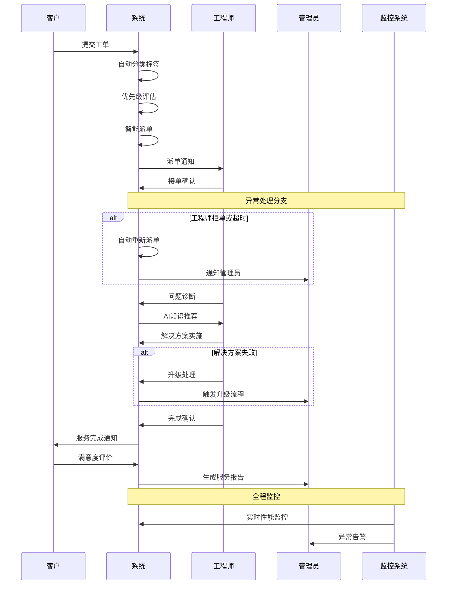
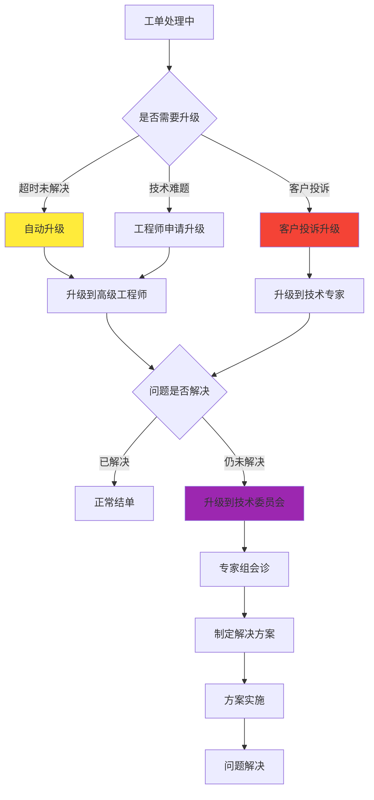

## 4. 业务流程

### 4.1 核心业务流程示意

#### 工单处理流程（增强版）

**补充:** 工单处理是IT运维服务的核心业务流程，涉及客户、系统、工程师、管理员等多个角色的协作。以下流程图展示了从工单创建到关闭的完整生命周期。

#### 工单处理流程文字版详细说明

**补充:** 为确保流程的可操作性，提供每个步骤的详细说明，包括输入输出、业务规则、异常处理和质量标准。

**第一阶段：工单创建与分类（1-3分钟）**

1. **客户提交工单**
   - 输入：问题描述、紧急程度、联系方式、附件
   - 系统处理：自动生成工单编号、记录提交时间、发送确认通知
   - 业务规则：必填字段校验、附件大小限制（≤100MB）、重复工单检测
   - 输出：工单记录、确认通知、工单编号

2. **系统自动分类标签**
   - 输入：工单标题、描述内容、历史数据
   - 处理逻辑：基于NLP算法分析文本内容，匹配预定义分类规则
   - 分类维度：问题类型（硬件/软件/网络）、技术领域（服务器/数据库/应用）、复杂度（简单/中等/复杂）
   - 输出：分类标签、置信度评分
   - 质量标准：分类准确率≥85%

3. **优先级自动评估**
   - 输入：客户等级、问题类型、影响范围、紧急程度
   - 评估算法：客户等级权重40% + 问题严重性30% + 影响范围20% + 时间因素10%
   - 优先级定义：
     - 紧急（P1）：核心业务中断，影响>100用户
     - 高（P2）：重要功能异常，影响50-100用户
     - 中（P3）：一般问题，影响10-50用户
     - 低（P4）：优化建议，影响<10用户
   - 输出：优先级等级、SLA时间要求

**第二阶段：智能派单与接单（3-15分钟）**

4. **智能派单执行**
   - 输入：工单信息、工程师状态、技能匹配度、地理位置
   - 派单算法：技能匹配40% + 工作负载25% + 地理位置20% + 历史绩效15%
   - 候选筛选：技能匹配度≥80%、当前工单数≤5个、在线状态
   - 输出：最优工程师、备选工程师列表、派单原因
   - 时间要求：派单决策时间≤3分钟

5. **工程师接单确认**
   - 通知方式：系统通知 + 短信 + 邮件（多渠道保障）
   - 响应时间：紧急15分钟、高30分钟、中2小时、低4小时
   - 接单操作：确认接单、预估处理时间、申请资源支持
   - 异常处理：超时未响应自动重新派单、拒单需说明原因
   - 输出：接单确认、预估完成时间

**第三阶段：问题诊断与解决（30分钟-8小时）**

6. **问题诊断分析**
   - 诊断方法：远程连接、日志分析、性能监控、用户访谈
   - 系统支持：提供相关监控数据、历史问题记录、知识库文档
   - 诊断记录：问题现象、可能原因、排查步骤、诊断结论
   - 时间要求：初步诊断时间≤30分钟
   - 输出：问题诊断报告、解决方案建议

7. **AI知识推荐**
   - 推荐依据：问题关键词、历史解决方案、相似案例
   - 推荐内容：解决步骤、参考文档、专家联系方式、风险提示
   - 推荐质量：相关性≥80%、有效性≥70%
   - 反馈机制：工程师可对推荐内容评价，持续优化算法
   - 输出：推荐方案列表、相关度评分

8. **解决方案实施**
   - 实施前准备：方案评估、风险分析、备份计划、回滚方案
   - 实施过程：按步骤执行、实时记录、异常处理、进度更新
   - 客户沟通：重要操作前确认、进度定期通报、完成后验证
   - 质量控制：操作规范性、安全性、有效性验证
   - 输出：实施记录、结果验证、客户确认

**第四阶段：验收与评价（15-60分钟）**

9. **服务完成确认**
   - 工程师确认：问题已解决、系统运行正常、客户可以验收
   - 系统检查：自动验证相关监控指标、性能数据、错误日志
   - 文档更新：解决方案记录、知识库更新、经验总结
   - 输出：完成报告、解决方案文档

10. **客户满意度评价**
    - 评价维度：响应及时性、问题解决效果、服务态度、专业水平
    - 评价方式：在线评分（1-5分）+ 文字反馈
    - 评价时限：服务完成后24小时内
    - 处理机制：低分评价（≤3分）自动触发客户关怀流程
    - 输出：满意度评分、改进建议

**第五阶段：报告与分析（自动生成）**

11. **服务报告生成**
    - 报告内容：工单基本信息、处理过程、解决方案、时间统计、满意度评价
    - 生成时机：工单关闭后自动生成
    - 分发对象：客户、工程师、管理员、相关干系人
    - 存档管理：报告永久保存，支持历史查询和统计分析
    - 输出：标准化服务报告、统计数据

### 4.2 异常处理流程

#### 系统异常处理
**系统故障处理流程：**
1. **故障检测**：监控系统自动检测异常
2. **故障分类**：按影响范围和严重程度分类
3. **应急响应**：启动应急预案，通知相关人员
4. **故障修复**：技术团队快速定位和修复问题
5. **服务恢复**：验证系统功能，恢复正常服务
6. **事后分析**：分析故障原因，制定预防措施

#### 业务异常处理
**工单处理异常：**
- **超时处理**：自动升级或重新派单
- **拒单处理**：记录原因，重新匹配工程师
- **质量问题**：客户投诉处理，服务补偿

**数据异常处理：**
- **数据丢失**：从备份恢复，记录事故
- **数据错误**：数据校验，人工修正
- **同步异常**：重新同步，保证数据一致性

### 4.3 关键业务规则

#### SLA管理规则
- **响应时间要求**：紧急≤15分钟，高≤30分钟，中≤2小时，低≤4小时
- **解决时间要求**：紧急≤2小时，高≤8小时，中≤24小时，低≤72小时
- **违约处理**：超时自动升级，连续违约触发客户关怀流程

#### 智能派单规则
- **技能匹配**：工程师技能标签与工单需求匹配度≥80%
- **负载均衡**：工程师当前工单数量不超过5个
- **地理位置**：优先派给同城或就近工程师
- **历史绩效**：优先派给历史处理成功率高的工程师

#### 工单升级处理流程

**补充:** 当工单无法在预期时间内解决或遇到技术难题时，需要启动升级处理流程，确保客户问题得到及时有效的解决。

#### 升级触发条件与处理标准

**补充:** 明确的升级标准确保问题能够及时得到适当级别的技术支持。

| 升级类型 | 触发条件 | 响应时间 | 处理人员 | 解决时限 |
|---------|----------|----------|----------|----------|
| 自动升级 | 超过SLA时间50% | 立即 | 高级工程师 | 原SLA时间 |
| 技术升级 | 工程师申请 | 30分钟 | 技术专家 | 4小时 |
| 投诉升级 | 客户投诉 | 15分钟 | 客户经理+技术专家 | 2小时 |
| 专家升级 | 重大技术问题 | 1小时 | 技术委员会 | 24小时 |

### 4.4 流程监控与优化

#### 关键流程指标
| 指标类别 | 具体指标 | 目标值 | 监控频率 | 改进触发条件 |
|----------|----------|--------|----------|-------------|
| **效率指标** | 平均工单处理时间 | <2小时 | 实时 | 连续3天超标 |
| **质量指标** | 客户满意度 | >90% | 每周 | 低于85% |
| **响应指标** | 首次响应时间 | <30分钟 | 实时 | 超时率>5% |
| **升级指标** | 工单升级率 | <10% | 每日 | 超过15% |

#### 流程优化机制
**持续改进流程：**
1. **数据收集**：自动收集流程执行数据
2. **问题识别**：定期分析瓶颈和异常点
3. **方案设计**：制定流程优化方案
4. **试点验证**：小范围试点验证效果
5. **全面推广**：验证成功后全面推广
6. **效果评估**：跟踪优化效果，持续改进

#### 流程标准化
**标准作业程序（SOP）：**
- 每个关键流程都有标准化的操作手册
- 定期更新SOP以反映最佳实践
- 新员工培训必须包含SOP学习
- 建立流程执行的检查清单

### 4.5 业务流程总结

#### 流程设计原则
1. **客户导向**：所有流程设计以客户价值为中心
2. **效率优先**：通过自动化减少人工干预
3. **质量保证**：每个环节都有质量检查点
4. **持续改进**：建立反馈机制，持续优化流程

#### 核心竞争优势
- **智能化**：AI驱动的智能派单和知识推荐
- **标准化**：统一的流程标准，确保服务质量
- **可视化**：全程可视化跟踪，提升客户体验
- **数据化**：基于数据的决策和优化

#### 成功关键因素
- **人员培训**：确保所有人员熟悉流程标准
- **系统支撑**：强大的系统功能支撑流程执行
- **文化建设**：建立以客户为中心的服务文化
- **持续监控**：实时监控流程执行效果

参考：具体的系统功能实现见各模块需求文档，技术架构见附录C和附录E。
