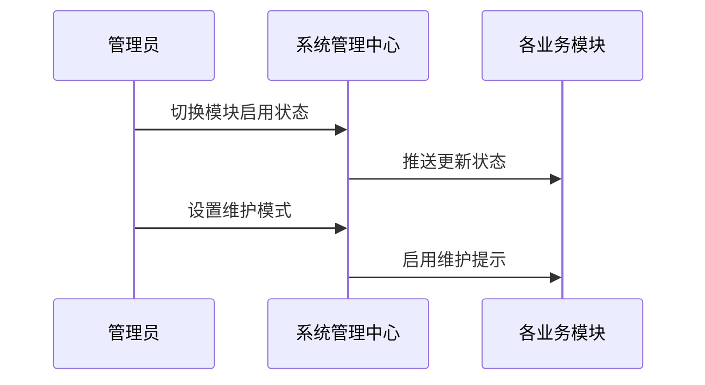

# REQ-010: 系统管理模块

## 1. 业务描述

系统管理模块是IT运维门户系统的核心管理组件，提供全面的系统管理功能，包括用户管理、角色权限管理、组织架构管理、系统配置管理等。该模块确保系统的安全性、可管理性和可维护性，为系统管理员提供强大的管理工具，支持多租户环境下的精细化管理。通过标准化的管理流程和自动化的管理功能，提升系统管理效率和安全性。

作为平台中枢，集中管理用户/模块/权限/配置/安全策略/运行监控；系统级与租户级双层配置。必须与系统设置（REQ-008）/用户与权限（REQ-002）联动，实现配置生效、权限校验、变更审计。

## 2. KPI / 核心目标

- **管理效率**：管理操作响应时间≤2秒，批量操作成功率≥95%
- **安全性**：权限控制准确率100%，安全事件响应时间≤5分钟
- **可用性**：管理功能可用性≥99.9%，管理界面友好度≥90%
- **数据完整性**：用户数据完整率≥99%，权限数据一致性100%
- **操作审计**：管理操作审计覆盖率100%，日志完整率100%
- **自动化率**：常规管理任务自动化率≥60%
- **系统可用性**：≥99.99%
- **参数变更错误率**：≤0.5%
- **配置生效延迟**：≤5秒
- **异常监测覆盖率**：100%

## 3. 功能需求表

| 功能编号 | 功能名称 | 优先级 | 功能描述 | 验收标准 |
|---------|----------|--------|----------|----------|
| REQ-010-001 | 用户管理 | P0 | 用户增删改查、状态管理、批量操作 | 功能完整，操作便捷 |
| REQ-010-002 | 角色权限 | P0 | 角色定义、权限分配、权限验证 | 权限精确，控制有效 |
| REQ-010-003 | 组织架构 | P0 | 部门管理、层级关系、人员分配 | 架构清晰，管理便捷 |
| REQ-010-004 | 系统配置 | P0 | 参数配置、功能开关、规则设置 | 配置灵活，生效及时 |
| REQ-010-005 | 数据管理 | P1 | 数据备份、数据清理、数据迁移 | 数据安全，操作可靠 |
| REQ-010-006 | 日志审计 | P1 | 操作日志、登录日志、审计报告 | 日志完整，审计有效 |
| REQ-010-007 | 系统监控 | P1 | 系统状态、性能监控、告警管理 | 监控全面，告警及时 |
| REQ-010-008 | 安全管理 | P2 | 安全策略、访问控制、威胁检测 | 安全可靠，防护有效 |
| REQ-010-009 | 模块启用/禁用开关 | P0 | 即时启用或关闭业务模块 | 生效延迟≤5秒 |
| REQ-010-010 | 系统公告与维护 | P0 | 发布公告、设置维护窗口 | 支持定时发布/过期；维护IP白名单 |
| REQ-010-011 | 任务调度管理 | P1 | 后台定时任务配置与监控 | 调度误差≤3秒 |
| REQ-010-012 | 系统版本管理 | P2 | 版本信息与升级管理 | 升级可回滚 |
| REQ-010-013 | 安全策略全局配置 | P0 | 密码策略/登录限制/IP策略 | 即时生效 |
| REQ-010-014 | 操作变更审计 | P0 | 全局修改审计 | 追溯完整 |

## 4. 用户故事

**作为系统管理员**，我希望能够统一管理所有用户账户和权限，以便确保系统安全和合规。

**作为平台管理员**，我希望能够灵活配置系统参数和功能开关，以便适应不同的业务需求。

**作为安全管理员**，我希望能够监控所有管理操作并生成审计报告，以便满足合规要求。

## 5. 用户交互与流程

### 5.1 正常流程

1. **用户管理**：登录管理后台→选择用户管理→查看用户列表→新增/编辑/删除用户→保存变更
2. **权限配置**：选择角色管理→定义角色权限→分配用户角色→验证权限生效
3. **系统配置**：选择系统设置→修改配置参数→预览影响范围→确认保存→推送生效

### 5.2 模块启用与维护模式



### 5.3 异常处理

- **模块切换失败**：自动回退并记录错误日志
- **备份失败**：重试机制并发送告警通知
- **升级中断**：自动回滚到上一个稳定版本

## 6. 非功能需求

- **性能要求**：配置推送≤5秒，并发修改≥100，全量备份≤30分钟
- **可用性要求**：系统可用性≥99.99%
- **安全要求**：所有管理操作必须经过权限验证和审计记录
- **扩展性要求**：支持大规模用户和租户管理

## 7. 数据模型

### 7.1 system_global_config（系统全局配置表）

| 字段名 | 类型 | 可空 | 描述 | 约束/索引 |
|--------|------|------|------|-----------|
| config_id | bigint | N | 配置ID | PK |
| config_key | varchar(255) | N | 配置键 | uniq_key |
| config_value | text | N | 配置值 |  |
| config_level | varchar(20) | N | 配置级别：global/tenant |  |
| description | varchar(500) | Y | 配置描述 |  |
| updated_by | bigint | N | 修改用户ID | FK |
| updated_at | timestamp | N | 更新时间 | idx_updated |
| created_at | timestamp | N | 创建时间 |  |

### 7.2 system_module_status（系统模块状态表）

| 字段名 | 类型 | 可空 | 描述 | 约束/索引 |
|--------|------|------|------|-----------|
| module_id | bigint | N | 模块ID | PK |
| module_name | varchar(100) | N | 模块名称 | uniq_name |
| module_code | varchar(50) | N | 模块代码 | uniq_code |
| status | varchar(20) | N | 状态：enabled/disabled/maintenance | idx_status |
| tenant_id | bigint | Y | 租户ID（为空则为全局） | idx_tenant |
| updated_by | bigint | N | 修改用户ID | FK |
| updated_at | timestamp | N | 更新时间 | idx_updated |

### 7.3 system_operation_log（系统操作日志表）

| 字段名 | 类型 | 可空 | 描述 | 约束/索引 |
|--------|------|------|------|-----------|
| log_id | bigint | N | 日志ID | PK |
| tenant_id | bigint | Y | 租户ID | idx_tenant |
| operator_id | bigint | N | 操作人ID | FK |
| operation_type | varchar(50) | N | 操作类型 | idx_type |
| operation_module | varchar(100) | N | 操作模块 | idx_module |
| operation_detail | text | N | 操作详情 |  |
| ip_address | varchar(45) | Y | 操作IP地址 |  |
| user_agent | varchar(500) | Y | 用户代理信息 |  |
| operation_time | timestamp | N | 操作时间 | idx_time |
| result_status | varchar(20) | N | 操作结果：success/failed | idx_result |

## 8. 核心API示例

### 8.1 获取系统配置
```http
GET /api/v1/system/config?level=global
```

### 8.2 更新系统配置
```http
PUT /api/v1/system/config/{configKey}
{
  "value": "new_value",
  "description": "配置描述"
}
```

### 8.3 切换模块状态
```http
POST /api/v1/system/modules/{moduleCode}/toggle
{
  "status": "enabled",
  "tenantId": 123
}
```

### 8.4 查询操作日志
```http
GET /api/v1/system/operation-logs?operationType=config_update&startTime=2024-01-01&endTime=2024-01-31
```

## 9. 异常与边界场景

- **配置冲突处理**：多用户同时修改配置时的冲突解决机制
- **模块依赖检查**：禁用模块前检查是否有其他模块依赖
- **权限边界验证**：严格验证用户对系统管理功能的访问权限
- **数据一致性保证**：确保配置变更在所有节点的一致性
- **操作回滚机制**：关键操作失败时的自动回滚功能

## 10. 性能/容量规划

- **用户数量**：支持10万个用户账户
- **并发操作**：支持100个并发管理操作
- **配置项数量**：支持1万个系统配置项
- **日志存储**：保留操作日志1年，历史数据归档

## 11. 安全与合规

- **权限控制**：基于RBAC的细粒度权限管理
- **操作审计**：记录所有系统管理操作的完整审计日志
- **数据加密**：敏感配置数据加密存储
- **访问控制**：限制系统管理功能的访问权限

## 12. 测试与验收标准

- **功能测试**：覆盖所有系统管理功能点
- **性能测试**：验证管理操作的响应时间和并发处理能力
- **安全测试**：权限控制和数据安全验证
- **集成测试**：与其他模块的集成验证

## 13. 模块依赖

**上游依赖**：
- REQ-002（用户权限管理）：用户认证和权限验证
- REQ-004（租户管理）：租户隔离和管理

**下游依赖**：
- REQ-008（系统设置）：配置管理协作
- REQ-011（通知中心）：系统通知发送

**平级协作**：
- 与所有业务模块：提供系统管理服务
