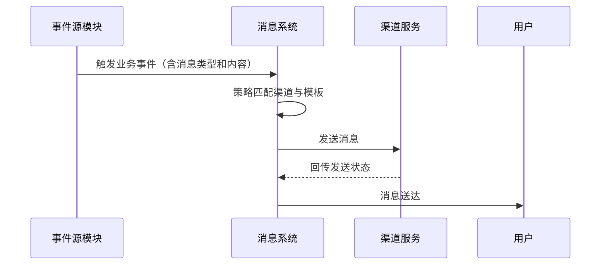

# REQ-011: 通知与消息系统

## 1. 业务描述

通知与消息系统为IT运维门户系统提供全面的消息通知服务，包括系统通知、工单提醒、状态变更通知、告警消息等。系统支持多种通知渠道（站内消息、邮件、短信、微信、钉钉、Push、Webhook等），支持多格式（文本/HTML/Markdown）与多优先级（紧急/重要/普通/低），具备智能通知规则与个性化偏好设置。通过及时准确的消息通知，提升用户体验和工作效率，确保重要信息不遗漏。

多租户消息隔离、模板管理、定时发送与重试机制；提供发送状态回执与统计分析。与报表（REQ-007）/财务（REQ-018）/SLA（REQ-017）/派单（REQ-004）深度集成：账单提醒、SLA告警、派单结果通知等。

## 2. KPI / 核心目标

- **通知及时性**：通知发送延迟≤30秒，紧急通知≤10秒，优化目标≤5秒
- **通知成功率**：通知发送成功率≥95%，到达率≥90%
- **通知准确性**：通知内容准确率≥99%，误发率≤1%
- **用户体验**：通知相关性≥85%，用户满意度≥4.5分
- **系统性能**：通知系统可用性≥99.9%，处理能力≥10000条/分钟
- **个性化程度**：用户个性化设置覆盖率≥80%
- **消息送达率**：≥99%
- **模板复用率**：≥80%
- **重试成功率**：≥95%

## 3. 功能需求表

| 功能编号 | 功能名称 | 优先级 | 功能描述 | 验收标准 |
|---------|----------|--------|----------|----------|
| REQ-011-001 | 站内消息 | P0 | 系统消息、个人消息、群组消息 | 消息及时，界面友好 |
| REQ-011-002 | 邮件通知 | P0 | 邮件发送、模板管理、批量发送 | 发送成功率≥95% |
| REQ-011-003 | 短信通知 | P0 | 短信发送、模板管理、验证码 | 到达率≥90% |
| REQ-011-004 | 通知规则 | P0 | 规则配置、触发条件、通知对象 | 规则灵活，执行准确 |
| REQ-011-005 | 个人设置 | P1 | 通知偏好、免打扰时间、渠道选择 | 设置灵活，体验个性化 |
| REQ-011-006 | 第三方集成 | P1 | 微信、钉钉、Slack、Webhook/Push 集成 | 集成稳定，功能完整 |
| REQ-011-007 | 消息统计 | P1 | 发送统计、到达率分析、效果评估 | 统计准确，分析有价值 |
| REQ-011-008 | 消息模板 | P2 | 模板管理、变量替换、多语言支持 | 模板丰富，使用便捷 |
| REQ-011-009 | 事件触发通知 | P0 | 绑定工单/SLA/财务/派单等事件自动推送 | 全流程覆盖率达标 |
| REQ-011-010 | 优先级设置与调度 | P0 | 优先级队列处理紧急消息 | 延迟受控 |
| REQ-011-011 | 重试与回执 | P1 | 失败重试策略、状态回执 | 重试成功率达标 |
| REQ-011-012 | 定时发送 | P2 | 计划任务与延时消息 | 按时送达率达标 |
| REQ-011-013 | 历史与统计 | P1 | 历史记录查询、送达率统计 | 数据准确率达标 |

## 4. 用户故事

**作为系统用户**，我希望能够及时收到工单状态变更通知，以便了解工作进展和及时响应。

**作为管理员**，我希望能够配置通知规则和模板，以便为不同场景提供个性化的通知服务。

**作为运维人员**，我希望能够通过多种渠道接收告警通知，以便快速响应系统异常。

## 5. 用户交互与流程

### 5.1 正常流程



### 5.2 异常处理

- **渠道不可用**：自动切换到重试队列，使用备用渠道
- **模板渲染失败**：降级发送纯文本消息
- **取消订阅**：阻断发送并更新用户偏好设置

## 6. 非功能需求

**性能需求**
- **发送性能**：支持10000条/分钟的通知发送能力
- **响应时间**：通知触发到发送延迟≤30秒
- **并发处理**：支持1000+并发通知请求
- **系统可用性**：通知系统可用性≥99.9%

**可靠性需求**
- **发送保障**：重要通知多渠道备份发送
- **失败重试**：自动重试机制，最多重试3次
- **状态跟踪**：完整的通知状态跟踪和记录
- **数据持久化**：通知记录持久化存储，支持查询

**扩展性需求**
- **渠道扩展**：支持新的通知渠道快速接入
- **模板扩展**：支持自定义通知模板和格式
- **规则扩展**：支持复杂的通知规则配置
- **集成扩展**：支持与第三方系统的通知集成

## 7. 数据模型

### 7.1 notifications（通知记录表）

| 字段名 | 类型 | 可空 | 描述 | 约束/索引 |
|--------|------|------|------|-----------|
| notification_id | bigint | N | 通知ID | PK |
| tenant_id | bigint | N | 租户ID | idx_tenant |
| user_id | bigint | N | 接收用户ID | FK |
| notification_type | varchar(50) | N | 通知类型 | idx_type |
| title | varchar(255) | N | 通知标题 |  |
| content | text | N | 通知内容 |  |
| priority | varchar(20) | N | 优先级：urgent/high/normal/low | idx_priority |
| channel | varchar(50) | N | 发送渠道 | idx_channel |
| status | varchar(20) | N | 状态：pending/sent/failed/read | idx_status |
| scheduled_time | timestamp | Y | 计划发送时间 | idx_scheduled |
| sent_time | timestamp | Y | 实际发送时间 | idx_sent |
| read_time | timestamp | Y | 阅读时间 |  |
| created_at | timestamp | N | 创建时间 | idx_created |

### 7.2 message_template（消息模板表）

| 字段名 | 类型 | 可空 | 描述 | 约束/索引 |
|--------|------|------|------|-----------|
| template_id | bigint | N | 模板ID | PK |
| tenant_id | bigint | Y | 租户ID（为空则为全局模板） | idx_tenant |
| template_code | varchar(100) | N | 模板代码 | uniq_code |
| template_name | varchar(255) | N | 模板名称 |  |
| template_type | varchar(50) | N | 模板类型 | idx_type |
| channel | varchar(50) | N | 适用渠道 | idx_channel |
| subject_template | varchar(500) | Y | 主题模板 |  |
| content_template | text | N | 内容模板 |  |
| variables | text | Y | 变量定义（JSON格式） |  |
| status | varchar(20) | N | 状态：active/inactive | idx_status |
| created_by | bigint | N | 创建人ID | FK |
| created_at | timestamp | N | 创建时间 |  |
| updated_at | timestamp | N | 更新时间 |  |

### 7.3 notification_logs（通知发送日志表）

| 字段名 | 类型 | 可空 | 描述 | 约束/索引 |
|--------|------|------|------|-----------|
| log_id | bigint | N | 日志ID | PK |
| notification_id | bigint | N | 通知ID | FK |
| tenant_id | bigint | N | 租户ID | idx_tenant |
| channel | varchar(50) | N | 发送渠道 | idx_channel |
| recipient | varchar(255) | N | 接收方地址 |  |
| send_status | varchar(20) | N | 发送状态：success/failed/retry | idx_status |
| error_message | text | Y | 错误信息 |  |
| retry_count | int | N | 重试次数 | idx_retry |
| send_time | timestamp | N | 发送时间 | idx_send_time |
| response_time | timestamp | Y | 响应时间 |  |
| cost_time | int | Y | 耗时（毫秒） |  |

### 7.4 user_notification_settings（用户通知设置表）

| 字段名 | 类型 | 可空 | 描述 | 约束/索引 |
|--------|------|------|------|-----------|
| setting_id | bigint | N | 设置ID | PK |
| user_id | bigint | N | 用户ID | FK |
| tenant_id | bigint | N | 租户ID | idx_tenant |
| notification_type | varchar(50) | N | 通知类型 | idx_type |
| channel_preferences | text | N | 渠道偏好（JSON格式） |  |
| do_not_disturb_start | time | Y | 免打扰开始时间 |  |
| do_not_disturb_end | time | Y | 免打扰结束时间 |  |
| is_enabled | boolean | N | 是否启用 | idx_enabled |
| updated_at | timestamp | N | 更新时间 |  |

## 8. 核心API示例

### 8.1 发送通知
```http
POST /api/v1/notifications/send
{
  "recipients": ["user123", "user456"],
  "type": "ticket_status_change",
  "title": "工单状态变更通知",
  "content": "您的工单 #12345 状态已变更为已完成",
  "priority": "normal",
  "channels": ["in_app", "email"]
}
```

### 8.2 获取用户通知列表
```http
GET /api/v1/notifications?userId=123&status=unread&page=1&size=20
```

### 8.3 标记通知为已读
```http
PUT /api/v1/notifications/{notificationId}/read
```

### 8.4 更新用户通知设置
```http
PUT /api/v1/users/{userId}/notification-settings
{
  "ticketNotifications": {
    "channels": ["in_app", "email"],
    "doNotDisturbStart": "22:00",
    "doNotDisturbEnd": "08:00"
  }
}
```

## 9. 异常与边界场景

- **渠道服务异常**：自动切换备用渠道，记录失败原因
- **模板变量缺失**：使用默认值或跳过该变量
- **用户取消订阅**：停止发送并更新用户偏好
- **消息队列积压**：启用限流机制，优先处理紧急消息
- **重复发送控制**：基于内容和接收方的去重机制

## 10. 性能/容量规划

- **消息处理量**：支持每分钟10万条消息处理
- **并发用户**：支持1万个并发用户接收通知
- **模板数量**：支持1000个消息模板
- **历史数据**：保留通知记录3年，日志数据1年

## 11. 安全与合规

- **数据加密**：敏感通知内容加密存储和传输
- **权限控制**：基于租户和用户权限的通知访问控制
- **隐私保护**：用户可控制个人通知偏好和数据使用
- **审计要求**：记录所有通知发送的完整审计日志

## 12. 测试与验收标准

- **功能测试**：覆盖所有通知渠道和消息类型
- **性能测试**：验证高并发下的消息处理能力
- **集成测试**：与各业务模块的事件集成验证
- **用户体验测试**：验证通知的及时性和准确性

## 13. 模块依赖

**上游依赖**：
- REQ-002（用户权限管理）：用户信息和权限验证
- REQ-004（租户管理）：租户隔离

**事件源模块**：
- REQ-003（工单管理）：工单状态变更事件
- REQ-007（报表中心）：报表生成完成事件
- REQ-017（SLA管理）：SLA告警事件
- REQ-018（财务管理）：账单提醒事件

**外部服务依赖**：
- 邮件服务：SMTP服务器
- 短信服务：短信网关
- 第三方集成：微信、钉钉、Slack等API
- 推送服务：移动端推送服务（极光推送、个推等）
