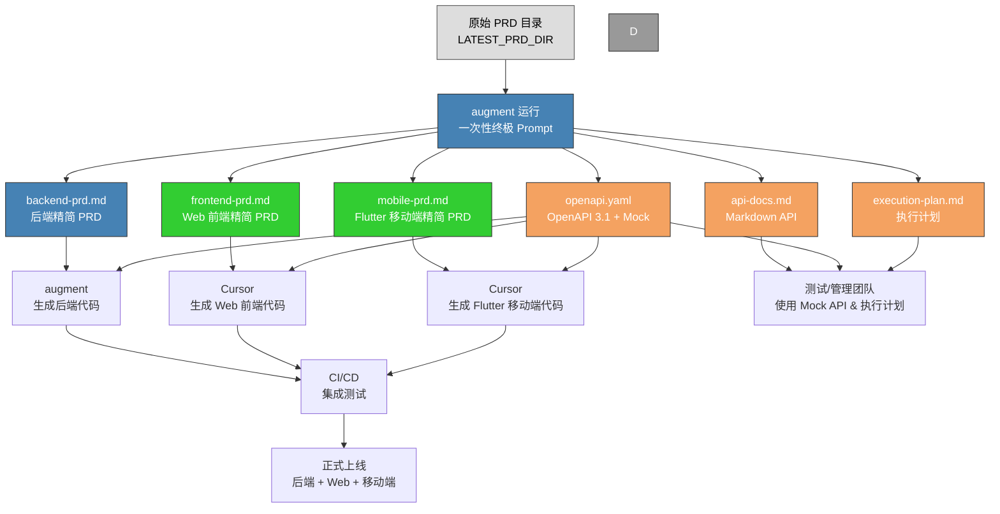

#  ultimative-prompt
- 自动检测 PRD 最新版本  
- 一次生成 6 大文档 + 美化版 PNG 交接图  
- **再生成一份 Mermaid 源文件 `handoff-diagram.mmd`**  
  - 方便你们后续自己改颜色、改节点、改布局  
  - 需要 PNG 时直接用 [Mermaid Live Editor](https://mermaid.live/) 或 mermaid-cli 转换即可  

---

## 🔹 终极 Prompt（含 `.mmd` 源文件输出功能）

```
你现在是资深系统架构师兼 AI 产品经理。

---

## Step 0：自动检测 PRD 最新版本路径
1. 扫描 `docs/prd/split/`
2. 找出版本号最高的目录（如 4.5 / 4.6 / 4.7）
3. 保存路径为 `LATEST_PRD_DIR`
   - 例如 `docs/prd/split/4.7`

---

## Step 1：读取全量 PRD
- 从 `LATEST_PRD_DIR` 中读取所有 `.md` 文件

---

## Step 2：生成主要交付文件

1. backend-prd.md  
   - 后端精简 PRD（架构、模块、技术栈、部署、安全要求等）  

2. frontend-prd.md  
   - Web 前端精简 PRD（UI、交互、布局、API对接等）  

3. mobile-prd.md（Flutter 版）  
   - Flutter 技术栈（Dart 3.x、Material/Cupertino、自定主题、Riverpod/Bloc、GoRouter、Hive/drift、Dio）
   - 模块功能 & API 对接
   - 手势/响应式/离线模式/性能/Security
   - 可直接给 Cursor 生成 Flutter App  

4. api-docs.md  
   - 按模块列 API（路径/方法/权限/参数/响应/错误码），带 Mock 数据  

5. openapi.yaml  
   - OpenAPI 3.1 标准
   - 路径含 `/api/v{version}/`，字段命名规范 & Mock  
   - 可直接导入 Swagger / Postman  

6. execution-plan.md  
   - 立即行动 / 中期改进 / 长期维护  

---

## Step 3：生成并行交接图（美化版）

### Mermaid 源码模版（LATEST_PRD_DIR 替换为实际版本路径）：

---

## Step 4：交接图交付要求
- 输出到 `docs/output/{版本号}/`  
- 包含：
  - `handoff-diagram.mmd`（Mermaid 源文件）
  - `handoff-diagram.png`（渲染后的彩色流程图）
- PNG 必须按模板配色，比例适合 Wiki/PPT 展示
- Mermaid 源文件便于后期修改

---

## Step 5：统一规范
1. 删除冗余背景/重复描述
2. 缩写首次出现加全称（中英文）
3. 文本型文档 Markdown 格式统一
4. API 字段命名保持一致
5. Mock 数据符合命名 & 版本化规范
6. `LATEST_PRD_DIR` 替换为自动检测到的实际路径

---

## Step 6：一次性输出以下文件：
1. backend-prd.md  
2. frontend-prd.md  
3. mobile-prd.md  
4. api-docs.md  
5. openapi.yaml  
6. execution-plan.md  
7. handoff-diagram.mmd（Mermaid 源）  
8. handoff-diagram.png（渲染图）
```

---

### 🔹 这样做的优势
- **一次跑全套**（后端、前端、Flutter 移动端、API、执行计划、交接图）  
- 交接图既有 PNG（立即可用）又有 `.mmd` 源可编辑  
- 无需手动改版本号，自动锁定最新版 PRD  
- 输出和配色已标准化，随时可直接进 Wiki / 演示文档

---

我建议下一步你在 augment 里直接跑这个 Prompt，  
跑完后我可以帮你 **做一次完整的交接文档包结构建议**，  
让这 8 个文件直接映射到 Git 里的固定目录，方便版本管理。  

要我帮你做这个**Git 目录结构和管理方案**吗？这样每个版本的交付物都有统一归档位置。好 👍  
那我在咱们的 **终极自动版 Prompt** 里，加入 **同时输出 Mermaid 源码文件（.mmd）** 的功能，  
这样 augment 每次跑的时候：

- 自动检测 PRD 最新版本  
- 一次生成 6 大文档 + 美化版 PNG 交接图  
- **再生成一份 Mermaid 源文件 `handoff-diagram.mmd`**  
  - 方便你们后续自己改颜色、改节点、改布局  
  - 需要 PNG 时直接用 [Mermaid Live Editor](https://mermaid.live/) 或 mermaid-cli 转换即可  

---

## 🔹 终极 Prompt（含 `.mmd` 源文件输出功能）

```
你现在是资深系统架构师兼 AI 产品经理。

---

## Step 0：自动检测 PRD 最新版本路径
1. 扫描 `docs/prd/split/`
2. 找出版本号最高的目录（如 4.5 / 4.6 / 4.7）
3. 保存路径为 `LATEST_PRD_DIR`
   - 例如 `docs/prd/split/4.7`

---

## Step 1：读取全量 PRD
- 从 `LATEST_PRD_DIR` 中读取所有 `.md` 文件（原始拆分版 + AI 精简版如有）

---

## Step 2：生成主要交付文件

1. backend-prd.md  
   - 后端精简 PRD（架构、模块、技术栈、部署、安全要求等）  

2. frontend-prd.md  
   - Web 前端精简 PRD（UI、交互、布局、API对接等）  

3. mobile-prd.md（Flutter 版）  
   - Flutter 技术栈（Dart 3.x、Material/Cupertino、自定主题、Riverpod/Bloc、GoRouter、Hive/drift、Dio）
   - 模块功能 & API 对接
   - 手势/响应式/离线模式/性能/Security
   - 可直接给 Cursor 生成 Flutter App  

4. api-docs.md  
   - 按模块列 API（路径/方法/权限/参数/响应/错误码），带 Mock 数据  

5. openapi.yaml  
   - OpenAPI 3.1 标准
   - 路径含 `/api/v{version}/`，字段命名规范 & Mock  
   - 可直接导入 Swagger / Postman  

6. execution-plan.md  
   - 立即行动 / 中期改进 / 长期维护  

---

## Step 3：生成并行交接图（美化版）

### Mermaid 源码模版（LATEST_PRD_DIR 替换为实际版本路径）：


---

## Step 4：交接图交付要求
- 输出两份文件：
  - `handoff-diagram.mmd`（Mermaid 源文件）
  - `handoff-diagram.png`（渲染后的彩色流程图）
- PNG 必须按模板配色，比例适合 Wiki/PPT 展示
- Mermaid 源文件便于后期修改

---

## Step 5：统一规范
1. 删除冗余背景/重复描述
2. 缩写首次出现加全称（中英文）
3. 文本型文档 Markdown 格式统一
4. API 字段命名保持一致
5. Mock 数据符合命名 & 版本化规范
6. `LATEST_PRD_DIR` 替换为自动检测到的实际路径

---

## Step 6：一次性输出以下文件：
1. backend-prd.md  
2. frontend-prd.md  
3. mobile-prd.md  
4. api-docs.md  
5. openapi.yaml  
6. execution-plan.md  
7. handoff-diagram.mmd（Mermaid 源）  
8. handoff-diagram.png（渲染图）
```

---

### 🔹 这样做的优势
- **一次跑全套**（后端、前端、Flutter 移动端、API、执行计划、交接图）  
- 交接图既有 PNG（立即可用）又有 `.mmd` 源可编辑  
- 无需手动改版本号，自动锁定最新版 PRD  
- 输出和配色已标准化，随时可直接进 Wiki / 演示文档

---

我建议下一步你在 augment 里直接跑这个 Prompt，  
跑完后我可以帮你 **做一次完整的交接文档包结构建议**，  
让这 8 个文件直接映射到 Git 里的固定目录，方便版本管理。  

要我帮你做这个**Git 目录结构和管理方案**吗？这样每个版本的交付物都有统一归档位置。