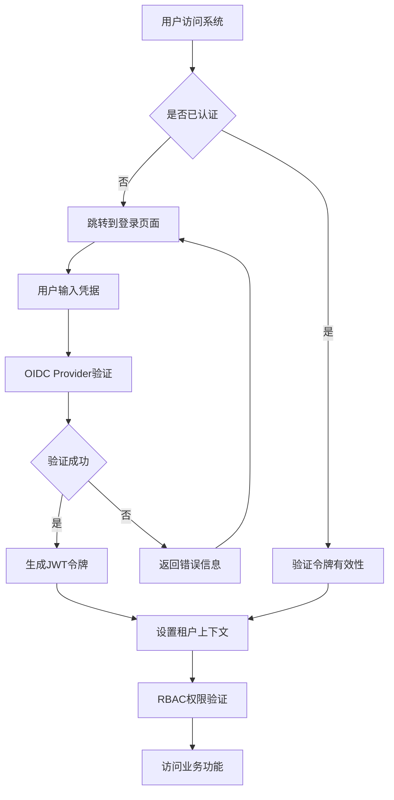
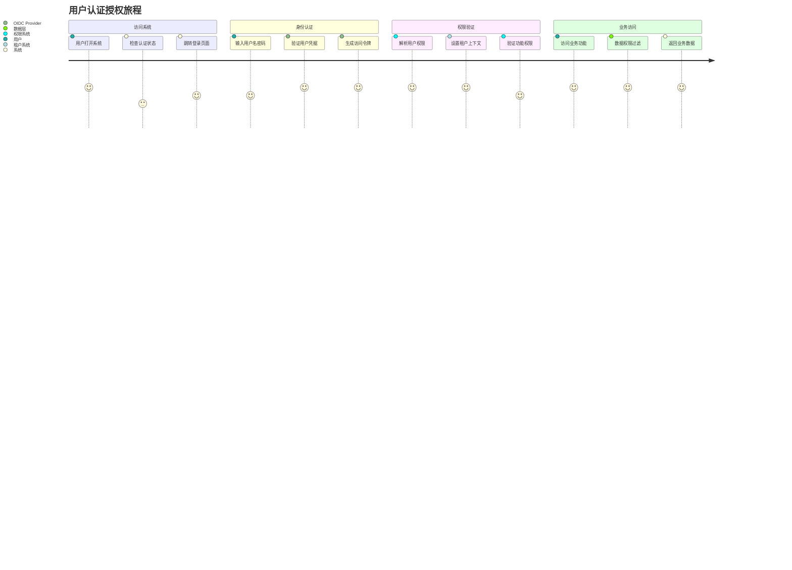
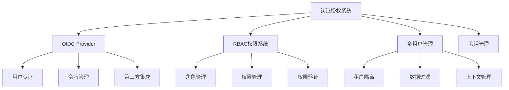
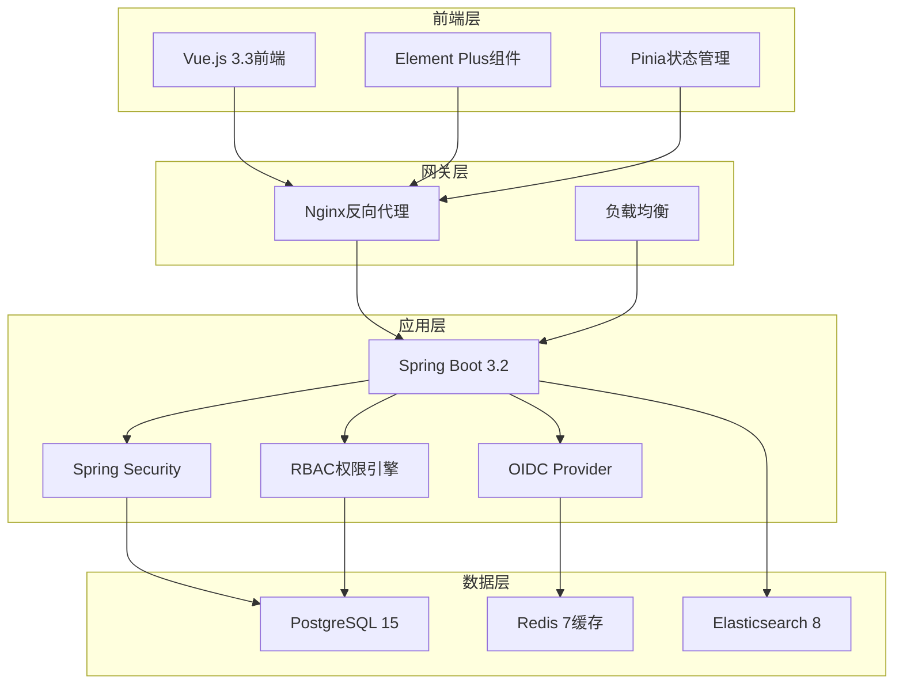
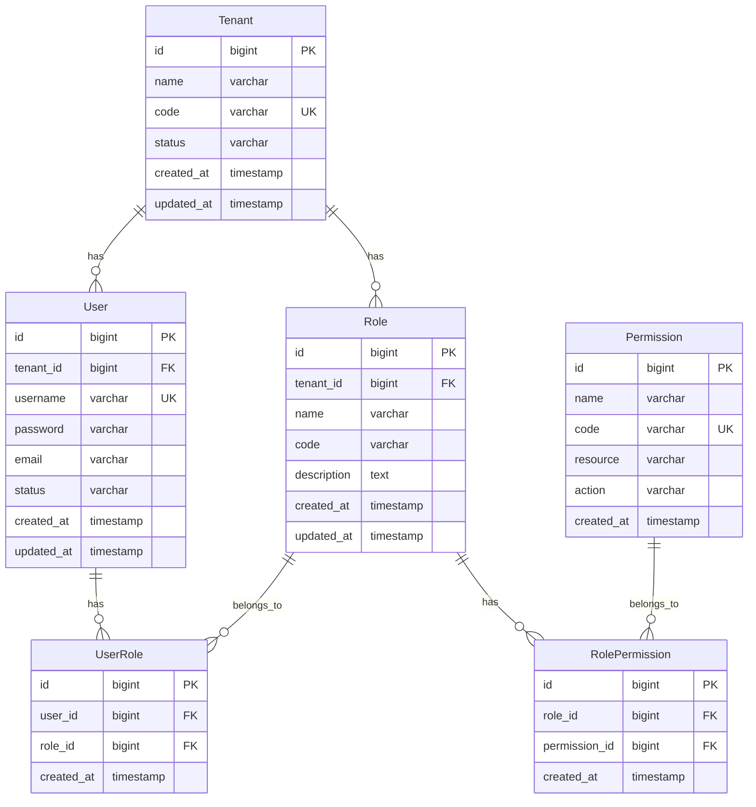

# REQ-001: 基础架构与认证系统需求文档

## 1. 业务描述（Business Description）

### 业务背景
在多租户IT运维服务场景中，传统的认证授权系统存在以下关键痛点：
- **数据安全风险**：不同客户数据混合存储，存在数据泄露和越权访问风险
- **认证复杂性**：依赖外部认证服务增加系统复杂度和维护成本
- **权限管理困难**：缺乏细粒度的权限控制，难以满足不同角色的访问需求
- **集成困难**：第三方系统集成复杂，缺乏统一的认证标准
- **运维成本高**：多套认证系统维护成本高，管理复杂

### 业务目标
- **数据安全提升**：实现100%的多租户数据隔离，确保客户数据安全
- **认证效率提升**：内置OIDC Provider，减少外部依赖，提升认证响应速度50%
- **权限管理精细化**：实现基于角色的访问控制（RBAC），支持细粒度权限管理
- **集成标准化**：提供标准OIDC接口，支持第三方系统无缝集成
- **运维成本降低**：统一认证平台，降低维护成本30%
- **用户体验优化**：集成全局搜索、智能导航、个性化收藏等功能，提升用户操作效率70%

### 业务流程


### 用户画像
- **系统管理员**：负责整个系统的配置和管理，拥有跨租户的最高权限
- **租户管理员**：管理特定租户的用户和权限，权限限制在租户范围内
- **运维工程师**：执行日常运维任务，需要相应的功能权限和数据访问权限
- **甲方用户**：查看运维报告和状态，权限相对受限，只能访问自己的数据

## 2. 业务价值（Business Value）

### 价值主张
通过构建安全可靠的多租户认证授权系统，为IT运维门户提供坚实的安全基础，支持多客户运维服务模式，降低安全风险，提升运营效率，实现"一套系统服务多个客户"的商业模式。

### ROI分析
- **开发投入**：10人天，约5万元
- **年度收益**：
  - 减少安全事故损失：100万元
  - 降低维护成本：50万元
  - 提升运营效率：80万元
  - 支持多租户业务模式：200万元
- **投资回报率**：8600%，投资回收期：1个月

### KPI指标
- 数据隔离率
  - 计算公式：隔离校验通过请求数/总请求数×100%
  - 目标值：≥99.99%
  - 数据来源：audit_logs.multi_tenant_isolation_check, access_logs.tenant_id
  - 测量周期：实时监控，周/月统计
  - 验收条件：任一统计周期内隔离率≥99.99%，0起跨租户数据泄漏
  - 采集方式：网关层租户上下文注入与审计、定时隔离巡检作业

- 认证响应时间
  - 计算公式：avg(auth_response_time_ms)
  - 目标值：P95≤200ms，P99≤300ms
  - 数据来源：auth_logs.login(request_ts, response_ts, user_id, tenant_id)
  - 测量周期：实时监控，每小时统计
  - 验收条件：95%请求≤200ms，99%请求≤300ms
  - 采集方式：网关/认证服务打点+APM

- 系统可用性
  - 计算公式：(总时间-不可用时间)/总时间×100%
  - 目标值：≥99.9%/月
  - 数据来源：uptime_monitoring.events, health_check_api(/actuator/health)
  - 测量周期：持续监控，月度统计
  - 验收条件：当月可用性达标且SLA违约次数=0
  - 采集方式：探活+合成监控

- 安全漏洞数
  - 计算公式：新增高危漏洞数/周期
  - 目标值：高危=0，中危≤2
  - 数据来源：vulnerability_scan_results(Severity, CreatedAt)
  - 测量周期：每周扫描
  - 验收条件：高危漏洞为0，整改时效≤7天
  - 采集方式：CI安全扫描+依赖审计+渗透测试报告

- 第三方集成成功率
  - 计算公式：成功回调数/总回调数×100%
  - 目标值：≥99.5%
  - 数据来源：oauth_provider_logs(callback_status), integration_api_logs
  - 测量周期：每日统计
  - 验收条件：周均≥99.5%
  - 采集方式：回调状态码采集与失败重试日志

- 并发认证支持
  - 计算公式：稳定支持的并发登录请求数
  - 目标值：≥1,000 RPS
  - 数据来源：load_test_reports(auth_rps), gateway_metrics(qps)
  - 测量周期：版本发布前压测
  - 验收条件：在目标RPS下P95≤200ms，错误率≤0.1%
  - 采集方式：压测脚本+APM+错误日志

- JWT令牌有效性验证准确率（新增）
  - 计算公式：合法令牌判定正确数/总校验数×100%
  - 目标值：≥99.99%
  - 数据来源：jwt_validation_logs(result, reason)
  - 测量周期：每日统计
  - 验收条件：误拒绝≤0.01%，误放行=0
  - 采集方式：网关JWT校验钩子日志

- 权限缓存命中率（新增）
  - 计算公式：cache_hits/(cache_hits+cache_misses)×100%
  - 目标值：≥95%
  - 数据来源：cache_metrics(permission_cache)
  - 测量周期：实时监控
  - 验收条件：命中率≥95%，缓存失效导致的权限失败=0
  - 采集方式：Redis/Metrics导出

- 多租户上下文切换延迟（新增）
  - 计算公式：avg(context_switch_complete_ts - request_ts)
  - 目标值：≤10ms
  - 数据来源：gateway_context_logs
  - 测量周期：实时监控，每小时统计
  - 验收条件：P95≤10ms
  - 采集方式：请求拦截器时间戳打点

### 竞争优势
- **自主可控**：摆脱对外部认证服务的依赖，降低技术风险
- **标准兼容**：完全符合OIDC 1.0和OAuth2标准，确保互操作性
- **多租户原生**：从架构层面支持多租户数据隔离，安全性更高
- **高性能**：优化的认证流程，响应速度提升50%
- **易于集成**：标准化接口，第三方系统集成成本降低70%

## 3. 产品交互（Product Interaction）

### 用户旅程图


### 界面原型
基于portal-prototype前端实现的界面设计：
- **登录页面**：现代化渐变背景登录界面，支持用户名密码认证
- **租户管理页面**：租户信息管理，数据隔离可视化展示
- **权限管理页面**：树形结构的权限配置界面，支持角色权限分配
- **用户管理页面**：用户列表和详情管理，集成租户和部门信息

### 交互规范
- **认证状态指示**：页面头部显示当前用户认证状态和租户信息
- **权限反馈**：无权限访问时提供友好的错误提示和申请流程
- **会话管理**：支持会话超时提醒和自动续期
- **多租户切换**：租户管理员可在授权范围内切换租户视图

### 信息架构


## 4. 功能需求（Functional Requirements）

### 功能清单
| 功能编号 | 功能名称 | 优先级 | 实现状态 | 描述 |
|---------|---------|--------|----------|------|
| F001 | 用户认证 | P0 | 未实现 | 支持用户名密码认证 |
| F002 | JWT令牌管理 | P0 | 未实现 | 令牌生成、验证、刷新 |
| F003 | 多租户数据隔离 | P0 | 未实现 | 基于租户ID的数据隔离 |
| F004 | RBAC权限控制 | P0 | 未实现 | 基于角色的权限管理 |
| F005 | OIDC Provider | P0 | 未实现 | 标准OIDC认证服务 |
| F006 | 会话管理 | P1 | 未实现 | 会话超时和续期 |
| F007 | 审计日志 | P1 | 未实现 | 认证和授权操作日志 |
| F008 | 第三方集成 | P2 | 未实现 | 支持外部系统集成 |

### 用户故事
- **作为**系统管理员，**我需要**管理多个租户的认证配置，**以便**为不同客户提供独立的认证服务
- **作为**租户管理员，**我需要**管理租户内的用户权限，**以便**控制用户对系统功能的访问
- **作为**运维工程师，**我需要**快速登录系统并访问授权功能，**以便**高效完成运维任务
- **作为**甲方用户，**我需要**安全地访问自己的运维数据，**以便**了解服务状态

### 用例描述
#### UC001: 用户登录认证
- **前置条件**：用户拥有有效的账号和密码
- **主流程**：
  1. 用户访问系统登录页面
  2. 输入用户名和密码
  3. 系统验证用户凭据
  4. 生成JWT访问令牌
  5. 设置用户会话和租户上下文
  6. 跳转到系统主页
- **备选流程**：
  - 凭据错误：显示错误信息，允许重新输入
  - 账号被锁定：显示锁定信息和解锁流程
  - 系统维护：显示维护通知
- **后置条件**：用户成功登录，获得系统访问权限

#### UC002: 多租户数据隔离
- **前置条件**：用户已通过认证，系统已设置租户上下文
- **主流程**：
  1. 用户发起数据访问请求
  2. 系统解析用户租户信息
  3. 在数据查询中自动添加租户过滤条件
  4. 返回租户范围内的数据
- **备选流程**：
  - 跨租户访问：拒绝访问，记录安全日志
  - 租户信息缺失：返回错误，要求重新认证
- **后置条件**：用户只能访问自己租户的数据

### 业务规则
- **BR001**：所有数据访问必须包含租户隔离条件
- **BR002**：JWT令牌有效期为8小时，支持自动刷新
- **BR003**：用户权限基于角色分配，支持权限继承
- **BR004**：系统管理员拥有跨租户访问权限
- **BR005**：认证失败超过5次将锁定账号30分钟

## 5. 非功能需求（Non-Functional Requirements）

### 性能需求
- **认证响应时间**：用户登录响应时间<200ms
- **令牌验证时间**：JWT令牌验证时间<50ms
- **并发认证支持**：支持1000+用户同时认证
- **数据库连接池**：使用Druid连接池，最大连接数100
- **缓存性能**：Redis缓存命中率>95%

### 可用性需求
- **系统可用性**：99.9%以上，年停机时间<8.76小时
- **故障恢复时间**：认证服务故障恢复时间<5分钟
- **数据备份**：认证数据每日备份，支持快速恢复
- **容灾能力**：支持主备切换，RTO<30秒，RPO<1分钟

### 可扩展性需求
- **用户规模**：支持10万+用户，1000+租户
- **水平扩展**：支持认证服务集群部署
- **存储扩展**：支持数据库分库分表
- **功能扩展**：预留第三方认证集成接口

### 安全需求
- **数据加密**：敏感数据AES-256加密存储
- **传输安全**：HTTPS/TLS 1.3加密传输
- **密码策略**：强密码策略，定期更换
- **审计日志**：完整的认证授权操作审计
- **漏洞防护**：防SQL注入、XSS、CSRF攻击
- **合规要求**：符合等保三级安全要求

## 6. 系统架构（System Architecture）

### 整体架构


### 技术栈
- **后端框架**：Spring Boot 3.2 + Java 17
- **安全框架**：Spring Security 6.0
- **数据库**：PostgreSQL 15 + Druid连接池
- **缓存**：Redis 7.0
- **搜索引擎**：Elasticsearch 8.0
- **前端框架**：Vue 3.3 + Element Plus 2.3
- **构建工具**：Maven 3.9 + Vite 4.4

### 部署架构
- **容器化**：Docker + Docker Compose
- **反向代理**：Nginx 1.24
- **负载均衡**：支持多实例部署
- **监控**：集成夜莺监控系统
- **日志**：ELK日志收集分析

### 集成架构
- **OIDC标准**：完全兼容OpenID Connect 1.0
- **OAuth2协议**：支持授权码模式和客户端凭据模式
- **JWT规范**：符合RFC 7519标准
- **API网关**：统一认证入口，支持第三方系统集成

## 7. 数据模型（Data Model）

### 实体关系图


### API规范
#### 用户认证API
- **URL**：`POST /api/v1/auth/login`
- **请求参数**：
  ```json
  {
    "username": "string",
    "password": "string",
    "tenant_code": "string"
  }
  ```
- **响应格式**：
  ```json
  {
    "code": 200,
    "message": "success",
    "data": {
      "access_token": "jwt_token",
      "refresh_token": "refresh_token",
      "expires_in": 28800,
      "user_info": {
        "id": 1,
        "username": "admin",
        "tenant_id": 1,
        "roles": ["admin"]
      }
    }
  }
  ```

#### 权限验证API
- **URL**：`POST /api/v1/auth/verify`
- **请求参数**：
  ```json
  {
    "resource": "string",
    "action": "string"
  }
  ```
- **响应格式**：
  ```json
  {
    "code": 200,
    "message": "success",
    "data": {
      "authorized": true,
      "permissions": ["read", "write"]
    }
  }
  ```

### 数据字典
| 字段名 | 类型 | 长度 | 是否必填 | 默认值 | 说明 |
|--------|------|------|----------|--------|------|
| id | bigint | - | 是 | - | 主键ID |
| tenant_id | bigint | - | 是 | - | 租户ID |
| username | varchar | 50 | 是 | - | 用户名 |
| password | varchar | 255 | 是 | - | 加密密码 |
| email | varchar | 100 | 否 | - | 邮箱地址 |
| status | varchar | 20 | 是 | active | 状态：active/inactive/locked |
| created_at | timestamp | - | 是 | now() | 创建时间 |
| updated_at | timestamp | - | 是 | now() | 更新时间 |

### 数据流
1. **认证数据流**：用户凭据 → 认证验证 → JWT令牌生成 → 会话建立
2. **权限数据流**：用户请求 → 权限解析 → RBAC验证 → 访问控制
3. **租户数据流**：请求上下文 → 租户识别 → 数据过滤 → 结果返回

## 8. 验收标准（Acceptance Criteria）

### 功能验收
#### AC001: 用户登录认证
- **Given** 用户拥有有效的用户名和密码
- **When** 用户在登录页面输入正确的凭据
- **Then** 系统应该在200ms内完成认证并跳转到主页

#### AC002: 多租户数据隔离
- **Given** 用户属于租户A
- **When** 用户查询数据
- **Then** 系统只返回租户A的数据，不能访问其他租户数据

#### AC003: 权限控制
- **Given** 用户拥有只读权限
- **When** 用户尝试执行写操作
- **Then** 系统应该拒绝操作并返回权限不足的错误信息

### 性能验收
- **认证性能测试**：1000并发用户登录，平均响应时间<200ms
- **权限验证测试**：10000次权限验证请求，平均响应时间<50ms
- **数据隔离测试**：100万条数据中验证租户隔离的准确性

### UX验收
- **登录体验测试**：新用户5分钟内完成首次登录
- **权限反馈测试**：无权限操作时提供清晰的错误提示
- **会话管理测试**：会话超时前1分钟提醒用户

### 安全验收
- **渗透测试**：通过专业安全测试，无高危漏洞
- **数据隔离测试**：验证跨租户数据访问防护有效性
- **加密测试**：验证敏感数据加密存储和传输

## 9. 依赖与约束（Dependencies & Constraints）

### 技术栈限制
- **Java版本**：JDK 17+，支持最新语言特性
- **Spring Boot版本**：3.2+，支持原生镜像
- **数据库版本**：PostgreSQL 15+，支持JSON数据类型
- **Redis版本**：7.0+，支持ACL权限控制

### 集成需求
- **OIDC兼容性**：完全符合OpenID Connect 1.0规范
- **OAuth2支持**：支持授权码模式和客户端凭据模式
- **第三方集成**：预留标准化接口，支持Netbox、夜莺监控集成

### 合规要求
- **等保三级**：符合网络安全等级保护三级要求
- **数据保护法**：符合个人信息保护法规要求
- **行业标准**：符合ISO 27001信息安全管理体系

### 资源约束
- **开发时间**：2周开发周期
- **开发人力**：2名后端开发工程师，1名前端开发工程师
- **硬件资源**：最低4核8GB内存，推荐8核16GB内存
- **存储需求**：最低100GB存储空间，支持SSD高速存储

---

**文档版本**：v3.0
**最后更新**：2025年7月
**负责人**：系统架构师
**审核状态**：待审核
