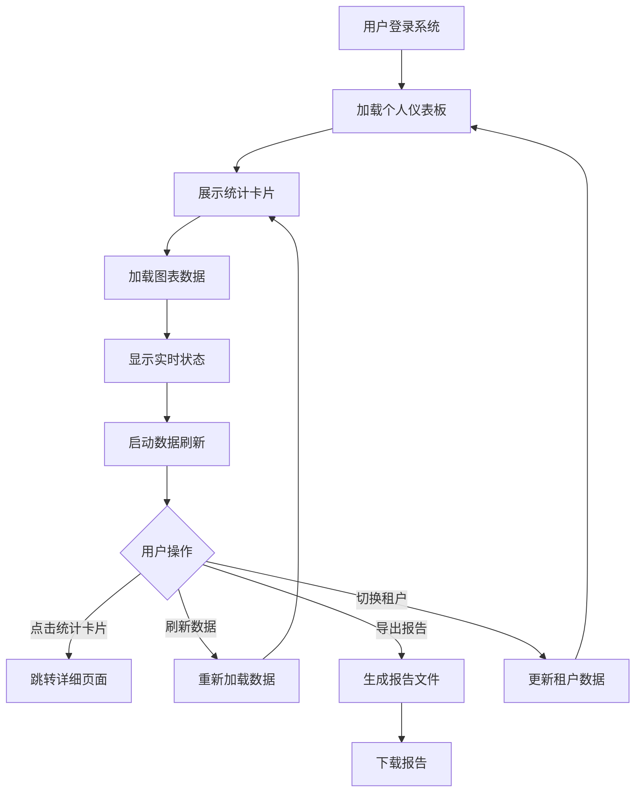
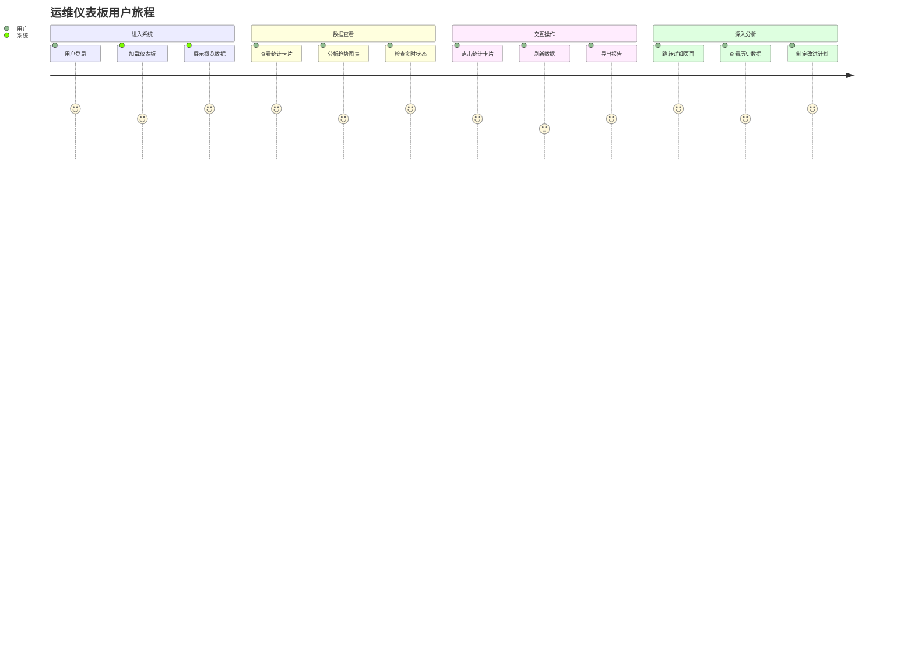
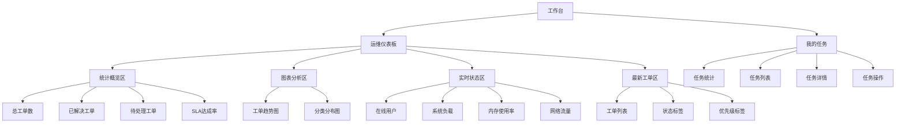
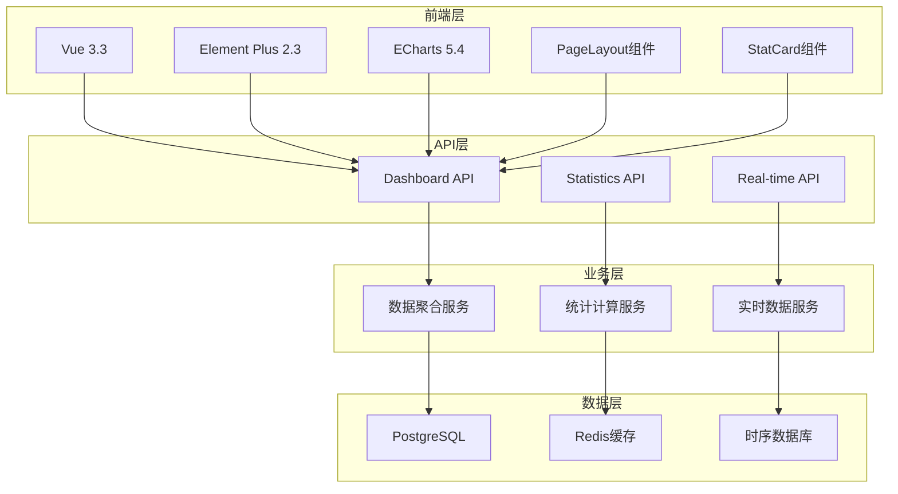
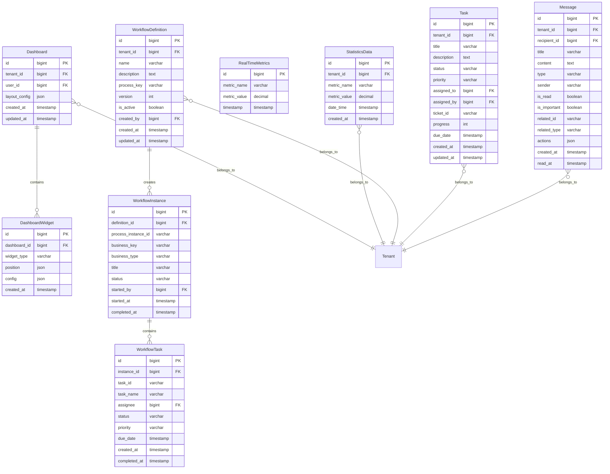

# REQ-002: 工作台与仪表板需求文档

## 1. 业务描述（Business Description）

### 业务背景
在IT运维管理中，运维人员和管理者需要一个统一的工作台来管理日常工作，包括查看系统运行状态、处理工作流审批、管理个人任务和接收消息通知。传统的运维管理系统存在以下痛点：
- **信息分散**：关键运维数据、任务、消息分布在不同系统中，缺乏统一视图
- **工作流程复杂**：审批流程不够直观，缺乏可视化的流程管理工具
- **任务管理混乱**：个人任务分散在各个系统中，难以统一跟踪和管理
- **消息通知滞后**：重要通知不能及时到达，影响工作效率
- **实时性差**：数据更新不及时，影响决策效率
- **可视化不足**：缺乏直观的图表展示，数据理解困难
- **个性化缺失**：无法根据不同角色和租户定制工作台内容
- **移动适配差**：在移动设备上查看体验不佳

### 业务目标
- **统一工作台**：提供一站式工作平台，集成仪表板、工作流、任务、消息等功能
- **高效审批**：通过可视化工作流管理，提升审批效率和流程透明度
- **任务协同**：统一的任务管理平台，支持任务分配、跟踪和协作
- **及时通知**：实时消息推送和通知管理，确保重要信息及时传达
- **统一视图**：提供运维全景概览，一屏掌握关键指标
- **实时监控**：实现秒级数据更新，及时发现异常情况
- **可视化展示**：通过图表和卡片直观展示运维数据
- **个性化定制**：支持多租户和角色的个性化工作台配置
- **移动友好**：响应式设计，支持移动设备访问

### 业务流程


### 用户画像
- **系统管理员**：需要查看全局运维状态，关注系统性能和资源使用，管理系统级工作流程
- **租户管理员**：关注本租户的工单处理情况和服务质量指标，审批租户内部申请
- **运维工程师**：需要快速了解待处理工单和当前任务状态，处理日常运维任务和消息
- **部门经理**：审批下属的各类申请，查看团队工作进展和绩效指标
- **普通员工**：发起各类申请，管理个人任务，接收和处理工作消息
- **甲方用户**：查看服务概览和SLA达成情况，跟踪服务请求进度

## 2. 业务价值（Business Value）

### 价值主张
通过构建统一的工作台平台，集成运维仪表板、任务管理和消息中心，为不同角色用户提供一站式的工作环境，提升工作效率，改善协作质量，增强用户体验。

### ROI分析
- **开发投入**：20人天，约10万元
- **年度收益**：
  - 提升工作效率：节省人力成本120万元
  - 优化审批流程：减少审批时间成本80万元
  - 提升决策效率：节省管理时间成本60万元
  - 减少故障响应时间：避免业务损失80万元
  - 提升用户满意度：增加客户续约收入40万元
  - 降低培训成本：减少用户培训成本20万元
- **投资回报率**：3900%，投资回收期：1个月

### KPI指标
- **页面加载时间**
  - 计算公式：avg(window.loadEventEnd - navigationStart)
  - 目标值：首屏≤1.5秒，完整≤2秒（P95）
  - 数据来源：performance_logs(page_load_time_ms, route)
  - 测量周期：实时监控，每小时统计
  - 验收条件：95%访问满足目标
  - 采集方式：前端Performance API埋点+网关访问日志

- **数据刷新延迟**
  - 计算公式：avg(frontend_render_ts - data_generated_ts)
  - 目标值：≤10秒
  - 数据来源：RealTimeMetrics(timestamp), ws_push_logs
  - 测量周期：实时监控
  - 验收条件：99%更新≤10秒
  - 采集方式：WebSocket心跳与数据时间戳对齐

- **仪表板功能使用率**
  - 计算公式：使用人数/活跃用户×100%
  - 目标值：核心组件≥80%
  - 数据来源：user_action_logs(widget_click), DashboardWidget(config)
  - 测量周期：每周统计
  - 验收条件：主要组件使用率达标
  - 采集方式：前端事件埋点+后端汇总

- **用户停留时间**
  - 计算公式：avg(session_end - session_start)
  - 目标值：≥5分钟
  - 数据来源：user_behavior_logs(session_duration)
  - 测量周期：每日统计
  - 验收条件：日均达标
  - 采集方式：会话开始/离开事件采集

- **移动端适配率**
  - 计算公式：移动端完全可用页面数/总页面×100%
  - 目标值：≥98%
  - 数据来源：device_compatibility_test(results), e2e_mobile_reports
  - 测量周期：每次发布
  - 验收条件：核心流程移动端全通过
  - 采集方式：自动化兼容性测试

- **个性化配置成功率**（新增）
  - 计算公式：配置成功/尝试×100%
  - 目标值：≥99%
  - 数据来源：Dashboard(layout_config)变更日志
  - 测量周期：实时监控
  - 验收条件：成功率≥99%
  - 采集方式：配置保存API响应码追踪

- **实时数据准确性**（新增）
  - 计算公式：对账一致条目/抽样条目×100%
  - 目标值：≥99.9%
  - 数据来源：StatisticsData, source_system_snapshots, data_accuracy_check
  - 测量周期：每5分钟校验
  - 验收条件：关键指标一致性达标
  - 采集方式：定时对账作业+抽样校验

### 竞争优势
- **实时性强**：30秒自动刷新，数据实时性行业领先
- **可视化丰富**：集成ECharts图表库，支持多种图表类型
- **响应式设计**：完美适配PC、平板、手机等设备
- **多租户支持**：原生支持多租户数据隔离和个性化定制

## 3. 产品交互（Product Interaction）

### 用户旅程图


### 界面原型
基于portal-prototype中Dashboard.vue的实际实现：

#### 工作台菜单结构
```
工作台 (Workspace)
├── 运维仪表板 (Dashboard) - 概览中心
└── 我的任务 (MyTasks) - 个人任务管理
```

#### 系统设置菜单结构（工作流管理部分）
```
系统设置 (System)
└── 工作流管理 (Workflow) - 流程定义和模板管理
```

#### 运维仪表板页面
- **页面头部**：标题"运维仪表板"，操作按钮（刷新数据、导出报告），主题切换开关
- **统计卡片区域**：4个统计卡片，显示总工单数、已解决工单、待处理工单、SLA达成率，每个卡片包含趋势指示器和百分比变化
- **图表展示区域**：工单趋势图（折线图）、工单分类分布（饼图），支持图表交互和自适应大小
- **实时状态区域**：在线用户、系统负载、内存使用率、网络流量，实时数据流更新
- **最新工单列表**：显示最近5条工单的基本信息，包含状态标签、优先级标签和创建时间

#### 我的任务页面
- **页面头部**：标题"我的任务"，操作按钮（新建任务、刷新）
- **统计卡片区域**：4个统计卡片，显示总任务、待处理、进行中、已完成任务数量
- **筛选搜索栏**：支持按任务状态、优先级、关键词筛选
- **任务列表**：卡片式展示，包含任务标题、描述、状态、优先级、截止时间、进度等信息
- **任务详情对话框**：点击任务可查看详细信息和执行操作


### 交互规范
- **统计卡片交互**：
  - 支持点击跳转到详细页面
  - 显示趋势指示器（上升/下降箭头和百分比）
  - 鼠标悬停显示更多统计信息
  - 支持卡片的展开/收缩动画效果
- **图表交互**：
  - 支持鼠标悬停显示详细数据tooltip
  - 图例点击切换数据系列显示/隐藏
  - 图表自动适应容器大小变化
  - 支持图表的缩放和重置功能
- **数据刷新**：
  - 支持手动刷新按钮，带加载动画
  - 30秒自动刷新，显示倒计时
  - 实时数据通过WebSocket推送
  - 刷新成功/失败的用户反馈提示
- **响应式适配**：
  - 在不同屏幕尺寸下自动调整布局
  - 移动端优化：卡片垂直排列，图表简化显示
  - 支持横屏/竖屏自动适配
  - 触摸设备的手势支持

### 信息架构


## 4. 功能需求（Functional Requirements）

### 功能清单

#### 运维仪表板功能
| 功能编号 | 功能名称 | 优先级 | 实现状态 | 描述 |
|---------|---------|--------|----------|------|
| F001 | 统计卡片展示 | P0 | 未实现 | 显示关键运维指标统计，支持趋势指示器 |
| F002 | 趋势图表展示 | P0 | 未实现 | 工单趋势折线图和分类分布饼图 |
| F003 | 实时数据监控 | P0 | 未实现 | 系统实时状态监控（在线用户、负载、内存、网络） |
| F004 | 数据自动刷新 | P0 | 未实现 | 30秒自动刷新机制，实时数据流 |
| F005 | 手动数据刷新 | P0 | 未实现 | 用户主动刷新数据，带成功提示 |
| F006 | 报告导出功能 | P1 | 未实现 | 导出仪表板数据报告 |
| F007 | 最新工单列表 | P1 | 未实现 | 显示最近5条工单信息，含状态和优先级标签 |
| F008 | 响应式布局 | P1 | 未实现 | 适配不同设备屏幕，移动端优化 |
| F009 | 统计卡片交互 | P1 | 未实现 | 统计卡片可点击，支持跳转详细页面 |
| F010 | 图表交互功能 | P1 | 未实现 | 图表支持tooltip、图例交互、自适应大小 |
| F011 | 主题适配支持 | P1 | 未实现 | 支持深色/浅色主题切换，图表自适应 |
| F012 | 数据状态管理 | P1 | 未实现 | 加载状态、错误处理、数据验证 |
| F013 | 多租户定制 | P1 | 🔄部分实现 | 租户个性化仪表板配置 |
| F014 | 历史数据查看 | P2 | ❌未实现 | 查看历史趋势数据和时间范围选择 |
| F015 | 仪表板个性化 | P2 | ❌未实现 | 用户自定义仪表板布局和组件 |


#### 我的任务功能
| 功能编号 | 功能名称 | 优先级 | 实现状态 | 描述 |
|---------|---------|--------|----------|------|
| F026 | 任务统计展示 | P0 | 未实现 | 显示总任务、待处理、进行中、已完成任务统计 |
| F027 | 任务列表管理 | P0 | 未实现 | 分页展示任务列表，支持状态和优先级筛选 |
| F028 | 任务搜索过滤 | P1 | 未实现 | 支持按标题、描述、状态、优先级搜索过滤 |
| F029 | 任务详情查看 | P1 | 未实现 | 查看任务的详细信息和相关附件 |
| F030 | 任务状态更新 | P0 | 未实现 | 支持开始任务、完成任务等状态变更 |
| F031 | 任务进度跟踪 | P1 | 未实现 | 显示任务完成进度和时间节点 |
| F032 | 任务创建 | P1 | 🔄部分实现 | 创建新任务并分配给相关人员 |
| F033 | 逾期任务提醒 | P1 | 未实现 | 高亮显示逾期任务并提供提醒 |
| F034 | 关联工单查看 | P1 | 未实现 | 查看任务关联的工单信息 |
| F035 | 任务批量操作 | P2 | ❌未实现 | 支持批量更新任务状态 |


### 用户故事

#### 运维仪表板用户故事
- **作为**运维工程师，**我需要**在仪表板上快速查看待处理工单数量，**以便**合理安排工作优先级
- **作为**租户管理员，**我需要**查看本租户的SLA达成率，**以便**评估服务质量
- **作为**系统管理员，**我需要**监控系统实时状态，**以便**及时发现性能问题
- **作为**甲方用户，**我需要**查看运维服务概览，**以便**了解服务交付情况

#### 工作流管理用户故事
- **作为**部门经理，**我需要**查看待审批的申请列表，**以便**及时处理下属的各类申请
- **作为**员工，**我需要**发起请假申请并跟踪审批进度，**以便**了解申请处理状态
- **作为**流程管理员，**我需要**设计和维护工作流模板，**以便**标准化各类审批流程
- **作为**申请人，**我需要**在申请被拒绝时查看拒绝原因，**以便**重新提交完善的申请

#### 我的任务用户故事
- **作为**运维工程师，**我需要**查看分配给我的任务列表，**以便**按优先级和截止时间安排工作
- **作为**项目经理，**我需要**跟踪团队成员的任务完成进度，**以便**及时调整项目计划
- **作为**技术人员，**我需要**更新任务状态和进度，**以便**让相关人员了解工作进展
- **作为**任务分配者，**我需要**创建任务并指定负责人，**以便**明确工作职责和要求

#### 我的消息用户故事
- **作为**系统用户，**我需要**及时收到工单分配通知，**以便**快速响应和处理
- **作为**审批人，**我需要**收到待审批申请的消息提醒，**以便**及时完成审批工作
- **作为**员工，**我需要**查看系统维护通知，**以便**提前做好工作安排
- **作为**用户，**我需要**管理消息的已读状态和重要性标记，**以便**高效处理各类通知

### 用例描述

#### 运维仪表板用例
##### UC001: 查看运维概览
- **前置条件**：用户已登录系统，拥有仪表板访问权限
- **主流程**：
  1. 用户访问仪表板页面
  2. 系统加载用户权限范围内的统计数据
  3. 显示统计卡片（总工单数、已解决、待处理、SLA达成率）
  4. 加载并显示趋势图表
  5. 展示实时系统状态
  6. 显示最新工单列表
- **备选流程**：
  - 数据加载失败：显示错误提示，提供重试选项
  - 权限不足：显示权限不足提示
- **后置条件**：用户获得完整的运维概览信息

##### UC002: 数据刷新操作
- **前置条件**：用户在仪表板页面
- **主流程**：
  1. 用户点击刷新按钮或等待自动刷新
  2. 系统重新获取最新数据
  3. 更新所有统计卡片数据
  4. 刷新图表显示
  5. 更新实时状态信息
  6. 显示刷新成功提示
- **备选流程**：
  - 网络异常：显示网络错误提示
  - 服务异常：显示服务不可用提示
- **后置条件**：仪表板显示最新数据

##### UC003: 统计卡片交互
- **前置条件**：仪表板已加载，统计卡片显示正常
- **主流程**：
  1. 用户点击任意统计卡片
  2. 系统识别点击的统计项类型
  3. 显示点击反馈提示
  4. 可选择跳转到对应的详细页面
  5. 记录用户交互行为
- **备选流程**：
  - 详细页面不可用：显示功能开发中提示
  - 权限不足：显示权限不足提示
- **后置条件**：用户获得相应的反馈或跳转

##### UC004: 图表交互操作
- **前置条件**：图表已正常渲染显示
- **主流程**：
  1. 用户鼠标悬停在图表数据点上
  2. 显示详细的tooltip信息
  3. 用户可点击图例切换数据系列显示
  4. 图表支持缩放和平移操作（如适用）
  5. 图表自动适应容器大小变化
- **备选流程**：
  - 数据为空：显示暂无数据提示
  - 图表渲染失败：显示图表加载失败提示
- **后置条件**：用户获得详细的数据信息和良好的交互体验

#### 工作流管理用例
##### UC005: 处理审批任务
- **前置条件**：用户已登录系统，拥有审批权限，存在待审批任务
- **主流程**：
  1. 用户访问工作流管理页面
  2. 切换到"我的任务"标签页
  3. 查看待审批任务列表
  4. 点击查看任务详情
  5. 选择同意或拒绝操作
  6. 填写审批意见（如需要）
  7. 提交审批结果
  8. 系统更新任务状态并通知相关人员
- **备选流程**：
  - 任务已被其他人处理：显示任务状态已变更提示
  - 审批权限不足：显示权限不足提示
- **后置条件**：任务审批完成，流程继续或结束

##### UC006: 发起工作流申请
- **前置条件**：用户已登录系统，拥有申请权限
- **主流程**：
  1. 用户点击"发起申请"按钮
  2. 选择申请类型（请假、采购、权限等）
  3. 填写申请表单信息
  4. 上传相关附件（如需要）
  5. 确认申请信息
  6. 提交申请
  7. 系统启动对应的审批流程
  8. 发送通知给相关审批人
- **备选流程**：
  - 表单验证失败：显示错误信息，要求修正
  - 流程模板不存在：显示错误提示
- **后置条件**：申请成功提交，进入审批流程

##### UC007: 跟踪申请进度
- **前置条件**：用户已发起申请，申请正在审批中
- **主流程**：
  1. 用户访问"我的申请"标签页
  2. 查看申请列表和当前状态
  3. 点击查看申请进度
  4. 系统显示审批时间线
  5. 查看每个审批节点的状态和意见
  6. 了解当前审批人和预计完成时间
- **备选流程**：
  - 申请已完成：显示最终审批结果
  - 申请被撤回：显示撤回状态
- **后置条件**：用户了解申请的详细进度信息

#### 我的任务用例
##### UC008: 管理个人任务
- **前置条件**：用户已登录系统，存在分配的任务
- **主流程**：
  1. 用户访问"我的任务"页面
  2. 查看任务统计和列表
  3. 使用筛选条件查找特定任务
  4. 点击查看任务详情
  5. 更新任务状态（开始/完成）
  6. 更新任务进度（如适用）
  7. 添加任务备注或说明
- **备选流程**：
  - 任务已逾期：高亮显示并提供提醒
  - 任务被重新分配：显示分配变更通知
- **后置条件**：任务状态更新，相关人员收到通知

##### UC009: 创建新任务
- **前置条件**：用户已登录系统，拥有任务创建权限
- **主流程**：
  1. 用户点击"新建任务"按钮
  2. 填写任务基本信息（标题、描述、优先级）
  3. 设置任务截止时间
  4. 选择任务负责人
  5. 关联相关工单（如适用）
  6. 保存并发布任务
  7. 系统发送任务分配通知
- **备选流程**：
  - 负责人不存在：显示用户选择错误
  - 截止时间无效：显示时间设置错误
- **后置条件**：新任务创建成功，负责人收到通知

#### 我的消息用例
##### UC010: 管理个人消息
- **前置条件**：用户已登录系统，存在消息通知
- **主流程**：
  1. 用户访问"我的消息"页面
  2. 查看消息统计和列表
  3. 使用筛选条件查找特定消息
  4. 点击查看消息详情
  5. 标记消息为已读/未读
  6. 标记重要消息
  7. 执行消息中的相关操作（如审批、查看工单等）
- **备选流程**：
  - 消息已过期：显示过期状态
  - 相关操作不可用：显示操作限制提示
- **后置条件**：消息状态更新，用户完成相关操作

##### UC011: 批量消息操作
- **前置条件**：用户在消息列表页面，存在多条消息
- **主流程**：
  1. 用户选择多条消息（复选框）
  2. 选择批量操作（全部已读、删除等）
  3. 确认批量操作
  4. 系统执行批量处理
  5. 显示操作结果统计
- **备选流程**：
  - 部分消息操作失败：显示失败详情
  - 操作权限不足：显示权限限制提示
- **后置条件**：选中消息的状态批量更新

### 业务规则

#### 运维仪表板业务规则
- **BR001**：统计数据必须基于用户的租户权限进行过滤
- **BR002**：自动刷新间隔为30秒，可在系统配置中调整
- **BR003**：图表数据默认显示最近7天的趋势
- **BR004**：实时状态数据更新频率为5秒，使用WebSocket推送
- **BR005**：导出报告包含当前页面的所有可见数据
- **BR006**：统计卡片必须显示趋势指示器（上升/下降百分比）
- **BR007**：工单列表默认显示最近5条记录，按创建时间倒序
- **BR008**：图表必须支持响应式设计，自动适应容器大小
- **BR009**：所有数据加载失败时必须提供重试机制
- **BR010**：实时数据流在页面卸载时必须正确清理，避免内存泄漏

#### 工作流管理业务规则
- **BR011**：工作流任务必须按照优先级和截止时间排序显示
- **BR012**：审批操作必须记录审批人、时间和意见
- **BR013**：申请撤回只能在审批未完成时执行
- **BR014**：流程模板的使用次数和平均时长必须实时统计
- **BR015**：审批超时的任务必须自动提醒和升级处理
- **BR016**：同一申请不能同时被多人审批，需要加锁机制
- **BR017**：流程设计必须包含开始节点和结束节点
- **BR018**：审批意见为必填项，拒绝操作必须填写拒绝原因
- **BR019**：申请表单的必填字段验证必须在前端和后端同时进行
- **BR020**：工作流实例的状态变更必须记录完整的审计日志

#### 我的任务业务规则
- **BR021**：任务列表必须按照优先级（紧急>高>中>低）和截止时间排序
- **BR022**：逾期任务必须在列表中高亮显示并标记逾期状态
- **BR023**：任务状态变更必须通知任务创建者和相关人员
- **BR024**：任务进度更新只能由任务负责人执行
- **BR025**：已完成的任务不能再次修改状态和进度
- **BR026**：任务的截止时间不能早于当前时间
- **BR027**：任务创建时必须指定明确的负责人和截止时间
- **BR028**：关联工单的任务状态应与工单状态保持同步
- **BR029**：任务搜索结果必须基于用户权限进行过滤
- **BR030**：任务统计数据必须实时更新，反映最新状态

#### 我的消息业务规则
- **BR031**：消息列表必须按照重要性和时间排序（重要消息优先，时间倒序）
- **BR032**：未读消息必须在界面上明显标识（红点、高亮等）
- **BR033**：系统消息的保留期限为30天，过期自动清理
- **BR034**：重要消息不受自动清理规则影响，需手动删除
- **BR035**：消息的相关操作必须验证用户权限
- **BR036**：批量操作的消息数量限制为100条
- **BR037**：消息推送必须支持实时通知和离线存储
- **BR038**：消息内容必须支持富文本格式和链接跳转
- **BR039**：消息删除操作不可恢复，需要用户确认
- **BR040**：消息统计数据必须实时更新，包括未读数量变化

## 5. 非功能需求（Non-Functional Requirements）

### 性能需求
- **页面加载时间**：首次加载<2秒，后续访问<1秒
- **数据刷新时间**：单次数据刷新<500ms
- **图表渲染时间**：ECharts图表渲染<300ms
- **并发支持**：支持500+用户同时访问仪表板
- **内存使用**：前端内存占用<100MB

### 可用性需求
- **系统可用性**：99.5%以上
- **数据准确性**：统计数据准确率>99.9%
- **自动恢复**：数据加载失败时自动重试3次
- **降级策略**：关键数据不可用时显示缓存数据

### 可扩展性需求
- **数据量支持**：支持100万+工单数据统计
- **租户规模**：支持1000+租户独立仪表板
- **图表扩展**：支持新增自定义图表类型
- **组件扩展**：支持新增统计卡片和监控指标

### 安全需求
- **数据隔离**：多租户数据完全隔离
- **权限控制**：基于角色的数据访问控制
- **敏感信息**：敏感数据脱敏显示
- **审计日志**：记录仪表板访问和操作日志

## 6. 系统架构（System Architecture）

### 整体架构


### 技术栈
- **前端框架**：Vue 3.3 + Composition API
- **UI组件**：Element Plus 2.3
- **图表库**：ECharts 5.4 + Vue-ECharts 6.6
- **状态管理**：Pinia 2.1
- **构建工具**：Vite 4.4
- **后端框架**：Spring Boot 3.2 + Java 17
- **数据库**：PostgreSQL 15 + Redis 7

### 部署架构
- **CDN加速**：静态资源CDN分发
- **负载均衡**：支持多实例部署
- **缓存策略**：Redis缓存热点数据
- **监控告警**：集成系统监控

### 集成架构
- **数据源集成**：工单系统、监控系统、用户系统
- **实时数据**：WebSocket实时推送
- **第三方集成**：支持外部数据源接入

## 7. 数据模型（Data Model）

### 实体关系图


### API规范

#### 运维仪表板API
##### 获取仪表板数据API
- **URL**：`GET /api/v1/dashboard/overview`
- **请求参数**：
  ```json
  {
    "tenant_id": "bigint",
    "date_range": "string",
    "refresh": "boolean"
  }
  ```
- **响应格式**：
  ```json
  {
    "code": 200,
    "message": "success",
    "data": {
      "statistics": {
        "total_tickets": 1250,
        "resolved_tickets": 1100,
        "pending_tickets": 150,
        "sla_compliance": 95.5
      },
      "trends": {
        "ticket_trends": [...],
        "category_distribution": [...]
      },
      "real_time": {
        "active_users": 45,
        "system_load": "2.1",
        "memory_usage": 78,
        "network_traffic": "125.6"
      },
      "recent_tickets": [...]
    }
  }
  ```

##### 实时数据推送API
- **URL**：`WebSocket /ws/dashboard/realtime`
- **连接参数**：
  ```json
  {
    "tenant_id": "bigint",
    "user_id": "bigint",
    "token": "string"
  }
  ```
- **推送格式**：
  ```json
  {
    "type": "real_time_update",
    "data": {
      "active_users": 47,
      "system_load": "2.3",
      "memory_usage": 82,
      "network_traffic": "130.2",
      "timestamp": "2025-07-21T10:30:00Z"
    }
  }
  ```

##### 统计卡片详情API
- **URL**：`GET /api/v1/dashboard/statistics/{type}`
- **请求参数**：
  ```json
  {
    "type": "total_tickets|resolved_tickets|pending_tickets|sla_compliance",
    "tenant_id": "bigint",
    "date_range": "string"
  }
  ```
- **响应格式**：
  ```json
  {
    "code": 200,
    "message": "success",
    "data": {
      "current_value": 1250,
      "previous_value": 1180,
      "trend_percentage": 5.9,
      "trend_direction": "up",
      "details": {
        "breakdown": [...],
        "time_series": [...]
      }
    }
  }
  ```

##### 图表数据API
- **URL**：`GET /api/v1/dashboard/charts/{chart_type}`
- **请求参数**：
  ```json
  {
    "chart_type": "ticket_trends|category_distribution",
    "tenant_id": "bigint",
    "date_range": "string",
    "granularity": "hour|day|week"
  }
  ```
- **响应格式**：
  ```json
  {
    "code": 200,
    "message": "success",
    "data": {
      "chart_config": {
        "type": "line|pie",
        "title": "工单趋势分析",
        "x_axis": [...],
        "y_axis": [...],
        "series": [...]
      },
      "raw_data": [...]
    }
  }
  ```

#### 工作流管理API
##### 获取工作流统计API
- **URL**：`GET /api/v1/workflow/statistics`
- **请求参数**：
  ```json
  {
    "tenant_id": "bigint",
    "user_id": "bigint",
    "date_range": "string"
  }
  ```
- **响应格式**：
  ```json
  {
    "code": 200,
    "message": "success",
    "data": {
      "pending_approvals": 23,
      "completed_approvals": 156,
      "avg_processing_time": "2.5小时",
      "approval_rate": "94.2%"
    }
  }
  ```

##### 获取我的任务API
- **URL**：`GET /api/v1/workflow/my-tasks`
- **请求参数**：
  ```json
  {
    "user_id": "bigint",
    "status": "pending|in_progress|completed",
    "page": "int",
    "size": "int"
  }
  ```
- **响应格式**：
  ```json
  {
    "code": 200,
    "message": "success",
    "data": {
      "total": 25,
      "tasks": [
        {
          "id": "string",
          "title": "张三的请假申请",
          "type": "请假申请",
          "applicant": "张三",
          "current_step": "部门经理审批",
          "priority": "中",
          "deadline": "2024-01-16T18:00:00Z",
          "status": "待审批",
          "created_at": "2024-01-15T09:00:00Z"
        }
      ]
    }
  }
  ```

##### 处理审批任务API
- **URL**：`POST /api/v1/workflow/tasks/{task_id}/approve`
- **请求参数**：
  ```json
  {
    "action": "approve|reject|transfer",
    "comment": "string",
    "transfer_to": "bigint"
  }
  ```
- **响应格式**：
  ```json
  {
    "code": 200,
    "message": "审批成功",
    "data": {
      "task_id": "string",
      "new_status": "approved",
      "next_approver": "string"
    }
  }
  ```

##### 发起申请API
- **URL**：`POST /api/v1/workflow/applications`
- **请求参数**：
  ```json
  {
    "type": "请假申请|设备采购|权限申请|系统变更",
    "title": "string",
    "content": "string",
    "priority": "紧急|高|中|低",
    "attachments": ["string"],
    "form_data": {}
  }
  ```
- **响应格式**：
  ```json
  {
    "code": 200,
    "message": "申请提交成功",
    "data": {
      "application_id": "string",
      "workflow_instance_id": "string",
      "status": "submitted"
    }
  }
  ```

#### 我的任务API
##### 获取任务统计API
- **URL**：`GET /api/v1/tasks/statistics`
- **请求参数**：
  ```json
  {
    "user_id": "bigint",
    "tenant_id": "bigint"
  }
  ```
- **响应格式**：
  ```json
  {
    "code": 200,
    "message": "success",
    "data": {
      "total": 15,
      "pending": 5,
      "in_progress": 3,
      "completed": 7
    }
  }
  ```

##### 获取任务列表API
- **URL**：`GET /api/v1/tasks`
- **请求参数**：
  ```json
  {
    "user_id": "bigint",
    "status": "pending|in_progress|completed|overdue",
    "priority": "high|medium|low",
    "keyword": "string",
    "page": "int",
    "size": "int"
  }
  ```
- **响应格式**：
  ```json
  {
    "code": 200,
    "message": "success",
    "data": {
      "total": 15,
      "tasks": [
        {
          "id": "bigint",
          "title": "修复生产环境数据库连接问题",
          "description": "string",
          "status": "pending",
          "priority": "high",
          "assigned_by": "张经理",
          "created_at": "2024-01-15T09:00:00Z",
          "due_date": "2024-01-15T18:00:00Z",
          "ticket_id": "T001",
          "progress": 0,
          "is_overdue": false
        }
      ]
    }
  }
  ```

##### 更新任务状态API
- **URL**：`PUT /api/v1/tasks/{task_id}/status`
- **请求参数**：
  ```json
  {
    "status": "pending|in_progress|completed",
    "progress": "int",
    "notes": "string"
  }
  ```
- **响应格式**：
  ```json
  {
    "code": 200,
    "message": "任务状态更新成功",
    "data": {
      "task_id": "bigint",
      "new_status": "in_progress",
      "updated_at": "2024-01-15T10:00:00Z"
    }
  }
  ```

#### 我的消息API
##### 获取消息统计API
- **URL**：`GET /api/v1/messages/statistics`
- **请求参数**：
  ```json
  {
    "user_id": "bigint"
  }
  ```
- **响应格式**：
  ```json
  {
    "code": 200,
    "message": "success",
    "data": {
      "total": 25,
      "unread": 8,
      "important": 5,
      "today": 3
    }
  }
  ```

##### 获取消息列表API
- **URL**：`GET /api/v1/messages`
- **请求参数**：
  ```json
  {
    "user_id": "bigint",
    "type": "system|ticket|task|approval",
    "status": "read|unread",
    "important_only": "boolean",
    "keyword": "string",
    "page": "int",
    "size": "int"
  }
  ```
- **响应格式**：
  ```json
  {
    "code": 200,
    "message": "success",
    "data": {
      "total": 25,
      "messages": [
        {
          "id": "bigint",
          "title": "工单 #T001 已分配给您",
          "content": "string",
          "type": "ticket",
          "sender": "系统自动",
          "created_at": "2024-01-15T09:30:00Z",
          "is_read": false,
          "is_important": true,
          "related_id": "T001",
          "actions": [
            {
              "key": "view",
              "label": "查看工单",
              "type": "primary"
            }
          ]
        }
      ]
    }
  }
  ```

##### 更新消息状态API
- **URL**：`PUT /api/v1/messages/{message_id}/status`
- **请求参数**：
  ```json
  {
    "is_read": "boolean",
    "is_important": "boolean"
  }
  ```
- **响应格式**：
  ```json
  {
    "code": 200,
    "message": "消息状态更新成功",
    "data": {
      "message_id": "bigint",
      "updated_at": "2024-01-15T10:00:00Z"
    }
  }
  ```

##### 批量操作消息API
- **URL**：`POST /api/v1/messages/batch`
- **请求参数**：
  ```json
  {
    "message_ids": ["bigint"],
    "action": "mark_read|mark_important|delete",
    "value": "boolean"
  }
  ```
- **响应格式**：
  ```json
  {
    "code": 200,
    "message": "批量操作成功",
    "data": {
      "success_count": 5,
      "failed_count": 0,
      "failed_ids": []
    }
  }
  ```

### 数据字典

#### 仪表板相关表
| 字段名 | 类型 | 长度 | 是否必填 | 默认值 | 说明 |
|--------|------|------|----------|--------|------|
| id | bigint | - | 是 | - | 主键ID |
| tenant_id | bigint | - | 是 | - | 租户ID |
| metric_name | varchar | 100 | 是 | - | 指标名称 |
| metric_value | decimal | 10,2 | 是 | - | 指标值 |
| widget_type | varchar | 50 | 是 | - | 组件类型：stat_card/chart/table |
| layout_config | json | - | 否 | {} | 布局配置 |
| position | json | - | 否 | {} | 组件位置信息 |

#### 工作流相关表
| 字段名 | 类型 | 长度 | 是否必填 | 默认值 | 说明 |
|--------|------|------|----------|--------|------|
| process_key | varchar | 100 | 是 | - | 流程定义唯一标识 |
| process_instance_id | varchar | 100 | 是 | - | Flowable流程实例ID |
| business_key | varchar | 100 | 是 | - | 业务关联键 |
| business_type | varchar | 50 | 是 | - | 业务类型：TICKET/LEAVE/PURCHASE等 |
| task_id | varchar | 100 | 是 | - | Flowable任务ID |
| assignee | bigint | - | 是 | - | 任务分配人ID |
| status | varchar | 20 | 是 | - | 状态：pending/in_progress/completed/rejected |
| priority | varchar | 20 | 是 | medium | 优先级：urgent/high/medium/low |

#### 任务相关表
| 字段名 | 类型 | 长度 | 是否必填 | 默认值 | 说明 |
|--------|------|------|----------|--------|------|
| title | varchar | 200 | 是 | - | 任务标题 |
| description | text | - | 否 | - | 任务描述 |
| assigned_to | bigint | - | 是 | - | 任务负责人ID |
| assigned_by | bigint | - | 是 | - | 任务分配人ID |
| ticket_id | varchar | 50 | 否 | - | 关联工单ID |
| progress | int | - | 否 | 0 | 完成进度（0-100） |
| due_date | timestamp | - | 是 | - | 截止时间 |

#### 消息相关表
| 字段名 | 类型 | 长度 | 是否必填 | 默认值 | 说明 |
|--------|------|------|----------|--------|------|
| recipient_id | bigint | - | 是 | - | 消息接收人ID |
| title | varchar | 200 | 是 | - | 消息标题 |
| content | text | - | 是 | - | 消息内容 |
| type | varchar | 20 | 是 | - | 消息类型：system/ticket/task/approval |
| sender | varchar | 100 | 是 | - | 发送人 |
| is_read | boolean | - | 否 | false | 是否已读 |
| is_important | boolean | - | 否 | false | 是否重要 |
| related_id | varchar | 100 | 否 | - | 关联对象ID |
| related_type | varchar | 50 | 否 | - | 关联对象类型 |
| actions | json | - | 否 | - | 可执行操作配置 |
| read_at | timestamp | - | 否 | - | 阅读时间 |

### 数据流
1. **统计数据流**：业务数据 → 数据聚合 → 统计计算 → 缓存存储 → API返回
2. **实时数据流**：监控数据 → 实时处理 → WebSocket推送 → 前端更新
3. **图表数据流**：历史数据 → 时间序列处理 → 图表配置 → ECharts渲染
4. **工作流数据流**：申请提交 → 流程引擎 → 任务分配 → 审批处理 → 状态更新 → 通知推送
5. **任务数据流**：任务创建 → 任务分配 → 状态跟踪 → 进度更新 → 完成通知
6. **消息数据流**：事件触发 → 消息生成 → 推送队列 → 实时通知 → 状态同步

## 8. 验收标准（Acceptance Criteria）

### 功能验收

#### 运维仪表板验收标准
##### AC001: 仪表板数据展示
- **Given** 用户已登录并有仪表板访问权限
- **When** 用户访问仪表板页面
- **Then** 应该在2秒内显示完整的统计数据和图表

##### AC002: 数据刷新功能
- **Given** 用户在仪表板页面
- **When** 用户点击刷新按钮
- **Then** 应该在500ms内更新所有数据并显示成功提示

##### AC003: 多租户数据隔离
- **Given** 用户属于特定租户
- **When** 用户查看仪表板数据
- **Then** 只能看到本租户的数据，不能访问其他租户数据

##### AC004: 统计卡片交互
- **Given** 仪表板已加载完成
- **When** 用户点击任意统计卡片
- **Then** 应该显示点击反馈并提供跳转或详情展示功能

##### AC005: 图表交互功能
- **Given** 图表已正常渲染
- **When** 用户鼠标悬停在图表数据点上
- **Then** 应该显示详细的tooltip信息，图例点击应能切换数据系列

##### AC006: 实时数据更新
- **Given** WebSocket连接已建立
- **When** 后端推送实时数据更新
- **Then** 前端应在5秒内更新实时状态显示

#### 工作流管理验收标准
##### AC007: 工作流任务处理
- **Given** 用户有待审批的工作流任务
- **When** 用户访问工作流管理页面的"我的任务"标签
- **Then** 应该显示所有待审批任务列表，支持审批操作

##### AC008: 申请发起功能
- **Given** 用户有申请发起权限
- **When** 用户点击"发起申请"并填写完整表单
- **Then** 应该成功提交申请并启动对应的审批流程

##### AC009: 审批操作执行
- **Given** 用户有审批权限且存在待审批任务
- **When** 用户选择同意或拒绝操作并提交
- **Then** 应该更新任务状态并通知下一审批人或申请人

##### AC010: 申请进度跟踪
- **Given** 用户已发起申请
- **When** 用户查看"我的申请"中的进度详情
- **Then** 应该显示完整的审批时间线和当前状态

##### AC011: 流程模板使用
- **Given** 系统中存在可用的流程模板
- **When** 用户选择使用某个模板发起申请
- **Then** 应该自动填充模板配置并启动对应流程

#### 我的任务验收标准
##### AC012: 任务列表展示
- **Given** 用户有分配的任务
- **When** 用户访问"我的任务"页面
- **Then** 应该显示任务统计卡片和完整的任务列表

##### AC013: 任务筛选搜索
- **Given** 用户在任务列表页面
- **When** 用户使用状态、优先级或关键词筛选
- **Then** 应该实时更新列表显示符合条件的任务

##### AC014: 任务状态更新
- **Given** 用户有任务操作权限
- **When** 用户更新任务状态（开始/完成）
- **Then** 应该成功更新状态并发送通知给相关人员

##### AC015: 任务详情查看
- **Given** 用户点击查看任务详情
- **When** 任务详情对话框打开
- **Then** 应该显示完整的任务信息和可执行操作

##### AC016: 逾期任务提醒
- **Given** 存在逾期的任务
- **When** 用户查看任务列表
- **Then** 逾期任务应该高亮显示并标记为逾期状态

#### 我的消息验收标准
##### AC017: 消息列表展示
- **Given** 用户有消息通知
- **When** 用户访问"我的消息"页面
- **Then** 应该显示消息统计卡片和完整的消息列表

##### AC018: 消息筛选搜索
- **Given** 用户在消息列表页面
- **When** 用户使用类型、状态或关键词筛选
- **Then** 应该实时更新列表显示符合条件的消息

##### AC019: 消息状态管理
- **Given** 用户有消息操作权限
- **When** 用户标记消息为已读或重要
- **Then** 应该成功更新消息状态并更新统计数据

##### AC020: 消息批量操作
- **Given** 用户选择了多条消息
- **When** 用户执行批量操作（全部已读、删除等）
- **Then** 应该成功处理所有选中消息并显示操作结果

##### AC021: 消息详情查看
- **Given** 用户点击查看消息详情
- **When** 消息详情对话框打开
- **Then** 应该显示完整的消息内容和可执行操作

##### AC022: 消息操作执行
- **Given** 消息包含可执行操作（如审批、查看工单）
- **When** 用户点击执行操作
- **Then** 应该正确跳转到对应页面或执行对应功能

### 性能验收
- **加载性能测试**：100并发用户访问，页面加载时间<2秒
- **刷新性能测试**：数据刷新操作响应时间<500ms
- **图表渲染测试**：复杂图表渲染时间<300ms
- **内存使用测试**：长时间使用内存占用<100MB
- **WebSocket性能测试**：实时数据推送延迟<5秒

### UX验收
- **易用性测试**：新用户3分钟内理解仪表板功能
- **响应式测试**：在手机、平板、PC上显示正常
- **交互测试**：所有交互操作有明确的视觉反馈
- **主题适配测试**：深色/浅色主题切换正常，图表自适应
- **动画效果测试**：卡片展开、数据更新等动画流畅自然
- **触摸设备测试**：移动设备上的触摸交互体验良好

### 安全验收
- **权限测试**：验证不同角色的数据访问权限
- **数据隔离测试**：验证多租户数据隔离有效性
- **敏感数据测试**：验证敏感信息脱敏显示

## 9. 依赖与约束（Dependencies & Constraints）

### 技术栈限制
- **Vue版本**：Vue 3.3+，使用Composition API
- **ECharts版本**：5.4+，支持最新图表类型
- **Element Plus版本**：2.3+，确保组件兼容性
- **浏览器支持**：Chrome 90+, Firefox 88+, Safari 14+

### 集成需求
- **工单系统集成**：依赖工单管理系统提供数据
- **监控系统集成**：依赖系统监控提供实时数据
- **用户系统集成**：依赖认证系统提供用户权限

### 合规要求
- **数据保护**：符合个人信息保护法规
- **访问控制**：符合企业安全管理要求
- **审计要求**：满足操作审计和日志记录要求

### 资源约束
- **开发时间**：2周开发周期
- **开发人力**：1名前端开发工程师，1名后端开发工程师
- **性能要求**：支持500+并发用户访问
- **存储需求**：统计数据保留1年，实时数据保留7天

---

**文档版本**：v3.0
**最后更新**：2025年7月
**负责人**：前端架构师
**审核状态**：待审核
