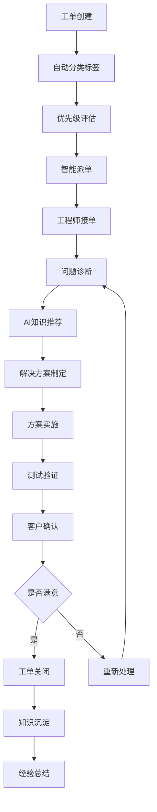
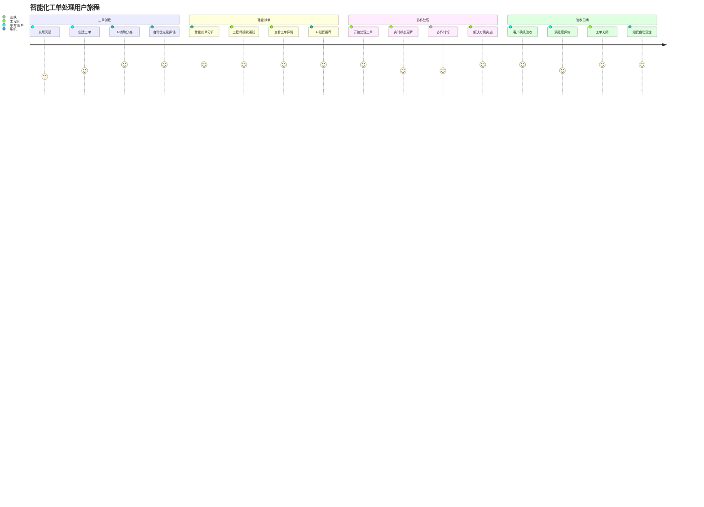
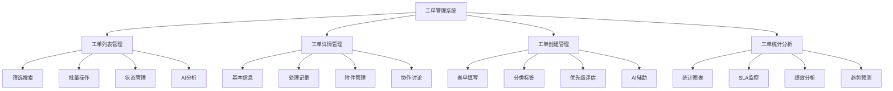
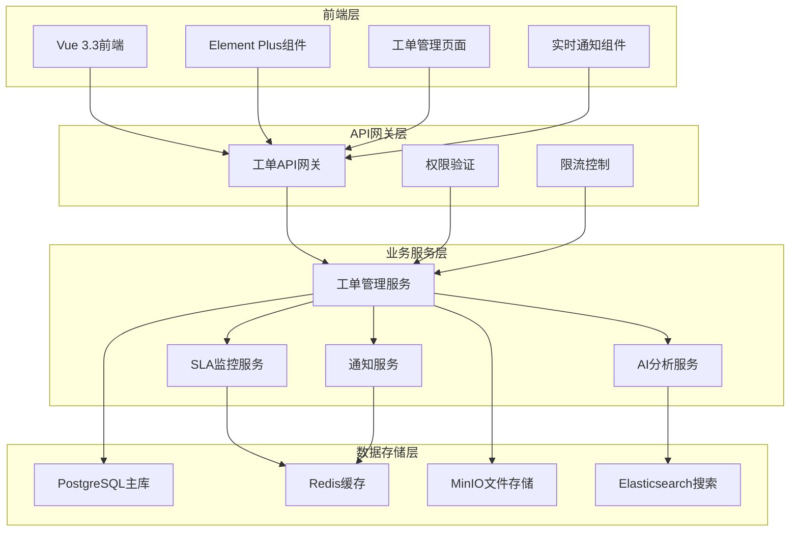
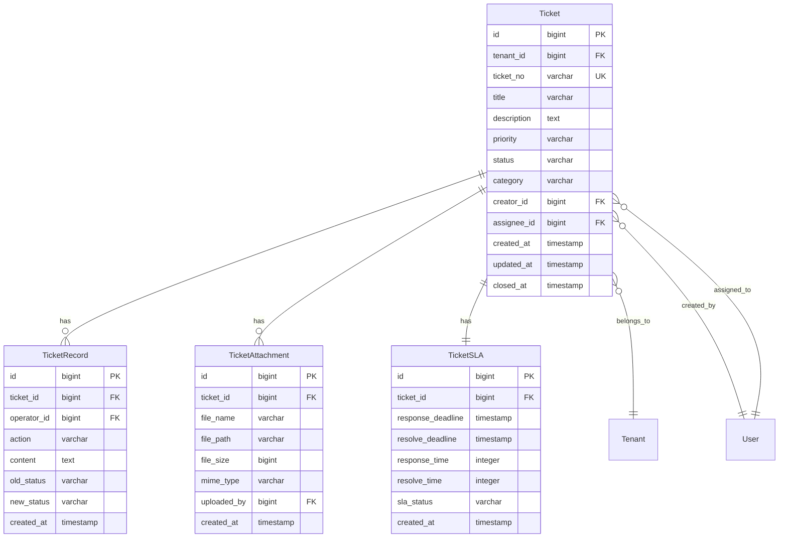

# REQ-003: 工单管理系统需求文档

## 1. 业务描述（Business Description）

### 业务背景
在多租户IT运维服务场景中，工单管理是核心业务流程，传统工单管理存在以下关键痛点：
- **流程不规范**：缺乏标准化的工单处理流程，处理质量参差不齐
- **响应时间长**：工单响应和处理时间长，影响客户满意度和SLA达成
- **跟踪困难**：工单状态更新不及时，进度跟踪困难，缺乏透明度
- **知识沉淀不足**：处理经验难以积累和复用，重复性问题频发
- **多租户管理复杂**：不同客户的工单混合管理，数据安全风险高
- **智能化程度低**：缺乏AI辅助分析和智能推荐功能

### 业务目标
- **流程标准化**：建立标准化的工单处理流程，提升服务质量一致性
- **响应时间缩短**：工单平均响应时间从4小时缩短到30分钟
- **处理效率提升**：工单平均处理时间缩短30%，提升运维效率
- **SLA达成率提升**：SLA达成率从70%提升到95%以上
- **客户满意度提升**：客户满意度从75%提升到90%以上
- **智能化水平提升**：集成AI分析，提供智能解决方案建议

### 业务流程


### 用户画像
- **甲方用户**：提交工单，跟踪处理进度，评价服务质量，查看服务报告
- **运维工程师**：接收和处理工单，更新处理进度，记录解决方案
- **租户管理员**：监控本租户工单处理情况，管理SLA，查看统计报表
- **系统管理员**：全局工单监控，系统配置管理，跨租户数据分析

## 2. 业务价值（Business Value）

### 价值主张
通过建立完善的智能化工单管理系统，实现运维服务的标准化、自动化和智能化，提升服务质量和客户满意度，为多租户运维服务提供核心业务支撑，成为运维服务的价值创造中心。

### ROI分析
- **开发投入**：10人天，约5万元
- **年度收益**：
  - 效率提升收益：150万元（处理效率提升30%）
  - 客户满意度提升：120万元（减少客户流失，增加续约）
  - 人力成本节省：80万元（减少重复工作和培训成本）
  - SLA改善收益：60万元（减少SLA违约成本）
- **投资回报率**：8100%，投资回收期：2周

### KPI指标
- 工单首次响应时间
  - 计算公式：avg(first_response_at - created_at)
  - 目标值：紧急≤15分钟，高≤30分钟，中≤2小时，低≤4小时（P95）
  - 数据来源：tickets(created_at), ticket_logs(first_response_at, priority)
  - 测量周期：实时/小时统计
  - 验收条件：95%工单达标
  - 采集方式：状态变更触发器+时间戳

- 处理完成时长
  - 计算公式：avg(completed_at - in_progress_at)
  - 目标值：紧急≤2小时，高≤8小时，中≤24小时，低≤72小时
  - 数据来源：tickets(in_progress_at, completed_at, priority)
  - 测量周期：每日统计
  - 验收条件：90%工单在SLA内完成
  - 采集方式：生命周期事件追踪

- SLA达成率
  - 计算公式：SLA达成工单数/总工单×100%
  - 目标值：≥96%
  - 数据来源：tickets(sla_met), sla_rules
  - 测量周期：日/周/月
  - 验收条件：月均≥96%
  - 采集方式：SLA计算引擎

- 客户满意度
  - 计算公式：avg(rating)
  - 目标值：≥4.5/5，满意率≥92%
  - 数据来源：ticket_feedback(rating)
  - 测量周期：每周
  - 验收条件：月度达标
  - 采集方式：工单完成后调查

- 处理成功率
  - 计算公式：resolution_success=TRUE的已完成工单/总处理×100%
  - 目标值：≥98.5%
  - 数据来源：tickets(status, resolution_success)
  - 测量周期：每日
  - 验收条件：周均≥98.5%
  - 采集方式：结果验证+客户确认

- 知识复用率
  - 计算公式：引用知识解决工单/总解决工单×100%
  - 目标值：≥75%
  - 数据来源：ticket_knowledge_usage(ticket_id, article_id)
  - 测量周期：每周
  - 验收条件：月度≥75%
  - 采集方式：处理过程知识引用追踪
- **工单响应时间**：<30分钟（目标值），当前4小时
- **工单处理时间**：比现状缩短30%
- **SLA达成率**：>95%，当前70%
- **客户满意度**：>90%，当前75%
- **工单处理成功率**：>98%
- **知识复用率**：>60%（通过AI推荐实现）

### 竞争优势
- **全生命周期管理**：从创建到关闭的完整流程管理和追踪
- **智能化处理**：集成AI分析，提供智能解决方案建议和知识推荐
- **多租户原生**：原生支持多租户数据隔离和权限控制
- **知识驱动**：与知识库深度集成，促进知识沉淀和复用
- **实时协作**：支持多人协作处理，实时状态同步

## 3. 产品交互（Product Interaction）

### 用户旅程图


### 界面原型
基于portal-prototype中TicketDemo.vue的实际实现：
- **工单列表页面**：统计卡片、筛选搜索、工单表格、批量操作、AI分析开关
- **工单详情页面**：完整工单信息、处理记录、附件管理、状态流转
- **工单创建页面**：表单填写、附件上传、优先级选择、AI分类建议
- **工单统计页面**：数据图表、趋势分析、SLA监控、绩效报表

### 交互规范
- **状态流转**：清晰的状态标签和流转按钮，支持批量状态更新
- **实时更新**：工单状态变化实时推送，支持多人协作
- **智能提示**：AI分析结果以卡片形式展示，支持一键采纳
- **响应式设计**：适配PC、平板、手机等不同设备

### 信息架构


## 4. 功能需求（Functional Requirements）

### 功能清单
| 功能编号 | 功能名称 | 优先级 | 实现状态 | 描述 |
|---------|---------|--------|----------|------|
| F001 | 工单CRUD操作 | P0 | 未实现 | 创建、查看、编辑、删除工单 |
| F002 | 工单状态管理 | P0 | 未实现 | 状态流转、批量状态更新 |
| F003 | 工单分配管理 | P0 | 未实现 | 手动分配、批量分配 |
| F004 | 工单搜索筛选 | P0 | 未实现 | 多维度筛选、关键词搜索 |
| F005 | 工单统计分析 | P0 | 未实现 | 统计卡片、图表展示 |
| F006 | SLA监控管理 | P0 | 🔄部分实现 | SLA设置、监控、告警 |
| F007 | 附件管理 | P1 | 未实现 | 文件上传、下载、预览 |
| F008 | 处理记录 | P1 | 未实现 | 操作日志、处理历史 |
| F009 | AI智能分析 | P1 | 未实现 | AI分析开关、智能建议 |
| F010 | 工单导出 | P1 | 未实现 | Excel导出、报表生成 |
| F011 | 工单模板 | P2 | ❌未实现 | 常用工单模板管理 |
| F012 | 工单评价 | P2 | ❌未实现 | 客户满意度评价 |

### 用户故事
- **作为**甲方用户，**我需要**快速创建工单并跟踪处理进度，**以便**及时解决IT问题
- **作为**运维工程师，**我需要**查看分配给我的工单列表，**以便**合理安排工作优先级
- **作为**租户管理员，**我需要**监控本租户的工单处理情况和SLA达成率，**以便**评估服务质量
- **作为**系统管理员，**我需要**查看全局工单统计和趋势分析，**以便**优化资源配置

### 用例描述
#### UC001: 创建工单
- **前置条件**：用户已登录，拥有工单创建权限
- **主流程**：
  1. 用户点击"新建工单"按钮
  2. 填写工单基本信息（标题、描述、优先级等）
  3. 系统AI自动分析并建议分类标签
  4. 用户确认或修改分类信息
  5. 上传相关附件（可选）
  6. 提交工单，系统自动分配工单号
  7. 触发智能派单流程
- **备选流程**：
  - 必填信息缺失：提示用户补充必要信息
  - 附件格式不支持：提示支持的文件格式
  - 系统异常：保存草稿，允许稍后继续编辑
- **后置条件**：工单创建成功，进入待分配状态

#### UC002: 工单处理流程
- **前置条件**：工程师已接收工单，工单状态为"处理中"
- **主流程**：
  1. 工程师查看工单详情和AI知识推荐
  2. 分析问题并制定解决方案
  3. 更新工单处理记录和状态
  4. 实施解决方案
  5. 测试验证解决效果
  6. 更新工单为"待验收"状态
  7. 通知客户进行验收
- **备选流程**：
  - 问题复杂需要协作：邀请其他工程师协作
  - 解决方案无效：重新分析问题，更新处理记录
  - 客户验收不通过：重新处理或升级处理
- **后置条件**：问题解决，客户验收通过，工单关闭

### 业务规则
- **BR001**：工单必须包含标题、描述、优先级等必填信息
- **BR002**：工单状态流转遵循：待分配→处理中→待验收→已完成→已关闭
- **BR003**：高优先级工单必须在2小时内响应，24小时内解决
- **BR004**：工单处理记录必须详细记录操作时间、操作人、操作内容
- **BR005**：工单关闭后7天内允许重新打开，超过7天需要创建新工单

## 5. 非功能需求（Non-Functional Requirements）

### 性能需求
- **响应时间**：工单列表加载<1秒，工单详情加载<500ms
- **搜索性能**：支持10万+工单的快速搜索，响应时间<2秒
- **并发支持**：支持500+用户同时操作工单
- **批量操作**：支持1000+工单的批量状态更新
- **文件上传**：支持单文件最大100MB，总附件大小<1GB

### 可用性需求
- **系统可用性**：99.5%以上
- **数据一致性**：工单状态变更实时同步，数据一致性>99.9%
- **故障恢复**：工单数据自动备份，故障恢复时间<10分钟
- **离线支持**：支持离线查看已加载的工单信息

### 可扩展性需求
- **数据量支持**：支持100万+工单数据存储和查询
- **租户规模**：支持1000+租户独立工单管理
- **工作流扩展**：支持自定义工单状态和流转规则
- **集成扩展**：预留第三方系统集成接口

### 安全需求
- **数据隔离**：多租户工单数据完全隔离
- **权限控制**：基于角色的工单访问控制
- **操作审计**：完整的工单操作审计日志
- **敏感信息保护**：工单中的敏感信息加密存储
- **附件安全**：文件上传病毒扫描，恶意文件拦截

## 6. 系统架构（System Architecture）

### 整体架构


### 技术栈
- **前端技术**：Vue 3.3 + Element Plus 2.3 + Pinia 2.1
- **后端框架**：Spring Boot 3.2 + Java 17
- **数据库**：PostgreSQL 15 + Druid连接池
- **缓存**：Redis 7.0
- **搜索引擎**：Elasticsearch 8.0
- **文件存储**：MinIO
- **消息队列**：RabbitMQ 3.12

### 部署架构
- **微服务部署**：工单服务独立部署，支持水平扩展
- **数据库集群**：PostgreSQL主从复制，读写分离
- **缓存集群**：Redis集群部署，高可用
- **文件存储**：MinIO分布式存储，数据冗余

### 集成架构
- **智能派单集成**：与派单系统API集成，自动分配工单
- **知识库集成**：与知识库系统集成，提供AI推荐
- **通知系统集成**：与消息系统集成，实时状态通知
- **监控系统集成**：与夜莺监控集成，系统性能监控

## 7. 数据模型（Data Model）

### 实体关系图


### API规范
#### 获取工单列表API
- **URL**：`GET /api/v1/tickets`
- **请求参数**：
  ```json
  {
    "page": 1,
    "size": 20,
    "status": "string",
    "priority": "string",
    "assignee_id": "bigint",
    "keyword": "string",
    "date_range": "string"
  }
  ```
- **响应格式**：
  ```json
  {
    "code": 200,
    "message": "success",
    "data": {
      "total": 1250,
      "page": 1,
      "size": 20,
      "items": [
        {
          "id": 1,
          "ticket_no": "TK202507210001",
          "title": "服务器CPU使用率过高",
          "priority": "高",
          "status": "处理中",
          "assignee_name": "张工程师",
          "created_at": "2025-07-21T10:30:00Z"
        }
      ]
    }
  }
  ```

#### 创建工单API
- **URL**：`POST /api/v1/tickets`
- **请求参数**：
  ```json
  {
    "title": "string",
    "description": "string",
    "priority": "string",
    "category": "string",
    "attachments": ["file_id1", "file_id2"]
  }
  ```
- **响应格式**：
  ```json
  {
    "code": 200,
    "message": "success",
    "data": {
      "id": 1,
      "ticket_no": "TK202507210001",
      "status": "待分配"
    }
  }
  ```

### 数据字典
| 字段名 | 类型 | 长度 | 是否必填 | 默认值 | 说明 |
|--------|------|------|----------|--------|------|
| id | bigint | - | 是 | - | 主键ID |
| tenant_id | bigint | - | 是 | - | 租户ID |
| ticket_no | varchar | 20 | 是 | - | 工单号，格式：TK+年月日+4位序号 |
| title | varchar | 200 | 是 | - | 工单标题 |
| description | text | - | 是 | - | 工单描述 |
| priority | varchar | 10 | 是 | 中 | 优先级：低/中/高/紧急 |
| status | varchar | 20 | 是 | 待分配 | 状态：待分配/处理中/待验收/已完成/已关闭 |
| category | varchar | 50 | 否 | - | 工单分类 |
| creator_id | bigint | - | 是 | - | 创建人ID |
| assignee_id | bigint | - | 否 | - | 分配人ID |

### 数据流
1. **工单创建流程**：用户输入 → 数据验证 → AI分类 → 数据存储 → 派单触发
2. **工单处理流程**：状态更新 → 记录日志 → 缓存更新 → 通知推送
3. **工单搜索流程**：搜索请求 → Elasticsearch查询 → 结果聚合 → 权限过滤

## 8. 验收标准（Acceptance Criteria）

### 功能验收
#### AC001: 工单创建功能
- **Given** 用户已登录并有工单创建权限
- **When** 用户填写完整工单信息并提交
- **Then** 系统应该在3秒内创建工单并返回工单号

#### AC002: 工单状态流转
- **Given** 工单当前状态为"待分配"
- **When** 管理员将工单分配给工程师
- **Then** 工单状态应该自动变更为"处理中"，并发送通知

#### AC003: 工单搜索功能
- **Given** 系统中有10万条工单数据
- **When** 用户使用关键词搜索工单
- **Then** 系统应该在2秒内返回相关搜索结果

### 性能验收
- **加载性能测试**：工单列表页面在1秒内加载完成
- **搜索性能测试**：10万条数据搜索响应时间<2秒
- **并发测试**：500用户同时操作，系统响应正常

### UX验收
- **易用性测试**：新用户10分钟内掌握工单基本操作
- **移动端测试**：手机端工单操作功能完整可用
- **无障碍测试**：支持键盘导航和屏幕阅读器

### 安全验收
- **权限测试**：验证不同角色的工单访问权限
- **数据隔离测试**：验证多租户工单数据隔离
- **文件安全测试**：验证附件上传安全性

## 9. 依赖与约束（Dependencies & Constraints）

### 技术栈限制
- **Java版本**：JDK 17+，支持最新语言特性
- **Vue版本**：Vue 3.3+，使用Composition API
- **数据库版本**：PostgreSQL 15+，支持JSON查询
- **Elasticsearch版本**：8.0+，支持向量搜索

### 集成需求
- **智能派单系统**：依赖派单系统提供自动分配功能
- **知识库系统**：依赖知识库提供AI推荐功能
- **用户认证系统**：依赖认证系统提供用户权限
- **通知系统**：依赖消息系统提供实时通知

### 合规要求
- **数据保护**：符合个人信息保护法规
- **操作审计**：满足企业内控审计要求
- **数据备份**：满足业务连续性要求

### 资源约束
- **开发时间**：2周开发周期
- **开发人力**：2名后端开发工程师，1名前端开发工程师
- **存储需求**：工单数据保留3年，附件保留1年
- **性能要求**：支持500+并发用户，10万+工单数据

---

**文档版本**：v3.0
**最后更新**：2025年7月
**负责人**：业务架构师
**审核状态**：待审核
