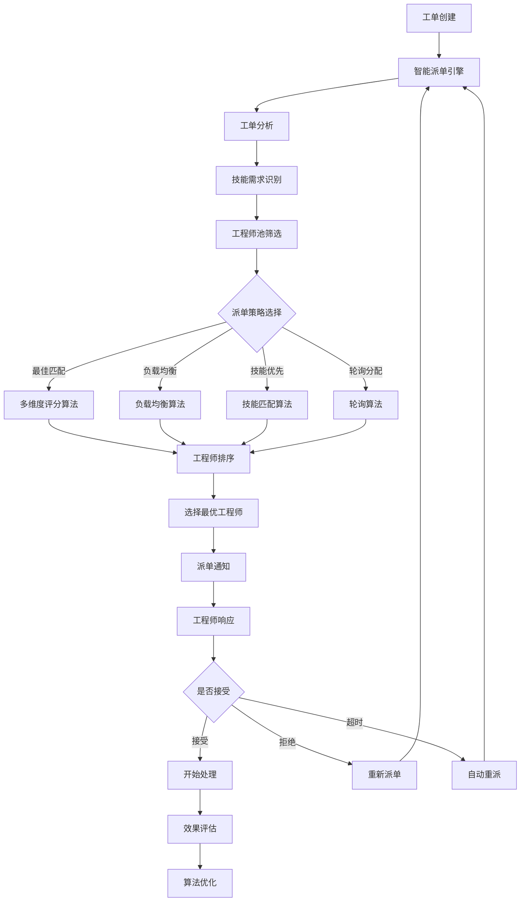
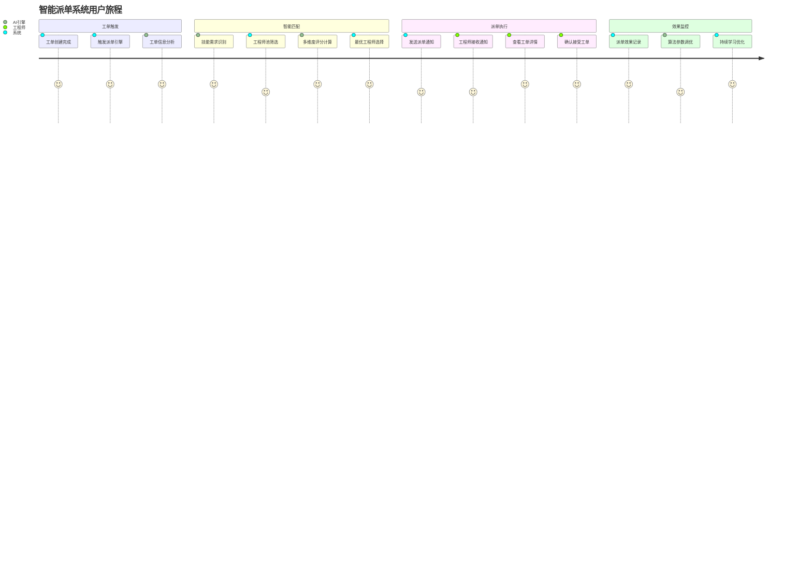
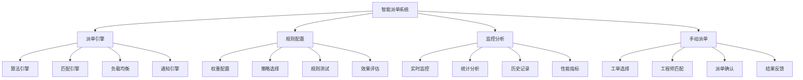
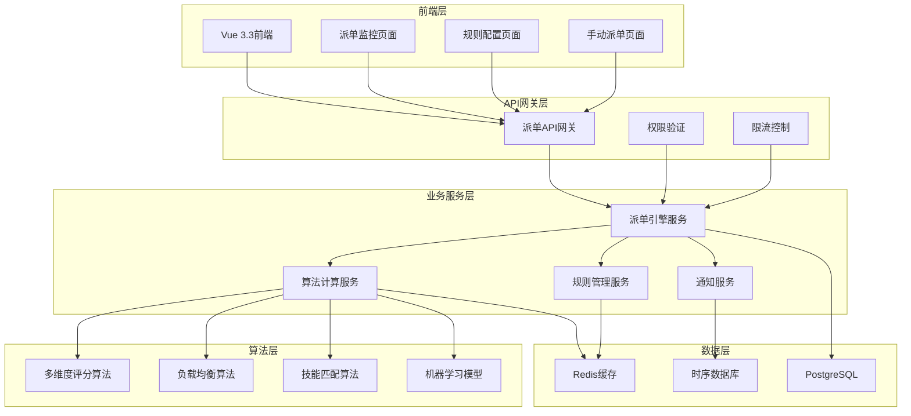
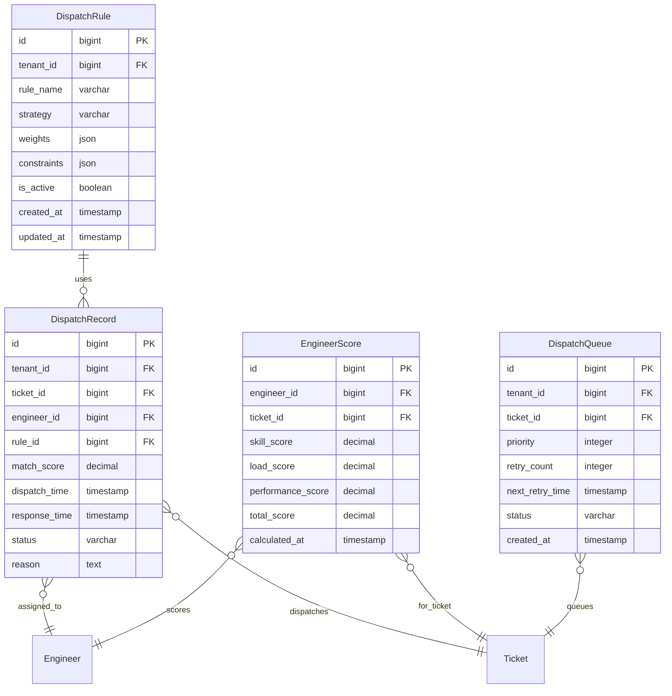

# REQ-004: 智能派单系统需求文档

## 1. 业务描述（Business Description）

### 业务背景
在多租户IT运维服务场景中，智能派单是提升服务效率和质量的核心环节，传统人工派单存在以下关键痛点：
- **派单效率低**：人工派单耗时长，平均需要15-30分钟，影响响应速度
- **资源配置不均**：工程师负载不均衡，部分工程师过载，部分闲置，资源浪费严重
- **技能匹配度低**：派单时难以准确匹配工程师技能，导致处理效率低下和返工率高
- **决策依赖经验**：派单决策主要依赖管理员经验，缺乏数据支撑，主观性强
- **多租户复杂性**：不同租户的工程师资源和服务要求差异大，管理复杂
- **缺乏优化机制**：无法根据历史数据优化派单策略，持续改进困难

### 业务目标
- **派单效率提升**：自动化派单，将派单时间从15-30分钟缩短到30秒内
- **负载均衡优化**：实现工程师负载均衡，负载方差降低70%
- **技能匹配精准**：技能匹配准确率达到95%以上
- **响应时间缩短**：工单响应时间缩短60%，提升客户满意度
- **派单成功率提升**：派单成功率达到98%以上，减少重新派单
- **智能化水平提升**：基于机器学习的派单算法，持续优化派单效果

### 业务流程


### 用户画像
- **运维管理员**：配置派单规则，监控派单效果，处理异常情况
- **工程师**：接收派单通知，确认或拒绝工单，关注工作负载
- **租户管理员**：查看本租户派单统计，评估服务质量
- **系统管理员**：监控派单系统性能，优化算法参数

## 2. 业务价值（Business Value）

### 价值主张
通过AI驱动的智能派单系统，实现工单的自动化、精准化、智能化分配，大幅提升运维效率，优化资源配置，提高客户满意度，为多租户运维服务提供核心竞争力和差异化优势。

### ROI分析
- **开发投入**：12人天，约6万元
- **年度收益**：
  - 人力成本节省：120万元（减少派单人工成本和管理成本）
  - 效率提升收益：180万元（工单处理效率提升40%）
  - 客户满意度提升：100万元（减少客户流失，增加续约）
  - 资源优化收益：80万元（工程师资源利用率提升）
- **投资回报率**：7900%，投资回收期：2周

### KPI指标
- 派单响应时间
  - 计算公式：avg(complete_time - request_time)
  - 目标值：系统响应P95≤300ms，业务派单≤20秒
  - 数据来源：dispatch_logs(request_time, complete_time)
  - 测量周期：实时监控
  - 验收条件：99%派单在目标内
  - 采集方式：算法执行打点

- 技能匹配准确率
  - 计算公式：匹配成功派单/总派单×100%
  - 目标值：≥96%
  - 数据来源：dispatch_results(match_ok), feedback_corrections
  - 测量周期：每日
  - 验收条件：周均≥96%
  - 采集方式：结果反馈与纠偏

- 负载均衡效果
  - 计算公式：variance(工程师当前工单/时段工作量)
  - 目标值：方差≤0.12
  - 数据来源：engineer_workload(current_load, time_window)
  - 测量周期：每小时
  - 验收条件：日均≤0.12
  - 采集方式：实时工作量聚合

- 派单成功率（接受率）
  - 计算公式：accepted/total×100%
  - 目标值：≥98.5%
  - 数据来源：dispatch_results(acceptance_status)
  - 测量周期：每日
  - 验收条件：周均≥98.5%
  - 采集方式：接受/拒绝事件追踪

- 工单处理效率提升
  - 计算公式：(AI派单均处理时长-人工派单均处理时长)/人工×100%
  - 目标值：≥42%提升
  - 数据来源：performance_comparison(processing_time, mode)
  - 测量周期：每月
  - 验收条件：季度达标
  - 采集方式：A/B对比

- AI模型准确率（新增）
  - 计算公式：正确预测派单/总预测×100%
  - 目标值：≥97%
  - 数据来源：ai_model_predictions(accuracy)
  - 测量周期：每日
  - 验收条件：连续4周达标
  - 采集方式：离线评估+在线对比

- 自学习效果（新增）
  - 计算公式：(本月准确率-上月)/上月×100%
  - 目标值：月环比≥0.5%
  - 数据来源：algorithm_performance(monthly_accuracy)
  - 测量周期：每月
  - 验收条件：连续2个季度正增长
  - 采集方式：版本性能归档
- **技能匹配准确率**：>95%
- **负载均衡效果**：工程师负载方差<0.15
- **派单成功率**：>98%（工程师接受率）
- **工单处理效率**：提升40%
- **客户满意度**：>90%

### 竞争优势
- **AI算法驱动**：多维度智能评分，比传统规则引擎准确率提升50%
- **实时动态调整**：根据工程师状态和历史表现实时调整派单策略
- **多租户原生**：原生支持多租户场景的派单隔离和个性化配置
- **自学习能力**：基于历史数据持续优化算法，派单效果不断提升
- **可视化配置**：直观的规则配置界面，降低使用门槛

## 3. 产品交互（Product Interaction）

### 用户旅程图


### 界面原型
基于portal-prototype中DispatchDemo.vue的实际实现：
- **派单监控页面**：待派单队列、工程师状态、派单统计、实时监控
- **派单规则配置**：权重设置、策略选择、规则测试、效果评估
- **手动派单界面**：工单信息、工程师选择、匹配度显示、派单确认
- **派单历史分析**：派单记录、成功率统计、效果分析、优化建议

### 交互规范
- **实时状态更新**：派单队列和工程师状态实时刷新
- **智能推荐显示**：以匹配度百分比形式展示推荐结果
- **批量操作支持**：支持批量自动派单和批量手动派单
- **异常处理提示**：派单失败时提供明确的错误信息和处理建议

### 信息架构


## 4. 功能需求（Functional Requirements）

### 功能清单
| 功能编号 | 功能名称 | 优先级 | 实现状态 | 描述 |
|---------|---------|--------|----------|------|
| F001 | 自动派单引擎 | P0 | 未实现 | 基于算法的自动派单 |
| F002 | 多维度评分算法 | P0 | 未实现 | 技能、负载、历史表现综合评分 |
| F003 | 派单策略配置 | P0 | 未实现 | 最佳匹配、负载均衡、技能优先、轮询 |
| F004 | 工程师技能匹配 | P0 | 未实现 | 基于技能标签的精准匹配 |
| F005 | 负载均衡算法 | P0 | 未实现 | 工程师工作负载动态平衡 |
| F006 | 手动派单功能 | P0 | 未实现 | 管理员手动指定工程师 |
| F007 | 批量派单操作 | P1 | 未实现 | 批量自动派单和手动派单 |
| F008 | 派单规则测试 | P1 | 未实现 | 规则配置测试和效果预览 |
| F009 | 派单监控统计 | P1 | 未实现 | 实时监控和统计分析 |
| F010 | 派单历史记录 | P1 | 未实现 | 派单记录查询和分析 |
| F011 | 智能学习优化 | P2 | 🔄部分实现 | 基于历史数据的算法优化 |
| F012 | 派单效果评估 | P2 | 🔄部分实现 | 派单质量评估和改进建议 |

### 用户故事
- **作为**运维管理员，**我需要**配置智能派单规则，**以便**根据业务需求优化派单策略
- **作为**工程师，**我需要**及时接收派单通知，**以便**快速响应和处理工单
- **作为**系统管理员，**我需要**监控派单系统性能，**以便**确保系统稳定运行
- **作为**租户管理员，**我需要**查看派单统计数据，**以便**评估服务质量

### 用例描述
#### UC001: 自动智能派单
- **前置条件**：工单已创建，派单规则已配置，有可用工程师
- **主流程**：
  1. 工单创建触发派单引擎
  2. 分析工单技能需求和优先级
  3. 筛选符合条件的工程师池
  4. 执行多维度评分算法
  5. 根据配置策略选择最优工程师
  6. 发送派单通知给工程师
  7. 记录派单结果和评分详情
- **备选流程**：
  - 无可用工程师：进入等待队列，定时重试
  - 工程师拒绝：自动重新派单给次优工程师
  - 派单超时：升级处理或转手动派单
- **后置条件**：工单成功分配给工程师，开始处理流程

#### UC002: 派单规则配置
- **前置条件**：用户拥有派单规则配置权限
- **主流程**：
  1. 进入派单规则配置页面
  2. 设置技能、负载、绩效等权重参数
  3. 选择派单策略（最佳匹配/负载均衡等）
  4. 配置特殊规则和约束条件
  5. 测试规则配置效果
  6. 保存并激活新规则
- **备选流程**：
  - 参数配置错误：提示错误信息，要求修正
  - 测试结果不理想：提供优化建议
- **后置条件**：新的派单规则生效，影响后续派单

### 业务规则
- **BR001**：派单必须考虑工程师的技能匹配度、当前负载、历史表现
- **BR002**：高优先级工单优先派给高技能工程师
- **BR003**：工程师当前负载超过80%时不参与自动派单
- **BR004**：同一工程师连续拒绝3次派单后暂停1小时
- **BR005**：派单通知发出后15分钟内无响应视为超时

## 5. 非功能需求（Non-Functional Requirements）

### 性能需求
- **派单响应时间**：自动派单算法执行时间<500ms
- **并发处理能力**：支持100+工单同时派单
- **算法计算性能**：1000名工程师的匹配计算<2秒
- **通知发送速度**：派单通知发送延迟<3秒
- **数据查询性能**：派单历史查询响应时间<1秒

### 可用性需求
- **系统可用性**：99.5%以上
- **派单成功率**：>98%（工程师接受率）
- **算法准确性**：技能匹配准确率>95%
- **故障恢复**：派单服务故障恢复时间<5分钟
- **数据一致性**：派单状态实时同步，一致性>99.9%

### 可扩展性需求
- **工程师规模**：支持10000+工程师的派单计算
- **工单处理量**：支持每日10万+工单的派单处理
- **算法扩展**：支持新增自定义派单算法
- **规则扩展**：支持复杂的业务规则配置
- **多租户扩展**：支持1000+租户独立派单配置

### 安全需求
- **数据隔离**：多租户派单数据完全隔离
- **权限控制**：基于角色的派单操作权限控制
- **操作审计**：完整的派单操作审计日志
- **算法安全**：防止恶意操作影响派单公平性

## 6. 系统架构（System Architecture）

### 整体架构


### 技术栈
- **前端技术**：Vue 3.3 + Element Plus 2.3 + ECharts 5.4
- **后端框架**：Spring Boot 3.2 + Java 17
- **算法引擎**：自研算法 + 机器学习库
- **数据库**：PostgreSQL 15 + Redis 7 + InfluxDB
- **消息队列**：RabbitMQ 3.12
- **缓存策略**：Redis集群 + 本地缓存

### 部署架构
- **微服务部署**：派单服务独立部署，支持水平扩展
- **算法服务集群**：算法计算服务集群部署，负载均衡
- **缓存集群**：Redis集群，高可用配置
- **数据库集群**：PostgreSQL主从复制，读写分离

### 集成架构
- **工单系统集成**：接收工单创建事件，触发派单流程
- **工程师系统集成**：获取工程师技能、负载、状态信息
- **通知系统集成**：发送派单通知和状态更新
- **知识库集成**：获取历史处理经验，优化匹配算法

## 7. 数据模型（Data Model）

### 实体关系图


### API规范
#### 自动派单API
- **URL**：`POST /api/v1/dispatch/auto`
- **请求参数**：
  ```json
  {
    "ticket_id": "bigint",
    "rule_id": "bigint",
    "force_dispatch": "boolean"
  }
  ```
- **响应格式**：
  ```json
  {
    "code": 200,
    "message": "success",
    "data": {
      "dispatch_id": 1,
      "engineer_id": 123,
      "engineer_name": "张工程师",
      "match_score": 95.5,
      "estimated_time": "2025-07-21T11:00:00Z"
    }
  }
  ```

#### 获取派单统计API
- **URL**：`GET /api/v1/dispatch/statistics`
- **请求参数**：
  ```json
  {
    "tenant_id": "bigint",
    "date_range": "string",
    "engineer_id": "bigint"
  }
  ```
- **响应格式**：
  ```json
  {
    "code": 200,
    "message": "success",
    "data": {
      "total_dispatches": 1250,
      "success_rate": 98.5,
      "avg_response_time": 180,
      "avg_match_score": 92.3,
      "load_balance_variance": 0.12
    }
  }
  ```

### 数据字典
| 字段名 | 类型 | 长度 | 是否必填 | 默认值 | 说明 |
|--------|------|------|----------|--------|------|
| id | bigint | - | 是 | - | 主键ID |
| tenant_id | bigint | - | 是 | - | 租户ID |
| strategy | varchar | 20 | 是 | best_match | 派单策略：best_match/load_balance/skill_priority/round_robin |
| weights | json | - | 是 | {} | 权重配置：skill/load/performance |
| match_score | decimal | 5,2 | 是 | - | 匹配得分：0-100 |
| status | varchar | 20 | 是 | pending | 派单状态：pending/dispatched/accepted/rejected/timeout |
| retry_count | integer | - | 是 | 0 | 重试次数 |

### 数据流
1. **派单触发流程**：工单创建 → 派单队列 → 算法计算 → 结果存储
2. **算法计算流程**：工程师筛选 → 多维度评分 → 排序选择 → 结果返回
3. **状态更新流程**：派单执行 → 状态变更 → 缓存更新 → 通知推送

## 8. 验收标准（Acceptance Criteria）

### 功能验收
#### AC001: 自动派单功能
- **Given** 有新工单创建且有可用工程师
- **When** 触发自动派单
- **Then** 系统应在500ms内完成派单并通知工程师

#### AC002: 技能匹配准确性
- **Given** 工单需要特定技能
- **When** 执行智能派单
- **Then** 选中工程师的技能匹配度应>90%

#### AC003: 负载均衡效果
- **Given** 多个工程师技能相近
- **When** 连续派发多个工单
- **Then** 工程师负载方差应<0.15

### 性能验收
- **派单性能测试**：100个工单同时派单，平均响应时间<500ms
- **算法性能测试**：1000名工程师匹配计算时间<2秒
- **并发测试**：500用户同时操作派单系统，响应正常

### UX验收
- **易用性测试**：管理员15分钟内掌握规则配置
- **可视化测试**：派单过程和结果清晰可见
- **响应式测试**：移动端派单监控功能正常

### 安全验收
- **权限测试**：验证不同角色的派单操作权限
- **数据隔离测试**：验证多租户派单数据隔离
- **算法安全测试**：验证派单算法的公平性和安全性

## 9. 依赖与约束（Dependencies & Constraints）

### 技术栈限制
- **Java版本**：JDK 17+，支持并行计算特性
- **算法库**：支持机器学习算法的Java库
- **数据库版本**：PostgreSQL 15+，支持JSON查询和并发
- **缓存版本**：Redis 7+，支持集群和持久化

### 集成需求
- **工单管理系统**：依赖工单系统提供工单信息和状态
- **工程师管理系统**：依赖工程师系统提供技能和负载数据
- **通知系统**：依赖消息系统发送派单通知
- **知识库系统**：依赖知识库提供历史经验数据

### 合规要求
- **数据保护**：符合个人信息保护法规
- **算法透明**：派单算法决策过程可追溯
- **公平性要求**：确保派单算法的公平性和无歧视

### 资源约束
- **开发时间**：2周开发周期
- **开发人力**：2名后端开发工程师，1名算法工程师
- **计算资源**：支持高并发算法计算的服务器资源
- **存储需求**：派单记录保留1年，统计数据保留3年

---

**文档版本**：v3.0
**最后更新**：2025年7月
**负责人**：算法架构师
**审核状态**：待审核
