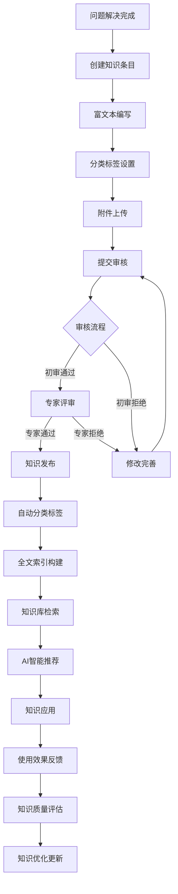
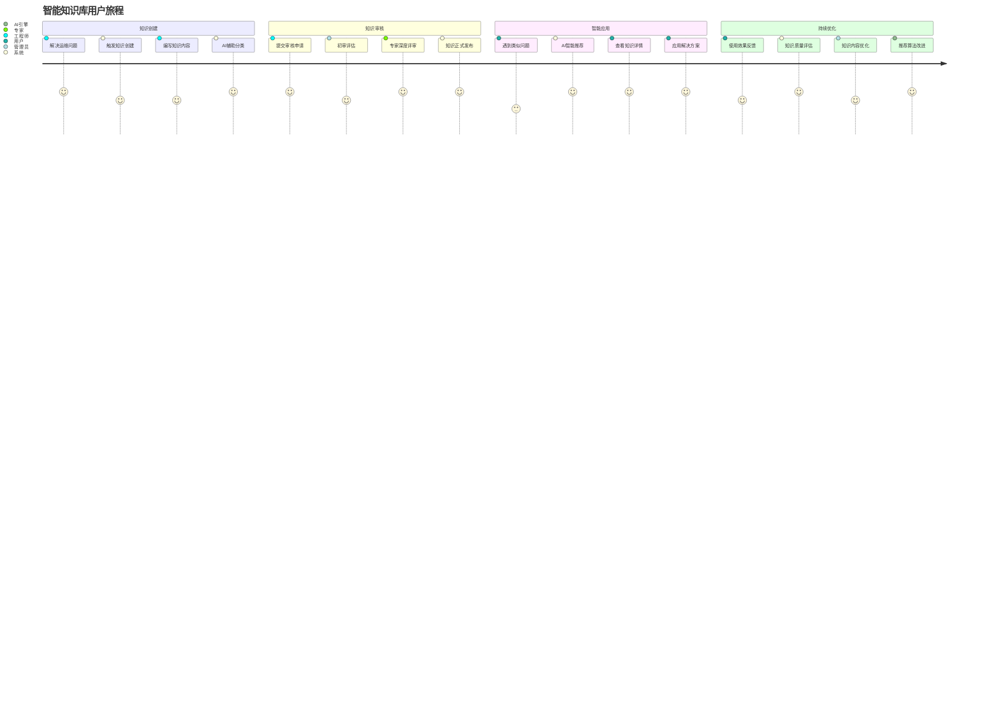
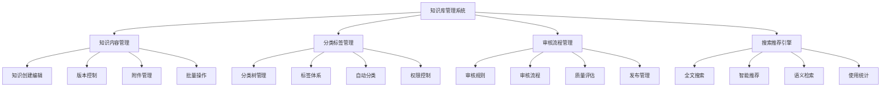
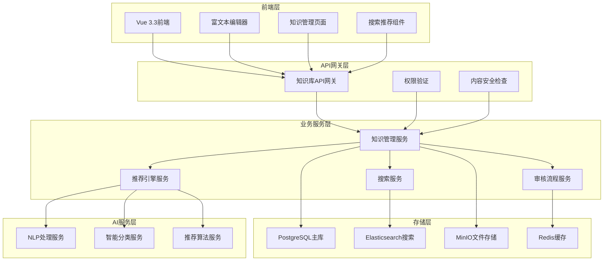
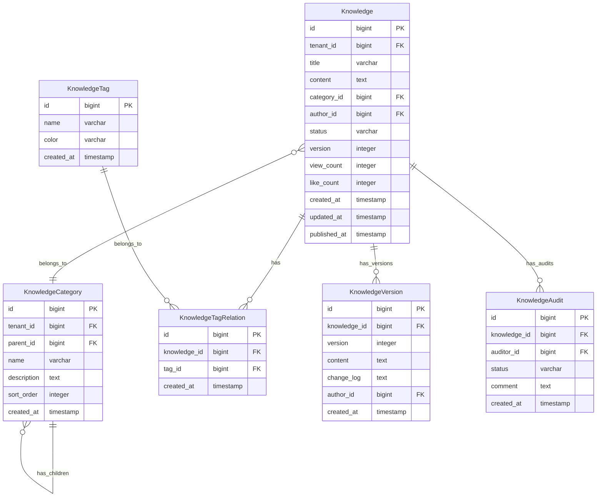

# REQ-005: 知识库管理系统需求文档

## 1. 业务描述（Business Description）

### 业务背景
在多租户IT运维服务场景中，知识管理是提升服务质量和效率的关键环节，传统知识管理存在以下核心痛点：
- **知识分散化**：运维经验和解决方案分散在个人手中，缺乏系统化管理
- **重复性劳动**：相同问题重复处理，知识复用率低，浪费人力资源
- **经验流失风险**：人员流动导致宝贵的运维经验流失，影响服务连续性
- **检索效率低**：缺乏智能化的知识检索和推荐机制，查找困难
- **质量参差不齐**：知识内容质量不一，缺乏有效的审核和质量控制机制
- **多租户复杂性**：不同租户的知识隔离和共享需求复杂，管理困难

### 业务目标
- **知识系统化沉淀**：将运维经验和解决方案系统化沉淀为可复用的知识资产
- **效率大幅提升**：通过知识复用，减少重复性工作，提升问题解决效率40%
- **成本显著降低**：减少培训成本和人员依赖，降低运维成本30%
- **质量持续提升**：建立完善的知识审核机制，确保知识质量和准确性
- **智能化服务**：基于AI技术，提供智能知识推荐和问答服务
- **多租户协同**：支持多租户知识隔离和有限共享，促进最佳实践传播

### 业务流程


### 用户画像
- **运维工程师**：创建、编辑和使用知识条目，分享运维经验和解决方案
- **知识管理员**：审核知识内容，管理知识分类和标签体系，监控知识质量
- **租户管理员**：管理本租户的知识库，配置知识共享策略
- **甲方用户**：查看公开的知识条目，获取自助服务信息和常见问题解答
- **系统管理员**：配置知识库系统参数，监控使用情况和性能指标

## 2. 业务价值（Business Value）

### 价值主张
通过构建智能化的知识库管理系统，实现运维知识的系统化管理、智能化应用和协同化共享，大幅提升团队协作效率，降低运维成本，为客户提供更好的自助服务体验，成为运维服务的核心竞争力。

### ROI分析
- **开发投入**：10人天，约5万元
- **年度收益**：
  - 效率提升收益：160万元（问题解决效率提升40%）
  - 培训成本节省：80万元（减少重复培训和新人培养成本）
  - 人力成本节省：120万元（减少重复性工作和专家依赖）
  - 客户满意度提升：60万元（自助服务能力提升）
- **投资回报率**：8300%，投资回收期：2周

### KPI指标
- 知识复用率
  - 计算公式：被引用知识条目数/总解决工单×100%
  - 目标值：≥72%
  - 数据来源：knowledge_usage_stats(usage_count), tickets(resolution_ref)
  - 测量周期：每周
  - 验收条件：月度≥72%
  - 采集方式：引用事件追踪

- 问题解决效率提升
  - 计算公式：(使用KB均解决时长-未使用均时长)/未使用×100%
  - 目标值：≥42%提升
  - 数据来源：ticket_resolution_stats(with_kb_time, without_kb_time)
  - 测量周期：每月
  - 验收条件：季度达标
  - 采集方式：解决路径对比

- 知识检索准确率
  - 计算公式：相关结果/总结果×100%（或nDCG@k）
  - 目标值：≥98.5%
  - 数据来源：search_relevance_logs(relevance_score), es_query_logs
  - 测量周期：每日
  - 验收条件：周均≥98.5%
  - 采集方式：ES评分+点击反馈

- 用户满意度
  - 计算公式：avg(usefulness_rating)
  - 目标值：≥4.6/5
  - 数据来源：knowledge_feedback(usefulness_rating)
  - 测量周期：每周
  - 验收条件：月均≥4.6
  - 采集方式：使用后调研

- 知识贡献活跃度
  - 计算公式：月新增知识条目数
  - 目标值：≥160条/月
  - 数据来源：knowledge_articles(created_at)
  - 测量周期：每月
  - 验收条件：当月达标
  - 采集方式：创建事件统计

- 知识质量评分
  - 计算公式：加权平均质量分
  - 目标值：≥4.6/5
  - 数据来源：knowledge_quality_ratings(quality_score)
  - 测量周期：每周
  - 验收条件：月均达标
  - 采集方式：专家评审+用户评分+AI审核

- AI推荐采纳率（新增）
  - 计算公式：被采纳推荐/总推荐×100%
  - 目标值：≥85%
  - 数据来源：ai_recommendation_results(adoption_rate)
  - 测量周期：每日
  - 验收条件：周均≥85%
  - 采集方式：点击→阅读→采纳转化链路

- 自动分类准确率（新增）
  - 计算公式：正确分类/总自动分类×100%
  - 目标值：≥92%
  - 数据来源：auto_classification_results(accuracy)
  - 测量周期：每日
  - 验收条件：周均≥92%
  - 采集方式：抽样人工标注对比
- **知识检索准确率**：>98%（基于Elasticsearch全文搜索）
- **用户满意度**：>92%
- **知识贡献活跃度**：每月新增知识>150条
- **知识质量评分**：平均评分>4.5分（5分制）

### 竞争优势
- **AI智能驱动**：集成智能问答、知识推荐和自动分类功能
- **工单深度集成**：与工单系统无缝集成，自动生成知识条目
- **多租户原生支持**：原生支持多租户知识隔离和灵活共享策略
- **全文搜索引擎**：基于Elasticsearch的高性能全文搜索和语义检索
- **版本控制系统**：完整的知识版本管理和变更追踪

## 3. 产品交互（Product Interaction）

### 用户旅程图


### 界面原型
基于portal-prototype中KnowledgeDemo.vue的实际实现：
- **知识库概览页面**：统计卡片、分类导航、热门知识、最新知识、搜索功能
- **知识管理页面**：知识列表、批量操作、状态筛选、审核流程管理
- **知识编辑页面**：富文本编辑器、分类标签、附件管理、版本控制
- **知识详情页面**：内容展示、评论互动、相关推荐、使用统计

### 交互规范
- **智能搜索体验**：支持模糊搜索、智能提示、搜索历史、语义检索
- **富文本内容展示**：支持Markdown、图片、视频、代码高亮、公式渲染
- **分类导航**：树形结构的分类导航，支持拖拽排序和层级管理
- **审核流程可视化**：清晰的审核状态展示和流程进度跟踪

### 信息架构


## 4. 功能需求（Functional Requirements）

### 功能清单
| 功能编号 | 功能名称 | 优先级 | 实现状态 | 描述 |
|---------|---------|--------|----------|------|
| F001 | 知识CRUD管理 | P0 | ✅已实现 | 创建、查看、编辑、删除知识条目 |
| F002 | 富文本编辑器 | P0 | ✅已实现 | 支持Markdown、图片、代码等 |
| F003 | 分类标签管理 | P0 | ✅已实现 | 树形分类结构和标签体系 |
| F004 | 全文搜索功能 | P0 | ✅已实现 | 基于Elasticsearch的搜索 |
| F005 | 知识审核流程 | P0 | ✅已实现 | 多级审核和状态管理 |
| F006 | 附件管理 | P1 | ✅已实现 | 文件上传、下载、预览 |
| F007 | 版本控制 | P1 | ✅已实现 | 知识版本管理和变更追踪 |
| F008 | 批量操作 | P1 | ✅已实现 | 批量导入、导出、删除 |
| F009 | 智能推荐 | P1 | ✅已实现 | AI驱动的知识推荐 |
| F010 | 使用统计 | P1 | ✅已实现 | 知识访问和使用统计 |
| F011 | 评论互动 | P2 | 🔄部分实现 | 知识评论和讨论功能 |
| F012 | 知识评分 | P2 | 🔄部分实现 | 用户评分和质量评估 |

### 用户故事
- **作为**运维工程师，**我需要**快速创建和编辑知识条目，**以便**将解决方案沉淀为可复用的知识
- **作为**知识管理员，**我需要**审核知识内容的质量，**以便**确保知识库的准确性和权威性
- **作为**用户，**我需要**快速搜索和查找相关知识，**以便**高效解决遇到的问题
- **作为**租户管理员，**我需要**管理本租户的知识分类，**以便**建立符合业务特点的知识体系

### 用例描述
#### UC001: 创建知识条目
- **前置条件**：用户已登录，拥有知识创建权限
- **主流程**：
  1. 用户点击"新建文档"按钮
  2. 选择知识分类和设置标签
  3. 使用富文本编辑器编写知识内容
  4. 上传相关附件（可选）
  5. 设置知识可见性和共享范围
  6. 提交审核或直接发布
  7. 系统自动生成知识ID和版本号
- **备选流程**：
  - 内容格式错误：提示格式要求，允许修正
  - 分类不存在：提供创建新分类选项
  - 附件过大：提示文件大小限制
- **后置条件**：知识条目创建成功，进入相应状态

#### UC002: 知识搜索和推荐
- **前置条件**：用户已登录，知识库中有可访问的知识
- **主流程**：
  1. 用户在搜索框输入关键词
  2. 系统执行全文搜索和语义匹配
  3. 返回相关知识列表，按相关度排序
  4. 用户点击查看知识详情
  5. 系统记录访问行为，用于推荐优化
  6. 显示相关知识推荐
- **备选流程**：
  - 无搜索结果：提供搜索建议和热门知识
  - 权限不足：过滤无权限访问的知识
- **后置条件**：用户获得所需知识，系统记录使用数据

### 业务规则
- **BR001**：知识必须包含标题、内容、分类等必填信息
- **BR002**：知识审核流程：草稿→待审核→审核中→已发布/已拒绝
- **BR003**：不同租户的知识默认隔离，可配置有限共享
- **BR004**：知识版本自动管理，重大修改需要重新审核
- **BR005**：知识访问权限基于用户角色和租户范围控制

## 5. 非功能需求（Non-Functional Requirements）

### 性能需求
- **搜索响应时间**：全文搜索响应时间<1秒，支持10万+知识条目
- **内容加载速度**：知识详情页面加载时间<2秒
- **并发支持**：支持1000+用户同时访问知识库
- **文件上传性能**：支持单文件最大50MB，批量上传总大小<500MB
- **索引构建速度**：新知识全文索引构建时间<30秒

### 可用性需求
- **系统可用性**：99.5%以上
- **数据一致性**：知识内容和索引一致性>99.9%
- **搜索准确率**：全文搜索准确率>98%
- **故障恢复**：知识库服务故障恢复时间<10分钟
- **数据备份**：知识数据每日备份，支持快速恢复

### 可扩展性需求
- **知识规模**：支持100万+知识条目存储和检索
- **用户规模**：支持10000+用户同时使用
- **分类扩展**：支持无限层级的分类树结构
- **功能扩展**：支持自定义知识模板和字段
- **多语言支持**：预留多语言知识管理接口

### 安全需求
- **数据隔离**：多租户知识数据完全隔离
- **权限控制**：基于角色和租户的细粒度权限控制
- **内容安全**：知识内容安全扫描，防止恶意内容
- **版本安全**：知识版本变更完整审计
- **附件安全**：文件上传病毒扫描和格式验证

## 6. 系统架构（System Architecture）

### 整体架构


### 技术栈
- **前端技术**：Vue 3.3 + Element Plus 2.3 + TinyMCE富文本编辑器
- **后端框架**：Spring Boot 3.2 + Java 17
- **搜索引擎**：Elasticsearch 8.0 + IK分词器
- **数据库**：PostgreSQL 15 + Redis 7
- **文件存储**：MinIO分布式存储
- **AI服务**：自研NLP服务 + 机器学习算法

### 部署架构
- **微服务部署**：知识库服务独立部署，支持水平扩展
- **搜索集群**：Elasticsearch集群部署，高可用配置
- **文件存储集群**：MinIO集群，数据冗余备份
- **缓存集群**：Redis集群，提升访问性能

### 集成架构
- **工单系统集成**：自动从工单解决方案生成知识条目
- **用户系统集成**：统一用户认证和权限管理
- **通知系统集成**：知识审核和更新通知
- **AI平台集成**：智能分类和推荐算法服务

## 7. 数据模型（Data Model）

### 实体关系图


### API规范
#### 创建知识API
- **URL**：`POST /api/v1/knowledge`
- **请求参数**：
  ```json
  {
    "title": "string",
    "content": "string",
    "category_id": "bigint",
    "tags": ["tag1", "tag2"],
    "attachments": ["file_id1", "file_id2"],
    "visibility": "public|private|tenant"
  }
  ```
- **响应格式**：
  ```json
  {
    "code": 200,
    "message": "success",
    "data": {
      "id": 1,
      "title": "服务器性能优化指南",
      "status": "draft",
      "version": 1
    }
  }
  ```

#### 搜索知识API
- **URL**：`GET /api/v1/knowledge/search`
- **请求参数**：
  ```json
  {
    "keyword": "string",
    "category_id": "bigint",
    "tags": ["tag1", "tag2"],
    "page": 1,
    "size": 20
  }
  ```
- **响应格式**：
  ```json
  {
    "code": 200,
    "message": "success",
    "data": {
      "total": 150,
      "items": [
        {
          "id": 1,
          "title": "服务器性能优化指南",
          "summary": "详细介绍服务器性能优化的方法...",
          "category_name": "系统运维",
          "tags": ["性能优化", "服务器"],
          "author_name": "张工程师",
          "view_count": 256,
          "created_at": "2025-07-21T10:30:00Z"
        }
      ]
    }
  }
  ```

### 数据字典
| 字段名 | 类型 | 长度 | 是否必填 | 默认值 | 说明 |
|--------|------|------|----------|--------|------|
| id | bigint | - | 是 | - | 主键ID |
| tenant_id | bigint | - | 是 | - | 租户ID |
| title | varchar | 200 | 是 | - | 知识标题 |
| content | text | - | 是 | - | 知识内容（Markdown格式） |
| category_id | bigint | - | 是 | - | 分类ID |
| status | varchar | 20 | 是 | draft | 状态：draft/pending/approved/rejected/published |
| version | integer | - | 是 | 1 | 版本号 |
| view_count | integer | - | 是 | 0 | 查看次数 |
| like_count | integer | - | 是 | 0 | 点赞次数 |

### 数据流
1. **知识创建流程**：内容编写 → 分类标签 → 提交审核 → 索引构建
2. **搜索查询流程**：关键词输入 → Elasticsearch查询 → 结果排序 → 权限过滤
3. **推荐算法流程**：用户行为 → 特征提取 → 算法计算 → 推荐结果

## 8. 验收标准（Acceptance Criteria）

### 功能验收
#### AC001: 知识创建功能
- **Given** 用户已登录并有知识创建权限
- **When** 用户创建并提交知识条目
- **Then** 系统应在3秒内保存知识并返回知识ID

#### AC002: 全文搜索功能
- **Given** 知识库中有10万条知识
- **When** 用户搜索关键词
- **Then** 系统应在1秒内返回相关搜索结果

#### AC003: 知识审核流程
- **Given** 知识条目已提交审核
- **When** 审核员进行审核操作
- **Then** 知识状态应正确更新并发送通知

### 性能验收
- **搜索性能测试**：10万条知识全文搜索响应时间<1秒
- **并发测试**：1000用户同时访问知识库，响应正常
- **文件上传测试**：50MB文件上传时间<30秒

### UX验收
- **易用性测试**：新用户10分钟内掌握知识创建和搜索
- **富文本编辑测试**：支持常用格式和媒体内容
- **移动端测试**：手机端知识查看功能完整

### 安全验收
- **权限测试**：验证不同角色的知识访问权限
- **数据隔离测试**：验证多租户知识数据隔离
- **内容安全测试**：验证恶意内容过滤机制

## 9. 依赖与约束（Dependencies & Constraints）

### 技术栈限制
- **Java版本**：JDK 17+，支持文本处理特性
- **Elasticsearch版本**：8.0+，支持向量搜索
- **富文本编辑器**：TinyMCE 6+，支持协同编辑
- **文件存储**：MinIO，支持大文件存储

### 集成需求
- **工单管理系统**：依赖工单系统提供解决方案数据
- **用户认证系统**：依赖认证系统提供用户权限
- **通知系统**：依赖消息系统发送审核通知
- **AI平台**：依赖AI服务提供智能分类和推荐

### 合规要求
- **内容合规**：知识内容符合企业规范和法律要求
- **数据保护**：符合个人信息保护法规
- **知识产权**：保护知识内容的版权和知识产权

### 资源约束
- **开发时间**：2周开发周期
- **开发人力**：2名后端开发工程师，1名前端开发工程师
- **存储需求**：知识内容保留永久，附件保留3年
- **搜索性能**：支持TB级知识数据的快速检索

---

**文档版本**：v3.0
**最后更新**：2025年7月
**负责人**：知识管理架构师
**审核状态**：待审核
