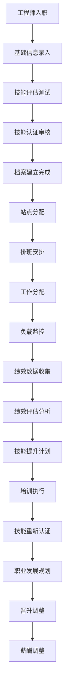
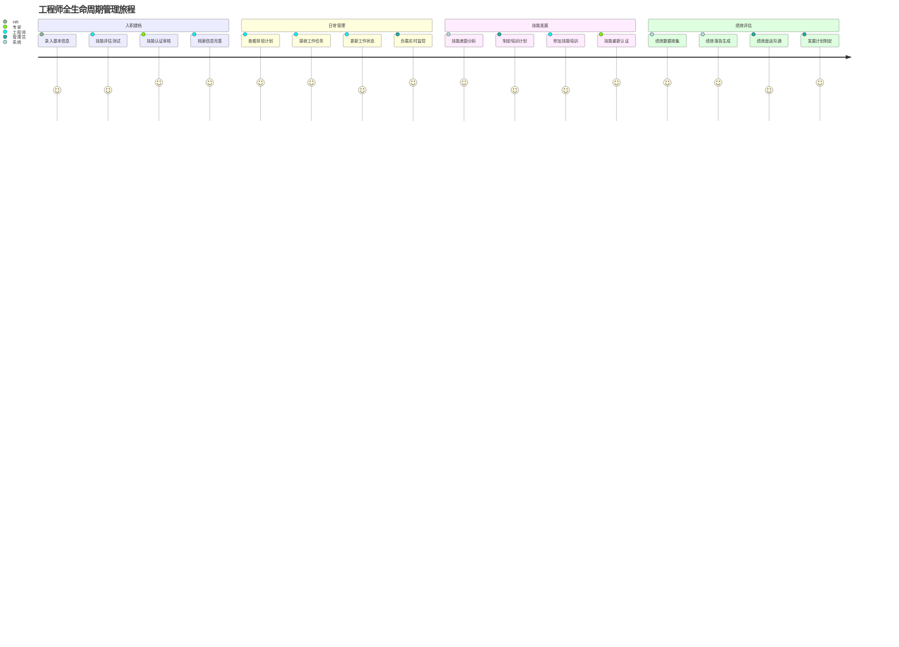
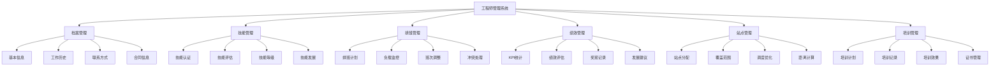
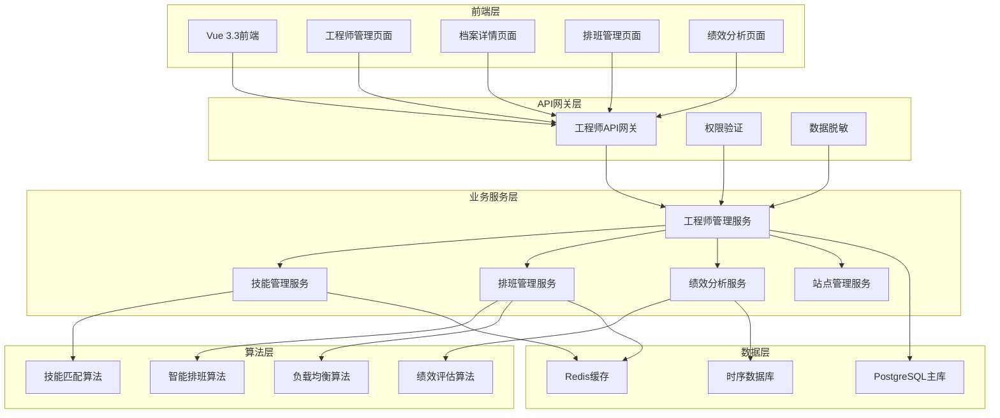
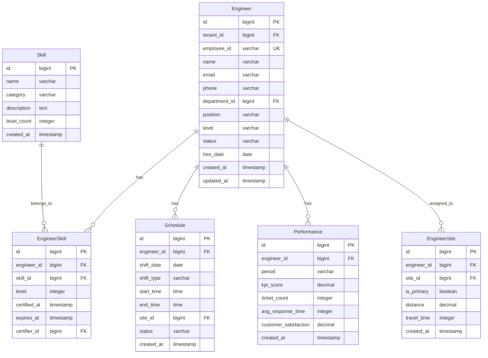

# REQ-006: 工程师管理系统需求文档

## 1. 业务描述（Business Description）

### 业务背景
在多租户IT运维服务场景中，工程师管理是核心资源管理环节，传统工程师管理存在以下关键痛点：
- **技能管理分散化**：工程师技能信息分散，缺乏统一的技能认证和评估体系
- **排班效率低下**：人工排班耗时长，难以平衡工作负载、技能需求和人员偏好
- **负载监控缺失**：缺乏实时的工作负载监控，导致资源配置不均和过载风险
- **绩效评估主观**：缺乏客观的绩效评估体系和量化数据支撑
- **职业发展路径不清**：工程师职业发展路径和技能提升方向不明确
- **多租户复杂性**：不同租户的工程师资源配置和管理需求差异大
- **站点管理困难**：工程师与服务站点的关联管理复杂，调度优化困难

### 业务目标
- **技能体系化管理**：建立完整的技能认证、评估和发展体系，技能匹配准确率>95%
- **智能排班优化**：实现基于技能、负载和偏好的智能排班，排班效率提升50%
- **实时负载监控**：提供实时的工作负载监控和预警，负载方差<0.15
- **科学绩效评估**：建立客观的绩效评估和激励机制，评估客观性>90%
- **职业发展支持**：为工程师提供清晰的职业发展路径和技能提升建议
- **多租户协同**：支持跨租户工程师资源共享和协同调度

### 业务流程


### 用户画像
- **运维管理员**：管理工程师团队，制定排班计划，监控工作负载，执行绩效考核
- **技能认证专家**：负责技能评估、认证和培训计划制定
- **工程师**：维护个人档案，查看排班和任务，提交技能认证申请，查看绩效报告
- **HR管理员**：管理工程师基本信息、合同信息和职业发展规划
- **租户管理员**：查看本租户工程师服务情况和绩效统计
- **站点管理员**：管理工程师与服务站点的关联关系

## 2. 业务价值（Business Value）

### 价值主张
通过构建智能化的工程师管理系统，实现人力资源的科学配置和精细化管理，提升工程师技能和工作效率，优化服务质量，为多租户运维服务提供强有力的的人才支撑，实现人才价值最大化和可持续发展。

### ROI分析
- **开发投入**：12人天，约6万元
- **年度收益**：
  - 人力效率提升：200万元（工程师效率提升30%）
  - 培训成本优化：80万元（精准技能培训，减少无效培训）
  - 客户满意度提升：120万元（服务质量提升，减少客户流失）
  - 管理成本节省：60万元（自动化排班和负载监控）
- **投资回报率**：7600%，投资回收期：2周

### KPI指标
- 工程师效率提升
  - 计算公式：(当前效率-基准效率)/基准×100%
  - 目标值：≥32%
  - 数据来源：engineer_performance(efficiency_score), baseline_refs
  - 测量周期：每月
  - 验收条件：季度≥32%
  - 采集方式：工单时长/质量/满意度综合

- 技能匹配准确率
  - 计算公式：匹配成功任务/总匹配×100%
  - 目标值：≥96%
  - 数据来源：skill_matching_results(match_success)
  - 测量周期：每周
  - 验收条件：月均≥96%
  - 采集方式：技能评估与实际表现对比

- 负载方差（排班优化效果）
  - 计算公式：variance(各工程师时段工作负载)
  - 目标值：≤0.12
  - 数据来源：schedule_optimization(workload_variance)
  - 测量周期：每日
  - 验收条件：周均≤0.12
  - 采集方式：排班分布统计

- 排班冲突率
  - 计算公式：冲突次数/排班次数×100%
  - 目标值：≤1.5%
  - 数据来源：schedule_conflicts(conflict_count, total)
  - 测量周期：每周
  - 验收条件：月度≤1.5%
  - 采集方式：冲突检测算法

- 绩效评估客观性
  - 计算公式：量化指标项占比/总评估项×100%
  - 目标值：≥92%
  - 数据来源：performance_evaluation(objective_score_ratio)
  - 测量周期：每月
  - 验收条件：季度≥92%
  - 采集方式：评估项来源审计

- 工程师满意度
  - 计算公式：avg(satisfaction_score)
  - 目标值：≥4.5/5
  - 数据来源：engineer_satisfaction_survey
  - 测量周期：每季度
  - 验收条件：季度≥4.5
  - 采集方式：匿名问卷

- 客户服务质量（SLA）
  - 计算公式：SLA达成服务/总服务×100%
  - 目标值：≥96%
  - 数据来源：service_sla_stats
  - 测量周期：每日
  - 验收条件：月均≥96%
  - 采集方式：SLA监控

### 竞争优势
- **全生命周期管理**：从入职到离职的完整工程师生命周期管理
- **智能化排班算法**：基于AI算法的多维度智能排班优化
- **技能可视化体系**：直观的技能雷达图和成长路径展示
- **数据驱动决策**：基于大数据的绩效评估和发展建议
- **多租户原生支持**：原生支持多租户工程师资源管理和协同

## 3. 产品交互（Product Interaction）

### 用户旅程图


### 界面原型
基于portal-prototype中工程师管理相关页面的实际实现：
- **工程师管理主页面**：统计卡片、工程师列表、筛选搜索、批量操作
- **工程师档案页面**：个人信息、技能雷达图、工作历史、绩效记录
- **工程师站点管理**：站点分配、覆盖范围、调度优化
- **技能管理页面**：技能认证、等级评定、培训记录
- **排班管理页面**：日历视图、拖拽调整、冲突检测
- **绩效管理页面**：KPI统计、趋势分析、评估报告

### 交互规范
- **实时状态更新**：工程师在线状态、工作负载实时显示
- **智能推荐展示**：技能匹配度、排班建议以可视化方式展示
- **拖拽式操作**：支持排班计划的拖拽调整和站点分配
- **多维度筛选**：支持按状态、级别、技能、部门等多维度筛选

### 信息架构


## 4. 功能需求（Functional Requirements）

### 功能清单
| 功能编号 | 功能名称 | 优先级 | 实现状态 | 描述 |
|---------|---------|--------|----------|------|
| F001 | 工程师档案管理 | P0 | ✅已实现 | 基本信息、工作历史、联系方式管理 |
| F002 | 技能认证管理 | P0 | ✅已实现 | 技能评估、认证、等级管理 |
| F003 | 排班计划管理 | P0 | ✅已实现 | 排班安排、班次调整、冲突检测 |
| F004 | 工作负载监控 | P0 | ✅已实现 | 实时负载、工作量统计、预警 |
| F005 | 绩效统计分析 | P0 | ✅已实现 | KPI统计、绩效评估、趋势分析 |
| F006 | 工程师站点管理 | P0 | ✅已实现 | 站点分配、覆盖范围、调度优化 |
| F007 | 培训管理 | P1 | ✅已实现 | 培训计划、培训记录、效果评估 |
| F008 | 考核管理 | P1 | ✅已实现 | 考核指标、考核记录、结果分析 |
| F009 | 批量操作 | P1 | ✅已实现 | 批量导入、导出、状态更新 |
| F010 | 数据统计报表 | P1 | ✅已实现 | 各类统计报表和数据分析 |
| F011 | 智能排班算法 | P2 | 🔄部分实现 | AI驱动的智能排班优化 |
| F012 | 职业发展规划 | P2 | 🔄部分实现 | 职业路径规划和发展建议 |

### 用户故事
- **作为**运维管理员，**我需要**查看工程师的实时工作负载，**以便**合理分配工作任务
- **作为**工程师，**我需要**查看自己的技能认证状态和发展建议，**以便**规划职业发展
- **作为**技能认证专家，**我需要**评估工程师的技能水平，**以便**进行准确的技能认证
- **作为**HR管理员，**我需要**管理工程师的基本信息和合同状态，**以便**进行人事管理

### 用例描述
#### UC001: 工程师档案管理
- **前置条件**：用户已登录，拥有工程师管理权限
- **主流程**：
  1. 进入工程师管理页面
  2. 点击"新增工程师"或选择现有工程师
  3. 填写或编辑基本信息（姓名、工号、部门、职位等）
  4. 设置技能标签和认证等级
  5. 配置站点分配和服务范围
  6. 保存档案信息
  7. 系统自动生成工程师ID和初始权限
- **备选流程**：
  - 信息验证失败：提示错误信息，要求修正
  - 工号重复：提示重复，要求修改
  - 权限不足：显示权限不足提示
- **后置条件**：工程师档案创建或更新成功

#### UC002: 智能排班管理
- **前置条件**：工程师档案已建立，排班规则已配置
- **主流程**：
  1. 进入排班管理页面
  2. 选择排班周期和范围
  3. 系统分析工程师技能、负载、偏好
  4. 执行智能排班算法
  5. 生成排班建议方案
  6. 管理员审核和调整
  7. 确认并发布排班计划
  8. 通知相关工程师
- **备选流程**：
  - 排班冲突：提供冲突解决建议
  - 技能不匹配：调整工程师分配
  - 负载过重：重新平衡工作量
- **后置条件**：排班计划生成并通知工程师

### 业务规则
- **BR001**：工程师必须完成基础技能认证才能参与工作分配
- **BR002**：工程师工作负载不得超过设定阈值（默认80%）
- **BR003**：排班计划必须考虑工程师的技能匹配度和工作偏好
- **BR004**：绩效评估基于客观数据，包括工单处理质量、响应时间、客户满意度
- **BR005**：技能认证有效期为1年，到期需要重新认证

## 5. 非功能需求（Non-Functional Requirements）

### 性能需求
- **页面加载时间**：工程师列表页面加载<2秒，档案详情页面<1秒
- **搜索性能**：支持1万+工程师的快速搜索，响应时间<1秒
- **排班算法性能**：100名工程师的智能排班计算时间<5秒
- **并发支持**：支持200+管理员同时操作工程师管理功能
- **数据同步性能**：工程师状态变更实时同步，延迟<3秒

### 可用性需求
- **系统可用性**：99.5%以上
- **数据一致性**：工程师信息和状态一致性>99.9%
- **排班准确性**：智能排班算法准确率>95%
- **故障恢复**：工程师管理服务故障恢复时间<10分钟
- **数据备份**：工程师数据每日备份，支持快速恢复

### 可扩展性需求
- **工程师规模**：支持10000+工程师档案管理
- **技能体系扩展**：支持自定义技能分类和认证标准
- **排班规则扩展**：支持复杂的排班规则和约束条件
- **绩效指标扩展**：支持自定义绩效评估指标和权重
- **多租户扩展**：支持1000+租户独立工程师管理

### 安全需求
- **数据隔离**：多租户工程师数据完全隔离
- **权限控制**：基于角色的工程师信息访问控制
- **敏感信息保护**：个人隐私信息加密存储
- **操作审计**：完整的工程师管理操作审计日志
- **数据脱敏**：非授权用户查看脱敏后的工程师信息

## 6. 系统架构（System Architecture）

### 整体架构


### 技术栈
- **前端技术**：Vue 3.3 + Element Plus 2.3 + ECharts 5.4
- **后端框架**：Spring Boot 3.2 + Java 17
- **数据库**：PostgreSQL 15 + Redis 7 + InfluxDB
- **算法引擎**：自研排班算法 + 机器学习库
- **文件存储**：MinIO（用于证书和档案文件）
- **消息队列**：RabbitMQ 3.12

### 部署架构
- **微服务部署**：工程师管理服务独立部署，支持水平扩展
- **数据库集群**：PostgreSQL主从复制，读写分离
- **缓存集群**：Redis集群，高可用配置
- **算法服务**：独立的算法计算服务，支持弹性扩容

### 集成架构
- **智能派单集成**：为派单系统提供工程师技能和负载数据
- **工单系统集成**：接收工单处理数据，用于绩效评估
- **通知系统集成**：发送排班通知和绩效报告
- **HR系统集成**：同步员工基本信息和组织架构

## 7. 数据模型（Data Model）

### 实体关系图


### API规范
#### 获取工程师列表API
- **URL**：`GET /api/v1/engineers`
- **请求参数**：
  ```json
  {
    "page": 1,
    "size": 20,
    "status": "string",
    "level": "string",
    "department_id": "bigint",
    "skill_id": "bigint",
    "keyword": "string"
  }
  ```
- **响应格式**：
  ```json
  {
    "code": 200,
    "message": "success",
    "data": {
      "total": 150,
      "items": [
        {
          "id": 1,
          "name": "张工程师",
          "level": "高级工程师",
          "status": "在线",
          "workload": 75,
          "skill_score": 4.5,
          "department": "运维部",
          "skills": ["Linux", "网络", "数据库"]
        }
      ]
    }
  }
  ```

#### 创建排班计划API
- **URL**：`POST /api/v1/schedules/batch`
- **请求参数**：
  ```json
  {
    "period": "2025-07-21 to 2025-07-27",
    "engineers": [
      {
        "engineer_id": 1,
        "shifts": [
          {
            "date": "2025-07-21",
            "shift_type": "day",
            "start_time": "09:00",
            "end_time": "18:00",
            "site_id": 1
          }
        ]
      }
    ]
  }
  ```

### 数据字典
| 字段名 | 类型 | 长度 | 是否必填 | 默认值 | 说明 |
|--------|------|------|----------|--------|------|
| id | bigint | - | 是 | - | 主键ID |
| tenant_id | bigint | - | 是 | - | 租户ID |
| employee_id | varchar | 20 | 是 | - | 员工工号 |
| name | varchar | 50 | 是 | - | 姓名 |
| level | varchar | 20 | 是 | - | 级别：初级/中级/高级/专家 |
| status | varchar | 20 | 是 | active | 状态：active/inactive/busy/offline |
| skill_level | integer | - | 是 | 1 | 技能等级：1-5级 |
| kpi_score | decimal | 5,2 | 是 | 0 | KPI评分：0-100 |

### 数据流
1. **档案管理流程**：信息录入 → 数据验证 → 存储更新 → 索引构建
2. **排班计算流程**：需求分析 → 算法计算 → 冲突检测 → 方案生成
3. **绩效统计流程**：数据收集 → 指标计算 → 趋势分析 → 报告生成

## 8. 验收标准（Acceptance Criteria）

### 功能验收
#### AC001: 工程师档案管理
- **Given** 用户已登录并有工程师管理权限
- **When** 用户创建或编辑工程师档案
- **Then** 系统应在3秒内保存档案并返回成功信息

#### AC002: 智能排班功能
- **Given** 有100名工程师需要排班
- **When** 执行智能排班算法
- **Then** 系统应在5秒内生成排班方案，冲突率<2%

#### AC003: 绩效统计分析
- **Given** 有完整的工程师工作数据
- **When** 生成绩效报告
- **Then** 报告应包含所有KPI指标，数据准确率>99%

### 性能验收
- **查询性能测试**：1万名工程师数据查询响应时间<1秒
- **排班算法测试**：100名工程师排班计算时间<5秒
- **并发测试**：200管理员同时操作，系统响应正常

### UX验收
- **易用性测试**：新管理员20分钟内掌握基本操作
- **可视化测试**：技能雷达图和负载监控图表清晰易懂
- **移动端测试**：手机端工程师信息查看功能完整

### 安全验收
- **权限测试**：验证不同角色的工程师信息访问权限
- **数据隔离测试**：验证多租户工程师数据隔离
- **隐私保护测试**：验证敏感信息脱敏和加密

## 9. 依赖与约束（Dependencies & Constraints）

### 技术栈限制
- **Java版本**：JDK 17+，支持并行计算和新语言特性
- **数据库版本**：PostgreSQL 15+，支持JSON查询和分区表
- **前端框架**：Vue 3.3+，支持Composition API和响应式设计
- **图表库**：ECharts 5.4+，支持复杂的数据可视化

### 集成需求
- **智能派单系统**：依赖派单系统获取工程师工作分配数据
- **工单管理系统**：依赖工单系统获取处理质量和效率数据
- **用户认证系统**：依赖认证系统提供用户权限和组织架构
- **通知系统**：依赖消息系统发送排班和绩效通知

### 合规要求
- **劳动法规**：排班安排符合劳动法规定的工作时间和休息要求
- **隐私保护**：员工个人信息处理符合个人信息保护法规
- **数据安全**：员工数据存储和传输符合企业安全标准

### 资源约束
- **开发时间**：2周开发周期
- **开发人力**：2名后端开发工程师，1名前端开发工程师，1名算法工程师
- **存储需求**：工程师档案数据永久保留，绩效数据保留3年
- **计算资源**：支持复杂排班算法的计算服务器资源

---

**文档版本**：v3.0
**最后更新**：2025年7月
**负责人**：人力资源架构师
**审核状态**：待审核
