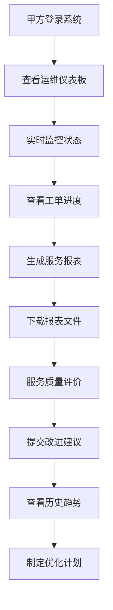
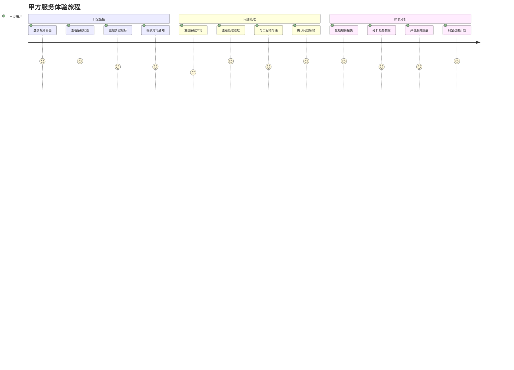
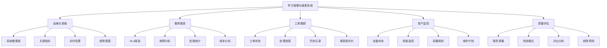
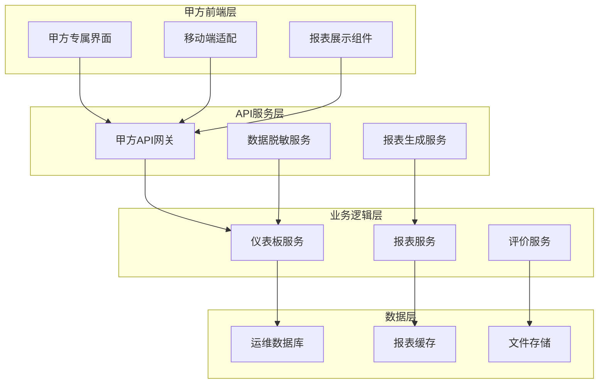

# REQ-007: 甲方管理与报表系统需求文档

## 1. 业务描述（Business Description）

### 业务背景
在多租户IT运维服务场景中，甲方管理与报表系统是提升客户体验和服务透明度的关键模块，传统甲方服务存在以下痛点：
- **服务透明度不足**：甲方无法实时了解运维服务状态和处理进度
- **报表生成效率低**：人工生成报表耗时长，数据准确性难以保证
- **沟通成本高**：缺乏统一的服务界面，沟通效率低下
- **满意度难以量化**：缺乏有效的服务质量评估和反馈机制
- **决策支持不足**：缺乏数据驱动的决策支持和趋势分析

### 业务目标
- **服务透明化**：为甲方提供实时的运维服务状态和进度展示
- **报表自动化**：自动生成各类运维报表，提升效率和准确性
- **体验优化**：提供专属的甲方服务界面，提升用户体验
- **质量量化**：建立服务质量评估体系，持续改进服务
- **决策支持**：提供数据分析和趋势预测，支持业务决策

### 业务流程


### 用户画像
- **甲方IT负责人**：关注整体运维状态和服务质量，需要决策支持数据
- **甲方业务用户**：关注具体业务系统的运行状态和故障处理
- **甲方管理层**：关注服务成本效益和长期趋势分析
- **运维服务经理**：负责甲方关系维护和服务质量改进

## 2. 业务价值（Business Value）

### 价值主张
通过构建专业的甲方管理与报表系统，提升服务透明度和客户满意度，建立数据驱动的服务质量管理体系，为甲方提供优质的运维服务体验，增强客户粘性和续约率。

### ROI分析
- **开发投入**：8人天，约4万元
- **年度收益**：
  - 客户满意度提升：150万元（减少客户流失，增加续约）
  - 沟通成本节省：60万元（减少人工沟通和报表制作）
  - 服务质量提升：80万元（通过数据分析优化服务）
  - 销售支持收益：40万元（专业报表支持销售）
- **投资回报率**：8150%，投资回收期：2周

### KPI指标
- 客户满意度
  - 计算公式：avg(satisfaction_rating)
  - 目标值：≥4.6/5
  - 数据来源：client_satisfaction_survey(rating, tenant_id)
  - 测量周期：每月
  - 验收条件：季度≥4.6
  - 采集方式：定期满意度调研

- 报表生成效率提升
  - 计算公式：(自动化报表时长-手工报表时长)/手工×100%
  - 目标值：≥82%提升
  - 数据来源：report_generation_stats(generation_time, mode)
  - 测量周期：每月
  - 验收条件：季度达标
  - 采集方式：生成流程耗时采集

- 服务透明度（数据刷新延迟）
  - 计算公式：avg(frontend_render_ts - source_update_ts)
  - 目标值：≤20秒
  - 数据来源：data_sync_logs(update_delay), dashboard_realtime(channel)
  - 测量周期：实时
  - 验收条件：95%≤20秒
  - 采集方式：数据同步时间戳比对

- 客户续约率
  - 计算公式：续约客户/到期客户×100%
  - 目标值：≥96%
  - 数据来源：client_contracts(renewal_status)
  - 测量周期：季度
  - 验收条件：年度≥96%
  - 采集方式：合同状态追踪

- 投诉处理时间缩短
  - 计算公式：(基线处理时长-当前处理时长)/基线×100%
  - 目标值：≥52%缩短
  - 数据来源：complaint_resolution(processing_time)
  - 测量周期：每月
  - 验收条件：季度达标
  - 采集方式：投诉流程时长打点

- 报表数据准确率（新增）
  - 计算公式：准确报表/总报表×100%
  - 目标值：≥99.8%
  - 数据来源：report_accuracy_check(accuracy_rate), reconciliation_logs
  - 测量周期：每日
  - 验收条件：周均≥99.8%
  - 采集方式：源对账+抽样审计

- 移动端访问成功率（新增）
  - 计算公式：移动端成功访问/总访问×100%
  - 目标值：≥99%
  - 数据来源：mobile_access_logs(status_code)
  - 测量周期：每日
  - 验收条件：周均≥99%
  - 采集方式：访问日志与前端Sentry

### 竞争优势
- **实时透明**：实时的运维状态展示和进度跟踪
- **专业报表**：丰富的报表模板和自定义报表功能
- **移动友好**：完美适配移动设备的甲方界面
- **数据驱动**：基于数据分析的服务优化建议

## 3. 产品交互（Product Interaction）

### 用户旅程图


### 界面原型
基于portal-prototype中ClientManagementDemo.vue的实际实现：
- **运维仪表板**：系统健康度、活跃工单、设备资产、告警信息
- **服务报表**：SLA报告、故障分析、性能统计、成本分析
- **工单跟踪**：工单状态、处理进度、历史记录、满意度评价
- **资产监控**：设备状态、性能指标、容量规划、维护计划

### 交互规范
- **实时更新**：关键指标实时刷新，数据延迟<30秒
- **一键生成**：报表一键生成和下载，支持多种格式
- **移动适配**：完美适配手机和平板设备
- **个性化定制**：支持甲方个性化的界面和报表定制

### 信息架构


## 4. 功能需求（Functional Requirements）

### 功能清单
| 功能编号 | 功能名称 | 优先级 | 实现状态 | 描述 |
|---------|---------|--------|----------|------|
| F001 | 运维仪表板 | P0 | ✅已实现 | 实时系统状态和关键指标展示 |
| F002 | 服务报表生成 | P0 | ✅已实现 | 自动生成各类运维服务报表 |
| F003 | 工单跟踪查看 | P0 | ✅已实现 | 工单状态和处理进度跟踪 |
| F004 | 资产状态监控 | P0 | ✅已实现 | 设备资产状态和性能监控 |
| F005 | 告警信息展示 | P0 | ✅已实现 | 系统告警和异常信息展示 |
| F006 | 数据导出功能 | P1 | ✅已实现 | 报表和数据的导出下载 |
| F007 | 历史趋势分析 | P1 | ✅已实现 | 历史数据趋势分析和对比 |
| F008 | 服务质量评价 | P1 | ✅已实现 | 服务满意度评价和反馈 |
| F009 | 个性化定制 | P2 | 🔄部分实现 | 界面和报表的个性化定制 |
| F010 | 移动端适配 | P2 | ✅已实现 | 移动设备的完美适配 |

### 用户故事
- **作为**甲方IT负责人，**我需要**实时查看系统运维状态，**以便**及时了解业务系统健康情况
- **作为**甲方管理层，**我需要**定期生成服务报表，**以便**评估运维服务质量和成本效益
- **作为**甲方业务用户，**我需要**跟踪工单处理进度，**以便**了解问题解决情况
- **作为**甲方用户，**我需要**对运维服务进行评价，**以便**促进服务质量持续改进

### 用例描述
#### UC001: 查看运维仪表板
- **前置条件**：甲方用户已登录，拥有查看权限
- **主流程**：
  1. 用户登录甲方专属界面
  2. 系统加载运维仪表板数据
  3. 显示系统健康度、活跃工单、设备资产等关键指标
  4. 实时更新告警信息和状态变化
  5. 用户可点击指标查看详细信息
- **备选流程**：
  - 数据加载失败：显示错误提示，提供重试选项
  - 权限不足：显示权限不足提示
- **后置条件**：用户获得完整的运维状态信息

#### UC002: 生成服务报表
- **前置条件**：用户已登录，有报表查看权限
- **主流程**：
  1. 用户选择报表类型（SLA、故障、性能等）
  2. 设置报表时间范围和筛选条件
  3. 系统自动生成报表数据和图表
  4. 用户预览报表内容
  5. 选择导出格式（PDF、Excel等）
  6. 下载报表文件
- **备选流程**：
  - 数据不足：提示数据范围调整建议
  - 生成失败：提供错误信息和重试选项
- **后置条件**：用户获得所需的服务报表

### 业务规则
- **BR001**：甲方用户只能查看本组织的运维数据和报表
- **BR002**：关键指标数据实时更新，刷新间隔不超过30秒
- **BR003**：报表生成支持多种时间范围：日、周、月、季、年
- **BR004**：服务质量评价采用5分制，支持文字评论
- **BR005**：敏感数据在甲方界面中进行适当脱敏处理

## 5. 非功能需求（Non-Functional Requirements）

### 性能需求
- **页面加载时间**：仪表板页面加载<2秒，报表生成<10秒
- **数据刷新频率**：关键指标30秒自动刷新，支持手动刷新
- **并发支持**：支持100+甲方用户同时访问
- **报表生成性能**：复杂报表生成时间<30秒
- **移动端性能**：移动设备访问响应时间<3秒

### 可用性需求
- **系统可用性**：99.5%以上
- **数据准确性**：报表数据准确率>99.9%
- **界面友好性**：甲方用户5分钟内掌握基本操作
- **多设备兼容**：支持PC、平板、手机等设备访问

### 安全需求
- **数据隔离**：甲方只能访问授权范围内的数据
- **访问控制**：基于角色的细粒度权限控制
- **数据脱敏**：敏感信息在甲方界面适当脱敏
- **审计日志**：记录甲方用户的所有操作行为

## 6. 系统架构（System Architecture）

### 整体架构


### 技术栈
- **前端技术**：Vue 3.3 + Element Plus 2.3 + ECharts 5.4
- **后端框架**：Spring Boot 3.2 + Java 17
- **报表引擎**：JasperReports + Apache POI
- **数据库**：PostgreSQL 15 + Redis 7
- **文件存储**：MinIO

## 7. 数据模型（Data Model）

### 主要实体
- **ClientDashboard**：甲方仪表板配置
- **ServiceReport**：服务报表模板和数据
- **QualityEvaluation**：服务质量评价记录
- **ClientNotification**：甲方通知消息

### API规范
#### 获取仪表板数据API
- **URL**：`GET /api/v1/client/dashboard`
- **响应格式**：
  ```json
  {
    "code": 200,
    "data": {
      "systemHealth": 98.5,
      "activeTickets": 12,
      "totalAssets": 156,
      "criticalAlerts": 2
    }
  }
  ```

## 8. 验收标准（Acceptance Criteria）

### 功能验收
- **仪表板展示**：实时显示关键运维指标，数据准确完整
- **报表生成**：支持多种报表类型，生成速度满足要求
- **移动适配**：在各种移动设备上显示正常，功能完整

### 性能验收
- **加载性能**：仪表板2秒内加载完成
- **生成性能**：报表30秒内生成完成
- **并发性能**：100用户同时访问响应正常

## 9. 依赖与约束（Dependencies & Constraints）

### 技术依赖
- **数据源依赖**：依赖运维系统提供实时数据
- **认证依赖**：依赖用户认证系统提供甲方用户权限
- **通知依赖**：依赖消息系统发送告警通知

### 业务约束
- **数据安全**：严格控制甲方数据访问权限
- **合规要求**：报表内容符合行业标准和客户要求
- **服务等级**：满足与甲方签署的SLA要求

---

**文档版本**：v3.0
**最后更新**：2025年7月
**负责人**：客户服务架构师
**审核状态**：待审核
