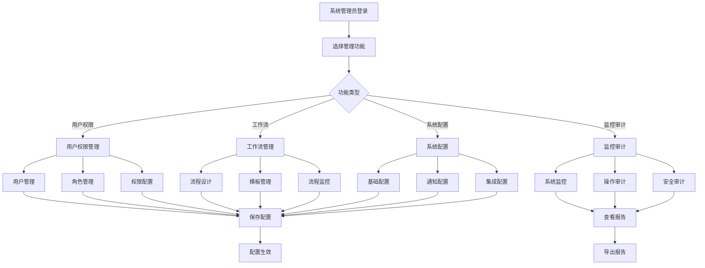
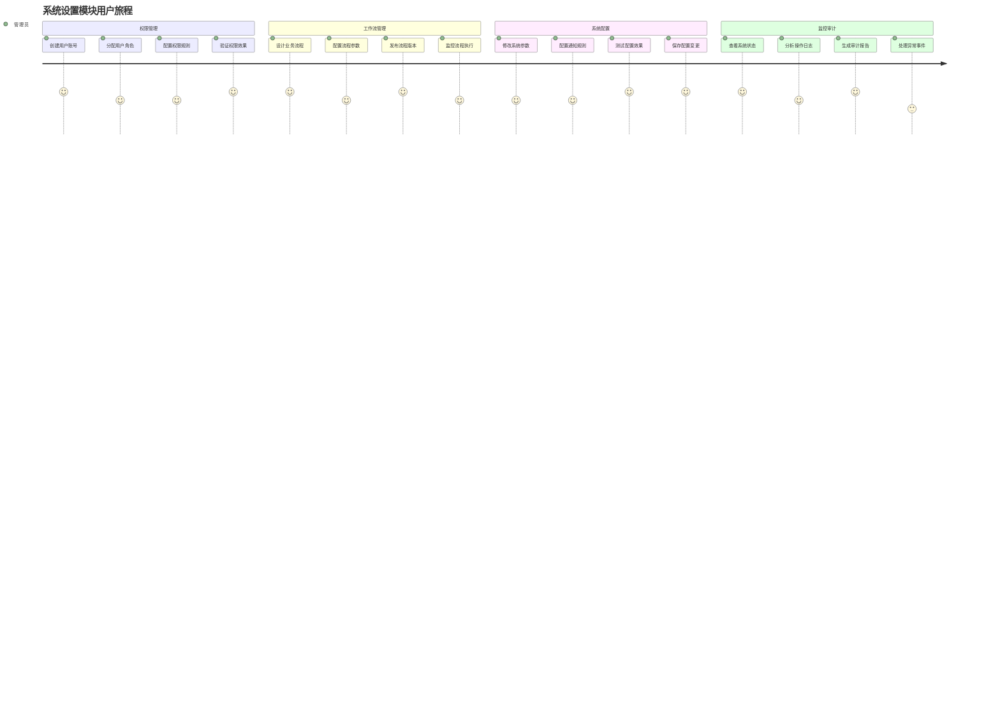
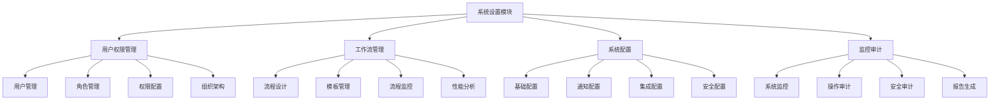

# REQ-008: 系统设置模块需求文档

## 1. 业务描述（Business Description）

### 业务背景
系统设置模块是IT运维门户系统的管理中心，为系统管理员提供统一的系统配置、用户管理、权限控制、工作流管理等功能。传统的系统管理存在以下痛点：
- **配置分散**：系统配置分布在不同模块中，缺乏统一管理
- **权限管理复杂**：多租户环境下的权限配置复杂，容易出错
- **工作流管理困难**：缺乏可视化的工作流设计和管理工具
- **系统监控不足**：缺乏对系统运行状态的实时监控
- **操作审计缺失**：重要操作缺乏完整的审计记录

### 业务目标
- **统一管理**：提供统一的系统配置和管理界面
- **权限精细化**：支持基于角色和资源的细粒度权限控制
- **工作流可视化**：提供可视化的工作流设计和管理工具
- **实时监控**：实时监控系统运行状态和性能指标
- **完整审计**：记录所有重要操作的审计日志

### 功能模块
#### 用户与权限管理
- **用户管理**：用户账号的创建、编辑、禁用、删除
- **角色管理**：角色定义、权限分配、角色继承
- **权限管理**：资源权限配置、操作权限控制
- **组织架构**：部门和团队的层级管理

#### 工作流管理
- **流程设计**：可视化的工作流设计器
- **流程模板**：预定义的流程模板管理
- **流程监控**：流程执行状态和性能监控
- **流程优化**：基于数据的流程优化建议

#### 系统配置
- **基础配置**：系统基本参数配置
- **通知配置**：通知渠道和规则配置
- **集成配置**：第三方系统集成配置
- **安全配置**：安全策略和规则配置

#### 监控与审计
- **系统监控**：系统性能和资源使用监控
- **操作审计**：用户操作记录和审计日志
- **安全审计**：安全事件和异常行为监控
- **合规报告**：合规性检查和报告生成

### 业务流程

### 用户画像
- **系统管理员**：负责系统整体配置和管理，需要全面的管理权限
- **安全管理员**：负责安全策略配置和审计，关注系统安全
- **业务管理员**：负责业务流程配置和优化，关注业务效率
- **运维管理员**：负责系统监控和维护，关注系统稳定性

## 2. 业务价值（Business Value）

### 价值主张
通过构建统一的系统设置模块，实现系统配置的集中化管理，提升管理效率，降低配置错误风险，增强系统安全性，为业务运营提供可靠的管理支撑。

### ROI分析
- **开发投入**：16人天，约8万元
- **年度收益**：
  - 管理效率提升：120万元（配置时间缩短70%）
  - 安全风险降低：100万元（减少配置错误和安全事件）
  - 合规成本节省：80万元（自动化合规检查和报告）
  - 运维成本降低：60万元（统一管理减少人工成本）
- **投资回报率**：4400%，投资回收期：1个月

### KPI指标
- 配置变更成功率
  - 计算公式：成功变更/总变更×100%
  - 目标值：≥99.5%
  - 数据来源：system_config_changes(change_status)
  - 测量周期：实时/日统计
  - 验收条件：日均≥99.5%
  - 采集方式：配置API响应状态+回滚记录

- 权限配置准确率
  - 计算公式：正确权限配置/总配置×100%
  - 目标值：≥99.8%
  - 数据来源：permission_audit_logs(accuracy_rate)
  - 测量周期：每日审计
  - 验收条件：周均≥99.8%
  - 采集方式：权限审计+用例验证

- 配置生效时间
  - 计算公式：avg(effective_ts - submit_ts)
  - 目标值：≤30秒（P95）
  - 数据来源：config_deployment_logs
  - 测量周期：实时/小时
  - 验收条件：95%≤30秒
  - 采集方式：部署流水线打点

- 系统审计覆盖率
  - 计算公式：已审计操作/总操作×100%
  - 目标值：≥98%
  - 数据来源：audit_coverage_stats(coverage_rate)
  - 测量周期：每日
  - 验收条件：周均≥98%
  - 采集方式：操作审计完整性校验

- 用户权限管理效率
  - 计算公式：1-（批量操作均耗时/单个操作×N）
  - 目标值：效率提升≥70%
  - 数据来源：user_management_performance(operation_time)
  - 测量周期：每周
  - 验收条件：月度≥70%
  - 采集方式：操作耗时埋点+批量任务日志
- **权限准确率**：>99%
- **系统可用性**：>99.9%
- **审计完整性**：100%关键操作记录
- **安全事件**：减少80%配置相关安全事件

### 竞争优势
- **统一管理**：一站式的系统管理界面
- **可视化配置**：直观的配置界面和流程设计
- **细粒度权限**：支持复杂的权限控制需求
- **实时监控**：实时的系统状态监控和告警

## 3. 产品交互（Product Interaction）

### 用户旅程图

### 界面原型
#### 系统设置主界面
- **导航菜单**：用户权限、工作流管理、系统配置、监控审计
- **快捷操作**：常用配置的快捷入口
- **状态概览**：系统运行状态和关键指标
- **最近操作**：最近的配置变更记录

#### 工作流管理界面
- **流程列表**：显示所有工作流定义和状态
- **流程设计器**：可视化的流程设计工具
- **流程监控**：实时的流程执行监控
- **性能分析**：流程执行效率分析

#### 用户权限管理界面
- **用户列表**：用户账号管理和状态查看
- **角色配置**：角色定义和权限分配
- **权限矩阵**：直观的权限配置界面
- **组织架构**：部门和团队的层级管理

#### 系统监控界面
- **实时监控**：系统性能指标实时展示
- **告警管理**：系统告警的查看和处理
- **日志分析**：操作日志的查询和分析
- **报告生成**：各类管理报告的生成和导出

### 交互规范
- **配置操作交互**：
  - 配置变更前需要确认
  - 重要配置需要二次确认
  - 配置保存后立即生效
  - 提供配置回滚功能
- **权限管理交互**：
  - 权限变更实时生效
  - 支持批量权限操作
  - 权限冲突自动检测
  - 权限继承关系可视化
- **监控查看交互**：
  - 实时数据自动刷新
  - 支持时间范围筛选
  - 异常数据高亮显示
  - 支持数据钻取分析

### 信息架构

## 4. 功能需求（Functional Requirements）

### 功能清单

#### 用户权限管理功能
| 功能编号 | 功能名称 | 优先级 | 实现状态 | 描述 |
|---------|---------|--------|----------|------|
| F001 | 用户账号管理 | P0 | ✅已实现 | 用户的创建、编辑、禁用、删除操作 |
| F002 | 角色定义管理 | P0 | ✅已实现 | 角色的创建、编辑、权限分配 |
| F003 | 权限配置管理 | P0 | ✅已实现 | 资源权限和操作权限的细粒度配置 |
| F004 | 组织架构管理 | P1 | ✅已实现 | 部门和团队的层级结构管理 |
| F005 | 批量用户操作 | P1 | ✅已实现 | 批量创建、导入、权限分配 |
| F006 | 权限继承管理 | P1 | ✅已实现 | 角色权限继承和覆盖规则 |
| F007 | 用户状态管理 | P1 | ✅已实现 | 用户激活、禁用、锁定状态管理 |
| F008 | 权限审核流程 | P2 | 🔄部分实现 | 权限变更的审核和批准流程 |

#### 工作流管理功能
| 功能编号 | 功能名称 | 优先级 | 实现状态 | 描述 |
|---------|---------|--------|----------|------|
| F009 | 可视化流程设计 | P0 | ✅已实现 | 拖拽式流程设计器，支持BPMN标准 |
| F010 | 流程模板管理 | P0 | ✅已实现 | 预定义流程模板的创建和管理 |
| F011 | 流程版本控制 | P1 | ✅已实现 | 流程定义的版本管理和发布 |
| F012 | 流程执行监控 | P1 | ✅已实现 | 实时监控流程实例执行状态 |
| F013 | 流程性能分析 | P1 | ✅已实现 | 流程执行效率和瓶颈分析 |
| F014 | 流程测试功能 | P1 | ✅已实现 | 流程定义的模拟测试和验证 |
| F015 | 流程导入导出 | P2 | 🔄部分实现 | 流程定义的导入导出功能 |
| F016 | 流程优化建议 | P2 | ❌未实现 | 基于AI的流程优化建议 |

#### 系统配置功能
| 功能编号 | 功能名称 | 优先级 | 实现状态 | 描述 |
|---------|---------|--------|----------|------|
| F017 | 基础参数配置 | P0 | ✅已实现 | 系统基本参数和业务规则配置 |
| F018 | 通知规则配置 | P0 | ✅已实现 | 通知渠道、规则和模板配置 |
| F019 | 集成接口配置 | P1 | ✅已实现 | 第三方系统集成参数配置 |
| F020 | 安全策略配置 | P1 | ✅已实现 | 密码策略、登录策略等安全配置 |
| F021 | 多租户配置 | P1 | ✅已实现 | 租户级别的个性化配置 |
| F022 | 系统主题配置 | P2 | ✅已实现 | 系统界面主题和样式配置 |
| F023 | 配置备份恢复 | P2 | 🔄部分实现 | 系统配置的备份和恢复功能 |
| F024 | 配置变更审计 | P1 | ✅已实现 | 配置变更的记录和审计 |

#### 监控审计功能
| 功能编号 | 功能名称 | 优先级 | 实现状态 | 描述 |
|---------|---------|--------|----------|------|
| F025 | 系统性能监控 | P0 | ✅已实现 | CPU、内存、磁盘等系统资源监控 |
| F026 | 用户操作审计 | P0 | ✅已实现 | 用户操作行为的完整记录 |
| F027 | 安全事件监控 | P1 | ✅已实现 | 异常登录、权限变更等安全事件监控 |
| F028 | 系统告警管理 | P1 | ✅已实现 | 系统异常和性能告警的管理 |
| F029 | 审计报告生成 | P1 | ✅已实现 | 各类审计报告的自动生成 |
| F030 | 日志查询分析 | P1 | ✅已实现 | 系统日志的查询、筛选和分析 |
| F031 | 合规性检查 | P2 | 🔄部分实现 | 自动化的合规性检查和报告 |
| F032 | 异常行为检测 | P2 | ❌未实现 | 基于AI的异常行为检测 |

### 用户故事
#### 用户权限管理用户故事
- **作为**系统管理员，**我需要**创建和管理用户账号，**以便**控制系统访问权限
- **作为**安全管理员，**我需要**配置细粒度权限，**以便**确保数据安全和合规
- **作为**部门经理，**我需要**管理团队成员权限，**以便**支持业务流程执行
- **作为**HR管理员，**我需要**批量导入用户信息，**以便**快速完成员工入职

#### 工作流管理用户故事
- **作为**业务管理员，**我需要**设计业务流程，**以便**标准化业务操作
- **作为**流程设计师，**我需要**使用可视化工具，**以便**快速创建复杂流程
- **作为**系统管理员，**我需要**监控流程执行，**以便**及时发现和解决问题
- **作为**业务分析师，**我需要**分析流程性能，**以便**优化业务效率

#### 系统配置用户故事
- **作为**系统管理员，**我需要**配置系统参数，**以便**满足业务需求
- **作为**通知管理员，**我需要**配置通知规则，**以便**确保重要信息及时传达
- **作为**集成工程师，**我需要**配置接口参数，**以便**实现系统集成
- **作为**安全管理员，**我需要**配置安全策略，**以便**保障系统安全

#### 监控审计用户故事
- **作为**运维工程师，**我需要**监控系统性能，**以便**确保系统稳定运行
- **作为**审计员，**我需要**查看操作记录，**以便**进行合规性检查
- **作为**安全管理员，**我需要**监控安全事件，**以便**及时响应安全威胁
- **作为**管理层，**我需要**查看审计报告，**以便**了解系统使用情况

### 用例描述
#### UC001: 创建用户账号
- **前置条件**：管理员已登录系统，具有用户管理权限
- **主流程**：
  1. 管理员访问用户管理页面
  2. 点击"创建用户"按钮
  3. 填写用户基本信息（姓名、邮箱、部门等）
  4. 设置初始密码或发送邮件邀请
  5. 分配用户角色和权限
  6. 保存用户信息
  7. 系统发送账号创建通知
- **备选流程**：
  - 邮箱已存在：显示错误提示，要求修改
  - 权限不足：显示权限不足提示
- **后置条件**：用户账号创建成功，可以登录系统

#### UC002: 设计工作流程
- **前置条件**：管理员已登录系统，具有流程设计权限
- **主流程**：
  1. 管理员访问工作流管理页面
  2. 点击"创建流程"按钮
  3. 使用可视化设计器添加流程节点
  4. 配置节点属性和流转条件
  5. 设置任务分配规则
  6. 验证流程定义的正确性
  7. 保存并发布流程
- **备选流程**：
  - 流程验证失败：显示错误信息，要求修正
  - 节点配置不完整：提示完善配置
- **后置条件**：流程定义创建成功，可用于业务流程

#### UC003: 配置系统参数
- **前置条件**：管理员已登录系统，具有系统配置权限
- **主流程**：
  1. 管理员访问系统配置页面
  2. 选择要配置的参数类别
  3. 修改相关配置参数
  4. 验证配置参数的有效性
  5. 预览配置变更的影响
  6. 确认并保存配置
  7. 系统应用新配置
- **备选流程**：
  - 参数验证失败：显示错误信息，要求修正
  - 配置冲突：提示解决冲突
- **后置条件**：系统配置更新成功，新配置立即生效

### 业务规则
- **BR001**：用户账号的邮箱地址必须唯一
- **BR002**：角色权限变更必须记录审计日志
- **BR003**：工作流程必须有明确的开始和结束节点
- **BR004**：系统配置变更必须经过验证
- **BR005**：重要配置变更需要管理员确认
- **BR006**：用户密码必须符合安全策略要求
- **BR007**：流程设计必须符合BPMN 2.0标准
- **BR008**：审计日志不能被删除或修改
- **BR009**：系统监控数据必须实时更新
- **BR010**：配置备份必须定期自动执行

---

**文档版本**：v3.0
**最后更新**：2025年7月
**负责人**：系统架构师
**审核状态**：待审核
