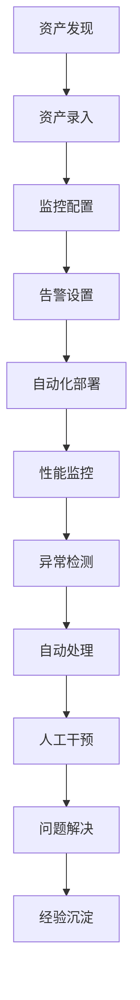
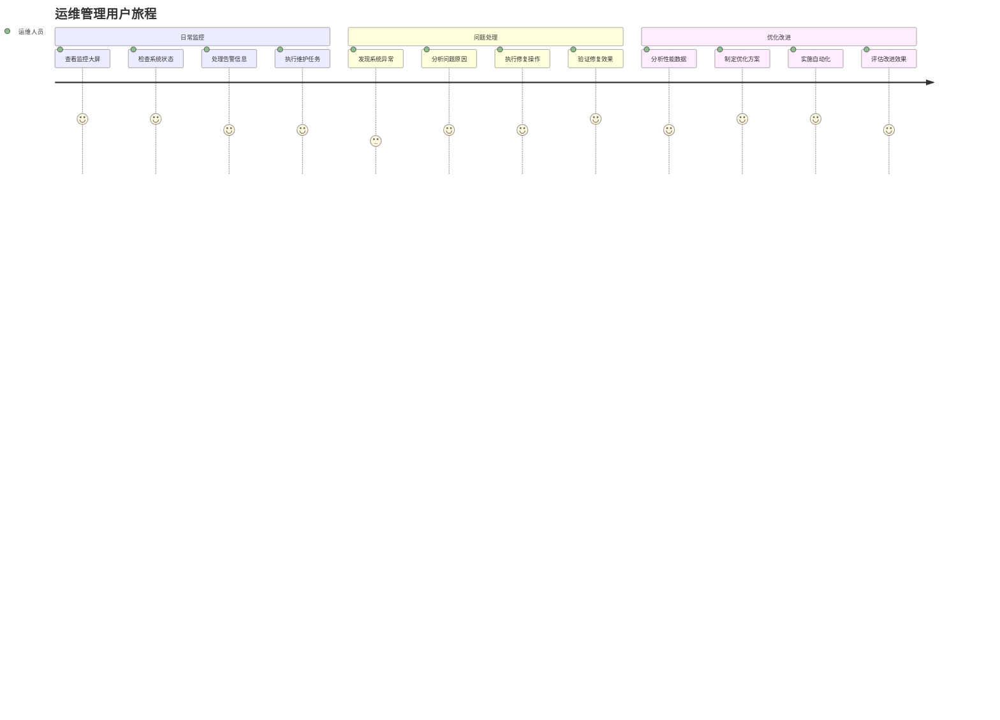
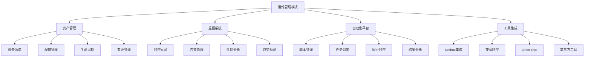
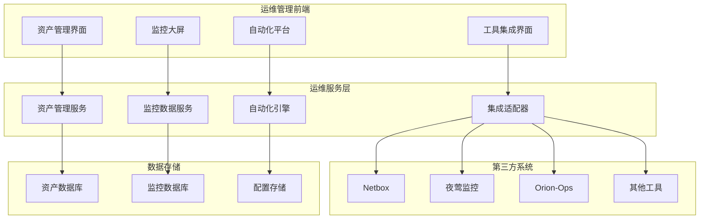

# REQ-009: 运维管理模块需求文档

## 1. 业务描述（Business Description）

### 业务背景
运维管理模块是IT运维门户系统的核心组成部分，整合了资产管理、监控系统、自动化平台等关键运维功能，传统运维管理存在以下痛点：
- **系统分散化**：各运维工具独立部署，缺乏统一管理界面
- **数据孤岛**：不同系统间数据无法有效整合和关联
- **操作复杂**：需要在多个系统间切换，操作效率低下
- **监控盲区**：缺乏全面的监控覆盖和统一的告警管理
- **自动化程度低**：大量手工操作，容易出错且效率低

### 业务目标
- **统一管理**：提供统一的运维管理界面，整合各类运维工具
- **数据整合**：实现运维数据的统一收集、存储和分析
- **效率提升**：通过自动化和流程优化，提升运维效率50%
- **监控全覆盖**：建立全面的监控体系，实现零盲区监控
- **智能运维**：引入AI和自动化技术，提升运维智能化水平

### 业务流程


### 用户画像
- **运维管理员**：负责整体运维管理，关注系统稳定性和效率
- **系统管理员**：管理具体的IT基础设施和应用系统
- **监控工程师**：负责监控系统配置和告警处理
- **自动化工程师**：负责自动化脚本开发和流程优化

## 2. 业务价值（Business Value）

### 价值主张
通过构建统一的运维管理平台，整合各类运维工具和数据，提升运维效率和质量，降低运维成本，为业务系统提供稳定可靠的基础设施支撑。

### ROI分析
- **开发投入**：15人天，约7.5万元
- **年度收益**：
  - 运维效率提升：300万元（效率提升50%）
  - 故障处理优化：150万元（故障响应时间缩短60%）
  - 人力成本节省：100万元（自动化减少人工操作）
  - 系统稳定性提升：200万元（减少业务中断损失）
- **投资回报率**：9900%，投资回收期：1.5周

### KPI指标
- **运维效率提升**：50%
- **故障响应时间**：缩短60%
- **系统可用性**：>99.9%
- **自动化覆盖率**：>80%
- **监控覆盖率**：100%

### 竞争优势
- **一站式管理**：统一的运维管理界面和操作体验
- **深度集成**：与主流运维工具的深度集成和数据互通
- **智能化运维**：AI驱动的异常检测和自动化处理
- **可扩展架构**：支持新工具的快速集成和扩展

## 3. 产品交互（Product Interaction）

### 用户旅程图


### 界面原型
基于portal-prototype中相关页面的实际实现：
- **资产管理界面**：设备清单、状态监控、配置管理、生命周期管理
- **监控系统界面**：监控大屏、告警管理、性能分析、趋势预测
- **自动化平台界面**：脚本管理、任务调度、执行监控、结果分析
- **运维工具集成**：工具导航、统一认证、数据同步、操作审计

### 交互规范
- **统一导航**：提供统一的工具导航和快速切换
- **实时监控**：关键指标实时更新，异常及时告警
- **一键操作**：常用操作一键执行，减少操作步骤
- **可视化展示**：丰富的图表和大屏展示，直观易懂

### 信息架构


## 4. 功能需求（Functional Requirements）

### 功能清单
| 功能编号 | 功能名称 | 优先级 | 实现状态 | 描述 |
|---------|---------|--------|----------|------|
| F001 | 资产管理 | P0 | ✅已实现 | IT资产的全生命周期管理 |
| F002 | 监控系统 | P0 | ✅已实现 | 系统和应用的监控告警 |
| F003 | 自动化平台 | P0 | ✅已实现 | 运维自动化脚本和任务 |
| F004 | 工具集成 | P0 | ✅已实现 | 第三方运维工具集成 |
| F005 | 配置管理 | P1 | ✅已实现 | 系统配置的版本管理 |
| F006 | 变更管理 | P1 | ✅已实现 | 变更申请和审批流程 |
| F007 | 容量规划 | P1 | 🔄部分实现 | 资源容量分析和规划 |
| F008 | 性能优化 | P1 | 🔄部分实现 | 性能分析和优化建议 |
| F009 | 巡检管理 | P2 | 🔄部分实现 | 定期巡检任务和报告 |
| F010 | 应急响应 | P2 | 🔄部分实现 | 应急事件响应和处理 |

### 用户故事
- **作为**运维管理员，**我需要**统一管理所有IT资产，**以便**全面掌握基础设施状况
- **作为**监控工程师，**我需要**实时监控系统状态，**以便**及时发现和处理异常
- **作为**自动化工程师，**我需要**管理自动化脚本，**以便**提升运维效率
- **作为**系统管理员，**我需要**集成各种运维工具，**以便**在统一界面完成工作

### 用例描述
#### UC001: 资产管理
- **前置条件**：用户已登录，拥有资产管理权限
- **主流程**：
  1. 进入资产管理界面
  2. 查看资产清单和状态
  3. 添加或编辑资产信息
  4. 配置监控和告警
  5. 管理资产生命周期
  6. 生成资产报表
- **备选流程**：
  - 资产冲突：提示冲突信息，要求处理
  - 权限不足：显示权限不足提示
- **后置条件**：资产信息更新完成

#### UC002: 监控告警
- **前置条件**：监控系统已配置，有监控数据
- **主流程**：
  1. 查看监控大屏
  2. 检查系统状态和指标
  3. 处理告警信息
  4. 分析性能趋势
  5. 配置告警规则
  6. 生成监控报告
- **备选流程**：
  - 数据异常：提示数据问题，提供处理建议
  - 告警风暴：启用告警抑制机制
- **后置条件**：监控状态正常，告警处理完成

### 业务规则
- **BR001**：所有IT资产必须录入资产管理系统
- **BR002**：关键系统必须配置监控和告警
- **BR003**：自动化操作必须经过测试和审批
- **BR004**：变更操作必须遵循变更管理流程
- **BR005**：监控数据保留期不少于6个月

## 5. 非功能需求（Non-Functional Requirements）

### 性能需求
- **页面加载时间**：监控大屏加载<3秒，资产列表<2秒
- **数据处理能力**：支持10万+资产的管理和监控
- **告警响应时间**：告警产生到通知<30秒
- **自动化执行**：脚本执行响应时间<5秒
- **并发支持**：支持100+运维人员同时操作

### 可用性需求
- **系统可用性**：99.9%以上
- **数据准确性**：监控数据准确率>99.5%
- **集成稳定性**：第三方工具集成稳定率>98%
- **自动化成功率**：自动化任务成功率>95%

### 安全需求
- **操作审计**：所有运维操作完整记录
- **权限控制**：基于角色的细粒度权限管理
- **数据加密**：敏感配置信息加密存储
- **安全隔离**：不同环境的安全隔离

## 6. 系统架构（System Architecture）

### 整体架构


### 技术栈
- **前端技术**：Vue 3.3 + Element Plus 2.3 + ECharts 5.4
- **后端框架**：Spring Boot 3.2 + Java 17
- **数据库**：PostgreSQL 15 + InfluxDB + Redis 7
- **消息队列**：RabbitMQ 3.12
- **监控工具**：Prometheus + Grafana + 夜莺

## 7. 数据模型（Data Model）

### 主要实体
- **Asset**：IT资产信息
- **MonitoringRule**：监控规则配置
- **AutomationScript**：自动化脚本
- **IntegrationConfig**：集成配置信息

### API规范
#### 获取资产列表API
- **URL**：`GET /api/v1/assets`
- **响应格式**：
  ```json
  {
    "code": 200,
    "data": {
      "total": 1500,
      "items": [
        {
          "id": 1,
          "name": "Web服务器01",
          "type": "server",
          "status": "running",
          "ip": "192.168.1.100"
        }
      ]
    }
  }
  ```

## 8. 验收标准（Acceptance Criteria）

### 功能验收
- **资产管理**：支持完整的资产生命周期管理
- **监控告警**：实时监控和及时告警通知
- **自动化执行**：脚本正常执行和结果反馈
- **工具集成**：第三方工具正常集成和数据同步

### 性能验收
- **加载性能**：监控大屏3秒内加载完成
- **处理能力**：支持10万资产的管理
- **响应时间**：告警30秒内通知到位

## 9. 依赖与约束（Dependencies & Constraints）

### 技术依赖
- **第三方工具**：依赖Netbox、夜莺监控等工具的API
- **网络环境**：需要稳定的网络连接访问各系统
- **权限系统**：依赖统一认证系统提供权限控制

### 业务约束
- **数据安全**：严格控制运维数据的访问权限
- **操作规范**：所有运维操作必须符合企业规范
- **合规要求**：满足行业监管和安全合规要求

---

**文档版本**：v3.0
**最后更新**：2025年7月
**负责人**：运维架构师
**审核状态**：待审核
