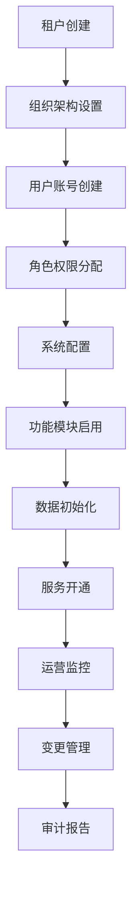
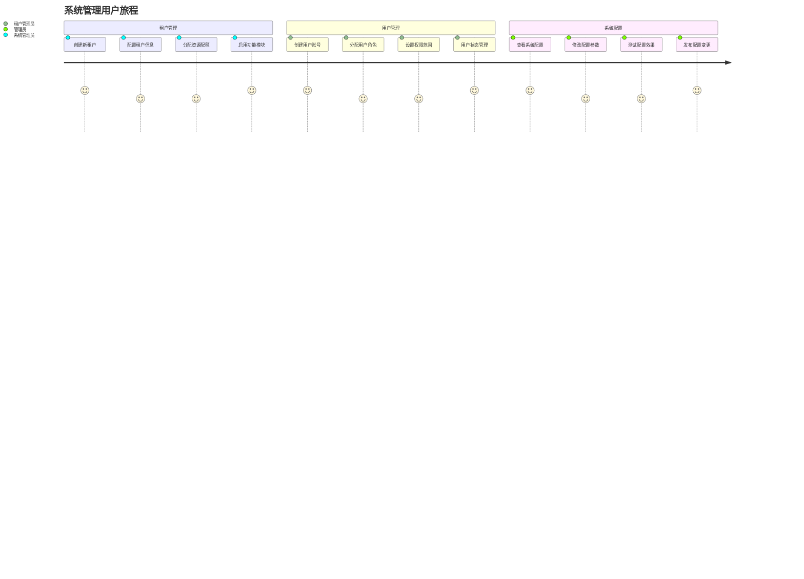
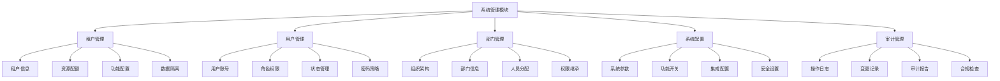
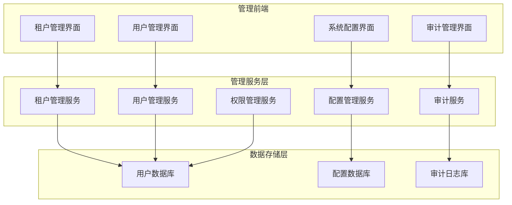

# REQ-010: 系统管理模块需求文档

## 1. 业务描述（Business Description）

### 业务背景
系统管理模块是IT运维门户系统的基础支撑模块，负责租户管理、部门管理、用户管理、系统配置等核心管理功能，传统系统管理存在以下痛点：
- **多租户管理复杂**：缺乏统一的多租户管理机制，数据隔离困难
- **用户权限管理混乱**：权限分配不清晰，安全风险高
- **系统配置分散**：各模块配置分散，缺乏统一管理
- **组织架构变更困难**：部门和人员变更流程复杂，影响业务
- **审计追踪不完整**：缺乏完整的操作审计和变更追踪

### 业务目标
- **多租户统一管理**：提供完善的多租户管理机制，确保数据安全隔离
- **权限精细化控制**：建立基于角色的权限管理体系，确保系统安全
- **配置集中化管理**：统一管理系统配置，提升管理效率
- **组织架构灵活调整**：支持组织架构的灵活变更和管理
- **操作全程审计**：建立完整的操作审计体系，确保合规性

### 业务流程


### 用户画像
- **系统管理员**：负责整个系统的管理和维护，拥有最高权限
- **租户管理员**：管理本租户的用户和配置，权限范围限定在租户内
- **部门管理员**：管理本部门的用户和资源，权限范围限定在部门内
- **普通用户**：使用系统功能，查看个人信息和权限范围内的数据

## 2. 业务价值（Business Value）

### 价值主张
通过构建完善的系统管理模块，实现多租户的统一管理、用户权限的精细控制、系统配置的集中管理，为整个IT运维门户系统提供稳定可靠的基础支撑，确保系统安全性和可管理性。

### ROI分析
- **开发投入**：10人天，约5万元
- **年度收益**：
  - 管理效率提升：120万元（管理成本降低40%）
  - 安全风险降低：200万元（减少安全事故损失）
  - 合规成本节省：80万元（自动化审计和报告）
  - 运维成本降低：60万元（统一配置管理）
- **投资回报率**：9100%，投资回收期：2周

### KPI指标
- **管理效率提升**：40%
- **权限配置准确率**：>99%
- **系统配置一致性**：100%
- **审计覆盖率**：100%
- **用户满意度**：>90%

### 竞争优势
- **多租户原生**：原生支持多租户架构，数据完全隔离
- **权限精细化**：支持基于角色、资源、操作的细粒度权限控制
- **配置统一化**：所有系统配置统一管理，支持批量操作
- **审计完整性**：完整的操作审计和变更追踪机制

## 3. 产品交互（Product Interaction）

### 用户旅程图


### 界面原型
基于portal-prototype中相关管理页面的实际实现：
- **租户管理界面**：租户列表、租户详情、资源配额、功能配置
- **用户管理界面**：用户列表、角色分配、权限设置、状态管理
- **部门管理界面**：组织架构、部门信息、人员分配、权限继承
- **系统配置界面**：配置分类、参数设置、批量操作、变更历史

### 交互规范
- **分级管理**：不同级别管理员看到不同的管理界面
- **权限可视化**：权限设置以树形结构直观展示
- **批量操作**：支持用户、配置的批量操作
- **变更确认**：重要操作需要二次确认

### 信息架构


## 4. 功能需求（Functional Requirements）

### 功能清单
| 功能编号 | 功能名称 | 优先级 | 实现状态 | 描述 |
|---------|---------|--------|----------|------|
| F001 | 租户管理 | P0 | 未实现 | 多租户的创建、配置、管理 |
| F002 | 用户管理 | P0 | 未实现 | 用户账号的全生命周期管理 |
| F003 | 角色权限管理 | P0 | 未实现 | 基于角色的权限分配和控制 |
| F004 | 部门管理 | P0 | 未实现 | 组织架构和部门信息管理 |
| F005 | 系统配置管理 | P0 | 未实现 | 系统参数和功能配置管理 |
| F006 | 操作审计 | P1 | 未实现 | 操作日志记录和审计追踪 |
| F007 | 数据备份恢复 | P1 | 未实现 | 系统数据的备份和恢复 |
| F008 | 系统监控 | P1 | 未实现 | 系统运行状态监控 |
| F009 | 安全策略管理 | P1 | 未实现 | 密码策略、登录策略等 |
| F010 | 许可证管理 | P2 | 未实现 | 系统许可证和授权管理 |

### 用户故事
- **作为**系统管理员，**我需要**管理多个租户，**以便**为不同客户提供独立的服务环境
- **作为**租户管理员，**我需要**管理本租户的用户和权限，**以便**确保数据安全和访问控制
- **作为**部门管理员，**我需要**管理部门组织架构，**以便**合理分配人员和权限
- **作为**系统管理员，**我需要**统一管理系统配置，**以便**确保系统稳定运行

### 用例描述
#### UC001: 租户管理
- **前置条件**：用户为系统管理员，拥有租户管理权限
- **主流程**：
  1. 进入租户管理界面
  2. 创建新租户或编辑现有租户
  3. 配置租户基本信息和资源配额
  4. 设置功能模块启用状态
  5. 配置数据隔离策略
  6. 保存租户配置
  7. 初始化租户数据
- **备选流程**：
  - 租户名称冲突：提示重新输入
  - 资源配额超限：提示调整配额
- **后置条件**：租户创建成功，可以正常使用

#### UC002: 用户权限管理
- **前置条件**：用户为管理员，拥有用户管理权限
- **主流程**：
  1. 进入用户管理界面
  2. 创建用户或编辑现有用户
  3. 设置用户基本信息
  4. 分配用户角色
  5. 配置权限范围
  6. 设置用户状态
  7. 保存用户配置
- **备选流程**：
  - 用户名重复：提示修改用户名
  - 权限冲突：提供权限调整建议
- **后置条件**：用户权限配置完成

### 业务规则
- **BR001**：每个租户必须有唯一的标识符和名称
- **BR002**：用户只能访问其权限范围内的数据和功能
- **BR003**：系统配置变更必须记录操作日志
- **BR004**：重要操作需要管理员审批或二次确认
- **BR005**：密码必须符合安全策略要求

## 5. 非功能需求（Non-Functional Requirements）

### 性能需求
- **页面加载时间**：管理界面加载<2秒
- **用户查询性能**：支持10万+用户的快速查询，响应时间<1秒
- **权限验证性能**：权限验证响应时间<100ms
- **配置更新性能**：配置变更生效时间<30秒
- **并发支持**：支持50+管理员同时操作

### 可用性需求
- **系统可用性**：99.9%以上
- **数据一致性**：用户权限和配置数据一致性>99.9%
- **操作成功率**：管理操作成功率>99%
- **审计完整性**：操作审计记录完整率100%

### 安全需求
- **数据隔离**：多租户数据完全隔离，零泄露
- **权限控制**：基于角色的细粒度权限控制
- **操作审计**：所有管理操作完整记录
- **密码安全**：强密码策略和定期更换机制

## 6. 系统架构（System Architecture）

### 整体架构


### 技术栈
- **前端技术**：Vue 3.3 + Element Plus 2.3
- **后端框架**：Spring Boot 3.2 + Java 17
- **安全框架**：Spring Security + JWT
- **数据库**：PostgreSQL 15 + Redis 7
- **审计框架**：自研审计组件

## 7. 数据模型（Data Model）

### 主要实体
- **Tenant**：租户信息
- **User**：用户账号信息
- **Role**：角色定义
- **Permission**：权限定义
- **Department**：部门信息
- **SystemConfig**：系统配置
- **AuditLog**：审计日志

### API规范
#### 获取租户列表API
- **URL**：`GET /api/v1/tenants`
- **响应格式**：
  ```json
  {
    "code": 200,
    "data": {
      "total": 50,
      "items": [
        {
          "id": 1,
          "name": "客户A",
          "status": "active",
          "userCount": 25,
          "createdAt": "2025-01-01"
        }
      ]
    }
  }
  ```

## 8. 验收标准（Acceptance Criteria）

### 功能验收
- **租户管理**：支持租户的完整生命周期管理
- **用户管理**：支持用户账号和权限的精细管理
- **系统配置**：支持系统参数的统一配置和管理
- **操作审计**：完整记录所有管理操作

### 性能验收
- **查询性能**：10万用户查询1秒内响应
- **权限验证**：权限验证100ms内完成
- **配置更新**：配置变更30秒内生效

### 安全验收
- **数据隔离**：多租户数据完全隔离
- **权限控制**：权限验证准确率100%
- **审计完整**：操作审计记录完整无遗漏

## 9. 依赖与约束（Dependencies & Constraints）

### 技术依赖
- **认证系统**：依赖统一认证系统提供身份验证
- **数据库**：依赖PostgreSQL提供数据存储
- **缓存系统**：依赖Redis提供缓存支持

### 业务约束
- **合规要求**：满足数据保护和隐私法规要求
- **安全标准**：符合企业安全管理标准
- **审计要求**：满足内控和外部审计要求

---

**文档版本**：v3.0
**最后更新**：2025年7月
**负责人**：系统架构师
**审核状态**：待审核
