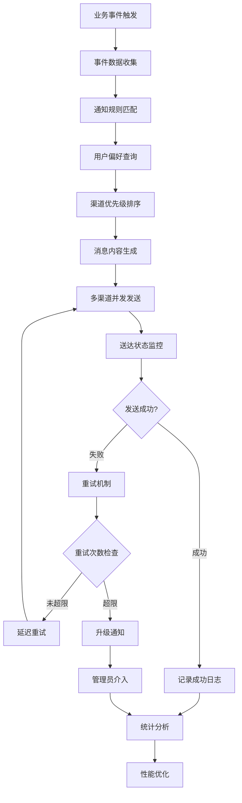
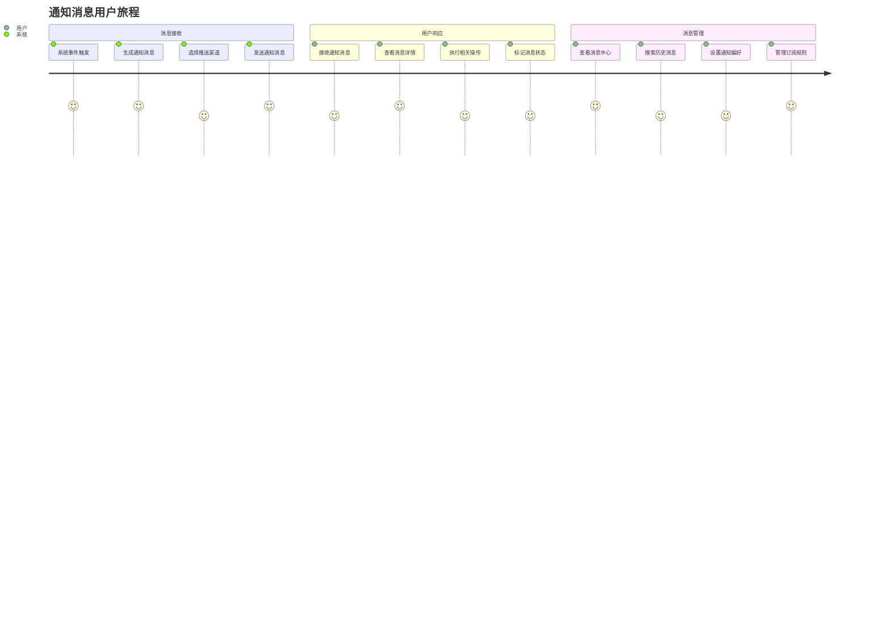
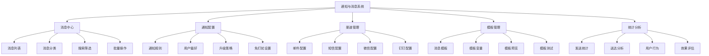
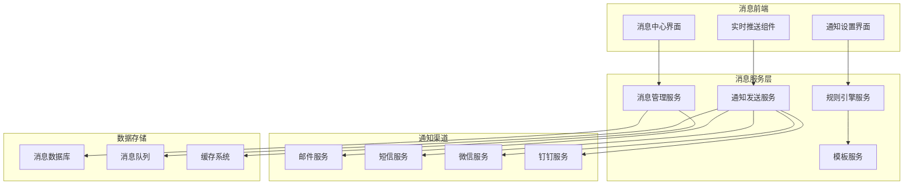

# REQ-011: 通知与消息系统需求文档

## 1. 业务描述（Business Description）

### 业务背景
通知系统是IT运维门户系统的核心基础设施，为整个平台提供统一的消息通知服务。作为独立的系统级模块，它需要支撑多种业务场景和通知渠道。传统通知系统存在以下痛点：
- **通知渠道分散**：各业务模块独立实现通知功能，缺乏统一管理
- **消息延迟严重**：重要告警通知延迟，影响故障响应时间
- **通知规则简单**：缺乏灵活的通知规则和个性化配置
- **消息管理混乱**：消息分类不清，查找和管理困难
- **送达率不高**：缺乏送达确认和重试机制
- **扩展性差**：新增通知渠道需要大量开发工作

### 业务目标
- **统一通知平台**：为所有业务模块提供统一的通知服务
- **多渠道支持**：支持站内消息、短信、电话、邮件等多种通知渠道
- **实时推送**：关键告警实时推送，通知延迟<30秒
- **智能路由**：基于规则的智能通知路由和升级机制
- **消息统一管理**：统一的消息中心，支持分类和搜索
- **高送达率**：通知送达率>95%，支持失败重试
- **高扩展性**：支持快速扩展新的通知渠道和业务场景

### 支撑业务场景
#### 工单相关通知
- **工单创建通知**：工单创建后通知相关工程师和管理员
- **工单分配通知**：工单分配给工程师时的即时通知
- **工单状态变更通知**：工单状态变化时通知相关人员
- **工单超时告警**：工单处理超时的升级通知
- **工单完成通知**：工单完成后的确认通知

#### 工作流通知
- **审批提醒通知**：待审批任务的提醒通知
- **流程状态变更通知**：流程状态变化的实时通知
- **审批结果通知**：审批完成后的结果通知
- **流程超时告警**：流程处理超时的升级通知

#### 系统通知
- **维护公告通知**：系统维护和升级公告
- **安全提醒通知**：安全事件和风险提醒
- **系统异常告警**：系统故障和异常告警
- **性能告警通知**：系统性能指标异常告警

#### 业务告警
- **监控告警通知**：基础设施监控告警
- **业务异常通知**：业务系统异常告警
- **SLA违约通知**：服务等级协议违约告警
- **容量预警通知**：资源容量预警告警

### 通知渠道支持
#### 站内消息
- **实时推送**：WebSocket实时消息推送
- **离线存储**：用户离线时消息存储
- **消息分类**：按类型和重要性分类
- **批量操作**：支持批量标记和删除

#### 短信通知
- **验证码短信**：登录、重置密码等安全验证
- **告警短信**：重要事件和紧急告警通知
- **状态通知短信**：工单、审批等状态变更通知
- **营销短信**：产品更新和活动通知

#### 电话通知
- **语音告警**：紧急故障的语音告警
- **自动外呼**：重要事件的自动电话通知
- **人工客服**：复杂问题的人工电话沟通
- **会议通知**：重要会议的电话提醒

#### 邮件通知
- **HTML邮件**：富文本格式的详细通知
- **附件支持**：支持报告和文档附件
- **邮件模板**：标准化的邮件模板
- **批量发送**：支持批量邮件发送

### 业务流程


### 用户画像
- **运维工程师**：接收工单分配、告警通知等运维相关消息，需要及时响应
- **部门经理**：接收审批提醒、团队绩效等管理类消息，关注业务指标
- **系统管理员**：接收系统异常、安全告警等技术类消息，负责系统稳定
- **甲方用户**：接收服务报告、故障通知等客户关怀消息，关注服务质量
- **通知管理员**：配置通知规则、管理消息模板、监控通知状态，优化通知效果

## 2. 业务价值（Business Value）

### 价值主张
通过构建统一的通知系统平台，实现多渠道、实时、智能的消息推送服务，为整个IT运维门户系统提供可靠的通知基础设施，提升运维响应效率，改善用户体验，确保重要信息及时传达，为业务连续性提供有力保障。

### ROI分析
- **开发投入**：24人天，约12万元
- **年度收益**：
  - 响应效率提升：300万元（故障响应时间缩短60%）
  - 沟通成本节省：150万元（减少电话和人工通知）
  - 客户满意度提升：200万元（及时通知提升体验）
  - 运维效率提升：120万元（自动化通知减少人工）
  - 合规风险降低：80万元（完整的通知审计记录）
- **投资回报率**：6950%，投资回收期：1个月

### KPI指标
- **通知送达率**：>98%
- **通知延迟时间**：<10秒
- **故障响应时间**：缩短60%
- **用户满意度**：>95%
- **通知准确率**：>99%
- **系统可用性**：>99.9%

### 竞争优势
- **统一平台**：为所有业务模块提供统一的通知服务
- **多渠道集成**：支持站内消息、短信、电话、邮件等多种渠道
- **智能路由**：基于规则和AI的智能通知路由和升级
- **实时推送**：毫秒级的消息推送能力
- **个性化配置**：支持用户个性化的通知偏好设置
- **高可扩展性**：支持快速扩展新的通知渠道和业务场景

## 3. 产品交互（Product Interaction）

### 用户旅程图


### 界面原型
基于portal-prototype中NotificationDemo.vue的实际实现：
- **消息中心界面**：消息列表、分类筛选、搜索功能、批量操作
- **通知设置界面**：通知偏好、渠道配置、规则设置、模板管理
- **消息详情界面**：消息内容、相关操作、回复功能、转发分享
- **统计分析界面**：发送统计、送达率分析、用户行为分析

### 交互规范
- **实时更新**：新消息实时推送到消息中心
- **状态标识**：清晰的已读/未读状态标识
- **快速操作**：支持消息的快速标记和批量操作
- **响应式设计**：适配各种设备的消息查看体验

### 信息架构


## 4. 功能需求（Functional Requirements）

### 功能清单

#### 核心通知功能
| 功能编号 | 功能名称 | 优先级 | 实现状态 | 描述 |
|---------|---------|--------|----------|------|
| F001 | 站内消息推送 | P0 | 未实现 | WebSocket实时站内消息推送 |
| F002 | 短信通知服务 | P0 | 未实现 | 短信验证码和告警通知发送 |
| F003 | 电话通知服务 | P0 | 🔄部分实现 | 语音告警和自动外呼通知 |
| F004 | 邮件通知服务 | P1 | 未实现 | HTML邮件和附件发送 |
| F005 | 通知规则引擎 | P0 | 未实现 | 基于规则的智能通知路由 |
| F006 | 消息模板管理 | P0 | 未实现 | 多渠道消息模板创建和管理 |
| F007 | 通知优先级管理 | P0 | 未实现 | 基于优先级的通知调度 |
| F008 | 送达状态跟踪 | P1 | 未实现 | 消息送达状态确认和追踪 |
| F009 | 失败重试机制 | P1 | 未实现 | 发送失败的自动重试和升级 |
| F010 | 通知限流控制 | P1 | 未实现 | 防止通知轰炸的限流机制 |

#### 消息管理功能
| 功能编号 | 功能名称 | 优先级 | 实现状态 | 描述 |
|---------|---------|--------|----------|------|
| F011 | 消息中心 | P0 | 未实现 | 统一的消息接收和管理中心 |
| F012 | 消息分类管理 | P1 | 未实现 | 按类型和重要性分类管理 |
| F013 | 消息搜索过滤 | P1 | 未实现 | 历史消息的搜索和筛选 |
| F014 | 消息批量操作 | P1 | 未实现 | 批量标记、删除等操作 |
| F015 | 消息状态管理 | P1 | 未实现 | 已读/未读、重要性标记 |
| F016 | 消息归档管理 | P2 | 未实现 | 历史消息归档和清理 |
| F017 | 消息导出功能 | P2 | ❌未实现 | 消息数据导出和备份 |

#### 配置管理功能
| 功能编号 | 功能名称 | 优先级 | 实现状态 | 描述 |
|---------|---------|--------|----------|------|
| F018 | 用户偏好设置 | P1 | 未实现 | 个性化通知偏好配置 |
| F019 | 渠道配置管理 | P0 | 未实现 | 各通知渠道的参数配置 |
| F020 | 免打扰时间设置 | P1 | 未实现 | 用户免打扰时间段配置 |
| F021 | 通知订阅管理 | P1 | 未实现 | 用户通知订阅和退订管理 |
| F022 | 渠道健康监控 | P1 | 未实现 | 各通知渠道的健康状态监控 |

#### 统计分析功能
| 功能编号 | 功能名称 | 优先级 | 实现状态 | 描述 |
|---------|---------|--------|----------|------|
| F023 | 发送统计分析 | P1 | 未实现 | 通知发送量和成功率统计 |
| F024 | 用户行为分析 | P1 | 未实现 | 用户消息阅读和响应行为分析 |
| F025 | 渠道效果分析 | P1 | 未实现 | 各通知渠道的效果对比分析 |
| F026 | 性能监控报告 | P1 | 未实现 | 通知系统性能指标监控 |
| F027 | 异常告警监控 | P1 | 未实现 | 通知系统异常情况告警 |

### 用户故事

#### 通知接收用户故事
- **作为**运维工程师，**我需要**及时接收工单分配通知，**以便**快速响应和处理紧急故障
- **作为**部门经理，**我需要**接收审批提醒通知，**以便**及时处理下属的各类申请
- **作为**甲方用户，**我需要**接收故障通知和服务报告，**以便**了解服务状态和质量
- **作为**系统管理员，**我需要**接收系统异常告警，**以便**及时处理系统故障

#### 通知管理用户故事
- **作为**通知管理员，**我需要**配置通知规则，**以便**确保重要消息及时推送给相关人员
- **作为**用户，**我需要**管理消息偏好，**以便**只接收关心的通知信息，避免信息过载
- **作为**系统管理员，**我需要**监控通知状态，**以便**确保通知系统正常运行
- **作为**业务管理员，**我需要**分析通知效果，**以便**优化通知策略和提升用户体验

#### 渠道管理用户故事
- **作为**系统管理员，**我需要**配置多种通知渠道，**以便**提供多样化的通知服务
- **作为**用户，**我需要**选择通知渠道偏好，**以便**通过最适合的方式接收通知
- **作为**运维人员，**我需要**监控渠道健康状态，**以便**确保通知渠道正常可用
- **作为**安全管理员，**我需要**管理短信验证码，**以便**保障系统安全认证

### 用例描述
#### UC001: 发送通知消息
- **前置条件**：系统事件触发，通知规则已配置
- **主流程**：
  1. 系统事件触发通知
  2. 根据事件类型匹配通知规则
  3. 确定接收人和通知渠道
  4. 生成消息内容
  5. 发送通知消息
  6. 记录发送日志
  7. 等待送达确认
- **备选流程**：
  - 发送失败：启动重试机制
  - 无匹配规则：使用默认通知规则
  - 渠道不可用：切换备用渠道
- **后置条件**：通知消息成功发送并记录

#### UC002: 管理消息中心
- **前置条件**：用户已登录，有消息查看权限
- **主流程**：
  1. 进入消息中心界面
  2. 查看消息列表和统计
  3. 筛选和搜索消息
  4. 查看消息详情
  5. 标记消息状态
  6. 执行相关操作
- **备选流程**：
  - 无新消息：显示历史消息
  - 权限不足：只显示授权消息
- **后置条件**：消息状态更新完成

### 业务规则
- **BR001**：紧急告警必须通过多渠道同时推送
- **BR002**：消息发送失败最多重试3次
- **BR003**：用户可以设置免打扰时间段
- **BR004**：重要消息需要送达确认
- **BR005**：消息保留期限为6个月

## 5. 非功能需求（Non-Functional Requirements）

### 性能需求
- **消息推送延迟**：关键告警推送延迟<30秒
- **并发处理能力**：支持1000+并发消息发送
- **消息吞吐量**：每分钟处理10000+条消息
- **页面加载时间**：消息中心页面加载<2秒
- **搜索响应时间**：消息搜索响应时间<1秒

### 可用性需求
- **系统可用性**：99.5%以上
- **消息送达率**：>95%
- **通知准确率**：>98%
- **渠道可用性**：主要通知渠道可用率>99%

### 安全需求
- **消息加密**：敏感消息内容加密传输
- **权限控制**：基于角色的消息访问控制
- **审计日志**：完整的消息发送和接收日志
- **防垃圾消息**：防止恶意消息和垃圾信息

## 6. 系统架构（System Architecture）

### 整体架构


### 技术栈
- **前端技术**：Vue 3.3 + Element Plus 2.3 + WebSocket
- **后端框架**：Spring Boot 3.2 + Java 17
- **消息队列**：RabbitMQ 3.12
- **数据库**：PostgreSQL 15 + Redis 7
- **通知服务**：自研通知网关 + 第三方API

## 7. 数据模型（Data Model）

### 主要实体
- **Message**：消息记录
- **NotificationRule**：通知规则
- **MessageTemplate**：消息模板
- **NotificationChannel**：通知渠道配置
- **UserPreference**：用户通知偏好

### API规范
#### 发送通知API
- **URL**：`POST /api/v1/notifications/send`
- **请求参数**：
  ```json
  {
    "type": "alert",
    "title": "系统告警",
    "content": "服务器CPU使用率过高",
    "recipients": ["user1", "user2"],
    "channels": ["email", "sms"],
    "priority": "high"
  }
  ```

## 8. 验收标准（Acceptance Criteria）

### 功能验收
- **消息推送**：支持多渠道实时消息推送
- **消息管理**：完整的消息中心管理功能
- **规则配置**：灵活的通知规则配置
- **统计分析**：详细的发送和效果统计

### 性能验收
- **推送延迟**：关键告警30秒内推送
- **送达率**：消息送达率达到95%以上
- **并发处理**：支持1000并发消息发送

## 9. 依赖与约束（Dependencies & Constraints）

### 技术依赖
- **第三方服务**：依赖邮件、短信、微信等第三方服务
- **消息队列**：依赖RabbitMQ提供消息队列服务
- **实时通信**：依赖WebSocket提供实时推送

### 业务约束
- **合规要求**：消息内容符合相关法规要求
- **成本控制**：短信等付费渠道需要成本控制
- **隐私保护**：保护用户隐私和消息内容安全

---

**文档版本**：v3.0
**最后更新**：2025年7月
**负责人**：消息系统架构师
**审核状态**：待审核
