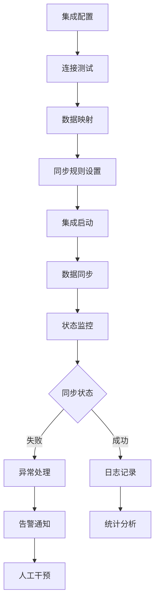
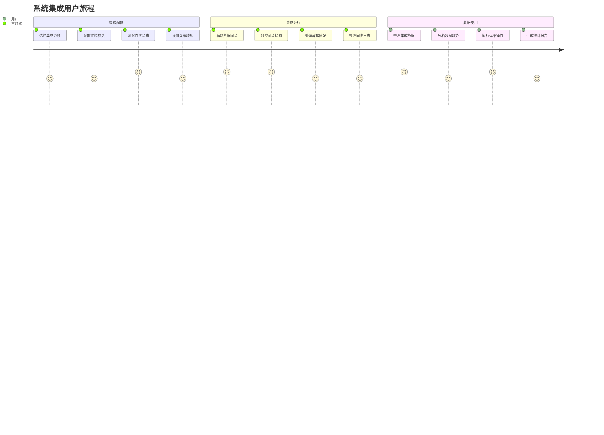
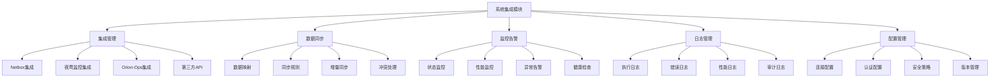
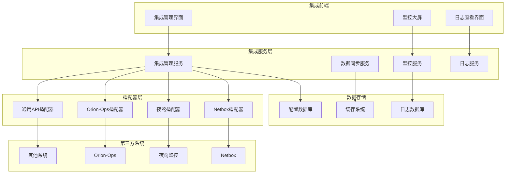

# REQ-012: 系统集成模块需求文档

## 1. 业务描述（Business Description）

### 业务背景
系统集成模块是IT运维门户系统的重要组成部分，负责与第三方运维工具的集成和数据互通，传统系统集成存在以下痛点：
- **系统孤岛**：各运维工具独立运行，缺乏有效的数据交换和协同
- **集成复杂**：不同系统的API和数据格式差异大，集成开发复杂
- **数据不一致**：多系统间数据同步困难，容易出现数据不一致
- **维护成本高**：集成接口维护成本高，系统升级影响大
- **监控盲区**：缺乏对集成状态的有效监控和管理

### 业务目标
- **统一集成平台**：提供统一的第三方系统集成平台和管理界面
- **数据实时同步**：实现关键数据的实时同步和一致性保障
- **集成标准化**：建立标准化的集成规范和接口协议
- **监控可视化**：提供集成状态的实时监控和可视化展示
- **运维自动化**：通过系统集成实现运维流程的自动化

### 业务流程


### 用户画像
- **系统管理员**：负责集成配置和管理，监控集成状态
- **运维工程师**：使用集成数据进行运维操作和分析
- **开发工程师**：负责集成接口的开发和维护
- **业务用户**：通过集成功能获得统一的数据视图

## 2. 业务价值（Business Value）

### 价值主张
通过构建统一的系统集成平台，打破系统孤岛，实现数据互通和流程协同，提升运维效率，降低集成成本，为用户提供一站式的运维管理体验。

### ROI分析
- **开发投入**：12人天，约6万元
- **年度收益**：
  - 集成成本节省：200万元（减少重复开发和维护）
  - 运维效率提升：150万元（数据统一和流程自动化）
  - 数据质量提升：80万元（减少数据不一致导致的问题）
  - 系统维护成本降低：60万元（统一管理和监控）
- **投资回报率**：8066%，投资回收期：1.5周

### KPI指标
- **集成成功率**：>99%
- **数据同步延迟**：<5分钟
- **集成稳定性**：>99.5%
- **开发效率提升**：60%
- **运维效率提升**：40%

### 竞争优势
- **标准化集成**：提供标准化的集成框架和协议
- **可视化管理**：直观的集成配置和监控界面
- **高可靠性**：完善的异常处理和恢复机制
- **易扩展性**：支持新系统的快速集成和扩展

## 3. 产品交互（Product Interaction）

### 用户旅程图


### 界面原型
基于portal-prototype中IntegrationDemo.vue的实际实现：
- **集成管理界面**：集成列表、状态监控、配置管理、连接测试
- **数据同步界面**：同步规则、映射配置、执行监控、日志查看
- **任务日志界面**：执行日志、状态统计、错误分析、性能监控
- **系统配置界面**：参数配置、认证设置、安全策略、版本管理

### 交互规范
- **状态可视化**：集成状态通过颜色和图标直观展示
- **实时监控**：集成状态和数据同步实时更新
- **一键操作**：支持集成的一键启动、停止、重启
- **详细日志**：提供详细的执行日志和错误信息

### 信息架构


## 4. 功能需求（Functional Requirements）

### 功能清单
| 功能编号 | 功能名称 | 优先级 | 实现状态 | 描述 |
|---------|---------|--------|----------|------|
| F001 | Netbox集成 | P0 | 未实现 | 与Netbox资产管理系统集成 |
| F002 | 夜莺监控集成 | P0 | 未实现 | 与夜莺监控系统集成 |
| F003 | Orion-Ops集成 | P0 | 未实现 | 与Orion-Ops自动化平台集成 |
| F004 | 数据同步管理 | P0 | 未实现 | 数据的双向同步和管理 |
| F005 | 集成状态监控 | P0 | 未实现 | 集成状态的实时监控 |
| F006 | 任务日志管理 | P0 | 未实现 | 集成任务的日志记录和查看 |
| F007 | 异常处理机制 | P1 | 未实现 | 集成异常的处理和恢复 |
| F008 | 配置管理 | P1 | 未实现 | 集成参数和规则的配置 |
| F009 | 性能监控 | P1 | 未实现 | 集成性能的监控和优化 |
| F010 | API网关 | P2 | 🔄部分实现 | 统一的API网关和路由 |

### 用户故事
- **作为**系统管理员，**我需要**配置第三方系统集成，**以便**实现数据的统一管理
- **作为**运维工程师，**我需要**查看集成数据，**以便**进行统一的运维操作
- **作为**开发工程师，**我需要**监控集成状态，**以便**及时处理集成异常
- **作为**业务用户，**我需要**使用集成功能，**以便**获得完整的数据视图

### 用例描述
#### UC001: 配置系统集成
- **前置条件**：用户为系统管理员，拥有集成配置权限
- **主流程**：
  1. 进入集成管理界面
  2. 选择要集成的第三方系统
  3. 配置连接参数和认证信息
  4. 测试连接状态
  5. 设置数据映射规则
  6. 配置同步策略
  7. 启动集成服务
- **备选流程**：
  - 连接测试失败：检查配置参数，重新测试
  - 认证失败：更新认证信息
  - 数据映射错误：调整映射规则
- **后置条件**：集成配置完成，开始数据同步

#### UC002: 监控集成状态
- **前置条件**：集成服务已启动，有监控权限
- **主流程**：
  1. 进入集成监控界面
  2. 查看集成状态概览
  3. 检查数据同步情况
  4. 查看性能指标
  5. 处理异常告警
  6. 查看详细日志
- **备选流程**：
  - 发现异常：分析原因，执行修复操作
  - 性能问题：调整配置参数
- **后置条件**：集成状态正常，问题得到处理

### 业务规则
- **BR001**：集成配置变更必须经过测试验证
- **BR002**：数据同步失败时自动重试，最多重试3次
- **BR003**：关键集成异常必须立即告警通知
- **BR004**：集成日志保留期不少于3个月
- **BR005**：敏感配置信息必须加密存储

## 5. 非功能需求（Non-Functional Requirements）

### 性能需求
- **数据同步延迟**：实时数据同步延迟<5分钟
- **API响应时间**：集成API调用响应时间<2秒
- **并发处理能力**：支持100+并发集成任务
- **数据吞吐量**：每小时处理100万条数据记录
- **页面加载时间**：集成管理界面加载<2秒

### 可用性需求
- **集成可用性**：>99.5%
- **数据一致性**：>99.9%
- **集成成功率**：>99%
- **异常恢复时间**：<10分钟

### 安全需求
- **数据传输加密**：所有集成数据传输加密
- **认证安全**：支持多种安全认证方式
- **访问控制**：基于角色的集成功能访问控制
- **审计日志**：完整的集成操作审计记录

## 6. 系统架构（System Architecture）

### 整体架构


### 技术栈
- **前端技术**：Vue 3.3 + Element Plus 2.3 + ECharts 5.4
- **后端框架**：Spring Boot 3.2 + Java 17
- **集成框架**：Apache Camel + Spring Integration
- **数据库**：PostgreSQL 15 + Redis 7
- **消息队列**：RabbitMQ 3.12

## 7. 数据模型（Data Model）

### 主要实体
- **Integration**：集成配置信息
- **SyncTask**：数据同步任务
- **IntegrationLog**：集成执行日志
- **DataMapping**：数据映射规则
- **ConnectionConfig**：连接配置信息

### API规范
#### 创建集成配置API
- **URL**：`POST /api/v1/integrations`
- **请求参数**：
  ```json
  {
    "name": "Netbox集成",
    "type": "netbox",
    "config": {
      "url": "http://netbox.example.com",
      "token": "xxx",
      "syncInterval": 300
    }
  }
  ```

## 8. 验收标准（Acceptance Criteria）

### 功能验收
- **集成配置**：支持主要第三方系统的集成配置
- **数据同步**：实现数据的双向同步和一致性
- **状态监控**：提供实时的集成状态监控
- **日志管理**：完整的集成日志记录和查看

### 性能验收
- **同步延迟**：数据同步延迟5分钟内
- **处理能力**：支持100并发集成任务
- **成功率**：集成成功率达到99%以上

## 9. 依赖与约束（Dependencies & Constraints）

### 技术依赖
- **第三方系统**：依赖Netbox、夜莺、Orion-Ops等系统的API
- **网络环境**：需要稳定的网络连接
- **认证系统**：依赖各系统的认证机制

### 业务约束
- **数据安全**：严格保护集成数据的安全性
- **系统稳定**：确保集成不影响第三方系统稳定性
- **合规要求**：满足数据保护和隐私法规

---

**文档版本**：v3.0
**最后更新**：2025年7月
**负责人**：集成架构师
**审核状态**：待审核
